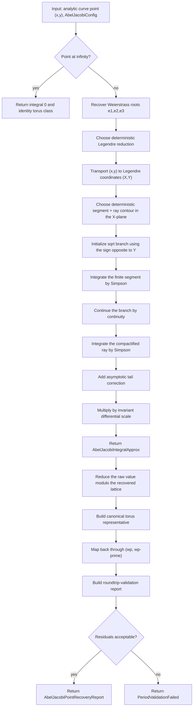

# Abel-Jacobi Inverse Uniformization

Source: [src/elliptic_curves/analytic/inverse_uniformization/abel_jacobi/mod.rs](../../src/elliptic_curves/analytic/inverse_uniformization/abel_jacobi/mod.rs)

This note documents the current implementation of the point-level
inverse-uniformization map $(x,y) \mapsto z \in \mathbf{C}/\Lambda$ through
an Abel-Jacobi integral.

The public entry points are:

- `approximate_abel_jacobi_integral(...)`
- `recover_torus_point_from_curve_point_with_periods(...)`
- `recover_torus_point_from_curve_point(...)`

## Goal

Starting from a point on the analytic Weierstrass curve

$$E : y^2 = 4x^3 - g_2 x - g_3,$$

we want to recover a torus parameter $z$ such that

$$x = \wp(z), \qquad y = \wp'(z),$$

at least approximately and modulo the period lattice $\Lambda$.

The formal inverse is the Abel-Jacobi integral

$$z = \int_x^\infty \frac{dt}{\sqrt{4t^3 - g_2 t - g_3}}.$$

This integral is not single-valued as a bare complex number:

- different contour classes can differ by periods,
- the square root has a sign ambiguity.

So the mathematically honest output is a class in $\mathbb{C}/\Lambda$.

## High-Level Strategy

The implementation does **not** integrate directly in the original $x$-plane.
Instead it:

1. recovers the Weierstrass cubic roots $e_1,e_2,e_3$,
2. chooses the deterministic Legendre reduction already used elsewhere in
   the current analytic inverse direction,
3. transports the point to Legendre coordinates,
4. integrates there along one deterministic contour,
5. rescales back by the invariant differential factor,
6. reduces the resulting complex number modulo the recovered lattice,
7. validates by mapping back through $(\wp,\wp')$.

This keeps the branch locus visible as the normalized set $\{0,1,\lambda,\infty\}$.

## Change Of Variables To Legendre Form

The reduction uses $x = e_2 + (e_1 - e_2)X$ and the corresponding $y$-scaling

$$y = 2\alpha^3 Y, \qquad \alpha = \sqrt{e_1 - e_2}, $$

so that the cubic becomes $Y^2 = X(X - 1)(X - \lambda)$.

The important differential identity is

$$\frac{dx}{y} = \frac{1}{2\alpha}\frac{dX}{Y}.$$

In the implementation this factor is exactly `reduction.invariant_differential_scale()`.

Therefore

$$z = \int_X^\infty \frac{dt}{\sqrt{4t^3-g_2 t-g_3}} = \frac{1}{2\alpha} \int_X^\infty \frac{dU}{\sqrt{U(U-1)(U-\lambda)}}.$$

So the numerical work is concentrated in the Legendre integral.

## Contour Convention

The current implementation exposes an explicit path-strategy enum, but at
present it has one concrete case:

- `CanonicalSegmentThenRay`

That strategy uses one deterministic `segment + ray` contour in the Legendre
$X$-plane.

### Segment

From the input point $X$, draw a straight segment to an anchor point

$$A = R e^{i\theta}.$$

The anchor radius $R$ is chosen from the scale of $X$ and $\lambda$, so the
anchor lies well outside the visible branch locus.

In the current implementation,

$$
R = 4 \cdot \max\!\bigl(|X|, |\lambda|, 1\bigr) + 2.
$$

The omitted distances $|X-1|$ and $|X-\lambda|$ are already controlled, up
to a fixed constant factor, by $|X|$, $|\lambda|$, and $1$, so they are not
needed in this coarse anchor heuristic.

### Ray

From the anchor point $A$, continue along the ray of angle $\theta$:

$$\gamma_{\mathrm{ray}}(r) = A + r e^{i\theta},\qquad r \ge 0.$$

The implementation samples only a finite initial portion of that ray before
switching to the asymptotic tail correction. Its sampled radial extent is

$$L_{\mathrm{tail}} = 4R.$$

For numerical integration, this ray is compactified with the standard map

$$r = \frac{s}{1-s}, \qquad 0 \le s < 1,$$

so the parametrized ray becomes

$$\gamma_{\mathrm{ray}}(s) = A + e^{i\theta}\frac{s}{1-s}.$$

The code samples only a finite prefix $0 \le s \le s_{\max}$ and then adds a
tail correction.

That cutoff is chosen from $L_{\mathrm{tail}}$ via

$$
s_{\max} = \frac{L_{\mathrm{tail}}}{1 + L_{\mathrm{tail}}}.
$$

### Angle Selection

The angle $\theta$ is not arbitrary. The implementation tests a short fixed
list of candidate directions and chooses the one that keeps the sampled contour
farthest from the singular locus $\{0,1,\lambda\}.$

First define

$$
\theta_0 =
\begin{cases}
0, & X = 0, \\
\arg(X), & X \neq 0.
\end{cases}
$$

Then the candidate set is

$$
\Theta =
\left\{
0,\;
\frac{\pi}{2},\;
\pi,\;
-\frac{\pi}{2},\;
\theta_0,\;
\theta_0+\frac{\pi}{4},\;
\theta_0-\frac{\pi}{4},\;
\theta_0+\frac{\pi}{6},\;
\theta_0-\frac{\pi}{6}
\right\}.
$$

For each $\theta \in \Theta$, the code samples the corresponding contour and computes

$$
d(\theta)
=
\min_{z \in \text{sampled contour}}
\min\bigl(
|z|,
|z-1|,
|z-\lambda|
\bigr).
$$

The chosen angle is

$$
\theta_{\mathrm{chosen}}
=
\operatorname*{arg\,max}_{\theta \in \Theta} d(\theta).
$$

The sampling density used for this diagnostic step is configurable:

- `config.segment_samples` controls the finite segment sampling,
- `config.ray_samples` controls the compactified-ray sampling.

These knobs affect contour selection and reporting, not the Simpson
quadrature budget itself.

The contour report stores:

- the selected path strategy,
- the start point $X$,
- the anchor point $A$,
- the chosen angle $\theta$,
- the anchor radius $R$,
- the sampled tail length $L_{\mathrm{tail}}$,
- the minimum sampled distance to the branch locus.

## Branch Initialization And Continuation

The square root in the Legendre model is $\sqrt{X(X - 1)(X - \lambda)}$.

If the transformed point is $(X,Y)$, the branch is initialized using the sign
opposite to $Y$. That convention makes the implemented integral

$$z = \int_x^\infty \frac{dt}{\sqrt{4t^3-g_2 t-g_3}}$$

recover the local uniformization parameter $z$ rather than $-z$.

After that first step, the branch is continued by continuity:

- compute the principal square root at the next sample point,
- compare the two signs $\pm \sqrt{\cdot}$ against the previous branch value,
- keep whichever sign is closer.

## Numerical Quadrature

Both the finite segment and the compactified ray are integrated with composite
Simpson quadrature.

If a path is written as $U = \gamma(s)$, then the integrand is

$$\frac{\gamma'(s)}{\sqrt{\gamma(s)(\gamma(s)-1)(\gamma(s)-\lambda)}}.$$

The algorithm therefore needs two ingredients at each sample node:

- the path point $\gamma(s)$,
- the path derivative $\gamma'(s)$.

For the segment, $\gamma'(s)$ is constant. For the compactified ray,

$$\gamma'(s) = e^{i\theta}(1-s)^{-2}.$$

## Tail Correction

The compactified ray is truncated at a finite endpoint $U_{\mathrm{tail}}$.
The remaining contribution is estimated by the leading asymptotic

$$\frac{1}{\sqrt{U(U-1)(U-\lambda)}} \sim U^{-3/2},$$

which gives the simple correction

$$
\int_{U_{\mathrm{tail}}}^\infty \frac{dU}{\sqrt{U(U-1)(U-\lambda)}}
\approx
\frac{2U_{\mathrm{tail}}} {\sqrt{U_{\mathrm{tail}}(U_{\mathrm{tail}}-1)(U_{\mathrm{tail}}-\lambda)}}.
$$

This is only a first asymptotic correction, but it is enough for the current
educational implementation.

## From Raw Integral To Torus Class

`approximate_abel_jacobi_integral(...)` stops after returning one approximate
complex value in $\mathbf{C}$.

`recover_torus_point_from_curve_point_with_periods(...)` continues:

1. reduce that complex number modulo the recovered lattice,
2. store the canonical torus representative,
3. map it back through $(\wp, \wp')$,
4. build a dedicated roundtrip-validation report,
5. compare the recovered point against the source curve point.

So the final report keeps both:

- the raw complex integral value,
- the reduced torus class in $\mathbf{C}/\Lambda$.
- the successful roundtrip-validation report.

## Special Cases And Current Limits

### Point At Infinity

The point at infinity is treated as the identity torus class, and the integral
is returned exactly as $0$.

### Branch Points

The current implementation rejects points with $y \approx 0$.

Numerically, those are the hardest points because they lie near the branch
locus of the square root. The present surface is honest about that limitation:
it does not pretend that the same quadrature routine handles those cases
robustly.

### Dependence On Config

Finite-point recovery can need a more explicit `AbelJacobiConfig` than the
loosest preset. In particular:

- `integration_steps` controls the actual Simpson quadrature budget,
- `segment_samples` and `ray_samples` control how finely candidate contours
  are scored against the singular locus,
- `legendre_contour_strategy` selects the contour family,
- `validation_policy` independently selects the lattice and elliptic-function
  truncations used in the final roundtrip check.

## Complexity

For `approximate_abel_jacobi_integral(...)`, if

$$
n = \texttt{config.integration\_steps}, \qquad
s = \texttt{config.segment\_samples}, \qquad
r = \texttt{config.ray\_samples},
$$

then the cost is

$$
\Theta(n + s + r).
$$

The $s+r$ term comes from contour scoring across a fixed finite list of
candidate angles, while the $n$ term comes from the two Simpson traversals.

For `recover_torus_point_from_curve_point_with_periods(...)`, the full cost is
$\Theta(n + s + r + r_{\mathrm{inv}}^2 + r_{\mathrm{fun}}^2)$, where:

- $n$ is the Abel-Jacobi quadrature budget,
- $s$ is the segment-side contour-sampling budget,
- $r$ is the ray-side contour-sampling budget,
- $r_{\mathrm{inv}}$ is the lattice-sum truncation used in the final
  validation,
- $r_{\mathrm{fun}}$ is the elliptic-function truncation used in the final
  validation.

The $r^2$ terms come from the existing truncated lattice and elliptic-function
evaluators.

## Flow Diagram

## What Is Mathematically Canonical Here?

The canonical object is the torus class in $\mathbf{C}/\Lambda$.

The raw complex integral value is only a chosen representative, because:

- the contour convention is fixed by the implementation,
- different admissible contour classes can differ by periods.

That is why the public API separates:

- the raw integral approximation,
- the reduced torus representative,
- the final roundtrip-validation report.
