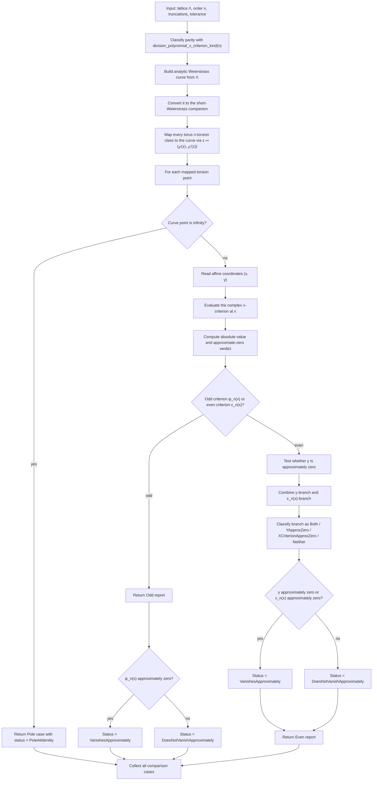

# Analytic Torsion vs Division Polynomial

Source: [src/elliptic_curves/analytic/torsion/division_polynomial.rs](../../src/elliptic_curves/analytic/torsion/division_polynomial.rs)

This comparison pipeline starts from torus `n`-torsion on `ℂ/Λ`, maps each
class to the analytic curve, and then classifies the division-polynomial
comparison by pole / odd / even case.

