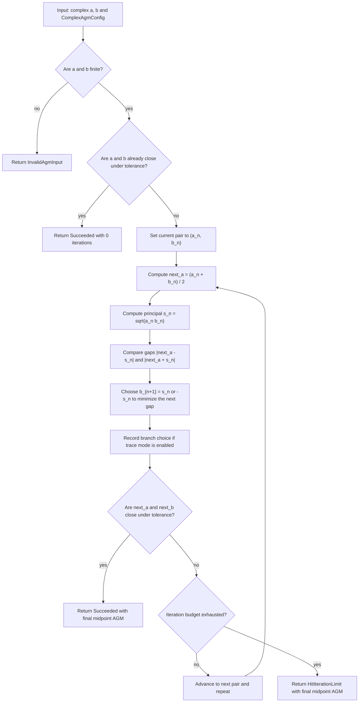

# Complex AGM

Source: [src/elliptic_curves/analytic/periods/agm.rs](../../src/elliptic_curves/analytic/periods/agm.rs)

This note explains the raw complex arithmetic-geometric mean (AGM) primitive
currently used in milestone 9.

The current API is intentionally **lower level** than complete elliptic
integrals. It computes the complex AGM of two inputs `a` and `b`, records the
square-root branch choices if requested, and stops there. It does **not** yet
interpret those inputs as `1` and `sqrt(1-λ)`, nor does it return a value such
as `K(k)`.

## High-Level Idea

Given two complex numbers `a_0` and `b_0`, the AGM iteration repeatedly forms

- `a_{n+1} = (a_n + b_n) / 2`
- `b_{n+1} = ± sqrt(a_n b_n)`

In the real positive case, one chooses the positive square root and the
iteration converges to the classical AGM.

In the complex case, the geometric mean is not single-valued because
`sqrt(a_n b_n)` has two signs. So the implementation must choose a sign at
every step.

## Current Branch Rule

The current implementation uses the principal complex square root as a
reference:

- first compute `s_n = sqrt(a_n b_n)` on the principal branch
- then compare the two candidates `s_n` and `-s_n`
- choose the one that minimizes
  `|a_{n+1} - b_{n+1}| = |(a_n + b_n)/2 - b_{n+1}|`

So the step is designed to make the next pair as close as possible.

If the two candidate gaps are exactly tied, the principal branch is preferred.
This gives a deterministic algorithm instead of leaving the sign ambiguous.

## Why The Branch Choice Matters

Without a branch rule, the complex AGM would not be a well-defined numerical
routine. Different sign choices can send the iteration down different paths.

The current rule is local and pragmatic:

- it does not claim to be the only mathematically meaningful continuation
- it does give a deterministic educational primitive
- it tends to keep the two sequences moving toward each other as directly as
  possible

That makes it a good fit for later milestone-9 work, where we want a stable
building block before layering on Legendre normalization and elliptic
integrals.

## Result Surface

The module exposes two companion entry points:

- `complex_agm(a, b, config)`:
  returns only the final result bundle
- `complex_agm_trace(a, b, config)`:
  returns the full per-step trace plus the same final result

The final result records:

- the original inputs `a` and `b`
- the terminal status
- the number of iterations used
- the final pair `(a_n, b_n)`
- the final gap norm `|a_n - b_n|`
- the reported AGM value

The reported AGM value is the symmetric midpoint

`agm = (final_a + final_b) / 2`.

This avoids privileging either side of the final pair when the run stops with
`a_n` and `b_n` only approximately equal.

## Trace Surface

The educational trace records, for every step:

- the input pair `(a_n, b_n)`
- the principal square root `sqrt(a_n b_n)`
- whether the principal sign or the negated sign was selected
- the chosen geometric mean
- the next arithmetic mean
- the next gap norm

## Stopping Rule

The run stops when `a_n` and `b_n` are close under the shared
`ApproxTolerance` policy:

- absolute tolerance stabilizes near-zero comparisons
- relative tolerance handles larger scales

If the initial inputs are already close, the algorithm succeeds immediately
with zero recorded iterations.

If the inputs are still not close after the configured iteration budget is
exhausted, the run returns status `HitIterationLimit` rather than raising an
error.

This is intentional:

- “did not converge within the budget” is different from
  “the input was invalid”

## Input Validation

The raw AGM primitive currently rejects non-finite complex inputs.

So if either input contains `NaN` or `∞`, the algorithm returns
`InvalidAgmInput`.

This keeps the failure mode specific to the primitive instead of collapsing it
into a broad generic numerical error.

## Config Layering

The module uses a dedicated `ComplexAgmConfig` rather than reusing the full
`PeriodRecoveryConfig` directly.

That separation matters because the raw AGM only needs:

- one tolerance
- one iteration budget

It does **not** need:

- Newton iteration limits
- Abel-Jacobi integration steps
- branch-lattice search radii

The current API therefore lets callers derive
`ComplexAgmConfig::from_period_recovery_config(...)` when they want consistency
with a larger milestone-9 configuration, while still keeping the primitive
itself mathematically narrow.

## Flow Diagram

## Complexity

If the configured iteration budget is `N`, the run is `Θ(N)`.

Each step performs only `Θ(1)` complex arithmetic:

- one multiplication
- one square root
- a few additions/subtractions
- a few norm computations

## Appendix: Why The Good Branch Choice Forces A Common Limit

Here is the standard convergence proof behind the complex AGM with a coherent
branch rule.

We consider the iteration

$$
a_{n+1} = \frac{a_n+b_n}{2},
\qquad
b_{n+1} = \pm \sqrt{a_n b_n},
$$

and at each step choose the sign so that

$$
\lvert a_{n+1}-b_{n+1}\rvert \le \lvert a_{n+1}+b_{n+1}\rvert.
$$

This is exactly the “good pair” condition. It means we choose the sign of the
square root so that the next arithmetic and geometric means are as close as
possible.

### Step 1: A Good Sign Always Exists

Fix one step and write

$$
u = \frac{a_n+b_n}{2}
$$

and let

$$
c = \sqrt{a_n b_n}
$$

be one of the two square roots of $a_n b_n$.

Then the only two possible choices for $b_{n+1}$ are $c$ and $-c$.

But replacing $c$ by $-c swaps the two quantities

$$\lvert u - c \rvert \qquad\text{and}\qquad \lvert u + c \rvert.$$

So at least one of the two choices satisfies $\lvert u-c\rvert \le \lvert u+c\rvert$,
and therefore a good branch choice is always available.

### Step 2: The Key Algebraic Identity

Define

$$
d_n := a_n-b_n.
$$

Then

$$
(a_{n+1}-b_{n+1})(a_{n+1}+b_{n+1})
= a_{n+1}^2-b_{n+1}^2.
$$

Since $b_{n+1}^2 = a_n b_n$, we get

$$
\begin{aligned}
a_{n+1}^2-b_{n+1}^2
&=
\left(\frac{a_n+b_n}{2}\right)^2-a_n b_n \\
&=
\frac{a_n^2+2a_n b_n+b_n^2-4a_n b_n}{4} \\
&=
\frac{(a_n-b_n)^2}{4} \\
&=
\frac{d_n^2}{4}.
\end{aligned}
$$

So the iteration always satisfies

$$
(a_{n+1}-b_{n+1})(a_{n+1}+b_{n+1}) = \frac{d_n^2}{4}.
$$

Taking absolute values,

$$
\lvert a_{n+1}-b_{n+1}\rvert
\lvert a_{n+1}+b_{n+1}\rvert
= \frac{\lvert d_n\rvert^2}{4}.
$$

### Step 3: The Difference Contracts By At Least A Factor Of 2

By the good-branch condition,

$$
\lvert a_{n+1}-b_{n+1}\rvert \le \lvert a_{n+1}+b_{n+1}\rvert.
$$

Therefore

$$
\lvert a_{n+1}-b_{n+1}\rvert^2
\le
\lvert a_{n+1}-b_{n+1}\rvert
\lvert a_{n+1}+b_{n+1}\rvert
= \frac{\lvert d_n\rvert^2}{4}.
$$

Hence

$$
\lvert d_{n+1}\rvert \le \frac{\lvert d_n\rvert}{2}.
$$

Iterating this estimate gives

$$
\lvert d_n\rvert \le \frac{\lvert d_0\rvert}{2^n},
$$

so

$$
a_n-b_n \to 0.
$$

This is the core mechanism: the correct branch choice makes the gap shrink
geometrically.

### Step 4: The Arithmetic Means Form A Cauchy Sequence

Now compare successive arithmetic iterates:

$$a_{n+1}-a_n = \frac{a_n+b_n}{2}-a_n = -\frac{a_n-b_n}{2} = -\frac{d_n}{2}.$$

So

$$\lvert a_{n+1}-a_n\rvert = \frac{\lvert d_n\rvert}{2} \le \frac{\lvert d_0\rvert}{2^{n+1}}.$$

The series

$$\sum_{n\ge 0} \lvert a_{n+1}-a_n\rvert$$

is therefore bounded by a convergent geometric series. Hence $a_n$ is a
Cauchy sequence in $\mathbb{C}$. Because $\mathbb{C}$ is complete, $a_n$ converges.

### Step 5: The Geometric Means Converge To The Same Limit

Finally,

$$b_n = a_n - d_n.$$

We already know:

- $a_n$ converges
- $d_n \to 0$

Therefore $b_n$ also converges, and both sequences have the same limit.

So under the good branch rule,

$$\lim a_n = \lim b_n.$$

That common limit is the complex AGM of the initial pair.
