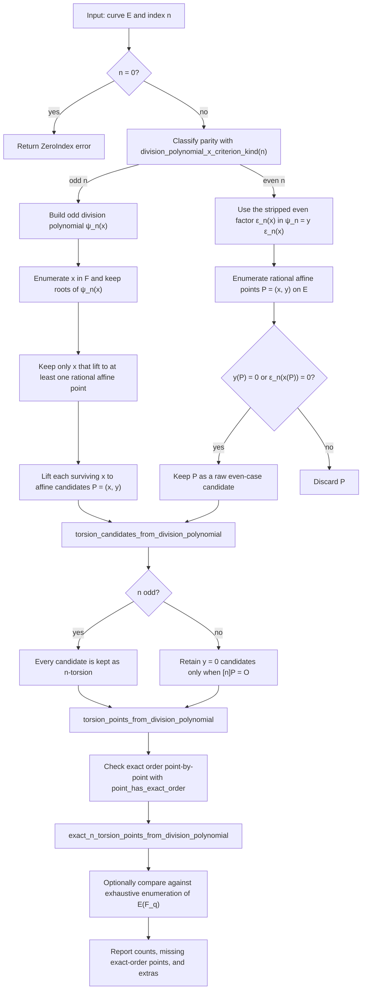

# Division-Polynomial Torsion Pipeline

Source: [src/elliptic_curves/division_polynomials/torsion.rs](../../src/elliptic_curves/division_polynomials/torsion.rs)

This is the main pedagogical division-polynomial pipeline: start from an index `n`,
dispatch by parity, build rational candidates, then refine them into actual
`n`-torsion and exact-order-`n` points, with an optional comparison against
exhaustive enumeration.

