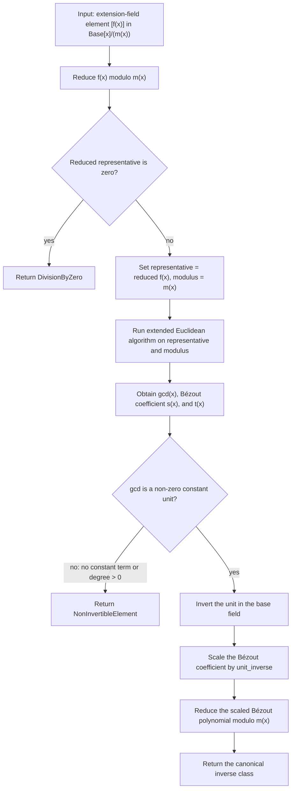

# Extension-Field Inversion

Source: [src/fields/extension_field.rs](../../../src/fields/extension_field.rs)

This is the type-level field-family version: the ambient modulus lives in the
`ExtensionFieldSpec`, while each element stores only its quotient
representative.

