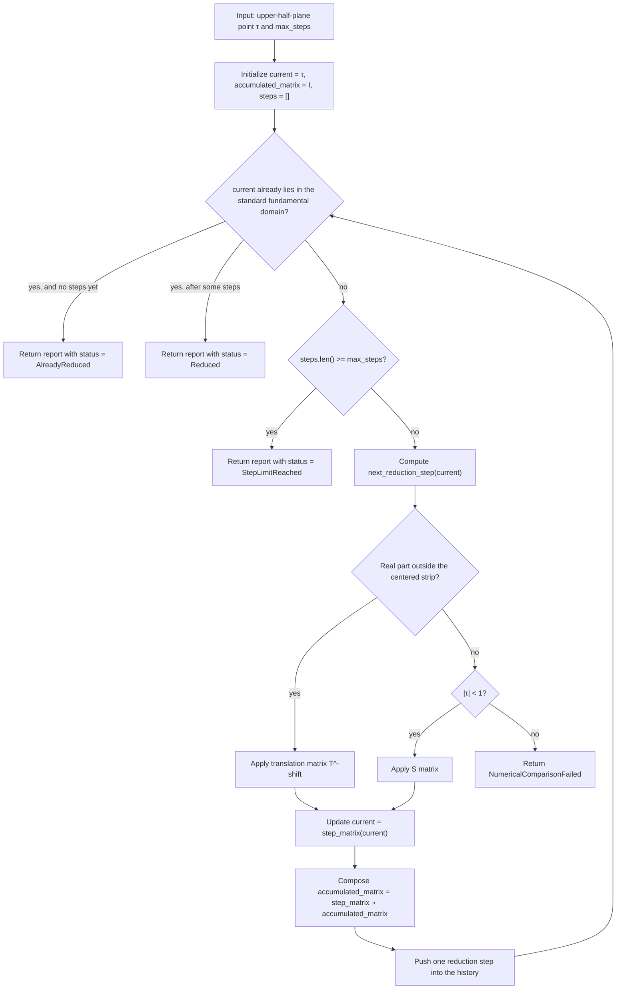

# Fundamental Domain Reduction

Source: [src/elliptic_curves/analytic/fundamental_domain.rs](../../src/elliptic_curves/analytic/fundamental_domain.rs)

This is the iterative modular-reduction loop for `τ ∈ ℍ`. The current
implementation alternates between two educational moves:

- translate by an integer to enter the centered strip
- apply `S(τ) = -1/τ` when `|τ| < 1`

and records every step together with the accumulated modular matrix.

