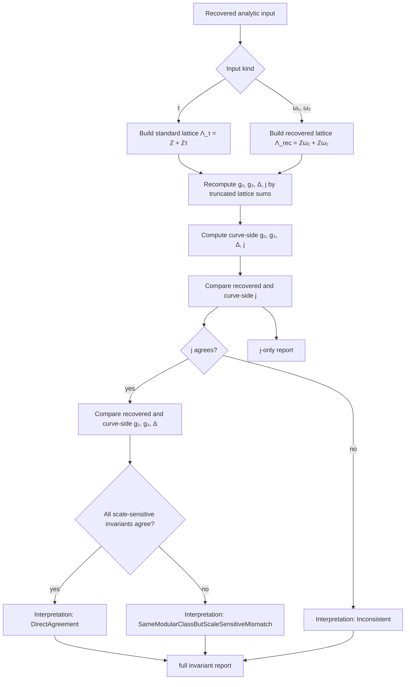

# Invariant-Recovery Validation

This note documents the two inverse-uniformization validation helpers added in
milestone 9:

- `validate_recovered_tau_by_j_invariant(...)`
- `validate_recovered_lattice_invariants(...)`

Both start from recovered analytic data and push it back toward the target
curve:

- either a recovered upper-half-plane parameter $\tau$
- or a recovered period basis $(ω₁, ω₂)$ and lattice $Λ_{rec} = ℤω₁ + ℤω₂$

The point is to answer two slightly different mathematical questions:

1. Did we recover the correct modular class?
2. Did we also recover the correct scale-sensitive normalization?

## Mathematical background

For a lattice $Λ ⊂ ℂ$, the classical analytic invariants are

- $g₂(Λ)$
- $g₃(Λ)$
- $Δ(Λ) = g₂(Λ)^3 - 27 g₃(Λ)^2$
- $j(Λ) = 1728 g₂(Λ)^3 / Δ(Λ)$

If a Weierstrass curve is written as

$$E : y^2 = 4x^3 - g_2 x - g_3,$$

then an analytically matching lattice should reproduce those same invariants.

But there is one crucial subtlety: if we scale the lattice by a nonzero
complex number $α$, then

$$\Lambda' = \alpha \Lambda,$$

and the invariants transform by weights:

$$
g_2(\Lambda') = \alpha^{-4} g_2(\Lambda),
\qquad
g_3(\Lambda') = \alpha^{-6} g_3(\Lambda),
\qquad
\Delta(\Lambda') = \alpha^{-12} \Delta(\Lambda),
\qquad
j(\Lambda') = j(\Lambda).
$$

- $g₂$, $g₃$, and $Δ$ are scale-sensitive
- $j$ is homothety-invariant

## The `j`-only validation

`validate_recovered_tau_by_j_invariant(...)` answers only the first question:

> does the recovered $τ$ define a torus in the same modular class as the
> target curve?

Algorithm:

1. Build the standard lattice $Λ_τ = ℤ + ℤτ$.
2. Recompute $g₂(Λ_τ), g₃(Λ_τ), Δ(Λ_τ), j(Λ_τ)$ by finite lattice sums.
3. Compute the curve-side $j(E)$.
4. Compare $j(Λ_τ)$ against $j(E)$.

This is deliberately robust to global rescaling, because $j$ ignores that
scale.

## The full invariant validation

`validate_recovered_lattice_invariants(...)` answers both questions.

Algorithm:

1. Start from the recovered period basis $(ω₁, ω₂)$.
2. Form the recovered lattice
   $Λ_{rec} = ℤω₁ + ℤω₂$.
3. Recompute $g₂(Λ_{rec}), g₃(Λ_{rec}), Δ(Λ_{rec}), j(Λ_{rec})$.
4. Compare each of those against the curve-side values.
5. Classify the outcome.

The report uses three interpretations:

- `DirectAgreement`
  Means $g₂$, $g₃$, $Δ$, and $j$ all agree directly.
- `SameModularClassButScaleSensitiveMismatch`
  Means $j$ agrees but at least one of $g₂$, $g₃, or $Δ$ does not.
  This is the characteristic “right modular class, wrong homothety
  normalization” outcome.
- `Inconsistent`
  Means even $j$ fails to agree, so the recovered lattice is not numerically
  describing the same modular class.

## Complexity

In both helpers, the dominant work is recomputing truncated Eisenstein sums on
one lattice. If `r` is the square-box lattice truncation radius, then the complexity is $\Theta(r^2)$.

## Diagram

