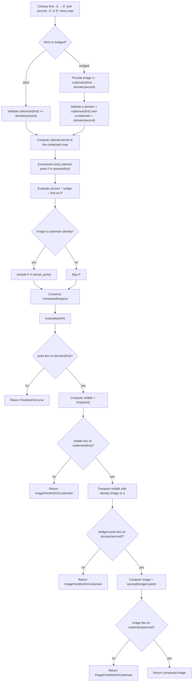

# Isogeny Composition

Source: [src/isogenies/composition.rs](../../../src/isogenies/composition.rs)

The composition surface supports two pedagogical modes:

- strict composition, where `codomain(first) = domain(second)` exactly
- bridged composition, where an explicit middle isomorphism transports the
  raw middle image onto the second map's chosen domain

