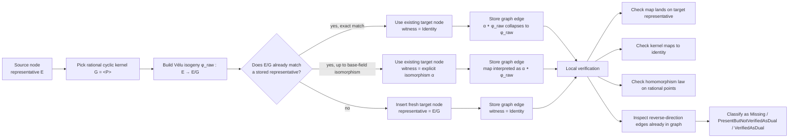

# Isogeny Graph Scaffolding

Source: [src/isogenies/graphs](../../src/isogenies/graphs)

This note was previously stored as `src/isogenies/graphs/README.md`.

This directory contains the educational `\ell`-isogeny graph scaffolding for
small short-Weierstrass curves over prime fields.

The key modeling choice is that each node stores one chosen representative
curve, while each edge stores:

- a rational cyclic kernel on the source representative
- the directed source and target node ids
- an optional witness transporting the raw Vélu codomain onto the stored
  target representative

That separation keeps two different notions visible:

- the codomain curve produced directly by Vélu from a kernel
- the representative curve chosen for the target node after deduplication

In other words, the graph stores representatives and witnesses explicitly so
that later summaries and local verification can reason about the maps that
actually connect the stored nodes, not just about abstract isomorphism classes.
