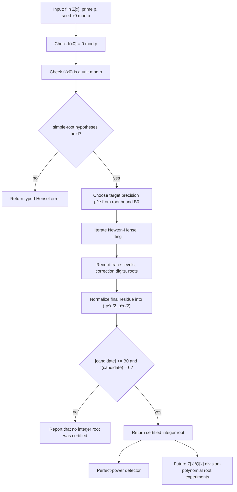

# Integer Root Finding Via Hensel Lifting

Source:
[src/numerics/hensel/integer_roots/mod.rs](../../../src/numerics/hensel/integer_roots/mod.rs)

This note fixes the first integration boundary for the root-finding-over-`Z`
workflow from MIT 18.783 Problem Set 2, Problem 5. The intended story is:

1. start with a polynomial `f in Z[x]` and a simple root `x0 mod p`;
2. lift the root p-adically by Newton/Hensel iteration;
3. recover the unique small integer representative when a root bound certifies
   uniqueness;
4. reuse that exact integer-root primitive for perfect powers and later for
   division-polynomial experiments.

The first executable milestone should stay inside `numerics`, because this is
shared exact arithmetic rather than a curve-specific operation or a new
polynomial representation. The current polynomial layer intentionally keeps
`DensePolynomial` focused on coefficient fields, while the existing Hensel
module already owns exact integer-polynomial congruence helpers.

## First-Milestone Scope

The first version should cover only the simple-root case:

1. `p` is prime;
2. `f(x0) = 0 mod p`;
3. `f'(x0)` is invertible modulo `p`;
4. a caller supplies, or the API derives, a bound `B0` for the target integer
   root;
5. the final result is certified by evaluating `f(r) = 0` over the integers.

This matches the existing Hensel posture: exact, crate-internal, trace-oriented,
and honest about the simple-root precondition.

## Explicit Non-Goals

The first milestone should not attempt:

1. singular Hensel lifting when `f'(x0) = 0 mod p`;
2. complete factorization over `Z[x]`;
3. a broad public API for polynomial algorithms;
4. a general `DensePolynomial<BigInt>` or ring-polynomial abstraction;
5. replacing finite-field enumeration in the current division-polynomial torsion
   pipeline.

Those are all plausible later directions, but none is needed to integrate the
exercise's main algorithm honestly.

## Integration Path

1. Add a focused integer-root submodule under `src/numerics/hensel/`.
2. Build a small reusable search/report surface for roots in `Z[x]`.
3. Add `src/numerics/perfect_powers/` on top of that root primitive.
4. Wire an optional internal route into exact `Q`/primitive-integer polynomial
   workflows only after the root primitive has tests.
5. Add a later educational division-polynomial example over `Z[x]` or `Q[x]`
   without changing the finite-field torsion enumeration story.

The current implementation has completed the first two items: callers can lift
one supplied simple seed, or scan every residue modulo one chosen prime up to an
explicit scan limit and receive a report of certified roots, singular seeds, and
simple seeds that did not certify an integer root.

## Verification Expectations

Early tests should cover:

1. successful recovery of a known integer root from a simple modular seed;
2. rejection when the seed is not a root modulo `p`;
3. rejection when the derivative is singular modulo `p`;
4. a bound too small to certify the lifted representative;
5. final integer evaluation as the root certificate.
