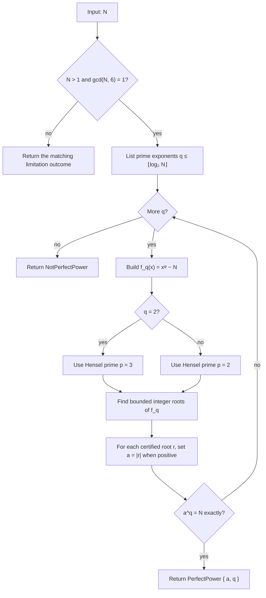

# Perfect-Power Detection Via Hensel

Source:
[src/numerics/perfect_powers/mod.rs](../../../src/numerics/perfect_powers/mod.rs)

This staged detector handles positive integers `N` with `gcd(N, 6) = 1`. It
tests prime exponents `q ≤ ⌊log₂ N⌋` by converting the question `N = aᵠ` into
the integer-root problem

`f_q(x) = xᵠ − N`.

For each exponent, it uses the integer-root Hensel surface to certify candidate
bases, then performs the final exact check `aᵠ = N`.

The small-prime choice keeps the simple-root Hensel route honest in this staged
setting. When `N` is coprime to `6`, any genuine base `a` is a unit modulo `2`
and `3`; choosing `p = 3` for `q = 2` and `p = 2` for odd prime `q` ensures
`p ∤ q`, so `q·a^(q−1)` is non-zero modulo `p`.

Complexity: let `n = ⌈log₂ N⌉` and let `M(n)` be the cost of multiplying
`n`-bit integers. The detector tests `π(n) = Θ(n/log n)` prime exponents. For one
exponent `q`, the sparse polynomial `xᵠ − N` has `O(1)` terms, evaluation costs
`O(log q · M(n))`, and the Hensel precision is `Θ(n/q)`. Summing over prime
`q ≤ n` gives `O(n log n · M(n))` bit operations, plus lower-order sieve and
exact-power-check work. With quasi-linear integer multiplication, this is
quasi-quadratic in `n`.
