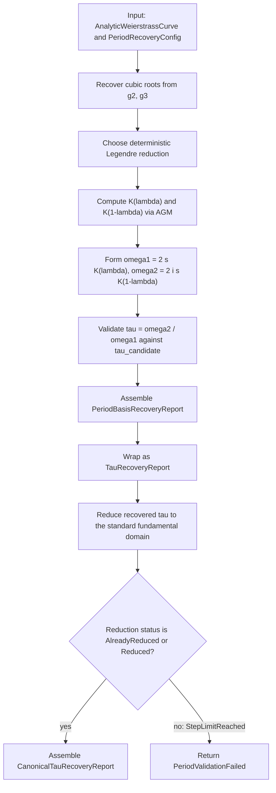

# Period-Basis And Canonical-`τ` Recovery

Source: [src/elliptic_curves/analytic/periods/period_basis.rs](../../src/elliptic_curves/analytic/periods/period_basis.rs)

This note explains the current milestone-9 recovery surfaces that sit on top
of cubic-root recovery, Legendre reduction, and complete elliptic integrals.

The public API now deliberately separates three layers:

- `recover_period_basis(...)`
- `recover_tau_from_curve(...)`
- `recover_canonical_tau_from_curve(...)`

That separation is mathematical, not merely ergonomic.

## Three Different Questions

### 1. Which period basis did the algorithm recover?

This is answered by `recover_period_basis(...)`.

It returns one concrete positively oriented basis

$$
\Lambda = \mathbf{Z}\omega_1 + \mathbf{Z}\omega_2
$$

for the recovered lattice.

This basis is valid, but not canonical: replacing it by another
`SL_2(\mathbf{Z})`-equivalent basis gives the same lattice class.

### 2. Which modular parameter does that recovered basis induce?

This is answered by `recover_tau_from_curve(...)`.

Given the recovered basis, it forms

$$
\tau = \omega_2 / \omega_1.
$$

This is the **natural recovered** modular parameter attached to the chosen
basis. It is still not canonical modulo `SL_2(\mathbf{Z})`.

### 3. Which canonical representative of that modular class should we show?

This is answered by `recover_canonical_tau_from_curve(...)`.

It first recovers the natural `τ`, then reduces it to the classical standard
fundamental domain.

So the canonical report keeps both values visible:

- the natural recovered `τ`
- the canonically reduced representative

and also stores the accumulated modular matrix `γ` relating them.

## Period Recovery Step

Once Legendre reduction has produced

$$
Y^2 = X(X-1)(X-\lambda),
$$

and the invariant differential scale satisfies

$$
\frac{dx}{y} = s \,\frac{dX}{Y},
$$

the current implementation uses

$$
\omega_1 = 2 s K(\lambda),
\qquad
\omega_2 = 2 i s K(1-\lambda).
$$

From these, it forms

$$
\tau = \omega_2 / \omega_1.
$$

The code checks that this ratio agrees numerically with the already computed
Legendre-side quantity

$$
\tau_{\mathrm{cand}} = i\,\frac{K(1-\lambda)}{K(\lambda)}.
$$

## Canonicalization Step

The canonicalization layer does **not** change how periods are recovered.

Instead, once a natural `τ` is available, it runs the already existing
fundamental-domain reduction routine and obtains a report with:

- `original_tau`
- `reduced_tau`
- `accumulated_matrix`
- `steps`
- `status`

So if the report succeeds, it certifies

$$
\tau_{\mathrm{canonical}} = \gamma(\tau_{\mathrm{natural}})
$$

for the accumulated modular matrix `γ`.

## Why This Is Better Than Folding Everything Into One Function

If `recover_tau_from_curve(...)` silently returned only a reduced
representative, users would lose the connection to the actual recovered basis.

That would blur two different notions:

- “the `τ` induced by this recovered basis”
- “a canonical modular representative of the same class”

Keeping those separate makes the library more honest and easier to learn from.

## Config Knob

`PeriodRecoveryConfig` now includes an explicit modular-reduction budget:

- `fundamental_domain_reduction_max_steps()`

This budget is used only by `recover_canonical_tau_from_curve(...)`.

If the reduction routine hits that step limit before reaching the standard
fundamental domain, the canonical recovery surface returns
`PeriodValidationFailed` rather than claiming success.

## Flow Diagram

## Complexity

Let

- `n = config.newton_max_iterations()`
- `a = config.agm_max_iterations()`
- `m = config.fundamental_domain_reduction_max_steps()`

Then:

- `recover_period_basis(...)` is `Θ(n + a)`
- `recover_tau_from_curve(...)` is also `Θ(n + a)`
- `recover_canonical_tau_from_curve(...)` is `Θ(n + a + m)`

In practice, the root recovery and AGM work dominate, while the modular
reduction stage is usually tiny.
