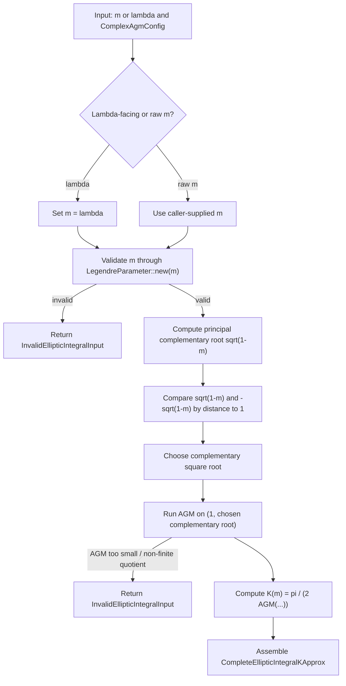
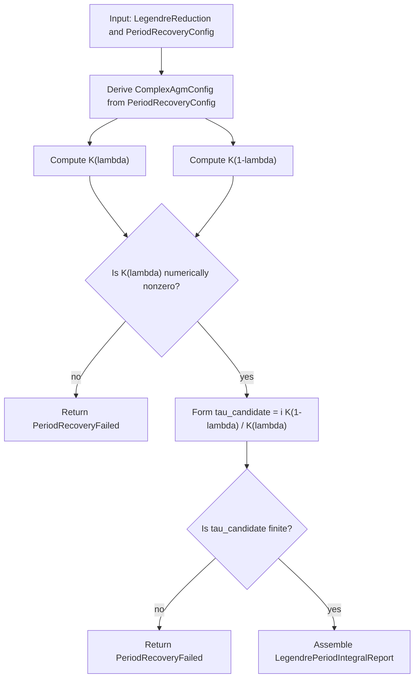

# Complete Elliptic Integral `K` Via AGM

Source: [src/elliptic_curves/analytic/periods/elliptic_integral.rs](../../../src/elliptic_curves/analytic/periods/elliptic_integral.rs)

This note explains the current algorithm for approximating the
complete elliptic integral of the first kind $K(m)$, using the complex AGM.

The same module also exposes the Legendre-facing wrappers

- `complete_elliptic_integral_k_from_lambda(...)`
- `complementary_complete_elliptic_integral_k_from_lambda(...)`
- `legendre_period_integral_report(...)`

so this note also explains how those surfaces sit on top of the basic
$K(m)$ computation.

## High-Level Formula

The algorithm uses the classical identity

$$K(m) = \frac{\pi}{2\,\operatorname{AGM}(1,\sqrt{1-m})}.$$

Here:

- $m$ is the raw parameter, often written $k^2$
- $\text{AGM}$ is the arithmetic-geometric mean
- $\sqrt(1-m)$ is the complementary square root that must be given a branch

## Public API Layers

The current public API has four entry points:

- `complete_elliptic_integral_k_from_m(m, config)`
- `complete_elliptic_integral_k_from_lambda(parameter, config)`
- `complementary_complete_elliptic_integral_k_from_m(m, config)`
- `complementary_complete_elliptic_integral_k_from_lambda(parameter, config)`

Their roles are:

- `from_m` is the low-level analytic surface
- `from_lambda` is the Legendre-aware wrapper using `m = \lambda`
- `complementary_from_m` computes `K(1-m)`
- `complementary_from_lambda` computes `K(1-\lambda)`

This keeps the complement explicit in the API instead of silently replacing the
parameter inside a less specific function name.

## Parameter Validation

Before running the AGM, the implementation validates $m$ by requiring that it
already define a finite nonsingular Legendre parameter. The code uses
`LegendreParameter::new(m)` for this validation.

## Choosing The Complementary Square Root

The selected complementary root is the one that makes the initial AGM pair $(1,\sqrt{1-m})$
as “close” as possible right from the start.

This is fully parallel to the branch-choice philosophy already used in the raw
complex AGM module.

## Running The AGM

Once the complementary root has been chosen, the implementation computes

$$\operatorname{AGM}(1,\sqrt{1-m}).$$

The elliptic-integral layer then forms

$$K(m) = \frac{\pi}{2\,\operatorname{AGM}(1,\sqrt{1-m})}.$$

If the AGM value is numerically too close to zero, or the resulting quotient is
not finite, the code returns `InvalidEllipticIntegralInput`.

## Complementary Integral

The complementary integral is computed by replacing $m$ with $1-m$.
This is why the API exposes the complementary functions directly instead of
forcing callers to manually write $1-\lambda$ everywhere. So:

$$K_{\mathrm{comp}}(m) := K(1-m).$$

In the Legendre-facing notation, this becomes

$$K_{\mathrm{comp}}(\lambda) := K(1-\lambda).$$

## Flow Diagram

For the report layer:

## Complexity

Let `N` be the AGM iteration budget in `ComplexAgmConfig`. Then:

- one `K(m)` computation is `Θ(N)`
- one `K(\lambda)` plus one `K(1-\lambda)` report is also `Θ(N)`

because each AGM step is `Θ(1)` and the report performs only a constant number
of additional complex arithmetic operations outside those AGM runs.
