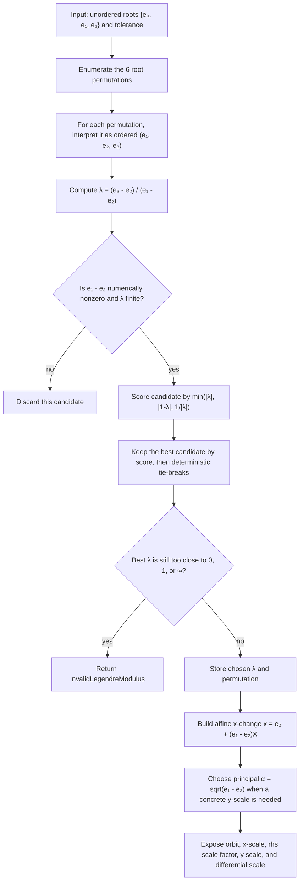

# Legendre Reduction From Weierstrass Roots

Source: [src/elliptic_curves/analytic/periods/legendre.rs](../../../src/elliptic_curves/analytic/periods/legendre.rs)

This note explains the current reduction from a Weierstrass cubic

`y² = 4(x - e₁)(x - e₂)(x - e₃)`

to a Legendre-normalized cubic

`Y² = X(X - 1)(X - λ)`.

The key subtlety is that an unordered root triple does not determine a unique
`λ`. Instead, it determines a six-element orbit under permutation of the roots.

## High-Level Idea

For one ordered triple `(e₁, e₂, e₃)`, define

- `λ = (e₃ - e₂) / (e₁ - e₂)`
- `x = e₂ + (e₁ - e₂) X`

Then `4(x - e₁)(x - e₂)(x - e₃) = 4(e₁ - e₂)^3 X(X - 1)(X - λ)`, so the `x`-side normalization is affine and explicit.

To obtain a concrete `Y` coordinate, the current implementation obtains
`sqrt(4(e₁ - e₂)^3)` in the following way:

- `a = e₁ - e₂`
- `α = sqrt(a)` using the principal complex square-root branch
- `y = 2 α^3 Y`

Then `(2 α^3)^2 = 4 a^3`, so again `Y² = X(X - 1)(X - λ)`.

## The Orbit Problem

If the input roots are unordered, permuting them changes `λ` by one of the six
classical transforms

- `λ`
- `1 - λ`
- `1 / λ`
- `1 / (1 - λ)`
- `(λ - 1) / λ`
- `λ / (λ - 1)`

Those six values form the `S₃` orbit of the same Legendre class.

## Full Permutation Table

Starting from one ordered triple `(e₁, e₂, e₃)` with

`λ = (e₃ - e₂) / (e₁ - e₂)`,

the six reorderings give the following transforms:

| Ordered triple used by the formula | Permutation of the original labels | Resulting Möbius transform |
| --- | --- | --- |
| `(e₁, e₂, e₃)` | identity | `λ` |
| `(e₂, e₁, e₃)` | swap `(12)` | `1 - λ` |
| `(e₃, e₂, e₁)` | swap `(13)` after relabeling | `1 / λ` |
| `(e₁, e₃, e₂)` | swap `(23)` | `λ / (λ - 1)` |
| `(e₂, e₃, e₁)` | cycle `(123)` | `(λ - 1) / λ` |
| `(e₃, e₁, e₂)` | cycle `(132)` | `1 / (1 - λ)` |

So the same unordered cubic produces six formally different Legendre
parameters, but they all belong to the same `S₃` orbit.

## What `S₃` Is Doing

The group `S₃` acts by permuting the three roots. The key point is that
`λ = (e₃ - e₂) / (e₁ - e₂)` depends on an **ordered** triple `(e₁, e₂, e₃)`.

So when a permutation `σ ∈ S₃` changes the ordering, it generally changes the
numerical value of `λ`. That change is not arbitrary: it is always one of six
specific Möbius transforms.

The three basic transpositions already generate all of them:

- swap `e₁` and `e₂`:
  `λ ↦ 1 - λ`
- swap `e₁` and `e₃`:
  `λ ↦ 1 / λ`
- swap `e₂` and `e₃`:
  `λ ↦ λ / (λ - 1)`

Composing those transpositions gives the other three transforms:

- `1 / (1 - λ)`
- `(λ - 1) / λ`
- `λ`

So the orbit is the image of the full permutation group of the three roots.

## Why This Still Represents One Geometric Object

All six orbit values describe the same Legendre class in the following sense:

- they come from the same cubic after only re-labeling the roots
- the affine normalization sends different roots to the distinguished points
  `0`, `1`, and `λ` in different ways
- the underlying elliptic curve does not change, only the chosen Legendre
  coordinate does

That is why this module keeps two layers separate:

1. `LegendreParameterOrbit`, which records the whole `S₃` family
2. one deterministic chosen representative, used for downstream computation

## Generic And Special Orbits

For a generic value of `λ`, the orbit has six **distinct** complex numbers.

But special symmetric values can collapse several orbit labels to the same
number. For example:

- if `λ = 1/2`, then `1 - λ = λ`
- if `λ = -1`, then `1 / λ = λ`
- if `λ` satisfies extra modular symmetry, more coincidences can appear

This does **not** mean the `S₃` action disappeared. It means the parameter has
a nontrivial stabilizer: different permutations can act by the same numerical
transform on that special value.

That is why the implementation keeps both:

- the orbit **label** (`Lambda`, `OneMinusLambda`, etc.)
- the resulting complex number

even though those can coincide numerically in symmetric cases.

## What Changes And What Does Not

When we permute the input roots, the following pieces **can change**:

- the caller-visible stored root order
- the raw formula-level value of `λ` attached to that order
- the orbit label relative to the caller input order
- the selected permutation used internally by the reduction

The following pieces are intended to **stay the same** under permutation:

- the underlying cubic `4(x-e₁)(x-e₂)(x-e₃)`
- the six-element `S₃` orbit as a set of Legendre representatives
- the deterministic chosen representative used by `LegendreReduction::from_roots(...)`
- the conditioning class and the singularity-distance score of that chosen representative

Pedagogically, this is the main lesson of the module: a Legendre parameter is
not an intrinsic label of an unordered root set, but the Legendre **class**
still is.

## Current Selection Rule

The current implementation does two different but compatible things:

1. `LegendreParameterOrbit` stores the whole six-element orbit explicitly.
2. `LegendreReduction::from_roots(...)` chooses one deterministic
   representative for computational work.

The deterministic selector scans all six root permutations, computes the
corresponding six candidate `λ` values, and chooses the one maximizing

`min(|λ|, |1 - λ|, 1 / |λ|)`.

This favors candidates far from the singular Legendre locus `{0, 1, ∞}`.
Ties are broken by:

1. smaller `|λ|`
2. smaller real part
3. smaller imaginary part

In other words, the current report should be read as:

- “this representative was preferred because it maximized distance from the bad Legendre locus”
- “if several candidates were tied numerically, the implementation still picks one deterministically”

That makes the API stable for downstream experiments without pretending that
the chosen `λ` is canonical in a modular-theoretic sense.

## Why Controlled Rejection Is Mathematically Correct

Two rejection modes are especially important here:

- If two roots are approximately equal under the chosen tolerance, then the
  formula `λ = (e₃ - e₂) / (e₁ - e₂)` becomes numerically dishonest because
  the denominator is approximately zero.
- If the analytic invariants produce discriminant `Δ ≈ 0`, then the cubic is
  near the singular locus of Weierstrass models and should not be treated as a
  stable elliptic curve input.

These are not “annoying edge-case failures”. They are the code honestly
refusing to normalize an object that is too close to degenerating.

## Flow Diagram

## Complexity

The reduction is `Θ(1)`.

## Mini Glossary

- **Repeated root**: a pair of roots with `eᵢ = eⱼ`; geometrically this means
  the cubic is singular rather than elliptic.
- **Approximately repeated root**: a numerically repeated pair under the chosen
  tolerance; this is enough to make the Legendre denominator unstable.
- **Depressed cubic**: a cubic with vanishing `x²` term. For
  `4(x-e₁)(x-e₂)(x-e₃)`, this is the relation `e₁ + e₂ + e₃ = 0`.
- **Singular Legendre locus `{0, 1, ∞}`**: the bad parameter values where the
  Legendre cubic `X(X-1)(X-λ)` degenerates.
- **`S₃` orbit**: the six Legendre parameters obtained by permuting the three
  roots and recomputing the same formula for `λ`.
- **Principal branch**: the standard library choice of complex square root used
  here to define a concrete `y` scale and invariant-differential scale.
