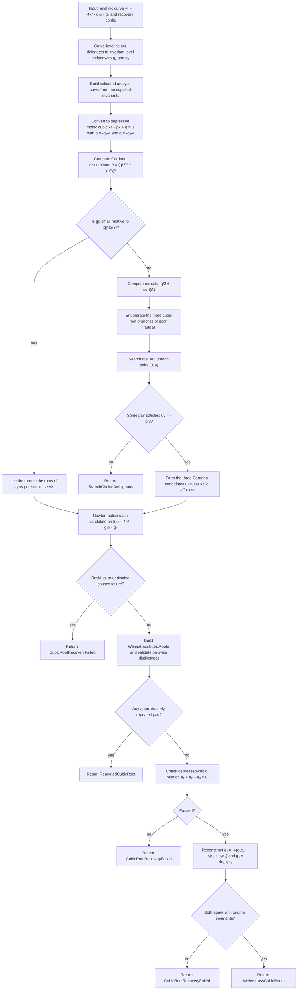

# Weierstrass Cubic-Root Recovery

Source: [src/elliptic_curves/analytic/periods/recovery.rs](../../../src/elliptic_curves/analytic/periods/recovery.rs)

This note explains the current recovery pipeline behind
`recover_weierstrass_cubic_roots(...)` and
`recover_weierstrass_cubic_roots_from_invariants(...)`.

The goal is to recover approximate roots `e_1, e_2, e_3` such that `4x^3 - g_2 x - g_3 = 4(x - e_1)(x - e_2)(x - e_3)`.

Because the cubic is already in depressed form, the implementation starts from
an algebraic closed-form seed and then numerically polishes the candidates
with Newton iteration.

## High-Level Idea

Starting from the analytic curve `y^2 = 4x^3 - g_2 x - g_3`, divide the cubic equation by `4` and rewrite it as
`x^3 + px + q = 0`, where

- `p = -g_2 / 4`
- `q = -g_3 / 4`

In the generic regime, Cardano’s ansatz writes a root as `x = u + v` with

- `u^3 = -q/2 + sqrt((q/2)^2 + (p/3)^3)`
- `v^3 = -q/2 - sqrt((q/2)^2 + (p/3)^3)`

Over `C`, each nonzero complex number has three cube roots, so the generic
Cardano path cannot blindly take one principal branch and hope for the best.
Instead, it enumerates all three branches for `u` and all three branches for
`v`, then chooses a pair satisfying the consistency relation `uv ≈ -p/3`.

Once one consistent pair `(u, v)` is found, the three Cardano roots are

- `u + v`
- `ωu + ω^2 v`
- `ω^2 u + ωv`

with `ω = exp(2πi/3)`.

There is one important numerical exception. When `|p|` is tiny compared with
the natural pure-cubic scale `|q|^{2/3}`, strict Cardano branch matching can
be less stable than the limiting equation itself. In that regime the
implementation switches to the simpler approximation

- `x^3 + q = 0`
- `x^3 = -q`

and uses the three cube roots of `-q` as the initial seeds.

All algebraic seeds, whether they came from Cardano or from the near-pure-
cubic shortcut, are then polished by Newton iteration on
`f(x) = 4x^3 - g_2 x - g_3`.

Concretely, the current implementation monitors the dimensionless ratio

- `|p| / |q|^(2/3)`

and compares it against a deliberately coarse tolerance-derived threshold

- `tol_*^(1/4)`
- `tol_* = max(abs_tol, rel_tol, ε_machine)`

This is a heuristic switch, not a proof that `p = 0`. Its purpose is only to
detect when Newton seeded from `x^3 = -q` is numerically more trustworthy than
strict Cardano branch matching.

## Flow Diagram

## Why The Validation Matters

The raw algebraic formulas produce candidates, but the implementation
still validates them numerically for three reasons.

1. Complex cube roots are branch-dependent.
   On the generic Cardano path, picking inconsistent branches for `u` and `v`
   can break the identity
   `uv = -p/3`, so the resulting `u + v` would not actually solve the cubic.

2. Floating-point roundoff perturbs exact algebraic identities.
   Even when the correct branch pair is chosen, or when the pure-cubic seeds
   are the right asymptotic starting point, the initial candidates may be only
   approximate, especially after square-root and cube-root evaluation.

3. Distinct roots are part of the non-singular story.
   A repeated root would mean the cubic is colliding with a singular regime,
   so the constructor explicitly rejects approximately repeated triples.

The explicit check `e_1 + e_2 + e_3 ≈ 0` is mathematically the same as
verifying that the `x^2` coefficient vanishes, which is the signature of a
depressed cubic. It is a cheap structural sanity check that the recovered
triple still matches the original shape of `4x^3 - g_2 x - g_3`.

## Newton Polishing

Each algebraic candidate is refined with Newton iteration applied to

- `f(x) = 4x^3 - g_2 x - g_3`
- `f'(x) = 12x^2 - g_2`

The iteration stops successfully when either

- the residual is already approximately zero, or
- the Newton step becomes tiny and the post-step residual is approximately
  zero.

It fails if

- the derivative becomes approximately zero before convergence, or
- the iteration budget in `config.newton_max_iterations()` is exhausted
  without reaching an approximate root.

## Error Surface

The current recovery path can fail through these mathematically meaningful
errors:

- `BranchChoiceAmbiguous` if no branch pair satisfies `uv ≈ -p/3`
- `CubicRootRecoveryFailed` if Newton polishing or final validation fails
- `RepeatedCubicRoot` if the final triple is approximately non-distinct

In the near-pure-cubic shortcut, the algorithm never asks the
`uv ≈ -p/3` question at all, so there the branch-ambiguity failure mode is
intentionally bypassed.

The invariant-level helper may also fail earlier if `g_2, g_3` do not define
a valid non-singular analytic Weierstrass curve.

## Complexity

The implementation documents complexity as `Θ(n)` where `n = config.newton_max_iterations()`.
That estimate comes from:

- constant work to compute `p`, `q`, and the discriminant
- constant work to either inspect the near-pure-cubic criterion or search the
  `3 × 3` Cardano branch pairs
- at most `3n` Newton updates, one lane for each root candidate

So asymptotically the Newton polishing phase dominates the recovery routine.
