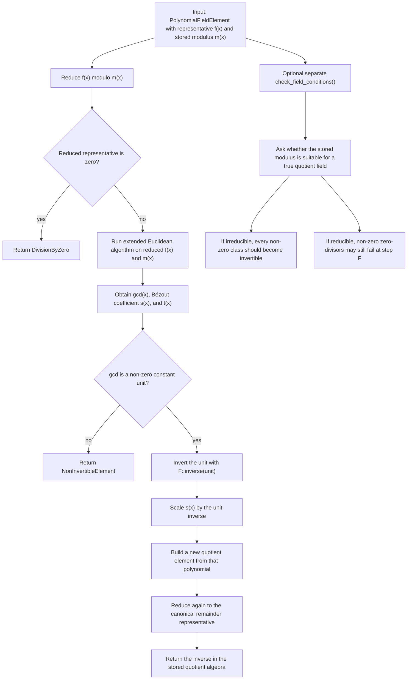

# Polynomial-Field Inversion

Source: [src/fields/polynomial_field.rs](../../src/fields/polynomial_field.rs)

This follows the same Euclidean idea as the static extension-field path, but
the value carries its own modulus. That makes the distinction between

- a general quotient algebra element, and
- an element of a true quotient field when the modulus is irreducible

more visible at the value layer.

