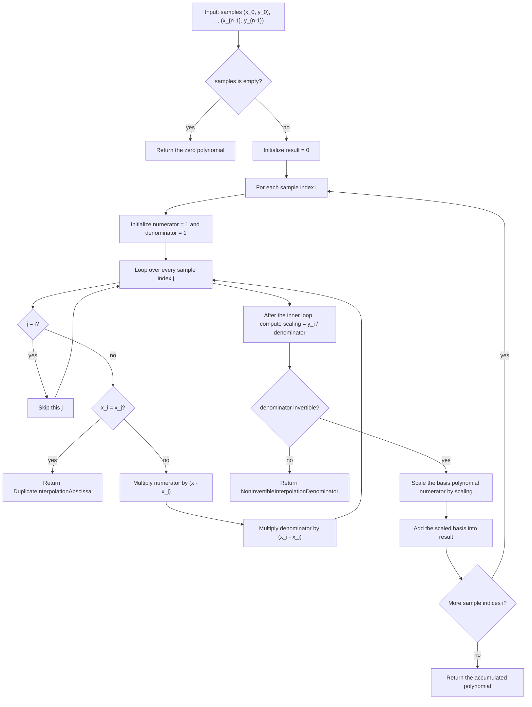

# Lagrange Interpolation

Source: [src/polynomials/interpolation.rs](../../../src/polynomials/interpolation.rs)

This is the current direct educational interpolation routine: for each sample
point, build one Lagrange basis polynomial explicitly, scale it by `y_i`, and
accumulate it into the final result.

