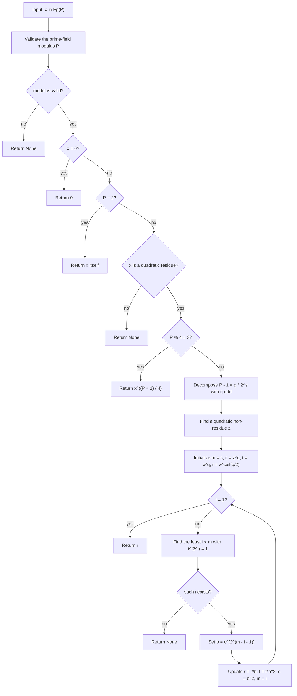

# Prime-Field Square Root

Source: [src/fields/prime_field.rs](../../src/fields/prime_field.rs)

This is the current exact prime-field square-root routine. It handles the
small easy cases directly, rejects non-residues honestly, uses the
`p % 4 == 3` shortcut when available, and otherwise falls back to the full
Tonelli–Shanks loop.

