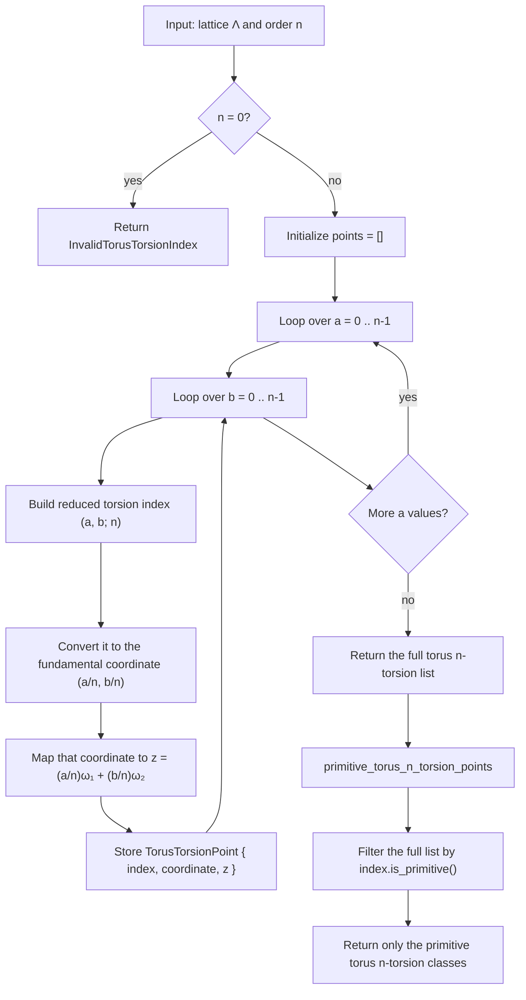

# Torus N-Torsion Enumeration

Source: [src/elliptic_curves/analytic/torsion/torus.rs](../../src/elliptic_curves/analytic/torsion/torus.rs)

These helpers materialize the reduced `n × n` torsion grid in lexicographic
order, and optionally filter it to the primitive classes of exact torus order
`n`.

