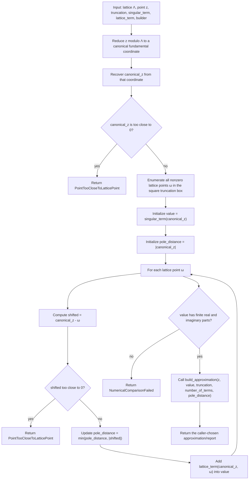

# Truncated Elliptic-Function Evaluator

Source: [src/elliptic_curves/analytic/elliptic_functions/evaluator.rs](../../src/elliptic_curves/analytic/elliptic_functions/evaluator.rs)

This is the shared reduction-and-summation pipeline behind the current
truncated analytic elliptic-function evaluations.

