This file is a merged representation of the entire codebase, combined into a single document by Repomix.
The content has been processed where content has been compressed (code blocks are separated by ⋮---- delimiter).

# File Summary

## Purpose
This file contains a packed representation of the entire repository's contents.
It is designed to be easily consumable by AI systems for analysis, code review,
or other automated processes.

## File Format
The content is organized as follows:
1. This summary section
2. Repository information
3. Directory structure
4. Repository files (if enabled)
5. Multiple file entries, each consisting of:
  a. A header with the file path (## File: path/to/file)
  b. The full contents of the file in a code block

## Usage Guidelines
- This file should be treated as read-only. Any changes should be made to the
  original repository files, not this packed version.
- When processing this file, use the file path to distinguish
  between different files in the repository.
- Be aware that this file may contain sensitive information. Handle it with
  the same level of security as you would the original repository.

## Notes
- Some files may have been excluded based on .gitignore rules and Repomix's configuration
- Binary files are not included in this packed representation. Please refer to the Repository Structure section for a complete list of file paths, including binary files
- Files matching patterns in .gitignore are excluded
- Files matching default ignore patterns are excluded
- Content has been compressed - code blocks are separated by ⋮---- delimiter
- Files are sorted by Git change count (files with more changes are at the bottom)

# Directory Structure
```
docs/
  algorithm-diagrams/
    analytic/
      analytic-torsion-vs-division-polynomial.md
      fundamental-domain-reduction.md
      torus-n-torsion-enumeration.md
      truncated-elliptic-function-evaluator.md
    fields/
      extension-field-inversion.md
      polynomial-field-inversion.md
      prime-field-square-root.md
    inverse_uniformization/
      abel-jacobi-inverse-uniformization.md
      invariant-recovery-validation.md
    isogenies/
      isogeny-composition.md
      isogeny-graph-scaffolding.md
    periods/
      complete-elliptic-integral-k-via-agm.md
      complex-agm.md
      legendre-reduction-from-weierstrass-roots.md
      period-basis-and-canonical-tau-recovery.md
      weierstrass-cubic-root-recovery.md
    polynomials/
      division-polynomial-torsion-pipeline.md
      lagrange-interpolation.md
    README.md
  examples/
    complex_torsion.md
  frobenius-torsion-and-orbits.md
examples/
  complex_torsion.rs
  complex_torus.rs
  curve_order.rs
  division_polynomials.rs
  dual_isogeny.rs
  frobenius_verschiebung.rs
  frobenius.rs
  fundamental_domain.rs
  general_weierstrass.rs
  group_order_algorithms.rs
  group_structure.rs
  isogeny_graph.rs
  isomorphism.rs
  legendre-reduction.rs
  montgomery.rs
  pairing_style_fp12_tower.rs
  period_recovery.rs
  point_roundtrip.rs
  projective_general_weierstrass.rs
  projective_short_weierstrass.rs
  root_recovery.rs
  schoof_large_prime.rs
  velu_isogeny.rs
  weierstrass_p.rs
proptest-regressions/
  elliptic_curves/
    division_polynomials/
      tests.txt
  polynomials/
    interpolation.txt
src/
  elliptic_curves/
    analytic/
      eisenstein/
        api.rs
        mod.rs
        tests.rs
        types.rs
      elliptic_functions/
        evaluator.rs
        mod.rs
        p_derivative.rs
        p.rs
        tests.rs
        traits.rs
        truncation.rs
      fundamental_domain/
        api.rs
        mod.rs
        tests.rs
        types.rs
      invariants/
        api.rs
        mod.rs
        special_values.rs
        tests.rs
        value.rs
      inverse_uniformization/
        abel_jacobi/
          api.rs
          config.rs
          contour.rs
          integration.rs
          mod.rs
          report.rs
          roundtrip_validation.rs
        j_validation/
          api.rs
          mod.rs
          report.rs
        lattice_invariants/
          api.rs
          mod.rs
          report.rs
        mod.rs
        tests.rs
        validation_shared.rs
      lattice/
        basis.rs
        context.rs
        coordinates.rs
        mod.rs
        points.rs
        tests.rs
        torus.rs
        truncation.rs
        types.rs
      modular_action/
        invariance.rs
        matrix.rs
        mod.rs
        tests.rs
      periods/
        elliptic_integral/
          agm.rs
          k.rs
          mod.rs
          period_report.rs
        legendre/
          candidate.rs
          conditioning.rs
          mod.rs
          orbit.rs
          parameter.rs
          reduction.rs
          report.rs
        period_basis/
          basis_report.rs
          canonical_tau_report.rs
          internal.rs
          lattice.rs
          mod.rs
          recovery.rs
          tau_report.rs
          validation.rs
          value.rs
        root_recovery/
          api.rs
          internal.rs
          mod.rs
          report.rs
        roots/
          classification.rs
          mod.rs
          value.rs
        tests/
          agm.rs
          config.rs
          elliptic_integral.rs
          end_to_end.rs
          metadata_and_lattice.rs
          mod.rs
          period_basis.rs
          root_recovery.rs
          roots_and_legendre.rs
        config.rs
        metadata.rs
        mod.rs
      q_expansion/
        coefficients.rs
        comparison.rs
        eisenstein_series.rs
        family.rs
        j_invariant.rs
        mod.rs
        q_parameter.rs
        tests.rs
        truncation.rs
      torsion/
        curve_map.rs
        division_polynomial.rs
        mod.rs
        tests.rs
        torus.rs
        types.rs
      uniformization/
        differential_equation.rs
        experiment.rs
        forward_map.rs
        mod.rs
        tests.rs
      weierstrass_model/
        curve.rs
        membership.rs
        mod.rs
        short_model.rs
        tests.rs
      zeta/
        api.rs
        mod.rs
        tests.rs
        value.rs
      AGENTS.md
      errors.rs
      mod.rs
      upper_half_plane.rs
    endomorphisms/
      candidate_sets/
        candidate_set.rs
        local_view.rs
        mod.rs
        report.rs
        volcanic_level.rs
      quadratic_orders/
        cover_relation.rs
        discriminant.rs
        error.rs
        factorization.rs
        mod.rs
        order.rs
      mod.rs
      tests.rs
    frobenius/
      characteristic_equation/
        curve_model.rs
        mod.rs
        report.rs
        tests.rs
      hasse/
        search/
          benchmarks.rs
          bsgs.rs
          config.rs
          curve_model.rs
          mod.rs
          naive.rs
          report.rs
        bound.rs
        interval.rs
        mod.rs
        tests.rs
      invariants/
        characteristic_polynomial.rs
        curve_type.rs
        discriminant.rs
        mod.rs
        tests.rs
        trace.rs
        zeta.rs
      schoof/
        report/
          crt.rs
          group_order.rs
          mod.rs
          mod2.rs
          odd_prime.rs
        mod.rs
        tests.rs
      torsion/
        matrix/
          basis.rs
          coordinate_table.rs
          curve_model.rs
          error.rs
          matrix_mod_n.rs
          mod.rs
          report.rs
          tests.rs
        mod.rs
        points_report.rs
        tests.rs
      character_sum.rs
      extension_counts.rs
      group_order.rs
      metadata.rs
      mod.rs
      orbit.rs
      quadratic_twist.rs
      tests.rs
    group_algorithms/
      cyclic_primary_order.rs
      mod.rs
      small_finite_api.rs
    models/
      general_weierstrass/
        projective/
          tests/
            api.rs
            mod.rs
          conversion.rs
          costs.rs
          group_law.rs
          mod.rs
        tests/
          api_wrappers.rs
          basics.rs
          compatibility.rs
          finite_compatibility.rs
          group_law_examples.rs
          group_law_properties.rs
          mod.rs
          point_lifting.rs
          reduction.rs
          shared.rs
          y_fiber.rs
        y_fiber/
          curve.rs
          equation.rs
          error.rs
          mod.rs
          solvers.rs
        api.rs
        display.rs
        group_law.rs
        invariants.rs
        membership.rs
        mod.rs
        model_traits.rs
        reduction.rs
        roadmap.md
        type_definition.rs
      montgomery/
        tests/
          api_wrappers.rs
          basics.rs
          compatibility.rs
          differential_arithmetic.rs
          enumeration.rs
          finite_compatibility.rs
          group_law_examples.rs
          group_law_properties.rs
          ladder.rs
          mod.rs
          normalization.rs
          point_lifting.rs
          reduction.rs
          shared.rs
          x_coordinates.rs
        api.rs
        differential_arithmetic.rs
        display.rs
        group_law.rs
        invariants.rs
        ladder.rs
        membership.rs
        mod.rs
        model_traits.rs
        normalization.rs
        reduction.rs
        roadmap.md
        type_definition.rs
        x_coordinates.rs
      short_weierstrass/
        curve/
          frobenius_actions/
            mod.rs
            orbits.rs
            relative.rs
            twists.rs
          tests/
            benchmarks.rs
            construction.rs
            enumeration.rs
            finite_group_structure.rs
            group_law.rs
            invariants.rs
            isomorphisms.rs
            mod.rs
            order_from_multiple.rs
            point_lifting.rs
            point_membership.rs
            properties.rs
            shared.rs
          display.rs
          function_field_bridge.rs
          invariants.rs
          mod.rs
          model_traits.rs
          twists_and_scalings.rs
          type_definition.rs
        division_polynomials/
          construction/
            api.rs
            base_cases.rs
            mod.rs
            recursive_construction.rs
          tests/
            construction_tests.rs
            evaluation_tests.rs
            mod.rs
            properties.rs
            shared.rs
            torsion_search_tests.rs
          torsion_search/
            mod.rs
            point_candidates.rs
            torsion_validation.rs
            x_candidates.rs
          comparison.rs
          criterion_dispatch.rs
          error.rs
          evaluation.rs
          mod.rs
          torsion_report.rs
          types.rs
        function_fields/
          field/
            ambient.rs
            embedding.rs
            generic_point_actions.rs
            generic_point.rs
            mod.rs
          point/
            conversion.rs
            group_law.rs
            mod.rs
            type_definition.rs
            validation.rs
          tests/
            field_tests.rs
            frobenius_tests.rs
            isogeny_pullback_tests.rs
            mod.rs
            point_tests.rs
            shared.rs
            value_tests.rs
          value/
            arithmetic.rs
            constructors.rs
            frobenius.rs
            internal.rs
            mod.rs
            substitution.rs
            trait_impls.rs
            type_definition.rs
          mod.rs
        group_exponent/
          tests/
            accumulation_tests.rs
            mod.rs
            shared.rs
            verification_tests.rs
          accumulation.rs
          api.rs
          mod.rs
          report.rs
          strategy.rs
          verification.rs
        group_law_core/
          formulas/
            mod.rs
            reconstruction.rs
            slope.rs
          mod.rs
          ops.rs
          point.rs
          runner.rs
          tests.rs
        group_order/
          mestre/
            api.rs
            finalize.rs
            loop_logic.rs
            mod.rs
            setup.rs
            side_helpers.rs
          tests/
            api_tests.rs
            benchmarks.rs
            mestre_tests.rs
            mod.rs
            schoof_tests.rs
            shared.rs
          api.rs
          mod.rs
          quadratic_character.rs
        isogenies/
          frobenius/
            verschiebung/
              certificate.rs
              isogeny.rs
              mod.rs
            absolute.rs
            duality_report.rs
            frobenius_like.rs
            mod.rs
            relative.rs
            report.rs
            shared.rs
            tests.rs
          function_field_maps/
            map.rs
            mod.rs
            report.rs
            tests.rs
          velu/
            dual/
              mod.rs
              search.rs
              tests.rs
              type_definition.rs
              verification.rs
            codomain.rs
            constructors.rs
            evaluation.rs
            function_fields.rs
            kernel_data.rs
            mod.rs
            reports.rs
            trait_impls.rs
          curve_api.rs
          mod.rs
        isomorphisms/
          error.rs
          mod.rs
          scaling.rs
          tests.rs
          twist.rs
        point_order/
          from_multiple/
            api.rs
            engine.rs
            mod.rs
            reports.rs
            validation.rs
          tests/
            exhaustive_tests.rs
            mod.rs
            route_tests.rs
            shared.rs
            strategy_tests.rs
          api.rs
          mod.rs
          reports.rs
          strategies.rs
          tests_support.rs
        projective/
          tests/
            api.rs
            mod.rs
          conversion.rs
          costs.rs
          group_law.rs
          mod.rs
        schoof/
          quotient_ring/
            context.rs
            mod.rs
            partial_inverse.rs
            tests.rs
            value.rs
          addition.rs
          additive_result.rs
          api.rs
          characteristic_equation.rs
          endomorphism.rs
          frobenius.rs
          mod.rs
          scalar_mul.rs
        enumerable.rs
        frobenius_torsion.rs
        group_law.rs
        group_order_parity.rs
        mod.rs
      traits/
        affine.rs
        big_scalar_group.rs
        conversion.rs
        explicit_subgroup.rs
        finite.rs
        frobenius.rs
        group.rs
        isomorphism.rs
        j_invariant.rs
        mod.rs
        model.rs
        projective.rs
      twisted_edwards/
        invariants.rs
        mod.rs
        tests.rs
        type_definition.rs
      mod.rs
    affine.rs
    AGENTS.md
    error.rs
    mod.rs
    projective.rs
  fields/
    extension_field/
      element.rs
      field.rs
      macros.rs
      mod.rs
      spec.rs
      tests.rs
      traits.rs
    rational_function_field/
      field.rs
      mod.rs
      tests.rs
      value.rs
    traits/
      ambient_field.rs
      artin_schreier.rs
      cbrt_field.rs
      enumerative_finite_field.rs
      field.rs
      finite_field.rs
      mod.rs
      pth_root_extraction.rs
      quadratic_character.rs
      sqrt_field.rs
    AGENTS.md
    complex_approx.rs
    error.rs
    finite_field_descriptor.rs
    mod.rs
    polynomial_field.rs
    prime_field.rs
    rationals.rs
  isogenies/
    composition/
      tests/
        bridged.rs
        mod.rs
        properties.rs
        shared.rs
        strict.rs
      bridge.rs
      composed_isogeny.rs
      evaluation.rs
      kernel.rs
      mod.rs
    dual_report/
      build.rs
      mod.rs
      report.rs
      summaries.rs
      tests.rs
    frobenius_relation/
      graph_report.rs
      isogeny.rs
      mod.rs
      tests.rs
      types.rs
    graphs/
      builder/
        builder.rs
        mod.rs
        short_weierstrass.rs
        storage.rs
        tests.rs
      endomorphisms/
        edge_relation.rs
        graph_endomorphism_report.rs
        mod.rs
        node_candidates.rs
        volcano_report.rs
      connected_components.rs
      cycles.rs
      edge.rs
      error.rs
      mod.rs
      node.rs
      torsion.rs
      verification.rs
      volcano.rs
      weak_graph.rs
    kernel/
      description/
        kernel_description.rs
        mixed.rs
        mod.rs
        nonreduced.rs
        reduced.rs
      constructors.rs
      kernel.rs
      mod.rs
      tests.rs
    scalar_multiplication/
      function_fields/
        mod.rs
        pullback.rs
        verschiebung.rs
      tests/
        basic.rs
        function_fields.rs
        kernel_structure.rs
        mod.rs
        shared.rs
        verschiebung.rs
      characteristic_factorization.rs
      isogeny.rs
      kernel_structure.rs
      mod.rs
    traits/
      degree_factorized.rs
      isogeny.rs
      mod.rs
      tests.rs
      verifiable.rs
    velu/
      core.rs
      mod.rs
      tests.rs
    AGENTS.md
    comparison.rs
    error.rs
    isomorphism_isogeny.rs
    mod.rs
  numerics/
    AGENTS.md
    bernoulli.rs
    chinese_remainder.rs
    comparison.rs
    complex_algebra.rs
    complex_path.rs
    euclidean_division.rs
    gcd.rs
    integer_arithmetic.rs
    linear_recurrence.rs
    mod.rs
    number_theory.rs
    prime_powers.rs
    sigma.rs
    simpson.rs
    tolerance.rs
  polynomials/
    dense/
      arithmetic.rs
      conversions.rs
      division.rs
      evaluation.rs
      interpolation.rs
      irreducibility.rs
      mod.rs
      tests.rs
      trait_impls.rs
      type_definition.rs
    irreducibility/
      algebraically_closed.rs
      backend.rs
      mod.rs
      prime_fields.rs
      rationals.rs
      status.rs
      tests.rs
    multivariate/
      arithmetic.rs
      evaluation.rs
      mod.rs
      monomial.rs
      tests.rs
      type_definition.rs
    sparse/
      arithmetic.rs
      conversions.rs
      evaluation.rs
      mod.rs
      tests.rs
      trait_impls.rs
      type_definition.rs
    AGENTS.md
    error.rs
    mod.rs
    traits.rs
  proptest_support/
    elliptic_curves/
      analytic.rs
      division_polynomials.rs
      endomorphisms.rs
      frobenius.rs
      function_fields.rs
      general_weierstrass.rs
      mod.rs
      montgomery.rs
      points.rs
      projective.rs
      short_weierstrass.rs
    fields/
      complex.rs
      extension.rs
      families.rs
      mod.rs
      prime.rs
      rational_function.rs
      rational.rs
    isogenies/
      composition.rs
      function_field_maps.rs
      isomorphisms.rs
      kernels.rs
      mod.rs
      velu.rs
    polynomials/
      dense.rs
      mod.rs
      multivariate.rs
      shared.rs
      sparse.rs
    combinators.rs
    config.rs
    mod.rs
    tests.rs
  visualization/
    elliptic_curves/
      analytic/
        curve.rs
        formatting.rs
        inverse_uniformization.rs
        lattice.rs
        mod.rs
        modular.rs
        periods.rs
        tests.rs
        torsion.rs
      AGENTS.md
      division_polynomial.rs
      endomorphisms.rs
      frobenius.rs
      function_fields.rs
      general_weierstrass.rs
      isomorphism.rs
      mod.rs
      montgomery.rs
      projective.rs
      short_weierstrass.rs
    fields/
      complex_approx.rs
      extension_field.rs
      mod.rs
      polynomial_field.rs
      prime_field.rs
      pth_root.rs
      rational_function_field.rs
      rationals.rs
      sqrt_field.rs
      traits.rs
    isogenies/
      derived_maps.rs
      frobenius_factorization.rs
      function_field_maps.rs
      graph.rs
      mod.rs
      velu.rs
    polynomials/
      dense.rs
      division.rs
      evaluation.rs
      gcd.rs
      interpolation.rs
      irreducibility.rs
      mod.rs
      multivariate.rs
      sparse.rs
      traits.rs
    AGENTS.md
    mod.rs
    traits.rs
  lib.rs
.gitignore
AGENTS.md
Cargo.toml
clippy.toml
LICENSE
README.md
rust-toolchain.toml
rustfmt.toml
twisted-edwards-plan.md
```

# Files

## File: src/elliptic_curves/analytic/q_expansion/q_parameter.rs
````rust
use num_complex::Complex64;
⋮----
use crate::elliptic_curves::analytic::UpperHalfPlanePoint;
⋮----
/// The classical modular parameter `q = e^{2π i τ}`
/// attached to a point `τ` in the upper half-plane.
⋮----
/// attached to a point `τ` in the upper half-plane.
///
⋮----
///
/// This is the small complex parameter used in Fourier and `q`-expansions of
⋮----
/// This is the small complex parameter used in Fourier and `q`-expansions of
/// modular forms and elliptic functions. Since `Im(τ) > 0`, its absolute value
⋮----
/// modular forms and elliptic functions. Since `Im(τ) > 0`, its absolute value
/// satisfies `|q| = e^{-2π Im(τ)} < 1`,
⋮----
/// satisfies `|q| = e^{-2π Im(τ)} < 1`,
/// so `q` always lies strictly inside the open unit disc.
⋮----
/// so `q` always lies strictly inside the open unit disc.
#[derive(Clone, Debug, PartialEq)]
pub struct ModularQParameter {
⋮----
impl ModularQParameter {
/// Builds the modular parameter `q = e^{2π i τ}` from a validated
    /// upper-half-plane point `τ`.
⋮----
/// upper-half-plane point `τ`.
    ///
⋮----
///
    /// This stores both `τ` and the derived `q` so later `q`-expansion
⋮----
/// This stores both `τ` and the derived `q` so later `q`-expansion
    /// routines can report their analytic input and the actual small
⋮----
/// routines can report their analytic input and the actual small
    /// parameter they used.
⋮----
/// parameter they used.
    pub fn from_tau(tau: UpperHalfPlanePoint) -> ModularQParameter {
⋮----
pub fn from_tau(tau: UpperHalfPlanePoint) -> ModularQParameter {
let q = (Complex64::new(0.0, std::f64::consts::TAU) * *tau.tau()).exp();
⋮----
/// Returns the upper-half-plane parameter `τ` used to build this `q`.
    pub fn tau(&self) -> &UpperHalfPlanePoint {
⋮----
pub fn tau(&self) -> &UpperHalfPlanePoint {
⋮----
/// Returns the complex modular parameter `q = e^{2π i τ}`.
    pub fn q(&self) -> &Complex64 {
⋮----
pub fn q(&self) -> &Complex64 {
⋮----
/// Returns the complex absolute value `|q|`.
    ///
⋮----
///
    /// For `τ ∈ ℍ`, this equals `e^{-2π Im(τ)}` and is therefore always
⋮----
/// For `τ ∈ ℍ`, this equals `e^{-2π Im(τ)}` and is therefore always
    /// strictly smaller than `1`.
⋮----
/// strictly smaller than `1`.
    pub fn absolute_value(&self) -> f64 {
⋮----
pub fn absolute_value(&self) -> f64 {
self.q.norm()
````

## File: src/elliptic_curves/analytic/q_expansion/truncation.rs
````rust
use crate::elliptic_curves::analytic::AnalyticCurveError;
⋮----
/// Truncation policy for short educational `q`-expansions.
///
⋮----
///
/// The stored `terms` counts how many coefficients from the chosen family are
⋮----
/// The stored `terms` counts how many coefficients from the chosen family are
/// retained in order, starting from that family's first exponent.
⋮----
/// retained in order, starting from that family's first exponent.
///
⋮----
///
/// Examples:
⋮----
/// Examples:
///
⋮----
///
/// - for `E₄(q) = 1 + 240q + 2160q² + ...`, `terms = 1` means only the
⋮----
/// - for `E₄(q) = 1 + 240q + 2160q² + ...`, `terms = 1` means only the
///   constant term `1`
⋮----
///   constant term `1`
/// - for `j(q) = q^{-1} + 744 + 196884q + ...`, `terms = 2` means `q^{-1} + 744`
⋮----
/// - for `j(q) = q^{-1} + 744 + 196884q + ...`, `terms = 2` means `q^{-1} + 744`
#[derive(Clone, Copy, Debug, PartialEq, Eq)]
pub struct QExpansionTruncation {
⋮----
impl QExpansionTruncation {
/// Builds a validated `q`-expansion truncation.
    ///
⋮----
///
    /// The current educational implementation requires `terms >= 1`.
⋮----
/// The current educational implementation requires `terms >= 1`.
    pub fn new(terms: usize) -> Result<Self, AnalyticCurveError> {
⋮----
pub fn new(terms: usize) -> Result<Self, AnalyticCurveError> {
⋮----
Ok(Self { terms })
⋮----
Err(AnalyticCurveError::InvalidSeriesPrecision)
⋮----
/// Returns the number of stored nonnegative-power terms.
    pub fn terms(&self) -> usize {
⋮----
pub fn terms(&self) -> usize {
⋮----
/// Returns a compact default truncation suitable for first experiments.
    pub fn default_educational() -> Self {
⋮----
pub fn default_educational() -> Self {
````

## File: src/elliptic_curves/models/twisted_edwards/invariants.rs
````rust
use crate::elliptic_curves::TwistedEdwardsCurve;
use crate::fields::traits::Field;
⋮----
/// Returns the discriminant `Δ = a d (a - d)^4 / 16`.
    ///
⋮----
///
    /// This normalization is the one induced by the canonical whole-curve
⋮----
/// This normalization is the one induced by the canonical whole-curve
    /// bridge to the Montgomery model
⋮----
/// bridge to the Montgomery model
    ///
⋮----
///
    /// `A = 2(a + d)/(a - d)`, `B = 4/(a - d)`,
⋮----
/// `A = 2(a + d)/(a - d)`, `B = 4/(a - d)`,
    ///
⋮----
///
    /// together with the repo's Montgomery conventions.
⋮----
/// together with the repo's Montgomery conventions.
    pub fn discriminant(&self) -> F::Elem {
⋮----
pub fn discriminant(&self) -> F::Elem {
let numerator = F::mul(self.a(), &F::mul(self.d(), &F::pow(&self.a_minus_d(), 4)));
⋮----
.expect("characteristic different from 2 makes 16 invertible")
⋮----
/// Returns the invariant  `c4 = a^2 + 14ad + d^2`.
    ///
⋮----
///
    /// This is the Montgomery-normalized `c4` rewritten in the original
⋮----
/// This is the Montgomery-normalized `c4` rewritten in the original
    /// twisted-Edwards coefficients.
⋮----
/// twisted-Edwards coefficients.
    pub fn c4(&self) -> F::Elem {
⋮----
pub fn c4(&self) -> F::Elem {
⋮----
&F::square(self.a()),
&F::mul(&F::from_i64(14), &F::mul(self.a(), self.d())),
⋮----
&F::square(self.d()),
⋮----
/// Returns the invariant  `c6 = (a + d)(a^2 - 34ad + d^2)`.
    ///
⋮----
///
    /// This is the Montgomery-normalized `c6` rewritten in the original
⋮----
/// This is the Montgomery-normalized `c6` rewritten in the original
    /// twisted-Edwards coefficients.
⋮----
/// twisted-Edwards coefficients.
    pub fn c6(&self) -> F::Elem {
⋮----
pub fn c6(&self) -> F::Elem {
⋮----
&F::add(self.a(), self.d()),
⋮----
&F::mul(&F::from_i64(-34), &F::mul(self.a(), self.d())),
⋮----
/// Returns the `j`-invariant `j = c4^3 / Δ`.
    pub fn j_invariant(&self) -> F::Elem {
⋮----
pub fn j_invariant(&self) -> F::Elem {
F::div(&F::cube(&self.c4()), &self.discriminant())
.expect("validated twisted-Edwards curve has non-zero discriminant")
⋮----
/// Returns whether this curve and `other` have the same `j`-invariant.
    pub fn has_same_j_invariant(&self, other: &Self) -> bool {
⋮----
pub fn has_same_j_invariant(&self, other: &Self) -> bool {
F::eq(&self.j_invariant(), &other.j_invariant())
⋮----
fn a_minus_d(&self) -> F::Elem {
F::sub(self.a(), self.d())
````

## File: src/elliptic_curves/models/twisted_edwards/mod.rs
````rust
//! Twisted Edwards curves introduced in staged milestones.
//!
⋮----
//!
//! The current milestone supports:
⋮----
//! The current milestone supports:
//!
⋮----
//!
//! - validated curve descriptors for
⋮----
//! - validated curve descriptors for
//!   `a x^2 + y^2 = 1 + d x^2 y^2`
⋮----
//!   `a x^2 + y^2 = 1 + d x^2 y^2`
//! - classical invariants
⋮----
//! - classical invariants
//!
⋮----
//!
//! over fields of characteristic different from `2`.
⋮----
//! over fields of characteristic different from `2`.
mod invariants;
mod type_definition;
⋮----
mod tests;
⋮----
pub use type_definition::TwistedEdwardsCurve;
````

## File: src/elliptic_curves/models/twisted_edwards/tests.rs
````rust
type F2 = Fp<2>;
type F5 = Fp<5>;
⋮----
fn constructor_rejects_characteristic_two() {
assert!(matches!(
⋮----
fn constructor_rejects_zero_a_as_singular() {
⋮----
fn constructor_rejects_zero_d_as_singular() {
⋮----
fn constructor_rejects_equal_a_and_d_as_singular() {
⋮----
fn valid_curve_exposes_coefficients_and_equation_string() {
⋮----
.expect("sample twisted-Edwards curve should be non-singular");
⋮----
assert!(F5::eq(curve.a(), &F5::one()));
assert!(F5::eq(curve.d(), &F5::from_i64(2)));
assert_eq!(
⋮----
fn invariants_match_known_small_example() {
⋮----
assert!(F5::eq(&curve.c4(), &F5::from_i64(3)));
assert!(F5::eq(&curve.c6(), &F5::one()));
assert!(F5::eq(&curve.discriminant(), &F5::from_i64(2)));
assert!(F5::eq(&curve.j_invariant(), &F5::one()));
⋮----
fn invariants_satisfy_weierstrass_identity() {
⋮----
let left = F5::sub(&F5::cube(&curve.c4()), &F5::square(&curve.c6()));
let right = F5::mul(&F5::from_i64(1728), &curve.discriminant());
⋮----
assert!(F5::eq(&left, &right));
⋮----
fn same_curve_has_same_j_invariant() {
⋮----
assert!(left.has_same_j_invariant(&right));
````

## File: src/elliptic_curves/models/twisted_edwards/type_definition.rs
````rust
use core::fmt;
⋮----
use crate::elliptic_curves::CurveError;
use crate::fields::traits::Field;
⋮----
/// Twisted Edwards curve model `a x^2 + y^2 = 1 + d x^2 y^2`.
pub struct TwistedEdwardsCurve<F: Field> {
⋮----
pub struct TwistedEdwardsCurve<F: Field> {
⋮----
/// Builds a validated twisted-Edwards curve descriptor.
    pub fn new(a: F::Elem, d: F::Elem) -> Result<Self, CurveError> {
⋮----
pub fn new(a: F::Elem, d: F::Elem) -> Result<Self, CurveError> {
⋮----
return Err(CurveError::UnsupportedCharacteristic { characteristic });
⋮----
if F::is_zero(&curve.discriminant()) {
return Err(CurveError::SingularCurve);
⋮----
Ok(curve)
⋮----
/// Returns the coefficient `a`.
    pub fn a(&self) -> &F::Elem {
⋮----
pub fn a(&self) -> &F::Elem {
⋮----
/// Returns the coefficient `d`.
    pub fn d(&self) -> &F::Elem {
⋮----
pub fn d(&self) -> &F::Elem {
⋮----
pub(super) fn from_validated_coefficients_unchecked(a: F::Elem, d: F::Elem) -> Self {
⋮----
/// Returns the defining equation as plain text.
    pub fn to_equation_string(&self) -> String
⋮----
pub fn to_equation_string(&self) -> String
⋮----
format!("({})x^2 + y^2 = 1 + ({})x^2y^2", self.a, self.d)
````

## File: src/visualization/fields/traits.rs
````rust
use crate::visualization::Visualizable;
⋮----
/// Shared educational visualization surface for field elements and closely
/// related field-domain values.
⋮----
/// related field-domain values.
pub trait VisualizableField: Visualizable + Sized {
⋮----
pub trait VisualizableField: Visualizable + Sized {
/// Returns a compact field-element-style representation.
    fn format_elem(&self) -> String {
⋮----
fn format_elem(&self) -> String {
self.format_compact()
⋮----
/// Returns a compact visualization of the multiplicative inverse when it
    /// exists.
⋮----
/// exists.
    fn inverse(&self) -> Option<String> {
⋮----
fn inverse(&self) -> Option<String> {
⋮----
/// Explains addition when that concept is meaningful for the type.
    fn explain_add(_lhs: &Self, _rhs: &Self) -> Option<String> {
⋮----
fn explain_add(_lhs: &Self, _rhs: &Self) -> Option<String> {
⋮----
/// Explains multiplication when that concept is meaningful for the type.
    fn explain_mul(_lhs: &Self, _rhs: &Self) -> Option<String> {
⋮----
fn explain_mul(_lhs: &Self, _rhs: &Self) -> Option<String> {
⋮----
/// Explains division when that concept is meaningful for the type.
    fn explain_div(_lhs: &Self, _rhs: &Self) -> Option<String> {
⋮----
fn explain_div(_lhs: &Self, _rhs: &Self) -> Option<String> {
````

## File: src/visualization/polynomials/mod.rs
````rust
pub mod dense;
pub mod division;
pub mod evaluation;
pub mod gcd;
pub mod interpolation;
pub mod irreducibility;
pub mod multivariate;
pub mod sparse;
pub mod traits;
⋮----
pub use division::explain_dense_division;
⋮----
pub use gcd::explain_dense_gcd;
pub use interpolation::explain_lagrange_interpolation;
⋮----
pub use traits::VisualizablePolynomial;
````

## File: src/visualization/polynomials/traits.rs
````rust
use crate::visualization::Visualizable;
⋮----
/// Shared educational visualization surface for polynomial representations.
pub trait VisualizablePolynomial: Visualizable {
⋮----
pub trait VisualizablePolynomial: Visualizable {
/// Returns a compact human-readable polynomial string.
    fn format_polynomial(&self) -> String {
⋮----
fn format_polynomial(&self) -> String {
self.format_compact()
⋮----
/// Returns a richer educational description of the polynomial.
    fn describe_polynomial(&self) -> String {
⋮----
fn describe_polynomial(&self) -> String {
self.describe()
````

## File: src/visualization/traits.rs
````rust
/// Small shared visualization surface for educational text output.
///
⋮----
///
/// Domain-specific visualization traits can extend this base trait with richer
⋮----
/// Domain-specific visualization traits can extend this base trait with richer
/// operations, but every visualizable object should at least provide:
⋮----
/// operations, but every visualizable object should at least provide:
///
⋮----
///
/// - a compact representation
⋮----
/// - a compact representation
/// - a richer description
⋮----
/// - a richer description
pub trait Visualizable {
⋮----
pub trait Visualizable {
/// Returns a compact human-readable representation.
    fn format_compact(&self) -> String;
⋮----
/// Returns a richer educational description.
    fn describe(&self) -> String;
````

## File: LICENSE
````
MIT License

Copyright (c) 2026 Lorenzo Ruiz Díaz

Permission is hereby granted, free of charge, to any person obtaining a copy
of this software and associated documentation files (the "Software"), to deal
in the Software without restriction, including without limitation the rights
to use, copy, modify, merge, publish, distribute, sublicense, and/or sell
copies of the Software, and to permit persons to whom the Software is
furnished to do so, subject to the following conditions:

The above copyright notice and this permission notice shall be included in all
copies or substantial portions of the Software.

THE SOFTWARE IS PROVIDED "AS IS", WITHOUT WARRANTY OF ANY KIND, EXPRESS OR
IMPLIED, INCLUDING BUT NOT LIMITED TO THE WARRANTIES OF MERCHANTABILITY,
FITNESS FOR A PARTICULAR PURPOSE AND NONINFRINGEMENT. IN NO EVENT SHALL THE
AUTHORS OR COPYRIGHT HOLDERS BE LIABLE FOR ANY CLAIM, DAMAGES OR OTHER
LIABILITY, WHETHER IN AN ACTION OF CONTRACT, TORT OR OTHERWISE, ARISING FROM,
OUT OF OR IN CONNECTION WITH THE SOFTWARE OR THE USE OR OTHER DEALINGS IN THE
SOFTWARE.
````

## File: twisted-edwards-plan.md
````markdown
# Twisted Edwards Introduction Roadmap

This document records the current staged plan for adding
`TwistedEdwardsCurve<F>` to the repo.

The mathematical target is the affine family

`a x^2 + y^2 = 1 + d x^2 y^2`

initially over fields of characteristic different from `2`.

The goal is not to land the whole Edwards ecosystem at once. The goal is to
introduce the model in slices that preserve the repo's current strengths:

- explicit model descriptors
- honest capability boundaries
- reusable shared traits where they fit
- explicit cross-model conversion witnesses
- small-field verification before deeper algorithm layers

## Repository state today

The existing curve-model stack already gives us several strong anchors:

- `ShortWeierstrassCurve<F>` is the mature executable family.
- `GeneralWeierstrassCurve<F>` already follows the staged-model pattern:
  validated descriptor, invariants, membership, `LiftXCoordinate`, native
  group law, projective layer, and explicit reductions.
- `MontgomeryCurve<F>` already owns:
  - validated descriptors for `B y^2 = x^3 + A x^2 + x`
  - invariants and membership
  - `LiftXCoordinate`
  - native affine group law
  - explicit conversion to short and general Weierstrass
  - small finite-field wrappers and an educational example
- cross-model conversion infrastructure currently assumes a reusable witness
  with total point transport in both directions:
  `CurveModelConversion`

That makes Montgomery the natural bridge for Twisted Edwards at the
coefficient level, because the classical formulas are direct:

- from Twisted Edwards to Montgomery:
  - `A = 2(a + d) / (a - d)`
  - `B = 4 / (a - d)`
- from Montgomery to Twisted Edwards:
  - `a = (A + 2) / B`
  - `d = (A - 2) / B`

So whole-curve conversion is algebraically cheap and does not require square
roots or field enumeration.

## Adopted design decisions

This pass closes the main architectural questions for the first milestone.

### Decision 1: identity is the finite affine point `(0, 1)`

Adopted policy:

- keep `TwistedEdwardsCurve<F>` on the shared `AffinePoint<F>` value type
- represent the neutral element honestly as the finite point `(0, 1)`
- do not invent an artificial point at infinity just to mimic Weierstrass

Why:

- it matches the natural affine geometry of the model
- it keeps the repo educationally honest
- it avoids the anti-pattern of forcing every curve family into a hidden
  Weierstrass semantic mold

Immediate consequence:

- shared finite enumeration must become identity-aware before Twisted Edwards
  leans on blanket `EnumerableCurveModel` behavior
- for Twisted Edwards, the conceptual point set is "all affine solutions",
  with the model itself knowing which one is the identity

### Decision 2: curve conversion is total, point transport starts partial

Adopted policy:

- whole-curve Twisted-Edwards ↔ Montgomery conversion is a first-milestone
  feature
- point transport starts as honest birational transport on the affine open
  subset where the classical formulas are defined
- total rational-point correspondence is a later milestone that will need a
  richer abstraction or a different point representation

Why:

- coefficient conversion is clean and global
- point conversion is birational, with real exceptional loci
- pretending a global affine point equivalence exists would make the API lie

### Decision 3: first native group law stays generic in `(a, d)`

Adopted policy:

- the first executable group law is for generic valid twisted-Edwards
  coefficients `(a, d)`
- the repo does not specialize early to `a = -1`
- the first affine formulas are documented as honest formulas with possible
  denominator failure, not as "complete" formulas

Why:

- it preserves the educational value of the full family
- it avoids overfitting the first milestone to one cryptographic subfamily
- it keeps later "complete formulas" or special-subfamily work clearly
  separated

## Three levels that must stay distinct

This distinction is now part of the intended design contract:

1. Curve conversion
   Coefficient-level transport between model descriptors. For Twisted Edwards
   and Montgomery, this should be total in the first milestone.
2. Birational point transport on an affine open
   Point transport using the classical rational formulas only where they are
   actually defined. This should be explicit and partial.
3. Total rational-point correspondence
   A future, richer story that accounts for exceptional points honestly and
   should not be conflated with the previous level.

Keeping these layers separate now should prevent later confusion around
Montgomery ladders, torsion, cofactors, Decaf/Ristretto-style quotients, and
isogeny-side transport.

## What should work "for free" and what should not

Once the baseline model exists, the following should be easy or nearly free:

- `CurveModel`
- `AffineCurveModel`
- `HasJInvariant`
- whole-curve Montgomery conversion in both directions
- whole-curve conversion to short/general Weierstrass by composition
- `LiftXCoordinate` from the fiber equation
  `y^2 = (1 - a x^2) / (1 - d x^2)`
- exhaustive small-field enumeration once the shared enumerable path handles a
  finite identity honestly

The following are not free and should be staged explicitly:

- total point transport Edwards ↔ Montgomery
- complete Edwards addition formulas without coefficient restrictions
- projective or extended Edwards coordinates
- Edwards-native finite-field order algorithms beyond exhaustive routes
- Edwards-native isogeny, function-field, or division-polynomial layers

## Recommended sequence

## Stage 0: shared-trait fit check

### Why first

Twisted Edwards is the first obvious affine family in this repo whose neutral
element is naturally finite. That makes it a useful pressure test for the
shared affine/enumeration traits.

### Deliverables

- confirm that `CurveModel`, `AffineCurveModel`, `LiftXCoordinate`, and
  `GroupCurveModel` can support a finite identity without semantic drift
- adjust shared enumerable behavior so identity points lifted from an affine
  fiber are not duplicated in `points()`
- document the chosen point-representation story for the new family

### Exit criteria

- the repo has one explicit documented policy for affine models with finite
  identity
- no shared helper silently assumes "identity = infinity"

## Stage A: validated curve descriptor and invariants

### Deliverables

- add `models/twisted_edwards/type_definition.rs`
- define `TwistedEdwardsCurve<F>` for
  `a x^2 + y^2 = 1 + d x^2 y^2`
- validate the first supported regime:
  - characteristic different from `2`
  - `a != 0`
  - `d != 0`
  - `a != d`
- expose coefficient getters and `to_equation_string()`
- add classical invariants or compute them through the direct Montgomery
  companion formulas when that keeps the code smaller and still explicit

### Notes

For this family, the non-singularity conditions are cheap and explicit, so
this stage should stay very small.

### Exit criteria

- construction rejects singular/unsupported inputs honestly
- one small test file covers construction and invariant sanity checks

## Stage B: membership, model traits, and `lift_x`

### Deliverables

- add equation-membership helpers
- implement:
  - `CurveModel`
  - `AffineCurveModel`
  - `HasJInvariant`
  - `LiftXCoordinate`
- use the direct fiber equation
  `y^2 = (1 - a x^2) / (1 - d x^2)`
- treat the vanishing denominator honestly rather than silently cancelling it

### Why this is a good early win

This unlocks enumeration and visualization immediately, and it reuses the same
pedagogical `x`-fiber story already used by Montgomery and general
Weierstrass.

### Exit criteria

- `point`, `contains`, and `point_from_x` work over supported `SqrtField`
  backends
- tiny-field tests cover both generic fibers and the neutral point `(0, 1)`

## Stage C: whole-curve Montgomery conversion

### Deliverables

- add a model-owned conversion layer, likely `reduction.rs`
- expose:
  - `as_montgomery()` from Twisted Edwards
  - `as_twisted_edwards()` from Montgomery
  - `From`/`TryFrom` impls for whole curves in both directions
- document the coefficient formulas explicitly
- keep the witness reusable for later composed whole-curve conversions to
  short and general Weierstrass

### Important scope boundary

This stage is about curve descriptors first, not about total point transport.

### Exit criteria

- whole-curve roundtrips preserve coefficients
- composed conversions to short/general Weierstrass agree with direct
  invariant checks

## Stage D: birational point transport on the affine open

### Deliverables

- add an explicit partial point-transport API
- make the partial nature clear in naming and docs
- document the standard formulas and their excluded loci
- add roundtrip tests only on the certified domain of definition

### Recommended API direction

Prefer names that make the semantics visible, for example:

- `try_point_to_montgomery_open(...)`
- `try_point_from_montgomery_open(...)`

or a similarly explicit birational naming surface.

### Recommended first formulas

For finite Edwards points away from `y = 1` and `x = 0`, use the classical
bridge

- `u = (1 + y) / (1 - y)`
- `v = (1 + y) / (x (1 - y))`

and for Montgomery points away from `u = -1` and `v = 0`, use

- `x = u / v`
- `y = (u - 1) / (u + 1)`

but keep the API honest about exceptional points instead of pretending these
formulas define a total affine equivalence.

### Exit criteria

- the repo has one explicit documented Montgomery/Edwards birational
  point-transport policy
- tests show both successful transport and honest rejection on exceptional
  inputs

## Stage E: native affine group law

### Deliverables

- add a native affine `GroupCurveModel` implementation for Twisted Edwards
- document the formulas used and their preconditions
- keep denominator-failure behavior explicit in the first implementation

### Recommended first formulas

Use the generic affine formulas

- `x3 = (x1*y2 + y1*x2) / (1 + d*x1*x2*y1*y2)`
- `y3 = (y1*y2 - a*x1*x2) / (1 - d*x1*x2*y1*y2)`

and do not describe them as complete unless a later restricted subfamily is
introduced with that guarantee documented explicitly.

### Validation strategy

Prefer native formulas for the executable path. Use Montgomery transport only
as a test oracle where the birational domain allows it, not as the permanent
execution core.

### Exit criteria

- `neg`, `add`, `double`, and `mul_scalar` work on supported coefficients
- tests cover identity, inverse, doubling, and small-field group laws

## Stage F: finite-field integration and shared wrappers

### Deliverables

- ensure `EnumerableCurveModel` now works honestly with finite identity
- let small-field routes come online through shared traits:
  - `points()`
  - `order()`
  - `point_order()`
  - `group_structure()`
  - `group_exponent()`
- decide which higher-level wrappers should be model-owned immediately and
  which ones can wait

### Recommendation

Match the current general/Montgomery posture:

- exhaustive small-field routes can be native immediately
- deeper routes should stay deferred until the model owns enough algebra to
  justify them

### Exit criteria

- dedicated compatibility tests confirm that shared finite-group helpers work
  with a finite affine identity

## Stage G: examples, visualization, and public-root wiring

### Deliverables

- add one educational example analogous to `examples/montgomery.rs`
- add visualization helpers for:
  - the Twisted Edwards equation
  - the neutral point and inverse symmetry
  - the Montgomery companion
  - one transported sample calculation
- wire the new model into:
  - `src/elliptic_curves/models/mod.rs`
  - `src/elliptic_curves/mod.rs`
  - public re-exports only once the baseline surface is stable

### Exit criteria

- the model is discoverable from the crate root
- one runnable example demonstrates both native Edwards behavior and the
  Montgomery bridge

## Later milestones that should stay separate

- total rational-point correspondence across exceptional loci
- projective or extended Edwards coordinates
- complete addition formulas under documented coefficient restrictions
- x-only ladders or Edwards-side scalar schedules
- Edwards-native reduction stories beyond Montgomery composition
- Edwards-native function fields, isogenies, or division polynomials
````

## File: docs/algorithm-diagrams/analytic/analytic-torsion-vs-division-polynomial.md
````markdown
# Analytic Torsion vs Division Polynomial

Source: [src/elliptic_curves/analytic/torsion/division_polynomial.rs](../../../src/elliptic_curves/analytic/torsion/division_polynomial.rs)

This comparison pipeline starts from torus `n`-torsion on `ℂ/Λ`, maps each
class to the analytic curve, and then classifies the division-polynomial
comparison by pole / odd / even case.

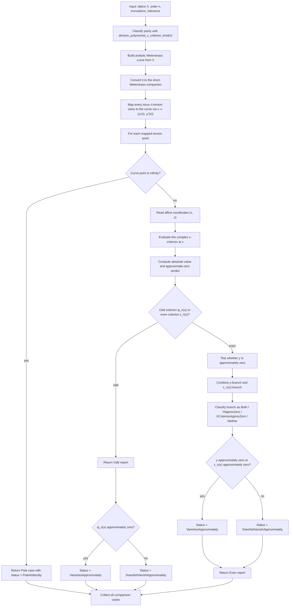
````

## File: docs/algorithm-diagrams/analytic/fundamental-domain-reduction.md
````markdown
# Fundamental Domain Reduction

Source: [src/elliptic_curves/analytic/fundamental_domain.rs](../../../src/elliptic_curves/analytic/fundamental_domain.rs)

This is the iterative modular-reduction loop for `τ ∈ ℍ`. The current
implementation alternates between two educational moves:

- translate by an integer to enter the centered strip
- apply `S(τ) = -1/τ` when `|τ| < 1`

and records every step together with the accumulated modular matrix.

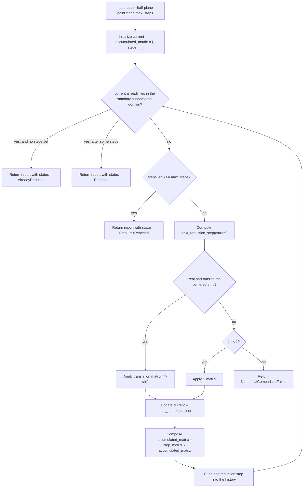
````

## File: docs/algorithm-diagrams/analytic/torus-n-torsion-enumeration.md
````markdown
# Torus N-Torsion Enumeration

Source: [src/elliptic_curves/analytic/torsion/torus.rs](../../../src/elliptic_curves/analytic/torsion/torus.rs)

These helpers materialize the reduced `n × n` torsion grid in lexicographic
order, and optionally filter it to the primitive classes of exact torus order
`n`.

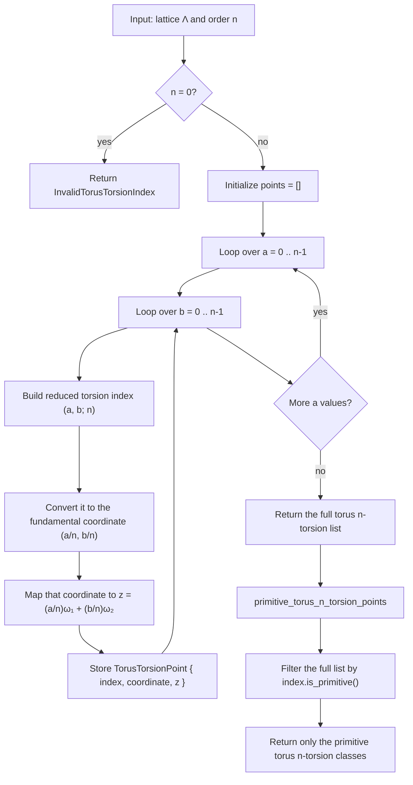
````

## File: docs/algorithm-diagrams/analytic/truncated-elliptic-function-evaluator.md
````markdown
# Truncated Elliptic-Function Evaluator

Source: [src/elliptic_curves/analytic/elliptic_functions/evaluator.rs](../../../src/elliptic_curves/analytic/elliptic_functions/evaluator.rs)

This is the shared reduction-and-summation pipeline behind the current
truncated analytic elliptic-function evaluations.

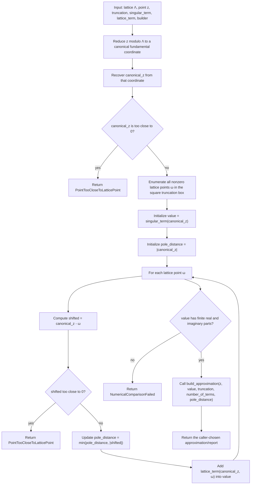
````

## File: docs/algorithm-diagrams/fields/extension-field-inversion.md
````markdown
# Extension-Field Inversion

Source: [src/fields/extension_field.rs](../../../src/fields/extension_field.rs)

This is the type-level field-family version: the ambient modulus lives in the
`ExtensionFieldSpec`, while each element stores only its quotient
representative.

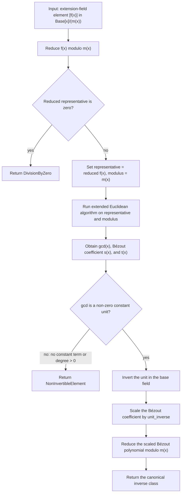
````

## File: docs/algorithm-diagrams/fields/polynomial-field-inversion.md
````markdown
# Polynomial-Field Inversion

Source: [src/fields/polynomial_field.rs](../../../src/fields/polynomial_field.rs)

This follows the same Euclidean idea as the static extension-field path, but
the value carries its own modulus. That makes the distinction between

- a general quotient algebra element, and
- an element of a true quotient field when the modulus is irreducible

more visible at the value layer.

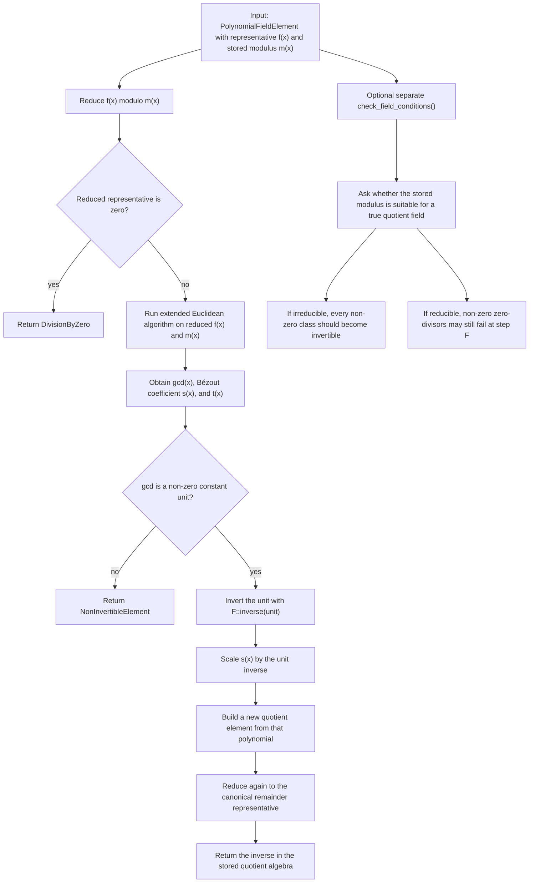
````

## File: docs/algorithm-diagrams/fields/prime-field-square-root.md
````markdown
# Prime-Field Square Root

Source: [src/fields/prime_field.rs](../../../src/fields/prime_field.rs)

This is the current exact prime-field square-root routine. It handles the
small easy cases directly, rejects non-residues honestly, uses the
`p % 4 == 3` shortcut when available, and otherwise falls back to the full
Tonelli–Shanks loop.

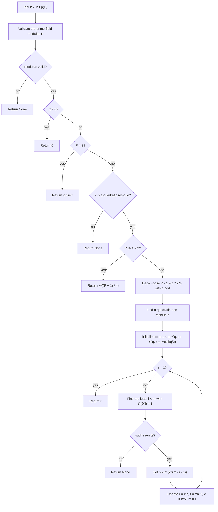
````

## File: docs/algorithm-diagrams/inverse_uniformization/abel-jacobi-inverse-uniformization.md
````markdown
# Abel-Jacobi Inverse Uniformization

Source: [src/elliptic_curves/analytic/inverse_uniformization/abel_jacobi/mod.rs](../../../src/elliptic_curves/analytic/inverse_uniformization/abel_jacobi/mod.rs)

This note documents the current implementation of the point-level
inverse-uniformization map $(x,y) \mapsto z \in \mathbf{C}/\Lambda$ through
an Abel-Jacobi integral.

The public entry points are:

- `approximate_abel_jacobi_integral(...)`
- `recover_torus_point_from_curve_point_with_periods(...)`
- `recover_torus_point_from_curve_point(...)`

## Goal

Starting from a point on the analytic Weierstrass curve

$$E : y^2 = 4x^3 - g_2 x - g_3,$$

we want to recover a torus parameter $z$ such that

$$x = \wp(z), \qquad y = \wp'(z),$$

at least approximately and modulo the period lattice $\Lambda$.

The formal inverse is the Abel-Jacobi integral

$$z = \int_x^\infty \frac{dt}{\sqrt{4t^3 - g_2 t - g_3}}.$$

This integral is not single-valued as a bare complex number:

- different contour classes can differ by periods,
- the square root has a sign ambiguity.

So the mathematically honest output is a class in $\mathbb{C}/\Lambda$.

## High-Level Strategy

The implementation does **not** integrate directly in the original $x$-plane.
Instead it:

1. recovers the Weierstrass cubic roots $e_1,e_2,e_3$,
2. chooses the deterministic Legendre reduction already used elsewhere in
   the current analytic inverse direction,
3. transports the point to Legendre coordinates,
4. integrates there along one deterministic contour,
5. rescales back by the invariant differential factor,
6. reduces the resulting complex number modulo the recovered lattice,
7. validates by mapping back through $(\wp,\wp')$.

This keeps the branch locus visible as the normalized set $\{0,1,\lambda,\infty\}$.

## Change Of Variables To Legendre Form

The reduction uses $x = e_2 + (e_1 - e_2)X$ and the corresponding $y$-scaling

$$y = 2\alpha^3 Y, \qquad \alpha = \sqrt{e_1 - e_2}, $$

so that the cubic becomes $Y^2 = X(X - 1)(X - \lambda)$.

The important differential identity is

$$\frac{dx}{y} = \frac{1}{2\alpha}\frac{dX}{Y}.$$

In the implementation this factor is exactly `reduction.invariant_differential_scale()`.

Therefore

$$z = \int_X^\infty \frac{dt}{\sqrt{4t^3-g_2 t-g_3}} = \frac{1}{2\alpha} \int_X^\infty \frac{dU}{\sqrt{U(U-1)(U-\lambda)}}.$$

So the numerical work is concentrated in the Legendre integral.

## Contour Convention

The current implementation exposes an explicit path-strategy enum, but at
present it has one concrete case:

- `CanonicalSegmentThenRay`

That strategy uses one deterministic `segment + ray` contour in the Legendre
$X$-plane.

### Segment

From the input point $X$, draw a straight segment to an anchor point

$$A = R e^{i\theta}.$$

The anchor radius $R$ is chosen from the scale of $X$ and $\lambda$, so the
anchor lies well outside the visible branch locus.

In the current implementation,

$$
R = 4 \cdot \max\!\bigl(|X|, |\lambda|, 1\bigr) + 2.
$$

The omitted distances $|X-1|$ and $|X-\lambda|$ are already controlled, up
to a fixed constant factor, by $|X|$, $|\lambda|$, and $1$, so they are not
needed in this coarse anchor heuristic.

### Ray

From the anchor point $A$, continue along the ray of angle $\theta$:

$$\gamma_{\mathrm{ray}}(r) = A + r e^{i\theta},\qquad r \ge 0.$$

The implementation samples only a finite initial portion of that ray before
switching to the asymptotic tail correction. Its sampled radial extent is

$$L_{\mathrm{tail}} = 4R.$$

For numerical integration, this ray is compactified with the standard map

$$r = \frac{s}{1-s}, \qquad 0 \le s < 1,$$

so the parametrized ray becomes

$$\gamma_{\mathrm{ray}}(s) = A + e^{i\theta}\frac{s}{1-s}.$$

The code samples only a finite prefix $0 \le s \le s_{\max}$ and then adds a
tail correction.

That cutoff is chosen from $L_{\mathrm{tail}}$ via

$$
s_{\max} = \frac{L_{\mathrm{tail}}}{1 + L_{\mathrm{tail}}}.
$$

### Angle Selection

The angle $\theta$ is not arbitrary. The implementation tests a short fixed
list of candidate directions and chooses the one that keeps the sampled contour
farthest from the singular locus $\{0,1,\lambda\}.$

First define

$$
\theta_0 =
\begin{cases}
0, & X = 0, \\
\arg(X), & X \neq 0.
\end{cases}
$$

Then the candidate set is

$$
\Theta =
\left\{
0,\;
\frac{\pi}{2},\;
\pi,\;
-\frac{\pi}{2},\;
\theta_0,\;
\theta_0+\frac{\pi}{4},\;
\theta_0-\frac{\pi}{4},\;
\theta_0+\frac{\pi}{6},\;
\theta_0-\frac{\pi}{6}
\right\}.
$$

For each $\theta \in \Theta$, the code samples the corresponding contour and computes

$$
d(\theta)
=
\min_{z \in \text{sampled contour}}
\min\bigl(
|z|,
|z-1|,
|z-\lambda|
\bigr).
$$

The chosen angle is

$$
\theta_{\mathrm{chosen}}
=
\operatorname*{arg\,max}_{\theta \in \Theta} d(\theta).
$$

The sampling density used for this diagnostic step is configurable:

- `config.segment_samples` controls the finite segment sampling,
- `config.ray_samples` controls the compactified-ray sampling.

These knobs affect contour selection and reporting, not the Simpson
quadrature budget itself.

The contour report stores:

- the selected path strategy,
- the start point $X$,
- the anchor point $A$,
- the chosen angle $\theta$,
- the anchor radius $R$,
- the sampled tail length $L_{\mathrm{tail}}$,
- the minimum sampled distance to the branch locus.

## Branch Initialization And Continuation

The square root in the Legendre model is $\sqrt{X(X - 1)(X - \lambda)}$.

If the transformed point is $(X,Y)$, the branch is initialized using the sign
opposite to $Y$. That convention makes the implemented integral

$$z = \int_x^\infty \frac{dt}{\sqrt{4t^3-g_2 t-g_3}}$$

recover the local uniformization parameter $z$ rather than $-z$.

After that first step, the branch is continued by continuity:

- compute the principal square root at the next sample point,
- compare the two signs $\pm \sqrt{\cdot}$ against the previous branch value,
- keep whichever sign is closer.

## Numerical Quadrature

Both the finite segment and the compactified ray are integrated with composite
Simpson quadrature.

If a path is written as $U = \gamma(s)$, then the integrand is

$$\frac{\gamma'(s)}{\sqrt{\gamma(s)(\gamma(s)-1)(\gamma(s)-\lambda)}}.$$

The algorithm therefore needs two ingredients at each sample node:

- the path point $\gamma(s)$,
- the path derivative $\gamma'(s)$.

For the segment, $\gamma'(s)$ is constant. For the compactified ray,

$$\gamma'(s) = e^{i\theta}(1-s)^{-2}.$$

## Tail Correction

The compactified ray is truncated at a finite endpoint $U_{\mathrm{tail}}$.
The remaining contribution is estimated by the leading asymptotic

$$\frac{1}{\sqrt{U(U-1)(U-\lambda)}} \sim U^{-3/2},$$

which gives the simple correction

$$
\int_{U_{\mathrm{tail}}}^\infty \frac{dU}{\sqrt{U(U-1)(U-\lambda)}}
\approx
\frac{2U_{\mathrm{tail}}} {\sqrt{U_{\mathrm{tail}}(U_{\mathrm{tail}}-1)(U_{\mathrm{tail}}-\lambda)}}.
$$

This is only a first asymptotic correction, but it is enough for the current
educational implementation.

## From Raw Integral To Torus Class

`approximate_abel_jacobi_integral(...)` stops after returning one approximate
complex value in $\mathbf{C}$.

`recover_torus_point_from_curve_point_with_periods(...)` continues:

1. reduce that complex number modulo the recovered lattice,
2. store the canonical torus representative,
3. map it back through $(\wp, \wp')$,
4. build a dedicated roundtrip-validation report,
5. compare the recovered point against the source curve point.

So the final report keeps both:

- the raw complex integral value,
- the reduced torus class in $\mathbf{C}/\Lambda$.
- the successful roundtrip-validation report.

## Special Cases And Current Limits

### Point At Infinity

The point at infinity is treated as the identity torus class, and the integral
is returned exactly as $0$.

### Branch Points

The current implementation rejects points with $y \approx 0$.

Numerically, those are the hardest points because they lie near the branch
locus of the square root. The present surface is honest about that limitation:
it does not pretend that the same quadrature routine handles those cases
robustly.

### Dependence On Config

Finite-point recovery can need a more explicit `AbelJacobiConfig` than the
loosest preset. In particular:

- `integration_steps` controls the actual Simpson quadrature budget,
- `segment_samples` and `ray_samples` control how finely candidate contours
  are scored against the singular locus,
- `legendre_contour_strategy` selects the contour family,
- `validation_policy` independently selects the lattice and elliptic-function
  truncations used in the final roundtrip check.

## Complexity

For `approximate_abel_jacobi_integral(...)`, if

$$
n = \texttt{config.integration\_steps}, \qquad
s = \texttt{config.segment\_samples}, \qquad
r = \texttt{config.ray\_samples},
$$

then the cost is

$$
\Theta(n + s + r).
$$

The $s+r$ term comes from contour scoring across a fixed finite list of
candidate angles, while the $n$ term comes from the two Simpson traversals.

For `recover_torus_point_from_curve_point_with_periods(...)`, the full cost is
$\Theta(n + s + r + r_{\mathrm{inv}}^2 + r_{\mathrm{fun}}^2)$, where:

- $n$ is the Abel-Jacobi quadrature budget,
- $s$ is the segment-side contour-sampling budget,
- $r$ is the ray-side contour-sampling budget,
- $r_{\mathrm{inv}}$ is the lattice-sum truncation used in the final
  validation,
- $r_{\mathrm{fun}}$ is the elliptic-function truncation used in the final
  validation.

The $r^2$ terms come from the existing truncated lattice and elliptic-function
evaluators.

## Flow Diagram

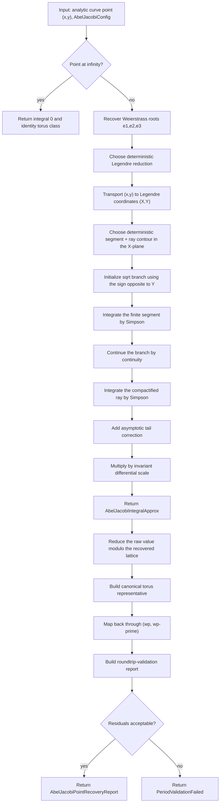

## What Is Mathematically Canonical Here?

The canonical object is the torus class in $\mathbf{C}/\Lambda$.

The raw complex integral value is only a chosen representative, because:

- the contour convention is fixed by the implementation,
- different admissible contour classes can differ by periods.

That is why the public API separates:

- the raw integral approximation,
- the reduced torus representative,
- the final roundtrip-validation report.
````

## File: docs/algorithm-diagrams/inverse_uniformization/invariant-recovery-validation.md
````markdown
# Invariant-Recovery Validation

This note documents the two inverse-uniformization validation helpers added in
the current analytic inverse-uniformization layer:

- `validate_recovered_tau_by_j_invariant(...)`
- `validate_recovered_lattice_invariants(...)`

Both start from recovered analytic data and push it back toward the target
curve:

- either a recovered upper-half-plane parameter $\tau$
- or a recovered period basis $(ω₁, ω₂)$ and lattice $Λ_{rec} = ℤω₁ + ℤω₂$

The point is to answer two slightly different mathematical questions:

1. Did we recover the correct modular class?
2. Did we also recover the correct scale-sensitive normalization?

## Mathematical background

For a lattice $Λ ⊂ ℂ$, the classical analytic invariants are

- $g₂(Λ)$
- $g₃(Λ)$
- $Δ(Λ) = g₂(Λ)^3 - 27 g₃(Λ)^2$
- $j(Λ) = 1728 g₂(Λ)^3 / Δ(Λ)$

If a Weierstrass curve is written as

$$E : y^2 = 4x^3 - g_2 x - g_3,$$

then an analytically matching lattice should reproduce those same invariants.

But there is one crucial subtlety: if we scale the lattice by a nonzero
complex number $α$, then

$$\Lambda' = \alpha \Lambda,$$

and the invariants transform by weights:

$$
g_2(\Lambda') = \alpha^{-4} g_2(\Lambda),
\qquad
g_3(\Lambda') = \alpha^{-6} g_3(\Lambda),
\qquad
\Delta(\Lambda') = \alpha^{-12} \Delta(\Lambda),
\qquad
j(\Lambda') = j(\Lambda).
$$

- $g₂$, $g₃$, and $Δ$ are scale-sensitive
- $j$ is homothety-invariant

## The `j`-only validation

`validate_recovered_tau_by_j_invariant(...)` answers only the first question:

> does the recovered $τ$ define a torus in the same modular class as the
> target curve?

Algorithm:

1. Build the standard lattice $Λ_τ = ℤ + ℤτ$.
2. Recompute $g₂(Λ_τ), g₃(Λ_τ), Δ(Λ_τ), j(Λ_τ)$ by finite lattice sums.
3. Compute the curve-side $j(E)$.
4. Compare $j(Λ_τ)$ against $j(E)$.

This is deliberately robust to global rescaling, because $j$ ignores that
scale.

## The full invariant validation

`validate_recovered_lattice_invariants(...)` answers both questions.

Algorithm:

1. Start from the recovered period basis $(ω₁, ω₂)$.
2. Form the recovered lattice
   $Λ_{rec} = ℤω₁ + ℤω₂$.
3. Recompute $g₂(Λ_{rec}), g₃(Λ_{rec}), Δ(Λ_{rec}), j(Λ_{rec})$.
4. Compare each of those against the curve-side values.
5. Classify the outcome.

The report uses three interpretations:

- `DirectAgreement`
  Means $g₂$, $g₃$, $Δ$, and $j$ all agree directly.
- `SameModularClassButScaleSensitiveMismatch`
  Means $j$ agrees but at least one of $g₂$, $g₃, or $Δ$ does not.
  This is the characteristic “right modular class, wrong homothety
  normalization” outcome. A common way to land here is to recover only a
  semiperiod basis while the rest of the code interprets it as the full
  lattice.
- `Inconsistent`
  Means even $j$ fails to agree, so the recovered lattice is not numerically
  describing the same modular class.

## Complexity

In both helpers, the dominant work is recomputing truncated Eisenstein sums on
one lattice. If `r` is the square-box lattice truncation radius, then the complexity is $\Theta(r^2)$.

## Diagram

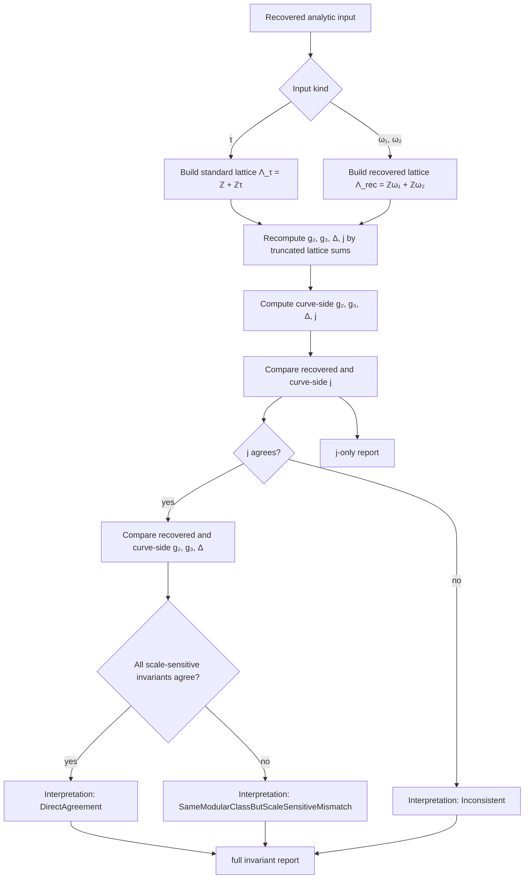
````

## File: docs/algorithm-diagrams/isogenies/isogeny-composition.md
````markdown
# Isogeny Composition

Source: [src/isogenies/composition.rs](../../../src/isogenies/composition.rs)

The composition surface supports two pedagogical modes:

- strict composition, where `codomain(first) = domain(second)` exactly
- bridged composition, where an explicit middle isomorphism transports the
  raw middle image onto the second map's chosen domain

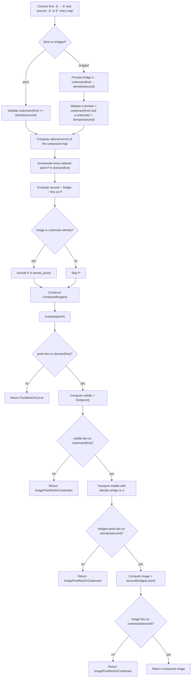
````

## File: docs/algorithm-diagrams/isogenies/isogeny-graph-scaffolding.md
````markdown
# Isogeny Graph Scaffolding

Source: [src/isogenies/graphs](../../../src/isogenies/graphs)

This note was previously stored as `src/isogenies/graphs/README.md`.

This directory contains the educational `\ell`-isogeny graph scaffolding for
small short-Weierstrass curves over prime fields.

The key modeling choice is that each node stores one chosen representative
curve, while each edge stores:

- a rational cyclic kernel on the source representative
- the directed source and target node ids
- an optional witness transporting the raw Vélu codomain onto the stored
  target representative

That separation keeps two different notions visible:

- the codomain curve produced directly by Vélu from a kernel
- the representative curve chosen for the target node after deduplication

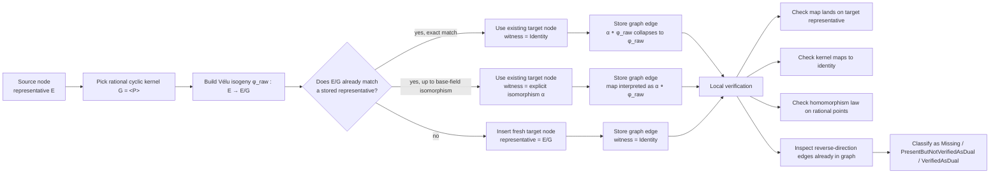

In other words, the graph stores representatives and witnesses explicitly so
that later summaries and local verification can reason about the maps that
actually connect the stored nodes, not just about abstract isomorphism classes.
````

## File: docs/algorithm-diagrams/periods/complete-elliptic-integral-k-via-agm.md
````markdown
# Complete Elliptic Integral `K` Via AGM

Source: [src/elliptic_curves/analytic/periods/elliptic_integral.rs](../../../src/elliptic_curves/analytic/periods/elliptic_integral.rs)

This note explains the current algorithm for approximating the
complete elliptic integral of the first kind $K(m)$, using the complex AGM.

The same module also exposes the Legendre-facing wrappers

- `complete_elliptic_integral_k_from_lambda(...)`
- `complementary_complete_elliptic_integral_k_from_lambda(...)`
- `legendre_period_integral_report(...)`

so this note also explains how those surfaces sit on top of the basic
$K(m)$ computation.

## High-Level Formula

The algorithm uses the classical identity

$$K(m) = \frac{\pi}{2\,\operatorname{AGM}(1,\sqrt{1-m})}.$$

Here:

- $m$ is the raw parameter, often written $k^2$
- $\text{AGM}$ is the arithmetic-geometric mean
- $\sqrt(1-m)$ is the complementary square root that must be given a branch

## Public API Layers

The current public API has four entry points:

- `complete_elliptic_integral_k_from_m(m, config)`
- `complete_elliptic_integral_k_from_lambda(parameter, config)`
- `complementary_complete_elliptic_integral_k_from_m(m, config)`
- `complementary_complete_elliptic_integral_k_from_lambda(parameter, config)`

Their roles are:

- `from_m` is the low-level analytic surface
- `from_lambda` is the Legendre-aware wrapper using `m = \lambda`
- `complementary_from_m` computes `K(1-m)`
- `complementary_from_lambda` computes `K(1-\lambda)`

This keeps the complement explicit in the API instead of silently replacing the
parameter inside a less specific function name.

## Parameter Validation

Before running the AGM, the implementation validates $m$ by requiring that it
already define a finite nonsingular Legendre parameter. The code uses
`LegendreParameter::new(m)` for this validation.

## Choosing The Complementary Square Root

The selected complementary root is the one that makes the initial AGM pair $(1,\sqrt{1-m})$
as “close” as possible right from the start.

This is fully parallel to the branch-choice philosophy already used in the raw
complex AGM module.

## Running The AGM

Once the complementary root has been chosen, the implementation computes

$$\operatorname{AGM}(1,\sqrt{1-m}).$$

The elliptic-integral layer then forms

$$K(m) = \frac{\pi}{2\,\operatorname{AGM}(1,\sqrt{1-m})}.$$

If the AGM value is numerically too close to zero, or the resulting quotient is
not finite, the code returns `InvalidEllipticIntegralInput`.

## Complementary Integral

The complementary integral is computed by replacing $m$ with $1-m$.
This is why the API exposes the complementary functions directly instead of
forcing callers to manually write $1-\lambda$ everywhere. So:

$$K_{\mathrm{comp}}(m) := K(1-m).$$

In the Legendre-facing notation, this becomes

$$K_{\mathrm{comp}}(\lambda) := K(1-\lambda).$$

## Flow Diagram

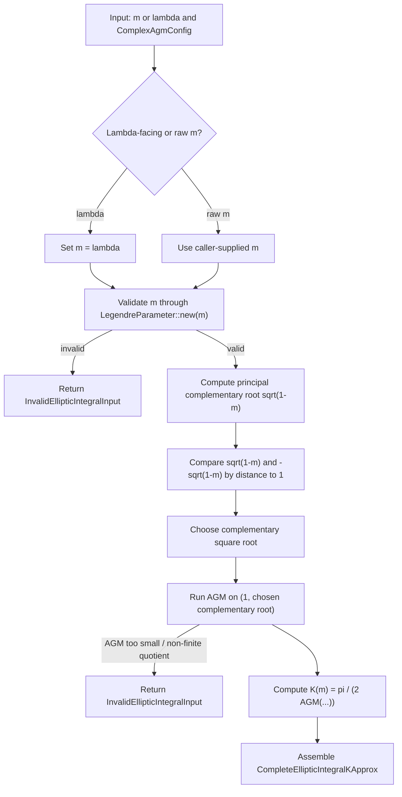

For the report layer:

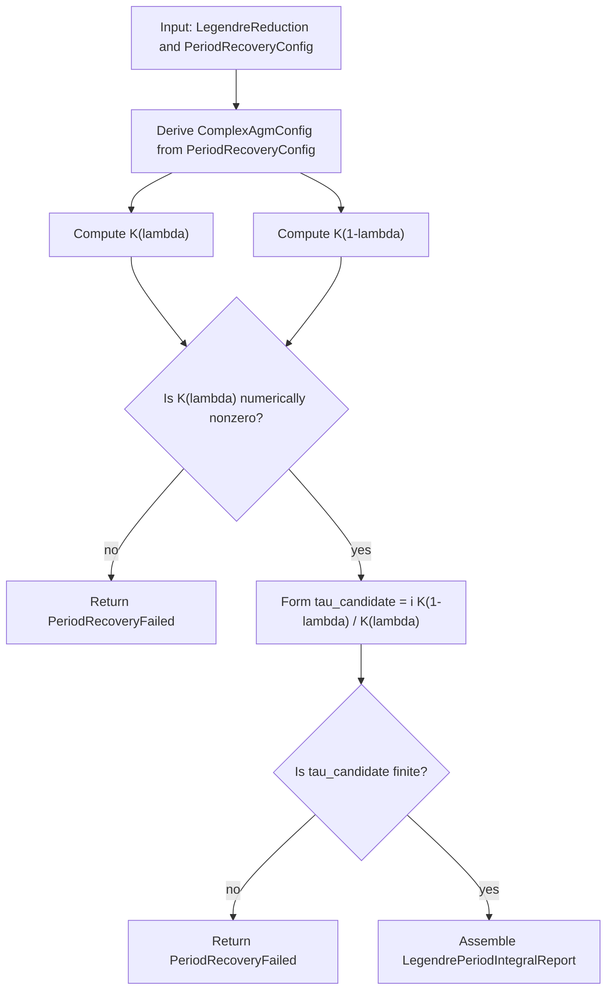

## Complexity

Let `N` be the AGM iteration budget in `ComplexAgmConfig`. Then:

- one `K(m)` computation is `Θ(N)`
- one `K(\lambda)` plus one `K(1-\lambda)` report is also `Θ(N)`

because each AGM step is `Θ(1)` and the report performs only a constant number
of additional complex arithmetic operations outside those AGM runs.
````

## File: docs/algorithm-diagrams/periods/complex-agm.md
````markdown
# Complex AGM

Source: [src/elliptic_curves/analytic/periods/agm.rs](../../../src/elliptic_curves/analytic/periods/agm.rs)

This note explains the raw complex arithmetic-geometric mean (AGM) primitive
currently used in the current analytic period-recovery layer.

The current API is intentionally **lower level** than complete elliptic
integrals. It computes the complex AGM of two inputs `a` and `b`, records the
square-root branch choices if requested, and stops there. It does **not** yet
interpret those inputs as `1` and `sqrt(1-λ)`, nor does it return a value such
as `K(k)`.

## High-Level Idea

Given two complex numbers `a_0` and `b_0`, the AGM iteration repeatedly forms

- `a_{n+1} = (a_n + b_n) / 2`
- `b_{n+1} = ± sqrt(a_n b_n)`

In the real positive case, one chooses the positive square root and the
iteration converges to the classical AGM.

In the complex case, the geometric mean is not single-valued because
`sqrt(a_n b_n)` has two signs. So the implementation must choose a sign at
every step.

## Current Branch Rule

The current implementation uses the principal complex square root as a
reference:

- first compute `s_n = sqrt(a_n b_n)` on the principal branch
- then compare the two candidates `s_n` and `-s_n`
- choose the one that minimizes
  `|a_{n+1} - b_{n+1}| = |(a_n + b_n)/2 - b_{n+1}|`

So the step is designed to make the next pair as close as possible.

If the two candidate gaps are exactly tied, the principal branch is preferred.
This gives a deterministic algorithm instead of leaving the sign ambiguous.

## Why The Branch Choice Matters

Without a branch rule, the complex AGM would not be a well-defined numerical
routine. Different sign choices can send the iteration down different paths.

The current rule is local and pragmatic:

- it does not claim to be the only mathematically meaningful continuation
- it does give a deterministic educational primitive
- it tends to keep the two sequences moving toward each other as directly as
  possible

That makes it a good fit for the current period-recovery work, where we want a stable
building block before layering on Legendre normalization and elliptic
integrals.

## Result Surface

The module exposes two companion entry points:

- `complex_agm(a, b, config)`:
  returns only the final result bundle
- `complex_agm_trace(a, b, config)`:
  returns the full per-step trace plus the same final result

The final result records:

- the original inputs `a` and `b`
- the terminal status
- the number of iterations used
- the final pair `(a_n, b_n)`
- the final gap norm `|a_n - b_n|`
- the reported AGM value

The reported AGM value is the symmetric midpoint

`agm = (final_a + final_b) / 2`.

This avoids privileging either side of the final pair when the run stops with
`a_n` and `b_n` only approximately equal.

## Trace Surface

The educational trace records, for every step:

- the input pair `(a_n, b_n)`
- the principal square root `sqrt(a_n b_n)`
- whether the principal sign or the negated sign was selected
- the chosen geometric mean
- the next arithmetic mean
- the next gap norm

## Stopping Rule

The run stops when `a_n` and `b_n` are close under the shared
`ApproxTolerance` policy:

- absolute tolerance stabilizes near-zero comparisons
- relative tolerance handles larger scales

If the initial inputs are already close, the algorithm succeeds immediately
with zero recorded iterations.

If the inputs are still not close after the configured iteration budget is
exhausted, the run returns status `HitIterationLimit` rather than raising an
error.

This is intentional:

- “did not converge within the budget” is different from
  “the input was invalid”

## Input Validation

The raw AGM primitive currently rejects non-finite complex inputs.

So if either input contains `NaN` or `∞`, the algorithm returns
`InvalidAgmInput`.

This keeps the failure mode specific to the primitive instead of collapsing it
into a broad generic numerical error.

## Config Layering

The module uses a dedicated `ComplexAgmConfig` rather than reusing the full
`PeriodRecoveryConfig` directly.

That separation matters because the raw AGM only needs:

- one tolerance
- one iteration budget

It does **not** need:

- Newton iteration limits
- Abel-Jacobi integration steps
- branch-lattice search radii

The current API therefore lets callers derive
`ComplexAgmConfig::from_period_recovery_config(...)` when they want consistency
with a larger period-recovery configuration, while still keeping the primitive
itself mathematically narrow.

## Flow Diagram

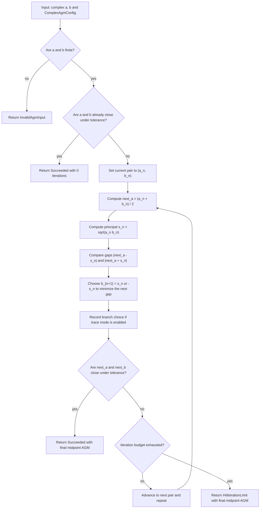

## Complexity

If the configured iteration budget is `N`, the run is `Θ(N)`.

Each step performs only `Θ(1)` complex arithmetic:

- one multiplication
- one square root
- a few additions/subtractions
- a few norm computations

## Appendix: Why The Good Branch Choice Forces A Common Limit

Here is the standard convergence proof behind the complex AGM with a coherent
branch rule.

We consider the iteration

$$
a_{n+1} = \frac{a_n+b_n}{2},
\qquad
b_{n+1} = \pm \sqrt{a_n b_n},
$$

and at each step choose the sign so that

$$
\lvert a_{n+1}-b_{n+1}\rvert \le \lvert a_{n+1}+b_{n+1}\rvert.
$$

This is exactly the “good pair” condition. It means we choose the sign of the
square root so that the next arithmetic and geometric means are as close as
possible.

### Step 1: A Good Sign Always Exists

Fix one step and write

$$
u = \frac{a_n+b_n}{2}
$$

and let

$$
c = \sqrt{a_n b_n}
$$

be one of the two square roots of $a_n b_n$.

Then the only two possible choices for $b_{n+1}$ are $c$ and $-c$.

But replacing $c$ by $-c swaps the two quantities

$$\lvert u - c \rvert \qquad\text{and}\qquad \lvert u + c \rvert.$$

So at least one of the two choices satisfies $\lvert u-c\rvert \le \lvert u+c\rvert$,
and therefore a good branch choice is always available.

### Step 2: The Key Algebraic Identity

Define

$$
d_n := a_n-b_n.
$$

Then

$$
(a_{n+1}-b_{n+1})(a_{n+1}+b_{n+1})
= a_{n+1}^2-b_{n+1}^2.
$$

Since $b_{n+1}^2 = a_n b_n$, we get

$$
\begin{aligned}
a_{n+1}^2-b_{n+1}^2
&=
\left(\frac{a_n+b_n}{2}\right)^2-a_n b_n \\
&=
\frac{a_n^2+2a_n b_n+b_n^2-4a_n b_n}{4} \\
&=
\frac{(a_n-b_n)^2}{4} \\
&=
\frac{d_n^2}{4}.
\end{aligned}
$$

So the iteration always satisfies

$$
(a_{n+1}-b_{n+1})(a_{n+1}+b_{n+1}) = \frac{d_n^2}{4}.
$$

Taking absolute values,

$$
\lvert a_{n+1}-b_{n+1}\rvert
\lvert a_{n+1}+b_{n+1}\rvert
= \frac{\lvert d_n\rvert^2}{4}.
$$

### Step 3: The Difference Contracts By At Least A Factor Of 2

By the good-branch condition,

$$
\lvert a_{n+1}-b_{n+1}\rvert \le \lvert a_{n+1}+b_{n+1}\rvert.
$$

Therefore

$$
\lvert a_{n+1}-b_{n+1}\rvert^2
\le
\lvert a_{n+1}-b_{n+1}\rvert
\lvert a_{n+1}+b_{n+1}\rvert
= \frac{\lvert d_n\rvert^2}{4}.
$$

Hence

$$
\lvert d_{n+1}\rvert \le \frac{\lvert d_n\rvert}{2}.
$$

Iterating this estimate gives

$$
\lvert d_n\rvert \le \frac{\lvert d_0\rvert}{2^n},
$$

so

$$
a_n-b_n \to 0.
$$

This is the core mechanism: the correct branch choice makes the gap shrink
geometrically.

### Step 4: The Arithmetic Means Form A Cauchy Sequence

Now compare successive arithmetic iterates:

$$a_{n+1}-a_n = \frac{a_n+b_n}{2}-a_n = -\frac{a_n-b_n}{2} = -\frac{d_n}{2}.$$

So

$$\lvert a_{n+1}-a_n\rvert = \frac{\lvert d_n\rvert}{2} \le \frac{\lvert d_0\rvert}{2^{n+1}}.$$

The series

$$\sum_{n\ge 0} \lvert a_{n+1}-a_n\rvert$$

is therefore bounded by a convergent geometric series. Hence $a_n$ is a
Cauchy sequence in $\mathbb{C}$. Because $\mathbb{C}$ is complete, $a_n$ converges.

### Step 5: The Geometric Means Converge To The Same Limit

Finally,

$$b_n = a_n - d_n.$$

We already know:

- $a_n$ converges
- $d_n \to 0$

Therefore $b_n$ also converges, and both sequences have the same limit.

So under the good branch rule,

$$\lim a_n = \lim b_n.$$

That common limit is the complex AGM of the initial pair.
````

## File: docs/algorithm-diagrams/periods/legendre-reduction-from-weierstrass-roots.md
````markdown
# Legendre Reduction From Weierstrass Roots

Source: [src/elliptic_curves/analytic/periods/legendre.rs](../../../src/elliptic_curves/analytic/periods/legendre.rs)

This note explains the current reduction from a Weierstrass cubic

`y² = 4(x - e₁)(x - e₂)(x - e₃)`

to a Legendre-normalized cubic

`Y² = X(X - 1)(X - λ)`.

The key subtlety is that an unordered root triple does not determine a unique
`λ`. Instead, it determines a six-element orbit under permutation of the roots.

## High-Level Idea

For one ordered triple `(e₁, e₂, e₃)`, define

- `λ = (e₃ - e₂) / (e₁ - e₂)`
- `x = e₂ + (e₁ - e₂) X`

Then `4(x - e₁)(x - e₂)(x - e₃) = 4(e₁ - e₂)^3 X(X - 1)(X - λ)`, so the `x`-side normalization is affine and explicit.

To obtain a concrete `Y` coordinate, the current implementation obtains
`sqrt(4(e₁ - e₂)^3)` in the following way:

- `a = e₁ - e₂`
- `α = sqrt(a)` using the principal complex square-root branch
- `y = 2 α^3 Y`

Then `(2 α^3)^2 = 4 a^3`, so again `Y² = X(X - 1)(X - λ)`.

## The Orbit Problem

If the input roots are unordered, permuting them changes `λ` by one of the six
classical transforms

- `λ`
- `1 - λ`
- `1 / λ`
- `1 / (1 - λ)`
- `(λ - 1) / λ`
- `λ / (λ - 1)`

Those six values form the `S₃` orbit of the same Legendre class.

## Full Permutation Table

Starting from one ordered triple `(e₁, e₂, e₃)` with

`λ = (e₃ - e₂) / (e₁ - e₂)`,

the six reorderings give the following transforms:

| Ordered triple used by the formula | Permutation of the original labels | Resulting Möbius transform |
| --- | --- | --- |
| `(e₁, e₂, e₃)` | identity | `λ` |
| `(e₂, e₁, e₃)` | swap `(12)` | `1 - λ` |
| `(e₃, e₂, e₁)` | swap `(13)` after relabeling | `1 / λ` |
| `(e₁, e₃, e₂)` | swap `(23)` | `λ / (λ - 1)` |
| `(e₂, e₃, e₁)` | cycle `(123)` | `(λ - 1) / λ` |
| `(e₃, e₁, e₂)` | cycle `(132)` | `1 / (1 - λ)` |

So the same unordered cubic produces six formally different Legendre
parameters, but they all belong to the same `S₃` orbit.

## What `S₃` Is Doing

The group `S₃` acts by permuting the three roots. The key point is that
`λ = (e₃ - e₂) / (e₁ - e₂)` depends on an **ordered** triple `(e₁, e₂, e₃)`.

So when a permutation `σ ∈ S₃` changes the ordering, it generally changes the
numerical value of `λ`. That change is not arbitrary: it is always one of six
specific Möbius transforms.

The three basic transpositions already generate all of them:

- swap `e₁` and `e₂`:
  `λ ↦ 1 - λ`
- swap `e₁` and `e₃`:
  `λ ↦ 1 / λ`
- swap `e₂` and `e₃`:
  `λ ↦ λ / (λ - 1)`

Composing those transpositions gives the other three transforms:

- `1 / (1 - λ)`
- `(λ - 1) / λ`
- `λ`

So the orbit is the image of the full permutation group of the three roots.

## Why This Still Represents One Geometric Object

All six orbit values describe the same Legendre class in the following sense:

- they come from the same cubic after only re-labeling the roots
- the affine normalization sends different roots to the distinguished points
  `0`, `1`, and `λ` in different ways
- the underlying elliptic curve does not change, only the chosen Legendre
  coordinate does

That is why this module keeps two layers separate:

1. `LegendreParameterOrbit`, which records the whole `S₃` family
2. one deterministic chosen representative, used for downstream computation

## Generic And Special Orbits

For a generic value of `λ`, the orbit has six **distinct** complex numbers.

But special symmetric values can collapse several orbit labels to the same
number. For example:

- if `λ = 1/2`, then `1 - λ = λ`
- if `λ = -1`, then `1 / λ = λ`
- if `λ` satisfies extra modular symmetry, more coincidences can appear

This does **not** mean the `S₃` action disappeared. It means the parameter has
a nontrivial stabilizer: different permutations can act by the same numerical
transform on that special value.

That is why the implementation keeps both:

- the orbit **label** (`Lambda`, `OneMinusLambda`, etc.)
- the resulting complex number

even though those can coincide numerically in symmetric cases.

## What Changes And What Does Not

When we permute the input roots, the following pieces **can change**:

- the caller-visible stored root order
- the raw formula-level value of `λ` attached to that order
- the orbit label relative to the caller input order
- the selected permutation used internally by the reduction

The following pieces are intended to **stay the same** under permutation:

- the underlying cubic `4(x-e₁)(x-e₂)(x-e₃)`
- the six-element `S₃` orbit as a set of Legendre representatives
- the deterministic chosen representative used by `LegendreReduction::from_roots(...)`
- the conditioning class and the singularity-distance score of that chosen representative

Pedagogically, this is the main lesson of the module: a Legendre parameter is
not an intrinsic label of an unordered root set, but the Legendre **class**
still is.

## Current Selection Rule

The current implementation does two different but compatible things:

1. `LegendreParameterOrbit` stores the whole six-element orbit explicitly.
2. `LegendreReduction::from_roots(...)` chooses one deterministic
   representative for computational work.

The deterministic selector scans all six root permutations, computes the
corresponding six candidate `λ` values, and chooses the one maximizing

`min(|λ|, |1 - λ|, 1 / |λ|)`.

This favors candidates far from the singular Legendre locus `{0, 1, ∞}`.
Ties are broken by:

1. smaller `|λ|`
2. smaller real part
3. smaller imaginary part

In other words, the current report should be read as:

- “this representative was preferred because it maximized distance from the bad Legendre locus”
- “if several candidates were tied numerically, the implementation still picks one deterministically”

That makes the API stable for downstream experiments without pretending that
the chosen `λ` is canonical in a modular-theoretic sense.

## Why Controlled Rejection Is Mathematically Correct

Two rejection modes are especially important here:

- If two roots are approximately equal under the chosen tolerance, then the
  formula `λ = (e₃ - e₂) / (e₁ - e₂)` becomes numerically dishonest because
  the denominator is approximately zero.
- If the analytic invariants produce discriminant `Δ ≈ 0`, then the cubic is
  near the singular locus of Weierstrass models and should not be treated as a
  stable elliptic curve input.

These are not “annoying edge-case failures”. They are the code honestly
refusing to normalize an object that is too close to degenerating.

## Flow Diagram

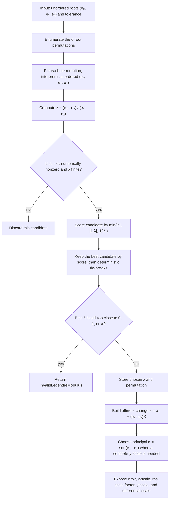

## Complexity

The reduction is `Θ(1)`.

## Mini Glossary

- **Repeated root**: a pair of roots with `eᵢ = eⱼ`; geometrically this means
  the cubic is singular rather than elliptic.
- **Approximately repeated root**: a numerically repeated pair under the chosen
  tolerance; this is enough to make the Legendre denominator unstable.
- **Depressed cubic**: a cubic with vanishing `x²` term. For
  `4(x-e₁)(x-e₂)(x-e₃)`, this is the relation `e₁ + e₂ + e₃ = 0`.
- **Singular Legendre locus `{0, 1, ∞}`**: the bad parameter values where the
  Legendre cubic `X(X-1)(X-λ)` degenerates.
- **`S₃` orbit**: the six Legendre parameters obtained by permuting the three
  roots and recomputing the same formula for `λ`.
- **Principal branch**: the standard library choice of complex square root used
  here to define a concrete `y` scale and invariant-differential scale.
````

## File: docs/algorithm-diagrams/periods/period-basis-and-canonical-tau-recovery.md
````markdown
# Period-Basis And Canonical-`τ` Recovery

Source: [src/elliptic_curves/analytic/periods/period_basis.rs](../../../src/elliptic_curves/analytic/periods/period_basis.rs)

This note explains the current recovery surfaces that sit on top
of cubic-root recovery, Legendre reduction, and complete elliptic integrals.

The public API now deliberately separates three layers:

- `recover_period_basis(...)`
- `recover_tau_from_curve(...)`
- `recover_canonical_tau_from_curve(...)`

That separation is mathematical, not merely ergonomic.

## Three Different Questions

### 1. Which period basis did the algorithm recover?

This is answered by `recover_period_basis(...)`.

It returns one concrete positively oriented basis

$$
\Lambda = \mathbf{Z}\omega_1 + \mathbf{Z}\omega_2
$$

for the recovered lattice.

This basis is valid, but not canonical: replacing it by another
`SL_2(\mathbf{Z})`-equivalent basis gives the same lattice class.

### 2. Which modular parameter does that recovered basis induce?

This is answered by `recover_tau_from_curve(...)`.

Given the recovered basis, it forms

$$
\tau = \omega_2 / \omega_1.
$$

This is the **natural recovered** modular parameter attached to the chosen
basis. It is still not canonical modulo `SL_2(\mathbf{Z})`.

### 3. Which canonical representative of that modular class should we show?

This is answered by `recover_canonical_tau_from_curve(...)`.

It first recovers the natural `τ`, then reduces it to the classical standard
fundamental domain.

So the canonical report keeps both values visible:

- the natural recovered `τ`
- the canonically reduced representative

and also stores the accumulated modular matrix `γ` relating them.

## Period Recovery Step

Once Legendre reduction has produced

$$
Y^2 = X(X-1)(X-\lambda),
$$

and the invariant differential scale satisfies

$$
\frac{dx}{y} = s \,\frac{dX}{Y},
$$

the current implementation first forms the classical Legendre half-period
integrals

$$
2K(\lambda),
\qquad
2iK(1-\lambda),
$$

then doubles once more to obtain the full Weierstrass period lattice. So the
public recovered basis is

$$
\omega_1 = 4 s K(\lambda),
\qquad
\omega_2 = 4 i s K(1-\lambda).
$$

From these, it forms

$$
\tau = \omega_2 / \omega_1.
$$

The code checks that this ratio agrees numerically with the already computed
Legendre-side quantity

$$
\tau_{\mathrm{cand}} = i\,\frac{K(1-\lambda)}{K(\lambda)}.
$$

## Canonicalization Step

The canonicalization layer does **not** change how periods are recovered.

Instead, once a natural `τ` is available, it runs the already existing
fundamental-domain reduction routine and obtains a report with:

- `original_tau`
- `reduced_tau`
- `accumulated_matrix`
- `steps`
- `status`

So if the report succeeds, it certifies

$$
\tau_{\mathrm{canonical}} = \gamma(\tau_{\mathrm{natural}})
$$

for the accumulated modular matrix `γ`.

## Why This Is Better Than Folding Everything Into One Function

If `recover_tau_from_curve(...)` silently returned only a reduced
representative, users would lose the connection to the actual recovered basis.

That would blur two different notions:

- “the `τ` induced by this recovered basis”
- “a canonical modular representative of the same class”

Keeping those separate makes the library more honest and easier to learn from.

## Config Knob

`PeriodRecoveryConfig` now includes an explicit modular-reduction budget:

- `fundamental_domain_reduction_max_steps()`

This budget is used only by `recover_canonical_tau_from_curve(...)`.

If the reduction routine hits that step limit before reaching the standard
fundamental domain, the canonical recovery surface returns
`PeriodValidationFailed` rather than claiming success.

## Flow Diagram

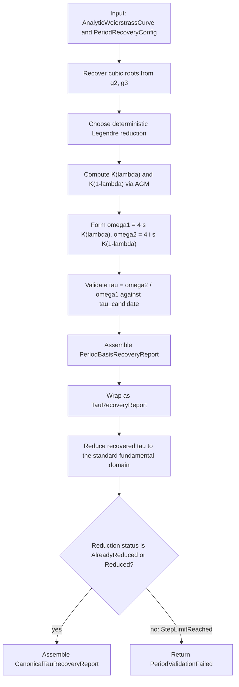

## Complexity

Let

- `n = config.newton_max_iterations()`
- `a = config.agm_max_iterations()`
- `m = config.fundamental_domain_reduction_max_steps()`

Then:

- `recover_period_basis(...)` is `Θ(n + a)`
- `recover_tau_from_curve(...)` is also `Θ(n + a)`
- `recover_canonical_tau_from_curve(...)` is `Θ(n + a + m)`

In practice, the root recovery and AGM work dominate, while the modular
reduction stage is usually tiny.
````

## File: docs/algorithm-diagrams/periods/weierstrass-cubic-root-recovery.md
````markdown
# Weierstrass Cubic-Root Recovery

Source: [src/elliptic_curves/analytic/periods/recovery.rs](../../../src/elliptic_curves/analytic/periods/recovery.rs)

This note explains the current recovery pipeline behind
`recover_weierstrass_cubic_roots(...)` and
`recover_weierstrass_cubic_roots_from_invariants(...)`.

The goal is to recover approximate roots `e_1, e_2, e_3` such that `4x^3 - g_2 x - g_3 = 4(x - e_1)(x - e_2)(x - e_3)`.

Because the cubic is already in depressed form, the implementation starts from
an algebraic closed-form seed and then numerically polishes the candidates
with Newton iteration.

## High-Level Idea

Starting from the analytic curve `y^2 = 4x^3 - g_2 x - g_3`, divide the cubic equation by `4` and rewrite it as
`x^3 + px + q = 0`, where

- `p = -g_2 / 4`
- `q = -g_3 / 4`

In the generic regime, Cardano’s ansatz writes a root as `x = u + v` with

- `u^3 = -q/2 + sqrt((q/2)^2 + (p/3)^3)`
- `v^3 = -q/2 - sqrt((q/2)^2 + (p/3)^3)`

Over `C`, each nonzero complex number has three cube roots, so the generic
Cardano path cannot blindly take one principal branch and hope for the best.
Instead, it enumerates all three branches for `u` and all three branches for
`v`, then chooses a pair satisfying the consistency relation `uv ≈ -p/3`.

Once one consistent pair `(u, v)` is found, the three Cardano roots are

- `u + v`
- `ωu + ω^2 v`
- `ω^2 u + ωv`

with `ω = exp(2πi/3)`.

There is one important numerical exception. When `|p|` is tiny compared with
the natural pure-cubic scale `|q|^{2/3}`, strict Cardano branch matching can
be less stable than the limiting equation itself. In that regime the
implementation switches to the simpler approximation

- `x^3 + q = 0`
- `x^3 = -q`

and uses the three cube roots of `-q` as the initial seeds.

All algebraic seeds, whether they came from Cardano or from the near-pure-
cubic shortcut, are then polished by Newton iteration on
`f(x) = 4x^3 - g_2 x - g_3`.

Concretely, the current implementation monitors the dimensionless ratio

- `|p| / |q|^(2/3)`

and compares it against a deliberately coarse tolerance-derived threshold

- `tol_*^(1/4)`
- `tol_* = max(abs_tol, rel_tol, ε_machine)`

This is a heuristic switch, not a proof that `p = 0`. Its purpose is only to
detect when Newton seeded from `x^3 = -q` is numerically more trustworthy than
strict Cardano branch matching.

## Flow Diagram

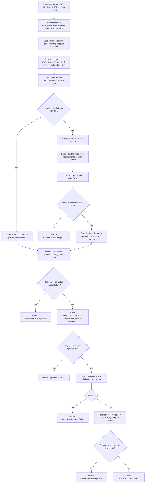

## Why The Validation Matters

The raw algebraic formulas produce candidates, but the implementation
still validates them numerically for three reasons.

1. Complex cube roots are branch-dependent.
   On the generic Cardano path, picking inconsistent branches for `u` and `v`
   can break the identity
   `uv = -p/3`, so the resulting `u + v` would not actually solve the cubic.

2. Floating-point roundoff perturbs exact algebraic identities.
   Even when the correct branch pair is chosen, or when the pure-cubic seeds
   are the right asymptotic starting point, the initial candidates may be only
   approximate, especially after square-root and cube-root evaluation.

3. Distinct roots are part of the non-singular story.
   A repeated root would mean the cubic is colliding with a singular regime,
   so the constructor explicitly rejects approximately repeated triples.

The explicit check `e_1 + e_2 + e_3 ≈ 0` is mathematically the same as
verifying that the `x^2` coefficient vanishes, which is the signature of a
depressed cubic. It is a cheap structural sanity check that the recovered
triple still matches the original shape of `4x^3 - g_2 x - g_3`.

## Newton Polishing

Each algebraic candidate is refined with Newton iteration applied to

- `f(x) = 4x^3 - g_2 x - g_3`
- `f'(x) = 12x^2 - g_2`

The iteration stops successfully when either

- the residual is already approximately zero, or
- the Newton step becomes tiny and the post-step residual is approximately
  zero.

It fails if

- the derivative becomes approximately zero before convergence, or
- the iteration budget in `config.newton_max_iterations()` is exhausted
  without reaching an approximate root.

## Error Surface

The current recovery path can fail through these mathematically meaningful
errors:

- `BranchChoiceAmbiguous` if no branch pair satisfies `uv ≈ -p/3`
- `CubicRootRecoveryFailed` if Newton polishing or final validation fails
- `RepeatedCubicRoot` if the final triple is approximately non-distinct

In the near-pure-cubic shortcut, the algorithm never asks the
`uv ≈ -p/3` question at all, so there the branch-ambiguity failure mode is
intentionally bypassed.

The invariant-level helper may also fail earlier if `g_2, g_3` do not define
a valid non-singular analytic Weierstrass curve.

## Complexity

The implementation documents complexity as `Θ(n)` where `n = config.newton_max_iterations()`.
That estimate comes from:

- constant work to compute `p`, `q`, and the discriminant
- constant work to either inspect the near-pure-cubic criterion or search the
  `3 × 3` Cardano branch pairs
- at most `3n` Newton updates, one lane for each root candidate

So asymptotically the Newton polishing phase dominates the recovery routine.
````

## File: docs/algorithm-diagrams/polynomials/division-polynomial-torsion-pipeline.md
````markdown
# Division-Polynomial Torsion Pipeline

Source: [src/elliptic_curves/division_polynomials/torsion.rs](../../../src/elliptic_curves/division_polynomials/torsion.rs)

This is the main pedagogical division-polynomial pipeline: start from an index `n`,
dispatch by parity, build rational candidates, then refine them into actual
`n`-torsion and exact-order-`n` points, with an optional comparison against
exhaustive enumeration.

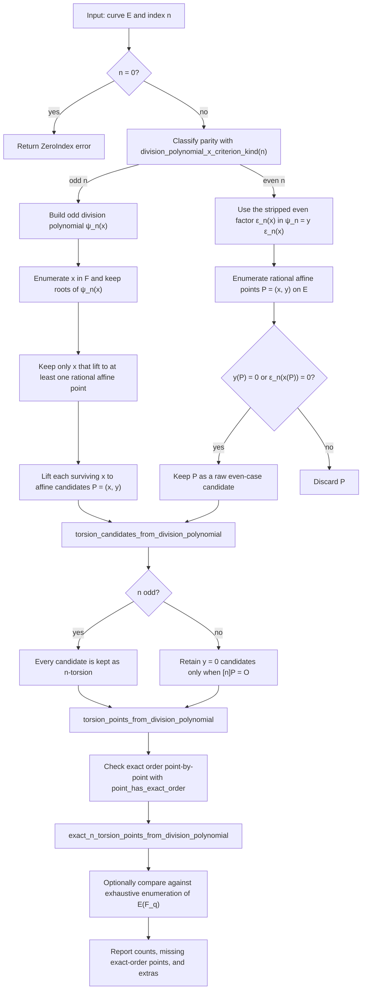
````

## File: docs/algorithm-diagrams/polynomials/lagrange-interpolation.md
````markdown
# Lagrange Interpolation

Source: [src/polynomials/interpolation.rs](../../../src/polynomials/interpolation.rs)

This is the current direct educational interpolation routine: for each sample
point, build one Lagrange basis polynomial explicitly, scale it by `y_i`, and
accumulate it into the final result.

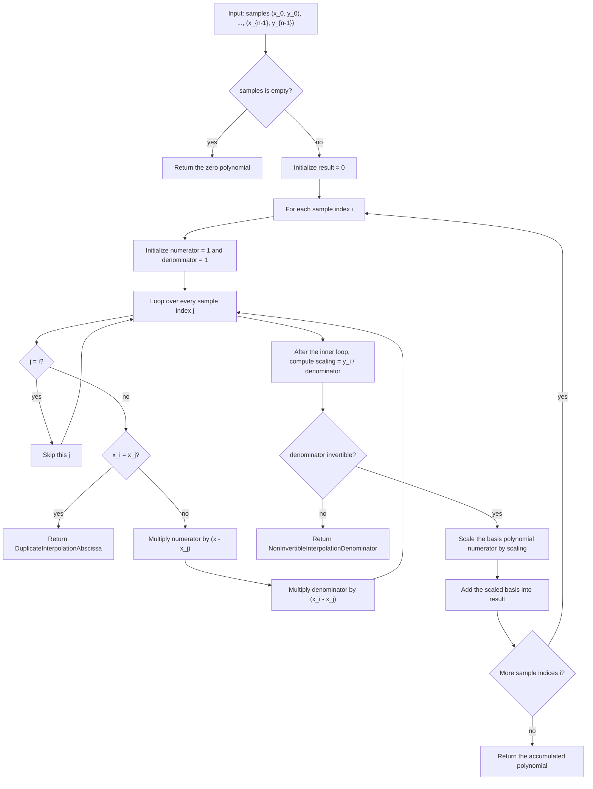
````

## File: docs/examples/complex_torsion.md
````markdown
# Complex Torus Torsion Experiment

This note records what we learned while experimenting with the analytic map

`z ↦ (℘(z), ℘′(z))`

from the complex torus `ℂ / Λ` to the analytic Weierstrass cubic attached to
the square lattice `Λ = ℤ + ℤi`.

The corresponding short-Weierstrass companion is used only as an auxiliary
model for comparison with division polynomials. The main lesson of the
experiment is that different torsion orders require different numerical
diagnostics.

## Setup

We fixed:

- `τ = i`
- a square lattice `Λ = ℤ + ℤi`
- an analytic invariant truncation `r_inv = 16` for the main experiments
- an approximate comparison tolerance
  - absolute: `1e-4`
  - relative: `1e-2`

For some sections we also used larger truncations such as:

- `r_inv = 24`
- `r_inv = 40`
- `r_fun = 28`
- `r_fun = 40`
- `r_fun = 56`
- `r_fun = 80`

to see whether the behavior stabilized.

This turned out to matter in two different ways:

- `r_fun` controls how well the analytic evaluations `℘(z)` and `℘′(z)` are
  approximated for a fixed lattice
- `r_inv` controls how well the derived invariants `g₂`, `g₃`, and the
  resulting short-Weierstrass companion approximate the exact curve attached
  to that lattice

Equivalently:

- `r_fun` mainly improves the **point-side error**
- `r_inv` mainly improves the **curve-side error**

So a diagnostic that mixes `℘(z)` with a division polynomial built from
truncated invariants can fail for two different reasons:

- the point evaluation may still be moving
- the comparison curve may still be the wrong nearby curve

This distinction explains why different observables respond to different
truncation parameters:

- increasing `r_fun` improves the stabilization of
  `P = (℘(z), ℘′(z))`
- increasing `r_inv` improves the curve coefficients that define both
  `y² = 4x³ - g₂x - g₃` and the associated short-Weierstrass division
  polynomial `ψ_n`

So when we ask whether `ψ_n(x)` is close to zero, we are mixing:

- an approximate point `x = ℘(z)`
- with a division polynomial built from approximate invariants

and those two approximations do not improve at the same rate.

## What Worked Best For Each Torsion Order

### `n = 2`

For non-trivial `2`-torsion, the correct numerical signal is not the division
polynomial. The useful checks are:

- `|℘′(z)|`
- the residual of the cubic equation
- the distance from `x = ℘(z)` to the roots of
  `4x^3 - g₂x - g₃ = 0`

With `r_inv = 16` and `r_fun = 6, 10, 14`, we observed:

- for `(0,1;2)` and `(1,0;2)`:
  - `|℘′(z)|` decreases from about `2.37e-2` to `4.76e-3`
  - the cubic residual decreases from about `1.73` to `5.54e-2`
  - the distance to the nearest cubic root decreases from about `4.58e-3`
    to `1.47e-4`
- for `(1,1;2)`:
  - the same quantities also improve, but more slowly

Conclusion:

- `2`-torsion is visible numerically
- two of the three non-trivial classes converge much more cleanly than the
  third
- this is a better experiment than checking the even division-polynomial
  factor directly

### `n = 3`

For `3`-torsion, the best experiment is a convergence table:

- compute `℘(z)` at several `r_fun`
- compute `℘′(z)` at the same `r_fun`
- compare the cubic residual at those truncations

For representative primitive classes such as `(0,1;3)`, `(1,1;3)`, and
`(1,2;3)`, the changes

- `Δ℘`
- `Δ℘′`
- cubic residual

all decrease clearly when `r_fun` goes from `6` to `10` to `14`.

Conclusion:

- `3`-torsion already behaves convincingly as a geometric experiment
- the curve-side picture stabilizes much earlier than the division-polynomial
  criterion

### `n = 6`

For `6`-torsion, the even division-polynomial factor `ε₆(x)` is not a useful
primary diagnostic. Its values remain huge even when the torus-to-curve map is
behaving well.

The better experiment is structural:

- if `P` has order `6`, then `[2]P` should land near `3`-torsion
- if `P` has order `6`, then `[3]P` should land near `2`-torsion

We tested this by multiplying the torus representative `z` before applying the
analytic map:

- compare the image of `2z` against mapped primitive `3`-torsion
- compare the image of `3z` against mapped primitive `2`-torsion

With:

- `r_inv = 16`, `r_fun = 14`
- and also `r_inv = 24`, `r_fun = 28`

the distances were essentially zero:

- `[2]P` to `3`-torsion: at worst about `6e-14`
- `[3]P` to `2`-torsion: exactly `0` in the measured runs

Conclusion:

- the structural torsion relation is already numerically excellent
- this is a much better experiment than evaluating `ε₆(x)` directly

### `n = 7`

For `7`-torsion, the right question is whether the analytic evaluations
stabilize as `r_fun` grows.

Using `r_fun = 10, 14, 20, 28` on representative classes like:

- `(0,1;7)`
- `(0,2;7)`
- `(0,3;7)`
- `(0,4;7)`

we saw consistent decay in:

- `Δ℘`
- `Δ℘′`

For example, for `(0,1;7)`:

- `Δ℘` goes roughly `8.8e-5 → 4.9e-5 → 2.3e-5`
- `Δ℘′` goes roughly `1.2e-3 → 6.8e-4 → 3.3e-4`

Conclusion:

- the map is stabilizing
- `℘′` converges more slowly than `℘`
- the division-polynomial value `ψ₇(x)` is still numerically huge and should
  be treated only as a secondary diagnostic

There is an additional subtlety here that became clear only after pushing the
truncations much higher.

For the representative class `(0,1;7)`, with fixed `r_inv = 16`, we measured:

- `r_fun = 10`: `|ψ₇(x)| ≈ 1.2057e38`
- `r_fun = 14`: `|ψ₇(x)| ≈ 1.2171e38`
- `r_fun = 20`: `|ψ₇(x)| ≈ 1.2233e38`
- `r_fun = 28`: `|ψ₇(x)| ≈ 1.2264e38`
- `r_fun = 40`: `|ψ₇(x)| ≈ 1.2280e38`
- `r_fun = 56`: `|ψ₇(x)| ≈ 1.2288e38`
- `r_fun = 80`: `|ψ₇(x)| ≈ 1.2292e38`

So increasing `r_fun` alone does **not** drive `ψ₇(x)` toward zero. It quickly
stabilizes to a huge nonzero value.

That is not a contradiction with the exact mathematics. The exact statement is
that for the exact lattice and the exact curve,

`ψ₇(℘(z)) = 0`

for a genuine `7`-torsion class. But in the numerical experiment we are really
evaluating a division polynomial for an *approximate* short-Weierstrass
companion built from truncated invariants. If `r_fun` grows while `r_inv`
stays fixed, then `℘(z)` may become very accurate while the comparison curve
is still the wrong nearby curve. In that regime, there is no reason for the
division-polynomial value to approach zero.

We then varied `r_inv` as well, again on `(0,1;7)`, and found the stabilized
plateau moved downward:

- `r_inv = 16`: plateau near `1.229e38`
- `r_inv = 24`: plateau near `5.573e37`
- `r_inv = 40`: plateau near `2.037e37`

So for `n = 7` the two radii play clearly different roles:

- `r_fun` mainly controls stabilization of `℘(z)` and `℘′(z)`
- `r_inv` mainly controls which nearby short-Weierstrass curve is used in the
  division-polynomial comparison

In more concrete terms:

- when `r_fun` grows, the numerical image of the torsion class moves less and
  less, so the point `P = (℘(z), ℘′(z))` stabilizes
- when `r_inv` grows, the coefficients of the comparison curve move less and
  less, so the division polynomial is being built for a better approximation
  to the correct curve

This is why the experiments showed the following split behavior:

- `r_fun` made the torus-to-curve map look better
- `r_inv` made the division-polynomial value smaller

Those are not competing effects. They are corrections to two different pieces
of the same comparison.

The practical lesson is that direct `ψ₇(x)` evaluation is a badly conditioned
observable at educational truncation sizes. It is still true that the exact
limit should vanish when both approximations are taken to the exact torus and
exact curve, but it is not a realistic primary diagnostic for the finite
radii used in this experiment.

## Main Takeaways

1. The torus-to-curve map is numerically much more reliable than direct
   division-polynomial vanishing tests at moderate truncation sizes.
2. Low-order torsion should be tested using structure-adapted signals:
   - `n = 2`: `℘′(z) ≈ 0` and cubic-root proximity
   - `n = 3`: convergence of `℘`, `℘′`, and the cubic residual
   - `n = 6`: compatibility with `2`-torsion and `3`-torsion after
     multiplication
   - `n = 7`: stabilization across truncation radii
3. The division-polynomial comparison is still pedagogically useful, but for
   `n = 6` and `n = 7` it is better treated as a secondary warning signal than
   as the main correctness check.
4. For higher odd torsion such as `n = 7`, it is important to separate the
   roles of the two truncation radii:
   - `r_fun` tells us whether the analytic point evaluation is stabilizing
   - `r_inv` tells us whether the comparison curve itself is stabilizing
   Treating them as one single "accuracy knob" hides the real numerical
   behavior.
````

## File: docs/frobenius-torsion-and-orbits.md
````markdown
# Frobenius, Torsion, and Orbits

Source files:

- [src/elliptic_curves/frobenius/torsion.rs](../src/elliptic_curves/frobenius/torsion.rs)
- [src/elliptic_curves/frobenius/orbit.rs](../src/elliptic_curves/frobenius/orbit.rs)

This note explains the mathematics behind the current Frobenius-on-torsion and
Frobenius-orbit helpers.

The intended reader is someone who is comfortable with the idea of an elliptic
curve equation such as $y^2 = x^3 + ax + b$, but is new to finite fields, torsion, and Frobenius.

## Why These Modules Exist

Over a finite field, an elliptic curve has only finitely many rational points,
so two natural questions immediately appear:

1. which points have order dividing a given integer $n$?
2. how does Frobenius move those points around?

The file `torsion.rs` studies the first question together with the pointwise
action of Frobenius on exact-$n$ torsion.

The file `orbit.rs` studies the second question at the orbit level: instead of
looking at one point at a time, it groups points into cycles under a chosen
Frobenius map.

Those two viewpoints are closely related:

- the torsion report tells us what happens to each torsion point
- the orbit report tells us how those pointwise motions fit together into
  cycles

## 1. The Basic Finite-Field Setting

Let $p$ be a prime and let $q = p^r$.

We often work with an elliptic curve $E$ over a finite field $\mathbb{F}_q$.
That means the coefficients of the defining equation lie in $\mathbb{F}_q$,
and we are interested in the rational point set $E(\mathbb{F}_q).$

This set is finite and forms an abelian group, with identity element $O$, the
point at infinity. So when we say that a point $P$ has order $n$, we mean:$
[n]P = O$, and $n$ is the smallest positive integer with that property.

## 2. What “Torsion” Means Here

For any integer $n \ge 1$, the $n$-torsion subgroup is

$$E[n] = \{P \in E(\overline{\mathbb{F}}_p) : [n]P = O\},$$

where $\overline{\mathbb{F}}_p$ is an algebraic closure.

This is the mathematically largest place where all finite-field torsion lives.
But the current codebase is intentionally more concrete and more modest:

- it works with a represented finite field such as $\mathbb{F}_p$ or
  $\mathbb{F}_{p^2}$
- it enumerates the rational points that are visible in that represented field

So the current torsion helpers do not try to compute all of
$E[n](\overline{\mathbb{F}}_p)$.
They compute the exact-$n$ torsion points that are already visible in the
current rational point set. In other words, the practical object is:

$$\{P \in E(\mathbb{F}_q) : P \text{ has exact order } n\}.$$

That distinction is important for beginners:

- $E[n]$ means torsion over the algebraic closure
- the current code usually means exact-$n$ torsion inside one represented
  finite field

## 3. Relative and Absolute Frobenius

There are two Frobenius maps that matter here.

### Relative Frobenius

If the current base field is $\mathbb{F}_q$, the relative Frobenius is

$$\pi_q : (x, y) \mapsto (x^q, y^q).$$

For a point already in $E(\mathbb{F}_q)$, we have $x^q = x$ and $y^q = y$.
So on rational points,

$$\pi_q(P) = P \qquad \forall P \in E(\mathbb{F}_q).$$

This is why the current relative-Frobenius torsion report is mathematically
tautological: every listed rational point is fixed. That is not useless. It provides:

- a clean API surface
- notation consistent with later extension work
- a direct contrast with the absolute Frobenius story

### Absolute Frobenius

If the characteristic is $p$, the absolute Frobenius is

$$\pi_p : (x, y) \mapsto (x^p, y^p).$$

When we represent points in a larger field such as $\mathbb{F}_{p^r}$, this
map need not fix every point. Instead, it can permute them.

This is the first genuinely interesting finite-field phenomenon in the current
Frobenius layer.

For example, a point may lie in $E(\mathbb{F}_{p^2})$ but not in
$E(\mathbb{F}_p)$. Then:

- it is visible in the represented field
- but $\pi_p(P)$ may be a different point
- only after applying $\pi_p$ twice do we return to $P$

So $\pi_p$ detects whether a point is already defined over the prime field or
only appears over an extension.

## 4. When Does Absolute Frobenius Stay on the Same Curve?

This subtlety matters a lot.

If a curve is defined over $\mathbb{F}_p$, then applying $\pi_p$ to its point
coordinates keeps us on the same curve.

But if the coefficients of the curve live only in $\mathbb{F}_{p^r}$, then
applying $\pi_p$ to a point may land on the Frobenius twist of the curve
rather than on the original curve itself.

So there are really two different statements:

1. Frobenius acts on coordinates.
2. Frobenius defines an endomorphism of the current curve model.

Those are not the same.

The current `orbit.rs` code is honest about this: the absolute-orbit helpers
first check that the chosen power $\pi_p^k$ preserves the current curve model.
If it does not, the helper returns an error instead of pretending the map is an
endomorphism of the current curve.

## 5. Exact-Order Torsion and Frobenius

Suppose now that we have enumerated the points of exact order $n$ in
$E(\mathbb{F}_q)$.

The torsion report records, for each such point $P$:

- the point $P$
- its Frobenius image
- whether the chosen Frobenius fixes it
- in the absolute case, the smallest positive power that fixes it

This is the meaning of the struct
`FrobeniusOnExactTorsionPoint<P>`.

### Fixed versus moved

If $\pi(P) = P$, the point is fixed by the chosen Frobenius action.

If $\pi(P) \ne P$, the point is moved.

For the relative Frobenius on $E(\mathbb{F}_q)$, every point is fixed.

For the absolute Frobenius on a curve viewed over $\mathbb{F}_{p^r}$, some
points may be fixed and others moved. This is the first signal that some
torsion points already descend to $\mathbb{F}_p$ while others only become
visible over the extension.

### Prime-field rational versus extension-only

If a base-defined curve is viewed over $\mathbb{F}_{p^r}$, then:

- points fixed by $\pi_p$ are already $\mathbb{F}_p$-rational
- points moved by $\pi_p$ are visible in the chosen extension field but do not
  yet descend to $\mathbb{F}_p$.

## 6. The Minimal Fixing Power

For the absolute Frobenius, one very useful invariant is the smallest positive
integer $d$ such that

$$
\pi_p^d(P) = P.
$$

This is stored in the report as the `minimal_absolute_frobenius_fixing_power`.
Why is this useful? Because it tells us the first extension degree over which the point becomes
visible as a rational point.

Very roughly:

- $d = 1$ means the point is already defined over $\mathbb{F}_p$
- $d = 2$ means it first stabilizes over an $\mathbb{F}_{p^2}$ viewpoint
- more generally, $d$ measures the Frobenius period of the point

Inside the represented field, this is the most concrete way to say:
“How far away from the prime field does this point really live?”

The helper `fixed_by_absolute_frobenius_power(k)` is then based on the simple
divisibility fact:

$$\pi_p^k(P) = P \quad \Longleftrightarrow \quad d \mid k,$$

where $d$ is the minimal fixing power.

## 7. Frobenius Orbits

Now we move from individual points to cycles.

Given a map $\pi$ and a starting point $P$, the Frobenius orbit of $P$ is

$$\mathcal{O}_\pi(P) = \{P, \pi(P), \pi^2(P), \pi^3(P), \dots\}.$$

Since the relevant sets are finite in the current codebase, this process
eventually repeats, so the orbit becomes a cycle. The orbit _period_ is the
smallest positive integer $m$ such that $\pi^m(P) = P$.

This is exactly what `FrobeniusOrbit<P>` stores:

- a chosen start point
- the distinct points in cyclic order
- the period, which is just the orbit length

## 8. Relative Orbits versus Absolute Orbits

### Relative orbits

For the relative Frobenius on $E(\mathbb{F}_q)$, every point is fixed, so every
orbit is a singleton:

$$\mathcal{O}_{\pi_q}(P) = \{P\}.$$

The current relative-orbit API makes explicit that the relative Frobenius
is trivial on the currently represented rational point set.

### Absolute orbits

For the absolute Frobenius on a curve over $\mathbb{F}_{p^r}$, orbits can have
size greater than $1$.

The smallest nontrivial example is usually an orbit of size $2$ over
$\mathbb{F}_{p^2}$:

$$P \mapsto \pi_p(P) \mapsto P$$

This means:

- $P$ is not fixed by $\pi_p$
- but it is fixed by $\pi_p^2$
- so it is naturally an extension-field point rather than a prime-field point

This is exactly the kind of phenomenon that `absolute_frobenius_orbit(...)`
and `absolute_frobenius_orbits_on_points(...)` are meant to expose.

## 9. Why Orbits Partition the Point Set

Whenever a map sends a finite set to itself, every point belongs to exactly one
orbit. So the full point set decomposes into disjoint Frobenius orbits.

That means orbit data is not just decorative. It gives a structural picture of
the whole rational point set:

- fixed points produce singleton orbits
- points defined only over extensions produce larger cycles

In the torsion setting, this becomes even more meaningful:

- the exact-$n$ torsion set is stable under Frobenius
- so we can partition exact-$n$ torsion into Frobenius orbits

That is why `FrobeniusOnExactTorsionReport::orbits()` is such a natural bridge
between `torsion.rs` and `orbit.rs`.

## 10. Torsion Reports and Orbit Reports Are Telling the Same Story

The pointwise report says:

- here is each exact-$n$ torsion point
- here is where Frobenius sends it

The orbit report says:

- if you keep applying Frobenius, these points cycle together

So the torsion report and orbit report are two resolutions of the same
information:

- one at the point level
- one at the cycle level

This is why the current implementation can compute torsion orbits directly from
the stored point-to-image action, without recomputing Frobenius from the curve
again.

Mathematically, that is exactly what should happen: once you know the action of
Frobenius on each point of a finite set, the orbit decomposition is determined.

## 11. The Key Beginner Intuition

A useful way to remember the whole story is:

- torsion asks “which points die under multiplication by $n$?”
- Frobenius asks “over which finite field are these points really defined?”

The first question is group-theoretic.
The second question is field-theoretic.

Putting them together gives a refined picture:

- not just “this is an exact-$n$ torsion point”
- but also “this torsion point is already visible over $\mathbb{F}_p$” or
  “this torsion point only appears over $\mathbb{F}_{p^2}$”, and so on.

## 12. How the Current API Fits the Theory

### In `torsion.rs`

- `relative_frobenius_on_exact_torsion(curve, n)`
  - computes the exact-$n$ rational torsion points in the current represented
    field
  - applies $\pi_q$
  - currently yields a tautological fixed-point report

- `absolute_frobenius_on_exact_torsion(curve, n, k)`
  - computes the exact-$n$ rational torsion points in the current represented
    field
  - applies $\pi_p^k$
  - records which points are fixed or moved
  - records the minimal positive fixing power

- `FrobeniusOnExactTorsionReport::orbits()`
  - recovers the cycle decomposition of the stored Frobenius action on the
    exact-$n$ torsion set

### In `orbit.rs`

- `relative_frobenius_orbit(curve, point)`
  - returns the singleton orbit of a rational point under $\pi_q$

- `relative_frobenius_orbits_on_points(curve)`
  - partitions the full rational point set into singleton orbits

- `absolute_frobenius_orbit(curve, point, k)`
  - returns the orbit of one point under $\pi_p^k$

- `absolute_frobenius_orbits_on_points(curve, k)`
  - partitions the full rational point set into absolute-Frobenius orbits
````

## File: examples/general_weierstrass.rs
````rust
type F = Fp<5>;
⋮----
fn main() -> Result<(), Box<dyn std::error::Error>> {
⋮----
let finite_points = curve.finite_points();
⋮----
.first()
.cloned()
.expect("the chosen example curve should have a finite point");
⋮----
.get(1)
⋮----
.unwrap_or_else(|| left.clone());
let general_sum = curve.add(&left, &right)?;
let conversion = curve.conversion_to_short_weierstrass()?;
let short_left = conversion.map_source_point(&left)?;
let short_right = conversion.map_source_point(&right)?;
let short_sum = conversion.target().add(&short_left, &short_right)?;
let transported_back = conversion.map_target_point(&short_sum)?;
⋮----
println!("General Weierstrass educational walkthrough");
println!("======================================================");
println!();
println!("{}", describe_general_weierstrass_curve(&curve));
⋮----
println!("{}", describe_general_weierstrass_short_reduction(&curve));
⋮----
println!("Sample calculation");
println!("------------------");
println!("P  = {}", format_point_compact(&left));
println!("Q  = {}", format_point_compact(&right));
println!("P' = {}", format_point_compact(&short_left));
println!("Q' = {}", format_point_compact(&short_right));
⋮----
println!(
⋮----
Ok(())
````

## File: examples/projective_general_weierstrass.rs
````rust
type F = Fp<5>;
⋮----
fn scaled_projective(point: &AffinePoint<F>, scale: i64) -> ProjectivePoint<F> {
⋮----
fn main() -> Result<(), Box<dyn std::error::Error>> {
⋮----
let left = curve.point(F::zero(), F::zero())?;
let right = curve.point(F::from_i64(2), F::one())?;
let left_projective = scaled_projective(&left, 2);
let sum = curve.add_projective(&left_projective, &curve.to_projective(&right)?)?;
let conversion = curve.conversion_to_short_weierstrass()?;
let short_sum = conversion.target().add(
&conversion.map_source_point(&left)?,
&conversion.map_source_point(&right)?,
⋮----
println!("Projective general-Weierstrass walkthrough");
println!("=========================================");
println!("curve: {}", format_general_weierstrass_curve(&curve));
println!("P (affine): {}", format_point_compact(&left));
println!("Q (affine): {}", format_point_compact(&right));
println!(
⋮----
println!();
println!("{}", describe_general_weierstrass_short_reduction(&curve));
⋮----
println!("{}", describe_projective_normalization(&left_projective)?);
⋮----
Ok(())
````

## File: examples/projective_short_weierstrass.rs
````rust
type F = Fp<7>;
⋮----
fn scaled_projective(point: &AffinePoint<F>, scale: i64) -> ProjectivePoint<F> {
⋮----
fn main() -> Result<(), Box<dyn std::error::Error>> {
⋮----
let left = curve.point(F::from_i64(2), F::from_i64(1))?;
let right = curve.point(F::from_i64(3), F::from_i64(1))?;
let left_projective = scaled_projective(&left, 3);
let sum = curve.add_projective(&left_projective, &curve.to_projective(&right)?)?;
let mixed_sum = curve.mixed_add_projective(&left_projective, &right)?;
⋮----
println!("Projective short-Weierstrass walkthrough");
println!("=======================================");
println!("curve: {}", format_curve(&curve));
println!("P (affine): {}", format_point_compact(&left));
println!("Q (affine): {}", format_point_compact(&right));
println!(
⋮----
println!();
println!("{}", describe_projective_normalization(&left_projective)?);
⋮----
Ok(())
````

## File: proptest-regressions/elliptic_curves/division_polynomials/tests.txt
````
# Seeds for failure cases proptest has generated in the past. It is
# automatically read and these particular cases re-run before any
# novel cases are generated.
#
# It is recommended to check this file in to source control so that
# everyone who runs the test benefits from these saved cases.
cc 32189a92be195185faece0f1c3a93438e8cd84fdbfc6ebcdfd043769448667ac # shrinks to curve = ShortWeierstrassCurve { equation: y^2 = x^3 + (FpElem { value: 15 })x + (FpElem { value: 9 }), a: FpElem { value: 15 }, b: FpElem { value: 9 } }
````

## File: proptest-regressions/polynomials/interpolation.txt
````
# Seeds for failure cases proptest has generated in the past. It is
# automatically read and these particular cases re-run before any
# novel cases are generated.
#
# It is recommended to check this file in to source control so that
# everyone who runs the test benefits from these saved cases.
cc c866c1900a39c9156b2eab5388051637ad29dc81c015cf6aef78f581c3c02959 # shrinks to case = (DensePolynomial { coefficients: [] }, [(FpElem { value: 0 }, FpElem { value: 0 })])
````

## File: src/elliptic_curves/analytic/eisenstein/api.rs
````rust
use num_complex::Complex64;
⋮----
use crate::numerics::ComplexDifferenceReport;
⋮----
impl ComplexLattice {
/// Approximates the lattice Eisenstein sum `G_k(Λ)` by a finite punctured
    /// square-box sum.
⋮----
/// square-box sum.
    pub fn eisenstein_sum(
⋮----
pub fn eisenstein_sum(
⋮----
return Err(AnalyticCurveError::InvalidEisensteinWeight);
⋮----
let terms_used = truncation.nonzero_terms_in_square_box();
⋮----
return Ok(EisensteinSumApprox::new(
⋮----
.nonzero_lattice_points_in_box(truncation.radius())
.into_iter()
.fold(Complex64::new(0.0, 0.0), |acc, point| {
acc + Complex64::new(1.0, 0.0) / point.value.powu(weight as u32)
⋮----
Ok(EisensteinSumApprox::new(
⋮----
/// Approximates the classical weight-4 Eisenstein sum `G₄(Λ)`.
    pub fn g4_sum(
⋮----
pub fn g4_sum(
⋮----
self.eisenstein_sum(4, truncation)
⋮----
/// Approximates the classical weight-6 Eisenstein sum `G₆(Λ)`.
    pub fn g6_sum(
⋮----
pub fn g6_sum(
⋮----
self.eisenstein_sum(6, truncation)
⋮----
/// Compares two truncations of the same lattice Eisenstein sum.
    pub fn compare_eisenstein_truncations(
⋮----
pub fn compare_eisenstein_truncations(
⋮----
if large.radius() <= small.radius() {
return Err(AnalyticCurveError::InvalidTruncationComparison);
⋮----
let small_sum = self.eisenstein_sum(weight, small)?;
let large_sum = self.eisenstein_sum(weight, large)?;
Ok(TruncationConvergenceReport::new(
⋮----
ComplexDifferenceReport::new(*large_sum.value(), *small_sum.value()),
````

## File: src/elliptic_curves/analytic/eisenstein/mod.rs
````rust
//! Truncated lattice Eisenstein sums attached to a complex lattice.
//!
⋮----
//!
//! This namespace keeps the approximation reports public while making
⋮----
//! This namespace keeps the approximation reports public while making
//! `ComplexLattice` the owner of the actual evaluation routes.
⋮----
//! `ComplexLattice` the owner of the actual evaluation routes.
mod api;
mod types;
⋮----
mod tests;
````

## File: src/elliptic_curves/analytic/eisenstein/tests.rs
````rust
use num_complex::Complex64;
⋮----
use crate::fields::complex_approx::ComplexApprox;
⋮----
fn standard_square_lattice() -> ComplexLattice {
⋮----
fn standard_hexagonal_lattice() -> ComplexLattice {
⋮----
fn eisenstein_sum_rejects_non_convergent_low_weights() {
let lattice = standard_square_lattice();
⋮----
assert_eq!(
⋮----
fn odd_weight_eisenstein_sum_short_circuits_to_exact_zero() {
let lattice = standard_hexagonal_lattice();
⋮----
let sum = lattice.eisenstein_sum(5, truncation).unwrap();
⋮----
fn g4_sum_matches_direct_even_weight_dispatch() {
⋮----
let generic = lattice.eisenstein_sum(4, truncation).unwrap();
let specialized = lattice.g4_sum(truncation).unwrap();
⋮----
assert_eq!(generic, specialized);
⋮----
fn g6_sum_matches_direct_even_weight_dispatch() {
⋮----
let generic = lattice.eisenstein_sum(6, truncation).unwrap();
let specialized = lattice.g6_sum(truncation).unwrap();
⋮----
fn larger_truncation_comparison_rejects_non_increasing_pairs() {
⋮----
fn truncation_comparison_records_both_values_and_difference() {
⋮----
.compare_eisenstein_truncations(4, small, large)
.unwrap();
let small_sum = lattice.g4_sum(small).unwrap();
let large_sum = lattice.g4_sum(large).unwrap();
⋮----
assert!(report.absolute_difference().is_finite());
⋮----
fn larger_boxes_refine_square_lattice_weight_four_sum() {
⋮----
.g4_sum(LatticeSumTruncation::default_educational())
⋮----
.g4_sum(LatticeSumTruncation::larger_for_comparison())
⋮----
assert!(small.value().re.is_finite());
assert!(larger.value().re.is_finite());
assert!(ComplexApprox::eq_with_tolerance(
````

## File: src/elliptic_curves/analytic/eisenstein/types.rs
````rust
use num_complex::Complex64;
⋮----
use crate::elliptic_curves::analytic::LatticeSumTruncation;
use crate::numerics::ComplexDifferenceReport;
⋮----
/// Finite square-box approximation to the lattice Eisenstein sum `G_k(Λ)`.
#[derive(Clone, Debug, PartialEq)]
pub struct EisensteinSumApprox {
⋮----
impl EisensteinSumApprox {
pub(crate) fn new(
⋮----
/// Weight `k` in `G_k(Λ)`.
    pub fn weight(&self) -> usize {
⋮----
pub fn weight(&self) -> usize {
⋮----
/// Truncated lattice-sum value in `ℂ`.
    pub fn value(&self) -> &Complex64 {
⋮----
pub fn value(&self) -> &Complex64 {
⋮----
/// Square-box truncation used for the approximation.
    pub fn truncation(&self) -> LatticeSumTruncation {
⋮----
pub fn truncation(&self) -> LatticeSumTruncation {
⋮----
/// Number of nonzero lattice terms conceptually included in the box.
    pub fn terms_used(&self) -> usize {
⋮----
pub fn terms_used(&self) -> usize {
⋮----
/// Side-by-side comparison between two square-box truncations of the same
/// lattice Eisenstein sum.
⋮----
/// lattice Eisenstein sum.
#[derive(Clone, Debug, PartialEq)]
pub struct TruncationConvergenceReport {
⋮----
impl TruncationConvergenceReport {
⋮----
/// Returns the smaller truncation radius.
    pub fn small(&self) -> LatticeSumTruncation {
⋮----
pub fn small(&self) -> LatticeSumTruncation {
⋮----
/// Returns the larger truncation radius.
    pub fn large(&self) -> LatticeSumTruncation {
⋮----
pub fn large(&self) -> LatticeSumTruncation {
⋮----
/// Returns the truncated value computed with `small`.
    pub fn small_value(&self) -> &Complex64 {
⋮----
pub fn small_value(&self) -> &Complex64 {
self.comparison.right()
⋮----
/// Returns the truncated value computed with `large`.
    pub fn large_value(&self) -> &Complex64 {
⋮----
pub fn large_value(&self) -> &Complex64 {
self.comparison.left()
⋮----
/// Returns the residual `large_value - small_value`.
    pub fn difference(&self) -> &Complex64 {
⋮----
pub fn difference(&self) -> &Complex64 {
self.comparison.difference()
⋮----
/// Returns the Euclidean norm `|large_value - small_value|`.
    pub fn absolute_difference(&self) -> f64 {
⋮----
pub fn absolute_difference(&self) -> f64 {
self.comparison.absolute_difference()
````

## File: src/elliptic_curves/analytic/elliptic_functions/truncation.rs
````rust
use crate::elliptic_curves::analytic::AnalyticCurveError;
⋮----
/// Truncation policy for first approximations to classical elliptic
/// functions attached to a lattice `Λ`.
⋮----
/// functions attached to a lattice `Λ`.
///
⋮----
///
/// The Weierstrass functions `℘`, `ζ`, and `σ` are defined by infinite
⋮----
/// The Weierstrass functions `℘`, `ζ`, and `σ` are defined by infinite
/// lattice expressions. This type provides a small validated knob for the
⋮----
/// lattice expressions. This type provides a small validated knob for the
/// educational layer where those expressions are approximated
⋮----
/// educational layer where those expressions are approximated
/// by finite symmetric boxes of lattice indices.
⋮----
/// by finite symmetric boxes of lattice indices.
///
⋮----
///
/// Invariants:
⋮----
/// Invariants:
/// - `radius > 0`
⋮----
/// - `radius > 0`
#[derive(Clone, Copy, Debug, PartialEq, Eq)]
pub struct EllipticFunctionTruncation {
⋮----
impl EllipticFunctionTruncation {
/// Builds a validated truncation radius for elliptic-function
    /// approximations.
⋮----
/// approximations.
    ///
⋮----
///
    /// Radius `0` is rejected because it would collapse the truncation to an
⋮----
/// Radius `0` is rejected because it would collapse the truncation to an
    /// origin-only box and stop being meaningful for lattice-based
⋮----
/// origin-only box and stop being meaningful for lattice-based
    /// approximations.
⋮----
/// approximations.
    pub fn new(radius: usize) -> Result<Self, AnalyticCurveError> {
⋮----
pub fn new(radius: usize) -> Result<Self, AnalyticCurveError> {
⋮----
return Err(AnalyticCurveError::InvalidTruncationRadius);
⋮----
Ok(Self { radius })
⋮----
/// Returns the stored truncation radius.
    pub fn radius(&self) -> usize {
⋮----
pub fn radius(&self) -> usize {
⋮----
/// Returns a small default radius intended for hand-checkable first
    /// experiments with truncated elliptic-function formulas.
⋮----
/// experiments with truncated elliptic-function formulas.
    pub fn default_educational() -> Self {
⋮----
pub fn default_educational() -> Self {
````

## File: src/elliptic_curves/analytic/fundamental_domain/api.rs
````rust
use crate::fields::complex_approx::ComplexApprox;
⋮----
impl UpperHalfPlanePoint {
/// Returns whether `self` lies in the classical standard fundamental
    /// domain `|Re(τ)| ≤ 1/2`, `|τ| ≥ 1` under the supplied numerical
⋮----
/// domain `|Re(τ)| ≤ 1/2`, `|τ| ≥ 1` under the supplied numerical
    /// tolerance.
⋮----
/// tolerance.
    pub fn is_in_standard_fundamental_domain(&self, tolerance: ApproxTolerance) -> bool {
⋮----
pub fn is_in_standard_fundamental_domain(&self, tolerance: ApproxTolerance) -> bool {
self.real_part().abs() <= 0.5 + tolerance.absolute
&& self.norm_sqr() >= 1.0 - tolerance.absolute
⋮----
/// Reduces `self` toward the standard fundamental domain of `SL_2(ℤ)`.
    ///
⋮----
///
    /// The routine alternates the classical translation and inversion moves,
⋮----
/// The routine alternates the classical translation and inversion moves,
    /// while recording the accumulated modular matrix and each concrete step.
⋮----
/// while recording the accumulated modular matrix and each concrete step.
    pub fn reduce_to_standard_fundamental_domain(
⋮----
pub fn reduce_to_standard_fundamental_domain(
⋮----
let original_tau = self.clone();
let mut current = self.clone();
⋮----
if current.is_in_standard_fundamental_domain(tolerance) {
let status = if steps.is_empty() {
⋮----
return Ok(FundamentalDomainReductionReport::new(
⋮----
if steps.len() >= max_steps {
⋮----
let (step_matrix, reason) = next_reduction_step(&current, tolerance)?;
let before = current.clone();
current = step_matrix.apply(&current)?;
accumulated_matrix = step_matrix.compose(&accumulated_matrix)?;
steps.push(FundamentalDomainReductionStep::new(
⋮----
current.clone(),
⋮----
fn next_reduction_step(
⋮----
if let Some(shift) = centered_strip_shift(tau, tolerance) {
return Ok((
⋮----
if tau_norm_is_strictly_less_than_one(tau, tolerance) {
⋮----
Err(AnalyticCurveError::NumericalComparisonFailed)
⋮----
fn centered_strip_shift(tau: &UpperHalfPlanePoint, tolerance: ApproxTolerance) -> Option<i128> {
let real_part = tau.real_part();
if real_part.abs() <= 0.5 + tolerance.absolute {
⋮----
Some(real_part.round() as i128)
⋮----
fn tau_norm_is_strictly_less_than_one(
⋮----
tau.norm_sqr() < 1.0 - tolerance.absolute
````

## File: src/elliptic_curves/analytic/fundamental_domain/mod.rs
````rust
//! Reduction of upper-half-plane parameters to the standard modular domain.
//!
⋮----
//!
//! This namespace packages the report types and owner methods for choosing a
⋮----
//! This namespace packages the report types and owner methods for choosing a
//! more canonical representative of the modular class of `τ`.
⋮----
//! more canonical representative of the modular class of `τ`.
mod api;
mod types;
⋮----
mod tests;
⋮----
pub(crate) fn reduce_tau_to_standard_fundamental_domain(
⋮----
tau.reduce_to_standard_fundamental_domain(max_steps)
⋮----
pub(crate) fn is_in_standard_fundamental_domain(
⋮----
tau.is_in_standard_fundamental_domain(tolerance)
````

## File: src/elliptic_curves/analytic/fundamental_domain/tests.rs
````rust
fn already_reduced_tau_reports_no_steps() {
⋮----
.reduce_to_standard_fundamental_domain(8)
.expect("reduction should work");
⋮----
assert_eq!(report.original_tau(), &tau);
assert_eq!(report.reduced_tau(), &tau);
assert_eq!(
⋮----
assert!(report.steps().is_empty());
assert_eq!(report.accumulated_matrix(), ModularMatrix::identity());
⋮----
fn translation_step_is_recorded_when_real_part_starts_outside_strip() {
let tau = UpperHalfPlanePoint::from_re_im(1.7, 1.2).unwrap();
⋮----
assert!(report.is_reduced());
⋮----
fn inversion_step_is_recorded_when_norm_is_below_one() {
let tau = UpperHalfPlanePoint::from_re_im(0.1, 0.8).unwrap();
⋮----
assert!(
⋮----
fn step_limit_is_reported_honestly() {
let tau = UpperHalfPlanePoint::from_re_im(3.2, 0.4).unwrap();
⋮----
.reduce_to_standard_fundamental_domain(0)
⋮----
assert!(!report.is_reduced());
⋮----
fn domain_membership_test_matches_standard_examples() {
⋮----
proptest! {
````

## File: src/elliptic_curves/analytic/fundamental_domain/types.rs
````rust
/// Records one actual modular transformation used while reducing `τ` toward
/// the standard fundamental domain.
⋮----
/// the standard fundamental domain.
#[derive(Clone, Debug, PartialEq)]
pub struct FundamentalDomainReductionStep {
⋮----
impl FundamentalDomainReductionStep {
pub(crate) fn new(
⋮----
/// Returns the matrix applied at this step.
    pub fn applied_matrix(&self) -> ModularMatrix {
⋮----
pub fn applied_matrix(&self) -> ModularMatrix {
⋮----
/// Returns the upper-half-plane point before the step.
    pub fn before(&self) -> &UpperHalfPlanePoint {
⋮----
pub fn before(&self) -> &UpperHalfPlanePoint {
⋮----
/// Returns the upper-half-plane point after the step.
    pub fn after(&self) -> &UpperHalfPlanePoint {
⋮----
pub fn after(&self) -> &UpperHalfPlanePoint {
⋮----
/// Returns why this modular transformation was applied.
    pub fn reason(&self) -> FundamentalDomainReductionStepReason {
⋮----
pub fn reason(&self) -> FundamentalDomainReductionStepReason {
⋮----
/// Explains why one modular step was applied during reduction.
#[derive(Clone, Copy, Debug, PartialEq, Eq)]
pub enum FundamentalDomainReductionStepReason {
/// A translation `τ ↦ τ - n` was needed because `Re(τ)` lay outside the
    /// centered strip `|Re(τ)| ≤ 1/2`.
⋮----
/// centered strip `|Re(τ)| ≤ 1/2`.
    RealPartOutsideCenteredStrip,
/// An inversion `τ ↦ -1/τ` was needed because `|τ| < 1`.
    NormLessThanOne,
⋮----
/// Final status of one attempted reduction to the standard fundamental domain.
#[derive(Clone, Copy, Debug, PartialEq, Eq)]
pub enum FundamentalDomainReductionStatus {
/// The input already satisfied the standard domain conditions, so no
    /// modular step was needed.
⋮----
/// modular step was needed.
    AlreadyReduced,
/// The algorithm reached a point satisfying the current domain test.
    Reduced,
/// The algorithm stopped after `max_steps` transformations without yet
    /// reaching the target region.
⋮----
/// reaching the target region.
    StepLimitReached,
⋮----
/// Structured report for reducing `τ` to the classical standard fundamental
/// domain of `SL_2(ℤ)`.
⋮----
/// domain of `SL_2(ℤ)`.
#[derive(Clone, Debug, PartialEq)]
pub struct FundamentalDomainReductionReport {
⋮----
impl FundamentalDomainReductionReport {
⋮----
/// Returns the original upper-half-plane input.
    pub fn original_tau(&self) -> &UpperHalfPlanePoint {
⋮----
pub fn original_tau(&self) -> &UpperHalfPlanePoint {
⋮----
/// Returns the final representative reached by the reduction routine.
    pub fn reduced_tau(&self) -> &UpperHalfPlanePoint {
⋮----
pub fn reduced_tau(&self) -> &UpperHalfPlanePoint {
⋮----
/// Returns the accumulated modular matrix `γ` such that the final point is
    /// `γ(τ)` for the original input `τ`.
⋮----
/// `γ(τ)` for the original input `τ`.
    pub fn accumulated_matrix(&self) -> ModularMatrix {
⋮----
pub fn accumulated_matrix(&self) -> ModularMatrix {
⋮----
/// Returns the sequence of actual modular transformations that were
    /// applied.
⋮----
/// applied.
    pub fn steps(&self) -> &[FundamentalDomainReductionStep] {
⋮----
pub fn steps(&self) -> &[FundamentalDomainReductionStep] {
⋮----
/// Returns the terminal status of the reduction attempt.
    pub fn status(&self) -> FundamentalDomainReductionStatus {
⋮----
pub fn status(&self) -> FundamentalDomainReductionStatus {
⋮----
/// Returns whether the final point was accepted as lying in the target
    /// standard fundamental domain.
⋮----
/// standard fundamental domain.
    pub fn is_reduced(&self) -> bool {
⋮----
pub fn is_reduced(&self) -> bool {
matches!(
````

## File: src/elliptic_curves/analytic/invariants/api.rs
````rust
use num_complex::Complex64;
⋮----
impl ComplexLattice {
/// Approximates the classical analytic invariant `g₂(Λ)`.
    pub fn analytic_g2(
⋮----
pub fn analytic_g2(
⋮----
let g4 = self.g4_sum(truncation)?;
Ok(Complex64::new(60.0, 0.0) * *g4.value())
⋮----
/// Approximates the classical analytic invariant `g₃(Λ)`.
    pub fn analytic_g3(
⋮----
pub fn analytic_g3(
⋮----
let g6 = self.g6_sum(truncation)?;
Ok(Complex64::new(140.0, 0.0) * *g6.value())
⋮----
/// Computes the approximate analytic invariants attached to `self`.
    pub fn analytic_invariants(
⋮----
pub fn analytic_invariants(
⋮----
self.analytic_g2(truncation)?,
self.analytic_g3(truncation)?,
⋮----
impl UpperHalfPlanePoint {
/// Computes the approximate analytic invariants attached to the standard
    /// lattice `Λ_τ = ℤ + ℤτ`.
⋮----
/// lattice `Λ_τ = ℤ + ℤτ`.
    pub fn analytic_invariants(
⋮----
ComplexLattice::from_tau(self.clone()).analytic_invariants(truncation)
````

## File: src/elliptic_curves/analytic/invariants/mod.rs
````rust
//! Analytic invariants attached to lattices and upper-half-plane parameters.
//!
⋮----
//!
//! This namespace keeps the value objects public while attaching the main
⋮----
//! This namespace keeps the value objects public while attaching the main
//! computations to their natural owners: lattices, upper-half-plane points,
⋮----
//! computations to their natural owners: lattices, upper-half-plane points,
//! and the invariant bundle itself.
⋮----
//! and the invariant bundle itself.
mod api;
mod value;
⋮----
mod special_values;
⋮----
mod tests;
⋮----
pub use value::AnalyticInvariants;
````

## File: src/elliptic_curves/analytic/invariants/special_values.rs
````rust
use num_complex::Complex64;
⋮----
use crate::fields::complex_approx::ComplexApprox;
⋮----
/// Distinguishes the classical special upper-half-plane parameters used in the
/// internal analytic examples.
⋮----
/// internal analytic examples.
#[derive(Clone, Copy, Debug, PartialEq, Eq)]
pub(crate) enum SpecialTauKind {
⋮----
/// Distinguishes the classical special `j`-invariant regimes visible in the
/// first analytic experiments.
⋮----
/// first analytic experiments.
#[derive(Clone, Copy, Debug, PartialEq, Eq)]
pub(crate) enum SpecialJKind {
⋮----
/// Aggregated internal report for one complex-analytic lattice experiment.
#[derive(Clone, Debug, PartialEq)]
pub(crate) struct ComplexAnalyticCurveLabReport {
⋮----
impl ComplexAnalyticCurveLabReport {
pub(crate) fn from_tau(
⋮----
let lattice = ComplexLattice::from_tau(tau.clone());
let q_parameter = ModularQParameter::from_tau(tau.clone());
let invariants = lattice.analytic_invariants(truncation)?;
let analytic_curve = AnalyticWeierstrassCurve::new(*invariants.g2(), *invariants.g3())?;
⋮----
let special_tau_kind = classify_special_tau(&tau);
let special_j_kind = classify_special_j(invariants.j_invariant());
⋮----
Ok(Self {
⋮----
pub(crate) fn invariants(&self) -> &AnalyticInvariants {
⋮----
pub(crate) fn analytic_curve(&self) -> &AnalyticWeierstrassCurve {
⋮----
pub(crate) fn short_model(&self) -> &AnalyticShortWeierstrassModel {
⋮----
pub(crate) fn special_tau_kind(&self) -> SpecialTauKind {
⋮----
pub(crate) fn special_j_kind(&self) -> SpecialJKind {
⋮----
impl HasAnalyticLatticeContext for ComplexAnalyticCurveLabReport {
fn tau(&self) -> &UpperHalfPlanePoint {
⋮----
fn lattice(&self) -> &ComplexLattice {
⋮----
fn classify_special_tau(tau: &UpperHalfPlanePoint) -> SpecialTauKind {
⋮----
tau.tau(),
UpperHalfPlanePoint::tau_i().tau(),
⋮----
UpperHalfPlanePoint::tau_rho().tau(),
⋮----
fn classify_special_j(j_invariant: &Complex64) -> SpecialJKind {
````

## File: src/elliptic_curves/analytic/invariants/tests.rs
````rust
use num_complex::Complex64;
⋮----
fn standard_square_lattice() -> ComplexLattice {
⋮----
fn standard_hexagonal_lattice() -> ComplexLattice {
⋮----
fn analytic_g2_matches_sixty_times_g4() {
let lattice = standard_square_lattice();
⋮----
let g2 = lattice.analytic_g2(truncation).unwrap();
let g4 = lattice.g4_sum(truncation).unwrap();
⋮----
assert!(ComplexApprox::eq(
⋮----
fn analytic_g3_matches_one_hundred_forty_times_g6() {
let lattice = standard_hexagonal_lattice();
⋮----
let g3 = lattice.analytic_g3(truncation).unwrap();
let g6 = lattice.g6_sum(truncation).unwrap();
⋮----
fn discriminant_helper_uses_the_classical_formula() {
⋮----
let expected = g2.powu(3) - Complex64::new(27.0, 0.0) * g3.powu(2);
⋮----
assert_eq!(discriminant, expected);
⋮----
fn j_invariant_helper_rejects_nearly_singular_input() {
⋮----
assert_eq!(
⋮----
fn invariants_from_tau_match_invariants_from_the_associated_lattice() {
⋮----
let from_tau = tau.analytic_invariants(truncation).unwrap();
⋮----
let from_lattice = lattice.analytic_invariants(truncation).unwrap();
⋮----
assert_eq!(from_tau, from_lattice);
⋮----
fn lab_report_keeps_j_consistent_across_model_surfaces() {
⋮----
LatticeSumTruncation::new(12).unwrap(),
⋮----
.unwrap();
⋮----
assert!(ComplexApprox::eq_with_tolerance(
⋮----
fn special_classifications_distinguish_classical_cases() {
⋮----
assert_eq!(tau_i_report.special_tau_kind(), SpecialTauKind::TauI);
assert_eq!(tau_rho_report.special_tau_kind(), SpecialTauKind::TauRho);
assert_eq!(generic_report.special_tau_kind(), SpecialTauKind::Generic);
assert_eq!(tau_i_report.special_j_kind(), SpecialJKind::Near1728);
assert_eq!(tau_rho_report.special_j_kind(), SpecialJKind::NearZero);
assert_eq!(generic_report.special_j_kind(), SpecialJKind::Generic);
⋮----
proptest! {
````

## File: src/elliptic_curves/analytic/invariants/value.rs
````rust
use num_complex::Complex64;
⋮----
use crate::fields::complex_approx::ComplexApprox;
⋮----
/// Approximate classical analytic invariants attached to a complex lattice `Λ`.
#[derive(Clone, Debug, PartialEq)]
pub struct AnalyticInvariants {
⋮----
impl AnalyticInvariants {
pub(crate) fn new(
⋮----
Ok(Self {
⋮----
/// Approximation to `g₂(Λ) = 60 G₄(Λ)`.
    pub fn g2(&self) -> &Complex64 {
⋮----
pub fn g2(&self) -> &Complex64 {
⋮----
/// Approximation to `g₃(Λ) = 140 G₆(Λ)`.
    pub fn g3(&self) -> &Complex64 {
⋮----
pub fn g3(&self) -> &Complex64 {
⋮----
/// Approximation to `Δ(Λ) = g₂(Λ)^3 - 27 g₃(Λ)^2`.
    pub fn discriminant(&self) -> &Complex64 {
⋮----
pub fn discriminant(&self) -> &Complex64 {
⋮----
/// Approximation to `j(Λ) = 1728 g₂(Λ)^3 / Δ(Λ)`.
    pub fn j_invariant(&self) -> &Complex64 {
⋮----
pub fn j_invariant(&self) -> &Complex64 {
⋮----
/// Truncation policy used to compute `g₂` and `g₃`.
    pub fn truncation(&self) -> LatticeSumTruncation {
⋮----
pub fn truncation(&self) -> LatticeSumTruncation {
⋮----
/// Computes the classical discriminant expression `Δ = g₂^3 - 27 g₃^2`.
    pub fn discriminant_from_g2_g3(g2: &Complex64, g3: &Complex64) -> Complex64 {
⋮----
pub fn discriminant_from_g2_g3(g2: &Complex64, g3: &Complex64) -> Complex64 {
g2.powu(3) - Complex64::new(27.0, 0.0) * g3.powu(2)
⋮----
/// Computes the classical analytic `j`-invariant from `g₂` and `g₃`.
    pub fn j_invariant_from_g2_g3(
⋮----
pub fn j_invariant_from_g2_g3(
⋮----
return Err(AnalyticCurveError::NearlySingularAnalyticCurve);
⋮----
Ok(Complex64::new(1728.0, 0.0) * g2.powu(3) / discriminant)
````

## File: src/elliptic_curves/analytic/inverse_uniformization/abel_jacobi/api.rs
````rust
impl AnalyticWeierstrassCurve {
/// Approximates the Abel-Jacobi integral attached to one point of this
    /// analytic Weierstrass curve.
⋮----
/// analytic Weierstrass curve.
    pub fn approximate_abel_jacobi_integral(
⋮----
pub fn approximate_abel_jacobi_integral(
⋮----
approximate_abel_jacobi_integral_impl(self, point, config)
⋮----
/// Recovers the torus class of one point on this analytic Weierstrass
    /// curve, assuming a period basis is already known.
⋮----
/// curve, assuming a period basis is already known.
    pub fn recover_torus_point_from_curve_point_with_periods(
⋮----
pub fn recover_torus_point_from_curve_point_with_periods(
⋮----
recover_torus_point_from_curve_point_with_periods_impl(self, point, periods, config)
⋮----
/// Recovers the torus class of one point on this analytic Weierstrass
    /// curve by first recovering a period basis and then applying the
⋮----
/// curve by first recovering a period basis and then applying the
    /// Abel-Jacobi inverse map.
⋮----
/// Abel-Jacobi inverse map.
    pub fn recover_torus_point_from_curve_point(
⋮----
pub fn recover_torus_point_from_curve_point(
⋮----
recover_torus_point_from_curve_point_impl(self, point, period_config, abel_jacobi_config)
⋮----
/// Validates one point-level inverse-uniformization roundtrip when a
    /// period basis is already known.
⋮----
/// period basis is already known.
    pub fn validate_point_inverse_uniformization_roundtrip_with_periods(
⋮----
pub fn validate_point_inverse_uniformization_roundtrip_with_periods(
⋮----
validate_point_inverse_uniformization_roundtrip_with_periods_impl(
⋮----
/// Validates one point-level inverse-uniformization roundtrip by first
    /// recovering a period basis from this curve.
⋮----
/// recovering a period basis from this curve.
    pub fn validate_point_inverse_uniformization_roundtrip(
⋮----
pub fn validate_point_inverse_uniformization_roundtrip(
⋮----
validate_point_inverse_uniformization_roundtrip_impl(
````

## File: src/elliptic_curves/analytic/inverse_uniformization/j_validation/api.rs
````rust
impl AnalyticWeierstrassCurve {
/// Validates one recovered upper-half-plane parameter `τ` against this
    /// analytic curve by comparing modular `j`-invariants.
⋮----
/// analytic curve by comparing modular `j`-invariants.
    pub fn validate_recovered_tau_by_j_invariant(
⋮----
pub fn validate_recovered_tau_by_j_invariant(
⋮----
let snapshot = recover_invariant_snapshot_from_tau(tau, lattice_truncation)?;
let comparisons = compare_recovered_invariants_against_curve(
⋮----
Ok(InverseUniformizationJValidationReport::new(
self.clone(),
tau.clone(),
⋮----
impl TauRecoveryReport {
/// Validates the naturally recovered `τ` against the original curve-side
    /// `j`-invariant.
⋮----
/// `j`-invariant.
    pub fn validate_by_j_invariant(
⋮----
pub fn validate_by_j_invariant(
⋮----
let tau = self.tau();
self.curve()
.validate_recovered_tau_by_j_invariant(&tau, lattice_truncation, tolerance)
⋮----
impl CanonicalTauRecoveryReport {
/// Validates the canonicalized recovered `τ` against the original
    /// curve-side `j`-invariant.
⋮----
/// curve-side `j`-invariant.
    pub fn validate_by_j_invariant(
⋮----
self.curve().validate_recovered_tau_by_j_invariant(
self.canonical_tau(),
````

## File: src/elliptic_curves/analytic/inverse_uniformization/j_validation/mod.rs
````rust
//! Validation of recovered modular parameters through the `j`-invariant.
//!
⋮----
//!
//! This submodule owns the `j`-level validation story for inverse
⋮----
//! This submodule owns the `j`-level validation story for inverse
//! uniformization:
⋮----
//! uniformization:
//!
⋮----
//!
//! - `report.rs` stores the recovered lattice data and the resulting
⋮----
//! - `report.rs` stores the recovered lattice data and the resulting
//!   `j(Λ_τ)` versus `j(E)` comparison.
⋮----
//!   `j(Λ_τ)` versus `j(E)` comparison.
//! - `api.rs` attaches the main validation entry points to
⋮----
//! - `api.rs` attaches the main validation entry points to
//!   `AnalyticWeierstrassCurve`, `TauRecoveryReport`, and
⋮----
//!   `AnalyticWeierstrassCurve`, `TauRecoveryReport`, and
//!   `CanonicalTauRecoveryReport`.
⋮----
//!   `CanonicalTauRecoveryReport`.
mod api;
mod report;
⋮----
pub use report::InverseUniformizationJValidationReport;
````

## File: src/elliptic_curves/analytic/inverse_uniformization/j_validation/report.rs
````rust
use num_complex::Complex64;
⋮----
/// Validation report for the inverse-uniformization direction
/// `τ -> Λ_τ -> (g₂, g₃, Δ, j)`.
⋮----
/// `τ -> Λ_τ -> (g₂, g₃, Δ, j)`.
///
⋮----
///
/// Starting from one candidate upper-half-plane parameter `τ`, this report
⋮----
/// Starting from one candidate upper-half-plane parameter `τ`, this report
/// recomputes the standard lattice `Λ_τ = ℤ + ℤτ`, approximates its analytic
⋮----
/// recomputes the standard lattice `Λ_τ = ℤ + ℤτ`, approximates its analytic
/// invariants by a finite square-box lattice sum, and compares the recovered
⋮----
/// invariants by a finite square-box lattice sum, and compares the recovered
/// modular `j`-invariant against the `j` attached directly to the target
⋮----
/// modular `j`-invariant against the `j` attached directly to the target
/// analytic curve.
⋮----
/// analytic curve.
///
⋮----
///
/// This is intentionally only a `j`-level validation. Agreement of `j`
⋮----
/// This is intentionally only a `j`-level validation. Agreement of `j`
/// suggests that the recovered `τ` describes a torus in the same modular
⋮----
/// suggests that the recovered `τ` describes a torus in the same modular
/// isomorphism class as the curve, but it does not by itself certify that all
⋮----
/// isomorphism class as the curve, but it does not by itself certify that all
/// scale-sensitive quantities such as `g₂` and `g₃` match in the same chosen
⋮----
/// scale-sensitive quantities such as `g₂` and `g₃` match in the same chosen
/// normalization.
⋮----
/// normalization.
#[derive(Clone, Debug, PartialEq)]
pub struct InverseUniformizationJValidationReport {
⋮----
impl InverseUniformizationJValidationReport {
pub(crate) fn new(
⋮----
/// Returns the target analytic curve whose `j`-invariant we validate
    /// against.
⋮----
/// against.
    pub fn curve(&self) -> &AnalyticWeierstrassCurve {
⋮----
pub fn curve(&self) -> &AnalyticWeierstrassCurve {
⋮----
/// Returns the candidate upper-half-plane parameter `τ`.
    pub fn tau(&self) -> &UpperHalfPlanePoint {
⋮----
pub fn tau(&self) -> &UpperHalfPlanePoint {
⋮----
/// Returns the standard lattice `Λ_τ = ℤ + ℤτ`.
    pub fn lattice(&self) -> &ComplexLattice {
⋮----
pub fn lattice(&self) -> &ComplexLattice {
⋮----
/// Returns the analytic invariants recovered from `τ`.
    pub fn recovered_invariants(&self) -> &AnalyticInvariants {
⋮----
pub fn recovered_invariants(&self) -> &AnalyticInvariants {
⋮----
/// Returns the recomputed lattice-side value `j(Λ_τ)`.
    pub fn recovered_j(&self) -> &Complex64 {
⋮----
pub fn recovered_j(&self) -> &Complex64 {
self.comparison.left()
⋮----
/// Returns the curve-side value `j(E)`.
    pub fn curve_j(&self) -> &Complex64 {
⋮----
pub fn curve_j(&self) -> &Complex64 {
self.comparison.right()
⋮----
/// Returns the residual `j(Λ_τ) - j(E)`.
    pub fn difference(&self) -> &Complex64 {
⋮----
pub fn difference(&self) -> &Complex64 {
self.comparison.difference()
⋮----
/// Returns the Euclidean norm `|j(Λ_τ) - j(E)|`.
    pub fn absolute_difference(&self) -> f64 {
⋮----
pub fn absolute_difference(&self) -> f64 {
self.comparison.absolute_difference()
⋮----
/// Returns whether the two `j`-values agreed under the supplied tolerance.
    pub fn agrees_approximately(&self) -> bool {
⋮----
pub fn agrees_approximately(&self) -> bool {
self.comparison.agrees_approximately()
⋮----
/// Returns the lattice-sum truncation used to recover the analytic
    /// invariants from `τ`.
⋮----
/// invariants from `τ`.
    pub fn lattice_truncation(&self) -> LatticeSumTruncation {
⋮----
pub fn lattice_truncation(&self) -> LatticeSumTruncation {
self.recovered_invariants.truncation()
⋮----
/// Returns the tolerance policy used for the residual verdict.
    pub fn tolerance(&self) -> ApproxTolerance {
⋮----
pub fn tolerance(&self) -> ApproxTolerance {
self.comparison.tolerance()
⋮----
impl HasComplexApproxComparison for InverseUniformizationJValidationReport {
fn comparison(&self) -> &ComplexApproxComparison {
⋮----
impl HasAnalyticLatticeContext for InverseUniformizationJValidationReport {
fn tau(&self) -> &UpperHalfPlanePoint {
⋮----
fn lattice(&self) -> &ComplexLattice {
````

## File: src/elliptic_curves/analytic/inverse_uniformization/lattice_invariants/api.rs
````rust
impl AnalyticWeierstrassCurve {
/// Validates a recovered period basis against this analytic curve through
    /// the scale-sensitive invariants `g₂`, `g₃`, `Δ`, and `j`.
⋮----
/// the scale-sensitive invariants `g₂`, `g₃`, `Δ`, and `j`.
    pub fn validate_recovered_lattice_invariants(
⋮----
pub fn validate_recovered_lattice_invariants(
⋮----
recover_invariant_snapshot_from_lattice(periods.lattice().clone(), lattice_truncation)?;
let comparisons = compare_recovered_invariants_against_curve(
⋮----
let interpretation = classify_invariant_recovery_interpretation(&comparisons);
⋮----
Ok(InvariantRecoveryValidationReport::new(
self.clone(),
periods.clone(),
periods.tau(),
````

## File: src/elliptic_curves/analytic/inverse_uniformization/lattice_invariants/mod.rs
````rust
//! Validation of recovered lattices through full analytic invariants.
//!
⋮----
//!
//! This submodule owns the scale-sensitive validation story:
⋮----
//! This submodule owns the scale-sensitive validation story:
//!
⋮----
//!
//! - `report.rs` stores the recovered invariant comparisons and the
⋮----
//! - `report.rs` stores the recovered invariant comparisons and the
//!   interpretation of whether the mismatch is only a homothety issue or a
⋮----
//!   interpretation of whether the mismatch is only a homothety issue or a
//!   genuine modular inconsistency.
⋮----
//!   genuine modular inconsistency.
//! - `api.rs` attaches the main validation entry point to
⋮----
//! - `api.rs` attaches the main validation entry point to
//!   `AnalyticWeierstrassCurve`.
⋮----
//!   `AnalyticWeierstrassCurve`.
mod api;
mod report;
````

## File: src/elliptic_curves/analytic/inverse_uniformization/lattice_invariants/report.rs
````rust
use crate::numerics::ComplexApproxComparison;
⋮----
/// Interprets how a recovered lattice compares to the target analytic curve.
///
⋮----
///
/// The key mathematical distinction is that `j` is modular- and
⋮----
/// The key mathematical distinction is that `j` is modular- and
/// homothety-invariant, while `g₂`, `g₃`, and `Δ` are scale-sensitive:
⋮----
/// homothety-invariant, while `g₂`, `g₃`, and `Δ` are scale-sensitive:
///
⋮----
///
/// - if `Λ' = αΛ`, then
⋮----
/// - if `Λ' = αΛ`, then
///   `g₂(Λ') = α^{-4} g₂(Λ)`,
⋮----
///   `g₂(Λ') = α^{-4} g₂(Λ)`,
///   `g₃(Λ') = α^{-6} g₃(Λ)`,
⋮----
///   `g₃(Λ') = α^{-6} g₃(Λ)`,
///   `Δ(Λ') = α^{-12} Δ(Λ)`,
⋮----
///   `Δ(Λ') = α^{-12} Δ(Λ)`,
///   but `j(Λ') = j(Λ)`.
⋮----
///   but `j(Λ') = j(Λ)`.
///
⋮----
///
/// So agreement of `j` alone can still mean that the recovered lattice is in
⋮----
/// So agreement of `j` alone can still mean that the recovered lattice is in
/// the correct modular class while using a different overall homothety.
⋮----
/// the correct modular class while using a different overall homothety.
#[derive(Clone, Copy, Debug, PartialEq, Eq)]
pub enum InvariantRecoveryInterpretation {
/// The recovered lattice agrees directly with the target curve at the
    /// level of `g₂`, `g₃`, `Δ`, and `j`.
⋮----
/// level of `g₂`, `g₃`, `Δ`, and `j`.
    DirectAgreement,
/// The recovered lattice matches the target curve only at the modular
    /// level through `j`; at least one of `g₂`, `g₃`, or `Δ` still differs.
⋮----
/// level through `j`; at least one of `g₂`, `g₃`, or `Δ` still differs.
    SameModularClassButScaleSensitiveMismatch,
/// Even the modular-invariant quantity `j` failed to agree numerically.
    Inconsistent,
⋮----
/// Validation report that compares the scale-sensitive analytic invariants
/// recovered from one lattice against the target curve-side invariants.
⋮----
/// recovered from one lattice against the target curve-side invariants.
///
⋮----
///
/// Unlike a pure `j`-comparison, this report is deliberately sensitive to the
⋮----
/// Unlike a pure `j`-comparison, this report is deliberately sensitive to the
/// chosen homothety normalization of the recovered lattice. It therefore keeps
⋮----
/// chosen homothety normalization of the recovered lattice. It therefore keeps
/// both stories visible:
⋮----
/// both stories visible:
///
⋮----
///
/// - direct comparison of `g₂`, `g₃`, `Δ`, and `j`
⋮----
/// - direct comparison of `g₂`, `g₃`, `Δ`, and `j`
/// - an interpretation explaining whether any mismatch can still be
⋮----
/// - an interpretation explaining whether any mismatch can still be
///   understood as “same modular class, different overall scale”
⋮----
///   understood as “same modular class, different overall scale”
#[derive(Clone, Debug, PartialEq)]
pub struct InvariantRecoveryValidationReport {
⋮----
impl InvariantRecoveryValidationReport {
⋮----
pub(crate) fn new(
⋮----
/// Returns the target analytic curve.
    pub fn curve(&self) -> &AnalyticWeierstrassCurve {
⋮----
pub fn curve(&self) -> &AnalyticWeierstrassCurve {
⋮----
/// Returns the recovered period basis whose lattice is being validated.
    pub fn periods(&self) -> &RecoveredPeriodBasis {
⋮----
pub fn periods(&self) -> &RecoveredPeriodBasis {
⋮----
/// Returns the corresponding period ratio `τ = ω₂ / ω₁`.
    pub fn tau(&self) -> &UpperHalfPlanePoint {
⋮----
pub fn tau(&self) -> &UpperHalfPlanePoint {
⋮----
/// Returns the recovered lattice invariants.
    pub fn recovered_invariants(&self) -> &AnalyticInvariants {
⋮----
pub fn recovered_invariants(&self) -> &AnalyticInvariants {
⋮----
/// Returns the interpretation of the combined comparison outcome.
    pub fn interpretation(&self) -> InvariantRecoveryInterpretation {
⋮----
pub fn interpretation(&self) -> InvariantRecoveryInterpretation {
⋮----
/// Returns whether the scale-sensitive invariants `g₂`, `g₃`, and `Δ`
    /// all agreed directly.
⋮----
/// all agreed directly.
    pub fn direct_scale_sensitive_agreement(&self) -> bool {
⋮----
pub fn direct_scale_sensitive_agreement(&self) -> bool {
self.g2_comparison.agrees_approximately()
&& self.g3_comparison.agrees_approximately()
&& self.discriminant_comparison.agrees_approximately()
⋮----
/// Returns whether the modular-invariant quantity `j` agreed.
    pub fn same_j_invariant_approximately(&self) -> bool {
⋮----
pub fn same_j_invariant_approximately(&self) -> bool {
self.j_comparison.agrees_approximately()
⋮----
/// Returns the lattice-sum truncation used on the recovered lattice side.
    pub fn lattice_truncation(&self) -> LatticeSumTruncation {
⋮----
pub fn lattice_truncation(&self) -> LatticeSumTruncation {
self.recovered_invariants.truncation()
⋮----
/// Returns the shared comparison tolerance.
    pub fn tolerance(&self) -> ApproxTolerance {
⋮----
pub fn tolerance(&self) -> ApproxTolerance {
self.j_comparison.tolerance()
⋮----
/// Returns the direct comparison between recovered and curve-side `g₂`.
    pub(crate) fn g2_comparison(&self) -> &ComplexApproxComparison {
⋮----
pub(crate) fn g2_comparison(&self) -> &ComplexApproxComparison {
⋮----
/// Returns the direct comparison between recovered and curve-side `g₃`.
    pub(crate) fn g3_comparison(&self) -> &ComplexApproxComparison {
⋮----
pub(crate) fn g3_comparison(&self) -> &ComplexApproxComparison {
⋮----
/// Returns the direct comparison between recovered and curve-side `Δ`.
    pub(crate) fn discriminant_comparison(&self) -> &ComplexApproxComparison {
⋮----
pub(crate) fn discriminant_comparison(&self) -> &ComplexApproxComparison {
⋮----
/// Returns the direct comparison between recovered and curve-side `j`.
    pub(crate) fn j_comparison(&self) -> &ComplexApproxComparison {
⋮----
pub(crate) fn j_comparison(&self) -> &ComplexApproxComparison {
⋮----
impl HasAnalyticLatticeContext for InvariantRecoveryValidationReport {
fn tau(&self) -> &UpperHalfPlanePoint {
⋮----
fn lattice(&self) -> &ComplexLattice {
self.periods.lattice()
````

## File: src/elliptic_curves/analytic/lattice/points.rs
````rust
use num_complex::Complex64;
⋮----
impl ComplexLattice {
/// Returns the lattice element `mω₁ + nω₂`.
    pub fn lattice_point(&self, m: i64, n: i64) -> Complex64 {
⋮----
pub fn lattice_point(&self, m: i64, n: i64) -> Complex64 {
⋮----
/// Enumerates lattice points with coefficients in the box
    /// `-radius ≤ m, n ≤ radius`.
⋮----
/// `-radius ≤ m, n ≤ radius`.
    ///
⋮----
///
    /// The output order is lexicographic in `(m, n)`, with `m` as the outer
⋮----
/// The output order is lexicographic in `(m, n)`, with `m` as the outer
    /// loop and `n` as the inner loop. The origin is included.
⋮----
/// loop and `n` as the inner loop. The origin is included.
    ///
⋮----
///
    /// Complexity: `Θ(radius²)` time and `Θ(radius²)` memory, since the full
⋮----
/// Complexity: `Θ(radius²)` time and `Θ(radius²)` memory, since the full
    /// square box is materialized explicitly.
⋮----
/// square box is materialized explicitly.
    pub fn lattice_points_in_box(&self, radius: usize) -> Vec<LatticeIndexPoint> {
⋮----
pub fn lattice_points_in_box(&self, radius: usize) -> Vec<LatticeIndexPoint> {
⋮----
points.push(LatticeIndexPoint {
⋮----
value: self.lattice_point(m, n),
⋮----
/// Enumerates non-zero lattice points with coefficients in the box
    /// `-radius ≤ m, n ≤ radius`.
///
    /// This uses the same lexicographic ordering as
⋮----
/// This uses the same lexicographic ordering as
    /// [`Self::lattice_points_in_box`] but omits the index pair `(0, 0)`.
⋮----
/// [`Self::lattice_points_in_box`] but omits the index pair `(0, 0)`.
    ///
⋮----
///
    /// Complexity: `Θ(radius²)` time and `Θ(radius²)` memory, because the
⋮----
/// Complexity: `Θ(radius²)` time and `Θ(radius²)` memory, because the
    /// current implementation materializes the full square box first and then
⋮----
/// current implementation materializes the full square box first and then
    /// filters out the origin.
⋮----
/// filters out the origin.
    pub fn nonzero_lattice_points_in_box(&self, radius: usize) -> Vec<LatticeIndexPoint> {
⋮----
pub fn nonzero_lattice_points_in_box(&self, radius: usize) -> Vec<LatticeIndexPoint> {
self.lattice_points_in_box(radius)
.into_iter()
.filter(|point| point.m != 0 || point.n != 0)
.collect()
````

## File: src/elliptic_curves/analytic/modular_action/matrix.rs
````rust
use num_complex::Complex64;
⋮----
/// A validated matrix in the modular group `SL_2(ℤ)`.
///
⋮----
///
/// This type stores an integer matrix
⋮----
/// This type stores an integer matrix
/// `γ = [[a, b], [c, d]]` with determinant `ad - bc = 1`.
⋮----
/// `γ = [[a, b], [c, d]]` with determinant `ad - bc = 1`.
/// It acts on the upper half-plane by fractional linear transformations
⋮----
/// It acts on the upper half-plane by fractional linear transformations
/// `γ(τ) = (aτ + b) / (cτ + d)`.
⋮----
/// `γ(τ) = (aτ + b) / (cτ + d)`.
///
⋮----
///
/// In particular, the standard generators satisfy
⋮----
/// In particular, the standard generators satisfy
/// `S(τ) = -1/τ` and `T(τ) = τ + 1`.
⋮----
/// `S(τ) = -1/τ` and `T(τ) = τ + 1`.
///
⋮----
///
/// The key geometric point is that this action does **not** usually keep the
⋮----
/// The key geometric point is that this action does **not** usually keep the
/// complex number `τ` fixed. Instead, it changes the lattice basis used to
⋮----
/// complex number `τ` fixed. Instead, it changes the lattice basis used to
/// describe the same torus. If `Λ_τ = ℤ + ℤτ`, then
⋮----
/// describe the same torus. If `Λ_τ = ℤ + ℤτ`, then
/// `Λ_{γ(τ)} = (1 / (cτ + d)) Λ_τ`, so the two lattices differ only by a
⋮----
/// `Λ_{γ(τ)} = (1 / (cτ + d)) Λ_τ`, so the two lattices differ only by a
/// nonzero complex scaling factor. They therefore define isomorphic complex
⋮----
/// nonzero complex scaling factor. They therefore define isomorphic complex
/// tori. Equivalently, `τ` and `γ(τ)` represent the same point of the modular
⋮----
/// tori. Equivalently, `τ` and `γ(τ)` represent the same point of the modular
/// quotient `SL_2(ℤ)\backslash\mathfrak H`.
⋮----
/// quotient `SL_2(ℤ)\backslash\mathfrak H`.
///
⋮----
///
/// The entries are machine integers, so this is an educational bounded model
⋮----
/// The entries are machine integers, so this is an educational bounded model
/// of `SL_2(ℤ)` rather than an unbounded exact one.
⋮----
/// of `SL_2(ℤ)` rather than an unbounded exact one.
///
⋮----
///
/// Group operations use checked integer arithmetic. That means a mathematically
⋮----
/// Group operations use checked integer arithmetic. That means a mathematically
/// valid product or inverse can still fail with
⋮----
/// valid product or inverse can still fail with
/// [`AnalyticCurveError::InvalidModularMatrix`] if the intermediate `i128`
⋮----
/// [`AnalyticCurveError::InvalidModularMatrix`] if the intermediate `i128`
/// arithmetic would overflow.
⋮----
/// arithmetic would overflow.
#[derive(Clone, Copy, Debug, PartialEq, Eq)]
pub struct ModularMatrix {
⋮----
impl ModularMatrix {
/// Builds a validated modular matrix.
    ///
⋮----
///
    /// The constructor accepts exactly the matrices in `SL_2(ℤ)`,
⋮----
/// The constructor accepts exactly the matrices in `SL_2(ℤ)`,
    /// meaning those with determinant `ad - bc = 1`.
⋮----
/// meaning those with determinant `ad - bc = 1`.
    pub fn new(a: i128, b: i128, c: i128, d: i128) -> Result<Self, AnalyticCurveError> {
⋮----
pub fn new(a: i128, b: i128, c: i128, d: i128) -> Result<Self, AnalyticCurveError> {
let determinant = checked_determinant(a, b, c, d)?;
⋮----
return Err(AnalyticCurveError::InvalidModularMatrix);
⋮----
Ok(Self { a, b, c, d })
⋮----
/// Returns the identity matrix.
    pub fn identity() -> Self {
⋮----
pub fn identity() -> Self {
⋮----
/// Returns `S = [[0, -1], [1, 0]]`.
    ///
⋮----
///
    /// Under the modular action, this generator satisfies `S(τ) = -1/τ`.
⋮----
/// Under the modular action, this generator satisfies `S(τ) = -1/τ`.
    pub fn s() -> Self {
⋮----
pub fn s() -> Self {
⋮----
/// Returns `T = [[1, 1], [0, 1]]`.
    ///
⋮----
///
    /// Under the modular action, this generator satisfies `T(τ) = τ + 1`.
⋮----
/// Under the modular action, this generator satisfies `T(τ) = τ + 1`.
    pub fn t() -> Self {
⋮----
pub fn t() -> Self {
⋮----
/// Returns the top-left entry `a`.
    pub fn a(&self) -> i128 {
⋮----
pub fn a(&self) -> i128 {
⋮----
/// Returns the top-right entry `b`.
    pub fn b(&self) -> i128 {
⋮----
pub fn b(&self) -> i128 {
⋮----
/// Returns the bottom-left entry `c`.
    pub fn c(&self) -> i128 {
⋮----
pub fn c(&self) -> i128 {
⋮----
/// Returns the bottom-right entry `d`.
    pub fn d(&self) -> i128 {
⋮----
pub fn d(&self) -> i128 {
⋮----
/// Returns the determinant `ad - bc`.
    pub fn determinant(&self) -> i128 {
⋮----
pub fn determinant(&self) -> i128 {
checked_determinant(self.a, self.b, self.c, self.d)
.expect("validated modular matrices keep determinant arithmetic in range")
⋮----
/// Returns the product `self * other`.
    ///
⋮----
///
    /// Matrix multiplication is performed with checked `i128` arithmetic.
⋮----
/// Matrix multiplication is performed with checked `i128` arithmetic.
    pub fn compose(&self, other: &Self) -> Result<Self, AnalyticCurveError> {
⋮----
pub fn compose(&self, other: &Self) -> Result<Self, AnalyticCurveError> {
let a = checked_add(checked_mul(self.a, other.a)?, checked_mul(self.b, other.c)?)?;
let b = checked_add(checked_mul(self.a, other.b)?, checked_mul(self.b, other.d)?)?;
let c = checked_add(checked_mul(self.c, other.a)?, checked_mul(self.d, other.c)?)?;
let d = checked_add(checked_mul(self.c, other.b)?, checked_mul(self.d, other.d)?)?;
⋮----
/// Returns the inverse matrix `γ^{-1}`.
    ///
⋮----
///
    /// For `γ = [[a, b], [c, d]]` in `SL_2(ℤ)`, the inverse is
⋮----
/// For `γ = [[a, b], [c, d]]` in `SL_2(ℤ)`, the inverse is
    /// `[[d, -b], [-c, a]]`. The sign changes use checked negation.
⋮----
/// `[[d, -b], [-c, a]]`. The sign changes use checked negation.
    pub fn inverse(&self) -> Result<Self, AnalyticCurveError> {
⋮----
pub fn inverse(&self) -> Result<Self, AnalyticCurveError> {
Self::new(self.d, checked_neg(self.b)?, checked_neg(self.c)?, self.a)
⋮----
/// Applies the fractional linear transformation
    /// `τ ↦ (aτ + b) / (cτ + d)` to a point in the upper half-plane.
⋮----
/// `τ ↦ (aτ + b) / (cτ + d)` to a point in the upper half-plane.
    ///
⋮----
///
    /// For the standard generators this specializes to
⋮----
/// For the standard generators this specializes to
    /// `S(τ) = -1/τ` and `T(τ) = τ + 1`.
⋮----
/// `S(τ) = -1/τ` and `T(τ) = τ + 1`.
    ///
⋮----
///
    /// Intuitively, this produces a new coordinate for the same geometric
⋮----
/// Intuitively, this produces a new coordinate for the same geometric
    /// complex torus, not a genuinely unrelated torus. So the output `γτ`
⋮----
/// complex torus, not a genuinely unrelated torus. So the output `γτ`
    /// should be read as “the same object written in a different modular
⋮----
/// should be read as “the same object written in a different modular
    /// coordinate”.
⋮----
/// coordinate”.
    ///
⋮----
///
    /// For a valid matrix in `SL_2(ℤ)`, this action should preserve
⋮----
/// For a valid matrix in `SL_2(ℤ)`, this action should preserve
    /// the upper half-plane mathematically. The implementation still validates
⋮----
/// the upper half-plane mathematically. The implementation still validates
    /// the result numerically and reports a dedicated error if floating-point
⋮----
/// the result numerically and reports a dedicated error if floating-point
    /// roundoff produces a non-positive imaginary part.
⋮----
/// roundoff produces a non-positive imaginary part.
    pub fn apply(
⋮----
pub fn apply(
⋮----
let tau_value = *tau.tau();
⋮----
let denominator_norm_sqr = denominator.norm_sqr();
⋮----
if !denominator_norm_sqr.is_finite() || denominator_norm_sqr <= 0.0 {
return Err(AnalyticCurveError::NumericalComparisonFailed);
⋮----
if !image.re.is_finite() || !image.im.is_finite() {
⋮----
.map_err(|_| AnalyticCurveError::NonPositiveImaginaryPartAfterModularAction)
⋮----
fn checked_mul(lhs: i128, rhs: i128) -> Result<i128, AnalyticCurveError> {
lhs.checked_mul(rhs)
.ok_or(AnalyticCurveError::InvalidModularMatrix)
⋮----
fn checked_add(lhs: i128, rhs: i128) -> Result<i128, AnalyticCurveError> {
lhs.checked_add(rhs)
⋮----
fn checked_sub(lhs: i128, rhs: i128) -> Result<i128, AnalyticCurveError> {
lhs.checked_sub(rhs)
⋮----
fn checked_neg(value: i128) -> Result<i128, AnalyticCurveError> {
⋮----
.checked_neg()
⋮----
fn checked_determinant(a: i128, b: i128, c: i128, d: i128) -> Result<i128, AnalyticCurveError> {
checked_sub(checked_mul(a, d)?, checked_mul(b, c)?)
````

## File: src/elliptic_curves/analytic/modular_action/mod.rs
````rust
//! Modular actions on the upper half-plane.
//!
⋮----
//!
//! The point of this submodule is not just that matrices in `SL_2(ℤ)` can
⋮----
//! The point of this submodule is not just that matrices in `SL_2(ℤ)` can
//! *change* a parameter `τ`, but that they change it in a very structured way:
⋮----
//! *change* a parameter `τ`, but that they change it in a very structured way:
//! different parameters related by the modular action describe the same
⋮----
//! different parameters related by the modular action describe the same
//! underlying complex torus, only written with a different lattice basis.
⋮----
//! underlying complex torus, only written with a different lattice basis.
//!
⋮----
//!
//! If `Λ_τ = ℤ + ℤτ`, then for
⋮----
//! If `Λ_τ = ℤ + ℤτ`, then for
//! `γ = [[a, b], [c, d]] ∈ SL_2(ℤ)` one has
⋮----
//! `γ = [[a, b], [c, d]] ∈ SL_2(ℤ)` one has
//! `γ(τ) = (aτ + b) / (cτ + d)` and
⋮----
//! `γ(τ) = (aτ + b) / (cτ + d)` and
//! `Λ_{γ(τ)} = (1 / (cτ + d)) Λ_τ`.
⋮----
//! `Λ_{γ(τ)} = (1 / (cτ + d)) Λ_τ`.
//!
⋮----
//!
//! So the transformed lattice is not literally equal to the original one, but
⋮----
//! So the transformed lattice is not literally equal to the original one, but
//! it differs only by multiplication by a nonzero complex scalar. That means
⋮----
//! it differs only by multiplication by a nonzero complex scalar. That means
//! `τ` and `γ(τ)` encode the same complex torus `ℂ / Λ` up to isomorphism.
⋮----
//! `τ` and `γ(τ)` encode the same complex torus `ℂ / Λ` up to isomorphism.
//! This is why modular invariants such as `j` are expected to agree on both
⋮----
//! This is why modular invariants such as `j` are expected to agree on both
//! sides: they depend on the geometric object represented by `τ`.
⋮----
//! sides: they depend on the geometric object represented by `τ`.
//!
⋮----
//!
//! In that language, the upper half-plane `ℍ` is a parameter space
⋮----
//! In that language, the upper half-plane `ℍ` is a parameter space
//! with redundancy, and the actual moduli space of complex tori is modeled by
⋮----
//! with redundancy, and the actual moduli space of complex tori is modeled by
//! the quotient `SL_2(ℤ) \ ℍ`.
⋮----
//! the quotient `SL_2(ℤ) \ ℍ`.
//! A single point `τ ∈ H` is one coordinate choice, while its whole
⋮----
//! A single point `τ ∈ H` is one coordinate choice, while its whole
//! `SL_2(ℤ)`-orbit represents the same geometric torus.
⋮----
//! `SL_2(ℤ)`-orbit represents the same geometric torus.
mod invariance;
mod matrix;
⋮----
pub use invariance::ModularInvarianceReport;
pub use matrix::ModularMatrix;
⋮----
mod tests;
````

## File: src/elliptic_curves/analytic/periods/elliptic_integral/agm.rs
````rust
use num_complex::Complex64;
⋮----
use crate::fields::complex_approx::ComplexApprox;
use crate::numerics::ApproxTolerance;
⋮----
/// Validated numerical policy for the raw complex AGM iteration.
#[derive(Clone, Copy, Debug, PartialEq)]
pub struct ComplexAgmConfig {
⋮----
impl ComplexAgmConfig {
pub fn new(
⋮----
let tolerance_is_valid = tolerance.absolute.is_finite()
&& tolerance.relative.is_finite()
⋮----
return Err(AnalyticCurveError::InvalidPeriodRecoveryConfig);
⋮----
Ok(Self {
⋮----
pub fn from_period_recovery_config(config: PeriodRecoveryConfig) -> Self {
Self::new(config.tolerance(), config.agm_max_iterations())
.expect("validated period-recovery config must induce a valid AGM config")
⋮----
pub fn tolerance(&self) -> ApproxTolerance {
⋮----
pub fn max_iterations(&self) -> usize {
⋮----
pub fn educational_default() -> Self {
⋮----
pub fn strict() -> Self {
⋮----
pub fn loose() -> Self {
⋮----
pub enum ComplexAgmStatus {
⋮----
pub enum ComplexAgmBranchChoice {
⋮----
pub struct ComplexAgmIteration {
⋮----
impl ComplexAgmIteration {
fn from_state(index: usize, a_n: Complex64, b_n: Complex64) -> Self {
⋮----
let principal_sqrt_product = (a_n * b_n).sqrt();
⋮----
let principal_gap = (next_a - principal_sqrt_product).norm();
let negated_gap = (next_a - negated_principal).norm();
⋮----
pub fn index(&self) -> usize {
⋮----
pub fn a_n(&self) -> &Complex64 {
⋮----
pub fn b_n(&self) -> &Complex64 {
⋮----
pub fn principal_sqrt_product(&self) -> &Complex64 {
⋮----
pub fn selected_branch(&self) -> ComplexAgmBranchChoice {
⋮----
pub fn selected_geometric_mean(&self) -> &Complex64 {
⋮----
pub fn next_a(&self) -> &Complex64 {
⋮----
pub fn next_b(&self) -> &Complex64 {
⋮----
pub fn next_gap_norm(&self) -> f64 {
⋮----
pub struct ComplexAgmResult {
⋮----
impl ComplexAgmResult {
pub fn input_a(&self) -> &Complex64 {
⋮----
pub fn input_b(&self) -> &Complex64 {
⋮----
pub fn agm(&self) -> &Complex64 {
⋮----
pub fn status(&self) -> ComplexAgmStatus {
⋮----
pub fn iterations_used(&self) -> usize {
⋮----
pub fn final_a(&self) -> &Complex64 {
⋮----
pub fn final_b(&self) -> &Complex64 {
⋮----
pub fn final_gap_norm(&self) -> f64 {
⋮----
pub fn succeeded(&self) -> bool {
⋮----
pub struct ComplexAgmTrace {
⋮----
impl ComplexAgmTrace {
fn run(
⋮----
if !a.is_finite() || !b.is_finite() {
return Err(AnalyticCurveError::InvalidAgmInput);
⋮----
let initial_gap = (current_a - current_b).norm();
⋮----
if ComplexApprox::eq_with_tolerance(&current_a, &current_b, config.tolerance()) {
return Ok((
⋮----
for index in 0..config.max_iterations() {
⋮----
iterations.push(step);
⋮----
final_gap_norm: (current_a - current_b).norm(),
⋮----
Ok((
⋮----
iterations_used: config.max_iterations(),
⋮----
pub fn config(&self) -> ComplexAgmConfig {
⋮----
pub fn iterations(&self) -> &[ComplexAgmIteration] {
⋮----
pub fn result(&self) -> &ComplexAgmResult {
⋮----
pub fn complex_agm(
⋮----
ComplexAgmTrace::run(a, b, config, false).map(|(_, result)| result)
⋮----
pub fn complex_agm_trace(
⋮----
Ok(ComplexAgmTrace {
````

## File: src/elliptic_curves/analytic/periods/elliptic_integral/k.rs
````rust
use num_complex::Complex64;
use std::f64::consts::PI;
⋮----
use crate::fields::complex_approx::ComplexApprox;
use crate::numerics::ApproxTolerance;
⋮----
/// Structured numerical metadata for one complete-elliptic-integral
/// approximation of the first kind.
⋮----
/// approximation of the first kind.
#[derive(Clone, Debug, PartialEq)]
pub struct CompleteEllipticIntegralKMetadata {
⋮----
impl CompleteEllipticIntegralKMetadata {
pub(crate) fn new(
⋮----
pub fn resolved_method(&self) -> PeriodRecoveryMethod {
⋮----
pub fn status(&self) -> PeriodRecoveryStatus {
⋮----
pub fn tolerance(&self) -> ApproxTolerance {
⋮----
pub fn agm_iterations_used(&self) -> usize {
⋮----
pub fn complementary_square_root(&self) -> &Complex64 {
⋮----
pub fn used_principal_complementary_branch(&self) -> bool {
⋮----
pub fn succeeded(&self) -> bool {
⋮----
fn from_agm_result(
⋮----
let status = match agm_result.status() {
⋮----
agm_result.iterations_used(),
⋮----
/// Approximation bundle for the complete elliptic integral of the first kind.
#[derive(Clone, Debug, PartialEq)]
pub struct CompleteEllipticIntegralKApprox {
⋮----
impl CompleteEllipticIntegralKApprox {
⋮----
pub fn parameter(&self) -> &LegendreParameter {
⋮----
pub fn value(&self) -> &Complex64 {
⋮----
pub fn metadata(&self) -> &CompleteEllipticIntegralKMetadata {
⋮----
fn from_agm_route(
⋮----
let agm_result = complex_agm(Complex64::new(1.0, 0.0), complementary_square_root, config)?;
⋮----
if ComplexApprox::is_zero_with_tolerance(agm_result.agm(), config.tolerance()) {
return Err(AnalyticCurveError::InvalidEllipticIntegralInput);
⋮----
let value = Complex64::new(PI, 0.0) / (Complex64::new(2.0, 0.0) * *agm_result.agm());
⋮----
if !value.is_finite() {
⋮----
config.tolerance(),
⋮----
Ok(CompleteEllipticIntegralKApprox::new(
⋮----
impl LegendreParameter {
/// Approximates the complete elliptic integral of the first kind `K(λ)`.
    pub fn complete_elliptic_integral_k(
⋮----
pub fn complete_elliptic_integral_k(
⋮----
let m = *self.lambda();
⋮----
select_complementary_square_root(m)?;
⋮----
self.clone(),
⋮----
/// Approximates the complementary complete elliptic integral
    /// `K(1 - λ)`.
⋮----
/// `K(1 - λ)`.
    pub fn complementary_complete_elliptic_integral_k(
⋮----
pub fn complementary_complete_elliptic_integral_k(
⋮----
let complementary_parameter = validate_complete_elliptic_integral_parameter(
Complex64::new(1.0, 0.0) - *self.lambda(),
⋮----
select_complementary_square_root(*complementary_parameter.lambda())?;
⋮----
fn validate_complete_elliptic_integral_parameter(
⋮----
if !m.is_finite() {
⋮----
LegendreParameter::new(m).map_err(|_| AnalyticCurveError::InvalidEllipticIntegralInput)
⋮----
fn select_complementary_square_root(m: Complex64) -> Result<(Complex64, bool), AnalyticCurveError> {
let principal = (Complex64::new(1.0, 0.0) - m).sqrt();
if !principal.is_finite() {
⋮----
let principal_gap = (one - principal).norm();
let negated_gap = (one - negated).norm();
⋮----
Ok((principal, true))
⋮----
Ok((negated, false))
````

## File: src/elliptic_curves/analytic/periods/elliptic_integral/mod.rs
````rust
//! Complete elliptic integrals and AGM-side period data.
//!
⋮----
//!
//! After choosing a Legendre parameter `λ`, the normalized half-period story
⋮----
//! After choosing a Legendre parameter `λ`, the normalized half-period story
//! is governed by the complete elliptic integrals `K(λ)` and `K(1-λ)`.
⋮----
//! is governed by the complete elliptic integrals `K(λ)` and `K(1-λ)`.
//! In the current crate those values are approximated through the complex
⋮----
//! In the current crate those values are approximated through the complex
//! arithmetic-geometric mean.
⋮----
//! arithmetic-geometric mean.
//!
⋮----
//!
//! The submodule split follows that narrative:
⋮----
//! The submodule split follows that narrative:
//!
⋮----
//!
//! - `agm.rs` contains the raw complex AGM primitive and its trace/report
⋮----
//! - `agm.rs` contains the raw complex AGM primitive and its trace/report
//!   types.
⋮----
//!   types.
//! - `k.rs` packages the resulting approximations as
⋮----
//! - `k.rs` packages the resulting approximations as
//!   complete-elliptic-integral reports.
⋮----
//!   complete-elliptic-integral reports.
//! - `period_report.rs` combines the two `K` values into the Legendre-side
⋮----
//! - `period_report.rs` combines the two `K` values into the Legendre-side
//!   period report and resulting `τ` candidate.
⋮----
//!   period report and resulting `τ` candidate.
//!
⋮----
//!
//! The current APIs are still educational: they expose branch choices,
⋮----
//! The current APIs are still educational: they expose branch choices,
//! iteration counts, and numerical status rather than hiding the AGM route
⋮----
//! iteration counts, and numerical status rather than hiding the AGM route
//! behind one opaque complex number.
⋮----
//! behind one opaque complex number.
mod agm;
⋮----
mod agm;
mod k;
mod period_report;
⋮----
pub use period_report::LegendrePeriodIntegralReport;
````

## File: src/elliptic_curves/analytic/periods/elliptic_integral/period_report.rs
````rust
use num_complex::Complex64;
⋮----
use crate::fields::complex_approx::ComplexApprox;
⋮----
/// One high-level Legendre-side period report assembled from complete elliptic
/// integrals of the first kind.
⋮----
/// integrals of the first kind.
#[derive(Clone, Debug, PartialEq)]
pub struct LegendrePeriodIntegralReport {
⋮----
impl LegendrePeriodIntegralReport {
pub(crate) fn new(
⋮----
pub fn lambda(&self) -> &LegendreParameter {
⋮----
pub fn k_lambda(&self) -> &CompleteEllipticIntegralKApprox {
⋮----
pub fn k_complementary(&self) -> &CompleteEllipticIntegralKApprox {
⋮----
pub fn tau_candidate(&self) -> &Complex64 {
⋮----
impl LegendreReduction {
/// Builds a Legendre-side period report from this explicit reduction.
    pub fn period_integral_report(
⋮----
pub fn period_integral_report(
⋮----
let lambda = self.parameter().clone();
let k_lambda = lambda.complete_elliptic_integral_k(agm_config)?;
let k_complementary = lambda.complementary_complete_elliptic_integral_k(agm_config)?;
⋮----
if ComplexApprox::is_zero_with_tolerance(k_lambda.value(), agm_config.tolerance()) {
return Err(AnalyticCurveError::PeriodRecoveryFailed);
⋮----
Complex64::new(0.0, 1.0) * (*k_complementary.value() / *k_lambda.value());
⋮----
if !tau_candidate.is_finite() {
⋮----
Ok(LegendrePeriodIntegralReport::new(
````

## File: src/elliptic_curves/analytic/periods/legendre/candidate.rs
````rust
use num_complex::Complex64;
⋮----
pub(crate) struct LegendreCandidate {
⋮----
impl LegendreCandidate {
pub(crate) fn new(permutation: [usize; 3], lambda: Complex64) -> Self {
⋮----
singular_distance: projective_unit_singularity_distance(&lambda),
⋮----
pub(crate) fn permutation(self) -> [usize; 3] {
⋮----
pub(crate) fn is_better_than(
⋮----
if !tolerance.real_close(self.singular_distance, best.singular_distance) {
⋮----
let candidate_norm = self.lambda.norm();
let best_norm = best.lambda.norm();
if !tolerance.real_close(candidate_norm, best_norm) {
⋮----
if !tolerance.real_close(self.lambda.re, best.lambda.re) {
⋮----
pub(crate) fn into_parameter(
⋮----
if parameter.is_near_singular(tolerance) {
return Err(AnalyticCurveError::InvalidLegendreModulus);
⋮----
Ok(parameter)
````

## File: src/elliptic_curves/analytic/periods/legendre/conditioning.rs
````rust
use num_complex::Complex64;
⋮----
use crate::elliptic_curves::analytic::periods::LegendreParameter;
use crate::fields::complex_approx::ComplexApprox;
⋮----
/// Coarse numerical conditioning class for one chosen Legendre parameter.
#[derive(Clone, Copy, Debug, PartialEq, Eq)]
pub enum LegendreParameterConditioning {
/// The chosen `λ` is not close to `0`, `1`, or `∞` under the tolerance.
    Generic,
/// The chosen `λ` is numerically close to `0`.
    NearZero,
/// The chosen `λ` is numerically close to `1`.
    NearOne,
/// The chosen `λ` is numerically close to `∞`, detected through `1/λ`.
    NearInfinity,
⋮----
impl LegendreParameterConditioning {
/// Returns whether this conditioning class lies near the singular
    /// Legendre locus `{0, 1, ∞}`.
⋮----
/// Legendre locus `{0, 1, ∞}`.
    pub fn is_near_singular(self) -> bool {
⋮----
pub fn is_near_singular(self) -> bool {
⋮----
pub(crate) struct LegendreSingularityDiagnostics {
⋮----
impl LegendreSingularityDiagnostics {
pub(crate) fn analyze(parameter: &LegendreParameter, tolerance: ApproxTolerance) -> Self {
⋮----
parameter.lambda(),
⋮----
parameter.lambda().norm() >= reciprocal_singularity_threshold(tolerance);
⋮----
singularity_distance: projective_unit_singularity_distance(parameter.lambda()),
⋮----
pub(crate) fn conditioning(self) -> LegendreParameterConditioning {
⋮----
pub(crate) fn singularity_distance(self) -> f64 {
⋮----
pub(crate) fn is_near_zero(self) -> bool {
⋮----
pub(crate) fn is_near_one(self) -> bool {
⋮----
pub(crate) fn is_near_singular(self) -> bool {
self.conditioning.is_near_singular()
````

## File: src/elliptic_curves/analytic/periods/legendre/mod.rs
````rust
//! Legendre normalization of the recovered Weierstrass cubic.
//!
⋮----
//!
//! Starting from three roots `e₁, e₂, e₃` of
⋮----
//! Starting from three roots `e₁, e₂, e₃` of
//! `4x³ - g₂x - g₃ = 4(x-e₁)(x-e₂)(x-e₃)`,
⋮----
//! `4x³ - g₂x - g₃ = 4(x-e₁)(x-e₂)(x-e₃)`,
//! one may transport the curve to the Legendre form
⋮----
//! one may transport the curve to the Legendre form
//! `Y² = X(X-1)(X-λ)`.
⋮----
//! `Y² = X(X-1)(X-λ)`.
//! The choice is not unique: permuting the roots changes `λ` inside its
⋮----
//! The choice is not unique: permuting the roots changes `λ` inside its
//! six-element `S₃` orbit.
⋮----
//! six-element `S₃` orbit.
//!
⋮----
//!
//! This module separates that story into:
⋮----
//! This module separates that story into:
//!
⋮----
//!
//! - `parameter.rs` for the validated Legendre parameter itself.
⋮----
//! - `parameter.rs` for the validated Legendre parameter itself.
//! - `orbit.rs` for the full `S₃` orbit data.
⋮----
//! - `orbit.rs` for the full `S₃` orbit data.
//! - `conditioning.rs` for near-singularity diagnostics.
⋮----
//! - `conditioning.rs` for near-singularity diagnostics.
//! - `candidate.rs` for the internal deterministic candidate comparison.
⋮----
//! - `candidate.rs` for the internal deterministic candidate comparison.
//! - `reduction.rs` for the chosen affine transport and scale factors.
⋮----
//! - `reduction.rs` for the chosen affine transport and scale factors.
//! - `report.rs` for the structured explanation of one selected reduction.
⋮----
//! - `report.rs` for the structured explanation of one selected reduction.
//!
⋮----
//!
//! In other words, this module owns the passage from raw cubic roots to one
⋮----
//! In other words, this module owns the passage from raw cubic roots to one
//! deterministic normalized Legendre model together with the diagnostics that
⋮----
//! deterministic normalized Legendre model together with the diagnostics that
//! explain why that representative was chosen.
⋮----
//! explain why that representative was chosen.
mod candidate;
⋮----
mod candidate;
mod conditioning;
mod orbit;
mod parameter;
mod reduction;
mod report;
⋮----
pub use conditioning::LegendreParameterConditioning;
⋮----
pub use parameter::LegendreParameter;
pub use reduction::LegendreReduction;
pub use report::LegendreReductionReport;
⋮----
pub(crate) use candidate::LegendreCandidate;
pub(crate) use reduction::LEGENDRE_PERMUTATIONS;
````

## File: src/elliptic_curves/analytic/periods/legendre/orbit.rs
````rust
use num_complex::Complex64;
⋮----
use crate::elliptic_curves::analytic::periods::LegendreParameter;
⋮----
/// One of the six classical transforms produced by the `S₃` action on a
/// Legendre parameter.
⋮----
/// Legendre parameter.
#[derive(Clone, Copy, Debug, PartialEq, Eq)]
pub enum LegendreOrbitElementKind {
/// `λ`
    Lambda,
/// `1 - λ`
    OneMinusLambda,
/// `1 / λ`
    ReciprocalLambda,
/// `1 / (1 - λ)`
    ReciprocalOneMinusLambda,
/// `(λ - 1) / λ`
    LambdaMinusOneOverLambda,
/// `λ / (λ - 1)`
    LambdaOverLambdaMinusOne,
⋮----
/// One labeled member of the six-element Legendre orbit.
#[derive(Clone, Debug, PartialEq)]
pub struct LegendreOrbitElement {
⋮----
impl LegendreOrbitElement {
pub fn kind(&self) -> LegendreOrbitElementKind {
⋮----
pub fn parameter(&self) -> &LegendreParameter {
⋮----
pub fn lambda(&self) -> &Complex64 {
self.parameter.lambda()
⋮----
/// The full six-element `S₃` orbit of a Legendre parameter.
#[derive(Clone, Debug, PartialEq)]
pub struct LegendreParameterOrbit {
⋮----
impl LegendreParameterOrbit {
/// Builds the full orbit from one nonsingular Legendre parameter.
    ///
⋮----
///
    /// Complexity: `Θ(1)`.
⋮----
/// Complexity: `Θ(1)`.
    pub fn from_parameter(parameter: &LegendreParameter) -> Self {
⋮----
pub fn from_parameter(parameter: &LegendreParameter) -> Self {
let lambda = *parameter.lambda();
⋮----
let elements = transforms.map(|(kind, value)| LegendreOrbitElement {
⋮----
.expect("Legendre orbit transforms must preserve nonsingularity"),
⋮----
pub fn elements(&self) -> &[LegendreOrbitElement; 6] {
⋮----
pub fn element(&self, kind: LegendreOrbitElementKind) -> &LegendreOrbitElement {
⋮----
pub fn values(&self) -> [Complex64; 6] {
⋮----
.clone()
.map(|element| *element.parameter.lambda())
````

## File: src/elliptic_curves/analytic/periods/legendre/parameter.rs
````rust
use num_complex::Complex64;
⋮----
use crate::numerics::ApproxTolerance;
⋮----
/// One chosen Legendre parameter `λ` for a cubic normalized to
/// `y² = x(x - 1)(x - λ)`.
⋮----
/// `y² = x(x - 1)(x - λ)`.
#[derive(Clone, Debug, PartialEq)]
pub struct LegendreParameter {
⋮----
impl LegendreParameter {
/// Builds a finite Legendre parameter from an already chosen `λ`.
    pub fn new(lambda: Complex64) -> Result<Self, AnalyticCurveError> {
⋮----
pub fn new(lambda: Complex64) -> Result<Self, AnalyticCurveError> {
if !lambda.is_finite()
⋮----
return Err(AnalyticCurveError::InvalidLegendreModulus);
⋮----
Ok(Self { lambda })
⋮----
/// Builds one deterministic Legendre parameter from an unordered cubic
    /// root triple.
⋮----
/// root triple.
    pub fn from_roots(
⋮----
pub fn from_roots(
⋮----
roots.validate_distinct(tolerance)?;
let selected = roots.choose_legendre_candidate(tolerance)?;
selected.into_parameter(tolerance)
⋮----
pub fn lambda(&self) -> &Complex64 {
⋮----
pub fn orbit(&self) -> LegendreParameterOrbit {
⋮----
pub fn one_minus_lambda(&self) -> Complex64 {
⋮----
pub fn is_near_zero(&self, tolerance: ApproxTolerance) -> bool {
LegendreSingularityDiagnostics::analyze(self, tolerance).is_near_zero()
⋮----
pub fn is_near_one(&self, tolerance: ApproxTolerance) -> bool {
LegendreSingularityDiagnostics::analyze(self, tolerance).is_near_one()
⋮----
pub fn is_near_singular(&self, tolerance: ApproxTolerance) -> bool {
LegendreSingularityDiagnostics::analyze(self, tolerance).is_near_singular()
⋮----
pub fn conditioning(&self, tolerance: ApproxTolerance) -> LegendreParameterConditioning {
LegendreSingularityDiagnostics::analyze(self, tolerance).conditioning()
````

## File: src/elliptic_curves/analytic/periods/legendre/reduction.rs
````rust
use num_complex::Complex64;
⋮----
use crate::fields::complex_approx::ComplexApprox;
use crate::numerics::ApproxTolerance;
⋮----
/// One explicit affine reduction of
/// `4(x - e₁)(x - e₂)(x - e₃)` to Legendre form.
⋮----
/// `4(x - e₁)(x - e₂)(x - e₃)` to Legendre form.
#[derive(Clone, Debug, PartialEq)]
pub struct LegendreReduction {
⋮----
impl LegendreReduction {
/// Builds one deterministic Legendre reduction from an unordered root triple.
    pub fn from_roots(
⋮----
pub fn from_roots(
⋮----
roots.validate_distinct(tolerance)?;
⋮----
let selected = roots.choose_legendre_candidate(tolerance)?;
let parameter = selected.into_parameter(tolerance)?;
⋮----
Ok(Self {
roots: roots.clone(),
⋮----
selected_permutation: selected.permutation(),
⋮----
pub fn report(&self, tolerance: ApproxTolerance) -> LegendreReductionReport {
LegendreReductionReport::new(self.clone(), tolerance)
⋮----
pub fn roots(&self) -> &WeierstrassCubicRoots {
⋮----
pub fn parameter(&self) -> &LegendreParameter {
⋮----
pub fn orbit(&self) -> LegendreParameterOrbit {
self.parameter.orbit()
⋮----
pub fn selected_permutation(&self) -> [usize; 3] {
⋮----
pub fn selected_root_triple(&self) -> [&Complex64; 3] {
let roots = self.roots.roots();
⋮----
pub fn x_translation(&self) -> Complex64 {
*self.selected_root_triple()[1]
⋮----
pub fn x_scale(&self) -> Complex64 {
*self.selected_root_triple()[0] - *self.selected_root_triple()[1]
⋮----
pub fn legendre_rhs_scale_factor(&self) -> Complex64 {
Complex64::new(4.0, 0.0) * self.x_scale().powu(3)
⋮----
pub fn principal_sqrt_x_scale(&self) -> Complex64 {
self.x_scale().sqrt()
⋮----
pub fn legendre_y_scale(&self) -> Complex64 {
Complex64::new(2.0, 0.0) * self.principal_sqrt_x_scale().powu(3)
⋮----
pub fn invariant_differential_scale(&self) -> Complex64 {
Complex64::new(1.0, 0.0) / (Complex64::new(2.0, 0.0) * self.principal_sqrt_x_scale())
⋮----
pub fn legendre_x_from_original_x(&self, original_x: Complex64) -> Complex64 {
(original_x - self.x_translation()) / self.x_scale()
⋮----
pub fn original_x_from_legendre_x(&self, legendre_x: Complex64) -> Complex64 {
self.x_translation() + self.x_scale() * legendre_x
⋮----
pub fn evaluate_legendre_cubic(&self, legendre_x: Complex64) -> Complex64 {
⋮----
* (legendre_x - *self.parameter.lambda())
⋮----
pub fn evaluate_original_cubic_from_legendre_x(&self, legendre_x: Complex64) -> Complex64 {
self.legendre_rhs_scale_factor() * self.evaluate_legendre_cubic(legendre_x)
⋮----
pub(crate) fn selected_orbit_element_relative_to_input_order(
⋮----
let roots = self.roots().roots();
⋮----
.expect("distinct cubic roots must define a finite nonsingular Legendre parameter");
⋮----
for element in input_parameter.orbit().elements() {
⋮----
element.lambda(),
self.parameter().lambda(),
⋮----
return element.kind();
⋮----
unreachable!(
````

## File: src/elliptic_curves/analytic/periods/legendre/report.rs
````rust
use crate::numerics::ApproxTolerance;
⋮----
/// Structured report for one Legendre reduction.
#[derive(Clone, Debug, PartialEq)]
pub struct LegendreReductionReport {
⋮----
impl LegendreReductionReport {
/// Builds a Legendre reduction report from an already computed reduction.
    pub fn new(reduction: LegendreReduction, tolerance: ApproxTolerance) -> Self {
⋮----
pub fn new(reduction: LegendreReduction, tolerance: ApproxTolerance) -> Self {
⋮----
reduction.selected_orbit_element_relative_to_input_order(tolerance);
let diagnostics = LegendreSingularityDiagnostics::analyze(reduction.parameter(), tolerance);
⋮----
conditioning: diagnostics.conditioning(),
⋮----
singularity_distance: diagnostics.singularity_distance(),
⋮----
/// Builds a report directly from a root triple.
    pub fn from_roots(
⋮----
pub fn from_roots(
⋮----
Ok(Self::new(
⋮----
pub fn reduction(&self) -> &LegendreReduction {
⋮----
pub fn parameter(&self) -> &LegendreParameter {
self.reduction.parameter()
⋮----
pub fn selected_orbit_element_relative_to_input_order(&self) -> LegendreOrbitElementKind {
⋮----
pub fn conditioning(&self) -> LegendreParameterConditioning {
⋮----
pub fn tolerance(&self) -> ApproxTolerance {
⋮----
pub fn singularity_distance(&self) -> f64 {
⋮----
pub fn is_near_singular(&self) -> bool {
self.conditioning.is_near_singular()
````

## File: src/elliptic_curves/analytic/periods/period_basis/basis_report.rs
````rust
/// A pedagogical report explaining a recovered period basis.
///
⋮----
///
/// The intended story is:
⋮----
/// The intended story is:
///
⋮----
///
/// - start from one explicit Legendre reduction
⋮----
/// - start from one explicit Legendre reduction
/// - compute the necessary complete elliptic integrals
⋮----
/// - compute the necessary complete elliptic integrals
/// - rescale those normalized periods back to the original curve
⋮----
/// - rescale those normalized periods back to the original curve
/// - package the resulting validated basis
⋮----
/// - package the resulting validated basis
///
⋮----
///
/// The numerical recovery algorithm itself is intentionally still deferred.
⋮----
/// The numerical recovery algorithm itself is intentionally still deferred.
#[derive(Clone, Debug, PartialEq)]
pub struct RecoveredPeriodBasisReport {
⋮----
impl RecoveredPeriodBasisReport {
/// Builds one recovered-period-basis report from explicit ingredients.
    pub(crate) fn new(
⋮----
pub(crate) fn new(
⋮----
/// Returns the Legendre reduction used by the report.
    pub fn reduction(&self) -> &LegendreReduction {
⋮----
pub fn reduction(&self) -> &LegendreReduction {
⋮----
/// Returns the Legendre-side integral report used by the report.
    pub fn integral_report(&self) -> &LegendrePeriodIntegralReport {
⋮----
pub fn integral_report(&self) -> &LegendrePeriodIntegralReport {
⋮----
/// Returns the differential rescaling factor used to transport normalized
    /// Legendre periods back to the original curve.
⋮----
/// Legendre periods back to the original curve.
    pub fn invariant_differential_scale(&self) -> num_complex::Complex64 {
⋮----
pub fn invariant_differential_scale(&self) -> num_complex::Complex64 {
self.reduction.invariant_differential_scale()
⋮----
/// Returns the recovered period basis itself.
    pub fn basis(&self) -> &RecoveredPeriodBasis {
⋮----
pub fn basis(&self) -> &RecoveredPeriodBasis {
⋮----
/// Returns the recovered period ratio `τ = ω₂ / ω₁`.
    pub fn tau(&self) -> UpperHalfPlanePoint {
⋮----
pub fn tau(&self) -> UpperHalfPlanePoint {
self.basis.tau()
⋮----
/// Complete curve-level report for one successful period-basis recovery run.
///
⋮----
///
/// This bundles the main stages of the current recovery pipeline:
⋮----
/// This bundles the main stages of the current recovery pipeline:
///
⋮----
///
/// 1. recover the Weierstrass cubic roots from `g₂, g₃`
⋮----
/// 1. recover the Weierstrass cubic roots from `g₂, g₃`
/// 2. choose one deterministic Legendre reduction
⋮----
/// 2. choose one deterministic Legendre reduction
/// 3. evaluate `K(λ)` and `K(1 - λ)` through the AGM
⋮----
/// 3. evaluate `K(λ)` and `K(1 - λ)` through the AGM
/// 4. transport the normalized Legendre periods back to the original curve
⋮----
/// 4. transport the normalized Legendre periods back to the original curve
///
⋮----
///
/// This top-level report intentionally reuses the lower-level
⋮----
/// This top-level report intentionally reuses the lower-level
/// [`RecoveredPeriodBasisReport`] instead of duplicating the Legendre-side
⋮----
/// [`RecoveredPeriodBasisReport`] instead of duplicating the Legendre-side
/// data again. Convenience accessors still expose the most important derived
⋮----
/// data again. Convenience accessors still expose the most important derived
/// views directly.
⋮----
/// views directly.
#[derive(Clone, Debug, PartialEq)]
pub struct PeriodBasisRecoveryReport {
⋮----
impl PeriodBasisRecoveryReport {
/// Builds one complete period-basis recovery report from explicit pieces.
    pub(crate) fn new(
⋮----
pub fn curve(&self) -> &AnalyticWeierstrassCurve {
⋮----
pub fn roots(&self) -> &WeierstrassCubicRoots {
⋮----
pub fn basis_report(&self) -> &RecoveredPeriodBasisReport {
⋮----
pub fn legendre_reduction(&self) -> &LegendreReduction {
self.basis_report.reduction()
⋮----
pub fn k_report(&self) -> &LegendrePeriodIntegralReport {
self.basis_report.integral_report()
⋮----
pub fn periods(&self) -> &RecoveredPeriodBasis {
self.basis_report.basis()
⋮----
self.basis_report.tau()
⋮----
pub fn metadata(&self) -> &NumericalRecoveryMetadata {
````

## File: src/elliptic_curves/analytic/periods/period_basis/canonical_tau_report.rs
````rust
/// A `τ`-recovery report together with an explicit canonicalization to the
/// standard fundamental domain of `SL₂(ℤ)`.
⋮----
/// standard fundamental domain of `SL₂(ℤ)`.
#[derive(Clone, Debug, PartialEq)]
pub struct CanonicalTauRecoveryReport {
⋮----
impl CanonicalTauRecoveryReport {
pub(crate) fn new(
⋮----
pub fn tau_recovery_report(&self) -> &TauRecoveryReport {
⋮----
pub fn fundamental_domain_reduction(&self) -> &FundamentalDomainReductionReport {
⋮----
pub fn curve(&self) -> &AnalyticWeierstrassCurve {
self.tau_recovery_report.curve()
⋮----
pub fn roots(&self) -> &WeierstrassCubicRoots {
self.tau_recovery_report.roots()
⋮----
pub fn basis_report(&self) -> &RecoveredPeriodBasisReport {
self.tau_recovery_report.basis_report()
⋮----
pub fn periods(&self) -> &RecoveredPeriodBasis {
self.tau_recovery_report.periods()
⋮----
pub fn original_tau(&self) -> UpperHalfPlanePoint {
self.tau_recovery_report.tau()
⋮----
pub fn canonical_tau(&self) -> &UpperHalfPlanePoint {
self.fundamental_domain_reduction.reduced_tau()
⋮----
pub fn accumulated_matrix(&self) -> crate::elliptic_curves::analytic::ModularMatrix {
self.fundamental_domain_reduction.accumulated_matrix()
⋮----
pub fn metadata(&self) -> &NumericalRecoveryMetadata {
self.tau_recovery_report.metadata()
````

## File: src/elliptic_curves/analytic/periods/period_basis/internal.rs
````rust
use num_complex::Complex64;
⋮----
use crate::fields::complex_approx::ComplexApprox;
⋮----
pub(super) fn build_period_basis_from_legendre_data(
⋮----
let differential_scale = reduction.invariant_differential_scale();
⋮----
Complex64::new(4.0, 0.0) * differential_scale * *integral_report.k_lambda().value();
⋮----
Complex64::new(0.0, 4.0) * differential_scale * *integral_report.k_complementary().value();
⋮----
if !omega1.is_finite() || !omega2.is_finite() {
return Err(AnalyticCurveError::PeriodRecoveryFailed);
⋮----
let basis = RecoveredPeriodBasis::new(omega1, omega2).map_err(map_basis_construction_error)?;
validate_period_basis_against_tau_candidate(&basis, integral_report, config)?;
⋮----
Ok(basis)
⋮----
fn validate_period_basis_against_tau_candidate(
⋮----
let tau = basis.tau();
let tau_value = *tau.tau();
⋮----
integral_report.tau_candidate(),
config.tolerance(),
⋮----
return Err(AnalyticCurveError::PeriodValidationFailed);
⋮----
Ok(())
⋮----
fn map_basis_construction_error(error: AnalyticCurveError) -> AnalyticCurveError {
````

## File: src/elliptic_curves/analytic/periods/period_basis/lattice.rs
````rust
use num_complex::Complex64;
⋮----
/// One chosen approximate period basis for the analytic uniformization
/// lattice of a complex elliptic curve.
⋮----
/// lattice of a complex elliptic curve.
///
⋮----
///
/// The same curve admits many ordered bases related by `SL₂(ℤ)`, so this type
⋮----
/// The same curve admits many ordered bases related by `SL₂(ℤ)`, so this type
/// intentionally stores one chosen basis rather than pretending to represent a
⋮----
/// intentionally stores one chosen basis rather than pretending to represent a
/// canonical pair of periods. The cached modulus `τ = ω₂ / ω₁` is included
⋮----
/// canonical pair of periods. The cached modulus `τ = ω₂ / ω₁` is included
/// because it is the natural parameter for later modular-normalization and
⋮----
/// because it is the natural parameter for later modular-normalization and
/// `j`-comparison experiments.
⋮----
/// `j`-comparison experiments.
#[derive(Clone, Debug, PartialEq)]
pub struct PeriodLatticeApprox {
⋮----
impl PeriodLatticeApprox {
/// Builds a period-lattice approximation from a validated lattice basis.
    pub fn new(lattice: ComplexLattice) -> Result<Self, AnalyticCurveError> {
⋮----
pub fn new(lattice: ComplexLattice) -> Result<Self, AnalyticCurveError> {
let tau = lattice.tau()?;
Ok(Self { lattice, tau })
⋮----
/// Builds the standard normalized basis `ω₁ = 1`, `ω₂ = τ`.
    ///
⋮----
///
    /// This does not recover periods from a curve. It only packages the
⋮----
/// This does not recover periods from a curve. It only packages the
    /// canonical lattice representative `Λ_τ = ℤ + ℤτ` when the modulus `τ`
⋮----
/// canonical lattice representative `Λ_τ = ℤ + ℤτ` when the modulus `τ`
    /// is already known.
⋮----
/// is already known.
    pub fn standard_from_tau(tau: UpperHalfPlanePoint) -> Self {
⋮----
pub fn standard_from_tau(tau: UpperHalfPlanePoint) -> Self {
⋮----
lattice: ComplexLattice::from_tau(tau.clone()),
⋮----
/// Returns the stored lattice basis.
    pub fn lattice(&self) -> &ComplexLattice {
⋮----
pub fn lattice(&self) -> &ComplexLattice {
⋮----
/// Returns the first period `ω₁`.
    pub fn omega1(&self) -> &Complex64 {
⋮----
pub fn omega1(&self) -> &Complex64 {
self.lattice.omega1()
⋮----
/// Returns the second period `ω₂`.
    pub fn omega2(&self) -> &Complex64 {
⋮----
pub fn omega2(&self) -> &Complex64 {
self.lattice.omega2()
⋮----
/// Returns the associated modulus `τ = ω₂ / ω₁`.
    pub fn tau(&self) -> &UpperHalfPlanePoint {
⋮----
pub fn tau(&self) -> &UpperHalfPlanePoint {
⋮----
impl HasAnalyticLatticeContext for PeriodLatticeApprox {
fn tau(&self) -> &UpperHalfPlanePoint {
⋮----
fn lattice(&self) -> &ComplexLattice {
````

## File: src/elliptic_curves/analytic/periods/period_basis/mod.rs
````rust
//! Recovery and packaging of period bases for the analytic curve.
//!
⋮----
//!
//! Once the cubic has been reduced to Legendre form and the corresponding
⋮----
//! Once the cubic has been reduced to Legendre form and the corresponding
//! complete elliptic integrals have been approximated, the remaining task is
⋮----
//! complete elliptic integrals have been approximated, the remaining task is
//! to transport those normalized periods back to the original analytic
⋮----
//! to transport those normalized periods back to the original analytic
//! Weierstrass model and package the result in user-facing reports.
⋮----
//! Weierstrass model and package the result in user-facing reports.
//!
⋮----
//!
//! The current split is:
⋮----
//! The current split is:
//!
⋮----
//!
//! - `value.rs` for recovered period bases as validated lattices.
⋮----
//! - `value.rs` for recovered period bases as validated lattices.
//! - `lattice.rs` for lightweight packaged period-lattice approximations.
⋮----
//! - `lattice.rs` for lightweight packaged period-lattice approximations.
//! - `basis_report.rs` for the main period-basis recovery reports.
⋮----
//! - `basis_report.rs` for the main period-basis recovery reports.
//! - `tau_report.rs` and `canonical_tau_report.rs` for the `τ`-focused views.
⋮----
//! - `tau_report.rs` and `canonical_tau_report.rs` for the `τ`-focused views.
//! - `validation.rs` for comparing a recovered lattice against the curve-side
⋮----
//! - `validation.rs` for comparing a recovered lattice against the curve-side
//!   `j`-invariant.
⋮----
//!   `j`-invariant.
//! - `recovery.rs` for the inherent recovery methods on
⋮----
//! - `recovery.rs` for the inherent recovery methods on
//!   `LegendreReduction` and `AnalyticWeierstrassCurve`.
⋮----
//!   `LegendreReduction` and `AnalyticWeierstrassCurve`.
//! - `internal.rs` for crate-private assembly helpers.
⋮----
//! - `internal.rs` for crate-private assembly helpers.
//!
⋮----
//!
//! This submodule is the point where Legendre-side normalized data becomes the
⋮----
//! This submodule is the point where Legendre-side normalized data becomes the
//! full lattice data used by the rest of the analytic APIs.
⋮----
//! full lattice data used by the rest of the analytic APIs.
mod basis_report;
⋮----
mod basis_report;
mod canonical_tau_report;
mod internal;
mod lattice;
mod recovery;
mod tau_report;
mod validation;
mod value;
⋮----
pub use canonical_tau_report::CanonicalTauRecoveryReport;
pub use lattice::PeriodLatticeApprox;
pub use tau_report::TauRecoveryReport;
pub use validation::CurvePeriodLatticeComparisonReport;
pub use value::RecoveredPeriodBasis;
````

## File: src/elliptic_curves/analytic/periods/period_basis/recovery.rs
````rust
impl LegendreReduction {
/// Recovers one period-basis report from this explicit Legendre reduction.
    ///
⋮----
///
    /// Complexity: `Θ(a)`, where `a = config.agm_max_iterations()`.
⋮----
/// Complexity: `Θ(a)`, where `a = config.agm_max_iterations()`.
    pub fn recover_period_basis(
⋮----
pub fn recover_period_basis(
⋮----
let integral_report = self.period_integral_report(config)?;
let basis = build_period_basis_from_legendre_data(self, &integral_report, config)?;
⋮----
Ok(RecoveredPeriodBasisReport::new(
self.clone(),
⋮----
impl AnalyticWeierstrassCurve {
/// Recovers one complete period-basis report directly from this analytic
    /// Weierstrass curve.
⋮----
/// Weierstrass curve.
    ///
⋮----
///
    /// Complexity: `Θ(n + a)`, where
⋮----
/// Complexity: `Θ(n + a)`, where
    /// - `n = config.newton_max_iterations()`
⋮----
/// - `n = config.newton_max_iterations()`
    /// - `a = config.agm_max_iterations()`
⋮----
/// - `a = config.agm_max_iterations()`
    pub fn recover_period_basis(
⋮----
let root_report = self.recover_weierstrass_cubic_roots_with_report(config)?;
let roots = root_report.roots().clone();
let legendre_reduction = roots.legendre_reduction(config.tolerance())?;
let basis_report = legendre_reduction.recover_period_basis(config)?;
⋮----
root_report.metadata(),
basis_report.integral_report(),
*basis_report.tau().tau(),
⋮----
Ok(PeriodBasisRecoveryReport::new(
⋮----
/// Recovers the modular parameter `τ` directly from this analytic
    /// Weierstrass curve.
⋮----
/// Weierstrass curve.
    pub fn recover_tau(
⋮----
pub fn recover_tau(
⋮----
self.recover_period_basis(config)
.map(TauRecoveryReport::new)
⋮----
/// Recovers a canonically normalized modular parameter from this analytic
    /// Weierstrass curve.
⋮----
/// Weierstrass curve.
    pub fn recover_canonical_tau(
⋮----
pub fn recover_canonical_tau(
⋮----
let tau_recovery_report = self.recover_tau(config)?;
let fundamental_domain_reduction = tau_recovery_report.reduce_to_standard_domain(config)?;
⋮----
Ok(CanonicalTauRecoveryReport::new(
````

## File: src/elliptic_curves/analytic/periods/period_basis/tau_report.rs
````rust
/// A focused curve-level report for users who primarily want the recovered
/// modular parameter `τ`.
⋮----
/// modular parameter `τ`.
#[derive(Clone, Debug, PartialEq)]
pub struct TauRecoveryReport {
⋮----
impl TauRecoveryReport {
pub(crate) fn new(period_basis_report: PeriodBasisRecoveryReport) -> Self {
⋮----
pub fn period_basis_report(&self) -> &PeriodBasisRecoveryReport {
⋮----
pub fn curve(&self) -> &AnalyticWeierstrassCurve {
self.period_basis_report.curve()
⋮----
pub fn roots(&self) -> &WeierstrassCubicRoots {
self.period_basis_report.roots()
⋮----
pub fn basis_report(&self) -> &RecoveredPeriodBasisReport {
self.period_basis_report.basis_report()
⋮----
pub fn legendre_reduction(&self) -> &LegendreReduction {
self.period_basis_report.legendre_reduction()
⋮----
pub fn k_report(&self) -> &LegendrePeriodIntegralReport {
self.period_basis_report.k_report()
⋮----
pub fn periods(&self) -> &RecoveredPeriodBasis {
self.period_basis_report.periods()
⋮----
pub fn tau(&self) -> UpperHalfPlanePoint {
self.period_basis_report.tau()
⋮----
pub fn metadata(&self) -> &NumericalRecoveryMetadata {
self.period_basis_report.metadata()
⋮----
pub(crate) fn reduce_to_standard_domain(
⋮----
let reduction = self.tau().reduce_to_standard_fundamental_domain(
config.fundamental_domain_reduction_max_steps(),
⋮----
match reduction.status() {
⋮----
| FundamentalDomainReductionStatus::Reduced => Ok(reduction),
⋮----
Err(AnalyticCurveError::PeriodValidationFailed)
````

## File: src/elliptic_curves/analytic/periods/period_basis/validation.rs
````rust
use num_complex::Complex64;
⋮----
/// Comparison report between a curve-side `j`-invariant and the `j` implied by
/// a recovered approximate period lattice.
⋮----
/// a recovered approximate period lattice.
///
⋮----
///
/// This report belongs to the period-recovery layer rather than the
⋮----
/// This report belongs to the period-recovery layer rather than the
/// inverse-uniformization layer: it explains whether one chosen recovered
⋮----
/// inverse-uniformization layer: it explains whether one chosen recovered
/// period lattice already lands in the correct modular class of the curve.
⋮----
/// period lattice already lands in the correct modular class of the curve.
/// It does not prescribe how the lattice was recovered.
⋮----
/// It does not prescribe how the lattice was recovered.
#[derive(Clone, Debug, PartialEq)]
pub struct CurvePeriodLatticeComparisonReport {
⋮----
impl CurvePeriodLatticeComparisonReport {
/// Builds the report from a curve, one recovered period lattice, and the
    /// `j`-invariant computed on the recovery side.
⋮----
/// `j`-invariant computed on the recovery side.
    ///
⋮----
///
    /// The caller supplies `recovered_j` because different algorithms may
⋮----
/// The caller supplies `recovered_j` because different algorithms may
    /// obtain it through different routes, for example from a recovered
⋮----
/// obtain it through different routes, for example from a recovered
    /// modulus `τ`, from lattice Eisenstein sums, or from another
⋮----
/// modulus `τ`, from lattice Eisenstein sums, or from another
    /// normalization procedure.
⋮----
/// normalization procedure.
    #[cfg_attr(not(test), allow(dead_code))]
pub(crate) fn new(
⋮----
let curve_j = curve.j_invariant()?;
Ok(Self {
⋮----
/// Returns the original analytic curve.
    pub fn curve(&self) -> &AnalyticWeierstrassCurve {
⋮----
pub fn curve(&self) -> &AnalyticWeierstrassCurve {
⋮----
/// Returns the recovered approximate period lattice.
    pub fn periods(&self) -> &PeriodLatticeApprox {
⋮----
pub fn periods(&self) -> &PeriodLatticeApprox {
⋮----
/// Returns the `j`-invariant produced on the recovery side.
    pub fn recovered_j(&self) -> &Complex64 {
⋮----
pub fn recovered_j(&self) -> &Complex64 {
self.comparison.left()
⋮----
/// Returns the `j`-invariant computed directly from the curve.
    pub fn curve_j(&self) -> &Complex64 {
⋮----
pub fn curve_j(&self) -> &Complex64 {
self.comparison.right()
⋮----
/// Returns the residual `j_recovered - j_curve`.
    pub fn difference(&self) -> &Complex64 {
⋮----
pub fn difference(&self) -> &Complex64 {
self.comparison.difference()
⋮----
/// Returns the Euclidean norm of the residual.
    pub fn absolute_difference(&self) -> f64 {
⋮----
pub fn absolute_difference(&self) -> f64 {
self.comparison.absolute_difference()
⋮----
/// Returns whether the two `j`-invariants agreed approximately.
    pub fn agrees_approximately(&self) -> bool {
⋮----
pub fn agrees_approximately(&self) -> bool {
self.comparison.agrees_approximately()
⋮----
/// Returns the tolerance policy used by the comparison.
    pub fn tolerance(&self) -> ApproxTolerance {
⋮----
pub fn tolerance(&self) -> ApproxTolerance {
self.comparison.tolerance()
⋮----
impl HasComplexApproxComparison for CurvePeriodLatticeComparisonReport {
fn comparison(&self) -> &ComplexApproxComparison {
⋮----
impl HasAnalyticLatticeContext for CurvePeriodLatticeComparisonReport {
fn tau(&self) -> &UpperHalfPlanePoint {
self.periods.tau()
⋮----
fn lattice(&self) -> &ComplexLattice {
self.periods.lattice()
````

## File: src/elliptic_curves/analytic/periods/period_basis/value.rs
````rust
use num_complex::Complex64;
⋮----
/// One recovered ordered period basis for an analytic elliptic curve.
///
⋮----
///
/// This type intentionally wraps one validated [`ComplexLattice`] instead of
⋮----
/// This type intentionally wraps one validated [`ComplexLattice`] instead of
/// storing `ω₁`, `ω₂`, and `τ` as parallel fields. That keeps the non-
⋮----
/// storing `ω₁`, `ω₂`, and `τ` as parallel fields. That keeps the non-
/// degeneracy and positive-orientation invariants in one place.
⋮----
/// degeneracy and positive-orientation invariants in one place.
#[derive(Clone, Debug, PartialEq)]
pub struct RecoveredPeriodBasis {
⋮----
impl RecoveredPeriodBasis {
/// Builds a recovered period basis from explicit periods.
    pub fn new(omega1: Complex64, omega2: Complex64) -> Result<Self, AnalyticCurveError> {
⋮----
pub fn new(omega1: Complex64, omega2: Complex64) -> Result<Self, AnalyticCurveError> {
Ok(Self {
⋮----
/// Wraps an already validated complex lattice as a recovered period basis.
    pub fn from_lattice(lattice: ComplexLattice) -> Self {
⋮----
pub fn from_lattice(lattice: ComplexLattice) -> Self {
⋮----
/// Returns the first recovered period `ω₁`.
    pub fn omega1(&self) -> &Complex64 {
⋮----
pub fn omega1(&self) -> &Complex64 {
self.lattice.omega1()
⋮----
/// Returns the second recovered period `ω₂`.
    pub fn omega2(&self) -> &Complex64 {
⋮----
pub fn omega2(&self) -> &Complex64 {
self.lattice.omega2()
⋮----
/// Returns the recovered period ratio `τ = ω₂ / ω₁`.
    ///
⋮----
///
    /// Because this type only stores validated lattices, the ratio is expected
⋮----
/// Because this type only stores validated lattices, the ratio is expected
    /// to lie in the upper half-plane.
⋮----
/// to lie in the upper half-plane.
    pub fn tau(&self) -> UpperHalfPlanePoint {
⋮----
pub fn tau(&self) -> UpperHalfPlanePoint {
⋮----
.tau()
.expect("validated recovered period basis must have tau in the upper half-plane")
⋮----
/// Returns the underlying validated lattice.
    pub fn lattice(&self) -> &ComplexLattice {
⋮----
pub fn lattice(&self) -> &ComplexLattice {
⋮----
/// Consumes the wrapper and returns the underlying validated lattice.
    pub fn into_lattice(self) -> ComplexLattice {
⋮----
pub fn into_lattice(self) -> ComplexLattice {
⋮----
/// Returns the oriented area of the recovered period parallelogram.
    pub fn oriented_area(&self) -> f64 {
⋮----
pub fn oriented_area(&self) -> f64 {
self.lattice.oriented_area()
⋮----
/// Returns the covolume of the recovered period lattice.
    pub fn covolume(&self) -> f64 {
⋮----
pub fn covolume(&self) -> f64 {
self.lattice.covolume()
````

## File: src/elliptic_curves/analytic/periods/root_recovery/api.rs
````rust
use crate::numerics::ComplexApproxComparison;
⋮----
impl AnalyticWeierstrassCurve {
/// Recovers the three roots of the Weierstrass cubic
    /// `4x^3 - g₂x - g₃ = 4(x - e₁)(x - e₂)(x - e₃)`.
⋮----
/// `4x^3 - g₂x - g₃ = 4(x - e₁)(x - e₂)(x - e₃)`.
    ///
⋮----
///
    /// Complexity: `Θ(n)`, where `n = config.newton_max_iterations()`.
⋮----
/// Complexity: `Θ(n)`, where `n = config.newton_max_iterations()`.
    pub fn recover_weierstrass_cubic_roots(
⋮----
pub fn recover_weierstrass_cubic_roots(
⋮----
self.recover_weierstrass_cubic_roots_internal(config)
.map(|result| result.roots)
⋮----
/// Recovers the Weierstrass cubic roots together with a structured
    /// reconstruction report.
⋮----
/// reconstruction report.
    ///
/// Complexity: `Θ(n)`, where `n = config.newton_max_iterations()`.
    pub fn recover_weierstrass_cubic_roots_with_report(
⋮----
pub fn recover_weierstrass_cubic_roots_with_report(
⋮----
let recovery = self.recover_weierstrass_cubic_roots_internal(config)?;
⋮----
ComplexApproxComparison::new(recovery.roots.g2(), *self.g2(), config.tolerance());
⋮----
ComplexApproxComparison::new(recovery.roots.g3(), *self.g3(), config.tolerance());
⋮----
config.tolerance(),
Some(recovery.validation_residual_norm),
⋮----
.map(|diagnostics| {
⋮----
Ok(CubicRootRecoveryReport::new(
self.clone(),
````

## File: src/elliptic_curves/analytic/periods/root_recovery/internal.rs
````rust
use num_complex::Complex64;
⋮----
use crate::fields::complex_approx::ComplexApprox;
⋮----
pub(crate) struct CardanoRootRecoveryDiagnostics {
⋮----
pub(crate) struct InternalCubicRootRecovery {
⋮----
impl AnalyticWeierstrassCurve {
pub(crate) fn recover_weierstrass_cubic_roots_internal(
⋮----
let p = -*self.g2() / four;
let q = -*self.g3() / four;
⋮----
let cardano_discriminant = half_q.powu(2) + (p / Complex64::new(3.0, 0.0)).powu(3);
⋮----
let polished = self.polish_root_with_newton(root, config)?;
⋮----
polished_roots.push(polished.root);
⋮----
config.tolerance(),
⋮----
&roots.x_squared_coefficient(),
⋮----
return Err(AnalyticCurveError::CubicRootRecoveryFailed);
⋮----
if !ComplexApprox::eq_with_tolerance(&roots.g2(), self.g2(), config.tolerance())
|| !ComplexApprox::eq_with_tolerance(&roots.g3(), self.g3(), config.tolerance())
⋮----
.x_squared_coefficient()
.norm()
.max((roots.g2() - *self.g2()).norm())
.max((roots.g3() - *self.g3()).norm());
⋮----
Ok(InternalCubicRootRecovery {
⋮----
cardano_root_recovery_diagnostics: rough_recovery.cardano_diagnostics.map(
⋮----
fn choose_rough_root_recovery(
⋮----
if is_near_pure_cubic_regime(p, q, config.tolerance()) {
return Ok(RoughRootRecovery {
rough_roots: cube_root_branches(-q),
⋮----
let radical_sqrt = cardano_discriminant.sqrt();
⋮----
let u_candidates = cube_root_branches(radical_a);
let v_candidates = cube_root_branches(radical_b);
⋮----
let branch_choice = choose_consistent_cardano_branches(
⋮----
let rough_roots = cardano_roots_from_branch_choice(branch_choice.u, branch_choice.v);
⋮----
Ok(RoughRootRecovery {
⋮----
cardano_diagnostics: Some(CardanoDiagnostics {
⋮----
fn polish_root_with_newton(
⋮----
for iteration in 0..config.newton_max_iterations() {
let residual = Complex64::new(4.0, 0.0) * root.powu(3) - *self.g2() * root - *self.g3();
let derivative = Complex64::new(12.0, 0.0) * root.powu(2) - *self.g2();
⋮----
if ComplexApprox::is_zero_with_tolerance(&residual, config.tolerance()) {
return Ok(NewtonPolishResult {
⋮----
if ComplexApprox::is_zero_with_tolerance(&derivative, config.tolerance()) {
⋮----
if ComplexApprox::is_zero_with_tolerance(&step, config.tolerance()) {
⋮----
Complex64::new(4.0, 0.0) * root.powu(3) - *self.g2() * root - *self.g3();
if ComplexApprox::is_zero_with_tolerance(&final_residual, config.tolerance()) {
⋮----
Ok(NewtonPolishResult {
⋮----
iterations_used: config.newton_max_iterations(),
⋮----
Err(AnalyticCurveError::CubicRootRecoveryFailed)
⋮----
struct RoughRootRecovery {
⋮----
struct CardanoDiagnostics {
⋮----
struct CardanoBranchChoice {
⋮----
fn cardano_roots_from_branch_choice(u: Complex64, v: Complex64) -> [Complex64; 3] {
let omega = primitive_cube_root_of_unity();
⋮----
fn choose_consistent_cardano_branches(
⋮----
for (u_branch_index, u) in u_candidates.iter().enumerate() {
for (v_branch_index, v) in v_candidates.iter().enumerate() {
let product_residual_norm = (*u * *v - target_product).norm();
⋮----
None => best_pair = Some(candidate),
⋮----
best_pair = Some(candidate)
⋮----
return Err(AnalyticCurveError::BranchChoiceAmbiguous);
⋮----
Ok(best_pair)
⋮----
struct NewtonPolishResult {
````

## File: src/elliptic_curves/analytic/periods/root_recovery/mod.rs
````rust
//! Recovery of the Weierstrass cubic roots from analytic invariants.
//!
⋮----
//!
//! For an analytic curve `y² = 4x³ - g₂x - g₃`, one wants approximate roots
⋮----
//! For an analytic curve `y² = 4x³ - g₂x - g₃`, one wants approximate roots
//! `e₁, e₂, e₃` of the cubic factor
⋮----
//! `e₁, e₂, e₃` of the cubic factor
//! `4(x-e₁)(x-e₂)(x-e₃)`.
⋮----
//! `4(x-e₁)(x-e₂)(x-e₃)`.
//! The current implementation uses a hybrid route:
⋮----
//! The current implementation uses a hybrid route:
//!
⋮----
//!
//! - a Cardano-style rough recovery away from unstable regimes,
⋮----
//! - a Cardano-style rough recovery away from unstable regimes,
//! - a special near-pure-cubic fallback when the depressed cubic is
⋮----
//! - a special near-pure-cubic fallback when the depressed cubic is
//!   numerically close to `x³ + q`,
⋮----
//!   numerically close to `x³ + q`,
//! - Newton polishing on each recovered root,
⋮----
//! - Newton polishing on each recovered root,
//! - explicit reconstruction checks against `g₂`, `g₃`, and the vanishing
⋮----
//! - explicit reconstruction checks against `g₂`, `g₃`, and the vanishing
//!   `x²` coefficient.
⋮----
//!   `x²` coefficient.
//!
⋮----
//!
//! The files are split accordingly:
⋮----
//! The files are split accordingly:
//!
⋮----
//!
//! - `api.rs` exposes the curve-level recovery methods.
⋮----
//! - `api.rs` exposes the curve-level recovery methods.
//! - `internal.rs` contains the hybrid recovery logic and polishing helpers.
⋮----
//! - `internal.rs` contains the hybrid recovery logic and polishing helpers.
//! - `report.rs` stores the structured recovery report and Cardano-specific
⋮----
//! - `report.rs` stores the structured recovery report and Cardano-specific
//!   diagnostics.
⋮----
//!   diagnostics.
//!
⋮----
//!
//! This is an approximate educational routine, so branch-choice and recovery
⋮----
//! This is an approximate educational routine, so branch-choice and recovery
//! diagnostics remain visible rather than being collapsed to a single bare
⋮----
//! diagnostics remain visible rather than being collapsed to a single bare
//! root triple.
⋮----
//! root triple.
mod api;
⋮----
mod api;
mod internal;
mod report;
````

## File: src/elliptic_curves/analytic/periods/root_recovery/report.rs
````rust
use num_complex::Complex64;
⋮----
use crate::numerics::ComplexApproxComparison;
⋮----
/// Structured report for one successful cubic-root recovery attempt.
#[derive(Clone, Debug, PartialEq)]
pub struct CubicRootRecoveryReport {
⋮----
/// Root-recovery-specific Cardano-branch diagnostics.
///
⋮----
///
/// These values describe the branch choice used during the current
⋮----
/// These values describe the branch choice used during the current
/// Cardano/Newton hybrid route. They intentionally live on the cubic-root
⋮----
/// Cardano/Newton hybrid route. They intentionally live on the cubic-root
/// recovery report rather than in the more general period-recovery metadata.
⋮----
/// recovery report rather than in the more general period-recovery metadata.
#[derive(Clone, Debug, PartialEq)]
pub struct CardanoRootRecoveryDiagnostics {
⋮----
impl CubicRootRecoveryReport {
pub(crate) fn new(
⋮----
/// Returns the original analytic curve.
    pub fn curve(&self) -> &AnalyticWeierstrassCurve {
⋮----
pub fn curve(&self) -> &AnalyticWeierstrassCurve {
⋮----
/// Returns the recovered cubic roots.
    pub fn roots(&self) -> &WeierstrassCubicRoots {
⋮----
pub fn roots(&self) -> &WeierstrassCubicRoots {
⋮----
/// Returns the comparison between reconstructed and original `g₂`.
    pub(crate) fn g2_comparison(&self) -> &ComplexApproxComparison {
⋮----
pub(crate) fn g2_comparison(&self) -> &ComplexApproxComparison {
⋮----
/// Returns the comparison between reconstructed and original `g₃`.
    pub(crate) fn g3_comparison(&self) -> &ComplexApproxComparison {
⋮----
pub(crate) fn g3_comparison(&self) -> &ComplexApproxComparison {
⋮----
/// Returns the numerical execution metadata for the recovery run.
    pub fn metadata(&self) -> &NumericalRecoveryMetadata {
⋮----
pub fn metadata(&self) -> &NumericalRecoveryMetadata {
⋮----
/// Returns the Cardano-branch diagnostics, when the current recovery
    /// route recorded them.
⋮----
/// route recorded them.
    pub fn cardano_diagnostics(&self) -> Option<&CardanoRootRecoveryDiagnostics> {
⋮----
pub fn cardano_diagnostics(&self) -> Option<&CardanoRootRecoveryDiagnostics> {
self.cardano_diagnostics.as_ref()
⋮----
/// Returns the Cardano discriminant
    /// `(q/2)^2 + (p/3)^3`, when the run recorded it.
⋮----
/// `(q/2)^2 + (p/3)^3`, when the run recorded it.
    pub fn cardano_discriminant(&self) -> Option<&Complex64> {
⋮----
pub fn cardano_discriminant(&self) -> Option<&Complex64> {
⋮----
.as_ref()
.map(CardanoRootRecoveryDiagnostics::discriminant)
⋮----
/// Returns the residual norm of the selected Cardano branch condition
    /// `uv ≈ -p/3`, when the run recorded it.
⋮----
/// `uv ≈ -p/3`, when the run recorded it.
    pub fn cardano_product_residual_norm(&self) -> Option<f64> {
⋮----
pub fn cardano_product_residual_norm(&self) -> Option<f64> {
⋮----
.map(CardanoRootRecoveryDiagnostics::product_residual_norm)
⋮----
/// Returns the selected branch index for `u`, when the run recorded it.
    pub fn selected_u_branch_index(&self) -> Option<usize> {
⋮----
pub fn selected_u_branch_index(&self) -> Option<usize> {
⋮----
.map(CardanoRootRecoveryDiagnostics::selected_u_branch_index)
⋮----
/// Returns the selected branch index for `v`, when the run recorded it.
    pub fn selected_v_branch_index(&self) -> Option<usize> {
⋮----
pub fn selected_v_branch_index(&self) -> Option<usize> {
⋮----
.map(CardanoRootRecoveryDiagnostics::selected_v_branch_index)
⋮----
/// Returns whether the selected Cardano pair used the principal
    /// cube-root branch for both `u` and `v`, when the run recorded the
⋮----
/// cube-root branch for both `u` and `v`, when the run recorded the
    /// branch indices.
⋮----
/// branch indices.
    pub fn used_principal_cardano_branches(&self) -> Option<bool> {
⋮----
pub fn used_principal_cardano_branches(&self) -> Option<bool> {
⋮----
.map(CardanoRootRecoveryDiagnostics::used_principal_branches)
⋮----
/// Returns the reconstructed `g₂` derived from the recovered roots.
    pub fn reconstructed_g2(&self) -> &Complex64 {
⋮----
pub fn reconstructed_g2(&self) -> &Complex64 {
self.g2_comparison.left()
⋮----
/// Returns the original curve-side `g₂`.
    pub fn curve_g2(&self) -> &Complex64 {
⋮----
pub fn curve_g2(&self) -> &Complex64 {
self.g2_comparison.right()
⋮----
/// Returns the reconstructed `g₃` derived from the recovered roots.
    pub fn reconstructed_g3(&self) -> &Complex64 {
⋮----
pub fn reconstructed_g3(&self) -> &Complex64 {
self.g3_comparison.left()
⋮----
/// Returns the original curve-side `g₃`.
    pub fn curve_g3(&self) -> &Complex64 {
⋮----
pub fn curve_g3(&self) -> &Complex64 {
self.g3_comparison.right()
⋮----
/// Returns whether both reconstructed coefficients agree approximately
    /// with the original curve-side coefficients.
⋮----
/// with the original curve-side coefficients.
    pub fn reconstruction_agrees(&self) -> bool {
⋮----
pub fn reconstruction_agrees(&self) -> bool {
self.g2_comparison.agrees_approximately() && self.g3_comparison.agrees_approximately()
⋮----
impl CardanoRootRecoveryDiagnostics {
⋮----
/// Returns the Cardano discriminant `(q/2)^2 + (p/3)^3`.
    pub fn discriminant(&self) -> &Complex64 {
⋮----
pub fn discriminant(&self) -> &Complex64 {
⋮----
/// Returns the residual norm of the selected branch condition
    /// `uv ≈ -p/3`.
⋮----
/// `uv ≈ -p/3`.
    pub fn product_residual_norm(&self) -> f64 {
⋮----
pub fn product_residual_norm(&self) -> f64 {
⋮----
/// Returns the selected branch index for `u`.
    pub fn selected_u_branch_index(&self) -> usize {
⋮----
pub fn selected_u_branch_index(&self) -> usize {
⋮----
/// Returns the selected branch index for `v`.
    pub fn selected_v_branch_index(&self) -> usize {
⋮----
pub fn selected_v_branch_index(&self) -> usize {
⋮----
/// Returns whether both selected indices are the principal branch.
    pub fn used_principal_branches(&self) -> bool {
⋮----
pub fn used_principal_branches(&self) -> bool {
````

## File: src/elliptic_curves/analytic/periods/roots/classification.rs
````rust
use num_complex::Complex64;
⋮----
use crate::elliptic_curves::analytic::periods::WeierstrassCubicRoots;
use crate::fields::complex_approx::ComplexApprox;
use crate::numerics::ApproxTolerance;
⋮----
/// Coarse geometric configuration of a recovered Weierstrass cubic.
///
⋮----
///
/// This classification is intentionally separate from near-collision
⋮----
/// This classification is intentionally separate from near-collision
/// diagnostics. A triple may be geometrically “three approximately real” or
⋮----
/// diagnostics. A triple may be geometrically “three approximately real” or
/// “one approximately real plus an approximately conjugate pair” while still
⋮----
/// “one approximately real plus an approximately conjugate pair” while still
/// being numerically close to a repeated-root regime.
⋮----
/// being numerically close to a repeated-root regime.
#[derive(Clone, Copy, Debug, PartialEq, Eq)]
pub enum CubicRootConfiguration {
/// All three roots have approximately vanishing imaginary part.
    ThreeApproximatelyReal,
/// Exactly one root is approximately real and the other two are
    /// approximately complex conjugates.
⋮----
/// approximately complex conjugates.
    OneApproximatelyRealTwoApproximatelyConjugate,
/// No simpler real/conjugate pattern was detected under the tolerance.
    GenericComplex,
⋮----
/// Pairwise-separation status for a recovered cubic-root triple.
#[derive(Clone, Copy, Debug, PartialEq, Eq)]
pub enum CubicRootSeparation {
/// The roots remain numerically separated under the requested tolerance.
    WellSeparated,
/// Some pair becomes approximately repeated under the requested tolerance.
    NearlyRepeated,
⋮----
/// Structured classification report for one cubic-root triple.
///
⋮----
///
/// The report stores both a geometric classification and a separate
⋮----
/// The report stores both a geometric classification and a separate
/// near-collision status so callers can distinguish “shape” from “distance to
⋮----
/// near-collision status so callers can distinguish “shape” from “distance to
/// singularity”.
⋮----
/// singularity”.
#[derive(Clone, Debug, PartialEq)]
pub struct CubicRootConfigurationReport {
⋮----
impl CubicRootConfigurationReport {
/// Builds a classification report for `roots` under `tolerance`.
    ///
⋮----
///
    /// Complexity: `Θ(1)`.
⋮----
/// Complexity: `Θ(1)`.
    pub(crate) fn new(roots: WeierstrassCubicRoots, tolerance: ApproxTolerance) -> Self {
⋮----
pub(crate) fn new(roots: WeierstrassCubicRoots, tolerance: ApproxTolerance) -> Self {
let min_pairwise_distance = roots.min_pairwise_distance();
let separation = if roots.has_repeated_root_approx(tolerance) {
⋮----
let all_real = all_roots_are_approximately_real(&roots, tolerance);
let conjugate_candidate = best_real_split_conjugate_candidate(&roots, tolerance);
⋮----
conjugate_candidate.map(|candidate| candidate.residual)
⋮----
} else if conjugate_candidate.is_some_and(|candidate| candidate.is_close) {
⋮----
/// Returns the classified roots.
    pub fn roots(&self) -> &WeierstrassCubicRoots {
⋮----
pub fn roots(&self) -> &WeierstrassCubicRoots {
⋮----
/// Returns the coarse geometric configuration.
    pub fn configuration(&self) -> CubicRootConfiguration {
⋮----
pub fn configuration(&self) -> CubicRootConfiguration {
⋮----
/// Returns the pairwise-separation status.
    pub fn separation(&self) -> CubicRootSeparation {
⋮----
pub fn separation(&self) -> CubicRootSeparation {
⋮----
/// Returns the tolerance used for the classification.
    pub fn tolerance(&self) -> ApproxTolerance {
⋮----
pub fn tolerance(&self) -> ApproxTolerance {
⋮----
/// Returns the smallest pairwise root distance.
    pub fn min_pairwise_distance(&self) -> f64 {
⋮----
pub fn min_pairwise_distance(&self) -> f64 {
⋮----
/// Returns the best conjugate-pair residual among splits with an
    /// approximately real leftover root, when such a split exists.
⋮----
/// approximately real leftover root, when such a split exists.
    pub fn conjugate_pair_residual(&self) -> Option<f64> {
⋮----
pub fn conjugate_pair_residual(&self) -> Option<f64> {
⋮----
struct ConjugatePairCandidate {
⋮----
fn all_roots_are_approximately_real(
⋮----
.roots()
.into_iter()
.all(|root| is_approximately_real(root, tolerance))
⋮----
fn best_real_split_conjugate_candidate(
⋮----
let roots = roots.roots();
⋮----
if !is_approximately_real(roots[real_index], tolerance) {
⋮----
let pair_residual = conjugate_pair_residual(roots[first_pair], roots[second_pair]);
⋮----
&roots[second_pair].conj(),
⋮----
None => best = Some(candidate),
Some(previous) if candidate.residual < previous.residual => best = Some(candidate),
⋮----
fn is_approximately_real(root: &Complex64, tolerance: ApproxTolerance) -> bool {
ComplexApprox::eq_with_tolerance(root, &root.conj(), tolerance)
⋮----
fn conjugate_pair_residual(first: &Complex64, second: &Complex64) -> f64 {
(*first - second.conj()).norm()
````

## File: src/elliptic_curves/analytic/periods/roots/mod.rs
````rust
//! Validated cubic-root triples for the analytic Weierstrass model.
//!
⋮----
//!
//! This submodule is the local owner of the value
⋮----
//! This submodule is the local owner of the value
//! `WeierstrassCubicRoots` and of the first geometric questions one can ask
⋮----
//! `WeierstrassCubicRoots` and of the first geometric questions one can ask
//! once those roots have been recovered:
⋮----
//! once those roots have been recovered:
//!
⋮----
//!
//! - are they well separated or nearly repeated?
⋮----
//! - are they well separated or nearly repeated?
//! - do they look approximately real, approximately conjugate, or fully
⋮----
//! - do they look approximately real, approximately conjugate, or fully
//!   generic complex?
⋮----
//!   generic complex?
//! - which Legendre reduction do they induce?
⋮----
//! - which Legendre reduction do they induce?
//!
⋮----
//!
//! Accordingly:
⋮----
//! Accordingly:
//!
⋮----
//!
//! - `value.rs` stores the validated triple and its symmetric-function data.
⋮----
//! - `value.rs` stores the validated triple and its symmetric-function data.
//! - `classification.rs` records the geometric/separation reports attached to
⋮----
//! - `classification.rs` records the geometric/separation reports attached to
//!   one triple.
⋮----
//!   one triple.
//!
⋮----
//!
//! This keeps the “shape of the roots” story with the roots themselves rather
⋮----
//! This keeps the “shape of the roots” story with the roots themselves rather
//! than scattering it across the broader `periods` namespace.
⋮----
//! than scattering it across the broader `periods` namespace.
mod classification;
⋮----
mod classification;
mod value;
⋮----
pub use value::WeierstrassCubicRoots;
````

## File: src/elliptic_curves/analytic/periods/roots/value.rs
````rust
use num_complex::Complex64;
⋮----
use crate::fields::complex_approx::ComplexApprox;
use crate::numerics::ApproxTolerance;
⋮----
/// Three approximate roots of the cubic factor in
/// `4x^3 - g₂x - g₃ = 4(x - e_1)(x - e_2)(x - e_3)`.
⋮----
/// `4x^3 - g₂x - g₃ = 4(x - e_1)(x - e_2)(x - e_3)`.
///
⋮----
///
/// This type stores one caller-supplied triple of roots and rejects triples
⋮----
/// This type stores one caller-supplied triple of roots and rejects triples
/// with approximately repeated entries under the requested tolerance.
⋮----
/// with approximately repeated entries under the requested tolerance.
///
⋮----
///
/// The stored order is preserved from construction time, but that order does
⋮----
/// The stored order is preserved from construction time, but that order does
/// not carry any canonical geometric or algebraic meaning.
⋮----
/// not carry any canonical geometric or algebraic meaning.
#[derive(Clone, Debug, PartialEq)]
pub struct WeierstrassCubicRoots {
⋮----
impl WeierstrassCubicRoots {
/// Builds a validated triple of approximate cubic roots.
    ///
⋮----
///
    /// The constructor preserves the caller-supplied order and rejects when
⋮----
/// The constructor preserves the caller-supplied order and rejects when
    /// any two roots are approximately equal under `tolerance`.
⋮----
/// any two roots are approximately equal under `tolerance`.
    pub fn new(
⋮----
pub fn new(
⋮----
roots.validate_distinct(tolerance)?;
Ok(roots)
⋮----
/// Returns the stored triple of roots in construction order.
    pub fn roots(&self) -> [&Complex64; 3] {
⋮----
pub fn roots(&self) -> [&Complex64; 3] {
⋮----
/// Returns the first elementary symmetric sum `e₁ + e₂ + e₃`.
    pub fn sum(&self) -> Complex64 {
⋮----
pub fn sum(&self) -> Complex64 {
⋮----
/// Returns the second elementary symmetric sum
    /// `e₁e₂ + e₁e₃ + e₂e₃`.
⋮----
/// `e₁e₂ + e₁e₃ + e₂e₃`.
    pub fn pairwise_products_sum(&self) -> Complex64 {
⋮----
pub fn pairwise_products_sum(&self) -> Complex64 {
⋮----
/// Returns the product `e₁e₂e₃`.
    pub fn product(&self) -> Complex64 {
⋮----
pub fn product(&self) -> Complex64 {
⋮----
/// Returns the coefficient of `x²` in
    /// `4(x - e₁)(x - e₂)(x - e₃)`.
⋮----
/// `4(x - e₁)(x - e₂)(x - e₃)`.
    pub(crate) fn x_squared_coefficient(&self) -> Complex64 {
⋮----
pub(crate) fn x_squared_coefficient(&self) -> Complex64 {
-Complex64::new(4.0, 0.0) * self.sum()
⋮----
/// Returns the implied invariant `g₂`.
    pub fn g2(&self) -> Complex64 {
⋮----
pub fn g2(&self) -> Complex64 {
-Complex64::new(4.0, 0.0) * self.pairwise_products_sum()
⋮----
/// Returns the implied invariant `g₃`.
    pub fn g3(&self) -> Complex64 {
⋮----
pub fn g3(&self) -> Complex64 {
Complex64::new(4.0, 0.0) * self.product()
⋮----
/// Returns the smallest pairwise distance among the three roots.
    pub fn min_pairwise_distance(&self) -> f64 {
⋮----
pub fn min_pairwise_distance(&self) -> f64 {
let d12 = (self.roots[0] - self.roots[1]).norm();
let d13 = (self.roots[0] - self.roots[2]).norm();
let d23 = (self.roots[1] - self.roots[2]).norm();
⋮----
d12.min(d13).min(d23)
⋮----
/// Returns whether some pair of roots is approximately repeated under
    /// `tolerance`.
⋮----
/// `tolerance`.
    pub fn has_repeated_root_approx(&self, tolerance: ApproxTolerance) -> bool {
⋮----
pub fn has_repeated_root_approx(&self, tolerance: ApproxTolerance) -> bool {
⋮----
/// Returns the coarse geometric configuration of this root triple.
    ///
⋮----
///
    /// Complexity: `Θ(1)`.
⋮----
/// Complexity: `Θ(1)`.
    pub fn classify_configuration(&self, tolerance: ApproxTolerance) -> CubicRootConfiguration {
⋮----
pub fn classify_configuration(&self, tolerance: ApproxTolerance) -> CubicRootConfiguration {
self.configuration_report(tolerance).configuration()
⋮----
/// Builds a structured cubic-root configuration report for this triple.
    ///
/// Complexity: `Θ(1)`.
    pub fn configuration_report(&self, tolerance: ApproxTolerance) -> CubicRootConfigurationReport {
⋮----
pub fn configuration_report(&self, tolerance: ApproxTolerance) -> CubicRootConfigurationReport {
CubicRootConfigurationReport::new(self.clone(), tolerance)
⋮----
/// Builds one deterministic Legendre reduction from this root triple.
    ///
/// Complexity: `Θ(1)`.
    pub fn legendre_reduction(
⋮----
pub fn legendre_reduction(
⋮----
/// Builds a structured Legendre reduction report from this root triple.
    ///
/// Complexity: `Θ(1)`.
    pub fn legendre_reduction_report(
⋮----
pub fn legendre_reduction_report(
⋮----
Ok(self.legendre_reduction(tolerance)?.report(tolerance))
⋮----
pub(crate) fn choose_legendre_candidate(
⋮----
let stored_roots = self.roots();
⋮----
if !lambda.is_finite() {
⋮----
if candidate.is_better_than(best, tolerance) {
best = Some(candidate);
⋮----
best.ok_or(AnalyticCurveError::InvalidLegendreModulus)
⋮----
/// Recovers the three roots of the Weierstrass cubic
    /// `4x^3 - g₂x - g₃ = 4(x - e₁)(x - e₂)(x - e₃)` directly from the
⋮----
/// `4x^3 - g₂x - g₃ = 4(x - e₁)(x - e₂)(x - e₃)` directly from the
    /// analytic invariants `g₂` and `g₃`.
⋮----
/// analytic invariants `g₂` and `g₃`.
    ///
⋮----
///
    /// This is the invariant-level entry point for the current cubic-root
⋮----
/// This is the invariant-level entry point for the current cubic-root
    /// recovery pipeline. It reconstructs the validated analytic curve
⋮----
/// recovery pipeline. It reconstructs the validated analytic curve
    /// `y² = 4x³ - g₂x - g₃`, then reuses the same hybrid Cardano/Newton
⋮----
/// `y² = 4x³ - g₂x - g₃`, then reuses the same hybrid Cardano/Newton
    /// route exposed on [`AnalyticWeierstrassCurve`].
⋮----
/// route exposed on [`AnalyticWeierstrassCurve`].
    ///
⋮----
///
    /// Complexity: `Θ(n)`, where `n = config.newton_max_iterations()`.
⋮----
/// Complexity: `Θ(n)`, where `n = config.newton_max_iterations()`.
    pub fn from_invariants(
⋮----
pub fn from_invariants(
⋮----
curve.recover_weierstrass_cubic_roots(config)
⋮----
/// Returns one permutation witness sending this stored triple to
    /// `other`, when the two triples agree approximately up to reordering.
⋮----
/// `other`, when the two triples agree approximately up to reordering.
    #[cfg(test)]
pub(crate) fn matching_permutation(
⋮----
PERMUTATIONS.into_iter().find(|permutation| {
⋮----
/// Returns whether the two root triples agree approximately up to
    /// permutation.
⋮----
/// permutation.
    #[cfg(test)]
pub(crate) fn approximately_matches_up_to_permutation(
⋮----
self.matching_permutation(other, tolerance).is_some()
⋮----
/// Returns whether the cubic is approximately depressed, equivalently
    /// whether `e₁ + e₂ + e₃ ≈ 0`.
⋮----
/// whether `e₁ + e₂ + e₃ ≈ 0`.
    #[cfg(test)]
pub(crate) fn is_approximately_depressed(&self, tolerance: ApproxTolerance) -> bool {
ComplexApprox::is_zero_with_tolerance(&self.sum(), tolerance)
⋮----
/// Validates that all three roots are pairwise distinct under `tolerance`.
    pub(crate) fn validate_distinct(
⋮----
pub(crate) fn validate_distinct(
⋮----
if self.has_repeated_root_approx(tolerance) {
return Err(AnalyticCurveError::RepeatedCubicRoot);
⋮----
Ok(())
````

## File: src/elliptic_curves/analytic/periods/tests/agm.rs
````rust
fn complex_agm_config_constructor_preserves_caller_supplied_values() {
⋮----
let config = ComplexAgmConfig::new(tolerance, 9).unwrap();
⋮----
assert_eq!(config.tolerance(), tolerance);
assert_eq!(config.max_iterations(), 9);
⋮----
fn complex_agm_config_rejects_invalid_tolerances_and_zero_budget() {
assert_eq!(
⋮----
fn complex_agm_config_can_be_derived_from_period_recovery_config() {
⋮----
assert_eq!(config.tolerance(), ApproxTolerance::strict());
⋮----
fn complex_agm_presets_match_the_period_recovery_agm_presets() {
⋮----
fn complex_agm_succeeds_immediately_for_equal_inputs() {
⋮----
let result = complex_agm(value, value, ComplexAgmConfig::strict()).unwrap();
let trace = complex_agm_trace(value, value, ComplexAgmConfig::strict()).unwrap();
⋮----
assert_eq!(result.status(), ComplexAgmStatus::Succeeded);
assert_eq!(result.iterations_used(), 0);
assert_eq!(result.input_a(), &value);
assert_eq!(result.input_b(), &value);
assert_eq!(result.final_a(), &value);
assert_eq!(result.final_b(), &value);
assert_eq!(result.agm(), &value);
assert_eq!(result.final_gap_norm(), 0.0);
assert!(result.succeeded());
⋮----
assert_eq!(trace.iterations(), &[]);
assert_eq!(trace.result(), &result);
⋮----
fn complex_agm_trace_records_the_selected_square_root_branch() {
let config = ComplexAgmConfig::new(ApproxTolerance::new(1.0, 1.0), 1).unwrap();
⋮----
complex_agm_trace(Complex64::new(1.0, 0.0), Complex64::new(0.0, 1.0), config).unwrap();
let [step] = trace.iterations() else {
panic!("expected exactly one recorded AGM step");
⋮----
assert_eq!(step.index(), 0);
assert_eq!(step.a_n(), &Complex64::new(1.0, 0.0));
assert_eq!(step.b_n(), &Complex64::new(0.0, 1.0));
assert!(ComplexApprox::eq_with_tolerance(
⋮----
assert_eq!(step.selected_geometric_mean(), step.next_b());
assert!(step.next_gap_norm() < 0.5);
⋮----
fn complex_agm_can_hit_the_iteration_limit_without_erroring() {
let config = ComplexAgmConfig::new(ApproxTolerance::strict(), 1).unwrap();
let result = complex_agm(Complex64::new(1.0, 0.0), Complex64::new(0.5, 0.0), config).unwrap();
⋮----
assert_eq!(result.status(), ComplexAgmStatus::HitIterationLimit);
assert_eq!(result.iterations_used(), 1);
assert!(result.final_gap_norm().is_finite());
assert!(result.final_gap_norm() < 0.5);
assert!(!result.succeeded());
⋮----
fn complex_agm_positive_real_inputs_converge_to_a_common_limit() {
let result = complex_agm(
⋮----
.unwrap();
⋮----
assert!(result.iterations_used() > 0);
⋮----
fn complex_agm_rejects_non_finite_inputs() {
````

## File: src/elliptic_curves/analytic/periods/tests/config.rs
````rust
fn config_constructor_preserves_caller_supplied_values() {
⋮----
let config = PeriodRecoveryConfig::new(tolerance, 9, 7, 192, 3, 11).unwrap();
⋮----
assert_eq!(config.tolerance(), tolerance);
assert_eq!(config.newton_max_iterations(), 9);
assert_eq!(config.agm_max_iterations(), 7);
assert_eq!(config.abel_jacobi_integration_steps(), 192);
assert_eq!(config.branch_lattice_search_radius(), 3);
assert_eq!(config.fundamental_domain_reduction_max_steps(), 11);
⋮----
fn config_rejects_zero_budgets() {
assert_eq!(
⋮----
fn config_presets_are_ordered_and_explicit() {
⋮----
assert_eq!(educational.newton_max_iterations(), 12);
assert_eq!(educational.agm_max_iterations(), 10);
assert_eq!(educational.abel_jacobi_integration_steps(), 256);
assert_eq!(educational.branch_lattice_search_radius(), 2);
assert_eq!(educational.fundamental_domain_reduction_max_steps(), 16);
⋮----
assert_eq!(strict.tolerance(), ApproxTolerance::strict());
assert!(strict.newton_max_iterations() > educational.newton_max_iterations());
assert!(strict.agm_max_iterations() > educational.agm_max_iterations());
assert!(strict.abel_jacobi_integration_steps() > educational.abel_jacobi_integration_steps());
assert!(strict.branch_lattice_search_radius() > educational.branch_lattice_search_radius());
assert!(
⋮----
assert_eq!(loose.tolerance(), ApproxTolerance::loose());
assert!(loose.newton_max_iterations() < educational.newton_max_iterations());
assert!(loose.agm_max_iterations() < educational.agm_max_iterations());
assert!(loose.abel_jacobi_integration_steps() < educational.abel_jacobi_integration_steps());
assert!(loose.branch_lattice_search_radius() < educational.branch_lattice_search_radius());
````

## File: src/elliptic_curves/analytic/periods/tests/elliptic_integral.rs
````rust
fn complete_elliptic_integral_k_approx_preserves_caller_supplied_fields() {
let parameter = LegendreParameter::new(Complex64::new(0.25, -0.5)).unwrap();
⋮----
Complex64::new(0.75, 0.0).sqrt(),
⋮----
parameter.clone(),
⋮----
metadata.clone(),
⋮----
assert_eq!(approximation.parameter(), &parameter);
assert_eq!(approximation.value(), &Complex64::new(1.854074677, 0.125));
assert_eq!(approximation.metadata(), &metadata);
assert_eq!(
⋮----
assert_eq!(approximation.metadata().agm_iterations_used(), 7);
assert!(
⋮----
assert!(approximation.metadata().succeeded());
⋮----
fn complete_elliptic_integral_k_from_lambda_matches_the_known_half_parameter_value() {
let parameter = LegendreParameter::new(Complex64::new(0.5, 0.0)).unwrap();
⋮----
.complete_elliptic_integral_k(ComplexAgmConfig::strict())
.unwrap();
⋮----
assert!(ComplexApprox::eq_with_tolerance(
⋮----
fn complementary_complete_elliptic_integral_from_half_parameter_matches_the_same_value() {
⋮----
.complementary_complete_elliptic_integral_k(ComplexAgmConfig::strict())
⋮----
fn legendre_period_integral_report_recovers_tau_i_for_lambda_one_half() {
⋮----
let reduction = LegendreReduction::from_roots(&roots, ApproxTolerance::strict()).unwrap();
⋮----
.period_integral_report(PeriodRecoveryConfig::strict())
⋮----
assert_eq!(report.lambda(), reduction.parameter());
assert!(report.tau_candidate().re.is_finite());
assert!(report.tau_candidate().im.is_finite());
assert!(report.tau_candidate().im > 0.0);
assert!(report.k_lambda().metadata().succeeded());
assert!(report.k_complementary().metadata().succeeded());
````

## File: src/elliptic_curves/analytic/periods/tests/end_to_end.rs
````rust
fn recovering_periods_from_a_curve_built_from_tau_recovers_the_full_lattice_scale() {
⋮----
let truncation = LatticeSumTruncation::new(18).unwrap();
let curve = AnalyticWeierstrassCurve::from_tau(&tau, truncation).unwrap();
⋮----
.recover_period_basis(PeriodRecoveryConfig::strict())
.unwrap();
⋮----
assert!(
⋮----
fn recovering_tau_rho_from_a_hexagonal_lattice_curve_recovers_the_expected_modular_class() {
⋮----
.recover_canonical_tau(PeriodRecoveryConfig::strict())
⋮----
assert!(ComplexApprox::eq_with_tolerance(
⋮----
fn all_root_orderings_produce_modularly_equivalent_recovered_taus() {
⋮----
.into_iter()
.map(|indices| {
⋮----
let curve = AnalyticWeierstrassCurve::new(ordered.g2(), ordered.g3()).unwrap();
⋮----
.unwrap()
.canonical_tau()
.clone()
⋮----
for tau in canonical_taus.iter().skip(1) {
⋮----
proptest! {
````

## File: src/elliptic_curves/analytic/periods/tests/metadata_and_lattice.rs
````rust
use num_complex::Complex64;
⋮----
use crate::elliptic_curves::analytic::lattice::HasAnalyticLatticeContext;
⋮----
fn numerical_recovery_metadata_preserves_caller_supplied_fields() {
⋮----
Some(2.5e-10),
⋮----
assert_eq!(
⋮----
assert_eq!(metadata.status(), PeriodRecoveryStatus::ValidationFailed);
assert_eq!(metadata.newton_iterations_used(), 5);
assert_eq!(metadata.agm_iterations_used(), 7);
assert_eq!(metadata.integration_steps_used(), 128);
assert_eq!(metadata.branch_lattice_searches_used(), 3);
assert_eq!(metadata.tolerance(), ApproxTolerance::strict());
assert_eq!(metadata.validation_residual_norm(), Some(2.5e-10));
assert!(!metadata.succeeded());
⋮----
fn numerical_recovery_metadata_can_report_success_without_residual() {
⋮----
assert_eq!(metadata.resolved_method(), PeriodRecoveryMethod::Hybrid);
assert_eq!(metadata.status(), PeriodRecoveryStatus::Succeeded);
assert_eq!(metadata.validation_residual_norm(), None);
assert!(metadata.succeeded());
⋮----
fn standard_from_tau_uses_the_standard_z_plus_z_tau_basis() {
⋮----
let periods = PeriodLatticeApprox::standard_from_tau(tau.clone());
⋮----
assert_eq!(periods.omega1(), &Complex64::new(1.0, 0.0));
assert_eq!(periods.omega2(), tau.tau());
assert_eq!(periods.tau(), &tau);
⋮----
fn new_recovers_tau_from_the_supplied_lattice() {
let lattice = ComplexLattice::new(Complex64::new(2.0, 0.0), Complex64::new(1.0, 2.0)).unwrap();
let periods = PeriodLatticeApprox::new(lattice.clone()).unwrap();
⋮----
assert_eq!(periods.lattice(), &lattice);
assert_eq!(periods.tau().tau(), &Complex64::new(0.5, 1.0));
⋮----
fn recovery_report_compares_recovered_and_curve_side_j_values() {
⋮----
AnalyticWeierstrassCurve::from_tau(&tau, LatticeSumTruncation::new(12).unwrap()).unwrap();
⋮----
let recovered_j = curve.j_invariant().unwrap();
⋮----
.unwrap();
⋮----
assert_eq!(report.recovered_j(), report.curve_j());
assert_eq!(report.difference(), &Complex64::new(0.0, 0.0));
assert!(report.agrees_approximately());
⋮----
fn recovery_report_reuses_the_shared_context_traits() {
⋮----
periods.clone(),
⋮----
assert_eq!(report.tau(), periods.tau());
assert_eq!(report.lattice(), periods.lattice());
assert_eq!(report.left(), report.recovered_j());
assert_eq!(report.right(), report.curve_j());
````

## File: src/elliptic_curves/analytic/periods/tests/mod.rs
````rust
//! Internal tests for the analytic period-recovery pipeline.
//!
⋮----
//!
//! The files here are organized by the same mathematical stages used by the
⋮----
//! The files here are organized by the same mathematical stages used by the
//! implementation:
⋮----
//! implementation:
//!
⋮----
//!
//! - `config.rs` for validated recovery policies,
⋮----
//! - `config.rs` for validated recovery policies,
//! - `roots_and_legendre.rs` for cubic roots and Legendre normalization,
⋮----
//! - `roots_and_legendre.rs` for cubic roots and Legendre normalization,
//! - `elliptic_integral.rs` and `agm.rs` for the normalized period side,
⋮----
//! - `elliptic_integral.rs` and `agm.rs` for the normalized period side,
//! - `period_basis.rs` and `metadata_and_lattice.rs` for transported periods
⋮----
//! - `period_basis.rs` and `metadata_and_lattice.rs` for transported periods
//!   and lattice-level reports,
⋮----
//!   and lattice-level reports,
//! - `root_recovery.rs` and `end_to_end.rs` for the full recovery pipeline.
⋮----
//! - `root_recovery.rs` and `end_to_end.rs` for the full recovery pipeline.
//!
⋮----
//!
//! This module is test-only, but the split mirrors the production ownership
⋮----
//! This module is test-only, but the split mirrors the production ownership
//! boundaries so regressions stay close to the relevant mathematical story.
⋮----
//! boundaries so regressions stay close to the relevant mathematical story.
use num_complex::Complex64;
⋮----
use num_complex::Complex64;
⋮----
pub(super) use crate::fields::complex_approx::ComplexApprox;
pub(super) use crate::proptest_support::elliptic_curves::arb_stable_real_split_analytic_curve;
⋮----
mod agm;
mod config;
mod elliptic_integral;
mod end_to_end;
mod metadata_and_lattice;
mod period_basis;
mod root_recovery;
mod roots_and_legendre;
````

## File: src/elliptic_curves/analytic/periods/tests/period_basis.rs
````rust
fn recovered_period_basis_wraps_one_validated_lattice() {
⋮----
RecoveredPeriodBasis::new(Complex64::new(2.0, 0.0), Complex64::new(1.0, 3.0)).unwrap();
⋮----
assert_eq!(basis.omega1(), &Complex64::new(2.0, 0.0));
assert_eq!(basis.omega2(), &Complex64::new(1.0, 3.0));
assert_eq!(basis.tau().tau(), &Complex64::new(0.5, 1.5));
assert_eq!(basis.oriented_area(), 6.0);
assert_eq!(basis.covolume(), 6.0);
⋮----
fn recovered_period_basis_report_preserves_caller_supplied_fields() {
⋮----
.unwrap();
let reduction = LegendreReduction::from_roots(&roots, ApproxTolerance::strict()).unwrap();
⋮----
.period_integral_report(PeriodRecoveryConfig::strict())
⋮----
RecoveredPeriodBasis::new(Complex64::new(2.0, 0.0), Complex64::new(0.0, 2.0)).unwrap();
⋮----
RecoveredPeriodBasisReport::new(reduction.clone(), integral_report.clone(), basis.clone());
⋮----
assert_eq!(report.reduction(), &reduction);
assert_eq!(report.integral_report(), &integral_report);
assert_eq!(
⋮----
assert_eq!(report.basis(), &basis);
⋮----
fn recover_period_basis_from_legendre_reduction_builds_a_valid_basis() {
⋮----
.recover_period_basis(PeriodRecoveryConfig::strict())
⋮----
assert!(ComplexApprox::eq_with_tolerance(
⋮----
assert!(report.basis().oriented_area().is_sign_positive());
⋮----
fn period_basis_recovery_report_preserves_caller_supplied_fields() {
⋮----
AnalyticWeierstrassCurve::new(Complex64::new(1.0, 0.0), Complex64::new(2.0, 0.0)).unwrap();
⋮----
let tau = periods.tau();
⋮----
RecoveredPeriodBasisReport::new(reduction.clone(), k_report.clone(), periods.clone());
⋮----
Some(1.0e-12),
⋮----
curve.clone(),
roots.clone(),
basis_report.clone(),
metadata.clone(),
⋮----
assert_eq!(report.curve(), &curve);
assert_eq!(report.roots(), &roots);
assert_eq!(report.basis_report(), &basis_report);
assert_eq!(report.legendre_reduction(), &reduction);
assert_eq!(report.k_report(), &k_report);
assert_eq!(report.periods(), &periods);
assert_eq!(report.tau(), tau);
assert_eq!(report.metadata(), &metadata);
⋮----
fn recover_period_basis_builds_a_complete_curve_level_report() {
⋮----
let curve = AnalyticWeierstrassCurve::new(roots.g2(), roots.g3()).unwrap();
⋮----
assert_eq!(report.legendre_reduction().roots(), report.roots());
assert_eq!(report.tau(), report.periods().tau());
⋮----
assert!(
⋮----
assert!(report.metadata().agm_iterations_used() > 0);
assert!(report.metadata().succeeded());
⋮----
fn tau_recovery_report_preserves_caller_supplied_fields() {
⋮----
let report = TauRecoveryReport::new(period_basis_report.clone());
⋮----
assert_eq!(report.period_basis_report(), &period_basis_report);
⋮----
assert_eq!(report.tau(), periods.tau());
assert_eq!(report.metadata(), period_basis_report.metadata());
⋮----
fn recover_tau_from_curve_reuses_period_basis_recovery() {
⋮----
let tau_report = curve.recover_tau(PeriodRecoveryConfig::strict()).unwrap();
⋮----
assert_eq!(tau_report.period_basis_report(), &period_basis_report);
assert_eq!(tau_report.tau(), period_basis_report.tau());
assert_eq!(tau_report.periods(), period_basis_report.periods());
assert_eq!(tau_report.metadata(), period_basis_report.metadata());
⋮----
fn canonical_tau_recovery_report_preserves_caller_supplied_fields() {
⋮----
let tau_report = TauRecoveryReport::new(period_basis_report.clone());
⋮----
tau_report.tau(),
⋮----
CanonicalTauRecoveryReport::new(tau_report.clone(), fundamental_domain_reduction.clone());
⋮----
assert_eq!(report.tau_recovery_report(), &tau_report);
⋮----
assert_eq!(report.original_tau(), tau_report.tau());
⋮----
fn recover_canonical_tau_from_curve_reduces_the_natural_tau_to_the_standard_domain() {
⋮----
.recover_canonical_tau(PeriodRecoveryConfig::strict())
⋮----
assert!(is_in_standard_fundamental_domain(
⋮----
assert_eq!(report.original_tau(), report.tau_recovery_report().tau());
⋮----
.accumulated_matrix()
.apply(&report.original_tau())
⋮----
fn recover_canonical_tau_from_curve_uses_the_configured_modular_reduction_budget() {
⋮----
PeriodRecoveryConfig::new(ApproxTolerance::strict(), 20, 16, 512, 4, 1).unwrap();
let report = curve.recover_canonical_tau(one_step_config).unwrap();
⋮----
assert_eq!(report.fundamental_domain_reduction().steps().len(), 1);
````

## File: src/elliptic_curves/analytic/periods/tests/root_recovery.rs
````rust
fn recovered_cubic_roots_match_a_real_split_example() {
⋮----
.unwrap();
⋮----
.recover_weierstrass_cubic_roots(PeriodRecoveryConfig::strict())
⋮----
assert!(roots.is_approximately_depressed(ApproxTolerance::strict()));
assert!(roots.approximately_matches_up_to_permutation(&expected, ApproxTolerance::strict()));
assert!(ComplexApprox::eq_with_tolerance(
⋮----
fn recovered_cubic_roots_match_a_generic_complex_example_via_symmetric_invariants() {
⋮----
let curve = AnalyticWeierstrassCurve::new(source.g2(), source.g3()).unwrap();
⋮----
assert!(recovered.is_approximately_depressed(ApproxTolerance::strict()));
assert!(recovered.approximately_matches_up_to_permutation(&source, ApproxTolerance::strict()));
⋮----
fn curve_and_invariants_recovery_surfaces_agree() {
⋮----
curve.g2(),
curve.g3(),
⋮----
fn cubic_root_recovery_report_reuses_coefficient_comparisons_and_metadata() {
⋮----
.recover_weierstrass_cubic_roots_with_report(PeriodRecoveryConfig::strict())
⋮----
assert_eq!(report.curve(), &curve);
assert!(report.g2_comparison().agrees_approximately());
assert!(report.g3_comparison().agrees_approximately());
assert!(report.reconstruction_agrees());
assert_eq!(report.curve_g2(), curve.g2());
assert_eq!(report.curve_g3(), curve.g3());
assert_eq!(report.metadata().status(), PeriodRecoveryStatus::Succeeded);
assert_eq!(
⋮----
assert_eq!(report.metadata().agm_iterations_used(), 0);
assert_eq!(report.metadata().integration_steps_used(), 0);
assert_eq!(report.metadata().branch_lattice_searches_used(), 0);
assert!(report.metadata().validation_residual_norm().is_some());
assert!(report.cardano_discriminant().is_some());
assert!(report.cardano_product_residual_norm().is_some());
assert!(report.selected_u_branch_index().is_some());
assert!(report.selected_v_branch_index().is_some());
⋮----
fn ill_conditioned_complex_example_uses_newton_polishing() {
⋮----
assert!(report.metadata().newton_iterations_used() > 0);
⋮----
assert!(
⋮----
fn slightly_perturbed_invariants_still_recover_a_consistent_real_configuration() {
⋮----
source.g2() + Complex64::new(1.0e-8, -3.0e-9),
source.g3() + Complex64::new(-2.0e-8, 4.0e-9),
⋮----
.roots()
.configuration_report(report.metadata().tolerance());
⋮----
.configuration_report(ApproxTolerance::loose());
⋮----
fn very_large_complex_invariants_can_trigger_branch_choice_ambiguity() {
⋮----
fn very_large_complex_invariants_can_trigger_recovery_failure() {
⋮----
fn near_pure_cubic_root_recovery_handles_tau_rho_with_strict_tolerance() {
⋮----
let truncation = LatticeSumTruncation::new(18).unwrap();
let curve = AnalyticWeierstrassCurve::from_tau(&tau, truncation).unwrap();
⋮----
assert!(report.roots().min_pairwise_distance() > 1.0e-3);
assert_eq!(report.cardano_discriminant(), None);
assert_eq!(report.cardano_product_residual_norm(), None);
assert_eq!(report.selected_u_branch_index(), None);
assert_eq!(report.selected_v_branch_index(), None);
````

## File: src/elliptic_curves/analytic/periods/tests/roots_and_legendre.rs
````rust
fn cubic_roots_preserve_input_order_without_claiming_a_canonical_sort() {
⋮----
.unwrap();
let [first, second, third] = roots.roots();
⋮----
assert_eq!(first, &Complex64::new(2.0, 0.5));
assert_eq!(second, &Complex64::new(-3.0, 0.0));
assert_eq!(third, &Complex64::new(1.0, -0.25));
⋮----
fn cubic_roots_can_match_up_to_permutation() {
⋮----
assert_eq!(
⋮----
assert!(original.approximately_matches_up_to_permutation(&permuted, ApproxTolerance::strict()));
⋮----
fn cubic_roots_reject_approximately_repeated_entries() {
⋮----
fn cubic_roots_recover_the_expected_symmetric_sums_and_invariants() {
⋮----
assert_eq!(roots.sum(), Complex64::new(0.0, 0.0));
assert_eq!(roots.pairwise_products_sum(), Complex64::new(-7.0, 0.0));
assert_eq!(roots.product(), Complex64::new(-6.0, 0.0));
assert_eq!(roots.x_squared_coefficient(), Complex64::new(0.0, 0.0));
assert_eq!(roots.g2(), Complex64::new(28.0, 0.0));
assert_eq!(roots.g3(), Complex64::new(-24.0, 0.0));
⋮----
fn cubic_roots_detect_depressed_and_non_depressed_cases() {
⋮----
assert!(depressed.is_approximately_depressed(ApproxTolerance::strict()));
assert!(!non_depressed.is_approximately_depressed(ApproxTolerance::strict()));
⋮----
fn cubic_roots_report_min_pairwise_distance() {
⋮----
assert_eq!(roots.min_pairwise_distance(), 1.0);
⋮----
fn legendre_parameter_new_rejects_exact_singular_and_non_finite_values() {
⋮----
fn legendre_parameter_from_real_roots_chooses_a_deterministic_representative() {
⋮----
let parameter = LegendreParameter::from_roots(&roots, ApproxTolerance::strict()).unwrap();
⋮----
assert_eq!(parameter.lambda(), &Complex64::new(-0.25, 0.0));
assert_eq!(parameter.one_minus_lambda(), Complex64::new(1.25, 0.0));
assert!(!parameter.is_near_singular(ApproxTolerance::strict()));
⋮----
fn legendre_parameter_from_roots_is_permutation_invariant() {
⋮----
LegendreParameter::from_roots(&original, ApproxTolerance::strict()).unwrap();
⋮----
LegendreParameter::from_roots(&permuted, ApproxTolerance::strict()).unwrap();
⋮----
assert!(ComplexApprox::eq_with_tolerance(
⋮----
fn legendre_orbit_exposes_the_classical_six_transforms_in_fixed_order() {
let parameter = LegendreParameter::new(Complex64::new(-0.25, 0.0)).unwrap();
let orbit = parameter.orbit();
let values = orbit.values();
⋮----
fn legendre_parameter_detects_near_zero_near_one_and_near_infinity() {
let near_zero = LegendreParameter::new(Complex64::new(1.0e-13, 0.0)).unwrap();
let near_one = LegendreParameter::new(Complex64::new(1.0 + 1.0e-13, 0.0)).unwrap();
let near_infinity = LegendreParameter::new(Complex64::new(1.0e13, 0.0)).unwrap();
⋮----
assert!(near_zero.is_near_zero(tolerance));
assert!(near_zero.is_near_singular(tolerance));
assert!(near_one.is_near_one(tolerance));
assert!(near_one.is_near_singular(tolerance));
assert!(near_infinity.is_near_singular(tolerance));
⋮----
fn legendre_parameter_conditioning_classifies_all_three_singular_directions() {
⋮----
assert!(!LegendreParameterConditioning::Generic.is_near_singular());
assert!(LegendreParameterConditioning::NearInfinity.is_near_singular());
⋮----
fn legendre_reduction_records_the_selected_affine_normalization() {
⋮----
let reduction = LegendreReduction::from_roots(&roots, ApproxTolerance::strict()).unwrap();
let selected = reduction.selected_root_triple();
⋮----
assert_eq!(reduction.parameter().lambda(), &Complex64::new(-0.25, 0.0));
assert_eq!(reduction.selected_permutation(), [2, 0, 1]);
assert_eq!(selected[0], &Complex64::new(-3.0, 0.0));
assert_eq!(selected[1], &Complex64::new(1.0, 0.0));
assert_eq!(selected[2], &Complex64::new(2.0, 0.0));
assert_eq!(reduction.x_translation(), Complex64::new(1.0, 0.0));
assert_eq!(reduction.x_scale(), Complex64::new(-4.0, 0.0));
⋮----
assert_eq!(reduction.principal_sqrt_x_scale(), Complex64::new(0.0, 2.0));
assert_eq!(reduction.legendre_y_scale(), Complex64::new(0.0, -16.0));
⋮----
fn legendre_reduction_maps_chosen_roots_to_zero_one_and_lambda() {
⋮----
fn legendre_reduction_reconstructs_the_original_cubic_from_legendre_x() {
⋮----
let original_x = reduction.original_x_from_legendre_x(legendre_x);
⋮----
fn legendre_reduction_principal_branch_scales_are_algebraically_consistent() {
⋮----
let alpha = reduction.principal_sqrt_x_scale();
let y_scale = reduction.legendre_y_scale();
let differential_scale = reduction.invariant_differential_scale();
⋮----
assert_eq!(alpha.powu(2), reduction.x_scale());
assert_eq!(y_scale.powu(2), reduction.legendre_rhs_scale_factor());
assert_eq!(differential_scale * y_scale, reduction.x_scale());
⋮----
fn legendre_reduction_report_wraps_the_reduction_and_records_conditioning() {
⋮----
let report = LegendreReductionReport::from_roots(&roots, ApproxTolerance::strict()).unwrap();
⋮----
assert_eq!(report.parameter().lambda(), &Complex64::new(-0.25, 0.0));
⋮----
assert_eq!(report.tolerance(), ApproxTolerance::strict());
assert!(ApproxTolerance::strict().real_close(report.singularity_distance(), 0.25));
assert!(!report.is_near_singular());
assert_eq!(report.reduction().selected_permutation(), [2, 0, 1]);
⋮----
fn legendre_reduction_report_helper_delegates_to_report_constructor() {
⋮----
fn cubic_root_configuration_detects_three_approximately_real_roots() {
⋮----
let report = roots.configuration_report(ApproxTolerance::strict());
⋮----
assert_eq!(report.separation(), CubicRootSeparation::WellSeparated);
assert_eq!(report.conjugate_pair_residual(), None);
⋮----
fn cubic_root_configuration_detects_one_real_plus_conjugate_pair() {
⋮----
let report = CubicRootConfigurationReport::new(roots.clone(), ApproxTolerance::strict());
⋮----
assert!(report.conjugate_pair_residual().is_some());
assert!(report.conjugate_pair_residual().unwrap() <= ApproxTolerance::strict().absolute);
assert_eq!(report.roots(), &roots);
⋮----
fn cubic_root_configuration_detects_generic_complex_case() {
⋮----
fn cubic_root_configuration_report_tracks_nearly_repeated_status_under_looser_tolerance() {
⋮----
let report = roots.configuration_report(ApproxTolerance::loose());
⋮----
assert_eq!(report.separation(), CubicRootSeparation::NearlyRepeated);
assert!(ApproxTolerance::strict().real_close(report.min_pairwise_distance(), 5.0e-8));
````

## File: src/elliptic_curves/analytic/q_expansion/mod.rs
````rust
//! Small building blocks for modular `q`-parameters and first `q`-expansions.
//!
⋮----
//!
//! The classical change of variable `q = e^{2π i τ}`
⋮----
//! The classical change of variable `q = e^{2π i τ}`
//! turns a point `τ` in the upper half-plane into a small complex parameter
⋮----
//! turns a point `τ` in the upper half-plane into a small complex parameter
//! inside the open unit disc, because `|q| = e^{-2π Im(τ)} < 1`
⋮----
//! inside the open unit disc, because `|q| = e^{-2π Im(τ)} < 1`
//! whenever `Im(τ) > 0`.
⋮----
//! whenever `Im(τ) > 0`.
//!
⋮----
//!
//! This is the standard coordinate used in Fourier and `q`-expansions of
⋮----
//! This is the standard coordinate used in Fourier and `q`-expansions of
//! modular forms and modular functions near the cusp `i∞`.
⋮----
//! modular forms and modular functions near the cusp `i∞`.
//!
⋮----
//!
//! In particular:
⋮----
//! In particular:
//!
⋮----
//!
//! - `E₄` and `E₆` are holomorphic modular forms of weights `4` and `6`
⋮----
//! - `E₄` and `E₆` are holomorphic modular forms of weights `4` and `6`
//! - `j` is a modular function of weight `0`, not a holomorphic modular form
⋮----
//! - `j` is a modular function of weight `0`, not a holomorphic modular form
//!
⋮----
//!
//! So the shared abstraction in this module is intentionally phrased in terms
⋮----
//! So the shared abstraction in this module is intentionally phrased in terms
//! of neutral modular `q`-expansion families rather than only modular forms.
⋮----
//! of neutral modular `q`-expansion families rather than only modular forms.
//!
⋮----
//!
//! In this crate we keep both the validated input `τ` and the derived value
⋮----
//! In this crate we keep both the validated input `τ` and the derived value
//! `q` together, so later analytic routines can report both the geometric
⋮----
//! `q` together, so later analytic routines can report both the geometric
//! modular parameter and the actual small complex quantity used in a numerical
⋮----
//! modular parameter and the actual small complex quantity used in a numerical
//! expansion.
⋮----
//! expansion.
//!
⋮----
//!
//! The subfiles reflect that pipeline:
⋮----
//! The subfiles reflect that pipeline:
//!
⋮----
//!
//! - `q_parameter.rs` validates `τ ↦ q`.
⋮----
//! - `q_parameter.rs` validates `τ ↦ q`.
//! - `truncation.rs` validates finite truncation policies.
⋮----
//! - `truncation.rs` validates finite truncation policies.
//! - `coefficients.rs` stores exact truncated coefficient tables.
⋮----
//! - `coefficients.rs` stores exact truncated coefficient tables.
//! - `eisenstein_series.rs` and `j_invariant.rs` provide the concrete
⋮----
//! - `eisenstein_series.rs` and `j_invariant.rs` provide the concrete
//!   expansion families.
⋮----
//!   expansion families.
//! - `comparison.rs` compares two approximation routes to the same modular
⋮----
//! - `comparison.rs` compares two approximation routes to the same modular
//!   quantity.
⋮----
//!   quantity.
mod coefficients;
mod comparison;
mod eisenstein_series;
mod family;
mod j_invariant;
mod q_parameter;
mod truncation;
⋮----
mod tests;
⋮----
pub use comparison::JInvariantComparisonReport;
⋮----
pub use q_parameter::ModularQParameter;
pub use truncation::QExpansionTruncation;
⋮----
pub(crate) use coefficients::ModularQExpansionCoefficients;
````

## File: src/elliptic_curves/analytic/torsion/mod.rs
````rust
//! Analytic torsion on `ℂ / Λ` and its comparison with algebraic torsion.
//!
⋮----
//!
//! The analytic identification
⋮----
//! The analytic identification
//! `E[n] ≅ (1/n)Λ / Λ`
⋮----
//! `E[n] ≅ (1/n)Λ / Λ`
//! provides a clean bridge from torus-side torsion indices to the algebraic
⋮----
//! provides a clean bridge from torus-side torsion indices to the algebraic
//! `n`-torsion on the Weierstrass cubic.
⋮----
//! `n`-torsion on the Weierstrass cubic.
//! This module packages that bridge for the small educational experiments in
⋮----
//! This module packages that bridge for the small educational experiments in
//! the crate.
⋮----
//! the crate.
//!
⋮----
//!
//! The current split is:
⋮----
//! The current split is:
//!
⋮----
//!
//! - `types.rs` for validated torus torsion indices and high-level comparison
⋮----
//! - `types.rs` for validated torus torsion indices and high-level comparison
//!   cases.
⋮----
//!   cases.
//! - `torus.rs` for torus-side torsion sampling and exact-order checks.
⋮----
//! - `torus.rs` for torus-side torsion sampling and exact-order checks.
//! - `curve_map.rs` for the map from torus torsion to curve points.
⋮----
//! - `curve_map.rs` for the map from torus torsion to curve points.
//! - `division_polynomial.rs` for comparison against the algebraic
⋮----
//! - `division_polynomial.rs` for comparison against the algebraic
//!   division-polynomial side.
⋮----
//!   division-polynomial side.
//!
⋮----
//!
//! The public API emphasizes explicit cases and reports so the user can see
⋮----
//! The public API emphasizes explicit cases and reports so the user can see
//! when a torsion class maps to infinity, when an even-index subtlety forces
⋮----
//! when a torsion class maps to infinity, when an even-index subtlety forces
//! `y ≈ 0`, and how the analytic and algebraic viewpoints line up.
⋮----
//! `y ≈ 0`, and how the analytic and algebraic viewpoints line up.
mod curve_map;
⋮----
mod curve_map;
mod division_polynomial;
⋮----
mod tests;
mod torus;
mod types;
````

## File: src/elliptic_curves/analytic/uniformization/experiment.rs
````rust
use num_complex::Complex64;
⋮----
use crate::numerics::ApproxTolerance;
⋮----
/// Aggregated experiment for the analytic uniformization map
/// `ℂ / Λ → E(ℂ)`, `z ↦ (℘(z), ℘′(z))`.
⋮----
/// `ℂ / Λ → E(ℂ)`, `z ↦ (℘(z), ℘′(z))`.
///
⋮----
///
/// This report keeps one lattice/curve pair together with several sampled
⋮----
/// This report keeps one lattice/curve pair together with several sampled
/// torus representatives and the corresponding mapped curve points.
⋮----
/// torus representatives and the corresponding mapped curve points.
#[derive(Clone, Debug, PartialEq)]
pub(crate) struct UniformizationExperimentReport {
⋮----
impl UniformizationExperimentReport {
/// Builds one uniformization experiment from explicit complex
    /// representatives in `ℂ`.
⋮----
/// representatives in `ℂ`.
    ///
⋮----
///
    /// The sampled points may include genuine lattice points; those are mapped
⋮----
/// The sampled points may include genuine lattice points; those are mapped
    /// to [`super::super::AnalyticCurvePoint::Infinity`] through the same pole
⋮----
/// to [`super::super::AnalyticCurvePoint::Infinity`] through the same pole
    /// convention already used by [`ComplexLattice::map_torus_point_to_curve`].
⋮----
/// convention already used by [`ComplexLattice::map_torus_point_to_curve`].
    pub(crate) fn from_sample_points(
⋮----
pub(crate) fn from_sample_points(
⋮----
let lattice = ComplexLattice::from_tau(tau.clone());
⋮----
.into_iter()
.map(|z| {
lattice.map_torus_point_to_curve(
⋮----
let all_points_lie_on_curve = sampled_points.iter().all(|point| point.lies_on_curve());
⋮----
Ok(Self {
⋮----
/// Returns the original upper-half-plane parameter.
    pub(crate) fn tau(&self) -> &UpperHalfPlanePoint {
⋮----
pub(crate) fn tau(&self) -> &UpperHalfPlanePoint {
⋮----
/// Returns the underlying lattice.
    pub(crate) fn lattice(&self) -> &ComplexLattice {
⋮----
pub(crate) fn lattice(&self) -> &ComplexLattice {
⋮----
/// Returns the common analytic cubic used in the experiment.
    pub(crate) fn curve(&self) -> &AnalyticWeierstrassCurve {
⋮----
pub(crate) fn curve(&self) -> &AnalyticWeierstrassCurve {
⋮----
/// Returns the sampled torus-to-curve map results.
    pub(crate) fn sampled_points(&self) -> &[TorusToCurveMapResult] {
⋮----
pub(crate) fn sampled_points(&self) -> &[TorusToCurveMapResult] {
⋮----
/// Returns whether every sampled point was accepted as lying on the curve.
    pub(crate) fn all_points_lie_on_curve(&self) -> bool {
⋮----
pub(crate) fn all_points_lie_on_curve(&self) -> bool {
⋮----
impl HasAnalyticLatticeContext for UniformizationExperimentReport {
fn tau(&self) -> &UpperHalfPlanePoint {
⋮----
fn lattice(&self) -> &ComplexLattice {
````

## File: src/elliptic_curves/analytic/weierstrass_model/curve.rs
````rust
use core::fmt;
⋮----
use num_complex::Complex64;
⋮----
use crate::fields::complex_approx::ComplexApprox;
use crate::numerics::ComplexApproxComparison;
use crate::visualization::fields::format_complex;
⋮----
/// Analytic curve points for the model `y² = 4x³ - g₂x - g₃`.
pub type AnalyticCurvePoint = AffinePoint<ComplexApprox>;
⋮----
pub type AnalyticCurvePoint = AffinePoint<ComplexApprox>;
⋮----
/// Analytic Weierstrass model `y² = 4x³ - g₂x - g₃`
/// attached to approximate complex lattice invariants.
⋮----
/// attached to approximate complex lattice invariants.
#[derive(Clone, Debug, PartialEq)]
pub struct AnalyticWeierstrassCurve {
⋮----
impl AnalyticWeierstrassCurve {
/// Builds a validated analytic Weierstrass model from `g₂` and `g₃`.
    pub fn new(g2: Complex64, g3: Complex64) -> Result<Self, AnalyticCurveError> {
⋮----
pub fn new(g2: Complex64, g3: Complex64) -> Result<Self, AnalyticCurveError> {
⋮----
curve.try_as_short_weierstrass().map(|_| curve)
⋮----
/// Builds the analytic Weierstrass model coming from one complex lattice.
    pub fn from_lattice(
⋮----
pub fn from_lattice(
⋮----
let invariants = lattice.analytic_invariants(truncation)?;
Self::new(*invariants.g2(), *invariants.g3())
⋮----
/// Builds the analytic Weierstrass model attached to the standard lattice
    /// `Λ_τ = ℤ + ℤτ`.
⋮----
/// `Λ_τ = ℤ + ℤτ`.
    pub fn from_tau(
⋮----
pub fn from_tau(
⋮----
let invariants = tau.analytic_invariants(truncation)?;
⋮----
/// Returns the stored analytic invariant `g₂`.
    pub fn g2(&self) -> &Complex64 {
⋮----
pub fn g2(&self) -> &Complex64 {
⋮----
/// Returns the stored analytic invariant `g₃`.
    pub fn g3(&self) -> &Complex64 {
⋮----
pub fn g3(&self) -> &Complex64 {
⋮----
/// Returns the analytic discriminant `Δ = g₂^3 - 27 g₃^2`.
    pub fn discriminant(&self) -> Complex64 {
⋮----
pub fn discriminant(&self) -> Complex64 {
⋮----
/// Returns the analytic `j`-invariant `j = 1728 g₂^3 / Δ`.
    pub fn j_invariant(&self) -> Result<Complex64, AnalyticCurveError> {
⋮----
pub fn j_invariant(&self) -> Result<Complex64, AnalyticCurveError> {
⋮----
/// Returns the algebraic short-Weierstrass companion.
    pub fn as_short_weierstrass(&self) -> ShortWeierstrassCurve<ComplexApprox> {
⋮----
pub fn as_short_weierstrass(&self) -> ShortWeierstrassCurve<ComplexApprox> {
self.try_as_short_weierstrass()
.expect("validated analytic Weierstrass curve must convert to a non-singular short Weierstrass model")
⋮----
/// Returns the right-hand side `4x³ - g₂x - g₃` of the analytic equation.
    pub fn rhs(&self, x: &Complex64) -> Complex64 {
⋮----
pub fn rhs(&self, x: &Complex64) -> Complex64 {
Complex64::new(4.0, 0.0) * x.powu(3) - self.g2 * *x - self.g3
⋮----
/// Returns whether `point` approximately satisfies the analytic equation.
    pub fn contains_point_approx(
⋮----
pub fn contains_point_approx(
⋮----
self.membership_report(point, tolerance).is_on_curve()
⋮----
/// Returns a structured approximate membership report for `point`.
    pub fn membership_report(
⋮----
pub fn membership_report(
⋮----
point.clone(),
⋮----
let left = y.powu(2);
let right = self.rhs(x);
⋮----
/// Returns a human-readable equation string for the analytic model.
    pub fn equation_string(&self) -> String {
⋮----
pub fn equation_string(&self) -> String {
format!(
⋮----
fn try_as_short_weierstrass(
⋮----
ShortWeierstrassCurve::new(self.short_a(), self.short_b()).map_err(Self::map_curve_error)
⋮----
fn short_a(&self) -> Complex64 {
⋮----
fn short_b(&self) -> Complex64 {
⋮----
fn map_curve_error(error: CurveError) -> AnalyticCurveError {
⋮----
fn fmt(&self, f: &mut fmt::Formatter<'_>) -> fmt::Result {
write!(f, "{}", self.equation_string())
````

## File: src/elliptic_curves/analytic/weierstrass_model/membership.rs
````rust
use num_complex::Complex64;
⋮----
/// Structured approximate membership check for `y² = 4x³ - g₂x - g₃`.
#[derive(Clone, Debug, PartialEq)]
pub struct AnalyticCurveMembershipReport {
⋮----
impl AnalyticCurveMembershipReport {
pub(crate) fn new(point: AnalyticCurvePoint, comparison: ComplexApproxComparison) -> Self {
⋮----
/// Returns the checked point.
    pub fn point(&self) -> &AnalyticCurvePoint {
⋮----
pub fn point(&self) -> &AnalyticCurvePoint {
⋮----
/// Returns the left-hand side value, usually `y²`.
    pub fn lhs(&self) -> &Complex64 {
⋮----
pub fn lhs(&self) -> &Complex64 {
self.comparison.left()
⋮----
/// Returns the right-hand side value, usually `4x³ - g₂x - g₃`.
    pub fn rhs(&self) -> &Complex64 {
⋮----
pub fn rhs(&self) -> &Complex64 {
self.comparison.right()
⋮----
/// Returns the residual `lhs - rhs`.
    pub fn difference(&self) -> &Complex64 {
⋮----
pub fn difference(&self) -> &Complex64 {
self.comparison.difference()
⋮----
/// Returns the Euclidean norm `|lhs - rhs|`.
    pub fn absolute_error(&self) -> f64 {
⋮----
pub fn absolute_error(&self) -> f64 {
self.comparison.absolute_difference()
⋮----
/// Returns the tolerance policy used by the comparison.
    pub fn tolerance(&self) -> ApproxTolerance {
⋮----
pub fn tolerance(&self) -> ApproxTolerance {
self.comparison.tolerance()
⋮----
/// Returns whether the point was accepted as lying on the curve.
    pub fn is_on_curve(&self) -> bool {
⋮----
pub fn is_on_curve(&self) -> bool {
self.comparison.agrees_approximately()
⋮----
impl HasComplexApproxComparison for AnalyticCurveMembershipReport {
fn comparison(&self) -> &ComplexApproxComparison {
````

## File: src/elliptic_curves/analytic/weierstrass_model/mod.rs
````rust
//! Analytic Weierstrass cubics and their approximate membership reports.
mod curve;
mod membership;
⋮----
mod short_model;
⋮----
mod tests;
⋮----
pub use membership::AnalyticCurveMembershipReport;
⋮----
pub(crate) use short_model::AnalyticShortWeierstrassModel;
````

## File: src/elliptic_curves/analytic/weierstrass_model/short_model.rs
````rust
use core::fmt;
use num_complex::Complex64;
⋮----
use crate::fields::complex_approx::ComplexApprox;
⋮----
/// Small internal value object for the short-Weierstrass companion
/// `y² = x³ + ax + b` attached to an analytic cubic.
⋮----
/// `y² = x³ + ax + b` attached to an analytic cubic.
#[derive(Clone, Debug, PartialEq)]
pub(crate) struct AnalyticShortWeierstrassModel {
⋮----
impl AnalyticShortWeierstrassModel {
⋮----
pub(crate) fn from_analytic_curve(curve: &AnalyticWeierstrassCurve) -> Self {
let short_curve: ShortWeierstrassCurve<ComplexApprox> = curve.as_short_weierstrass();
⋮----
a: *short_curve.a(),
b: *short_curve.b(),
j_invariant: short_curve.j_invariant(),
⋮----
pub(crate) fn j_invariant(&self) -> &Complex64 {
⋮----
fn fmt(&self, f: &mut fmt::Formatter<'_>) -> fmt::Result {
write!(f, "y^2 = x^3 + ({:?})x + ({:?})", self.a, self.b)
````

## File: src/elliptic_curves/analytic/weierstrass_model/tests.rs
````rust
use num_complex::Complex64;
⋮----
fn c(re: f64, im: f64) -> Complex64 {
⋮----
fn constructor_rejects_nearly_singular_coefficients() {
assert_eq!(
⋮----
fn discriminant_matches_the_analytic_formula() {
let curve = AnalyticWeierstrassCurve::new(c(12.0, 1.0), c(-3.0, 2.0)).unwrap();
let expected = AnalyticInvariants::discriminant_from_g2_g3(curve.g2(), curve.g3());
⋮----
assert!(ComplexApprox::eq(&curve.discriminant(), &expected));
⋮----
fn j_invariant_matches_the_shared_analytic_helper() {
let curve = AnalyticWeierstrassCurve::new(c(12.0, 1.0), c(4.0, -2.0)).unwrap();
let expected = AnalyticInvariants::j_invariant_from_g2_g3(curve.g2(), curve.g3()).unwrap();
⋮----
assert!(ComplexApprox::eq(&curve.j_invariant().unwrap(), &expected));
⋮----
fn from_tau_matches_from_lattice() {
⋮----
let truncation = LatticeSumTruncation::new(12).unwrap();
let from_tau = AnalyticWeierstrassCurve::from_tau(&tau, truncation).unwrap();
⋮----
AnalyticWeierstrassCurve::from_lattice(&ComplexLattice::from_tau(tau), truncation).unwrap();
⋮----
assert_eq!(from_tau, from_lattice);
⋮----
fn membership_report_accepts_curve_points_and_infinity() {
let curve = AnalyticWeierstrassCurve::new(c(8.0, 0.0), c(-4.0, 0.0)).unwrap();
let point = AnalyticCurvePoint::new(c(1.0, 0.0), c(0.0, 0.0));
⋮----
assert!(
⋮----
fn equation_string_mentions_both_invariants() {
⋮----
let equation = curve.equation_string();
⋮----
assert!(equation.contains("4x^3"));
assert!(equation.contains("8"));
assert!(equation.contains("-4"));
````

## File: src/elliptic_curves/analytic/zeta/api.rs
````rust
use num_complex::Complex64;
⋮----
use crate::fields::complex_approx::ComplexApprox;
⋮----
impl ComplexLattice {
/// Approximates the Weierstrass `ζ`-function attached to `self`.
    pub fn weierstrass_zeta(
⋮----
pub fn weierstrass_zeta(
⋮----
let canonical_coordinate = self.reduce_complex_point_to_fundamental_coordinates(z)?;
let canonical_z = self.point_from_fundamental_coordinates(canonical_coordinate);
⋮----
return Err(AnalyticCurveError::PointTooCloseToLatticePoint);
⋮----
let lattice_points = self.nonzero_lattice_points_in_box(truncation.radius());
⋮----
let mut pole_distance = canonical_z.norm();
⋮----
pole_distance = pole_distance.min(shifted_for_pole.norm());
value += (one / shifted_for_value) + (one / point.value) + (z / point.value.powu(2));
⋮----
if !value.re.is_finite() || !value.im.is_finite() {
return Err(AnalyticCurveError::NumericalComparisonFailed);
⋮----
Ok(WeierstrassZetaApprox::new(
⋮----
lattice_points.len(),
````

## File: src/elliptic_curves/analytic/zeta/mod.rs
````rust
//! Truncated Weierstrass `ζ` attached to one lattice.
//!
⋮----
//!
//! The approximation report stays public in this namespace, while the actual
⋮----
//! The approximation report stays public in this namespace, while the actual
//! evaluation route is owned by `ComplexLattice`.
⋮----
//! evaluation route is owned by `ComplexLattice`.
mod api;
mod value;
⋮----
mod tests;
⋮----
pub use value::WeierstrassZetaApprox;
````

## File: src/elliptic_curves/analytic/zeta/tests.rs
````rust
use num_complex::Complex64;
⋮----
use crate::fields::ComplexApprox;
⋮----
fn c(re: f64, im: f64) -> Complex64 {
⋮----
fn square_lattice() -> ComplexLattice {
⋮----
fn weierstrass_zeta_rejects_lattice_points_as_poles() {
let lattice = square_lattice();
⋮----
assert_eq!(
⋮----
fn weierstrass_zeta_reports_input_truncation_and_terms_used() {
⋮----
let z = c(0.3, 0.2);
⋮----
let approximation = lattice.weierstrass_zeta(z, truncation).unwrap();
⋮----
fn weierstrass_zeta_is_odd() {
⋮----
let z = c(0.31, 0.22);
⋮----
let positive = lattice.weierstrass_zeta(z, truncation).unwrap();
let negative = lattice.weierstrass_zeta(-z, truncation).unwrap();
⋮----
assert!(ComplexApprox::eq_with_tolerance(
⋮----
fn weierstrass_zeta_derivative_matches_minus_weierstrass_p_by_finite_difference() {
⋮----
let z = c(0.23, 0.19);
⋮----
let p = lattice.weierstrass_p(z, truncation).unwrap();
let zeta_forward = lattice.weierstrass_zeta(z + c(h, 0.0), truncation).unwrap();
let zeta_backward = lattice.weierstrass_zeta(z - c(h, 0.0), truncation).unwrap();
let finite_difference = (*zeta_forward.value() - *zeta_backward.value()) / (2.0 * h);
````

## File: src/elliptic_curves/analytic/zeta/value.rs
````rust
use num_complex::Complex64;
⋮----
/// One truncated approximation to the Weierstrass `ζ`-function.
#[derive(Clone, Debug, PartialEq)]
pub struct WeierstrassZetaApprox {
⋮----
impl WeierstrassZetaApprox {
pub(crate) fn new(
⋮----
/// Returns the original evaluation point supplied by the caller.
    pub fn z(&self) -> &Complex64 {
⋮----
pub fn z(&self) -> &Complex64 {
⋮----
/// Returns the approximate complex value produced by the truncation.
    pub fn value(&self) -> &Complex64 {
⋮----
pub fn value(&self) -> &Complex64 {
⋮----
/// Returns the truncation policy used for this approximation.
    pub fn truncation(&self) -> EllipticFunctionTruncation {
⋮----
pub fn truncation(&self) -> EllipticFunctionTruncation {
⋮----
/// Returns the number of nonzero lattice terms that were summed.
    pub fn terms_used(&self) -> usize {
⋮----
pub fn terms_used(&self) -> usize {
⋮----
/// Returns the smallest inspected distance to a lattice pole.
    pub fn pole_distance(&self) -> f64 {
⋮----
pub fn pole_distance(&self) -> f64 {
⋮----
impl HasPoleDistance for WeierstrassZetaApprox {
fn pole_distance(&self) -> f64 {
````

## File: src/elliptic_curves/endomorphisms/candidate_sets/candidate_set.rs
````rust
use num_bigint::BigUint;
⋮----
use crate::numerics::positive_divisors;
⋮----
/// Candidate imaginary quadratic orders satisfying `ℤ[π] ⊆ O_f ⊆ O_K`.
///
⋮----
///
/// If the Frobenius discriminant factors as `Δ_π = v^2 D_K`, then every
⋮----
/// If the Frobenius discriminant factors as `Δ_π = v^2 D_K`, then every
/// intermediate quadratic order in the same imaginary quadratic field has
⋮----
/// intermediate quadratic order in the same imaginary quadratic field has
/// conductor `f` dividing `v`. This value object enumerates exactly those
⋮----
/// conductor `f` dividing `v`. This value object enumerates exactly those
/// candidate conductors and packages the corresponding orders.
⋮----
/// candidate conductors and packages the corresponding orders.
///
⋮----
///
/// Mathematically, these candidates carry the divisibility poset on the
⋮----
/// Mathematically, these candidates carry the divisibility poset on the
/// conductors `f | v`, equivalently the order-containment poset on the
⋮----
/// conductors `f | v`, equivalently the order-containment poset on the
/// corresponding `O_f`. That poset is not a total chain in general:
⋮----
/// corresponding `O_f`. That poset is not a total chain in general:
/// for example, when `v = 6`, the conductors `2` and `3` are both valid but
⋮----
/// for example, when `v = 6`, the conductors `2` and `3` are both valid but
/// incomparable. The current representation is intentionally smaller: it stores
⋮----
/// incomparable. The current representation is intentionally smaller: it stores
/// the candidates as one list sorted by increasing conductor, while leaving any
⋮----
/// the candidates as one list sorted by increasing conductor, while leaving any
/// future Hasse-diagram or poset view as a derived presentation layer.
⋮----
/// future Hasse-diagram or poset view as a derived presentation layer.
#[derive(Clone, Debug, PartialEq, Eq)]
pub struct EndomorphismRingCandidateSet {
⋮----
impl QuadraticDiscriminantFactorization {
/// Enumerates the candidate orders `O_f` with `ℤ[π] ⊆ O_f ⊆ O_K`.
    ///
⋮----
///
    /// If `Δ_π = v^2 D_K`, then the possible conductors are exactly the
⋮----
/// If `Δ_π = v^2 D_K`, then the possible conductors are exactly the
    /// positive divisors `f | v`.
⋮----
/// positive divisors `f | v`.
    ///
⋮----
///
    /// The returned orders are sorted by increasing conductor, so the first
⋮----
/// The returned orders are sorted by increasing conductor, so the first
    /// element is the maximal order `O_K` and the last element is the
⋮----
/// element is the maximal order `O_K` and the last element is the
    /// Frobenius-generated order `ℤ[π]`.
⋮----
/// Frobenius-generated order `ℤ[π]`.
    ///
⋮----
///
    /// This ordering is only a deterministic storage convention. It should **not**
⋮----
/// This ordering is only a deterministic storage convention. It should **not**
    /// be read as saying that the candidate orders form a total chain under
⋮----
/// be read as saying that the candidate orders form a total chain under
    /// inclusion for every conductor `v`.
⋮----
/// inclusion for every conductor `v`.
    ///
⋮----
///
    /// Complexity: dominated by `num-prime`.
⋮----
/// Complexity: dominated by `num-prime`.
    pub fn endomorphism_ring_candidates(
⋮----
pub fn endomorphism_ring_candidates(
⋮----
EndomorphismRingCandidateSet::from_factorization(self.clone())
⋮----
impl EndomorphismRingCandidateSet {
/// Builds the candidate-order set from the canonical factorization
    /// `Δ_π = v^2 D_K`.
⋮----
/// `Δ_π = v^2 D_K`.
    ///
⋮----
///
    /// Complexity: dominated by `num-prime`, plus `Θ(τ(v))` order constructions.
⋮----
/// Complexity: dominated by `num-prime`, plus `Θ(τ(v))` order constructions.
    pub fn from_factorization(
⋮----
pub fn from_factorization(
⋮----
let fundamental_discriminant = factorization.fundamental_discriminant().clone();
let candidate_orders = positive_divisors(factorization.conductor())
.into_iter()
.map(|conductor| {
ImaginaryQuadraticOrder::new(fundamental_discriminant.clone(), conductor)
⋮----
debug_assert!(!candidate_orders.is_empty());
⋮----
Ok(Self {
⋮----
/// Builds the candidate-order set from the discriminant `Δ_π`.
    ///
/// Complexity: dominated by `num-prime`.
    pub fn from_discriminant(
⋮----
pub fn from_discriminant(
⋮----
.factorization()
.map_err(|_| ImaginaryQuadraticOrderError::NonImaginaryOrderDiscriminant)?;
⋮----
/// Returns the canonical factorization `Δ_π = v^2 D_K`.
    pub fn factorization(&self) -> &QuadraticDiscriminantFactorization {
⋮----
pub fn factorization(&self) -> &QuadraticDiscriminantFactorization {
⋮----
/// Returns the original discriminant `Δ_π`.
    pub fn discriminant(&self) -> &QuadraticDiscriminant {
⋮----
pub fn discriminant(&self) -> &QuadraticDiscriminant {
self.factorization.discriminant()
⋮----
/// Returns the fundamental discriminant `D_K`.
    pub fn fundamental_discriminant(&self) -> &QuadraticDiscriminant {
⋮----
pub fn fundamental_discriminant(&self) -> &QuadraticDiscriminant {
self.factorization.fundamental_discriminant()
⋮----
/// Returns the positive square root factor `v` from `Δ_π = v^2 D_K`.
    pub fn frobenius_conductor(&self) -> &BigUint {
⋮----
pub fn frobenius_conductor(&self) -> &BigUint {
self.factorization.conductor()
⋮----
/// Returns the candidate orders `O_f`, sorted by increasing conductor `f`.
    ///
⋮----
///
    /// This is a deterministic list view of the candidates. The mathematically
⋮----
/// This is a deterministic list view of the candidates. The mathematically
    /// natural relation between them is the divisibility poset on conductors,
⋮----
/// natural relation between them is the divisibility poset on conductors,
    /// equivalently the containment poset on orders.
⋮----
/// equivalently the containment poset on orders.
    pub fn candidate_orders(&self) -> &[ImaginaryQuadraticOrder] {
⋮----
pub fn candidate_orders(&self) -> &[ImaginaryQuadraticOrder] {
⋮----
/// Returns the number of candidate orders.
    pub fn len(&self) -> usize {
⋮----
pub fn len(&self) -> usize {
self.candidate_orders.len()
⋮----
/// Returns whether the candidate list is empty.
    ///
⋮----
///
    /// For a valid factorization this is always `false`, since `1 | v` for
⋮----
/// For a valid factorization this is always `false`, since `1 | v` for
    /// every positive conductor `v`.
⋮----
/// every positive conductor `v`.
    pub fn is_empty(&self) -> bool {
⋮----
pub fn is_empty(&self) -> bool {
self.candidate_orders.is_empty()
⋮----
/// Returns the maximal order `O_K`, corresponding to `f = 1`.
    pub fn maximal_order(&self) -> &ImaginaryQuadraticOrder {
⋮----
pub fn maximal_order(&self) -> &ImaginaryQuadraticOrder {
⋮----
.first()
.expect("candidate-order sets are always non-empty")
⋮----
/// Returns the Frobenius-generated order `ℤ[π]`, corresponding to `f = v`.
    pub fn frobenius_order(&self) -> &ImaginaryQuadraticOrder {
⋮----
pub fn frobenius_order(&self) -> &ImaginaryQuadraticOrder {
⋮----
.last()
⋮----
/// Returns the relative index `[candidate_order : ℤ[π]]`.
    ///
⋮----
///
    /// If `Δ_π = v^2 D_K`, the Frobenius-generated order is `ℤ[π] = O_v`.
⋮----
/// If `Δ_π = v^2 D_K`, the Frobenius-generated order is `ℤ[π] = O_v`.
    /// For any candidate `O_f` with `f | v`, this index is `v / f`.
⋮----
/// For any candidate `O_f` with `f | v`, this index is `v / f`.
    ///
⋮----
///
    /// Complexity: `Θ(1)` big-integer arithmetic.
⋮----
/// Complexity: `Θ(1)` big-integer arithmetic.
    pub fn index_over_frobenius_order(
⋮----
pub fn index_over_frobenius_order(
⋮----
candidate_order.index_of_suborder(self.frobenius_order())
⋮----
/// Returns the labeled cover relations in the Hasse diagram of the candidate-order poset.
    ///
⋮----
///
    /// The poset order is inclusion of quadratic orders, equivalently reverse
⋮----
/// The poset order is inclusion of quadratic orders, equivalently reverse
    /// divisibility on conductors. An edge `O_g -> O_f` appears exactly when
⋮----
/// divisibility on conductors. An edge `O_g -> O_f` appears exactly when
    /// `O_f ⊆ O_g` and there is no intermediate candidate order strictly
⋮----
/// `O_f ⊆ O_g` and there is no intermediate candidate order strictly
    /// between them in the current candidate set.
⋮----
/// between them in the current candidate set.
    ///
⋮----
///
    /// Complexity: `Θ(n^3)` order comparisons in the current straightforward
⋮----
/// Complexity: `Θ(n^3)` order comparisons in the current straightforward
    /// implementation, where `n = self.len()`.
⋮----
/// implementation, where `n = self.len()`.
    pub fn hasse_cover_relations(&self) -> Vec<QuadraticOrderCoverRelation> {
⋮----
pub fn hasse_cover_relations(&self) -> Vec<QuadraticOrderCoverRelation> {
⋮----
for (over_index, overorder) in self.candidate_orders.iter().enumerate() {
for (sub_index, suborder) in self.candidate_orders.iter().enumerate() {
⋮----
|| !suborder.is_suborder_of(overorder)
⋮----
.iter()
.enumerate()
.any(|(middle_index, middle_order)| {
⋮----
&& suborder.is_suborder_of(middle_order)
&& middle_order.is_suborder_of(overorder)
⋮----
relations.push(QuadraticOrderCoverRelation::new(
overorder.clone(),
suborder.clone(),
⋮----
.index_of_suborder(suborder)
.expect("Hasse edges stay inside one candidate-order poset"),
````

## File: src/elliptic_curves/endomorphisms/candidate_sets/local_view.rs
````rust
use num_bigint::BigUint;
use std::ops::RangeInclusive;
⋮----
/// Local `ℓ`-adic view of the conductor gap between `ℤ[π]` and `O_K`.
///
⋮----
///
/// If the Frobenius discriminant factors as `Δ_π = v^2 D_K`, then `ℤ[π] = O_v`
⋮----
/// If the Frobenius discriminant factors as `Δ_π = v^2 D_K`, then `ℤ[π] = O_v`
/// and the `ℓ`-local ambiguity is measured by`v_ℓ(v)`. This value object
⋮----
/// and the `ℓ`-local ambiguity is measured by`v_ℓ(v)`. This value object
/// records exactly that exponent for one chosen prime `ℓ`.
⋮----
/// records exactly that exponent for one chosen prime `ℓ`.
///
⋮----
///
/// The candidate local conductors then have exponents `0 <= b <= v_ℓ(v)`,
⋮----
/// The candidate local conductors then have exponents `0 <= b <= v_ℓ(v)`,
/// interpolating between the maximal order `O_K = O_1` at `b = 0` and the
⋮----
/// interpolating between the maximal order `O_K = O_1` at `b = 0` and the
/// Frobenius order `ℤ[π] = O_v` at `b = v_ℓ(v)`.
⋮----
/// Frobenius order `ℤ[π] = O_v` at `b = v_ℓ(v)`.
#[derive(Clone, Debug, PartialEq, Eq)]
pub struct EndomorphismRingLocalView {
⋮----
impl QuadraticDiscriminantFactorization {
/// Returns the local `ℓ`-adic view determined by `v_ℓ(v)`.
    ///
⋮----
///
    /// If `Δ_π = v^2 D_K`, this measures the `ℓ`-primary part of the
⋮----
/// If `Δ_π = v^2 D_K`, this measures the `ℓ`-primary part of the
    /// conductor of `ℤ[π] = O_v`.
⋮----
/// conductor of `ℤ[π] = O_v`.
    ///
⋮----
///
    /// Complexity: prime validation is dominated by `num-prime`. After validation,
⋮----
/// Complexity: prime validation is dominated by `num-prime`. After validation,
    /// the implementation performs `Θ(v_ℓ(v))` exact big-integer divisions.
⋮----
/// the implementation performs `Θ(v_ℓ(v))` exact big-integer divisions.
    pub fn local_view_at(
⋮----
pub fn local_view_at(
⋮----
EndomorphismRingLocalView::new(prime.clone(), valuation_biguint(self.conductor(), prime)?)
⋮----
impl EndomorphismRingCandidateSet {
/// Returns the local `ℓ`-adic view determined by the Frobenius conductor `v`.
    ///
⋮----
self.factorization().local_view_at(prime)
⋮----
impl EndomorphismRingLocalView {
fn new(prime: BigUint, frobenius_conductor_valuation: u32) -> Result<Self, PositivePrimeError> {
valuation_biguint(&prime, &prime)?;
⋮----
Ok(Self {
⋮----
/// Returns the chosen prime `ℓ`.
    pub fn prime(&self) -> &BigUint {
⋮----
pub fn prime(&self) -> &BigUint {
⋮----
/// Returns the exponent `v_ℓ(v)` of the Frobenius conductor.
    pub fn frobenius_conductor_valuation(&self) -> u32 {
⋮----
pub fn frobenius_conductor_valuation(&self) -> u32 {
⋮----
/// Returns whether the `ℓ`-local conductor gap is trivial, i.e.,
    /// whether `ℓ` does not divide the conductor of `ℤ[π]`.
⋮----
/// whether `ℓ` does not divide the conductor of `ℤ[π]`.
    pub fn is_trivial(&self) -> bool {
⋮----
pub fn is_trivial(&self) -> bool {
⋮----
/// Returns the possible local conductor exponents `0 <= b <= v_ℓ(v)`.
    ///
⋮----
///
    /// This is the local chain of candidate exponents between `O_K` and `ℤ[π]`.
⋮----
/// This is the local chain of candidate exponents between `O_K` and `ℤ[π]`.
    pub fn local_conductor_exponents(&self) -> RangeInclusive<u32> {
⋮----
pub fn local_conductor_exponents(&self) -> RangeInclusive<u32> {
````

## File: src/elliptic_curves/endomorphisms/candidate_sets/mod.rs
````rust
mod candidate_set;
mod local_view;
mod report;
mod volcanic_level;
⋮----
pub use candidate_set::EndomorphismRingCandidateSet;
pub use local_view::EndomorphismRingLocalView;
pub use report::EndomorphismRingReport;
pub use volcanic_level::VolcanoEndomorphismLevelCandidate;
````

## File: src/elliptic_curves/endomorphisms/candidate_sets/report.rs
````rust
/// Frobenius-compatible endomorphism-ring report.
///
⋮----
///
/// The ordinary case is modeled through imaginary quadratic orders compatible
⋮----
/// The ordinary case is modeled through imaginary quadratic orders compatible
/// with the Frobenius data. The supersingular case is kept separate because it
⋮----
/// with the Frobenius data. The supersingular case is kept separate because it
/// does not belong to the same quadratic-order story.
⋮----
/// does not belong to the same quadratic-order story.
#[derive(Clone, Debug, PartialEq, Eq)]
pub enum EndomorphismRingReport {
/// Frobenius-compatible candidate data for the ordinary case.
    ///
⋮----
///
    /// Starting from the Frobenius discriminant `Δ_π = t^2 - 4q`, this branch:
⋮----
/// Starting from the Frobenius discriminant `Δ_π = t^2 - 4q`, this branch:
    ///
⋮----
///
    /// - factors `Δ_π = v^2 D_K`
⋮----
/// - factors `Δ_π = v^2 D_K`
    /// - recovers the Frobenius-generated order `ℤ[π]`
⋮----
/// - recovers the Frobenius-generated order `ℤ[π]`
    /// - recovers the maximal order `O_K`
⋮----
/// - recovers the maximal order `O_K`
    /// - enumerates every intermediate quadratic order `O_f` with `f | v`
⋮----
/// - enumerates every intermediate quadratic order `O_f` with `f | v`
    ///
⋮----
///
    /// It is intentionally honest: it does not claim to compute the actual
⋮----
/// It is intentionally honest: it does not claim to compute the actual
    /// ring `End(E)`. Instead, it records the quadratic orders that remain
⋮----
/// ring `End(E)`. Instead, it records the quadratic orders that remain
    /// compatible with the current ordinary Frobenius data, together with the
⋮----
/// compatible with the current ordinary Frobenius data, together with the
    /// certified sandwich `ℤ[π] ⊆ End(E) ⊆ O_K`.
⋮----
/// certified sandwich `ℤ[π] ⊆ End(E) ⊆ O_K`.
    OrdinaryQuadraticOrderCandidates {
⋮----
/// Frobenius-side placeholder for the supersingular case.
    ///
⋮----
///
    /// This branch is also intentionally honest: the current `endomorphisms`
⋮----
/// This branch is also intentionally honest: the current `endomorphisms`
    /// module does not model the supersingular endomorphism ring as an
⋮----
/// module does not model the supersingular endomorphism ring as an
    /// imaginary quadratic order. In that case the geometric endomorphism
⋮----
/// imaginary quadratic order. In that case the geometric endomorphism
    /// algebra lives in a quaternion algebra, so the ordinary
⋮----
/// algebra lives in a quaternion algebra, so the ordinary
    /// quadratic-order pipeline does not apply.
⋮----
/// quadratic-order pipeline does not apply.
    SupersingularQuaternionicPlaceholder {
⋮----
impl EndomorphismRingReport {
/// Builds the report directly from one Frobenius trace package.
    ///
⋮----
///
    /// Complexity:
⋮----
/// Complexity:
    /// the cost of forming `Δ_π = t^2 - 4q`, then `Θ(1)` in the supersingular
⋮----
/// the cost of forming `Δ_π = t^2 - 4q`, then `Θ(1)` in the supersingular
    /// branch or arithmetic dominated by `num-prime` in the ordinary branch.
⋮----
/// branch or arithmetic dominated by `num-prime` in the ordinary branch.
    pub fn from_frobenius_trace(
⋮----
pub fn from_frobenius_trace(
⋮----
Self::from_frobenius_discriminant(frobenius_trace.discriminant())
⋮----
/// Builds the report from one Frobenius discriminant package.
    ///
/// Complexity:
    /// - `Θ(1)` in the supersingular branch
⋮----
/// - `Θ(1)` in the supersingular branch
    /// - dominated by `num-prime` in the ordinary branch
⋮----
/// - dominated by `num-prime` in the ordinary branch
    pub fn from_frobenius_discriminant(
⋮----
pub fn from_frobenius_discriminant(
⋮----
match frobenius_discriminant.frobenius_trace().curve_type() {
⋮----
.map_err(|_| ImaginaryQuadraticOrderError::NonImaginaryOrderDiscriminant)?;
let candidate_set = factorization.endomorphism_ring_candidates()?;
⋮----
Ok(Self::OrdinaryQuadraticOrderCandidates {
⋮----
FrobeniusCurveType::Supersingular => Ok(Self::SupersingularQuaternionicPlaceholder {
⋮----
/// Returns the underlying Frobenius discriminant package.
    pub fn frobenius_discriminant(&self) -> &FrobeniusDiscriminant {
⋮----
pub fn frobenius_discriminant(&self) -> &FrobeniusDiscriminant {
⋮----
/// Returns whether the report is in the ordinary branch.
    pub fn is_ordinary(&self) -> bool {
⋮----
pub fn is_ordinary(&self) -> bool {
matches!(self, Self::OrdinaryQuadraticOrderCandidates { .. })
⋮----
/// Returns whether the report is in the supersingular branch.
    pub fn is_supersingular(&self) -> bool {
⋮----
pub fn is_supersingular(&self) -> bool {
matches!(self, Self::SupersingularQuaternionicPlaceholder { .. })
⋮----
/// Returns the canonical factorization `Δ_π = v^2 D_K` in the ordinary case.
    pub fn factorization(&self) -> Option<&QuadraticDiscriminantFactorization> {
⋮----
pub fn factorization(&self) -> Option<&QuadraticDiscriminantFactorization> {
⋮----
Self::OrdinaryQuadraticOrderCandidates { factorization, .. } => Some(factorization),
⋮----
/// Returns the candidate orders compatible with Frobenius in the ordinary case.
    pub fn candidate_set(&self) -> Option<&EndomorphismRingCandidateSet> {
⋮----
pub fn candidate_set(&self) -> Option<&EndomorphismRingCandidateSet> {
⋮----
Self::OrdinaryQuadraticOrderCandidates { candidate_set, .. } => Some(candidate_set),
⋮----
/// Returns the Frobenius-generated order `ℤ[π]` in the ordinary case.
    pub fn frobenius_order(&self) -> Option<&ImaginaryQuadraticOrder> {
⋮----
pub fn frobenius_order(&self) -> Option<&ImaginaryQuadraticOrder> {
self.candidate_set()
.map(EndomorphismRingCandidateSet::frobenius_order)
⋮----
/// Returns the maximal order `O_K` in the ordinary case.
    pub fn maximal_order(&self) -> Option<&ImaginaryQuadraticOrder> {
⋮----
pub fn maximal_order(&self) -> Option<&ImaginaryQuadraticOrder> {
⋮----
.map(EndomorphismRingCandidateSet::maximal_order)
⋮----
/// Returns every candidate order compatible with Frobenius in the ordinary case.
    ///
⋮----
///
    /// This is a candidate list, not a certification of which one equals
⋮----
/// This is a candidate list, not a certification of which one equals
    /// `End(E)`.
⋮----
/// `End(E)`.
    pub fn candidate_orders(&self) -> Option<&[ImaginaryQuadraticOrder]> {
⋮----
pub fn candidate_orders(&self) -> Option<&[ImaginaryQuadraticOrder]> {
⋮----
.map(EndomorphismRingCandidateSet::candidate_orders)
⋮----
/// Returns the number of Frobenius-compatible candidate orders in the ordinary case.
    pub fn candidate_count(&self) -> Option<usize> {
⋮----
pub fn candidate_count(&self) -> Option<usize> {
self.candidate_set().map(EndomorphismRingCandidateSet::len)
⋮----
/// Returns whether the certified sandwich `ℤ[π] ⊆ O_K` holds in the
    /// ordinary case.
⋮----
/// ordinary case.
    ///
⋮----
///
    /// This is the order-theoretic part that the current Frobenius-side
⋮----
/// This is the order-theoretic part that the current Frobenius-side
    /// arithmetic really certifies before any later algorithm singles out one
⋮----
/// arithmetic really certifies before any later algorithm singles out one
    /// candidate for `End(E)`.
⋮----
/// candidate for `End(E)`.
    pub fn sandwich_inclusion_holds(&self) -> Option<bool> {
⋮----
pub fn sandwich_inclusion_holds(&self) -> Option<bool> {
match (self.frobenius_order(), self.maximal_order()) {
⋮----
Some(frobenius_order.is_suborder_of(maximal_order))
````

## File: src/elliptic_curves/endomorphisms/candidate_sets/volcanic_level.rs
````rust
use num_bigint::BigUint;
⋮----
/// One `ℓ`-local volcanic-level candidate attached to an imaginary quadratic order.
///
⋮----
///
/// For an order `O_f = ℤ + f O_K`, its arithmetic `ℓ`-level is
⋮----
/// For an order `O_f = ℤ + f O_K`, its arithmetic `ℓ`-level is
/// `level_ℓ(O_f) = v_ℓ(f)`.
⋮----
/// `level_ℓ(O_f) = v_ℓ(f)`.
///
⋮----
///
/// This value object is intentionally only arithmetic data attached to one
⋮----
/// This value object is intentionally only arithmetic data attached to one
/// candidate order. It does **not** certify that a curve lies at that level in
⋮----
/// candidate order. It does **not** certify that a curve lies at that level in
/// an actual `ℓ`-isogeny volcano.
⋮----
/// an actual `ℓ`-isogeny volcano.
#[derive(Clone, Debug, PartialEq, Eq)]
pub struct VolcanoEndomorphismLevelCandidate {
⋮----
impl ImaginaryQuadraticOrder {
/// Returns the arithmetic `ℓ`-level candidate `level_ℓ(O_f) = v_ℓ(f)`.
    ///
⋮----
///
    /// This uses only the conductor of the current order. It is therefore a
⋮----
/// This uses only the conductor of the current order. It is therefore a
    /// local arithmetic invariant of the candidate order, not a certified
⋮----
/// local arithmetic invariant of the candidate order, not a certified
    /// statement about the geometric level of a curve in an `ℓ`-volcano.
⋮----
/// statement about the geometric level of a curve in an `ℓ`-volcano.
    ///
⋮----
///
    /// Complexity: prime validation is dominated by `num-prime`. After
⋮----
/// Complexity: prime validation is dominated by `num-prime`. After
    /// validation, the implementation performs `Θ(v_ℓ(f))` exact
⋮----
/// validation, the implementation performs `Θ(v_ℓ(f))` exact
    /// big-integer divisions.
⋮----
/// big-integer divisions.
    pub fn volcanic_level_at(
⋮----
pub fn volcanic_level_at(
⋮----
prime.clone(),
self.clone(),
valuation_biguint(self.conductor(), prime)?,
⋮----
impl EndomorphismRingCandidateSet {
/// Returns the arithmetic `ℓ`-level candidates for every Frobenius-compatible order `O_f`.
    ///
⋮----
///
    /// If the candidate set stores all orders with `ℤ[π] ⊆ O_f ⊆ O_K`, this
⋮----
/// If the candidate set stores all orders with `ℤ[π] ⊆ O_f ⊆ O_K`, this
    /// annotates each one with its local arithmetic level `v_ℓ(f)`.
⋮----
/// annotates each one with its local arithmetic level `v_ℓ(f)`.
    ///
⋮----
///
    /// Complexity: dominated by `num-prime`, plus `Θ(τ(v) · v_ℓ(v))`
⋮----
/// Complexity: dominated by `num-prime`, plus `Θ(τ(v) · v_ℓ(v))`
    /// exact big-integer divisions in the current straightforward pass.
⋮----
/// exact big-integer divisions in the current straightforward pass.
    pub fn volcanic_level_candidates_at(
⋮----
pub fn volcanic_level_candidates_at(
⋮----
self.candidate_orders()
.iter()
.map(|order| order.volcanic_level_at(prime))
.collect()
⋮----
impl VolcanoEndomorphismLevelCandidate {
fn new(
⋮----
valuation_biguint(&prime, &prime)?;
⋮----
Ok(Self {
⋮----
/// Returns the chosen prime `ℓ`.
    pub fn prime(&self) -> &BigUint {
⋮----
pub fn prime(&self) -> &BigUint {
⋮----
/// Returns the candidate order `O_f`.
    pub fn order(&self) -> &ImaginaryQuadraticOrder {
⋮----
pub fn order(&self) -> &ImaginaryQuadraticOrder {
⋮----
/// Returns the arithmetic local level `v_ℓ(f)`.
    pub fn level(&self) -> u32 {
⋮----
pub fn level(&self) -> u32 {
⋮----
/// Returns the conductor `f` of the candidate order.
    pub fn conductor(&self) -> &BigUint {
⋮----
pub fn conductor(&self) -> &BigUint {
self.order.conductor()
⋮----
/// Returns the discriminant `Δ(O_f) = f^2 D_K` of the candidate order.
    pub fn discriminant(&self) -> &QuadraticDiscriminant {
⋮----
pub fn discriminant(&self) -> &QuadraticDiscriminant {
self.order.discriminant()
````

## File: src/elliptic_curves/endomorphisms/quadratic_orders/cover_relation.rs
````rust
use num_bigint::BigUint;
⋮----
use crate::elliptic_curves::endomorphisms::quadratic_orders::ImaginaryQuadraticOrder;
⋮----
/// One labeled cover relation in the Hasse diagram of candidate quadratic orders.
///
⋮----
///
/// The orientation is from the larger order to the immediately contained
⋮----
/// The orientation is from the larger order to the immediately contained
/// smaller one. The edge label is the relative index `[overorder : suborder]`.
⋮----
/// smaller one. The edge label is the relative index `[overorder : suborder]`.
#[derive(Clone, Debug, PartialEq, Eq)]
pub struct QuadraticOrderCoverRelation {
⋮----
impl QuadraticOrderCoverRelation {
pub(crate) fn new(
⋮----
/// Returns the larger order in the cover relation.
    pub fn overorder(&self) -> &ImaginaryQuadraticOrder {
⋮----
pub fn overorder(&self) -> &ImaginaryQuadraticOrder {
⋮----
/// Returns the immediately contained smaller order in the cover relation.
    pub fn suborder(&self) -> &ImaginaryQuadraticOrder {
⋮----
pub fn suborder(&self) -> &ImaginaryQuadraticOrder {
⋮----
/// Returns the relative index `[overorder : suborder]`.
    pub fn index(&self) -> &BigUint {
⋮----
pub fn index(&self) -> &BigUint {
````

## File: src/elliptic_curves/endomorphisms/quadratic_orders/discriminant.rs
````rust
use num_bigint::BigInt;
⋮----
use crate::elliptic_curves::frobenius::FrobeniusCharacteristicPolynomial;
use crate::numerics::is_squarefree;
⋮----
/// Sign classification for one integral quadratic discriminant.
#[derive(Clone, Copy, Debug, PartialEq, Eq)]
pub enum DiscriminantSign {
⋮----
/// Residue class modulo `4` for one integral quadratic discriminant.
///
⋮----
///
/// The classical discriminant congruence conditions for quadratic orders are
⋮----
/// The classical discriminant congruence conditions for quadratic orders are
/// the distinguished classes `0` and `1` modulo `4`. This enum keeps those
⋮----
/// the distinguished classes `0` and `1` modulo `4`. This enum keeps those
/// two classes explicit while still remaining honest about arbitrary integers.
⋮----
/// two classes explicit while still remaining honest about arbitrary integers.
#[derive(Clone, Copy, Debug, PartialEq, Eq)]
pub(crate) enum QuadraticDiscriminantMod4 {
⋮----
/// Integral discriminant arithmetic for the first `endomorphisms` layer.
///
⋮----
///
/// This value object models only an integer `D`, together with lightweight
⋮----
/// This value object models only an integer `D`, together with lightweight
/// arithmetic and classification facts that are useful before introducing
⋮----
/// arithmetic and classification facts that are useful before introducing
/// fuller quadratic-order or quadratic-field abstractions.
⋮----
/// fuller quadratic-order or quadratic-field abstractions.
///
⋮----
///
/// A primary motivating example is the Frobenius-side discriminant
⋮----
/// A primary motivating example is the Frobenius-side discriminant
///
⋮----
///
/// `D = t^2 - 4q`,
⋮----
/// `D = t^2 - 4q`,
///
⋮----
///
/// where `t` is the relative Frobenius trace and `q` is the finite base-field
⋮----
/// where `t` is the relative Frobenius trace and `q` is the finite base-field
/// cardinality.
⋮----
/// cardinality.
#[derive(Clone, Debug, PartialEq, Eq, Hash)]
pub struct QuadraticDiscriminant {
⋮----
impl QuadraticDiscriminant {
/// Builds a discriminant wrapper from one integer.
    ///
⋮----
///
    /// Complexity: `Θ(1)` once the input integer has been materialized.
⋮----
/// Complexity: `Θ(1)` once the input integer has been materialized.
    pub fn new<T: Into<BigInt>>(value: T) -> Self {
⋮----
pub fn new<T: Into<BigInt>>(value: T) -> Self {
⋮----
value: value.into(),
⋮----
/// Builds `D = t^2 - 4q` from explicit Frobenius-side data.
    ///
⋮----
///
    /// Complexity: `Θ(1)` big-integer arithmetic on one trace square and one
⋮----
/// Complexity: `Θ(1)` big-integer arithmetic on one trace square and one
    /// multiplication by `4`.
⋮----
/// multiplication by `4`.
    pub fn from_frobenius_trace_and_field_order(trace: i64, field_order: u128) -> Self {
⋮----
pub fn from_frobenius_trace_and_field_order(trace: i64, field_order: u128) -> Self {
⋮----
/// Builds the Frobenius-side discriminant from
    /// `χ_{π_q}(T) = T^2 - tT + q`.
⋮----
/// `χ_{π_q}(T) = T^2 - tT + q`.
    ///
⋮----
///
    /// Concretely, if `polynomial` stores `χ_{π_q}(T)`, this returns
⋮----
/// Concretely, if `polynomial` stores `χ_{π_q}(T)`, this returns
    /// `D = t^2 - 4q`.
⋮----
/// `D = t^2 - 4q`.
    ///
⋮----
///
    /// Complexity: `Θ(1)` after extracting the existing `i128`-sized
⋮----
/// Complexity: `Θ(1)` after extracting the existing `i128`-sized
    /// polynomial discriminant.
⋮----
/// polynomial discriminant.
    pub fn from_frobenius_characteristic_polynomial(
⋮----
pub fn from_frobenius_characteristic_polynomial(
⋮----
Self::new(polynomial.discriminant())
⋮----
/// Returns the stored integral value.
    pub fn value(&self) -> &BigInt {
⋮----
pub fn value(&self) -> &BigInt {
⋮----
/// Returns whether the discriminant is negative, zero, or positive.
    ///
⋮----
///
    /// Complexity: `Θ(1)`.
⋮----
/// Complexity: `Θ(1)`.
    pub fn sign(&self) -> DiscriminantSign {
⋮----
pub fn sign(&self) -> DiscriminantSign {
if self.value.is_negative() {
⋮----
} else if self.value.is_zero() {
⋮----
/// Returns whether `D < 0`.
    ///
/// Complexity: `Θ(1)`.
    pub fn is_negative(&self) -> bool {
⋮----
pub fn is_negative(&self) -> bool {
self.sign() == DiscriminantSign::Negative
⋮----
/// Returns whether `D = 0`.
    ///
/// Complexity: `Θ(1)`.
    pub fn is_zero(&self) -> bool {
⋮----
pub fn is_zero(&self) -> bool {
self.sign() == DiscriminantSign::Zero
⋮----
/// Returns whether `D > 0`.
    ///
/// Complexity: `Θ(1)`.
    pub fn is_positive(&self) -> bool {
⋮----
pub fn is_positive(&self) -> bool {
self.sign() == DiscriminantSign::Positive
⋮----
/// Returns the residue class of `D` modulo `4`.
    ///
⋮----
///
    /// Complexity: `Θ(1)` big-integer remainder arithmetic.
⋮----
/// Complexity: `Θ(1)` big-integer remainder arithmetic.
    pub(crate) fn mod_4_class(&self) -> QuadraticDiscriminantMod4 {
⋮----
pub(crate) fn mod_4_class(&self) -> QuadraticDiscriminantMod4 {
⋮----
if residue.is_zero() {
⋮----
} else if residue.is_one() {
⋮----
.try_into()
.expect("a residue modulo 4 should fit into u8"),
⋮----
/// Returns whether `D ≡ 0 (mod 4)`.
    ///
/// Complexity: `Θ(1)`.
    pub fn is_congruent_to_0_mod_4(&self) -> bool {
⋮----
pub fn is_congruent_to_0_mod_4(&self) -> bool {
self.mod_4_class() == QuadraticDiscriminantMod4::Zero
⋮----
/// Returns whether `D ≡ 1 (mod 4)`.
    ///
/// Complexity: `Θ(1)`.
    pub fn is_congruent_to_1_mod_4(&self) -> bool {
⋮----
pub fn is_congruent_to_1_mod_4(&self) -> bool {
self.mod_4_class() == QuadraticDiscriminantMod4::One
⋮----
/// Returns whether `D` is a fundamental discriminant.
    ///
⋮----
///
    /// The current implementation uses the classical quadratic-field test:
⋮----
/// The current implementation uses the classical quadratic-field test:
    ///
⋮----
///
    /// - `D ≡ 1 (mod 4)` and `D` is squarefree, or
⋮----
/// - `D ≡ 1 (mod 4)` and `D` is squarefree, or
    /// - `D = 4d` with `d ≡ 2, 3 (mod 4)` and `d` squarefree.
⋮----
/// - `D = 4d` with `d ≡ 2, 3 (mod 4)` and `d` squarefree.
    ///
⋮----
///
    /// We exclude the exceptional value `D = 1`, which satisfies the raw
⋮----
/// We exclude the exceptional value `D = 1`, which satisfies the raw
    /// congruence-and-squarefree pattern but does not arise from a genuine
⋮----
/// congruence-and-squarefree pattern but does not arise from a genuine
    /// quadratic field.
⋮----
/// quadratic field.
    ///
⋮----
///
    /// Complexity: dominated by `num-prime`'s implementation.
⋮----
/// Complexity: dominated by `num-prime`'s implementation.
    pub fn is_fundamental(&self) -> bool {
⋮----
pub fn is_fundamental(&self) -> bool {
if self.value.is_zero() || self.value.is_one() {
⋮----
match self.mod_4_class() {
QuadraticDiscriminantMod4::One => is_squarefree(&self.value),
⋮----
&& is_squarefree(&quarter)
````

## File: src/elliptic_curves/endomorphisms/quadratic_orders/error.rs
````rust
use core::fmt;
⋮----
/// Failure modes for the canonical factorization `Δ = v^2 D_K`.
#[derive(Clone, Debug, PartialEq, Eq)]
pub enum QuadraticDiscriminantFactorizationError {
⋮----
fn fmt(&self, f: &mut fmt::Formatter<'_>) -> fmt::Result {
⋮----
write!(
⋮----
Self::PositiveDiscriminant => write!(
⋮----
Self::InvalidQuadraticOrderDiscriminant => write!(
⋮----
/// Failure modes for constructing an imaginary quadratic order
/// `O_f = Z + f O_K`.
⋮----
/// `O_f = Z + f O_K`.
#[derive(Clone, Debug, PartialEq, Eq)]
pub enum ImaginaryQuadraticOrderError {
⋮----
Self::NonNegativeFundamentalDiscriminant => write!(
⋮----
Self::NonFundamentalDiscriminant => write!(
⋮----
Self::NonImaginaryOrderDiscriminant => write!(
⋮----
/// Failure modes for relative indices between imaginary quadratic orders.
#[derive(Clone, Debug, PartialEq, Eq)]
pub enum QuadraticOrderIndexError {
⋮----
Self::DifferentQuadraticFields => write!(
⋮----
Self::NotSuborder => write!(f, "quadratic-order index requires an inclusion O_f ⊆ O_g"),
````

## File: src/elliptic_curves/endomorphisms/quadratic_orders/factorization.rs
````rust
use num_prime::nt_funcs::factorize;
⋮----
/// Canonical factorization of a quadratic discriminant `Δ = v^2 D_K`,
/// where `D_K` is a fundamental discriminant.
⋮----
/// where `D_K` is a fundamental discriminant.
#[derive(Clone, Debug, PartialEq, Eq)]
pub struct QuadraticDiscriminantFactorization {
⋮----
impl QuadraticDiscriminant {
/// Factors a negative quadratic-order discriminant as `Δ = v^2 D_K`,
    /// where `D_K` is the fundamental discriminant of an imaginary quadratic
⋮----
/// where `D_K` is the fundamental discriminant of an imaginary quadratic
    /// field and `v >= 1` is the positive square root factor.
⋮----
/// field and `v >= 1` is the positive square root factor.
    ///
⋮----
///
    /// Aaccepts only negative discriminants congruent to `0` or `1` modulo `4`.
⋮----
/// Aaccepts only negative discriminants congruent to `0` or `1` modulo `4`.
    ///
⋮----
///
    /// Complexity: Dominated by `num-prime`.
⋮----
/// Complexity: Dominated by `num-prime`.
    pub fn factorization(
⋮----
pub fn factorization(
⋮----
self.validate_imaginary_discriminant()?;
⋮----
match self.mod_4_class() {
QuadraticDiscriminantMod4::One => self.factorization_for_one_mod_four(),
QuadraticDiscriminantMod4::Zero => self.factorization_for_zero_mod_four(),
⋮----
Err(QuadraticDiscriminantFactorizationError::InvalidQuadraticOrderDiscriminant)
⋮----
fn validate_imaginary_discriminant(
⋮----
if self.is_zero() {
return Err(QuadraticDiscriminantFactorizationError::ZeroDiscriminant);
⋮----
if self.is_positive() {
return Err(QuadraticDiscriminantFactorizationError::PositiveDiscriminant);
⋮----
Ok(())
⋮----
fn factorization_for_one_mod_four(
⋮----
split_square_part(&absolute_biguint(self.value()));
⋮----
Ok(self.build_factorization(square_root_factor, fundamental_discriminant))
⋮----
fn factorization_for_zero_mod_four(
⋮----
let quarter = self.value() / 4u8;
let (square_root_factor, squarefree_part) = split_square_part(&absolute_biguint(&quarter));
⋮----
let (conductor, fundamental_discriminant) = factorization_data_from_even_squarefree_part(
⋮----
Ok(self.build_factorization(conductor, fundamental_discriminant))
⋮----
fn build_factorization(
⋮----
debug_assert!(fundamental_discriminant.is_fundamental());
⋮----
discriminant: self.clone(),
⋮----
impl QuadraticDiscriminantFactorization {
/// Factors one Frobenius discriminant `Δ_π = t^2 - 4q` as `Δ_π = v^2 D_K`.
    ///
⋮----
///
    /// Complexity: dominated by `num-prime`.
⋮----
/// Complexity: dominated by `num-prime`.
    pub fn from_frobenius_discriminant(
⋮----
pub fn from_frobenius_discriminant(
⋮----
.quadratic_discriminant()
.factorization()
⋮----
/// Returns the original discriminant `Δ`.
    pub fn discriminant(&self) -> &QuadraticDiscriminant {
⋮----
pub fn discriminant(&self) -> &QuadraticDiscriminant {
⋮----
/// Returns the positive square root factor `v`.
    ///
⋮----
///
    /// For quadratic-order discriminants this is the conductor in the
⋮----
/// For quadratic-order discriminants this is the conductor in the
    /// decomposition `Δ = v^2 D_K`.
⋮----
/// decomposition `Δ = v^2 D_K`.
    pub fn conductor(&self) -> &BigUint {
⋮----
pub fn conductor(&self) -> &BigUint {
⋮----
/// Returns the fundamental discriminant `D_K`.
    pub fn fundamental_discriminant(&self) -> &QuadraticDiscriminant {
⋮----
pub fn fundamental_discriminant(&self) -> &QuadraticDiscriminant {
⋮----
/// Returns whether the factorization is trivial, i.e. `v = 1`.
    pub fn is_fundamental_already(&self) -> bool {
⋮----
pub fn is_fundamental_already(&self) -> bool {
⋮----
/// Returns the maximal order `O_K`, corresponding to conductor `f = 1`.
    ///
⋮----
///
    /// If `Δ = v^2 D_K`, then this helper discards the conductor `v` and
⋮----
/// If `Δ = v^2 D_K`, then this helper discards the conductor `v` and
    /// returns the maximal order with discriminant `D_K`.
⋮----
/// returns the maximal order with discriminant `D_K`.
    ///
⋮----
///
    /// Complexity: `Θ(1)`
⋮----
/// Complexity: `Θ(1)`
    pub fn maximal_order(&self) -> Result<ImaginaryQuadraticOrder, ImaginaryQuadraticOrderError> {
⋮----
pub fn maximal_order(&self) -> Result<ImaginaryQuadraticOrder, ImaginaryQuadraticOrderError> {
ImaginaryQuadraticOrder::new(self.fundamental_discriminant.clone(), BigUint::one())
⋮----
fn split_square_part(value: &BigUint) -> (BigUint, BigUint) {
if value.is_zero() {
⋮----
let factors = factorize(value.clone());
⋮----
square_root_factor *= prime.pow(half as u32);
⋮----
fn factorization_data_from_even_squarefree_part(
⋮----
let squarefree_mod_four = normalized_mod_four(&signed_squarefree_part);
⋮----
Ok((
⋮----
fn absolute_biguint(value: &BigInt) -> BigUint {
⋮----
.abs()
.to_biguint()
.expect("absolute value of a non-zero integer should be non-negative")
⋮----
fn normalized_mod_four(value: &BigInt) -> BigInt {
````

## File: src/elliptic_curves/endomorphisms/quadratic_orders/mod.rs
````rust
mod cover_relation;
mod discriminant;
mod error;
mod factorization;
mod order;
⋮----
pub use cover_relation::QuadraticOrderCoverRelation;
⋮----
pub use factorization::QuadraticDiscriminantFactorization;
pub use order::ImaginaryQuadraticOrder;
⋮----
pub(crate) use discriminant::QuadraticDiscriminantMod4;
````

## File: src/elliptic_curves/endomorphisms/quadratic_orders/order.rs
````rust
/// Imaginary quadratic order `O_f = ℤ + f O_K`.
///
⋮----
///
/// Here `D_K < 0` is the fundamental discriminant of the imaginary quadratic
⋮----
/// Here `D_K < 0` is the fundamental discriminant of the imaginary quadratic
/// field `K`, `f >= 1` is the conductor, and the relation is `Δ(O_f) = f^2 D_K`.
⋮----
/// field `K`, `f >= 1` is the conductor, and the relation is `Δ(O_f) = f^2 D_K`.
#[derive(Clone, Debug, PartialEq, Eq)]
pub struct ImaginaryQuadraticOrder {
⋮----
impl ImaginaryQuadraticOrder {
/// Builds the imaginary quadratic order `O_f = ℤ + f O_K` from `D_K` and `f`.
    ///
⋮----
///
    /// Complexity: `Θ(1)` big-integer arithmetic.
⋮----
/// Complexity: `Θ(1)` big-integer arithmetic.
    pub fn new(
⋮----
pub fn new(
⋮----
validate_imaginary_order_inputs(&fundamental_discriminant, &conductor)?;
let conductor_bigint = BigInt::from_biguint(Sign::Plus, conductor.clone());
⋮----
QuadraticDiscriminant::new(conductor_squared * fundamental_discriminant.value());
⋮----
Ok(Self {
⋮----
/// Builds the order from a canonical factorization `Δ = f^2 D_K`.
    ///
⋮----
///
    /// Complexity: `Θ(1)` once the factorization has already been computed.
⋮----
/// Complexity: `Θ(1)` once the factorization has already been computed.
    pub fn from_factorization(
⋮----
pub fn from_factorization(
⋮----
factorization.fundamental_discriminant().clone(),
factorization.conductor().clone(),
⋮----
/// Builds the order from a discriminant `Δ` by first factoring it as `Δ = f^2 D_K`.
    ///
⋮----
///
    /// Complexity: dominated by `num-prime`.
⋮----
/// Complexity: dominated by `num-prime`.
    pub fn from_discriminant(
⋮----
pub fn from_discriminant(
⋮----
.factorization()
.map_err(|_| ImaginaryQuadraticOrderError::NonImaginaryOrderDiscriminant)?;
⋮----
/// Builds the Frobenius-generated order `Z[π]` from a Frobenius discriminant.
    ///
/// Complexity: dominated by `num-prime`.
    pub fn frobenius_order_from_discriminant(
⋮----
pub fn frobenius_order_from_discriminant(
⋮----
Self::from_discriminant(frobenius_discriminant.quadratic_discriminant())
⋮----
/// Builds the maximal imaginary quadratic order `O_K` compatible with one
    /// Frobenius discriminant `Δ_π = v^2 D_K`.
⋮----
/// Frobenius discriminant `Δ_π = v^2 D_K`.
    ///
/// Complexity: dominated by `num-prime`.
    pub fn maximal_order_from_frobenius_discriminant(
⋮----
pub fn maximal_order_from_frobenius_discriminant(
⋮----
.map_err(|_| ImaginaryQuadraticOrderError::NonImaginaryOrderDiscriminant)?
.maximal_order()
⋮----
/// Returns the fundamental discriminant `D_K`.
    pub fn fundamental_discriminant(&self) -> &QuadraticDiscriminant {
⋮----
pub fn fundamental_discriminant(&self) -> &QuadraticDiscriminant {
⋮----
/// Returns the conductor `f`.
    pub fn conductor(&self) -> &BigUint {
⋮----
pub fn conductor(&self) -> &BigUint {
⋮----
/// Returns the order discriminant `Δ(O_f) = f^2 D_K`.
    pub fn discriminant(&self) -> &QuadraticDiscriminant {
⋮----
pub fn discriminant(&self) -> &QuadraticDiscriminant {
⋮----
/// Returns whether the order is maximal, equivalently whether `f = 1`.
    pub fn is_maximal(&self) -> bool {
⋮----
pub fn is_maximal(&self) -> bool {
⋮----
/// Returns whether `self` and `other` lie in the same imaginary quadratic field.
    pub fn same_quadratic_field(&self, other: &Self) -> bool {
⋮----
pub fn same_quadratic_field(&self, other: &Self) -> bool {
⋮----
/// Returns whether `self` is a suborder of `other`.
    ///
⋮----
///
    /// For orders inside the same imaginary quadratic field, one has
⋮----
/// For orders inside the same imaginary quadratic field, one has
    /// `O_f ⊆ O_g` if and only if `g | f`.
⋮----
/// `O_f ⊆ O_g` if and only if `g | f`.
    pub fn is_suborder_of(&self, other: &Self) -> bool {
⋮----
pub fn is_suborder_of(&self, other: &Self) -> bool {
self.same_quadratic_field(other) && (&self.conductor % &other.conductor).is_zero()
⋮----
/// Returns whether `self` is an overorder of `other`.
    ///
⋮----
///
    /// Equivalently, this is the reverse relation of [`Self::is_suborder_of`].
⋮----
/// Equivalently, this is the reverse relation of [`Self::is_suborder_of`].
    pub fn is_overorder_of(&self, other: &Self) -> bool {
⋮----
pub fn is_overorder_of(&self, other: &Self) -> bool {
other.is_suborder_of(self)
⋮----
/// Returns the index `[self : suborder]` when `suborder ⊆ self`.
    ///
⋮----
///
    /// For imaginary quadratic orders in the same field, if `self = O_{f_2}` and
⋮----
/// For imaginary quadratic orders in the same field, if `self = O_{f_2}` and
    /// `suborder = O_{f_1}` with `f_2 | f_1`, then `[self : suborder] = f_1 / f_2`.
⋮----
/// `suborder = O_{f_1}` with `f_2 | f_1`, then `[self : suborder] = f_1 / f_2`.
    ///
/// Complexity: `Θ(1)` big-integer arithmetic.
    pub fn index_of_suborder(&self, suborder: &Self) -> Result<BigUint, QuadraticOrderIndexError> {
⋮----
pub fn index_of_suborder(&self, suborder: &Self) -> Result<BigUint, QuadraticOrderIndexError> {
if !self.same_quadratic_field(suborder) {
return Err(QuadraticOrderIndexError::DifferentQuadraticFields);
⋮----
if !suborder.is_suborder_of(self) {
return Err(QuadraticOrderIndexError::NotSuborder);
⋮----
Ok(&suborder.conductor / &self.conductor)
⋮----
fn validate_imaginary_order_inputs(
⋮----
if !fundamental_discriminant.is_negative() {
return Err(ImaginaryQuadraticOrderError::NonNegativeFundamentalDiscriminant);
⋮----
if !fundamental_discriminant.is_fundamental() {
return Err(ImaginaryQuadraticOrderError::NonFundamentalDiscriminant);
⋮----
if conductor.is_zero() {
return Err(ImaginaryQuadraticOrderError::ZeroConductor);
⋮----
Ok(())
````

## File: src/elliptic_curves/frobenius/characteristic_equation/curve_model.rs
````rust
pub trait FrobeniusCharacteristicEquationCurveModel: RelativeFrobeniusCurveModel
⋮----
fn compute_characteristic_equation_terms(
⋮----
characteristic_polynomial.base_field(),
⋮----
let pi_q = self.relative_frobenius(point)?;
let pi_q_squared = self.relative_frobenius_squared(point)?;
let trace_term = self.mul_scalar_signed(&pi_q, characteristic_polynomial.trace())?;
let q_scalar = u64::try_from(characteristic_polynomial.field_order()).map_err(|_| {
⋮----
field_order: characteristic_polynomial.field_order(),
⋮----
let q_times_point = self.mul_scalar(point, q_scalar)?;
let lhs_without_q = self.sub(&pi_q_squared, &trace_term)?;
let lhs = self.add(&lhs_without_q, &q_times_point)?;
⋮----
Ok(FrobeniusCharacteristicEquationTerms::new(
⋮----
fn verify_frobenius_characteristic_equation_at_point(
⋮----
if !self.contains(point) {
return Err(CurveError::PointNotOnCurve);
⋮----
let terms = self.compute_characteristic_equation_terms(point, characteristic_polynomial)?;
let holds = self.is_identity(terms.lhs());
Ok(FrobeniusCharacteristicEquationCheck::from_terms(
point.clone(),
⋮----
fn verify_frobenius_characteristic_equation_exhaustive(
⋮----
let frobenius_trace = self.frobenius_trace()?;
⋮----
let points = self.points();
let checked_points = points.len();
let characteristic_polynomial = frobenius_trace.characteristic_polynomial();
⋮----
let check = self.verify_frobenius_characteristic_equation_at_point(
⋮----
if !check.holds() {
failed_checks.push(check);
⋮----
Ok(FrobeniusCharacteristicEquationExhaustiveReport::new(
⋮----
impl<E: RelativeFrobeniusCurveModel> FrobeniusCharacteristicEquationCurveModel for E
````

## File: src/elliptic_curves/frobenius/characteristic_equation/mod.rs
````rust
mod curve_model;
mod report;
⋮----
mod tests;
⋮----
pub use curve_model::FrobeniusCharacteristicEquationCurveModel;
````

## File: src/elliptic_curves/frobenius/characteristic_equation/report.rs
````rust
use crate::elliptic_curves::frobenius::FrobeniusTrace;
⋮----
pub struct FrobeniusCharacteristicEquationTerms<P> {
⋮----
pub(crate) fn new(pi_q: P, pi_q_squared: P, trace_term: P, q_times_point: P, lhs: P) -> Self {
⋮----
pub fn pi_q(&self) -> &P {
⋮----
pub fn pi_q_squared(&self) -> &P {
⋮----
pub fn trace_term(&self) -> &P {
⋮----
pub fn q_times_point(&self) -> &P {
⋮----
pub fn lhs(&self) -> &P {
⋮----
pub struct FrobeniusCharacteristicEquationCheck<P> {
⋮----
pub(crate) fn from_terms(
⋮----
pub fn point(&self) -> &P {
⋮----
pub fn holds(&self) -> bool {
⋮----
pub struct FrobeniusCharacteristicEquationExhaustiveReport<P> {
⋮----
pub(crate) fn new(
⋮----
pub fn frobenius_trace(&self) -> &FrobeniusTrace {
⋮----
pub fn checked_points(&self) -> usize {
⋮----
pub fn failed_checks(&self) -> &[FrobeniusCharacteristicEquationCheck<P>] {
⋮----
pub fn all_hold(&self) -> bool {
self.failed_checks.is_empty()
````

## File: src/elliptic_curves/frobenius/characteristic_equation/tests.rs
````rust
type F41 = Fp<41>;
type F43 = Fp<43>;
⋮----
fn characteristic_equation_holds_on_a_prime_field_rational_point() {
let curve = ShortWeierstrassCurve::<F43>::new(F43::one(), F43::one()).expect("valid curve");
⋮----
.point(F43::zero(), F43::one())
.expect("(0,1) should lie on the curve");
⋮----
.frobenius_trace()
.expect("trace should compute")
.characteristic_polynomial();
⋮----
.verify_frobenius_characteristic_equation_at_point(&point, &characteristic_polynomial)
.expect("characteristic equation should evaluate");
assert!(check.holds());
⋮----
fn exhaustive_characteristic_equation_report_holds_on_a_small_prime_field_curve() {
⋮----
.verify_frobenius_characteristic_equation_exhaustive()
.expect("exhaustive characteristic-equation check should evaluate");
⋮----
assert_eq!(report.checked_points(), curve.order());
assert!(report.all_hold());
⋮----
fn characteristic_equation_rejects_incompatible_frobenius_base_field() {
⋮----
.expect("F41 descriptor should be valid"),
⋮----
assert_eq!(
⋮----
proptest! {
````

## File: src/elliptic_curves/frobenius/hasse/search/benchmarks.rs
````rust
use std::hint::black_box;
use std::time::Instant;
⋮----
type FLarge = Fp<1_000_000_007>;
⋮----
fn benchmark_even_parity_vs_unknown_bsgs() {
⋮----
ShortWeierstrassCurve::<FLarge>::new(FLarge::zero(), FLarge::one()).expect("valid curve");
⋮----
.point(FLarge::zero(), FLarge::one())
.expect("(0, 1) should lie on the benchmark curve");
⋮----
HasseInterval::for_q(1_000_000_007).expect("benchmark Hasse interval should exist");
⋮----
assert_eq!(
⋮----
let even_config = HasseBsgsConfig::new().with_known_parity(HasseBsgsParity::Even);
⋮----
let _ = black_box(
curve.find_annihilating_multiple_in_interval_bsgs_with_config(
⋮----
interval.clone(),
⋮----
benchmark_bsgs_configuration(&curve, &point, &interval, unknown_config, repetitions);
⋮----
benchmark_bsgs_configuration(&curve, &point, &interval, even_config, repetitions);
⋮----
eprintln!(
⋮----
fn benchmark_odd_parity_vs_unknown_bsgs() {
⋮----
.expect("valid curve");
⋮----
.expect("benchmark Hasse interval should exist");
⋮----
let odd_config = HasseBsgsConfig::new().with_known_parity(HasseBsgsParity::Odd);
⋮----
benchmark_bsgs_configuration(&curve, &point, &interval, odd_config, repetitions);
⋮----
fn benchmark_middle_out_vs_left_to_right() {
// This is the fixed-instance benchmark. It answers:
// "on one concrete curve/point pair, does changing only the traversal
// order help or hurt?"
//
// It is intentionally *not* a benchmark for the semicircular heuristic as
// a distributional claim; for that we use the center-heavy corpus below.
⋮----
.expect("valid benchmark curve");
⋮----
.with_traversal(HasseBsgsTraversal::LeftToRight)
.with_fast_negation(true);
⋮----
.with_traversal(HasseBsgsTraversal::MiddleOut)
⋮----
benchmark_bsgs_configuration(&curve, &point, &interval, left_to_right_config, repetitions);
⋮----
benchmark_bsgs_configuration(&curve, &point, &interval, middle_out_config, repetitions);
⋮----
fn benchmark_middle_out_vs_left_to_right_on_center_heavy_corpus() {
// This benchmark is designed to let the center-first heuristic show its
// intended behavior. Instead of one fixed instance, it uses a small
// deterministic corpus of instances whose decisive annihilating multiple
// lies unusually close to the center `q + 1` of the Hasse interval.
⋮----
// In other words:
// - the fixed-instance benchmark measures raw traversal overhead
// - this corpus benchmark measures the distributional regime that should
//   favor MiddleOut
⋮----
let corpus = build_center_heavy_benchmark_corpus(&interval);
⋮----
let _ = black_box(benchmark_bsgs_corpus_iteration(
⋮----
let checksum = benchmark_bsgs_corpus_iteration(&corpus, &interval, left_to_right_config);
black_box(checksum);
⋮----
let left_to_right_elapsed = left_to_right_start.elapsed();
⋮----
let checksum = benchmark_bsgs_corpus_iteration(&corpus, &interval, middle_out_config);
⋮----
let middle_out_elapsed = middle_out_start.elapsed();
⋮----
.iter()
.map(|instance| distance_to_interval_center(instance.annihilating_multiple, &interval))
⋮----
/ corpus.len() as u128;
⋮----
fn benchmark_bsgs_configuration(
⋮----
.find_annihilating_multiple_in_interval_bsgs_with_config(
⋮----
.expect("BSGS benchmark configuration should succeed");
black_box(result);
⋮----
start.elapsed()
⋮----
/// One deterministic benchmark instance for the center-heavy corpus.
///
⋮----
///
/// The stored `annihilating_multiple` is not used by the runtime benchmark
⋮----
/// The stored `annihilating_multiple` is not used by the runtime benchmark
/// loop itself; it is recorded so that corpus construction can sort instances
⋮----
/// loop itself; it is recorded so that corpus construction can sort instances
/// by distance to the center of `H(q)` and so that the printed summary can say
⋮----
/// by distance to the center of `H(q)` and so that the printed summary can say
/// how “center-heavy” the final corpus really is.
⋮----
/// how “center-heavy” the final corpus really is.
#[derive(Clone)]
struct CenterHeavyBenchmarkInstance {
⋮----
fn build_center_heavy_benchmark_corpus(
⋮----
// We generate a deterministic family of curves with the same easy point
// `(0, 1)`, recover one annihilating multiple on each curve by the
// left-to-right baseline, then keep the instances whose annihilating
// multiple is closest to `q + 1`.
⋮----
// This makes the corpus reproducible while still approximating the regime
// in which a center-first traversal should terminate earlier.
⋮----
.expect("(0, 1) should lie on the benchmark curve family");
⋮----
.expect("benchmark corpus search should succeed")
⋮----
candidates.push(CenterHeavyBenchmarkInstance {
⋮----
candidates.sort_by_key(|instance| {
distance_to_interval_center(instance.annihilating_multiple, interval)
⋮----
candidates.truncate(selection_target);
assert!(
⋮----
/// Runs one full benchmark pass over the deterministic corpus.
///
⋮----
///
/// The XOR checksum is only there to keep the optimizer honest without
⋮----
/// The XOR checksum is only there to keep the optimizer honest without
/// polluting the benchmark with extra reporting work inside the hot loop.
⋮----
/// polluting the benchmark with extra reporting work inside the hot loop.
fn benchmark_bsgs_corpus_iteration(
⋮----
fn benchmark_bsgs_corpus_iteration(
⋮----
.expect("benchmark corpus configuration should succeed")
.expect("benchmark corpus search should find an annihilating multiple");
⋮----
/// Distance from one candidate to the center `q + 1` of the Hasse interval.
///
⋮----
///
/// This is the geometric quantity that the middle-out heuristic cares about:
⋮----
/// This is the geometric quantity that the middle-out heuristic cares about:
/// smaller values mean “closer to where the center-first traversal looks
⋮----
/// smaller values mean “closer to where the center-first traversal looks
/// first”.
⋮----
/// first”.
fn distance_to_interval_center(candidate: u128, interval: &HasseInterval) -> u128 {
⋮----
fn distance_to_interval_center(candidate: u128, interval: &HasseInterval) -> u128 {
let center = interval.q() + 1;
candidate.abs_diff(center)
````

## File: src/elliptic_curves/frobenius/hasse/search/bsgs.rs
````rust
use num_bigint::BigUint;
use std::collections::HashMap;
use std::hash::Hash;
⋮----
pub(crate) fn find_annihilating_multiple_in_interval_bsgs_with_config_impl<
⋮----
if !curve.contains(point) {
return Err(CurveError::PointNotOnCurve);
⋮----
match config.known_parity() {
⋮----
let first = interval.lower();
let candidate_offset = curve.mul_scalar_biguint(point, &BigUint::from(first))?;
let target = curve.neg(&candidate_offset);
let candidate_index = find_progression_solution_bsgs(
⋮----
interval.candidate_count(),
⋮----
Ok(candidate_index.map(|index| {
⋮----
.checked_add(index)
.expect("Hasse candidate should stay in range")
⋮----
let Some(first) = first_interval_candidate_with_parity(&interval, known_parity) else {
return Ok(None);
⋮----
let candidate_count = parity_restricted_candidate_count(&interval, first);
let doubled_point = curve.double(point)?;
⋮----
config.with_known_parity(HasseBsgsParity::Unknown),
⋮----
.checked_add(
⋮----
.checked_mul(2)
.expect("parity index * 2 should stay in range"),
⋮----
.expect("parity-restricted Hasse candidate should stay in range")
⋮----
fn find_progression_solution_bsgs<C: HasseIntervalSearchCurveModel + ?Sized>(
⋮----
let r = choose_baby_step_count(candidate_count, config);
let giant_stride_width = if config.uses_fast_negation() {
r.checked_mul(2)
.and_then(|double_r| double_r.checked_sub(1))
.expect("2r - 1 should stay in range")
⋮----
let mut baby = curve.identity();
baby_lookup.insert(baby.clone(), 0u128);
⋮----
baby = curve.add(&baby, step_point)?;
baby_lookup.entry(baby.clone()).or_insert(j);
⋮----
let giant_stride = curve.mul_scalar_biguint(step_point, &BigUint::from(giant_stride_width))?;
⋮----
match config.traversal() {
⋮----
find_progression_solution_bsgs_left_to_right(curve, &context)
⋮----
HasseBsgsTraversal::MiddleOut => find_progression_solution_bsgs_middle_out(curve, &context),
⋮----
struct BsgsSearchContext<'a, C: HasseIntervalSearchCurveModel + ?Sized>
⋮----
/// Baseline traversal: scan the giant-step blocks in increasing order.
///
⋮----
///
/// This is the best fixed-instance baseline in the current codebase because
⋮----
/// This is the best fixed-instance baseline in the current codebase because
/// once the initial block is built, each further block costs exactly one
⋮----
/// once the initial block is built, each further block costs exactly one
/// subtraction by the precomputed giant stride.
⋮----
/// subtraction by the precomputed giant stride.
fn find_progression_solution_bsgs_left_to_right<C: HasseIntervalSearchCurveModel + ?Sized>(
⋮----
fn find_progression_solution_bsgs_left_to_right<C: HasseIntervalSearchCurveModel + ?Sized>(
⋮----
let block_count = context.candidate_count.div_ceil(context.giant_stride_width);
⋮----
initial_candidate_index_for_block(0, context.giant_stride_width, context.r, context.config);
⋮----
curve.mul_scalar_biguint(context.step_point, &BigUint::from(initial_candidate_index))?;
let mut giant = curve.sub(context.target, &initial_multiple)?;
⋮----
giant = curve.sub(&giant, context.giant_stride)?;
⋮----
if let Some(candidate) = candidate_for_block_match(curve, context, &giant, block_index) {
return Ok(Some(candidate));
⋮----
Ok(None)
⋮----
/// Center-first traversal with two monotone frontiers.
///
⋮----
///
/// The key implementation choice is that we do *not* alternate by
⋮----
/// The key implementation choice is that we do *not* alternate by
/// re-centering one giant-step state onto remote blocks. Instead we keep:
⋮----
/// re-centering one giant-step state onto remote blocks. Instead we keep:
///
⋮----
///
/// - one giant-step state expanding to the right from the center block
⋮----
/// - one giant-step state expanding to the right from the center block
/// - one giant-step state expanding to the left from the center block
⋮----
/// - one giant-step state expanding to the left from the center block
///
⋮----
///
/// Therefore every newly visited block still costs only one group update, but
⋮----
/// Therefore every newly visited block still costs only one group update, but
/// the visitation order is
⋮----
/// the visitation order is
///
⋮----
///
/// `center, center + 1, center - 1, center + 2, center - 2, ...`
⋮----
/// `center, center + 1, center - 1, center + 2, center - 2, ...`
///
⋮----
///
/// This is the operational form of the heuristic “look near `q + 1` first”.
⋮----
/// This is the operational form of the heuristic “look near `q + 1` first”.
fn find_progression_solution_bsgs_middle_out<C: HasseIntervalSearchCurveModel + ?Sized>(
⋮----
fn find_progression_solution_bsgs_middle_out<C: HasseIntervalSearchCurveModel + ?Sized>(
⋮----
let center_candidate_index = context.candidate_count.saturating_sub(1) / 2;
⋮----
let initial_multiple = curve.mul_scalar_biguint(
⋮----
&BigUint::from(initial_candidate_index_for_block(
⋮----
let center_giant = curve.sub(context.target, &initial_multiple)?;
⋮----
candidate_for_block_match(curve, context, &center_giant, center_block_index)
⋮----
let mut right_giant = center_giant.clone();
⋮----
.checked_add(offset)
.filter(|&index| index < block_count)
⋮----
right_giant = curve.sub(&right_giant, context.giant_stride)?;
⋮----
candidate_for_block_match(curve, context, &right_giant, right_block_index)
⋮----
left_giant = curve.add(&left_giant, context.giant_stride)?;
⋮----
candidate_for_block_match(curve, context, &left_giant, left_block_index)
⋮----
/// Interprets one giant-step state against the stored baby table.
///
⋮----
///
/// For the fast-negation variant, the same giant-step state can certify two
⋮----
/// For the fast-negation variant, the same giant-step state can certify two
/// candidate offsets because the lookup is tested against both `giant` and
⋮----
/// candidate offsets because the lookup is tested against both `giant` and
/// `-giant`.
⋮----
/// `-giant`.
fn candidate_for_block_match<C: HasseIntervalSearchCurveModel + ?Sized>(
⋮----
fn candidate_for_block_match<C: HasseIntervalSearchCurveModel + ?Sized>(
⋮----
if context.config.uses_fast_negation() {
let giant_base = block_base(block_index, context.giant_stride_width);
⋮----
.checked_sub(1)
.expect("fast-negation BSGS uses r >= 1"),
⋮----
.expect("fast-negation giant-step center should stay in range");
⋮----
if let Some(&j) = context.baby_lookup.get(giant) {
⋮----
.checked_add(j)
.expect("center + j should stay in range");
⋮----
return Some(candidate);
⋮----
if let Some(&j) = context.baby_lookup.get(&curve.neg(giant)) {
⋮----
.checked_sub(j)
.expect("center - j should stay in range");
⋮----
} else if let Some(&j) = context.baby_lookup.get(giant) {
let candidate = block_base(block_index, context.giant_stride_width)
⋮----
.expect("BSGS candidate should stay in range");
⋮----
fn choose_baby_step_count(candidate_count: u128, config: HasseBsgsConfig) -> u128 {
⋮----
if config.uses_fast_negation() {
ceil_sqrt_u128(candidate_count.div_ceil(2))
⋮----
ceil_sqrt_u128(candidate_count)
⋮----
// This is an intentionally heuristic sizing rule: it aims the
// baby-step count at the expected central distance rather than at
// the full interval width. The benchmark suite keeps this choice
// honest by comparing it both on one fixed instance and on a
// center-heavy corpus.
let expected_distance = expected_middle_distance(candidate_count);
let target = if config.uses_fast_negation() {
⋮----
ceil_sqrt_u128(target.ceil().max(1.0) as u128)
⋮----
fn expected_middle_distance(candidate_count: u128) -> f64 {
⋮----
fn block_base(block_index: u128, giant_stride_width: u128) -> u128 {
⋮----
.checked_mul(giant_stride_width)
.expect("block index * stride should stay in range")
⋮----
fn initial_candidate_index_for_block(
⋮----
let base = block_base(block_index, giant_stride_width);
⋮----
base.checked_add(r.checked_sub(1).expect("fast-negation BSGS uses r >= 1"))
.expect("initial centered giant-step multiple should stay in range")
⋮----
fn first_interval_candidate_with_parity(
⋮----
HasseBsgsParity::Unknown => return Some(interval.lower()),
⋮----
let lower = interval.lower();
⋮----
lower.checked_add(1)?
⋮----
interval.contains(first).then_some(first)
⋮----
fn parity_restricted_candidate_count(interval: &HasseInterval, first: u128) -> u128 {
((interval.upper() - first) / 2) + 1
⋮----
fn ceil_sqrt_u128(value: u128) -> u128 {
let floor = value.isqrt();
````

## File: src/elliptic_curves/frobenius/hasse/search/config.rs
````rust
/// Traversal policy for the Hasse-interval baby-step/giant-step search.
#[derive(Clone, Copy, Debug, PartialEq, Eq)]
⋮----
pub(crate) enum HasseBsgsTraversal {
/// The current optimized default.
    LeftToRight,
/// Center-first traversal inspired by Lecture 7, §7.11.
    ///
⋮----
///
    /// The heuristic motivation is distributional: if the decisive
⋮----
/// The heuristic motivation is distributional: if the decisive
    /// annihilating multiple `M` is statistically more likely to lie near the
⋮----
/// annihilating multiple `M` is statistically more likely to lie near the
    /// center `q + 1` of `H(q)`, then a traversal that probes central blocks
⋮----
/// center `q + 1` of `H(q)`, then a traversal that probes central blocks
    /// first may terminate earlier on average than a monotone left-to-right
⋮----
/// first may terminate earlier on average than a monotone left-to-right
    /// sweep.
⋮----
/// sweep.
    ///
⋮----
///
    /// The current implementation avoids the earlier long-jump pathology by
⋮----
/// The current implementation avoids the earlier long-jump pathology by
    /// keeping two giant-step frontiers, one expanding to the right of the
⋮----
/// keeping two giant-step frontiers, one expanding to the right of the
    /// center block and one to the left, so each newly visited block costs
⋮----
/// center block and one to the left, so each newly visited block costs
    /// only one giant-step update.
⋮----
/// only one giant-step update.
    MiddleOut,
⋮----
/// Optional parity information for the unknown annihilating multiple.
#[derive(Clone, Copy, Debug, PartialEq, Eq)]
⋮----
pub(crate) enum HasseBsgsParity {
⋮----
/// Internal configuration for Hasse-interval BSGS.
///
⋮----
///
/// This type is intentionally small and builder-like:
⋮----
/// This type is intentionally small and builder-like:
///
⋮----
///
/// - [`Default`] / [`Self::new`] define the crate's current tuned baseline
⋮----
/// - [`Default`] / [`Self::new`] define the crate's current tuned baseline
/// - `with_...` methods let benchmarks and internal experiments vary one knob
⋮----
/// - `with_...` methods let benchmarks and internal experiments vary one knob
///   at a time without exposing struct literals at call sites
⋮----
///   at a time without exposing struct literals at call sites
#[derive(Clone, Copy, Debug, PartialEq, Eq)]
pub(crate) struct HasseBsgsConfig {
⋮----
impl HasseBsgsConfig {
pub(crate) fn new() -> Self {
⋮----
pub(crate) fn with_traversal(mut self, traversal: HasseBsgsTraversal) -> Self {
⋮----
pub(crate) fn with_fast_negation(mut self, use_fast_negation: bool) -> Self {
⋮----
pub(crate) fn with_known_parity(mut self, known_parity: HasseBsgsParity) -> Self {
⋮----
pub(crate) fn traversal(self) -> HasseBsgsTraversal {
⋮----
pub(crate) fn uses_fast_negation(self) -> bool {
⋮----
pub(crate) fn known_parity(self) -> HasseBsgsParity {
⋮----
impl Default for HasseBsgsConfig {
fn default() -> Self {
````

## File: src/elliptic_curves/frobenius/hasse/search/curve_model.rs
````rust
use std::hash::Hash;
⋮----
/// Curve models with an additive group law that can search one given Hasse
/// interval by either the naive scan or the BSGS refinement.
⋮----
/// interval by either the naive scan or the BSGS refinement.
///
⋮----
///
/// This trait is crate-private because it is internal execution machinery for
⋮----
/// This trait is crate-private because it is internal execution machinery for
/// Frobenius/Hasse workflows rather than a stable user-facing abstraction.
⋮----
/// Frobenius/Hasse workflows rather than a stable user-facing abstraction.
pub(crate) trait HasseIntervalSearchCurveModel: GroupCurveModel
⋮----
pub(crate) trait HasseIntervalSearchCurveModel: GroupCurveModel
⋮----
/// Searches one already-chosen interval from left to right until
    /// `[M]P = O` is found or the interval is exhausted.
⋮----
/// `[M]P = O` is found or the interval is exhausted.
    ///
⋮----
///
    /// Complexity: one `BigUint` scalar multiplication to build `[L]P`, then
⋮----
/// Complexity: one `BigUint` scalar multiplication to build `[L]P`, then
    /// `Θ(|H|)` group additions, where `|H|` is the number of integer
⋮----
/// `Θ(|H|)` group additions, where `|H|` is the number of integer
    /// candidates in the supplied interval.
⋮----
/// candidates in the supplied interval.
    fn find_annihilating_multiple_in_interval_naive(
⋮----
fn find_annihilating_multiple_in_interval_naive(
⋮----
find_annihilating_multiple_in_interval_naive_report(self, point, interval)
⋮----
/// Searches one already-chosen interval with the baby-step/giant-step
    /// method from Algorithm 7.9 in the MIT 18.783 notes.
⋮----
/// method from Algorithm 7.9 in the MIT 18.783 notes.
    ///
⋮----
///
    /// This helper returns one `M ∈ H(q)` with `[M]P = O`, if found.
⋮----
/// This helper returns one `M ∈ H(q)` with `[M]P = O`, if found.
    ///
⋮----
///
    /// Complexity: Let `c = |H(q) ∩ Z|`. The current implementation chooses
⋮----
/// Complexity: Let `c = |H(q) ∩ Z|`. The current implementation chooses
    /// `r = ceil(√c)` and `s = ceil(c/r)`, then performs:
⋮----
/// `r = ceil(√c)` and `s = ceil(c/r)`, then performs:
    ///
⋮----
///
    /// - `Θ(r)` group additions to build the baby steps
⋮----
/// - `Θ(r)` group additions to build the baby steps
    /// - `Θ(1)` big-scalar multiplications to build `[a]P` and `[r]P`
⋮----
/// - `Θ(1)` big-scalar multiplications to build `[a]P` and `[r]P`
    /// - `Θ(s)` hash lookups and giant-step additions
⋮----
/// - `Θ(s)` hash lookups and giant-step additions
    ///
⋮----
///
    /// Thus the dominant group-operation count is `Θ(r + s) = Θ(√c)`,
⋮----
/// Thus the dominant group-operation count is `Θ(r + s) = Θ(√c)`,
    /// which for Hasse intervals is `Θ(∜q)`.
⋮----
/// which for Hasse intervals is `Θ(∜q)`.
    #[allow(dead_code)]
fn find_annihilating_multiple_in_interval_bsgs(
⋮----
self.find_annihilating_multiple_in_interval_bsgs_with_config(
⋮----
/// Internal configurable BSGS engine for one Hasse interval.
    fn find_annihilating_multiple_in_interval_bsgs_with_config(
⋮----
fn find_annihilating_multiple_in_interval_bsgs_with_config(
⋮----
find_annihilating_multiple_in_interval_bsgs_with_config_impl(self, point, interval, config)
⋮----
impl<C: GroupCurveModel + ?Sized> HasseIntervalSearchCurveModel for C where C::Point: Clone {}
````

## File: src/elliptic_curves/frobenius/hasse/search/mod.rs
````rust
mod benchmarks;
mod bsgs;
mod config;
mod curve_model;
mod naive;
mod report;
⋮----
pub(crate) use curve_model::HasseIntervalSearchCurveModel;
⋮----
pub(crate) use config::HasseBsgsTraversal;
````

## File: src/elliptic_curves/frobenius/hasse/search/naive.rs
````rust
use num_bigint::BigUint;
⋮----
pub(crate) fn find_annihilating_multiple_in_interval_naive_report<
⋮----
if !curve.contains(point) {
return Err(CurveError::PointNotOnCurve);
⋮----
let lower = interval.lower();
let upper = interval.upper();
let mut current = curve.mul_scalar_biguint(point, &BigUint::from(lower))?;
let mut steps = Vec::with_capacity(interval.candidate_count() as usize);
⋮----
current = curve.add(&current, point)?;
⋮----
steps.push(HasseMultipleSearchStep::new(
⋮----
current.clone(),
⋮----
if curve.is_identity(&current) {
found = Some(candidate_multiple);
⋮----
Ok(interval.search_report(found, steps))
````

## File: src/elliptic_curves/frobenius/hasse/search/report.rs
````rust
use crate::elliptic_curves::frobenius::HasseInterval;
⋮----
/// One tested candidate `M ∈ H(q)` in one Hasse-interval multiple search.
///
⋮----
///
/// The stored image is the actual group element `[M]P`.
⋮----
/// The stored image is the actual group element `[M]P`.
#[derive(Clone, Debug, PartialEq, Eq)]
pub struct HasseMultipleSearchStep<P> {
⋮----
pub(crate) fn new(candidate_multiple: u128, image: P) -> Self {
⋮----
/// Returns the tested candidate `M`.
    pub fn candidate_multiple(&self) -> u128 {
⋮----
pub fn candidate_multiple(&self) -> u128 {
⋮----
/// Returns the group element `[M]P`.
    pub fn image(&self) -> &P {
⋮----
pub fn image(&self) -> &P {
⋮----
/// Report for one search of an annihilating multiple inside `H(q)`.
///
⋮----
///
/// The report records the tested sequence of integer candidates and the
⋮----
/// The report records the tested sequence of integer candidates and the
/// corresponding group elements `[M]P` in the order the chosen search engine
⋮----
/// corresponding group elements `[M]P` in the order the chosen search engine
/// explored them.
⋮----
/// explored them.
///
⋮----
///
/// For the current naive route that order is left-to-right from the lower
⋮----
/// For the current naive route that order is left-to-right from the lower
/// endpoint. Future or alternative search engines may explore the same
⋮----
/// endpoint. Future or alternative search engines may explore the same
/// interval in a different order while still reporting their tested path
⋮----
/// interval in a different order while still reporting their tested path
/// through this same type.
⋮----
/// through this same type.
#[derive(Clone, Debug, PartialEq, Eq)]
pub struct HasseMultipleSearchReport<P> {
⋮----
pub(crate) fn new(
⋮----
tested_candidates: steps.len() as u128,
⋮----
/// Returns the finite field order `q`.
    pub fn q(&self) -> u128 {
⋮----
pub fn q(&self) -> u128 {
⋮----
/// Returns the searched Hasse interval `H(q)`.
    pub fn interval(&self) -> &HasseInterval {
⋮----
pub fn interval(&self) -> &HasseInterval {
⋮----
/// Returns how many interval candidates were tested.
    pub fn tested_candidates(&self) -> u128 {
⋮----
pub fn tested_candidates(&self) -> u128 {
⋮----
/// Returns the first `M ∈ H(q)` such that `[M]P = O`, if found.
    pub fn first_annihilating_multiple(&self) -> Option<u128> {
⋮----
pub fn first_annihilating_multiple(&self) -> Option<u128> {
⋮----
/// Returns whether the search found an annihilating multiple.
    pub fn found(&self) -> bool {
⋮----
pub fn found(&self) -> bool {
self.first_annihilating_multiple.is_some()
⋮----
/// Returns the tested steps in order.
    pub fn steps(&self) -> &[HasseMultipleSearchStep<P>] {
⋮----
pub fn steps(&self) -> &[HasseMultipleSearchStep<P>] {
````

## File: src/elliptic_curves/frobenius/invariants/characteristic_polynomial.rs
````rust
use core::cmp::Ordering;
use core::fmt;
⋮----
use crate::elliptic_curves::frobenius::FrobeniusTrace;
use crate::fields::finite_field_descriptor::FiniteFieldDescriptor;
⋮----
/// Characteristic polynomial of the relative Frobenius `π_q`.
///
⋮----
///
/// For an elliptic curve over `F_q` with Frobenius trace `t`, the relative
⋮----
/// For an elliptic curve over `F_q` with Frobenius trace `t`, the relative
/// Frobenius satisfies `χ_{π_q}(T) = T^2 - tT + q`.
⋮----
/// Frobenius satisfies `χ_{π_q}(T) = T^2 - tT + q`.
///
⋮----
///
/// This value object stores exactly the finite base-field metadata and the
⋮----
/// This value object stores exactly the finite base-field metadata and the
/// trace needed to write that polynomial explicitly.
⋮----
/// trace needed to write that polynomial explicitly.
#[derive(Clone, Debug, PartialEq, Eq)]
pub struct FrobeniusCharacteristicPolynomial {
⋮----
impl FrobeniusTrace {
/// Returns the characteristic polynomial of the relative Frobenius `π_q`.
    ///
⋮----
///
    /// If this trace package records `t = q + 1 - #E(F_q)`, then the returned
⋮----
/// If this trace package records `t = q + 1 - #E(F_q)`, then the returned
    /// polynomial is `χ_{π_q}(T) = T^2 - tT + q`.
⋮----
/// polynomial is `χ_{π_q}(T) = T^2 - tT + q`.
    ///
⋮----
///
    /// Complexity: `Θ(1)`.
⋮----
/// Complexity: `Θ(1)`.
    pub fn characteristic_polynomial(&self) -> FrobeniusCharacteristicPolynomial {
⋮----
pub fn characteristic_polynomial(&self) -> FrobeniusCharacteristicPolynomial {
FrobeniusCharacteristicPolynomial::new(self.base_field().clone(), self.trace())
⋮----
impl FrobeniusCharacteristicPolynomial {
/// Builds `χ_{π_q}(T) = T^2 - tT + q` from `F_q` metadata and the trace `t`.
    ///
/// Complexity: `Θ(1)`.
    pub fn new(base_field: FiniteFieldDescriptor, trace: i64) -> Self {
⋮----
pub fn new(base_field: FiniteFieldDescriptor, trace: i64) -> Self {
⋮----
/// Returns the finite base-field descriptor for `F_q`.
    pub fn base_field(&self) -> &FiniteFieldDescriptor {
⋮----
pub fn base_field(&self) -> &FiniteFieldDescriptor {
⋮----
/// Returns the finite base-field cardinality `q`.
    ///
⋮----
///
    /// Complexity: `Θ(1)` after the descriptor-level `q = p^r` computation.
⋮----
/// Complexity: `Θ(1)` after the descriptor-level `q = p^r` computation.
    pub fn field_order(&self) -> u128 {
⋮----
pub fn field_order(&self) -> u128 {
⋮----
.cardinality()
.expect("stored finite-field descriptor should stay internally consistent")
⋮----
/// Returns the Frobenius trace `t`.
    pub fn trace(&self) -> i64 {
⋮----
pub fn trace(&self) -> i64 {
⋮----
/// Returns the discriminant `t^2 - 4q`.
    ///
/// Complexity: `Θ(1)`.
    pub fn discriminant(&self) -> i128 {
⋮----
pub fn discriminant(&self) -> i128 {
⋮----
trace * trace - 4 * self.field_order_i128()
⋮----
/// Evaluates `χ_{π_q}(x) = x^2 - tx + q` at an integer `x`.
    ///
/// Complexity: `Θ(1)`.
    pub fn evaluate_at_integer(&self, x: i64) -> i128 {
⋮----
pub fn evaluate_at_integer(&self, x: i64) -> i128 {
⋮----
x * x - i128::from(self.trace) * x + self.field_order_i128()
⋮----
/// Returns a compact educational string such as `T^2 - 3T + 43`.
    ///
/// Complexity: `Θ(1)`.
    pub fn pretty(&self) -> String {
⋮----
pub fn pretty(&self) -> String {
let q = self.field_order();
let linear_term = match self.trace.cmp(&0) {
Ordering::Greater => format!(" - {}T", self.trace),
Ordering::Less => format!(" + {}T", -self.trace),
⋮----
format!("T^2{linear_term} + {q}")
⋮----
fn field_order_i128(&self) -> i128 {
i128::try_from(self.field_order())
.expect("stored Frobenius characteristic polynomial should have i128-sized q")
⋮----
fn fmt(&self, f: &mut fmt::Formatter<'_>) -> fmt::Result {
f.write_str(&self.pretty())
````

## File: src/elliptic_curves/frobenius/invariants/curve_type.rs
````rust
use crate::elliptic_curves::frobenius::FrobeniusTrace;
⋮----
/// Frobenius-side classification of an elliptic curve over a finite field.
///
⋮----
///
/// For an elliptic curve over `F_q`, let `t` be the trace of the relative
⋮----
/// For an elliptic curve over `F_q`, let `t` be the trace of the relative
/// Frobenius `π_q`, and let `p` be the characteristic of the base field.
⋮----
/// Frobenius `π_q`, and let `p` be the characteristic of the base field.
///
⋮----
///
/// - the curve is `Supersingular` if `p | t`
⋮----
/// - the curve is `Supersingular` if `p | t`
/// - the curve is `Ordinary` otherwise
⋮----
/// - the curve is `Ordinary` otherwise
///
⋮----
///
/// In the prime-field case `F_p` with `p >= 5`, Hasse's bound forces
⋮----
/// In the prime-field case `F_p` with `p >= 5`, Hasse's bound forces
/// `|t| < p`, so `p | t` is equivalent to `t = 0`. We keep the divisibility
⋮----
/// `|t| < p`, so `p | t` is equivalent to `t = 0`. We keep the divisibility
/// criterion as the primary API because it remains correct over extensions
⋮----
/// criterion as the primary API because it remains correct over extensions
/// `F_{p^n}` as well.
⋮----
/// `F_{p^n}` as well.
#[derive(Clone, Copy, Debug, PartialEq, Eq)]
pub enum FrobeniusCurveType {
⋮----
impl FrobeniusTrace {
/// Classifies the curve as ordinary or supersingular from the Frobenius trace.
    ///
⋮----
///
    /// If the trace is `t` and the base-field characteristic is `p`, the
⋮----
/// If the trace is `t` and the base-field characteristic is `p`, the
    /// classification criterion is:
⋮----
/// classification criterion is:
    ///
⋮----
///
    /// - `Supersingular` iff `p | t`
⋮----
/// - `Supersingular` iff `p | t`
    /// - `Ordinary` iff `p ∤ t`
⋮----
/// - `Ordinary` iff `p ∤ t`
    ///
⋮----
///
    /// Complexity: `Θ(1)`.
⋮----
/// Complexity: `Θ(1)`.
    pub fn curve_type(&self) -> FrobeniusCurveType {
⋮----
pub fn curve_type(&self) -> FrobeniusCurveType {
let characteristic = i128::from(self.base_field().characteristic);
let trace = i128::from(self.trace());
if trace.rem_euclid(characteristic) == 0 {
⋮----
/// Returns the canonical residue class of `t mod p` in `{0, ..., p - 1}`.
    ///
⋮----
///
    /// Here `t` is the Frobenius trace and `p` is the prime characteristic of
⋮----
/// Here `t` is the Frobenius trace and `p` is the prime characteristic of
    /// the base field.
⋮----
/// the base field.
    pub fn trace_mod_characteristic(&self) -> u64 {
⋮----
pub fn trace_mod_characteristic(&self) -> u64 {
let characteristic = self.base_field().characteristic;
⋮----
let residue = trace.rem_euclid(characteristic_i128);
u64::try_from(residue).expect("trace mod characteristic should fit into u64")
⋮----
/// Returns whether the base-field characteristic divides the Frobenius trace.
    pub fn characteristic_divides_trace(&self) -> bool {
⋮----
pub fn characteristic_divides_trace(&self) -> bool {
self.trace_mod_characteristic() == 0
⋮----
/// Returns whether the curve is ordinary.
    pub fn is_ordinary(&self) -> bool {
⋮----
pub fn is_ordinary(&self) -> bool {
self.curve_type() == FrobeniusCurveType::Ordinary
⋮----
/// Returns whether the curve is supersingular.
    pub fn is_supersingular(&self) -> bool {
⋮----
pub fn is_supersingular(&self) -> bool {
self.curve_type() == FrobeniusCurveType::Supersingular
````

## File: src/elliptic_curves/frobenius/invariants/discriminant.rs
````rust
use crate::fields::finite_field_descriptor::FiniteFieldDescriptor;
⋮----
/// Frobenius-side discriminant data derived from one trace package.
///
⋮----
///
/// For an elliptic curve over `F_q` with relative Frobenius trace `t`, the
⋮----
/// For an elliptic curve over `F_q` with relative Frobenius trace `t`, the
/// Frobenius discriminant is `Δ_π = t^2 - 4q`.
⋮----
/// Frobenius discriminant is `Δ_π = t^2 - 4q`.
#[derive(Clone, Debug, PartialEq, Eq)]
pub struct FrobeniusDiscriminant {
⋮----
impl FrobeniusTrace {
/// Returns the Frobenius discriminant `Δ_π = t^2 - 4q`.
    ///
⋮----
///
    /// If this trace package stores the relative Frobenius trace `t` over the
⋮----
/// If this trace package stores the relative Frobenius trace `t` over the
    /// finite base field `F_q`, then the returned report stores the same trace
⋮----
/// finite base field `F_q`, then the returned report stores the same trace
    /// package together with the derived integral discriminant `t^2 - 4q`.
⋮----
/// package together with the derived integral discriminant `t^2 - 4q`.
    ///
⋮----
///
    /// Complexity: `Θ(1)` big-integer arithmetic.
⋮----
/// Complexity: `Θ(1)` big-integer arithmetic.
    pub fn discriminant(&self) -> FrobeniusDiscriminant {
⋮----
pub fn discriminant(&self) -> FrobeniusDiscriminant {
FrobeniusDiscriminant::new(self.clone())
⋮----
impl FrobeniusDiscriminant {
/// Builds the Frobenius discriminant report from one trace package.
    ///
/// Complexity: `Θ(1)` big-integer arithmetic.
    pub fn new(frobenius_trace: FrobeniusTrace) -> Self {
⋮----
pub fn new(frobenius_trace: FrobeniusTrace) -> Self {
⋮----
frobenius_trace.trace(),
frobenius_trace.field_order(),
⋮----
/// Returns the originating Frobenius trace package.
    pub fn frobenius_trace(&self) -> &FrobeniusTrace {
⋮----
pub fn frobenius_trace(&self) -> &FrobeniusTrace {
⋮----
/// Returns the finite base-field descriptor for `F_q`.
    pub fn base_field(&self) -> &FiniteFieldDescriptor {
⋮----
pub fn base_field(&self) -> &FiniteFieldDescriptor {
self.frobenius_trace.base_field()
⋮----
/// Returns the counted curve order `#E(F_q)`.
    pub fn curve_order(&self) -> u64 {
⋮----
pub fn curve_order(&self) -> u64 {
self.frobenius_trace.curve_order()
⋮----
/// Returns the relative Frobenius trace `t`.
    pub fn trace(&self) -> i64 {
⋮----
pub fn trace(&self) -> i64 {
self.frobenius_trace.trace()
⋮----
/// Returns the derived integral quadratic discriminant `Δ_π = t^2 - 4q`.
    pub fn quadratic_discriminant(&self) -> &QuadraticDiscriminant {
⋮----
pub fn quadratic_discriminant(&self) -> &QuadraticDiscriminant {
⋮----
/// Returns whether `Δ_π < 0`.
    pub fn is_negative(&self) -> bool {
⋮----
pub fn is_negative(&self) -> bool {
self.quadratic_discriminant().is_negative()
⋮----
/// Returns whether `Δ_π = 0`.
    pub fn is_zero(&self) -> bool {
⋮----
pub fn is_zero(&self) -> bool {
self.quadratic_discriminant().is_zero()
⋮----
/// Returns whether `Δ_π > 0`.
    pub fn is_positive(&self) -> bool {
⋮----
pub fn is_positive(&self) -> bool {
self.quadratic_discriminant().is_positive()
⋮----
/// Returns whether the Frobenius discriminant is fundamental.
    pub fn is_fundamental(&self) -> bool {
⋮----
pub fn is_fundamental(&self) -> bool {
self.quadratic_discriminant().is_fundamental()
````

## File: src/elliptic_curves/frobenius/invariants/tests.rs
````rust
use core::num::NonZeroU32;
⋮----
type F43 = Fp<43>;
⋮----
fn nz(n: u32) -> NonZeroU32 {
NonZeroU32::new(n).expect("test degrees are positive")
⋮----
fn frobenius_trace_from_order_and_order_from_trace_roundtrip() {
let base_field = FiniteFieldDescriptor::new(43, nz(1)).expect("F43 descriptor should be valid");
let report = FrobeniusTrace::from_order(base_field.clone(), 48)
.expect("small Frobenius trace package should build");
⋮----
assert_eq!(report.trace(), -4);
assert_eq!(
⋮----
fn characteristic_polynomial_is_derived_from_the_frobenius_trace() {
let curve = ShortWeierstrassCurve::<F43>::new(F43::one(), F43::one()).expect("valid curve");
⋮----
.frobenius_trace()
.expect("Frobenius trace should compute");
let polynomial = trace.characteristic_polynomial();
⋮----
assert_eq!(polynomial.base_field(), trace.base_field());
assert_eq!(polynomial.trace(), trace.trace());
assert_eq!(polynomial.field_order(), trace.field_order());
⋮----
fn frobenius_discriminant_matches_the_quadratic_formula() {
⋮----
let trace = FrobeniusTrace::from_order(base_field, 41).expect("t = 3 should be valid over F43");
let discriminant = trace.discriminant();
⋮----
assert!(discriminant.is_negative());
assert!(discriminant.is_fundamental());
⋮----
fn local_zeta_function_is_derived_from_the_frobenius_trace() {
⋮----
let zeta = trace.local_zeta_function();
⋮----
fn curve_type_report_classifies_ordinary_and_supersingular_examples() {
⋮----
FiniteFieldDescriptor::new(43, nz(1)).expect("F43 descriptor should be valid"),
⋮----
.expect("t = -4 should be valid");
⋮----
.expect("t = 0 should be valid");
⋮----
assert_eq!(ordinary.curve_type(), FrobeniusCurveType::Ordinary);
⋮----
proptest! {
````

## File: src/elliptic_curves/frobenius/invariants/zeta.rs
````rust
use core::cmp::Ordering;
use core::fmt;
⋮----
use crate::fields::finite_field_descriptor::FiniteFieldDescriptor;
⋮----
/// Local zeta function of an elliptic curve over a finite field `F_q`.
///
⋮----
///
/// If the relative Frobenius `π_q` has trace `t`, then the local zeta
⋮----
/// If the relative Frobenius `π_q` has trace `t`, then the local zeta
/// function is
⋮----
/// function is
///
⋮----
///
/// `Z(E/F_q, T) = (1 - tT + qT^2) / ((1 - T)(1 - qT))`.
⋮----
/// `Z(E/F_q, T) = (1 - tT + qT^2) / ((1 - T)(1 - qT))`.
///
⋮----
///
/// In the current educational implementation, this object is derived from the
⋮----
/// In the current educational implementation, this object is derived from the
/// characteristic polynomial `χ_{π_q}(T) = T^2 - tT + q`, so the zeta
⋮----
/// characteristic polynomial `χ_{π_q}(T) = T^2 - tT + q`, so the zeta
/// numerator and the Frobenius characteristic polynomial stay tied to one
⋮----
/// numerator and the Frobenius characteristic polynomial stay tied to one
/// source of truth.
⋮----
/// source of truth.
#[derive(Clone, Debug, PartialEq, Eq)]
pub struct FrobeniusLocalZetaFunction {
⋮----
impl FrobeniusTrace {
/// Returns the local zeta function `Z(E/F_q, T)` attached to this trace.
    ///
⋮----
///
    /// If this trace package records `t = q + 1 - #E(F_q)`, then the returned
⋮----
/// If this trace package records `t = q + 1 - #E(F_q)`, then the returned
    /// zeta function is
⋮----
/// zeta function is
    /// `Z(E/F_q, T) = (1 - tT + qT^2) / ((1 - T)(1 - qT))`.
⋮----
/// `Z(E/F_q, T) = (1 - tT + qT^2) / ((1 - T)(1 - qT))`.
    pub fn local_zeta_function(&self) -> FrobeniusLocalZetaFunction {
⋮----
pub fn local_zeta_function(&self) -> FrobeniusLocalZetaFunction {
self.characteristic_polynomial().local_zeta_function()
⋮----
impl FrobeniusCharacteristicPolynomial {
/// Returns the local zeta function determined by `χ_{π_q}(T)`.
    ///
⋮----
///
    /// If `χ_{π_q}(T) = T^2 - tT + q`, then the returned zeta function is
⋮----
/// If `χ_{π_q}(T) = T^2 - tT + q`, then the returned zeta function is
    /// `Z(E/F_q, T) = (1 - tT + qT^2) / ((1 - T)(1 - qT))`.
⋮----
FrobeniusLocalZetaFunction::from_characteristic_polynomial(self.clone())
⋮----
impl FrobeniusLocalZetaFunction {
/// Builds the local zeta function from `χ_{π_q}(T) = T^2 - tT + q`.
    pub fn from_characteristic_polynomial(
⋮----
pub fn from_characteristic_polynomial(
⋮----
/// Returns the underlying characteristic polynomial `χ_{π_q}(T)`.
    pub fn characteristic_polynomial(&self) -> &FrobeniusCharacteristicPolynomial {
⋮----
pub fn characteristic_polynomial(&self) -> &FrobeniusCharacteristicPolynomial {
⋮----
/// Returns the finite base-field descriptor for `F_q`.
    pub fn base_field(&self) -> &FiniteFieldDescriptor {
⋮----
pub fn base_field(&self) -> &FiniteFieldDescriptor {
self.characteristic_polynomial.base_field()
⋮----
/// Returns the finite base-field cardinality `q`.
    pub fn field_order(&self) -> u128 {
⋮----
pub fn field_order(&self) -> u128 {
self.characteristic_polynomial.field_order()
⋮----
/// Returns the Frobenius trace `t`.
    pub fn trace(&self) -> i64 {
⋮----
pub fn trace(&self) -> i64 {
self.characteristic_polynomial.trace()
⋮----
/// Returns a compact educational string for the local zeta function.
    ///
⋮----
///
    /// Example: `Z(E/F_17, T) = (1 - 2T + 17T²) / ((1 - T)(1 - 17T))`.
⋮----
/// Example: `Z(E/F_17, T) = (1 - 2T + 17T²) / ((1 - T)(1 - 17T))`.
    pub fn pretty(&self) -> String {
⋮----
pub fn pretty(&self) -> String {
format!(
⋮----
/// Returns the numerator `1 - tT + qT²` in a compact educational form.
    pub(crate) fn numerator_pretty(&self) -> String {
⋮----
pub(crate) fn numerator_pretty(&self) -> String {
let trace = self.trace();
let field_order = self.field_order();
let linear_term = match trace.cmp(&0) {
Ordering::Greater => format!(" - {trace}T"),
Ordering::Less => format!(" + {}T", -trace),
⋮----
format!("1{linear_term} + {field_order}T²")
⋮----
/// Returns the denominator `(1 - T)(1 - qT)` in a compact educational form.
    pub(crate) fn denominator_pretty(&self) -> String {
⋮----
pub(crate) fn denominator_pretty(&self) -> String {
format!("(1 - T)(1 - {}T)", self.field_order())
⋮----
fn fmt(&self, f: &mut fmt::Formatter<'_>) -> fmt::Result {
f.write_str(&self.pretty())
````

## File: src/elliptic_curves/frobenius/schoof/report/mod.rs
````rust
mod crt;
mod group_order;
mod mod2;
mod odd_prime;
⋮----
pub use mod2::SchoofTraceMod2Report;
⋮----
pub(crate) use group_order::finalize_schoof_group_order_report;
````

## File: src/elliptic_curves/frobenius/schoof/report/mod2.rs
````rust
use num_bigint::BigUint;
⋮----
use crate::fields::traits::Field;
use crate::numerics::chinese_remainder::Congruence;
use crate::polynomials::DensePolynomial;
⋮----
/// Report for Schoof's `ℓ = 2` trace computation.
///
⋮----
///
/// For a short-Weierstrass curve `E: y^2 = f(x)` over an odd finite field
⋮----
/// For a short-Weierstrass curve `E: y^2 = f(x)` over an odd finite field
/// `F_q`, We can compute `t mod 2` by deciding whether `E(F_q)` contains a
⋮----
/// `F_q`, We can compute `t mod 2` by deciding whether `E(F_q)` contains a
/// rational point of order `2`. This is equivalent to asking whether the cubic
⋮----
/// rational point of order `2`. This is equivalent to asking whether the cubic
/// `f(x)` has a root in `F_q`, equivalently whether
⋮----
/// `f(x)` has a root in `F_q`, equivalently whether
///
⋮----
///
/// `deg gcd(f(x), x^q - x) > 0`.
⋮----
/// `deg gcd(f(x), x^q - x) > 0`.
#[derive(Clone, Debug, PartialEq)]
pub struct SchoofTraceMod2Report<F: Field> {
⋮----
pub(crate) fn new(
⋮----
let has_rational_two_torsion = gcd.degree().is_some_and(|degree| degree > 0);
⋮----
/// Returns the finite field order `q`.
    pub fn field_order(&self) -> u128 {
⋮----
pub fn field_order(&self) -> u128 {
⋮----
/// Returns the short-Weierstrass cubic `f(x) = x^3 + ax + b`.
    pub fn cubic(&self) -> &DensePolynomial<F> {
⋮----
pub fn cubic(&self) -> &DensePolynomial<F> {
⋮----
/// Returns the reduced class of `x^q` in `F_q[x] / (f(x))`.
    pub fn x_q_mod_cubic(&self) -> &DensePolynomial<F> {
⋮----
pub fn x_q_mod_cubic(&self) -> &DensePolynomial<F> {
⋮----
/// Returns `gcd(f(x), x^q - x)` computed via the quotient-ring reduction.
    pub fn gcd(&self) -> &DensePolynomial<F> {
⋮----
pub fn gcd(&self) -> &DensePolynomial<F> {
⋮----
/// Returns whether `E(F_q)` has rational `2`-torsion.
    pub fn has_rational_two_torsion(&self) -> bool {
⋮----
pub fn has_rational_two_torsion(&self) -> bool {
⋮----
/// Returns `tr(π_q) mod 2`.
    pub fn trace_mod_2(&self) -> u8 {
⋮----
pub fn trace_mod_2(&self) -> u8 {
⋮----
/// Returns the congruence `t ≡ trace_mod_2 (mod 2)`.
    pub fn trace_congruence(&self) -> Congruence {
⋮----
pub fn trace_congruence(&self) -> Congruence {
⋮----
.expect("mod 2 should define a valid congruence")
⋮----
/// Returns whether `#E(F_q)` is even.
    ///
⋮----
///
    /// Over odd `q`, the parity of `#E(F_q)` agrees with `tr(π_q) mod 2`
⋮----
/// Over odd `q`, the parity of `#E(F_q)` agrees with `tr(π_q) mod 2`
    /// because `q + 1` is even.
⋮----
/// because `q + 1` is even.
    pub fn group_order_is_even(&self) -> bool {
⋮----
pub fn group_order_is_even(&self) -> bool {
````

## File: src/elliptic_curves/frobenius/schoof/report/odd_prime.rs
````rust
use num_bigint::BigUint;
⋮----
use crate::fields::traits::FiniteField;
use crate::numerics::chinese_remainder::Congruence;
use crate::polynomials::DensePolynomial;
⋮----
/// One tested candidate `c mod ℓ` in the odd-prime Schoof trace loop.
#[derive(Clone, Debug, PartialEq)]
pub struct SchoofTraceModOddPrimeCandidateReport<F: FiniteField> {
⋮----
pub(crate) fn new(
⋮----
/// Returns the tested candidate residue `c mod ℓ`.
    pub fn candidate_trace_mod_ell(&self) -> usize {
⋮----
pub fn candidate_trace_mod_ell(&self) -> usize {
⋮----
/// Returns the reduced characteristic-equation result for this candidate.
    pub fn result(&self) -> &ReducedEndomorphismAdditiveResult<F> {
⋮----
pub fn result(&self) -> &ReducedEndomorphismAdditiveResult<F> {
⋮----
/// Final outcome of the current odd-prime Schoof trace driver.
#[derive(Clone, Debug, PartialEq)]
pub enum SchoofTraceModOddPrimeOutcome<F: FiniteField> {
/// The driver found the unique candidate `c mod ℓ` for which
    /// `π^2 - [c]π + [q] id = 0` in the current reduced arithmetic.
⋮----
/// `π^2 - [c]π + [q] id = 0` in the current reduced arithmetic.
    TraceFound { trace_mod_ell: usize },
/// The driver stopped early because one denominator was not invertible
    /// modulo `ψ_ℓ(x)`.
⋮----
/// modulo `ψ_ℓ(x)`.
    NonUnitDenominator {
⋮----
/// The driver tested every residue class modulo `ℓ` and did not find a
    /// zero candidate before refinement-by-factor was attempted.
⋮----
/// zero candidate before refinement-by-factor was attempted.
    ExhaustedCandidates,
⋮----
/// Report for the odd-prime `ℓ` step of Schoof's trace computation.
#[derive(Clone, Debug, PartialEq)]
pub struct SchoofTraceModOddPrimeReport<F: FiniteField> {
⋮----
/// Returns the finite field order `q`.
    pub fn field_order(&self) -> u128 {
⋮----
pub fn field_order(&self) -> u128 {
⋮----
/// Returns the odd prime `ℓ`.
    pub fn odd_prime(&self) -> usize {
⋮----
pub fn odd_prime(&self) -> usize {
⋮----
/// Returns the odd division polynomial `ψ_ℓ(x)` used as quotient modulus.
    pub fn division_polynomial(&self) -> &DensePolynomial<F> {
⋮----
pub fn division_polynomial(&self) -> &DensePolynomial<F> {
⋮----
/// Returns the reduced Frobenius endomorphism `π`.
    pub fn frobenius(&self) -> &ReducedEndomorphism<F> {
⋮----
pub fn frobenius(&self) -> &ReducedEndomorphism<F> {
⋮----
/// Returns the reduced composed endomorphism `π²`.
    pub fn frobenius_squared(&self) -> &ReducedEndomorphism<F> {
⋮----
pub fn frobenius_squared(&self) -> &ReducedEndomorphism<F> {
⋮----
/// Returns the tested candidate reports, in loop order.
    pub fn candidate_reports(&self) -> &[SchoofTraceModOddPrimeCandidateReport<F>] {
⋮----
pub fn candidate_reports(&self) -> &[SchoofTraceModOddPrimeCandidateReport<F>] {
⋮----
/// Returns the final driver outcome.
    pub fn outcome(&self) -> &SchoofTraceModOddPrimeOutcome<F> {
⋮----
pub fn outcome(&self) -> &SchoofTraceModOddPrimeOutcome<F> {
⋮----
/// Returns `tr(π_q) mod ℓ` when the current driver already found it
    /// without factor refinement.
⋮----
/// without factor refinement.
    pub fn trace_mod_odd_prime(&self) -> Option<usize> {
⋮----
pub fn trace_mod_odd_prime(&self) -> Option<usize> {
⋮----
SchoofTraceModOddPrimeOutcome::TraceFound { trace_mod_ell } => Some(trace_mod_ell),
⋮----
/// Returns the congruence `t ≡ c (mod ℓ)` when this report already found
    /// one trace residue `c mod ℓ` without factor refinement.
⋮----
/// one trace residue `c mod ℓ` without factor refinement.
    pub fn trace_congruence(&self) -> Option<Congruence> {
⋮----
pub fn trace_congruence(&self) -> Option<Congruence> {
self.trace_mod_odd_prime().map(|trace_mod_ell| {
⋮----
.expect("an odd prime modulus should define a valid congruence")
````

## File: src/elliptic_curves/frobenius/schoof/mod.rs
````rust
mod report;
⋮----
mod tests;
⋮----
pub(crate) use report::finalize_schoof_group_order_report;
````

## File: src/elliptic_curves/frobenius/torsion/matrix/basis.rs
````rust
use std::hash::Hash;
⋮----
pub struct NTorsionBasis<P> {
⋮----
pub(crate) fn unchecked(n: usize, first: P, second: P) -> Self {
⋮----
pub fn n(&self) -> usize {
⋮----
pub fn first(&self) -> &P {
⋮----
pub fn second(&self) -> &P {
⋮----
pub fn new<C: FiniteGroupCurveModel<Point = P>>(
⋮----
curve.validate_basis(n, &first, &second)?;
Ok(Self { n, first, second })
````

## File: src/elliptic_curves/frobenius/torsion/matrix/coordinate_table.rs
````rust
use std::collections::HashMap;
use std::hash::Hash;
⋮----
/// Small lookup table for the coordinates of the subgroup generated by an
/// `n`-torsion basis.
⋮----
/// `n`-torsion basis.
pub(crate) struct TorsionCoordinateTable<P> {
⋮----
pub(crate) struct TorsionCoordinateTable<P> {
⋮----
pub(crate) fn new<C: TorsionCoordinateCurveModel<Point = P>>(
⋮----
let coordinates_by_point = curve.subgroup_coordinate_lookup(basis)?;
Ok(Self {
⋮----
pub(crate) fn coordinates_of(&self, point: &P) -> Option<[usize; 2]> {
self.coordinates_by_point.get(point).copied()
````

## File: src/elliptic_curves/frobenius/torsion/matrix/curve_model.rs
````rust
/// Curve models that can coordinatize the subgroup generated by a candidate
/// `n`-torsion basis.
⋮----
/// `n`-torsion basis.
pub(crate) trait TorsionCoordinateCurveModel: FiniteGroupCurveModel
⋮----
pub(crate) trait TorsionCoordinateCurveModel: FiniteGroupCurveModel
⋮----
fn validate_basis(
⋮----
return Err(FrobeniusTorsionMatrixError::InvalidTorsionOrder { order: n });
⋮----
usize::try_from(Self::BaseField::characteristic()).unwrap_or(usize::MAX);
if characteristic != 0 && n.is_multiple_of(characteristic) {
return Err(
⋮----
if !self.contains(first) || !self.contains(second) {
return Err(FrobeniusTorsionMatrixError::PointNotOnCurve);
⋮----
if !self.point_has_exact_order(first, n).map_err(|_| {
⋮----
if !self.point_has_exact_order(second, n).map_err(|_| {
⋮----
let basis = NTorsionBasis::unchecked(n, first.clone(), second.clone());
self.subgroup_coordinate_lookup(&basis)?;
⋮----
Ok(())
⋮----
fn subgroup_coordinate_lookup(
⋮----
for a in 0..basis.n() {
⋮----
.mul_scalar(basis.first(), a as u64)
.map_err(|_| FrobeniusTorsionMatrixError::PointNotOnCurve)?;
for b in 0..basis.n() {
⋮----
.mul_scalar(basis.second(), b as u64)
⋮----
.add(&a_first, &b_second)
⋮----
if lookup.insert(combination, [a, b]).is_some() {
return Err(FrobeniusTorsionMatrixError::DependentTorsionBasis);
⋮----
if lookup.len() != basis.n() * basis.n() {
⋮----
Ok(lookup)
⋮----
impl<C: FiniteGroupCurveModel> TorsionCoordinateCurveModel for C
````

## File: src/elliptic_curves/frobenius/torsion/matrix/error.rs
````rust
use core::fmt;
⋮----
pub enum FrobeniusTorsionMatrixError {
⋮----
fn fmt(&self, formatter: &mut fmt::Formatter<'_>) -> fmt::Result {
⋮----
write!(formatter, "an n-torsion basis requires n >= 2, got {order}")
⋮----
} => write!(
⋮----
Self::FrobeniusTraceDoesNotPreserveCurve { extension_degree } => write!(
⋮----
Self::PointNotOnCurve => write!(
⋮----
Self::BasisPointDoesNotHaveExactOrder { position, order } => write!(
⋮----
Self::DependentTorsionBasis => write!(
⋮----
Self::FrobeniusImageOutsideBasisSpan => write!(
⋮----
Self::CoefficientOutOfRange { value, modulus } => write!(
⋮----
Self::DeterminantOverflow { modulus } => write!(
````

## File: src/elliptic_curves/frobenius/torsion/matrix/matrix_mod_n.rs
````rust
use crate::elliptic_curves::frobenius::torsion::matrix::FrobeniusTorsionMatrixError;
⋮----
pub struct ModNMatrix2 {
⋮----
impl ModNMatrix2 {
pub fn from_columns(
⋮----
pub(crate) fn new(
⋮----
return Err(FrobeniusTorsionMatrixError::CoefficientOutOfRange {
⋮----
Ok(Self { modulus, entries })
⋮----
pub fn modulus(&self) -> usize {
⋮----
pub fn entries(&self) -> [[usize; 2]; 2] {
⋮----
pub fn trace_mod_n(&self) -> usize {
⋮----
pub fn determinant_mod_n(&self) -> Result<usize, FrobeniusTorsionMatrixError> {
let modulus = i128::try_from(self.modulus).map_err(|_| {
⋮----
let a11 = i128::try_from(self.entries[0][0]).unwrap();
let a12 = i128::try_from(self.entries[0][1]).unwrap();
let a21 = i128::try_from(self.entries[1][0]).unwrap();
let a22 = i128::try_from(self.entries[1][1]).unwrap();
⋮----
usize::try_from(reduced).map_err(|_| FrobeniusTorsionMatrixError::DeterminantOverflow {
````

## File: src/elliptic_curves/frobenius/torsion/matrix/mod.rs
````rust
mod basis;
mod coordinate_table;
mod curve_model;
mod error;
mod matrix_mod_n;
mod report;
⋮----
mod tests;
⋮----
pub use basis::NTorsionBasis;
pub use error::FrobeniusTorsionMatrixError;
pub use matrix_mod_n::ModNMatrix2;
pub use report::FrobeniusTorsionMatrixReport;
⋮----
pub(crate) use coordinate_table::TorsionCoordinateTable;
pub(crate) use curve_model::TorsionCoordinateCurveModel;
````

## File: src/elliptic_curves/frobenius/torsion/matrix/report.rs
````rust
pub struct FrobeniusTorsionMatrixReport<P> {
⋮----
pub(crate) fn from_matrix_and_trace(
⋮----
let trace_matches_mod_n = frobenius_trace.trace_matches_torsion_matrix_mod_n(&matrix)?;
⋮----
frobenius_trace.determinant_matches_torsion_matrix_mod_n(&matrix)?;
⋮----
Ok(Self {
⋮----
pub fn frobenius_trace(&self) -> &FrobeniusTrace {
⋮----
pub fn basis(&self) -> &NTorsionBasis<P> {
⋮----
pub fn matrix(&self) -> &ModNMatrix2 {
⋮----
pub fn trace_matches_mod_n(&self) -> bool {
⋮----
pub fn determinant_matches_mod_n(&self) -> bool {
````

## File: src/elliptic_curves/frobenius/torsion/matrix/tests.rs
````rust
type F43 = Fp<43>;
⋮----
fn f5_noncyclic_curve() -> ShortWeierstrassCurve<Fp<5>> {
⋮----
.expect("valid F5 curve")
⋮----
fn alpha() -> <F43Sqrt2 as Field>::Elem {
F43Sqrt2::element(vec![F43::zero(), F43::one()])
⋮----
fn lift_f43_curve_to_f43_sqrt2(
⋮----
F43Sqrt2::from_base(*curve.a()),
F43Sqrt2::from_base(*curve.b()),
⋮----
.expect("lifting an F43 curve to F43^2 should preserve smoothness")
⋮----
fn find_f43_curve_with_nontrivial_two_torsion_frobenius_basis() -> (
⋮----
.expect("y^2 = x^3 - 2x should be smooth over F43");
let lifted_curve = lift_f43_curve_to_f43_sqrt2(&base_curve);
⋮----
.point(F43Sqrt2::zero(), F43Sqrt2::zero())
.expect("(0,0) should be 2-torsion");
⋮----
.point(alpha(), F43Sqrt2::zero())
.expect("(sqrt(2),0) should be 2-torsion");
⋮----
.expect("two distinct nonzero 2-torsion points should form a basis");
⋮----
fn rational_two_torsion_basis_over_the_base_field_gives_the_identity_matrix() {
let curve = f5_noncyclic_curve();
⋮----
.points_of_exact_order(2)
.expect("F5 curve should have full rational 2-torsion");
let basis = NTorsionBasis::new(&curve, 2, two_torsion[0].clone(), two_torsion[1].clone())
.expect("two independent rational 2-torsion points should form a basis");
⋮----
.frobenius_trace()
.expect("small enumerable F5 curve should supply a Frobenius trace");
⋮----
.frobenius_matrix_on_n_torsion_basis(trace, basis)
.expect("matrix report should build on rational 2-torsion");
⋮----
assert_eq!(report.matrix().entries(), [[1, 0], [0, 1]]);
⋮----
fn nontrivial_extension_two_torsion_basis_still_matches_trace_and_degree_mod_n() {
⋮----
find_f43_curve_with_nontrivial_two_torsion_frobenius_basis();
⋮----
.expect("base F43 curve should supply a Frobenius trace");
⋮----
.frobenius_matrix_on_n_torsion_basis(trace.clone(), basis)
.expect("matrix report should build over the lifted curve");
⋮----
assert_eq!(report.matrix().modulus(), 2);
assert!(report.trace_matches_mod_n());
assert!(report.determinant_matches_mod_n());
⋮----
fn torsion_basis_rejects_dependent_points() {
⋮----
assert_eq!(
````

## File: src/elliptic_curves/frobenius/torsion/mod.rs
````rust
mod matrix;
mod points_report;
⋮----
mod tests;
⋮----
pub(crate) use matrix::TorsionCoordinateTable;
````

## File: src/elliptic_curves/frobenius/torsion/points_report.rs
````rust
use std::collections::HashMap;
use std::hash::Hash;
⋮----
pub(crate) struct FrobeniusOnExactTorsionPoint<P> {
⋮----
pub fn new(
⋮----
pub fn point(&self) -> &P {
⋮----
pub fn frobenius_image(&self) -> &P {
⋮----
pub fn fixed_by_frobenius(&self) -> bool {
⋮----
pub fn minimal_absolute_frobenius_fixing_power(&self) -> Option<u32> {
⋮----
pub(crate) struct FrobeniusOnExactTorsionReport<P> {
⋮----
pub fn new(exact_order: usize, points: Vec<FrobeniusOnExactTorsionPoint<P>>) -> Self {
⋮----
pub fn exact_order(&self) -> usize {
⋮----
pub fn points(&self) -> &[FrobeniusOnExactTorsionPoint<P>] {
⋮----
pub fn all_fixed(&self) -> bool {
self.points.iter().all(|point| point.fixed_by_frobenius())
⋮----
pub fn fixed_count(&self) -> usize {
⋮----
.iter()
.filter(|point| point.fixed_by_frobenius())
.count()
⋮----
pub fn moved_count(&self) -> usize {
self.points.len() - self.fixed_count()
⋮----
pub fn orbits(&self) -> Vec<FrobeniusOrbit<P>>
⋮----
.map(|entry| (entry.point().clone(), entry.frobenius_image().clone()))
.collect();
⋮----
partition_point_orbits_by_key(
self.points.iter().map(|entry| entry.point().clone()),
|point| point.clone(),
⋮----
orbit_from_successor_by_key(
point.clone(),
self.points.len(),
|orbit_point| orbit_point.clone(),
⋮----
Ok(frobenius_images_by_point
.get(current)
.expect("orbit report should contain the image source point")
.clone())
⋮----
.expect("stored torsion report should induce valid Frobenius orbits")
⋮----
pub fn orbit_count(&self) -> usize
⋮----
self.orbits().len()
⋮----
pub fn orbit_periods(&self) -> Vec<usize>
⋮----
self.orbits()
.into_iter()
.map(|orbit| orbit.period())
.collect()
````

## File: src/elliptic_curves/frobenius/torsion/tests.rs
````rust
use crate::elliptic_curves::ShortWeierstrassCurve;
⋮----
type F43 = Fp<43>;
⋮----
fn torsion_reports_capture_relative_and_absolute_behavior() {
⋮----
ShortWeierstrassCurve::<F43>::new(F43::zero(), F43::one()).expect("valid base curve");
⋮----
.relative_frobenius_on_exact_torsion(2)
.expect("relative Frobenius on exact two-torsion should evaluate");
assert!(relative.all_fixed());
⋮----
.expect("base-defined curve should stay smooth over F43^2");
⋮----
.absolute_frobenius_on_exact_torsion(4, 1)
.expect("absolute Frobenius on exact four-torsion should evaluate");
assert!(
````

## File: src/elliptic_curves/frobenius/metadata.rs
````rust
/// Metadata for the absolute Frobenius `π_p^k`.
///
⋮----
///
/// This value object records only the characteristic `p` and the iterate `k`.
⋮----
/// This value object records only the characteristic `p` and the iterate `k`.
/// It does not yet carry a separate geometric codomain curve, so callers
⋮----
/// It does not yet carry a separate geometric codomain curve, so callers
/// should read it as descriptive metadata rather than as a full curve-map
⋮----
/// should read it as descriptive metadata rather than as a full curve-map
/// witness.
⋮----
/// witness.
#[derive(Clone, Copy, Debug, PartialEq, Eq)]
pub struct AbsoluteFrobenius {
⋮----
impl AbsoluteFrobenius {
/// Builds absolute Frobenius metadata from explicit parameters.
    pub fn new(characteristic: u64, power: u32) -> Self {
⋮----
pub fn new(characteristic: u64, power: u32) -> Self {
⋮----
/// Builds absolute Frobenius metadata for a concrete finite field family.
    pub fn for_field<F: FiniteField>(power: u32) -> Self {
⋮----
pub fn for_field<F: FiniteField>(power: u32) -> Self {
⋮----
/// Returns whether this Frobenius iterate is the identity map.
    pub fn is_identity(&self) -> bool {
⋮----
pub fn is_identity(&self) -> bool {
⋮----
pub fn characteristic(&self) -> u64 {
⋮----
pub fn power(&self) -> u32 {
⋮----
/// Metadata for the relative Frobenius `π_q^k` on a finite base field.
#[derive(Clone, Debug, PartialEq, Eq)]
pub struct RelativeFrobenius {
⋮----
impl RelativeFrobenius {
/// Builds relative Frobenius metadata from explicit parameters.
    pub fn new(base_field: FiniteFieldDescriptor, power: u32) -> Self {
⋮----
pub fn new(base_field: FiniteFieldDescriptor, power: u32) -> Self {
⋮----
/// Builds relative Frobenius metadata for a concrete finite field family.
    pub fn for_field<F: FiniteField>(power: u32) -> Self {
⋮----
.expect("finite field implementations should expose internally consistent metadata");
⋮----
pub fn base_field(&self) -> &FiniteFieldDescriptor {
````

## File: src/elliptic_curves/group_algorithms/cyclic_primary_order.rs
````rust
use num_bigint::BigUint;
⋮----
use crate::numerics::PrimePowerTable;
⋮----
/// Internal report for recovering the exact exponent in a cyclic `ℓ`-group.
///
⋮----
///
/// This models the local situation where one already knows that
⋮----
/// This models the local situation where one already knows that
/// `[ℓ^e]Q = O`. The remaining task is to recover the exact `a` with
⋮----
/// `[ℓ^e]Q = O`. The remaining task is to recover the exact `a` with
/// `ord(Q) = ℓ^a` by repeated multiplication by the prime `ℓ`.
⋮----
/// `ord(Q) = ℓ^a` by repeated multiplication by the prime `ℓ`.
#[derive(Clone, Debug, PartialEq, Eq)]
pub(crate) struct CyclicPrimaryOrderReport {
⋮----
impl CyclicPrimaryOrderReport {
pub(crate) fn prime(&self) -> &BigUint {
⋮----
pub(crate) fn exponent_bound(&self) -> u32 {
⋮----
pub(crate) fn exact_exponent(&self) -> u32 {
⋮----
pub(crate) fn removed_exponent(&self) -> u32 {
⋮----
/// Crate-private extension for recovering the exact local exponent in a cyclic
/// `ℓ`-group.
⋮----
/// `ℓ`-group.
pub(crate) trait CyclicPrimaryOrderGroupCurveModel: BigScalarGroupCurveModel {
⋮----
pub(crate) trait CyclicPrimaryOrderGroupCurveModel: BigScalarGroupCurveModel {
/// Precondition: `[ℓ^e]Q = O`.
    ///
⋮----
///
    /// The current implementation advances incrementally through the local
⋮----
/// The current implementation advances incrementally through the local
    /// `ℓ`-power chain `Q, [ℓ]Q, [ℓ²]Q, ...`
⋮----
/// `ℓ`-power chain `Q, [ℓ]Q, [ℓ²]Q, ...`
    ///
⋮----
///
    /// so each step reuses the previous point instead of recomputing one
⋮----
/// so each step reuses the previous point instead of recomputing one
    /// larger scalar multiple from the original `Q`.
⋮----
/// larger scalar multiple from the original `Q`.
    fn recover_cyclic_primary_order(
⋮----
fn recover_cyclic_primary_order(
⋮----
if self.is_identity(point) {
return Ok(CyclicPrimaryOrderReport {
prime: powers.prime().clone(),
exponent_bound: powers.exponent_bound(),
⋮----
let exponent_bound = powers.exponent_bound();
let mut current = point.clone();
⋮----
current = self.mul_scalar_biguint(&current, powers.prime())?;
if self.is_identity(&current) {
⋮----
Err(CurveError::PointOrderMultipleDoesNotAnnihilatePoint {
multiple: powers.power(exponent_bound).clone(),
⋮----
impl<T: BigScalarGroupCurveModel + ?Sized> CyclicPrimaryOrderGroupCurveModel for T {}
````

## File: src/elliptic_curves/group_algorithms/small_finite_api.rs
````rust
use num_bigint::BigUint;
use num_traits::Zero;
⋮----
use crate::fields::traits::EnumerableFiniteField;
⋮----
pub(crate) fn validate_point_order_from_multiple_inputs<C: BigScalarGroupCurveModel>(
⋮----
if !curve.contains(point) {
return Err(CurveError::PointNotOnCurve);
⋮----
if multiple.is_zero() {
return Err(CurveError::InvalidPointOrderMultiple {
multiple: multiple.clone(),
⋮----
let image = curve.mul_scalar_biguint(point, multiple)?;
if curve.is_identity(&image) {
Ok(())
⋮----
Err(CurveError::PointOrderMultipleDoesNotAnnihilatePoint {
⋮----
pub(crate) fn recover_point_order_from_normalized_factorization<
⋮----
let mut remaining_multiple = supplied_multiple.clone();
⋮----
let mut steps = Vec::with_capacity(normalized_factorization.len());
⋮----
let prime_power = powers.power(*exponent_in_multiple);
⋮----
point.clone()
⋮----
curve.mul_scalar_biguint(point, &cofactor)?
⋮----
let local_report = curve.recover_cyclic_primary_order(&primary_component, &powers)?;
let removed_exponent = local_report.removed_exponent();
let local_exact_power = powers.power(local_report.exact_exponent());
let removed_power = powers.power(removed_exponent);
⋮----
steps.push(PointOrderReductionStep::new(
local_report.prime().clone(),
local_report.exponent_bound(),
⋮----
remaining_multiple.clone(),
⋮----
Ok(PointOrderFromMultipleReport::new(
⋮----
pub(crate) fn point_order_from_multiple<C: CyclicPrimaryOrderGroupCurveModel>(
⋮----
validate_point_order_from_multiple_inputs(curve, point, &multiple)?;
⋮----
.map_err(|_| CurveError::InvalidPointOrderMultipleFactorization {
⋮----
.into_factors();
recover_point_order_from_normalized_factorization(
⋮----
pub(crate) fn point_order_by<C, G>(
⋮----
.point_order(point)
.map(BigUint::from)
.expect("validated small finite curve points should have an exact order");
Ok(PointOrderReport::Exhaustive(
⋮----
} => point_order_from_multiple(curve, point, multiple, &factorization)
.map(PointOrderReport::FromKnownMultiple),
⋮----
let group_order_report = group_order_by_small_field(group_order_strategy)?;
let multiple_search = curve.find_annihilating_multiple_in_interval_naive(
⋮----
group_order_report.hasse_interval(),
⋮----
let Some(multiple) = multiple_search.first_annihilating_multiple() else {
return Err(CurveError::NoAnnihilatingMultipleInHasseInterval {
lower: multiple_search.interval().lower(),
upper: multiple_search.interval().upper(),
⋮----
.expect("an annihilating multiple in H(q) should admit a prime factorization")
⋮----
let order_from_multiple = recover_point_order_from_normalized_factorization(
⋮----
Ok(PointOrderReport::HasseIntervalNaive(Box::new(
⋮----
pub(crate) fn group_exponent_by<C, S, P>(
⋮----
GroupExponentStrategy::Exhaustive => Ok(GroupExponentReport::Exhaustive(BigUint::from(
curve.exponent(),
⋮----
let Some(point) = curve.random_point(sampler) else {
⋮----
let point_order_report = point_order_by(&point, point_order_strategy.clone())?;
accumulated_lcm = lcm_biguint(&accumulated_lcm, point_order_report.exact_order());
steps.push(ExponentAccumulationStep::new(
⋮----
accumulated_lcm.clone(),
⋮----
Ok(GroupExponentReport::RandomPoints(Box::new(
````

## File: src/elliptic_curves/models/general_weierstrass/projective/tests/api.rs
````rust
type F2 = Fp<2>;
type F3 = Fp<3>;
type F5 = Fp<5>;
⋮----
fn curve_f5() -> GeneralWeierstrassCurve<F5> {
⋮----
.expect("non-singular curve")
⋮----
fn scaled_projective(point: &AffinePoint<F5>, scale: i64) -> ProjectivePoint<F5> {
⋮----
fn general_projective_roundtrip_recovers_the_same_affine_point() {
let curve = curve_f5();
⋮----
.point(F5::from_i64(2), F5::one())
.expect("point should lie on the curve");
let projective = scaled_projective(&point, 2);
⋮----
assert!(curve.is_projective_point_on_curve(&projective));
assert_eq!(curve.to_affine_projective(&projective), Ok(point));
assert_eq!(
⋮----
fn general_projective_negation_uses_the_model_specific_involution() {
⋮----
.point(F5::zero(), F5::from_i64(4))
⋮----
let projective = scaled_projective(&point, 3);
⋮----
assert_ne!(curve.neg(&point), point.neg());
⋮----
fn general_projective_group_operations_match_the_affine_route_on_small_examples() {
⋮----
.point(F5::zero(), F5::zero())
.expect("left point should lie on the curve");
⋮----
.expect("right point should lie on the curve");
let left_projective = scaled_projective(&left, 2);
let right_projective = scaled_projective(&right, 4);
⋮----
fn general_projective_operations_respect_characteristics_two_and_three() {
⋮----
.expect("non-singular curve in characteristic two");
⋮----
.point(F2::one(), F2::zero())
⋮----
.to_projective(&point_two)
.expect("point should lift");
⋮----
.expect("non-singular curve in characteristic three");
⋮----
.point(F3::zero(), F3::zero())
⋮----
.to_projective(&point_three)
⋮----
fn general_projective_cost_reports_remain_stable_for_the_native_projective_story() {
⋮----
fn characteristic_three_scaled_representatives_roundtrip_exhaustively() {
⋮----
for point in curve.points() {
⋮----
proptest! {
````

## File: src/elliptic_curves/models/general_weierstrass/projective/tests/mod.rs
````rust
mod api;
````

## File: src/elliptic_curves/models/general_weierstrass/projective/conversion.rs
````rust
use crate::fields::traits::Field;
⋮----
pub(super) fn contains_projective_point(&self, point: &ProjectivePoint<F>) -> bool {
⋮----
&F::add(&F::mul(y, &yz), &F::mul(self.a1(), &F::mul(x, &yz))),
&F::mul(self.a3(), &F::mul(y, &z2)),
⋮----
&F::add(&F::cube(x), &F::mul(self.a2(), &F::mul(&F::square(x), z))),
&F::mul(self.a4(), &F::mul(x, &z2)),
⋮----
&F::mul(self.a6(), &F::mul(&z2, z)),
⋮----
pub(super) fn projective_point_from_affine(
⋮----
if !self.contains(point) {
return Err(CurveError::PointNotOnCurve);
⋮----
Ok(ProjectivePoint::from_affine(point))
⋮----
pub(super) fn projective_point_to_affine(
⋮----
let affine = point.to_affine()?;
if self.contains(&affine) {
Ok(affine)
⋮----
Err(CurveError::PointNotOnCurve)
⋮----
impl<F: Field> HasProjectiveModel for GeneralWeierstrassCurve<F>
⋮----
type ProjectivePoint = ProjectivePoint<F>;
⋮----
fn to_projective(&self, point: &Self::Point) -> Result<Self::ProjectivePoint, CurveError> {
self.projective_point_from_affine(point)
⋮----
fn to_affine_projective(
⋮----
self.projective_point_to_affine(point)
⋮----
fn is_projective_point_on_curve(&self, point: &Self::ProjectivePoint) -> bool {
self.contains_projective_point(point)
⋮----
fn projective_identity(&self) -> Self::ProjectivePoint {
````

## File: src/elliptic_curves/models/general_weierstrass/projective/mod.rs
````rust
mod conversion;
mod costs;
mod group_law;
⋮----
mod tests;
````

## File: src/elliptic_curves/models/general_weierstrass/tests/api_wrappers.rs
````rust
use num_bigint::BigUint;
⋮----
use crate::fields::traits::Field;
⋮----
struct FixedIndexSampler {
⋮----
impl FixedIndexSampler {
fn new(indices: Vec<usize>) -> Self {
⋮----
impl PointIndexSampler for FixedIndexSampler {
fn sample_index(&mut self, upper_bound: usize) -> Option<usize> {
let index = *self.indices.get(self.cursor)?;
⋮----
(index < upper_bound).then_some(index)
⋮----
fn group_order_by_delegates_to_the_short_companion_when_available() {
⋮----
.expect("non-singular curve");
⋮----
.conversion_to_short_weierstrass()
.expect("characteristic five should support the short reduction");
⋮----
assert_eq!(
⋮----
fn frobenius_trace_by_delegates_to_the_short_companion_when_available() {
⋮----
fn finite_field_wrappers_remain_honest_about_short_reduction_limits() {
⋮----
.expect("non-singular curve in characteristic two");
⋮----
assert!(matches!(
⋮----
fn group_order_by_small_field_exhaustive_is_native_in_characteristic_two() {
⋮----
.group_order_by_small_field(SmallFieldGroupOrderStrategy::Exhaustive)
.expect("native exhaustive small-field route should succeed");
⋮----
assert!(matches!(report, GroupOrderReport::ExhaustiveTrace(_)));
assert_eq!(report.route(), GroupOrderRoute::Exhaustive);
assert_eq!(report.curve_order(), 2);
⋮----
fn group_order_by_small_field_auto_falls_back_to_exhaustive_when_short_routes_are_unavailable() {
⋮----
.group_order_by_small_field(SmallFieldGroupOrderStrategy::Auto)
.expect("auto route should fall back to exhaustive");
⋮----
fn group_order_by_small_field_quadratic_character_still_matches_the_short_companion_when_supported()
⋮----
fn point_order_by_exhaustive_is_native_in_characteristic_two() {
⋮----
.point(F2::one(), F2::zero())
.expect("sample point should lie on the curve");
⋮----
.point_order_by(&point, PointOrderStrategy::Exhaustive)
.expect("native exhaustive point-order route should succeed");
⋮----
panic!("expected the exhaustive point-order variant");
⋮----
assert_eq!(report.exact_order(), &BigUint::from(2u8));
⋮----
fn point_order_by_from_known_multiple_is_native_in_characteristic_three() {
⋮----
.expect("non-singular curve in characteristic three");
⋮----
.point(F3::zero(), F3::zero())
⋮----
.point_order_by(
⋮----
factorization: vec![(BigUint::from(2u8), 1), (BigUint::from(3u8), 1)],
⋮----
.expect("native order-from-multiple route should succeed");
⋮----
panic!("expected the from-known-multiple variant");
⋮----
assert_eq!(report.exact_order(), &BigUint::from(6u8));
⋮----
fn point_order_by_hasse_interval_naive_uses_the_requested_small_field_route() {
⋮----
.expect("native Hasse-interval route should succeed");
⋮----
panic!("expected the HasseIntervalNaive variant");
⋮----
fn group_exponent_by_exhaustive_is_native_in_characteristic_two() {
⋮----
let mut sampler = FixedIndexSampler::new(vec![]);
⋮----
.group_exponent_by(GroupExponentStrategy::Exhaustive, &mut sampler)
.expect("native exhaustive exponent route should succeed");
⋮----
panic!("expected the exhaustive exponent variant");
⋮----
assert_eq!(exponent, BigUint::from(2u8));
⋮----
fn group_exponent_by_random_points_uses_point_order_by_natively() {
⋮----
.points()
.iter()
.position(|candidate| candidate == &point)
.expect("sample point should appear in the enumerated point set");
let mut sampler = FixedIndexSampler::new(vec![index]);
⋮----
.group_exponent_by(
⋮----
.expect("native random-point exponent route should succeed");
⋮----
panic!("expected the random-points exponent variant");
⋮----
assert_eq!(report.exponent_lower_bound(), &BigUint::from(6u8));
````

## File: src/elliptic_curves/models/general_weierstrass/tests/basics.rs
````rust
use crate::fields::traits::Field;
⋮----
fn constructor_rejects_singular_coefficients() {
assert!(matches!(
⋮----
fn constructor_allows_characteristic_two_when_discriminant_is_nonzero() {
⋮----
.expect("non-singular general Weierstrass curve in characteristic two");
⋮----
assert!(F2::eq(curve.a1(), &F2::one()));
assert!(F2::eq(&curve.discriminant(), &F2::one()));
⋮----
fn short_embedding_example_matches_the_expected_classical_invariants() {
⋮----
.expect("non-singular curve");
⋮----
assert!(F7::eq(curve.a1(), &F7::zero()));
assert!(F7::eq(curve.a2(), &F7::zero()));
assert!(F7::eq(curve.a3(), &F7::zero()));
assert!(F7::eq(curve.a4(), &F7::from_i64(2)));
assert!(F7::eq(curve.a6(), &F7::from_i64(3)));
assert!(F7::eq(&curve.b2(), &F7::zero()));
assert!(F7::eq(&curve.b4(), &F7::from_i64(4)));
assert!(F7::eq(&curve.b6(), &F7::from_i64(5)));
assert!(F7::eq(&curve.b8(), &F7::from_i64(3)));
assert!(F7::eq(&curve.c4(), &F7::from_i64(2)));
assert!(F7::eq(&curve.c6(), &F7::from_i64(5)));
assert!(F7::eq(&curve.discriminant(), &F7::from_i64(3)));
assert!(F7::eq(&curve.j_invariant(), &F7::from_i64(5)));
⋮----
fn weierstrass_invariants_satisfy_the_classical_relation() {
⋮----
let left = F7::sub(&F7::cube(&curve.c4()), &F7::square(&curve.c6()));
let right = F7::mul(&F7::from_i64(1728), &curve.discriminant());
⋮----
assert!(F7::eq(&left, &right));
⋮----
fn display_and_debug_surface_the_general_equation() {
⋮----
let display = curve.to_string();
⋮----
assert!(display.starts_with("y^2 + ("));
assert!(display.contains(")xy + ("));
assert!(display.contains(")y = x^3 + ("));
assert!(display.contains(")x^2 + ("));
assert!(display.contains(")x + ("));
assert!(format!("{curve:?}").contains("GeneralWeierstrassCurve"));
⋮----
fn curve_model_identity_and_membership_helpers_work_for_general_weierstrass() {
⋮----
assert_eq!(curve.identity(), infinity);
assert!(curve.contains(&finite_point));
assert!(curve.is_on_curve_nonzero(&finite_point));
assert!(curve.contains(&infinity));
assert!(curve.is_identity(&infinity));
assert!(!curve.is_on_curve_nonzero(&infinity));
assert!(!curve.contains(&off_curve_point));
assert!(!curve.is_on_curve_nonzero(&off_curve_point));
⋮----
fn affine_curve_model_point_accepts_valid_general_points() {
⋮----
.point(F5::zero(), F5::zero())
.expect("the affine point should lie on the curve");
⋮----
assert_eq!(
⋮----
assert!(curve.contains(&point));
⋮----
fn affine_curve_model_point_rejects_invalid_general_points() {
⋮----
fn has_j_invariant_trait_matches_the_inherent_general_weierstrass_invariant() {
⋮----
assert!(F7::eq(
⋮----
fn clone_and_equality_preserve_all_coefficients() {
⋮----
let clone = curve.clone();
⋮----
assert_eq!(clone, curve);
assert!(F7::eq(clone.a1(), curve.a1()));
assert!(F7::eq(clone.a2(), curve.a2()));
assert!(F7::eq(clone.a3(), curve.a3()));
assert!(F7::eq(clone.a4(), curve.a4()));
assert!(F7::eq(clone.a6(), curve.a6()));
⋮----
fn equation_string_mentions_every_general_weierstrass_term() {
⋮----
let equation = curve.to_equation_string();
⋮----
assert!(equation.contains("xy"));
assert!(equation.contains("x^2"));
assert!(equation.contains("x^3"));
assert!(equation.contains("y = x^3"));
⋮----
fn affine_curve_model_point_accepts_valid_general_points_in_characteristic_two() {
⋮----
.expect("non-singular curve in characteristic two");
⋮----
.point(F2::one(), F2::zero())
.expect("the affine point should lie on the characteristic-two curve");
````

## File: src/elliptic_curves/models/general_weierstrass/tests/compatibility.rs
````rust
use crate::fields::traits::Field;
use crate::proptest_support::config::CurveStrategyConfig;
use crate::proptest_support::elliptic_curves::arb_nonsingular_general_weierstrass_curve;
⋮----
use super::shared::F5;
⋮----
fn reducible_transport_case() -> impl Strategy<
⋮----
arb_nonsingular_general_weierstrass_curve::<5>(CurveStrategyConfig::default()).prop_flat_map(
⋮----
let points = curve.points();
let len = points.len();
⋮----
Just(curve.clone()),
Just(points),
⋮----
.prop_map(|(curve, points, left_index, right_index, scalar)| {
⋮----
points[left_index].clone(),
points[right_index].clone(),
⋮----
fn short_reduction_preserves_classical_invariants() {
⋮----
.expect("non-singular curve");
⋮----
.conversion_to_short_weierstrass()
.expect("characteristic five should support the short reduction");
⋮----
assert!(F5::eq(&curve.c4(), &conversion.target().c4()));
assert!(F5::eq(&curve.c6(), &conversion.target().c6()));
assert!(F5::eq(
⋮----
fn transport_preserves_membership_and_roundtrips_for_all_enumerated_points() {
⋮----
for general_point in curve.points() {
⋮----
.map_source_point(&general_point)
.expect("enumerated general point should transport to short");
⋮----
assert!(curve.contains(&general_point));
assert!(conversion.target().contains(&short_point));
assert_eq!(
⋮----
for short_point in conversion.target().points() {
⋮----
.map_target_point(&short_point)
.expect("enumerated short point should transport to general");
⋮----
fn transport_preserves_addition_doubling_and_scalar_multiplication_on_a_small_curve() {
⋮----
let scalar_limit = (curve.order() as u64) * 2 + 1;
⋮----
for left in curve.points() {
⋮----
.map_source_point(&left)
.expect("enumerated point should transport to short");
⋮----
for right in curve.points() {
⋮----
.map_source_point(&right)
⋮----
fn transport_preserves_point_orders_and_group_order_on_a_small_curve() {
⋮----
assert_eq!(curve.order(), conversion.target().order());
assert_eq!(curve.exponent(), conversion.target().exponent());
⋮----
for point in curve.points() {
⋮----
.map_source_point(&point)
⋮----
proptest! {
````

## File: src/elliptic_curves/models/general_weierstrass/tests/finite_compatibility.rs
````rust
use std::collections::HashSet;
⋮----
use crate::elliptic_curves::frobenius::HasseInterval;
use crate::elliptic_curves::frobenius::hasse::search::HasseIntervalSearchCurveModel;
⋮----
use crate::isogenies::kernel::IsogenyKernel;
use crate::proptest_support::config::CurveStrategyConfig;
⋮----
type F2 = Fp<2>;
type F3 = Fp<3>;
type F5 = Fp<5>;
⋮----
fn enumerable_curve_model_lists_the_expected_points_in_characteristic_two() {
⋮----
.expect("non-singular curve in characteristic two");
⋮----
let finite_points = curve.finite_points();
let all_points = curve.points();
⋮----
assert_eq!(finite_points, vec![AffinePoint::new(F2::one(), F2::zero())]);
assert_eq!(all_points.len(), 2);
assert_eq!(all_points[0], curve.identity());
⋮----
fn finite_group_curve_model_reports_the_expected_structure_in_characteristic_two() {
⋮----
let structure = curve.group_structure();
⋮----
assert_eq!(curve.order(), 2);
assert_eq!(curve.exponent(), 2);
assert_eq!(curve.order_distribution().get(&1), Some(&1));
assert_eq!(curve.order_distribution().get(&2), Some(&1));
assert_eq!(
⋮----
fn frobenius_trace_curve_model_recovers_the_expected_trace_in_characteristic_two() {
⋮----
.frobenius_trace()
.expect("small finite curve should yield a Frobenius trace");
⋮----
assert_eq!(trace.curve_order(), 2);
assert_eq!(trace.field_order(), 2);
assert_eq!(trace.trace(), 1);
assert!(
⋮----
fn hasse_search_finds_an_annihilating_multiple_for_a_general_curve_point() {
⋮----
.expect("non-singular curve");
⋮----
.point(F5::from_i64(2), F5::one())
.expect("sample point should lie on the curve");
⋮----
.find_annihilating_multiple_in_hasse_interval_naive(&point)
.expect("naive Hasse search should succeed");
⋮----
.first_annihilating_multiple()
.expect("Hasse's theorem should produce an annihilating multiple");
⋮----
assert!(report.interval().contains(annihilating_multiple));
assert!(curve.is_torsion_point(
⋮----
fn isogeny_kernel_cyclic_works_for_general_weierstrass_points() {
⋮----
IsogenyKernel::cyclic(&curve, &generator).expect("point should generate a cyclic subgroup");
⋮----
let expected = vec![curve.identity(), generator.clone()];
⋮----
assert_eq!(curve.point_order(&generator), Some(2));
assert_eq!(kernel.points(), expected.as_slice());
assert_eq!(kernel.order(), 2);
⋮----
fn explicit_isogeny_kernel_validation_works_for_general_weierstrass_subgroups() {
⋮----
.expect("non-singular curve in characteristic three");
⋮----
.points()
.into_iter()
.find(|point| !curve.is_identity(point))
.expect("small finite curve should contain a non-identity point");
⋮----
IsogenyKernel::cyclic(&curve, &generator).expect("generator should define a cyclic kernel");
⋮----
.iter()
.cloned()
⋮----
.expect("the explicitly re-listed cyclic subgroup should stay valid");
⋮----
assert_eq!(explicit_kernel.order(), cyclic_kernel.order());
for point in cyclic_kernel.points() {
assert!(explicit_kernel.contains(point));
⋮----
fn finite_group_surfaces_match_the_short_companion_on_a_reducible_curve() {
⋮----
.conversion_to_short_weierstrass()
.expect("characteristic five should support the short reduction");
⋮----
assert_eq!(curve.order(), conversion.target().order());
assert_eq!(curve.exponent(), conversion.target().exponent());
⋮----
proptest! {
````

## File: src/elliptic_curves/models/general_weierstrass/tests/group_law_examples.rs
````rust
fn general_weierstrass_negation_uses_the_model_specific_involution() {
⋮----
.expect("non-singular curve");
⋮----
.point(F5::zero(), F5::from_i64(4))
.expect("sample point should lie on the curve");
⋮----
assert_eq!(
⋮----
assert_ne!(curve.neg(&point), point.neg());
⋮----
fn general_weierstrass_addition_matches_the_short_companion_transport() {
⋮----
.point(F5::zero(), F5::zero())
.expect("left point should lie on the curve");
⋮----
.point(F5::from_i64(2), F5::one())
.expect("right point should lie on the curve");
⋮----
.conversion_to_short_weierstrass()
.expect("characteristic five should support the reduction");
⋮----
.map_target_point(
⋮----
.target()
.add(
⋮----
.map_source_point(&left)
.expect("left point should transport to short"),
⋮----
.map_source_point(&right)
.expect("right point should transport to short"),
⋮----
.expect("short companion addition should succeed"),
⋮----
.expect("short sum should transport back");
⋮----
assert_eq!(curve.add(&left, &right), Ok(expected));
⋮----
fn general_weierstrass_doubling_matches_the_short_companion_transport() {
⋮----
.double(
⋮----
.map_source_point(&point)
.expect("point should transport to short"),
⋮----
.expect("short companion doubling should succeed"),
⋮----
.expect("short double should transport back");
⋮----
assert_eq!(curve.double(&point), Ok(expected));
⋮----
fn general_weierstrass_small_torsion_helpers_work_with_the_native_affine_group_law() {
⋮----
assert_eq!(curve.double(&point), Ok(curve.identity()));
assert_eq!(curve.point_has_exact_order(&point, 2), Ok(true));
assert!(curve.is_torsion_point(&point, 2));
assert_eq!(curve.mul_scalar(&point, 2), Ok(curve.identity()));
assert_eq!(curve.check_group_axioms(), Ok(()));
⋮----
fn general_weierstrass_group_law_handles_characteristic_two_natively() {
⋮----
.expect("non-singular curve in characteristic two");
⋮----
.point(F2::one(), F2::zero())
⋮----
assert_eq!(curve.add(&point, &point), Ok(curve.identity()));
assert_eq!(curve.neg(&point), point);
⋮----
fn general_weierstrass_group_law_handles_characteristic_three_natively() {
type F3 = Fp<3>;
⋮----
.expect("non-singular curve in characteristic three");
⋮----
.point(F3::zero(), F3::zero())
⋮----
.point(F3::zero(), F3::from_i64(2))
.expect("the inverse point should lie on the curve");
⋮----
.point(F3::from_i64(2), F3::one())
.expect("the doubled point should lie on the curve");
⋮----
assert_eq!(curve.neg(&point), inverse);
assert_eq!(curve.add(&point, &inverse), Ok(curve.identity()));
assert_eq!(curve.double(&point), Ok(doubled.clone()));
assert_eq!(curve.mul_scalar(&point, 2), Ok(doubled));
````

## File: src/elliptic_curves/models/general_weierstrass/tests/group_law_properties.rs
````rust
use crate::proptest_support::config::CurveStrategyConfig;
use crate::proptest_support::elliptic_curves::arb_nonsingular_general_weierstrass_curve;
⋮----
fn exhaustive_nonsingular_curves<const P: u64>() -> Vec<GeneralWeierstrassCurve<Fp<P>>> {
⋮----
curves.push(curve);
⋮----
fn group_law_case<const P: u64>() -> impl Strategy<
⋮----
arb_nonsingular_general_weierstrass_curve::<P>(CurveStrategyConfig::default()).prop_flat_map(
⋮----
let points = curve.points();
let len = points.len();
⋮----
Just(curve.clone()),
Just(points),
⋮----
.prop_map(|(curve, points, left_index, right_index, n, m)| {
⋮----
points[left_index].clone(),
points[right_index].clone(),
⋮----
fn exhaustive_group_axiom_check_passes_for_every_nonsingular_curve_over_f2() {
⋮----
assert_eq!(curve.check_group_axioms(), Ok(()));
⋮----
fn exhaustive_group_axiom_check_passes_for_every_nonsingular_curve_over_f3() {
⋮----
fn characteristic_two_point_orders_are_defined_for_every_enumerated_point() {
⋮----
for point in curve.points() {
⋮----
.point_order(&point)
.expect("enumerated point should have a defined order");
assert_eq!(curve.mul_scalar(&point, order as u64), Ok(curve.identity()));
assert_eq!(curve.point_has_exact_order(&point, order), Ok(true));
⋮----
fn characteristic_three_point_orders_are_defined_for_every_enumerated_point() {
⋮----
proptest! {
````

## File: src/elliptic_curves/models/general_weierstrass/tests/point_lifting.rs
````rust
fn lift_x_over_an_odd_characteristic_curve_returns_two_points_when_the_fiber_is_split() {
⋮----
.expect("non-singular curve");
⋮----
.lift_x(F5::zero())
.expect("finite-field odd-characteristic lifting should succeed");
⋮----
assert!(curve.contains(&left));
assert!(curve.contains(&right));
assert_ne!(left, right);
⋮----
other => panic!("expected two lifted points, got {other:?}"),
⋮----
fn lift_x_over_an_odd_characteristic_curve_returns_no_point_when_the_fiber_is_empty() {
⋮----
assert_eq!(
⋮----
fn lift_x_in_characteristic_two_returns_one_point_when_b_is_zero() {
⋮----
.expect("non-singular curve in characteristic two");
⋮----
fn lift_x_in_characteristic_two_returns_no_point_when_the_artin_schreier_equation_is_unsolvable() {
⋮----
fn lift_x_in_characteristic_two_returns_two_points_when_the_artin_schreier_equation_is_solvable() {
⋮----
.lift_x(F4::one())
.expect("characteristic-two lifting should succeed");
⋮----
fn lift_x_over_q_returns_two_rational_points_when_the_fiber_is_split() {
⋮----
.expect("non-singular curve over Q");
⋮----
.lift_x(Q::zero())
.expect("rational lifting should succeed");
⋮----
other => panic!("expected two lifted points over Q, got {other:?}"),
⋮----
fn lift_x_over_q_returns_no_point_when_the_quadratic_has_no_rational_root() {
⋮----
fn lift_x_over_complex_approx_returns_two_points() {
⋮----
c(1.0, 0.0),
⋮----
c(0.0, 0.0),
⋮----
.expect("non-singular curve over ComplexApprox");
⋮----
.lift_x(c(3.0, 0.0))
.expect("complex lifting should succeed");
⋮----
other => panic!("expected two lifted points over ComplexApprox, got {other:?}"),
````

## File: src/elliptic_curves/models/general_weierstrass/tests/reduction.rs
````rust
fn reduction_rejects_characteristic_three() {
type F3 = Fp<3>;
⋮----
.expect("the general model itself may exist in characteristic three");
⋮----
assert!(matches!(
⋮----
fn reduction_rejects_characteristic_two() {
⋮----
.expect("the general model itself may exist in characteristic two");
⋮----
fn reduction_of_an_embedded_short_curve_has_zero_transport_parameters() {
⋮----
.expect("non-singular curve");
⋮----
.conversion_to_short_weierstrass()
.expect("characteristic seven should support the reduction");
⋮----
assert_eq!(conversion.source(), &curve);
assert!(F7::eq(conversion.target().a(), &F7::from_i64(2)));
assert!(F7::eq(conversion.target().b(), &F7::from_i64(3)));
⋮----
fn reduction_produces_expected_short_companion_for_a_genuinely_general_example() {
⋮----
.expect("characteristic five should support the reduction");
⋮----
assert!(F5::eq(conversion.target().a(), &F5::from_i64(4)));
assert!(F5::eq(conversion.target().b(), &F5::from_i64(4)));
⋮----
fn try_as_short_weierstrass_matches_the_reduction_companion() {
⋮----
.try_as_short_weierstrass()
⋮----
.expect("characteristic five should support the reduction")
.target()
.clone();
⋮----
assert_eq!(from_helper, from_reduction);
⋮----
fn try_from_general_weierstrass_reference_matches_the_reduction_companion() {
⋮----
assert_eq!(from_try_from, from_reduction);
⋮----
fn transporting_infinity_between_general_and_short_models_is_stable() {
⋮----
.map_source_point(&crate::elliptic_curves::AffinePoint::<F5>::Infinity)
.expect("infinity should transport to the short companion");
⋮----
.map_target_point(&crate::elliptic_curves::AffinePoint::<F5>::Infinity)
.expect("infinity should transport back to the general model");
⋮----
assert_eq!(
⋮----
fn transporting_a_general_point_to_short_matches_the_expected_coordinates() {
⋮----
.map_source_point(&general_point)
.expect("point should transport to the short companion");
⋮----
fn transporting_short_and_general_points_roundtrips() {
⋮----
.map_target_point(&short_point)
.expect("short point should transport back to the general model");
⋮----
.map_source_point(&general_roundtrip)
.expect("transporting back again should still succeed");
⋮----
assert_eq!(general_roundtrip, general_point);
assert_eq!(short_roundtrip, short_point);
⋮----
fn short_reduction_to_general_embeds_the_short_coefficients() {
⋮----
ShortWeierstrassCurve::<F7>::new(F7::from_i64(2), F7::from_i64(3)).expect("valid curve");
⋮----
let conversion = short_curve.conversion_to_general_weierstrass();
⋮----
assert_eq!(conversion.source(), &short_curve);
assert!(F7::eq(conversion.target().a1(), &F7::zero()));
assert!(F7::eq(conversion.target().a2(), &F7::zero()));
assert!(F7::eq(conversion.target().a3(), &F7::zero()));
assert!(F7::eq(conversion.target().a4(), &F7::from_i64(2)));
assert!(F7::eq(conversion.target().a6(), &F7::from_i64(3)));
⋮----
fn as_general_weierstrass_matches_the_reduction_general_curve() {
⋮----
let from_helper = short_curve.as_general_weierstrass();
⋮----
.conversion_to_general_weierstrass()
⋮----
fn from_short_weierstrass_reference_matches_the_reduction_general_curve() {
⋮----
assert_eq!(from_trait, from_reduction);
⋮----
fn transporting_a_short_point_to_general_is_the_identity_embedding() {
⋮----
.map_source_point(&short_point)
.expect("embedded short point should lie on the general model");
⋮----
.map_target_point(&general_point)
.expect("embedded general point should return to the short model");
⋮----
assert_eq!(general_point, short_point);
⋮----
fn conversion_reports_invalid_source_and_target_points_honestly() {
⋮----
.expect("characteristic five should support the conversion");
````

## File: src/elliptic_curves/models/general_weierstrass/tests/y_fiber.rs
````rust
use crate::fields::traits::Field;
⋮----
fn y_fiber_equation_records_the_expected_coefficients() {
⋮----
.expect("non-singular curve");
⋮----
let equation = curve.y_fiber_equation(&F5::zero());
⋮----
assert!(F5::eq(equation.u(), &F5::one()));
assert!(F5::eq(equation.v(), &F5::zero()));
⋮----
fn y_fiber_odd_characteristic_completed_square_data_matches_the_expected_values() {
⋮----
assert!(F5::eq(
⋮----
fn y_fiber_solve_in_odd_characteristic_finds_the_two_roots_when_they_exist() {
⋮----
let equation = curve.y_fiber_equation(&x);
⋮----
.solve_in_odd_characteristic()
.expect("characteristic five should support completing the square")
.expect("x = 0 should admit two y-solutions");
⋮----
assert!(
⋮----
fn y_fiber_solve_in_odd_characteristic_detects_a_repeated_root() {
⋮----
let equation = curve.y_fiber_equation(&F5::from_i64(2));
⋮----
.expect("x = 2 should admit one repeated root");
⋮----
assert_eq!(left_y, right_y);
assert!(F5::eq(&left_y, &F5::one()));
⋮----
fn y_fiber_solve_in_odd_characteristic_returns_none_when_no_square_root_exists() {
⋮----
let equation = curve.y_fiber_equation(&F5::from_i64(3));
⋮----
assert_eq!(
⋮----
fn y_fiber_odd_characteristic_formula_rejects_characteristic_two() {
⋮----
.expect("non-singular curve in characteristic two");
let equation = curve.y_fiber_equation(&F2::one());
⋮----
fn y_fiber_characteristic_two_pure_square_case_returns_the_unique_repeated_root() {
⋮----
assert!(F2::is_zero(equation.u()));
assert!(F2::is_zero(equation.v()));
⋮----
fn y_fiber_characteristic_two_normalized_rhs_matches_the_expected_value() {
⋮----
let equation = curve.y_fiber_equation(&F4::one());
⋮----
assert!(!F4::is_zero(equation.u()));
assert!(F4::eq(
⋮----
fn y_fiber_solve_in_characteristic_two_returns_none_when_the_artin_schreier_equation_has_no_solution()
⋮----
let equation = curve.y_fiber_equation(&F2::zero());
⋮----
fn y_fiber_solve_in_characteristic_two_returns_two_roots_when_the_artin_schreier_equation_is_solvable()
⋮----
.solve()
.expect("characteristic two should support the Artin-Schreier branch")
.expect("the normalized Artin-Schreier equation should be solvable");
⋮----
assert_ne!(left_y, right_y);
⋮----
fn y_fiber_unified_solver_matches_the_odd_characteristic_formula() {
⋮----
fn y_fiber_curve_helper_matches_the_equation_solver() {
````

## File: src/elliptic_curves/models/general_weierstrass/y_fiber/curve.rs
````rust
use crate::elliptic_curves::GeneralWeierstrassCurve;
use crate::fields::traits::Field;
⋮----
/// Returns the `y`-equation describing the affine fiber above one chosen
    /// `x`-coordinate:
⋮----
/// `x`-coordinate:
    ///
⋮----
///
    /// `y^2 + (a1*x + a3) y = x^3 + a2*x^2 + a4*x + a6`.
⋮----
/// `y^2 + (a1*x + a3) y = x^3 + a2*x^2 + a4*x + a6`.
    pub(crate) fn y_fiber_equation(&self, x: &F::Elem) -> GeneralWeierstrassYFiberEquation<F> {
⋮----
pub(crate) fn y_fiber_equation(&self, x: &F::Elem) -> GeneralWeierstrassYFiberEquation<F> {
let linear_coefficient = F::add(&F::mul(self.a1(), x), self.a3());
⋮----
&F::add(&F::cube(x), &F::mul(self.a2(), &F::square(x))),
&F::add(&F::mul(self.a4(), x), self.a6()),
⋮----
/// Solves the affine `y`-fiber above one chosen `x`-coordinate.
    pub(crate) fn solve_y_fiber(&self, x: &F::Elem) -> YFiberSolveResult<F>
⋮----
pub(crate) fn solve_y_fiber(&self, x: &F::Elem) -> YFiberSolveResult<F>
⋮----
self.y_fiber_equation(x).solve()
````

## File: src/elliptic_curves/models/general_weierstrass/y_fiber/equation.rs
````rust
/// Internal equation for one affine fiber of `x : E -> A^1` on a general
/// Weierstrass curve:
⋮----
/// Weierstrass curve:
///
⋮----
///
/// `y^2 + uy = v`.
⋮----
/// `y^2 + uy = v`.
///
⋮----
///
/// In characteristic different from `2`, this can be solved by completing the
⋮----
/// In characteristic different from `2`, this can be solved by completing the
/// square:
⋮----
/// square:
///
⋮----
///
/// `(y + u/2)^2 = v + (u/2)^2`.
⋮----
/// `(y + u/2)^2 = v + (u/2)^2`.
///
⋮----
///
/// In characteristic `2`, this splits into two honest subcases:
⋮----
/// In characteristic `2`, this splits into two honest subcases:
///
⋮----
///
/// - if `u = 0`, solve `y^2 = v`
⋮----
/// - if `u = 0`, solve `y^2 = v`
/// - if `u != 0`, divide by `u^2` and solve the Artin-Schreier equation
⋮----
/// - if `u != 0`, divide by `u^2` and solve the Artin-Schreier equation
///   `z^2 + z = v / u^2`, then recover `y = uz`
⋮----
///   `z^2 + z = v / u^2`, then recover `y = uz`
#[derive(Clone, Debug, PartialEq, Eq)]
pub(crate) struct GeneralWeierstrassYFiberEquation<F: Field> {
⋮----
pub(crate) fn new(u: F::Elem, v: F::Elem) -> Self {
⋮----
/// Returns the coefficient `u` in `y^2 + uy = v`.
    pub(crate) fn u(&self) -> &F::Elem {
⋮----
pub(crate) fn u(&self) -> &F::Elem {
⋮----
/// Returns the right-hand side `v` in `y^2 + uy = v`.
    pub(crate) fn v(&self) -> &F::Elem {
⋮----
pub(crate) fn v(&self) -> &F::Elem {
⋮----
/// Returns the shift `u / 2` used to complete the square in odd
    /// characteristic.
⋮----
/// characteristic.
    pub(crate) fn odd_characteristic_shift(
⋮----
pub(crate) fn odd_characteristic_shift(
⋮----
self.ensure_odd_characteristic()?;
⋮----
Ok(F::mul(self.u(), &two_inverse))
⋮----
/// Returns the completed-square right-hand side `v + (u/2)^2`.
    pub(crate) fn odd_characteristic_completed_rhs(
⋮----
pub(crate) fn odd_characteristic_completed_rhs(
⋮----
let shift = self.odd_characteristic_shift()?;
Ok(F::add(self.v(), &F::square(&shift)))
⋮----
fn ensure_odd_characteristic(&self) -> Result<(), GeneralWeierstrassYFiberError> {
⋮----
return Err(GeneralWeierstrassYFiberError::UnsupportedCharacteristic {
⋮----
Ok(())
⋮----
/// Returns the one or two solutions obtained by completing the square in
    /// characteristic different from `2`.
⋮----
/// characteristic different from `2`.
    ///
⋮----
///
    /// When the completed-square right-hand side is not a square, this returns
⋮----
/// When the completed-square right-hand side is not a square, this returns
    /// `Ok(None)`.
⋮----
/// `Ok(None)`.
    pub(crate) fn solve_in_odd_characteristic(&self) -> YFiberSolveResult<F> {
⋮----
pub(crate) fn solve_in_odd_characteristic(&self) -> YFiberSolveResult<F> {
⋮----
let completed_rhs = self.odd_characteristic_completed_rhs()?;
⋮----
None => return Ok(None),
⋮----
Ok(Some((
⋮----
/// Solves the affine fiber equation through the backend-specific route
    /// chosen by `F`.
⋮----
/// chosen by `F`.
    pub(crate) fn solve(&self) -> YFiberSolveResult<F> {
⋮----
pub(crate) fn solve(&self) -> YFiberSolveResult<F> {
⋮----
/// Returns the normalized Artin-Schreier right-hand side `v / u^2` in
    /// characteristic `2` when `u != 0`.
⋮----
/// characteristic `2` when `u != 0`.
    pub(crate) fn characteristic_two_normalized_rhs(
⋮----
pub(crate) fn characteristic_two_normalized_rhs(
⋮----
if F::is_zero(self.u()) {
return Ok(None);
⋮----
Ok(Some(F::div(self.v(), &F::square(self.u()))?))
````

## File: src/elliptic_curves/models/general_weierstrass/y_fiber/error.rs
````rust
use core::fmt;
⋮----
use crate::elliptic_curves::CurveError;
use crate::fields::FieldError;
⋮----
pub(crate) enum GeneralWeierstrassYFiberError {
⋮----
fn fmt(&self, formatter: &mut fmt::Formatter<'_>) -> fmt::Result {
⋮----
Self::UnsupportedCharacteristic { characteristic } => write!(
⋮----
Self::Field(error) => write!(
⋮----
fn from(error: FieldError) -> Self {
⋮----
fn from(error: GeneralWeierstrassYFiberError) -> Self {
````

## File: src/elliptic_curves/models/general_weierstrass/y_fiber/solvers.rs
````rust
pub(crate) trait GeneralWeierstrassYFiberSolver: Field + Sized {
⋮----
pub(crate) fn solve_in_characteristic_two<F>(
⋮----
return Err(GeneralWeierstrassYFiberError::UnsupportedCharacteristic {
⋮----
if F::is_zero(equation.u()) {
⋮----
.v()
.pth_root()
.ok_or(FieldError::Unsupported(
⋮----
return Ok(Some((root.clone(), root)));
⋮----
.characteristic_two_normalized_rhs()?
.expect("u != 0 should produce an Artin-Schreier right-hand side");
⋮----
None => return Ok(None),
⋮----
let left_y = F::mul(equation.u(), &left_z);
let right_y = F::mul(equation.u(), &right_z);
Ok(Some((left_y, right_y)))
⋮----
impl GeneralWeierstrassYFiberSolver for Q {
fn solve_y_fiber_equation(
⋮----
equation.solve_in_odd_characteristic()
⋮----
impl GeneralWeierstrassYFiberSolver for ComplexApprox {
⋮----
impl<const P: u64> GeneralWeierstrassYFiberSolver for Fp<P>
⋮----
solve_in_characteristic_two(equation)
⋮----
impl<S> GeneralWeierstrassYFiberSolver for ExtensionField<S>
````

## File: src/elliptic_curves/models/general_weierstrass/display.rs
````rust
use core::fmt;
⋮----
use crate::elliptic_curves::models::general_weierstrass::GeneralWeierstrassCurve;
use crate::fields::traits::Field;
⋮----
impl<F: Field> Clone for GeneralWeierstrassCurve<F>
⋮----
fn clone(&self) -> Self {
⋮----
self.a1().clone(),
self.a2().clone(),
self.a3().clone(),
self.a4().clone(),
self.a6().clone(),
⋮----
impl<F: Field> PartialEq for GeneralWeierstrassCurve<F>
⋮----
fn eq(&self, other: &Self) -> bool {
self.a1() == other.a1()
&& self.a2() == other.a2()
&& self.a3() == other.a3()
&& self.a4() == other.a4()
&& self.a6() == other.a6()
⋮----
impl<F: Field> Eq for GeneralWeierstrassCurve<F> where F::Elem: Eq {}
⋮----
fn fmt(&self, f: &mut fmt::Formatter<'_>) -> fmt::Result {
write!(f, "{}", self.to_equation_string())
⋮----
f.debug_struct("GeneralWeierstrassCurve")
.field(
⋮----
&format_args!(
⋮----
.field("a1", self.a1())
.field("a2", self.a2())
.field("a3", self.a3())
.field("a4", self.a4())
.field("a6", self.a6())
.finish()
````

## File: src/elliptic_curves/models/general_weierstrass/invariants.rs
````rust
use crate::elliptic_curves::models::general_weierstrass::GeneralWeierstrassCurve;
use crate::fields::traits::Field;
⋮----
/// Returns the invariant `b2 = a1^2 + 4a2`.
    pub fn b2(&self) -> F::Elem {
⋮----
pub fn b2(&self) -> F::Elem {
F::add(&F::square(self.a1()), &F::mul(&F::from_i64(4), self.a2()))
⋮----
/// Returns the invariant `b4 = 2a4 + a1a3`.
    pub fn b4(&self) -> F::Elem {
⋮----
pub fn b4(&self) -> F::Elem {
⋮----
&F::mul(&F::from_i64(2), self.a4()),
&F::mul(self.a1(), self.a3()),
⋮----
/// Returns the invariant `b6 = a3^2 + 4a6`.
    pub fn b6(&self) -> F::Elem {
⋮----
pub fn b6(&self) -> F::Elem {
F::add(&F::square(self.a3()), &F::mul(&F::from_i64(4), self.a6()))
⋮----
/// Returns the invariant
    ///
⋮----
///
    /// `b8 = a1^2 a6 + 4a2 a6 - a1 a3 a4 + a2 a3^2 - a4^2`.
⋮----
/// `b8 = a1^2 a6 + 4a2 a6 - a1 a3 a4 + a2 a3^2 - a4^2`.
    pub fn b8(&self) -> F::Elem {
⋮----
pub fn b8(&self) -> F::Elem {
let a1_squared_a6 = F::mul(&F::square(self.a1()), self.a6());
let four_a2_a6 = F::mul(&F::from_i64(4), &F::mul(self.a2(), self.a6()));
let a1_a3_a4 = F::mul(&F::mul(self.a1(), self.a3()), self.a4());
let a2_a3_squared = F::mul(self.a2(), &F::square(self.a3()));
let a4_squared = F::square(self.a4());
⋮----
/// Returns the invariant `c4 = b2^2 - 24b4`.
    pub fn c4(&self) -> F::Elem {
⋮----
pub fn c4(&self) -> F::Elem {
⋮----
&F::square(&self.b2()),
&F::mul(&F::from_i64(24), &self.b4()),
⋮----
/// Returns the invariant `c6 = -b2^3 + 36b2b4 - 216b6`.
    pub fn c6(&self) -> F::Elem {
⋮----
pub fn c6(&self) -> F::Elem {
let minus_b2_cubed = F::neg(&F::cube(&self.b2()));
let thirty_six_b2_b4 = F::mul(&F::from_i64(36), &F::mul(&self.b2(), &self.b4()));
let two_hundred_sixteen_b6 = F::mul(&F::from_i64(216), &self.b6());
⋮----
/// Returns the discriminant
    ///
⋮----
///
    /// `Δ = -b2^2 b8 - 8b4^3 - 27b6^2 + 9b2b4b6`.
⋮----
/// `Δ = -b2^2 b8 - 8b4^3 - 27b6^2 + 9b2b4b6`.
    pub fn discriminant(&self) -> F::Elem {
⋮----
pub fn discriminant(&self) -> F::Elem {
let minus_b2_squared_b8 = F::neg(&F::mul(&F::square(&self.b2()), &self.b8()));
let minus_eight_b4_cubed = F::neg(&F::mul(&F::from_i64(8), &F::cube(&self.b4())));
⋮----
F::neg(&F::mul(&F::from_i64(27), &F::square(&self.b6())));
⋮----
&F::mul(&F::mul(&self.b2(), &self.b4()), &self.b6()),
⋮----
/// Returns the `j`-invariant `j = c4^3 / Δ`.
    pub fn j_invariant(&self) -> F::Elem {
⋮----
pub fn j_invariant(&self) -> F::Elem {
let c4_cubed = F::cube(&self.c4());
F::div(&c4_cubed, &self.discriminant())
.expect("validated general Weierstrass curve has non-zero discriminant")
````

## File: src/elliptic_curves/models/general_weierstrass/membership.rs
````rust
use crate::fields::traits::Field;
⋮----
pub(crate) fn contains_affine_point(&self, point: &AffinePoint<F>) -> bool {
⋮----
&F::add(&F::square(y), &F::mul(&F::mul(self.a1(), x), y)),
&F::mul(self.a3(), y),
⋮----
&F::add(&F::cube(x), &F::mul(self.a2(), &F::square(x))),
&F::add(&F::mul(self.a4(), x), self.a6()),
````

## File: src/elliptic_curves/models/general_weierstrass/reduction.rs
````rust
use crate::fields::traits::Field;
⋮----
/// Explicit reduction data from a general Weierstrass model to a
/// short-Weierstrass companion in characteristic different from `2` and `3`.
⋮----
/// short-Weierstrass companion in characteristic different from `2` and `3`.
///
⋮----
///
/// The stored coordinate change follows the admissible transformation
⋮----
/// The stored coordinate change follows the admissible transformation
///
⋮----
///
/// `x = X + r`, and `y = Y + sX + t`
⋮----
/// `x = X + r`, and `y = Y + sX + t`
///
⋮----
///
/// from short coordinates `(X, Y)` back to the original general coordinates
⋮----
/// from short coordinates `(X, Y)` back to the original general coordinates
/// `(x, y)`.
⋮----
/// `(x, y)`.
pub(crate) struct GeneralWeierstrassReduction<F: Field> {
⋮----
pub(crate) struct GeneralWeierstrassReduction<F: Field> {
⋮----
/// Builds the explicit reduction object attached to one general
    /// Weierstrass curve.
⋮----
/// Weierstrass curve.
    pub(crate) fn new(general_curve: GeneralWeierstrassCurve<F>) -> Result<Self, CurveError> {
⋮----
pub(crate) fn new(general_curve: GeneralWeierstrassCurve<F>) -> Result<Self, CurveError> {
⋮----
if matches!(characteristic, 2 | 3) {
return Err(CurveError::UnsupportedCharacteristic { characteristic });
⋮----
let r = F::neg(&F::mul(&general_curve.b2(), &invert_small_integer::<F>(12)));
let s = F::neg(&F::mul(general_curve.a1(), &invert_small_integer::<F>(2)));
⋮----
&F::add(general_curve.a3(), &F::mul(&r, general_curve.a1())),
⋮----
F::neg(&F::mul(&general_curve.c4(), &invert_small_integer::<F>(48))),
⋮----
&general_curve.c6(),
⋮----
Ok(Self {
⋮----
/// Transports one point from the general model to its short companion.
    fn transport_point_to_short(
⋮----
fn transport_point_to_short(
⋮----
if !self.general_curve.contains_affine_point(point) {
return Err(CurveError::PointNotOnCurve);
⋮----
AffinePoint::Infinity => Ok(AffinePoint::Infinity),
⋮----
if !self.short_curve.contains(&image) {
⋮----
Ok(image)
⋮----
/// Transports one point from the short companion back to the general
    /// Weierstrass model.
⋮----
/// Weierstrass model.
    fn transport_point_to_general(
⋮----
fn transport_point_to_general(
⋮----
if !self.short_curve.contains(point) {
⋮----
if !self.general_curve.contains_affine_point(&image) {
⋮----
/// Builds the explicit inclusion of a short-Weierstrass curve into the
    /// general Weierstrass family.
⋮----
/// general Weierstrass family.
    pub(crate) fn from_short_weierstrass(short_curve: ShortWeierstrassCurve<F>) -> Self {
⋮----
pub(crate) fn from_short_weierstrass(short_curve: ShortWeierstrassCurve<F>) -> Self {
⋮----
short_curve.a().clone(),
short_curve.b().clone(),
⋮----
.expect(
⋮----
impl<F: Field> CurveModelConversion for GeneralWeierstrassReduction<F>
⋮----
type Source = GeneralWeierstrassCurve<F>;
type Target = ShortWeierstrassCurve<F>;
⋮----
fn source(&self) -> &Self::Source {
⋮----
fn target(&self) -> &Self::Target {
⋮----
fn map_source_point(
⋮----
self.transport_point_to_short(point)
.map_err(|error| match error {
⋮----
fn map_target_point(
⋮----
self.transport_point_to_general(point)
⋮----
fn invert_small_integer<F: Field>(value: i64) -> F::Elem {
F::inv(&F::from_i64(value)).unwrap_or_else(|| {
panic!("small integer {value} should be invertible in this characteristic")
⋮----
/// Builds the explicit conversion witness to short-Weierstrass form.
    pub fn conversion_to_short_weierstrass(
⋮----
pub fn conversion_to_short_weierstrass(
⋮----
GeneralWeierstrassReduction::new(self.clone()).map_err(Into::into)
⋮----
/// Returns the reduced short-Weierstrass companion when the characteristic
    /// permits the classical reduction.
⋮----
/// permits the classical reduction.
    pub fn try_as_short_weierstrass(&self) -> Result<ShortWeierstrassCurve<F>, CurveError> {
⋮----
pub fn try_as_short_weierstrass(&self) -> Result<ShortWeierstrassCurve<F>, CurveError> {
ShortWeierstrassCurve::try_from(self).map_err(CurveError::from)
⋮----
/// Builds the explicit inclusion of this short-Weierstrass curve into the
    /// general Weierstrass family.
⋮----
/// general Weierstrass family.
    pub fn conversion_to_general_weierstrass(
⋮----
pub fn conversion_to_general_weierstrass(
⋮----
ReversedCurveModelConversion(GeneralWeierstrassReduction::from_short_weierstrass(
self.clone(),
⋮----
/// Returns the same curve viewed inside the general Weierstrass family.
    pub fn as_general_weierstrass(&self) -> GeneralWeierstrassCurve<F> {
⋮----
pub fn as_general_weierstrass(&self) -> GeneralWeierstrassCurve<F> {
⋮----
type Error = CurveModelConversionError;
⋮----
fn try_from(curve: &GeneralWeierstrassCurve<F>) -> Result<Self, Self::Error> {
⋮----
.conversion_to_short_weierstrass()
.map(|conversion| conversion.target().clone())
⋮----
fn try_from(curve: GeneralWeierstrassCurve<F>) -> Result<Self, Self::Error> {
⋮----
.map_err(Into::into)
⋮----
fn from(curve: &ShortWeierstrassCurve<F>) -> Self {
curve.conversion_to_general_weierstrass().target().clone()
⋮----
fn from(curve: ShortWeierstrassCurve<F>) -> Self {
````

## File: src/elliptic_curves/models/montgomery/tests/api_wrappers.rs
````rust
use crate::fields::traits::Field;
⋮----
fn as_general_weierstrass_matches_the_expected_direct_embedding() {
let curve = f7_scaled_curve();
⋮----
let general = curve.as_general_weierstrass();
⋮----
assert!(F7::eq(general.a1(), &F7::zero()));
assert!(F7::eq(general.a2(), &F7::from_i64(5)));
assert!(F7::eq(general.a3(), &F7::zero()));
assert!(F7::eq(general.a4(), &F7::from_i64(2)));
assert!(F7::eq(general.a6(), &F7::zero()));
⋮----
fn from_montgomery_reference_matches_as_general_weierstrass() {
let curve = f5_curve();
⋮----
assert_eq!(
⋮----
fn short_to_montgomery_roundtrips_back_to_the_same_short_curve() {
⋮----
ShortWeierstrassCurve::<F5>::new(F5::from_i64(4), F5::from_i64(4)).expect("valid curve");
⋮----
.expect("this small short curve should admit a Montgomery model");
⋮----
.try_as_short_weierstrass()
.expect("the reconstructed Montgomery curve should reduce back to short");
⋮----
assert_eq!(short_roundtrip, short_curve);
⋮----
fn general_to_montgomery_roundtrips_on_a_small_reducible_curve() {
let montgomery = f5_curve();
let general = montgomery.as_general_weierstrass();
⋮----
.expect("the embedded general curve should recover a Montgomery model");
⋮----
.expect("the recovered Montgomery model should reduce to short");
⋮----
.expect("the original Montgomery model should reduce to short");
⋮----
assert_eq!(recovered_short, original_short);
⋮----
fn try_as_montgomery_matches_try_from_on_general_curves() {
let general = f5_curve().as_general_weierstrass();
⋮----
fn general_to_montgomery_fails_honestly_in_characteristic_three() {
⋮----
.expect("non-singular characteristic-three curve");
⋮----
assert!(matches!(
````

## File: src/elliptic_curves/models/montgomery/tests/basics.rs
````rust
fn constructor_rejects_characteristic_two() {
assert!(matches!(
⋮----
fn constructor_allows_characteristic_three_when_the_curve_is_nonsingular() {
⋮----
.expect("Montgomery model should be valid in characteristic three");
⋮----
assert!(F3::eq(curve.a(), &F3::zero()));
assert!(F3::eq(curve.b(), &F3::one()));
assert!(F3::eq(&curve.discriminant(), &F3::from_i64(2)));
⋮----
fn constructor_rejects_zero_b_and_singular_a_squared_minus_four() {
⋮----
fn accessors_and_invariants_match_a_small_prime_field_example() {
⋮----
MontgomeryCurve::<F7>::new(F7::from_i64(3), F7::one()).expect("valid Montgomery curve");
⋮----
assert!(F7::eq(curve.a(), &F7::from_i64(3)));
assert!(F7::eq(curve.b(), &F7::one()));
assert!(F7::eq(&curve.discriminant(), &F7::from_i64(3)));
assert!(F7::eq(&curve.c4(), &F7::from_i64(5)));
assert!(F7::eq(&curve.c6(), &F7::from_i64(4)));
assert!(F7::eq(&curve.j_invariant(), &F7::from_i64(2)));
assert!(F7::eq(&curve.rhs_value(&F7::zero()), &F7::zero()));
⋮----
fn montgomery_invariants_satisfy_the_classical_relation() {
⋮----
let left = F7::sub(&F7::cube(&curve.c4()), &F7::square(&curve.c6()));
let right = F7::mul(&F7::from_i64(1728), &curve.discriminant());
⋮----
assert!(F7::eq(&left, &right));
⋮----
fn invariants_match_the_equivalent_general_weierstrass_model() {
⋮----
MontgomeryCurve::<F7>::new(F7::from_i64(3), F7::from_i64(2)).expect("valid curve");
⋮----
F7::div(montgomery.a(), montgomery.b()).expect("B != 0"),
⋮----
F7::div(&F7::one(), &F7::square(montgomery.b())).expect("B != 0"),
⋮----
.expect("the scaled Montgomery equation should define a valid general model");
⋮----
assert!(F7::eq(&montgomery.c4(), &general.c4()));
assert!(F7::eq(&montgomery.c6(), &general.c6()));
assert!(F7::eq(&montgomery.discriminant(), &general.discriminant()));
assert!(F7::eq(&montgomery.j_invariant(), &general.j_invariant()));
⋮----
fn discriminant_uses_the_expected_b_to_the_sixth_scaling() {
let curve = MontgomeryCurve::<F7>::new(F7::from_i64(3), F7::from_i64(2)).expect("valid curve");
⋮----
assert!(F7::eq(&curve.c4(), &F7::from_i64(3)));
⋮----
fn j_invariant_matches_a_classical_exact_example_over_q() {
let curve = MontgomeryCurve::<Q>::new(q(0, 1), q(1, 1)).expect("non-singular curve");
⋮----
assert!(Q::eq(&curve.discriminant(), &q(-64, 1)));
assert!(Q::eq(&curve.c4(), &q(-48, 1)));
assert!(Q::eq(&curve.c6(), &q(0, 1)));
assert!(Q::eq(&curve.j_invariant(), &q(1728, 1)));
⋮----
fn display_and_debug_surface_the_montgomery_equation() {
⋮----
let display = curve.to_string();
⋮----
assert!(display.contains("y^2 = x^3 + "));
assert!(display.contains("x^2 + x"));
assert!(format!("{curve:?}").contains("MontgomeryCurve"));
⋮----
fn curve_model_identity_and_membership_helpers_work_for_montgomery() {
let curve = MontgomeryCurve::<F5>::new(F5::zero(), F5::one()).expect("valid Montgomery curve");
⋮----
assert_eq!(curve.identity(), infinity);
assert!(curve.contains(&finite_point));
assert!(curve.is_on_curve_nonzero(&finite_point));
assert!(curve.contains(&infinity));
assert!(curve.is_identity(&infinity));
assert!(!curve.is_on_curve_nonzero(&infinity));
assert!(!curve.contains(&off_curve_point));
assert!(!curve.is_on_curve_nonzero(&off_curve_point));
⋮----
fn affine_curve_model_point_accepts_valid_montgomery_points() {
⋮----
.point(F5::zero(), F5::zero())
.expect("the affine point should lie on the curve");
⋮----
assert_eq!(point, AffinePoint::<F5>::new(F5::zero(), F5::zero()));
assert!(curve.contains(&point));
⋮----
fn affine_curve_model_point_rejects_invalid_montgomery_points() {
⋮----
assert_eq!(
⋮----
fn has_j_invariant_trait_matches_the_inherent_method() {
⋮----
assert!(F7::eq(
⋮----
fn clone_and_equality_preserve_all_coefficients() {
⋮----
let clone = curve.clone();
⋮----
assert_eq!(clone, curve);
assert!(F7::eq(clone.a(), curve.a()));
assert!(F7::eq(clone.b(), curve.b()));
⋮----
fn equation_string_mentions_every_montgomery_term() {
⋮----
let equation = curve.to_equation_string();
⋮----
assert!(equation.contains("y^2"));
assert!(equation.contains("x^3"));
assert!(equation.contains("x^2"));
assert!(equation.ends_with("+ x"));
````

## File: src/elliptic_curves/models/montgomery/tests/compatibility.rs
````rust
use super::shared::F5;
⋮----
use crate::fields::traits::Field;
⋮----
fn reducible_transport_case()
⋮----
arb_nonsingular_montgomery_curve::<5>(CurveStrategyConfig::default()).prop_flat_map(|curve| {
let points = curve.points();
let len = points.len();
⋮----
(Just(curve.clone()), Just(points), 0usize..len, 0usize..len).prop_map(
⋮----
points[left_index].clone(),
points[right_index].clone(),
⋮----
fn short_reduction_preserves_classical_invariants() {
let curve = MontgomeryCurve::<F5>::new(F5::one(), F5::one()).expect("non-singular curve");
⋮----
.conversion_to_short_weierstrass()
.expect("characteristic five should support the short reduction");
⋮----
assert!(F5::eq(&curve.c4(), &conversion.target().c4()));
assert!(F5::eq(&curve.c6(), &conversion.target().c6()));
assert!(F5::eq(
⋮----
fn transport_preserves_membership_and_roundtrips_for_all_enumerated_points() {
⋮----
for montgomery_point in curve.points() {
⋮----
.map_source_point(&montgomery_point)
.expect("enumerated Montgomery point should transport to short");
⋮----
assert!(curve.contains(&montgomery_point));
assert!(conversion.target().contains(&short_point));
assert_eq!(
⋮----
for short_point in conversion.target().points() {
⋮----
.map_target_point(&short_point)
.expect("enumerated short point should transport to Montgomery");
⋮----
proptest! {
````

## File: src/elliptic_curves/models/montgomery/tests/enumeration.rs
````rust
fn finite_point_enumeration_lists_exactly_the_non_identity_points() {
let curve = f5_curve();
let finite_points = curve.finite_points();
⋮----
assert_eq!(finite_points.len(), 7);
assert!(
⋮----
fn full_point_enumeration_includes_identity_and_order() {
⋮----
let points = curve.points();
⋮----
assert_eq!(points.len(), 8);
assert!(curve.is_identity(points.first().expect("identity should be present")));
assert_eq!(curve.order(), 8);
⋮----
fn characteristic_three_curve_is_enumerable() {
let curve = f3_curve();
⋮----
assert_eq!(curve.finite_points().len(), 3);
assert_eq!(curve.order(), 4);
⋮----
fn random_point_uses_the_supplied_index_sampler() {
⋮----
let expected = curve.points()[2].clone();
⋮----
assert_eq!(upper_bound, 8);
Some(2)
⋮----
.random_point(&mut sampler)
.expect("sampler should choose an existing point");
⋮----
assert_eq!(sampled, expected);
⋮----
fn random_point_propagates_sampler_failure() {
⋮----
assert!(curve.random_point(&mut sampler).is_none());
````

## File: src/elliptic_curves/models/montgomery/tests/finite_compatibility.rs
````rust
type F3 = Fp<3>;
type F5 = Fp<5>;
⋮----
fn finite_group_curve_model_reports_the_expected_structure_in_characteristic_three() {
let curve = f3_curve();
let structure = curve.group_structure();
⋮----
assert_eq!(curve.order(), 4);
assert_eq!(curve.exponent(), 4);
assert_eq!(curve.order_distribution().get(&1), Some(&1));
assert_eq!(curve.order_distribution().get(&2), Some(&1));
assert_eq!(curve.order_distribution().get(&4), Some(&2));
assert_eq!(
⋮----
fn frobenius_trace_curve_model_recovers_the_expected_trace_in_characteristic_three() {
⋮----
.frobenius_trace()
.expect("small finite curve should yield a Frobenius trace");
⋮----
assert_eq!(trace.curve_order(), 4);
assert_eq!(trace.field_order(), 3);
assert_eq!(trace.trace(), 0);
assert!(
⋮----
fn hasse_search_finds_an_annihilating_multiple_for_a_montgomery_curve_point() {
let curve = f5_curve();
⋮----
.point(F5::from_i64(2), F5::from_i64(2))
.expect("sample point should lie on the curve");
⋮----
.find_annihilating_multiple_in_hasse_interval_naive(&point)
.expect("naive Hasse search should succeed");
⋮----
.first_annihilating_multiple()
.expect("Hasse's theorem should produce an annihilating multiple");
⋮----
assert!(report.interval().contains(annihilating_multiple));
assert!(curve.is_torsion_point(
⋮----
fn finite_group_surfaces_match_the_short_companion_on_a_reducible_curve() {
⋮----
.conversion_to_short_weierstrass()
.expect("characteristic five should support the short reduction");
⋮----
assert_eq!(curve.order(), conversion.target().order());
assert_eq!(curve.exponent(), conversion.target().exponent());
⋮----
fn finite_field_wrappers_remain_honest_about_short_reduction_limits() {
⋮----
assert!(matches!(
⋮----
fn group_order_by_small_field_exhaustive_is_native_in_characteristic_three() {
⋮----
.group_order_by_small_field(SmallFieldGroupOrderStrategy::Exhaustive)
.expect("native exhaustive small-field route should succeed");
⋮----
assert!(matches!(report, GroupOrderReport::ExhaustiveTrace(_)));
assert_eq!(report.route(), GroupOrderRoute::Exhaustive);
assert_eq!(report.curve_order(), 4);
⋮----
fn group_order_by_small_field_auto_falls_back_to_exhaustive_when_short_routes_are_unavailable() {
⋮----
.group_order_by_small_field(SmallFieldGroupOrderStrategy::Auto)
.expect("auto route should fall back to exhaustive");
⋮----
fn group_order_by_small_field_quadratic_character_still_matches_the_short_companion_when_supported()
⋮----
fn point_order_by_exhaustive_is_native_in_characteristic_three() {
⋮----
.point(F3::from_i64(2), F3::one())
⋮----
.point_order_by(&point, PointOrderStrategy::Exhaustive)
.expect("native exhaustive point-order route should succeed");
⋮----
panic!("expected the exhaustive point-order variant");
⋮----
assert_eq!(report.exact_order(), &num_bigint::BigUint::from(4u8));
⋮----
fn point_order_by_hasse_interval_naive_uses_the_requested_small_field_route() {
⋮----
.point_order_by(
⋮----
.expect("native Hasse-interval route should succeed");
⋮----
panic!("expected the HasseIntervalNaive variant");
⋮----
proptest! {
````

## File: src/elliptic_curves/models/montgomery/tests/group_law_examples.rs
````rust
use crate::fields::traits::Field;
⋮----
fn montgomery_negation_uses_the_native_affine_involution() {
let curve = f5_curve();
⋮----
.point(F5::from_i64(2), F5::from_i64(2))
.expect("sample point should lie on the curve");
⋮----
assert_eq!(
⋮----
assert_eq!(curve.neg(&curve.identity()), curve.identity());
⋮----
fn montgomery_addition_matches_the_short_companion_transport() {
⋮----
.expect("left point should lie on the curve");
⋮----
.point(F5::from_i64(3), F5::from_i64(2))
.expect("right point should lie on the curve");
⋮----
.conversion_to_short_weierstrass()
.expect("characteristic five should support the reduction");
⋮----
.map_target_point(
⋮----
.target()
.add(
⋮----
.map_source_point(&left)
.expect("left point should transport to short"),
⋮----
.map_source_point(&right)
.expect("right point should transport to short"),
⋮----
.expect("short companion addition should succeed"),
⋮----
.expect("short sum should transport back");
⋮----
assert_eq!(curve.add(&left, &right), Ok(expected));
⋮----
fn montgomery_doubling_matches_the_short_companion_transport() {
⋮----
.double(
⋮----
.map_source_point(&point)
.expect("point should transport to short"),
⋮----
.expect("short companion doubling should succeed"),
⋮----
.expect("short double should transport back");
⋮----
assert_eq!(curve.double(&point), Ok(expected));
⋮----
fn montgomery_small_torsion_helpers_work_with_the_native_affine_group_law() {
⋮----
.point(F5::zero(), F5::zero())
⋮----
assert_eq!(curve.double(&point), Ok(curve.identity()));
assert_eq!(curve.point_has_exact_order(&point, 2), Ok(true));
assert!(curve.is_torsion_point(&point, 2));
assert_eq!(curve.mul_scalar(&point, 2), Ok(curve.identity()));
assert_eq!(curve.check_group_axioms(), Ok(()));
⋮----
fn montgomery_group_law_handles_characteristic_three_natively() {
let curve = f3_curve();
⋮----
.point(F3::from_i64(2), F3::one())
⋮----
.point(F3::from_i64(2), F3::from_i64(2))
.expect("the inverse point should lie on the curve");
⋮----
.point(F3::zero(), F3::zero())
.expect("the doubled point should lie on the curve");
⋮----
assert_eq!(curve.neg(&point), inverse);
assert_eq!(curve.add(&point, &inverse), Ok(curve.identity()));
assert_eq!(curve.double(&point), Ok(doubled.clone()));
assert_eq!(curve.mul_scalar(&point, 2), Ok(doubled));
⋮----
fn montgomery_group_operations_reject_points_outside_the_curve() {
let curve = f7_curve();
⋮----
.point(F7::from_i64(2), F7::one())
.expect("point should lie on the curve");
⋮----
assert_eq!(curve.double(&invalid), Err(CurveError::PointNotOnCurve));
````

## File: src/elliptic_curves/models/montgomery/tests/group_law_properties.rs
````rust
fn exhaustive_nonsingular_curves<const P: u64>() -> Vec<MontgomeryCurve<Fp<P>>> {
⋮----
curves.push(curve);
⋮----
fn group_law_case<const P: u64>() -> impl Strategy<
⋮----
arb_nonsingular_montgomery_curve::<P>(CurveStrategyConfig::default()).prop_flat_map(|curve| {
let points = curve.points();
let len = points.len();
⋮----
Just(curve.clone()),
Just(points),
⋮----
.prop_map(|(curve, points, left_index, right_index, n, m)| {
⋮----
points[left_index].clone(),
points[right_index].clone(),
⋮----
fn exhaustive_group_axiom_check_passes_for_every_nonsingular_curve_over_f3() {
⋮----
assert_eq!(curve.check_group_axioms(), Ok(()));
⋮----
fn exhaustive_group_axiom_check_passes_for_every_nonsingular_curve_over_f5() {
⋮----
fn characteristic_three_point_orders_are_defined_for_every_enumerated_point() {
⋮----
for point in curve.points() {
⋮----
.point_order(&point)
.expect("enumerated point should have a defined order");
assert_eq!(curve.mul_scalar(&point, order as u64), Ok(curve.identity()));
assert_eq!(curve.point_has_exact_order(&point, order), Ok(true));
⋮----
fn characteristic_five_point_orders_are_defined_for_every_enumerated_point() {
⋮----
proptest! {
````

## File: src/elliptic_curves/models/montgomery/tests/point_lifting.rs
````rust
fn lift_x_over_a_small_prime_field_returns_two_points_when_the_fiber_is_split() {
let curve = f5_curve();
⋮----
.lift_x(F5::from_i64(2))
.expect("finite-field lifting should succeed");
⋮----
assert!(curve.contains(&left));
assert!(curve.contains(&right));
assert_ne!(left, right);
⋮----
other => panic!("expected two lifted points, got {other:?}"),
⋮----
fn lift_x_over_a_small_prime_field_returns_one_point_when_y_is_zero() {
⋮----
assert_eq!(
⋮----
fn lift_x_over_a_small_prime_field_returns_no_point_when_the_fiber_is_empty() {
⋮----
fn lift_x_in_characteristic_three_still_works() {
let curve = f3_curve();
⋮----
.lift_x(F3::from_i64(2))
.expect("characteristic-three lifting should succeed");
⋮----
other => panic!("expected two lifted points in characteristic three, got {other:?}"),
⋮----
fn lift_x_over_q_returns_two_rational_points_when_the_fiber_is_split() {
let curve = MontgomeryCurve::<Q>::new(q(7, 1), q(1, 1)).expect("non-singular curve over Q");
⋮----
.lift_x(q(1, 1))
.expect("rational lifting should succeed");
⋮----
other => panic!("expected two lifted points over Q, got {other:?}"),
⋮----
fn lift_x_over_q_returns_no_point_when_the_fiber_has_no_rational_root() {
⋮----
fn point_from_x_and_points_from_x_reuse_the_lifted_fiber() {
let curve = f7_curve();
⋮----
.point_from_x(F7::from_i64(2))
.expect("lifting helpers should succeed")
.expect("x = 2 should lift");
⋮----
.points_from_x(F7::from_i64(2))
⋮----
assert!(curve.contains(&one_point));
assert!(curve.contains(&pair.0));
assert!(curve.contains(&pair.1));
````

## File: src/elliptic_curves/models/montgomery/tests/reduction.rs
````rust
use crate::fields::traits::Field;
⋮----
fn reduction_rejects_characteristic_three() {
let curve = f3_curve();
⋮----
assert!(matches!(
⋮----
fn reduction_produces_expected_short_companion_for_a_small_example() {
let curve = f5_curve();
⋮----
.conversion_to_short_weierstrass()
.expect("characteristic five should support the reduction");
⋮----
assert_eq!(conversion.source(), &curve);
assert!(F5::eq(conversion.target().a(), &F5::from_i64(4)));
assert!(F5::eq(conversion.target().b(), &F5::from_i64(4)));
⋮----
fn reduction_produces_expected_short_companion_when_b_is_not_one() {
let curve = f7_scaled_curve();
⋮----
.expect("characteristic seven should support the reduction");
⋮----
assert!(F7::eq(conversion.target().a(), &F7::from_i64(3)));
assert!(F7::eq(conversion.target().b(), &F7::one()));
⋮----
fn try_as_short_weierstrass_matches_the_reduction_companion() {
⋮----
.try_as_short_weierstrass()
⋮----
.expect("characteristic five should support the reduction")
.target()
.clone();
⋮----
assert_eq!(from_helper, from_reduction);
⋮----
fn try_from_montgomery_reference_matches_the_reduction_companion() {
⋮----
assert_eq!(from_try_from, from_reduction);
⋮----
fn transporting_infinity_between_montgomery_and_short_models_is_stable() {
⋮----
.map_source_point(&AffinePoint::<F5>::Infinity)
.expect("infinity should transport to the short companion");
⋮----
.map_target_point(&AffinePoint::<F5>::Infinity)
.expect("infinity should transport back to the Montgomery model");
⋮----
assert_eq!(short_infinity, AffinePoint::<F5>::Infinity);
assert_eq!(montgomery_infinity, AffinePoint::<F5>::Infinity);
⋮----
fn transporting_a_montgomery_point_to_short_matches_the_expected_coordinates() {
⋮----
.map_source_point(&montgomery_point)
.expect("point should transport to the short companion");
⋮----
assert_eq!(image, AffinePoint::<F5>::new(F5::from_i64(2), F5::zero()));
⋮----
fn transporting_short_and_montgomery_points_roundtrips() {
⋮----
.map_target_point(&short_point)
.expect("short point should transport back to the Montgomery model");
⋮----
.map_source_point(&montgomery_roundtrip)
.expect("transporting back again should still succeed");
⋮----
assert_eq!(montgomery_roundtrip, montgomery_point);
assert_eq!(short_roundtrip, short_point);
⋮----
fn conversion_reports_invalid_source_and_target_points_honestly() {
⋮----
.expect("characteristic five should support the conversion");
⋮----
assert_eq!(
````

## File: src/elliptic_curves/models/montgomery/display.rs
````rust
use core::fmt;
⋮----
use crate::elliptic_curves::models::montgomery::MontgomeryCurve;
use crate::fields::traits::Field;
⋮----
impl<F: Field> Clone for MontgomeryCurve<F>
⋮----
fn clone(&self) -> Self {
Self::from_validated_coefficients_unchecked(self.a().clone(), self.b().clone())
⋮----
impl<F: Field> PartialEq for MontgomeryCurve<F>
⋮----
fn eq(&self, other: &Self) -> bool {
self.a() == other.a() && self.b() == other.b()
⋮----
impl<F: Field> Eq for MontgomeryCurve<F> where F::Elem: Eq {}
⋮----
fn fmt(&self, f: &mut fmt::Formatter<'_>) -> fmt::Result {
write!(f, "{}", self.to_equation_string())
⋮----
f.debug_struct("MontgomeryCurve")
.field(
⋮----
&format_args!("({:?})y^2 = x^3 + ({:?})x^2 + x", self.b(), self.a()),
⋮----
.field("a", self.a())
.field("b", self.b())
.finish()
````

## File: src/elliptic_curves/models/montgomery/group_law.rs
````rust
use crate::fields::traits::Field;
⋮----
// TODO: the long-term executable core for Montgomery arithmetic should be
// a dedicated projective-coordinate group law rather than this staged
// affine implementation.
⋮----
fn affine_negated_y(&self, y: &F::Elem) -> F::Elem {
⋮----
/// Returns the affine tangent slope numerator
    ///
⋮----
///
    /// `3x^2 + 2Ax + 1`
⋮----
/// `3x^2 + 2Ax + 1`
    ///
⋮----
///
    /// for the Montgomery model `B y^2 = x^3 + A x^2 + x`.
⋮----
/// for the Montgomery model `B y^2 = x^3 + A x^2 + x`.
    fn doubling_slope_numerator(&self, x: &F::Elem) -> F::Elem {
⋮----
fn doubling_slope_numerator(&self, x: &F::Elem) -> F::Elem {
⋮----
&F::mul(&F::from_i64(2), &F::mul(self.a(), x)),
⋮----
/// Adds two already-validated finite affine points with distinct
    /// `x`-coordinates.
⋮----
/// `x`-coordinates.
    ///
⋮----
///
    /// For the Montgomery model `B y^2 = x^3 + A x^2 + x`, the secant slope is
⋮----
/// For the Montgomery model `B y^2 = x^3 + A x^2 + x`, the secant slope is
    ///
⋮----
///
    /// `λ = (y2 - y1) / (x2 - x1)`
⋮----
/// `λ = (y2 - y1) / (x2 - x1)`
    ///
⋮----
///
    /// and the resulting sum has coordinates
⋮----
/// and the resulting sum has coordinates
    ///
⋮----
///
    /// `x3 = B λ^2 - A - x1 - x2`, `y3 = λ (x1 - x3) - y1`.
⋮----
/// `x3 = B λ^2 - A - x1 - x2`, `y3 = λ (x1 - x3) - y1`.
    fn add_distinct_finite_points(
⋮----
fn add_distinct_finite_points(
⋮----
.expect("distinct x-coordinates give a nonzero secant denominator");
⋮----
&F::sub(&F::mul(self.b(), &F::square(&slope)), self.a()),
⋮----
Ok(AffinePoint::new(x3, y3))
⋮----
/// Doubles one already-validated finite affine point that is not
    /// `2`-torsion.
⋮----
/// `2`-torsion.
    ///
⋮----
///
    /// The tangent slope is
⋮----
/// The tangent slope is
    ///
⋮----
///
    /// `λ = (3x^2 + 2Ax + 1) / (2By)`
⋮----
/// `λ = (3x^2 + 2Ax + 1) / (2By)`
    ///
⋮----
///
    /// and the doubled point is again recovered from
⋮----
/// and the doubled point is again recovered from
    ///
⋮----
///
    /// `x3 = B λ^2 - A - 2x`, `y3 = λ (x - x3) - y`.
⋮----
/// `x3 = B λ^2 - A - 2x`, `y3 = λ (x - x3) - y`.
    fn double_non_two_torsion_finite_point(
⋮----
fn double_non_two_torsion_finite_point(
⋮----
&self.doubling_slope_numerator(x),
&F::mul(&F::from_i64(2), &F::mul(self.b(), y)),
⋮----
.expect("non-2-torsion affine points have nonzero tangent denominator");
⋮----
fn add_unchecked(
⋮----
(AffinePoint::Infinity, _) => Ok(right.clone()),
(_, AffinePoint::Infinity) => Ok(left.clone()),
⋮----
if F::eq(left_y, &self.affine_negated_y(right_y)) {
return Ok(AffinePoint::Infinity);
⋮----
self.double_non_two_torsion_finite_point(left_x, left_y)
⋮----
self.add_distinct_finite_points(left_x, left_y, right_x, right_y)
⋮----
impl<F: Field> GroupCurveModel for MontgomeryCurve<F>
⋮----
fn neg(&self, point: &Self::Point) -> Self::Point {
⋮----
let negated = AffinePoint::new(x.clone(), self.affine_negated_y(y));
debug_assert!(
⋮----
fn add(&self, left: &Self::Point, right: &Self::Point) -> Result<Self::Point, CurveError> {
if !self.contains_affine_point(left) || !self.contains_affine_point(right) {
return Err(CurveError::PointNotOnCurve);
⋮----
self.add_unchecked(left, right)
⋮----
fn sub(&self, left: &Self::Point, right: &Self::Point) -> Result<Self::Point, CurveError> {
⋮----
let negated = self.neg(right);
self.add_unchecked(left, &negated)
⋮----
fn double(&self, point: &Self::Point) -> Result<Self::Point, CurveError> {
if !self.contains_affine_point(point) {
⋮----
self.add_unchecked(point, point)
⋮----
fn mul_scalar(&self, point: &Self::Point, scalar: u64) -> Result<Self::Point, CurveError> {
⋮----
let mut result = self.identity();
let mut base = point.clone();
⋮----
result = self.add_unchecked(&result, &base)?;
⋮----
base = self.double(&base)?;
⋮----
Ok(result)
⋮----
fn mul_scalar_signed(
⋮----
Err(CurveError::PointNotOnCurve)
⋮----
let negated = self.neg(point);
self.mul_scalar(&negated, scalar.unsigned_abs())
⋮----
self.mul_scalar(point, scalar as u64)
````

## File: src/elliptic_curves/models/montgomery/invariants.rs
````rust
use crate::elliptic_curves::models::montgomery::MontgomeryCurve;
use crate::fields::traits::Field;
⋮----
/// Returns the discriminant `Δ = 16(A^2 - 4) / B^6`.
    pub fn discriminant(&self) -> F::Elem {
⋮----
pub fn discriminant(&self) -> F::Elem {
⋮----
&F::sub(&F::square(self.a()), &F::from_i64(4)),
⋮----
let denominator = F::mul(&F::square(self.b()), &F::square(&F::square(self.b())));
⋮----
.expect("Montgomery discriminant denominator vanishes only when B = 0")
⋮----
/// Returns the invariant `c4 = 16(A^2 - 3) / B^2`.
    pub fn c4(&self) -> F::Elem {
⋮----
pub fn c4(&self) -> F::Elem {
⋮----
&F::sub(&F::square(self.a()), &F::from_i64(3)),
⋮----
let denominator = F::square(self.b());
⋮----
.expect("Montgomery c4 denominator vanishes only when B = 0")
⋮----
/// Returns the invariant `c6 = 32A(9 - 2A^2) / B^3`.
    pub fn c6(&self) -> F::Elem {
⋮----
pub fn c6(&self) -> F::Elem {
⋮----
self.a(),
⋮----
&F::mul(&F::from_i64(2), &F::square(self.a())),
⋮----
let denominator = F::mul(self.b(), &F::square(self.b()));
⋮----
.expect("Montgomery c6 denominator vanishes only when B = 0")
⋮----
/// Returns the `j`-invariant `j = c4^3 / Δ`.
    pub fn j_invariant(&self) -> F::Elem {
⋮----
pub fn j_invariant(&self) -> F::Elem {
let c4_cubed = F::cube(&self.c4());
F::div(&c4_cubed, &self.discriminant())
.expect("validated Montgomery curve has non-zero discriminant")
⋮----
/// Returns whether this curve and `other` have the same `j`-invariant.
    pub fn has_same_j_invariant(&self, other: &Self) -> bool {
⋮----
pub fn has_same_j_invariant(&self, other: &Self) -> bool {
F::eq(&self.j_invariant(), &other.j_invariant())
⋮----
/// Returns the cubic right-hand side `x^3 + A x^2 + x`.
    pub(crate) fn rhs_value(&self, x: &F::Elem) -> F::Elem {
⋮----
pub(crate) fn rhs_value(&self, x: &F::Elem) -> F::Elem {
F::add(&F::add(&F::cube(x), &F::mul(self.a(), &F::square(x))), x)
````

## File: src/elliptic_curves/models/montgomery/membership.rs
````rust
use crate::fields::traits::Field;
⋮----
pub(crate) fn contains_affine_point(&self, point: &AffinePoint<F>) -> bool {
⋮----
let left = F::mul(self.b(), &F::square(y));
let right = self.rhs_value(x);
````

## File: src/elliptic_curves/models/montgomery/model_traits.rs
````rust
impl<F: Field> CurveModel for MontgomeryCurve<F> {
type Elem = F::Elem;
type BaseField = F;
type Point = AffinePoint<F>;
⋮----
fn identity(&self) -> Self::Point {
⋮----
fn is_identity(&self, point: &Self::Point) -> bool {
point.is_identity()
⋮----
fn contains(&self, point: &Self::Point) -> bool {
self.contains_affine_point(point)
⋮----
impl<F: Field> HasJInvariant for MontgomeryCurve<F> {
fn j_invariant(&self) -> Self::Elem {
⋮----
impl<F: Field> AffineCurveModel for MontgomeryCurve<F> {
fn point(&self, x: Self::Elem, y: Self::Elem) -> Result<Self::Point, CurveError> {
⋮----
if self.contains(&point) {
Ok(point)
⋮----
Err(CurveError::PointNotOnCurve)
⋮----
impl<F: SqrtField> LiftXCoordinate for MontgomeryCurve<F> {
/// Recovers the affine fiber above one chosen `x` on the Montgomery model
    ///
⋮----
///
    /// `B y^2 = x^3 + A x^2 + x`.
⋮----
/// `B y^2 = x^3 + A x^2 + x`.
    ///
⋮----
///
    /// Since validated Montgomery curves satisfy `B != 0`, the lifting problem
⋮----
/// Since validated Montgomery curves satisfy `B != 0`, the lifting problem
    /// is the square-root equation
⋮----
/// is the square-root equation
    ///
⋮----
///
    /// `y^2 = (x^3 + A x^2 + x) / B`.
⋮----
/// `y^2 = (x^3 + A x^2 + x) / B`.
    fn lift_x(&self, x: Self::Elem) -> Result<LiftedPoints<Self::Point>, CurveError> {
⋮----
fn lift_x(&self, x: Self::Elem) -> Result<LiftedPoints<Self::Point>, CurveError> {
⋮----
F::div(&self.rhs_value(&x), self.b()).expect("validated Montgomery curve has B != 0");
⋮----
None => return Ok(LiftedPoints::NoPoint),
⋮----
let left = self.point(x.clone(), left_y)?;
let right = self.point(x, right_y)?;
⋮----
Ok(LiftedPoints::OnePoint(left))
⋮----
Ok(LiftedPoints::TwoPoints(left, right))
````

## File: src/elliptic_curves/models/montgomery/reduction.rs
````rust
/// Explicit reduction data from a Montgomery model to a short-Weierstrass
/// companion in characteristic different from `2` and `3`.
⋮----
/// companion in characteristic different from `2` and `3`.
///
⋮----
///
/// The stored coordinate change follows the affine formulas
⋮----
/// The stored coordinate change follows the affine formulas
///
⋮----
///
/// `x = B X - A / 3`, and `y = B Y`
⋮----
/// `x = B X - A / 3`, and `y = B Y`
///
⋮----
///
/// from short coordinates `(X, Y)` back to Montgomery coordinates `(x, y)`.
⋮----
/// from short coordinates `(X, Y)` back to Montgomery coordinates `(x, y)`.
pub(crate) struct MontgomeryShortReduction<F: Field> {
⋮----
pub(crate) struct MontgomeryShortReduction<F: Field> {
⋮----
/// Builds the explicit reduction object attached to one Montgomery curve.
    pub(crate) fn new(montgomery_curve: MontgomeryCurve<F>) -> Result<Self, CurveError> {
⋮----
pub(crate) fn new(montgomery_curve: MontgomeryCurve<F>) -> Result<Self, CurveError> {
⋮----
if matches!(characteristic, 2 | 3) {
return Err(CurveError::UnsupportedCharacteristic { characteristic });
⋮----
let shift = F::mul(montgomery_curve.a(), &one_third);
⋮----
&F::sub(&F::from_i64(3), &F::square(montgomery_curve.a())),
&F::mul(&F::from_i64(3), &F::square(montgomery_curve.b())),
⋮----
.expect("validated Montgomery curve has B != 0"),
⋮----
&F::mul(&F::from_i64(2), &F::cube(montgomery_curve.a())),
&F::mul(&F::from_i64(9), montgomery_curve.a()),
⋮----
&F::mul(&F::from_i64(27), &F::cube(montgomery_curve.b())),
⋮----
Ok(Self {
⋮----
/// Transports one point from the Montgomery model to its short companion.
    fn transport_point_to_short(
⋮----
fn transport_point_to_short(
⋮----
if !self.montgomery_curve.contains_affine_point(point) {
return Err(CurveError::PointNotOnCurve);
⋮----
AffinePoint::Infinity => Ok(AffinePoint::Infinity),
⋮----
let short_x = F::div(&numerator, self.montgomery_curve.b())
.expect("validated Montgomery curve has B != 0");
let short_y = F::div(y, self.montgomery_curve.b())
⋮----
if !self.short_curve.contains(&image) {
⋮----
Ok(image)
⋮----
/// Transports one point from the short companion back to the Montgomery
    /// model.
⋮----
/// model.
    fn transport_point_to_montgomery(
⋮----
fn transport_point_to_montgomery(
⋮----
if !self.short_curve.contains(point) {
⋮----
let montgomery_x = F::sub(&F::mul(self.montgomery_curve.b(), x), &self.shift);
let montgomery_y = F::mul(self.montgomery_curve.b(), y);
⋮----
if !self.montgomery_curve.contains_affine_point(&image) {
⋮----
impl<F: Field> CurveModelConversion for MontgomeryShortReduction<F>
⋮----
type Source = MontgomeryCurve<F>;
type Target = ShortWeierstrassCurve<F>;
⋮----
fn source(&self) -> &Self::Source {
⋮----
fn target(&self) -> &Self::Target {
⋮----
fn map_source_point(
⋮----
self.transport_point_to_short(point)
.map_err(|error| match error {
⋮----
fn map_target_point(
⋮----
self.transport_point_to_montgomery(point)
⋮----
fn invert_small_integer<F: Field>(value: i64) -> F::Elem {
F::inv(&F::from_i64(value)).unwrap_or_else(|| {
panic!("small integer {value} should be invertible in this characteristic")
⋮----
/// Builds the explicit conversion witness to short-Weierstrass form.
    pub fn conversion_to_short_weierstrass(
⋮----
pub fn conversion_to_short_weierstrass(
⋮----
MontgomeryShortReduction::new(self.clone()).map_err(Into::into)
⋮----
/// Returns the reduced short-Weierstrass companion when the characteristic
    /// permits the classical Montgomery reduction.
⋮----
/// permits the classical Montgomery reduction.
    pub fn try_as_short_weierstrass(&self) -> Result<ShortWeierstrassCurve<F>, CurveError> {
⋮----
pub fn try_as_short_weierstrass(&self) -> Result<ShortWeierstrassCurve<F>, CurveError> {
ShortWeierstrassCurve::try_from(self).map_err(CurveError::from)
⋮----
/// Returns the same curve viewed inside the general Weierstrass family.
    pub fn as_general_weierstrass(&self) -> GeneralWeierstrassCurve<F>
⋮----
pub fn as_general_weierstrass(&self) -> GeneralWeierstrassCurve<F>
⋮----
type Error = CurveModelConversionError;
⋮----
fn try_from(curve: &MontgomeryCurve<F>) -> Result<Self, Self::Error> {
⋮----
.conversion_to_short_weierstrass()
.map(|conversion| conversion.target().clone())
⋮----
fn try_from(curve: MontgomeryCurve<F>) -> Result<Self, Self::Error> {
⋮----
.map_err(Into::into)
⋮----
fn try_from(curve: &ShortWeierstrassCurve<F>) -> Result<Self, Self::Error> {
⋮----
let candidate_two_torsion = AffinePoint::new(x.clone(), F::zero());
if !curve.contains(&candidate_two_torsion) {
⋮----
let tangent_factor = F::add(&F::mul(&F::from_i64(3), &F::square(&x)), curve.a());
⋮----
let b = F::inv(&u_squared_root).ok_or(CurveModelConversionError::Curve(
⋮----
return MontgomeryCurve::new(a, b).map_err(Into::into);
⋮----
Err(CurveModelConversionError::Curve(
⋮----
fn try_from(curve: ShortWeierstrassCurve<F>) -> Result<Self, Self::Error> {
⋮----
/// Returns a Montgomery companion over the same base field when the
    /// general curve reduces to a short-Weierstrass model that is itself
⋮----
/// general curve reduces to a short-Weierstrass model that is itself
    /// compatible with the Montgomery family.
⋮----
/// compatible with the Montgomery family.
    pub fn try_as_montgomery(&self) -> Result<MontgomeryCurve<F>, CurveModelConversionError> {
⋮----
pub fn try_as_montgomery(&self) -> Result<MontgomeryCurve<F>, CurveModelConversionError> {
⋮----
fn try_from(curve: &GeneralWeierstrassCurve<F>) -> Result<Self, Self::Error> {
⋮----
fn try_from(curve: GeneralWeierstrassCurve<F>) -> Result<Self, Self::Error> {
⋮----
fn from(curve: &MontgomeryCurve<F>) -> Self {
⋮----
F::div(curve.a(), curve.b()).expect("validated Montgomery curve has B != 0"),
⋮----
F::div(&F::one(), &F::square(curve.b()))
⋮----
.expect("a validated Montgomery curve should stay non-singular in the general family")
⋮----
fn from(curve: MontgomeryCurve<F>) -> Self {
````

## File: src/elliptic_curves/models/montgomery/roadmap.md
````markdown
# Montgomery Ladder Roadmap

This document starts after the first `MontgomeryCurve<F>` milestone is already
complete.

That baseline now exists:

- validated descriptors for `B y^2 = x^3 + A x^2 + x` in characteristic
  different from `2`
- classical invariants
- direct `lift_x`
- explicit conversion to short and general Weierstrass companions
- native affine group law
- small finite-field wrappers, compatibility tests, visualization, and one
  runnable example

The next stage is no longer “make Montgomery exist”. It is “make Montgomery
own its distinctive `x`-coordinate arithmetic story”.

The main educational target is:

- compute `x([n]P)` from `x(P)` without requiring the sign of `y(P)`
- make the differential-addition structure explicit
- prepare the repo for later stories around Curve25519-style APIs,
  side-channel-aware scalar-multiplication discussions, and efficient
  Montgomery-model workflows

This roadmap is intentionally dependency-ordered. The goal is to reach a real
`MontgomeryLadder` surface without smuggling in half-verified formulas or
collapsing everything back into affine addition.

## Guiding rules

1. Keep the ladder story separate from the affine group law.
   The point of this milestone is not “yet another scalar multiplication
   wrapper”; it is the `x`-only differential arithmetic itself.
2. Preserve mathematical honesty about inputs and outputs.
   If a routine consumes only `x(P)`, say so. If it additionally needs
   `x(P-Q)` or a checked affine witness, say so too.
3. Keep the repo’s general `B y^2 = x^3 + A x^2 + x` model explicit.
   Classical ladder formulas are often presented for `B = 1`. If an internal
   normalization or rescaling is used, document exactly what is and is not
   available over a general base field.
4. Treat “ladder-shaped” and “constant-time” as different claims.
   The first milestone should aim for a fixed-operation educational ladder. A
   stronger constant-time claim belongs only after the implementation details
   and API surface honestly support it.
5. Close each stage with cross-model tests.
   Whenever an `x`-only formula is added, compare it against affine
   scalar multiplication whenever a full affine point is available.

## What is still intentionally deferred

The following items should not be bundled into the first ladder milestone:

- full Edwards/Montgomery cryptographic API design
- byte encoding / decoding formats
- clamped scalar APIs
- production-grade constant-time guarantees
- Curve25519-specific field backends or protocol code
- Montgomery-only isogeny or function-field work

## Recommended sequence

## Stage A: `x`-coordinate value objects and ownership boundaries

### Why first

Right now the Montgomery model owns affine points and affine arithmetic, but it
does not yet own a first-class `x`-only representation. The ladder should not
be introduced as a loose helper that passes raw field elements around without
semantics.

### Deliverables

- introduce an explicit `x`-coordinate representation for Montgomery work,
  likely one affine-facing type for a checked finite `x` value and one
  projective `X:Z` representation for ladder execution
- decide how the point at infinity is represented on the `x`-line and in the
  projective ladder state
- document whether the value object means:
  - an affine `x` of some finite point,
  - a projective `X:Z` ratio up to scale, or
  - an `x`-line class that forgets the sign of `y`
- keep this layer model-owned under `models/montgomery/` rather than as a new
  generic top-level abstraction too early
- pair that `x`-coordinate layer with the explicit normalization witness above,
  so the eventual ladder execution can live on
  `NormalizedMontgomeryCurve<F>` while the outer `MontgomeryCurve<F>` keeps the
  honest “available only when `B` is a square” wrapper

### Design fork to resolve here

The repo’s public Montgomery model is `B y^2 = x^3 + A x^2 + x`, while many
classical ladder formulas are written for `v^2 = u^3 + A u^2 + u`.

At this stage, decide which execution story the repo will own first:

- native `B`-aware `X:Z` formulas, or
- an explicit internal normalization story, only when the required scaling is
  mathematically available over the current base field

Do not blur those two stories together.

### Chosen direction

The first ladder milestone should use the second route:

- an explicit internal normalization story
- only when the required scaling really exists over the current base field
- with honest failure or unavailability when that normalization witness cannot
  be produced

This keeps the first `x`-only implementation close to the classical Montgomery
ladder formulas while preserving mathematical honesty about which base fields
actually support that normalization.

More concretely, the intended normalization witness is the `y`-rescaling
`v = sqrt(B) y`, which rewrites
`B y^2 = x^3 + A x^2 + x`
as the normalized Montgomery model
`v^2 = x^3 + A x^2 + x`
over the same base field.

Therefore:

- the normalization exists over `K` if and only if `B` is a square in `K`
- if `B` is not a square in `K`, the source model should be treated honestly as
  a quadratic twist of the normalized Montgomery model over `K`
- the first ladder API should not hide that twist by silently pretending the
  normalized formulas apply without a normalization witness

One good target shape for this stage is:

```rust
pub struct NormalizedMontgomeryCurve<F> {
    a: F::Elem,
}

pub struct MontgomeryNormalization<F: Field> {
    source: MontgomeryCurve<F>,
    target: NormalizedMontgomeryCurve<F>,
    sqrt_b: F::Elem,
}

impl<F: Field + SqrtField> MontgomeryCurve<F> {
    pub fn try_normalize(
        &self,
    ) -> Result<MontgomeryNormalization<F>, MontgomeryNormalizationError>;
}
```

The final error surface does not need to be fixed yet. It may be one dedicated
Montgomery-local error or one Montgomery-specific branch integrated honestly
with the repo’s broader `CurveError` surface.

### Exit criteria

- one explicit `x`-coordinate type exists
- one explicit normalization witness exists for the `B`-square case
- the docs say what information that type remembers and what it forgets
- tests cover basic construction, equality-up-to-scale, and infinity semantics
- tests also cover successful normalization when `B` is a square and honest
  rejection when `B` is not a square over the current base field

## Stage B: Differential arithmetic primitives

### Why here

The ladder is powered by differential formulas, not by generic affine
addition. Before introducing any bit-walking algorithm, the repo should own the
three core ingredients as named, tested operations.

### Deliverables

- add native Montgomery `xDBL`
- add native Montgomery differential addition `xADD`, with an explicit precondition
  that the difference point is known through its `x`-coordinate data
- optionally add a combined `xDBLADD` helper if that is the clearest execution
  unit for the eventual ladder
- document the exact formulas used, the coordinate chart, and the required
  preconditions
- if one cached coefficient such as an `A24`-style term is introduced, make it
  a named Montgomery-owned helper with docs explaining why it appears

### Test strategy

- compare `xDBL` against the affine `double` result when a full affine point is
  known
- compare `xADD` against affine `P + Q` on examples where `P`, `Q`, and
  `P - Q` are all known
- include tiny-field exhaustive tests over representative supported
  characteristics such as `3` and `5`

### Exit criteria

- `xDBL` and `xADD` are available as documented model-owned operations
- the implementation is validated against affine arithmetic wherever affine
  witnesses exist
- no ladder code exists yet that duplicates these formulas ad hoc

## Stage C: Ladder state machine and scalar schedule

### Why here

Once `xDBL` and `xADD` are stable, the actual ladder becomes a small state
machine rather than a formula dump.

### Deliverables

- define a `MontgomeryLadder` execution surface or equivalent model-owned
  helper layer
- represent the standard invariant pair, e.g. neighboring multiples whose
  difference is the original base point
- implement the bit-by-bit ladder schedule using only the differential
  primitives
- keep the first scalar type simple and explicit, for example `u64` or one
  existing repo integer surface, before generalizing to larger scalars
- expose the core educational output:
  `x([n]P)` from `x(P)`

### API candidates

One good first milestone would be an API family like:

- `ladder_x(&self, base_x: ..., scalar: u64) -> Result<..., CurveError>`
- `ladder_x_with_trace(...) -> LadderReport<...>`
- an internal helper that returns the final ladder pair, not just the final
  `x([n]P)`, if that makes verification and teaching easier

If Stage A keeps the normalization witness explicit, a natural wrapper shape is:

```rust
impl<F: Field + SqrtField> MontgomeryCurve<F> {
    pub fn try_ladder_x(
        &self,
        x: F::Elem,
        n: u64,
    ) -> Result<F::Elem, MontgomeryNormalizationError> {
        let normalization = self.try_normalize()?;
        Ok(normalization.target.ladder_x(x, n))
    }
}
```

because the `x`-coordinate is unchanged by the `y`-rescaling normalization.

That does not force the final public API to use this exact spelling, but it is
the intended architectural direction for the first milestone.

### Important honesty rule

If the implementation is operation-regular but not yet audited as constant-time
with respect to the host language and field backend, document it as
ladder-shaped or fixed-schedule, not as production constant-time.

### Exit criteria

- the repo can compute `x([n]P)` from `x(P)` without a `y` sign
- the ladder reuses only the Stage B primitives
- tests compare ladder output against affine scalar multiplication whenever a
  full point lift is available

## Stage D: Validation, reports, and characteristic-sensitive coverage

### Why here

The ladder is subtle because it forgets information. The educational story gets
much stronger if the repo shows exactly what can still be certified and what
cannot.

### Deliverables

- add a focused `tests/ladder.rs` or similar suite under Montgomery
- add examples where two affine points `P` and `-P` share the same input
  `x(P)` and therefore the same ladder output `x([n]P)`
- add property tests comparing:
  - `ladder_x(x(P), n)` and `x([n]P)` from affine scalar multiplication
  - `ladder_x(x(P), n)` and `ladder_x(x(-P), n)`
- add docs or a small report type explaining when `x([n]P)` is enough and when
  recovering the full point still needs extra data

### Exit criteria

- the limitation “the ladder returns an `x`-coordinate class, not a signed
  affine point” is explicit in docs and tests
- representative tiny-field exhaustive checks and broader property coverage are
  in place

## Stage E: Ergonomic public wrappers and visualization

### Why here

Once the executable ladder is trustworthy, the next step is making it visible
and educational for callers.

### Deliverables

- add ergonomic curve-side wrappers on `MontgomeryCurve<F>`
- add visualization helpers that show:
  - the source Montgomery equation
  - the input `x(P)`
  - the scalar
  - the resulting `x([n]P)`
  - optionally the final ladder pair or the differential-invariant story
- add one runnable example centered on `x([n]P)` rather than generic affine
  addition
- keep docs explicit about which parts are native Montgomery `x`-arithmetic and
  which comparisons are only for validation through affine points

### Exit criteria

- one example demonstrates the `x`-only scalar story end to end
- visualization/docs explain the differential-addition invariant in plain
  language

## Stage F: Side-channel-aware educational layer

### Why here

This repo is educational, so there is real value in making the “why the ladder
matters” story first-class, even before any production cryptography surface is
attempted.

### Deliverables

- add a short educational note explaining why ladder schedules are attractive
  for regular scalar multiplication
- distinguish carefully between:
  - regular control flow
  - constant-time aspirations
  - backend-dependent leakage that the repo does not yet control
- if appropriate, add a traced execution report that illustrates the repeated
  `xDBL` / `xADD` pattern without claiming security properties the code has not
  earned

### Exit criteria

- the docs connect the ladder to side-channel-aware scalar-multiplication
  design without overstating guarantees

## Stage G: Future bridges

### Why last

Only after the core ladder exists should the repo decide how far to lean into
Montgomery-specific cryptographic workflows.

### Possible next steps after the ladder milestone

- a canonical “Montgomery `u`-coordinate” educational wrapper for models where
  that naming is clearer
- larger-scalar support beyond `u64`
- optional y-recovery workflows when extra data is available
- transport/comparison examples against short-Weierstrass scalar multiplication
- a future Curve25519-oriented roadmap:
  field-specific normalization, scalar conventions, encodings, and protocol
  stories

### Exit criteria

- the core ladder milestone is complete before any protocol-shaped expansion is
  attempted

## Immediate recommendation

If work resumes immediately after this roadmap, the best next target is:

1. Stage A with an explicit Montgomery-owned `X:Z` value object.
2. Stage B with documented `xDBL` and `xADD`.
3. Stage C with one small, honest `ladder_x(..., scalar: u64)` surface.

That sequence gets you to the mathematically interesting part quickly while
still keeping the API and documentation honest.
````

## File: src/elliptic_curves/models/montgomery/type_definition.rs
````rust
use core::fmt;
⋮----
use crate::elliptic_curves::CurveError;
use crate::fields::traits::Field;
⋮----
/// Montgomery curve model `B y^2 = x^3 + A x^2 + x`.
pub struct MontgomeryCurve<F: Field> {
⋮----
pub struct MontgomeryCurve<F: Field> {
⋮----
/// Builds a validated Montgomery curve descriptor.
    pub fn new(a: F::Elem, b: F::Elem) -> Result<Self, CurveError> {
⋮----
pub fn new(a: F::Elem, b: F::Elem) -> Result<Self, CurveError> {
⋮----
return Err(CurveError::UnsupportedCharacteristic { characteristic });
⋮----
return Err(CurveError::SingularCurve);
⋮----
if F::is_zero(&curve.discriminant()) {
⋮----
Ok(curve)
⋮----
/// Returns the coefficient `A`.
    pub fn a(&self) -> &F::Elem {
⋮----
pub fn a(&self) -> &F::Elem {
⋮----
/// Returns the coefficient `B`.
    pub fn b(&self) -> &F::Elem {
⋮----
pub fn b(&self) -> &F::Elem {
⋮----
pub(super) fn from_validated_coefficients_unchecked(a: F::Elem, b: F::Elem) -> Self {
⋮----
/// Returns the defining equation as plain text.
    pub fn to_equation_string(&self) -> String
⋮----
pub fn to_equation_string(&self) -> String
⋮----
format!("({})y^2 = x^3 + ({})x^2 + x", self.b, self.a)
````

## File: src/elliptic_curves/models/montgomery/x_coordinates.rs
````rust
use core::fmt;
⋮----
use crate::fields::traits::Field;
⋮----
/// Projective `x`-line coordinate for Montgomery ladder work.
///
⋮----
///
/// Finite values are stored as projective pairs `(X : Z)` and interpreted as
⋮----
/// Finite values are stored as projective pairs `(X : Z)` and interpreted as
/// the affine ratio `x = X / Z` when `Z ≠ 0`.
⋮----
/// the affine ratio `x = X / Z` when `Z ≠ 0`.
///
⋮----
///
/// The distinguished point at infinity is modeled explicitly instead of being
⋮----
/// The distinguished point at infinity is modeled explicitly instead of being
/// encoded by a degenerate `Z = 0` pair.
⋮----
/// encoded by a degenerate `Z = 0` pair.
pub enum MontgomeryXzPoint<F: Field> {
⋮----
pub enum MontgomeryXzPoint<F: Field> {
⋮----
/// Builds one finite `X:Z` representative without checking whether `Z` is
    /// invertible.
⋮----
/// invertible.
    pub fn new(x: F::Elem, z: F::Elem) -> Self {
⋮----
pub fn new(x: F::Elem, z: F::Elem) -> Self {
⋮----
/// Builds the distinguished point at infinity on the `x`-line.
    pub fn infinity() -> Self {
⋮----
pub fn infinity() -> Self {
⋮----
/// Lifts one affine `x` value into the normalized projective chart `Z = 1`.
    pub fn from_affine_x(x: F::Elem) -> Self {
⋮----
pub fn from_affine_x(x: F::Elem) -> Self {
⋮----
/// Forgets the sign of `y` and keeps only the `x`-line class of one affine
    /// Montgomery point.
⋮----
/// Montgomery point.
    pub fn from_affine_point(point: &AffinePoint<F>) -> Self {
⋮----
pub fn from_affine_point(point: &AffinePoint<F>) -> Self {
⋮----
AffinePoint::Finite { x, .. } => Self::from_affine_x(x.clone()),
⋮----
/// Builds one finite `X:Z` representative unless `Z = 0`, in which case
    /// the result is treated as the explicit point at infinity on the `x`-line.
⋮----
/// the result is treated as the explicit point at infinity on the `x`-line.
    pub fn from_xz_or_infinity(x: F::Elem, z: F::Elem) -> Self {
⋮----
pub fn from_xz_or_infinity(x: F::Elem, z: F::Elem) -> Self {
⋮----
/// Returns whether this value is the explicit point at infinity.
    pub fn is_infinity(&self) -> bool {
⋮----
pub fn is_infinity(&self) -> bool {
matches!(self, Self::Infinity)
⋮----
/// Returns whether the stored finite representative already lies in the
    /// normalized `Z = 1` chart.
⋮----
/// normalized `Z = 1` chart.
    ///
⋮----
///
    /// The point at infinity is treated as already normalized.
⋮----
/// The point at infinity is treated as already normalized.
    pub fn is_normalized(&self) -> bool {
⋮----
pub fn is_normalized(&self) -> bool {
⋮----
/// Returns borrowed finite coordinates when this value stores one finite
    /// `X:Z` representative.
⋮----
/// `X:Z` representative.
    pub fn finite_coordinates(&self) -> Option<(&F::Elem, &F::Elem)> {
⋮----
pub fn finite_coordinates(&self) -> Option<(&F::Elem, &F::Elem)> {
⋮----
Self::Finite { x, z } => Some((x, z)),
⋮----
/// Recovers the affine `x` value.
    ///
⋮----
///
    /// Finite representatives require `Z` to be invertible. The point at
⋮----
/// Finite representatives require `Z` to be invertible. The point at
    /// infinity returns `None`.
⋮----
/// infinity returns `None`.
    pub fn to_affine_x(&self) -> Result<Option<F::Elem>, CurveError> {
⋮----
pub fn to_affine_x(&self) -> Result<Option<F::Elem>, CurveError> {
⋮----
Self::Infinity => Ok(None),
⋮----
let z_inverse = F::inverse(z).map_err(CurveError::Field)?;
Ok(Some(F::mul(x, &z_inverse)))
⋮----
/// Returns an equivalent representative with `Z = 1`.
    pub fn normalize(&self) -> Result<Self, CurveError> {
⋮----
pub fn normalize(&self) -> Result<Self, CurveError> {
⋮----
Self::Infinity => Ok(Self::Infinity),
⋮----
Ok(Self::Finite {
⋮----
/// Returns whether both values store exactly the same representative.
    pub fn has_same_representative_as(&self, other: &Self) -> bool {
⋮----
pub fn has_same_representative_as(&self, other: &Self) -> bool {
⋮----
/// Returns a compact coordinate string or `O_x` for infinity.
    pub fn to_coordinates_string(&self) -> String
⋮----
pub fn to_coordinates_string(&self) -> String
⋮----
Self::Infinity => "O_x".to_string(),
Self::Finite { x, z } => format!("({x} : {z})"),
⋮----
impl<F: Field> Clone for MontgomeryXzPoint<F>
⋮----
fn clone(&self) -> Self {
⋮----
x: x.clone(),
z: z.clone(),
⋮----
impl<F: Field> PartialEq for MontgomeryXzPoint<F> {
fn eq(&self, other: &Self) -> bool {
⋮----
return self.has_same_representative_as(other);
⋮----
impl<F: Field> Eq for MontgomeryXzPoint<F> {}
⋮----
fn fmt(&self, formatter: &mut fmt::Formatter<'_>) -> fmt::Result {
write!(formatter, "{}", self.to_coordinates_string())
⋮----
Self::Infinity => formatter.write_str("MontgomeryXzPoint::Infinity"),
⋮----
.debug_struct("MontgomeryXzPoint")
.field("x", x)
.field("z", z)
.finish(),
````

## File: src/elliptic_curves/models/short_weierstrass/curve/frobenius_actions/mod.rs
````rust
mod orbits;
mod relative;
mod twists;
⋮----
fn gcd_u32(mut left: u32, mut right: u32) -> u32 {
````

## File: src/elliptic_curves/models/short_weierstrass/curve/frobenius_actions/orbits.rs
````rust
use std::hash::Hash;
⋮----
/// Applies the absolute Frobenius `π_p^k` to a point on this curve.
    ///
⋮----
///
    /// If `P = (x, y)` lies on `E`, the returned point is
⋮----
/// If `P = (x, y)` lies on `E`, the returned point is
    /// `(x^(p^k), y^(p^k))`, which lies on the twist
⋮----
/// `(x^(p^k), y^(p^k))`, which lies on the twist
    /// `self.frobenius_twist_power(power)`.
⋮----
/// `self.frobenius_twist_power(power)`.
    pub fn absolute_frobenius_power_point(
⋮----
pub fn absolute_frobenius_power_point(
⋮----
if !self.contains(point) {
return Err(CurveError::PointNotOnCurve);
⋮----
Ok(point
⋮----
/// Computes the orbit of one rational point under the absolute
    /// Frobenius `π_p^k`.
⋮----
/// Frobenius `π_p^k`.
    pub fn absolute_frobenius_orbit(
⋮----
pub fn absolute_frobenius_orbit(
⋮----
self.absolute_frobenius_preserves_curve(power)?;
⋮----
let bound = self.absolute_frobenius_period_bound(power);
orbit_from_successor_by_key(
point.clone(),
⋮----
|orbit_point| orbit_point.clone(),
|current| self.absolute_frobenius_power_point(current, power),
⋮----
/// Partitions the represented rational point set into orbits of the
    /// absolute Frobenius `π_p^k`.
⋮----
/// absolute Frobenius `π_p^k`.
    pub fn absolute_frobenius_orbits_on_points(
⋮----
pub fn absolute_frobenius_orbits_on_points(
⋮----
partition_point_orbits_by_key(
self.points(),
⋮----
|point| self.absolute_frobenius_orbit(point, power),
````

## File: src/elliptic_curves/models/short_weierstrass/curve/frobenius_actions/relative.rs
````rust
use crate::fields::traits::FiniteField;
⋮----
/// Applies the relative Frobenius `π_q` to a point on this curve over the
    /// represented base field `F_q`.
⋮----
/// represented base field `F_q`.
    ///
⋮----
///
    /// In the current backend model this action is the identity on
⋮----
/// In the current backend model this action is the identity on
    /// coordinates, so this returns the validated input point.
⋮----
/// coordinates, so this returns the validated input point.
    ///
⋮----
///
    /// Complexity: Θ(1)
⋮----
/// Complexity: Θ(1)
    pub(crate) fn relative_frobenius_point(
⋮----
pub(crate) fn relative_frobenius_point(
⋮----
if !self.contains(point) {
return Err(CurveError::PointNotOnCurve);
⋮----
Ok(point.clone())
````

## File: src/elliptic_curves/models/short_weierstrass/curve/frobenius_actions/twists.rs
````rust
use super::gcd_u32;
⋮----
use crate::fields::traits::FiniteField;
⋮----
/// Returns the `p^k`-power Frobenius twist of this curve.
    ///
⋮----
///
    /// If `E : y^2 = x^3 + ax + b` over characteristic `p`, this returns
⋮----
/// If `E : y^2 = x^3 + ax + b` over characteristic `p`, this returns
    /// `E^(p^k) : y^2 = x^3 + a^(p^k)x + b^(p^k)`.
⋮----
/// `E^(p^k) : y^2 = x^3 + a^(p^k)x + b^(p^k)`.
    ///
⋮----
///
    /// The implementation reduces `k` modulo the represented extension degree,
⋮----
/// The implementation reduces `k` modulo the represented extension degree,
    /// since over `F_{p^r}` one already has `π_p^r = id` on field elements.
⋮----
/// since over `F_{p^r}` one already has `π_p^r = id` on field elements.
    pub fn frobenius_twist_power(&self, power: u32) -> Result<Self, CurveError> {
⋮----
pub fn frobenius_twist_power(&self, power: u32) -> Result<Self, CurveError> {
⋮----
Self::frobenius_power_element(self.a(), power),
Self::frobenius_power_element(self.b(), power),
⋮----
pub(crate) fn absolute_frobenius_preserves_curve(&self, power: u32) -> Result<(), CurveError> {
let twist = self.frobenius_twist_power(power)?;
if F::eq(self.a(), twist.a()) && F::eq(self.b(), twist.b()) {
Ok(())
⋮----
Err(CurveError::AbsoluteFrobeniusDoesNotPreserveCurve { power })
⋮----
pub(crate) fn absolute_frobenius_period_bound(&self, power: u32) -> u32 {
let extension_degree = F::extension_degree().get();
⋮----
extension_degree / gcd_u32(extension_degree, reduced_power)
⋮----
pub(crate) fn frobenius_power_element(element: &F::Elem, power: u32) -> F::Elem {
⋮----
let mut image = element.clone();
````

## File: src/elliptic_curves/models/short_weierstrass/curve/tests/benchmarks.rs
````rust
use std::hint::black_box;
use std::time::Instant;
⋮----
use num_bigint::BigUint;
⋮----
fn benchmark_point_order_from_multiple_optimized_against_baseline() {
let curve = f7_curve();
let point = f7_point(6, 0);
⋮----
BigUint::from(2u8).pow(20) * BigUint::from(3u8).pow(12) * BigUint::from(5u8).pow(8);
let factorization = vec![(bu(2), 20), (bu(3), 12), (bu(5), 8)];
⋮----
multiple.clone(),
⋮----
.expect("baseline report should build");
black_box(report);
⋮----
let baseline_elapsed = baseline_start.elapsed();
⋮----
.point_order_from_multiple(&point, multiple.clone(), &factorization)
.expect("optimized report should build");
⋮----
let optimized_elapsed = optimized_start.elapsed();
⋮----
println!("iterations: {iterations}");
println!("baseline:  {:?}", baseline_elapsed);
println!("optimized: {:?}", optimized_elapsed);
println!(
````

## File: src/elliptic_curves/models/short_weierstrass/curve/tests/construction.rs
````rust
fn constructor_rejects_characteristics_two_and_three() {
assert!(matches!(
⋮----
fn constructor_rejects_singular_coefficients() {
⋮----
fn characteristic_zero_fields_are_allowed() {
let curve = ShortWeierstrassCurve::<Q>::new(q(-1, 1), q(0, 1)).expect("non-singular curve");
⋮----
.point(q(0, 1), q(0, 1))
.expect("point should lie on the curve");
⋮----
assert!(curve.contains(&point));
assert_eq!(Q::characteristic(), 0);
⋮----
fn point_constructor_accepts_valid_affine_coordinates() {
let curve = f7_curve();
⋮----
.point(F7::from_i64(2), F7::from_i64(1))
⋮----
fn point_constructor_rejects_invalid_affine_coordinates() {
⋮----
ShortWeierstrassCurve::<F7>::new(F7::from_i64(2), F7::from_i64(3)).expect("valid curve");
````

## File: src/elliptic_curves/models/short_weierstrass/curve/tests/enumeration.rs
````rust
use super::shared::f7_curve;
⋮----
fn finite_point_enumeration_lists_exactly_the_non_identity_points() {
let curve = f7_curve();
let finite_points = curve.finite_points();
⋮----
assert_eq!(finite_points.len(), 5);
assert!(
⋮----
fn full_point_enumeration_includes_identity_and_order() {
⋮----
let points = curve.points();
⋮----
assert_eq!(points.len(), 6);
assert!(curve.is_identity(points.first().expect("identity should be present")));
assert_eq!(curve.order(), 6);
⋮----
fn random_point_uses_the_supplied_index_sampler() {
⋮----
let expected = curve.points()[2].clone();
⋮----
assert_eq!(upper_bound, 6);
Some(2)
⋮----
.random_point(&mut sampler)
.expect("sampler should choose an existing point");
⋮----
assert_eq!(sampled, expected);
⋮----
fn random_point_propagates_sampler_failure() {
⋮----
assert!(curve.random_point(&mut sampler).is_none());
````

## File: src/elliptic_curves/models/short_weierstrass/curve/tests/group_law.rs
````rust
use crate::fields::traits::Field;
⋮----
fn group_negation_matches_affine_involution() {
let curve = f7_curve();
let point = f7_point(2, 1);
⋮----
assert_eq!(curve.neg(&point), f7_point(2, 6));
assert_eq!(curve.neg(&curve.identity()), curve.identity());
⋮----
fn group_add_handles_identity_and_inverse_cases() {
⋮----
assert_identity_law(&curve, &point);
assert_inverse_law(&curve, &point);
⋮----
fn group_add_and_double_match_known_small_field_examples() {
⋮----
let p = f7_point(2, 1);
let q = f7_point(3, 1);
let two_p = f7_point(3, 6);
let p_plus_q = f7_point(2, 6);
let torsion_point = f7_point(6, 0);
⋮----
assert_eq!(curve.double(&p), Ok(two_p));
assert_group_law(&curve, &p, &q, &p_plus_q);
assert_eq!(curve.sub(&p, &q), Ok(torsion_point));
⋮----
fn doubling_a_two_torsion_point_returns_the_identity() {
⋮----
let point = f7_point(6, 0);
⋮----
assert_eq!(curve.double(&point), Ok(curve.identity()));
⋮----
fn scalar_multiplication_matches_repeated_addition_examples() {
⋮----
let three_p = f7_point(6, 0);
let minus_two_p = f7_point(3, 1);
⋮----
assert_eq!(curve.mul_scalar(&point, 0), Ok(curve.identity()));
assert_eq!(curve.mul_scalar(&point, 1), Ok(point.clone()));
assert_eq!(curve.mul_scalar(&point, 3), Ok(three_p));
assert_eq!(curve.mul_scalar(&point, 6), Ok(curve.identity()));
assert_eq!(curve.mul_scalar_signed(&point, -2), Ok(minus_two_p));
assert_scalar_mul_consistent(&curve, &point, 2, 3);
assert_scalar_mul_consistent(&curve, &point, 1, 5);
⋮----
fn group_operations_reject_points_outside_the_curve() {
⋮----
ShortWeierstrassCurve::<F7>::new(F7::from_i64(2), F7::from_i64(3)).expect("valid curve");
⋮----
.point(F7::from_i64(2), F7::from_i64(1))
.expect("point should lie on the curve");
⋮----
assert_eq!(
⋮----
assert_eq!(curve.double(&invalid), Err(CurveError::PointNotOnCurve));
⋮----
fn enumerated_points_form_an_abelian_group_in_the_small_example() {
⋮----
let points = curve.points();
⋮----
assert_add_commutative(&curve, left, right);
⋮----
assert_add_associative(&curve, left, right, third);
⋮----
fn exhaustive_group_axiom_check_passes_for_a_small_f43_curve() {
let curve = f43_curve();
⋮----
assert_eq!(curve.check_group_axioms(), Ok(()));
⋮----
fn curve_and_group_data() -> impl Strategy<
⋮----
arb_nonsingular_curve::<17>(CurveStrategyConfig::default()).prop_flat_map(|curve| {
⋮----
let len = points.len();
⋮----
Just(curve.clone()),
Just(points),
⋮----
.prop_map(|(curve, points, left_index, right_index, n, m)| {
⋮----
points[left_index].clone(),
points[right_index].clone(),
⋮----
proptest! {
````

## File: src/elliptic_curves/models/short_weierstrass/curve/tests/isomorphisms.rs
````rust
fn scaled_by_rejects_noninvertible_scale() {
let curve = f7_curve();
⋮----
assert!(matches!(
⋮----
fn scaled_by_applies_the_expected_u4_and_u6_coefficients() {
⋮----
.scaled_by(F7::from_i64(3))
.expect("non-zero scale should define a valid scaled model");
⋮----
assert!(F7::eq(scaled.a(), &F7::from_i64(1)));
assert!(F7::eq(scaled.b(), &F7::from_i64(3)));
⋮----
fn isomorphic_via_scale_matches_the_scaled_curve() {
⋮----
assert!(curve.isomorphic_via_scale(&scaled, &F7::from_i64(3)));
assert!(!curve.isomorphic_via_scale(&scaled, &F7::from_i64(2)));
⋮----
fn isomorphic_via_scale_returns_false_for_noninvertible_scale() {
⋮----
assert!(!curve.isomorphic_via_scale(&curve, &F7::zero()));
⋮----
fn quadratic_twist_rejects_zero_factor() {
let curve = f19_curve();
⋮----
fn quadratic_twist_preserves_the_j_invariant_over_f19() {
⋮----
.quadratic_twist(F19::from_i64(2))
.expect("non-zero twist factor should produce a valid model");
⋮----
assert!(curve.has_same_j_invariant(&twist));
⋮----
fn quadratic_twist_by_a_square_is_base_field_isomorphic_over_f19() {
⋮----
.quadratic_twist(square)
.expect("square twist factor should produce a valid model");
⋮----
assert!(F19::has_square_root(&square));
assert!(curve.is_isomorphic_to(&twist));
⋮----
fn quadratic_twist_by_a_nonsquare_is_not_base_field_isomorphic_in_the_sample_f19_case() {
⋮----
.quadratic_twist(nonsquare)
⋮----
assert!(!F19::has_square_root(&nonsquare));
⋮----
assert!(!curve.is_isomorphic_to(&twist));
⋮----
fn quadratic_twist_point_count_relation_holds_over_f19() {
⋮----
assert_eq!(curve.order() + twist.order(), 2 * 19 + 2);
⋮----
fn quadratic_twist_point_count_relation_holds_over_f37() {
let curve = f37_curve();
⋮----
assert_eq!(curve.order() + twist.order(), 2 * 37 + 2);
⋮----
fn find_isomorphism_to_recovers_a_base_field_scaling_witness() {
⋮----
let point = f7_point(2, 1);
⋮----
.find_isomorphism_to(&other)
.expect("a base-field scaling witness should exist");
⋮----
.evaluate(&point)
.expect("the witness isomorphism should transport domain points");
⋮----
assert!(isomorphism.codomain().contains(&image));
assert_eq!(
⋮----
fn find_isomorphism_to_returns_none_for_same_j_but_no_base_field_scale() {
⋮----
ShortWeierstrassCurve::<F7>::new(F7::from_i64(4), F7::from_i64(4)).expect("valid curve");
⋮----
assert!(curve.has_same_j_invariant(&same_j_not_base_isomorphic));
assert!(
⋮----
fn is_isomorphic_to_returns_true_when_a_base_field_witness_exists() {
⋮----
assert!(curve.is_isomorphic_to(&other));
⋮----
fn is_isomorphic_to_returns_false_when_only_the_j_invariant_matches() {
⋮----
assert!(!curve.is_isomorphic_to(&same_j_not_base_isomorphic));
⋮----
fn generic_curve_has_only_plus_minus_one_automorphisms_over_f7() {
⋮----
let automorphisms = curve.automorphisms();
⋮----
assert_eq!(automorphisms.len(), 2);
⋮----
fn special_j_1728_family_supports_exhaustive_base_field_isomorphism_search() {
let curve = f13_j_1728_curve();
⋮----
.scaled_by(F13::from_i64(2))
⋮----
assert!(F13::is_zero(curve.b()));
assert!(curve.has_same_j_invariant(&scaled));
assert!(curve.is_isomorphic_to(&scaled));
assert!(curve.find_isomorphism_to(&scaled).is_some());
⋮----
fn special_j_1728_curve_has_four_automorphisms_over_f13() {
⋮----
assert_eq!(automorphisms.len(), 4);
⋮----
fn special_j_zero_family_supports_exhaustive_base_field_isomorphism_search() {
let curve = f13_j_zero_curve();
⋮----
assert!(F13::is_zero(curve.a()));
⋮----
fn special_j_zero_curve_has_six_automorphisms_over_f13() {
⋮----
assert_eq!(automorphisms.len(), 6);
⋮----
fn generic_family_supports_exhaustive_base_field_isomorphism_search() {
let curve = f13_generic_curve();
⋮----
assert!(!F13::is_zero(curve.a()));
assert!(!F13::is_zero(curve.b()));
⋮----
fn special_j_1728_same_j_does_not_force_base_field_isomorphism() {
let first = f13_j_1728_curve();
⋮----
ShortWeierstrassCurve::<F13>::new(F13::from_i64(1), F13::zero()).expect("valid curve");
⋮----
assert!(first.has_same_j_invariant(&second));
assert!(!first.is_isomorphic_to(&second));
assert!(first.find_isomorphism_to(&second).is_none());
⋮----
fn special_j_zero_same_j_does_not_force_base_field_isomorphism() {
let first = f13_j_zero_curve();
⋮----
ShortWeierstrassCurve::<F13>::new(F13::zero(), F13::from_i64(1)).expect("valid curve");
⋮----
fn has_same_j_invariant_detects_scaled_models() {
⋮----
fn has_same_j_invariant_distinguishes_curves_with_different_j() {
let first = f7_curve();
⋮----
ShortWeierstrassCurve::<F7>::new(F7::from_i64(1), F7::from_i64(1)).expect("valid curve");
⋮----
assert!(!first.has_same_j_invariant(&second));
````

## File: src/elliptic_curves/models/short_weierstrass/curve/tests/mod.rs
````rust
mod benchmarks;
mod construction;
mod enumeration;
mod finite_group_structure;
mod group_law;
mod invariants;
mod isomorphisms;
mod order_from_multiple;
mod point_lifting;
mod point_membership;
mod properties;
mod shared;
````

## File: src/elliptic_curves/models/short_weierstrass/curve/tests/order_from_multiple.rs
````rust
use num_bigint::BigUint;
⋮----
use crate::elliptic_curves::CurveError;
⋮----
fn point_order_from_multiple_recovers_the_exact_order_by_prime_peeling() {
let curve = f7_curve();
let point = f7_point(2, 1);
⋮----
.point_order_from_multiple(&point, bu(6), &[(bu(2), 1), (bu(3), 1)])
.expect("valid annihilating multiple should recover the exact order");
⋮----
assert_eq!(report.supplied_multiple(), &bu(6));
assert_eq!(report.exact_order(), &bu(6));
assert_eq!(report.remaining_multiple(), &bu(6));
assert_eq!(report.steps().len(), 2);
assert_eq!(report.steps()[0].prime(), &bu(2));
assert_eq!(report.steps()[0].removed_exponent(), 0);
assert_eq!(report.steps()[1].prime(), &bu(3));
assert_eq!(report.steps()[1].removed_exponent(), 0);
⋮----
fn point_order_from_multiple_can_remove_extra_prime_powers() {
⋮----
let point = f7_point(6, 0);
⋮----
.expect("valid annihilating multiple should reduce to the exact order");
⋮----
assert_eq!(report.exact_order(), &bu(2));
⋮----
assert_eq!(report.steps()[1].removed_exponent(), 1);
assert_eq!(report.steps()[1].remaining_multiple_after_step(), &bu(2));
⋮----
fn point_order_from_multiple_rejects_invalid_factorizations() {
⋮----
assert_eq!(
⋮----
fn point_order_from_multiple_rejects_non_annihilating_multiple() {
⋮----
fn optimized_order_from_multiple_matches_the_baseline_prime_peeling_report() {
⋮----
BigUint::from(2u8).pow(10) * BigUint::from(3u8).pow(8) * BigUint::from(5u8).pow(6);
let factorization = vec![(bu(2), 10), (bu(3), 8), (bu(5), 6)];
⋮----
.point_order_from_multiple(&point, multiple.clone(), &factorization)
.expect("optimized report should build");
⋮----
multiple.clone(),
⋮----
.expect("baseline report should build");
⋮----
assert_eq!(optimized, baseline);
⋮----
fn trusted_factorization_route_matches_the_validated_route_on_certified_input() {
⋮----
.expect("validated report should build");
⋮----
.point_order_from_multiple_with_trusted_factorization(&point, multiple, &factorization)
.expect("trusted report should build");
⋮----
assert_eq!(trusted, validated);
````

## File: src/elliptic_curves/models/short_weierstrass/curve/tests/point_membership.rs
````rust
use crate::fields::traits::Field;
⋮----
fn contains_accepts_affine_and_infinite_points_on_the_curve() {
let curve = f7_curve();
⋮----
fn contains_rejects_points_off_the_curve() {
⋮----
ShortWeierstrassCurve::<F7>::new(F7::from_i64(2), F7::from_i64(3)).expect("valid curve");
⋮----
assert!(!curve.contains(&point));
assert!(!curve.is_on_curve_nonzero(&point));
⋮----
fn is_on_curve_nonzero_distinguishes_identity_from_finite_points() {
⋮----
.point(F7::from_i64(2), F7::from_i64(1))
.expect("point should lie on the curve");
⋮----
assert!(curve.contains(&identity));
assert!(curve.is_identity(&identity));
assert!(!curve.is_on_curve_nonzero(&identity));
⋮----
assert!(curve.contains(&finite_point));
assert!(!curve.is_identity(&finite_point));
assert!(curve.is_on_curve_nonzero(&finite_point));
````

## File: src/elliptic_curves/models/short_weierstrass/curve/tests/properties.rs
````rust
use crate::fields::traits::Field;
⋮----
use super::shared::F17;
⋮----
proptest! {
````

## File: src/elliptic_curves/models/short_weierstrass/curve/tests/shared.rs
````rust
use std::collections::BTreeMap;
⋮----
use num_rational::BigRational;
⋮----
pub(super) type F2 = Fp<2>;
pub(super) type F3 = Fp<3>;
pub(super) type F5 = Fp<5>;
pub(super) type F7 = Fp<7>;
pub(super) type F13 = Fp<13>;
pub(super) type F17 = Fp<17>;
pub(super) type F19 = Fp<19>;
pub(super) type F37 = Fp<37>;
pub(super) type F43 = Fp<43>;
⋮----
pub(super) fn q(numerator: i64, denominator: i64) -> BigRational {
⋮----
pub(super) fn bu(value: u64) -> BigUint {
⋮----
pub(super) fn f7_curve() -> ShortWeierstrassCurve<F7> {
ShortWeierstrassCurve::<F7>::new(F7::from_i64(2), F7::from_i64(3)).expect("valid curve")
⋮----
pub(super) fn f43_curve() -> ShortWeierstrassCurve<F43> {
ShortWeierstrassCurve::<F43>::new(F43::from_i64(2), F43::from_i64(3)).expect("valid curve")
⋮----
pub(super) fn f13_j_1728_curve() -> ShortWeierstrassCurve<F13> {
ShortWeierstrassCurve::<F13>::new(F13::from_i64(2), F13::zero()).expect("valid curve")
⋮----
pub(super) fn f13_j_zero_curve() -> ShortWeierstrassCurve<F13> {
ShortWeierstrassCurve::<F13>::new(F13::zero(), F13::from_i64(2)).expect("valid curve")
⋮----
pub(super) fn f13_generic_curve() -> ShortWeierstrassCurve<F13> {
ShortWeierstrassCurve::<F13>::new(F13::from_i64(2), F13::from_i64(3)).expect("valid curve")
⋮----
pub(super) fn f19_curve() -> ShortWeierstrassCurve<F19> {
ShortWeierstrassCurve::<F19>::new(F19::from_i64(2), F19::from_i64(3)).expect("valid curve")
⋮----
pub(super) fn f37_curve() -> ShortWeierstrassCurve<F37> {
ShortWeierstrassCurve::<F37>::new(F37::from_i64(2), F37::from_i64(3)).expect("valid curve")
⋮----
pub(super) fn f7_point(x: i64, y: i64) -> AffinePoint<F7> {
f7_curve()
.point(F7::from_i64(x), F7::from_i64(y))
.expect("point should lie on the curve")
⋮----
pub(super) fn assert_contains(curve: &ShortWeierstrassCurve<F7>, point: &AffinePoint<F7>) {
assert!(curve.contains(point));
⋮----
pub(super) fn assert_group_law(
⋮----
assert_contains(curve, left);
assert_contains(curve, right);
assert_contains(curve, expected);
assert_eq!(curve.add(left, right), Ok(expected.clone()));
assert_eq!(curve.sub(expected, right), Ok(left.clone()));
assert_eq!(curve.sub(expected, left), Ok(right.clone()));
⋮----
pub(super) fn assert_add_commutative(
⋮----
.add(left, right)
.expect("enumerated points should add successfully");
⋮----
.add(right, left)
⋮----
assert_eq!(left_right, right_left);
assert_contains(curve, &left_right);
⋮----
pub(super) fn assert_add_associative(
⋮----
.add(
⋮----
.add(left, middle)
.expect("enumerated points should add successfully"),
⋮----
.add(middle, right)
⋮----
assert_eq!(left_grouped, right_grouped);
assert_contains(curve, &left_grouped);
⋮----
pub(super) fn assert_identity_law(curve: &ShortWeierstrassCurve<F7>, point: &AffinePoint<F7>) {
assert_eq!(curve.add(&curve.identity(), point), Ok(point.clone()));
assert_eq!(curve.add(point, &curve.identity()), Ok(point.clone()));
⋮----
pub(super) fn assert_inverse_law(curve: &ShortWeierstrassCurve<F7>, point: &AffinePoint<F7>) {
let inverse = curve.neg(point);
⋮----
assert_eq!(curve.add(point, &inverse), Ok(curve.identity()));
assert_eq!(curve.add(&inverse, point), Ok(curve.identity()));
⋮----
pub(super) fn assert_scalar_mul_consistent(
⋮----
.mul_scalar(point, n + m)
.expect("scalar multiplication should succeed");
⋮----
.mul_scalar(point, n)
.expect("scalar multiplication should succeed"),
⋮----
.mul_scalar(point, m)
⋮----
.expect("point addition should succeed");
⋮----
assert_eq!(left, right);
assert_contains(curve, &left);
⋮----
pub(super) fn first_nonsquare<F>() -> F::Elem
⋮----
.into_iter()
.find(|value| !F::is_zero(value) && !F::has_square_root(value))
.expect("small odd prime fields should contain non-squares")
⋮----
pub(super) fn small_cyclic_distribution() -> BTreeMap<usize, usize> {
````

## File: src/elliptic_curves/models/short_weierstrass/curve/display.rs
````rust
use core::fmt;
⋮----
use crate::elliptic_curves::ShortWeierstrassCurve;
use crate::fields::traits::Field;
⋮----
impl<F: Field> Clone for ShortWeierstrassCurve<F>
⋮----
fn clone(&self) -> Self {
Self::from_validated_coefficients_unchecked(self.a().clone(), self.b().clone())
⋮----
impl<F: Field> PartialEq for ShortWeierstrassCurve<F>
⋮----
fn eq(&self, other: &Self) -> bool {
self.a() == other.a() && self.b() == other.b()
⋮----
impl<F: Field> Eq for ShortWeierstrassCurve<F> where F::Elem: Eq {}
⋮----
fn fmt(&self, f: &mut fmt::Formatter<'_>) -> fmt::Result {
write!(f, "{}", self.to_equation_string())
⋮----
f.debug_struct("ShortWeierstrassCurve")
.field(
⋮----
&format_args!("y^2 = x^3 + ({:?})x + ({:?})", self.a(), self.b()),
⋮----
.field("a", self.a())
.field("b", self.b())
.finish()
````

## File: src/elliptic_curves/models/short_weierstrass/curve/function_field_bridge.rs
````rust
pub(crate) fn function_field_curve_rhs_rational_function(&self) -> RationalFunction<F> {
RationalFunction::from_polynomial(self.to_cubic())
⋮----
pub(crate) fn evaluate_curve_rhs_at_function_x(
⋮----
let x_squared = x_value.mul(x_value)?;
let x_cubed = x_squared.mul(x_value)?;
let a_times_x = x_value.mul(&ShortWeierstrassFunction::from_rational_function(
x_value.curve().clone(),
RationalFunction::<F>::constant(self.a().clone()),
⋮----
RationalFunction::<F>::constant(self.b().clone()),
⋮----
x_cubed.add(&a_times_x)?.add(&constant_term)
````

## File: src/elliptic_curves/models/short_weierstrass/curve/invariants.rs
````rust
use crate::elliptic_curves::ShortWeierstrassCurve;
use crate::fields::traits::Field;
use crate::polynomials::DensePolynomial;
⋮----
/// Returns the cubic polynomial `x^3 + ax + b`.
    ///
⋮----
///
    /// The coefficients are returned in ascending degree order, so the dense
⋮----
/// The coefficients are returned in ascending degree order, so the dense
    /// representation is `[b, a, 0, 1]`.
⋮----
/// representation is `[b, a, 0, 1]`.
    pub fn to_cubic(&self) -> DensePolynomial<F> {
⋮----
pub fn to_cubic(&self) -> DensePolynomial<F> {
DensePolynomial::<F>::new(vec![
⋮----
/// Returns the discriminant `Δ = -16(4a^3 + 27b^2)`.
    pub fn discriminant(&self) -> F::Elem {
⋮----
pub fn discriminant(&self) -> F::Elem {
⋮----
let four_a_cubed = F::mul(&four, &F::cube(self.a()));
let twenty_seven_b_squared = F::mul(&twenty_seven, &F::square(self.b()));
⋮----
/// Returns the classical Weierstrass invariant `c4 = -48a`.
    pub fn c4(&self) -> F::Elem {
⋮----
pub fn c4(&self) -> F::Elem {
F::mul(&F::from_i64(-48), self.a())
⋮----
/// Returns the classical Weierstrass invariant `c6 = -864b`.
    pub fn c6(&self) -> F::Elem {
⋮----
pub fn c6(&self) -> F::Elem {
F::mul(&F::from_i64(-864), self.b())
⋮----
/// Returns the `j`-invariant `j = c4^3 / Δ`.
    pub fn j_invariant(&self) -> F::Elem {
⋮----
pub fn j_invariant(&self) -> F::Elem {
let c4_cubed = F::cube(&self.c4());
F::div(&c4_cubed, &self.discriminant())
.expect("validated short Weierstrass curve has non-zero discriminant")
⋮----
/// Returns whether this curve and `other` have the same `j`-invariant.
    pub fn has_same_j_invariant(&self, other: &Self) -> bool {
⋮----
pub fn has_same_j_invariant(&self, other: &Self) -> bool {
F::eq(&self.j_invariant(), &other.j_invariant())
⋮----
/// Returns the cubic right-hand side `x^3 + ax + b`.
    pub(crate) fn rhs_value(&self, x: &F::Elem) -> F::Elem {
⋮----
pub(crate) fn rhs_value(&self, x: &F::Elem) -> F::Elem {
⋮----
let ax = F::mul(self.a(), x);
F::add(&F::add(&x_cubed, &ax), self.b())
````

## File: src/elliptic_curves/models/short_weierstrass/curve/mod.rs
````rust
mod display;
mod frobenius_actions;
mod function_field_bridge;
mod invariants;
mod model_traits;
mod twists_and_scalings;
mod type_definition;
⋮----
mod tests;
⋮----
pub use type_definition::ShortWeierstrassCurve;
````

## File: src/elliptic_curves/models/short_weierstrass/curve/twists_and_scalings.rs
````rust
use crate::fields::traits::Field;
⋮----
/// Returns the short-Weierstrass model obtained from the scaling
    /// parameter `u`.
⋮----
/// parameter `u`.
    pub fn scaled_by(&self, u: F::Elem) -> Result<Self, CurveIsomorphismError> {
⋮----
pub fn scaled_by(&self, u: F::Elem) -> Result<Self, CurveIsomorphismError> {
if F::inv(&u).is_none() {
return Err(CurveIsomorphismError::NonInvertibleScale);
⋮----
Self::new(F::mul(&u4, self.a()), F::mul(&u6, self.b())).map_err(Into::into)
⋮----
/// Returns whether `other` is exactly the short-Weierstrass model obtained
    /// by scaling this curve with the supplied parameter `u`.
⋮----
/// by scaling this curve with the supplied parameter `u`.
    pub fn isomorphic_via_scale(&self, other: &Self, u: &F::Elem) -> bool {
⋮----
pub fn isomorphic_via_scale(&self, other: &Self, u: &F::Elem) -> bool {
match self.scaled_by(u.clone()) {
⋮----
F::eq(scaled_curve.a(), other.a()) && F::eq(scaled_curve.b(), other.b())
⋮----
/// Returns the quadratic twist determined by the non-zero factor `d`.
    pub fn quadratic_twist(&self, d: F::Elem) -> Result<Self, CurveIsomorphismError> {
⋮----
pub fn quadratic_twist(&self, d: F::Elem) -> Result<Self, CurveIsomorphismError> {
if F::inv(&d).is_none() {
⋮----
Self::new(F::mul(&d2, self.a()), F::mul(&d3, self.b())).map_err(Into::into)
````

## File: src/elliptic_curves/models/short_weierstrass/curve/type_definition.rs
````rust
use core::fmt;
⋮----
use crate::fields::traits::Field;
⋮----
/// Short-Weierstrass curve model `y^2 = x^3 + ax + b`.
///
⋮----
///
/// This educational implementation currently supports only fields of
⋮----
/// This educational implementation currently supports only fields of
/// characteristic different from `2` and `3`, where the classical short form
⋮----
/// characteristic different from `2` and `3`, where the classical short form
/// and its discriminant formula behave as expected.
⋮----
/// and its discriminant formula behave as expected.
pub struct ShortWeierstrassCurve<F: Field> {
⋮----
pub struct ShortWeierstrassCurve<F: Field> {
⋮----
/// Builds a validated short-Weierstrass curve descriptor.
    pub fn new(a: F::Elem, b: F::Elem) -> Result<Self, CurveError> {
⋮----
pub fn new(a: F::Elem, b: F::Elem) -> Result<Self, CurveError> {
⋮----
if matches!(characteristic, 2 | 3) {
return Err(CurveError::UnsupportedCharacteristic { characteristic });
⋮----
if F::is_zero(&curve.discriminant()) {
return Err(CurveError::SingularCurve);
⋮----
Ok(curve)
⋮----
/// Returns the `a` coefficient in `x^3 + ax + b`.
    pub fn a(&self) -> &F::Elem {
⋮----
pub fn a(&self) -> &F::Elem {
⋮----
/// Returns the `b` coefficient in `x^3 + ax + b`.
    pub fn b(&self) -> &F::Elem {
⋮----
pub fn b(&self) -> &F::Elem {
⋮----
pub(super) fn from_validated_coefficients_unchecked(a: F::Elem, b: F::Elem) -> Self {
⋮----
/// Returns the short-Weierstrass equation as plain text.
    pub fn to_equation_string(&self) -> String
⋮----
pub fn to_equation_string(&self) -> String
⋮----
format!("y^2 = x^3 + ({})x + ({})", self.a, self.b)
⋮----
/// Builds a finite affine point without checking the curve equation.
    pub(crate) fn unchecked_point(&self, x: F::Elem, y: F::Elem) -> AffinePoint<F> {
⋮----
pub(crate) fn unchecked_point(&self, x: F::Elem, y: F::Elem) -> AffinePoint<F> {
````

## File: src/elliptic_curves/models/short_weierstrass/division_polynomials/construction/api.rs
````rust
use crate::fields::traits::Field;
⋮----
/// Returns the short-Weierstrass division polynomial in its honest public shape.
    pub fn division_polynomial(
⋮----
pub fn division_polynomial(
⋮----
0..=4 => self.base_division_polynomial(n),
_ if n.is_multiple_of(2) => Ok(DivisionPolynomialForm::YTimes(
self.even_division_polynomial_factor(n)?,
⋮----
_ => Ok(DivisionPolynomialForm::InX(
self.odd_division_polynomial(n)?,
````

## File: src/elliptic_curves/models/short_weierstrass/division_polynomials/construction/base_cases.rs
````rust
use crate::fields::traits::Field;
use crate::polynomials::DensePolynomial;
⋮----
/// Returns the base short-Weierstrass division polynomials `ψ_0` through `ψ_4`.
    ///
⋮----
///
    /// This helper currently covers only the explicit low-degree formulas:
⋮----
/// This helper currently covers only the explicit low-degree formulas:
    ///
⋮----
///
    /// - `ψ_0 = 0`
⋮----
/// - `ψ_0 = 0`
    /// - `ψ_1 = 1`
⋮----
/// - `ψ_1 = 1`
    /// - `ψ_2 = 2y`
⋮----
/// - `ψ_2 = 2y`
    /// - `ψ_3 = 3x^4 + 6ax^2 + 12bx - a^2`
⋮----
/// - `ψ_3 = 3x^4 + 6ax^2 + 12bx - a^2`
    /// - `ψ_4 = 4y (x^6 + 5ax^4 + 20bx^3 - 5a^2x^2 - 4abx - 8b^2 - a^3)`
⋮----
/// - `ψ_4 = 4y (x^6 + 5ax^4 + 20bx^3 - 5a^2x^2 - 4abx - 8b^2 - a^3)`
    ///
⋮----
///
    /// For larger indices, the current division-polynomial scaffold reports
⋮----
/// For larger indices, the current division-polynomial scaffold reports
    /// [`DivisionPolynomialError::UnsupportedIndex`].
⋮----
/// [`DivisionPolynomialError::UnsupportedIndex`].
    ///
⋮----
///
    /// Complexity: `Θ(1)` field operations and bounded-size coefficient vectors.
⋮----
/// Complexity: `Θ(1)` field operations and bounded-size coefficient vectors.
    pub(crate) fn base_division_polynomial(
⋮----
pub(crate) fn base_division_polynomial(
⋮----
fn scaled<F: Field>(coefficient: &F::Elem, scalar: i64) -> F::Elem {
⋮----
let a = self.a();
let b = self.b();
⋮----
0 => Ok(DivisionPolynomialForm::x_polynomial(DensePolynomial::new(
⋮----
1 => Ok(DivisionPolynomialForm::x_polynomial(
⋮----
2 => Ok(DivisionPolynomialForm::y_times_x_polynomial(
⋮----
3 => Ok(DivisionPolynomialForm::x_polynomial(DensePolynomial::new(
vec![
⋮----
Ok(DivisionPolynomialForm::y_times_x_polynomial(
DensePolynomial::new(vec![
⋮----
_ => Err(DivisionPolynomialError::UnsupportedIndex { n }),
````

## File: src/elliptic_curves/models/short_weierstrass/division_polynomials/construction/mod.rs
````rust
mod api;
mod base_cases;
mod recursive_construction;
````

## File: src/elliptic_curves/models/short_weierstrass/division_polynomials/tests/evaluation_tests.rs
````rust
type F23 = Fp<23>;
⋮----
fn x_criterion_evaluation_matches_specialized_evaluators() {
⋮----
.expect("curve should be non-singular");
⋮----
assert_eq!(
⋮----
fn point_evaluation_rejects_identity_and_off_curve_inputs() {
⋮----
fn odd_point_evaluation_depends_only_on_x_and_even_changes_sign() {
⋮----
let point = curve.point(F23::from_i64(1), F23::from_i64(12)).unwrap();
⋮----
.evaluate_division_polynomial_at_point(5, &point)
.unwrap();
⋮----
.evaluate_division_polynomial_at_point(5, &point.neg())
⋮----
.evaluate_division_polynomial_at_point(6, &point)
⋮----
.evaluate_division_polynomial_at_point(6, &point.neg())
⋮----
assert!(F23::eq(&odd, &odd_neg));
assert!(F23::eq(&even_neg, &F23::neg(&even)));
````

## File: src/elliptic_curves/models/short_weierstrass/division_polynomials/tests/mod.rs
````rust
mod construction_tests;
mod evaluation_tests;
mod properties;
mod shared;
mod torsion_search_tests;
````

## File: src/elliptic_curves/models/short_weierstrass/division_polynomials/tests/properties.rs
````rust
type F17 = Fp<17>;
⋮----
proptest! {
⋮----
fn odd_division_polynomials_depend_only_on_x() {
⋮----
.expect("curve should be non-singular");
⋮----
let polynomial = curve.odd_division_polynomial(index).unwrap();
assert!(matches!(
⋮----
assert_eq!(
⋮----
fn torsion_points_and_exact_order_points_are_distinguished() {
⋮----
let torsion = curve.torsion_points_from_division_polynomial(6).unwrap();
⋮----
.exact_n_torsion_points_from_division_polynomial(6)
.unwrap();
⋮----
assert!(exact.len() <= torsion.len());
assert!(
````

## File: src/elliptic_curves/models/short_weierstrass/division_polynomials/tests/shared.rs
````rust
pub(super) fn same_x_set<F: Field>(left: &[F::Elem], right: &[F::Elem]) -> bool {
left.len() == right.len()
&& left.iter().all(|x| right.iter().any(|y| F::eq(x, y)))
&& right.iter().all(|x| left.iter().any(|y| F::eq(x, y)))
⋮----
pub(super) fn same_point_set<F: Field>(left: &[AffinePoint<F>], right: &[AffinePoint<F>]) -> bool {
⋮----
.iter()
.all(|point| right.iter().any(|other| point == other))
⋮----
.all(|point| left.iter().any(|other| point == other))
⋮----
pub(super) fn unique_x_coordinates_of_rational_n_torsion<F: EnumerableFiniteField + SqrtField>(
⋮----
for point in curve.points() {
⋮----
if !curve.is_torsion_point(&point, n as u64) {
⋮----
if xs.iter().any(|existing| F::eq(existing, x)) {
⋮----
xs.push(x.clone());
````

## File: src/elliptic_curves/models/short_weierstrass/division_polynomials/tests/torsion_search_tests.rs
````rust
type F23 = Fp<23>;
⋮----
fn rational_roots_match_three_torsion_x_coordinates() {
⋮----
.expect("curve should be non-singular");
⋮----
let roots = curve.rational_roots_of_odd_division_polynomial(3).unwrap();
let expected = unique_x_coordinates_of_rational_n_torsion(&curve, 3);
assert!(same_x_set::<F23>(&roots, &expected));
⋮----
fn public_x_candidates_dispatch_by_parity() {
⋮----
.rational_x_candidates_for_division_polynomial(3)
.unwrap();
let odd_expected = curve.rational_roots_of_odd_division_polynomial(3).unwrap();
⋮----
.rational_x_candidates_for_division_polynomial(4)
⋮----
.rational_x_candidates_from_even_division_polynomial(4)
⋮----
assert!(same_x_set::<F23>(&odd, &odd_expected));
assert!(same_x_set::<F23>(&even, &even_expected));
⋮----
fn public_torsion_candidates_dispatch_by_parity() {
⋮----
.torsion_candidates_from_division_polynomial(3)
⋮----
.torsion_candidates_from_odd_division_polynomial(3)
⋮----
.torsion_candidates_from_division_polynomial(6)
⋮----
.torsion_candidates_from_even_division_polynomial(6)
⋮----
assert!(same_point_set::<F23>(&odd, &odd_expected));
assert!(same_point_set::<F23>(&even, &even_expected));
⋮----
fn even_candidate_helpers_match_pointwise_vanishing() {
⋮----
for point in curve.points() {
⋮----
if (curve.point_has_zero_y(&point) || curve.x_criterion_vanishes(4, &x).unwrap())
&& !expected_xs.iter().any(|existing| F23::eq(existing, &x))
⋮----
expected_xs.push(x);
⋮----
assert!(same_x_set::<F23>(&xs, &expected_xs));
assert!(candidates.iter().all(|point| match point {
⋮----
fn comparison_report_matches_enumeration_on_small_example() {
⋮----
.compare_division_polynomial_torsion_with_enumeration(3)
⋮----
assert_eq!(report.n(), 3);
assert!(report.missing_from_polynomial().is_empty());
assert!(report.extra_from_polynomial().is_empty());
assert_eq!(
````

## File: src/elliptic_curves/models/short_weierstrass/division_polynomials/torsion_search/mod.rs
````rust
mod point_candidates;
mod torsion_validation;
mod x_candidates;
````

## File: src/elliptic_curves/models/short_weierstrass/division_polynomials/torsion_search/point_candidates.rs
````rust
/// Returns the rational affine points found from the division-polynomial
    /// vanishing condition `ψ_n(P) = 0`.
⋮----
/// vanishing condition `ψ_n(P) = 0`.
    pub fn torsion_candidates_from_division_polynomial(
⋮----
pub fn torsion_candidates_from_division_polynomial(
⋮----
if self.division_polynomial_uses_y_factor(n)? {
self.torsion_candidates_from_even_division_polynomial(n)
⋮----
self.torsion_candidates_from_odd_division_polynomial(n)
⋮----
pub(crate) fn torsion_candidates_from_odd_division_polynomial(
⋮----
self.ensure_odd_division_index(n)?;
⋮----
if !self.x_criterion_vanishes(n, &x)? {
⋮----
self.for_each_rational_affine_point_with_x(&x, |point| points.push(point.clone()));
⋮----
Ok(points)
⋮----
pub(crate) fn torsion_candidates_from_even_division_polynomial(
⋮----
self.ensure_even_division_index(n)?;
⋮----
let even_factor_zero = self.x_criterion_vanishes(n, &x)?;
self.for_each_rational_affine_point_with_x(&x, |point| {
if self.point_has_zero_y(point) || even_factor_zero {
points.push(point.clone());
````

## File: src/elliptic_curves/models/short_weierstrass/division_polynomials/torsion_search/torsion_validation.rs
````rust
/// Returns the rational affine points kept after a light torsion validation
    /// pass on top of the division-polynomial candidates.
⋮----
/// pass on top of the division-polynomial candidates.
    ///
⋮----
///
    /// For odd `n`, the current search already lands exactly on the affine
⋮----
/// For odd `n`, the current search already lands exactly on the affine
    /// `n`-torsion candidates detected by `ψ_n(x)`, so this step is just the
⋮----
/// `n`-torsion candidates detected by `ψ_n(x)`, so this step is just the
    /// identity on the candidate set.
⋮----
/// identity on the candidate set.
    ///
⋮----
///
    /// For even `n`, the `x`-criterion only sees the stripped factor in
⋮----
/// For even `n`, the `x`-criterion only sees the stripped factor in
    /// `ψ_n = y ε_n(x)`, so affine points with `y = 0` may appear for reasons
⋮----
/// `ψ_n = y ε_n(x)`, so affine points with `y = 0` may appear for reasons
    /// unrelated to exact `n`-torsion. The current educational validation keeps
⋮----
/// unrelated to exact `n`-torsion. The current educational validation keeps
    /// nonzero-`y` points directly and checks `[n]P = O` for the zero-`y` cases.
⋮----
/// nonzero-`y` points directly and checks `[n]P = O` for the zero-`y` cases.
    ///
⋮----
///
    /// Complexity: `Θ(q²)` affine candidate work plus, in the even case,
⋮----
/// Complexity: `Θ(q²)` affine candidate work plus, in the even case,
    /// additional torsion checks on the `y = 0` candidates using the current
⋮----
/// additional torsion checks on the `y = 0` candidates using the current
    /// small-group group-law backend.
⋮----
/// small-group group-law backend.
    pub fn torsion_points_from_division_polynomial(
⋮----
pub fn torsion_points_from_division_polynomial(
⋮----
let candidates = self.torsion_candidates_from_division_polynomial(n)?;
if !self.division_polynomial_uses_y_factor(n)? {
return Ok(candidates);
⋮----
if !self.point_has_zero_y(&point) || self.is_torsion_point(&point, n as u64) {
points.push(point);
⋮----
Ok(points)
⋮----
/// Returns the rational affine points of exact order `n` recovered from the
    /// division-polynomial search pipeline.
⋮----
/// division-polynomial search pipeline.
    ///
⋮----
///
    /// This route first builds the public torsion-point candidate set and then
⋮----
/// This route first builds the public torsion-point candidate set and then
    /// filters by exact order through the ambient small-group model.
⋮----
/// filters by exact order through the ambient small-group model.
    ///
⋮----
///
    /// Complexity: `Θ(q²)` candidate work plus one exact-order check per kept
⋮----
/// Complexity: `Θ(q²)` candidate work plus one exact-order check per kept
    /// affine candidate.
⋮----
/// affine candidate.
    pub fn exact_n_torsion_points_from_division_polynomial(
⋮----
pub fn exact_n_torsion_points_from_division_polynomial(
⋮----
let candidates = self.torsion_points_from_division_polynomial(n)?;
⋮----
.point_has_exact_order(&point, n)
.map_err(|error| match error {
````

## File: src/elliptic_curves/models/short_weierstrass/division_polynomials/comparison.rs
````rust
fn difference_of_point_sets<F: EnumerableFiniteField + SqrtField>(
⋮----
if !right.iter().any(|candidate| candidate == point) {
difference.push(point.clone());
⋮----
/// Compares division-polynomial torsion recovery against direct exhaustive
    /// group enumeration.
⋮----
/// group enumeration.
    ///
⋮----
///
    /// This helper is meant for the current small finite educational setting where
⋮----
/// This helper is meant for the current small finite educational setting where
    /// the full rational point set can be enumerated honestly. It summarizes:
⋮----
/// the full rational point set can be enumerated honestly. It summarizes:
    ///
⋮----
///
    /// - how many affine points arise as raw division-polynomial candidates
⋮----
/// - how many affine points arise as raw division-polynomial candidates
    /// - how many survive the public torsion validation layer
⋮----
/// - how many survive the public torsion validation layer
    /// - how many are found by direct `[n]P = O` enumeration
⋮----
/// - how many are found by direct `[n]P = O` enumeration
    /// - how the exact-order-`n` sets compare
⋮----
/// - how the exact-order-`n` sets compare
    ///
⋮----
///
    /// The `missing_from_polynomial` and `extra_from_polynomial` fields compare
⋮----
/// The `missing_from_polynomial` and `extra_from_polynomial` fields compare
    /// the exact-order sets, since that is the most informative notion of
⋮----
/// the exact-order sets, since that is the most informative notion of
    /// correctness once candidates and lower-order contamination are taken into
⋮----
/// correctness once candidates and lower-order contamination are taken into
    /// account.
⋮----
/// account.
    pub fn compare_division_polynomial_torsion_with_enumeration(
⋮----
pub fn compare_division_polynomial_torsion_with_enumeration(
⋮----
let polynomial_candidates = self.torsion_candidates_from_division_polynomial(n)?;
let polynomial_n_torsion = self.torsion_points_from_division_polynomial(n)?;
let exact_order_polynomial = self.exact_n_torsion_points_from_division_polynomial(n)?;
⋮----
.points()
.into_iter()
.filter(|point| !self.is_identity(point) && self.is_torsion_point(point, n as u64))
.collect();
⋮----
.points_of_exact_order(n)
.map_err(DivisionPolynomialError::Curve)?;
⋮----
difference_of_point_sets(&exact_order_enumerated, &exact_order_polynomial);
⋮----
difference_of_point_sets(&exact_order_polynomial, &exact_order_enumerated);
⋮----
Ok(TorsionComparisonReport::new(
⋮----
polynomial_candidates.len(),
polynomial_n_torsion.len(),
enumerated_n_torsion.len(),
exact_order_polynomial.len(),
exact_order_enumerated.len(),
````

## File: src/elliptic_curves/models/short_weierstrass/division_polynomials/criterion_dispatch.rs
````rust
use crate::fields::traits::Field;
⋮----
pub(crate) fn division_polynomial_uses_y_factor(
⋮----
self.ensure_division_index_nonzero(n)?;
Ok(n.is_multiple_of(2))
⋮----
pub(crate) fn ensure_division_index_nonzero(
⋮----
Err(DivisionPolynomialError::ZeroIndex)
⋮----
Ok(())
⋮----
pub(crate) fn ensure_odd_division_index(
⋮----
if n.is_multiple_of(2) {
Err(DivisionPolynomialError::EvenIndexRequiresYFactor { n })
⋮----
pub(crate) fn ensure_even_division_index(
⋮----
Err(DivisionPolynomialError::UnsupportedIndex { n })
````

## File: src/elliptic_curves/models/short_weierstrass/division_polynomials/error.rs
````rust
use core::fmt;
⋮----
use crate::elliptic_curves::CurveError;
use crate::polynomials::PolynomialError;
⋮----
/// Errors produced by educational division-polynomial and torsion helpers for
/// short-Weierstrass curves.
⋮----
/// short-Weierstrass curves.
///
⋮----
///
/// This error surface is intentionally separate from `PolynomialError`
⋮----
/// This error surface is intentionally separate from `PolynomialError`
/// because several division-polynomial failure modes are not purely polynomial.
⋮----
/// because several division-polynomial failure modes are not purely polynomial.
/// For example, asking for `ψ_2` as a polynomial only in `x` loses the
⋮----
/// For example, asking for `ψ_2` as a polynomial only in `x` loses the
/// necessary `y`-factor and should therefore report a division-polynomial
⋮----
/// necessary `y`-factor and should therefore report a division-polynomial
/// modeling error rather than a generic polynomial arithmetic failure.
⋮----
/// modeling error rather than a generic polynomial arithmetic failure.
#[derive(Clone, Debug, PartialEq, Eq)]
pub enum DivisionPolynomialError {
/// Division polynomials are indexed from `1` upward.
    ZeroIndex,
/// The requested index is mathematically meaningful, but the current
    /// educational implementation does not yet support it.
⋮----
/// educational implementation does not yet support it.
    UnsupportedIndex {
/// The requested division-polynomial index.
        n: usize,
⋮----
/// Even division polynomials are not polynomials purely in the
    /// `x`-coordinate; they carry an extra `y`-factor.
⋮----
/// `x`-coordinate; they carry an extra `y`-factor.
    EvenIndexRequiresYFactor {
/// The requested even division-polynomial index.
        n: usize,
⋮----
/// A curve-level validation or geometric precondition failed.
    Curve(CurveError),
/// The current educational evaluation helpers work only on finite affine
    /// points, not on the point at infinity.
⋮----
/// points, not on the point at infinity.
    PointAtInfinityNotSupported,
/// An underlying polynomial-domain operation failed.
    Polynomial(PolynomialError),
/// The requested helper needs exhaustive access to all field elements,
    /// but the current base field does not expose honest enumeration.
⋮----
/// but the current base field does not expose honest enumeration.
    FieldNotEnumerable,
/// The requested helper needs an honest square-root backend, but the
    /// current base field does not provide one.
⋮----
/// current base field does not provide one.
    FieldHasNoSquareRootBackend,
⋮----
fn fmt(&self, formatter: &mut fmt::Formatter<'_>) -> fmt::Result {
⋮----
Self::ZeroIndex => write!(
⋮----
Self::UnsupportedIndex { n } => write!(
⋮----
Self::EvenIndexRequiresYFactor { n } => write!(
⋮----
Self::Curve(error) => write!(
⋮----
Self::PointAtInfinityNotSupported => write!(
⋮----
Self::Polynomial(error) => write!(
⋮----
Self::FieldNotEnumerable => write!(
⋮----
Self::FieldHasNoSquareRootBackend => write!(
⋮----
fn from(error: CurveError) -> Self {
⋮----
fn from(error: PolynomialError) -> Self {
⋮----
mod tests {
⋮----
use super::DivisionPolynomialError;
⋮----
fn display_explains_even_index_x_only_limitation() {
⋮----
let rendered = error.to_string();
assert!(rendered.contains("ψ_2"));
assert!(rendered.contains("requires a y-factor"));
⋮----
fn from_curve_error_wraps_the_curve_variant() {
⋮----
assert_eq!(
⋮----
fn from_polynomial_error_wraps_the_polynomial_variant() {
````

## File: src/elliptic_curves/models/short_weierstrass/division_polynomials/evaluation.rs
````rust
use crate::fields::traits::Field;
⋮----
/// Evaluates `ψ_n(P)` at a finite affine point `P`.
    ///
⋮----
///
    /// - if `n` is odd, the implementation evaluates `ψ_n(x)` at the point's
⋮----
/// - if `n` is odd, the implementation evaluates `ψ_n(x)` at the point's
    ///   `x`-coordinate
⋮----
///   `x`-coordinate
    /// - if `n` is even, it evaluates the factor `ε_n(x)` and then multiplies by
⋮----
/// - if `n` is even, it evaluates the factor `ε_n(x)` and then multiplies by
    ///   the point's `y`-coordinate
⋮----
///   the point's `y`-coordinate
    ///
⋮----
///
    /// The current implementation does not support evaluating at the point at infinity.
⋮----
/// The current implementation does not support evaluating at the point at infinity.
    pub fn evaluate_division_polynomial_at_point(
⋮----
pub fn evaluate_division_polynomial_at_point(
⋮----
if !self.contains(point) {
return Err(DivisionPolynomialError::Curve(CurveError::PointNotOnCurve));
⋮----
return Err(DivisionPolynomialError::PointAtInfinityNotSupported);
⋮----
let criterion = self.evaluate_division_polynomial_x_criterion(n, x)?;
⋮----
if self.division_polynomial_uses_y_factor(n)? {
Ok(F::mul(y, &criterion))
⋮----
Ok(criterion)
⋮----
/// Evaluates an odd division polynomial `ψ_n ∈ F[x]` at an `x`-coordinate.
    /// - `n` must be odd
⋮----
/// - `n` must be odd
    /// - `n >= 1`
⋮----
/// - `n >= 1`
    pub(crate) fn evaluate_odd_division_polynomial_at_x(
⋮----
pub(crate) fn evaluate_odd_division_polynomial_at_x(
⋮----
let polynomial = self.odd_division_polynomial(n)?;
polynomial.evaluate(x).map_err(Into::into)
⋮----
/// Evaluates the `F[x]` factor `ε_n(x)` in an even division polynomial
    /// `ψ_n = y ε_n(x)`.
⋮----
/// `ψ_n = y ε_n(x)`.
    /// - `n` must be even
⋮----
/// - `n` must be even
    /// - `n >= 2`
⋮----
/// - `n >= 2`
    pub(crate) fn evaluate_even_division_polynomial_factor_at_x(
⋮----
pub(crate) fn evaluate_even_division_polynomial_factor_at_x(
⋮----
let polynomial = self.even_division_polynomial_factor(n)?;
⋮----
/// Evaluates the division-polynomial `x`-criterion attached to index `n`.
    ///
⋮----
///
    /// This is the right helper when callers only have an `x`-coordinate:
⋮----
/// This is the right helper when callers only have an `x`-coordinate:
    ///
⋮----
///
    /// - if `n` is odd, it evaluates `ψ_n(x)`
⋮----
/// - if `n` is odd, it evaluates `ψ_n(x)`
    /// - if `n` is even, it evaluates the stripped factor `ε_n(x)` from
⋮----
/// - if `n` is even, it evaluates the stripped factor `ε_n(x)` from
    ///   `ψ_n = y ε_n(x)`
⋮----
///   `ψ_n = y ε_n(x)`
    pub(crate) fn evaluate_division_polynomial_x_criterion(
⋮----
pub(crate) fn evaluate_division_polynomial_x_criterion(
⋮----
self.evaluate_even_division_polynomial_factor_at_x(n, x)
⋮----
self.evaluate_odd_division_polynomial_at_x(n, x)
````

## File: src/elliptic_curves/models/short_weierstrass/division_polynomials/mod.rs
````rust
//! Short-Weierstrass division polynomials and rational torsion helpers.
//!
⋮----
//!
//! - construct the honest short-Weierstrass shape `ψ_n ∈ F[x]` or `ψ_n ∈ yF[x]`
⋮----
//! - construct the honest short-Weierstrass shape `ψ_n ∈ F[x]` or `ψ_n ∈ yF[x]`
//! - evaluate it at affine points
⋮----
//! - evaluate it at affine points
//! - recover small rational torsion through finite-field enumeration
⋮----
//! - recover small rational torsion through finite-field enumeration
//! - compare that recovery against exhaustive group enumeration
⋮----
//! - compare that recovery against exhaustive group enumeration
mod comparison;
mod construction;
mod criterion_dispatch;
mod error;
mod evaluation;
mod torsion_report;
mod torsion_search;
mod types;
⋮----
mod tests;
⋮----
pub use error::DivisionPolynomialError;
pub use torsion_report::TorsionComparisonReport;
pub use types::DivisionPolynomialForm;
````

## File: src/elliptic_curves/models/short_weierstrass/division_polynomials/torsion_report.rs
````rust
use crate::elliptic_curves::AffinePoint;
⋮----
/// Comparison summary between division-polynomial-based torsion recovery and
/// direct small-group enumeration.
⋮----
/// direct small-group enumeration.
#[derive(Clone, Debug, PartialEq, Eq)]
pub struct TorsionComparisonReport<F: EnumerableFiniteField + SqrtField> {
⋮----
pub(crate) fn new(
⋮----
pub fn n(&self) -> usize {
⋮----
/// Affine points returned by the raw division-polynomial candidate pipeline.
    pub fn polynomial_candidate_count(&self) -> usize {
⋮----
pub fn polynomial_candidate_count(&self) -> usize {
⋮----
/// Points kept after the public torsion-validation layer.
    pub fn polynomial_n_torsion_count(&self) -> usize {
⋮----
pub fn polynomial_n_torsion_count(&self) -> usize {
⋮----
/// Non-identity affine points satisfying `[n]P = O` by direct group traversal.
    pub fn enumerated_n_torsion_count(&self) -> usize {
⋮----
pub fn enumerated_n_torsion_count(&self) -> usize {
⋮----
/// Exact-order points recovered from the division-polynomial pipeline.
    pub fn exact_order_polynomial_count(&self) -> usize {
⋮----
pub fn exact_order_polynomial_count(&self) -> usize {
⋮----
/// Exact-order points found by exhaustive group enumeration.
    pub fn exact_order_enumerated_count(&self) -> usize {
⋮----
pub fn exact_order_enumerated_count(&self) -> usize {
⋮----
pub fn missing_from_polynomial(&self) -> &[AffinePoint<F>] {
⋮----
pub fn extra_from_polynomial(&self) -> &[AffinePoint<F>] {
````

## File: src/elliptic_curves/models/short_weierstrass/division_polynomials/types.rs
````rust
use crate::fields::traits::Field;
use crate::polynomials::DensePolynomial;
⋮----
/// For a short-Weierstrass curve `E: y^2 = x^3 + ax + b`,
/// the first division polynomials are:
⋮----
/// the first division polynomials are:
///
⋮----
///
/// - `ψ_0 = 0`
⋮----
/// - `ψ_0 = 0`
/// - `ψ_1 = 1`
⋮----
/// - `ψ_1 = 1`
/// - `ψ_2 = 2y`
⋮----
/// - `ψ_2 = 2y`
/// - `ψ_3 = 3x^4 + 6ax^2 + 12bx - a^2`
⋮----
/// - `ψ_3 = 3x^4 + 6ax^2 + 12bx - a^2`
/// - `ψ_4 = 4y (x^6 + 5ax^4 + 20bx^3 - 5a^2x^2 - 4abx - 8b^2 - a^3)`
⋮----
/// - `ψ_4 = 4y (x^6 + 5ax^4 + 20bx^3 - 5a^2x^2 - 4abx - 8b^2 - a^3)`
///
⋮----
///
/// The important structural distinction is:
⋮----
/// The important structural distinction is:
/// - for odd `n`, `ψ_n ∈ F[x]`
⋮----
/// - for odd `n`, `ψ_n ∈ F[x]`
/// - for even `n`, `ψ_n ∈ yF[x]`
⋮----
/// - for even `n`, `ψ_n ∈ yF[x]`
///
⋮----
///
/// This enum therefore records whether the object lives directly in `F[x]`
⋮----
/// This enum therefore records whether the object lives directly in `F[x]`
/// or in `yF[x]`, while reusing `DensePolynomial<F>` for the polynomial part
⋮----
/// or in `yF[x]`, while reusing `DensePolynomial<F>` for the polynomial part
/// in the `x`-coordinate.
⋮----
/// in the `x`-coordinate.
#[derive(Clone, Debug)]
pub enum DivisionPolynomialForm<F: Field> {
/// A division polynomial that lies in `F[x]`.
    InX(DensePolynomial<F>),
/// A division polynomial of the form `y * f(x)` with `f(x) ∈ F[x]`.
    YTimes(DensePolynomial<F>),
⋮----
impl<F: Field> PartialEq for DivisionPolynomialForm<F> {
fn eq(&self, other: &Self) -> bool {
⋮----
/// Returns whether this division polynomial lies directly in `F[x]`.
    pub fn is_x_polynomial(&self) -> bool {
⋮----
pub fn is_x_polynomial(&self) -> bool {
matches!(self, Self::InX(_))
⋮----
/// Returns whether this division polynomial has the form `y * f(x)`.
    pub fn is_y_times_x_polynomial(&self) -> bool {
⋮----
pub fn is_y_times_x_polynomial(&self) -> bool {
matches!(self, Self::YTimes(_))
⋮----
/// Returns the stored polynomial factor in `F[x]`.
    ///
⋮----
///
    /// For `InX(f)`, this returns `f`.
⋮----
/// For `InX(f)`, this returns `f`.
    ///
⋮----
///
    /// For `YTimes(f)`, this returns the factor `f` in the
⋮----
/// For `YTimes(f)`, this returns the factor `f` in the
    /// decomposition `y * f(x)`.
⋮----
/// decomposition `y * f(x)`.
    pub fn x_factor(&self) -> &DensePolynomial<F> {
⋮----
pub fn x_factor(&self) -> &DensePolynomial<F> {
⋮----
///
    /// This is a semantic alias for [`Self::x_factor`] that reads more
⋮----
/// This is a semantic alias for [`Self::x_factor`] that reads more
    /// naturally when callers only care about the underlying stored
⋮----
/// naturally when callers only care about the underlying stored
    /// `x`-polynomial and not about whether the honest division-polynomial
⋮----
/// `x`-polynomial and not about whether the honest division-polynomial
    /// shape is `f(x)` or `y f(x)`.
⋮----
/// shape is `f(x)` or `y f(x)`.
    pub fn stored_x_factor(&self) -> &DensePolynomial<F> {
⋮----
pub fn stored_x_factor(&self) -> &DensePolynomial<F> {
self.x_factor()
⋮----
/// Wraps a polynomial that lies directly in `F[x]`.
    pub(crate) fn x_polynomial(polynomial: DensePolynomial<F>) -> Self {
⋮----
pub(crate) fn x_polynomial(polynomial: DensePolynomial<F>) -> Self {
⋮----
/// Wraps a polynomial factor `f(x)` to represent `y * f(x)`.
    pub(crate) fn y_times_x_polynomial(polynomial: DensePolynomial<F>) -> Self {
⋮----
pub(crate) fn y_times_x_polynomial(polynomial: DensePolynomial<F>) -> Self {
````

## File: src/elliptic_curves/models/short_weierstrass/function_fields/field/ambient.rs
````rust
/// Runtime ambient family for the function field of one concrete
/// short-Weierstrass curve.
⋮----
/// short-Weierstrass curve.
///
⋮----
///
/// Unlike the base-field trait [`Field`], this ambient object
⋮----
/// Unlike the base-field trait [`Field`], this ambient object
/// depends on a specific curve chosen at runtime.
⋮----
/// depends on a specific curve chosen at runtime.
#[derive(Clone)]
pub struct ShortWeierstrassFunctionField<F: Field> {
⋮----
/// Builds the ambient function field of a short Weierstrass curve.
    pub fn new(curve: ShortWeierstrassCurve<F>) -> Self {
⋮----
pub fn new(curve: ShortWeierstrassCurve<F>) -> Self {
⋮----
/// Returns the ambient short-Weierstrass curve.
    pub fn curve(&self) -> &ShortWeierstrassCurve<F> {
⋮----
pub fn curve(&self) -> &ShortWeierstrassCurve<F> {
⋮----
/// Returns the zero function.
    pub fn zero(&self) -> ShortWeierstrassFunction<F> {
⋮----
pub fn zero(&self) -> ShortWeierstrassFunction<F> {
ShortWeierstrassFunction::<F>::zero(self.curve.clone())
⋮----
/// Returns the constant function `1`.
    pub fn one(&self) -> ShortWeierstrassFunction<F> {
⋮----
pub fn one(&self) -> ShortWeierstrassFunction<F> {
ShortWeierstrassFunction::<F>::one(self.curve.clone())
⋮----
/// Returns the coordinate function `x`.
    pub fn x(&self) -> ShortWeierstrassFunction<F> {
⋮----
pub fn x(&self) -> ShortWeierstrassFunction<F> {
⋮----
self.curve.clone(),
⋮----
/// Returns the coordinate function `y`.
    pub fn y(&self) -> ShortWeierstrassFunction<F> {
⋮----
pub fn y(&self) -> ShortWeierstrassFunction<F> {
ShortWeierstrassFunction::<F>::y(self.curve.clone())
⋮----
impl<F: Field> AmbientField for ShortWeierstrassFunctionField<F> {
type Elem = ShortWeierstrassFunction<F>;
type Error = CurveError;
⋮----
fn zero(&self) -> Self::Elem {
⋮----
fn one(&self) -> Self::Elem {
⋮----
fn eq(&self, left: &Self::Elem, right: &Self::Elem) -> bool {
⋮----
fn add(&self, left: &Self::Elem, right: &Self::Elem) -> Result<Self::Elem, Self::Error> {
left.add(right)
⋮----
fn neg(&self, value: &Self::Elem) -> Self::Elem {
value.neg()
⋮----
fn mul(&self, left: &Self::Elem, right: &Self::Elem) -> Result<Self::Elem, Self::Error> {
left.mul(right)
⋮----
fn inverse(&self, value: &Self::Elem) -> Result<Self::Elem, Self::Error> {
value.inverse()
````

## File: src/elliptic_curves/models/short_weierstrass/function_fields/field/embedding.rs
````rust
use crate::fields::traits::Field;
⋮----
/// Embeds one affine base-field point as a constant point of `F(E)`.
    pub(crate) fn embed_constant_affine_point(
⋮----
pub(crate) fn embed_constant_affine_point(
⋮----
if !self.curve().contains(point) {
return Err(CurveError::PointNotOnCurve);
⋮----
AffinePoint::Infinity => Ok(ShortWeierstrassFunctionFieldPoint::Infinity),
⋮----
self.curve().clone(),
````

## File: src/elliptic_curves/models/short_weierstrass/function_fields/field/generic_point_actions.rs
````rust
use crate::fields::traits::Field;
⋮----
pub(crate) fn translate_generic_point_by_base_point(
⋮----
let generic_point = self.generic_point();
let constant_point = self.embed_constant_affine_point(point)?;
self.add_points(&generic_point, &constant_point)
⋮----
pub(crate) fn double_generic_point(
⋮----
self.double_point(&self.generic_point())
⋮----
pub(crate) fn generic_point_multiple(
⋮----
self.mul_scalar_point(&self.generic_point(), scalar)
````

## File: src/elliptic_curves/models/short_weierstrass/function_fields/field/generic_point.rs
````rust
use crate::fields::traits::Field;
⋮----
/// Returns the generic affine point `(x, y)` of the current curve.
    pub fn generic_point(&self) -> ShortWeierstrassFunctionFieldPoint<F> {
⋮----
pub fn generic_point(&self) -> ShortWeierstrassFunctionFieldPoint<F> {
⋮----
x: self.x(),
y: self.y(),
````

## File: src/elliptic_curves/models/short_weierstrass/function_fields/field/mod.rs
````rust
mod ambient;
mod embedding;
mod generic_point;
mod generic_point_actions;
⋮----
pub use ambient::ShortWeierstrassFunctionField;
````

## File: src/elliptic_curves/models/short_weierstrass/function_fields/point/conversion.rs
````rust
use crate::fields::traits::Field;
⋮----
pub(crate) fn to_formula_point(
⋮----
x: x.clone(),
y: y.clone(),
⋮----
pub(crate) fn from_formula_point(
⋮----
ShortWeierstrassFormulaPoint::Infinity => Ok(Self::Infinity),
````

## File: src/elliptic_curves/models/short_weierstrass/function_fields/point/group_law.rs
````rust
pub(super) struct FunctionFieldOps<F: Field> {
⋮----
fn new(curve: &ShortWeierstrassCurve<F>) -> Self {
⋮----
curve: curve.clone(),
⋮----
impl<F: Field> ShortWeierstrassFormulaOps for FunctionFieldOps<F> {
type Coord = ShortWeierstrassFunction<F>;
⋮----
fn add(&self, left: &Self::Coord, right: &Self::Coord) -> Result<Self::Coord, CurveError> {
left.add(right)
⋮----
fn sub(&self, left: &Self::Coord, right: &Self::Coord) -> Result<Self::Coord, CurveError> {
left.sub(right)
⋮----
fn mul(&self, left: &Self::Coord, right: &Self::Coord) -> Result<Self::Coord, CurveError> {
left.mul(right)
⋮----
fn inv(&self, value: &Self::Coord) -> Result<Self::Coord, CurveError> {
value.inverse()
⋮----
fn lift_i64(&self, value: i64) -> Self::Coord {
⋮----
self.curve.clone(),
⋮----
fn is_zero(&self, value: &Self::Coord) -> bool {
value.is_zero()
⋮----
fn eq(&self, left: &Self::Coord, right: &Self::Coord) -> bool {
⋮----
pub(crate) fn neg_point(
⋮----
point.ensure_point_lives_on(self.curve())?;
⋮----
Ok(ShortWeierstrassFunctionFieldPoint::Infinity)
⋮----
ShortWeierstrassFunctionFieldPoint::affine(x.clone(), y.neg())
⋮----
pub(crate) fn add_points(
⋮----
left.ensure_point_lives_on(self.curve())?;
right.ensure_point_lives_on(self.curve())?;
let ops = FunctionFieldOps::new(self.curve());
⋮----
self.curve().clone(),
RationalFunction::constant(self.curve().a().clone()),
⋮----
runner.add_points(&left.to_formula_point(), &right.to_formula_point())?;
⋮----
pub(crate) fn double_point(
⋮----
let formula_point = runner.double_point(&point.to_formula_point())?;
⋮----
pub(crate) fn mul_scalar_point(
⋮----
let formula_point = runner.mul_point(&point.to_formula_point(), scalar)?;
````

## File: src/elliptic_curves/models/short_weierstrass/function_fields/point/mod.rs
````rust
mod conversion;
mod group_law;
mod type_definition;
mod validation;
⋮----
pub use type_definition::ShortWeierstrassFunctionFieldPoint;
````

## File: src/elliptic_curves/models/short_weierstrass/function_fields/point/type_definition.rs
````rust
use crate::fields::traits::Field;
⋮----
/// Point of a short-Weierstrass curve with coordinates in its own function
/// field `F(E)`.
⋮----
/// field `F(E)`.
///
⋮----
///
/// This is the function-field analogue of [`crate::elliptic_curves::AffinePoint`]:
⋮----
/// This is the function-field analogue of [`crate::elliptic_curves::AffinePoint`]:
/// it stores either the point at infinity or one affine pair of function-field coordinates.
⋮----
/// it stores either the point at infinity or one affine pair of function-field coordinates.
///
⋮----
///
/// The main educational use of this type is to represent the generic point
⋮----
/// The main educational use of this type is to represent the generic point
/// `P_gen = (x, y)` and its images under rational group-law formulas such as
⋮----
/// `P_gen = (x, y)` and its images under rational group-law formulas such as
/// translation by a fixed point, doubling, or later scalar multiplication.
⋮----
/// translation by a fixed point, doubling, or later scalar multiplication.
#[derive(Debug, Clone)]
pub enum ShortWeierstrassFunctionFieldPoint<F: Field> {
/// The point at infinity.
    Infinity,
/// An affine point with coordinates in `F(E)`.
    Affine {
⋮----
/// Returns the point at infinity.
    pub fn infinity() -> Self {
⋮----
pub fn infinity() -> Self {
⋮----
/// Builds an affine function-field point after checking that both
    /// coordinates live on the same ambient curve and satisfy its equation.
⋮----
/// coordinates live on the same ambient curve and satisfy its equation.
    pub fn affine(
⋮----
pub fn affine(
⋮----
Self::validate_affine_coordinates_on_curve(&x, &y, x.curve())?;
⋮----
Ok(Self::Affine { x, y })
⋮----
/// Returns whether this point is the point at infinity.
    pub fn is_infinity(&self) -> bool {
⋮----
pub fn is_infinity(&self) -> bool {
matches!(self, Self::Infinity)
⋮----
/// Returns the affine `x`-coordinate when it exists.
    pub fn x(&self) -> Option<&ShortWeierstrassFunction<F>> {
⋮----
pub fn x(&self) -> Option<&ShortWeierstrassFunction<F>> {
⋮----
Self::Affine { x, .. } => Some(x),
⋮----
/// Returns the affine `y`-coordinate when it exists.
    pub fn y(&self) -> Option<&ShortWeierstrassFunction<F>> {
⋮----
pub fn y(&self) -> Option<&ShortWeierstrassFunction<F>> {
⋮----
Self::Affine { y, .. } => Some(y),
⋮----
/// Returns the underlying curve when the point is affine.
    pub fn curve(&self) -> Option<&ShortWeierstrassCurve<F>> {
⋮----
pub fn curve(&self) -> Option<&ShortWeierstrassCurve<F>> {
self.x().map(ShortWeierstrassFunction::curve)
⋮----
impl<F: Field> PartialEq for ShortWeierstrassFunctionFieldPoint<F> {
fn eq(&self, other: &Self) -> bool {
````

## File: src/elliptic_curves/models/short_weierstrass/function_fields/point/validation.rs
````rust
use crate::fields::traits::Field;
⋮----
pub(crate) fn validate_affine_coordinates_on_curve(
⋮----
if !F::eq(x.curve().a(), curve.a()) || !F::eq(x.curve().b(), curve.b()) {
return Err(CurveError::IncompatibleFunctionFieldCurves);
⋮----
if !F::eq(y.curve().a(), curve.a()) || !F::eq(y.curve().b(), curve.b()) {
⋮----
let lhs = y.mul(y)?;
let rhs = curve.evaluate_curve_rhs_at_function_x(x)?;
⋮----
Ok(())
⋮----
Err(CurveError::PointNotOnCurve)
⋮----
pub(crate) fn ensure_point_lives_on(
⋮----
Self::Infinity => Ok(()),
````

## File: src/elliptic_curves/models/short_weierstrass/function_fields/tests/field_tests.rs
````rust
fn function_field_family_exposes_zero_one_x_and_y() {
let field = ShortWeierstrassFunctionField::<F17>::new(f17_curve());
⋮----
assert!(field.zero().is_zero());
assert!(field.one().is_one());
assert_eq!(
⋮----
assert!(field.x().b_part().is_zero());
assert!(field.y().a_part().is_zero());
assert!(field.y().b_part().is_one());
⋮----
fn ambient_field_zero_one_and_equality_match_the_function_field_family() {
⋮----
assert!(AmbientField::is_zero(&field, &zero));
assert!(AmbientField::is_one(&field, &one));
assert!(AmbientField::eq(&field, &field.x(), &field.x()));
⋮----
fn ambient_field_default_sub_and_div_work_for_function_fields() {
⋮----
let x = field.x();
let one = field.one();
let x_plus_one = AmbientField::add(&field, &x, &one).expect("addition should work");
⋮----
AmbientField::sub(&field, &x_plus_one, &x).expect("default subtraction should work");
⋮----
&x.mul(&one).expect("multiplication should work"),
⋮----
.expect("default division should work");
⋮----
assert!(AmbientField::eq(&field, &recovered_one, &one));
assert!(AmbientField::eq(&field, &recovered_x, &x));
⋮----
fn ambient_field_reports_incompatible_curve_operations() {
let first_curve = f17_curve();
⋮----
.expect("curve should be nonsingular");
let field = ShortWeierstrassFunctionField::<F17>::new(first_curve.clone());
````

## File: src/elliptic_curves/models/short_weierstrass/function_fields/tests/frobenius_tests.rs
````rust
fn derivative_of_x_is_one() {
let field = ShortWeierstrassFunctionField::<F17>::new(f17_curve());
let derivative = field.x().derivative();
⋮----
assert!(derivative.is_one());
⋮----
fn derivative_of_y_matches_f_prime_over_two_y_in_basis_form() {
let field = ShortWeierstrassFunctionField::<Q>::new(q_curve());
let derivative = field.y().derivative();
⋮----
assert!(derivative.a_part().is_zero());
assert_eq!(
⋮----
fn derivative_satisfies_product_rule_on_small_example() {
⋮----
let x = field.x();
let y = field.y();
let product = x.mul(&y).expect("same-curve multiplication should work");
let left = product.derivative();
⋮----
.derivative()
.mul(&y)
.expect("same-curve multiplication should work")
.add(
&x.mul(&y.derivative())
.expect("same-curve multiplication should work"),
⋮----
.expect("same-curve addition should work");
⋮----
assert_eq!(left, right);
⋮----
fn short_weierstrass_function_pth_root_recovers_the_y_generator_from_y_to_the_p() {
⋮----
let rhs = RationalFunction::<F17>::from_polynomial(f17_dense(&[3, 2, 0, 1]));
⋮----
field.curve().clone(),
⋮----
result = result.mul(&rhs);
⋮----
assert_eq!(y_to_the_p.pth_root(), Some(y));
assert!(y_to_the_p.has_pth_root());
⋮----
fn short_weierstrass_function_pth_root_rejects_the_x_generator() {
⋮----
assert_eq!(field.x().pth_root(), None);
assert!(!field.x().has_pth_root());
⋮----
fn short_weierstrass_function_pth_root_handles_rational_a_part_examples() {
let curve = f17_curve();
⋮----
curve.clone(),
⋮----
let mut coefficients = vec![F17::zero(); 18];
⋮----
.expect("example rational function should exist"),
⋮----
RationalFunction::<F17>::new(f17_dense(&[0, 1]), f17_dense(&[1, 1]))
.expect("x / (1 + x) should exist"),
⋮----
assert_eq!(function.pth_root(), Some(expected));
assert!(function.has_pth_root());
⋮----
fn short_weierstrass_function_pth_root_recovers_a_mixed_example() {
⋮----
.x()
.add(&field.y())
⋮----
assert_eq!(function.pth_root(), Some(root));
````

## File: src/elliptic_curves/models/short_weierstrass/function_fields/tests/isogeny_pullback_tests.rs
````rust
use crate::isogenies::traits::Isogeny;
⋮----
define_fp_quadratic_extension!(
⋮----
fn f17_sqrt3_curve() -> crate::elliptic_curves::ShortWeierstrassCurve<F17Sqrt3FunctionField> {
let alpha = F17Sqrt3FunctionField::element(vec![F17::zero(), F17::one()]);
⋮----
.expect("curve should be nonsingular")
⋮----
fn inverse_absolute_frobenius_pullback_recovers_x_generator_on_the_twist() {
let curve = f17_curve();
⋮----
AbsoluteFrobeniusIsogeny::new(curve.clone()).expect("absolute Frobenius should build");
let twist_field = ShortWeierstrassFunctionField::<F17>::new(frobenius.codomain().clone());
⋮----
.x_pullback()
.inverse_absolute_frobenius_pullback_to_twist(frobenius.codomain())
.expect("x^p should come from the twist x-coordinate");
⋮----
assert_eq!(recovered, twist_field.x());
⋮----
fn inverse_absolute_frobenius_pullback_recovers_y_generator_on_the_twist() {
⋮----
.y_pullback()
⋮----
.expect("y^p should come from the twist y-coordinate");
⋮----
assert_eq!(recovered, twist_field.y());
⋮----
fn inverse_absolute_frobenius_pullback_recovers_mixed_example_over_nontrivial_twist() {
let curve = f17_sqrt3_curve();
⋮----
ShortWeierstrassFunctionField::<F17Sqrt3FunctionField>::new(frobenius.codomain().clone());
⋮----
.x()
.add(&twist_field.y())
.expect("same-curve addition should work");
⋮----
.as_function_field_map()
.pullback_function(&preimage)
.expect("Frobenius pullback should work");
⋮----
.expect("mixed Frobenius image should invert");
⋮----
assert_eq!(recovered, preimage);
assert_eq!(recovered.curve(), frobenius.codomain());
assert_ne!(frobenius.codomain(), &curve);
⋮----
fn inverse_absolute_frobenius_pullback_rejects_y_without_rhs_factor() {
⋮----
let field = ShortWeierstrassFunctionField::<F17>::new(curve.clone());
⋮----
.frobenius_twist_power(1)
.expect("Frobenius twist should build");
⋮----
assert_eq!(
````

## File: src/elliptic_curves/models/short_weierstrass/function_fields/tests/mod.rs
````rust
mod field_tests;
mod frobenius_tests;
mod isogeny_pullback_tests;
mod point_tests;
mod shared;
mod value_tests;
````

## File: src/elliptic_curves/models/short_weierstrass/function_fields/tests/point_tests.rs
````rust
fn generic_point_is_the_pair_of_distinguished_coordinate_functions() {
let field = ShortWeierstrassFunctionField::<F17>::new(f17_curve());
let generic = field.generic_point();
⋮----
assert_eq!(generic.x(), Some(&field.x()));
assert_eq!(generic.y(), Some(&field.y()));
⋮----
fn translating_the_generic_point_by_infinity_is_the_identity() {
⋮----
.translate_generic_point_by_base_point(&AffinePoint::Infinity)
.expect("identity translation should succeed");
⋮----
assert_eq!(translated, field.generic_point());
⋮----
fn adding_infinity_is_neutral_for_function_field_points() {
⋮----
assert_eq!(
⋮----
fn adding_a_point_and_its_negative_gives_infinity() {
⋮----
.expect("curve should be nonsingular");
let field = ShortWeierstrassFunctionField::<Fp<41>>::new(curve.clone());
let point = field.generic_point();
let negated = field.neg_point(&point).expect("negation should succeed");
⋮----
fn adding_a_constant_point_to_the_generic_point_matches_translation_helper() {
⋮----
.point(Fp::<41>::from_i64(40), Fp::<41>::from_i64(0))
.expect("sample translation point should lie on the curve");
⋮----
.embed_constant_affine_point(&translation_point)
.expect("constant embedding should succeed");
⋮----
fn doubling_the_generic_point_matches_the_generic_doubling_helper() {
⋮----
assert_eq!(field.double_point(&generic), field.double_generic_point());
⋮----
fn generic_scalar_multiplication_by_three_matches_curve_scalar_multiplication_on_a_sample_point() {
⋮----
.point(Fp::<41>::from_i64(3), Fp::<41>::from_i64(6))
.expect("sample point should lie on the curve");
⋮----
.mul_scalar(&sample_point, 3)
.expect("scalar multiplication should stay on the curve");
⋮----
.generic_point_multiple(3)
.expect("generic scalar multiplication should succeed");
let triple_x = triple.x().expect("triple stays affine");
let triple_y = triple.y().expect("triple stays affine");
⋮----
fn translating_the_generic_point_matches_curve_addition_on_a_sample_point() {
⋮----
.add(&sample_point, &translation_point)
.expect("sample translation should stay on the curve");
⋮----
.translate_generic_point_by_base_point(&translation_point)
.expect("generic translation should succeed");
let translated_x = translated.x().expect("translation stays affine");
let translated_y = translated.y().expect("translation stays affine");
⋮----
fn doubling_the_generic_point_matches_curve_doubling_on_a_sample_point() {
⋮----
.double(&sample_point)
.expect("sample doubling should stay on the curve");
⋮----
.double_generic_point()
.expect("generic doubling should succeed");
let doubled_x = doubled.x().expect("doubling stays affine");
let doubled_y = doubled.y().expect("doubling stays affine");
````

## File: src/elliptic_curves/models/short_weierstrass/function_fields/tests/shared.rs
````rust
use crate::polynomials::DensePolynomial;
⋮----
pub(super) type F17 = Fp<17>;
⋮----
pub(super) fn f17_dense(values: &[u64]) -> DensePolynomial<F17> {
DensePolynomial::<F17>::new(values.iter().copied().map(F17::elem_from_u64).collect())
⋮----
pub(super) fn q_dense(values: &[(i64, i64)]) -> DensePolynomial<Q> {
⋮----
.iter()
.map(|&(numerator, denominator)| {
⋮----
.expect("denominator should be non-zero")
⋮----
.collect(),
⋮----
pub(super) fn f17_curve() -> ShortWeierstrassCurve<F17> {
⋮----
.expect("curve should be nonsingular")
⋮----
pub(super) fn q_curve() -> ShortWeierstrassCurve<Q> {
ShortWeierstrassCurve::<Q>::new(Q::from_i64(-1), Q::from_i64(0)).expect("curve should exist")
⋮----
pub(super) fn evaluate_short_weierstrass_function_at_point<F: Field>(
⋮----
let a_value = evaluate_rational_function_at_x(function.a_part(), x)?;
let b_value = evaluate_rational_function_at_x(function.b_part(), x)?;
⋮----
Some(F::add(&a_value, &F::mul(y, &b_value)))
⋮----
fn evaluate_rational_function_at_x<F: Field>(
⋮----
let numerator = function.numerator().evaluate(x).ok()?;
let denominator = function.denominator().evaluate(x).ok()?;
⋮----
F::div(&numerator, &denominator).ok()
````

## File: src/elliptic_curves/models/short_weierstrass/function_fields/tests/value_tests.rs
````rust
fn function_value_embeds_rational_functions_in_the_a_part() {
let curve = f17_curve();
let rational = RationalFunction::<F17>::new(f17_dense(&[1]), f17_dense(&[1, 1]))
.expect("rational function should exist");
let function = ShortWeierstrassFunction::<F17>::from_rational_function(curve, rational.clone());
⋮----
assert_eq!(function.a_part(), &rational);
assert!(function.b_part().is_zero());
⋮----
fn conjugate_flips_only_the_y_component() {
⋮----
RationalFunction::<F17>::from_polynomial(f17_dense(&[1, 2])),
RationalFunction::<F17>::from_polynomial(f17_dense(&[3])),
⋮----
let conjugate = function.conjugate();
assert_eq!(conjugate.a_part(), function.a_part());
assert_eq!(conjugate.b_part(), &function.b_part().neg());
⋮----
fn norm_matches_a_squared_minus_f_b_squared() {
⋮----
curve.clone(),
RationalFunction::<F17>::from_polynomial(f17_dense(&[1, 1])),
RationalFunction::<F17>::from_polynomial(f17_dense(&[1])),
⋮----
let expected = RationalFunction::<F17>::from_polynomial(f17_dense(&[15, 0, 1, 16]));
assert_eq!(function.norm(), expected);
⋮----
fn multiplication_uses_the_short_weierstrass_relation() {
let field = ShortWeierstrassFunctionField::<F17>::new(f17_curve());
let x = field.x();
let y = field.y();
⋮----
let y_squared = y.mul(&y).expect("same-curve multiplication should work");
⋮----
field.curve().clone(),
RationalFunction::<F17>::from_polynomial(f17_dense(&[3, 2, 0, 1])),
⋮----
assert_eq!(y_squared, rhs);
assert_eq!(
⋮----
fn inverse_uses_conjugate_over_norm() {
let field = ShortWeierstrassFunctionField::<Q>::new(q_curve());
let one = field.one();
⋮----
let element = one.add(&y).expect("same-curve addition should work");
⋮----
let inverse = element.inverse().expect("1 + y should be invertible");
let product = element.mul(&inverse).expect("multiplication should work");
⋮----
assert!(product.is_one());
⋮----
fn evaluate_polynomial_at_function_x_substitutes_inside_the_function_field() {
⋮----
.x()
.add(&field.y())
.expect("same-curve addition should work");
let polynomial = f17_dense(&[3, 2, 1]);
⋮----
.mul(&x_plus_y)
.expect("same-curve multiplication should work")
.add(
⋮----
.mul(&ShortWeierstrassFunction::<F17>::from_rational_function(
⋮----
.expect("same-curve multiplication should work"),
⋮----
.expect("same-curve addition should work")
.add(&ShortWeierstrassFunction::<F17>::from_rational_function(
⋮----
fn substitute_rational_function_at_function_x_embeds_regular_rational_substitution() {
⋮----
let function = RationalFunction::<F17>::new(f17_dense(&[1, 0, 1]), f17_dense(&[1, 1]))
.expect("denominator should be non-zero");
⋮----
fn substitute_rational_function_at_function_x_rejects_zero_denominator_after_substitution() {
let curve = q_curve();
let zero = ShortWeierstrassFunction::<Q>::zero(curve.clone());
let function = RationalFunction::<Q>::new(q_dense(&[(1, 1)]), q_dense(&[(0, 1), (1, 1)]))
⋮----
fn inverse_rejects_zero_norm_elements() {
⋮----
let zero = field.zero();
⋮----
fn operations_reject_incompatible_curves() {
let first_curve = f17_curve();
⋮----
.expect("curve should be nonsingular");
⋮----
fn debug_output_mentions_curve_and_components() {
⋮----
f17_curve(),
⋮----
RationalFunction::<F17>::from_polynomial(f17_dense(&[0, 1])),
⋮----
let debug = format!("{function:?}");
assert!(debug.contains("ShortWeierstrassFunction"));
assert!(debug.contains("curve_a"));
assert!(debug.contains("a_part"));
assert!(debug.contains("b_part"));
⋮----
proptest! {
````

## File: src/elliptic_curves/models/short_weierstrass/function_fields/value/arithmetic.rs
````rust
pub fn conjugate(&self) -> Self {
⋮----
self.curve().clone(),
self.a_part().clone(),
self.b_part().neg(),
⋮----
pub fn norm(&self) -> RationalFunction<F> {
self.a_part().mul(self.a_part()).sub(
⋮----
.curve()
.function_field_curve_rhs_rational_function()
.mul(&self.b_part().mul(self.b_part())),
⋮----
pub fn add(&self, rhs: &Self) -> Result<Self, CurveError> {
self.ensure_same_curve(rhs)?;
Ok(Self::new(
⋮----
self.a_part().add(rhs.a_part()),
self.b_part().add(rhs.b_part()),
⋮----
pub fn neg(&self) -> Self {
⋮----
self.a_part().neg(),
⋮----
pub fn sub(&self, rhs: &Self) -> Result<Self, CurveError> {
⋮----
self.a_part().sub(rhs.a_part()),
self.b_part().sub(rhs.b_part()),
⋮----
pub fn mul(&self, rhs: &Self) -> Result<Self, CurveError> {
⋮----
let (a, b, c, d) = (self.a_part(), self.b_part(), rhs.a_part(), rhs.b_part());
⋮----
let f = self.curve().function_field_curve_rhs_rational_function();
let prod_a_part = a.mul(c).add(&f.mul(&b.mul(d)));
let prod_b_part = a.mul(d).add(&b.mul(c));
⋮----
Ok(Self::new(self.curve().clone(), prod_a_part, prod_b_part))
⋮----
pub fn inverse(&self) -> Result<Self, CurveError> {
let norm = self.norm();
if norm.is_zero() {
return Err(CurveError::NonInvertibleFunctionFieldElement);
⋮----
.a_part()
.div(&norm)
.map_err(|_| CurveError::NonInvertibleFunctionFieldElement)?;
⋮----
.b_part()
.neg()
⋮----
Ok(Self::new(self.curve().clone(), a_part, b_part))
⋮----
pub fn div(&self, rhs: &Self) -> Result<Self, CurveError> {
⋮----
self.mul(&rhs.inverse()?)
⋮----
pub fn derivative(&self) -> Self {
⋮----
.derivative()
.mul(self.b_part())
.div(&two.mul(&f))
.expect("validated short-Weierstrass curve has non-zero cubic right-hand side in the rational function field");
⋮----
let a_part = self.a_part().derivative();
let b_part = self.b_part().derivative().add(&correction);
⋮----
Self::new(self.curve().clone(), a_part, b_part)
````

## File: src/elliptic_curves/models/short_weierstrass/function_fields/value/constructors.rs
````rust
/// Builds the raw function-field element `A(x) + y B(x)` on a fixed
    /// short-Weierstrass curve.
⋮----
/// short-Weierstrass curve.
    ///
⋮----
///
    /// This constructor is intentionally low-level: it does not try to infer
⋮----
/// This constructor is intentionally low-level: it does not try to infer
    /// special forms such as constants or pure `y`-multiples, it simply stores
⋮----
/// special forms such as constants or pure `y`-multiples, it simply stores
    /// the caller-supplied pair in the standard decomposition
⋮----
/// the caller-supplied pair in the standard decomposition
    /// `F(E) = F(x) ⊕ yF(x)`.
⋮----
/// `F(E) = F(x) ⊕ yF(x)`.
    pub fn new(
⋮----
pub fn new(
⋮----
/// Embeds a rational function `A(x)` as `A(x) + y * 0`.
    pub fn from_rational_function(
⋮----
pub fn from_rational_function(
⋮----
pub fn zero(curve: ShortWeierstrassCurve<F>) -> Self {
⋮----
pub fn one(curve: ShortWeierstrassCurve<F>) -> Self {
⋮----
pub fn y(curve: ShortWeierstrassCurve<F>) -> Self {
⋮----
pub(crate) fn constant(curve: ShortWeierstrassCurve<F>, value: F::Elem) -> Self {
⋮----
pub(crate) fn from_finite_affine_point(
⋮----
panic!("finite-point coordinate embedding requires a finite affine point")
⋮----
x.clone()
⋮----
y.clone()
````

## File: src/elliptic_curves/models/short_weierstrass/function_fields/value/frobenius.rs
````rust
impl<F: FiniteField> PthRootExtraction for ShortWeierstrassFunction<F>
⋮----
fn pth_root(&self) -> Option<Self> {
let rhs_factor = self.frobenius_quadratic_rhs_factor();
⋮----
let a_root = self.a_part().pth_root()?;
let adjusted_b = self.b_part().div(&rhs_factor).ok()?;
let b_root = adjusted_b.pth_root()?;
⋮----
Some(Self::new(self.curve().clone(), a_root, b_root))
⋮----
/// Returns the rational-function factor by which the `y`-part twists under
    /// inverse Frobenius on `F(E) = F(x) ⊕ yF(x)`.
⋮----
/// inverse Frobenius on `F(E) = F(x) ⊕ yF(x)`.
    ///
⋮----
///
    /// If `y^2 = f(x)`, then after taking a `p`-th root of
⋮----
/// If `y^2 = f(x)`, then after taking a `p`-th root of
    /// `A(x) + y B(x)` one must divide the `B`-part by
⋮----
/// `A(x) + y B(x)` one must divide the `B`-part by
    /// $f(x)^{(p-1)/2}$, because
⋮----
/// $f(x)^{(p-1)/2}$, because
    /// $y^p = y \cdot (y^2)^{(p-1)/2} = y \cdot f(x)^{(p-1)/2}$.
⋮----
/// $y^p = y \cdot (y^2)^{(p-1)/2} = y \cdot f(x)^{(p-1)/2}$.
    fn frobenius_quadratic_rhs_factor(&self) -> RationalFunction<F> {
⋮----
fn frobenius_quadratic_rhs_factor(&self) -> RationalFunction<F> {
⋮----
self.curve()
.function_field_curve_rhs_rational_function()
.pow_u64((p - 1) / 2)
⋮----
/// Tries to invert one absolute-Frobenius pullback along the first
    /// Frobenius twist of the underlying short-Weierstrass curve.
⋮----
/// Frobenius twist of the underlying short-Weierstrass curve.
    ///
⋮----
///
    /// The `a`-part is pulled back coefficientwise, while the `b`-part must
⋮----
/// The `a`-part is pulled back coefficientwise, while the `b`-part must
    /// first be divided by the factor described in
⋮----
/// first be divided by the factor described in
    /// [`Self::frobenius_quadratic_rhs_factor`].
⋮----
/// [`Self::frobenius_quadratic_rhs_factor`].
    pub(crate) fn inverse_absolute_frobenius_pullback_to_twist(
⋮----
pub(crate) fn inverse_absolute_frobenius_pullback_to_twist(
⋮----
let expected_twist = self.curve().frobenius_twist_power(1).ok()?;
⋮----
.a_part()
.inverse_absolute_frobenius_pullback_from_twist()?;
let b_part = adjusted_b.inverse_absolute_frobenius_pullback_from_twist()?;
⋮----
Some(Self::new(codomain_twist.clone(), a_part, b_part))
````

## File: src/elliptic_curves/models/short_weierstrass/function_fields/value/internal.rs
````rust
use crate::fields::traits::Field;
⋮----
pub(crate) fn ensure_same_curve(&self, rhs: &Self) -> Result<(), CurveError> {
if F::eq(self.curve().a(), rhs.curve().a()) && F::eq(self.curve().b(), rhs.curve().b()) {
Ok(())
⋮----
Err(CurveError::IncompatibleFunctionFieldCurves)
````

## File: src/elliptic_curves/models/short_weierstrass/function_fields/value/mod.rs
````rust
mod arithmetic;
mod constructors;
mod frobenius;
mod internal;
mod substitution;
mod trait_impls;
mod type_definition;
⋮----
pub use type_definition::ShortWeierstrassFunction;
````

## File: src/elliptic_curves/models/short_weierstrass/function_fields/value/substitution.rs
````rust
use crate::polynomials::DensePolynomial;
⋮----
pub(crate) fn evaluate_polynomial_at_function_x(
⋮----
let mut accumulator = Self::zero(x_value.curve().clone());
⋮----
for coefficient in polynomial.coefficients().iter().rev() {
accumulator = accumulator.mul(x_value)?;
⋮----
x_value.curve().clone(),
RationalFunction::constant(coefficient.clone()),
⋮----
accumulator = accumulator.add(&coefficient_term)?;
⋮----
Ok(accumulator)
⋮----
pub(crate) fn substitute_rational_function_at_function_x(
⋮----
let numerator = Self::evaluate_polynomial_at_function_x(function.numerator(), x_value)?;
let denominator = Self::evaluate_polynomial_at_function_x(function.denominator(), x_value)?;
numerator.div(&denominator)
````

## File: src/elliptic_curves/models/short_weierstrass/function_fields/value/trait_impls.rs
````rust
use core::fmt;
⋮----
use crate::elliptic_curves::short_weierstrass::function_fields::ShortWeierstrassFunction;
use crate::fields::traits::Field;
⋮----
impl<F: Field> Clone for ShortWeierstrassFunction<F> {
fn clone(&self) -> Self {
⋮----
self.curve().clone(),
self.a_part().clone(),
self.b_part().clone(),
⋮----
impl<F: Field> PartialEq for ShortWeierstrassFunction<F> {
fn eq(&self, other: &Self) -> bool {
F::eq(self.curve().a(), other.curve().a())
&& F::eq(self.curve().b(), other.curve().b())
&& self.a_part() == other.a_part()
&& self.b_part() == other.b_part()
⋮----
fn fmt(&self, formatter: &mut fmt::Formatter<'_>) -> fmt::Result {
⋮----
.debug_struct("ShortWeierstrassFunction")
.field("curve_a", self.curve().a())
.field("curve_b", self.curve().b())
.field("b_part", &self.b_part())
.field("a_part", &self.a_part())
.finish()
````

## File: src/elliptic_curves/models/short_weierstrass/function_fields/value/type_definition.rs
````rust
use crate::elliptic_curves::ShortWeierstrassCurve;
⋮----
/// Element of the function field `F(E)` of a short-Weierstrass curve.
pub struct ShortWeierstrassFunction<F: Field> {
⋮----
pub struct ShortWeierstrassFunction<F: Field> {
⋮----
pub fn curve(&self) -> &ShortWeierstrassCurve<F> {
⋮----
pub fn a_part(&self) -> &RationalFunction<F> {
⋮----
pub fn b_part(&self) -> &RationalFunction<F> {
⋮----
pub fn is_zero(&self) -> bool {
self.a_part.is_zero() && self.b_part.is_zero()
⋮----
pub fn is_one(&self) -> bool {
self.a_part.is_one() && self.b_part.is_zero()
⋮----
pub fn is_constant(&self) -> bool {
self.b_part.is_zero() && self.a_part.is_constant()
````

## File: src/elliptic_curves/models/short_weierstrass/function_fields/mod.rs
````rust
//! Function fields of short-Weierstrass elliptic curves.
//!
⋮----
//!
//! This module currently implements the function field of a validated short
⋮----
//! This module currently implements the function field of a validated short
//! Weierstrass curve `E : y^2 = x^3 + ax + b` over a base field `F` of
⋮----
//! Weierstrass curve `E : y^2 = x^3 + ax + b` over a base field `F` of
//! characteristic different from `2` and `3`.
⋮----
//! characteristic different from `2` and `3`.
//!
⋮----
//!
//! The implementation uses the degree-two presentation `F(E) = F(x) ⊕ y F(x)`
⋮----
//! The implementation uses the degree-two presentation `F(E) = F(x) ⊕ y F(x)`
//! as a vector space over the rational function field `F(x)`. Concretely, an
⋮----
//! as a vector space over the rational function field `F(x)`. Concretely, an
//! element is stored as a pair of rational functions `(A, B)` representing
⋮----
//! element is stored as a pair of rational functions `(A, B)` representing
//! `A(x) + y B(x)`.
⋮----
//! `A(x) + y B(x)`.
//!
⋮----
//!
//! The module also exposes a small point representation for curve points with
⋮----
//! The module also exposes a small point representation for curve points with
//! coordinates in `F(E)`. Its first purpose is pedagogical: it models the
⋮----
//! coordinates in `F(E)`. Its first purpose is pedagogical: it models the
//! generic point `(x, y)` and the rational group-law formulas applied to that
⋮----
//! generic point `(x, y)` and the rational group-law formulas applied to that
//! point, which is the natural route to pullback formulas such as `[n]^*(x)`
⋮----
//! point, which is the natural route to pullback formulas such as `[n]^*(x)`
//! and `[n]^*(y)`.
⋮----
//! and `[n]^*(y)`.
//!
⋮----
//!
//! Multiplication is reduced using the short-Weierstrass relation
⋮----
//! Multiplication is reduced using the short-Weierstrass relation
//! `y^2 = f(x) = x^3 + ax + b`,
⋮----
//! `y^2 = f(x) = x^3 + ax + b`,
//! so `(A, B) * (C, D) = (AC + fBD, AD + BC)`.
⋮----
//! so `(A, B) * (C, D) = (AC + fBD, AD + BC)`.
//!
⋮----
//!
//! The conjugation involution sends `y` to `-y`, hence `conj(A, B) = (A, -B)`,
⋮----
//! The conjugation involution sends `y` to `-y`, hence `conj(A, B) = (A, -B)`,
//! and the norm is `N(A, B) = A^2 - fB^2`. When `N(A, B)` is non-zero, the
⋮----
//! and the norm is `N(A, B) = A^2 - fB^2`. When `N(A, B)` is non-zero, the
//! inverse is computed by the classical conjugate-over-norm formula
⋮----
//! inverse is computed by the classical conjugate-over-norm formula
//! `(A, B)^(-1) = (A / N(A, B), -B / N(A, B))`.
⋮----
//! `(A, B)^(-1) = (A / N(A, B), -B / N(A, B))`.
//!
⋮----
//!
//! Architecture:
⋮----
//! Architecture:
//!
⋮----
//!
//! - [`field`] owns the runtime ambient object `F(E)` attached to one concrete
⋮----
//! - [`field`] owns the runtime ambient object `F(E)` attached to one concrete
//!   short-Weierstrass curve.
⋮----
//!   short-Weierstrass curve.
//! - [`value`] owns the actual function-field elements `A(x) + yB(x)`.
⋮----
//! - [`value`] owns the actual function-field elements `A(x) + yB(x)`.
//! - [`point`] owns points with coordinates in `F(E)`, especially the generic
⋮----
//! - [`point`] owns points with coordinates in `F(E)`, especially the generic
//!   point and the rational group-law formulas evaluated on it.
⋮----
//!   point and the rational group-law formulas evaluated on it.
mod field;
mod point;
mod value;
⋮----
mod tests;
⋮----
pub use field::ShortWeierstrassFunctionField;
pub use point::ShortWeierstrassFunctionFieldPoint;
pub use value::ShortWeierstrassFunction;
````

## File: src/elliptic_curves/models/short_weierstrass/group_exponent/tests/mod.rs
````rust
mod accumulation_tests;
mod shared;
mod verification_tests;
````

## File: src/elliptic_curves/models/short_weierstrass/group_exponent/tests/shared.rs
````rust
use num_bigint::BigUint;
⋮----
pub(super) type F7 = Fp<7>;
⋮----
pub(super) fn bu(value: u64) -> BigUint {
⋮----
pub(super) fn f7_curve() -> ShortWeierstrassCurve<F7> {
ShortWeierstrassCurve::<F7>::new(F7::from_i64(2), F7::from_i64(3)).expect("valid curve")
⋮----
pub(super) fn f7_point(x: i64, y: i64) -> AffinePoint<F7> {
f7_curve()
.point(F7::from_i64(x), F7::from_i64(y))
.expect("point should lie on the curve")
⋮----
pub(super) fn alternate_f7_curve() -> ShortWeierstrassCurve<F7> {
ShortWeierstrassCurve::<F7>::new(F7::from_i64(1), F7::from_i64(1)).expect("valid curve")
⋮----
pub(super) fn alternate_f7_point(x: i64, y: i64) -> AffinePoint<F7> {
alternate_f7_curve()
⋮----
pub(super) fn sampler_from_indices(indices: Vec<usize>) -> impl PointIndexSampler {
let mut indices = indices.into_iter();
move |upper_bound: usize| indices.next().filter(|index| *index < upper_bound)
⋮----
pub(super) fn point_index<F>(curve: &ShortWeierstrassCurve<F>, point: &AffinePoint<F>) -> usize
⋮----
.points()
.iter()
.position(|candidate| candidate == point)
.expect("sample point should appear in the enumerated group")
````

## File: src/elliptic_curves/models/short_weierstrass/group_exponent/accumulation.rs
````rust
use num_bigint::BigUint;
⋮----
/// One random-point step in the running `lcm` accumulation.
#[derive(Clone, Debug, PartialEq, Eq)]
pub struct ExponentAccumulationStep<P> {
⋮----
pub(crate) fn new(
⋮----
/// Returns the sampled point.
    pub fn point(&self) -> &P {
⋮----
pub fn point(&self) -> &P {
⋮----
/// Returns the point-order report used for this sampled point.
    pub fn point_order_report(&self) -> &PointOrderReport<P> {
⋮----
pub fn point_order_report(&self) -> &PointOrderReport<P> {
⋮----
/// Returns the running `lcm` after processing this point.
    pub fn accumulated_lcm(&self) -> &BigUint {
⋮----
pub fn accumulated_lcm(&self) -> &BigUint {
⋮----
/// Report for the random-point accumulation route to an exponent lower bound.
///
⋮----
///
/// This route is heuristic: the final accumulated value is always a lower
⋮----
/// This route is heuristic: the final accumulated value is always a lower
/// bound for the true exponent, but it becomes exact only if the sampled point
⋮----
/// bound for the true exponent, but it becomes exact only if the sampled point
/// orders already capture all prime-power factors of `λ(E(F_q))`.
⋮----
/// orders already capture all prime-power factors of `λ(E(F_q))`.
#[derive(Clone, Debug, PartialEq, Eq)]
pub struct ExponentAccumulationReport<P> {
⋮----
pub(crate) fn from_steps(
⋮----
.last()
.map(|step| step.accumulated_lcm.clone())
.unwrap_or_else(|| BigUint::from(1u8));
⋮----
/// Returns how many samples were requested.
    pub fn samples_requested(&self) -> usize {
⋮----
pub fn samples_requested(&self) -> usize {
⋮----
/// Returns how many samples were actually processed.
    pub fn samples_taken(&self) -> usize {
⋮----
pub fn samples_taken(&self) -> usize {
self.steps.len()
⋮----
/// Returns whether the sampler supplied all requested points.
    pub fn completed_requested_samples(&self) -> bool {
⋮----
pub fn completed_requested_samples(&self) -> bool {
self.samples_taken() == self.samples_requested
⋮----
/// Returns the point-order strategy used on each sample.
    pub fn point_order_strategy(&self) -> &PointOrderStrategy {
⋮----
pub fn point_order_strategy(&self) -> &PointOrderStrategy {
⋮----
/// Returns the accumulated lower bound for `λ(E(F_q))`.
    pub fn exponent_lower_bound(&self) -> &BigUint {
⋮----
pub fn exponent_lower_bound(&self) -> &BigUint {
⋮----
/// Returns the strategy that generated this accumulation report.
    pub fn strategy(&self) -> GroupExponentStrategy {
⋮----
pub fn strategy(&self) -> GroupExponentStrategy {
⋮----
point_order_strategy: self.point_order_strategy.clone(),
⋮----
/// Returns the recorded accumulation steps.
    pub fn steps(&self) -> &[ExponentAccumulationStep<P>] {
⋮----
pub fn steps(&self) -> &[ExponentAccumulationStep<P>] {
````

## File: src/elliptic_curves/models/short_weierstrass/group_exponent/api.rs
````rust
use num_bigint::BigUint;
⋮----
use crate::numerics::integer_arithmetic::lcm_biguint;
⋮----
/// Recovers or estimates `λ(E(F_q))` by one requested strategy.
    ///
⋮----
///
    /// Complexity:
⋮----
/// Complexity:
    /// - [`GroupExponentStrategy::Exhaustive`]: `Θ(#E(F_q)^2)` group additions
⋮----
/// - [`GroupExponentStrategy::Exhaustive`]: `Θ(#E(F_q)^2)` group additions
    ///   in the current direct-traversal implementation, because it computes
⋮----
///   in the current direct-traversal implementation, because it computes
    ///   every point order and then takes their `lcm`.
⋮----
///   every point order and then takes their `lcm`.
    /// - [`GroupExponentStrategy::RandomPoints`]: `Θ(s)` calls to
⋮----
/// - [`GroupExponentStrategy::RandomPoints`]: `Θ(s)` calls to
    ///   [`Self::point_order_by`] for `s = max_samples`, plus `Θ(s)` exact
⋮----
///   [`Self::point_order_by`] for `s = max_samples`, plus `Θ(s)` exact
    ///   `lcm` updates on arbitrary-precision integers.
⋮----
///   `lcm` updates on arbitrary-precision integers.
    ///
⋮----
///
    /// The random-point route samples with replacement because each call to
⋮----
/// The random-point route samples with replacement because each call to
    /// [`crate::elliptic_curves::EnumerableCurveModel::random_point`] draws
⋮----
/// [`crate::elliptic_curves::EnumerableCurveModel::random_point`] draws
    /// from a freshly materialized point list.
⋮----
/// from a freshly materialized point list.
    pub fn group_exponent_by<S: PointIndexSampler>(
⋮----
pub fn group_exponent_by<S: PointIndexSampler>(
⋮----
GroupExponentStrategy::Exhaustive => Ok(GroupExponentReport::Exhaustive(
BigUint::from(self.exponent()),
⋮----
let Some(point) = self.random_point(sampler) else {
⋮----
self.point_order_by(&point, point_order_strategy.clone())?;
⋮----
lcm_biguint(&accumulated_lcm, point_order_report.exact_order());
steps.push(ExponentAccumulationStep::new(
⋮----
accumulated_lcm.clone(),
⋮----
Ok(GroupExponentReport::RandomPoints(Box::new(
````

## File: src/elliptic_curves/models/short_weierstrass/group_exponent/mod.rs
````rust
mod accumulation;
mod api;
mod report;
mod strategy;
mod verification;
⋮----
mod tests;
⋮----
pub use report::GroupExponentReport;
pub use strategy::GroupExponentStrategy;
pub use verification::ExponentLowerBoundGroupOrderVerification;
````

## File: src/elliptic_curves/models/short_weierstrass/group_exponent/report.rs
````rust
use num_bigint::BigUint;
⋮----
/// Shared group-exponent report returned by the unified curve-side API.
#[derive(Clone, Debug, PartialEq, Eq)]
pub enum GroupExponentReport<P> {
⋮----
/// Returns the strategy used to build this report.
    pub fn strategy(&self) -> GroupExponentStrategy {
⋮----
pub fn strategy(&self) -> GroupExponentStrategy {
⋮----
Self::RandomPoints(report) => report.strategy(),
⋮----
/// Returns the best current lower bound for the exponent.
    ///
⋮----
///
    /// For the exhaustive route this is exact. For the random-point route this
⋮----
/// For the exhaustive route this is exact. For the random-point route this
    /// is the running `lcm` lower bound accumulated from sampled point orders.
⋮----
/// is the running `lcm` lower bound accumulated from sampled point orders.
    pub fn exponent_lower_bound(&self) -> &BigUint {
⋮----
pub fn exponent_lower_bound(&self) -> &BigUint {
⋮----
Self::RandomPoints(report) => report.exponent_lower_bound(),
⋮----
/// Returns the exact exponent when the chosen route computes it
    /// exhaustively.
⋮----
/// exhaustively.
    pub fn exact_exponent(&self) -> Option<&BigUint> {
⋮----
pub fn exact_exponent(&self) -> Option<&BigUint> {
⋮----
Self::Exhaustive(exponent) => Some(exponent),
````

## File: src/elliptic_curves/models/short_weierstrass/group_exponent/strategy.rs
````rust
use crate::elliptic_curves::short_weierstrass::point_order::PointOrderStrategy;
⋮----
/// Public strategy choices for recovering or estimating `λ(E(F_q))`.
///
⋮----
///
/// For a finite abelian group `G`, the exponent `λ(G) = lcm({|g| : g ∈ G})`
⋮----
/// For a finite abelian group `G`, the exponent `λ(G) = lcm({|g| : g ∈ G})`
/// is also the maximum element order.
⋮----
/// is also the maximum element order.
///
⋮----
///
/// The current implementation distinguishes:
⋮----
/// The current implementation distinguishes:
/// - [`Self::Exhaustive`], which computes the exact exponent on a tiny
⋮----
/// - [`Self::Exhaustive`], which computes the exact exponent on a tiny
///   enumerable curve group
⋮----
///   enumerable curve group
/// - [`Self::RandomPoints`], which samples points with replacement, computes
⋮----
/// - [`Self::RandomPoints`], which samples points with replacement, computes
///   their exact orders through one requested point-order strategy, and
⋮----
///   their exact orders through one requested point-order strategy, and
///   accumulates the running least common multiple as a candidate for `λ(G)`
⋮----
///   accumulates the running least common multiple as a candidate for `λ(G)`
#[derive(Clone, Debug, PartialEq, Eq)]
pub enum GroupExponentStrategy {
````

## File: src/elliptic_curves/models/short_weierstrass/group_law_core/formulas/mod.rs
````rust
mod reconstruction;
mod slope;
⋮----
pub(crate) use reconstruction::result_point_from_slope;
````

## File: src/elliptic_curves/models/short_weierstrass/group_law_core/formulas/reconstruction.rs
````rust
pub(crate) fn result_point_from_slope<O: ShortWeierstrassFormulaOps>(
⋮----
let x_result = ops.sub(&ops.sub(&ops.square(slope)?, x_left)?, x_right)?;
let y_result = ops.sub(&ops.mul(slope, &ops.sub(x_left, &x_result)?)?, y_left)?;
Ok(ShortWeierstrassFormulaPoint::Affine {
````

## File: src/elliptic_curves/models/short_weierstrass/group_law_core/formulas/slope.rs
````rust
pub(crate) fn slope_for_addition<O: ShortWeierstrassFormulaOps>(
⋮----
let numerator = ops.sub(y_right, y_left)?;
let denominator = ops.sub(x_right, x_left)?;
ops.div(&numerator, &denominator)
⋮----
pub(crate) fn slope_for_doubling<O: ShortWeierstrassFormulaOps>(
⋮----
let three_x_squared = ops.mul(&ops.lift_i64(3), &ops.square(x)?)?;
let numerator = ops.add(&three_x_squared, curve_a)?;
let denominator = ops.mul(&ops.lift_i64(2), y)?;
````

## File: src/elliptic_curves/models/short_weierstrass/group_law_core/mod.rs
````rust
//! Shared affine short-Weierstrass formulas across coordinate backends.
//!
⋮----
//!
//! The current short-Weierstrass model uses the same secant/tangent formulas
⋮----
//! The current short-Weierstrass model uses the same secant/tangent formulas
//! over two ambient coordinate stories:
⋮----
//! over two ambient coordinate stories:
//!
⋮----
//!
//! - ordinary affine points over the base field
⋮----
//! - ordinary affine points over the base field
//! - generic/function-field points over `F(E)`
⋮----
//! - generic/function-field points over `F(E)`
//!
⋮----
//!
//! This module keeps the shared formula logic behind a small internal point
⋮----
//! This module keeps the shared formula logic behind a small internal point
//! shape, a backend-operations trait, and one runner that owns the curve
⋮----
//! shape, a backend-operations trait, and one runner that owns the curve
//! coefficient `a` together with the chosen coordinate operations.
⋮----
//! coefficient `a` together with the chosen coordinate operations.
mod formulas;
mod ops;
mod point;
mod runner;
⋮----
mod tests;
⋮----
pub(crate) use ops::ShortWeierstrassFormulaOps;
pub(crate) use point::ShortWeierstrassFormulaPoint;
pub(crate) use runner::ShortWeierstrassFormulaRunner;
````

## File: src/elliptic_curves/models/short_weierstrass/group_law_core/ops.rs
````rust
use crate::elliptic_curves::CurveError;
⋮----
/// Internal coordinate operations needed by the shared affine
/// short-Weierstrass formulas.
⋮----
/// short-Weierstrass formulas.
///
⋮----
///
/// This is intentionally smaller than the full field-family traits. It models
⋮----
/// This is intentionally smaller than the full field-family traits. It models
/// only the operations that the secant/tangent formulas actually use, and lets
⋮----
/// only the operations that the secant/tangent formulas actually use, and lets
/// the same core arithmetic run both over ordinary field coordinates and over
⋮----
/// the same core arithmetic run both over ordinary field coordinates and over
/// the function-field value layer.
⋮----
/// the function-field value layer.
pub(crate) trait ShortWeierstrassFormulaOps {
⋮----
pub(crate) trait ShortWeierstrassFormulaOps {
⋮----
fn div(
⋮----
let inverse = self.inv(denominator)?;
self.mul(numerator, &inverse)
⋮----
fn square(&self, value: &Self::Coord) -> Result<Self::Coord, CurveError> {
self.mul(value, value)
````

## File: src/elliptic_curves/models/short_weierstrass/group_law_core/point.rs
````rust
/// Internal affine point shape used by the shared short-Weierstrass formulas.
///
⋮----
///
/// This deliberately mirrors the two public point surfaces that currently use
⋮----
/// This deliberately mirrors the two public point surfaces that currently use
/// the same group law:
⋮----
/// the same group law:
///
⋮----
///
/// - `AffinePoint<F>` over the base field
⋮----
/// - `AffinePoint<F>` over the base field
/// - `ShortWeierstrassFunctionFieldPoint<F>` over `F(E)`
⋮----
/// - `ShortWeierstrassFunctionFieldPoint<F>` over `F(E)`
#[derive(Clone, Debug, PartialEq, Eq)]
pub(crate) enum ShortWeierstrassFormulaPoint<T> {
````

## File: src/elliptic_curves/models/short_weierstrass/group_law_core/runner.rs
````rust
use crate::elliptic_curves::CurveError;
⋮----
/// Internal runner for the shared affine short-Weierstrass formulas.
///
⋮----
///
/// The runner packages together the coordinate backend and the curve
⋮----
/// The runner packages together the coordinate backend and the curve
/// coefficient `a`, since every caller always supplies them as one pair.
⋮----
/// coefficient `a`, since every caller always supplies them as one pair.
pub(crate) struct ShortWeierstrassFormulaRunner<'a, O: ShortWeierstrassFormulaOps> {
⋮----
pub(crate) struct ShortWeierstrassFormulaRunner<'a, O: ShortWeierstrassFormulaOps> {
⋮----
pub(crate) fn new(ops: &'a O, curve_a: &'a O::Coord) -> Self {
⋮----
fn points_are_vertical_opposites(
⋮----
Ok(match (left, right) {
⋮----
) => self.ops.eq(x_left, x_right) && self.ops.is_zero(&self.ops.add(y_left, y_right)?),
⋮----
pub(crate) fn add_points(
⋮----
(ShortWeierstrassFormulaPoint::Infinity, _) => Ok(right.clone()),
(_, ShortWeierstrassFormulaPoint::Infinity) => Ok(left.clone()),
⋮----
if self.points_are_vertical_opposites(left, right)? {
return Ok(ShortWeierstrassFormulaPoint::Infinity);
⋮----
if self.ops.eq(x_left, x_right) {
return self.double_point(left);
⋮----
let slope = slope_for_addition(self.ops, x_left, y_left, x_right, y_right)?;
result_point_from_slope(self.ops, &slope, x_left, y_left, x_right)
⋮----
pub(crate) fn double_point(
⋮----
ShortWeierstrassFormulaPoint::Infinity => Ok(ShortWeierstrassFormulaPoint::Infinity),
⋮----
if self.ops.is_zero(y) {
⋮----
let slope = slope_for_doubling(self.ops, self.curve_a, x, y)?;
result_point_from_slope(self.ops, &slope, x, y, x)
⋮----
/// Multiplies one affine-formula point by a nonnegative scalar via the
    /// binary double-and-add method.
⋮----
/// binary double-and-add method.
    ///
⋮----
///
    /// Complexity: `Θ(log n)` runner additions/doublings for scalar `n`,
⋮----
/// Complexity: `Θ(log n)` runner additions/doublings for scalar `n`,
    /// counting only calls to the shared short-Weierstrass group-law core.
⋮----
/// counting only calls to the shared short-Weierstrass group-law core.
    ///
⋮----
///
    /// This internal core still takes `u64` scalars because its current
⋮----
/// This internal core still takes `u64` scalars because its current
    /// callers in base-field and function-field arithmetic both operate in
⋮----
/// callers in base-field and function-field arithmetic both operate in
    /// that educational regime.
⋮----
/// that educational regime.
    pub(crate) fn mul_point(
⋮----
pub(crate) fn mul_point(
⋮----
let mut base = point.clone();
⋮----
result = self.add_points(&result, &base)?;
⋮----
base = self.double_point(&base)?;
⋮----
Ok(result)
````

## File: src/elliptic_curves/models/short_weierstrass/group_law_core/tests.rs
````rust
struct RationalOps;
⋮----
impl ShortWeierstrassFormulaOps for RationalOps {
type Coord = <Q as Field>::Elem;
⋮----
fn add(&self, left: &Self::Coord, right: &Self::Coord) -> Result<Self::Coord, CurveError> {
Ok(Q::add(left, right))
⋮----
fn sub(&self, left: &Self::Coord, right: &Self::Coord) -> Result<Self::Coord, CurveError> {
Ok(Q::sub(left, right))
⋮----
fn mul(&self, left: &Self::Coord, right: &Self::Coord) -> Result<Self::Coord, CurveError> {
Ok(Q::mul(left, right))
⋮----
fn inv(&self, value: &Self::Coord) -> Result<Self::Coord, CurveError> {
Q::inverse(value).map_err(|_| CurveError::NonInvertibleFunctionFieldElement)
⋮----
fn lift_i64(&self, value: i64) -> Self::Coord {
⋮----
fn is_zero(&self, value: &Self::Coord) -> bool {
⋮----
fn eq(&self, left: &Self::Coord, right: &Self::Coord) -> bool {
⋮----
fn affine(x: i64, y: i64) -> ShortWeierstrassFormulaPoint<<Q as Field>::Elem> {
⋮----
fn curve_a() -> <Q as Field>::Elem {
⋮----
fn runner() -> ShortWeierstrassFormulaRunner<'static, RationalOps> {
⋮----
let curve_a = Box::leak(Box::new(curve_a()));
⋮----
fn add_points_respects_the_identity() {
let runner = runner();
let point = affine(0, 0);
⋮----
assert_eq!(
⋮----
fn add_points_detects_vertical_opposites() {
⋮----
fn double_point_returns_infinity_when_y_is_zero() {
⋮----
fn doubling_matches_adding_a_point_to_itself() {
⋮----
let point = affine(1, 1);
⋮----
fn scalar_multiplication_handles_small_scalars() {
⋮----
assert_eq!(runner.mul_point(&point, 1), Ok(point.clone()));
assert_eq!(runner.mul_point(&point, 2), runner.double_point(&point));
````

## File: src/elliptic_curves/models/short_weierstrass/group_order/mestre/api.rs
````rust
use std::hash::Hash;
⋮----
pub(crate) fn group_order_by_mestre_fp<S: PointIndexSampler>(
⋮----
let (base_field, prime) = self.validate_mestre_prime_field()?;
⋮----
let twist_curve = self.select_genuine_quadratic_twist_for_mestre()?;
⋮----
while self.mestre_needs_more_steps(&interval, &state) {
⋮----
.max_iterations()
.is_some_and(|max_iterations| state.iterations >= max_iterations)
⋮----
return Err(CurveError::MestreIterationCapReached {
⋮----
.expect("checked presence above for the capped branch"),
⋮----
self.run_one_mestre_step(&interval, &twist_curve, &mut state, sampler)?;
⋮----
self.finalize_mestre_group_order_report(MestreFinalizeInput {
````

## File: src/elliptic_curves/models/short_weierstrass/group_order/mestre/finalize.rs
````rust
use num_bigint::BigUint;
⋮----
pub(super) struct MestreFinalizeInput {
⋮----
pub(super) fn finalize_mestre_group_order_report(
⋮----
let (resolved_side, original_order, twist_order) = self.resolve_mestre_group_orders(
⋮----
input.base_field.clone(),
u64::try_from(original_order).expect("Mestre over u64 prime fields should fit in u64"),
⋮----
u64::try_from(twist_order).expect("Mestre over u64 prime fields should fit in u64"),
⋮----
Ok(GroupOrderReport::MestreFp(Box::new(
⋮----
fn resolve_mestre_group_orders(
⋮----
if let Some(original_order) = self.unique_multiple_for_side(
⋮----
self.complementary_group_order_from_twist_sum(prime, original_order),
⋮----
.unique_multiple_for_side(
⋮----
.expect("the loop exits only when one Mestre side is unique");
⋮----
self.complementary_group_order_from_twist_sum(prime, twist_order),
⋮----
fn complementary_group_order_from_twist_sum(&self, prime: u128, known_order: u128) -> u128 {
⋮----
.checked_mul(2)
.and_then(|double_prime| double_prime.checked_add(2))
.and_then(|order_sum| order_sum.checked_sub(known_order))
.expect("2p + 2 - known twist-related order should stay in range")
````

## File: src/elliptic_curves/models/short_weierstrass/group_order/mestre/loop_logic.rs
````rust
use num_bigint::BigUint;
use std::hash::Hash;
⋮----
pub(super) struct MestreLoopState {
⋮----
impl MestreLoopState {
pub(super) fn new() -> Self {
⋮----
pub(super) fn mestre_side_is_unique(
⋮----
self.unique_multiple_for_side(
⋮----
.is_some()
⋮----
pub(super) fn mestre_needs_more_steps(
⋮----
!self.mestre_side_is_unique(interval, MestreSide::Original, state)
&& !self.mestre_side_is_unique(interval, MestreSide::QuadraticTwist, state)
⋮----
pub(super) fn run_one_mestre_step<S: PointIndexSampler>(
⋮----
let curve = self.curve_for_side(state.next_side, twist_curve);
let lower_bound = self.lower_bound_for_side_mut(
⋮----
.random_point(sampler)
.ok_or(CurveError::MestreSamplerExhausted)?;
⋮----
curve.find_annihilating_multiple_in_interval_bsgs(&point, interval.clone())?
⋮----
return Err(CurveError::NoAnnihilatingMultipleInHasseInterval {
lower: interval.lower(),
upper: interval.upper(),
⋮----
.expect("an annihilating multiple in H(p) should admit a prime factorization")
.into_factors();
let point_order_report = curve.point_order_from_multiple_with_trusted_factorization(
⋮----
*lower_bound = lcm_biguint(lower_bound, point_order_report.exact_order());
state.steps.push(MestreStepReport::new(
⋮----
lower_bound.clone(),
⋮----
state.next_side = self.next_mestre_side(state.next_side);
⋮----
Ok(())
````

## File: src/elliptic_curves/models/short_weierstrass/group_order/mestre/mod.rs
````rust
mod api;
mod finalize;
mod loop_logic;
mod setup;
mod side_helpers;
````

## File: src/elliptic_curves/models/short_weierstrass/group_order/mestre/setup.rs
````rust
use std::hash::Hash;
⋮----
pub(super) fn validate_mestre_prime_field(
⋮----
if F::extension_degree().get() != 1 {
return Err(CurveError::MestreRequiresPrimeField {
extension_degree: F::extension_degree().get(),
⋮----
return Err(CurveError::MestrePrimeTooSmall {
⋮----
.map_err(|_| CurveError::InvalidFrobeniusBaseField {
⋮----
.cardinality()
⋮----
Ok((base_field, prime))
⋮----
pub(super) fn select_genuine_quadratic_twist_for_mestre(
⋮----
let Ok(package) = ShortWeierstrassQuadraticTwist::new(self.clone(), candidate) else {
⋮----
if package.kind() == TwistKind::Quadratic {
return Ok(package.twist().clone());
⋮----
Err(CurveError::MestreQuadraticTwistUnavailable)
````

## File: src/elliptic_curves/models/short_weierstrass/group_order/mestre/side_helpers.rs
````rust
use num_bigint::BigUint;
⋮----
pub(super) fn unique_mestre_multiple(
⋮----
.try_into()
.ok()
.and_then(|bound: u128| interval.unique_multiple_of(bound))
⋮----
pub(super) fn curve_for_side<'a>(
⋮----
pub(super) fn lower_bound_for_side_mut<'a>(
⋮----
pub(super) fn unique_multiple_for_side(
⋮----
self.unique_mestre_multiple(interval, lower_bound)
⋮----
pub(super) fn next_mestre_side(&self, side: MestreSide) -> MestreSide {
````

## File: src/elliptic_curves/models/short_weierstrass/group_order/tests/shared.rs
````rust
use std::collections::HashMap;
⋮----
pub(super) type F43 = Fp<43>;
pub(super) type F241 = Fp<241>;
⋮----
pub(super) fn f241_curve() -> ShortWeierstrassCurve<F241> {
⋮----
.expect("valid F241 curve")
⋮----
pub(super) fn max_order_point_index<F>(curve: &ShortWeierstrassCurve<F>) -> usize
⋮----
.point_orders()
.into_iter()
.enumerate()
.max_by_key(|(_, (_, order))| *order)
.map(|(index, _)| index)
.expect("small finite curve should have at least one point")
⋮----
pub(super) fn genuine_twist_curve(
⋮----
.find_map(|candidate| {
⋮----
let Ok(package) = ShortWeierstrassQuadraticTwist::new(curve.clone(), candidate) else {
⋮----
(package.kind() == TwistKind::Quadratic).then(|| package.twist().clone())
⋮----
.expect("a prime-field curve should admit a genuine quadratic twist")
⋮----
pub(super) fn sampler_covering_each_curve_by_index() -> impl FnMut(usize) -> Option<usize> {
⋮----
let next_index = next_index_by_upper_bound.entry(upper_bound).or_insert(0);
⋮----
Some(sampled)
````

## File: src/elliptic_curves/models/short_weierstrass/group_order/quadratic_character.rs
````rust
pub(crate) fn group_order_by_quadratic_character(
⋮----
.map_err(|_| CurveError::InvalidFrobeniusBaseField {
⋮----
extension_degree: F::extension_degree().get(),
⋮----
let rhs = self.rhs_value(&x);
let value = F::quadratic_character_of(&rhs).map_err(|_| {
⋮----
character_sum += value.as_i128();
````

## File: src/elliptic_curves/models/short_weierstrass/isogenies/frobenius/verschiebung/certificate.rs
````rust
use super::VerschiebungIsogeny;
⋮----
use crate::fields::traits::FiniteField;
⋮----
/// Certification object for a validated Verschiebung. This packages:
///
⋮----
///
/// - one absolute Frobenius `Frob_p : E -> E^(p)`
⋮----
/// - one absolute Frobenius `Frob_p : E -> E^(p)`
/// - one already shape-valid pullback `V* : F(E) -> F(E^(p))`
⋮----
/// - one already shape-valid pullback `V* : F(E) -> F(E^(p))`
/// - one expected pullback for `[p]_E`
⋮----
/// - one expected pullback for `[p]_E`
/// - one expected pullback for `[p]_{E^(p)}`
⋮----
/// - one expected pullback for `[p]_{E^(p)}`
///
⋮----
///
/// and turns the duality checks  `V ∘ Frob_p = [p]_E` and
⋮----
/// and turns the duality checks  `V ∘ Frob_p = [p]_E` and
/// `Frob_p ∘ V = [p]_{E^(p)}` into parameterless verification methods.
⋮----
/// `Frob_p ∘ V = [p]_{E^(p)}` into parameterless verification methods.
///
⋮----
///
/// The constructor of this certificate verifies both relations immediately, so
⋮----
/// The constructor of this certificate verifies both relations immediately, so
/// every stored `VerschiebungIsogeny` is already safe in the sense that its
⋮----
/// every stored `VerschiebungIsogeny` is already safe in the sense that its
/// function-field data is compatible with the supplied direct `[p]` pullbacks.
⋮----
/// function-field data is compatible with the supplied direct `[p]` pullbacks.
///
⋮----
///
/// This object is intentionally about certification data rather than point
⋮----
/// This object is intentionally about certification data rather than point
/// evaluation. It still does **not** implement [`crate::isogenies::Isogeny`],
⋮----
/// evaluation. It still does **not** implement [`crate::isogenies::Isogeny`],
/// for the same reason as [`VerschiebungIsogeny`].
⋮----
/// for the same reason as [`VerschiebungIsogeny`].
#[derive(Clone, Debug)]
pub struct VerschiebungCertificate<F: FiniteField> {
⋮----
/// Builds a certification object around a validated Verschiebung pullback.
    ///
⋮----
///
    /// Complexity: `Θ(1)` curve-compatibility checks plus two pullback
⋮----
/// Complexity: `Θ(1)` curve-compatibility checks plus two pullback
    /// compositions and equality checks coming from the immediate duality
⋮----
/// compositions and equality checks coming from the immediate duality
    /// verification.
⋮----
/// verification.
    pub fn new(
⋮----
pub fn new(
⋮----
if multiplication_by_p_on_e.domain_curve() != verschiebung.frobenius().domain()
|| multiplication_by_p_on_e.codomain_curve() != verschiebung.frobenius().domain()
|| multiplication_by_p_on_frobenius_twist.domain_curve()
!= verschiebung.frobenius().codomain()
|| multiplication_by_p_on_frobenius_twist.codomain_curve()
⋮----
return Err(VerschiebungError::DomainCodomainMismatch.into());
⋮----
certificate.verify_duality_relations()?;
Ok(certificate)
⋮----
/// Returns the certified Verschiebung isogeny.
    pub fn verschiebung(&self) -> &VerschiebungIsogeny<F> {
⋮----
pub fn verschiebung(&self) -> &VerschiebungIsogeny<F> {
⋮----
/// Returns the stored absolute Frobenius.
    pub fn frobenius(&self) -> &AbsoluteFrobeniusIsogeny<F> {
⋮----
pub fn frobenius(&self) -> &AbsoluteFrobeniusIsogeny<F> {
self.verschiebung.frobenius()
⋮----
/// Returns the stored expected pullback for `[p]_E`.
    pub fn multiplication_by_p_on_e(&self) -> &ShortWeierstrassFunctionFieldMap<F> {
⋮----
pub fn multiplication_by_p_on_e(&self) -> &ShortWeierstrassFunctionFieldMap<F> {
⋮----
/// Returns the stored expected pullback for `[p]_{E^(p)}`.
    pub fn multiplication_by_p_on_frobenius_twist(&self) -> &ShortWeierstrassFunctionFieldMap<F> {
⋮----
pub fn multiplication_by_p_on_frobenius_twist(&self) -> &ShortWeierstrassFunctionFieldMap<F> {
⋮----
/// Verifies `V ∘ Frob_p = [p]_E`.
    ///
⋮----
///
    /// Complexity: one pullback composition plus one map equality check.
⋮----
/// Complexity: one pullback composition plus one map equality check.
    pub fn verify_v_after_f_equals_p(&self) -> Result<(), IsogenyError> {
⋮----
pub fn verify_v_after_f_equals_p(&self) -> Result<(), IsogenyError> {
⋮----
.verify_v_after_f_equals_p(&self.multiplication_by_p_on_e)
⋮----
/// Verifies `Frob_p ∘ V = [p]_{E^(p)}`.
    ///
/// Complexity: one pullback composition plus one map equality check.
    pub fn verify_f_after_v_equals_p(&self) -> Result<(), IsogenyError> {
⋮----
pub fn verify_f_after_v_equals_p(&self) -> Result<(), IsogenyError> {
⋮----
.verify_f_after_v_equals_p(&self.multiplication_by_p_on_frobenius_twist)
⋮----
/// Verifies both duality relations.
    ///
⋮----
///
    /// Complexity: the sum of [`Self::verify_v_after_f_equals_p`] and
⋮----
/// Complexity: the sum of [`Self::verify_v_after_f_equals_p`] and
    /// [`Self::verify_f_after_v_equals_p`].
⋮----
/// [`Self::verify_f_after_v_equals_p`].
    pub fn verify_duality_relations(&self) -> Result<(), IsogenyError> {
⋮----
pub fn verify_duality_relations(&self) -> Result<(), IsogenyError> {
self.verify_v_after_f_equals_p()?;
self.verify_f_after_v_equals_p()?;
Ok(())
````

## File: src/elliptic_curves/models/short_weierstrass/isogenies/frobenius/verschiebung/isogeny.rs
````rust
use super::VerschiebungCertificate;
⋮----
use crate::fields::traits::FiniteField;
⋮----
/// Function-field-side Verschiebung attached to one absolute Frobenius isogeny.
///
⋮----
///
/// This type is intentionally more modest than the explicit point-evaluable
⋮----
/// This type is intentionally more modest than the explicit point-evaluable
/// isogenies in the crate.
⋮----
/// isogenies in the crate.
///
⋮----
///
/// Mathematically, for `Frob_p : E -> E^(p)`, a Verschiebung is a map
⋮----
/// Mathematically, for `Frob_p : E -> E^(p)`, a Verschiebung is a map
/// `V : E^(p) -> E` satisfying:
⋮----
/// `V : E^(p) -> E` satisfying:
///
⋮----
///
/// - `V ∘ Frob_p = [p]_E`,
⋮----
/// - `V ∘ Frob_p = [p]_E`,
/// - `Frob_p ∘ V = [p]_{E^(p)}`.
⋮----
/// - `Frob_p ∘ V = [p]_{E^(p)}`.
///
⋮----
///
/// The current implementation stores only a pullback
⋮----
/// The current implementation stores only a pullback
/// `V* : F(E) -> F(E^(p))` and verifies these identities by composing
⋮----
/// `V* : F(E) -> F(E^(p))` and verifies these identities by composing
/// function-field pullbacks.
⋮----
/// function-field pullbacks.
///
⋮----
///
/// It does **not** implement [`crate::isogenies::Isogeny`] yet, because the
⋮----
/// It does **not** implement [`crate::isogenies::Isogeny`] yet, because the
/// repository does not currently expose a general procedure that turns a
⋮----
/// repository does not currently expose a general procedure that turns a
/// pullback map on function fields into honest point evaluation `E^(p) -> E`.
⋮----
/// pullback map on function fields into honest point evaluation `E^(p) -> E`.
#[derive(Clone, Debug)]
pub struct VerschiebungIsogeny<F: FiniteField> {
⋮----
/// Builds a Verschiebung pullback from an absolute Frobenius and a
    /// pullback map in the opposite direction.
⋮----
/// pullback map in the opposite direction.
    pub fn new(
⋮----
pub fn new(
⋮----
if pullback.domain_curve() != frobenius.codomain()
|| pullback.codomain_curve() != frobenius.domain()
⋮----
return Err(VerschiebungError::DomainCodomainMismatch.into());
⋮----
Ok(Self {
⋮----
/// Returns the absolute Frobenius this Verschiebung is meant to dualize.
    pub fn frobenius(&self) -> &AbsoluteFrobeniusIsogeny<F> {
⋮----
pub fn frobenius(&self) -> &AbsoluteFrobeniusIsogeny<F> {
⋮----
/// Returns the source curve `E^(p)` of `V : E^(p) -> E`.
    pub fn domain_curve(&self) -> &ShortWeierstrassCurve<F> {
⋮----
pub fn domain_curve(&self) -> &ShortWeierstrassCurve<F> {
self.pullback.domain_curve()
⋮----
/// Returns the target curve `E` of `V : E^(p) -> E`.
    pub fn codomain_curve(&self) -> &ShortWeierstrassCurve<F> {
⋮----
pub fn codomain_curve(&self) -> &ShortWeierstrassCurve<F> {
self.pullback.codomain_curve()
⋮----
/// Returns the expected degree `p`.
    pub fn degree(&self) -> u128 {
⋮----
pub fn degree(&self) -> u128 {
⋮----
/// Returns the stored pullback `V^* : F(E) -> F(E^(p))`.
    pub fn as_function_field_map(&self) -> &ShortWeierstrassFunctionFieldMap<F> {
⋮----
pub fn as_function_field_map(&self) -> &ShortWeierstrassFunctionFieldMap<F> {
⋮----
/// Returns the stored image `V^*(x)`.
    pub fn x_pullback(&self) -> &ShortWeierstrassFunction<F> {
⋮----
pub fn x_pullback(&self) -> &ShortWeierstrassFunction<F> {
self.pullback.x_pullback()
⋮----
/// Returns the stored image `V^*(y)`.
    pub fn y_pullback(&self) -> &ShortWeierstrassFunction<F> {
⋮----
pub fn y_pullback(&self) -> &ShortWeierstrassFunction<F> {
self.pullback.y_pullback()
⋮----
/// Verifies `V ∘ Frob_p = [p]_E` by comparing pullbacks.
    ///
⋮----
///
    /// Complexity: one pullback composition plus one map equality check.
⋮----
/// Complexity: one pullback composition plus one map equality check.
    pub fn verify_v_after_f_equals_p(
⋮----
pub fn verify_v_after_f_equals_p(
⋮----
.as_function_field_map()
.compose(&self.pullback)?;
⋮----
Ok(())
⋮----
Err(VerschiebungError::LeftDualityViolation.into())
⋮----
/// Verifies `Frob_p ∘ V = [p]_{E^(p)}` by comparing pullbacks.
    ///
/// Complexity: one pullback composition plus one map equality check.
    pub fn verify_f_after_v_equals_p(
⋮----
pub fn verify_f_after_v_equals_p(
⋮----
.compose(&self.frobenius.as_function_field_map())?;
⋮----
Err(VerschiebungError::RightDualityViolation.into())
⋮----
/// Verifies duality relations against supplied `[p]` pullback maps.
    ///
⋮----
///
    /// Complexity: the sum of [`Self::verify_v_after_f_equals_p`] and
⋮----
/// Complexity: the sum of [`Self::verify_v_after_f_equals_p`] and
    /// [`Self::verify_f_after_v_equals_p`].
⋮----
/// [`Self::verify_f_after_v_equals_p`].
    pub fn verify_duality_relations(
⋮----
pub fn verify_duality_relations(
⋮----
self.verify_v_after_f_equals_p(multiplication_by_p_on_e)?;
self.verify_f_after_v_equals_p(multiplication_by_p_on_frobenius_twist)?;
⋮----
/// Packages this isogeny together with the two expected `[p]` pullbacks.
    ///
⋮----
///
    /// Complexity: dominated by the immediate duality verification performed
⋮----
/// Complexity: dominated by the immediate duality verification performed
    /// by [`VerschiebungCertificate::new`].
⋮----
/// by [`VerschiebungCertificate::new`].
    pub fn certify(
⋮----
pub fn certify(
````

## File: src/elliptic_curves/models/short_weierstrass/isogenies/frobenius/verschiebung/mod.rs
````rust
mod certificate;
mod isogeny;
⋮----
pub use certificate::VerschiebungCertificate;
pub use isogeny::VerschiebungIsogeny;
````

## File: src/elliptic_curves/models/short_weierstrass/isogenies/frobenius/absolute.rs
````rust
use crate::fields::traits::FiniteField;
⋮----
/// Absolute Frobenius isogeny
///
⋮----
///
/// `Frob_p: E -> E^(p), (x, y) ↦ (x^p, y^p)`.
⋮----
/// `Frob_p: E -> E^(p), (x, y) ↦ (x^p, y^p)`.
#[derive(Clone, Debug)]
pub struct AbsoluteFrobeniusIsogeny<F: FiniteField> {
⋮----
pub fn new(domain: ShortWeierstrassCurve<F>) -> Result<Self, IsogenyError> {
⋮----
.frobenius_twist_power(1)
.map_err(IsogenyError::Curve)?;
⋮----
Ok(Self { domain, codomain })
⋮----
pub fn frobenius(&self) -> AbsoluteFrobenius {
⋮----
fn separable_degree(&self) -> u128 {
⋮----
fn inseparable_degree(&self) -> u128 {
⋮----
fn domain(&self) -> &ShortWeierstrassCurve<F> {
⋮----
fn codomain(&self) -> &ShortWeierstrassCurve<F> {
⋮----
fn degree(&self) -> usize {
usize::try_from(self.total_degree())
.expect("absolute Frobenius degree should fit into usize in the educational setting")
⋮----
fn evaluate(&self, point: &AffinePoint<F>) -> Result<AffinePoint<F>, IsogenyError> {
self.domain()
.absolute_frobenius_power_point(point, 1)
.map_err(IsogenyError::Curve)
⋮----
fn kernel_description(&self) -> KernelDescription<ShortWeierstrassCurve<F>> {
⋮----
self.degree(),
````

## File: src/elliptic_curves/models/short_weierstrass/isogenies/frobenius/duality_report.rs
````rust
use crate::fields::traits::FiniteField;
⋮----
/// Builds a structured report for the Frobenius/Verschiebung duality story.
    pub fn dual_report(
⋮----
pub fn dual_report(
⋮----
Ok(DualIsogenyReport::new(
⋮----
self.frobenius().degree(),
DegreeFactorizationSummary::from_degree_factorized_isogeny(self.frobenius()),
KernelDescriptionSummary::from_kernel_description(&self.frobenius().kernel_description()),
⋮----
usize::try_from(self.verschiebung().degree())
.expect("educational Verschiebung degree should fit into usize"),
⋮----
total_degree: usize::try_from(self.verschiebung().degree()).ok(),
⋮----
short_label: "kernel of Verschiebung is not yet modeled explicitly".to_string(),
⋮----
self.verify_v_after_f_equals_p().is_ok(),
self.verify_f_after_v_equals_p().is_ok(),
vec![
````

## File: src/elliptic_curves/models/short_weierstrass/isogenies/frobenius/frobenius_like.rs
````rust
use crate::fields::traits::FiniteField;
⋮----
/// Shared surface for short-Weierstrass Frobenius isogenies.
pub trait FrobeniusLikeIsogeny<F: FiniteField>:
⋮----
pub trait FrobeniusLikeIsogeny<F: FiniteField>:
⋮----
fn x_pullback(&self) -> ShortWeierstrassFunction<F> {
x_pullback_from_power(self.domain(), self.inseparable_degree())
⋮----
fn y_pullback(&self) -> ShortWeierstrassFunction<F> {
y_pullback_from_power(self.domain(), self.inseparable_degree())
⋮----
fn as_function_field_map(&self) -> ShortWeierstrassFunctionFieldMap<F>
⋮----
self.domain().clone(),
self.codomain().clone(),
self.x_pullback(),
self.y_pullback(),
⋮----
.expect("Frobenius pullbacks should satisfy the codomain equation")
⋮----
fn differential_pullback_report(&self) -> Result<DifferentialPullbackReport<F>, IsogenyError>
⋮----
self.as_function_field_map().differential_pullback_report()
````

## File: src/elliptic_curves/models/short_weierstrass/isogenies/frobenius/mod.rs
````rust
mod absolute;
mod duality_report;
mod frobenius_like;
mod relative;
mod report;
mod shared;
mod verschiebung;
⋮----
mod tests;
⋮----
pub use absolute::AbsoluteFrobeniusIsogeny;
pub use relative::RelativeFrobeniusIsogeny;
pub use report::FrobeniusVerschiebungFactorizationReport;
⋮----
pub(crate) use frobenius_like::FrobeniusLikeIsogeny;
````

## File: src/elliptic_curves/models/short_weierstrass/isogenies/frobenius/relative.rs
````rust
use crate::fields::traits::FiniteField;
⋮----
/// Relative Frobenius isogeny.
///
⋮----
///
/// `Frob_q: E -> E, (x, y) ↦ (x^q, y^q)` where `q = |F| = p^r`.
⋮----
/// `Frob_q: E -> E, (x, y) ↦ (x^q, y^q)` where `q = |F| = p^r`.
#[derive(Clone, Debug)]
pub struct RelativeFrobeniusIsogeny<F: FiniteField> {
⋮----
pub fn new(domain: ShortWeierstrassCurve<F>) -> Result<Self, IsogenyError> {
⋮----
.frobenius_twist_power(F::extension_degree().get())
.map_err(IsogenyError::Curve)?;
⋮----
Ok(Self { domain, codomain })
⋮----
pub fn frobenius(&self) -> RelativeFrobenius {
⋮----
fn separable_degree(&self) -> u128 {
⋮----
fn inseparable_degree(&self) -> u128 {
⋮----
.checked_pow(F::extension_degree().get())
.expect("relative Frobenius inseparable degree should fit in u128 in the educational setting")
⋮----
fn domain(&self) -> &ShortWeierstrassCurve<F> {
⋮----
fn codomain(&self) -> &ShortWeierstrassCurve<F> {
⋮----
fn degree(&self) -> usize {
usize::try_from(self.total_degree())
.expect("relative Frobenius degree should fit into usize in the educational setting")
⋮----
fn evaluate(&self, point: &AffinePoint<F>) -> Result<AffinePoint<F>, IsogenyError> {
self.domain()
.relative_frobenius_point(point)
.map_err(IsogenyError::Curve)
⋮----
fn kernel_description(&self) -> KernelDescription<ShortWeierstrassCurve<F>> {
⋮----
self.degree(),
````

## File: src/elliptic_curves/models/short_weierstrass/isogenies/frobenius/report.rs
````rust
use crate::fields::traits::FiniteField;
⋮----
/// Report for the characteristic-`p` factorization `[p] = V ∘ Frob_p`.
///
⋮----
///
/// This report is intentionally about the absolute Frobenius
⋮----
/// This report is intentionally about the absolute Frobenius
/// `Frob_p : E -> E^(p)`. It does **not** currently model or certify an
⋮----
/// `Frob_p : E -> E^(p)`. It does **not** currently model or certify an
/// analogous factorization through the relative Frobenius `π_q`.
⋮----
/// analogous factorization through the relative Frobenius `π_q`.
///
⋮----
///
/// The source of truth is intentionally small:
⋮----
/// The source of truth is intentionally small:
///
⋮----
///
/// - the direct pullback `[p]^* : F(E) -> F(E)`
⋮----
/// - the direct pullback `[p]^* : F(E) -> F(E)`
/// - a certificate containing the reconstructed Verschiebung and both duality
⋮----
/// - a certificate containing the reconstructed Verschiebung and both duality
///   relations against `[p]_E` and `[p]_{E^(p)}`
⋮----
///   relations against `[p]_E` and `[p]_{E^(p)}`
///
⋮----
///
/// Everything else in the report is derived from those two pieces.
⋮----
/// Everything else in the report is derived from those two pieces.
#[derive(Debug)]
pub struct FrobeniusVerschiebungFactorizationReport<F: FiniteField> {
⋮----
pub(crate) fn new(
⋮----
/// Returns the source curve `E`.
    pub fn curve(&self) -> &ShortWeierstrassCurve<F> {
⋮----
pub fn curve(&self) -> &ShortWeierstrassCurve<F> {
self.certificate.frobenius().domain()
⋮----
/// Returns the characteristic `p`.
    pub fn scalar(&self) -> u64 {
⋮----
pub fn scalar(&self) -> u64 {
⋮----
/// Returns the absolute Frobenius `Frob_p : E -> E^(p)`.
    pub fn frobenius(&self) -> &AbsoluteFrobeniusIsogeny<F> {
⋮----
pub fn frobenius(&self) -> &AbsoluteFrobeniusIsogeny<F> {
self.certificate.frobenius()
⋮----
/// Returns the direct pullback `[p]^* : F(E) -> F(E)`.
    pub fn multiplication_by_p_pullback(&self) -> &ShortWeierstrassFunctionFieldMap<F> {
⋮----
pub fn multiplication_by_p_pullback(&self) -> &ShortWeierstrassFunctionFieldMap<F> {
⋮----
/// Returns the reconstructed Verschiebung `V : E^(p) -> E`.
    pub fn verschiebung(&self) -> &VerschiebungIsogeny<F> {
⋮----
pub fn verschiebung(&self) -> &VerschiebungIsogeny<F> {
self.certificate.verschiebung()
⋮----
/// Returns the certified direct pullback `[p]^* : F(E^(p)) -> F(E^(p))`
    /// on the Frobenius twist.
⋮----
/// on the Frobenius twist.
    pub fn multiplication_by_p_on_frobenius_twist(&self) -> &ShortWeierstrassFunctionFieldMap<F> {
⋮----
pub fn multiplication_by_p_on_frobenius_twist(&self) -> &ShortWeierstrassFunctionFieldMap<F> {
self.certificate.multiplication_by_p_on_frobenius_twist()
⋮----
/// Returns the stored certificate.
    pub fn certificate(&self) -> &VerschiebungCertificate<F> {
⋮----
pub fn certificate(&self) -> &VerschiebungCertificate<F> {
⋮----
/// Recomputes the differential report for `Frob_p`.
    ///
⋮----
///
    /// Complexity: the same as one call to
⋮----
/// Complexity: the same as one call to
    /// [`ShortWeierstrassFunctionFieldMap::differential_pullback_report`] on
⋮----
/// [`ShortWeierstrassFunctionFieldMap::differential_pullback_report`] on
    /// the Frobenius pullback map.
⋮----
/// the Frobenius pullback map.
    pub fn frobenius_differential_report(
⋮----
pub fn frobenius_differential_report(
⋮----
self.frobenius().differential_pullback_report()
⋮----
/// Recomputes the differential report for `V`.
    ///
⋮----
/// [`ShortWeierstrassFunctionFieldMap::differential_pullback_report`] on
    /// the stored Verschiebung pullback map.
⋮----
/// the stored Verschiebung pullback map.
    pub fn verschiebung_differential_report(
⋮----
pub fn verschiebung_differential_report(
⋮----
self.verschiebung()
.as_function_field_map()
.differential_pullback_report()
⋮----
/// Rechecks the two stored duality relations.
    ///
⋮----
///
    /// Complexity: the same as
⋮----
/// Complexity: the same as
    /// [`VerschiebungCertificate::verify_duality_relations`], namely two
⋮----
/// [`VerschiebungCertificate::verify_duality_relations`], namely two
    /// pullback compositions plus their equality checks.
⋮----
/// pullback compositions plus their equality checks.
    pub fn verify(&self) -> Result<(), IsogenyError> {
⋮----
pub fn verify(&self) -> Result<(), IsogenyError> {
self.certificate.verify_duality_relations()
````

## File: src/elliptic_curves/models/short_weierstrass/isogenies/frobenius/shared.rs
````rust
use crate::polynomials::DensePolynomial;
⋮----
pub(super) fn x_pullback_from_power<F: Field>(
⋮----
curve.clone(),
RationalFunction::<F>::indeterminate().pow_u128(power),
⋮----
pub(super) fn y_pullback_from_power<F: Field>(
⋮----
let rhs = RationalFunction::<F>::from_polynomial(DensePolynomial::<F>::new(vec![
⋮----
rhs.pow_u128((power - 1) / 2),
````

## File: src/elliptic_curves/models/short_weierstrass/isogenies/frobenius/tests.rs
````rust
use crate::elliptic_curves::short_weierstrass::isogenies::function_field_maps::IsogenySeparabilityKind;
⋮----
use crate::polynomials::DensePolynomial;
⋮----
type F17 = Fp<17>;
⋮----
define_fp_quadratic_extension!(
⋮----
fn extension_curve() -> ShortWeierstrassCurve<F17Sqrt3FrobeniusIso> {
let generator = F17Sqrt3FrobeniusIso::element(vec![F17::zero(), F17::one()]);
⋮----
.expect("curve should be nonsingular")
⋮----
fn prime_curve() -> ShortWeierstrassCurve<F17> {
⋮----
fn extension_rhs(
⋮----
DensePolynomial::<F17Sqrt3FrobeniusIso>::new(vec![
⋮----
fn absolute_frobenius_isogeny_uses_the_p_power_twist_and_degree_factorization() {
let curve = extension_curve();
⋮----
AbsoluteFrobeniusIsogeny::new(curve.clone()).expect("absolute Frobenius should build");
⋮----
assert_eq!(
⋮----
assert_eq!(isogeny.separable_degree(), 1);
assert_eq!(isogeny.inseparable_degree(), 17);
assert!(isogeny.is_purely_inseparable());
assert!(isogeny.kernel_points().is_empty());
match isogeny.kernel_description() {
⋮----
assert_eq!(description.degree(), 17);
assert_eq!(description.label(), "ker(Frob_p)");
⋮----
other => panic!("expected nonreduced Frobenius kernel, got {other:?}"),
⋮----
fn absolute_frobenius_point_evaluation_matches_existing_helper() {
⋮----
.points()
.into_iter()
.find(|point| curve.is_on_curve_nonzero(point))
.expect("curve should have a finite rational point");
⋮----
fn absolute_frobenius_pullbacks_match_x_to_the_p_and_y_to_the_p() {
⋮----
let rhs = extension_rhs(&curve);
⋮----
assert!(isogeny.x_pullback().b_part().is_zero());
⋮----
rhs_to_the_eighth = rhs_to_the_eighth.mul(&rhs);
⋮----
assert!(isogeny.y_pullback().a_part().is_zero());
assert_eq!(isogeny.y_pullback().b_part(), &rhs_to_the_eighth);
⋮----
fn relative_frobenius_isogeny_is_pointwise_identity_on_the_represented_field() {
⋮----
RelativeFrobeniusIsogeny::new(curve.clone()).expect("relative Frobenius should build");
⋮----
assert_eq!(isogeny.domain(), isogeny.codomain());
⋮----
assert_eq!(isogeny.inseparable_degree(), 17_u128.pow(2));
⋮----
fn frobenius_differential_reports_are_classified_as_purely_inseparable() {
⋮----
AbsoluteFrobeniusIsogeny::new(extension_curve()).expect("absolute Frobenius should build");
⋮----
RelativeFrobeniusIsogeny::new(prime_curve()).expect("relative Frobenius should build");
⋮----
.differential_pullback_report()
.expect("absolute report should build");
⋮----
.expect("relative report should build");
⋮----
assert!(absolute_report.dx_pullback().is_zero());
assert!(relative_report.dx_pullback().is_zero());
⋮----
assert!(
⋮----
fn frobenius_like_trait_supplies_shared_pullback_methods_without_an_enum_wrapper() {
⋮----
AbsoluteFrobeniusIsogeny::new(prime_curve()).expect("absolute Frobenius should build");
⋮----
assert_eq!(absolute.separable_degree(), 1);
assert_eq!(absolute.inseparable_degree(), 17);
assert_eq!(relative.separable_degree(), 1);
assert_eq!(relative.inseparable_degree(), 17);
⋮----
fn verschiebung_constructor_rejects_mismatched_pullback_direction() {
⋮----
let field = ShortWeierstrassFunctionField::<F17Sqrt3FrobeniusIso>::new(curve.clone());
⋮----
ShortWeierstrassFunctionFieldMap::new(curve.clone(), curve, field.x(), field.y())
.expect("identity map should validate");
⋮----
assert!(matches!(
⋮----
fn verschiebung_verification_uses_pullback_composition_relations() {
let curve = prime_curve();
⋮----
frobenius.codomain().clone(),
frobenius.domain().clone(),
⋮----
.as_function_field_map()
.codomain_function_field()
.x(),
⋮----
.y(),
⋮----
.expect("identity candidate on the twist should validate");
⋮----
VerschiebungIsogeny::new(frobenius.clone(), candidate_v).expect("candidate should build");
⋮----
.compose(verschiebung.as_function_field_map())
.expect("left composition should build");
⋮----
.compose(&frobenius.as_function_field_map())
.expect("right composition should build");
⋮----
assert_eq!(verschiebung.degree(), 17);
assert_eq!(verschiebung.domain_curve(), frobenius.codomain());
assert_eq!(verschiebung.codomain_curve(), frobenius.domain());
⋮----
fn verschiebung_verification_rejects_wrong_expected_pullback() {
⋮----
VerschiebungIsogeny::new(frobenius, candidate_v).expect("candidate should build");
⋮----
curve.clone(),
⋮----
ShortWeierstrassFunctionField::<F17>::new(curve.clone()).x(),
ShortWeierstrassFunctionField::<F17>::new(curve).y(),
⋮----
fn verschiebung_certificate_packages_the_expected_maps_and_verifies_without_arguments() {
⋮----
VerschiebungCertificate::new(verschiebung, expected_left.clone(), expected_right.clone())
.expect("certificate should build");
⋮----
assert_eq!(certificate.frobenius().domain(), frobenius.domain());
assert_eq!(certificate.multiplication_by_p_on_e(), &expected_left);
⋮----
assert_eq!(certificate.verify_v_after_f_equals_p(), Ok(()));
assert_eq!(certificate.verify_f_after_v_equals_p(), Ok(()));
assert_eq!(certificate.verify_duality_relations(), Ok(()));
⋮----
fn verschiebung_candidate_can_upgrade_directly_to_a_certificate() {
⋮----
.certify(expected_left, expected_right)
.expect("candidate should certify");
````

## File: src/elliptic_curves/models/short_weierstrass/isogenies/function_field_maps/map.rs
````rust
use core::fmt;
⋮----
use crate::polynomials::DensePolynomial;
⋮----
/// Pullback map `φ* : F(E') -> F(E)` between short-Weierstrass function fields.
///
⋮----
///
/// This type records the function-field data attached to a morphism `φ: E -> E'`
⋮----
/// This type records the function-field data attached to a morphism `φ: E -> E'`
/// between validated short-Weierstrass curves. Instead of starting from point
⋮----
/// between validated short-Weierstrass curves. Instead of starting from point
/// formulas directly, it stores the images of the codomain coordinate functions:
⋮----
/// formulas directly, it stores the images of the codomain coordinate functions:
///
⋮----
///
/// `φ*(x') = X_φ ∈ F(E)`, and `φ*(y') = Y_φ ∈ F(E)`
⋮----
/// `φ*(x') = X_φ ∈ F(E)`, and `φ*(y') = Y_φ ∈ F(E)`
///
⋮----
///
/// The constructor validates two basic invariants:
⋮----
/// The constructor validates two basic invariants:
///
⋮----
///
/// - both stored pullbacks live on the declared domain curve `E`
⋮----
/// - both stored pullbacks live on the declared domain curve `E`
/// - the codomain relation is respected: `Y_φ^2 = X_φ^3 + a' X_φ + b'`
⋮----
/// - the codomain relation is respected: `Y_φ^2 = X_φ^3 + a' X_φ + b'`
///
⋮----
///
/// This is enough to model the induced algebra map on the current
⋮----
/// This is enough to model the induced algebra map on the current
/// function-field layer. It does **not** yet certify that the data comes from
⋮----
/// function-field layer. It does **not** yet certify that the data comes from
/// a genuine finite isogeny, nor that the induced map is injective.
⋮----
/// a genuine finite isogeny, nor that the induced map is injective.
#[derive(Clone)]
pub struct ShortWeierstrassFunctionFieldMap<F: Field> {
⋮----
/// Builds a pullback map `φ* : F(E') -> F(E)` from the images of `x'`
    /// and `y'`.
⋮----
/// and `y'`.
    ///
⋮----
///
    /// The stored `x_pullback` and `y_pullback` must be elements of the
⋮----
/// The stored `x_pullback` and `y_pullback` must be elements of the
    /// domain function field `F(E)`, and together they must satisfy the
⋮----
/// domain function field `F(E)`, and together they must satisfy the
    /// codomain equation after substitution.
⋮----
/// codomain equation after substitution.
    pub fn new(
⋮----
pub fn new(
⋮----
Ok(Self {
⋮----
/// Returns the domain curve `E` of the map `φ: E -> E'`.
    pub fn domain_curve(&self) -> &ShortWeierstrassCurve<F> {
⋮----
pub fn domain_curve(&self) -> &ShortWeierstrassCurve<F> {
⋮----
/// Returns the codomain curve `E` of the map `φ: E -> E'`.
    pub fn codomain_curve(&self) -> &ShortWeierstrassCurve<F> {
⋮----
pub fn codomain_curve(&self) -> &ShortWeierstrassCurve<F> {
⋮----
/// Returns the stored image `φ*(x')`.
    pub fn x_pullback(&self) -> &ShortWeierstrassFunction<F> {
⋮----
pub fn x_pullback(&self) -> &ShortWeierstrassFunction<F> {
⋮----
/// Returns the stored image `φ*(y')`.
    pub fn y_pullback(&self) -> &ShortWeierstrassFunction<F> {
⋮----
pub fn y_pullback(&self) -> &ShortWeierstrassFunction<F> {
⋮----
/// Returns the ambient domain function field `F(E)`.
    pub fn domain_function_field(&self) -> ShortWeierstrassFunctionField<F> {
⋮----
pub fn domain_function_field(&self) -> ShortWeierstrassFunctionField<F> {
ShortWeierstrassFunctionField::new(self.domain_curve.clone())
⋮----
/// Returns the ambient codomain function field `F(E')`.
    pub fn codomain_function_field(&self) -> ShortWeierstrassFunctionField<F> {
⋮----
pub fn codomain_function_field(&self) -> ShortWeierstrassFunctionField<F> {
ShortWeierstrassFunctionField::new(self.codomain_curve.clone())
⋮----
/// Pulls back a polynomial in the codomain `x'`-coordinate.
    ///
⋮----
///
    /// If `p(T) = c_0 + c_1 T + ... + c_n T^n`, this returns
⋮----
/// If `p(T) = c_0 + c_1 T + ... + c_n T^n`, this returns
    /// `p(φ*(x'))` computed in the domain function field `F(E)`.
⋮----
/// `p(φ*(x'))` computed in the domain function field `F(E)`.
    ///
⋮----
///
    /// Complexity: `Θ(n)` function-field multiplications and additions under
⋮----
/// Complexity: `Θ(n)` function-field multiplications and additions under
    /// the current Horner-style polynomial evaluation backend, where `n` is
⋮----
/// the current Horner-style polynomial evaluation backend, where `n` is
    /// the degree of `polynomial`.
⋮----
/// the degree of `polynomial`.
    pub fn pullback_polynomial(
⋮----
pub fn pullback_polynomial(
⋮----
.map_err(|_| IsogenyMapError::FunctionFieldMapPullbackCurveMismatch.into())
⋮----
/// Pulls back a rational function in the codomain coordinate `x'`.
    ///
⋮----
///
    /// For `r(x') = p(x') / q(x')`, this computes
⋮----
/// For `r(x') = p(x') / q(x')`, this computes
    ///
⋮----
///
    /// `φ*(r) = p(φ*(x')) / q(φ*(x'))`
⋮----
/// `φ*(r) = p(φ*(x')) / q(φ*(x'))`
    ///
⋮----
///
    /// inside `F(E)`.
⋮----
/// inside `F(E)`.
    ///
⋮----
///
    /// Complexity: `Θ(deg p + deg q)` function-field multiplications and
⋮----
/// Complexity: `Θ(deg p + deg q)` function-field multiplications and
    /// additions for the two substitutions, plus one function-field inverse.
⋮----
/// additions for the two substitutions, plus one function-field inverse.
    pub fn pullback_rational_function(
⋮----
pub fn pullback_rational_function(
⋮----
.map_err(|error| match error {
⋮----
IsogenyMapError::FunctionFieldMapDenominatorMapsToZero.into()
⋮----
_ => IsogenyMapError::FunctionFieldMapPullbackCurveMismatch.into(),
⋮----
/// Pulls back an element `A(x') + y' B(x')` of the codomain function field.
    ///
⋮----
///
    /// Writing the codomain element in the basis `1, y'` over `F(x')`, the
⋮----
/// Writing the codomain element in the basis `1, y'` over `F(x')`, the
    /// pullback is computed by substitution:
⋮----
/// pullback is computed by substitution:
    ///
⋮----
///
    /// `φ*(A(x') + y' B(x')) = A(φ*(x')) + φ*(y') * B(φ*(x'))`.
⋮----
/// `φ*(A(x') + y' B(x')) = A(φ*(x')) + φ*(y') * B(φ*(x'))`.
    ///
⋮----
///
    /// Complexity: `Θ(deg A_num + deg A_den + deg B_num + deg B_den)`
⋮----
/// Complexity: `Θ(deg A_num + deg A_den + deg B_num + deg B_den)`
    /// function-field substitutions, plus one extra multiplication by
⋮----
/// function-field substitutions, plus one extra multiplication by
    /// `φ*(y')` and one addition.
⋮----
/// `φ*(y')` and one addition.
    pub fn pullback_function(
⋮----
pub fn pullback_function(
⋮----
if function.curve() != &self.codomain_curve {
return Err(IsogenyMapError::FunctionFieldMapSourceCurveMismatch.into());
⋮----
let pulled_a = self.pullback_rational_function(function.a_part())?;
let pulled_b = self.pullback_rational_function(function.b_part())?;
⋮----
.mul(&pulled_b)
.map_err(|_| IsogenyMapError::FunctionFieldMapSourceCurveMismatch)?;
⋮----
.add(&y_term)
.map_err(|_| IsogenyMapError::FunctionFieldMapSourceCurveMismatch.into())
⋮----
/// Composes pullbacks contravariantly.
    ///
⋮----
///
    /// If `self` represents `φ* : F(E') -> F(E)` and `next` represents
⋮----
/// If `self` represents `φ* : F(E') -> F(E)` and `next` represents
    /// `Ψ* : F(E'') -> F(E')`, then the returned map represents
⋮----
/// `Ψ* : F(E'') -> F(E')`, then the returned map represents
    ///
⋮----
///
    /// `(Ψ o φ)* = φ* o Ψ* : F(E'') -> F(E)`.
⋮----
/// `(Ψ o φ)* = φ* o Ψ* : F(E'') -> F(E)`.
    ///
⋮----
///
    /// Complexity: dominated by two calls to [`Self::pullback_function`],
⋮----
/// Complexity: dominated by two calls to [`Self::pullback_function`],
    /// one for `Ψ*(x'')` and one for `Ψ*(y'')`, followed by one validation of
⋮----
/// one for `Ψ*(x'')` and one for `Ψ*(y'')`, followed by one validation of
    /// the resulting codomain equation.
⋮----
/// the resulting codomain equation.
    pub fn compose(&self, next: &Self) -> Result<Self, IsogenyError> {
⋮----
pub fn compose(&self, next: &Self) -> Result<Self, IsogenyError> {
⋮----
return Err(IsogenyMapError::CompositionDomainCodomainMismatch.into());
⋮----
let x_pullback = self.pullback_function(next.x_pullback())?;
let y_pullback = self.pullback_function(next.y_pullback())?;
⋮----
self.domain_curve.clone(),
next.codomain_curve.clone(),
⋮----
/// Computes the current differential pullback report for this function-field map.
    ///
⋮----
///
    /// The present implementation records:
⋮----
/// The present implementation records:
    ///
⋮----
///
    /// - `dX_φ / dx`
⋮----
/// - `dX_φ / dx`
    /// - `φ^*(ω_{E'}) = (dX_φ / (2Y_φ)) dx`
⋮----
/// - `φ^*(ω_{E'}) = (dX_φ / (2Y_φ)) dx`
    /// - the multiplier `c_φ = y (dX_φ/dx) / Y_φ`
⋮----
/// - the multiplier `c_φ = y (dX_φ/dx) / Y_φ`
    ///
⋮----
///
    /// and classifies the map as definitely separable exactly when `c_φ != 0`.
⋮----
/// and classifies the map as definitely separable exactly when `c_φ != 0`.
    ///
⋮----
///
    /// Complexity: `Θ(size(X_φ) + size(Y_φ))` function-field arithmetic under
⋮----
/// Complexity: `Θ(size(X_φ) + size(Y_φ))` function-field arithmetic under
    /// the current formal-derivative and rational-function backends, where
⋮----
/// the current formal-derivative and rational-function backends, where
    /// `size(...)` informally measures the numerator/denominator degrees of
⋮----
/// `size(...)` informally measures the numerator/denominator degrees of
    /// the stored pullbacks.
⋮----
/// the stored pullbacks.
    pub fn differential_pullback_report(
⋮----
pub fn differential_pullback_report(
⋮----
let dx_pullback = self.x_pullback.derivative();
⋮----
ShortWeierstrassFunction::<F>::constant(self.domain_curve.clone(), F::from_i64(2));
⋮----
.mul(&self.y_pullback)
.map_err(|_| IsogenyMapError::FunctionFieldMapPullbackCurveMismatch)?;
⋮----
.div(&denominator)
.map_err(|_| IsogenyMapError::FunctionFieldMapDenominatorMapsToZero)?;
let y = ShortWeierstrassFunctionField::<F>::new(self.domain_curve.clone()).y();
⋮----
.mul(&dx_pullback)
.and_then(|numerator| numerator.div(&self.y_pullback))
⋮----
.b_part()
.is_zero()
.then(|| invariant_differential_multiplier.a_part().clone());
let separability_kind = if !invariant_differential_multiplier.is_zero() {
⋮----
} else if dx_pullback.is_zero() {
if self.is_constant_map() {
⋮----
Ok(DifferentialPullbackReport::from_map_analysis(
⋮----
fn ensure_pullbacks_live_on_domain(
⋮----
if x_pullback.curve() != domain_curve || y_pullback.curve() != domain_curve {
return Err(IsogenyMapError::FunctionFieldMapPullbackCurveMismatch.into());
⋮----
Ok(())
⋮----
fn ensure_pullbacks_satisfy_codomain_equation(
⋮----
.mul(y_pullback)
⋮----
.evaluate_curve_rhs_at_function_x(x_pullback)
⋮----
return Err(IsogenyMapError::FunctionFieldMapCodomainEquationViolation.into());
⋮----
fn is_constant_map(&self) -> bool {
self.x_pullback.is_constant() && self.y_pullback.is_constant()
⋮----
impl<F: Field> PartialEq for ShortWeierstrassFunctionFieldMap<F>
⋮----
fn eq(&self, other: &Self) -> bool {
⋮----
fn fmt(&self, formatter: &mut fmt::Formatter<'_>) -> fmt::Result {
⋮----
.debug_struct("ShortWeierstrassFunctionFieldMap")
.field("domain_curve", &self.domain_curve)
.field("codomain_curve", &self.codomain_curve)
.field("x_pullback", &self.x_pullback)
.field("y_pullback", &self.y_pullback)
.finish()
````

## File: src/elliptic_curves/models/short_weierstrass/isogenies/function_field_maps/mod.rs
````rust
//! Pullback maps on short-Weierstrass function fields.
//!
⋮----
//!
//! For a morphism of short-Weierstrass curves `φ: E -> E'`,
⋮----
//! For a morphism of short-Weierstrass curves `φ: E -> E'`,
//! the induced map on function fields goes in the opposite direction:
⋮----
//! the induced map on function fields goes in the opposite direction:
//!
⋮----
//!
//! `φ^* : F(E') -> F(E)`.
⋮----
//! `φ^* : F(E') -> F(E)`.
//!
⋮----
//!
//! In the current implementation, such a pullback is represented by the images
⋮----
//! In the current implementation, such a pullback is represented by the images
//! of the codomain coordinate functions `x'` and `y'` inside the domain function field `F(E)`.
⋮----
//! of the codomain coordinate functions `x'` and `y'` inside the domain function field `F(E)`.
mod map;
mod report;
⋮----
mod tests;
⋮----
pub use map::ShortWeierstrassFunctionFieldMap;
````

## File: src/elliptic_curves/models/short_weierstrass/isogenies/function_field_maps/report.rs
````rust
use core::fmt;
⋮----
/// Current separability classification surface for an explicit isogeny-like map.
///
⋮----
///
/// The present implementation only certifies the separable case from the
⋮----
/// The present implementation only certifies the separable case from the
/// differential multiplier. The remaining variants exist so the public API can
⋮----
/// differential multiplier. The remaining variants exist so the public API can
/// grow toward the full separable / purely inseparable / mixed story without a
⋮----
/// grow toward the full separable / purely inseparable / mixed story without a
/// breaking redesign.
⋮----
/// breaking redesign.
#[derive(Clone, Copy, Debug, PartialEq, Eq)]
pub enum IsogenySeparabilityKind {
/// The differential multiplier is non-zero, so the map is certified separable.
    Separable,
/// The map has been certified purely inseparable.
    ///
⋮----
///
    /// This variant is reserved for later work.
⋮----
/// This variant is reserved for later work.
    PurelyInseparable,
/// The map has been certified as a non-trivial composition of separable and
    /// purely inseparable parts.
⋮----
/// purely inseparable parts.
    ///
/// This variant is reserved for later work.
    Mixed,
/// The pullback data behaves like a constant map or otherwise does not
    /// model a non-constant elliptic-curve isogeny.
⋮----
/// model a non-constant elliptic-curve isogeny.
    ConstantOrInvalid,
/// The current implementation cannot classify the zero-multiplier case more precisely.
    Unknown,
⋮----
/// Differential pullback data for one short-Weierstrass function-field map.
///
⋮----
///
/// Let
⋮----
/// Let
///
⋮----
///
/// - `E : y^2 = x^3 + ax + b`
⋮----
/// - `E : y^2 = x^3 + ax + b`
/// - `E' : y'^2 = x'^3 + a'x' + b'`
⋮----
/// - `E' : y'^2 = x'^3 + a'x' + b'`
/// - `φ^* : F(E') -> F(E)`
⋮----
/// - `φ^* : F(E') -> F(E)`
///
⋮----
///
/// be one stored pullback map with `X_φ = φ*(x')` and  `Y_φ = φ*(y')`.
⋮----
/// be one stored pullback map with `X_φ = φ*(x')` and  `Y_φ = φ*(y')`.
///
⋮----
///
/// The standard invariant differential on a short-Weierstrass curve is
⋮----
/// The standard invariant differential on a short-Weierstrass curve is
///
⋮----
///
/// `ω_E = dx / (2y)`.
⋮----
/// `ω_E = dx / (2y)`.
///
⋮----
///
/// In the present implementation, this report is intentionally modest:
⋮----
/// In the present implementation, this report is intentionally modest:
///
⋮----
///
/// - it fully certifies the separable case when `c_φ != 0`
⋮----
/// - it fully certifies the separable case when `c_φ != 0`
/// - it records weaker classifications for the zero-multiplier case until the
⋮----
/// - it records weaker classifications for the zero-multiplier case until the
///   broader inseparable-factor machinery is implemented
⋮----
///   broader inseparable-factor machinery is implemented
pub struct DifferentialPullbackReport<F: Field> {
⋮----
pub struct DifferentialPullbackReport<F: Field> {
/// The source curve `E`, where the final comparison against `ω_E` lives.
    domain_curve: ShortWeierstrassCurve<F>,
/// The target curve `E'`, whose invariant differential is being pulled back.
    codomain_curve: ShortWeierstrassCurve<F>,
/// The function `X_φ = φ*(x') ∈ F(E)`.
    x_pullback: ShortWeierstrassFunction<F>,
/// The function `Y_φ = φ*(y') ∈ F(E)`.
    y_pullback: ShortWeierstrassFunction<F>,
/// The formal derivative `dX_φ/dx`, computed in the current function-field layer.
    dx_pullback: ShortWeierstrassFunction<F>,
/// The factor multiplying `dx` in `φ*(ω_{E'}) = (dX_φ / (2Y_φ)) dx`.
    pulled_back_invariant_differential_factor: ShortWeierstrassFunction<F>,
/// The function `c_φ = y (dX_φ/dx) / Y_φ` such that `φ*(ω_{E'}) = c_φ ω_E`.
    invariant_differential_multiplier: ShortWeierstrassFunction<F>,
/// `Some(r)` when the computed multiplier visibly lies in `F(x) ⊂ F(E)`.
    rational_multiplier: Option<RationalFunction<F>>,
/// The current separability-side classification inferred from the multiplier.
    separability_kind: IsogenySeparabilityKind,
⋮----
pub(crate) fn from_map_analysis(
⋮----
domain_curve: map.domain_curve().clone(),
codomain_curve: map.codomain_curve().clone(),
x_pullback: map.x_pullback().clone(),
y_pullback: map.y_pullback().clone(),
⋮----
pub fn domain_curve(&self) -> &ShortWeierstrassCurve<F> {
⋮----
pub fn codomain_curve(&self) -> &ShortWeierstrassCurve<F> {
⋮----
pub fn x_pullback(&self) -> &ShortWeierstrassFunction<F> {
⋮----
pub fn y_pullback(&self) -> &ShortWeierstrassFunction<F> {
⋮----
pub fn dx_pullback(&self) -> &ShortWeierstrassFunction<F> {
⋮----
pub fn pulled_back_invariant_differential_factor(&self) -> &ShortWeierstrassFunction<F> {
⋮----
pub fn invariant_differential_multiplier(&self) -> &ShortWeierstrassFunction<F> {
⋮----
pub fn rational_multiplier(&self) -> Option<&RationalFunction<F>> {
self.rational_multiplier.as_ref()
⋮----
pub fn separability_kind(&self) -> IsogenySeparabilityKind {
⋮----
pub fn is_certified_separable(&self) -> bool {
matches!(self.separability_kind, IsogenySeparabilityKind::Separable)
⋮----
fn fmt(&self, formatter: &mut fmt::Formatter<'_>) -> fmt::Result {
⋮----
.debug_struct("DifferentialPullbackReport")
.field("domain_curve", &self.domain_curve)
.field("codomain_curve", &self.codomain_curve)
.field("x_pullback", &self.x_pullback)
.field("y_pullback", &self.y_pullback)
.field("dx_pullback", &self.dx_pullback)
.field(
⋮----
.field("rational_multiplier", &self.rational_multiplier)
.field("separability_kind", &self.separability_kind)
.finish()
````

## File: src/elliptic_curves/models/short_weierstrass/isogenies/function_field_maps/tests.rs
````rust
use crate::polynomials::DensePolynomial;
⋮----
type F17 = Fp<17>;
⋮----
fn f17_curve() -> ShortWeierstrassCurve<F17> {
ShortWeierstrassCurve::new(F17::from_i64(2), F17::from_i64(3)).expect("valid curve")
⋮----
fn alternate_f17_curve() -> ShortWeierstrassCurve<F17> {
ShortWeierstrassCurve::new(F17::from_i64(0), F17::from_i64(1)).expect("valid curve")
⋮----
fn q_curve() -> ShortWeierstrassCurve<Q> {
ShortWeierstrassCurve::new(Q::from_i64(-1), Q::zero()).expect("valid curve")
⋮----
fn f17_dense(coefficients: &[i64]) -> DensePolynomial<F17> {
DensePolynomial::new(coefficients.iter().copied().map(F17::from_i64).collect())
⋮----
fn q_dense(coefficients: &[i64]) -> DensePolynomial<Q> {
DensePolynomial::new(coefficients.iter().copied().map(Q::from_i64).collect())
⋮----
fn identity_pullback_is_valid_and_exposes_curve_accessors() {
let curve = f17_curve();
let field = ShortWeierstrassFunctionField::<F17>::new(curve.clone());
⋮----
ShortWeierstrassFunctionFieldMap::new(curve.clone(), curve.clone(), field.x(), field.y())
.expect("identity pullback should validate");
⋮----
assert_eq!(map.domain_curve(), &curve);
assert_eq!(map.codomain_curve(), &curve);
assert_eq!(map.x_pullback(), &field.x());
assert_eq!(map.y_pullback(), &field.y());
assert_eq!(map.domain_function_field().x(), field.x());
assert_eq!(map.codomain_function_field().y(), field.y());
⋮----
fn constructor_rejects_pullbacks_that_do_not_live_on_the_declared_domain_curve() {
let domain = f17_curve();
let wrong_curve = alternate_f17_curve();
let wrong_field = ShortWeierstrassFunctionField::<F17>::new(wrong_curve.clone());
⋮----
domain.clone(),
⋮----
wrong_field.x(),
wrong_field.y(),
⋮----
assert_eq!(
⋮----
fn constructor_rejects_pullbacks_that_do_not_satisfy_the_codomain_equation() {
⋮----
let result = ShortWeierstrassFunctionFieldMap::new(curve.clone(), curve, field.x(), field.x());
⋮----
fn pullback_of_a_rational_function_substitutes_x_pullback() {
⋮----
let rational = RationalFunction::<F17>::new(f17_dense(&[1, 0, 1]), f17_dense(&[1, 1]))
.expect("denominator should be non-zero");
⋮----
.pullback_rational_function(&rational)
.expect("identity pullback should preserve rational functions");
⋮----
fn pullback_of_a_function_uses_the_stored_y_pullback() {
⋮----
curve.clone(),
⋮----
field.x(),
field.y().neg(),
⋮----
.expect("negation pullback should validate");
⋮----
RationalFunction::<F17>::new(f17_dense(&[1]), f17_dense(&[1, 1]))
.expect("denominator should be non-zero"),
RationalFunction::<F17>::from_polynomial(f17_dense(&[2, 1])),
⋮----
ShortWeierstrassFunction::new(curve, function.a_part().clone(), function.b_part().neg());
⋮----
fn pullback_function_rejects_functions_from_the_wrong_codomain_curve() {
⋮----
let codomain = alternate_f17_curve();
let domain_field = ShortWeierstrassFunctionField::<F17>::new(domain.clone());
⋮----
.expect("constant codomain point should satisfy the codomain equation");
⋮----
fn pullback_rational_function_reports_when_the_denominator_maps_to_zero() {
let curve = q_curve();
⋮----
.expect("a constant rational point still satisfies the codomain equation");
let rational = RationalFunction::<Q>::new(q_dense(&[1]), q_dense(&[0, 1]))
⋮----
fn composition_is_contravariant_on_pullbacks() {
⋮----
fn composition_rejects_mismatched_middle_curves() {
let first_curve = f17_curve();
let middle_curve = alternate_f17_curve();
⋮----
ShortWeierstrassCurve::new(F17::from_i64(6), F17::from_i64(4)).expect("valid curve");
let last_field = ShortWeierstrassFunctionField::<F17>::new(last_curve.clone());
⋮----
first_curve.clone(),
middle_curve.clone(),
⋮----
.expect("constant codomain point should satisfy the middle curve equation");
⋮----
last_curve.clone(),
⋮----
last_field.x(),
last_field.y(),
⋮----
.expect("second identity pullback should validate");
⋮----
fn identity_differential_pullback_report_has_unit_multiplier_and_separable_kind() {
⋮----
.differential_pullback_report()
.expect("identity report should build");
⋮----
assert!(report.dx_pullback().is_one());
⋮----
assert!(report.is_certified_separable());
⋮----
fn negation_differential_pullback_report_has_minus_one_multiplier_and_separable_kind() {
⋮----
.expect("negation report should build");
⋮----
fn constant_maps_are_currently_classified_as_constant_or_invalid() {
let curve = alternate_f17_curve();
⋮----
.expect("constant report should build when Y is non-zero");
⋮----
assert!(report.invariant_differential_multiplier().is_zero());
⋮----
assert!(!report.is_certified_separable());
⋮----
fn frobenius_style_nonconstant_zero_dx_map_is_classified_as_purely_inseparable() {
⋮----
let rhs = RationalFunction::<F17>::from_polynomial(f17_dense(&[3, 2, 0, 1]));
⋮----
let mut coefficients = vec![F17::zero(); 18];
⋮----
rhs_to_the_eighth = rhs_to_the_eighth.mul(&rhs);
⋮----
let map = ShortWeierstrassFunctionFieldMap::new(curve.clone(), curve, x_pullback, y_pullback)
.expect("frobenius-style pullback should validate");
⋮----
.expect("report should build");
⋮----
assert!(report.dx_pullback().is_zero());
````

## File: src/elliptic_curves/models/short_weierstrass/isogenies/velu/dual/mod.rs
````rust
mod search;
mod type_definition;
mod verification;
⋮----
mod tests;
⋮----
pub use type_definition::DualVeluIsogeny;
````

## File: src/elliptic_curves/models/short_weierstrass/isogenies/velu/dual/search.rs
````rust
use std::hash::Hash;
⋮----
fn candidate_satisfies_dual_relations_exhaustively(
⋮----
match candidate_dual.verify_dual_relations(self) {
Ok(()) => Ok(true),
Err(IsogenyError::Dual(DualIsogenyError::DualRelationViolation)) => Ok(false),
Err(other) => Err(other),
⋮----
/// Searches exhaustively for a dual isogeny on a small finite curve.
    pub fn find_dual_exhaustively(&self) -> Result<DualVeluIsogeny<F>, IsogenyError> {
⋮----
pub fn find_dual_exhaustively(&self) -> Result<DualVeluIsogeny<F>, IsogenyError> {
let degree = self.degree();
⋮----
for generator in self.codomain().points_of_order(degree) {
let psi = VeluIsogeny::from_generator(self.codomain().clone(), generator)?;
if psi.degree() != degree {
return Err(DualIsogenyError::DegreeMismatch.into());
⋮----
let alphas = psi.codomain().exhaustive_isomorphisms_to(self.domain());
if alphas.is_empty() {
⋮----
let candidate_dual = DualVeluIsogeny::new(psi.clone(), alpha);
⋮----
if self.candidate_satisfies_dual_relations_exhaustively(&candidate_dual)? {
if candidate_dual.degree() != degree {
⋮----
return Ok(candidate_dual);
⋮----
Err(DualIsogenyError::DualRelationViolation.into())
⋮----
Err(DualIsogenyError::DualNotFound.into())
````

## File: src/elliptic_curves/models/short_weierstrass/isogenies/velu/dual/tests.rs
````rust
type F41 = Fp<41>;
type F29 = Fp<29>;
type Curve = ShortWeierstrassCurve<F41>;
type CurveF29 = ShortWeierstrassCurve<F29>;
type Dual = DualVeluIsogeny<F41>;
⋮----
fn curve() -> Curve {
Curve::new(F41::from_i64(2), F41::from_i64(3)).expect("valid curve")
⋮----
fn sample_phi() -> VeluIsogeny<Curve> {
let curve = curve();
⋮----
.point(F41::from_i64(40), F41::from_i64(0))
.expect("sample generator should lie on the curve");
VeluIsogeny::from_generator(curve, generator).expect("sample Vélu isogeny should build")
⋮----
fn curve_f29() -> CurveF29 {
CurveF29::new(F29::from_i64(2), F29::from_i64(2)).expect("valid F29 curve")
⋮----
fn sample_degree_three_phi() -> VeluIsogeny<CurveF29> {
let curve = curve_f29();
⋮----
.point(F29::from_i64(10), F29::from_i64(23))
.expect("sample degree-three generator should lie on the curve");
⋮----
.expect("sample degree-three Vélu isogeny should build")
⋮----
fn left_relation_holds(phi: &VeluIsogeny<Curve>, dual: &Dual) -> bool {
⋮----
ScalarMultiplicationIsogeny::new(phi.domain().clone(), phi.degree() as u64).unwrap();
phi.domain().points().into_iter().all(|point| {
dual.evaluate(&phi.evaluate(&point).unwrap()).unwrap() == scalar.evaluate(&point).unwrap()
⋮----
fn right_relation_holds(phi: &VeluIsogeny<Curve>, dual: &Dual) -> bool {
⋮----
ScalarMultiplicationIsogeny::new(phi.codomain().clone(), phi.degree() as u64).unwrap();
phi.codomain().points().into_iter().all(|point| {
phi.evaluate(&dual.evaluate(&point).unwrap()).unwrap() == scalar.evaluate(&point).unwrap()
⋮----
fn dual_search_finds_a_degree_matching_candidate_on_the_f41_example() {
let phi = sample_phi();
⋮----
.find_dual_exhaustively()
.expect("dual should be found on the sample curve");
assert_eq!(dual.degree(), phi.degree());
⋮----
fn dual_search_candidate_satisfies_both_duality_relations_on_rational_points() {
⋮----
assert!(left_relation_holds(&phi, &dual));
assert!(right_relation_holds(&phi, &dual));
⋮----
fn public_left_dual_relation_verifier_accepts_the_enumerated_dual() {
⋮----
dual.verify_left_dual_relation(&phi)
.expect("the exhaustively found dual should satisfy the left relation");
⋮----
fn public_right_dual_relation_verifier_accepts_the_enumerated_dual() {
⋮----
dual.verify_right_dual_relation(&phi)
.expect("the exhaustively found dual should satisfy the right relation");
⋮----
fn degree_three_dual_search_reports_an_honest_outcome() {
let phi = sample_degree_three_phi();
if let Ok(dual) = phi.find_dual_exhaustively() {
⋮----
.expect("a reported dual should satisfy the left relation");
⋮----
.expect("a reported dual should satisfy the right relation");
````

## File: src/elliptic_curves/models/short_weierstrass/isogenies/velu/dual/type_definition.rs
````rust
use std::hash::Hash;
⋮----
use crate::fields::traits::Field;
⋮----
/// Exhaustively searched dual of a short-Weierstrass Vélu isogeny.
pub struct DualVeluIsogeny<F: Field> {
⋮----
pub struct DualVeluIsogeny<F: Field> {
⋮----
pub fn new(
⋮----
pub fn velu_part(&self) -> &VeluIsogeny<ShortWeierstrassCurve<F>> {
⋮----
pub fn codomain_to_original(&self) -> &ShortWeierstrassIsomorphism<F> {
⋮----
fn domain(&self) -> &ShortWeierstrassCurve<F> {
self.velu_part.domain()
⋮----
fn codomain(&self) -> &ShortWeierstrassCurve<F> {
self.codomain_to_original.codomain()
⋮----
fn degree(&self) -> usize {
self.velu_part.degree()
⋮----
fn evaluate(
⋮----
let mid = self.velu_part.evaluate(point)?;
self.codomain_to_original.evaluate(&mid).map_err(Into::into)
⋮----
fn kernel_description(&self) -> KernelDescription<ShortWeierstrassCurve<F>> {
self.velu_part.kernel_description()
⋮----
fn separable_degree(&self) -> u128 {
self.degree() as u128
⋮----
fn inseparable_degree(&self) -> u128 {
````

## File: src/elliptic_curves/models/short_weierstrass/isogenies/velu/dual/verification.rs
````rust
use std::hash::Hash;
⋮----
use crate::elliptic_curves::short_weierstrass::isogenies::VeluIsogeny;
⋮----
use super::type_definition::DualVeluIsogeny;
⋮----
/// Verifies exhaustively that `φ̂ ∘ φ = [n]_E` on rational points of the domain.
    pub fn verify_left_dual_relation(
⋮----
pub fn verify_left_dual_relation(
⋮----
let degree_u64 = u64::try_from(phi.degree())
.expect("tiny educational isogeny degrees should fit in u64");
let scalar = ScalarMultiplicationIsogeny::new(phi.domain().clone(), degree_u64)?;
⋮----
for point in phi.domain().points() {
let left = self.evaluate(&phi.evaluate(&point)?)?;
let right = scalar.evaluate(&point)?;
⋮----
return Err(DualIsogenyError::DualRelationViolation.into());
⋮----
Ok(())
⋮----
/// Verifies exhaustively that `φ ∘ φ̂ = [n]_{E'}` on rational points of the codomain.
    pub fn verify_right_dual_relation(
⋮----
pub fn verify_right_dual_relation(
⋮----
let scalar = ScalarMultiplicationIsogeny::new(phi.codomain().clone(), degree_u64)?;
⋮----
for point in phi.codomain().points() {
let left = phi.evaluate(&self.evaluate(&point)?)?;
⋮----
/// Verifies both duality identities exhaustively on rational points.
    pub fn verify_dual_relations(
⋮----
pub fn verify_dual_relations(
⋮----
self.verify_left_dual_relation(phi)?;
self.verify_right_dual_relation(phi)
````

## File: src/elliptic_curves/models/short_weierstrass/isogenies/velu/codomain.rs
````rust
use std::hash::Hash;
⋮----
use crate::fields::traits::Field;
⋮----
pub(super) fn from_kernel(
⋮----
let a = domain.a().clone();
let b = domain.b().clone();
⋮----
.points()
.split_first()
.map(|(_, tail)| tail.to_vec())
.unwrap_or_default();
⋮----
debug_assert!(
⋮----
let x = kernel_x.expect("kernel_nonzero_points never contains the identity");
⋮----
/// Computes the short-Weierstrass codomain curve from Vélu's coefficient formulas.
    ///
⋮----
///
    /// For a finite kernel `G` with `G* = G \ {O}`, the coefficient updates are
⋮----
/// For a finite kernel `G` with `G* = G \ {O}`, the coefficient updates are
    ///
⋮----
///
    /// `a' = a - 5 * sum_{Q in G*} (3x_Q^2 + a)`
⋮----
/// `a' = a - 5 * sum_{Q in G*} (3x_Q^2 + a)`
    /// `b' = b - 7 * sum_{Q in G*} (5x_Q^3 + 3ax_Q + 2b)`.
⋮----
/// `b' = b - 7 * sum_{Q in G*} (5x_Q^3 + 3ax_Q + 2b)`.
    pub(super) fn codomain_curve(
⋮----
pub(super) fn codomain_curve(
⋮----
let a_prime = F::sub(&a, &F::mul(&F::from_i64(5), self.a_correction_sum()));
let b_prime = F::sub(&b, &F::mul(&F::from_i64(7), self.b_correction_sum()));
ShortWeierstrassCurve::new(a_prime, b_prime).map_err(IsogenyError::from)
````

## File: src/elliptic_curves/models/short_weierstrass/isogenies/velu/constructors.rs
````rust
use std::collections::HashSet;
use std::hash::Hash;
⋮----
pub fn from_points(
⋮----
pub fn from_generator(
⋮----
pub(crate) fn from_kernel(
⋮----
let codomain = VeluKernelData::from_kernel(&domain, &kernel).codomain_curve(&domain)?;
Ok(Self::from_parts(domain, codomain, kernel))
⋮----
pub(crate) fn require_non_kernel_finite_point<'a>(
⋮----
if !self.domain.contains(point) {
return Err(CurveError::PointNotOnCurve.into());
⋮----
if self.kernel.contains(point) {
return Ok(None);
⋮----
Ok((AffinePoint::finite_coordinates(point).is_some()).then_some(point))
````

## File: src/elliptic_curves/models/short_weierstrass/isogenies/velu/evaluation.rs
````rust
use std::hash::Hash;
⋮----
use crate::fields::traits::Field;
use crate::isogenies::error::IsogenyError;
⋮----
type TranslationSumCoordinates<F> = Option<(<F as Field>::Elem, <F as Field>::Elem)>;
⋮----
pub(super) fn translation_correction_sums(
⋮----
debug_assert!(
⋮----
.expect("finite non-kernel translation sums should expose an affine x-coordinate");
⋮----
.expect("finite non-kernel translation sums should expose an affine y-coordinate");
let mut x_sum = x.clone();
let mut y_sum = y.clone();
⋮----
for kernel_point in self.kernel_nonzero_points() {
let translated = domain.add(point, kernel_point)?;
⋮----
let (translated_x, translated_y) = translated_coordinates.expect(
⋮----
kernel_coordinates.expect("kernel_nonzero_points never contains the identity");
⋮----
Ok((x_sum, y_sum))
⋮----
pub(crate) fn evaluate_non_kernel_point(
⋮----
.require_non_kernel_finite_point(point)?
.expect("non-kernel short-Weierstrass Vélu evaluation should be finite");
⋮----
.translation_correction_sums(&self.domain, finite_point)?;
self.codomain.point(x, y).map_err(IsogenyError::from)
⋮----
/// Computes the affine-coordinate translation sums for Vélu's map.
    ///
⋮----
///
    /// If `G* = G \ {O}` denotes the non-identity kernel points, the intended
⋮----
/// If `G* = G \ {O}` denotes the non-identity kernel points, the intended
    /// implementation of Vélu uses the classical affine formulas
⋮----
/// implementation of Vélu uses the classical affine formulas
    ///
⋮----
///
    /// `x_φ(P) = x(P) + Σ_{Q in G*} (x(P + Q) - x(Q))`
⋮----
/// `x_φ(P) = x(P) + Σ_{Q in G*} (x(P + Q) - x(Q))`
    /// `y_φ(P) = y(P) + Σ_{Q in G*} (y(P + Q) - y(Q))`.
⋮----
/// `y_φ(P) = y(P) + Σ_{Q in G*} (y(P + Q) - y(Q))`.
    ///
⋮----
///
    /// This helper computes exactly those sums for a finite affine point `P`
⋮----
/// This helper computes exactly those sums for a finite affine point `P`
    /// outside the kernel. If `P` lies in the kernel, then the Vélu image is
⋮----
/// outside the kernel. If `P` lies in the kernel, then the Vélu image is
    /// the identity in the codomain, so there are no affine output
⋮----
/// the identity in the codomain, so there are no affine output
    /// coordinates to return and the method yields `Ok(None)`.
⋮----
/// coordinates to return and the method yields `Ok(None)`.
    pub(crate) fn translation_sum_coordinates(
⋮----
pub(crate) fn translation_sum_coordinates(
⋮----
match self.require_non_kernel_finite_point(point)? {
⋮----
.translation_correction_sums(&self.domain, finite_point)
.map(Some),
None => Ok(None),
````

## File: src/elliptic_curves/models/short_weierstrass/isogenies/velu/function_fields.rs
````rust
use std::hash::Hash;
⋮----
use crate::fields::traits::Field;
use crate::isogenies::error::IsogenyError;
⋮----
/// Returns the pullback `φ*(x')` of the codomain `x`-coordinate.
    ///
⋮----
///
    /// For the current short-Weierstrass Vélu normalization and `G* = G \ {O}`,
⋮----
/// For the current short-Weierstrass Vélu normalization and `G* = G \ {O}`,
    /// this is the function `x + Σ_{Q ∈ G*} (x(P + Q) - x(Q))` on a generic
⋮----
/// this is the function `x + Σ_{Q ∈ G*} (x(P + Q) - x(Q))` on a generic
    /// point `P = (x, y)` of the domain curve.
⋮----
/// point `P = (x, y)` of the domain curve.
    pub fn x_pullback(&self) -> ShortWeierstrassFunction<F> {
⋮----
pub fn x_pullback(&self) -> ShortWeierstrassFunction<F> {
let field = ShortWeierstrassFunctionField::<F>::new(self.domain.clone());
let x = field.x();
⋮----
self.kernel_nonzero_points()
.iter()
.fold(x.clone(), |accumulator, kernel_point| {
⋮----
.translated_generic_point(kernel_point)
.expect("generic translation by a non-zero kernel point should be defined in the function field");
⋮----
.x()
.expect("translation by a finite point stays affine");
⋮----
self.domain.clone(),
⋮----
.sub(&kernel_x)
.expect("same-curve subtraction should work");
⋮----
.add(&correction)
.expect("same-curve addition should work")
⋮----
/// Returns the pullback `φ*(y')` of the codomain `y`-coordinate.
    ///
/// For the current short-Weierstrass Vélu normalization and `G* = G \ {O}`,
    /// this is the function `y + Σ_{Q ∈ G*} (y(P + Q) - y(Q))` on a generic
⋮----
/// this is the function `y + Σ_{Q ∈ G*} (y(P + Q) - y(Q))` on a generic
    /// point `P = (x, y)` of the domain curve.
⋮----
/// point `P = (x, y)` of the domain curve.
    pub fn y_pullback(&self) -> ShortWeierstrassFunction<F> {
⋮----
pub fn y_pullback(&self) -> ShortWeierstrassFunction<F> {
⋮----
let y = field.y();
⋮----
.fold(y.clone(), |accumulator, kernel_point| {
⋮----
.y()
⋮----
.sub(&kernel_y)
⋮----
/// Returns the current Vélu map as a pullback `φ* : F(E') -> F(E)`.
    pub fn as_function_field_map(&self) -> ShortWeierstrassFunctionFieldMap<F> {
⋮----
pub fn as_function_field_map(&self) -> ShortWeierstrassFunctionFieldMap<F> {
⋮----
self.codomain.clone(),
self.x_pullback(),
self.y_pullback(),
⋮----
.expect("Vélu pullbacks should satisfy the codomain equation")
⋮----
/// Returns the current differential pullback report for this Vélu isogeny.
    pub fn differential_pullback_report(
⋮----
pub fn differential_pullback_report(
⋮----
self.as_function_field_map().differential_pullback_report()
⋮----
fn translated_generic_point(
⋮----
field.translate_generic_point_by_base_point(kernel_point)
````

## File: src/elliptic_curves/models/short_weierstrass/isogenies/velu/kernel_data.rs
````rust
use crate::elliptic_curves::AffinePoint;
use crate::fields::traits::Field;
⋮----
pub(crate) struct VeluKernelData<F: Field> {
⋮----
pub(crate) fn new(
⋮----
pub(crate) fn kernel_nonzero_points(&self) -> &[AffinePoint<F>] {
⋮----
pub(crate) fn a_correction_sum(&self) -> &F::Elem {
⋮----
pub(crate) fn b_correction_sum(&self) -> &F::Elem {
````

## File: src/elliptic_curves/models/short_weierstrass/isogenies/velu/mod.rs
````rust
mod codomain;
mod constructors;
pub mod dual;
mod evaluation;
mod function_fields;
mod kernel_data;
mod reports;
mod trait_impls;
⋮----
pub use dual::DualVeluIsogeny;
⋮----
pub(crate) use kernel_data::VeluKernelData;
````

## File: src/elliptic_curves/models/short_weierstrass/isogenies/velu/reports.rs
````rust
use std::hash::Hash;
⋮----
/// Builds a structured report for one classical separable dual pair.
    pub fn dual_report(
⋮----
pub fn dual_report(
⋮----
Ok(DualIsogenyReport::new(
⋮----
phi.degree(),
⋮----
KernelDescriptionSummary::from_kernel_description(&phi.kernel_description()),
⋮----
dual.degree(),
⋮----
KernelDescriptionSummary::from_kernel_description(&dual.kernel_description()),
⋮----
dual.verify_left_dual_relation(phi).is_ok(),
dual.verify_right_dual_relation(phi).is_ok(),
vec![
````

## File: src/elliptic_curves/models/short_weierstrass/isogenies/velu/trait_impls.rs
````rust
use std::hash::Hash;
⋮----
use crate::fields::traits::Field;
⋮----
fn domain(&self) -> &ShortWeierstrassCurve<F> {
⋮----
fn codomain(&self) -> &ShortWeierstrassCurve<F> {
⋮----
fn degree(&self) -> usize {
⋮----
fn evaluate(&self, point: &AffinePoint<F>) -> Result<AffinePoint<F>, IsogenyError> {
if !self.domain.contains(point) {
return Err(CurveError::PointNotOnCurve.into());
⋮----
if self.kernel.contains(point) {
return Ok(self.codomain.identity());
⋮----
let image = self.evaluate_non_kernel_point(point)?;
debug_assert!(self.codomain.contains(&image));
Ok(image)
⋮----
fn kernel_description(&self) -> KernelDescription<ShortWeierstrassCurve<F>> {
⋮----
self.kernel.clone(),
⋮----
fn separable_degree(&self) -> u128 {
⋮----
fn inseparable_degree(&self) -> u128 {
````

## File: src/elliptic_curves/models/short_weierstrass/isogenies/curve_api.rs
````rust
use std::collections::HashSet;
use std::hash::Hash;
⋮----
/// Builds a short-Weierstrass Vélu isogeny from an explicit finite kernel.
    pub fn velu_isogeny_from_points(
⋮----
pub fn velu_isogeny_from_points(
⋮----
VeluIsogeny::from_points(self.clone(), kernel_points)
⋮----
/// Builds a short-Weierstrass Vélu isogeny from one cyclic kernel generator.
    pub fn velu_isogeny_from_generator(
⋮----
pub fn velu_isogeny_from_generator(
⋮----
VeluIsogeny::from_generator(self.clone(), generator)
⋮----
/// Builds the scalar-multiplication isogeny `[n] : E -> E`.
    pub fn scalar_multiplication_isogeny(
⋮----
pub fn scalar_multiplication_isogeny(
⋮----
ScalarMultiplicationIsogeny::new(self.clone(), scalar)
⋮----
/// Builds the absolute Frobenius isogeny `Frob_p: E -> E^(p)`.
    pub fn absolute_frobenius_isogeny(&self) -> Result<AbsoluteFrobeniusIsogeny<F>, IsogenyError> {
⋮----
pub fn absolute_frobenius_isogeny(&self) -> Result<AbsoluteFrobeniusIsogeny<F>, IsogenyError> {
AbsoluteFrobeniusIsogeny::new(self.clone())
⋮----
/// Builds the relative Frobenius isogeny `Frob_q: E -> E`.
    pub fn relative_frobenius_isogeny(&self) -> Result<RelativeFrobeniusIsogeny<F>, IsogenyError> {
⋮----
pub fn relative_frobenius_isogeny(&self) -> Result<RelativeFrobeniusIsogeny<F>, IsogenyError> {
RelativeFrobeniusIsogeny::new(self.clone())
````

## File: src/elliptic_curves/models/short_weierstrass/isogenies/mod.rs
````rust
//! Short-Weierstrass-specific isogeny constructions and reports.
//!
⋮----
//!
//! This namespace owns the concrete isogeny stories that are currently
⋮----
//! This namespace owns the concrete isogeny stories that are currently
//! implemented only for short-Weierstrass curves:
⋮----
//! implemented only for short-Weierstrass curves:
//!
⋮----
//!
//! - classical Vélu constructions from explicit finite kernels;
⋮----
//! - classical Vélu constructions from explicit finite kernels;
//! - pullbacks on short-Weierstrass function fields;
⋮----
//! - pullbacks on short-Weierstrass function fields;
//! - absolute/relative Frobenius isogenies and Verschiebung certificates;
⋮----
//! - absolute/relative Frobenius isogenies and Verschiebung certificates;
//! - short-Weierstrass duality builders and reports.
⋮----
//! - short-Weierstrass duality builders and reports.
mod curve_api;
pub mod frobenius;
pub mod function_field_maps;
pub mod velu;
⋮----
pub use crate::isogenies::velu::VeluIsogeny;
pub use velu::DualVeluIsogeny;
````

## File: src/elliptic_curves/models/short_weierstrass/isomorphisms/error.rs
````rust
use core::fmt;
⋮----
use crate::elliptic_curves::CurveError;
use crate::fields::FieldError;
⋮----
/// Placeholder error surface for future curve-isomorphism support.
#[derive(Clone, Debug, PartialEq, Eq)]
pub enum CurveIsomorphismError {
⋮----
fn fmt(&self, formatter: &mut fmt::Formatter<'_>) -> fmt::Result {
⋮----
write!(
⋮----
Self::ImagePointNotOnCodomain => write!(
⋮----
Self::CurvesNotIsomorphic => write!(
⋮----
Self::NonInvertibleScale => write!(
⋮----
Self::UnsupportedCharacteristic { characteristic } => write!(
⋮----
Self::MissingSquareRoot => write!(
⋮----
Self::MissingFourthRoot => write!(
⋮----
Self::MissingSixthRoot => write!(
⋮----
Self::Field(error) => write!(
⋮----
Self::Curve(error) => write!(
⋮----
fn from(error: CurveError) -> Self {
⋮----
fn from(error: FieldError) -> Self {
````

## File: src/elliptic_curves/models/short_weierstrass/isomorphisms/mod.rs
````rust
//! Educational scaffolding for explicit short-Weierstrass curve isomorphisms.
//!
⋮----
//!
//! For the short-Weierstrass isomorphism layer, the intended convention is the
⋮----
//! For the short-Weierstrass isomorphism layer, the intended convention is the
//! coordinate change  `ϕ_u : E -> E'`, given by `(x, y) -> (u^2 x, u^3 y)`.
⋮----
//! coordinate change  `ϕ_u : E -> E'`, given by `(x, y) -> (u^2 x, u^3 y)`.
//!
⋮----
//!
//! When `E : y^2 = x^3 + ax + b`, this convention sends the equation to another
⋮----
//! When `E : y^2 = x^3 + ax + b`, this convention sends the equation to another
//! short-Weierstrass model `E' : y^2 = x^3 + a'x + b'` with `a' = u^4 a` and
⋮----
//! short-Weierstrass model `E' : y^2 = x^3 + a'x + b'` with `a' = u^4 a` and
//! `b' = u^6 b`.
⋮----
//! `b' = u^6 b`.
//!
⋮----
//!
//! Future implementations in this module should treat that normalization as the
⋮----
//! Future implementations in this module should treat that normalization as the
//! canonical meaning of a short-Weierstrass scaling isomorphism.
⋮----
//! canonical meaning of a short-Weierstrass scaling isomorphism.
mod error;
⋮----
mod error;
mod scaling;
mod twist;
⋮----
mod tests;
⋮----
pub use error::CurveIsomorphismError;
pub use scaling::ShortWeierstrassIsomorphism;
````

## File: src/elliptic_curves/models/short_weierstrass/isomorphisms/scaling.rs
````rust
use core::fmt;
use std::hash::Hash;
⋮----
/// Explicit short-Weierstrass scaling isomorphism determined by a parameter `u`.
///
⋮----
///
/// The intended mathematical convention is the map `ϕ_u : E -> E'` defined on
⋮----
/// The intended mathematical convention is the map `ϕ_u : E -> E'` defined on
/// affine points by `(x, y) -> (u^2 x, u^3 y)`.
⋮----
/// affine points by `(x, y) -> (u^2 x, u^3 y)`.
///
⋮----
///
/// If the domain curve is written in short-Weierstrass form as
⋮----
/// If the domain curve is written in short-Weierstrass form as
/// `E: y^2 = x^3 + ax + b`, then the image curve is `E': y^2 = x^3 + a'x + b'`
⋮----
/// `E: y^2 = x^3 + ax + b`, then the image curve is `E': y^2 = x^3 + a'x + b'`
/// with transformed coefficients `a' = u^4 a`, `b' = u^6 b`.
⋮----
/// with transformed coefficients `a' = u^4 a`, `b' = u^6 b`.
///
⋮----
///
/// This type treats `domain` and the parameter `u` as the primary data. The
⋮----
/// This type treats `domain` and the parameter `u` as the primary data. The
/// codomain is derived automatically from those values instead of being stored
⋮----
/// codomain is derived automatically from those values instead of being stored
/// as a second source of truth.
⋮----
/// as a second source of truth.
#[derive(Clone)]
pub struct ShortWeierstrassIsomorphism<F: Field> {
⋮----
fn fmt(&self, f: &mut fmt::Formatter<'_>) -> fmt::Result {
f.debug_struct("ShortWeierstrassIsomorphism")
.field("domain", &self.domain)
.field("codomain", &self.codomain)
.field("u", &self.u)
.finish()
⋮----
/// Builds the short-Weierstrass scaling isomorphism determined by `u`.
    ///
⋮----
///
    /// Since `ϕ_u` must be invertible, `u` must be invertible in the base field.
⋮----
/// Since `ϕ_u` must be invertible, `u` must be invertible in the base field.
    pub fn new(
⋮----
pub fn new(
⋮----
if F::inv(&u).is_none() {
return Err(CurveIsomorphismError::NonInvertibleScale);
⋮----
Ok(Self {
⋮----
/// Returns the scaling parameter `u` from `ϕ_u`.
    pub fn scaling_factor(&self) -> &F::Elem {
⋮----
pub fn scaling_factor(&self) -> &F::Elem {
⋮----
/// Returns the inverse isomorphism `ϕ_u^{-1}`.
    ///
⋮----
///
    /// Under the convention `ϕ_u(x, y) = (u^2 x, u^3 y)`, the inverse map
⋮----
/// Under the convention `ϕ_u(x, y) = (u^2 x, u^3 y)`, the inverse map
    /// is the short-Weierstrass scaling determined by `u^{-1}` from the
⋮----
/// is the short-Weierstrass scaling determined by `u^{-1}` from the
    /// derived codomain `E'` back to the original domain `E`.
⋮----
/// derived codomain `E'` back to the original domain `E`.
    pub fn inverse(&self) -> Result<Self, CurveIsomorphismError> {
⋮----
pub fn inverse(&self) -> Result<Self, CurveIsomorphismError> {
let inverse_u = F::inv(&self.u).ok_or(CurveIsomorphismError::NonInvertibleScale)?;
Self::new(self.codomain.clone(), inverse_u)
⋮----
fn derive_codomain_from(
⋮----
ShortWeierstrassCurve::new(F::mul(&u4, domain.a()), F::mul(&u6, domain.b()))
.map_err(Into::into)
⋮----
/// Enumerates all short-Weierstrass base-field scaling isomorphisms from
    /// `self` onto `target` by exhaustive search over the represented field.
⋮----
/// `self` onto `target` by exhaustive search over the represented field.
    ///
⋮----
///
    /// This is intentionally crate-private and educational: it is a tiny-field
⋮----
/// This is intentionally crate-private and educational: it is a tiny-field
    /// witness search used by current short-Weierstrass dual-isogeny routines.
⋮----
/// witness search used by current short-Weierstrass dual-isogeny routines.
    pub(crate) fn exhaustive_isomorphisms_to(
⋮----
pub(crate) fn exhaustive_isomorphisms_to(
⋮----
.into_iter()
.filter_map(|u| ShortWeierstrassIsomorphism::new(self.clone(), u).ok())
.filter(|isomorphism| isomorphism.codomain() == target)
.collect()
⋮----
impl<F: Field> CurveIsomorphism for ShortWeierstrassIsomorphism<F> {
type Domain = ShortWeierstrassCurve<F>;
type Codomain = ShortWeierstrassCurve<F>;
⋮----
fn domain(&self) -> &Self::Domain {
⋮----
fn codomain(&self) -> &Self::Codomain {
⋮----
fn evaluate(
⋮----
if !self.domain.contains(point) {
return Err(CurveIsomorphismError::PointNotOnDomain);
⋮----
AffinePoint::Infinity => Ok(AffinePoint::infinity()),
⋮----
if !self.codomain.contains(&image) {
return Err(CurveIsomorphismError::ImagePointNotOnCodomain);
⋮----
Ok(image)
````

## File: src/elliptic_curves/models/short_weierstrass/isomorphisms/tests.rs
````rust
type F7 = Fp<7>;
type F13 = Fp<13>;
type F19 = Fp<19>;
⋮----
define_fp_quadratic_extension!(
⋮----
type _F7Sqrt3Marker = F7Sqrt3;
⋮----
fn f7_curve() -> ShortWeierstrassCurve<F7> {
ShortWeierstrassCurve::<F7>::new(F7::from_i64(2), F7::from_i64(3)).expect("valid curve")
⋮----
fn f19_curve() -> ShortWeierstrassCurve<F19> {
ShortWeierstrassCurve::<F19>::new(F19::from_i64(2), F19::from_i64(3)).expect("valid curve")
⋮----
fn f7_j1728_curve() -> ShortWeierstrassCurve<F7> {
ShortWeierstrassCurve::<F7>::new(F7::from_i64(1), F7::zero()).expect("valid j=1728 curve")
⋮----
fn f13_j0_curve() -> ShortWeierstrassCurve<F13> {
ShortWeierstrassCurve::<F13>::new(F13::zero(), F13::from_i64(1)).expect("valid j=0 curve")
⋮----
fn f7_point(x: i64, y: i64) -> AffinePoint<F7> {
f7_curve()
.point(F7::from_i64(x), F7::from_i64(y))
.expect("valid point on the sample curve")
⋮----
fn f19_point(x: i64, y: i64) -> AffinePoint<F19> {
f19_curve()
.point(F19::from_i64(x), F19::from_i64(y))
⋮----
fn constructor_rejects_noninvertible_scale() {
assert!(matches!(
⋮----
fn domain_getter_returns_original_curve() {
⋮----
ShortWeierstrassIsomorphism::new(f7_curve(), F7::from_i64(3)).expect("valid scaling");
⋮----
assert!(F7::eq(isomorphism.domain().a(), &F7::from_i64(2)));
assert!(F7::eq(isomorphism.domain().b(), &F7::from_i64(3)));
⋮----
fn codomain_is_derived_from_u4_and_u6() {
⋮----
let codomain = isomorphism.codomain();
⋮----
assert!(F7::eq(codomain.a(), &F7::from_i64(1)));
assert!(F7::eq(codomain.b(), &F7::from_i64(3)));
⋮----
fn scaling_factor_getter_returns_u() {
⋮----
assert!(F7::eq(isomorphism.scaling_factor(), &F7::from_i64(3)));
⋮----
fn inverse_uses_inverse_scaling_factor() {
⋮----
let inverse = isomorphism.inverse().expect("inverse should exist");
⋮----
assert!(F7::eq(inverse.scaling_factor(), &F7::from_i64(5)));
⋮----
fn inverse_domain_is_the_original_codomain() {
⋮----
assert!(F7::eq(inverse.domain().a(), codomain.a()));
assert!(F7::eq(inverse.domain().b(), codomain.b()));
⋮----
fn inverse_codomain_is_the_original_domain() {
⋮----
let inverse_codomain = inverse.codomain();
⋮----
assert!(F7::eq(inverse_codomain.a(), isomorphism.domain().a()));
assert!(F7::eq(inverse_codomain.b(), isomorphism.domain().b()));
⋮----
fn inverse_of_inverse_returns_original_scaling_and_curves() {
⋮----
.inverse()
.expect("inverse should exist")
⋮----
.expect("double inverse should exist");
⋮----
assert!(F7::eq(
⋮----
let double_inverse_codomain = double_inverse.codomain();
let original_codomain = isomorphism.codomain();
assert!(F7::eq(double_inverse_codomain.a(), original_codomain.a()));
assert!(F7::eq(double_inverse_codomain.b(), original_codomain.b()));
⋮----
fn evaluate_sends_infinity_to_infinity() {
⋮----
assert_eq!(
⋮----
fn evaluate_rejects_point_outside_the_domain() {
⋮----
fn evaluate_transports_finite_points_to_the_codomain() {
⋮----
let point = f7_point(2, 1);
⋮----
.evaluate(&point)
.expect("a domain point should map into the codomain");
⋮----
assert!(isomorphism.codomain().contains(&image));
assert_eq!(image, AffinePoint::new(F7::from_i64(4), F7::from_i64(6)));
⋮----
fn inverse_recovers_the_original_point_after_evaluation() {
⋮----
fn quadratic_twist_package_stores_original_twist_and_factor() {
let original = f19_curve();
⋮----
.expect("non-zero twist factor should produce a valid package");
⋮----
assert!(F19::eq(package.original().a(), &F19::from_i64(2)));
assert!(F19::eq(package.original().b(), &F19::from_i64(3)));
assert!(F19::eq(package.factor(), &F19::from_i64(2)));
assert!(package.original().has_same_j_invariant(package.twist()));
⋮----
fn quadratic_twist_kind_is_trivial_when_the_factor_is_a_square() {
let package = ShortWeierstrassQuadraticTwist::new(f19_curve(), F19::from_i64(4))
.expect("square twist factor should produce a valid package");
⋮----
assert_eq!(package.kind(), TwistKind::Trivial);
⋮----
fn quadratic_twist_kind_is_quadratic_when_the_factor_is_not_a_square() {
let package = ShortWeierstrassQuadraticTwist::new(f19_curve(), F19::from_i64(2))
.expect("non-square twist factor should produce a valid package");
⋮----
assert_eq!(package.kind(), TwistKind::Quadratic);
⋮----
fn base_field_isomorphism_exists_for_generic_square_and_non_square_factors() {
let trivial_package = ShortWeierstrassQuadraticTwist::new(f19_curve(), F19::from_i64(4))
⋮----
let quadratic_package = ShortWeierstrassQuadraticTwist::new(f19_curve(), F19::from_i64(2))
⋮----
assert!(trivial_package.base_field_isomorphism().is_some());
assert!(quadratic_package.base_field_isomorphism().is_none());
⋮----
fn j1728_non_square_factor_can_still_be_trivial() {
let package = ShortWeierstrassQuadraticTwist::new(f7_j1728_curve(), F7::from_i64(3))
.expect("non-square twist factor should still produce a valid package");
⋮----
fn j1728_non_square_factor_can_still_produce_a_base_field_isomorphism() {
⋮----
.base_field_isomorphism()
.expect("j = 1728 should admit the extra base-field witness here");
⋮----
assert!(F7::eq(isomorphism.scaling_factor(), &F7::from_i64(2)));
assert!(F7::eq(isomorphism.codomain().a(), package.twist().a()));
assert!(F7::eq(isomorphism.codomain().b(), package.twist().b()));
⋮----
fn quadratic_extension_isomorphism_rejects_j1728_twists_that_are_already_trivial() {
⋮----
fn j0_square_factor_is_still_trivial() {
let package = ShortWeierstrassQuadraticTwist::new(f13_j0_curve(), F13::from_i64(4))
⋮----
assert!(package.base_field_isomorphism().is_some());
⋮----
fn j0_non_square_factor_stays_quadratic_in_the_sample_prime_field() {
let package = ShortWeierstrassQuadraticTwist::new(f13_j0_curve(), F13::from_i64(2))
⋮----
assert!(package.base_field_isomorphism().is_none());
⋮----
fn j0_sample_field_has_nontrivial_cube_roots_of_unity_but_they_are_still_squares() {
⋮----
.into_iter()
.filter(|element| {
⋮----
assert!(!nontrivial_cube_roots_of_unity.is_empty());
assert!(
⋮----
fn base_field_isomorphism_transports_points_into_the_stored_twist() {
⋮----
let point = f19_point(3, 6);
⋮----
.expect("a square twist factor should produce a base-field isomorphism");
⋮----
.expect("the base-field isomorphism should transport points");
⋮----
assert!(package.twist().contains(&image));
⋮----
fn quadratic_extension_isomorphism_uses_the_expected_extension_and_codomain() {
⋮----
.expect("the matching quadratic extension should produce an isomorphism");
⋮----
F19Sqrt2::from_base(*package.twist().a()),
F19Sqrt2::from_base(*package.twist().b()),
⋮----
.expect("the stored twist should lift to the extension field");
let derived_codomain = isomorphism.codomain();
⋮----
assert!(F19Sqrt2::eq(
⋮----
assert!(F19Sqrt2::eq(derived_codomain.a(), lifted_twist.a()));
assert!(F19Sqrt2::eq(derived_codomain.b(), lifted_twist.b()));
⋮----
fn quadratic_extension_isomorphism_transports_points_and_inverse_recovers_them() {
⋮----
F19Sqrt2::from_base(*package.original().a()),
F19Sqrt2::from_base(*package.original().b()),
⋮----
.expect("the original curve should lift to the extension field");
⋮----
.point(
⋮----
.expect("the sample point should stay on the lifted curve");
⋮----
.expect("the quadratic-extension isomorphism should transport points");
⋮----
fn quadratic_extension_isomorphism_rejects_square_twist_factors() {
⋮----
fn quadratic_extension_isomorphism_rejects_incompatible_extension_specs() {
⋮----
let _field = F19Sqrt3::new().expect("the alternative quadratic extension should validate");
⋮----
proptest! {
````

## File: src/elliptic_curves/models/short_weierstrass/isomorphisms/twist.rs
````rust
/// Whether a quadratic twist is trivial or genuinely quadratic over the
/// current base field.
⋮----
/// current base field.
///
⋮----
///
/// The generic short-Weierstrass case `j != 0, 1728` admits only the
⋮----
/// The generic short-Weierstrass case `j != 0, 1728` admits only the
/// geometric automorphisms `{±1}`, so a twist by `d` is already base-field
⋮----
/// geometric automorphisms `{±1}`, so a twist by `d` is already base-field
/// trivial exactly when the usual square-root witness exists.
⋮----
/// trivial exactly when the usual square-root witness exists.
///
⋮----
///
/// The exceptional families `j = 1728` (`b = 0`) and `j = 0` (`a = 0`) admit
⋮----
/// The exceptional families `j = 1728` (`b = 0`) and `j = 0` (`a = 0`) admit
/// extra geometric automorphisms. In particular, for `j = 1728` a non-square
⋮----
/// extra geometric automorphisms. In particular, for `j = 1728` a non-square
/// twist factor can still produce a base-field-trivial twist. The current
⋮----
/// twist factor can still produce a base-field-trivial twist. The current
/// implementation certifies that extra `j = 1728` path explicitly.
⋮----
/// implementation certifies that extra `j = 1728` path explicitly.
#[derive(Clone, Copy, Debug, PartialEq, Eq)]
pub enum TwistKind {
⋮----
/// Quadratic-twist package for a short-Weierstrass curve.
///
⋮----
///
/// The primary parameter is the twist factor `d`. If `d` is a square in the base field,
⋮----
/// The primary parameter is the twist factor `d`. If `d` is a square in the base field,
/// then the twist is already trivial over that field and a base-field isomorphism
⋮----
/// then the twist is already trivial over that field and a base-field isomorphism
/// exists. If `d` is not a square, then the stored twist is typically only isomorphic
⋮----
/// exists. If `d` is not a square, then the stored twist is typically only isomorphic
/// over a field extension containing `sqrt(d)`.
⋮----
/// over a field extension containing `sqrt(d)`.
pub struct ShortWeierstrassQuadraticTwist<F: Field> {
⋮----
pub struct ShortWeierstrassQuadraticTwist<F: Field> {
⋮----
/// Backward-compatible alias for the current short-Weierstrass quadratic twist
/// package.
⋮----
/// package.
pub type ShortWeierstrassTwist<F> = ShortWeierstrassQuadraticTwist<F>;
⋮----
pub type ShortWeierstrassTwist<F> = ShortWeierstrassQuadraticTwist<F>;
⋮----
/// Builds the quadratic twist package determined by the factor `d`.
    pub fn new(
⋮----
pub fn new(
⋮----
let twist = original.quadratic_twist(d.clone())?;
Ok(Self { original, twist, d })
⋮----
/// Returns the original curve `E`.
    pub fn original(&self) -> &ShortWeierstrassCurve<F> {
⋮----
pub fn original(&self) -> &ShortWeierstrassCurve<F> {
⋮----
/// Returns the twisted curve `E^(d)`.
    pub fn twist(&self) -> &ShortWeierstrassCurve<F> {
⋮----
pub fn twist(&self) -> &ShortWeierstrassCurve<F> {
⋮----
/// Returns the twist factor `d`.
    pub fn factor(&self) -> &F::Elem {
⋮----
pub fn factor(&self) -> &F::Elem {
⋮----
fn original_curve_copy(&self) -> ShortWeierstrassCurve<F> {
ShortWeierstrassCurve::new(self.original.a().clone(), self.original.b().clone())
.expect("stored original curve should stay non-singular")
⋮----
fn expected_quadratic_extension_modulus(
⋮----
PolynomialModulus::new(vec![F::neg(&self.d), F::zero(), F::one()]).map_err(Into::into)
⋮----
fn lift_curve_to_extension<S: ExtensionFieldSpec<Base = F>>(
⋮----
ExtensionField::from_base(curve.a().clone()),
ExtensionField::from_base(curve.b().clone()),
⋮----
.map_err(Into::into)
⋮----
/// Returns whether the stored twist is trivial or genuinely quadratic over
    /// the current base field.
⋮----
/// the current base field.
    pub fn kind(&self) -> TwistKind {
⋮----
pub fn kind(&self) -> TwistKind {
if self.certified_base_field_scaling_factor().is_some() {
⋮----
/// Returns one certified base-field isomorphism from `E` to `E^(d)` when
    /// the current field backend can witness it directly.
⋮----
/// the current field backend can witness it directly.
    pub fn base_field_isomorphism(&self) -> Option<ShortWeierstrassIsomorphism<F>> {
⋮----
pub fn base_field_isomorphism(&self) -> Option<ShortWeierstrassIsomorphism<F>> {
let scaling_factor = self.certified_base_field_scaling_factor()?;
ShortWeierstrassIsomorphism::new(self.original_curve_copy(), scaling_factor).ok()
⋮----
/// Returns the canonical scaling isomorphism over a genuine quadratic
    /// extension presented as `F[x] / (x^2 - d)`.
⋮----
/// extension presented as `F[x] / (x^2 - d)`.
    pub fn isomorphism_over_quadratic_extension<S: ExtensionFieldSpec<Base = F>>(
⋮----
pub fn isomorphism_over_quadratic_extension<S: ExtensionFieldSpec<Base = F>>(
⋮----
if self.kind() == TwistKind::Trivial {
return Err(FieldError::NonIrreduciblePolynomial.into());
⋮----
let expected_modulus = self.expected_quadratic_extension_modulus()?;
⋮----
return Err(FieldError::IncompatibleFieldParameters.into());
⋮----
let u = ExtensionField::<S>::element(vec![F::zero(), F::one()]);
⋮----
let derived_codomain = isomorphism.codomain();
⋮----
if !ExtensionField::eq(derived_codomain.a(), lifted_twist.a())
|| !ExtensionField::eq(derived_codomain.b(), lifted_twist.b())
⋮----
return Err(CurveIsomorphismError::CurvesNotIsomorphic);
⋮----
Ok(isomorphism)
⋮----
fn is_j_1728_family(&self) -> bool {
F::is_zero(self.original.b())
⋮----
fn certified_base_field_scaling_factor(&self) -> Option<F::Elem> {
⋮----
return Some(square_root);
⋮----
if self.is_j_1728_family() {
⋮----
return Some(square_root_of_negated_factor);
⋮----
/// Computes the Frobenius relation between `E` and the stored twist `E'`.
    ///
⋮----
///
    /// If the chosen twist factor is genuinely quadratic over `F_q`, one
⋮----
/// If the chosen twist factor is genuinely quadratic over `F_q`, one
    /// expects `#E(F_q) + #E'(F_q) = 2q + 2`, and equivalently `t' = -t`.
⋮----
/// expects `#E(F_q) + #E'(F_q) = 2q + 2`, and equivalently `t' = -t`.
    ///
⋮----
///
    /// The current implementation derives both traces from exhaustive point
⋮----
/// The current implementation derives both traces from exhaustive point
    /// counts on the two curves, records the package's base-field twist kind,
⋮----
/// counts on the two curves, records the package's base-field twist kind,
    /// and then compares the resulting invariants.
⋮----
/// and then compares the resulting invariants.
    ///
⋮----
///
    /// Complexity: `Θ(1)`.
⋮----
/// Complexity: `Θ(1)`.
    pub fn frobenius_relation(&self) -> Result<QuadraticTwistFrobeniusRelation, CurveError> {
⋮----
pub fn frobenius_relation(&self) -> Result<QuadraticTwistFrobeniusRelation, CurveError> {
let twist_kind = self.kind();
let original = self.original().frobenius_trace()?;
let twist = self.twist().frobenius_trace()?;
⋮----
let sum_orders = u128::from(original.curve_order()) + u128::from(twist.curve_order());
let field_order = original.field_order();
⋮----
.checked_mul(2)
.and_then(|double| double.checked_add(2))
.expect("enumerable finite-field Frobenius relation should keep 2q + 2 inside u128");
⋮----
Ok(QuadraticTwistFrobeniusRelation::new(
````

## File: src/elliptic_curves/models/short_weierstrass/point_order/from_multiple/api.rs
````rust
use num_bigint::BigUint;
⋮----
use crate::fields::traits::FiniteField;
⋮----
/// Recovers the exact order of one point from a known annihilating multiple.
    ///
⋮----
///
    /// Input contract:
⋮----
/// Input contract:
    ///
⋮----
///
    /// - `point` must lie on the curve
⋮----
/// - `point` must lie on the curve
    /// - `multiple = M` must satisfy `[M]P = O`
⋮----
/// - `multiple = M` must satisfy `[M]P = O`
    /// - `factorization` must be the prime-power factorization `M = Π ℓᵢ^eᵢ`
⋮----
/// - `factorization` must be the prime-power factorization `M = Π ℓᵢ^eᵢ`
    ///
⋮----
///
    /// The algorithm first isolates the `ℓ`-primary component
⋮----
/// The algorithm first isolates the `ℓ`-primary component
    /// `Q_ℓ = [M / ℓ^e]P` for each prime power `ℓ^e`, then recovers the exact
⋮----
/// `Q_ℓ = [M / ℓ^e]P` for each prime power `ℓ^e`, then recovers the exact
    /// local exponent by repeated multiplication by `ℓ` alone through the
⋮----
/// local exponent by repeated multiplication by `ℓ` alone through the
    /// internal additive-group helper.
⋮----
/// internal additive-group helper.
    ///
⋮----
///
    /// Complexity:
⋮----
/// Complexity:
    /// If `M = Π ℓᵢ^eᵢ` has `r` distinct prime factors and `E = Σ eᵢ`, then
⋮----
/// If `M = Π ℓᵢ^eᵢ` has `r` distinct prime factors and `E = Σ eᵢ`, then
    /// after factorization validation the current implementation performs:
⋮----
/// after factorization validation the current implementation performs:
    ///
⋮----
///
    /// - `Θ(r)` big-scalar group multiplications to isolate the primary
⋮----
/// - `Θ(r)` big-scalar group multiplications to isolate the primary
    ///   components `Q_ℓ = [M / ℓ^e]P`
⋮----
///   components `Q_ℓ = [M / ℓ^e]P`
    /// - `Θ(E)` further group multiplications by the single primes `ℓᵢ` to
⋮----
/// - `Θ(E)` further group multiplications by the single primes `ℓᵢ` to
    ///   recover the exact local exponents incrementally
⋮----
///   recover the exact local exponents incrementally
    ///
⋮----
///
    /// The normalization/validation pass also performs a sort of the supplied
⋮----
/// The normalization/validation pass also performs a sort of the supplied
    /// factors and exact integer checks that the listed prime powers multiply
⋮----
/// factors and exact integer checks that the listed prime powers multiply
    /// back to `M`. In the current implementation, each group multiplication
⋮----
/// back to `M`. In the current implementation, each group multiplication
    /// uses the internal double-and-add `BigUint` scalar path.
⋮----
/// uses the internal double-and-add `BigUint` scalar path.
    pub fn point_order_from_multiple(
⋮----
pub fn point_order_from_multiple(
⋮----
self.validate_point_order_from_multiple_inputs(point, &multiple)?;
⋮----
normalized_factorization(&multiple, factorization)?.into_factors();
self.recover_point_order_from_normalized_factorization(
⋮----
/// Internal variant for callers that already trust the prime-power
    /// factorization of the supplied multiple.
⋮----
/// factorization of the supplied multiple.
    ///
⋮----
///
    /// This route still checks basic structural coherence such as:
⋮----
/// This route still checks basic structural coherence such as:
    ///
⋮----
///
    /// - non-empty factorization
⋮----
/// - non-empty factorization
    /// - positive exponents
⋮----
/// - positive exponents
    /// - strictly increasing prime labels after normalization
⋮----
/// - strictly increasing prime labels after normalization
    /// - product equal to the supplied multiple
⋮----
/// - product equal to the supplied multiple
    ///
⋮----
///
    /// But it intentionally skips primality certification of the factor bases.
⋮----
/// But it intentionally skips primality certification of the factor bases.
    #[allow(dead_code)]
pub(crate) fn point_order_from_multiple_with_trusted_factorization(
⋮----
trusted_normalized_factorization(&multiple, factorization)?.into_factors();
````

## File: src/elliptic_curves/models/short_weierstrass/point_order/from_multiple/engine.rs
````rust
use num_bigint::BigUint;
use num_traits::One;
⋮----
use crate::fields::traits::FiniteField;
use crate::numerics::PrimePowerTable;
⋮----
pub(super) fn recover_point_order_from_normalized_factorization(
⋮----
let mut remaining_multiple = supplied_multiple.clone();
⋮----
let mut steps = Vec::with_capacity(normalized_factorization.len());
⋮----
let prime_power = powers.power(*exponent_in_multiple);
⋮----
point.clone()
⋮----
self.mul_scalar_biguint(point, &cofactor)?
⋮----
let local_report = self.recover_cyclic_primary_order(&primary_component, &powers)?;
let removed_exponent = local_report.removed_exponent();
let local_exact_power = powers.power(local_report.exact_exponent());
let removed_power = powers.power(removed_exponent);
⋮----
steps.push(PointOrderReductionStep::new(
local_report.prime().clone(),
local_report.exponent_bound(),
⋮----
remaining_multiple.clone(),
⋮----
Ok(PointOrderFromMultipleReport::new(
````

## File: src/elliptic_curves/models/short_weierstrass/point_order/from_multiple/mod.rs
````rust
mod api;
mod engine;
mod reports;
mod validation;
````

## File: src/elliptic_curves/models/short_weierstrass/point_order/from_multiple/reports.rs
````rust
use num_bigint::BigUint;
⋮----
/// One prime-by-prime reduction step in the order-from-multiple algorithm.
///
⋮----
///
/// If the supplied multiple has the factorization `M = Π ℓᵢ^eᵢ`, the
⋮----
/// If the supplied multiple has the factorization `M = Π ℓᵢ^eᵢ`, the
/// short-Weierstrass wrapper isolates one prime-primary component at a time
⋮----
/// short-Weierstrass wrapper isolates one prime-primary component at a time
/// and then records how much of that `ℓ`-power can be removed.
⋮----
/// and then records how much of that `ℓ`-power can be removed.
#[derive(Clone, Debug, PartialEq, Eq)]
pub struct PointOrderReductionStep {
⋮----
impl PointOrderReductionStep {
pub fn new(
⋮----
/// Returns the prime `ℓ` considered at this step.
    pub fn prime(&self) -> &BigUint {
⋮----
pub fn prime(&self) -> &BigUint {
⋮----
/// Returns the exponent `e` of `ℓ^e` in the supplied multiple.
    pub fn exponent_in_multiple(&self) -> u32 {
⋮----
pub fn exponent_in_multiple(&self) -> u32 {
⋮----
/// Returns how many copies of `ℓ` were removed while preserving
    /// annihilation of the point.
⋮----
/// annihilation of the point.
    pub fn removed_exponent(&self) -> u32 {
⋮----
pub fn removed_exponent(&self) -> u32 {
⋮----
/// Returns the remaining local exponent after this prime reduction.
    pub fn remaining_exponent(&self) -> u32 {
⋮----
pub fn remaining_exponent(&self) -> u32 {
⋮----
/// Returns the running remaining multiple after finishing this prime.
    pub fn remaining_multiple_after_step(&self) -> &BigUint {
⋮----
pub fn remaining_multiple_after_step(&self) -> &BigUint {
⋮----
/// Report for recovering the exact order of a point from one known multiple.
///
⋮----
///
/// Starting from one annihilating multiple `M` with `[M]P = O`, factor
⋮----
/// Starting from one annihilating multiple `M` with `[M]P = O`, factor
/// `M = Π ℓᵢ^eᵢ` and isolate each `ℓ`-primary component. The final
⋮----
/// `M = Π ℓᵢ^eᵢ` and isolate each `ℓ`-primary component. The final
/// reconstructed product of the local exact powers is the exact order of `P`.
⋮----
/// reconstructed product of the local exact powers is the exact order of `P`.
#[derive(Clone, Debug, PartialEq, Eq)]
pub struct PointOrderFromMultipleReport {
⋮----
impl PointOrderFromMultipleReport {
⋮----
/// Returns the original supplied multiple `M`.
    pub fn supplied_multiple(&self) -> &BigUint {
⋮----
pub fn supplied_multiple(&self) -> &BigUint {
⋮----
/// Returns the recovered exact order of the point.
    pub fn exact_order(&self) -> &BigUint {
⋮----
pub fn exact_order(&self) -> &BigUint {
⋮----
/// Returns the remaining multiple after all prime reductions.
    ///
⋮----
///
    /// In the current algorithm this equals [`Self::exact_order`]. It remains
⋮----
/// In the current algorithm this equals [`Self::exact_order`]. It remains
    /// as a derived accessor because some educational visualizations phrase the
⋮----
/// as a derived accessor because some educational visualizations phrase the
    /// final answer as “the remaining multiple after all reductions”.
⋮----
/// final answer as “the remaining multiple after all reductions”.
    pub fn remaining_multiple(&self) -> &BigUint {
⋮----
pub fn remaining_multiple(&self) -> &BigUint {
self.exact_order()
⋮----
/// Returns the per-prime reduction steps.
    pub fn steps(&self) -> &[PointOrderReductionStep] {
⋮----
pub fn steps(&self) -> &[PointOrderReductionStep] {
````

## File: src/elliptic_curves/models/short_weierstrass/point_order/from_multiple/validation.rs
````rust
use num_bigint::BigUint;
use num_traits::Zero;
⋮----
use crate::fields::traits::FiniteField;
use crate::numerics::NormalizedPrimePowerFactorization;
⋮----
pub(super) fn validate_point_order_from_multiple_inputs(
⋮----
if !self.contains(point) {
return Err(CurveError::PointNotOnCurve);
⋮----
if multiple.is_zero() {
return Err(CurveError::InvalidPointOrderMultiple {
multiple: multiple.clone(),
⋮----
self.ensure_multiple_annihilates_point(point, multiple)
⋮----
pub(super) fn annihilates_multiple(
⋮----
let image = self.mul_scalar_biguint(point, multiple)?;
Ok(self.is_identity(&image))
⋮----
pub(super) fn ensure_multiple_annihilates_point(
⋮----
if self.annihilates_multiple(point, multiple)? {
Ok(())
⋮----
Err(CurveError::PointOrderMultipleDoesNotAnnihilatePoint {
⋮----
pub(super) fn normalized_factorization(
⋮----
NormalizedPrimePowerFactorization::checked(multiple, factorization).map_err(|_| {
⋮----
pub(super) fn trusted_normalized_factorization(
⋮----
NormalizedPrimePowerFactorization::trusted(multiple, factorization).map_err(|_| {
````

## File: src/elliptic_curves/models/short_weierstrass/point_order/tests/exhaustive_tests.rs
````rust
use crate::fields::traits::Field;
⋮----
fn exhaustive_route_reports_the_exact_order() {
let curve = f7_curve();
⋮----
.point(F7::from_i64(2), F7::from_i64(1))
.expect("valid point");
⋮----
.point_order_by(&point, PointOrderStrategy::Exhaustive)
.expect("exhaustive route should succeed");
⋮----
assert_eq!(report.strategy_kind(), PointOrderStrategyKind::Exhaustive);
assert_eq!(report.exact_order(), &bu(6));
assert_eq!(
⋮----
fn point_order_by_rejects_points_outside_the_curve() {
````

## File: src/elliptic_curves/models/short_weierstrass/point_order/tests/mod.rs
````rust
mod exhaustive_tests;
mod route_tests;
mod shared;
mod strategy_tests;
````

## File: src/elliptic_curves/models/short_weierstrass/point_order/tests/shared.rs
````rust
use num_bigint::BigUint;
⋮----
use crate::elliptic_curves::ShortWeierstrassCurve;
⋮----
pub(super) type F7 = Fp<7>;
⋮----
pub(super) fn bu(value: u64) -> BigUint {
⋮----
pub(super) fn f7_curve() -> ShortWeierstrassCurve<F7> {
ShortWeierstrassCurve::<F7>::new(F7::from_i64(2), F7::from_i64(3)).expect("valid curve")
````

## File: src/elliptic_curves/models/short_weierstrass/point_order/mod.rs
````rust
mod api;
mod from_multiple;
mod reports;
mod strategies;
⋮----
mod tests;
⋮----
mod tests_support;
⋮----
pub(crate) use tests_support::point_order_from_multiple_baseline;
````

## File: src/elliptic_curves/models/short_weierstrass/point_order/reports.rs
````rust
use num_bigint::BigUint;
⋮----
/// Report for the exhaustive small-group point-order route.
#[derive(Clone, Debug, PartialEq, Eq)]
pub struct ExhaustivePointOrderReport {
⋮----
impl ExhaustivePointOrderReport {
pub fn new(exact_order: BigUint) -> Self {
⋮----
/// Returns the recovered exact order.
    pub fn exact_order(&self) -> &num_bigint::BigUint {
⋮----
pub fn exact_order(&self) -> &num_bigint::BigUint {
⋮----
/// Report for the Hasse-interval route to point order.
#[derive(Clone, Debug, PartialEq, Eq)]
pub struct HasseIntervalPointOrderReport<P> {
⋮----
pub fn group_order_report(&self) -> &GroupOrderReport {
⋮----
pub fn multiple_search(&self) -> &HasseMultipleSearchReport<P> {
⋮----
pub fn order_from_multiple(&self) -> &PointOrderFromMultipleReport {
⋮----
self.order_from_multiple.exact_order()
⋮----
/// Shared point-order report returned by the unified curve-side order API.
#[derive(Clone, Debug, PartialEq, Eq)]
pub enum PointOrderReport<P> {
⋮----
pub fn strategy_kind(&self) -> PointOrderStrategyKind {
⋮----
Self::Exhaustive(report) => report.exact_order(),
Self::FromKnownMultiple(report) => report.exact_order(),
Self::HasseIntervalNaive(report) => report.exact_order(),
````

## File: src/elliptic_curves/models/short_weierstrass/point_order/tests_support.rs
````rust
use num_bigint::BigUint;
use num_traits::Zero;
⋮----
use crate::fields::traits::FiniteField;
use crate::numerics::NormalizedPrimePowerFactorization;
⋮----
pub(crate) fn point_order_from_multiple_baseline<F: FiniteField>(
⋮----
if !curve.contains(point) {
return Err(CurveError::PointNotOnCurve);
⋮----
if multiple.is_zero() {
return Err(CurveError::InvalidPointOrderMultiple {
multiple: multiple.clone(),
⋮----
if !curve.is_identity(&curve.mul_scalar_biguint(point, &multiple)?) {
return Err(CurveError::PointOrderMultipleDoesNotAnnihilatePoint {
⋮----
.map_err(|_| CurveError::InvalidPointOrderMultipleFactorization {
⋮----
.into_factors();
⋮----
let mut remaining_multiple = supplied_multiple.clone();
let mut steps = Vec::with_capacity(normalized_factorization.len());
⋮----
if curve.is_identity(&curve.mul_scalar_biguint(point, &candidate_multiple)?) {
⋮----
steps.push(PointOrderReductionStep::new(
prime.clone(),
⋮----
remaining_multiple.clone(),
⋮----
Ok(PointOrderFromMultipleReport::new(
````

## File: src/elliptic_curves/models/short_weierstrass/projective/tests/api.rs
````rust
type F7 = Fp<7>;
⋮----
fn f7_curve() -> ShortWeierstrassCurve<F7> {
ShortWeierstrassCurve::<F7>::new(F7::from_i64(2), F7::from_i64(3)).expect("valid curve")
⋮----
fn scaled_projective(point: &AffinePoint<F7>, scale: i64) -> ProjectivePoint<F7> {
⋮----
fn projective_membership_accepts_scaled_representatives_of_curve_points() {
let curve = f7_curve();
⋮----
.point(F7::from_i64(2), F7::from_i64(1))
.expect("point should lie on the curve");
let projective = scaled_projective(&point, 3);
⋮----
assert!(curve.is_projective_point_on_curve(&projective));
assert_eq!(curve.to_affine_projective(&projective), Ok(point));
⋮----
fn projective_negation_preserves_the_same_affine_inverse() {
⋮----
assert_eq!(
⋮----
fn projective_group_operations_match_the_affine_group_law_on_known_examples() {
⋮----
.point(F7::from_i64(3), F7::from_i64(1))
⋮----
let left_projective = scaled_projective(&left, 3);
let right_projective = scaled_projective(&right, 5);
⋮----
fn projective_scalar_multiplication_matches_the_affine_route() {
⋮----
fn projective_normalization_rejects_scaled_triples_with_zero_z() {
⋮----
assert!(!curve.is_projective_point_on_curve(&invalid));
assert!(curve.to_affine_projective(&invalid).is_err());
assert!(invalid.normalize().is_err());
⋮----
fn educational_cost_reports_remain_stable_for_the_baseline_bridge_story() {
⋮----
fn exhaustive_scaled_representatives_roundtrip_over_a_small_curve() {
⋮----
for point in curve.points() {
⋮----
let projective = scaled_projective(&point, scale);
⋮----
assert_eq!(curve.to_affine_projective(&projective), Ok(point.clone()));
assert_eq!(projective.normalize(), curve.to_projective(&point));
⋮----
proptest! {
````

## File: src/elliptic_curves/models/short_weierstrass/projective/tests/mod.rs
````rust
mod api;
````

## File: src/elliptic_curves/models/short_weierstrass/projective/conversion.rs
````rust
use crate::fields::traits::Field;
⋮----
pub(super) fn contains_projective_point(&self, point: &ProjectivePoint<F>) -> bool {
⋮----
&F::add(&F::cube(x), &F::mul(self.a(), &F::mul(x, &z2))),
&F::mul(self.b(), &F::mul(&z2, z)),
⋮----
pub(super) fn projective_point_from_affine(
⋮----
if !self.contains(point) {
return Err(CurveError::PointNotOnCurve);
⋮----
Ok(ProjectivePoint::from_affine(point))
⋮----
pub(super) fn projective_point_to_affine(
⋮----
let affine = point.to_affine()?;
if self.contains(&affine) {
Ok(affine)
⋮----
Err(CurveError::PointNotOnCurve)
⋮----
impl<F: Field> HasProjectiveModel for ShortWeierstrassCurve<F> {
type ProjectivePoint = ProjectivePoint<F>;
⋮----
fn to_projective(&self, point: &Self::Point) -> Result<Self::ProjectivePoint, CurveError> {
self.projective_point_from_affine(point)
⋮----
fn to_affine_projective(
⋮----
self.projective_point_to_affine(point)
⋮----
fn is_projective_point_on_curve(&self, point: &Self::ProjectivePoint) -> bool {
self.contains_projective_point(point)
⋮----
fn projective_identity(&self) -> Self::ProjectivePoint {
````

## File: src/elliptic_curves/models/short_weierstrass/projective/mod.rs
````rust
mod conversion;
mod costs;
mod group_law;
⋮----
mod tests;
````

## File: src/elliptic_curves/models/short_weierstrass/schoof/quotient_ring/mod.rs
````rust
mod context;
mod partial_inverse;
mod value;
⋮----
mod tests;
⋮----
pub(crate) use context::ReducedCurveQuotient;
pub(crate) use partial_inverse::QuotientInverseResult;
pub(crate) use value::ReducedCurveFunction;
````

## File: src/elliptic_curves/models/short_weierstrass/schoof/quotient_ring/partial_inverse.rs
````rust
use crate::elliptic_curves::short_weierstrass::schoof::ReducedCurveQuotient;
use crate::fields::traits::FiniteField;
use crate::polynomials::DensePolynomial;
⋮----
/// Result of attempting to invert one univariate polynomial modulo the stored
/// quotient modulus `g(x)`.
⋮----
/// quotient modulus `g(x)`.
///
⋮----
///
/// In the Schoof workflow, failure of invertibility is not an exceptional
⋮----
/// In the Schoof workflow, failure of invertibility is not an exceptional
/// condition. A non-unit denominator reveals a non-trivial common factor with
⋮----
/// condition. A non-unit denominator reveals a non-trivial common factor with
/// the active modulus, which is precisely the information the algorithm wants
⋮----
/// the active modulus, which is precisely the information the algorithm wants
/// to surface.
⋮----
/// to surface.
#[derive(Clone, Debug, PartialEq)]
pub(crate) enum QuotientInverseResult<F: FiniteField> {
/// The input defines a unit class in `F[x] / (g(x))`, together with one
    /// reduced inverse representative.
⋮----
/// reduced inverse representative.
    Inverse(DensePolynomial<F>),
/// The input is not a unit modulo `g(x)`.
    ///
⋮----
///
    /// The returned witness is the monic gcd of the input with `g(x)`. In
⋮----
/// The returned witness is the monic gcd of the input with `g(x)`. In
    /// Schoof's algorithm this gcd is useful data, not just an error report.
⋮----
/// Schoof's algorithm this gcd is useful data, not just an error report.
    NonUnit { witness_gcd: DensePolynomial<F> },
⋮----
struct ExtendedEuclideanInverseData<F: FiniteField> {
⋮----
/// Attempts to invert one univariate polynomial modulo `g(x)`.
    ///
⋮----
///
    /// If `poly` is a unit in `F[x] / (g(x))`, this returns one reduced
⋮----
/// If `poly` is a unit in `F[x] / (g(x))`, this returns one reduced
    /// inverse representative. Otherwise it returns the monic gcd
⋮----
/// inverse representative. Otherwise it returns the monic gcd
    /// `gcd(poly, g)`, which witnesses exactly why the class is not a unit.
⋮----
/// `gcd(poly, g)`, which witnesses exactly why the class is not a unit.
    ///
⋮----
///
    /// The algorithm is the extended Euclidean algorithm in `F[x]`. It does not
⋮----
/// The algorithm is the extended Euclidean algorithm in `F[x]`. It does not
    /// return a fallible `Result`, because non-invertibility is expected and
⋮----
/// return a fallible `Result`, because non-invertibility is expected and
    /// useful in Schoof's quotient arithmetic.
⋮----
/// useful in Schoof's quotient arithmetic.
    ///
⋮----
///
    /// Complexity: one polynomial reduction plus one extended Euclidean run on
⋮----
/// Complexity: one polynomial reduction plus one extended Euclidean run on
    /// degrees bounded by `m = deg g`. Under the current dense backend this is
⋮----
/// degrees bounded by `m = deg g`. Under the current dense backend this is
    /// `Θ(m^2)` field operations.
⋮----
/// `Θ(m^2)` field operations.
    pub(crate) fn try_invert_poly(&self, poly: &DensePolynomial<F>) -> QuotientInverseResult<F> {
⋮----
pub(crate) fn try_invert_poly(&self, poly: &DensePolynomial<F>) -> QuotientInverseResult<F> {
let reduced_poly = self.reduce_poly(poly);
self.reject_zero_as_non_unit(&reduced_poly)
.unwrap_or_else(|| {
self.finish_inverse_attempt(self.extended_euclidean_inverse_data(reduced_poly))
⋮----
fn reject_zero_as_non_unit(
⋮----
.is_zero()
.then(|| QuotientInverseResult::NonUnit {
witness_gcd: self.modulus().clone(),
⋮----
fn extended_euclidean_inverse_data(
⋮----
let mut previous_remainder = self.modulus().clone();
⋮----
while !remainder.is_zero() {
⋮----
.div_rem(&remainder)
.expect("euclidean step divides by a non-zero polynomial");
let next_coefficient = previous_coefficient.sub(&quotient.mul(&coefficient));
⋮----
fn finish_inverse_attempt(
⋮----
if self.gcd_is_unit(&data.gcd) {
⋮----
self.normalize_unit_inverse(data.gcd, data.bezout_coefficient_for_input),
⋮----
witness_gcd: self.normalize_non_unit_gcd(data.gcd),
⋮----
fn gcd_is_unit(&self, gcd: &DensePolynomial<F>) -> bool {
gcd.degree() == Some(0)
⋮----
fn normalize_unit_inverse(
⋮----
gcd.leading_coefficient()
.expect("non-zero constant gcd has a leading coefficient"),
⋮----
.expect("non-zero field element should be invertible");
self.reduce_poly(&bezout_coefficient_for_input.scale(&scale))
⋮----
fn normalize_non_unit_gcd(&self, gcd: DensePolynomial<F>) -> DensePolynomial<F> {
gcd.make_monic()
.expect("non-zero gcd admits monic normalization")
````

## File: src/elliptic_curves/models/short_weierstrass/schoof/quotient_ring/tests.rs
````rust
use crate::polynomials::DensePolynomial;
⋮----
type F7 = Fp<7>;
⋮----
fn sample_curve() -> ShortWeierstrassCurve<F7> {
⋮----
.expect("sample curve should be smooth")
⋮----
fn quotient_rejects_the_zero_polynomial_modulus() {
let curve = sample_curve();
⋮----
assert!(matches!(
⋮----
fn quotient_normalizes_the_modulus_to_monic_form() {
⋮----
DensePolynomial::new(vec![F7::from_i64(2), F7::from_i64(4)]),
⋮----
.expect("non-zero modulus should define a quotient");
⋮----
assert_eq!(
⋮----
assert_eq!(quotient.curve().a(), &F7::from_i64(2));
assert_eq!(quotient.curve().b(), &F7::from_i64(3));
⋮----
fn reduce_poly_returns_the_unique_remainder_modulo_g() {
⋮----
DensePolynomial::new(vec![F7::from_i64(1), F7::zero(), F7::one()]),
⋮----
let polynomial = DensePolynomial::new(vec![
⋮----
fn distinguished_classes_use_canonical_reduced_coordinates() {
⋮----
let zero = quotient.zero();
let one = quotient.one();
let x = quotient.x();
let y = quotient.y();
⋮----
assert!(zero.is_zero());
assert_eq!(one.x_part(), &DensePolynomial::constant(F7::one()));
assert!(one.y_part().is_zero());
⋮----
assert!(x.y_part().is_zero());
assert!(y.x_part().is_zero());
assert_eq!(y.y_part(), &DensePolynomial::constant(F7::one()));
⋮----
fn reduced_curve_function_addition_and_subtraction_are_componentwise_mod_g() {
⋮----
DensePolynomial::new(vec![F7::from_i64(3), F7::from_i64(1), F7::from_i64(2)]),
DensePolynomial::new(vec![F7::from_i64(6), F7::from_i64(5)]),
⋮----
DensePolynomial::new(vec![F7::from_i64(4), F7::from_i64(2)]),
DensePolynomial::new(vec![F7::from_i64(1), F7::from_i64(6), F7::from_i64(3)]),
⋮----
let sum = left.add(&quotient, &right);
let difference = sum.sub(&quotient, &right);
⋮----
assert_eq!(difference.x_part(), left.x_part());
assert_eq!(difference.y_part(), left.y_part());
⋮----
fn reduced_curve_function_negation_produces_additive_inverse() {
⋮----
DensePolynomial::new(vec![F7::from_i64(3), F7::from_i64(1)]),
⋮----
let negated = value.neg(&quotient);
let sum = value.add(&quotient, &negated);
⋮----
assert!(sum.is_zero());
⋮----
fn reduced_curve_function_multiplication_uses_y_squared_equals_f_of_x() {
⋮----
DensePolynomial::new(vec![F7::from_i64(1), F7::from_i64(2)]),
⋮----
DensePolynomial::new(vec![F7::from_i64(4)]),
⋮----
let product = left.mul(&quotient, &right);
let cubic = quotient.curve().to_cubic();
let expected_x = quotient.reduce_poly(
⋮----
.x_part()
.mul(right.x_part())
.add(&cubic.mul(&left.y_part().mul(right.y_part()))),
⋮----
let expected_y = quotient.reduce_poly(
⋮----
.mul(right.y_part())
.add(&right.x_part().mul(left.y_part())),
⋮----
assert_eq!(product.x_part(), &expected_x);
assert_eq!(product.y_part(), &expected_y);
⋮----
fn try_invert_poly_returns_a_reduced_inverse_for_units() {
⋮----
DensePolynomial::new(vec![F7::one(), F7::zero(), F7::one()]),
⋮----
let unit = DensePolynomial::new(vec![F7::one(), F7::one()]);
⋮----
let QuotientInverseResult::Inverse(inverse) = quotient.try_invert_poly(&unit) else {
panic!("x + 1 should be invertible modulo x^2 + 1 over F7");
⋮----
let product = quotient.reduce_poly(&unit.mul(&inverse));
assert_eq!(product, DensePolynomial::constant(F7::one()));
⋮----
fn try_invert_poly_returns_gcd_witness_for_non_units() {
⋮----
DensePolynomial::new(vec![F7::from_i64(-1), F7::zero(), F7::one()]),
⋮----
let non_unit = DensePolynomial::new(vec![F7::from_i64(-1), F7::one()]);
⋮----
let QuotientInverseResult::NonUnit { witness_gcd } = quotient.try_invert_poly(&non_unit) else {
panic!("x - 1 should not be invertible modulo x^2 - 1");
⋮----
fn try_invert_poly_reports_zero_as_a_non_unit_with_full_modulus_witness() {
⋮----
quotient.try_invert_poly(&DensePolynomial::new(Vec::new()))
⋮----
panic!("the zero class should never be invertible");
⋮----
assert_eq!(witness_gcd, quotient.modulus().clone());
````

## File: src/elliptic_curves/models/short_weierstrass/schoof/addition.rs
````rust
use crate::fields::traits::FiniteField;
use crate::polynomials::DensePolynomial;
⋮----
/// Adds two reduced endomorphisms of the form `(a(x), b(x) y)`.
    ///
⋮----
///
    /// When the stored `x`-images differ, this uses the secant slope
⋮----
/// When the stored `x`-images differ, this uses the secant slope
    ///
⋮----
///
    /// `r = (b1 - b2) / (a1 - a2)`.
⋮----
/// `r = (b1 - b2) / (a1 - a2)`.
    ///
⋮----
///
    /// When both reduced maps are literally equal, it uses the tangent slope
⋮----
/// When both reduced maps are literally equal, it uses the tangent slope
    ///
⋮----
///
    /// `r = (3a^2 + A) / (2bf)`.
⋮----
/// `r = (3a^2 + A) / (2bf)`.
    ///
⋮----
///
    /// When the stored `x`-images agree and the stored `y`-scales are
⋮----
/// When the stored `x`-images agree and the stored `y`-scales are
    /// additive inverses, this returns the additive zero endomorphism.
⋮----
/// additive inverses, this returns the additive zero endomorphism.
    ///
⋮----
///
    /// If the required denominator is not a unit modulo `g(x)`, this returns
⋮----
/// If the required denominator is not a unit modulo `g(x)`, this returns
    /// a gcd witness through
⋮----
/// a gcd witness through
    /// [`ReducedEndomorphismAdditiveResult::NonUnitDenominator`].
⋮----
/// [`ReducedEndomorphismAdditiveResult::NonUnitDenominator`].
    ///
⋮----
///
    /// Complexity: `Θ(m^2)` field operations, where `m = deg g`.
⋮----
/// Complexity: `Θ(m^2)` field operations, where `m = deg g`.
    pub(crate) fn add_reduced_endomorphisms(
⋮----
pub(crate) fn add_reduced_endomorphisms(
⋮----
return self.double_reduced_endomorphism(quotient, lhs);
⋮----
if self.reduced_endomorphisms_are_additive_inverses(lhs, rhs) {
⋮----
let numerator = lhs.y_scale().sub(rhs.y_scale());
let denominator = lhs.x_map().sub(rhs.x_map());
self.finish_reduced_endomorphism_sum_from_fraction(
⋮----
/// Doubles one reduced endomorphism of the form `(a(x), b(x) y)`.
    ///
⋮----
///
    /// This uses the tangent slope
⋮----
/// This uses the tangent slope
    ///
⋮----
///
    /// If `b(x) = 0`, then the image lies on the `y = 0` branch and the
⋮----
/// If `b(x) = 0`, then the image lies on the `y = 0` branch and the
    /// tangent is vertical, so the double is the additive zero endomorphism.
⋮----
/// tangent is vertical, so the double is the additive zero endomorphism.
    ///
⋮----
///
    /// If the denominator is not a unit modulo `g(x)`, this returns a gcd
⋮----
/// If the denominator is not a unit modulo `g(x)`, this returns a gcd
    /// witness through
⋮----
/// witness through
    /// [`ReducedEndomorphismAdditiveResult::NonUnitDenominator`].
⋮----
/// Complexity: `Θ(m^2)` field operations, where `m = deg g`.
    pub(crate) fn double_reduced_endomorphism(
⋮----
pub(crate) fn double_reduced_endomorphism(
⋮----
if value.y_scale().is_zero() {
⋮----
let x_squared = value.x_map().mul(value.x_map());
let three_x_squared = x_squared.scale(&F::from_i64(3));
let numerator = three_x_squared.add(&DensePolynomial::constant(self.a().clone()));
let denominator = value.y_scale().mul(&self.to_cubic()).scale(&F::from_i64(2));
⋮----
fn finish_reduced_endomorphism_sum_from_fraction(
⋮----
match self.try_reduce_fraction_mod_g(quotient, numerator, denominator) {
⋮----
self.reduced_endomorphism_sum_from_slope(quotient, lhs, rhs, slope),
⋮----
fn reduced_endomorphisms_are_additive_inverses(
⋮----
lhs.x_map() == rhs.x_map() && lhs.y_scale() == &rhs.y_scale().neg()
⋮----
fn try_reduce_fraction_mod_g(
⋮----
match quotient.try_invert_poly(&denominator) {
⋮----
Ok(quotient.reduce_poly(&numerator.mul(&inverse)))
⋮----
QuotientInverseResult::NonUnit { witness_gcd } => Err(witness_gcd),
⋮----
fn reduced_endomorphism_sum_from_slope(
⋮----
let cubic = self.to_cubic();
let x_map = quotient.reduce_poly(
⋮----
.mul(&slope)
.mul(&cubic)
.sub(lhs.x_map())
.sub(rhs.x_map()),
⋮----
let y_scale = quotient.reduce_poly(&slope.mul(&lhs.x_map().sub(&x_map)).sub(lhs.y_scale()));
⋮----
mod tests {
⋮----
type F7 = Fp<7>;
⋮----
fn sample_curve() -> ShortWeierstrassCurve<F7> {
⋮----
.expect("sample curve should be smooth")
⋮----
fn sample_quotient() -> ReducedCurveQuotient<F7> {
⋮----
sample_curve(),
DensePolynomial::new(vec![F7::from_i64(-1), F7::zero(), F7::one()]),
⋮----
.expect("non-zero modulus should define a quotient")
⋮----
fn invertible_doubling_quotient() -> ReducedCurveQuotient<F7> {
⋮----
DensePolynomial::new(vec![F7::one(), F7::zero(), F7::one()]),
⋮----
fn successful_endomorphism_sum_returns_the_reduced_coordinate_formula() {
let curve = sample_curve();
let quotient = sample_quotient();
⋮----
DensePolynomial::new(vec![F7::zero(), F7::one()]),
⋮----
DensePolynomial::new(vec![F7::one(), F7::one()]),
⋮----
curve.add_reduced_endomorphisms(&quotient, &lhs, &rhs)
⋮----
panic!("the chosen denominator is a non-zero constant and should be invertible");
⋮----
assert_eq!(
⋮----
assert_eq!(sum.y_scale(), &DensePolynomial::constant(F7::from_i64(-1)));
⋮----
fn non_unit_secant_denominator_returns_its_gcd_witness() {
⋮----
panic!("x - 1 should not be invertible modulo x^2 - 1");
⋮----
fn doubling_helper_matches_addition_of_equal_maps() {
⋮----
let quotient = invertible_doubling_quotient();
⋮----
let doubled = curve.double_reduced_endomorphism(&quotient, &value);
let added = curve.add_reduced_endomorphisms(&quotient, &value, &value);
⋮----
assert_eq!(doubled.x_map(), added.x_map());
assert_eq!(doubled.y_scale(), added.y_scale());
⋮----
_ => panic!(
⋮----
fn opposite_reduced_endomorphisms_add_to_the_additive_zero() {
⋮----
DensePolynomial::new(vec![F7::from_i64(3), F7::from_i64(2)]),
DensePolynomial::new(vec![F7::from_i64(1), F7::from_i64(6)]),
⋮----
let inverse = value.additive_inverse();
⋮----
match curve.add_reduced_endomorphisms(&quotient, &value, &inverse) {
⋮----
other => panic!("expected additive zero for opposite maps, got {other:?}"),
````

## File: src/elliptic_curves/models/short_weierstrass/schoof/additive_result.rs
````rust
use crate::fields::traits::FiniteField;
use crate::polynomials::DensePolynomial;
⋮----
use super::ReducedEndomorphism;
⋮----
/// Result of one computation in the additive arithmetic of reduced
/// endomorphisms.
⋮----
/// endomorphisms.
///
⋮----
///
/// This keeps the additive zero endomorphism explicit, because the constant
⋮----
/// This keeps the additive zero endomorphism explicit, because the constant
/// map `P ↦ O` is not representable by one affine reduced pair
⋮----
/// map `P ↦ O` is not representable by one affine reduced pair
/// `(a(x), b(x) y)`.
⋮----
/// `(a(x), b(x) y)`.
#[derive(Debug)]
pub enum ReducedEndomorphismAdditiveResult<F: FiniteField> {
⋮----
impl<F: FiniteField> Clone for ReducedEndomorphismAdditiveResult<F> {
fn clone(&self) -> Self {
⋮----
Self::Value(value) => Self::Value(value.clone()),
⋮----
witness_gcd: witness_gcd.clone(),
⋮----
impl<F: FiniteField> PartialEq for ReducedEndomorphismAdditiveResult<F> {
fn eq(&self, other: &Self) -> bool {
⋮----
/// Negates one additive result in the reduced endomorphism arithmetic.
    ///
⋮----
///
    /// The additive zero and non-unit-denominator branches stay unchanged,
⋮----
/// The additive zero and non-unit-denominator branches stay unchanged,
    /// while an affine representative `(a(x), b(x) y)` is replaced by its
⋮----
/// while an affine representative `(a(x), b(x) y)` is replaced by its
    /// additive inverse `(a(x), -b(x) y)`.
⋮----
/// additive inverse `(a(x), -b(x) y)`.
    pub(crate) fn additive_inverse(self) -> Self {
⋮----
pub(crate) fn additive_inverse(self) -> Self {
⋮----
Self::Value(value) => Self::Value(value.additive_inverse()),
⋮----
/// Adds one non-zero affine reduced endomorphism to this additive result.
    ///
⋮----
///
    /// This helper keeps the additive zero branch and the non-unit-denominator
⋮----
/// This helper keeps the additive zero branch and the non-unit-denominator
    /// branch explicit, while delegating the genuine affine-affine addition to
⋮----
/// branch explicit, while delegating the genuine affine-affine addition to
    /// the short-Weierstrass group-law helper.
⋮----
/// the short-Weierstrass group-law helper.
    pub(crate) fn combine_with_value(
⋮----
pub(crate) fn combine_with_value(
⋮----
Self::Zero => Ok(Self::Value(value)),
⋮----
.add_reduced_endomorphisms(quotient, &accumulator_value, &value)
.into_result(),
Self::NonUnitDenominator { witness_gcd } => Err(witness_gcd),
⋮----
/// Appends another additive result to this one.
    pub(crate) fn combine(
⋮----
pub(crate) fn combine(
⋮----
Self::Zero => Ok(self),
Self::Value(value) => self.combine_with_value(curve, quotient, value),
⋮----
pub(crate) fn into_result(self) -> Result<Self, DensePolynomial<F>> {
⋮----
other => Ok(other),
````

## File: src/elliptic_curves/models/short_weierstrass/schoof/frobenius.rs
````rust
use crate::fields::traits::FiniteField;
use crate::polynomials::DensePolynomial;
⋮----
/// Builds the reduced Frobenius endomorphism
    /// `π_q = (x^q mod g(x), f(x)^((q-1)/2) mod g(x) * y)`.
⋮----
/// `π_q = (x^q mod g(x), f(x)^((q-1)/2) mod g(x) * y)`.
    ///
⋮----
///
    /// Here `E: y^2 = f(x)`, `q = #F_q`, and the reduction takes place
⋮----
/// Here `E: y^2 = f(x)`, `q = #F_q`, and the reduction takes place
    /// in the quotient `F[x, y] / (y^2 - f(x), g(x))`.
⋮----
/// in the quotient `F[x, y] / (y^2 - f(x), g(x))`.
    ///
⋮----
///
    /// This is the odd-characteristic coordinate formula used in Schoof's
⋮----
/// This is the odd-characteristic coordinate formula used in Schoof's
    /// algorithm after restricting to the reduced `x`-polynomial quotient.
⋮----
/// algorithm after restricting to the reduced `x`-polynomial quotient.
    ///
⋮----
///
    /// Complexity: if `m = deg g`, then `Θ((log q) m^2)` field operations,
⋮----
/// Complexity: if `m = deg g`, then `Θ((log q) m^2)` field operations,
    /// dominated by two modular exponentiations in `F[x] / (g(x))`.
⋮----
/// dominated by two modular exponentiations in `F[x] / (g(x))`.
    pub(crate) fn reduced_frobenius_endomorphism(
⋮----
pub(crate) fn reduced_frobenius_endomorphism(
⋮----
let x = DensePolynomial::new(vec![F::zero(), F::one()]);
let cubic = self.to_cubic();
let field_order = F::order().expect("finite field order should fit in u128");
let x_map = DensePolynomial::pow_mod(&x, field_order, quotient.modulus())
.expect("the reduced-curve modulus is non-zero");
let y_scale = DensePolynomial::pow_mod(&cubic, (field_order - 1) / 2, quotient.modulus())
⋮----
mod tests {
⋮----
type F7 = Fp<7>;
⋮----
fn sample_curve() -> ShortWeierstrassCurve<F7> {
⋮----
.expect("sample curve should be smooth")
⋮----
fn sample_quotient() -> ReducedCurveQuotient<F7> {
⋮----
sample_curve(),
DensePolynomial::new(vec![F7::one(), F7::zero(), F7::one()]),
⋮----
.expect("non-zero modulus should define a quotient")
⋮----
fn reduced_frobenius_x_map_is_x_to_the_q_mod_g() {
let curve = sample_curve();
let quotient = sample_quotient();
⋮----
let frobenius = curve.reduced_frobenius_endomorphism(&quotient);
let x = DensePolynomial::new(vec![F7::zero(), F7::one()]);
let expected = DensePolynomial::pow_mod(&x, 7, quotient.modulus())
.expect("non-zero modulus should support modular exponentiation");
⋮----
assert_eq!(frobenius.x_map(), &expected);
⋮----
fn reduced_frobenius_y_scale_is_f_to_the_q_minus_1_over_2_mod_g() {
⋮----
let expected = DensePolynomial::pow_mod(&curve.to_cubic(), 3, quotient.modulus())
⋮----
assert_eq!(frobenius.y_scale(), &expected);
⋮----
fn reduced_frobenius_is_reduced_modulo_g() {
⋮----
let frobenius: ReducedEndomorphism<F7> = curve.reduced_frobenius_endomorphism(&quotient);
⋮----
.modulus()
.degree()
.expect("non-zero modulus has a degree");
⋮----
assert!(
````

## File: src/elliptic_curves/models/short_weierstrass/schoof/mod.rs
````rust
mod addition;
mod additive_result;
mod api;
mod characteristic_equation;
mod endomorphism;
mod frobenius;
mod quotient_ring;
mod scalar_mul;
⋮----
pub use additive_result::ReducedEndomorphismAdditiveResult;
pub use endomorphism::ReducedEndomorphism;
````

## File: src/elliptic_curves/models/short_weierstrass/enumerable.rs
````rust
use crate::fields::traits::EnumerableFiniteField;
⋮----
/// Searches exhaustively for a base-field scaling isomorphism from this
    /// curve to `other`.
⋮----
/// curve to `other`.
    pub fn find_isomorphism_to(&self, other: &Self) -> Option<ShortWeierstrassIsomorphism<F>> {
⋮----
pub fn find_isomorphism_to(&self, other: &Self) -> Option<ShortWeierstrassIsomorphism<F>> {
⋮----
let scaled_curve = match self.scaled_by(u.clone()) {
⋮----
if F::eq(scaled_curve.a(), other.a()) && F::eq(scaled_curve.b(), other.b()) {
return ShortWeierstrassIsomorphism::new(self.clone(), u).ok();
⋮----
/// Returns whether this curve is isomorphic to `other` over the current
    /// enumerable base field.
⋮----
/// enumerable base field.
    pub fn is_isomorphic_to(&self, other: &Self) -> bool {
⋮----
pub fn is_isomorphic_to(&self, other: &Self) -> bool {
self.find_isomorphism_to(other).is_some()
⋮----
/// Returns every short-Weierstrass scaling automorphism of this curve over
    /// the current enumerable base field.
⋮----
/// the current enumerable base field.
    pub fn automorphisms(&self) -> Vec<ShortWeierstrassIsomorphism<F>> {
⋮----
pub fn automorphisms(&self) -> Vec<ShortWeierstrassIsomorphism<F>> {
⋮----
&& let Ok(scaled_curve) = self.scaled_by(u.clone())
&& F::eq(scaled_curve.a(), self.a())
&& F::eq(scaled_curve.b(), self.b())
&& let Ok(isomorphism) = ShortWeierstrassIsomorphism::new(self.clone(), u)
⋮----
automorphisms.push(isomorphism);
````

## File: src/elliptic_curves/models/short_weierstrass/frobenius_torsion.rs
````rust
use std::hash::Hash;
⋮----
pub fn frobenius_matrix_on_n_torsion_basis(
⋮----
self.validate_frobenius_trace_curve_compatibility(&frobenius_trace)?;
⋮----
let first_column = self.coordinates_of_frobenius_image_in_basis(
basis.first(),
⋮----
let second_column = self.coordinates_of_frobenius_image_in_basis(
basis.second(),
⋮----
let matrix = ModNMatrix2::from_columns(basis.n(), first_column, second_column)?;
⋮----
pub(crate) fn validate_frobenius_trace_curve_compatibility(
⋮----
if frobenius_trace.base_field().characteristic != F::characteristic() {
return Err(
⋮----
trace_characteristic: frobenius_trace.base_field().characteristic,
⋮----
let frobenius_power = frobenius_trace.base_field().extension_degree.get();
if &self.frobenius_twist_power(frobenius_power).map_err(|_| {
⋮----
Ok(frobenius_power)
⋮----
pub(crate) fn coordinates_of_frobenius_image_in_basis(
⋮----
.absolute_frobenius_power_point(point, frobenius_power)
.map_err(|_| FrobeniusTorsionMatrixError::PointNotOnCurve)?;
⋮----
.coordinates_of(&image)
.ok_or(FrobeniusTorsionMatrixError::FrobeniusImageOutsideBasisSpan)
⋮----
pub(crate) fn relative_frobenius_on_exact_torsion(
⋮----
let torsion_points = self.points_of_exact_order(exact_order)?;
let mut points = Vec::with_capacity(torsion_points.len());
⋮----
let frobenius_image = self.relative_frobenius(&point)?;
points.push(FrobeniusOnExactTorsionPoint::new(
⋮----
Ok(FrobeniusOnExactTorsionReport::new(exact_order, points))
⋮----
pub(crate) fn absolute_frobenius_on_exact_torsion(
⋮----
let frobenius_image = self.absolute_frobenius_power_point(&point, power)?;
⋮----
self.minimal_absolute_frobenius_fixing_power(&point);
⋮----
Some(minimal_absolute_frobenius_fixing_power),
⋮----
fn minimal_absolute_frobenius_fixing_power(&self, point: &AffinePoint<F>) -> u32 {
let extension_degree = F::extension_degree().get();
⋮----
let image = self.absolute_frobenius_power_point(point, power).expect(
````

## File: src/elliptic_curves/models/traits/big_scalar_group.rs
````rust
use num_bigint::BigUint;
⋮----
/// Curve models that support internal `BigUint` scalar multiplication.
///
⋮----
///
/// This trait refines [`GroupCurveModel`] with a default educational helper
⋮----
/// This trait refines [`GroupCurveModel`] with a default educational helper
/// used when scalar sizes no longer fit in `u64`.
⋮----
/// used when scalar sizes no longer fit in `u64`.
pub trait BigScalarGroupCurveModel: GroupCurveModel {
⋮----
pub trait BigScalarGroupCurveModel: GroupCurveModel {
/// Multiplies one curve point by a non-negative `BigUint` scalar.
    ///
⋮----
///
    /// This is the internal big-integer analogue of the public `u64`
⋮----
/// This is the internal big-integer analogue of the public `u64`
    /// double-and-add surface on [`GroupCurveModel`].
⋮----
/// double-and-add surface on [`GroupCurveModel`].
    fn mul_scalar_biguint(
⋮----
fn mul_scalar_biguint(
⋮----
if !self.contains(point) {
return Err(CurveError::PointNotOnCurve);
⋮----
let mut result = self.identity();
let mut base = point.clone();
let mut k = scalar.clone();
⋮----
while !k.is_zero() {
⋮----
result = self.add(&result, &base)?;
⋮----
if !k.is_zero() {
base = self.double(&base)?;
⋮----
Ok(result)
⋮----
impl<T: GroupCurveModel + ?Sized> BigScalarGroupCurveModel for T {}
````

## File: src/elliptic_curves/models/traits/conversion.rs
````rust
use core::fmt;
⋮----
use crate::fields::FieldError;
⋮----
/// Errors returned by explicit conversions between concrete curve models.
#[derive(Clone, Debug, PartialEq, Eq)]
pub enum CurveModelConversionError {
⋮----
fn fmt(&self, formatter: &mut fmt::Formatter<'_>) -> fmt::Result {
⋮----
write!(
⋮----
Self::UnsupportedCharacteristic { characteristic } => write!(
⋮----
Self::Field(error) => write!(
⋮----
Self::Curve(error) => write!(
⋮----
fn from(error: CurveError) -> Self {
⋮----
fn from(error: FieldError) -> Self {
⋮----
fn from(error: CurveModelConversionError) -> Self {
⋮----
/// Explicit reusable witness for converting one concrete curve model into
/// another together with point transport in both directions.
⋮----
/// another together with point transport in both directions.
pub trait CurveModelConversion {
⋮----
pub trait CurveModelConversion {
⋮----
/// Returns the source curve model.
    fn source(&self) -> &Self::Source;
⋮----
/// Returns the target curve model.
    fn target(&self) -> &Self::Target;
⋮----
/// Transports one point from the source model to the target model.
    fn map_source_point(
⋮----
/// Transports one point from the target model back to the source model.
    fn map_target_point(
⋮----
pub(crate) struct ReversedCurveModelConversion<C>(pub(crate) C);
⋮----
impl<C> CurveModelConversion for ReversedCurveModelConversion<C>
⋮----
type Source = C::Target;
type Target = C::Source;
⋮----
fn source(&self) -> &Self::Source {
self.0.target()
⋮----
fn target(&self) -> &Self::Target {
self.0.source()
⋮----
fn map_source_point(
⋮----
self.0.map_target_point(point)
⋮----
fn map_target_point(
⋮----
self.0.map_source_point(point)
⋮----
mod tests {
⋮----
fn curve_error_conversion_preserves_unsupported_characteristic_as_a_first_class_variant() {
⋮----
assert_eq!(
⋮----
fn conversion_error_can_degrade_source_and_target_point_failures_to_point_not_on_curve() {
````

## File: src/elliptic_curves/models/traits/explicit_subgroup.rs
````rust
use std::collections::HashSet;
use std::hash::Hash;
⋮----
/// Crate-private capability for exhaustively validating an explicit finite
/// subgroup of curve points.
⋮----
/// subgroup of curve points.
///
⋮----
///
/// This lives with curve-model traits rather than under `isogenies`, because
⋮----
/// This lives with curve-model traits rather than under `isogenies`, because
/// the mathematical story is group-theoretic before it is isogeny-specific:
⋮----
/// the mathematical story is group-theoretic before it is isogeny-specific:
/// we are checking that a set of points forms a subgroup of the ambient
⋮----
/// we are checking that a set of points forms a subgroup of the ambient
/// additive curve group.
⋮----
/// additive curve group.
pub(crate) trait ExplicitSubgroupCurveModel: GroupCurveModel
⋮----
pub(crate) trait ExplicitSubgroupCurveModel: GroupCurveModel
⋮----
fn validate_explicit_point_subgroup(
⋮----
if points.is_empty() {
return Err(CurveError::GroupAxiomViolation {
⋮----
let identity = self.identity();
if !points.contains(&identity) {
⋮----
if points.iter().any(|point| !self.contains(point)) {
return Err(CurveError::PointNotOnCurve);
⋮----
let inverse = self.neg(point);
if !points.contains(&inverse) {
⋮----
let sum = self.add(left, right)?;
if !points.contains(&sum) {
⋮----
Ok(())
⋮----
impl<C: GroupCurveModel> ExplicitSubgroupCurveModel for C where C::Point: Clone + Eq + Hash {}
````

## File: src/elliptic_curves/models/traits/frobenius.rs
````rust
/// Curve models over a finite field that expose the relative Frobenius `π_q`.
///
⋮----
///
/// If the base field has size `q`, this trait models the curve endomorphism
⋮----
/// If the base field has size `q`, this trait models the curve endomorphism
/// induced by the coordinate action
⋮----
/// induced by the coordinate action
///
⋮----
///
/// `π_q(x, y) = (x^q, y^q)`.
⋮----
/// `π_q(x, y) = (x^q, y^q)`.
///
⋮----
///
/// For a curve defined over `F_q`, this relative Frobenius sends points of the
⋮----
/// For a curve defined over `F_q`, this relative Frobenius sends points of the
/// model back to the same curve. The current trait is intentionally narrow:
⋮----
/// model back to the same curve. The current trait is intentionally narrow:
/// it records only the point-level endomorphism needed by later educational
⋮----
/// it records only the point-level endomorphism needed by later educational
/// helpers such as characteristic-equation checks.
⋮----
/// helpers such as characteristic-equation checks.
///
⋮----
///
/// Complexity:
⋮----
/// Complexity:
/// The trait does not prescribe one asymptotic cost for
⋮----
/// The trait does not prescribe one asymptotic cost for
/// [`RelativeFrobeniusCurveModel::relative_frobenius`]. Concrete
⋮----
/// [`RelativeFrobeniusCurveModel::relative_frobenius`]. Concrete
/// implementations should document that cost. The default squared helper below
⋮----
/// implementations should document that cost. The default squared helper below
/// simply doubles the cost of one relative-Frobenius evaluation.
⋮----
/// simply doubles the cost of one relative-Frobenius evaluation.
pub trait RelativeFrobeniusCurveModel: GroupCurveModel
⋮----
pub trait RelativeFrobeniusCurveModel: GroupCurveModel
⋮----
/// Applies the relative Frobenius `π_q` to a point on the curve.
    ///
⋮----
///
    /// Implementations should return [`CurveError::PointNotOnCurve`] for
⋮----
/// Implementations should return [`CurveError::PointNotOnCurve`] for
    /// invalid off-curve inputs.
⋮----
/// invalid off-curve inputs.
    fn relative_frobenius(&self, point: &Self::Point) -> Result<Self::Point, CurveError>;
⋮----
/// Applies the square `π_q^2` of the relative Frobenius.
    ///
⋮----
///
    /// The default implementation reuses [`Self::relative_frobenius`] twice.
⋮----
/// The default implementation reuses [`Self::relative_frobenius`] twice.
    ///
⋮----
///
    /// Complexity:
⋮----
/// Complexity:
    /// Two calls to [`Self::relative_frobenius`].
⋮----
/// Two calls to [`Self::relative_frobenius`].
    fn relative_frobenius_squared(&self, point: &Self::Point) -> Result<Self::Point, CurveError> {
⋮----
fn relative_frobenius_squared(&self, point: &Self::Point) -> Result<Self::Point, CurveError> {
let first = self.relative_frobenius(point)?;
self.relative_frobenius(&first)
⋮----
/// Enumerable curve models that can recover the Frobenius trace over `F_q`.
///
⋮----
///
/// This capability is intentionally stronger than
⋮----
/// This capability is intentionally stronger than
/// [`RelativeFrobeniusCurveModel`]: in addition to exposing the point-level
⋮----
/// [`RelativeFrobeniusCurveModel`]: in addition to exposing the point-level
/// relative Frobenius, the model must live in a small finite setting where the
⋮----
/// relative Frobenius, the model must live in a small finite setting where the
/// full point set can be enumerated honestly and `#E(F_q)` can therefore be
⋮----
/// full point set can be enumerated honestly and `#E(F_q)` can therefore be
/// recovered by direct counting.
⋮----
/// recovered by direct counting.
///
/// Complexity:
/// The trace helper below is intentionally exhaustive. Its dominant cost is
⋮----
/// The trace helper below is intentionally exhaustive. Its dominant cost is
/// the curve's full rational-point enumeration.
⋮----
/// the curve's full rational-point enumeration.
pub trait FrobeniusTraceCurveModel: EnumerableCurveModel
⋮----
pub trait FrobeniusTraceCurveModel: EnumerableCurveModel
⋮----
/// Computes the Frobenius trace from an exhaustive point count on `E(F_q)`.
    ///
⋮----
///
    /// The current implementation is intentionally exhaustive and therefore
⋮----
/// The current implementation is intentionally exhaustive and therefore
    /// intended only for small enumerable finite fields, but the counting
⋮----
/// intended only for small enumerable finite fields, but the counting
    /// identity itself is the general finite-field formula
⋮----
/// identity itself is the general finite-field formula
    ///
⋮----
///
    /// `t = q + 1 - #E(F_q)`.
⋮----
/// `t = q + 1 - #E(F_q)`.
    ///
/// Complexity:
    /// In the current implementation this is the cost of enumerating all
⋮----
/// In the current implementation this is the cost of enumerating all
    /// rational points of the curve, plus `Θ(1)` integer post-processing.
⋮----
/// rational points of the curve, plus `Θ(1)` integer post-processing.
    fn frobenius_trace(&self) -> Result<FrobeniusTrace, CurveError> {
⋮----
fn frobenius_trace(&self) -> Result<FrobeniusTrace, CurveError> {
⋮----
.map_err(|_| CurveError::InvalidFrobeniusBaseField {
⋮----
extension_degree: Self::BaseField::extension_degree().get(),
⋮----
let curve_order = self.order() as u64;
⋮----
/// Verifies Hasse's bound `|t| <= 2 sqrt(q)` through the equivalent exact
    /// integer inequality `t^2 <= 4q`.
⋮----
/// integer inequality `t^2 <= 4q`.
    ///
⋮----
///
    /// Complexity: the cost of [`Self::frobenius_trace`] plus `Θ(1)` integer
⋮----
/// Complexity: the cost of [`Self::frobenius_trace`] plus `Θ(1)` integer
    /// arithmetic.
⋮----
/// arithmetic.
    fn verify_hasse_bound(&self) -> Result<HasseBoundReport, CurveError> {
⋮----
fn verify_hasse_bound(&self) -> Result<HasseBoundReport, CurveError> {
self.frobenius_trace()
.map(HasseBoundReport::from_frobenius_trace)
⋮----
/// Searches the discrete Hasse interval `H(q)` from left to right until
    /// it finds the first `M` with `[M]P = O`.
⋮----
/// it finds the first `M` with `[M]P = O`.
    ///
⋮----
///
    /// The current educational implementation is the naive route from the
⋮----
/// The current educational implementation is the naive route from the
    /// notes:
⋮----
/// notes:
    ///
⋮----
///
    /// 1. compute the initial image `[L]P`, where `L = min H(q)`
⋮----
/// 1. compute the initial image `[L]P`, where `L = min H(q)`
    /// 2. step through the interval by repeated addition of `P`
⋮----
/// 2. step through the interval by repeated addition of `P`
    /// 3. stop at the first identity image
⋮----
/// 3. stop at the first identity image
    ///
⋮----
///
    /// Complexity: One `BigUint` scalar multiplication to build `[L]P`,
⋮----
/// Complexity: One `BigUint` scalar multiplication to build `[L]P`,
    /// followed by `Θ(|H(q)|)` group additions. Since `|H(q)| = Θ(√q)`,
⋮----
/// followed by `Θ(|H(q)|)` group additions. Since `|H(q)| = Θ(√q)`,
    /// this is a `Θ(√q)`-addition search after the initial setup.
⋮----
/// this is a `Θ(√q)`-addition search after the initial setup.
    fn find_annihilating_multiple_in_hasse_interval_naive(
⋮----
fn find_annihilating_multiple_in_hasse_interval_naive(
⋮----
let trace = self.frobenius_trace()?;
self.find_annihilating_multiple_in_interval_naive(point, trace.hasse_interval())
⋮----
impl<T> FrobeniusTraceCurveModel for T
⋮----
mod tests {
use crate::elliptic_curves::short_weierstrass::ShortWeierstrassCurve;
⋮----
type F43 = Fp<43>;
⋮----
fn short_weierstrass_relative_frobenius_trait_matches_the_existing_helper() {
let curve = ShortWeierstrassCurve::<F43>::new(F43::one(), F43::one()).expect("valid curve");
⋮----
.point(F43::zero(), F43::one())
.expect("(0, 1) should lie on the curve");
⋮----
.relative_frobenius(&point)
.expect("trait method should evaluate");
⋮----
.relative_frobenius_point(&point)
.expect("existing helper should evaluate");
⋮----
assert_eq!(from_trait, from_helper);
⋮----
fn default_relative_frobenius_squared_reuses_the_relative_map_twice() {
⋮----
.relative_frobenius_squared(&point)
.expect("default square should evaluate");
⋮----
.expect("first relative Frobenius should evaluate");
⋮----
.relative_frobenius(&once)
.expect("second relative Frobenius should evaluate");
⋮----
assert_eq!(squared, twice);
⋮----
fn relative_frobenius_keeps_base_field_points_fixed() {
⋮----
.expect("relative Frobenius should evaluate");
⋮----
assert_eq!(image, point);
````

## File: src/elliptic_curves/models/traits/group.rs
````rust
/// Curve models equipped with an explicit additive group law on their points.
///
⋮----
///
/// This trait is narrower than [`CurveModel`]: it is for concrete models where
⋮----
/// This trait is narrower than [`CurveModel`]: it is for concrete models where
/// the crate is ready to expose actual point addition, doubling, and scalar
⋮----
/// the crate is ready to expose actual point addition, doubling, and scalar
/// multiplication, not just curve membership and constructors.
⋮----
/// multiplication, not just curve membership and constructors.
///
⋮----
///
/// Implementations should treat `CurveError::PointNotOnCurve` as the honest
⋮----
/// Implementations should treat `CurveError::PointNotOnCurve` as the honest
/// failure mode for finite inputs that do not belong to the model.
⋮----
/// failure mode for finite inputs that do not belong to the model.
pub trait GroupCurveModel: CurveModel
⋮----
pub trait GroupCurveModel: CurveModel
⋮----
/// Returns the additive inverse of a point.
    ///
⋮----
///
    /// For on-curve inputs this should stay on the curve and satisfy
⋮----
/// For on-curve inputs this should stay on the curve and satisfy
    /// `P + (-P) = O`.
⋮----
/// `P + (-P) = O`.
    fn neg(&self, point: &Self::Point) -> Self::Point;
⋮----
/// Adds two curve points.
    ///
⋮----
///
    /// Implementations should return the honest group-law sum when both inputs
⋮----
/// Implementations should return the honest group-law sum when both inputs
    /// lie on the curve, including the usual identity and inverse cases.
⋮----
/// lie on the curve, including the usual identity and inverse cases.
    fn add(&self, left: &Self::Point, right: &Self::Point) -> Result<Self::Point, CurveError>;
⋮----
/// Subtracts `right` from `left`.
    ///
⋮----
///
    /// The default implementation negates `right` and then reuses
⋮----
/// The default implementation negates `right` and then reuses
    /// [`Self::add`].
⋮----
/// [`Self::add`].
    fn sub(&self, left: &Self::Point, right: &Self::Point) -> Result<Self::Point, CurveError> {
⋮----
fn sub(&self, left: &Self::Point, right: &Self::Point) -> Result<Self::Point, CurveError> {
if !self.contains(left) || !self.contains(right) {
return Err(CurveError::PointNotOnCurve);
⋮----
let negated = self.neg(right);
self.add(left, &negated)
⋮----
/// Doubles a point under the group law.
    ///
⋮----
///
    /// The default implementation calls [`Self::add`] with the same point
⋮----
/// The default implementation calls [`Self::add`] with the same point
    /// twice after validating membership.
⋮----
/// twice after validating membership.
    fn double(&self, point: &Self::Point) -> Result<Self::Point, CurveError> {
⋮----
fn double(&self, point: &Self::Point) -> Result<Self::Point, CurveError> {
if !self.contains(point) {
⋮----
self.add(point, point)
⋮----
/// Multiplies a point by a non-negative integer using double-and-add.
    ///
⋮----
///
    /// This is the clear educational baseline rather than an optimized
⋮----
/// This is the clear educational baseline rather than an optimized
    /// cryptographic ladder.
⋮----
/// cryptographic ladder.
    fn mul_scalar(&self, point: &Self::Point, scalar: u64) -> Result<Self::Point, CurveError> {
⋮----
fn mul_scalar(&self, point: &Self::Point, scalar: u64) -> Result<Self::Point, CurveError> {
⋮----
let mut result = self.identity();
let mut base = point.clone();
⋮----
result = self.add(&result, &base)?;
⋮----
base = self.double(&base)?;
⋮----
Ok(result)
⋮----
/// Multiplies a point by a signed integer.
    ///
⋮----
///
    /// Negative scalars are handled by negating the point and reusing
⋮----
/// Negative scalars are handled by negating the point and reusing
    /// [`Self::mul_scalar`].
⋮----
/// [`Self::mul_scalar`].
    fn mul_scalar_signed(
⋮----
fn mul_scalar_signed(
⋮----
let negated = self.neg(point);
self.mul_scalar(&negated, scalar.unsigned_abs())
⋮----
self.mul_scalar(point, scalar as u64)
⋮----
/// Returns whether the point is killed by multiplication by `n`.
    ///
⋮----
///
    /// This helper is meant for the usual positive-integer notion of
⋮----
/// This helper is meant for the usual positive-integer notion of
    /// `n`-torsion. To avoid the degenerate convention `[0]P = O`, this method
⋮----
/// `n`-torsion. To avoid the degenerate convention `[0]P = O`, this method
    /// returns `false` when `n == 0`.
⋮----
/// returns `false` when `n == 0`.
    ///
⋮----
///
    /// Invalid off-curve inputs are treated honestly and return `false`.
⋮----
/// Invalid off-curve inputs are treated honestly and return `false`.
    fn is_torsion_point(&self, point: &Self::Point, n: u64) -> bool {
⋮----
fn is_torsion_point(&self, point: &Self::Point, n: u64) -> bool {
⋮----
self.mul_scalar(point, n)
.is_ok_and(|multiple| self.is_identity(&multiple))
````

## File: src/elliptic_curves/models/traits/isomorphism.rs
````rust
/// Explicit curve isomorphisms between two concrete curve models.
///
⋮----
///
/// This trait is intentionally small. An educational curve isomorphism is
⋮----
/// This trait is intentionally small. An educational curve isomorphism is
/// currently exposed through:
⋮----
/// currently exposed through:
///
⋮----
///
/// - its domain curve
⋮----
/// - its domain curve
/// - its codomain curve
⋮----
/// - its codomain curve
/// - point evaluation
⋮----
/// - point evaluation
///
⋮----
///
pub trait CurveIsomorphism {
⋮----
pub trait CurveIsomorphism {
⋮----
/// Returns the domain curve.
    fn domain(&self) -> &Self::Domain;
⋮----
/// Returns the codomain curve.
    fn codomain(&self) -> &Self::Codomain;
⋮----
/// Evaluates the isomorphism at one point of the domain curve.
    fn evaluate(
````

## File: src/elliptic_curves/models/traits/j_invariant.rs
````rust
use crate::elliptic_curves::traits::CurveModel;
⋮----
/// Curve models that can expose a mathematically meaningful `j`-invariant.
///
⋮----
///
/// The returned value should be invariant under isomorphism over an algebraic
⋮----
/// The returned value should be invariant under isomorphism over an algebraic
/// closure in the sense appropriate to the represented curve family.
⋮----
/// closure in the sense appropriate to the represented curve family.
pub trait HasJInvariant: CurveModel {
⋮----
pub trait HasJInvariant: CurveModel {
/// Returns the curve's `j`-invariant.
    fn j_invariant(&self) -> Self::Elem;
````

## File: src/elliptic_curves/models/traits/model.rs
````rust
use crate::fields::traits::Field;
⋮----
/// Associates a base field, coordinate type, and point representation with a
/// curve model.
⋮----
/// curve model.
pub trait CurveModel {
⋮----
pub trait CurveModel {
⋮----
/// Returns whether the given point is the distinguished identity element.
    fn is_identity(&self, point: &Self::Point) -> bool;
⋮----
/// Returns whether the given point belongs to the curve model.
    fn contains(&self, point: &Self::Point) -> bool;
⋮----
/// Returns whether the point is on the curve and is not the identity.
    ///
⋮----
///
    /// This is a small semantic convenience for APIs that want to talk about
⋮----
/// This is a small semantic convenience for APIs that want to talk about
    /// “finite curve points” or “non-identity points” without repeating the
⋮----
/// “finite curve points” or “non-identity points” without repeating the
    /// identity check at each call site.
⋮----
/// identity check at each call site.
    fn is_on_curve_nonzero(&self, point: &Self::Point) -> bool {
⋮----
fn is_on_curve_nonzero(&self, point: &Self::Point) -> bool {
self.contains(point) && !self.is_identity(point)
⋮----
/// Returns the distinguished identity element of the curve model.
    ///
⋮----
///
    /// For affine models this will typically be the explicit point at
⋮----
/// For affine models this will typically be the explicit point at
    /// infinity. Other representations may encode the identity differently.
⋮----
/// infinity. Other representations may encode the identity differently.
    fn identity(&self) -> Self::Point;
⋮----
/// Minimal index sampler used by [`CurveModel::random_point`] without pulling
/// in an external randomness dependency.
⋮----
/// in an external randomness dependency.
///
⋮----
///
/// The current crate intentionally avoids a `rand` dependency. This trait keeps
⋮----
/// The current crate intentionally avoids a `rand` dependency. This trait keeps
/// the curve-side API small while leaving room for callers to plug in a real
⋮----
/// the curve-side API small while leaving room for callers to plug in a real
/// RNG adapter later if they want one.
⋮----
/// RNG adapter later if they want one.
pub trait PointIndexSampler {
⋮----
pub trait PointIndexSampler {
/// Chooses an index in `0..upper_bound`.
    ///
⋮----
///
    /// Returning `None` lets the caller propagate sampling failure without
⋮----
/// Returning `None` lets the caller propagate sampling failure without
    /// introducing a dedicated randomness error type.
⋮----
/// introducing a dedicated randomness error type.
    fn sample_index(&mut self, upper_bound: usize) -> Option<usize>;
⋮----
impl<T> PointIndexSampler for T
⋮----
/// Delegates index selection to the wrapped closure.
    fn sample_index(&mut self, upper_bound: usize) -> Option<usize> {
⋮----
fn sample_index(&mut self, upper_bound: usize) -> Option<usize> {
````

## File: src/fields/rational_function_field/mod.rs
````rust
mod field;
mod value;
⋮----
mod tests;
⋮----
pub use field::RationalFunctionField;
pub use value::RationalFunction;
````

## File: src/fields/traits/ambient_field.rs
````rust
/// Runtime-ambient field interface.
///
⋮----
///
/// This trait is intentionally parallel to [`crate::fields::traits::Field`],
⋮----
/// This trait is intentionally parallel to [`crate::fields::traits::Field`],
/// not a replacement for it.
⋮----
/// not a replacement for it.
///
⋮----
///
/// The existing [`crate::fields::traits::Field`] trait is a static family
⋮----
/// The existing [`crate::fields::traits::Field`] trait is a static family
/// interface: its identities, arithmetic, characteristic, and small-integer
⋮----
/// interface: its identities, arithmetic, characteristic, and small-integer
/// embedding are all determined by the implementing type alone.
⋮----
/// embedding are all determined by the implementing type alone.
///
⋮----
///
/// Some mathematically natural fields in this repository depend on additional
⋮----
/// Some mathematically natural fields in this repository depend on additional
/// runtime context. An example is the function field `F(E)` of one concrete
⋮----
/// runtime context. An example is the function field `F(E)` of one concrete
/// short-Weierstrass curve `E`, where arithmetic depends on the chosen cubic
⋮----
/// short-Weierstrass curve `E`, where arithmetic depends on the chosen cubic
/// relation `y^2 = x^3 + ax + b`.
⋮----
/// relation `y^2 = x^3 + ax + b`.
///
⋮----
///
/// For those ambient, runtime-dependent situations, this trait keeps the
⋮----
/// For those ambient, runtime-dependent situations, this trait keeps the
/// algebraic operations on the family object itself:
⋮----
/// algebraic operations on the family object itself:
///
⋮----
///
/// - identities come from `&self`
⋮----
/// - identities come from `&self`
/// - arithmetic can validate that two elements are in the same ambient family
⋮----
/// - arithmetic can validate that two elements are in the same ambient family
/// - division can fail through the family's own error type
⋮----
/// - division can fail through the family's own error type
pub trait AmbientField {
⋮----
pub trait AmbientField {
/// Stored element type of the ambient field.
    type Elem;
⋮----
/// Recoverable failure surface for ambient arithmetic.
    type Error;
⋮----
/// Returns the additive identity.
    fn zero(&self) -> Self::Elem;
⋮----
/// Returns the multiplicative identity.
    fn one(&self) -> Self::Elem;
⋮----
/// Returns whether two elements are equal in the ambient field.
    fn eq(&self, left: &Self::Elem, right: &Self::Elem) -> bool;
⋮----
/// Returns whether the given element is zero.
    fn is_zero(&self, value: &Self::Elem) -> bool {
⋮----
fn is_zero(&self, value: &Self::Elem) -> bool {
self.eq(value, &self.zero())
⋮----
/// Returns whether the given element is one.
    fn is_one(&self, value: &Self::Elem) -> bool {
⋮----
fn is_one(&self, value: &Self::Elem) -> bool {
self.eq(value, &self.one())
⋮----
/// Adds two elements in the ambient field.
    fn add(&self, left: &Self::Elem, right: &Self::Elem) -> Result<Self::Elem, Self::Error>;
⋮----
/// Returns the additive inverse of one element.
    fn neg(&self, value: &Self::Elem) -> Self::Elem;
⋮----
/// Subtracts two elements in the ambient field.
    fn sub(&self, left: &Self::Elem, right: &Self::Elem) -> Result<Self::Elem, Self::Error> {
⋮----
fn sub(&self, left: &Self::Elem, right: &Self::Elem) -> Result<Self::Elem, Self::Error> {
self.add(left, &self.neg(right))
⋮----
/// Multiplies two elements in the ambient field.
    fn mul(&self, left: &Self::Elem, right: &Self::Elem) -> Result<Self::Elem, Self::Error>;
⋮----
/// Returns the multiplicative inverse when it exists.
    fn inverse(&self, value: &Self::Elem) -> Result<Self::Elem, Self::Error>;
⋮----
/// Divides `left` by `right` when `right` is invertible.
    fn div(&self, left: &Self::Elem, right: &Self::Elem) -> Result<Self::Elem, Self::Error> {
⋮----
fn div(&self, left: &Self::Elem, right: &Self::Elem) -> Result<Self::Elem, Self::Error> {
self.mul(left, &self.inverse(right)?)
````

## File: src/fields/traits/cbrt_field.rs
````rust
use crate::fields::traits::Field;
⋮----
/// Extension trait for field families that can decide and produce cube roots.
///
⋮----
///
/// This trait parallels [`crate::fields::traits::SqrtField`], but for the
⋮----
/// This trait parallels [`crate::fields::traits::SqrtField`], but for the
/// equation `y^3 = x`.
⋮----
/// equation `y^3 = x`.
///
⋮----
///
/// Important scope note:
⋮----
/// Important scope note:
///
⋮----
///
/// This trait does **not** promise that every implementation uses a complete
⋮----
/// This trait does **not** promise that every implementation uses a complete
/// or asymptotically efficient algorithm. In the current educational stage of
⋮----
/// or asymptotically efficient algorithm. In the current educational stage of
/// the crate, some backends may use simple baseline procedures as long as the
⋮----
/// the crate, some backends may use simple baseline procedures as long as the
/// behavior is documented honestly.
⋮----
/// behavior is documented honestly.
///
⋮----
///
/// Contract:
⋮----
/// Contract:
///
⋮----
///
/// - `cbrt(x)` returns `Some(y)` only when `y^3 = x`
⋮----
/// - `cbrt(x)` returns `Some(y)` only when `y^3 = x`
/// - when cube roots are not available in the field, it returns `None`
⋮----
/// - when cube roots are not available in the field, it returns `None`
/// - if multiple cube roots exist, the implementation may return any one of
⋮----
/// - if multiple cube roots exist, the implementation may return any one of
///   them
⋮----
///   them
pub trait CbrtField: Field {
⋮----
pub trait CbrtField: Field {
/// Returns one cube root of `x` when it exists in the field.
    fn cbrt(x: &Self::Elem) -> Option<Self::Elem>;
⋮----
/// Returns whether `x` admits a cube root in the field.
    fn has_cube_root(x: &Self::Elem) -> bool {
⋮----
fn has_cube_root(x: &Self::Elem) -> bool {
Self::cbrt(x).is_some()
⋮----
mod tests {
use crate::fields::Fp;
⋮----
type F7 = Fp<7>;
⋮----
fn has_cube_root_matches_cubic_residues_over_f7() {
assert!(F7::has_cube_root(&F7::zero()));
assert!(F7::has_cube_root(&F7::one()));
assert!(F7::has_cube_root(&F7::from_i64(-1)));
assert!(!F7::has_cube_root(&F7::from_i64(2)));
⋮----
fn cbrt_returns_a_value_whose_cube_is_the_input() {
let root = F7::cbrt(&F7::from_i64(-1)).expect("-1 should be a cube in F7");
⋮----
assert!(F7::eq(&F7::cube(&root), &F7::from_i64(-1)));
````

## File: src/fields/traits/enumerative_finite_field.rs
````rust
use crate::fields::traits::FiniteField;
⋮----
/// Finite fields whose full element set is small enough to enumerate directly.
///
⋮----
///
/// This trait is intentionally narrower than [`FiniteField`]. It exists for
⋮----
/// This trait is intentionally narrower than [`FiniteField`]. It exists for
/// educational tasks such as exhaustive tables or curve-point enumeration, not
⋮----
/// educational tasks such as exhaustive tables or curve-point enumeration, not
/// as a claim that every finite field backend should always materialize all of
⋮----
/// as a claim that every finite field backend should always materialize all of
/// its elements.
⋮----
/// its elements.
pub trait EnumerableFiniteField: FiniteField {
⋮----
pub trait EnumerableFiniteField: FiniteField {
/// Returns every field element in a deterministic order.
    fn elements() -> Vec<Self::Elem>;
````

## File: src/fields/traits/field.rs
````rust
use crate::fields::error::FieldError;
⋮----
/// The trait stays explicit instead of overloading the standard arithmetic
/// operators so implementors can keep error handling and canonicalization
⋮----
/// operators so implementors can keep error handling and canonicalization
/// visible while the project is still stabilizing its algebraic APIs.
⋮----
/// visible while the project is still stabilizing its algebraic APIs.
pub trait Field {
⋮----
pub trait Field {
/// Whether the modeled field is algebraically closed. This is a mathematical
    /// property of the field family represented by the backend.
⋮----
/// property of the field family represented by the backend.
    ///
⋮----
///
    /// Intuition:
⋮----
/// Intuition:
    ///
⋮----
///
    /// - an algebraically closed field contains a root for every non-constant
⋮----
/// - an algebraically closed field contains a root for every non-constant
    ///   polynomial with coefficients in that field
⋮----
///   polynomial with coefficients in that field
    /// - a field that is not algebraically closed can still admit useful
⋮----
/// - a field that is not algebraically closed can still admit useful
    ///   algebraic extensions, and that distinction will matter for later
⋮----
///   algebraic extensions, and that distinction will matter for later
    ///   APIs around irreducibility and extension construction
⋮----
///   APIs around irreducibility and extension construction
    ///
⋮----
///
    /// Examples in this crate:
⋮----
/// Examples in this crate:
    ///
⋮----
///
    /// - [`crate::fields::complex_approx::ComplexApprox`] models `C`
⋮----
/// - [`crate::fields::complex_approx::ComplexApprox`] models `C`
    ///   approximately, so it sets
⋮----
///   approximately, so it sets
    ///   this to `true`
⋮----
///   this to `true`
    /// - [`crate::fields::Q`] models the rationals, which are not algebraically
⋮----
/// - [`crate::fields::Q`] models the rationals, which are not algebraically
    ///   closed, so it sets this to `false`
⋮----
///   closed, so it sets this to `false`
    /// - [`crate::fields::Fp`] models finite prime fields, which are not
⋮----
/// - [`crate::fields::Fp`] models finite prime fields, which are not
    ///   algebraically closed, so it sets this to `false`
⋮----
///   algebraically closed, so it sets this to `false`
    const IS_ALGEBRAICALLY_CLOSED: bool;
⋮----
/// Returns the characteristic of the field family.
    ///
⋮----
///
    /// - [`crate::fields::Fp`] returns its prime modulus
⋮----
/// - [`crate::fields::Fp`] returns its prime modulus
    /// - [`crate::fields::Q`] returns `0`
⋮----
/// - [`crate::fields::Q`] returns `0`
    /// - [`crate::fields::complex_approx::ComplexApprox`] returns `0`
⋮----
/// - [`crate::fields::complex_approx::ComplexApprox`] returns `0`
    fn characteristic() -> u64;
⋮----
fn is_zero(x: &Self::Elem) -> bool {
⋮----
fn square(x: &Self::Elem) -> Self::Elem {
⋮----
fn cube(x: &Self::Elem) -> Self::Elem {
⋮----
/// Returns the multiplicative inverse when it exists.
    fn inverse(x: &Self::Elem) -> Result<Self::Elem, FieldError>;
⋮----
/// Raises the element to an unsigned power.
    fn pow(x: &Self::Elem, exponent: u64) -> Self::Elem {
⋮----
fn pow(x: &Self::Elem, exponent: u64) -> Self::Elem {
⋮----
let mut base = x.clone();
⋮----
/// Divides `x` by `y` if `y` is invertible.
    fn div(x: &Self::Elem, y: &Self::Elem) -> Result<Self::Elem, FieldError> {
⋮----
fn div(x: &Self::Elem, y: &Self::Elem) -> Result<Self::Elem, FieldError> {
Ok(Self::mul(x, &Self::inverse(y)?))
⋮----
/// Builds an element from a small integer using the field's canonical map.
    fn elem_from_u64(value: u64) -> Self::Elem;
````

## File: src/fields/traits/pth_root_extraction.rs
````rust
use num_bigint::BigUint;
⋮----
/// Capability trait for algebraic objects that can admit a `p`-th root in
/// characteristic `p`.
⋮----
/// characteristic `p`.
///
⋮----
///
/// This trait is intentionally value-oriented rather than field-family-
⋮----
/// This trait is intentionally value-oriented rather than field-family-
/// oriented. That keeps the same surface usable for several mathematically
⋮----
/// oriented. That keeps the same surface usable for several mathematically
/// different kinds of objects, for example:
⋮----
/// different kinds of objects, for example:
///
⋮----
///
/// - elements of finite fields
⋮----
/// - elements of finite fields
/// - polynomials over finite fields
⋮----
/// - polynomials over finite fields
///
⋮----
///
/// Contract:
⋮----
/// Contract:
///
⋮----
///
/// - `pth_root(x)` returns `Some(y)` only when `y^p = x` in the relevant
⋮----
/// - `pth_root(x)` returns `Some(y)` only when `y^p = x` in the relevant
///   ambient algebraic structure
⋮----
///   ambient algebraic structure
/// - if no such `y` exists in that structure, it returns `None`
⋮----
/// - if no such `y` exists in that structure, it returns `None`
/// - when the `p`-th root is unique, implementations should return that root
⋮----
/// - when the `p`-th root is unique, implementations should return that root
pub trait PthRootExtraction: Sized {
⋮----
pub trait PthRootExtraction: Sized {
/// Returns one `p`-th root of `self` when it exists.
    fn pth_root(&self) -> Option<Self>;
⋮----
/// Returns whether `self` admits a `p`-th root in the same ambient
    /// algebraic structure.
⋮----
/// algebraic structure.
    fn has_pth_root(&self) -> bool {
⋮----
fn has_pth_root(&self) -> bool {
self.pth_root().is_some()
⋮----
/// Returns the exact exponent `p^(n-1)` for `F_(p^n)`.
pub(crate) fn finite_field_pth_root_exponent<F: FiniteField>() -> BigUint {
⋮----
pub(crate) fn finite_field_pth_root_exponent<F: FiniteField>() -> BigUint {
BigUint::from(F::characteristic()).pow(F::extension_degree().get().saturating_sub(1))
⋮----
/// Raises a finite-field element to an arbitrary-precision unsigned exponent
/// by repeated squaring.
⋮----
/// by repeated squaring.
///
⋮----
///
/// Complexity: `Θ(log e)` field multiplications and squarings, where `e` is
⋮----
/// Complexity: `Θ(log e)` field multiplications and squarings, where `e` is
/// the numeric value of `exponent`.
⋮----
/// the numeric value of `exponent`.
pub(crate) fn finite_field_pow_biguint<F: FiniteField>(x: &F::Elem, exponent: &BigUint) -> F::Elem {
⋮----
pub(crate) fn finite_field_pow_biguint<F: FiniteField>(x: &F::Elem, exponent: &BigUint) -> F::Elem {
⋮----
let mut base = x.clone();
let mut exp = exponent.clone();
⋮----
while !exp.is_zero() {
⋮----
if !exp.is_zero() {
⋮----
/// Applies the characteristic-Frobenius map `x ↦ x^p` in a finite field.
#[cfg(test)]
pub(crate) fn finite_field_frobenius_p<F: FiniteField>(x: &F::Elem) -> F::Elem {
⋮----
/// Returns the unique `p`-th root of a finite-field element.
///
⋮----
///
/// If `F = F_(p^n)`, then `Fr_p^{-1}(x) = x^(p^(n-1))`.
⋮----
/// If `F = F_(p^n)`, then `Fr_p^{-1}(x) = x^(p^(n-1))`.
///
⋮----
///
/// Complexity: `Θ(log(p^(n-1))) = Θ((n-1) log p)` field multiplications and
⋮----
/// Complexity: `Θ(log(p^(n-1))) = Θ((n-1) log p)` field multiplications and
/// squarings under the current repeated-squaring backend.
⋮----
/// squarings under the current repeated-squaring backend.
pub(crate) fn finite_field_pth_root<F: FiniteField>(x: &F::Elem) -> F::Elem {
⋮----
pub(crate) fn finite_field_pth_root<F: FiniteField>(x: &F::Elem) -> F::Elem {
⋮----
impl<const P: u64> PthRootExtraction for FpElem<P> {
fn pth_root(&self) -> Option<Self> {
Some(finite_field_pth_root::<Fp<P>>(self))
⋮----
impl<S: ExtensionFieldSpec> PthRootExtraction for ExtensionFieldElement<S>
⋮----
Some(finite_field_pth_root::<ExtensionField<S>>(self))
⋮----
mod tests {
⋮----
type F17 = Fp<17>;
⋮----
fn finite_field_prime_elements_have_identity_pth_root() {
⋮----
assert_eq!(element.pth_root(), Some(element));
assert!(element.has_pth_root());
⋮----
fn finite_field_frobenius_matches_the_pth_power_map() {
⋮----
assert_eq!(
⋮----
fn finite_field_elements_admit_unique_pth_roots() {
⋮----
.pth_root()
.expect("finite-field elements should always admit a p-th root");
⋮----
assert_eq!(finite_field_frobenius_p::<F17Sqrt3PthRoot>(&root), element);
⋮----
fn finite_field_pth_root_uses_the_biguint_exponent_formula() {
⋮----
assert_eq!(exponent, BigUint::from(17u8));
````

## File: src/fields/traits/quadratic_character.rs
````rust
use num_bigint::BigUint;
⋮----
/// For a finite field `F_q` of odd characteristic, the quadratic character
/// `χ : F_q -> {0, ±1}` is defined by
⋮----
/// `χ : F_q -> {0, ±1}` is defined by
///
⋮----
///
/// - `χ(0) = 0`
⋮----
/// - `χ(0) = 0`
/// - `χ(x) = 1` when `x` is a non-zero square
⋮----
/// - `χ(x) = 1` when `x` is a non-zero square
/// - `χ(x) = -1` when `x` is a non-square
⋮----
/// - `χ(x) = -1` when `x` is a non-square
#[derive(Clone, Copy, Debug, PartialEq, Eq)]
pub enum QuadraticCharacterValue {
⋮----
impl QuadraticCharacterValue {
/// Returns the signed value in `{0, 1, -1}`.
    pub fn as_i8(self) -> i8 {
⋮----
pub fn as_i8(self) -> i8 {
⋮----
/// Returns the signed value in `{0, 1, -1}` as `i128`.
    pub fn as_i128(self) -> i128 {
⋮----
pub fn as_i128(self) -> i128 {
i128::from(self.as_i8())
⋮----
/// Finite fields that can evaluate the quadratic character `χ`.
///
⋮----
///
/// The current implementation is intentionally honest about scope:
⋮----
/// The current implementation is intentionally honest about scope:
///
⋮----
///
/// - it supports finite fields of odd characteristic
⋮----
/// - it supports finite fields of odd characteristic
/// - it uses the finite-field identity
⋮----
/// - it uses the finite-field identity
///   `χ(x) = x^((q-1)/2)` for `x != 0`
⋮----
///   `χ(x) = x^((q-1)/2)` for `x != 0`
/// - it reports characteristic-`2` backends as unsupported, since the usual
⋮----
/// - it reports characteristic-`2` backends as unsupported, since the usual
///   three-valued quadratic-character story collapses there
⋮----
///   three-valued quadratic-character story collapses there
///
⋮----
///
/// This trait is field-family-oriented rather than value-oriented because the
⋮----
/// This trait is field-family-oriented rather than value-oriented because the
/// meaning of `χ` depends on the ambient finite field `F_q`.
⋮----
/// meaning of `χ` depends on the ambient finite field `F_q`.
pub trait QuadraticCharacterFiniteField: FiniteField + Sized {
⋮----
pub trait QuadraticCharacterFiniteField: FiniteField + Sized {
/// Evaluates the quadratic character in a finite field of odd characteristic.
    ///
⋮----
///
    /// The current implementation uses the Euler-style finite-field identity
⋮----
/// The current implementation uses the Euler-style finite-field identity
    /// `χ(x) = x^((q-1)/2)` for `x != 0`.
⋮----
/// `χ(x) = x^((q-1)/2)` for `x != 0`.
    ///
⋮----
///
    /// For even characteristic, it returns a [FieldError].
⋮----
/// For even characteristic, it returns a [FieldError].
    ///
⋮----
///
    /// Complexity: `Θ(log q)` field multiplications and squarings under the
⋮----
/// Complexity: `Θ(log q)` field multiplications and squarings under the
    /// current repeated-squaring backend.
⋮----
/// current repeated-squaring backend.
    fn quadratic_character_of(x: &Self::Elem) -> Result<QuadraticCharacterValue, FieldError> {
⋮----
fn quadratic_character_of(x: &Self::Elem) -> Result<QuadraticCharacterValue, FieldError> {
⋮----
return Ok(QuadraticCharacterValue::Zero);
⋮----
return Err(FieldError::Unsupported(
⋮----
let field_order = Self::cardinality().ok_or(FieldError::CardinalityOverflow)?;
⋮----
return Ok(QuadraticCharacterValue::Residue);
⋮----
return Ok(QuadraticCharacterValue::NonResidue);
⋮----
Err(FieldError::Unsupported(
⋮----
mod tests {
use crate::fields::extension_field::ExtensionField;
use crate::fields::extension_field::ExtensionFieldSpec;
use crate::fields::prime_field::Fp;
⋮----
type F17 = Fp<17>;
type F2 = Fp<2>;
⋮----
fn prime_field_quadratic_character_distinguishes_zero_residue_and_non_residue() {
assert_eq!(
⋮----
fn prime_field_quadratic_character_matches_square_root_existence_away_from_zero() {
⋮----
.expect("odd prime fields should support the quadratic character");
⋮----
assert_eq!(character, QuadraticCharacterValue::Zero);
⋮----
assert_eq!(character, QuadraticCharacterValue::Residue);
⋮----
assert_eq!(character, QuadraticCharacterValue::NonResidue);
⋮----
fn extension_field_quadratic_character_matches_square_root_existence_away_from_zero() {
⋮----
.expect("odd finite extensions should support the quadratic character");
⋮----
fn characteristic_two_prime_field_is_reported_as_unsupported() {
⋮----
fn quadratic_character_value_converts_to_signed_integers() {
assert_eq!(QuadraticCharacterValue::Zero.as_i8(), 0);
assert_eq!(QuadraticCharacterValue::Residue.as_i8(), 1);
assert_eq!(QuadraticCharacterValue::NonResidue.as_i8(), -1);
assert_eq!(QuadraticCharacterValue::NonResidue.as_i128(), -1);
⋮----
fn _typecheck_impls<S>()
````

## File: src/fields/traits/sqrt_field.rs
````rust
use crate::fields::traits::Field;
⋮----
/// Extension trait for field families that can decide and produce square roots.
///
⋮----
///
/// This trait is intentionally small so later APIs can ask only for the extra
⋮----
/// This trait is intentionally small so later APIs can ask only for the extra
/// capability they need, rather than assuming every field backend has a usable
⋮----
/// capability they need, rather than assuming every field backend has a usable
/// square-root algorithm.
⋮----
/// square-root algorithm.
///
⋮----
///
/// Important scope note:
⋮----
/// Important scope note:
///
⋮----
///
/// This trait does **not** promise that every implementation uses a complete
⋮----
/// This trait does **not** promise that every implementation uses a complete
/// or asymptotically efficient algorithm. In the current educational stage of
⋮----
/// or asymptotically efficient algorithm. In the current educational stage of
/// the crate, some backends may use simple baseline procedures as long as the
⋮----
/// the crate, some backends may use simple baseline procedures as long as the
/// behavior is documented honestly.
⋮----
/// behavior is documented honestly.
///
⋮----
///
/// Contract:
⋮----
/// Contract:
///
⋮----
///
/// - `sqrt(x)` returns `Some(y)` only when `y^2 = x`
⋮----
/// - `sqrt(x)` returns `Some(y)` only when `y^2 = x`
/// - when square roots are not available in the field, it returns `None`
⋮----
/// - when square roots are not available in the field, it returns `None`
/// - if two square roots exist, the implementation may return either one
⋮----
/// - if two square roots exist, the implementation may return either one
pub trait SqrtField: Field {
⋮----
pub trait SqrtField: Field {
/// Returns one square root of `x` when it exists in the field.
    fn sqrt(x: &Self::Elem) -> Option<Self::Elem>;
⋮----
/// Returns whether `x` admits a square root in the field.
    fn has_square_root(x: &Self::Elem) -> bool {
⋮----
fn has_square_root(x: &Self::Elem) -> bool {
Self::sqrt(x).is_some()
⋮----
/// Returns one square root together with its additive inverse.
    ///
⋮----
///
    /// In characteristic different from `2`, these are exactly the two roots
⋮----
/// In characteristic different from `2`, these are exactly the two roots
    /// of `y^2 = x`, except when `x = 0`, where both entries are zero.
⋮----
/// of `y^2 = x`, except when `x = 0`, where both entries are zero.
    fn sqrt_pair(x: &Self::Elem) -> Option<(Self::Elem, Self::Elem)> {
⋮----
fn sqrt_pair(x: &Self::Elem) -> Option<(Self::Elem, Self::Elem)> {
⋮----
Some((root.clone(), Self::neg(&root)))
⋮----
mod tests {
use crate::fields::Fp;
⋮----
type F5 = Fp<5>;
⋮----
fn has_square_root_matches_quadratic_residues_over_f5() {
assert!(F5::has_square_root(&F5::zero()));
assert!(F5::has_square_root(&F5::one()));
assert!(F5::has_square_root(&F5::from_i64(-1)));
assert!(!F5::has_square_root(&F5::from_i64(2)));
⋮----
fn sqrt_returns_a_value_whose_square_is_the_input() {
let root = F5::sqrt(&F5::from_i64(4)).expect("4 should be a square in F5");
⋮----
assert!(F5::eq(&F5::square(&root), &F5::from_i64(4)));
⋮----
fn sqrt_pair_returns_opposite_roots() {
let (left, right) = F5::sqrt_pair(&F5::one()).expect("1 should be a square in F5");
⋮----
assert!(F5::eq(&F5::square(&left), &F5::one()));
assert!(F5::eq(&F5::square(&right), &F5::one()));
assert!(F5::eq(&right, &F5::neg(&left)));
````

## File: src/fields/error.rs
````rust
use core::fmt;
⋮----
/// Errors shared across field construction and arithmetic.
#[derive(Clone, Debug, PartialEq, Eq)]
pub enum FieldError {
/// Division or inversion was requested with the additive identity.
    DivisionByZero,
/// The configured modulus is invalid for the intended field family.
    InvalidModulus { modulus: u64 },
/// The supplied polynomial modulus is structurally invalid.
    InvalidPolynomialModulus,
/// The configured polynomial modulus is not irreducible.
    NonIrreduciblePolynomial,
/// A non-zero quotient representative is not invertible.
    NonInvertibleElement,
/// The current exact checks could not determine whether the modulus is
    /// irreducible.
⋮----
/// irreducible.
    UndeterminedPolynomialModulusIrreducibility,
/// A value is outside the accepted canonical range.
    ElementOutOfRange { value: String },
/// The operation mixes incompatible field descriptors.
    IncompatibleFieldParameters,
/// The requested quantity does not fit the target representation.
    CardinalityOverflow,
/// Placeholder for scaffolding paths that still need a specific error.
    Unsupported(&'static str),
⋮----
fn fmt(&self, f: &mut fmt::Formatter<'_>) -> fmt::Result {
⋮----
Self::DivisionByZero => write!(f, "division by zero"),
Self::InvalidModulus { modulus } => write!(f, "invalid modulus: {modulus}"),
Self::InvalidPolynomialModulus => write!(f, "invalid polynomial modulus"),
Self::NonIrreduciblePolynomial => write!(f, "polynomial modulus is not irreducible"),
Self::NonInvertibleElement => write!(f, "element is not invertible"),
Self::UndeterminedPolynomialModulusIrreducibility => write!(
⋮----
Self::ElementOutOfRange { value } => write!(f, "element out of range: {value}"),
⋮----
write!(f, "incompatible field parameters")
⋮----
Self::CardinalityOverflow => write!(f, "field cardinality does not fit in u128"),
Self::Unsupported(message) => write!(f, "unsupported operation: {message}"),
⋮----
mod tests {
use crate::fields::FieldError;
⋮----
fn display_messages_remain_specific_to_the_error_variant() {
assert_eq!(FieldError::DivisionByZero.to_string(), "division by zero");
assert_eq!(
````

## File: src/fields/finite_field_descriptor.rs
````rust
use core::fmt;
use core::num::NonZeroU32;
⋮----
use crate::fields::error::FieldError;
⋮----
pub(crate) fn is_valid_field_modulus(modulus: u64) -> bool {
⋮----
/// Lightweight metadata describing a finite field family.
#[derive(Clone, Debug, PartialEq, Eq)]
pub struct FiniteFieldDescriptor {
/// Prime characteristic of the field.
    pub characteristic: u64,
/// Extension degree over the prime field.
    ///
⋮----
///
    /// The degree is stored as non-zero because a finite field always contains
⋮----
/// The degree is stored as non-zero because a finite field always contains
    /// at least the prime field itself.
⋮----
/// at least the prime field itself.
    pub extension_degree: NonZeroU32,
⋮----
impl FiniteFieldDescriptor {
/// Builds a descriptor and performs basic consistency checks.
    pub fn new(characteristic: u64, extension_degree: NonZeroU32) -> Result<Self, FieldError> {
⋮----
pub fn new(characteristic: u64, extension_degree: NonZeroU32) -> Result<Self, FieldError> {
⋮----
descriptor.check()?;
Ok(descriptor)
⋮----
/// Performs lightweight structural checks only.
    pub fn check(&self) -> Result<(), FieldError> {
⋮----
pub fn check(&self) -> Result<(), FieldError> {
if !is_valid_field_modulus(self.characteristic) {
return Err(FieldError::InvalidModulus {
⋮----
Ok(())
⋮----
/// Computes the field cardinality when it fits into `u128`.
    pub fn cardinality(&self) -> Result<u128, FieldError> {
⋮----
pub fn cardinality(&self) -> Result<u128, FieldError> {
⋮----
.checked_pow(self.extension_degree.get())
.ok_or(FieldError::CardinalityOverflow)
⋮----
/// Returns a compact educational string such as `F_17` or `F_(43^2)`.
    ///
⋮----
///
    /// Complexity: `Θ(1)`.
⋮----
/// Complexity: `Θ(1)`.
    pub fn pretty(&self) -> String {
⋮----
pub fn pretty(&self) -> String {
⋮----
let extension_degree = self.extension_degree.get();
⋮----
format!("F_{characteristic}")
⋮----
format!("F_({characteristic}^{extension_degree})")
⋮----
fn fmt(&self, f: &mut fmt::Formatter<'_>) -> fmt::Result {
f.write_str(&self.pretty())
⋮----
mod tests {
⋮----
use crate::fields::traits::FiniteField;
⋮----
type F17 = Fp<17>;
⋮----
fn finite_field_descriptor_pretty_formats_prime_fields() {
let descriptor = FiniteFieldDescriptor::new(17, NonZeroU32::new(1).expect("1 is non-zero"))
.expect("F17 descriptor should be valid");
⋮----
assert_eq!(descriptor.pretty(), "F_17");
assert_eq!(format!("{descriptor}"), descriptor.pretty());
assert_eq!(descriptor.cardinality(), Ok(17));
⋮----
fn finite_field_descriptor_pretty_formats_extension_fields() {
let descriptor = FiniteFieldDescriptor::new(43, NonZeroU32::new(2).expect("2 is non-zero"))
.expect("F43^2 descriptor should be valid");
⋮----
assert_eq!(descriptor.pretty(), "F_(43^2)");
⋮----
assert_eq!(descriptor.cardinality(), Ok(43_u128.pow(2)));
⋮----
fn finite_field_descriptor_rejects_invalid_modulus() {
let error = FiniteFieldDescriptor::new(1, NonZeroU32::new(1).expect("1 is non-zero"))
.expect_err("characteristic 1 should be rejected");
⋮----
assert_eq!(error, FieldError::InvalidModulus { modulus: 1 });
⋮----
fn finite_field_trait_descriptor_uses_the_metadata_of_the_type() {
let descriptor = F17::descriptor().expect("Fp<17> should have a valid descriptor");
⋮----
assert_eq!(
````

## File: src/isogenies/composition/tests/bridged.rs
````rust
use crate::elliptic_curves::traits::CurveIsomorphism;
⋮----
use crate::elliptic_curves::short_weierstrass::isomorphisms::ShortWeierstrassIsomorphism;
use crate::fields::traits::Field;
⋮----
fn new_up_to_isomorphism_accepts_a_valid_bridge_and_evaluates_as_psi_alpha_phi() {
let first = first_isogeny();
let point = first_non_kernel_point(&first);
⋮----
.evaluate(&point)
.expect("first Vélu isogeny should evaluate on sample point");
let (bridge, second) = bridged_second_isogeny(&first);
⋮----
.evaluate(
⋮----
.evaluate(&middle_image)
.expect("bridge should transport the middle image"),
⋮----
.expect("second Vélu isogeny should evaluate on the bridged point");
⋮----
.expect("bridged composition should build");
⋮----
assert_eq!(
⋮----
fn new_up_to_isomorphism_rejects_a_bridge_with_the_wrong_domain() {
⋮----
let wrong_bridge = ShortWeierstrassIsomorphism::new(curve_a(), super::shared::F41::from_i64(3))
.expect("sample wrong bridge should still be a valid isomorphism");
let second = super::shared::second_isogeny(wrong_bridge.codomain());
⋮----
assert!(matches!(
````

## File: src/isogenies/composition/tests/mod.rs
````rust
mod bridged;
mod properties;
mod shared;
mod strict;
````

## File: src/isogenies/composition/tests/properties.rs
````rust
use crate::elliptic_curves::traits::CurveIsomorphism;
⋮----
use crate::proptest_support::isogenies::arb_composable_velu_case;
⋮----
proptest! {
````

## File: src/isogenies/composition/tests/shared.rs
````rust
pub(super) type F41 = Fp<41>;
pub(super) type Curve = ShortWeierstrassCurve<F41>;
pub(super) type Velu = VeluIsogeny<Curve>;
⋮----
pub(super) fn curve_a() -> Curve {
Curve::new(F41::from_i64(2), F41::from_i64(3)).expect("valid curve")
⋮----
pub(super) fn first_generator(curve: &Curve) -> AffinePoint<F41> {
⋮----
.point(F41::from_i64(40), F41::from_i64(0))
.expect("known two-torsion point should lie on the curve")
⋮----
pub(super) fn small_nontrivial_generator(curve: &Curve) -> AffinePoint<F41> {
⋮----
.point_orders()
.into_iter()
.filter(|(point, order)| *order > 1 && !curve.is_identity(point))
.min_by_key(|(_, order)| *order)
.map(|(point, _)| point)
.expect("small sample curve should have a non-trivial point")
⋮----
pub(super) fn first_isogeny() -> Velu {
let domain = curve_a();
VeluIsogeny::from_generator(domain.clone(), first_generator(&domain))
.expect("first sample Vélu isogeny should build")
⋮----
pub(super) fn second_isogeny(domain: &Curve) -> Velu {
VeluIsogeny::from_generator(domain.clone(), small_nontrivial_generator(domain))
.expect("second sample Vélu isogeny should build")
⋮----
pub(super) fn bridged_second_isogeny(first: &Velu) -> (ShortWeierstrassIsomorphism<F41>, Velu) {
let bridge = ShortWeierstrassIsomorphism::new(first.codomain().clone(), F41::from_i64(3))
.expect("sample bridge isomorphism should build");
let generator = small_nontrivial_generator(first.codomain());
⋮----
.evaluate(&generator)
.expect("bridge should transport the sample generator");
let second = VeluIsogeny::from_generator(bridge.codomain().clone(), transported_generator)
.expect("bridged second sample Vélu isogeny should build");
⋮----
pub(super) fn first_non_kernel_point(isogeny: &Velu) -> AffinePoint<F41> {
⋮----
.domain()
.points()
⋮----
.find(|point| !isogeny.kernel_points().contains(point))
.expect("sample Vélu isogeny should have at least one point outside its kernel")
⋮----
pub(super) struct BrokenMiddleImageIsogeny {
⋮----
fn domain(&self) -> &Curve {
self.inner.domain()
⋮----
fn codomain(&self) -> &Curve {
self.inner.codomain()
⋮----
fn degree(&self) -> usize {
self.inner.degree()
⋮----
fn evaluate(
⋮----
return Ok(AffinePoint::new(F41::from_i64(2), F41::from_i64(2)));
⋮----
self.inner.evaluate(point)
⋮----
fn kernel_description(&self) -> KernelDescription<Curve> {
⋮----
points: self.inner.kernel_points(),
degree: self.inner.degree(),
````

## File: src/isogenies/composition/tests/strict.rs
````rust
use crate::fields::traits::Field;
⋮----
fn new_strict_accepts_exact_matching_middle_curves() {
let first = first_isogeny();
let second = second_isogeny(first.codomain());
⋮----
let composed = ComposedIsogeny::new_strict(first, second).expect("composition should build");
⋮----
assert_eq!(composed.first().codomain(), composed.second().domain());
⋮----
fn new_strict_rejects_mismatched_middle_curves() {
⋮----
let unrelated_second = second_isogeny(&curve_a());
⋮----
assert!(matches!(
⋮----
fn degree_multiplies_the_component_degrees() {
⋮----
let expected_degree = first.degree() * second.degree();
⋮----
assert_eq!(composed.degree(), expected_degree);
⋮----
fn evaluate_applies_first_then_second_on_the_shared_middle_curve() {
⋮----
let point = first_non_kernel_point(&first);
⋮----
.evaluate(
⋮----
.evaluate(&point)
.expect("first Vélu isogeny should evaluate on sample point"),
⋮----
.expect("second Vélu isogeny should evaluate on the transported point");
⋮----
assert_eq!(
⋮----
fn evaluate_rejects_points_outside_the_first_domain_before_delegating() {
⋮----
fn constructor_rejects_intermediate_images_outside_the_shared_middle_curve() {
let inner_first = first_isogeny();
let point = first_non_kernel_point(&inner_first);
⋮----
broken_point: point.clone(),
⋮----
let second = second_isogeny(broken_first.codomain());
⋮----
fn strict_composition_kernel_points_match_the_full_identity_fiber() {
⋮----
assert_eq!(composed.verify_kernel_exactness(), Ok(()));
⋮----
fn composition_with_identity_like_scalar_one_is_neutral() {
⋮----
let identity_like = ScalarMultiplicationIsogeny::new(first.codomain().clone(), 1)
.expect("multiplication by one should build");
let composed = ComposedIsogeny::new_strict(first.clone(), identity_like)
.expect("composition with scalar-one should build");
````

## File: src/isogenies/composition/bridge.rs
````rust
pub(crate) trait CompositionBridge<Middle: CurveModel> {
⋮----
fn validate_bridge(&self, source: &Middle, target: &Middle) -> Result<(), IsogenyError> {
⋮----
return Err(IsogenyMapError::CompositionDomainCodomainMismatch.into());
⋮----
Ok(())
⋮----
fn transport(
⋮----
Ok(point)
⋮----
if self.domain() != source || self.codomain() != target {
⋮----
self.evaluate(&point)
.map_err(|_| IsogenyVerificationError::ImagePointNotOnCodomain.into())
````

## File: src/isogenies/composition/composed_isogeny.rs
````rust
use core::marker::PhantomData;
⋮----
/// Formal composition `second ∘ first` of two explicit isogenies.
///
⋮----
///
/// This educational scaffold models the usual right-to-left composition:
⋮----
/// This educational scaffold models the usual right-to-left composition:
///
⋮----
///
/// - `first : E -> E'`
⋮----
/// - `first : E -> E'`
/// - `second : E' -> E''`
⋮----
/// - `second : E' -> E''`
/// - `second ∘ first : E -> E''`
⋮----
/// - `second ∘ first : E -> E''`
///
⋮----
///
/// The field names intentionally use `first` and `second` instead of
⋮----
/// The field names intentionally use `first` and `second` instead of
/// `left` and `right`, since composition is read right-to-left and those names
⋮----
/// `left` and `right`, since composition is read right-to-left and those names
/// are often easier to follow in educational code and prose.
⋮----
/// are often easier to follow in educational code and prose.
pub struct ComposedIsogeny<I, J, Domain: CurveModel, Middle, Codomain, Bridge = ()> {
⋮----
pub struct ComposedIsogeny<I, J, Domain: CurveModel, Middle, Codomain, Bridge = ()> {
⋮----
/// Returns the first map in the composition.
    pub fn first(&self) -> &I {
⋮----
pub fn first(&self) -> &I {
⋮----
/// Returns the second map in the composition.
    pub fn second(&self) -> &J {
⋮----
pub fn second(&self) -> &J {
⋮----
/// Builds the formal composition `second ∘ first` under strict middle-curve equality.
    pub fn new_strict(first: I, second: J) -> Result<Self, IsogenyError> {
⋮----
pub fn new_strict(first: I, second: J) -> Result<Self, IsogenyError> {
().validate_bridge(first.codomain(), second.domain())?;
⋮----
let kernel_points = compute_composed_kernel_points(&first, &bridge, &second)?;
⋮----
Ok(Self {
⋮----
/// Builds the bridged composition `second ∘ bridge ∘ first`.
    pub fn new_up_to_isomorphism(
⋮----
pub fn new_up_to_isomorphism(
⋮----
bridge.validate_bridge(first.codomain(), second.domain())?;
⋮----
fn domain(&self) -> &Domain {
self.first.domain()
⋮----
fn codomain(&self) -> &Codomain {
self.second.codomain()
⋮----
fn degree(&self) -> usize {
self.first.degree() * self.second.degree()
⋮----
fn evaluate(&self, point: &Domain::Point) -> Result<Codomain::Point, IsogenyError> {
evaluate_composed_point(&self.first, &self.bridge, &self.second, point)
⋮----
fn kernel_description(&self) -> KernelDescription<Domain> {
⋮----
points: self.kernel_points.clone(),
degree: self.kernel_points.len(),
````

## File: src/isogenies/composition/evaluation.rs
````rust
pub(crate) fn evaluate_composed_point<Domain, Middle, Codomain, First, Second, Bridge>(
⋮----
if !first.domain().contains(point) {
return Err(CurveError::PointNotOnCurve.into());
⋮----
let middle = first.evaluate(point)?;
if !first.codomain().contains(&middle) {
return Err(IsogenyError::Verification(
⋮----
let bridged = bridge.transport(middle)?;
if !second.domain().contains(&bridged) {
⋮----
let image = second.evaluate(&bridged)?;
if !second.codomain().contains(&image) {
⋮----
Ok(image)
````

## File: src/isogenies/composition/kernel.rs
````rust
pub(crate) fn compute_composed_kernel_points<Domain, Middle, Codomain, First, Second, Bridge>(
⋮----
let codomain_identity = second.codomain().identity();
⋮----
.domain()
.points()
.into_iter()
.map(|point| {
let image = evaluate_composed_point(first, bridge, second, &point)?;
Ok((point, image == codomain_identity))
⋮----
.filter_map(|(point, maps_to_identity)| maps_to_identity.then_some(point))
⋮----
Ok(kernel_points)
````

## File: src/isogenies/composition/mod.rs
````rust
//! Formal composition of explicit isogenies.
//!
⋮----
//!
//! This module keeps four small stories separate:
⋮----
//! This module keeps four small stories separate:
//!
⋮----
//!
//! - `bridge.rs`: how the middle curves are matched or transported
⋮----
//! - `bridge.rs`: how the middle curves are matched or transported
//! - `composed_isogeny.rs`: the public composed-isogeny type and constructors
⋮----
//! - `composed_isogeny.rs`: the public composed-isogeny type and constructors
//! - `evaluation.rs`: pointwise evaluation of `second ∘ bridge ∘ first`
⋮----
//! - `evaluation.rs`: pointwise evaluation of `second ∘ bridge ∘ first`
//! - `kernel.rs`: exhaustive kernel enumeration for the composed map
⋮----
//! - `kernel.rs`: exhaustive kernel enumeration for the composed map
mod bridge;
mod composed_isogeny;
mod evaluation;
mod kernel;
⋮----
mod tests;
⋮----
pub use composed_isogeny::ComposedIsogeny;
````

## File: src/isogenies/dual_report/build.rs
````rust
/// One side of a duality report, either `phi` or `phi_hat`.
///
⋮----
///
/// This groups together the ordinary degree, any finer
⋮----
/// This groups together the ordinary degree, any finer
/// separable/inseparable factorization data, and the currently available
⋮----
/// separable/inseparable factorization data, and the currently available
/// kernel summary for that same isogeny. Grouping them avoids parallel
⋮----
/// kernel summary for that same isogeny. Grouping them avoids parallel
/// `phi_*` / `dual_*` fields inside the main report.
⋮----
/// `phi_*` / `dual_*` fields inside the main report.
#[derive(Clone, Debug, PartialEq, Eq)]
pub(crate) struct DualIsogenySideSummary {
⋮----
impl DualIsogenySideSummary {
pub(crate) fn new(
⋮----
pub(crate) fn degree(&self) -> usize {
⋮----
pub(crate) fn degree_factorization(&self) -> &DegreeFactorizationSummary {
⋮----
pub(crate) fn kernel_summary(&self) -> &KernelDescriptionSummary {
````

## File: src/isogenies/dual_report/mod.rs
````rust
//! Structured reports for duality stories between isogenies.
//!
⋮----
//!
//! This submodule keeps three small narratives separate:
⋮----
//! This submodule keeps three small narratives separate:
//!
⋮----
//!
//! - `summaries.rs`: reusable compact value objects
⋮----
//! - `summaries.rs`: reusable compact value objects
//! - `report.rs`: the main public dual-report surface
⋮----
//! - `report.rs`: the main public dual-report surface
//! - `build.rs`: crate-private assembly helpers
⋮----
//! - `build.rs`: crate-private assembly helpers
mod build;
mod report;
mod summaries;
⋮----
mod tests;
⋮----
pub(crate) use build::DualIsogenySideSummary;
pub use report::DualIsogenyReport;
````

## File: src/isogenies/dual_report/report.rs
````rust
use core::marker::PhantomData;
⋮----
use crate::elliptic_curves::traits::CurveModel;
⋮----
/// Structured duality report for two related isogeny objects.
///
⋮----
///
/// This report is intentionally lightweight. It does not duplicate full curve
⋮----
/// This report is intentionally lightweight. It does not duplicate full curve
/// or map data. Instead, it records:
⋮----
/// or map data. Instead, it records:
///
⋮----
///
/// - the kind of duality story currently being modeled
⋮----
/// - the kind of duality story currently being modeled
/// - one summary for `phi`
⋮----
/// - one summary for `phi`
/// - one summary for `phi_hat`
⋮----
/// - one summary for `phi_hat`
/// - whether the left and right duality relations currently verify
⋮----
/// - whether the left and right duality relations currently verify
/// - free-form notes explaining the current mathematical scope
⋮----
/// - free-form notes explaining the current mathematical scope
#[derive(Clone, Debug, PartialEq, Eq)]
pub struct DualIsogenyReport<Domain: CurveModel, Codomain: CurveModel> {
⋮----
pub(crate) fn new(
⋮----
/// Returns the high-level duality kind modeled by this report.
    pub fn duality_kind(&self) -> DualityKind {
⋮----
pub fn duality_kind(&self) -> DualityKind {
⋮----
/// Returns `deg(phi)`.
    pub fn phi_degree(&self) -> usize {
⋮----
pub fn phi_degree(&self) -> usize {
self.phi.degree()
⋮----
/// Returns `deg(phi_hat)`.
    pub fn dual_degree(&self) -> usize {
⋮----
pub fn dual_degree(&self) -> usize {
self.dual.degree()
⋮----
/// Returns the separable/inseparable degree summary for `phi`.
    pub fn phi_degree_factorization(&self) -> &DegreeFactorizationSummary {
⋮----
pub fn phi_degree_factorization(&self) -> &DegreeFactorizationSummary {
self.phi.degree_factorization()
⋮----
/// Returns the separable/inseparable degree summary for `phi_hat`.
    pub fn dual_degree_factorization(&self) -> &DegreeFactorizationSummary {
⋮----
pub fn dual_degree_factorization(&self) -> &DegreeFactorizationSummary {
self.dual.degree_factorization()
⋮----
/// Returns the kernel summary for `phi`.
    pub fn phi_kernel_summary(&self) -> &KernelDescriptionSummary {
⋮----
pub fn phi_kernel_summary(&self) -> &KernelDescriptionSummary {
self.phi.kernel_summary()
⋮----
/// Returns the kernel summary for `phi_hat`.
    pub fn dual_kernel_summary(&self) -> &KernelDescriptionSummary {
⋮----
pub fn dual_kernel_summary(&self) -> &KernelDescriptionSummary {
self.dual.kernel_summary()
⋮----
/// Returns whether the left duality relation currently verifies.
    pub fn left_relation_holds(&self) -> bool {
⋮----
pub fn left_relation_holds(&self) -> bool {
⋮----
/// Returns whether the right duality relation currently verifies.
    pub fn right_relation_holds(&self) -> bool {
⋮----
pub fn right_relation_holds(&self) -> bool {
⋮----
/// Returns explanatory notes about the current mathematical scope.
    pub fn notes(&self) -> &[String] {
⋮----
pub fn notes(&self) -> &[String] {
````

## File: src/isogenies/dual_report/summaries.rs
````rust
use crate::elliptic_curves::traits::CurveModel;
⋮----
/// High-level classification of the duality story represented by one report.
#[derive(Clone, Copy, Debug, PartialEq, Eq)]
pub enum DualityKind {
/// Classical duality for a separable small-field Vélu isogeny.
    SeparableClassical,
/// Frobenius/Verschiebung duality in characteristic `p`.
    FrobeniusVerschiebung,
/// Placeholder bucket for future partially modeled or mixed duality stories.
    MixedOrPartial,
⋮----
/// Compact summary of separable/inseparable degree data.
///
⋮----
///
/// When both entries are present, the intended interpretation is
⋮----
/// When both entries are present, the intended interpretation is
///
⋮----
///
/// `total degree = separable_degree * inseparable_degree`.
⋮----
/// `total degree = separable_degree * inseparable_degree`.
#[derive(Clone, Debug, PartialEq, Eq)]
pub struct DegreeFactorizationSummary {
⋮----
/// Compact summary of the currently available kernel description.
#[derive(Clone, Debug, PartialEq, Eq)]
pub struct KernelDescriptionSummary {
⋮----
impl DegreeFactorizationSummary {
/// Builds a degree summary with no finer separable/inseparable data.
    pub fn unknown() -> Self {
⋮----
pub fn unknown() -> Self {
⋮----
/// Builds a degree summary from explicit optional factors.
    pub fn new(separable_degree: Option<u128>, inseparable_degree: Option<u128>) -> Self {
⋮----
pub fn new(separable_degree: Option<u128>, inseparable_degree: Option<u128>) -> Self {
⋮----
/// Builds a degree summary from an isogeny that already models the
    /// separable/inseparable factorization explicitly.
⋮----
/// separable/inseparable factorization explicitly.
    pub fn from_degree_factorized_isogeny<I, D: CurveModel, C: CurveModel>(isogeny: &I) -> Self
⋮----
pub fn from_degree_factorized_isogeny<I, D: CurveModel, C: CurveModel>(isogeny: &I) -> Self
⋮----
Some(isogeny.separable_degree()),
Some(isogeny.inseparable_degree()),
⋮----
/// Returns the separable-degree factor when known.
    pub fn separable_degree(&self) -> Option<u128> {
⋮----
pub fn separable_degree(&self) -> Option<u128> {
⋮----
/// Returns the inseparable-degree factor when known.
    pub fn inseparable_degree(&self) -> Option<u128> {
⋮----
pub fn inseparable_degree(&self) -> Option<u128> {
⋮----
impl KernelDescriptionSummary {
/// Builds a compact summary from a full kernel description.
    pub fn from_kernel_description<C: CurveModel>(description: &KernelDescription<C>) -> Self {
⋮----
pub fn from_kernel_description<C: CurveModel>(description: &KernelDescription<C>) -> Self {
⋮----
KernelDescription::Reduced(_) => "reduced kernel".to_string(),
⋮----
format!("nonreduced kernel ({})", nonreduced.label())
⋮----
KernelDescription::Mixed(mixed) => match mixed.label() {
Some(label) => format!("mixed kernel ({label})"),
None => "mixed kernel".to_string(),
⋮----
KernelDescription::Unknown => "unknown kernel description".to_string(),
⋮----
total_degree: description.degree(),
reduced_degree: description.reduced_degree(),
infinitesimal_degree: description.infinitesimal_degree(),
is_fully_reduced: description.is_fully_reduced(),
rational_point_count: description.rational_points().map(<[C::Point]>::len),
⋮----
/// Returns the currently known total kernel degree.
    pub fn total_degree(&self) -> Option<usize> {
⋮----
pub fn total_degree(&self) -> Option<usize> {
⋮----
/// Returns the currently known reduced kernel degree.
    pub fn reduced_degree(&self) -> Option<usize> {
⋮----
pub fn reduced_degree(&self) -> Option<usize> {
⋮----
/// Returns the currently known infinitesimal kernel degree.
    pub fn infinitesimal_degree(&self) -> Option<usize> {
⋮----
pub fn infinitesimal_degree(&self) -> Option<usize> {
⋮----
/// Returns whether the current kernel description is fully reduced.
    pub fn is_fully_reduced(&self) -> bool {
⋮----
pub fn is_fully_reduced(&self) -> bool {
⋮----
/// Returns how many explicit rational points are currently visible in the
    /// kernel description, when that notion makes sense for the current case.
⋮----
/// kernel description, when that notion makes sense for the current case.
    pub fn rational_point_count(&self) -> Option<usize> {
⋮----
pub fn rational_point_count(&self) -> Option<usize> {
⋮----
/// Returns the short human-readable kernel label used by reports and
    /// visualization helpers.
⋮----
/// visualization helpers.
    pub fn short_label(&self) -> &str {
⋮----
pub fn short_label(&self) -> &str {
````

## File: src/isogenies/dual_report/tests.rs
````rust
type F29 = Fp<29>;
type F41 = Fp<41>;
type Curve29 = ShortWeierstrassCurve<F29>;
type Curve41 = ShortWeierstrassCurve<F41>;
⋮----
fn curve_f29() -> Curve29 {
Curve29::new(F29::from_i64(2), F29::from_i64(2)).expect("valid curve")
⋮----
fn curve_f41() -> Curve41 {
Curve41::new(F41::from_i64(2), F41::from_i64(3)).expect("valid curve")
⋮----
fn degree_three_phi() -> VeluIsogeny<Curve29> {
let curve = curve_f29();
⋮----
.point(F29::from_i64(10), F29::from_i64(23))
.expect("sample generator should lie on the curve");
VeluIsogeny::from_generator(curve, generator).expect("sample Velu isogeny should build")
⋮----
fn classical_dual_report_records_basic_duality_data() {
let phi = degree_three_phi();
let dual = phi.find_dual_exhaustively().expect("dual should be found");
⋮----
DualVeluIsogeny::dual_report(&phi, &dual).expect("report should build");
⋮----
assert_eq!(report.duality_kind(), DualityKind::SeparableClassical);
assert_eq!(report.phi_degree(), 3);
assert_eq!(report.dual_degree(), 3);
assert!(report.left_relation_holds());
assert!(report.right_relation_holds());
assert_eq!(report.phi_kernel_summary().total_degree(), Some(3));
assert_eq!(report.dual_kernel_summary().total_degree(), Some(3));
assert_eq!(
⋮----
fn frobenius_verschiebung_report_records_known_frobenius_data_and_unknown_v_data() {
let curve = curve_f41();
⋮----
AbsoluteFrobeniusIsogeny::new(curve.clone()).expect("absolute Frobenius should build");
⋮----
frobenius.codomain().clone(),
frobenius.domain().clone(),
⋮----
.as_function_field_map()
.codomain_function_field()
.x(),
⋮----
.y(),
⋮----
.expect("identity candidate on the twist should validate");
⋮----
VerschiebungIsogeny::new(frobenius.clone(), candidate_v).expect("candidate should build");
⋮----
.compose(verschiebung.as_function_field_map())
.expect("left composition should build");
⋮----
.compose(&frobenius.as_function_field_map())
.expect("right composition should build");
⋮----
.expect("certificate should build");
let report = certificate.dual_report().expect("report should build");
⋮----
assert_eq!(report.duality_kind(), DualityKind::FrobeniusVerschiebung);
assert_eq!(report.phi_degree(), 41);
assert_eq!(report.dual_degree(), 41);
⋮----
assert!(
````

## File: src/isogenies/frobenius_relation/graph_report.rs
````rust
/// Capability trait for isogeny graphs whose node representatives can be
/// compared through Frobenius-trace packages.
⋮----
/// compared through Frobenius-trace packages.
pub trait FrobeniusComparableIsogenyGraph<C: FrobeniusTraceCurveModel + GraphCurveModel>
⋮----
pub trait FrobeniusComparableIsogenyGraph<C: FrobeniusTraceCurveModel + GraphCurveModel>
⋮----
/// Compares the Frobenius packages of all node representatives in the graph.
    fn frobenius_relation_report(&self) -> Result<IsogenyGraphFrobeniusReport, IsogenyGraphError>;
⋮----
fn frobenius_relation_report(&self) -> Result<IsogenyGraphFrobeniusReport, IsogenyGraphError> {
⋮----
.nodes()
.first()
.ok_or(IsogenyGraphError::MissingSourceNode(IsogenyGraphNodeId(0)))?;
let reference = reference_node.representative().frobenius_trace()?;
⋮----
let mut node_reports = Vec::with_capacity(self.node_count());
⋮----
for node in self.nodes() {
let frobenius_trace = node.representative().frobenius_trace()?;
if frobenius_trace.base_field() != reference.base_field() {
return Err(CurveError::IncompatibleFrobeniusIsogenyBaseFields {
domain_characteristic: reference.base_field().characteristic,
domain_extension_degree: reference.base_field().extension_degree.get(),
codomain_characteristic: frobenius_trace.base_field().characteristic,
codomain_extension_degree: frobenius_trace.base_field().extension_degree.get(),
⋮----
.into());
⋮----
frobenius_trace.curve_order() == reference.curve_order();
let same_trace_as_reference = frobenius_trace.trace() == reference.trace();
⋮----
node_reports.push(IsogenyGraphNodeFrobeniusData::new(
node.id(),
⋮----
Ok(IsogenyGraphFrobeniusReport::new(
reference_node.id(),
⋮----
self.node_count(),
self.edge_count(),
````

## File: src/isogenies/frobenius_relation/isogeny.rs
````rust
use super::IsogenyFrobeniusRelation;
⋮----
use crate::isogenies::traits::Isogeny;
⋮----
/// Capability trait for isogenies whose domain and codomain can be compared
/// through their Frobenius-trace packages.
⋮----
/// through their Frobenius-trace packages.
pub trait FrobeniusComparableIsogeny<Domain, Codomain>: Isogeny<Domain, Codomain>
⋮----
pub trait FrobeniusComparableIsogeny<Domain, Codomain>: Isogeny<Domain, Codomain>
⋮----
/// Compares the domain and codomain Frobenius packages of this isogeny.
    fn frobenius_relation_report(&self) -> Result<IsogenyFrobeniusRelation, CurveError> {
⋮----
fn frobenius_relation_report(&self) -> Result<IsogenyFrobeniusRelation, CurveError> {
let domain = self.domain().frobenius_trace()?;
let codomain = self.codomain().frobenius_trace()?;
⋮----
if domain.base_field() != codomain.base_field() {
return Err(CurveError::IncompatibleFrobeniusIsogenyBaseFields {
domain_characteristic: domain.base_field().characteristic,
domain_extension_degree: domain.base_field().extension_degree.get(),
codomain_characteristic: codomain.base_field().characteristic,
codomain_extension_degree: codomain.base_field().extension_degree.get(),
⋮----
let same_curve_order = domain.curve_order() == codomain.curve_order();
let same_trace = domain.trace() == codomain.trace();
Ok(IsogenyFrobeniusRelation::new(
self.degree(),
````

## File: src/isogenies/frobenius_relation/mod.rs
````rust
mod graph_report;
mod isogeny;
mod types;
⋮----
mod tests;
⋮----
pub use graph_report::FrobeniusComparableIsogenyGraph;
pub use isogeny::FrobeniusComparableIsogeny;
````

## File: src/isogenies/frobenius_relation/tests.rs
````rust
use crate::elliptic_curves::short_weierstrass::isogenies::VeluIsogeny;
⋮----
type F41 = Fp<41>;
⋮----
fn f41_curve() -> ShortWeierstrassCurve<F41> {
ShortWeierstrassCurve::<F41>::new(F41::from_i64(2), F41::from_i64(3)).expect("valid F41 curve")
⋮----
fn scalar_and_graph_isogeny_frobenius_checks_hold_on_small_examples() {
let curve = f41_curve();
let scalar_isogeny = ScalarMultiplicationIsogeny::new(curve.clone(), 2)
.expect("small scalar-multiplication isogeny should build");
⋮----
.frobenius_relation_report()
.expect("scalar Frobenius relation should compute");
assert!(scalar_relation.holds());
⋮----
.point(F41::from_i64(40), F41::from_i64(0))
.expect("sample generator should lie on the curve");
⋮----
VeluIsogeny::from_generator(curve.clone(), generator).expect("Velu isogeny should build");
⋮----
.expect("Velu Frobenius relation should compute");
assert!(velu_relation.holds());
⋮----
.max_depth(1)
.build()
.expect("depth-one graph should build");
⋮----
.expect("graph Frobenius relation should compute");
assert!(graph_report.holds());
⋮----
proptest! {
````

## File: src/isogenies/frobenius_relation/types.rs
````rust
use crate::elliptic_curves::frobenius::FrobeniusTrace;
use crate::isogenies::graphs::IsogenyGraphNodeId;
⋮----
pub struct IsogenyFrobeniusRelation {
⋮----
impl IsogenyFrobeniusRelation {
pub(crate) fn new(
⋮----
pub fn degree(&self) -> usize {
⋮----
pub fn domain(&self) -> &FrobeniusTrace {
⋮----
pub fn codomain(&self) -> &FrobeniusTrace {
⋮----
pub fn same_curve_order(&self) -> bool {
⋮----
pub fn same_trace(&self) -> bool {
⋮----
pub fn holds(&self) -> bool {
⋮----
pub struct IsogenyGraphNodeFrobeniusData {
⋮----
impl IsogenyGraphNodeFrobeniusData {
⋮----
pub(crate) fn node_id(&self) -> IsogenyGraphNodeId {
⋮----
pub fn frobenius_trace(&self) -> &FrobeniusTrace {
⋮----
pub fn same_curve_order_as_reference(&self) -> bool {
⋮----
pub fn same_trace_as_reference(&self) -> bool {
⋮----
pub struct IsogenyGraphFrobeniusReport {
⋮----
impl IsogenyGraphFrobeniusReport {
⋮----
pub fn reference_node(&self) -> IsogenyGraphNodeId {
⋮----
pub fn reference(&self) -> &FrobeniusTrace {
⋮----
pub fn checked_nodes(&self) -> usize {
⋮----
pub fn checked_edges(&self) -> usize {
⋮----
pub fn node_reports(&self) -> &[IsogenyGraphNodeFrobeniusData] {
⋮----
pub fn all_same_curve_order(&self) -> bool {
⋮----
pub fn all_same_trace(&self) -> bool {
````

## File: src/isogenies/graphs/builder/builder.rs
````rust
use crate::isogenies::graphs::GraphCurveModel;
⋮----
/// Small BFS-style builder for educational `ℓ`-isogeny graphs.
#[derive(Clone, Debug)]
pub struct IsogenyGraphBuilder<C: GraphCurveModel> {
⋮----
/// Starts a graph build from one chosen representative and one prime degree `ℓ`.
    pub fn new(start_curve: C, degree: usize) -> Self {
⋮----
pub fn new(start_curve: C, degree: usize) -> Self {
⋮----
/// Sets the maximum BFS depth measured in edge traversals from the start node.
    pub fn max_depth(mut self, max_depth: usize) -> Self {
⋮----
pub fn max_depth(mut self, max_depth: usize) -> Self {
⋮----
/// Enables or disables base-field-isomorphism deduplication for newly
    /// discovered codomain curves.
⋮----
/// discovered codomain curves.
    ///
⋮----
///
    /// Exact representative equality is still deduplicated even when this flag
⋮----
/// Exact representative equality is still deduplicated even when this flag
    /// is `false`.
⋮----
/// is `false`.
    pub fn deduplicate_by_base_field_isomorphism(mut self, yes: bool) -> Self {
⋮----
pub fn deduplicate_by_base_field_isomorphism(mut self, yes: bool) -> Self {
````

## File: src/isogenies/graphs/builder/storage.rs
````rust
use std::hash::Hash;
⋮----
/// Small stored `ℓ`-isogeny graph built from explicit node representatives and
/// explicit edge kernels.
⋮----
/// explicit edge kernels.
///
⋮----
///
/// - nodes are stored in a dense vector
⋮----
/// - nodes are stored in a dense vector
/// - edges are stored in a flat vector
⋮----
/// - edges are stored in a flat vector
/// - incoming and outgoing adjacency is recovered by filtering the edge list
⋮----
/// - incoming and outgoing adjacency is recovered by filtering the edge list
#[derive(Clone, Debug)]
pub struct IsogenyGraph<C: GraphCurveModel>
⋮----
/// Returns every stored node in dense id order.
    pub fn nodes(&self) -> &[IsogenyGraphNode<C>] {
⋮----
pub fn nodes(&self) -> &[IsogenyGraphNode<C>] {
⋮----
/// Returns how many nodes are stored in the graph.
    pub fn node_count(&self) -> usize {
⋮----
pub fn node_count(&self) -> usize {
self.nodes.len()
⋮----
/// Returns every stored edge.
    pub fn edges(&self) -> &[IsogenyGraphEdge<C>] {
⋮----
pub fn edges(&self) -> &[IsogenyGraphEdge<C>] {
⋮----
/// Returns how many edges are stored in the graph.
    pub fn edge_count(&self) -> usize {
⋮----
pub fn edge_count(&self) -> usize {
self.edges.len()
⋮----
/// Returns the node with the given id when that dense id is present.
    ///
⋮----
///
    /// The current representation expects `node.id().0` to match the node's
⋮----
/// The current representation expects `node.id().0` to match the node's
    /// vector index. The extra equality check keeps the lookup honest even if a
⋮----
/// vector index. The extra equality check keeps the lookup honest even if a
    /// malformed internal graph is ever constructed during future refactors.
⋮----
/// malformed internal graph is ever constructed during future refactors.
    pub fn node(&self, id: IsogenyGraphNodeId) -> Option<&IsogenyGraphNode<C>> {
⋮----
pub fn node(&self, id: IsogenyGraphNodeId) -> Option<&IsogenyGraphNode<C>> {
self.nodes.get(id.0).filter(|node| node.id() == id)
⋮----
/// Iterates over every stored outgoing edge from `source`.
    pub fn outgoing_edges(
⋮----
pub fn outgoing_edges(
⋮----
.iter()
.filter(move |edge| edge.source() == source)
⋮----
/// Iterates over every stored incoming edge to `target`.
    pub fn incoming_edges(
⋮----
pub fn incoming_edges(
⋮----
.filter(move |edge| edge.target() == target)
⋮----
/// Returns the number of outgoing edges from `node`.
    pub fn out_degree(&self, node: IsogenyGraphNodeId) -> usize {
⋮----
pub fn out_degree(&self, node: IsogenyGraphNodeId) -> usize {
self.outgoing_edges(node).count()
⋮----
/// Returns the number of incoming edges to `node`.
    pub fn in_degree(&self, node: IsogenyGraphNodeId) -> usize {
⋮----
pub fn in_degree(&self, node: IsogenyGraphNodeId) -> usize {
self.incoming_edges(node).count()
⋮----
pub(crate) fn push_edge(&mut self, edge: IsogenyGraphEdge<C>) {
self.edges.push(edge);
````

## File: src/isogenies/graphs/weak_graph.rs
````rust
use std::fmt;
use std::hash::Hash;
⋮----
pub(crate) fn weak_neighbors(&self, node: IsogenyGraphNodeId) -> Vec<IsogenyGraphNodeId> {
⋮----
neighbors.extend(self.outgoing_edges(node).map(|edge| edge.target()));
neighbors.extend(self.incoming_edges(node).map(|edge| edge.source()));
⋮----
let mut neighbors = neighbors.into_iter().collect::<Vec<_>>();
neighbors.sort();
⋮----
pub(crate) fn weak_bfs_distances(&self, root: IsogenyGraphNodeId) -> Vec<Option<usize>> {
let mut distances = vec![None; self.node_count()];
⋮----
distances[root.0] = Some(0);
⋮----
while let Some(current) = queue.pop_front() {
⋮----
distances[current.0].expect("queued weak-BFS nodes should already have a distance");
for neighbor in self.weak_neighbors(current) {
if distances[neighbor.0].is_none() {
distances[neighbor.0] = Some(current_distance + 1);
queue.push_back(neighbor);
⋮----
pub(crate) fn weak_degree(&self, node: IsogenyGraphNodeId) -> usize {
self.weak_neighbors(node).len()
⋮----
pub(crate) fn has_self_loop(&self, node: IsogenyGraphNodeId) -> bool {
self.outgoing_edges(node).any(|edge| edge.target() == node)
````

## File: src/isogenies/kernel/description/kernel_description.rs
````rust
use crate::elliptic_curves::traits::CurveModel;
⋮----
/// Public description of an isogeny kernel.
///
⋮----
///
/// This enum is intentionally broader than [`crate::isogenies::IsogenyKernel`].
⋮----
/// This enum is intentionally broader than [`crate::isogenies::IsogenyKernel`].
/// The latter models a concrete reduced finite subgroup given explicitly by
⋮----
/// The latter models a concrete reduced finite subgroup given explicitly by
/// points. That is the right representation for separable small-field
⋮----
/// points. That is the right representation for separable small-field
/// constructions such as Vélu isogenies, but it is not mathematically honest
⋮----
/// constructions such as Vélu isogenies, but it is not mathematically honest
/// for inseparable maps.
⋮----
/// for inseparable maps.
///
⋮----
///
/// For example, absolute Frobenius in characteristic `p` has geometric kernel
⋮----
/// For example, absolute Frobenius in characteristic `p` has geometric kernel
/// of degree `p`, yet that kernel may contribute no nontrivial rational points
⋮----
/// of degree `p`, yet that kernel may contribute no nontrivial rational points
/// at all. A point-only API would therefore misleadingly suggest a trivial
⋮----
/// at all. A point-only API would therefore misleadingly suggest a trivial
/// kernel. `KernelDescription` makes that distinction explicit.
⋮----
/// kernel. `KernelDescription` makes that distinction explicit.
#[derive(Clone, Debug)]
pub enum KernelDescription<C: CurveModel> {
/// A fully reduced kernel description.
    Reduced(ReducedKernelDescription<C>),
/// A purely infinitesimal nonreduced kernel with no reduced point data.
    NonReduced(NonReducedKernelDescription),
/// A kernel with both reduced and infinitesimal contributions.
    Mixed(MixedKernelDescription<C>),
/// The current implementation does not have an honest kernel description.
    Unknown,
⋮----
/// Returns the total kernel degree when the current description knows it.
    pub fn degree(&self) -> Option<usize> {
⋮----
pub fn degree(&self) -> Option<usize> {
⋮----
Self::Reduced(description) => Some(description.degree()),
Self::NonReduced(description) => Some(description.degree()),
⋮----
.reduced_degree()
.checked_mul(description.infinitesimal_degree()),
⋮----
/// Returns the reduced degree when the current description knows it.
    pub fn reduced_degree(&self) -> Option<usize> {
⋮----
pub fn reduced_degree(&self) -> Option<usize> {
⋮----
Self::NonReduced(_) => Some(0),
Self::Mixed(description) => Some(description.reduced_degree()),
⋮----
/// Returns the infinitesimal degree when the current description knows it.
    pub fn infinitesimal_degree(&self) -> Option<usize> {
⋮----
pub fn infinitesimal_degree(&self) -> Option<usize> {
⋮----
Self::Reduced(_) => Some(1),
⋮----
Self::Mixed(description) => Some(description.infinitesimal_degree()),
⋮----
/// Returns the explicit rational points currently visible in the reduced
    /// part of the kernel description, if any.
⋮----
/// part of the kernel description, if any.
    pub fn rational_points(&self) -> Option<&[C::Point]> {
⋮----
pub fn rational_points(&self) -> Option<&[C::Point]> {
⋮----
Self::Reduced(description) => Some(description.points()),
Self::Mixed(description) => Some(description.reduced_points()),
⋮----
/// Returns whether the current description is fully reduced.
    pub fn is_fully_reduced(&self) -> bool {
⋮----
pub fn is_fully_reduced(&self) -> bool {
matches!(self, Self::Reduced(_))
````

## File: src/isogenies/kernel/description/mixed.rs
````rust
use crate::elliptic_curves::traits::CurveModel;
⋮----
/// Mixed kernel data with both reduced and infinitesimal parts.
#[derive(Clone, Debug)]
pub struct MixedKernelDescription<C: CurveModel> {
/// Explicit reduced points currently visible on the chosen base field.
    reduced_points: Vec<C::Point>,
/// Degree contributed by the reduced part.
    reduced_degree: usize,
/// Degree contributed by the infinitesimal part.
    infinitesimal_degree: usize,
/// Optional human-readable label for the infinitesimal side.
    label: Option<String>,
⋮----
/// Builds a mixed kernel description with reduced and infinitesimal parts.
    pub fn new(
⋮----
pub fn new(
⋮----
/// Returns the visible reduced points.
    pub fn reduced_points(&self) -> &[C::Point] {
⋮----
pub fn reduced_points(&self) -> &[C::Point] {
self.reduced_points.as_slice()
⋮----
/// Returns the reduced degree.
    pub fn reduced_degree(&self) -> usize {
⋮----
pub fn reduced_degree(&self) -> usize {
⋮----
/// Returns the infinitesimal degree.
    pub fn infinitesimal_degree(&self) -> usize {
⋮----
pub fn infinitesimal_degree(&self) -> usize {
⋮----
/// Returns the optional label for the infinitesimal side.
    pub fn label(&self) -> Option<&str> {
⋮----
pub fn label(&self) -> Option<&str> {
self.label.as_deref()
````

## File: src/isogenies/kernel/description/mod.rs
````rust
//! Public kernel-description surface for isogenies.
//!
⋮----
//!
//! This submodule separates four small stories:
⋮----
//! This submodule separates four small stories:
//!
⋮----
//!
//! - `kernel_description.rs`: the top-level public enum and shared queries
⋮----
//! - `kernel_description.rs`: the top-level public enum and shared queries
//! - `reduced.rs`: fully reduced point-visible kernel data
⋮----
//! - `reduced.rs`: fully reduced point-visible kernel data
//! - `nonreduced.rs`: purely infinitesimal kernel data
⋮----
//! - `nonreduced.rs`: purely infinitesimal kernel data
//! - `mixed.rs`: kernels with both reduced and infinitesimal parts
⋮----
//! - `mixed.rs`: kernels with both reduced and infinitesimal parts
mod kernel_description;
mod mixed;
mod nonreduced;
mod reduced;
⋮----
pub use kernel_description::KernelDescription;
pub use mixed::MixedKernelDescription;
pub use nonreduced::NonReducedKernelDescription;
pub use reduced::ReducedKernelDescription;
````

## File: src/isogenies/kernel/description/nonreduced.rs
````rust
/// Purely infinitesimal kernel data.
#[derive(Clone, Debug)]
pub struct NonReducedKernelDescription {
/// Total degree of the infinitesimal kernel contribution.
    degree: usize,
/// Human-readable mathematical label for the current construction.
    label: String,
⋮----
impl NonReducedKernelDescription {
/// Builds a purely infinitesimal kernel description.
    pub fn new(degree: usize, label: impl Into<String>) -> Self {
⋮----
pub fn new(degree: usize, label: impl Into<String>) -> Self {
⋮----
label: label.into(),
⋮----
/// Returns the infinitesimal degree.
    pub fn degree(&self) -> usize {
⋮----
pub fn degree(&self) -> usize {
⋮----
/// Returns the human-readable label.
    pub fn label(&self) -> &str {
⋮----
pub fn label(&self) -> &str {
````

## File: src/isogenies/kernel/description/reduced.rs
````rust
use crate::elliptic_curves::traits::CurveModel;
use crate::isogenies::kernel::IsogenyKernel;
⋮----
/// Reduced kernel data that can be exposed through explicit points.
#[derive(Clone, Debug)]
pub enum ReducedKernelDescription<C: CurveModel> {
/// A validated explicit finite subgroup.
    RationalPointSubgroup(IsogenyKernel<C>),
/// A finite reduced subgroup visible through explicit points, but not
    /// currently reified as an [`IsogenyKernel`].
⋮----
/// currently reified as an [`IsogenyKernel`].
    FiniteSubgroupSchemeVisibleAsPoints {
/// Explicit points currently visible on the chosen base field.
        points: Vec<C::Point>,
/// Degree contributed by the reduced subgroup.
        degree: usize,
⋮----
/// Returns the reduced degree carried by this description.
    pub fn degree(&self) -> usize {
⋮----
pub fn degree(&self) -> usize {
⋮----
Self::RationalPointSubgroup(kernel) => kernel.degree(),
⋮----
/// Returns the explicit points carried by this reduced description.
    pub fn points(&self) -> &[C::Point] {
⋮----
pub fn points(&self) -> &[C::Point] {
⋮----
Self::RationalPointSubgroup(kernel) => kernel.points(),
Self::FiniteSubgroupSchemeVisibleAsPoints { points, .. } => points.as_slice(),
````

## File: src/isogenies/kernel/kernel.rs
````rust
use crate::elliptic_curves::traits::CurveModel;
⋮----
/// Finite subgroup data to be used as the kernel of an isogeny.
///
⋮----
///
/// If `φ: E -> E'` is an isogeny between elliptic curves, its kernel is the
⋮----
/// If `φ: E -> E'` is an isogeny between elliptic curves, its kernel is the
/// set of points of `E` that map to the identity of the codomain:
⋮----
/// set of points of `E` that map to the identity of the codomain:
///
⋮----
///
/// `ker(φ) = { P in E : phi(P) = O_{E'} }`.
⋮----
/// `ker(φ) = { P in E : phi(P) = O_{E'} }`.
///
⋮----
///
/// Since an isogeny is, in particular, a group homomorphism on elliptic-curve
⋮----
/// Since an isogeny is, in particular, a group homomorphism on elliptic-curve
/// points, its kernel is always a finite subgroup of the domain curve. That is
⋮----
/// points, its kernel is always a finite subgroup of the domain curve. That is
/// the key mathematical reason this type is not modeling an arbitrary finite
⋮----
/// the key mathematical reason this type is not modeling an arbitrary finite
/// collection of points: it models a subgroup that contains the identity and
⋮----
/// collection of points: it models a subgroup that contains the identity and
/// is closed under the curve group law and additive inverses.
⋮----
/// is closed under the curve group law and additive inverses.
///
⋮----
///
/// In the classical Vélu setting one often uses this perspective in reverse.
⋮----
/// In the classical Vélu setting one often uses this perspective in reverse.
/// Instead of starting from a concrete morphism `phi` and extracting
⋮----
/// Instead of starting from a concrete morphism `phi` and extracting
/// `ker(phi)`, one starts from a finite subgroup `G` of `E` and constructs an
⋮----
/// `ker(phi)`, one starts from a finite subgroup `G` of `E` and constructs an
/// isogeny whose kernel is exactly `G`. The target is then thought of as a
⋮----
/// isogeny whose kernel is exactly `G`. The target is then thought of as a
/// quotient curve `E/G`, because points that differ by an element of `G`
⋮----
/// quotient curve `E/G`, because points that differ by an element of `G`
/// become identified by the isogeny.
⋮----
/// become identified by the isogeny.
///
⋮----
///
/// This type represents precisely that subgroup `G`. It stores the kernel as
⋮----
/// This type represents precisely that subgroup `G`. It stores the kernel as
/// explicit point data on a small finite elliptic curve, which is ideal for
⋮----
/// explicit point data on a small finite elliptic curve, which is ideal for
/// educational examples where the subgroup can be inspected directly.
⋮----
/// educational examples where the subgroup can be inspected directly.
///
⋮----
///
/// Storage invariant:
⋮----
/// Storage invariant:
/// - the identity point is always stored first in `points`
⋮----
/// - the identity point is always stored first in `points`
///
⋮----
///
///
⋮----
///
/// In the cyclic case, if `P` has order `n`, then `G = <P> = { O, P, 2P, ..., (n - 1)P }`
⋮----
/// In the cyclic case, if `P` has order `n`, then `G = <P> = { O, P, 2P, ..., (n - 1)P }`
/// is the subgroup generated by `P`. Conceptually, if `Q` is any other point
⋮----
/// is the subgroup generated by `P`. Conceptually, if `Q` is any other point
/// of `E`, then all translates `Q, Q + P, Q + 2P, ..., Q + (n - 1)P`
⋮----
/// of `E`, then all translates `Q, Q + P, Q + 2P, ..., Q + (n - 1)P`
/// belong to the same fiber of the quotient map and therefore collapse to a
⋮----
/// belong to the same fiber of the quotient map and therefore collapse to a
/// single point of `E / G`.
⋮----
/// single point of `E / G`.
///
⋮----
///
/// The constructor validates the subgroup axioms exhaustively:
⋮----
/// The constructor validates the subgroup axioms exhaustively:
///
⋮----
///
/// - the list must be non-empty
⋮----
/// - the list must be non-empty
/// - it must contain the identity point
⋮----
/// - it must contain the identity point
/// - every listed point must lie on the ambient curve
⋮----
/// - every listed point must lie on the ambient curve
/// - the set must be closed under negation
⋮----
/// - the set must be closed under negation
/// - the set must be closed under the curve addition law
⋮----
/// - the set must be closed under the curve addition law
#[derive(Clone, Debug)]
pub struct IsogenyKernel<C: CurveModel> {
⋮----
impl<C: CurveModel> PartialEq for IsogenyKernel<C>
⋮----
fn eq(&self, other: &Self) -> bool {
self.points.len() == other.points.len()
&& self.points.iter().all(|point| other.points.contains(point))
⋮----
impl<C: CurveModel> Eq for IsogenyKernel<C> where C::Point: PartialEq {}
⋮----
/// Returns the stored kernel points in their current explicit order.
    ///
⋮----
///
    /// The identity is always listed first.
⋮----
/// The identity is always listed first.
    ///
⋮----
///
    /// For kernels built with [`Self::new`], the remaining points appear in
⋮----
/// For kernels built with [`Self::new`], the remaining points appear in
    /// the internal storage order derived from the input set and should be
⋮----
/// the internal storage order derived from the input set and should be
    /// treated as a readable explicit listing, not as a mathematically
⋮----
/// treated as a readable explicit listing, not as a mathematically
    /// canonical ordering.
⋮----
/// canonical ordering.
    pub fn points(&self) -> &[C::Point] {
⋮----
pub fn points(&self) -> &[C::Point] {
⋮----
/// Returns the number of points in the kernel.
    ///
⋮----
///
    /// For a finite separable isogeny, this is also the degree of the
⋮----
/// For a finite separable isogeny, this is also the degree of the
    /// isogeny. That convention is reflected by [`Self::degree`].
⋮----
/// isogeny. That convention is reflected by [`Self::degree`].
    pub fn order(&self) -> usize {
⋮----
pub fn order(&self) -> usize {
self.points.len()
⋮----
/// Returns the kernel size interpreted as the degree of the isogeny.
    ///
⋮----
///
    /// In the small finite separable setting targeted by this layer, a
⋮----
/// In the small finite separable setting targeted by this layer, a
    /// Vélu isogeny of kernel `G` has degree `|G|`.
⋮----
/// Vélu isogeny of kernel `G` has degree `|G|`.
    pub fn degree(&self) -> usize {
⋮----
pub fn degree(&self) -> usize {
self.order()
⋮----
/// Returns whether the explicit kernel contains the given point.
    pub fn contains(&self, point: &C::Point) -> bool {
⋮----
pub fn contains(&self, point: &C::Point) -> bool {
self.points.contains(point)
````

## File: src/isogenies/scalar_multiplication/function_fields/mod.rs
````rust
//! Function-field-side scalar-multiplication story.
//!
⋮----
//!
//! This submodule keeps two related but distinct narratives separate:
⋮----
//! This submodule keeps two related but distinct narratives separate:
//!
⋮----
//!
//! - `pullback.rs`: direct construction of `[n]^*` from the generic point
⋮----
//! - `pullback.rs`: direct construction of `[n]^*` from the generic point
//! - `verschiebung.rs`: the characteristic-`p` factorization
⋮----
//! - `verschiebung.rs`: the characteristic-`p` factorization
//!   `[p] = V \circ Frob_p` and its certified pullback consequences
⋮----
//!   `[p] = V \circ Frob_p` and its certified pullback consequences
mod pullback;
mod verschiebung;
````

## File: src/isogenies/scalar_multiplication/function_fields/pullback.rs
````rust
use std::hash::Hash;
⋮----
/// Returns the pullback map `[n]^* : F(E) -> F(E)` induced by scalar
    /// multiplication on the generic point.
⋮----
/// multiplication on the generic point.
    ///
⋮----
///
    /// Let `P_gen = (x, y)` be the generic point of `E` viewed as a point of
⋮----
/// Let `P_gen = (x, y)` be the generic point of `E` viewed as a point of
    /// `E(F(E))`. Then the multiplication-by-`n` map is determined by the
⋮----
/// `E(F(E))`. Then the multiplication-by-`n` map is determined by the
    /// coordinates of `[n]P_gen = (X_n, Y_n)`.
⋮----
/// coordinates of `[n]P_gen = (X_n, Y_n)`.
    ///
⋮----
///
    /// This method computes that generic multiple inside the existing
⋮----
/// This method computes that generic multiple inside the existing
    /// short-Weierstrass function-field layer and returns the pullback
⋮----
/// short-Weierstrass function-field layer and returns the pullback
    /// `[n]^*(x) = X_n`, `[n]^*(y) = Y_n`.
⋮----
/// `[n]^*(x) = X_n`, `[n]^*(y) = Y_n`.
    ///
⋮----
///
    /// Since the constructor of [`ScalarMultiplicationIsogeny`] rejects the
⋮----
/// Since the constructor of [`ScalarMultiplicationIsogeny`] rejects the
    /// zero scalar, the image of the generic point is expected to stay affine
⋮----
/// zero scalar, the image of the generic point is expected to stay affine
    /// in the current short-Weierstrass presentation.
⋮----
/// in the current short-Weierstrass presentation.
    ///
⋮----
///
    /// Complexity: `Θ(log n)` generic-point additions/doublings in `E(F(E))`
⋮----
/// Complexity: `Θ(log n)` generic-point additions/doublings in `E(F(E))`
    /// from the double-and-add ladder, plus one final pullback-map
⋮----
/// from the double-and-add ladder, plus one final pullback-map
    /// validation.
⋮----
/// validation.
    pub fn as_function_field_map(
⋮----
pub fn as_function_field_map(
⋮----
let field = ShortWeierstrassFunctionField::<F>::new(self.curve().clone());
let image = field.generic_point_multiple(self.scalar())?;
⋮----
self.curve().clone(),
⋮----
image.x().unwrap().clone(),
image.y().unwrap().clone(),
````

## File: src/isogenies/scalar_multiplication/function_fields/verschiebung.rs
````rust
use std::hash::Hash;
⋮----
/// Returns a certified pullback map for `[p]^*` using a verified
    /// Verschiebung certificate.
⋮----
/// Verschiebung certificate.
    ///
⋮----
///
    /// This educational surface is intentionally narrower than
⋮----
/// This educational surface is intentionally narrower than
    /// [`Self::as_function_field_map`]:
⋮----
/// [`Self::as_function_field_map`]:
    ///
⋮----
///
    /// - it supports only the case `scalar = p = char(F)`
⋮----
/// - it supports only the case `scalar = p = char(F)`
    /// - it reuses a certified factorization `[p] = V ∘ Frob_p`
⋮----
/// - it reuses a certified factorization `[p] = V ∘ Frob_p`
    /// - it returns the corresponding pullback
⋮----
/// - it returns the corresponding pullback
    ///   `[p]^* = Frob_p^* ∘ V^*`
⋮----
///   `[p]^* = Frob_p^* ∘ V^*`
    ///
⋮----
///
    /// It remains useful as an independent certification route for the
⋮----
/// It remains useful as an independent certification route for the
    /// characteristic-`p` map, even now that the crate can derive `[n]^*`
⋮----
/// characteristic-`p` map, even now that the crate can derive `[n]^*`
    /// directly from the generic point.
⋮----
/// directly from the generic point.
    ///
⋮----
///
    /// Error policy:
⋮----
/// Error policy:
    ///
⋮----
///
    /// - returns [`IsogenyError::Dual(DualIsogenyError::DegreeMismatch)`] when `self.scalar() != p`
⋮----
/// - returns [`IsogenyError::Dual(DualIsogenyError::DegreeMismatch)`] when `self.scalar() != p`
    /// - returns [`IsogenyError::Map(IsogenyMapError::CompositionDomainCodomainMismatch)`] when the
⋮----
/// - returns [`IsogenyError::Map(IsogenyMapError::CompositionDomainCodomainMismatch)`] when the
    ///   scalar-multiplication curve does not match the certificate's source curve `E`
⋮----
///   scalar-multiplication curve does not match the certificate's source curve `E`
    /// - returns the certificate's own duality error when the supplied
⋮----
/// - returns the certificate's own duality error when the supplied
    ///   certificate is internally inconsistent
⋮----
///   certificate is internally inconsistent
    pub fn as_function_field_map_from_verschiebung(
⋮----
pub fn as_function_field_map_from_verschiebung(
⋮----
if self.scalar() != F::characteristic() {
return Err(DualIsogenyError::DegreeMismatch.into());
⋮----
let curve = self.domain();
if curve != certificate.frobenius().domain()
|| curve != certificate.verschiebung().codomain_curve()
⋮----
return Err(IsogenyMapError::CompositionDomainCodomainMismatch.into());
⋮----
certificate.verify_duality_relations()?;
⋮----
.frobenius()
.as_function_field_map()
.compose(certificate.verschiebung().as_function_field_map())?;
⋮----
if derived == *certificate.multiplication_by_p_on_e() {
Ok(derived)
⋮----
Err(VerschiebungError::LeftDualityViolation.into())
⋮----
/// Constructs the function-field-side Verschiebung `V : E^(p) -> E`
    /// directly from the pullback of `[p]`.
⋮----
/// directly from the pullback of `[p]`.
    ///
⋮----
///
    /// Mathematically, in characteristic `p` one has the factorization
⋮----
/// Mathematically, in characteristic `p` one has the factorization
    ///
⋮----
///
    /// `[p] = V \circ Frob_p`,
⋮----
/// `[p] = V \circ Frob_p`,
    ///
⋮----
///
    /// where `Frob_p : E -> E^(p)` is absolute Frobenius and
⋮----
/// where `Frob_p : E -> E^(p)` is absolute Frobenius and
    /// `V : E^(p) -> E` is Verschiebung. Passing to function fields reverses
⋮----
/// `V : E^(p) -> E` is Verschiebung. Passing to function fields reverses
    /// arrows:
⋮----
/// arrows:
    ///
⋮----
///
    /// `[p]^* = Frob_p^* \circ V^*`.
⋮----
/// `[p]^* = Frob_p^* \circ V^*`.
    ///
⋮----
///
    /// On generators of `F(E^(p))`, the Frobenius pullback acts as taking
⋮----
/// On generators of `F(E^(p))`, the Frobenius pullback acts as taking
    /// `p`-th powers, so if
⋮----
/// `p`-th powers, so if
    ///
⋮----
///
    /// `V^*(x) = X_V` and `V^*(y) = Y_V`,
⋮----
/// `V^*(x) = X_V` and `V^*(y) = Y_V`,
    ///
⋮----
///
    /// then
⋮----
/// then
    ///
⋮----
///
    /// `[p]^*(x) = X_V^p`,
⋮----
/// `[p]^*(x) = X_V^p`,
    /// `[p]^*(y) = Y_V^p`.
⋮----
/// `[p]^*(y) = Y_V^p`.
    ///
⋮----
///
    /// This method first computes `[p]^*` directly from the generic point,
⋮----
/// This method first computes `[p]^*` directly from the generic point,
    /// then inverts the short-Weierstrass absolute-Frobenius pullback on its
⋮----
/// then inverts the short-Weierstrass absolute-Frobenius pullback on its
    /// two coordinate functions, and finally interprets the recovered
⋮----
/// two coordinate functions, and finally interprets the recovered
    /// preimages as elements of `F(E^(p))`.
⋮----
/// preimages as elements of `F(E^(p))`.
    ///
⋮----
///
    /// Current scope note:
⋮----
/// Current scope note:
    ///
⋮----
///
    /// - this reconstruction covers the absolute-Frobenius factorization
⋮----
/// - this reconstruction covers the absolute-Frobenius factorization
    ///   `[p] = V \circ Frob_p`
⋮----
///   `[p] = V \circ Frob_p`
    /// - it does **not** currently cover an analogous reconstruction through
⋮----
/// - it does **not** currently cover an analogous reconstruction through
    ///   the relative Frobenius `π_q`
⋮----
///   the relative Frobenius `π_q`
    ///
⋮----
///
    /// The resulting map is then checked against the source and target curves
⋮----
/// The resulting map is then checked against the source and target curves
    /// through [`VerschiebungIsogeny::new`].
⋮----
/// through [`VerschiebungIsogeny::new`].
    ///
⋮----
///
    /// Complexity: dominated by one direct construction of `[p]^*` via
⋮----
/// Complexity: dominated by one direct construction of `[p]^*` via
    /// [`Self::as_function_field_map`], two inversions of the absolute
⋮----
/// [`Self::as_function_field_map`], two inversions of the absolute
    /// Frobenius pullback in the function field, and one final pullback-map
⋮----
/// Frobenius pullback in the function field, and one final pullback-map
    /// validation.
⋮----
/// validation.
    pub fn verschiebung_isogeny_from_direct_p_pullback(
⋮----
pub fn verschiebung_isogeny_from_direct_p_pullback(
⋮----
let frobenius = AbsoluteFrobeniusIsogeny::new(self.curve().clone())?;
let p_pullback = self.as_function_field_map()?;
let twist_curve = frobenius.codomain().clone();
⋮----
.x_pullback()
.inverse_absolute_frobenius_pullback_to_twist(&twist_curve)
.ok_or(IsogenyError::Construction(
⋮----
.y_pullback()
⋮----
self.curve().clone(),
⋮----
/// Builds a fully verified Verschiebung certificate directly from `[p]^*`.
    ///
⋮----
///
    /// This combines the direct generic-point pullback of `[p]` with the
⋮----
/// This combines the direct generic-point pullback of `[p]` with the
    /// previous method that reconstructs `V^*` by inverting Frobenius
⋮----
/// previous method that reconstructs `V^*` by inverting Frobenius
    /// pullbacks, and then certifies
⋮----
/// pullbacks, and then certifies
    /// both characteristic-`p` identities against direct scalar-multiplication
⋮----
/// both characteristic-`p` identities against direct scalar-multiplication
    /// pullbacks on `E` and on the Frobenius twist `E^(p)`.
⋮----
/// pullbacks on `E` and on the Frobenius twist `E^(p)`.
    ///
⋮----
///
    /// The current implementation certifies only the absolute-Frobenius story,
⋮----
/// The current implementation certifies only the absolute-Frobenius story,
    /// not a relative-Frobenius analogue.
⋮----
/// not a relative-Frobenius analogue.
    ///
⋮----
///
    /// Complexity: dominated by two direct pullback constructions for `[p]`
⋮----
/// Complexity: dominated by two direct pullback constructions for `[p]`
    /// (one on `E`, one on `E^(p)`), one reconstruction of Verschiebung by
⋮----
/// (one on `E`, one on `E^(p)`), one reconstruction of Verschiebung by
    /// inverting Frobenius pullbacks, and two pullback compositions for the
⋮----
/// inverting Frobenius pullbacks, and two pullback compositions for the
    /// certificate checks.
⋮----
/// certificate checks.
    pub fn verschiebung_certificate_from_direct_p_pullback(
⋮----
pub fn verschiebung_certificate_from_direct_p_pullback(
⋮----
let verschiebung = self.verschiebung_isogeny_from_direct_p_pullback()?;
let multiplication_by_p_on_e = self.as_function_field_map()?;
⋮----
ScalarMultiplicationIsogeny::new(verschiebung.domain_curve().clone(), self.scalar())?;
⋮----
multiplication_on_twist.as_function_field_map()?;
⋮----
/// Packages the direct characteristic-`p` story
    ///
⋮----
///
    /// `[p] = V \circ Frob_p`
⋮----
/// `[p] = V \circ Frob_p`
    ///
⋮----
///
    /// into one educational report.
⋮----
/// into one educational report.
    ///
⋮----
///
    /// This report contains:
⋮----
/// This report contains:
    ///
⋮----
///
    /// - the source curve `E`
⋮----
/// - the source curve `E`
    /// - the direct pullback `[p]^*`
⋮----
/// - the direct pullback `[p]^*`
    /// - the absolute Frobenius `Frob_p`
⋮----
/// - the absolute Frobenius `Frob_p`
    /// - the reconstructed Verschiebung `V`
⋮----
/// - the reconstructed Verschiebung `V`
    /// - the certificate of the two duality relations
⋮----
/// - the certificate of the two duality relations
    ///
⋮----
///
    /// It is intended as the natural input to visualization helpers and
⋮----
/// It is intended as the natural input to visualization helpers and
    /// examples that want to present the full factorization story from a single
⋮----
/// examples that want to present the full factorization story from a single
    /// curve.
⋮----
/// curve.
    ///
⋮----
///
    /// This report is specifically about the absolute-Frobenius factorization
⋮----
/// This report is specifically about the absolute-Frobenius factorization
    /// `[p] = V \circ Frob_p`; the current crate does not yet provide the
⋮----
/// `[p] = V \circ Frob_p`; the current crate does not yet provide the
    /// corresponding relative-Frobenius reconstruction.
⋮----
/// corresponding relative-Frobenius reconstruction.
    ///
⋮----
///
    /// Complexity: the same asymptotic cost as
⋮----
/// Complexity: the same asymptotic cost as
    /// [`Self::verschiebung_certificate_from_direct_p_pullback`] plus one
⋮----
/// [`Self::verschiebung_certificate_from_direct_p_pullback`] plus one
    /// direct computation of `[p]^*` on `E`.
⋮----
/// direct computation of `[p]^*` on `E`.
    pub fn frobenius_verschiebung_factorization_report(
⋮----
pub fn frobenius_verschiebung_factorization_report(
⋮----
Ok(FrobeniusVerschiebungFactorizationReport::new(
self.as_function_field_map()?,
self.verschiebung_certificate_from_direct_p_pullback()?,
````

## File: src/isogenies/scalar_multiplication/tests/basic.rs
````rust
fn constructor_rejects_zero_scalar() {
assert!(matches!(
⋮----
fn degree_of_multiplication_by_two_is_four() {
⋮----
ScalarMultiplicationIsogeny::new(curve(), 2).expect("scalar isogeny should build");
⋮----
assert_eq!(isogeny.degree(), 4);
assert_eq!(isogeny.scalar(), 2);
⋮----
fn evaluation_matches_group_scalar_multiplication() {
let curve = curve();
⋮----
.point(Fp::<41>::from_i64(3), Fp::<41>::from_i64(6))
.expect("sample point should lie on the curve");
⋮----
ScalarMultiplicationIsogeny::new(curve.clone(), 3).expect("scalar isogeny should build");
⋮----
assert_eq!(
⋮----
fn scalar_one_is_identity_map() {
⋮----
let isogeny = ScalarMultiplicationIsogeny::new(curve.clone(), 1)
.expect("scalar-one isogeny should build");
⋮----
for point in curve.points() {
⋮----
fn kernel_points_match_the_rational_two_torsion_plus_identity() {
⋮----
ScalarMultiplicationIsogeny::new(curve.clone(), 2).expect("scalar isogeny should build");
⋮----
let mut expected = vec![curve.identity()];
expected.extend(curve.points_of_order(2));
⋮----
assert_eq!(isogeny.kernel_points(), expected.as_slice());
⋮----
fn exhaustive_verifier_passes_for_multiplication_by_two() {
⋮----
assert_eq!(isogeny.verify_maps_domain_to_codomain(), Ok(()));
assert_eq!(isogeny.verify_maps_kernel_to_identity(), Ok(()));
assert_eq!(isogeny.verify_homomorphism(), Ok(()));
assert_eq!(isogeny.verify_kernel_exactness(), Ok(()));
⋮----
proptest! {
````

## File: src/isogenies/scalar_multiplication/tests/function_fields.rs
````rust
use crate::elliptic_curves::AffinePoint;
⋮----
fn function_field_map_of_scalar_one_is_the_identity_pullback() {
let curve = curve();
let field = ShortWeierstrassFunctionField::<F41>::new(curve.clone());
let scalar = ScalarMultiplicationIsogeny::new(curve.clone(), 1)
.expect("scalar multiplication should build");
⋮----
assert_eq!(
⋮----
fn direct_function_field_map_matches_point_evaluation_away_from_the_kernel() {
⋮----
let scalar = ScalarMultiplicationIsogeny::new(curve.clone(), 2)
⋮----
.as_function_field_map()
.expect("function-field pullback should build");
⋮----
.points()
.into_iter()
.find(|point| !scalar.kernel_points().contains(point))
.expect("sample curve should have a point outside the kernel");
⋮----
.evaluate(&point)
.expect("sample point should evaluate under [2]");
⋮----
let x_value = evaluate_short_weierstrass_function_at_point(map.x_pullback(), &point)
.expect("non-kernel point should avoid poles in x pullback");
let y_value = evaluate_short_weierstrass_function_at_point(map.y_pullback(), &point)
.expect("non-kernel point should avoid poles in y pullback");
⋮----
assert_eq!(Some(&x_value), AffinePoint::x_coordinate(&image));
assert_eq!(Some(&y_value), AffinePoint::y_coordinate(&image));
⋮----
fn direct_p_pullback_matches_point_evaluation_away_from_the_kernel() {
⋮----
let scalar = ScalarMultiplicationIsogeny::new(curve.clone(), 41)
⋮----
.expect("direct [p]^* should build");
⋮----
.expect("sample point should evaluate under [p]");
````

## File: src/isogenies/scalar_multiplication/tests/kernel_structure.rs
````rust
use super::shared::curve;
⋮----
fn characteristic_divisible_scalar_reports_mixed_kernel_description() {
let curve = curve();
let isogeny = ScalarMultiplicationIsogeny::new(curve, 41).expect("scalar isogeny should build");
⋮----
let description = isogeny.kernel_description();
assert_eq!(description.reduced_degree(), Some(1));
assert_eq!(description.infinitesimal_degree(), Some(41 * 41));
assert_eq!(description.degree(), Some(41 * 41));
assert_eq!(
⋮----
assert!(matches!(description, KernelDescription::Mixed(_)));
⋮----
fn scalar_characteristic_factorization_splits_off_the_prime_to_p_part() {
⋮----
ScalarMultiplicationIsogeny::new(curve(), 82).expect("scalar isogeny should build");
let factorization = isogeny.scalar_characteristic_factorization();
⋮----
assert_eq!(factorization.p_power_exponent(), 1);
assert_eq!(factorization.separable_part(), 2);
assert_eq!(factorization.separable_degree(), 4);
assert_eq!(factorization.infinitesimal_degree(), 41 * 41);
⋮----
fn visible_reduced_kernel_points_for_characteristic_divisible_scalar_come_from_the_prime_to_p_part()
⋮----
ScalarMultiplicationIsogeny::new(curve.clone(), 82).expect("scalar isogeny should build");
⋮----
let mut expected = vec![curve.identity()];
expected.extend(curve.points_of_order(2));
⋮----
fn mixed_kernel_description_for_p_times_m_uses_the_visible_m_torsion_and_residual_p_power_degree() {
⋮----
assert_eq!(description.reduced_degree(), Some(4));
⋮----
assert_eq!(description.degree(), Some(4 * 41 * 41));
assert_eq!(description.rational_points(), Some(expected.as_slice()));
⋮----
other => panic!("expected mixed kernel description, got {other:?}"),
````

## File: src/isogenies/scalar_multiplication/tests/mod.rs
````rust
mod basic;
mod function_fields;
mod kernel_structure;
mod shared;
mod verschiebung;
````

## File: src/isogenies/scalar_multiplication/tests/shared.rs
````rust
pub(super) type F41 = Fp<41>;
pub(super) type Curve = ShortWeierstrassCurve<F41>;
⋮----
pub(super) fn curve() -> Curve {
Curve::new(F41::from_i64(2), F41::from_i64(3)).expect("valid curve")
⋮----
pub(super) fn curve_and_point() -> impl Strategy<Value = (Curve, <Curve as CurveModel>::Point)> {
let curve = curve();
let points = curve.points();
let len = points.len();
⋮----
(0usize..len).prop_map(move |index| (curve.clone(), points[index].clone()))
⋮----
pub(super) fn evaluate_short_weierstrass_function_at_point<F: Field>(
⋮----
let a_value = evaluate_rational_function_at_x(function.a_part(), x)?;
let b_value = evaluate_rational_function_at_x(function.b_part(), x)?;
⋮----
Some(F::add(&a_value, &F::mul(y, &b_value)))
⋮----
fn evaluate_rational_function_at_x<F: Field>(
⋮----
let numerator = function.numerator().evaluate(x).ok()?;
let denominator = function.denominator().evaluate(x).ok()?;
⋮----
F::div(&numerator, &denominator).ok()
````

## File: src/isogenies/scalar_multiplication/tests/verschiebung.rs
````rust
use super::shared::curve;
⋮----
define_fp_quadratic_extension!(
⋮----
fn nontrivial_extension_curve() -> ShortWeierstrassCurve<F5Sqrt2ScalarMultiplication> {
let alpha = F5Sqrt2ScalarMultiplication::element(vec![Fp::<5>::zero(), Fp::<5>::one()]);
⋮----
.expect("valid curve over F5^2")
⋮----
fn multiplication_by_p_on_curve() -> ScalarMultiplicationIsogeny<ShortWeierstrassCurve<Fp<41>>> {
ScalarMultiplicationIsogeny::new(curve(), 41).expect("scalar multiplication should build")
⋮----
fn certified_verschiebung_fixture(
⋮----
AbsoluteFrobeniusIsogeny::new(curve.clone()).expect("absolute Frobenius should build");
⋮----
frobenius.codomain().clone(),
frobenius.domain().clone(),
⋮----
.as_function_field_map()
.codomain_function_field()
.x(),
⋮----
.y(),
⋮----
.expect("identity candidate on the twist should validate");
⋮----
VerschiebungIsogeny::new(frobenius.clone(), candidate_v).expect("candidate should build");
⋮----
.compose(verschiebung.as_function_field_map())
.expect("left composition should build");
⋮----
.compose(&frobenius.as_function_field_map())
.expect("right composition should build");
⋮----
VerschiebungCertificate::new(verschiebung, expected_left.clone(), expected_right)
.expect("certificate should build");
⋮----
fn function_field_map_from_verschiebung_recovers_the_certified_p_pullback() {
let curve = curve();
let (certificate, expected_left) = certified_verschiebung_fixture(&curve);
let scalar = multiplication_by_p_on_curve();
⋮----
assert_eq!(
⋮----
fn direct_p_pullback_can_build_a_verschiebung_isogeny() {
⋮----
.verschiebung_isogeny_from_direct_p_pullback()
.expect("Verschiebung should be extracted from [p]^*");
⋮----
assert_eq!(verschiebung.codomain_curve(), scalar.domain());
⋮----
assert_eq!(verschiebung.degree(), 41);
⋮----
fn direct_p_pullback_can_build_a_verified_verschiebung_over_nontrivial_extension_curve() {
let curve = nontrivial_extension_curve();
let scalar = ScalarMultiplicationIsogeny::new(curve.clone(), 5)
.expect("scalar multiplication should build");
⋮----
.verschiebung_certificate_from_direct_p_pullback()
⋮----
assert_eq!(verschiebung.codomain_curve(), &curve);
⋮----
assert_ne!(verschiebung.domain_curve(), verschiebung.codomain_curve());
assert_eq!(certificate.verify_duality_relations(), Ok(()));
⋮----
fn function_field_map_from_verschiebung_rejects_non_characteristic_scalar() {
⋮----
let (certificate, _) = certified_verschiebung_fixture(&curve);
⋮----
ScalarMultiplicationIsogeny::new(curve, 2).expect("scalar multiplication should build");
````

## File: src/isogenies/scalar_multiplication/characteristic_factorization.rs
````rust
/// Characteristic-side factorization data for the scalar `n` in `[n]`.
///
⋮----
///
/// The current public interpretation writes `n = p^e m`,
⋮----
/// The current public interpretation writes `n = p^e m`,
/// where `p` is the base-field characteristic and `gcd(m, p) = 1`.
⋮----
/// where `p` is the base-field characteristic and `gcd(m, p) = 1`.
///
⋮----
///
/// This package then records:
⋮----
/// This package then records:
///
⋮----
///
/// - the exponent `e`
⋮----
/// - the exponent `e`
/// - the prime-to-characteristic factor `m`
⋮----
/// - the prime-to-characteristic factor `m`
/// - the degree `m^2` of the visible reduced factor currently exposed
⋮----
/// - the degree `m^2` of the visible reduced factor currently exposed
/// - the residual characteristic-`p` degree bucket `p^(2e)`
⋮----
/// - the residual characteristic-`p` degree bucket `p^(2e)`
///
⋮----
///
/// Scope note:
⋮----
/// Scope note:
/// the current crate does not yet refine that residual `p`-power contribution
⋮----
/// the current crate does not yet refine that residual `p`-power contribution
/// into the finer ordinary/supersingular geometric subcases.
⋮----
/// into the finer ordinary/supersingular geometric subcases.
#[derive(Clone, Debug, PartialEq, Eq)]
pub struct ScalarCharacteristicFactorization {
⋮----
impl ScalarCharacteristicFactorization {
/// Returns the exponent `e` in the factorization `n = p^e m`
    /// where `p` is the base-field characteristic and `gcd(m, p) = 1`.
⋮----
/// where `p` is the base-field characteristic and `gcd(m, p) = 1`.
    pub fn p_power_exponent(&self) -> u32 {
⋮----
pub fn p_power_exponent(&self) -> u32 {
⋮----
/// Returns the prime-to-characteristic factor `m` in
    /// `n = p^e m`.
⋮----
/// `n = p^e m`.
    pub fn separable_part(&self) -> u64 {
⋮----
pub fn separable_part(&self) -> u64 {
⋮----
/// Returns the degree currently attributed to the visible reduced part.
    ///
⋮----
///
    /// In the current implementation this is `m^2`, where `m = separable_part()`.
⋮----
/// In the current implementation this is `m^2`, where `m = separable_part()`.
    pub fn separable_degree(&self) -> usize {
⋮----
pub fn separable_degree(&self) -> usize {
⋮----
/// Returns the residual characteristic-`p` degree bucket.
    ///
⋮----
///
    /// In the current implementation this is `p^(2e)`, where `n = p^e m`.
⋮----
/// In the current implementation this is `p^(2e)`, where `n = p^e m`.
    ///
⋮----
///
    /// Scope note:
⋮----
/// Scope note:
    /// this is the degree of the full `p`-power contribution, which the
⋮----
/// this is the degree of the full `p`-power contribution, which the
    /// current public kernel description does not yet refine into ordinary
⋮----
/// current public kernel description does not yet refine into ordinary
    /// versus supersingular subcases.
⋮----
/// versus supersingular subcases.
    pub fn infinitesimal_degree(&self) -> usize {
⋮----
pub fn infinitesimal_degree(&self) -> usize {
⋮----
pub(super) fn new(
⋮----
pub(super) fn from_scalar_and_characteristic(scalar: u64, characteristic: u64) -> Self {
⋮----
return Self::new(0, scalar, square_u64_as_usize(scalar), 1);
⋮----
while separable_part.is_multiple_of(characteristic) {
⋮----
let separable_degree = square_u64_as_usize(separable_part);
let infinitesimal_degree = pow_u64_as_usize(characteristic, exponent.saturating_mul(2));
````

## File: src/isogenies/scalar_multiplication/isogeny.rs
````rust
/// Scalar-multiplication isogeny `[n] : E -> E` on a small explicit curve group.
///
⋮----
///
/// For a non-zero integer `n`, elliptic-curve multiplication by `n`
⋮----
/// For a non-zero integer `n`, elliptic-curve multiplication by `n`
///
⋮----
///
/// `[n](P) = P + P + ... + P`
⋮----
/// `[n](P) = P + P + ... + P`
///
⋮----
///
/// is an example of an isogeny from a curve to itself.
⋮----
/// is an example of an isogeny from a curve to itself.
///
⋮----
///
/// In this educational implementation:
⋮----
/// In this educational implementation:
///
⋮----
///
/// - the domain and codomain are the same curve value
⋮----
/// - the domain and codomain are the same curve value
/// - the degree is reported as `n^2`
⋮----
/// - the degree is reported as `n^2`
/// - `kernel_description()` exposes the currently honest kernel description
⋮----
/// - `kernel_description()` exposes the currently honest kernel description
/// - in reduced small-field cases, `kernel_points()` still recovers the
⋮----
/// - in reduced small-field cases, `kernel_points()` still recovers the
///   visible rational points killed by `[n]`
⋮----
///   visible rational points killed by `[n]`
pub struct ScalarMultiplicationIsogeny<C: GroupCurveModel> {
⋮----
pub struct ScalarMultiplicationIsogeny<C: GroupCurveModel> {
⋮----
/// Builds the scalar-multiplication isogeny `[n]`.
    ///
⋮----
///
    /// The current constructor is intentionally restricted to small finite
⋮----
/// The current constructor is intentionally restricted to small finite
    /// curve groups so it can materialize the kernel
⋮----
/// curve groups so it can materialize the kernel
    ///
⋮----
///
    /// `E[n] = { P in E(F_q) : [n]P = O }`.
⋮----
/// `E[n] = { P in E(F_q) : [n]P = O }`.
    ///
⋮----
///
    /// Scalar `0` is rejected because this crate reserves the isogeny surface
⋮----
/// Scalar `0` is rejected because this crate reserves the isogeny surface
    /// for the usual non-constant multiplication-by-`n` maps.
⋮----
/// for the usual non-constant multiplication-by-`n` maps.
    pub fn new(curve: C, scalar: u64) -> Result<Self, IsogenyError> {
⋮----
pub fn new(curve: C, scalar: u64) -> Result<Self, IsogenyError> {
⋮----
return Err(IsogenyConstructionError::ZeroScalarIsNotIsogeny.into());
⋮----
let identity = curve.identity();
⋮----
.points()
.into_iter()
.map(|point| -> Result<_, IsogenyError> {
let image = curve.mul_scalar(&point, scalar)?;
Ok((point, image == identity))
⋮----
.filter_map(|(point, kills_point)| kills_point.then_some(point))
.collect();
⋮----
Ok(Self {
⋮----
/// Returns the underlying scalar `n` in `[n]`.
    pub fn scalar(&self) -> u64 {
⋮----
pub fn scalar(&self) -> u64 {
⋮----
pub fn curve(&self) -> &C {
⋮----
pub fn kernel_points(&self) -> &[<C as CurveModel>::Point] {
⋮----
fn domain(&self) -> &C {
⋮----
fn codomain(&self) -> &C {
⋮----
fn degree(&self) -> usize {
⋮----
.expect("educational scalar-multiplication degrees should fit in usize")
⋮----
fn evaluate(&self, p: &C::Point) -> Result<C::Point, IsogenyError> {
self.curve.mul_scalar(p, self.scalar).map_err(Into::into)
⋮----
fn kernel_description(&self) -> KernelDescription<C> {
let factorization = self.scalar_characteristic_factorization();
if factorization.p_power_exponent() == 0 {
⋮----
points: self.kernel_points.clone(),
degree: self.kernel_points.len(),
⋮----
KernelDescription::Mixed(self.mixed_kernel_description().expect(
⋮----
fn kernel_points(&self) -> Vec<C::Point> {
self.kernel_points.clone()
````

## File: src/isogenies/scalar_multiplication/kernel_structure.rs
````rust
use crate::elliptic_curves::traits::FiniteGroupCurveModel;
⋮----
/// Returns the current characteristic-based factorization data for `[n]`.
    ///
⋮----
///
    /// Let `p` be the base-field characteristic. This method writes
⋮----
/// Let `p` be the base-field characteristic. This method writes
    /// `n = p^e m`, with `gcd(m, p) = 1` and returns the corresponding educational
⋮----
/// `n = p^e m`, with `gcd(m, p) = 1` and returns the corresponding educational
    /// bookkeeping data used by [`Self::kernel_description`].
⋮----
/// bookkeeping data used by [`Self::kernel_description`].
    ///
⋮----
///
    /// The current interpretation is:
⋮----
/// The current interpretation is:
    ///
⋮----
///
    /// - `separable_part = m`
⋮----
/// - `separable_part = m`
    /// - `separable_degree = m^2`
⋮----
/// - `separable_degree = m^2`
    /// - `infinitesimal_degree = p^(2e)`
⋮----
/// - `infinitesimal_degree = p^(2e)`
    ///
⋮----
///
    /// Scope note:
⋮----
/// Scope note:
    /// this factorization isolates the prime-to-characteristic reduced part
⋮----
/// this factorization isolates the prime-to-characteristic reduced part
    /// exactly, but it does not yet refine the characteristic-`p` contribution
⋮----
/// exactly, but it does not yet refine the characteristic-`p` contribution
    /// according to ordinary versus supersingular geometry.
⋮----
/// according to ordinary versus supersingular geometry.
    ///
⋮----
///
    /// Complexity: `Θ(log_p n)` integer divisions plus `Θ(log e)` machine-word
⋮----
/// Complexity: `Θ(log_p n)` integer divisions plus `Θ(log e)` machine-word
    /// exponentiation.
⋮----
/// exponentiation.
    pub fn scalar_characteristic_factorization(&self) -> ScalarCharacteristicFactorization {
⋮----
pub fn scalar_characteristic_factorization(&self) -> ScalarCharacteristicFactorization {
⋮----
self.scalar(),
⋮----
/// Returns the explicit reduced points currently visible from the
    /// prime-to-characteristic factor of `[n]`.
⋮----
/// prime-to-characteristic factor of `[n]`.
    ///
⋮----
///
    /// If `n = p^e m` with `gcd(m, p) = 1`, this method enumerates the points
⋮----
/// If `n = p^e m` with `gcd(m, p) = 1`, this method enumerates the points
    /// killed by `[m]` on `E(F_q)`. In particular:
⋮----
/// killed by `[m]` on `E(F_q)`. In particular:
    ///
⋮----
///
    /// - if `e = 0`, this matches the current explicit rational kernel points
⋮----
/// - if `e = 0`, this matches the current explicit rational kernel points
    /// - if `m = 1`, the visible reduced part is just the identity point
⋮----
/// - if `m = 1`, the visible reduced part is just the identity point
    ///
⋮----
///
    /// This is the reduced point data currently fed into the mixed kernel
⋮----
/// This is the reduced point data currently fed into the mixed kernel
    /// description for characteristic-divisible scalars.
⋮----
/// description for characteristic-divisible scalars.
    ///
⋮----
///
    /// Complexity: `Θ(#E(F_q)) = Θ(q)` scalar-multiplication evaluations on rational
⋮----
/// Complexity: `Θ(#E(F_q)) = Θ(q)` scalar-multiplication evaluations on rational
    /// points of the ambient small curve.
⋮----
/// points of the ambient small curve.
    pub fn visible_reduced_kernel_points(&self) -> Result<Vec<C::Point>, IsogenyError> {
⋮----
pub fn visible_reduced_kernel_points(&self) -> Result<Vec<C::Point>, IsogenyError> {
let factorization = self.scalar_characteristic_factorization();
if factorization.p_power_exponent() == 0 {
return Ok(self.kernel_points().to_vec());
⋮----
let visible_scalar = factorization.separable_part();
let identity = self.curve().identity();
⋮----
.curve()
.points()
.into_iter()
.map(|point| -> Result<_, IsogenyError> {
let image = self.curve().mul_scalar(&point, visible_scalar)?;
Ok((point, image == identity))
⋮----
.filter_map(|(point, kills_point)| kills_point.then_some(point))
.collect();
⋮----
Ok(visible_points)
⋮----
pub(super) fn mixed_kernel_description(
⋮----
let reduced_points = self.visible_reduced_kernel_points()?;
⋮----
Ok(MixedKernelDescription::new(
⋮----
factorization.separable_degree(),
factorization.infinitesimal_degree(),
Some(format!(
````

## File: src/isogenies/traits/degree_factorized.rs
````rust
use crate::elliptic_curves::traits::CurveModel;
use crate::isogenies::traits::Isogeny;
⋮----
/// Isogeny metadata surface that keeps the separable / inseparable degree
/// factorization explicit.
⋮----
/// factorization explicit.
pub trait DegreeFactorizedIsogeny<Domain: CurveModel, Codomain: CurveModel>:
⋮----
pub trait DegreeFactorizedIsogeny<Domain: CurveModel, Codomain: CurveModel>:
⋮----
fn total_degree(&self) -> u128 {
self.separable_degree() * self.inseparable_degree()
⋮----
fn is_purely_inseparable(&self) -> bool {
self.separable_degree() == 1 && self.inseparable_degree() > 1
⋮----
fn is_separable_by_degree(&self) -> bool {
self.inseparable_degree() == 1
````

## File: src/isogenies/traits/isogeny.rs
````rust
use crate::elliptic_curves::traits::CurveModel;
⋮----
/// Minimal shared interface for explicit elliptic-curve isogeny objects.
///
⋮----
///
/// This trait is intentionally austere. An isogeny is exposed only through:
⋮----
/// This trait is intentionally austere. An isogeny is exposed only through:
///
⋮----
///
/// - its domain curve
⋮----
/// - its domain curve
/// - its codomain curve
⋮----
/// - its codomain curve
/// - its degree
⋮----
/// - its degree
/// - point evaluation
⋮----
/// - point evaluation
/// - an honest public description of the kernel
⋮----
/// - an honest public description of the kernel
pub trait Isogeny<Domain: CurveModel, Codomain: CurveModel> {
⋮----
pub trait Isogeny<Domain: CurveModel, Codomain: CurveModel> {
/// Returns the domain curve.
    fn domain(&self) -> &Domain;
⋮----
/// Returns the codomain curve.
    fn codomain(&self) -> &Codomain;
⋮----
/// Returns the degree of the isogeny.
    fn degree(&self) -> usize;
⋮----
/// Evaluates the isogeny at a point of the domain and returns a point of
    /// the codomain.
⋮----
/// the codomain.
    ///
⋮----
///
    /// In concrete implementations this will send every kernel point to
⋮----
/// In concrete implementations this will send every kernel point to
    /// the identity of the codomain and identify points that differ by a
⋮----
/// the identity of the codomain and identify points that differ by a
    /// kernel element.
⋮----
/// kernel element.
    fn evaluate(&self, point: &Domain::Point) -> Result<Codomain::Point, IsogenyError>;
⋮----
/// Returns the current public kernel description for this isogeny.
    ///
⋮----
///
    /// This is broader than a slice of rational points: inseparable maps may
⋮----
/// This is broader than a slice of rational points: inseparable maps may
    /// have nonreduced geometric kernels that are not honestly visible through
⋮----
/// have nonreduced geometric kernels that are not honestly visible through
    /// explicit point data alone.
⋮----
/// explicit point data alone.
    fn kernel_description(&self) -> KernelDescription<Domain>;
⋮----
/// Returns the explicit rational kernel points currently visible in the
    /// kernel description.
⋮----
/// kernel description.
    ///
⋮----
///
    /// This is a convenience helper for small reduced examples. It should not
⋮----
/// This is a convenience helper for small reduced examples. It should not
    /// be read as “the full geometric kernel” in inseparable settings.
⋮----
/// be read as “the full geometric kernel” in inseparable settings.
    fn kernel_points(&self) -> Vec<Domain::Point> {
⋮----
fn kernel_points(&self) -> Vec<Domain::Point> {
match self.kernel_description() {
⋮----
kernel.points().to_vec()
⋮----
KernelDescription::Mixed(description) => description.reduced_points().to_vec(),
````

## File: src/isogenies/traits/mod.rs
````rust
//! Core trait surfaces for explicit isogenies.
//!
⋮----
//!
//! This submodule separates:
⋮----
//! This submodule separates:
//!
⋮----
//!
//! - `isogeny.rs`: the minimal shared map/kernel interface
⋮----
//! - `isogeny.rs`: the minimal shared map/kernel interface
//! - `degree_factorized.rs`: separable/inseparable degree metadata
⋮----
//! - `degree_factorized.rs`: separable/inseparable degree metadata
//! - `verifiable.rs`: exhaustive small-field verification helpers
⋮----
//! - `verifiable.rs`: exhaustive small-field verification helpers
mod degree_factorized;
mod isogeny;
mod verifiable;
⋮----
mod tests;
⋮----
pub use degree_factorized::DegreeFactorizedIsogeny;
pub use isogeny::Isogeny;
pub use verifiable::VerifiableIsogeny;
````

## File: src/isogenies/traits/verifiable.rs
````rust
use crate::elliptic_curves::traits::FiniteGroupCurveModel;
⋮----
/// Exhaustive confidence checks for explicit isogenies on tiny finite curves.
///
⋮----
///
/// This extension trait is intentionally brute-force. It is meant for the same
⋮----
/// This extension trait is intentionally brute-force. It is meant for the same
/// small finite educational settings as [`FiniteGroupCurveModel`], where both
⋮----
/// small finite educational settings as [`FiniteGroupCurveModel`], where both
/// the domain and codomain point sets can be enumerated honestly.
⋮----
/// the domain and codomain point sets can be enumerated honestly.
///
⋮----
///
/// The default implementations verify:
⋮----
/// The default implementations verify:
///
⋮----
///
/// - every enumerated domain point lands on the declared codomain
⋮----
/// - every enumerated domain point lands on the declared codomain
/// - every explicitly visible reduced kernel point maps to the codomain identity
⋮----
/// - every explicitly visible reduced kernel point maps to the codomain identity
/// - the map respects the additive group law on every pair of domain points
⋮----
/// - the map respects the additive group law on every pair of domain points
/// - when the kernel description is fully reduced and pointwise visible, the
⋮----
/// - when the kernel description is fully reduced and pointwise visible, the
///   declared kernel points match the full identity fiber
⋮----
///   declared kernel points match the full identity fiber
///   `{ P in E(F_q) : phi(P) = O }`
⋮----
///   `{ P in E(F_q) : phi(P) = O }`
pub trait VerifiableIsogeny<Domain: FiniteGroupCurveModel, Codomain: FiniteGroupCurveModel>:
⋮----
pub trait VerifiableIsogeny<Domain: FiniteGroupCurveModel, Codomain: FiniteGroupCurveModel>:
⋮----
/// Exhaustively checks that every domain point maps into the codomain.
    fn verify_maps_domain_to_codomain(&self) -> Result<(), IsogenyError> {
⋮----
fn verify_maps_domain_to_codomain(&self) -> Result<(), IsogenyError> {
for point in self.domain().points() {
let image = self.evaluate(&point)?;
if !self.codomain().contains(&image) {
return Err(IsogenyVerificationError::ImagePointNotOnCodomain.into());
⋮----
Ok(())
⋮----
/// Exhaustively checks that every declared kernel point maps to `O`.
    fn verify_maps_kernel_to_identity(&self) -> Result<(), IsogenyError> {
⋮----
fn verify_maps_kernel_to_identity(&self) -> Result<(), IsogenyError> {
let codomain_identity = self.codomain().identity();
⋮----
for point in self.kernel_points() {
if self.evaluate(&point)? != codomain_identity {
return Err(IsogenyVerificationError::KernelPointDoesNotMapToIdentity.into());
⋮----
/// Exhaustively checks `phi(P + Q) = phi(P) + phi(Q)` on `E(F_q)`.
    fn verify_homomorphism(&self) -> Result<(), IsogenyError> {
⋮----
fn verify_homomorphism(&self) -> Result<(), IsogenyError> {
for left in self.domain().points() {
for right in self.domain().points() {
let domain_sum = self.domain().add(&left, &right)?;
let image_of_sum = self.evaluate(&domain_sum)?;
let left_image = self.evaluate(&left)?;
let right_image = self.evaluate(&right)?;
let sum_of_images = self.codomain().add(&left_image, &right_image)?;
⋮----
return Err(IsogenyVerificationError::HomomorphismViolation.into());
⋮----
/// Exhaustively checks that the visible reduced kernel equals the full
    /// rational identity fiber when that comparison is mathematically honest.
⋮----
/// rational identity fiber when that comparison is mathematically honest.
    fn verify_kernel_exactness(&self) -> Result<(), IsogenyError> {
⋮----
fn verify_kernel_exactness(&self) -> Result<(), IsogenyError> {
let declared_kernel = match self.kernel_description() {
⋮----
kernel.points().to_vec()
⋮----
return Err(IsogenyVerificationError::KernelDescriptionNotPointwiseExact.into());
⋮----
.domain()
.points()
.into_iter()
.map(|point| {
⋮----
Ok((point, image == codomain_identity))
⋮----
.filter_map(|(point, maps_to_identity)| maps_to_identity.then_some(point))
⋮----
if explicit_point_sets_match(declared_kernel.as_slice(), &actual_kernel) {
⋮----
Err(IsogenyVerificationError::KernelMismatch.into())
⋮----
fn explicit_point_sets_match<P>(left: &[P], right: &[P]) -> bool
⋮----
left.len() == right.len()
&& left.iter().all(|point| right.contains(point))
&& right.iter().all(|point| left.contains(point))
````

## File: src/isogenies/velu/mod.rs
````rust
mod core;
⋮----
mod tests;
⋮----
pub use core::VeluIsogeny;
````

## File: src/isogenies/comparison.rs
````rust
/// Exhaustively compares two explicit maps on a small finite domain curve.
///
⋮----
///
/// This helper is intentionally educational and brute-force. It first checks
⋮----
/// This helper is intentionally educational and brute-force. It first checks
/// that both maps have the same concrete domain and codomain curves, then
⋮----
/// that both maps have the same concrete domain and codomain curves, then
/// evaluates both maps on every point of `C(F_q)` and returns whether the
⋮----
/// evaluates both maps on every point of `C(F_q)` and returns whether the
/// images agree pointwise.
⋮----
/// images agree pointwise.
///
⋮----
///
/// It is meant for the same small finite settings as [`FiniteGroupCurveModel`]
⋮----
/// It is meant for the same small finite settings as [`FiniteGroupCurveModel`]
/// and provides a simple confidence-building notion of map equality:
⋮----
/// and provides a simple confidence-building notion of map equality:
///
⋮----
///
/// `left = right` exactly when `left(P) = right(P)` for every enumerated
⋮----
/// `left = right` exactly when `left(P) = right(P)` for every enumerated
/// domain point `P`.
⋮----
/// domain point `P`.
pub(crate) fn maps_equal_exhaustively<I, J, C, D>(left: &I, right: &J) -> Result<bool, IsogenyError>
⋮----
pub(crate) fn maps_equal_exhaustively<I, J, C, D>(left: &I, right: &J) -> Result<bool, IsogenyError>
⋮----
if left.domain() != right.domain() || left.codomain() != right.codomain() {
return Err(IsogenyMapError::MapComparisonDomainCodomainMismatch.into());
⋮----
for point in left.domain().points() {
if left.evaluate(&point)? != right.evaluate(&point)? {
return Ok(false);
⋮----
Ok(true)
⋮----
mod tests {
⋮----
type F41 = Fp<41>;
type Curve = ShortWeierstrassCurve<F41>;
⋮----
fn curve_a() -> Curve {
Curve::new(F41::from_i64(2), F41::from_i64(3)).expect("valid curve")
⋮----
fn curve_b() -> Curve {
Curve::new(F41::from_i64(18), F41::from_i64(38)).expect("valid curve")
⋮----
fn identical_scalar_multiplication_maps_are_equal_exhaustively() {
let left = ScalarMultiplicationIsogeny::new(curve_a(), 2).expect("map should build");
let right = ScalarMultiplicationIsogeny::new(curve_a(), 2).expect("map should build");
⋮----
assert_eq!(
⋮----
fn different_scalar_multiplication_maps_are_not_equal_exhaustively() {
⋮----
let right = ScalarMultiplicationIsogeny::new(curve_a(), 3).expect("map should build");
⋮----
fn map_comparison_rejects_different_concrete_domain_or_codomain_curves() {
⋮----
let right = ScalarMultiplicationIsogeny::new(curve_b(), 2).expect("map should build");
⋮----
fn identical_velu_isogenies_are_equal_exhaustively() {
let domain = curve_a();
⋮----
.point(F41::from_i64(40), F41::from_i64(0))
.expect("sample generator should lie on the curve");
let left = VeluIsogeny::from_generator(domain.clone(), generator.clone())
.expect("Vélu map should build");
let right = VeluIsogeny::from_generator(domain, generator).expect("Vélu map should build");
````

## File: src/numerics/bernoulli.rs
````rust
use num_bigint::BigInt;
use num_rational::BigRational;
use num_traits::One;
⋮----
/// Returns the exact Bernoulli number `B_n` using the Akiyama-Tanigawa
/// algorithm.
⋮----
/// algorithm.
///
⋮----
///
/// This implementation uses the standard Bernoulli-number convention
⋮----
/// This implementation uses the standard Bernoulli-number convention
/// `B_0 = 1`, `B_1 = -1/2`, `B_2 = 1/6`, ...
⋮----
/// `B_0 = 1`, `B_1 = -1/2`, `B_2 = 1/6`, ...
///
⋮----
///
/// the Akiyama-Tanigawa algorithm builds a triangular tableau of rational
⋮----
/// the Akiyama-Tanigawa algorithm builds a triangular tableau of rational
/// numbers `A_j^(m)` by initializing each outer step with
⋮----
/// numbers `A_j^(m)` by initializing each outer step with
/// `A_m^(m) = 1 / (m + 1)` and then updating backward through
⋮----
/// `A_m^(m) = 1 / (m + 1)` and then updating backward through
///
⋮----
///
/// `A_{j-1}^(m) = j * (A_{j-1}^(m) - A_j^(m))`
⋮----
/// `A_{j-1}^(m) = j * (A_{j-1}^(m) - A_j^(m))`
/// for `j = m, m-1, ..., 1`.
⋮----
/// for `j = m, m-1, ..., 1`.
///
⋮----
///
/// After the `m`-th outer step, the leftmost entry satisfies
⋮----
/// After the `m`-th outer step, the leftmost entry satisfies
/// `A_0^(m) = B_m^+`, where `B_1^+ = +1/2` is the “first Bernoulli number”
⋮----
/// `A_0^(m) = B_m^+`, where `B_1^+ = +1/2` is the “first Bernoulli number”
/// convention naturally produced by this tableau. We then translate only the
⋮----
/// convention naturally produced by this tableau. We then translate only the
/// exceptional index `n = 1` to the more common convention
⋮----
/// exceptional index `n = 1` to the more common convention
/// `B_1 = -1/2`, leaving every other `B_n` unchanged.
⋮----
/// `B_1 = -1/2`, leaving every other `B_n` unchanged.
///
⋮----
///
/// This is a compact exact algorithm well suited to educational and moderate
⋮----
/// This is a compact exact algorithm well suited to educational and moderate
///-size symbolic computations where we want to expose the Bernoulli-number
⋮----
///-size symbolic computations where we want to expose the Bernoulli-number
/// definition honestly without introducing floating-point error.
⋮----
/// definition honestly without introducing floating-point error.
///
⋮----
///
/// Complexity:
⋮----
/// Complexity:
/// - `Θ(n²)` exact rational arithmetic updates
⋮----
/// - `Θ(n²)` exact rational arithmetic updates
/// - `Θ(n)` stored rational values
⋮----
/// - `Θ(n)` stored rational values
///
⋮----
///
/// As usual for exact rational arithmetic, the bit-complexity also depends on
⋮----
/// As usual for exact rational arithmetic, the bit-complexity also depends on
/// the size of the intermediate numerators and denominators, not only on the
⋮----
/// the size of the intermediate numerators and denominators, not only on the
/// outer index `n`.
⋮----
/// outer index `n`.
pub fn bernoulli_number(n: usize) -> BigRational {
⋮----
pub fn bernoulli_number(n: usize) -> BigRational {
⋮----
tableau.push(BigRational::new(BigInt::one(), BigInt::from(m + 1)));
⋮----
for j in (1..=m).rev() {
let difference = tableau[j - 1].clone() - tableau[j].clone();
⋮----
-tableau[0].clone()
⋮----
tableau[0].clone()
⋮----
mod tests {
⋮----
use num_traits::Zero;
⋮----
use crate::numerics::bernoulli_number;
⋮----
fn q(numerator: i64, denominator: i64) -> BigRational {
⋮----
fn first_classical_bernoulli_values_match_the_standard_convention() {
assert_eq!(bernoulli_number(0), q(1, 1));
assert_eq!(bernoulli_number(1), q(-1, 2));
assert_eq!(bernoulli_number(2), q(1, 6));
assert_eq!(bernoulli_number(4), q(-1, 30));
assert_eq!(bernoulli_number(6), q(1, 42));
assert_eq!(bernoulli_number(8), q(-1, 30));
assert_eq!(bernoulli_number(10), q(5, 66));
⋮----
fn odd_bernoulli_numbers_vanish_after_b1() {
assert_eq!(bernoulli_number(3), BigRational::zero());
assert_eq!(bernoulli_number(5), BigRational::zero());
assert_eq!(bernoulli_number(7), BigRational::zero());
assert_eq!(bernoulli_number(9), BigRational::zero());
⋮----
fn output_is_already_normalized_as_an_exact_rational() {
let value = bernoulli_number(12);
⋮----
assert_eq!(value, q(-691, 2730));
assert_eq!(value.numer().clone(), BigInt::from(-691));
assert_eq!(value.denom().clone(), BigInt::from(2730));
````

## File: src/numerics/chinese_remainder.rs
````rust
use core::fmt;
⋮----
/// One congruence `x ≡ a (mod m)` with positive modulus `m ≥ 2`.
#[derive(Clone, Debug, PartialEq, Eq)]
pub struct Congruence {
⋮----
impl Congruence {
/// Builds one normalized congruence `x ≡ residue (mod modulus)`.
    ///
⋮----
///
    /// The stored residue is reduced modulo `modulus`, so
⋮----
/// The stored residue is reduced modulo `modulus`, so
    /// `Congruence::new(17, 5)` stores the canonical representative `2 mod 5`.
⋮----
/// `Congruence::new(17, 5)` stores the canonical representative `2 mod 5`.
    pub fn new(residue: BigUint, modulus: BigUint) -> Result<Self, ChineseRemainderError> {
⋮----
pub fn new(residue: BigUint, modulus: BigUint) -> Result<Self, ChineseRemainderError> {
if modulus.is_zero() {
return Err(ChineseRemainderError::ZeroModulus);
} else if modulus.is_one() {
return Err(ChineseRemainderError::ModulusOne);
⋮----
Ok(Self {
⋮----
/// Returns the stored normalized residue `a`.
    pub fn residue(&self) -> &BigUint {
⋮----
pub fn residue(&self) -> &BigUint {
⋮----
/// Returns the positive modulus `m`.
    pub fn modulus(&self) -> &BigUint {
⋮----
pub fn modulus(&self) -> &BigUint {
⋮----
/// One Chinese-remainder class `x ≡ a (mod M)`.
#[derive(Clone, Debug, PartialEq, Eq)]
pub struct ChineseRemainderSolution {
⋮----
impl ChineseRemainderSolution {
pub(crate) fn new(residue: BigUint, modulus: BigUint) -> Self {
⋮----
/// Returns the canonical residue `a`.
    pub fn residue(&self) -> &BigUint {
⋮----
/// Returns the combined modulus `M`.
    pub fn modulus(&self) -> &BigUint {
⋮----
/// Returns whether `value` lies in this congruence class.
    pub fn contains(&self, value: &BigUint) -> bool {
⋮----
pub fn contains(&self, value: &BigUint) -> bool {
⋮----
/// Failure modes for the current coprime Chinese-remainder solver.
#[derive(Clone, Debug, PartialEq, Eq)]
pub enum ChineseRemainderError {
⋮----
fn fmt(&self, formatter: &mut fmt::Formatter<'_>) -> fmt::Result {
⋮----
Self::EmptySystem => write!(
⋮----
Self::ZeroModulus => write!(
⋮----
Self::ModulusOne => write!(
⋮----
Self::NonCoprimeModuli { left, right, gcd } => write!(
⋮----
/// Combines one existing congruence class with one more coprime congruence.
///
⋮----
///
/// - `left` represents `x ≡ a (mod M)`
⋮----
/// - `left` represents `x ≡ a (mod M)`
/// - `right` represents `x ≡ b (mod N)`
⋮----
/// - `right` represents `x ≡ b (mod N)`
///
⋮----
///
/// with `gcd(M, m) = 1`. This returns the unique class modulo `MN`
⋮----
/// with `gcd(M, m) = 1`. This returns the unique class modulo `MN`
/// satisfying both constraints.
⋮----
/// satisfying both constraints.
///
⋮----
///
/// Complexity: `Θ(1)` Chinese-remainder combinations plus one exact extended-gcd
⋮----
/// Complexity: `Θ(1)` Chinese-remainder combinations plus one exact extended-gcd
/// computation on the moduli.
⋮----
/// computation on the moduli.
pub fn combine_coprime_congruences(
⋮----
pub fn combine_coprime_congruences(
⋮----
let gcd = gcd_biguint(left.modulus(), right.modulus());
⋮----
return Err(ChineseRemainderError::NonCoprimeModuli {
left: left.modulus().clone(),
right: right.modulus().clone(),
⋮----
let modulus_inverse = inverse_mod_biguint(left.modulus(), right.modulus())
.expect("coprime moduli should have a modular inverse");
let left_residue = BigInt::from(left.residue().clone());
let right_residue = BigInt::from(right.residue().clone());
let right_modulus = right.modulus().clone();
⋮----
let delta_mod_right = positive_bigint_modulus(delta, &right_modulus);
⋮----
let combined_modulus = left.modulus() * right.modulus();
let combined_residue = (left.residue() + (left.modulus() * &lift)) % &combined_modulus;
⋮----
Ok(ChineseRemainderSolution::new(
⋮----
/// Solves a finite system of pairwise coprime congruences.
///
⋮----
///
/// The input slice represents
⋮----
/// The input slice represents
///
⋮----
///
/// `x ≡ a_i (mod m_i)` for `i = 1, ..., n`
⋮----
/// `x ≡ a_i (mod m_i)` for `i = 1, ..., n`
///
⋮----
///
/// and the current implementation requires the moduli `m_i` to be pairwise
⋮----
/// and the current implementation requires the moduli `m_i` to be pairwise
/// coprime. The returned value is the unique solution class modulo `M = Π_i m_i`.
⋮----
/// coprime. The returned value is the unique solution class modulo `M = Π_i m_i`.
///
⋮----
///
/// Complexity: `Θ(n^2)` gcd checks across the input moduli, followed by
⋮----
/// Complexity: `Θ(n^2)` gcd checks across the input moduli, followed by
/// `Θ(n)` incremental Chinese-remainder combinations.
⋮----
/// `Θ(n)` incremental Chinese-remainder combinations.
pub fn solve_coprime_congruences(
⋮----
pub fn solve_coprime_congruences(
⋮----
.split_first()
.ok_or(ChineseRemainderError::EmptySystem)?;
⋮----
ensure_pairwise_coprime(congruences)?;
⋮----
ChineseRemainderSolution::new(first.residue().clone(), first.modulus().clone());
⋮----
solution = combine_coprime_congruences(&solution, congruence)?;
⋮----
Ok(solution)
⋮----
fn ensure_pairwise_coprime(congruences: &[Congruence]) -> Result<(), ChineseRemainderError> {
for (index, left) in congruences.iter().enumerate() {
⋮----
Ok(())
⋮----
fn positive_bigint_modulus(value: BigInt, modulus: &BigUint) -> BigUint {
let modulus_bigint = BigInt::from(modulus.clone());
⋮----
.to_biguint()
.expect("the normalized residue should convert back to BigUint")
⋮----
mod tests {
⋮----
use num_bigint::BigUint;
⋮----
fn bu(value: u64) -> BigUint {
⋮----
fn congruence_constructor_normalizes_the_residue() {
let congruence = Congruence::new(bu(17), bu(5)).expect("5 should be a valid modulus");
⋮----
assert_eq!(congruence.residue(), &bu(2));
assert_eq!(congruence.modulus(), &bu(5));
⋮----
fn congruence_constructor_rejects_zero_and_one_moduli() {
assert_eq!(
⋮----
fn combine_coprime_congruences_returns_the_expected_class() {
let left = ChineseRemainderSolution::new(bu(2), bu(3));
let right = Congruence::new(bu(3), bu(5)).expect("5 should be a valid modulus");
⋮----
let combined = combine_coprime_congruences(&left, &right).expect("3 and 5 are coprime");
⋮----
assert_eq!(combined.residue(), &bu(8));
assert_eq!(combined.modulus(), &bu(15));
assert!(combined.contains(&bu(8)));
assert!(combined.contains(&bu(23)));
assert!(!combined.contains(&bu(9)));
⋮----
fn combine_coprime_congruences_rejects_non_coprime_moduli() {
let left = ChineseRemainderSolution::new(bu(1), bu(6));
let right = Congruence::new(bu(3), bu(9)).expect("9 should be a valid modulus");
⋮----
fn solve_coprime_congruences_combines_an_entire_system() {
let congruences = vec![
⋮----
solve_coprime_congruences(&congruences).expect("3, 5, 7 are pairwise coprime");
⋮----
assert_eq!(solution.residue(), &bu(23));
assert_eq!(solution.modulus(), &bu(105));
assert!(solution.contains(&bu(23)));
assert!(solution.contains(&bu(128)));
⋮----
fn solve_coprime_congruences_rejects_the_empty_system() {
⋮----
fn solve_coprime_congruences_rejects_non_coprime_inputs() {
````

## File: src/numerics/complex_algebra.rs
````rust
use num_complex::Complex64;
⋮----
use crate::numerics::ApproxTolerance;
⋮----
/// Returns the principal complex cube root of `z`.
pub(crate) fn principal_cube_root(z: Complex64) -> Complex64 {
⋮----
pub(crate) fn principal_cube_root(z: Complex64) -> Complex64 {
let radius = z.norm().cbrt();
let angle = z.arg() / 3.0;
⋮----
/// Returns a fixed primitive cube root of unity
/// `ω = -1/2 + (√3/2)i`.
⋮----
/// `ω = -1/2 + (√3/2)i`.
pub(crate) fn primitive_cube_root_of_unity() -> Complex64 {
⋮----
pub(crate) fn primitive_cube_root_of_unity() -> Complex64 {
⋮----
/// Returns the three complex cube-root branches of `z`, in principal-branch
/// order `{ζ, ωζ, ω²ζ}`.
⋮----
/// order `{ζ, ωζ, ω²ζ}`.
pub(crate) fn cube_root_branches(z: Complex64) -> [Complex64; 3] {
⋮----
pub(crate) fn cube_root_branches(z: Complex64) -> [Complex64; 3] {
⋮----
let principal = principal_cube_root(z);
let omega = primitive_cube_root_of_unity();
⋮----
/// Heuristically detects when the depressed cubic `x^3 + px + q = 0`
/// is numerically close to its pure-cubic limit `x^3 + q = 0`.
⋮----
/// is numerically close to its pure-cubic limit `x^3 + q = 0`.
pub(crate) fn is_near_pure_cubic_regime(
⋮----
pub(crate) fn is_near_pure_cubic_regime(
⋮----
let tolerance_scale = tolerance.absolute.max(tolerance.relative).max(f64::EPSILON);
let q_scale_squared = q.norm().cbrt().powi(2).max(tolerance_scale);
let normalized_p = p.norm() / q_scale_squared;
normalized_p <= tolerance_scale.powf(0.25)
````

## File: src/numerics/euclidean_division.rs
````rust
use num_bigint::BigInt;
⋮----
/// Returns the Euclidean floor quotient `⌊a / b⌋` for one positive divisor `b`.
///
⋮----
///
/// This differs from Rust's truncating integer division when `a < 0`.
⋮----
/// This differs from Rust's truncating integer division when `a < 0`.
///
⋮----
///
/// Complexity: `Θ(1)` BigInt division plus one remainder inspection.
⋮----
/// Complexity: `Θ(1)` BigInt division plus one remainder inspection.
pub(crate) fn floor_div_bigint_by_positive(value: &BigInt, positive_divisor: &BigInt) -> BigInt {
⋮----
pub(crate) fn floor_div_bigint_by_positive(value: &BigInt, positive_divisor: &BigInt) -> BigInt {
⋮----
if remainder.sign() == num_bigint::Sign::Minus {
⋮----
/// Returns the Euclidean ceiling quotient `⌈a / b⌉` for one positive divisor `b`.
///
⋮----
///
/// This differs from Rust's truncating integer division when `a > 0` and
⋮----
/// This differs from Rust's truncating integer division when `a > 0` and
/// `a` is not divisible by `b`.
⋮----
/// `a` is not divisible by `b`.
///
/// Complexity: `Θ(1)` BigInt division plus one remainder inspection.
pub(crate) fn ceil_div_bigint_by_positive(value: &BigInt, positive_divisor: &BigInt) -> BigInt {
⋮----
pub(crate) fn ceil_div_bigint_by_positive(value: &BigInt, positive_divisor: &BigInt) -> BigInt {
⋮----
if remainder.sign() == num_bigint::Sign::Plus {
⋮----
mod tests {
⋮----
fn floor_division_uses_the_euclidean_convention() {
⋮----
assert_eq!(
⋮----
fn ceil_division_uses_the_euclidean_convention() {
````

## File: src/numerics/gcd.rs
````rust
/// Returns the greatest common divisor of two nonnegative integers.
///
⋮----
///
/// Complexity: `Θ(log min(a, b))` exact remainder steps.
⋮----
/// Complexity: `Θ(log min(a, b))` exact remainder steps.
#[cfg_attr(not(test), allow(dead_code))]
pub(crate) fn gcd_biguint(left: &BigUint, right: &BigUint) -> BigUint {
let mut left = left.clone();
let mut right = right.clone();
⋮----
while !right.is_zero() {
⋮----
/// Computes the extended greatest common divisor of two integers.
///
⋮----
///
/// The returned triple `(g, x, y)` satisfies `left * x + right * y = g`,
⋮----
/// The returned triple `(g, x, y)` satisfies `left * x + right * y = g`,
/// where `g` is the nonnegative gcd of `left` and `right`.
⋮----
/// where `g` is the nonnegative gcd of `left` and `right`.
#[cfg_attr(not(test), allow(dead_code))]
pub(crate) fn extended_gcd_bigint(left: BigInt, right: BigInt) -> (BigInt, BigInt, BigInt) {
if right.is_zero() {
return (left.abs(), BigInt::from(1u8), BigInt::zero());
⋮----
let (gcd, x1, y1) = extended_gcd_bigint(right.clone(), &left % &right);
let x = y1.clone();
⋮----
/// Returns the inverse of `value` modulo `modulus`, when it exists.
///
⋮----
///
/// This returns `None` exactly when `gcd(value, modulus) != 1`.
⋮----
/// This returns `None` exactly when `gcd(value, modulus) != 1`.
#[cfg_attr(not(test), allow(dead_code))]
pub(crate) fn inverse_mod_biguint(value: &BigUint, modulus: &BigUint) -> Option<BigUint> {
⋮----
extended_gcd_bigint(BigInt::from(value.clone()), BigInt::from(modulus.clone()));
⋮----
Some(positive_bigint_modulus(inverse, modulus))
⋮----
fn positive_bigint_modulus(value: BigInt, modulus: &BigUint) -> BigUint {
let modulus_bigint = BigInt::from(modulus.clone());
⋮----
match reduced.sign() {
Sign::Minus => unreachable!("the normalized residue should be nonnegative"),
⋮----
.to_biguint()
.expect("the normalized residue should convert back to BigUint"),
⋮----
mod tests {
⋮----
fn bu(value: u64) -> BigUint {
⋮----
fn gcd_biguint_handles_zero_and_nontrivial_inputs() {
assert_eq!(gcd_biguint(&bu(0), &bu(0)), bu(0));
assert_eq!(gcd_biguint(&bu(0), &bu(42)), bu(42));
assert_eq!(gcd_biguint(&bu(42), &bu(0)), bu(42));
assert_eq!(gcd_biguint(&bu(84), &bu(126)), bu(42));
⋮----
fn extended_gcd_bigint_returns_bezout_coefficients() {
⋮----
let (gcd, x, y) = extended_gcd_bigint(left.clone(), right.clone());
⋮----
assert_eq!(gcd, BigInt::from(42));
assert_eq!(left * x + right * y, gcd);
⋮----
fn inverse_mod_biguint_recovers_a_unit_inverse() {
let inverse = inverse_mod_biguint(&bu(3), &bu(11)).expect("3 should be invertible mod 11");
⋮----
assert_eq!(inverse, bu(4));
⋮----
fn inverse_mod_biguint_returns_none_for_non_units() {
assert_eq!(inverse_mod_biguint(&bu(6), &bu(9)), None);
````

## File: src/polynomials/dense/arithmetic.rs
````rust
use crate::fields::traits::Field;
⋮----
use super::DensePolynomial;
⋮----
/// Adds two dense polynomials coefficient-wise.
    ///
⋮----
///
    /// The result length is the maximum of the two input lengths. Coefficients
⋮----
/// The result length is the maximum of the two input lengths. Coefficients
    /// beyond the shorter input are treated as zero. The result is normalized
⋮----
/// beyond the shorter input are treated as zero. The result is normalized
    /// through the constructor, so trailing zeros are trimmed away.
⋮----
/// through the constructor, so trailing zeros are trimmed away.
    pub fn add(&self, rhs: &Self) -> Self {
⋮----
pub fn add(&self, rhs: &Self) -> Self {
let target_len = self.len().max(rhs.len());
⋮----
.get(index)
.cloned()
.unwrap_or_else(F::zero);
let rhs_coeff = rhs.coefficients.get(index).cloned().unwrap_or_else(F::zero);
coefficients.push(F::add(&lhs_coeff, &rhs_coeff));
⋮----
/// Negates every coefficient of the polynomial.
    pub fn neg(&self) -> Self {
⋮----
pub fn neg(&self) -> Self {
Self::new(self.coefficients.iter().map(F::neg).collect())
⋮----
/// Subtracts two dense polynomials coefficient-wise.
    pub fn sub(&self, rhs: &Self) -> Self {
⋮----
pub fn sub(&self, rhs: &Self) -> Self {
self.add(&rhs.neg())
⋮----
/// Multiplies every coefficient of the polynomial by the same field
    /// element.
⋮----
/// element.
    pub fn scale(&self, scalar: &F::Elem) -> Self {
⋮----
pub fn scale(&self, scalar: &F::Elem) -> Self {
⋮----
.iter()
.map(|coefficient| F::mul(coefficient, scalar))
.collect(),
⋮----
/// Returns the formal derivative of the polynomial. If
    /// `f(x) = a0 + a1*x + a2*x^2 + ... + an*x^n`, then this
⋮----
/// `f(x) = a0 + a1*x + a2*x^2 + ... + an*x^n`, then this
    ///  method returns `f'(x) = a1 + 2*a2*x + ... + n*an*x^(n-1)`.
⋮----
///  method returns `f'(x) = a1 + 2*a2*x + ... + n*an*x^(n-1)`.
    pub fn derivative(&self) -> Self {
⋮----
pub fn derivative(&self) -> Self {
if self.len() <= 1 {
⋮----
.enumerate()
.skip(1)
.map(|(degree, coefficient)| {
⋮----
u64::try_from(degree).expect("dense polynomial degree index should fit in u64"),
⋮----
.collect();
⋮----
/// Multiplies two dense polynomials using the naive quadratic algorithm.
    ///
⋮----
///
    /// This implementation is intentionally straightforward and educational,
⋮----
/// This implementation is intentionally straightforward and educational,
    /// and is not optimized.
⋮----
/// and is not optimized.
    ///
⋮----
///
    /// If either side is represented by an empty coefficient vector, the
⋮----
/// If either side is represented by an empty coefficient vector, the
    /// result keeps that empty zero representation.
⋮----
/// result keeps that empty zero representation.
    pub fn mul(&self, rhs: &Self) -> Self {
⋮----
pub fn mul(&self, rhs: &Self) -> Self {
if self.is_zero() || rhs.is_zero() {
⋮----
let mut coefficients = vec![F::zero(); self.len() + rhs.len() - 1];
⋮----
for (lhs_degree, lhs_coeff) in self.coefficients.iter().enumerate() {
for (rhs_degree, rhs_coeff) in rhs.coefficients.iter().enumerate() {
⋮----
pub fn square(&self) -> Self {
self.mul(self)
⋮----
pub fn cube(&self) -> Self {
self.square().mul(self)
````

## File: src/polynomials/dense/conversions.rs
````rust
use crate::fields::traits::Field;
⋮----
/// Converts a sparse polynomial into its canonical dense coefficient
    /// vector.
⋮----
/// vector.
    ///
⋮----
///
    /// Missing degrees are filled with zero coefficients, and the final dense
⋮----
/// Missing degrees are filled with zero coefficients, and the final dense
    /// representation is normalized through [`DensePolynomial::new`].
⋮----
/// representation is normalized through [`DensePolynomial::new`].
    fn from(polynomial: SparsePolynomial<F>) -> Self {
⋮----
fn from(polynomial: SparsePolynomial<F>) -> Self {
let Some(max_degree) = polynomial.degree() else {
⋮----
let mut coefficients = vec![F::zero(); max_degree + 1];
⋮----
for term in polynomial.terms() {
coefficients[term.degree] = term.coefficient.clone();
````

## File: src/polynomials/dense/division.rs
````rust
use crate::fields::traits::Field;
⋮----
/// Returns the monic normalization of the polynomial.
    ///
⋮----
///
    /// For a non-zero polynomial `f(x)`, this divides every coefficient by the
⋮----
/// For a non-zero polynomial `f(x)`, this divides every coefficient by the
    /// leading coefficient so the result has leading coefficient `1`.
⋮----
/// leading coefficient so the result has leading coefficient `1`.
    ///
⋮----
///
    /// The zero polynomial has no monic normalization and is therefore
⋮----
/// The zero polynomial has no monic normalization and is therefore
    /// rejected.
⋮----
/// rejected.
    pub fn make_monic(&self) -> Result<Self, PolynomialError> {
⋮----
pub fn make_monic(&self) -> Result<Self, PolynomialError> {
let Some(leading) = self.leading_coefficient() else {
return Err(PolynomialError::ZeroPolynomialHasNoMonicNormalization);
⋮----
F::inverse(leading).map_err(|_| PolynomialError::NonInvertibleLeadingCoefficient)?;
Ok(self.scale(&inverse))
⋮----
/// Divides one dense polynomial by another and returns the quotient and
    /// remainder.
⋮----
/// remainder.
    ///
⋮----
///
    /// This method implements the classical univariate Euclidean division
⋮----
/// This method implements the classical univariate Euclidean division
    /// algorithm over a field. It returns polynomials `q(x)` and `r(x)` such
⋮----
/// algorithm over a field. It returns polynomials `q(x)` and `r(x)` such
    /// that `self = divisor * q + r`
⋮----
/// that `self = divisor * q + r`
    /// with either `r = 0`, or `deg(r) < deg(divisor)`.
⋮----
/// with either `r = 0`, or `deg(r) < deg(divisor)`.
    ///
⋮----
///
    /// The divisor must be non-zero.
⋮----
/// The divisor must be non-zero.
    pub fn div_rem(&self, divisor: &Self) -> Result<(Self, Self), PolynomialError> {
⋮----
pub fn div_rem(&self, divisor: &Self) -> Result<(Self, Self), PolynomialError> {
if divisor.is_zero() {
return Err(PolynomialError::DivisionByZeroPolynomial);
⋮----
if self.is_zero() {
return Ok((Self::new(Vec::new()), Self::new(Vec::new())));
⋮----
let Some(divisor_degree) = divisor.degree() else {
⋮----
.leading_coefficient()
.expect("non-zero divisor has a leading coefficient")
.clone();
⋮----
if self.degree().expect("non-zero dividend has a degree") < divisor_degree {
return Ok((Self::new(Vec::new()), self.clone()));
⋮----
let mut remainder = self.clone();
⋮----
while let Some(remainder_degree) = remainder.degree() {
⋮----
.expect("non-zero remainder has a leading coefficient")
⋮----
.map_err(|_| PolynomialError::NonInvertibleLeadingCoefficient)?;
⋮----
let quotient_term = Self::constant(scale.clone()).shift_by(degree_gap);
quotient = quotient.add(&quotient_term);
⋮----
let subtraction_term = divisor.scale(&scale).shift_by(degree_gap);
remainder = remainder.sub(&subtraction_term);
⋮----
Ok((quotient, remainder))
⋮----
/// Returns only the quotient of Euclidean division.
    pub fn quo(&self, divisor: &Self) -> Result<Self, PolynomialError> {
⋮----
pub fn quo(&self, divisor: &Self) -> Result<Self, PolynomialError> {
let (quotient, _) = self.div_rem(divisor)?;
Ok(quotient)
⋮----
/// Returns only the remainder of Euclidean division.
    pub fn rem(&self, divisor: &Self) -> Result<Self, PolynomialError> {
⋮----
pub fn rem(&self, divisor: &Self) -> Result<Self, PolynomialError> {
let (_, remainder) = self.div_rem(divisor)?;
Ok(remainder)
⋮----
/// Computes the greatest common divisor of two univariate polynomials over
    /// a field and returns it in monic form whenever it is non-zero.
⋮----
/// a field and returns it in monic form whenever it is non-zero.
    ///
⋮----
///
    /// The implementation uses the classical Euclidean algorithm on
⋮----
/// The implementation uses the classical Euclidean algorithm on
    /// remainders:
⋮----
/// remainders:
    ///
⋮----
///
    /// `gcd(a, b) = gcd(b, a mod b)`
⋮----
/// `gcd(a, b) = gcd(b, a mod b)`
    ///
⋮----
///
    /// and stops when the remainder becomes zero.
⋮----
/// and stops when the remainder becomes zero.
    ///
⋮----
///
    /// Normalization policy:
⋮----
/// Normalization policy:
    ///
⋮----
///
    /// - if at least one input is non-zero, the returned gcd is monic
⋮----
/// - if at least one input is non-zero, the returned gcd is monic
    /// - if both inputs are zero, the returned gcd is the zero polynomial
⋮----
/// - if both inputs are zero, the returned gcd is the zero polynomial
    ///
⋮----
///
    /// This choice keeps the result canonical over a field, where gcds are
⋮----
/// This choice keeps the result canonical over a field, where gcds are
    /// only defined up to multiplication by a non-zero scalar.
⋮----
/// only defined up to multiplication by a non-zero scalar.
    pub fn gcd(&self, rhs: &Self) -> Self {
⋮----
pub fn gcd(&self, rhs: &Self) -> Self {
if self.is_zero() && rhs.is_zero() {
⋮----
.make_monic()
.expect("non-zero polynomial admits monic normalization");
⋮----
if rhs.is_zero() {
⋮----
let mut a = self.clone();
let mut b = rhs.clone();
⋮----
while !b.is_zero() {
⋮----
.rem(&b)
.expect("euclidean step divides by a non-zero polynomial");
⋮----
a.make_monic()
.expect("final non-zero gcd admits monic normalization")
````

## File: src/polynomials/dense/evaluation.rs
````rust
use crate::fields::traits::Field;
use crate::polynomials::PolynomialError;
⋮----
use super::DensePolynomial;
⋮----
/// Evaluates a dense univariate polynomial over a field at a point of the same
    /// field.
⋮----
/// field.
    ///
⋮----
///
    /// The implementation uses Horner's rule on the coefficient vector stored in
⋮----
/// The implementation uses Horner's rule on the coefficient vector stored in
    /// ascending degree order. This gives a clear and efficient baseline while
⋮----
/// ascending degree order. This gives a clear and efficient baseline while
    /// staying easy to explain.
⋮----
/// staying easy to explain.
    ///
⋮----
///
    /// If the polynomial is represented by an empty coefficient vector, the result
⋮----
/// If the polynomial is represented by an empty coefficient vector, the result
    /// is the additive identity of the field.
⋮----
/// is the additive identity of the field.
    pub fn evaluate(&self, point: &F::Elem) -> Result<F::Elem, PolynomialError> {
⋮----
pub fn evaluate(&self, point: &F::Elem) -> Result<F::Elem, PolynomialError> {
⋮----
for coefficient in self.coefficients().iter().rev() {
⋮----
Ok(accumulator)
````

## File: src/polynomials/dense/interpolation.rs
````rust
use crate::fields::traits::Field;
⋮----
/// Interpolates a univariate polynomial over a field from sample points using
    /// the classical Lagrange formula.
⋮----
/// the classical Lagrange formula.
    ///
⋮----
///
    /// Given distinct sample points `(x_0, y_0), (x_1, y_1), ..., (x_{n-1}, y_{n-1})`
⋮----
/// Given distinct sample points `(x_0, y_0), (x_1, y_1), ..., (x_{n-1}, y_{n-1})`
    /// this method constructs the unique polynomial `p(x)` of degree at most
⋮----
/// this method constructs the unique polynomial `p(x)` of degree at most
    /// `n - 1` such that `p(x_i) = y_i` for every sample index `i`.
⋮----
/// `n - 1` such that `p(x_i) = y_i` for every sample index `i`.
    ///
⋮----
///
    /// The implementation is intentionally direct and educational:
⋮----
/// The implementation is intentionally direct and educational:
    ///
⋮----
///
    /// - it builds each Lagrange basis polynomial explicitly
⋮----
/// - it builds each Lagrange basis polynomial explicitly
    /// - it uses the already available dense polynomial arithmetic
⋮----
/// - it uses the already available dense polynomial arithmetic
    /// - it favors clarity over asymptotic efficiency
⋮----
/// - it favors clarity over asymptotic efficiency
    ///
⋮----
///
    /// Behavior notes:
⋮----
/// Behavior notes:
    ///
⋮----
///
    /// - an empty sample list returns the zero polynomial
⋮----
/// - an empty sample list returns the zero polynomial
    /// - a single sample returns the corresponding constant polynomial
⋮----
/// - a single sample returns the corresponding constant polynomial
    /// - repeated `x` coordinates are rejected
⋮----
/// - repeated `x` coordinates are rejected
    ///
⋮----
///
    /// TODO:
⋮----
/// TODO:
    ///
⋮----
///
    /// - add Newton interpolation for an incremental formulation
⋮----
/// - add Newton interpolation for an incremental formulation
    /// - add barycentric interpolation for numerically lighter repeated evaluation
⋮----
/// - add barycentric interpolation for numerically lighter repeated evaluation
    /// - add subproduct-tree / divide-and-conquer interpolation once performance
⋮----
/// - add subproduct-tree / divide-and-conquer interpolation once performance
    ///   becomes relevant
⋮----
///   becomes relevant
    pub fn lagrange_interpolate(samples: &[(F::Elem, F::Elem)]) -> Result<Self, PolynomialError> {
⋮----
pub fn lagrange_interpolate(samples: &[(F::Elem, F::Elem)]) -> Result<Self, PolynomialError> {
if samples.is_empty() {
return Ok(Self::new(Vec::new()));
⋮----
for (i, (x_i, y_i)) in samples.iter().enumerate() {
let mut numerator = Self::new(vec![F::one()]);
⋮----
for (j, (x_j, _)) in samples.iter().enumerate() {
⋮----
return Err(PolynomialError::DuplicateInterpolationAbscissa);
⋮----
let factor = DensePolynomial::<F>::new(vec![F::neg(x_j), F::one()]);
numerator = numerator.mul(&factor);
⋮----
.map_err(|_| PolynomialError::NonInvertibleInterpolationDenominator)?;
let scaled_basis = numerator.scale(&scaling);
result = result.add(&scaled_basis);
⋮----
Ok(result)
````

## File: src/polynomials/dense/irreducibility.rs
````rust
/// Returns a structured irreducibility classification for this dense
    /// polynomial.
⋮----
/// polynomial.
    ///
⋮----
///
    /// The exact backend used depends on the coefficient field family:
⋮----
/// The exact backend used depends on the coefficient field family:
    ///
⋮----
///
    /// - prime fields `Fp<P>` currently use an exhaustive educational search
⋮----
/// - prime fields `Fp<P>` currently use an exhaustive educational search
    ///   over monic candidate divisors
⋮----
///   over monic candidate divisors
    /// - algebraically closed backends such as `ComplexApprox` can conclude
⋮----
/// - algebraically closed backends such as `ComplexApprox` can conclude
    ///   that every degree-`>= 2` polynomial is reducible, even when no
⋮----
///   that every degree-`>= 2` polynomial is reducible, even when no
    ///   explicit factorization witness is currently returned
⋮----
///   explicit factorization witness is currently returned
    /// - `Q` currently uses an exact but partial backend that either
⋮----
/// - `Q` currently uses an exact but partial backend that either
    ///   certifies an answer or returns a typed inconclusive error
⋮----
///   certifies an answer or returns a typed inconclusive error
    ///
⋮----
///
    /// Classification conventions:
⋮----
/// Classification conventions:
    ///
⋮----
///
    /// - degree `0` polynomials are reported as
⋮----
/// - degree `0` polynomials are reported as
    ///   [`IrreducibilityStatus::Constant`]
⋮----
///   [`IrreducibilityStatus::Constant`]
    /// - degree `1` polynomials are reported as
⋮----
/// - degree `1` polynomials are reported as
    ///   [`IrreducibilityStatus::Linear`]
⋮----
///   [`IrreducibilityStatus::Linear`]
    /// - constants are not considered irreducible
⋮----
/// - constants are not considered irreducible
    /// - linears are considered irreducible
⋮----
/// - linears are considered irreducible
    ///
⋮----
///
    /// TODO:
⋮----
/// TODO:
    /// - add a Rabin-style irreducibility test for finite fields once the
⋮----
/// - add a Rabin-style irreducibility test for finite fields once the
    ///   supporting polynomial infrastructure is mature enough
⋮----
///   supporting polynomial infrastructure is mature enough
    /// - extend the exact partial backend for `Q` into a complete decision
⋮----
/// - extend the exact partial backend for `Q` into a complete decision
    ///   procedure once integer-polynomial factorization infrastructure exists
⋮----
///   procedure once integer-polynomial factorization infrastructure exists
    pub fn irreducibility_status(&self) -> Result<IrreducibilityStatus<F>, PolynomialError> {
⋮----
pub fn irreducibility_status(&self) -> Result<IrreducibilityStatus<F>, PolynomialError> {
⋮----
/// Returns whether this dense polynomial is irreducible in the current
    /// backend.
⋮----
/// backend.
    ///
⋮----
///
    /// This is the boolean convenience wrapper around
⋮----
/// This is the boolean convenience wrapper around
    /// [`DensePolynomial::irreducibility_status`].
⋮----
/// [`DensePolynomial::irreducibility_status`].
    pub fn is_irreducible(&self) -> Result<bool, PolynomialError> {
⋮----
pub fn is_irreducible(&self) -> Result<bool, PolynomialError> {
Ok(matches!(
````

## File: src/polynomials/dense/mod.rs
````rust
//! Dense univariate polynomials over a field.
mod arithmetic;
mod conversions;
mod division;
mod evaluation;
mod interpolation;
mod irreducibility;
⋮----
mod tests;
mod trait_impls;
mod type_definition;
⋮----
pub use type_definition::DensePolynomial;
````

## File: src/polynomials/dense/tests.rs
````rust
type F17 = Fp<17>;
type F17Samples = Vec<(<F17 as Field>::Elem, <F17 as Field>::Elem)>;
⋮----
fn f17_coefficients(values: &[u64]) -> Vec<<F17 as Field>::Elem> {
values.iter().copied().map(F17::elem_from_u64).collect()
⋮----
fn q_coefficients(values: &[(i64, i64)]) -> Vec<<Q as Field>::Elem> {
⋮----
.iter()
.map(|&(numerator, denominator)| {
⋮----
Q::div(&numerator, &denominator).expect("denominator should be non-zero")
⋮----
.collect()
⋮----
fn q(numerator: i64, denominator: i64) -> <Q as Field>::Elem {
⋮----
fn assert_dense_eq<F: Field>(actual: &DensePolynomial<F>, expected: &DensePolynomial<F>) {
assert_eq!(actual.coefficients().len(), expected.coefficients().len());
⋮----
for (actual, expected) in actual.coefficients().iter().zip(expected.coefficients()) {
assert!(F::eq(actual, expected));
⋮----
fn evaluate_dense_uses_horner_rule_over_f17() {
let polynomial = DensePolynomial::<F17>::new(f17_coefficients(&[3, 5, 2]));
⋮----
.evaluate(&F17::elem_from_u64(4))
.expect("evaluation should work");
⋮----
assert!(F17::eq(&value, &F17::elem_from_u64(4)));
⋮----
fn evaluate_dense_zero_polynomial_returns_zero() {
⋮----
.evaluate(&F17::elem_from_u64(9))
⋮----
assert!(F17::eq(&value, &F17::zero()));
⋮----
fn lagrange_interpolate_returns_zero_for_empty_input() {
⋮----
DensePolynomial::<F17>::lagrange_interpolate(&[]).expect("empty interpolation should work");
⋮----
assert!(polynomial.is_zero());
assert_eq!(polynomial.coefficients(), &[]);
⋮----
fn lagrange_interpolate_returns_constant_for_single_sample() {
⋮----
.expect("single sample should interpolate");
⋮----
assert_dense_eq(
⋮----
&DensePolynomial::<F17>::new(vec![F17::elem_from_u64(4)]),
⋮----
fn lagrange_interpolate_reconstructs_linear_polynomial_over_f17() {
⋮----
DensePolynomial::<F17>::lagrange_interpolate(&samples).expect("interpolation should work");
⋮----
&DensePolynomial::<F17>::new(vec![F17::elem_from_u64(3), F17::elem_from_u64(5)]),
⋮----
fn lagrange_interpolate_reconstructs_quadratic_polynomial_over_f17() {
⋮----
&DensePolynomial::<F17>::new(vec![
⋮----
fn lagrange_interpolate_matches_all_input_samples_over_q() {
let samples = [(q(0, 1), q(1, 2)), (q(1, 1), q(7, 6)), (q(2, 1), q(17, 6))];
⋮----
DensePolynomial::<Q>::lagrange_interpolate(&samples).expect("interpolation should work");
⋮----
&DensePolynomial::<Q>::new(vec![q(1, 2), q(1, 6), q(1, 2)]),
⋮----
let value = polynomial.evaluate(x).expect("evaluation should work");
assert!(Q::eq(&value, y));
⋮----
fn lagrange_interpolate_rejects_duplicate_x_coordinates() {
⋮----
.expect_err("duplicate x values should fail");
⋮----
assert_eq!(error, PolynomialError::DuplicateInterpolationAbscissa);
⋮----
fn interpolation_case() -> impl Strategy<Value = (DensePolynomial<F17>, F17Samples)> {
⋮----
.prop_flat_map(|polynomial| {
let sample_count = polynomial.degree().map_or(1, |degree| degree + 1);
crate::proptest_support::fields::arb_distinct_fp_elems::<17>(sample_count).prop_map(
⋮----
.into_iter()
.map(|x| {
let y = polynomial.evaluate(&x).expect("evaluation should succeed");
⋮----
(polynomial.clone(), samples)
⋮----
fn dense_polynomial_preserves_storage_order_after_normalization() {
let polynomial = DensePolynomial::<F17>::new(f17_coefficients(&[3, 15, 0, 7]));
⋮----
let coefficients = polynomial.coefficients();
assert_eq!(coefficients.len(), 4);
assert!(F17::eq(&coefficients[0], &F17::elem_from_u64(3)));
assert!(F17::eq(&coefficients[1], &F17::elem_from_u64(15)));
assert!(F17::eq(&coefficients[2], &F17::elem_from_u64(0)));
assert!(F17::eq(&coefficients[3], &F17::elem_from_u64(7)));
assert_eq!(polynomial.len(), 4);
assert_eq!(polynomial.degree(), Some(3));
assert!(F17::eq(
⋮----
fn dense_polynomial_allows_empty_storage_for_zero_representation() {
⋮----
assert_eq!(polynomial.len(), 0);
assert_eq!(polynomial.degree(), None);
assert_eq!(polynomial.leading_coefficient(), None);
assert_eq!(polynomial.constant_term(), None);
⋮----
fn dense_polynomial_trims_trailing_zero_coefficients() {
let polynomial = DensePolynomial::<F17>::new(f17_coefficients(&[5, 0, 0]));
⋮----
assert_eq!(polynomial.coefficients().len(), 1);
assert_eq!(polynomial.degree(), Some(0));
⋮----
fn dense_polynomial_normalizes_all_zero_storage_to_empty() {
let polynomial = DensePolynomial::<F17>::new(f17_coefficients(&[0, 0, 0]));
⋮----
fn dense_polynomial_single_coefficient_has_degree_zero() {
let polynomial = DensePolynomial::<F17>::new(f17_coefficients(&[8]));
⋮----
assert!(!polynomial.is_zero());
⋮----
fn dense_polynomial_addition_is_coefficient_wise_over_f17() {
let lhs = DensePolynomial::<F17>::new(f17_coefficients(&[3, 5, 1]));
let rhs = DensePolynomial::<F17>::new(f17_coefficients(&[15, 14]));
let sum = lhs.add(&rhs);
⋮----
let coefficients = sum.coefficients();
assert_eq!(coefficients.len(), 3);
assert!(F17::eq(&coefficients[0], &F17::elem_from_u64(1)));
assert!(F17::eq(&coefficients[1], &F17::elem_from_u64(2)));
assert!(F17::eq(&coefficients[2], &F17::elem_from_u64(1)));
⋮----
fn dense_polynomial_pth_root_over_prime_field_recovers_expected_coefficients() {
let mut coefficients = vec![F17::zero(); 35];
⋮----
.pth_root()
.expect("all non-zero term degrees are divisible by the characteristic");
⋮----
assert_eq!(
⋮----
assert!(polynomial.has_pth_root());
⋮----
fn dense_polynomial_pth_root_rejects_non_multiple_degree_terms() {
let polynomial = DensePolynomial::<F17>::new(f17_coefficients(&[1, 2, 0, 0, 3]));
⋮----
assert_eq!(polynomial.pth_root(), None);
assert!(!polynomial.has_pth_root());
⋮----
fn dense_polynomial_pth_root_handles_the_zero_polynomial() {
⋮----
fn dense_polynomial_pth_root_uses_extension_field_coefficient_roots() {
let generator = F17Sqrt3DensePthRoot::element(vec![F17::zero(), F17::one()]);
let expected_root = DensePolynomial::<F17Sqrt3DensePthRoot>::new(vec![
⋮----
let mut coefficients = vec![F17Sqrt3DensePthRoot::zero(); 18];
⋮----
assert!(polynomial.pth_root() == Some(expected_root));
assert!(
⋮----
fn dense_polynomial_multiplication_uses_naive_convolution_over_f17() {
let lhs = DensePolynomial::<F17>::new(f17_coefficients(&[1, 2]));
let rhs = DensePolynomial::<F17>::new(f17_coefficients(&[3, 4, 5]));
let product = lhs.mul(&rhs);
⋮----
let coefficients = product.coefficients();
⋮----
assert!(F17::eq(&coefficients[1], &F17::elem_from_u64(10)));
assert!(F17::eq(&coefficients[2], &F17::elem_from_u64(13)));
assert!(F17::eq(&coefficients[3], &F17::elem_from_u64(10)));
⋮----
fn dense_polynomial_addition_works_over_q_too() {
let lhs = DensePolynomial::<Q>::new(q_coefficients(&[(1, 2), (2, 3)]));
let rhs = DensePolynomial::<Q>::new(q_coefficients(&[(1, 3), (-2, 3), (5, 4)]));
⋮----
assert!(Q::eq(
⋮----
assert!(Q::eq(&coefficients[1], &Q::zero()));
⋮----
fn dense_polynomial_constant_constructor_is_canonical() {
⋮----
fn dense_polynomial_negation_and_subtraction_work_over_f17() {
⋮----
let neg_rhs = rhs.neg();
⋮----
let difference = lhs.sub(&rhs);
⋮----
fn dense_polynomial_scale_multiplies_every_coefficient() {
let polynomial = DensePolynomial::<F17>::new(f17_coefficients(&[3, 5, 1]));
let scaled = polynomial.scale(&F17::elem_from_u64(4));
⋮----
fn dense_polynomial_derivative_drops_the_constant_term() {
let polynomial = DensePolynomial::<F17>::new(f17_coefficients(&[4, 3, 5, 2]));
⋮----
fn dense_polynomial_derivative_of_constant_is_zero() {
⋮----
assert!(polynomial.derivative().is_zero());
assert_eq!(polynomial.derivative().coefficients(), &[]);
⋮----
fn dense_polynomial_derivative_trims_zero_tail_after_characteristic_cancellation() {
let polynomial = DensePolynomial::<F17>::new(f17_coefficients(&[1, 0, 0, 0, 0, 0, 17]));
⋮----
fn dense_polynomial_derivative_works_over_q_too() {
let polynomial = DensePolynomial::<Q>::new(q_coefficients(&[(1, 2), (2, 3), (3, 4)]));
⋮----
fn dense_polynomial_manual_partial_eq_uses_field_equality() {
let lhs = DensePolynomial::<Q>::new(q_coefficients(&[(2, 4), (3, 6)]));
let rhs = DensePolynomial::<Q>::new(q_coefficients(&[(1, 2), (1, 2)]));
let different = DensePolynomial::<Q>::new(q_coefficients(&[(1, 2), (2, 3)]));
⋮----
assert_eq!(lhs, rhs);
assert_ne!(lhs, different);
⋮----
fn dense_polynomial_monic_helpers_work_over_f17() {
let polynomial = DensePolynomial::<F17>::new(f17_coefficients(&[6, 3]));
⋮----
.make_monic()
.expect("non-zero polynomial should normalize");
⋮----
assert!(!polynomial.is_monic());
assert!(monic.is_monic());
⋮----
fn dense_polynomial_zero_has_no_monic_normalization() {
⋮----
.expect_err("zero polynomial should not be monic-normalizable");
⋮----
fn dense_polynomial_division_by_higher_degree_returns_zero_quotient() {
let dividend = DensePolynomial::<F17>::new(f17_coefficients(&[3, 5]));
let divisor = DensePolynomial::<F17>::new(f17_coefficients(&[1, 0, 1]));
⋮----
let (quotient, remainder) = dividend.div_rem(&divisor).expect("division should succeed");
⋮----
assert!(quotient.is_zero());
assert_eq!(remainder, dividend);
⋮----
fn dense_polynomial_division_handles_exact_division() {
let dividend = DensePolynomial::<F17>::new(f17_coefficients(&[2, 3, 1]));
let divisor = DensePolynomial::<F17>::new(f17_coefficients(&[1, 1]));
⋮----
assert!(remainder.is_zero());
⋮----
fn dense_polynomial_division_returns_expected_remainder() {
let dividend = DensePolynomial::<F17>::new(f17_coefficients(&[1, 2, 0, 1]));
⋮----
fn dense_polynomial_division_by_constant_scales_coefficients() {
let dividend = DensePolynomial::<F17>::new(f17_coefficients(&[4, 8, 12]));
⋮----
fn dense_polynomial_division_by_zero_is_rejected() {
let dividend = DensePolynomial::<F17>::new(f17_coefficients(&[1, 2, 3]));
⋮----
fn dense_polynomial_gcd_returns_common_factor_in_monic_form() {
let lhs = DensePolynomial::<F17>::new(f17_coefficients(&[2, 3, 1]));
let rhs = DensePolynomial::<F17>::new(f17_coefficients(&[1, 3, 3, 1]));
⋮----
let gcd = lhs.gcd(&rhs);
⋮----
assert_eq!(gcd, DensePolynomial::<F17>::new(f17_coefficients(&[1, 1])));
⋮----
fn dense_polynomial_gcd_of_coprime_inputs_is_one() {
let lhs = DensePolynomial::<F17>::new(f17_coefficients(&[1, 0, 1]));
let rhs = DensePolynomial::<F17>::new(f17_coefficients(&[1, 1]));
⋮----
assert_eq!(gcd, DensePolynomial::<F17>::constant(F17::one()));
⋮----
fn dense_polynomial_gcd_handles_zero_inputs() {
⋮----
let polynomial = DensePolynomial::<F17>::new(f17_coefficients(&[2, 4]));
⋮----
assert_eq!(zero.gcd(&zero), DensePolynomial::<F17>::new(Vec::new()));
⋮----
fn dense_polynomial_partial_eq_respects_rational_normalization() {
let lhs = DensePolynomial::<Q>::new(q_coefficients(&[(1, 2), (1, 3)]));
let rhs = DensePolynomial::<Q>::new(q_coefficients(&[(2, 4), (3, 9)]));
⋮----
fn dense_polynomial_mul_by_zero_returns_zero() {
⋮----
let rhs = DensePolynomial::<F17>::new(f17_coefficients(&[1, 2, 3]));
⋮----
assert!(lhs.mul(&rhs).is_zero());
assert!(rhs.mul(&lhs).is_zero());
⋮----
fn dense_polynomial_add_and_constant_helpers_compose_naturally() {
let lhs = DensePolynomial::<F17>::new(f17_coefficients(&[3, 5]));
⋮----
assert_eq!(sum, DensePolynomial::<F17>::new(f17_coefficients(&[4, 5])));
assert!(DensePolynomial::<F17>::constant(F17::one()).is_monic());
⋮----
fn dense_polynomial_formal_derivative_matches_univariate_trait_call() {
let polynomial = DensePolynomial::<F17>::new(f17_coefficients(&[6, 5, 4]));
⋮----
fn dense_polynomial_trait_gcd_agrees_with_inherent_gcd() {
⋮----
proptest! {
````

## File: src/polynomials/dense/trait_impls.rs
````rust
fn constant(value: F::Elem) -> Self {
⋮----
fn degree(&self) -> Option<usize> {
⋮----
fn leading_coefficient(&self) -> Option<&F::Elem> {
⋮----
fn constant_term(&self) -> Option<&F::Elem> {
⋮----
fn is_zero(&self) -> bool {
⋮----
fn is_monic(&self) -> bool {
⋮----
fn add(&self, rhs: &Self) -> Self {
⋮----
fn neg(&self) -> Self {
⋮----
fn sub(&self, rhs: &Self) -> Self {
⋮----
fn scale(&self, scalar: &F::Elem) -> Self {
⋮----
fn mul(&self, rhs: &Self) -> Self {
⋮----
fn derivative(&self) -> Self {
⋮----
fn gcd(&self, rhs: &Self) -> Self {
⋮----
fn make_monic(&self) -> Result<Self, PolynomialError> {
⋮----
impl<F: FiniteField> PthRootExtraction for DensePolynomial<F>
⋮----
fn pth_root(&self) -> Option<Self> {
if self.is_zero() {
return Some(Self::new(Vec::new()));
⋮----
for (degree, coefficient) in self.coefficients.iter().enumerate() {
⋮----
let degree_u64 = u64::try_from(degree).ok()?;
⋮----
let root_degree = usize::try_from(degree_u64 / characteristic).ok()?;
if coefficients.len() <= root_degree {
coefficients.resize_with(root_degree + 1, F::zero);
⋮----
coefficients[root_degree] = coefficient.pth_root()?;
⋮----
Some(Self::new(coefficients))
⋮----
/// Inverts the coordinate substitution `x' ↦ x^p` on one polynomial when
    /// possible.
⋮----
/// possible.
    ///
⋮----
///
    /// This is intentionally different from [`PthRootExtraction`]: the
⋮----
/// This is intentionally different from [`PthRootExtraction`]: the
    /// coefficients are kept fixed and only the exponents are required to lie
⋮----
/// coefficients are kept fixed and only the exponents are required to lie
    /// in the image of multiplication by `p`.
⋮----
/// in the image of multiplication by `p`.
    ///
⋮----
///
    /// Concretely, this returns `Some(P(x'))` exactly when `self` has the form
⋮----
/// Concretely, this returns `Some(P(x'))` exactly when `self` has the form
    /// `P(x^p)`.
⋮----
/// `P(x^p)`.
    pub(crate) fn inverse_absolute_frobenius_pullback_from_twist(&self) -> Option<Self> {
⋮----
pub(crate) fn inverse_absolute_frobenius_pullback_from_twist(&self) -> Option<Self> {
⋮----
let preimage_degree = usize::try_from(degree_u64 / characteristic).ok()?;
if coefficients.len() <= preimage_degree {
coefficients.resize_with(preimage_degree + 1, F::zero);
⋮----
coefficients[preimage_degree] = coefficient.clone();
⋮----
/// Raises one polynomial to a non-negative integer power modulo another.
    ///
⋮----
///
    /// This computes `base^exponent mod modulus` by repeated squaring in the
⋮----
/// This computes `base^exponent mod modulus` by repeated squaring in the
    /// quotient ring `F[x] / (modulus)`.
⋮----
/// quotient ring `F[x] / (modulus)`.
    ///
⋮----
///
    /// The modulus must be non-zero.
⋮----
/// The modulus must be non-zero.
    ///
⋮----
///
    /// Complexity:
⋮----
/// Complexity:
    /// `Θ(log exponent)` polynomial squarings/multiplications, each followed by
⋮----
/// `Θ(log exponent)` polynomial squarings/multiplications, each followed by
    /// one Euclidean remainder reduction modulo `modulus`.
⋮----
/// one Euclidean remainder reduction modulo `modulus`.
    #[allow(dead_code)]
pub(crate) fn pow_mod(
⋮----
if modulus.is_zero() {
return Err(PolynomialError::DivisionByZeroPolynomial);
⋮----
let mut factor = base.rem(modulus)?;
⋮----
result = result.mul(&factor).rem(modulus)?;
⋮----
factor = factor.mul(&factor).rem(modulus)?;
⋮----
Ok(result)
````

## File: src/polynomials/dense/type_definition.rs
````rust
use crate::fields::traits::Field;
⋮----
/// Dense polynomial over a field `F`, with coefficients stored in ascending
/// degree order.
⋮----
/// degree order.
///
⋮----
///
/// This type is intentionally specialized to coefficients that live in a
⋮----
/// This type is intentionally specialized to coefficients that live in a
/// field. That is more restrictive than the most general algebraic story, but
⋮----
/// field. That is more restrictive than the most general algebraic story, but
/// it matches the current scope of the project:
⋮----
/// it matches the current scope of the project:
///
⋮----
///
/// - the repository is currently centered on field-oriented algebra
⋮----
/// - the repository is currently centered on field-oriented algebra
/// - the user explicitly does not want to support coefficient rings that are
⋮----
/// - the user explicitly does not want to support coefficient rings that are
///   not fields yet
⋮----
///   not fields yet
/// - adding polynomial arithmetic now is more useful than preserving maximum
⋮----
/// - adding polynomial arithmetic now is more useful than preserving maximum
///   abstract generality too early
⋮----
///   abstract generality too early
///
⋮----
///
/// In other words, this module currently models polynomials in `F[x]`, not the
⋮----
/// In other words, this module currently models polynomials in `F[x]`, not the
/// more general `R[x]` for arbitrary rings `R`.
⋮----
/// more general `R[x]` for arbitrary rings `R`.
///
⋮----
///
/// The storage convention is:
⋮----
/// The storage convention is:
///
⋮----
///
/// - `coefficients[0]` is the constant term
⋮----
/// - `coefficients[0]` is the constant term
/// - `coefficients[1]` is the coefficient of `x`
⋮----
/// - `coefficients[1]` is the coefficient of `x`
/// - `coefficients[2]` is the coefficient of `x^2`
⋮----
/// - `coefficients[2]` is the coefficient of `x^2`
/// - and so on
⋮----
/// - and so on
///
⋮----
///
/// For example, the vector `[a0, a1, a2]` represents
⋮----
/// For example, the vector `[a0, a1, a2]` represents
///
⋮----
///
/// `a0 + a1*x + a2*x^2`
⋮----
/// `a0 + a1*x + a2*x^2`
///
⋮----
///
/// Important educational note:
⋮----
/// Important educational note:
///
⋮----
///
/// this implementation trims trailing zero coefficients so the stored
⋮----
/// this implementation trims trailing zero coefficients so the stored
/// representation stays canonical among dense vectors. As a consequence:
⋮----
/// representation stays canonical among dense vectors. As a consequence:
///
⋮----
///
/// - `[5, 0, 0]` is normalized to `[5]`
⋮----
/// - `[5, 0, 0]` is normalized to `[5]`
/// - `[0, 0]` is normalized to `[]`
⋮----
/// - `[0, 0]` is normalized to `[]`
/// - [`DensePolynomial::degree`] reports the degree of the normalized dense
⋮----
/// - [`DensePolynomial::degree`] reports the degree of the normalized dense
///   representation
⋮----
///   representation
#[derive(Debug)]
pub struct DensePolynomial<F: Field> {
⋮----
impl<F: Field> Clone for DensePolynomial<F> {
fn clone(&self) -> Self {
⋮----
coefficients: self.coefficients.clone(),
⋮----
impl<F: Field> PartialEq for DensePolynomial<F> {
fn eq(&self, other: &Self) -> bool {
self.coefficients.len() == other.coefficients.len()
⋮----
.iter()
.zip(&other.coefficients)
.all(|(lhs, rhs)| F::eq(lhs, rhs))
⋮----
/// Builds a dense polynomial from raw coefficients in ascending degree
    /// order.
⋮----
/// order.
    ///
⋮----
///
    /// The constructor preserves the vector exactly as provided. It does not
⋮----
/// The constructor preserves the vector exactly as provided. It does not
    /// attempt any algebraic simplification beyond trimming trailing zero
⋮----
/// attempt any algebraic simplification beyond trimming trailing zero
    /// coefficients.
⋮----
/// coefficients.
    pub fn new(coefficients: Vec<F::Elem>) -> Self {
⋮----
pub fn new(coefficients: Vec<F::Elem>) -> Self {
⋮----
/// Returns the stored coefficients in ascending degree order.
    pub fn coefficients(&self) -> &[F::Elem] {
⋮----
pub fn coefficients(&self) -> &[F::Elem] {
⋮----
/// Builds the constant polynomial with the given value.
    pub fn constant(value: F::Elem) -> Self {
⋮----
pub fn constant(value: F::Elem) -> Self {
Self::new(vec![value])
⋮----
/// Returns the number of stored coefficients.
    ///
⋮----
///
    /// Because the representation trims trailing zeros, this is also the length
⋮----
/// Because the representation trims trailing zeros, this is also the length
    /// of the canonical dense storage currently used by the type.
⋮----
/// of the canonical dense storage currently used by the type.
    #[allow(clippy::len_without_is_empty)]
pub fn len(&self) -> usize {
self.coefficients.len()
⋮----
/// Returns the degree of the normalized dense representation.
    pub fn degree(&self) -> Option<usize> {
⋮----
pub fn degree(&self) -> Option<usize> {
self.coefficients.len().checked_sub(1)
⋮----
/// Returns the leading stored coefficient, if any.
    ///
⋮----
///
    /// This is simply the last coefficient in the normalized vector, so it is
⋮----
/// This is simply the last coefficient in the normalized vector, so it is
    /// guaranteed to be non-zero whenever the polynomial is non-empty.
⋮----
/// guaranteed to be non-zero whenever the polynomial is non-empty.
    pub fn leading_coefficient(&self) -> Option<&F::Elem> {
⋮----
pub fn leading_coefficient(&self) -> Option<&F::Elem> {
self.coefficients.last()
⋮----
/// Returns whether the polynomial is monic.
    ///
⋮----
///
    /// A non-zero polynomial is monic when its leading coefficient equals the
⋮----
/// A non-zero polynomial is monic when its leading coefficient equals the
    /// multiplicative identity of the coefficient field.
⋮----
/// multiplicative identity of the coefficient field.
    ///
⋮----
///
    /// The zero polynomial is intentionally not considered monic.
⋮----
/// The zero polynomial is intentionally not considered monic.
    pub fn is_monic(&self) -> bool {
⋮----
pub fn is_monic(&self) -> bool {
self.leading_coefficient()
.is_some_and(|leading| F::eq(leading, &F::one()))
⋮----
/// Returns the constant term, if any.
    ///
⋮----
///
    /// This is the coefficient of `x^0`. For the canonical empty-vector
⋮----
/// This is the coefficient of `x^0`. For the canonical empty-vector
    /// representation of the zero polynomial, this returns `None`.
⋮----
/// representation of the zero polynomial, this returns `None`.
    pub fn constant_term(&self) -> Option<&F::Elem> {
⋮----
pub fn constant_term(&self) -> Option<&F::Elem> {
self.coefficients.first()
⋮----
/// Returns whether the polynomial stores no coefficients at all.
    ///
⋮----
///
    /// In this scaffold, an empty vector is allowed and is interpreted as a
⋮----
/// In this scaffold, an empty vector is allowed and is interpreted as a
    /// zero-polynomial representation with no explicit stored terms.
⋮----
/// zero-polynomial representation with no explicit stored terms.
    pub fn is_zero(&self) -> bool {
⋮----
pub fn is_zero(&self) -> bool {
self.coefficients.is_empty()
⋮----
/// Removes trailing zero coefficients from a dense coefficient vector.
    ///
⋮----
///
    /// This helper keeps the zero polynomial in the canonical empty-vector form
⋮----
/// This helper keeps the zero polynomial in the canonical empty-vector form
    /// and is used by the constructor so the representation remains normalized
⋮----
/// and is used by the constructor so the representation remains normalized
    /// after creation and arithmetic.
⋮----
/// after creation and arithmetic.
    pub(super) fn trim_trailing_zero_coefficients(mut coefficients: Vec<F::Elem>) -> Vec<F::Elem> {
⋮----
pub(super) fn trim_trailing_zero_coefficients(mut coefficients: Vec<F::Elem>) -> Vec<F::Elem> {
while coefficients.last().is_some_and(F::is_zero) {
coefficients.pop();
⋮----
/// Shifts a dense polynomial by multiplying it by `x^degree`.
    ///
⋮----
///
    /// This helper is primarily used internally by division algorithms. The
⋮----
/// This helper is primarily used internally by division algorithms. The
    /// zero polynomial stays in its canonical empty-vector representation.
⋮----
/// zero polynomial stays in its canonical empty-vector representation.
    pub(super) fn shift_by(&self, degree: usize) -> Self {
⋮----
pub(super) fn shift_by(&self, degree: usize) -> Self {
if self.is_zero() {
⋮----
let mut coefficients = vec![F::zero(); degree];
coefficients.extend(self.coefficients.iter().cloned());
````

## File: src/polynomials/irreducibility/backend.rs
````rust
use crate::fields::traits::Field;
⋮----
/// Backend capability for dense irreducibility classification.
///
⋮----
///
/// The public irreducibility API is generic over this trait instead of naming
⋮----
/// The public irreducibility API is generic over this trait instead of naming
/// a specific algorithm in the function names. That lets the crate evolve from
⋮----
/// a specific algorithm in the function names. That lets the crate evolve from
/// the current educational baselines to stronger backend-specific algorithms
⋮----
/// the current educational baselines to stronger backend-specific algorithms
/// without forcing public renames.
⋮----
/// without forcing public renames.
pub trait IrreducibilityBackend: Field + Sized {
⋮----
pub trait IrreducibilityBackend: Field + Sized {
/// Returns a structured irreducibility classification for dense
    /// polynomials over this base-field backend.
⋮----
/// polynomials over this base-field backend.
    fn irreducibility_status_impl(
````

## File: src/polynomials/irreducibility/mod.rs
````rust
//! Irreducibility classification for dense univariate polynomials.
//!
⋮----
//!
//! This module intentionally owns:
⋮----
//! This module intentionally owns:
//!
⋮----
//!
//! - structured result types such as [`IrreducibilityStatus`]
⋮----
//! - structured result types such as [`IrreducibilityStatus`]
//! - the backend capability [`IrreducibilityBackend`]
⋮----
//! - the backend capability [`IrreducibilityBackend`]
//! - backend-specific implementations hidden behind that capability
⋮----
//! - backend-specific implementations hidden behind that capability
//!
⋮----
//!
//! The actual query lives on [`crate::polynomials::DensePolynomial`] through
⋮----
//! The actual query lives on [`crate::polynomials::DensePolynomial`] through
//! methods such as `polynomial.irreducibility_status()`. This keeps the
⋮----
//! methods such as `polynomial.irreducibility_status()`. This keeps the
//! question attached to the polynomial object while still letting the backend
⋮----
//! question attached to the polynomial object while still letting the backend
//! algorithms evolve independently for different coefficient-field families.
⋮----
//! algorithms evolve independently for different coefficient-field families.
mod algebraically_closed;
mod backend;
mod prime_fields;
mod rationals;
mod status;
⋮----
pub use backend::IrreducibilityBackend;
⋮----
mod tests;
````

## File: src/polynomials/irreducibility/status.rs
````rust
use crate::fields::traits::Field;
use crate::polynomials::DensePolynomial;
⋮----
/// Explanation for a reducibility result when the library does not currently
/// return an explicit factorization witness.
⋮----
/// return an explicit factorization witness.
///
⋮----
///
/// This keeps the educational API honest: some backends can certify
⋮----
/// This keeps the educational API honest: some backends can certify
/// reducibility from field-theoretic metadata alone, even when the crate is
⋮----
/// reducibility from field-theoretic metadata alone, even when the crate is
/// not yet set up to produce concrete factors in that backend.
⋮----
/// not yet set up to produce concrete factors in that backend.
#[derive(Clone, Copy, Debug, PartialEq, Eq)]
pub enum ReducibilityReason {
/// The base field is algebraically closed, so every polynomial of degree
    /// at least `2` has a non-trivial factorization.
⋮----
/// at least `2` has a non-trivial factorization.
    AlgebraicallyClosedField,
⋮----
/// Classification of a dense univariate polynomial over a field with respect
/// to irreducibility.
⋮----
/// to irreducibility.
///
⋮----
///
/// This enum is intentionally educational:
⋮----
/// This enum is intentionally educational:
///
⋮----
///
/// - `Constant` and `Linear` are called out explicitly instead of being folded
⋮----
/// - `Constant` and `Linear` are called out explicitly instead of being folded
///   into `Irreducible` or `Reducible`
⋮----
///   into `Irreducible` or `Reducible`
/// - `Reducible` carries a witness factorization when the current backend can
⋮----
/// - `Reducible` carries a witness factorization when the current backend can
///   compute one
⋮----
///   compute one
/// - `ReducibleWithoutWitness` allows the library to report a mathematically
⋮----
/// - `ReducibleWithoutWitness` allows the library to report a mathematically
///   correct reducibility conclusion without inventing unsupported factors
⋮----
///   correct reducibility conclusion without inventing unsupported factors
///
⋮----
///
/// In the current implementation, the witness returned by
⋮----
/// In the current implementation, the witness returned by
/// `irreducibility_status` satisfies
⋮----
/// `irreducibility_status` satisfies
///
⋮----
///
/// `polynomial = divisor * quotient`
⋮----
/// `polynomial = divisor * quotient`
///
⋮----
///
/// in the original field, not merely after monic normalization.
⋮----
/// in the original field, not merely after monic normalization.
#[derive(Clone, Debug)]
pub enum IrreducibilityStatus<F: Field> {
/// The polynomial has degree `0` or is the zero polynomial.
    Constant,
/// The polynomial has degree `1`.
    Linear,
/// No non-trivial factor was found by the current backend algorithm.
    Irreducible,
/// A non-trivial factorization was found.
    Reducible {
/// A non-constant proper divisor of the polynomial.
        divisor: DensePolynomial<F>,
/// The quotient satisfying `polynomial = divisor * quotient`.
        quotient: DensePolynomial<F>,
⋮----
/// The polynomial is known to be reducible, but the current backend does
    /// not expose an explicit factorization witness.
⋮----
/// not expose an explicit factorization witness.
    ReducibleWithoutWitness {
/// High-level explanation for the reducibility conclusion.
        reason: ReducibilityReason,
⋮----
impl<F: Field> PartialEq for IrreducibilityStatus<F> {
fn eq(&self, other: &Self) -> bool {
````

## File: src/polynomials/multivariate/arithmetic.rs
````rust
use crate::fields::traits::Field;
⋮----
/// Adds two multivariate polynomials of the same arity.
    ///
⋮----
///
    /// The concatenated term list is normalized through
⋮----
/// The concatenated term list is normalized through
    /// [`MultivariatePolynomial::normalize_terms`].
⋮----
/// [`MultivariatePolynomial::normalize_terms`].
    pub fn add(&self, rhs: &Self) -> Result<Self, PolynomialError> {
⋮----
pub fn add(&self, rhs: &Self) -> Result<Self, PolynomialError> {
⋮----
return Err(PolynomialError::IncompatibleMultivariateArity {
⋮----
let mut terms = Vec::with_capacity(self.len() + rhs.len());
terms.extend(self.terms.iter().cloned());
terms.extend(rhs.terms.iter().cloned());
⋮----
/// Multiplies two multivariate polynomials of the same arity.
    ///
⋮----
///
    /// The naive pairwise product is normalized through
⋮----
/// The naive pairwise product is normalized through
    /// [`MultivariatePolynomial::normalize_terms`].
⋮----
/// [`MultivariatePolynomial::normalize_terms`].
    pub fn mul(&self, rhs: &Self) -> Result<Self, PolynomialError> {
⋮----
pub fn mul(&self, rhs: &Self) -> Result<Self, PolynomialError> {
⋮----
if self.is_empty() || rhs.is_empty() {
⋮----
let mut terms = Vec::with_capacity(self.len() * rhs.len());
⋮----
.mul(&rhs_term.monomial)
.expect("polynomials with matching arity have compatible monomials");
⋮----
terms.push(MultivariateTerm {
````

## File: src/polynomials/multivariate/evaluation.rs
````rust
use crate::fields::traits::Field;
use crate::polynomials::PolynomialError;
⋮----
use super::MultivariatePolynomial;
⋮----
/// Evaluates a multivariate polynomial over a field at a concrete point.
    ///
⋮----
///
    /// The point must provide exactly one coordinate for each variable in the
⋮----
/// The point must provide exactly one coordinate for each variable in the
    /// polynomial's ambient arity.
⋮----
/// polynomial's ambient arity.
    ///
⋮----
///
    /// Each term is evaluated as
⋮----
/// Each term is evaluated as
    ///
⋮----
///
    /// `coefficient * x_0^e0 * x_1^e1 * ... * x_{n-1}^{e_{n-1}}`
⋮----
/// `coefficient * x_0^e0 * x_1^e1 * ... * x_{n-1}^{e_{n-1}}`
    ///
⋮----
///
    /// and the term contributions are then added together.
⋮----
/// and the term contributions are then added together.
    pub fn evaluate(&self, point: &[F::Elem]) -> Result<F::Elem, PolynomialError> {
⋮----
pub fn evaluate(&self, point: &[F::Elem]) -> Result<F::Elem, PolynomialError> {
if point.len() != self.arity() {
return Err(PolynomialError::EvaluationPointArityMismatch {
expected: self.arity(),
actual: point.len(),
⋮----
for term in self.terms() {
⋮----
for (coordinate, exponent) in point.iter().zip(&term.monomial.exponents) {
⋮----
Ok(value)
````

## File: src/polynomials/multivariate/mod.rs
````rust
//! Multivariate polynomials over a field.
mod arithmetic;
mod evaluation;
mod monomial;
mod tests;
mod type_definition;
⋮----
pub use monomial::Monomial;
````

## File: src/polynomials/multivariate/monomial.rs
````rust
/// Exponent vector of a multivariate monomial.
///
⋮----
///
/// If the ambient variables are ordered as
⋮----
/// If the ambient variables are ordered as
///
⋮----
///
/// `x_0, x_1, ..., x_{n-1}`
⋮----
/// `x_0, x_1, ..., x_{n-1}`
///
⋮----
///
/// then the exponent vector `[e0, e1, ..., e_{n-1}]` represents
⋮----
/// then the exponent vector `[e0, e1, ..., e_{n-1}]` represents
///
⋮----
///
/// `x_0^e0 * x_1^e1 * ... * x_{n-1}^e_{n-1}`
⋮----
/// `x_0^e0 * x_1^e1 * ... * x_{n-1}^e_{n-1}`
///
⋮----
///
/// For example, in arity `3`:
⋮----
/// For example, in arity `3`:
///
⋮----
///
/// - `[2, 0, 1]` represents `x_0^2 * x_2`
⋮----
/// - `[2, 0, 1]` represents `x_0^2 * x_2`
/// - `[0, 1, 0]` represents `x_1`
⋮----
/// - `[0, 1, 0]` represents `x_1`
#[derive(Clone, Debug, PartialEq, Eq, PartialOrd, Ord)]
pub struct Monomial {
/// Exponents of the ordered variable list.
    pub exponents: Vec<usize>,
⋮----
impl Monomial {
/// Builds a monomial from an explicit exponent vector.
    pub fn new(exponents: Vec<usize>) -> Self {
⋮----
pub fn new(exponents: Vec<usize>) -> Self {
⋮----
/// Returns the ambient number of variables.
    pub fn arity(&self) -> usize {
⋮----
pub fn arity(&self) -> usize {
self.exponents.len()
⋮----
/// Returns the total degree of the monomial.
    pub fn total_degree(&self) -> usize {
⋮----
pub fn total_degree(&self) -> usize {
self.exponents.iter().sum()
⋮----
/// Multiplies two monomials of the same arity by adding exponents
    /// component-wise.
⋮----
/// component-wise.
    pub fn mul(&self, rhs: &Self) -> Option<Self> {
⋮----
pub fn mul(&self, rhs: &Self) -> Option<Self> {
if self.arity() != rhs.arity() {
⋮----
.iter()
.zip(&rhs.exponents)
.map(|(lhs, rhs)| lhs + rhs)
.collect();
⋮----
Some(Self { exponents })
````

## File: src/polynomials/multivariate/tests.rs
````rust
mod tests {
⋮----
type F17 = Fp<17>;
⋮----
fn f17_term(coefficient: u64, exponents: &[usize]) -> MultivariateTerm<F17> {
⋮----
monomial: Monomial::new(exponents.to_vec()),
⋮----
fn q_term(numerator: i64, denominator: i64, exponents: &[usize]) -> MultivariateTerm<Q> {
⋮----
coefficient: Q::div(&numerator, &denominator).expect("denominator should be non-zero"),
⋮----
fn q(numerator: i64, denominator: i64) -> <Q as Field>::Elem {
⋮----
Q::div(&numerator, &denominator).expect("denominator should be non-zero")
⋮----
fn evaluate_multivariate_works_over_f17() {
⋮----
vec![
⋮----
.expect("polynomial should exist");
⋮----
let value = polynomial.evaluate(&point).expect("evaluation should work");
⋮----
assert!(F17::eq(&value, &F17::elem_from_u64(3)));
⋮----
fn evaluate_multivariate_rejects_wrong_arity() {
⋮----
vec![MultivariateTerm {
⋮----
let error = polynomial.evaluate(&point).expect_err("arity should fail");
⋮----
assert_eq!(
⋮----
fn evaluate_multivariate_works_over_q() {
⋮----
let point = [q(3, 2), q(6, 5)];
⋮----
assert!(Q::eq(&value, &q(9, 5)));
⋮----
fn monomial_reports_arity_and_total_degree() {
let monomial = Monomial::new(vec![2, 0, 1]);
⋮----
assert_eq!(monomial.arity(), 3);
assert_eq!(monomial.total_degree(), 3);
⋮----
fn monomial_multiplication_adds_exponents_component_wise() {
let lhs = Monomial::new(vec![1, 2, 0]);
let rhs = Monomial::new(vec![3, 0, 4]);
let product = lhs.mul(&rhs).expect("arities should match");
⋮----
assert_eq!(product.exponents, vec![4, 2, 4]);
⋮----
fn monomial_multiplication_rejects_different_arities() {
let lhs = Monomial::new(vec![1, 2]);
let rhs = Monomial::new(vec![3, 4, 5]);
⋮----
assert!(lhs.mul(&rhs).is_none());
⋮----
fn multivariate_polynomial_rejects_incompatible_arities() {
⋮----
vec![f17_term(3, &[1, 0]), f17_term(4, &[0, 1, 2])],
⋮----
.expect_err("mixed arities should fail");
⋮----
fn multivariate_polynomial_normalizes_zero_terms_and_collisions() {
⋮----
let terms = polynomial.terms();
assert_eq!(polynomial.arity(), 2);
assert_eq!(terms.len(), 1);
assert_eq!(terms[0].monomial.exponents, vec![0, 0]);
assert!(F17::eq(&terms[0].coefficient, &F17::elem_from_u64(5)));
⋮----
fn multivariate_polynomial_can_represent_zero_with_explicit_arity() {
⋮----
MultivariatePolynomial::<F17>::new(3, Vec::new()).expect("zero polynomial is valid");
⋮----
assert_eq!(polynomial.arity(), 3);
assert!(polynomial.is_empty());
assert_eq!(polynomial.len(), 0);
assert_eq!(polynomial.degree(), None);
assert!(polynomial.leading_term().is_none());
⋮----
fn multivariate_polynomial_addition_combines_like_monomials() {
⋮----
MultivariatePolynomial::<F17>::new(2, vec![f17_term(3, &[1, 0]), f17_term(5, &[0, 1])])
.expect("lhs should exist");
⋮----
vec![f17_term(14, &[1, 0]), f17_term(1, &[2, 0])],
⋮----
.expect("rhs should exist");
let sum = lhs.add(&rhs).expect("arities match");
⋮----
let terms = sum.terms();
assert_eq!(terms.len(), 2);
assert_eq!(terms[0].monomial.exponents, vec![0, 1]);
⋮----
assert_eq!(terms[1].monomial.exponents, vec![2, 0]);
assert!(F17::eq(&terms[1].coefficient, &F17::elem_from_u64(1)));
⋮----
fn multivariate_polynomial_addition_rejects_different_arities() {
let lhs = MultivariatePolynomial::<F17>::new(2, vec![f17_term(1, &[1, 0])])
⋮----
let rhs = MultivariatePolynomial::<F17>::new(3, vec![f17_term(1, &[1, 0, 0])])
⋮----
let error = lhs.add(&rhs).expect_err("different arities should fail");
⋮----
fn multivariate_polynomial_multiplication_uses_naive_term_products() {
⋮----
MultivariatePolynomial::<F17>::new(2, vec![f17_term(2, &[1, 0]), f17_term(3, &[0, 1])])
⋮----
MultivariatePolynomial::<F17>::new(2, vec![f17_term(4, &[0, 0]), f17_term(5, &[1, 0])])
⋮----
let product = lhs.mul(&rhs).expect("arities match");
⋮----
let terms = product.terms();
assert_eq!(terms.len(), 4);
⋮----
assert!(F17::eq(&terms[0].coefficient, &F17::elem_from_u64(12)));
assert_eq!(terms[1].monomial.exponents, vec![1, 0]);
assert!(F17::eq(&terms[1].coefficient, &F17::elem_from_u64(8)));
assert_eq!(terms[2].monomial.exponents, vec![1, 1]);
assert!(F17::eq(&terms[2].coefficient, &F17::elem_from_u64(15)));
assert_eq!(terms[3].monomial.exponents, vec![2, 0]);
assert!(F17::eq(&terms[3].coefficient, &F17::elem_from_u64(10)));
assert_eq!(product.degree(), Some(2));
⋮----
fn multivariate_polynomial_multiplication_rejects_different_arities() {
⋮----
let rhs = MultivariatePolynomial::<F17>::new(1, vec![f17_term(1, &[2])])
⋮----
let error = lhs.mul(&rhs).expect_err("different arities should fail");
⋮----
fn multivariate_polynomial_addition_works_over_q_too() {
⋮----
MultivariatePolynomial::<Q>::new(2, vec![q_term(1, 2, &[1, 0]), q_term(2, 3, &[0, 1])])
⋮----
assert!(Q::eq(
⋮----
fn multivariate_polynomial_multiplication_works_over_q_too() {
⋮----
MultivariatePolynomial::<Q>::new(2, vec![q_term(1, 2, &[1, 0]), q_term(1, 3, &[0, 1])])
⋮----
MultivariatePolynomial::<Q>::new(2, vec![q_term(2, 5, &[0, 0]), q_term(3, 7, &[1, 0])])
⋮----
proptest! {
````

## File: src/polynomials/multivariate/type_definition.rs
````rust
use std::collections::BTreeMap;
⋮----
use crate::fields::traits::Field;
⋮----
/// One non-zero term of a multivariate polynomial over a field `F`.
#[derive(Debug)]
pub struct MultivariateTerm<F: Field> {
/// Non-zero coefficient of the term.
    pub coefficient: F::Elem,
/// Monomial attached to the coefficient.
    pub monomial: Monomial,
⋮----
impl<F: Field> Clone for MultivariateTerm<F> {
fn clone(&self) -> Self {
⋮----
coefficient: self.coefficient.clone(),
monomial: self.monomial.clone(),
⋮----
impl<F: Field> PartialEq for MultivariateTerm<F> {
fn eq(&self, other: &Self) -> bool {
⋮----
/// Multivariate polynomial over a field `F`.
///
⋮----
///
/// This representation is intentionally specialized to coefficient fields in
⋮----
/// This representation is intentionally specialized to coefficient fields in
/// the current stage of the project. The more general algebraic story would
⋮----
/// the current stage of the project. The more general algebraic story would
/// allow coefficients from broader classes of rings, but the present goal is
⋮----
/// allow coefficients from broader classes of rings, but the present goal is
/// to support polynomial arithmetic over the field types that already exist in
⋮----
/// to support polynomial arithmetic over the field types that already exist in
/// the repository.
⋮----
/// the repository.
///
⋮----
///
/// The polynomial stores:
⋮----
/// The polynomial stores:
///
⋮----
///
/// - an explicit ambient arity
⋮----
/// - an explicit ambient arity
/// - a normalized sparse list of non-zero terms
⋮----
/// - a normalized sparse list of non-zero terms
///
⋮----
///
/// The constructor enforces these invariants:
⋮----
/// The constructor enforces these invariants:
///
⋮----
///
/// - every stored monomial has the declared arity
⋮----
/// - every stored monomial has the declared arity
/// - zero coefficients are discarded
⋮----
/// - zero coefficients are discarded
/// - repeated monomials are combined by addition
⋮----
/// - repeated monomials are combined by addition
/// - terms are stored in ascending monomial order
⋮----
/// - terms are stored in ascending monomial order
#[derive(Debug)]
pub struct MultivariatePolynomial<F: Field> {
⋮----
impl<F: Field> Clone for MultivariatePolynomial<F> {
⋮----
terms: self.terms.clone(),
⋮----
impl<F: Field> PartialEq for MultivariatePolynomial<F> {
⋮----
/// Builds a multivariate polynomial from explicit terms in a fixed ambient
    /// arity.
⋮----
/// arity.
    pub fn new(arity: usize, terms: Vec<MultivariateTerm<F>>) -> Result<Self, PolynomialError> {
⋮----
pub fn new(arity: usize, terms: Vec<MultivariateTerm<F>>) -> Result<Self, PolynomialError> {
⋮----
Ok(Self { arity, terms })
⋮----
/// Normalizes a multivariate term list for a fixed ambient arity.
    ///
⋮----
///
    /// The normalization pass:
⋮----
/// The normalization pass:
    ///
⋮----
///
    /// - rejects monomials whose exponent vector does not match the declared
⋮----
/// - rejects monomials whose exponent vector does not match the declared
    ///   arity
⋮----
///   arity
    /// - discards zero coefficients
⋮----
/// - discards zero coefficients
    /// - combines repeated monomials by addition
⋮----
/// - combines repeated monomials by addition
    /// - stores the surviving terms in ascending monomial order
⋮----
/// - stores the surviving terms in ascending monomial order
    pub(super) fn normalize_terms(
⋮----
pub(super) fn normalize_terms(
⋮----
if term.monomial.arity() != arity {
return Err(PolynomialError::MonomialArityMismatch {
⋮----
actual: term.monomial.arity(),
⋮----
let updated = if let Some(existing) = by_monomial.remove(&term.monomial) {
⋮----
by_monomial.insert(term.monomial, updated);
⋮----
Ok(by_monomial
.into_iter()
.map(|(monomial, coefficient)| MultivariateTerm {
⋮----
.collect())
⋮----
/// Returns the ambient number of variables.
    pub fn arity(&self) -> usize {
⋮----
pub fn arity(&self) -> usize {
⋮----
/// Returns the stored non-zero terms in ascending monomial order.
    pub fn terms(&self) -> &[MultivariateTerm<F>] {
⋮----
pub fn terms(&self) -> &[MultivariateTerm<F>] {
⋮----
/// Returns the number of stored non-zero terms.
    pub fn len(&self) -> usize {
⋮----
pub fn len(&self) -> usize {
self.terms.len()
⋮----
/// Returns whether the polynomial stores no non-zero terms.
    pub fn is_empty(&self) -> bool {
⋮----
pub fn is_empty(&self) -> bool {
self.terms.is_empty()
⋮----
/// Returns the maximum total degree among the stored terms.
    pub fn degree(&self) -> Option<usize> {
⋮----
pub fn degree(&self) -> Option<usize> {
⋮----
.iter()
.map(|term| term.monomial.total_degree())
.max()
⋮----
/// Returns the last term in the stored monomial order, if any.
    pub fn leading_term(&self) -> Option<&MultivariateTerm<F>> {
⋮----
pub fn leading_term(&self) -> Option<&MultivariateTerm<F>> {
self.terms.last()
````

## File: src/polynomials/sparse/arithmetic.rs
````rust
use crate::fields::traits::Field;
⋮----
/// Adds two sparse polynomials.
    ///
⋮----
///
    /// The implementation concatenates the term lists and lets the constructor
⋮----
/// The implementation concatenates the term lists and lets the constructor
    /// perform normalization via [`SparsePolynomial::normalize_terms`]. This
⋮----
/// perform normalization via [`SparsePolynomial::normalize_terms`]. This
    /// is simple and sufficient for the current educational stage of the
⋮----
/// is simple and sufficient for the current educational stage of the
    /// project.
⋮----
/// project.
    pub fn add(&self, rhs: &Self) -> Self {
⋮----
pub fn add(&self, rhs: &Self) -> Self {
let mut terms = Vec::with_capacity(self.len() + rhs.len());
terms.extend(self.terms.iter().cloned());
terms.extend(rhs.terms.iter().cloned());
⋮----
/// Negates every stored coefficient of the polynomial.
    pub fn neg(&self) -> Self {
⋮----
pub fn neg(&self) -> Self {
⋮----
.iter()
.map(|term| SparsePolynomialTerm {
⋮----
.collect(),
⋮----
/// Subtracts two sparse polynomials.
    pub fn sub(&self, rhs: &Self) -> Self {
⋮----
pub fn sub(&self, rhs: &Self) -> Self {
self.add(&rhs.neg())
⋮----
/// Multiplies every stored coefficient by the same field element.
    pub fn scale(&self, scalar: &F::Elem) -> Self {
⋮----
pub fn scale(&self, scalar: &F::Elem) -> Self {
⋮----
/// Multiplies two sparse polynomials using the naive pairwise product.
    ///
⋮----
///
    /// Every term on the left is multiplied by every term on the right. The
⋮----
/// Every term on the left is multiplied by every term on the right. The
    /// constructor is then used to normalize the resulting term list via
⋮----
/// constructor is then used to normalize the resulting term list via
    /// [`SparsePolynomial::normalize_terms`].
⋮----
/// [`SparsePolynomial::normalize_terms`].
    pub fn mul(&self, rhs: &Self) -> Self {
⋮----
pub fn mul(&self, rhs: &Self) -> Self {
if self.is_empty() || rhs.is_empty() {
⋮----
let mut terms = Vec::with_capacity(self.len() * rhs.len());
⋮----
terms.push(SparsePolynomialTerm {
⋮----
/// Returns the formal derivative of the polynomial.
    ///
⋮----
///
    /// Each term `a*x^d` with `d > 0` becomes `d*a*x^(d-1)`. Constant terms
⋮----
/// Each term `a*x^d` with `d > 0` becomes `d*a*x^(d-1)`. Constant terms
    /// disappear, and any coefficient that becomes zero in the base field is
⋮----
/// disappear, and any coefficient that becomes zero in the base field is
    /// removed by the sparse constructor's normalization.
⋮----
/// removed by the sparse constructor's normalization.
    pub fn derivative(&self) -> Self {
⋮----
pub fn derivative(&self) -> Self {
⋮----
.filter(|term| term.degree > 0)
⋮----
.expect("sparse polynomial degree should fit in u64"),
⋮----
.collect();
⋮----
/// Computes a greatest common divisor by delegating to the current dense
    /// Euclidean algorithm and converting the monic result back to sparse
⋮----
/// Euclidean algorithm and converting the monic result back to sparse
    /// storage.
⋮----
/// storage.
    ///
⋮----
///
    /// This keeps the shared algebraic answer available for sparse
⋮----
/// This keeps the shared algebraic answer available for sparse
    /// polynomials without yet duplicating polynomial division machinery in
⋮----
/// polynomials without yet duplicating polynomial division machinery in
    /// the sparse representation.
⋮----
/// the sparse representation.
    pub fn gcd(&self, rhs: &Self) -> Self {
⋮----
pub fn gcd(&self, rhs: &Self) -> Self {
let left_dense = DensePolynomial::<F>::from(self.clone());
let right_dense = DensePolynomial::<F>::from(rhs.clone());
let gcd_dense = left_dense.gcd(&right_dense);
````

## File: src/polynomials/sparse/conversions.rs
````rust
use crate::fields::traits::Field;
⋮----
/// Converts a dense polynomial into its canonical sparse term list.
    ///
⋮----
///
    /// Zero coefficients are discarded, so only the non-zero degrees survive
⋮----
/// Zero coefficients are discarded, so only the non-zero degrees survive
    /// in the sparse representation.
⋮----
/// in the sparse representation.
    fn from(polynomial: DensePolynomial<F>) -> Self {
⋮----
fn from(polynomial: DensePolynomial<F>) -> Self {
⋮----
.coefficients()
.iter()
.enumerate()
.filter_map(|(degree, coefficient)| {
⋮----
Some(SparsePolynomialTerm {
coefficient: coefficient.clone(),
⋮----
.collect();
````

## File: src/polynomials/sparse/evaluation.rs
````rust
use crate::fields::traits::Field;
use crate::polynomials::PolynomialError;
⋮----
use super::SparsePolynomial;
⋮----
/// Evaluates a sparse univariate polynomial over a field at a point of the
    /// same field.
⋮----
/// same field.
    ///
⋮----
///
    /// Because the representation stores only non-zero terms, the implementation
⋮----
/// Because the representation stores only non-zero terms, the implementation
    /// evaluates each stored term as
⋮----
/// evaluates each stored term as
    ///
⋮----
///
    /// `coefficient * point^degree`
⋮----
/// `coefficient * point^degree`
    ///
⋮----
///
    /// and sums the results.
⋮----
/// and sums the results.
    pub fn evaluate(&self, point: &F::Elem) -> Result<F::Elem, PolynomialError> {
⋮----
pub fn evaluate(&self, point: &F::Elem) -> Result<F::Elem, PolynomialError> {
⋮----
for term in self.terms() {
⋮----
Ok(value)
````

## File: src/polynomials/sparse/mod.rs
````rust
//! Sparse univariate polynomials over a field.
mod arithmetic;
mod conversions;
mod evaluation;
mod tests;
mod trait_impls;
mod type_definition;
````

## File: src/polynomials/sparse/tests.rs
````rust
mod tests {
⋮----
type F17 = Fp<17>;
⋮----
fn f17_term(coefficient: u64, degree: usize) -> SparsePolynomialTerm<F17> {
⋮----
fn q_term(numerator: i64, denominator: i64, degree: usize) -> SparsePolynomialTerm<Q> {
⋮----
coefficient: Q::div(&numerator, &denominator).expect("denominator should be non-zero"),
⋮----
fn q(numerator: i64, denominator: i64) -> <Q as Field>::Elem {
⋮----
Q::div(&numerator, &denominator).expect("denominator should be non-zero")
⋮----
fn evaluate_sparse_matches_dense_over_f17() {
let dense = DensePolynomial::<F17>::new(vec![
⋮----
SparsePolynomial::<F17>::new(vec![f17_term(3, 0), f17_term(5, 2), f17_term(1, 3)]);
⋮----
.evaluate(&point)
.expect("dense evaluation should work");
⋮----
.expect("sparse evaluation should work");
⋮----
assert!(F17::eq(&dense_value, &sparse_value));
assert!(F17::eq(&dense_value, &F17::elem_from_u64(14)));
⋮----
fn evaluate_sparse_works_over_q() {
let polynomial = SparsePolynomial::<Q>::new(vec![q_term(1, 2, 0), q_term(2, 3, 2)]);
⋮----
.evaluate(&q(3, 2))
.expect("evaluation should work");
⋮----
assert!(Q::eq(&value, &q(2, 1)));
⋮----
fn sparse_polynomial_normalizes_zero_terms_and_degree_collisions() {
let polynomial = SparsePolynomial::<F17>::new(vec![
⋮----
let terms = polynomial.terms();
assert_eq!(terms.len(), 1);
assert_eq!(terms[0].degree, 0);
assert!(F17::eq(&terms[0].coefficient, &F17::elem_from_u64(4)));
assert!(polynomial.leading_term().is_some());
⋮----
fn sparse_polynomial_cancels_terms_that_sum_to_zero() {
let polynomial = SparsePolynomial::<F17>::new(vec![f17_term(3, 1), f17_term(14, 1)]);
⋮----
assert!(polynomial.is_empty());
assert_eq!(polynomial.degree(), None);
assert_eq!(polynomial.leading_term(), None);
⋮----
fn sparse_polynomial_preserves_sorted_non_zero_terms() {
let polynomial = SparsePolynomial::<F17>::new(vec![f17_term(5, 3), f17_term(2, 0)]);
⋮----
assert_eq!(terms.len(), 2);
⋮----
assert_eq!(terms[1].degree, 3);
assert_eq!(polynomial.degree(), Some(3));
assert_eq!(polynomial.leading_term().map(|term| term.degree), Some(3));
assert!(F17::eq(
⋮----
fn sparse_polynomial_addition_combines_matching_degrees() {
let lhs = SparsePolynomial::<F17>::new(vec![f17_term(3, 0), f17_term(5, 2)]);
let rhs = SparsePolynomial::<F17>::new(vec![f17_term(14, 0), f17_term(1, 1)]);
let sum = lhs.add(&rhs);
⋮----
let terms = sum.terms();
⋮----
assert_eq!(terms[0].degree, 1);
assert!(F17::eq(&terms[0].coefficient, &F17::elem_from_u64(1)));
assert_eq!(terms[1].degree, 2);
assert!(F17::eq(&terms[1].coefficient, &F17::elem_from_u64(5)));
⋮----
fn sparse_polynomial_constant_constructor_is_canonical() {
⋮----
assert_eq!(polynomial.terms().len(), 1);
assert_eq!(polynomial.terms()[0].degree, 0);
⋮----
assert!(zero.is_zero());
assert!(zero.is_empty());
⋮----
fn sparse_polynomial_negation_and_subtraction_work_over_f17() {
⋮----
let rhs = SparsePolynomial::<F17>::new(vec![f17_term(15, 0), f17_term(1, 1)]);
⋮----
let neg_rhs = rhs.neg();
let expected_neg_rhs = SparsePolynomial::<F17>::new(vec![f17_term(2, 0), f17_term(16, 1)]);
assert_eq!(neg_rhs, expected_neg_rhs);
⋮----
let difference = lhs.sub(&rhs);
⋮----
SparsePolynomial::<F17>::new(vec![f17_term(5, 0), f17_term(16, 1), f17_term(5, 2)]);
assert_eq!(difference, expected_difference);
⋮----
fn sparse_polynomial_scale_multiplies_every_stored_coefficient() {
let polynomial = SparsePolynomial::<F17>::new(vec![f17_term(3, 0), f17_term(5, 2)]);
let scaled = polynomial.scale(&F17::elem_from_u64(4));
⋮----
let expected = SparsePolynomial::<F17>::new(vec![f17_term(12, 0), f17_term(3, 2)]);
assert_eq!(scaled, expected);
⋮----
fn sparse_polynomial_derivative_drops_constant_terms_and_lowers_degrees() {
⋮----
SparsePolynomial::<F17>::new(vec![f17_term(4, 0), f17_term(3, 1), f17_term(5, 3)]);
⋮----
let expected = SparsePolynomial::<F17>::new(vec![f17_term(3, 0), f17_term(15, 2)]);
assert_eq!(polynomial.derivative(), expected);
⋮----
fn sparse_polynomial_derivative_can_cancel_in_positive_characteristic() {
let polynomial = SparsePolynomial::<F17>::new(vec![f17_term(1, 17)]);
⋮----
assert!(polynomial.derivative().is_zero());
assert_eq!(polynomial.derivative().terms(), &[]);
⋮----
fn sparse_polynomial_derivative_works_over_q_too() {
⋮----
SparsePolynomial::<Q>::new(vec![q_term(1, 2, 0), q_term(2, 3, 1), q_term(3, 4, 2)]);
⋮----
let expected = SparsePolynomial::<Q>::new(vec![q_term(2, 3, 0), q_term(3, 2, 1)]);
⋮----
fn sparse_polynomial_pth_root_over_prime_field_recovers_expected_terms() {
⋮----
SparsePolynomial::<F17>::new(vec![f17_term(4, 0), f17_term(9, 17), f17_term(3, 34)]);
⋮----
.pth_root()
.expect("all non-zero term degrees are divisible by the characteristic");
⋮----
SparsePolynomial::<F17>::new(vec![f17_term(4, 0), f17_term(9, 1), f17_term(3, 2)]);
assert_eq!(root, expected);
assert!(polynomial.has_pth_root());
⋮----
fn sparse_polynomial_pth_root_rejects_non_multiple_degree_terms() {
let polynomial = SparsePolynomial::<F17>::new(vec![f17_term(1, 1), f17_term(3, 17)]);
⋮----
assert_eq!(polynomial.pth_root(), None);
assert!(!polynomial.has_pth_root());
⋮----
fn sparse_polynomial_pth_root_handles_zero_polynomial() {
⋮----
assert_eq!(
⋮----
fn sparse_polynomial_pth_root_uses_extension_field_coefficient_roots() {
let generator = F17Sqrt3SparsePthRoot::element(vec![F17::zero(), F17::one()]);
let expected = SparsePolynomial::<F17Sqrt3SparsePthRoot>::new(vec![
⋮----
let polynomial = SparsePolynomial::<F17Sqrt3SparsePthRoot>::new(vec![
⋮----
assert!(polynomial.pth_root() == Some(expected));
assert!(
⋮----
fn sparse_polynomial_gcd_returns_a_monic_common_divisor() {
⋮----
SparsePolynomial::<F17>::new(vec![f17_term(2, 0), f17_term(3, 1), f17_term(1, 2)]);
let rhs = SparsePolynomial::<F17>::new(vec![
⋮----
let expected = SparsePolynomial::<F17>::new(vec![f17_term(1, 0), f17_term(1, 1)]);
let gcd = lhs.gcd(&rhs);
assert_eq!(gcd, expected);
assert!(gcd.is_monic());
⋮----
fn sparse_polynomial_gcd_handles_zero_inputs() {
⋮----
let polynomial = SparsePolynomial::<F17>::new(vec![f17_term(2, 0), f17_term(4, 1)]);
⋮----
assert!(zero.gcd(&zero).is_zero());
⋮----
fn sparse_polynomial_multiplication_uses_naive_term_products() {
let lhs = SparsePolynomial::<F17>::new(vec![f17_term(2, 0), f17_term(3, 1)]);
let rhs = SparsePolynomial::<F17>::new(vec![f17_term(4, 0), f17_term(5, 2)]);
let product = lhs.mul(&rhs);
⋮----
let terms = product.terms();
assert_eq!(terms.len(), 4);
⋮----
assert!(F17::eq(&terms[0].coefficient, &F17::elem_from_u64(8)));
assert_eq!(terms[1].degree, 1);
assert!(F17::eq(&terms[1].coefficient, &F17::elem_from_u64(12)));
assert_eq!(terms[2].degree, 2);
assert!(F17::eq(&terms[2].coefficient, &F17::elem_from_u64(10)));
assert_eq!(terms[3].degree, 3);
assert!(F17::eq(&terms[3].coefficient, &F17::elem_from_u64(15)));
⋮----
fn sparse_polynomial_addition_works_over_q_too() {
let lhs = SparsePolynomial::<Q>::new(vec![q_term(1, 2, 0), q_term(2, 3, 2)]);
let rhs = SparsePolynomial::<Q>::new(vec![q_term(1, 3, 0), q_term(-2, 3, 2)]);
⋮----
let expected = Q::div(&Q::from_i64(5), &Q::from_i64(6)).unwrap();
assert!(Q::eq(&terms[0].coefficient, &expected));
⋮----
proptest! {
⋮----
fn sparse_polynomial_multiplication_works_over_q_too() {
let lhs = SparsePolynomial::<Q>::new(vec![q_term(1, 2, 0), q_term(1, 3, 1)]);
let rhs = SparsePolynomial::<Q>::new(vec![q_term(2, 5, 0), q_term(3, 7, 1)]);
⋮----
assert_eq!(terms.len(), 3);
⋮----
assert!(Q::eq(
⋮----
fn sparse_polynomial_multiplication_preserves_empty_zero_representation() {
⋮----
let rhs = SparsePolynomial::<F17>::new(vec![f17_term(1, 0), f17_term(2, 3)]);
⋮----
assert!(product.is_zero());
assert!(product.is_empty());
assert_eq!(product.terms(), &[]);
⋮----
fn dense_to_sparse_conversion_discards_zero_coefficients() {
⋮----
let terms = sparse.terms();
⋮----
assert!(F17::eq(&terms[0].coefficient, &F17::elem_from_u64(3)));
⋮----
assert_eq!(terms[2].degree, 4);
assert!(F17::eq(&terms[2].coefficient, &F17::elem_from_u64(1)));
⋮----
fn dense_to_sparse_conversion_preserves_zero_polynomial() {
⋮----
assert!(sparse.is_zero());
assert!(sparse.is_empty());
assert_eq!(sparse.terms(), &[]);
⋮----
fn generic_scale<P>(polynomial: &P, scalar: &<F17 as Field>::Elem) -> P
⋮----
polynomial.scale(scalar)
⋮----
fn generic_derivative<P>(polynomial: &P) -> P
⋮----
polynomial.derivative()
⋮----
fn generic_gcd<P>(lhs: &P, rhs: &P) -> P
⋮----
lhs.gcd(rhs)
⋮----
fn sparse_polynomial_implements_univariate_trait() {
⋮----
let scaled = generic_scale(&polynomial, &F17::elem_from_u64(4));
⋮----
assert!(SparsePolynomial::<F17>::constant(F17::one()).is_monic());
⋮----
fn sparse_polynomial_trait_derivative_uses_shared_surface() {
let polynomial = SparsePolynomial::<F17>::new(vec![f17_term(6, 1), f17_term(5, 2)]);
⋮----
let expected = SparsePolynomial::<F17>::new(vec![f17_term(6, 0), f17_term(10, 1)]);
assert_eq!(generic_derivative(&polynomial), expected);
⋮----
fn sparse_polynomial_trait_gcd_uses_shared_surface() {
⋮----
assert_eq!(generic_gcd(&lhs, &rhs), expected);
````

## File: src/polynomials/sparse/trait_impls.rs
````rust
fn constant(value: F::Elem) -> Self {
⋮----
fn degree(&self) -> Option<usize> {
⋮----
fn leading_coefficient(&self) -> Option<&F::Elem> {
⋮----
fn constant_term(&self) -> Option<&F::Elem> {
⋮----
fn is_zero(&self) -> bool {
⋮----
fn add(&self, rhs: &Self) -> Self {
⋮----
fn neg(&self) -> Self {
⋮----
fn sub(&self, rhs: &Self) -> Self {
⋮----
fn scale(&self, scalar: &F::Elem) -> Self {
⋮----
fn mul(&self, rhs: &Self) -> Self {
⋮----
fn derivative(&self) -> Self {
⋮----
fn gcd(&self, rhs: &Self) -> Self {
⋮----
impl<F: FiniteField> PthRootExtraction for SparsePolynomial<F>
⋮----
fn pth_root(&self) -> Option<Self> {
⋮----
let mut terms = Vec::with_capacity(self.terms.len());
⋮----
let degree_u64 = u64::try_from(term.degree).ok()?;
⋮----
terms.push(SparsePolynomialTerm {
coefficient: term.coefficient.pth_root()?,
degree: usize::try_from(degree_u64 / characteristic).ok()?,
⋮----
Some(Self::new(terms))
````

## File: src/polynomials/sparse/type_definition.rs
````rust
use std::collections::BTreeMap;
⋮----
use crate::fields::traits::Field;
⋮----
/// One non-zero term of a sparse polynomial over a field `F`.
///
⋮----
///
/// The term represents `coefficient * x^degree`
⋮----
/// The term represents `coefficient * x^degree`
#[derive(Debug)]
pub struct SparsePolynomialTerm<F: Field> {
/// Non-zero coefficient of the term.
    pub coefficient: F::Elem,
/// Degree of the monomial attached to the coefficient.
    pub degree: usize,
⋮----
/// Sparse polynomial over a field `F`.
///
⋮----
///
/// This representation stores only explicit non-zero terms and keeps them
⋮----
/// This representation stores only explicit non-zero terms and keeps them
/// normalized in ascending degree order.
⋮----
/// normalized in ascending degree order.
///
⋮----
///
/// The constructor performs a light but useful normalization pass:
⋮----
/// The constructor performs a light but useful normalization pass:
///
⋮----
///
/// - zero coefficients are discarded
⋮----
/// - zero coefficients are discarded
/// - repeated degrees are combined by addition
⋮----
/// - repeated degrees are combined by addition
/// - terms are stored in ascending degree order
⋮----
/// - terms are stored in ascending degree order
///
⋮----
///
/// This is intentionally stricter than the current dense representation, where
⋮----
/// This is intentionally stricter than the current dense representation, where
/// trailing-zero canonicalization is still deferred. For sparse polynomials,
⋮----
/// trailing-zero canonicalization is still deferred. For sparse polynomials,
/// normalization is part of what makes the representation pedagogically useful.
⋮----
/// normalization is part of what makes the representation pedagogically useful.
#[derive(Debug)]
pub struct SparsePolynomial<F: Field> {
⋮----
impl<F: Field> Clone for SparsePolynomialTerm<F> {
fn clone(&self) -> Self {
⋮----
coefficient: self.coefficient.clone(),
⋮----
impl<F: Field> PartialEq for SparsePolynomialTerm<F> {
fn eq(&self, other: &Self) -> bool {
⋮----
impl<F: Field> Clone for SparsePolynomial<F> {
⋮----
terms: self.terms.clone(),
⋮----
impl<F: Field> PartialEq for SparsePolynomial<F> {
⋮----
/// Builds a sparse polynomial from explicit terms.
    ///
⋮----
///
    /// Terms with the same degree are added together. Terms whose coefficient
⋮----
/// Terms with the same degree are added together. Terms whose coefficient
    /// is zero are removed from the final representation.
⋮----
/// is zero are removed from the final representation.
    pub fn new(terms: Vec<SparsePolynomialTerm<F>>) -> Self {
⋮----
pub fn new(terms: Vec<SparsePolynomialTerm<F>>) -> Self {
⋮----
/// Builds the constant sparse polynomial with the given value.
    ///
⋮----
///
    /// If the constant is zero, the result is the canonical zero polynomial
⋮----
/// If the constant is zero, the result is the canonical zero polynomial
    /// with no stored terms.
⋮----
/// with no stored terms.
    pub fn constant(value: F::Elem) -> Self {
⋮----
pub fn constant(value: F::Elem) -> Self {
Self::new(vec![SparsePolynomialTerm {
⋮----
/// Normalizes a sparse term list into canonical storage order.
    ///
⋮----
///
    /// The normalization pass:
⋮----
/// The normalization pass:
    ///
⋮----
///
    /// - discards zero coefficients
⋮----
/// - discards zero coefficients
    /// - combines repeated degrees by addition
⋮----
/// - combines repeated degrees by addition
    /// - stores the surviving terms in ascending degree order
⋮----
/// - stores the surviving terms in ascending degree order
    pub(super) fn normalize_terms(
⋮----
pub(super) fn normalize_terms(
⋮----
let updated = if let Some(existing) = by_degree.remove(&term.degree) {
⋮----
by_degree.insert(term.degree, updated);
⋮----
.into_iter()
.map(|(degree, coefficient)| SparsePolynomialTerm {
⋮----
.collect()
⋮----
/// Returns the stored terms in ascending degree order.
    pub fn terms(&self) -> &[SparsePolynomialTerm<F>] {
⋮----
pub fn terms(&self) -> &[SparsePolynomialTerm<F>] {
⋮----
/// Returns the number of stored non-zero terms.
    pub fn len(&self) -> usize {
⋮----
pub fn len(&self) -> usize {
self.terms.len()
⋮----
/// Returns the maximum stored degree.
    pub fn degree(&self) -> Option<usize> {
⋮----
pub fn degree(&self) -> Option<usize> {
self.terms.last().map(|term| term.degree)
⋮----
/// Returns the leading term, if any.
    pub fn leading_term(&self) -> Option<&SparsePolynomialTerm<F>> {
⋮----
pub fn leading_term(&self) -> Option<&SparsePolynomialTerm<F>> {
self.terms.last()
⋮----
/// Returns the leading coefficient, if any.
    pub fn leading_coefficient(&self) -> Option<&F::Elem> {
⋮----
pub fn leading_coefficient(&self) -> Option<&F::Elem> {
self.leading_term().map(|term| &term.coefficient)
⋮----
/// Returns the constant term, if any.
    ///
⋮----
///
    /// This is the coefficient attached to degree `0`. If no constant term is
⋮----
/// This is the coefficient attached to degree `0`. If no constant term is
    /// stored, the sparse representation treats that as an implicit zero and
⋮----
/// stored, the sparse representation treats that as an implicit zero and
    /// this method returns `None`.
⋮----
/// this method returns `None`.
    pub fn constant_term(&self) -> Option<&F::Elem> {
⋮----
pub fn constant_term(&self) -> Option<&F::Elem> {
⋮----
.first()
.filter(|term| term.degree == 0)
.map(|term| &term.coefficient)
⋮----
/// Returns whether the polynomial is the zero polynomial.
    pub fn is_zero(&self) -> bool {
⋮----
pub fn is_zero(&self) -> bool {
self.terms.is_empty()
⋮----
/// Returns whether the sparse representation stores no non-zero terms.
    ///
⋮----
///
    /// This remains a useful storage-oriented query for sparse polynomials even
⋮----
/// This remains a useful storage-oriented query for sparse polynomials even
    /// though the algebraic query [`SparsePolynomial::is_zero`] also exists.
⋮----
/// though the algebraic query [`SparsePolynomial::is_zero`] also exists.
    pub fn is_empty(&self) -> bool {
⋮----
pub fn is_empty(&self) -> bool {
self.is_zero()
````

## File: src/proptest_support/elliptic_curves/general_weierstrass.rs
````rust
use crate::proptest_support::config::CurveStrategyConfig;
⋮----
/// Returns a non-singular general Weierstrass curve over `GF(P)`.
pub fn arb_nonsingular_general_weierstrass_curve<const P: u64>(
⋮----
pub fn arb_nonsingular_general_weierstrass_curve<const P: u64>(
⋮----
.prop_filter_map("curve must be non-singular", |(a1, a2, a3, a4, a6)| {
⋮----
.ok()
⋮----
.boxed()
⋮----
/// Returns a coupled general-Weierstrass curve together with one rational
/// point obtained by exhaustive lifting over `GF(P)`.
⋮----
/// point obtained by exhaustive lifting over `GF(P)`.
pub fn arb_general_weierstrass_curve_and_point<const P: u64>(
⋮----
pub fn arb_general_weierstrass_curve_and_point<const P: u64>(
⋮----
.prop_flat_map(move |curve| {
let all_points = curve.points();
⋮----
all_points.clone()
⋮----
.iter()
.filter(|point| !curve.is_identity(point))
.cloned()
⋮----
if finite_points.is_empty() {
⋮----
(Just(curve), prop::sample::select(preferred_points))
````

## File: src/proptest_support/elliptic_curves/montgomery.rs
````rust
use crate::proptest_support::config::CurveStrategyConfig;
⋮----
/// Returns a non-singular Montgomery curve over `GF(P)`.
pub fn arb_nonsingular_montgomery_curve<const P: u64>(
⋮----
pub fn arb_nonsingular_montgomery_curve<const P: u64>(
⋮----
.prop_filter_map("curve must be non-singular", |(a, b)| {
MontgomeryCurve::<Fp<P>>::new(Fp::<P>::elem_from_u64(a), Fp::<P>::elem_from_u64(b)).ok()
⋮----
.boxed()
⋮----
/// Returns a coupled Montgomery curve together with one rational point
/// obtained by exhaustive lifting over `GF(P)`.
⋮----
/// obtained by exhaustive lifting over `GF(P)`.
pub fn arb_montgomery_curve_and_point<const P: u64>(
⋮----
pub fn arb_montgomery_curve_and_point<const P: u64>(
⋮----
.prop_flat_map(move |curve| {
let all_points = curve.points();
⋮----
all_points.clone()
⋮----
.iter()
.filter(|point| !curve.is_identity(point))
.cloned()
⋮----
if finite_points.is_empty() {
⋮----
(Just(curve), prop::sample::select(preferred_points))
````

## File: src/proptest_support/elliptic_curves/projective.rs
````rust
use crate::elliptic_curves::general_weierstrass::GeneralWeierstrassCurve;
use crate::elliptic_curves::short_weierstrass::ShortWeierstrassCurve;
use crate::elliptic_curves::traits::EnumerableCurveModel;
⋮----
use crate::proptest_support::config::CurveStrategyConfig;
⋮----
fn scaled_projective_point<const P: u64>(
⋮----
scale.clone(),
⋮----
/// Returns one projective representative in the same homogeneous equivalence
/// class by multiplying every finite coordinate by the same nonzero field
⋮----
/// class by multiplying every finite coordinate by the same nonzero field
/// element.
⋮----
/// element.
pub fn rescale_projective_point<const P: u64>(
⋮----
pub fn rescale_projective_point<const P: u64>(
⋮----
/// Returns a short-Weierstrass curve together with one affine/projective pair
/// representing the same rational point.
⋮----
/// representing the same rational point.
pub fn arb_short_weierstrass_projective_point<const P: u64>(
⋮----
pub fn arb_short_weierstrass_projective_point<const P: u64>(
⋮----
.into_iter()
.filter(|value| !Fp::<P>::is_zero(value))
⋮----
.prop_flat_map(move |(curve, point)| {
let point_for_projection = point.clone();
⋮----
Just(curve),
Just(point),
prop::sample::select(nonzero_scales.clone()),
⋮----
.prop_map(move |(curve, point, scale)| {
⋮----
scaled_projective_point(&point_for_projection, &scale),
⋮----
.boxed()
⋮----
/// Returns a short-Weierstrass curve together with one affine point and two
/// projective representatives from the same homogeneous equivalence class.
⋮----
/// projective representatives from the same homogeneous equivalence class.
pub fn arb_short_weierstrass_projective_equivalence_class<const P: u64>(
⋮----
pub fn arb_short_weierstrass_projective_equivalence_class<const P: u64>(
⋮----
let point_for_left = point.clone();
let point_for_right = point.clone();
⋮----
.prop_map(move |(curve, point, left_scale, right_scale)| {
⋮----
scaled_projective_point(&point_for_left, &left_scale),
scaled_projective_point(&point_for_right, &right_scale),
⋮----
/// Returns one short-Weierstrass curve together with two affine/projective
/// pairs on that same curve.
⋮----
/// pairs on that same curve.
pub fn arb_short_weierstrass_projective_pair<const P: u64>(
⋮----
pub fn arb_short_weierstrass_projective_pair<const P: u64>(
⋮----
.prop_flat_map(move |curve| {
let points = curve.points();
let point_count = points.len();
⋮----
Just(curve.clone()),
Just(points),
⋮----
.prop_map(
⋮----
let left = points[left_index].clone();
let right = points[right_index].clone();
let left_projective = scaled_projective_point(&left, &left_scale);
let right_projective = scaled_projective_point(&right, &right_scale);
⋮----
/// Returns a general-Weierstrass curve together with one affine/projective pair
/// representing the same rational point.
⋮----
/// representing the same rational point.
pub fn arb_general_weierstrass_projective_point<const P: u64>(
⋮----
pub fn arb_general_weierstrass_projective_point<const P: u64>(
⋮----
/// Returns a general-Weierstrass curve together with one affine point and two
/// projective representatives from the same homogeneous equivalence class.
⋮----
/// projective representatives from the same homogeneous equivalence class.
pub fn arb_general_weierstrass_projective_equivalence_class<const P: u64>(
⋮----
pub fn arb_general_weierstrass_projective_equivalence_class<const P: u64>(
⋮----
/// Returns one general-Weierstrass curve together with two affine/projective
/// pairs on that same curve.
⋮----
/// pairs on that same curve.
pub fn arb_general_weierstrass_projective_pair<const P: u64>(
⋮----
pub fn arb_general_weierstrass_projective_pair<const P: u64>(
````

## File: src/proptest_support/fields/complex.rs
````rust
use num_complex::Complex64;
⋮----
use crate::proptest_support::config::FieldStrategyConfig;
⋮----
/// Returns a bounded approximate complex sample.
pub fn arb_complex_approx(config: FieldStrategyConfig) -> BoxedStrategy<Complex64> {
⋮----
pub fn arb_complex_approx(config: FieldStrategyConfig) -> BoxedStrategy<Complex64> {
⋮----
.prop_map(|(re, im)| Complex64::new(re, im))
.boxed()
````

## File: src/proptest_support/fields/rational.rs
````rust
use num_bigint::BigInt;
use num_rational::BigRational;
⋮----
use crate::proptest_support::config::FieldStrategyConfig;
⋮----
/// Returns a strategy for exact rational numbers with bounded numerator and
/// positive denominator.
⋮----
/// positive denominator.
pub fn arb_q_elem(config: FieldStrategyConfig) -> BoxedStrategy<BigRational> {
⋮----
pub fn arb_q_elem(config: FieldStrategyConfig) -> BoxedStrategy<BigRational> {
let max_abs = config.max_abs_i64.max(1);
⋮----
.prop_map(|(numerator, denominator)| {
⋮----
.boxed()
````

## File: src/proptest_support/combinators.rs
````rust
use core::fmt::Debug;
⋮----
/// Returns a strategy that selects one element from a non-empty vector.
pub(crate) fn choose_from<T: Clone + Debug + 'static>(values: Vec<T>) -> BoxedStrategy<T> {
⋮----
pub(crate) fn choose_from<T: Clone + Debug + 'static>(values: Vec<T>) -> BoxedStrategy<T> {
prop::sample::select(values).boxed()
⋮----
/// Returns `true` when both slices represent the same finite set by
/// membership, ignoring order.
⋮----
/// membership, ignoring order.
pub(crate) fn same_membership_set<T: PartialEq>(left: &[T], right: &[T]) -> bool {
⋮----
pub(crate) fn same_membership_set<T: PartialEq>(left: &[T], right: &[T]) -> bool {
left.len() == right.len()
&& left.iter().all(|value| right.contains(value))
&& right.iter().all(|value| left.contains(value))
⋮----
pub(crate) fn touch_combinator_inventory() {
let _ = choose_from(vec![1u8, 2u8, 3u8]);
let _ = same_membership_set(&[1u8, 2u8], &[2u8, 1u8]);
````

## File: src/proptest_support/mod.rs
````rust
//! Internal property-testing infrastructure for the repository.
//!
⋮----
//!
//! This module is intentionally organized by mathematical domain so generators
⋮----
//! This module is intentionally organized by mathematical domain so generators
//! and reusable fixtures live near the concepts they exercise instead of
⋮----
//! and reusable fixtures live near the concepts they exercise instead of
//! accumulating in one flat helper file.
⋮----
//! accumulating in one flat helper file.
pub mod combinators;
pub mod config;
pub mod elliptic_curves;
pub mod fields;
pub mod isogenies;
pub mod polynomials;
⋮----
mod tests;
⋮----
fn touch_inventory() {
````

## File: src/visualization/elliptic_curves/general_weierstrass.rs
````rust
use core::fmt;
⋮----
use crate::elliptic_curves::GeneralWeierstrassCurve;
use crate::elliptic_curves::traits::CurveModelConversion;
use crate::fields::traits::Field;
⋮----
use crate::visualization::fields::traits::VisualizableField;
use crate::visualization::traits::Visualizable;
⋮----
fn format_elem<F>(value: &F::Elem) -> String
⋮----
value.format_elem()
⋮----
fn parenthesize_if_needed(text: &str) -> String {
if text.contains(' ') || text.starts_with('-') || text.contains('/') {
format!("({text})")
⋮----
text.to_string()
⋮----
fn compact_linear_term<F>(coefficient: &F::Elem, variable: &str) -> Option<String>
⋮----
Some(variable.to_string())
⋮----
Some(format!(
⋮----
fn compact_constant_term<F>(coefficient: &F::Elem) -> Option<String>
⋮----
(!F::is_zero(coefficient)).then(|| parenthesize_if_needed(&format_elem::<F>(coefficient)))
⋮----
fn compact_equation_string<F>(curve: &GeneralWeierstrassCurve<F>) -> String
⋮----
let mut left_terms = vec!["y^2".to_string()];
let mut right_terms = vec!["x^3".to_string()];
⋮----
if let Some(term) = compact_linear_term::<F>(curve.a1(), "xy") {
left_terms.push(term);
⋮----
if let Some(term) = compact_linear_term::<F>(curve.a3(), "y") {
⋮----
if let Some(term) = compact_linear_term::<F>(curve.a2(), "x^2") {
right_terms.push(term);
⋮----
if let Some(term) = compact_linear_term::<F>(curve.a4(), "x") {
⋮----
if let Some(term) = compact_constant_term::<F>(curve.a6()) {
⋮----
format!("{} = {}", left_terms.join(" + "), right_terms.join(" + "))
⋮----
/// Formats a general Weierstrass curve compactly.
pub fn format_general_weierstrass_curve<F>(curve: &GeneralWeierstrassCurve<F>) -> String
⋮----
pub fn format_general_weierstrass_curve<F>(curve: &GeneralWeierstrassCurve<F>) -> String
⋮----
compact_equation_string(curve)
⋮----
/// Describes a general Weierstrass curve in its native `a1,a2,a3,a4,a6`
/// presentation together with the classical invariants derived from it.
⋮----
/// presentation together with the classical invariants derived from it.
pub fn describe_general_weierstrass_curve<F>(curve: &GeneralWeierstrassCurve<F>) -> String
⋮----
pub fn describe_general_weierstrass_curve<F>(curve: &GeneralWeierstrassCurve<F>) -> String
⋮----
"General-Weierstrass curve".to_string(),
format!("equation: {}", compact_equation_string(curve)),
format!("characteristic: {}", F::characteristic()),
format!("a1: {}", format_elem::<F>(curve.a1())),
format!("a2: {}", format_elem::<F>(curve.a2())),
format!("a3: {}", format_elem::<F>(curve.a3())),
format!("a4: {}", format_elem::<F>(curve.a4())),
format!("a6: {}", format_elem::<F>(curve.a6())),
format!("discriminant: {}", format_elem::<F>(&curve.discriminant())),
format!("b2: {}", format_elem::<F>(&curve.b2())),
format!("b4: {}", format_elem::<F>(&curve.b4())),
format!("b6: {}", format_elem::<F>(&curve.b6())),
format!("b8: {}", format_elem::<F>(&curve.b8())),
format!("c4: {}", format_elem::<F>(&curve.c4())),
format!("c6: {}", format_elem::<F>(&curve.c6())),
format!("j-invariant: {}", format_elem::<F>(&curve.j_invariant())),
⋮----
.join("\n")
⋮----
/// Describes the current explicit reduction route from the general model to a
/// short-Weierstrass companion.
⋮----
/// short-Weierstrass companion.
pub fn describe_general_weierstrass_short_reduction<F>(curve: &GeneralWeierstrassCurve<F>) -> String
⋮----
pub fn describe_general_weierstrass_short_reduction<F>(curve: &GeneralWeierstrassCurve<F>) -> String
⋮----
let mut lines = vec![
⋮----
match curve.conversion_to_short_weierstrass() {
⋮----
lines.push("status: available in this characteristic".to_string());
lines.push(format!(
⋮----
lines.push(
⋮----
.to_string(),
⋮----
lines.push("point transport: explicit in both directions".to_string());
⋮----
lines.push("status: unavailable in this characteristic".to_string());
lines.push(format!("reason: {error}"));
⋮----
lines.join("\n")
⋮----
impl<F> Visualizable for GeneralWeierstrassCurve<F>
⋮----
fn format_compact(&self) -> String {
format_general_weierstrass_curve(self)
⋮----
fn describe(&self) -> String {
describe_general_weierstrass_curve(self)
⋮----
mod tests {
⋮----
type F2 = Fp<2>;
type F5 = Fp<5>;
⋮----
fn compact_formatter_shows_the_general_equation_terms() {
⋮----
.expect("non-singular curve");
⋮----
let formatted = format_general_weierstrass_curve(&curve);
⋮----
assert!(formatted.contains("y^2 + xy + y = x^3 + x^2 + x"));
⋮----
fn rich_description_mentions_native_general_invariants() {
⋮----
let description = describe_general_weierstrass_curve(&curve);
⋮----
assert!(description.contains("General-Weierstrass curve"));
assert!(description.contains("a1:"));
assert!(description.contains("b2:"));
assert!(description.contains("j-invariant:"));
assert_eq!(
⋮----
fn supported_reduction_description_mentions_the_short_companion() {
⋮----
let description = describe_general_weierstrass_short_reduction(&curve);
⋮----
assert!(description.contains("status: available"));
assert!(description.contains("target curve: y^2 = x^3"));
assert!(description.contains("invariants preserved:"));
assert!(description.contains("point transport: explicit"));
⋮----
fn unsupported_reduction_description_is_honest_about_characteristic_two() {
⋮----
assert!(description.contains("status: unavailable"));
assert!(description.contains("characteristic 2"));
assert!(description.contains("general model remains valid"));
````

## File: src/visualization/elliptic_curves/projective.rs
````rust
use core::fmt;
⋮----
use crate::elliptic_curves::models::general_weierstrass::projective::GeneralWeierstrassProjectiveOperationCost;
use crate::elliptic_curves::models::short_weierstrass::projective::ShortWeierstrassProjectiveOperationCost;
⋮----
use crate::fields::traits::Field;
use crate::visualization::fields::traits::VisualizableField;
use crate::visualization::traits::Visualizable;
⋮----
fn format_elem<F>(value: &F::Elem) -> String
⋮----
value.format_elem()
⋮----
/// Formats a projective point compactly.
pub fn format_projective_point<F>(point: &ProjectivePoint<F>) -> String
⋮----
pub fn format_projective_point<F>(point: &ProjectivePoint<F>) -> String
⋮----
ProjectivePoint::Infinity => "O".to_string(),
ProjectivePoint::Finite { x, y, z } => format!(
⋮----
/// Describes one projective point as stored in the current homogeneous chart.
pub fn describe_projective_point<F>(point: &ProjectivePoint<F>) -> String
⋮----
pub fn describe_projective_point<F>(point: &ProjectivePoint<F>) -> String
⋮----
"Projective point".to_string(),
"point: O".to_string(),
"role: distinguished point at infinity".to_string(),
"normalized: yes".to_string(),
⋮----
.join("\n"),
⋮----
format!("point: {}", format_projective_point(point)),
format!("X-coordinate: {}", format_elem::<F>(x)),
format!("Y-coordinate: {}", format_elem::<F>(y)),
format!("Z-coordinate: {}", format_elem::<F>(z)),
format!(
⋮----
/// Explains the normalization step for one projective point.
pub fn describe_projective_normalization<F>(
⋮----
pub fn describe_projective_normalization<F>(
⋮----
let normalized = point.normalize()?;
⋮----
Ok([
"Projective normalization".to_string(),
format!("input: {}", format_projective_point(point)),
⋮----
"rule: finite points are rescaled to the Z = 1 chart".to_string(),
⋮----
.join("\n"))
⋮----
/// Explains the affine/projective roundtrip for one stored representative.
pub fn describe_projective_affine_roundtrip<F>(
⋮----
pub fn describe_projective_affine_roundtrip<F>(
⋮----
let affine = point.to_affine()?;
⋮----
"Projective-affine roundtrip".to_string(),
format!("projective input: {}", format_projective_point(point)),
format!("affine image: {}", affine.format_compact()),
⋮----
"note: the roundtrip chooses the normalized projective chart Z = 1".to_string(),
⋮----
/// Describes one educational cost model for the current short-Weierstrass
/// projective baseline.
⋮----
/// projective baseline.
pub fn describe_short_weierstrass_projective_cost(
⋮----
pub fn describe_short_weierstrass_projective_cost(
⋮----
"Short-Weierstrass projective operation cost".to_string(),
format!("operation: {:?}", cost.kind()),
⋮----
format!("delegated affine additions: {}", cost.affine_additions()),
format!("delegated affine doublings: {}", cost.affine_doublings()),
format!("note: {}", cost.note()),
⋮----
.join("\n")
⋮----
/// Describes one educational cost model for the current general-Weierstrass
/// projective baseline.
⋮----
/// projective baseline.
pub fn describe_general_weierstrass_projective_cost(
⋮----
pub fn describe_general_weierstrass_projective_cost(
⋮----
"General-Weierstrass projective operation cost".to_string(),
⋮----
impl<F> Visualizable for ProjectivePoint<F>
⋮----
fn format_compact(&self) -> String {
format_projective_point(self)
⋮----
fn describe(&self) -> String {
describe_projective_point(self)
⋮----
mod tests {
use crate::elliptic_curves::ProjectivePoint;
⋮----
type F7 = Fp<7>;
⋮----
fn compact_formatter_uses_colon_separated_coordinates() {
⋮----
assert_eq!(format_projective_point(&point), "(2 : 5 : 1)");
assert_eq!(ProjectivePoint::<F7>::infinity().format_compact(), "O");
⋮----
fn projective_description_mentions_normalization_status() {
⋮----
let description = describe_projective_point(&point);
⋮----
assert!(description.contains("Projective point"));
assert!(description.contains("normalized: no"));
⋮----
fn normalization_and_roundtrip_descriptions_surface_the_expected_story() {
⋮----
let normalization = describe_projective_normalization(&point)
.expect("nonzero z should admit a normalization explanation");
let roundtrip = describe_projective_affine_roundtrip(&point)
.expect("nonzero z should admit an affine roundtrip explanation");
⋮----
assert!(normalization.contains("normalized representative"));
assert!(roundtrip.contains("affine image: (2, 5)"));
⋮----
fn cost_description_lists_representation_work_and_auxiliary_counts() {
⋮----
let description = describe_short_weierstrass_projective_cost(&cost);
⋮----
assert!(description.contains("Short-Weierstrass projective operation cost"));
assert!(description.contains("delegated affine additions: 0"));
assert_eq!(normalization.representation_cost().inversions(), 1);
⋮----
fn general_cost_description_uses_the_general_title() {
⋮----
let description = describe_general_weierstrass_projective_cost(&cost);
⋮----
assert!(description.contains("General-Weierstrass projective operation cost"));
assert!(description.contains("operation: Neg"));
````

## File: clippy.toml
````toml
# Keep Clippy aligned with the pinned workspace toolchain.
msrv = "1.96.0"

# This crate uses explicit educational report/config constructors often enough
# that eight parameters is still readable, while nine usually deserves a
# stronger grouping type.
too-many-arguments-threshold = 8
````

## File: rust-toolchain.toml
````toml
[toolchain]
channel = "stable"
profile = "minimal"
components = ["clippy", "rustfmt"]
````

## File: rustfmt.toml
````toml
# Keep rustfmt aligned with the crate edition even when formatting individual
# files outside of Cargo.
edition = "2024"
style_edition = "2024"

# Match the prevailing layout already present across `src/` and `examples/`.
max_width = 100
newline_style = "Unix"
use_small_heuristics = "Default"

# Preserve the current housekeeping conventions around module and import order.
reorder_imports = true
reorder_modules = true
````

## File: examples/frobenius.rs
````rust
type F17 = Fp<17>;
type F19 = Fp<19>;
type F41 = Fp<41>;
type F43 = Fp<43>;
⋮----
fn heading(title: &str) {
println!("{title}");
println!("{}", "-".repeat(title.len()));
⋮----
fn indent(block: &str, spaces: usize) -> String {
let prefix = " ".repeat(spaces);
⋮----
.lines()
.map(|line| format!("{prefix}{line}"))
⋮----
.join("\n")
⋮----
fn first_nonsquare<F>() -> F::Elem
⋮----
.into_iter()
.find(|value| !F::is_zero(value) && !F::has_square_root(value))
.expect("small odd prime fields should contain non-squares")
⋮----
fn lift_f17_curve_to_quadratic_extension(
⋮----
ExampleF17Sqrt3::from_base(*curve.a()),
ExampleF17Sqrt3::from_base(*curve.b()),
⋮----
.expect("lifting a smooth F17 curve to F17^2 should preserve smoothness")
⋮----
fn first_non_fixed_extension_point(
⋮----
curve.points().into_iter().find(|point| {
⋮----
.absolute_frobenius_orbit(point, 1)
.map(|orbit| orbit.period() > 1)
.unwrap_or(false)
⋮----
fn f41_curve() -> ShortWeierstrassCurve<F41> {
ShortWeierstrassCurve::<F41>::new(F41::from_i64(2), F41::from_i64(3)).expect("valid F41 curve")
⋮----
fn main() -> Result<(), Box<dyn std::error::Error>> {
println!("Frobenius milestone tour");
println!("======================================================");
println!();
⋮----
heading("1. Prime-field package");
⋮----
let prime_trace = prime_curve.frobenius_trace()?;
let prime_polynomial = prime_trace.characteristic_polynomial();
let prime_zeta = prime_trace.local_zeta_function();
let hasse_report = prime_curve.verify_hasse_bound()?;
let curve_type = prime_trace.curve_type();
⋮----
println!("curve: {}", format_curve(&prime_curve));
println!("trace: {}", format_frobenius_trace(&prime_trace));
println!("χ_π(T): {}", prime_polynomial);
println!("Z(E/F_q, T): {}", prime_zeta);
println!("curve type: {}", curve_type.format_compact());
println!("{}", indent(&describe_hasse_bound_report(&hasse_report), 2));
⋮----
heading("2. Characteristic equation at one point");
let rational_point = prime_curve.point(F43::zero(), F43::one())?;
⋮----
.verify_frobenius_characteristic_equation_at_point(&rational_point, &prime_polynomial)?;
⋮----
println!("chosen point: {}", format_point_compact(&rational_point));
println!(
⋮----
heading("3. Extension-field viewpoint");
⋮----
let extension_curve = lift_f17_curve_to_quadratic_extension(&base_curve);
let base_trace = base_curve.frobenius_trace()?;
⋮----
compare_extension_count_with_enumeration(&extension_curve, &base_trace)?;
⋮----
println!("base curve over F_17: {}", format_curve(&base_curve));
⋮----
if let Some(point) = first_non_fixed_extension_point(&extension_curve) {
let orbit = extension_curve.absolute_frobenius_orbit(&point, 1)?;
println!("sample point visible only over the quadratic extension:");
println!("  start = {}", point.format_compact());
println!("  orbit = {}", orbit.format_compact());
⋮----
println!("all enumerated points happened to be fixed by π_17 in this sample.");
⋮----
heading("4. Twist and isogeny relations");
⋮----
let twist_relation = twist_package.frobenius_relation()?;
⋮----
let scalar_isogeny = ScalarMultiplicationIsogeny::new(f41_curve(), 2)?;
let isogeny_relation = scalar_isogeny.frobenius_relation_report()?;
⋮----
println!("Conclusions");
println!("-----------");
⋮----
Ok(())
````

## File: examples/montgomery.rs
````rust
type F89 = Fp<89>;
⋮----
fn main() -> Result<(), Box<dyn std::error::Error>> {
⋮----
.point_from_x(base_x.clone())?
.expect("the chosen x-coordinate should lift to a Montgomery point");
⋮----
AffinePoint::Finite { x, .. } => x.clone(),
AffinePoint::Infinity => unreachable!("lifting a finite x should not return infinity"),
⋮----
let ladder_report = curve.try_ladder_x_report(base_x.clone(), scalar)?;
let affine_multiple = curve.mul_scalar(&point, scalar)?;
⋮----
let general = curve.as_general_weierstrass();
⋮----
println!("Montgomery ladder educational walkthrough");
println!("======================================================");
println!();
println!("{}", describe_montgomery_curve(&curve));
⋮----
println!(
⋮----
println!("{}", describe_montgomery_short_reduction(&curve));
⋮----
println!("{}", describe_montgomery_general_embedding(&curve));
⋮----
println!("General companion view");
println!("---------------------");
println!("{}", describe_general_weierstrass_curve(&general));
⋮----
println!("x-only sample calculation");
println!("-------------------------");
println!("P              = {}", format_point_compact(&point));
println!("x(P)           = {}", base_x);
println!("n              = {}", scalar);
⋮----
Ok(())
````

## File: examples/pairing_style_fp12_tower.rs
````rust
type Fp19 = Fp<19>;
⋮----
struct Fp2Spec;
⋮----
impl ExtensionFieldSpec for Fp2Spec {
type Base = Fp19;
⋮----
fn defining_modulus() -> PolynomialModulus<Self::Base> {
PolynomialModulus::<Fp19>::new(vec![Fp19::one(), Fp19::zero(), Fp19::one()])
.expect("u^2 + 1 should be structurally valid")
⋮----
fn check_field_conditions() -> Result<(), FieldError> {
Self::defining_modulus().check_field_modulus_requirements()
⋮----
type Fp2 = ExtensionField<Fp2Spec>;
⋮----
struct Fp6Spec;
⋮----
impl ExtensionFieldSpec for Fp6Spec {
type Base = Fp2;
⋮----
// Pairing-style shape: Fp6 = Fp2[v] / (v^3 - xi), with xi = 1 + u.
let xi = Fp2::element(vec![Fp19::one(), Fp19::one()]);
⋮----
PolynomialModulus::<Fp2>::new(vec![Fp2::neg(&xi), Fp2::zero(), Fp2::zero(), Fp2::one()])
.expect("v^3 - xi should be structurally valid")
⋮----
// TODO: replace this manual acceptance with a generic irreducibility
// backend over algebraic extension bases once the crate supports it.
Ok(())
⋮----
type Fp6 = ExtensionField<Fp6Spec>;
⋮----
struct Fp12Spec;
⋮----
impl ExtensionFieldSpec for Fp12Spec {
type Base = Fp6;
⋮----
// Pairing-style shape: Fp12 = Fp6[w] / (w^2 - v), where v is the
// degree-one generator of Fp6 over Fp2.
let v = Fp6::element(vec![Fp2::zero(), Fp2::one()]);
⋮----
PolynomialModulus::<Fp6>::new(vec![Fp6::neg(&v), Fp6::zero(), Fp6::one()])
.expect("w^2 - v should be structurally valid")
⋮----
type Fp12 = ExtensionField<Fp12Spec>;
⋮----
fn main() -> Result<(), FieldError> {
⋮----
println!("Pairing-style educational tower");
println!("===============================");
println!();
⋮----
println!("Base field:");
println!("  GF(19)");
⋮----
println!("First extension:");
println!("  {}", format_extension_field::<Fp2Spec>());
println!("{}", describe_extension_field::<Fp2Spec>());
⋮----
println!("Second extension:");
println!("  {}", format_extension_field::<Fp6Spec>());
println!("{}", describe_extension_field::<Fp6Spec>());
⋮----
println!("Third extension:");
println!("  {}", format_extension_field::<Fp12Spec>());
println!("{}", describe_extension_field::<Fp12Spec>());
⋮----
let u = Fp2::element(vec![Fp19::zero(), Fp19::one()]);
⋮----
let w = Fp12::element(vec![Fp6::zero(), Fp6::one()]);
⋮----
println!("Tower generators:");
println!(
⋮----
println!("Tower shorthand:");
println!("  xi   = 1 + u");
println!("  u^2  = -1");
println!("  v^3  = xi");
println!("  w^2  = v");
⋮----
println!("Defining relations after quotient reduction:");
⋮----
let element = Fp12::element(vec![
⋮----
let conjugate_like = Fp12::element(vec![
⋮----
println!("Sample Fp12 element:");
println!("{}", describe_extension_field_element::<Fp12Spec>(&element));
⋮----
println!("A useful multiplication trace:");
⋮----
println!("Result of e * e':");
println!("  {}", format_extension_field_element::<Fp12Spec>(&product));
````

## File: examples/schoof_large_prime.rs
````rust
use std::time::Instant;
⋮----
type F = Fp<1_000_000_007>;
⋮----
fn heading(title: &str) {
println!("{title}");
println!("{}", "-".repeat(title.len()));
⋮----
fn main() -> Result<(), Box<dyn std::error::Error>> {
⋮----
let report = curve.schoof_group_order()?;
let elapsed = started_at.elapsed();
⋮----
println!("Automatic Schoof over Fp<10^9 + 7>");
println!("======================================================");
println!();
println!("Curve: {}", format_curve(&curve));
println!("Elapsed: {:.3?}", elapsed);
⋮----
heading("Prime-by-prime progress");
let threshold = 2 * HasseInterval::for_q(F::order())?.trace_bound();
println!(
⋮----
for odd_prime_report in report.crt_report().odd_prime_reports() {
match odd_prime_report.outcome() {
⋮----
if let Some(solution) = report.crt_report().combined_solution() {
⋮----
heading("Detailed report");
println!("{}", report.describe());
⋮----
heading("Summary");
⋮----
report.trace(),
report.curve_order(),
report.crt_report().combined_solution(),
⋮----
println!("  resolved trace t = {trace}");
println!("  resolved group order #E(F_q) = {curve_order}");
⋮----
println!("  automatic Schoof did not resolve the final trace");
⋮----
.crt_report()
.odd_prime_reports()
.iter()
.filter(|odd_prime_report| {
matches!(
⋮----
.count();
println!("  skipped odd primes due to non-unit denominators: {skipped}");
⋮----
Ok(())
````

## File: src/elliptic_curves/analytic/elliptic_functions/evaluator.rs
````rust
use num_complex::Complex64;
⋮----
use crate::fields::ComplexApprox;
⋮----
impl ComplexLattice {
/// Shared reduction-and-summation routine for truncated elliptic-function
    /// lattice expressions.
⋮----
/// lattice expressions.
    ///
⋮----
///
    /// This helper is meant for callers who want to build a first custom elliptic
⋮----
/// This helper is meant for callers who want to build a first custom elliptic
    /// function from the same basic pattern used by `℘` and `℘′`:
⋮----
/// function from the same basic pattern used by `℘` and `℘′`:
    /// - reduce `z` modulo `Λ`
⋮----
/// - reduce `z` modulo `Λ`
    /// - reject poles at lattice points
⋮----
/// - reject poles at lattice points
    /// - add one singular term at the reduced representative
⋮----
/// - add one singular term at the reduced representative
    /// - add one lattice term for each nonzero `ω` in the chosen square box
⋮----
/// - add one lattice term for each nonzero `ω` in the chosen square box
    /// - package the result into any caller-chosen report type
⋮----
/// - package the result into any caller-chosen report type
    ///
⋮----
///
    /// Complexity: `Θ(r²)` time and `Θ(r²)` memory in the truncation radius `r`,
⋮----
/// Complexity: `Θ(r²)` time and `Θ(r²)` memory in the truncation radius `r`,
    /// because the current implementation enumerates the full nonzero square box
⋮----
/// because the current implementation enumerates the full nonzero square box
    /// before summing.
⋮----
/// before summing.
    pub(crate) fn evaluate_truncated_elliptic_function<A, S, L, B>(
⋮----
pub(crate) fn evaluate_truncated_elliptic_function<A, S, L, B>(
⋮----
let canonical_coordinate = self.reduce_complex_point_to_fundamental_coordinates(z)?;
let canonical_z = self.point_from_fundamental_coordinates(canonical_coordinate);
⋮----
return Err(AnalyticCurveError::PointTooCloseToLatticePoint);
⋮----
let lattice_points = self.nonzero_lattice_points_in_box(truncation.radius());
let mut value = singular_term(canonical_z);
let mut pole_distance = canonical_z.norm();
⋮----
let shifted_norm = shifted.norm();
⋮----
pole_distance = pole_distance.min(shifted_norm);
value += lattice_term(canonical_z, point.value);
⋮----
if !value.re.is_finite() || !value.im.is_finite() {
return Err(AnalyticCurveError::NumericalComparisonFailed);
⋮----
Ok(build_approximation(
⋮----
lattice_points.len(),
````

## File: src/elliptic_curves/analytic/elliptic_functions/mod.rs
````rust
//! Truncated Weierstrass elliptic functions attached to one lattice.
//!
⋮----
//!
//! For a lattice `Λ = ℤω₁ + ℤω₂`, the classical Weierstrass functions are
⋮----
//! For a lattice `Λ = ℤω₁ + ℤω₂`, the classical Weierstrass functions are
//! defined by lattice sums such as
⋮----
//! defined by lattice sums such as
//! `℘(z) = 1/z² + Σ_{ω ∈ Λ \\ {0}} (1/(z-ω)² - 1/ω²)`.
⋮----
//! `℘(z) = 1/z² + Σ_{ω ∈ Λ \\ {0}} (1/(z-ω)² - 1/ω²)`.
//! This module implements the first educational approximations to that story
⋮----
//! This module implements the first educational approximations to that story
//! by replacing the infinite lattice with a validated finite square box in
⋮----
//! by replacing the infinite lattice with a validated finite square box in
//! `ℤ²`.
⋮----
//! `ℤ²`.
//!
⋮----
//!
//! The current split is:
⋮----
//! The current split is:
//!
⋮----
//!
//! - `truncation.rs` validates the finite lattice-sum policy.
⋮----
//! - `truncation.rs` validates the finite lattice-sum policy.
//! - `traits.rs` and `evaluator.rs` keep the shared summation pattern local.
⋮----
//! - `traits.rs` and `evaluator.rs` keep the shared summation pattern local.
//! - `p.rs` evaluates truncated `℘`.
⋮----
//! - `p.rs` evaluates truncated `℘`.
//! - `p_derivative.rs` evaluates truncated `℘′`.
⋮----
//! - `p_derivative.rs` evaluates truncated `℘′`.
//!
⋮----
//!
//! These approximations are meant to support later uniformization and
⋮----
//! These approximations are meant to support later uniformization and
//! differential-equation checks, so the module emphasizes explicit reports and
⋮----
//! differential-equation checks, so the module emphasizes explicit reports and
//! validated truncation choices over raw numerical convenience.
⋮----
//! validated truncation choices over raw numerical convenience.
mod evaluator;
⋮----
mod evaluator;
mod p;
mod p_derivative;
pub(crate) mod traits;
mod truncation;
⋮----
mod tests;
⋮----
pub use p::WeierstrassPApprox;
pub use p_derivative::WeierstrassPDerivativeApprox;
pub use truncation::EllipticFunctionTruncation;
````

## File: src/elliptic_curves/analytic/elliptic_functions/traits.rs
````rust
use num_complex::Complex64;
⋮----
use crate::elliptic_curves::analytic::elliptic_functions::EllipticFunctionTruncation;
⋮----
/// Common report surface for truncated evaluations of classical elliptic
/// functions attached to a lattice `Λ`.
⋮----
/// functions attached to a lattice `Λ`.
///
⋮----
///
/// This trait keeps the shared metadata explicit:
⋮----
/// This trait keeps the shared metadata explicit:
/// - the input point `z`
⋮----
/// - the input point `z`
/// - the approximate complex value
⋮----
/// - the approximate complex value
/// - the truncation policy used
⋮----
/// - the truncation policy used
/// - the number of nonzero lattice terms that were actually summed
⋮----
/// - the number of nonzero lattice terms that were actually summed
#[allow(dead_code)]
pub(crate) trait EllipticFunctionApproximation {
/// Returns the original evaluation point supplied by the caller.
    fn z(&self) -> &Complex64;
⋮----
/// Returns the approximate complex value produced by the truncation.
    fn value(&self) -> &Complex64;
⋮----
/// Returns the truncation policy used for this approximation.
    fn truncation(&self) -> EllipticFunctionTruncation;
⋮----
/// Returns the number of nonzero lattice terms that were summed.
    fn terms_used(&self) -> usize;
⋮----
/// Extra capability for elliptic-function reports that track how close the
/// evaluation point came to the nearest inspected lattice pole.
⋮----
/// evaluation point came to the nearest inspected lattice pole.
#[allow(dead_code)]
pub(crate) trait HasPoleDistance {
/// Returns the smallest Euclidean distance from the reduced evaluation
    /// point to the lattice poles inspected during the truncated evaluation.
⋮----
/// point to the lattice poles inspected during the truncated evaluation.
    fn pole_distance(&self) -> f64;
⋮----
macro_rules! impl_elliptic_function_approximation {
⋮----
pub(crate) use impl_elliptic_function_approximation;
⋮----
macro_rules! impl_has_pole_distance {
⋮----
pub(crate) use impl_has_pole_distance;
````

## File: src/elliptic_curves/analytic/inverse_uniformization/validation_shared.rs
````rust
use crate::numerics::ComplexApproxComparison;
⋮----
/// Cached lattice plus recomputed invariant bundle shared by the current
/// inverse-uniformization validation helpers.
⋮----
/// inverse-uniformization validation helpers.
///
⋮----
///
/// Both the `j`-only validation and the full scale-sensitive invariant
⋮----
/// Both the `j`-only validation and the full scale-sensitive invariant
/// validation start from the same numerical subproblem:
⋮----
/// validation start from the same numerical subproblem:
///
⋮----
///
/// 1. build a lattice,
⋮----
/// 1. build a lattice,
/// 2. recompute `g₂`, `g₃`, `Δ`, and `j` by truncated lattice sums,
⋮----
/// 2. recompute `g₂`, `g₃`, `Δ`, and `j` by truncated lattice sums,
/// 3. compare those values against the target curve-side invariants.
⋮----
/// 3. compare those values against the target curve-side invariants.
///
⋮----
///
/// Keeping this helper private but shared avoids duplicating the same
⋮----
/// Keeping this helper private but shared avoids duplicating the same
/// truncation-side work in two sibling modules.
⋮----
/// truncation-side work in two sibling modules.
#[derive(Clone, Debug, PartialEq)]
pub(crate) struct RecoveredLatticeInvariantSnapshot {
⋮----
/// Direct comparisons between recomputed lattice-side invariants and the
/// target curve-side invariants.
⋮----
/// target curve-side invariants.
#[derive(Clone, Debug, PartialEq)]
pub(crate) struct CurveInvariantComparisons {
⋮----
/// Recomputes the analytic invariants attached to the standard lattice
/// `Λ_τ = ℤ + ℤτ`.
⋮----
/// `Λ_τ = ℤ + ℤτ`.
pub(crate) fn recover_invariant_snapshot_from_tau(
⋮----
pub(crate) fn recover_invariant_snapshot_from_tau(
⋮----
let lattice = ComplexLattice::from_tau(tau.clone());
recover_invariant_snapshot_from_lattice(lattice, truncation)
⋮----
/// Recomputes the analytic invariants attached to an explicit lattice.
pub(crate) fn recover_invariant_snapshot_from_lattice(
⋮----
pub(crate) fn recover_invariant_snapshot_from_lattice(
⋮----
let recovered_invariants = lattice.analytic_invariants(truncation)?;
⋮----
Ok(RecoveredLatticeInvariantSnapshot {
⋮----
/// Compares recomputed lattice-side invariants against one target analytic
/// Weierstrass curve.
⋮----
/// Weierstrass curve.
pub(crate) fn compare_recovered_invariants_against_curve(
⋮----
pub(crate) fn compare_recovered_invariants_against_curve(
⋮----
let curve_discriminant = AnalyticInvariants::discriminant_from_g2_g3(curve.g2(), curve.g3());
let curve_j = curve.j_invariant()?;
⋮----
Ok(CurveInvariantComparisons {
g2: ComplexApproxComparison::new(*recovered_invariants.g2(), *curve.g2(), tolerance),
g3: ComplexApproxComparison::new(*recovered_invariants.g3(), *curve.g3(), tolerance),
⋮----
*recovered_invariants.discriminant(),
⋮----
j: ComplexApproxComparison::new(*recovered_invariants.j_invariant(), curve_j, tolerance),
⋮----
/// Classifies whether the recovered lattice agreed directly, only up to
/// modular class, or not even at the `j`-invariant level.
⋮----
/// modular class, or not even at the `j`-invariant level.
pub(crate) fn classify_invariant_recovery_interpretation(
⋮----
pub(crate) fn classify_invariant_recovery_interpretation(
⋮----
let direct_scale_sensitive_agreement = comparisons.g2.agrees_approximately()
&& comparisons.g3.agrees_approximately()
&& comparisons.discriminant.agrees_approximately();
⋮----
if direct_scale_sensitive_agreement && comparisons.j.agrees_approximately() {
⋮----
} else if comparisons.j.agrees_approximately() {
````

## File: src/elliptic_curves/analytic/lattice/context.rs
````rust
/// Shared access to the ambient upper-half-plane parameter and its standard
/// lattice.
⋮----
/// lattice.
#[allow(dead_code)]
pub(crate) trait HasAnalyticLatticeContext {
/// Returns the upper-half-plane parameter `τ`.
    fn tau(&self) -> &UpperHalfPlanePoint;
⋮----
/// Returns the associated lattice `Λ_τ = ℤ + ℤτ`.
    fn lattice(&self) -> &ComplexLattice;
````

## File: src/elliptic_curves/analytic/lattice/coordinates.rs
````rust
use crate::fields::complex_approx::ComplexApprox;
⋮----
impl FundamentalParallelogramCoordinate {
/// Builds a validated coordinate pair `(u, v)`.
    ///
⋮----
///
    /// This constructor accepts exactly the half-open unit-square region
⋮----
/// This constructor accepts exactly the half-open unit-square region
    /// `0 ≤ u < 1`, `0 ≤ v < 1`. Non-finite inputs return
⋮----
/// `0 ≤ u < 1`, `0 ≤ v < 1`. Non-finite inputs return
    /// [`AnalyticCurveError::NumericalComparisonFailed`]. Finite but
⋮----
/// [`AnalyticCurveError::NumericalComparisonFailed`]. Finite but
    /// out-of-range inputs return
⋮----
/// out-of-range inputs return
    /// [`AnalyticCurveError::PointNotInFundamentalParallelogram`].
⋮----
/// [`AnalyticCurveError::PointNotInFundamentalParallelogram`].
    pub fn new(u: f64, v: f64) -> Result<Self, AnalyticCurveError> {
⋮----
pub fn new(u: f64, v: f64) -> Result<Self, AnalyticCurveError> {
if !u.is_finite() || !v.is_finite() {
return Err(AnalyticCurveError::NumericalComparisonFailed);
⋮----
Ok(Self { u, v })
⋮----
Err(AnalyticCurveError::PointNotInFundamentalParallelogram)
⋮----
/// Returns the coordinate along `ω₁`.
    pub fn u(&self) -> f64 {
⋮----
pub fn u(&self) -> f64 {
⋮----
/// Returns the coordinate along `ω₂`.
    pub fn v(&self) -> f64 {
⋮----
pub fn v(&self) -> f64 {
⋮----
/// Returns whether this pair lies in the half-open unit square.
    ///
⋮----
///
    /// Successful constructor calls preserve this invariant, so valid
⋮----
/// Successful constructor calls preserve this invariant, so valid
    /// `FundamentalParallelogramCoordinate` values always satisfy it.
⋮----
/// `FundamentalParallelogramCoordinate` values always satisfy it.
    pub fn is_in_half_open_unit_square(&self) -> bool {
⋮----
pub fn is_in_half_open_unit_square(&self) -> bool {
⋮----
/// Reduces raw coordinates modulo the unit square to a canonical representative.
    ///
⋮----
///
    /// The reduction uses `rem_euclid(1)` on each coordinate, then snaps
⋮----
/// The reduction uses `rem_euclid(1)` on each coordinate, then snaps
    /// values numerically very close to either `0` or `1` back to `0` using
⋮----
/// values numerically very close to either `0` or `1` back to `0` using
    /// [`ComplexApprox::default_tolerance`].
⋮----
/// [`ComplexApprox::default_tolerance`].
    pub fn reduce_mod_unit_square(u: f64, v: f64) -> Result<Self, AnalyticCurveError> {
⋮----
pub fn reduce_mod_unit_square(u: f64, v: f64) -> Result<Self, AnalyticCurveError> {
Self::new(reduce_unit_coordinate(u), reduce_unit_coordinate(v))
⋮----
fn raw_is_in_half_open_unit_square(u: f64, v: f64) -> bool {
(0.0..1.0).contains(&u) && (0.0..1.0).contains(&v)
⋮----
fn reduce_unit_coordinate(value: f64) -> f64 {
let reduced = value.rem_euclid(1.0);
⋮----
if !reduced.is_finite() {
⋮----
} else if tolerance.real_close(reduced, 0.0) || tolerance.real_close(reduced, 1.0) {
````

## File: src/elliptic_curves/analytic/lattice/types.rs
````rust
use num_complex::Complex64;
⋮----
use crate::numerics::ComplexApproxComparison;
⋮----
/// A rank-two complex lattice `Λ = ℤω₁ + ℤω₂`.
///
⋮----
///
/// This type stores an explicit ordered basis in `ℂ`. The current
⋮----
/// This type stores an explicit ordered basis in `ℂ`. The current
/// implementation requires that basis to be non-degenerate and
⋮----
/// implementation requires that basis to be non-degenerate and
/// positively oriented at construction time, so the associated ratio
⋮----
/// positively oriented at construction time, so the associated ratio
/// `τ = ω₂ / ω₁` lives in the upper half-plane. Degenerate bases and bases
⋮----
/// `τ = ω₂ / ω₁` lives in the upper half-plane. Degenerate bases and bases
/// with non-positive orientation are rejected as distinct construction
⋮----
/// with non-positive orientation are rejected as distinct construction
/// failures.
⋮----
/// failures.
#[derive(Clone, Debug, PartialEq)]
pub struct ComplexLattice {
⋮----
/// One enumerated lattice point together with its integer coordinates.
///
⋮----
///
/// The `value` field stores the concrete complex number `mω₁ + nω₂`, while
⋮----
/// The `value` field stores the concrete complex number `mω₁ + nω₂`, while
/// `m` and `n` record which integer combination produced it.
⋮----
/// `m` and `n` record which integer combination produced it.
#[derive(Clone, Debug, PartialEq)]
pub struct LatticeIndexPoint {
/// Integer coefficient of `ω₁`.
    pub m: i64,
/// Integer coefficient of `ω₂`.
    pub n: i64,
/// The corresponding lattice value `mω₁ + nω₂`.
    pub value: Complex64,
⋮----
/// Coordinates in the standard half-open unit square `[0, 1) × [0, 1)`.
///
⋮----
///
/// Relative to a lattice basis `ω₁, ω₂`, a pair `(u, v)` represents the
⋮----
/// Relative to a lattice basis `ω₁, ω₂`, a pair `(u, v)` represents the
/// complex point `uω₁ + vω₂`. When `0 ≤ u < 1` and `0 ≤ v < 1`, that point
⋮----
/// complex point `uω₁ + vω₂`. When `0 ≤ u < 1` and `0 ≤ v < 1`, that point
/// lies in the chosen half-open fundamental parallelogram for the quotient
⋮----
/// lies in the chosen half-open fundamental parallelogram for the quotient
/// `ℂ / Λ`.
⋮----
/// `ℂ / Λ`.
///
⋮----
///
/// This type validates its inputs at construction time. A successful value is
⋮----
/// This type validates its inputs at construction time. A successful value is
/// guaranteed to satisfy `0 ≤ u < 1` and `0 ≤ v < 1`, so it already lives in
⋮----
/// guaranteed to satisfy `0 ≤ u < 1` and `0 ≤ v < 1`, so it already lives in
/// the chosen canonical representative region.
⋮----
/// the chosen canonical representative region.
#[derive(Clone, Debug, PartialEq)]
pub struct FundamentalParallelogramCoordinate {
/// Real coordinate along `ω₁`.
    pub(super) u: f64,
/// Real coordinate along `ω₂`.
    pub(super) v: f64,
⋮----
/// A canonical point of the complex torus `ℂ / Λ`.
///
⋮----
///
/// The quotient identifies complex numbers that differ by a lattice vector:
⋮----
/// The quotient identifies complex numbers that differ by a lattice vector:
/// `z ∼ z + λ` for `λ ∈ Λ`. This type stores one canonical representative of
⋮----
/// `z ∼ z + λ` for `λ ∈ Λ`. This type stores one canonical representative of
/// that equivalence class as reduced coordinates in the chosen half-open
⋮----
/// that equivalence class as reduced coordinates in the chosen half-open
/// fundamental parallelogram.
⋮----
/// fundamental parallelogram.
///
⋮----
///
/// The lattice itself is not stored inside the point. That keeps the value
⋮----
/// The lattice itself is not stored inside the point. That keeps the value
/// small and educational, but it also means the point only has meaning
⋮----
/// small and educational, but it also means the point only has meaning
/// relative to the `ComplexLattice` that created it.
⋮----
/// relative to the `ComplexLattice` that created it.
#[derive(Clone, Debug)]
pub struct ComplexTorusPoint {
⋮----
/// Approximate comparison between two complex representatives modulo one
/// ambient lattice.
⋮----
/// ambient lattice.
///
⋮----
///
/// Given two complex numbers `z_left` and `z_right`, the comparison searches
⋮----
/// Given two complex numbers `z_left` and `z_right`, the comparison searches
/// over lattice shifts
⋮----
/// over lattice shifts
///
⋮----
///
/// `z_right + mω₁ + nω₂`
⋮----
/// `z_right + mω₁ + nω₂`
///
⋮----
///
/// inside the finite box `-r ≤ m, n ≤ r` and keeps the shift producing the
⋮----
/// inside the finite box `-r ≤ m, n ≤ r` and keeps the shift producing the
/// smallest residual norm against `z_left`.
⋮----
/// smallest residual norm against `z_left`.
///
⋮----
///
/// The stored approximate verdict therefore answers:
⋮----
/// The stored approximate verdict therefore answers:
///
⋮----
///
/// “does `z_left` agree approximately with `z_right` modulo this lattice,
⋮----
/// “does `z_left` agree approximately with `z_right` modulo this lattice,
/// within the searched shift budget?”
⋮----
/// within the searched shift budget?”
#[derive(Clone, Debug, PartialEq)]
pub struct ComplexModuloLatticeComparison {
````

## File: src/elliptic_curves/analytic/modular_action/invariance.rs
````rust
use num_complex::Complex64;
⋮----
/// Structured comparison between the truncated analytic values
/// `j(τ)` and `j(γτ)` for one modular transformation `γ`.
⋮----
/// `j(τ)` and `j(γτ)` for one modular transformation `γ`.
///
⋮----
///
/// Mathematically the classical modular invariant satisfies `j(γτ) = j(τ)`
⋮----
/// Mathematically the classical modular invariant satisfies `j(γτ) = j(τ)`
/// for every `γ ∈ SL_2(ℤ)`.
⋮----
/// for every `γ ∈ SL_2(ℤ)`.
/// The reason is not that `γ` leaves the number `τ` unchanged, but that `τ`
⋮----
/// The reason is not that `γ` leaves the number `τ` unchanged, but that `τ`
/// and `γτ` describe the same complex torus up to isomorphism. In that sense,
⋮----
/// and `γτ` describe the same complex torus up to isomorphism. In that sense,
/// `j` depends on the geometric torus represented by `τ`, not on the
⋮----
/// `j` depends on the geometric torus represented by `τ`, not on the
/// particular upper-half-plane coordinate used to write it. Said differently,
⋮----
/// particular upper-half-plane coordinate used to write it. Said differently,
/// `j` descends from `\mathfrak H` to the modular quotient
⋮----
/// `j` descends from `\mathfrak H` to the modular quotient
/// `SL_2(ℤ)\backslash\mathfrak H`.
⋮----
/// `SL_2(ℤ)\backslash\mathfrak H`.
///
⋮----
///
/// This report is only a finite-truncation numerical experiment. Because the
⋮----
/// This report is only a finite-truncation numerical experiment. Because the
/// current lattice sums use square boxes in basis coordinates, the finite
⋮----
/// current lattice sums use square boxes in basis coordinates, the finite
/// truncation itself is not modularly invariant term-by-term. So a visible
⋮----
/// truncation itself is not modularly invariant term-by-term. So a visible
/// residual at fixed radius does not mean that `j` stopped being modular; it
⋮----
/// residual at fixed radius does not mean that `j` stopped being modular; it
/// can also mean that the two coordinate-dependent truncations have not yet
⋮----
/// can also mean that the two coordinate-dependent truncations have not yet
/// converged closely enough.
⋮----
/// converged closely enough.
#[derive(Clone, Debug, PartialEq)]
pub struct ModularInvarianceReport {
⋮----
impl ModularInvarianceReport {
/// Returns the original upper-half-plane input `τ`.
    pub fn original_tau(&self) -> &UpperHalfPlanePoint {
⋮----
pub fn original_tau(&self) -> &UpperHalfPlanePoint {
⋮----
/// Returns the transformed point `γτ`.
    pub fn transformed_tau(&self) -> &UpperHalfPlanePoint {
⋮----
pub fn transformed_tau(&self) -> &UpperHalfPlanePoint {
⋮----
/// Returns the modular matrix `γ`.
    pub fn matrix(&self) -> ModularMatrix {
⋮----
pub fn matrix(&self) -> ModularMatrix {
⋮----
/// Returns the truncated analytic value `j(τ)`.
    pub fn original_j(&self) -> &Complex64 {
⋮----
pub fn original_j(&self) -> &Complex64 {
self.comparison.left()
⋮----
/// Returns the truncated analytic value `j(γτ)`.
    pub fn transformed_j(&self) -> &Complex64 {
⋮----
pub fn transformed_j(&self) -> &Complex64 {
self.comparison.right()
⋮----
/// Returns the residual `j(τ) - j(γτ)`.
    pub fn difference(&self) -> &Complex64 {
⋮----
pub fn difference(&self) -> &Complex64 {
self.comparison.difference()
⋮----
/// Returns the Euclidean norm `|j(τ) - j(γτ)|`.
    pub fn absolute_difference(&self) -> f64 {
⋮----
pub fn absolute_difference(&self) -> f64 {
self.comparison.absolute_difference()
⋮----
/// Returns whether the two truncated values agreed under the supplied
    /// tolerance policy.
⋮----
/// tolerance policy.
    pub fn invariant_approximately(&self) -> bool {
⋮----
pub fn invariant_approximately(&self) -> bool {
self.comparison.agrees_approximately()
⋮----
/// Returns the lattice-sum truncation used on both sides.
    pub fn truncation(&self) -> LatticeSumTruncation {
⋮----
pub fn truncation(&self) -> LatticeSumTruncation {
⋮----
/// Returns the tolerance used for the comparison verdict.
    pub fn tolerance(&self) -> ApproxTolerance {
⋮----
pub fn tolerance(&self) -> ApproxTolerance {
self.comparison.tolerance()
⋮----
impl HasComplexApproxComparison for ModularInvarianceReport {
fn comparison(&self) -> &ComplexApproxComparison {
⋮----
impl ModularMatrix {
/// Compares the two truncated analytic values `j(τ)` and `j(γτ)`.
    ///
⋮----
///
    /// This first applies the modular transformation `γ` to `τ`, then computes the
⋮----
/// This first applies the modular transformation `γ` to `τ`, then computes the
    /// analytic `j`-invariant on both upper-half-plane points using the same
⋮----
/// analytic `j`-invariant on both upper-half-plane points using the same
    /// lattice-sum truncation radius.
⋮----
/// lattice-sum truncation radius.
    ///
⋮----
///
    /// Conceptually this is checking whether our current numerical approximations
⋮----
/// Conceptually this is checking whether our current numerical approximations
    /// respect the fact that `τ` and `γτ` should encode the same underlying torus.
⋮----
/// respect the fact that `τ` and `γτ` should encode the same underlying torus.
    /// It is therefore a test of the approximation scheme as much as of the
⋮----
/// It is therefore a test of the approximation scheme as much as of the
    /// mathematical identity itself.
⋮----
/// mathematical identity itself.
    ///
⋮----
///
    /// Complexity: `Θ(r²)` in the truncation radius `r`, up to the constant factor
⋮----
/// Complexity: `Θ(r²)` in the truncation radius `r`, up to the constant factor
    /// coming from evaluating the truncated lattice invariants at two points.
⋮----
/// coming from evaluating the truncated lattice invariants at two points.
    pub fn verify_j_invariance_at(
⋮----
pub fn verify_j_invariance_at(
⋮----
let transformed_tau = self.apply(&tau)?;
let original_invariants = tau.analytic_invariants(truncation)?;
let transformed_invariants = transformed_tau.analytic_invariants(truncation)?;
Ok(ModularInvarianceReport {
⋮----
*original_invariants.j_invariant(),
*transformed_invariants.j_invariant(),
````

## File: src/elliptic_curves/analytic/periods/metadata.rs
````rust
use num_complex::Complex64;
⋮----
use crate::numerics::ApproxTolerance;
⋮----
/// High-level strategy used by one numerical period-recovery attempt.
#[derive(Clone, Copy, Debug, PartialEq, Eq)]
pub enum PeriodRecoveryMethod {
/// Recover periods through a Legendre-normalized AGM route.
    AgmViaLegendre,
/// Recover periods through direct numerical path integration.
    NumericalPathIntegral,
/// Combine more than one numerical route in one recovery attempt.
    Hybrid,
⋮----
/// Outcome status for one numerical period-recovery attempt.
#[derive(Clone, Copy, Debug, PartialEq, Eq)]
pub enum PeriodRecoveryStatus {
/// The requested recovery workflow completed successfully.
    Succeeded,
/// The workflow stopped because one iteration budget was exhausted.
    HitIterationLimit,
/// The workflow could not choose a consistent branch representative.
    BranchChoiceAmbiguous,
/// The workflow produced candidate periods that failed validation checks.
    ValidationFailed,
/// The workflow failed for another reason not represented above.
    Failed,
⋮----
/// Structured execution metadata for one numerical period-recovery run.
///
⋮----
///
/// This stores the resolved recovery route, its outcome, the work counters for
⋮----
/// This stores the resolved recovery route, its outcome, the work counters for
/// the main numerical phases, and one optional validation residual norm when a
⋮----
/// the main numerical phases, and one optional validation residual norm when a
/// final comparison was available.
⋮----
/// final comparison was available.
#[derive(Clone, Debug, PartialEq)]
pub struct NumericalRecoveryMetadata {
⋮----
impl NumericalRecoveryMetadata {
/// Builds one numerical-recovery metadata bundle from explicit fields.
    #[allow(clippy::too_many_arguments)]
pub(crate) fn new(
⋮----
/// Returns the resolved numerical recovery route used for this run.
    pub fn resolved_method(&self) -> PeriodRecoveryMethod {
⋮----
pub fn resolved_method(&self) -> PeriodRecoveryMethod {
⋮----
/// Returns the final status of this recovery run.
    pub fn status(&self) -> PeriodRecoveryStatus {
⋮----
pub fn status(&self) -> PeriodRecoveryStatus {
⋮----
/// Returns the number of Newton iterations consumed.
    pub fn newton_iterations_used(&self) -> usize {
⋮----
pub fn newton_iterations_used(&self) -> usize {
⋮----
/// Returns the number of AGM iterations consumed.
    pub fn agm_iterations_used(&self) -> usize {
⋮----
pub fn agm_iterations_used(&self) -> usize {
⋮----
/// Returns the number of numerical integration steps consumed.
    pub fn integration_steps_used(&self) -> usize {
⋮----
pub fn integration_steps_used(&self) -> usize {
⋮----
/// Returns the number of nearby lattice-branch searches consumed.
    pub fn branch_lattice_searches_used(&self) -> usize {
⋮----
pub fn branch_lattice_searches_used(&self) -> usize {
⋮----
/// Returns the tolerance policy used by the run.
    pub fn tolerance(&self) -> ApproxTolerance {
⋮----
pub fn tolerance(&self) -> ApproxTolerance {
⋮----
/// Returns the final validation residual norm, when one was recorded.
    pub fn validation_residual_norm(&self) -> Option<f64> {
⋮----
pub fn validation_residual_norm(&self) -> Option<f64> {
⋮----
/// Returns whether the run ended in the succeeded state.
    pub fn succeeded(&self) -> bool {
⋮----
pub fn succeeded(&self) -> bool {
⋮----
pub(crate) fn from_root_and_integral_reports(
⋮----
let agm_iterations_used = integral_report.k_lambda().metadata().agm_iterations_used()
⋮----
.k_complementary()
.metadata()
.agm_iterations_used();
⋮----
root_metadata.status(),
integral_report.k_lambda().metadata().status(),
integral_report.k_complementary().metadata().status(),
⋮----
.into_iter()
.find(|status| *status != PeriodRecoveryStatus::Succeeded)
.unwrap_or(PeriodRecoveryStatus::Succeeded);
let validation_residual_norm = Some(
⋮----
.validation_residual_norm()
.unwrap_or(0.0)
.max((recovered_tau - *integral_report.tau_candidate()).norm()),
⋮----
root_metadata.newton_iterations_used(),
⋮----
root_metadata.branch_lattice_searches_used(),
root_metadata.tolerance(),
````

## File: src/elliptic_curves/analytic/q_expansion/comparison.rs
````rust
use num_complex::Complex64;
⋮----
/// Structured comparison between the Eisenstein-sum and `q`-expansion routes
/// to the analytic modular `j`-invariant.
⋮----
/// to the analytic modular `j`-invariant.
#[derive(Clone, Debug, PartialEq)]
pub struct JInvariantComparisonReport {
⋮----
impl JInvariantComparisonReport {
pub(crate) fn new(
⋮----
/// Returns the upper-half-plane parameter `τ` used in both computations.
    pub fn tau(&self) -> &UpperHalfPlanePoint {
⋮----
pub fn tau(&self) -> &UpperHalfPlanePoint {
⋮----
/// Returns the `j`-invariant obtained from truncated Eisenstein sums.
    pub fn eisenstein_j(&self) -> &Complex64 {
⋮----
pub fn eisenstein_j(&self) -> &Complex64 {
self.comparison.left()
⋮----
/// Returns the `j`-invariant obtained from the truncated `q`-expansion.
    pub fn q_expansion_j(&self) -> &Complex64 {
⋮----
pub fn q_expansion_j(&self) -> &Complex64 {
self.comparison.right()
⋮----
/// Returns the residual `j_Eisenstein - j_q`.
    pub fn difference(&self) -> &Complex64 {
⋮----
pub fn difference(&self) -> &Complex64 {
self.comparison.difference()
⋮----
/// Returns the Euclidean norm `|j_Eisenstein - j_q|`.
    pub fn absolute_difference(&self) -> f64 {
⋮----
pub fn absolute_difference(&self) -> f64 {
self.comparison.absolute_difference()
⋮----
/// Returns whether the two approximations agreed under the supplied
    /// tolerance policy.
⋮----
/// tolerance policy.
    pub fn agrees_approximately(&self) -> bool {
⋮----
pub fn agrees_approximately(&self) -> bool {
self.comparison.agrees_approximately()
⋮----
/// Returns the lattice-sum truncation used on the Eisenstein side.
    pub fn lattice_truncation(&self) -> LatticeSumTruncation {
⋮----
pub fn lattice_truncation(&self) -> LatticeSumTruncation {
⋮----
/// Returns the `q`-expansion truncation used on the cusp-expansion side.
    pub fn q_truncation(&self) -> QExpansionTruncation {
⋮----
pub fn q_truncation(&self) -> QExpansionTruncation {
⋮----
/// Returns the comparison tolerance.
    pub fn tolerance(&self) -> ApproxTolerance {
⋮----
pub fn tolerance(&self) -> ApproxTolerance {
self.comparison.tolerance()
⋮----
impl HasComplexApproxComparison for JInvariantComparisonReport {
fn comparison(&self) -> &ComplexApproxComparison {
````

## File: src/elliptic_curves/analytic/torsion/tests.rs
````rust
use num_complex::Complex64;
⋮----
fn square_lattice() -> ComplexLattice {
⋮----
fn torus_torsion_index_validates_reduced_bounds() {
let index = TorusTorsionIndex::new(1, 2, 3).expect("reduced index should be valid");
⋮----
assert_eq!(index.a(), 1);
assert_eq!(index.b(), 2);
assert_eq!(index.n(), 3);
assert_eq!(
⋮----
fn primitive_index_uses_gcd_of_a_b_and_n() {
assert!(
⋮----
fn identity_helpers_detect_only_the_zero_zero_class() {
let identity = TorusTorsionIndex::new(0, 0, 3).unwrap();
let non_identity = TorusTorsionIndex::new(0, 1, 3).unwrap();
⋮----
assert!(identity.is_identity_class());
assert!(!non_identity.is_identity_class());
⋮----
let lattice = square_lattice();
let points = lattice.torus_n_torsion_points(2).unwrap();
assert!(points[0].is_identity_class());
assert!(!points[1].is_identity_class());
⋮----
fn torus_n_torsion_points_reject_zero_order() {
⋮----
fn torus_n_torsion_points_return_n_squared_points_in_lexicographic_order() {
⋮----
.torus_n_torsion_points(2)
.expect("two torsion should succeed");
⋮----
assert_eq!(points.len(), 4);
assert_eq!(points[0].index().a(), 0);
assert_eq!(points[0].index().b(), 0);
assert_eq!(points[1].index().a(), 0);
assert_eq!(points[1].index().b(), 1);
assert_eq!(points[2].index().a(), 1);
assert_eq!(points[2].index().b(), 0);
assert_eq!(points[3].index().a(), 1);
assert_eq!(points[3].index().b(), 1);
⋮----
fn two_torsion_points_match_expected_square_lattice_representatives() {
⋮----
assert_eq!(points[0].z(), &Complex64::new(0.0, 0.0));
assert_eq!(points[1].z(), &Complex64::new(0.0, 0.5));
assert_eq!(points[2].z(), &Complex64::new(0.5, 0.0));
assert_eq!(points[3].z(), &Complex64::new(0.5, 0.5));
⋮----
fn primitive_two_torsion_excludes_only_the_identity() {
⋮----
.primitive_torus_n_torsion_points(2)
.expect("primitive two torsion should succeed");
⋮----
assert_eq!(points.len(), 3);
assert!(points.iter().all(|point| point.index().is_primitive()));
⋮----
fn primitive_three_torsion_has_eight_points() {
⋮----
.primitive_torus_n_torsion_points(3)
.expect("primitive three torsion should succeed");
⋮----
assert_eq!(points.len(), 8);
⋮----
fn one_torsion_returns_the_identity_class() {
⋮----
.torus_n_torsion_points(1)
.expect("one torsion should succeed");
⋮----
.primitive_torus_n_torsion_points(1)
.expect("primitive one torsion should succeed");
⋮----
assert_eq!(points.len(), 1);
assert_eq!(primitive.len(), 1);
⋮----
assert_eq!(primitive[0].index(), points[0].index());
⋮----
fn primitive_torsion_points_are_subset_of_torsion_points() {
⋮----
let all_points = lattice.torus_n_torsion_points(6).unwrap();
let primitive_points = lattice.primitive_torus_n_torsion_points(6).unwrap();
⋮----
assert!(primitive_points.iter().all(|primitive| {
⋮----
fn mapping_torus_torsion_rejects_zero_order() {
⋮----
fn identity_torsion_class_maps_to_infinity() {
⋮----
.map_torus_torsion_to_curve(
⋮----
.expect("two torsion mapping should succeed");
⋮----
assert_eq!(identity.torus_point().index().a(), 0);
assert_eq!(identity.torus_point().index().b(), 0);
assert_eq!(identity.curve_point(), &AnalyticCurvePoint::infinity());
assert!(identity.lies_on_curve());
⋮----
fn mapped_torsion_points_preserve_lexicographic_order_and_count() {
⋮----
assert_eq!(mapped.len(), 4);
assert_eq!(mapped[0].torus_point().index().a(), 0);
assert_eq!(mapped[0].torus_point().index().b(), 0);
assert_eq!(mapped[1].torus_point().index().a(), 0);
assert_eq!(mapped[1].torus_point().index().b(), 1);
assert_eq!(mapped[2].torus_point().index().a(), 1);
assert_eq!(mapped[2].torus_point().index().b(), 0);
assert_eq!(mapped[3].torus_point().index().a(), 1);
assert_eq!(mapped[3].torus_point().index().b(), 1);
⋮----
fn mapped_torsion_points_match_pointwise_torus_to_curve_mapping() {
⋮----
.map_torus_torsion_to_curve(2, invariant_truncation, function_truncation, tolerance)
⋮----
.map_torus_point_to_curve(
*entry.torus_point().z(),
⋮----
.expect("pointwise torus-to-curve map should succeed");
⋮----
assert_eq!(entry.curve_point(), direct.point());
assert_eq!(entry.membership_report(), direct.membership_report());
⋮----
fn mapped_primitive_two_torsion_excludes_only_the_identity() {
⋮----
.map_primitive_torus_torsion_to_curve(
⋮----
.expect("primitive two torsion mapping should succeed");
⋮----
assert_eq!(mapped.len(), 3);
⋮----
fn mapped_primitive_one_torsion_keeps_the_identity_infinity_point() {
⋮----
.expect("primitive one torsion mapping should succeed");
⋮----
assert_eq!(mapped.len(), 1);
assert_eq!(mapped[0].curve_point(), &AnalyticCurvePoint::infinity());
assert!(mapped[0].torus_point().index().is_primitive());
⋮----
fn mapped_torsion_points_lie_on_curve_approximately() {
⋮----
LatticeSumTruncation::new(16).unwrap(),
EllipticFunctionTruncation::new(14).unwrap(),
⋮----
.unwrap();
⋮----
assert!(mapped.iter().all(|point| point.lies_on_curve()));
⋮----
fn analytic_division_polynomial_comparison_reports_pole_at_identity() {
⋮----
.compare_analytic_torsion_with_division_polynomial(
⋮----
.expect("comparison should succeed");
⋮----
assert_eq!(torsion_point.curve_point(), &AnalyticCurvePoint::infinity());
assert_eq!(*tolerance, ApproxTolerance::loose());
⋮----
other => panic!("expected pole report, got {other:?}"),
⋮----
fn analytic_division_polynomial_comparison_reports_even_branch_state_for_two_torsion() {
⋮----
.compare_primitive_analytic_torsion_with_division_polynomial(
⋮----
.expect("primitive two-torsion comparison should succeed");
⋮----
assert_eq!(reports.len(), 3);
⋮----
assert!(reports.iter().all(|report| match report {
⋮----
fn analytic_division_polynomial_comparison_improves_with_larger_truncations_for_three_torsion() {
⋮----
EllipticFunctionTruncation::new(6).unwrap(),
⋮----
.expect("primitive three-torsion comparison should succeed");
⋮----
assert_eq!(small_reports.len(), 8);
assert_eq!(large_reports.len(), 8);
⋮----
.iter()
.filter_map(|report| match report {
⋮----
Some(odd_report.absolute_value())
⋮----
.fold(0.0_f64, f64::max);
⋮----
assert!(large_max < small_max);
⋮----
fn analytic_division_polynomial_comparison_rejects_zero_order() {
⋮----
fn gcd_usize(mut a: usize, mut b: usize) -> usize {
⋮----
proptest! {
````

## File: src/elliptic_curves/analytic/torsion/types.rs
````rust
use num_complex::Complex64;
⋮----
/// A reduced index class for a torus `n`-torsion point.
///
⋮----
///
/// Relative to a lattice basis `Λ = ℤω₁ + ℤω₂`, the torus `n`-torsion subgroup is
⋮----
/// Relative to a lattice basis `Λ = ℤω₁ + ℤω₂`, the torus `n`-torsion subgroup is
/// `E[n] ≅ (1/n)Λ / Λ`.
⋮----
/// `E[n] ≅ (1/n)Λ / Λ`.
///
⋮----
///
/// Concretely, every `n`-torsion class has a representative of the form
⋮----
/// Concretely, every `n`-torsion class has a representative of the form
/// `z = (a/n)ω₁ + (b/n)ω₂ mod Λ` with `0 ≤ a, b < n`. This type stores that
⋮----
/// `z = (a/n)ω₁ + (b/n)ω₂ mod Λ` with `0 ≤ a, b < n`. This type stores that
/// reduced pair `(a, b)` together with its common denominator `n`.
⋮----
/// reduced pair `(a, b)` together with its common denominator `n`.
#[derive(Clone, Debug, PartialEq, Eq)]
pub struct TorusTorsionIndex {
⋮----
impl TorusTorsionIndex {
/// Builds a validated reduced torus-torsion index.
    ///
⋮----
///
    /// The current torus model accepts exactly those triples with `n > 0`,
⋮----
/// The current torus model accepts exactly those triples with `n > 0`,
    /// `0 ≤ a < n`, and `0 ≤ b < n`.
⋮----
/// `0 ≤ a < n`, and `0 ≤ b < n`.
    pub fn new(a: usize, b: usize, n: usize) -> Result<Self, super::super::AnalyticCurveError> {
⋮----
pub fn new(a: usize, b: usize, n: usize) -> Result<Self, super::super::AnalyticCurveError> {
⋮----
return Err(super::super::AnalyticCurveError::InvalidTorusTorsionIndex);
⋮----
Ok(Self { a, b, n })
⋮----
/// Returns the reduced coefficient of `ω₁`.
    pub fn a(&self) -> usize {
⋮----
pub fn a(&self) -> usize {
⋮----
/// Returns the reduced coefficient of `ω₂`.
    pub fn b(&self) -> usize {
⋮----
pub fn b(&self) -> usize {
⋮----
/// Returns the common torsion denominator `n`.
    pub fn n(&self) -> usize {
⋮----
pub fn n(&self) -> usize {
⋮----
/// Returns whether this reduced class is the torus identity `(0, 0; n)`.
    pub fn is_identity_class(&self) -> bool {
⋮----
pub fn is_identity_class(&self) -> bool {
⋮----
/// Returns whether this reduced class has exact torus order `n`.
    ///
⋮----
///
    /// In the current torus model, the point indexed by `(a, b; n)` is
⋮----
/// In the current torus model, the point indexed by `(a, b; n)` is
    /// primitive exactly when `gcd(a, b, n) = 1`.
⋮----
/// primitive exactly when `gcd(a, b, n) = 1`.
    pub fn is_primitive(&self) -> bool {
⋮----
pub fn is_primitive(&self) -> bool {
gcd3(self.a, self.b, self.n) == 1
⋮----
/// One explicit torus `n`-torsion point.
///
⋮----
///
/// The stored data is intentionally redundant:
⋮----
/// The stored data is intentionally redundant:
/// - [`TorusTorsionIndex`] records the arithmetic class `(a, b; n)`
⋮----
/// - [`TorusTorsionIndex`] records the arithmetic class `(a, b; n)`
/// - [`FundamentalParallelogramCoordinate`] records the canonical reduced
⋮----
/// - [`FundamentalParallelogramCoordinate`] records the canonical reduced
///   torus coordinate `(a/n, b/n)`
⋮----
///   torus coordinate `(a/n, b/n)`
/// - `z` records the concrete complex representative `(a/n)ω₁ + (b/n)ω₂`
⋮----
/// - `z` records the concrete complex representative `(a/n)ω₁ + (b/n)ω₂`
#[derive(Clone, Debug, PartialEq)]
pub struct TorusTorsionPoint {
⋮----
impl TorusTorsionPoint {
/// Returns the reduced arithmetic index `(a, b; n)`.
    pub fn index(&self) -> &TorusTorsionIndex {
⋮----
pub fn index(&self) -> &TorusTorsionIndex {
⋮----
/// Returns the canonical reduced torus coordinate `(a/n, b/n)`.
    pub fn coordinate(&self) -> &FundamentalParallelogramCoordinate {
⋮----
pub fn coordinate(&self) -> &FundamentalParallelogramCoordinate {
⋮----
/// Returns the explicit complex representative `(a/n)ω₁ + (b/n)ω₂`.
    pub fn z(&self) -> &Complex64 {
⋮----
pub fn z(&self) -> &Complex64 {
⋮----
self.index.a()
⋮----
self.index.b()
⋮----
self.index.n()
⋮----
/// Returns whether this torus point is the identity class.
    pub fn is_identity_class(&self) -> bool {
self.index.is_identity_class()
⋮----
/// Returns whether this torus point has exact torus order `n`.
    pub fn is_primitive(&self) -> bool {
self.index.is_primitive()
⋮----
/// One approximate image of a torus `n`-torsion point on the analytic
/// Weierstrass curve attached to the same lattice.
⋮----
/// Weierstrass curve attached to the same lattice.
///
⋮----
///
/// This keeps both sides of the correspondence visible at once:
⋮----
/// This keeps both sides of the correspondence visible at once:
/// - `torus_point` stores the reduced class in `(1/n)Λ / Λ`
⋮----
/// - `torus_point` stores the reduced class in `(1/n)Λ / Λ`
/// - `curve_point` stores its image under `z ↦ (℘(z), ℘′(z))`
⋮----
/// - `curve_point` stores its image under `z ↦ (℘(z), ℘′(z))`
/// - `membership_report` records the approximate residual in
⋮----
/// - `membership_report` records the approximate residual in
///   `y² = 4x³ - g₂x - g₃`
⋮----
///   `y² = 4x³ - g₂x - g₃`
///
⋮----
///
/// The distinguished torus identity class `(a, b) = (0, 0)` maps to
⋮----
/// The distinguished torus identity class `(a, b) = (0, 0)` maps to
/// [`AnalyticCurvePoint::Infinity`], since `℘` and `℘′` have poles at lattice
⋮----
/// [`AnalyticCurvePoint::Infinity`], since `℘` and `℘′` have poles at lattice
/// points and the complex torus compactifies to the cubic by sending those
⋮----
/// points and the complex torus compactifies to the cubic by sending those
/// poles to infinity.
⋮----
/// poles to infinity.
#[derive(Clone, Debug, PartialEq)]
pub struct AnalyticTorsionPointApprox {
⋮----
impl AnalyticTorsionPointApprox {
pub fn new(
⋮----
/// Returns the reduced arithmetic torus index `(a, b; n)`.
    pub fn index(&self) -> &TorusTorsionIndex {
self.torus_point.index()
⋮----
/// Returns the torus-side `n`-torsion point.
    pub fn torus_point(&self) -> &TorusTorsionPoint {
⋮----
pub fn torus_point(&self) -> &TorusTorsionPoint {
⋮----
/// Returns the curve-side image under `z ↦ (℘(z), ℘′(z))`.
    pub fn curve_point(&self) -> &AnalyticCurvePoint {
⋮----
pub fn curve_point(&self) -> &AnalyticCurvePoint {
⋮----
/// Returns the approximate curve-membership report for the image point.
    pub fn membership_report(&self) -> &AnalyticCurveMembershipReport {
⋮----
pub fn membership_report(&self) -> &AnalyticCurveMembershipReport {
⋮----
/// Returns whether the mapped point was accepted as lying on the cubic.
    pub fn lies_on_curve(&self) -> bool {
⋮----
pub fn lies_on_curve(&self) -> bool {
self.membership_report.is_on_curve()
⋮----
/// Returns whether the torus-side class is the identity.
    pub fn is_identity_class(&self) -> bool {
self.torus_point.is_identity_class()
⋮----
/// Approximate outcome of comparing analytic torus torsion against a complex
/// division-polynomial `x`-criterion.
⋮----
/// division-polynomial `x`-criterion.
#[derive(Clone, Debug, PartialEq)]
pub enum AnalyticDivisionPolynomialComparisonStatus {
/// The torus identity class maps to the point at infinity, so no finite
    /// `x = ℘(z)` value is available to evaluate.
⋮----
/// `x = ℘(z)` value is available to evaluate.
    PoleAtIdentity,
/// The chosen `x`-criterion value is approximately zero.
    VanishesApproximately,
/// The chosen `x`-criterion value is not approximately zero.
    DoesNotVanishApproximately,
⋮----
/// Which branch of the even division-polynomial vanishing condition is active.
///
⋮----
///
/// For even indices, the full curve-side condition is
⋮----
/// For even indices, the full curve-side condition is
/// `ψ_n(P) = y(P) ε_n(x(P)) = 0`, so vanishing can happen through the `y`
⋮----
/// `ψ_n(P) = y(P) ε_n(x(P)) = 0`, so vanishing can happen through the `y`
/// branch, the `ε_n(x)` branch, or both.
⋮----
/// branch, the `ε_n(x)` branch, or both.
#[derive(Clone, Debug, PartialEq, Eq)]
pub enum EvenDivisionPolynomialVanishingBranch {
/// `y(P) ≈ 0` while `ε_n(x(P))` is not approximately zero.
    YApproxZero,
/// `ε_n(x(P)) ≈ 0` while `y(P)` is not approximately zero.
    XCriterionApproxZero,
/// Both `y(P) ≈ 0` and `ε_n(x(P)) ≈ 0`.
    BothBranches,
/// Neither branch is approximately zero.
    NeitherBranch,
⋮----
/// Structured comparison between one analytic torsion point and the odd
/// division polynomial `ψ_n(x)` at `x = ℘(z)`.
⋮----
/// division polynomial `ψ_n(x)` at `x = ℘(z)`.
#[derive(Clone, Debug, PartialEq)]
pub struct AnalyticOddDivisionPolynomialReport {
⋮----
impl AnalyticOddDivisionPolynomialReport {
⋮----
/// Returns the mapped analytic torsion point being compared.
    pub fn torsion_point(&self) -> &AnalyticTorsionPointApprox {
⋮----
pub fn torsion_point(&self) -> &AnalyticTorsionPointApprox {
⋮----
/// Returns the finite `x = ℘(z)` value.
    pub fn x_value(&self) -> &Complex64 {
⋮----
pub fn x_value(&self) -> &Complex64 {
⋮----
/// Returns the evaluated odd division polynomial `ψ_n(x)`.
    pub fn psi_n_x(&self) -> &Complex64 {
⋮----
pub fn psi_n_x(&self) -> &Complex64 {
⋮----
/// Returns `|ψ_n(x)|`.
    pub fn absolute_value(&self) -> f64 {
⋮----
pub fn absolute_value(&self) -> f64 {
⋮----
/// Returns the comparison status.
    pub fn status(&self) -> &AnalyticDivisionPolynomialComparisonStatus {
⋮----
pub fn status(&self) -> &AnalyticDivisionPolynomialComparisonStatus {
⋮----
/// Returns the tolerance used for the approximate zero check.
    pub fn tolerance(&self) -> ApproxTolerance {
⋮----
pub fn tolerance(&self) -> ApproxTolerance {
⋮----
/// Structured comparison between one analytic torsion point and the stripped
/// even division-polynomial factor `ε_n(x)` at `x = ℘(z)`.
⋮----
/// even division-polynomial factor `ε_n(x)` at `x = ℘(z)`.
///
⋮----
///
/// For even indices, the full curve-side vanishing condition is
⋮----
/// For even indices, the full curve-side vanishing condition is
/// `ψ_n(P) = y(P) ε_n(x(P)) = 0`, so this report stores both the
⋮----
/// `ψ_n(P) = y(P) ε_n(x(P)) = 0`, so this report stores both the
/// `x`-criterion value `ε_n(x(P))` and the active vanishing branch.
⋮----
/// `x`-criterion value `ε_n(x(P))` and the active vanishing branch.
#[derive(Clone, Debug, PartialEq)]
pub struct AnalyticEvenDivisionPolynomialReport {
⋮----
impl AnalyticEvenDivisionPolynomialReport {
⋮----
/// Returns the evaluated stripped even factor `ε_n(x)`.
    pub fn epsilon_n_x(&self) -> &Complex64 {
⋮----
pub fn epsilon_n_x(&self) -> &Complex64 {
⋮----
/// Returns `|ε_n(x)|`.
    pub fn absolute_value(&self) -> f64 {
⋮----
/// Returns which branch of `y(P) ε_n(x(P)) ≈ 0` is active.
    pub fn branch(&self) -> &EvenDivisionPolynomialVanishingBranch {
⋮----
pub fn branch(&self) -> &EvenDivisionPolynomialVanishingBranch {
⋮----
/// Returns the comparison status for the full even-index vanishing test.
    pub fn status(&self) -> &AnalyticDivisionPolynomialComparisonStatus {
⋮----
/// Returns the tolerance used for the approximate zero checks.
    pub fn tolerance(&self) -> ApproxTolerance {
⋮----
/// Typed analytic comparison case for one torus torsion class.
///
⋮----
///
/// This enum avoids mixing three mathematically distinct situations behind one
⋮----
/// This enum avoids mixing three mathematically distinct situations behind one
/// struct with many optional fields:
⋮----
/// struct with many optional fields:
///
⋮----
///
/// - [`Self::Pole`] for the identity class, which maps to infinity
⋮----
/// - [`Self::Pole`] for the identity class, which maps to infinity
/// - [`Self::Odd`] for odd `n`, where the tested criterion is `ψ_n(x)`
⋮----
/// - [`Self::Odd`] for odd `n`, where the tested criterion is `ψ_n(x)`
/// - [`Self::Even`] for even `n`, where the tested criterion is `ε_n(x)` and
⋮----
/// - [`Self::Even`] for even `n`, where the tested criterion is `ε_n(x)` and
///   the report also records the active `y(P) ε_n(x(P)) ≈ 0` branch
⋮----
///   the report also records the active `y(P) ε_n(x(P)) ≈ 0` branch
#[derive(Clone, Debug, PartialEq)]
pub enum AnalyticDivisionPolynomialComparisonCase {
/// The torus identity class maps to the point at infinity, so no finite
    /// `x = ℘(z)` value is available.
⋮----
/// `x = ℘(z)` value is available.
    Pole {
⋮----
/// Odd-index comparison through `ψ_n(x)`.
    Odd(AnalyticOddDivisionPolynomialReport),
/// Even-index comparison through `ε_n(x)` plus branch information.
    Even(AnalyticEvenDivisionPolynomialReport),
⋮----
impl AnalyticDivisionPolynomialComparisonCase {
⋮----
Self::Odd(report) => report.torsion_point(),
Self::Even(report) => report.torsion_point(),
⋮----
/// Returns the tolerance used for this comparison.
    pub fn tolerance(&self) -> ApproxTolerance {
⋮----
Self::Odd(report) => report.tolerance(),
Self::Even(report) => report.tolerance(),
⋮----
/// Returns the comparison status.
    pub fn status(&self) -> AnalyticDivisionPolynomialComparisonStatus {
⋮----
pub fn status(&self) -> AnalyticDivisionPolynomialComparisonStatus {
⋮----
Self::Odd(report) => report.status().clone(),
Self::Even(report) => report.status().clone(),
⋮----
fn gcd3(a: usize, b: usize, c: usize) -> usize {
gcd(gcd(a, b), c)
⋮----
fn gcd(a: usize, b: usize) -> usize {
````

## File: src/elliptic_curves/analytic/uniformization/mod.rs
````rust
//! Forward uniformization from torus representatives to the analytic cubic.
//!
⋮----
//!
//! Once a lattice `Λ` is fixed, the classical map
⋮----
//! Once a lattice `Λ` is fixed, the classical map
//! `z mod Λ ↦ (℘(z), ℘′(z))`
⋮----
//! `z mod Λ ↦ (℘(z), ℘′(z))`
//! sends torus classes to points on the analytic Weierstrass curve, with
⋮----
//! sends torus classes to points on the analytic Weierstrass curve, with
//! lattice points mapping to the point at infinity.
⋮----
//! lattice points mapping to the point at infinity.
//! This module contains the first explicit forward side of that story.
⋮----
//! This module contains the first explicit forward side of that story.
//!
⋮----
//!
//! The current split is:
⋮----
//! The current split is:
//!
⋮----
//!
//! - `forward_map.rs` for the actual torus-to-curve map and its values.
⋮----
//! - `forward_map.rs` for the actual torus-to-curve map and its values.
//! - `differential_equation.rs` for checking the defining equation
⋮----
//! - `differential_equation.rs` for checking the defining equation
//!   `℘′² = 4℘³ - g₂℘ - g₃`.
⋮----
//!   `℘′² = 4℘³ - g₂℘ - g₃`.
//! - `experiment.rs` for higher-level bundled reports used in examples and
⋮----
//! - `experiment.rs` for higher-level bundled reports used in examples and
//!   visualizations.
⋮----
//!   visualizations.
//!
⋮----
//!
//! This module is intentionally the forward companion to
⋮----
//! This module is intentionally the forward companion to
//! `inverse_uniformization/`: one maps torus classes to the curve here, and
⋮----
//! `inverse_uniformization/`: one maps torus classes to the curve here, and
//! later tries to recover torus classes back from curve points there.
⋮----
//! later tries to recover torus classes back from curve points there.
mod differential_equation;
⋮----
mod differential_equation;
mod experiment;
mod forward_map;
⋮----
mod tests;
⋮----
pub(crate) use experiment::UniformizationExperimentReport;
````

## File: src/elliptic_curves/endomorphisms/mod.rs
````rust
pub mod candidate_sets;
pub mod quadratic_orders;
⋮----
mod tests;
````

## File: src/elliptic_curves/frobenius/hasse/bound.rs
````rust
use crate::elliptic_curves::frobenius::FrobeniusTrace;
⋮----
/// Exact verification report for the Hasse bound over `F_q`.
///
⋮----
///
/// For an elliptic curve over `F_q`, if `t = q + 1 - #E(F_q)` is the trace of
⋮----
/// For an elliptic curve over `F_q`, if `t = q + 1 - #E(F_q)` is the trace of
/// the relative Frobenius `π_q`, then Hasse's bound says `|t| <= 2 sqrt(q)`.
⋮----
/// the relative Frobenius `π_q`, then Hasse's bound says `|t| <= 2 sqrt(q)`.
///
⋮----
///
/// In this implementation, the report stores the underlying [`FrobeniusTrace`]
⋮----
/// In this implementation, the report stores the underlying [`FrobeniusTrace`]
/// and verifies the equivalent inequality `t^2 <= 4q`.
⋮----
/// and verifies the equivalent inequality `t^2 <= 4q`.
#[derive(Clone, Debug, PartialEq, Eq)]
pub struct HasseBoundReport {
⋮----
impl HasseBoundReport {
/// Builds a Hasse-bound report from an already computed Frobenius trace.
    ///
⋮----
///
    /// Complexity: `Θ(1)`.
⋮----
/// Complexity: `Θ(1)`.
    pub fn from_frobenius_trace(frobenius_trace: FrobeniusTrace) -> Self {
⋮----
pub fn from_frobenius_trace(frobenius_trace: FrobeniusTrace) -> Self {
let trace = i128::from(frobenius_trace.trace());
⋮----
let bound_square = 4 * i128::try_from(frobenius_trace.field_order())
.expect("stored Frobenius trace should have i128-sized field order");
⋮----
/// Returns the Frobenius trace package used in the check.
    pub fn frobenius_trace(&self) -> &FrobeniusTrace {
⋮----
pub fn frobenius_trace(&self) -> &FrobeniusTrace {
⋮----
/// Returns the exact integer value `t^2`.
    pub fn trace_square(&self) -> i128 {
⋮----
pub fn trace_square(&self) -> i128 {
⋮----
/// Returns the exact integer Hasse bound square `4q`.
    pub fn bound_square(&self) -> i128 {
⋮----
pub fn bound_square(&self) -> i128 {
⋮----
/// Returns the signed gap `4q - t^2`.
    ///
⋮----
///
    /// This value is non-negative exactly when Hasse's inequality holds.
⋮----
/// This value is non-negative exactly when Hasse's inequality holds.
    pub fn slack(&self) -> i128 {
⋮----
pub fn slack(&self) -> i128 {
⋮----
/// Returns whether the trace satisfies Hasse's bound.
    pub fn holds(&self) -> bool {
⋮----
pub fn holds(&self) -> bool {
⋮----
fn from(value: FrobeniusTrace) -> Self {
````

## File: src/elliptic_curves/frobenius/invariants/mod.rs
````rust
mod characteristic_polynomial;
mod curve_type;
mod discriminant;
mod trace;
mod zeta;
⋮----
mod tests;
⋮----
pub use characteristic_polynomial::FrobeniusCharacteristicPolynomial;
pub use curve_type::FrobeniusCurveType;
pub use discriminant::FrobeniusDiscriminant;
pub use trace::FrobeniusTrace;
pub use zeta::FrobeniusLocalZetaFunction;
⋮----
pub(crate) use trace::curve_order_from_field_order_and_trace;
````

## File: src/elliptic_curves/frobenius/invariants/trace.rs
````rust
/// Frobenius trace data recovered from a point count over a finite base field.
///
⋮----
///
/// For an elliptic curve over `F_q`, the trace of the relative Frobenius
⋮----
/// For an elliptic curve over `F_q`, the trace of the relative Frobenius
/// `π_q` is the integer `t = q + 1 - #E(F_q)`.
⋮----
/// `π_q` is the integer `t = q + 1 - #E(F_q)`.
#[derive(Clone, Debug, PartialEq, Eq)]
pub struct FrobeniusTrace {
/// Finite base-field metadata for `F_q`.
    base_field: FiniteFieldDescriptor,
/// The counted order `#E(F_q)`.
    curve_order: u64,
/// The Frobenius trace `t = q + 1 - #E(F_q)`.
    trace: i64,
⋮----
impl FrobeniusTrace {
/// Builds a validated Frobenius-trace package from `F_q` and `#E(F_q)`.
    ///
⋮----
///
    /// Complexity: `Θ(1)`
⋮----
/// Complexity: `Θ(1)`
    pub fn from_order(
⋮----
pub fn from_order(
⋮----
let field_order = field_order(&base_field)?;
⋮----
return Err(CurveError::InvalidCurveOrder { order: curve_order });
⋮----
.map_err(|_| CurveError::InvalidCurveOrder { order: curve_order })?;
⋮----
Ok(Self {
⋮----
/// Reconstructs `#E(F_q)` from `F_q` and the Frobenius trace `t`.
    ///
/// Complexity: `Θ(1)`
    pub fn curve_order_from_trace(
⋮----
pub fn curve_order_from_trace(
⋮----
return Err(CurveError::InvalidFrobeniusTrace { trace });
⋮----
u64::try_from(curve_order_i128).map_err(|_| CurveError::InvalidFrobeniusTrace { trace })
⋮----
/// Returns the finite base-field descriptor for `F_q`.
    pub fn base_field(&self) -> &FiniteFieldDescriptor {
⋮----
pub fn base_field(&self) -> &FiniteFieldDescriptor {
⋮----
/// Returns the finite base-field cardinality `q`.
    pub fn field_order(&self) -> u128 {
⋮----
pub fn field_order(&self) -> u128 {
⋮----
.cardinality()
.expect("stored finite-field descriptor should stay internally consistent")
⋮----
pub fn curve_order(&self) -> u64 {
⋮----
pub fn trace(&self) -> i64 {
⋮----
/// Returns the discrete Hasse interval `H(q)` attached to this base field.
    ///
⋮----
///
    /// If this trace package stores data for a curve over `F_q`, the returned
⋮----
/// If this trace package stores data for a curve over `F_q`, the returned
    /// interval is
⋮----
/// interval is
    ///
⋮----
///
    /// `H(q) = [ceil(q + 1 - 2 sqrt(q)), floor(q + 1 + 2 sqrt(q))]`,
⋮----
/// `H(q) = [ceil(q + 1 - 2 sqrt(q)), floor(q + 1 + 2 sqrt(q))]`,
    ///
⋮----
///
    /// the standard integer search interval that must contain `#E(F_q)`.
⋮----
/// the standard integer search interval that must contain `#E(F_q)`.
    ///
⋮----
///
    /// Complexity: `Θ(1)`.
⋮----
/// Complexity: `Θ(1)`.
    pub fn hasse_interval(&self) -> HasseInterval {
⋮----
pub fn hasse_interval(&self) -> HasseInterval {
⋮----
pub(crate) fn assert_compatible_with_curve<E>(&self) -> Result<(), CurveError>
⋮----
Self::assert_base_field_compatible_with_curve::<E>(self.base_field())
⋮----
pub(crate) fn assert_base_field_compatible_with_curve<E>(
⋮----
.expect("finite field implementations should expose internally consistent metadata");
⋮----
return Err(CurveError::IncompatibleFrobeniusBaseField {
⋮----
curve_extension_degree: curve_base_field.extension_degree.get(),
⋮----
polynomial_extension_degree: base_field.extension_degree.get(),
⋮----
Ok(())
⋮----
/// Checks whether the trace of a Frobenius matrix on `E[n]` agrees with
    /// this stored Frobenius trace modulo `n`.
⋮----
/// this stored Frobenius trace modulo `n`.
    ///
/// Complexity: `Θ(1)`.
    pub fn trace_matches_torsion_matrix_mod_n(
⋮----
pub fn trace_matches_torsion_matrix_mod_n(
⋮----
let modulus = i128::try_from(matrix.modulus()).map_err(|_| {
⋮----
modulus: matrix.modulus(),
⋮----
let trace = i128::from(self.trace());
⋮----
let matrix_trace = i128::try_from(matrix.trace_mod_n()).unwrap();
Ok(reduced_trace == matrix_trace)
⋮----
/// Checks whether the determinant of a Frobenius matrix on `E[n]` agrees
    /// with `q mod n`, where this trace package is for a curve over `F_q`.
⋮----
/// with `q mod n`, where this trace package is for a curve over `F_q`.
    ///
⋮----
///
    /// Complexity: `Θ(1)` plus the determinant reduction of `matrix`.
⋮----
/// Complexity: `Θ(1)` plus the determinant reduction of `matrix`.
    pub fn determinant_matches_torsion_matrix_mod_n(
⋮----
pub fn determinant_matches_torsion_matrix_mod_n(
⋮----
let determinant = matrix.determinant_mod_n()?;
let reduced_field_order = (self.field_order() % matrix.modulus() as u128) as usize;
Ok(reduced_field_order == determinant)
⋮----
fn field_order(base_field: &FiniteFieldDescriptor) -> Result<i128, CurveError> {
⋮----
.map_err(|_| CurveError::InvalidFrobeniusBaseField {
⋮----
extension_degree: base_field.extension_degree.get(),
⋮----
.and_then(|order| {
i128::try_from(order).map_err(|_| CurveError::InvalidFrobeniusBaseField {
⋮----
pub(crate) fn curve_order_from_field_order_and_trace(
⋮----
.map_err(|_| CurveError::InvalidHasseIntervalFieldOrder { field_order })?;
⋮----
.map_err(|_| CurveError::InvalidHasseIntervalFieldOrder { field_order })
````

## File: src/elliptic_curves/frobenius/schoof/report/crt.rs
````rust
use crate::fields::traits::FiniteField;
⋮----
/// Final outcome of the current CRT recombination stage in Schoof's algorithm.
#[derive(Clone, Debug, PartialEq, Eq)]
pub enum SchoofTraceCrtOutcome {
/// Every requested prime step contributed one trace congruence, so CRT
    /// produced one combined class modulo the product of those moduli.
⋮----
/// produced one combined class modulo the product of those moduli.
    Combined { solution: ChineseRemainderSolution },
/// One odd-prime step stopped before producing a congruence, so the CRT
    /// stage returns the partial solution accumulated strictly before that
⋮----
/// stage returns the partial solution accumulated strictly before that
    /// prime.
⋮----
/// prime.
    BlockedOnOddPrime {
⋮----
/// Report for CRT recombination across the currently available Schoof prime steps.
#[derive(Clone, Debug, PartialEq)]
pub struct SchoofTraceCrtReport<F: FiniteField> {
⋮----
pub(crate) fn new(
⋮----
/// Returns the finite field order `q`.
    pub fn field_order(&self) -> u128 {
⋮----
pub fn field_order(&self) -> u128 {
⋮----
/// Returns the initial `ℓ = 2` Schoof report.
    pub fn mod_2_report(&self) -> &SchoofTraceMod2Report<F> {
⋮----
pub fn mod_2_report(&self) -> &SchoofTraceMod2Report<F> {
⋮----
/// Returns the odd-prime step reports in the order they were attempted.
    pub fn odd_prime_reports(&self) -> &[SchoofTraceModOddPrimeReport<F>] {
⋮----
pub fn odd_prime_reports(&self) -> &[SchoofTraceModOddPrimeReport<F>] {
⋮----
/// Returns the congruences that successfully entered the CRT stage.
    pub fn resolved_congruences(&self) -> &[Congruence] {
⋮----
pub fn resolved_congruences(&self) -> &[Congruence] {
⋮----
/// Returns the current CRT-stage outcome.
    pub fn outcome(&self) -> &SchoofTraceCrtOutcome {
⋮----
pub fn outcome(&self) -> &SchoofTraceCrtOutcome {
⋮----
/// Returns the combined CRT class when every requested prime step resolved.
    pub fn combined_solution(&self) -> Option<&ChineseRemainderSolution> {
⋮----
pub fn combined_solution(&self) -> Option<&ChineseRemainderSolution> {
⋮----
SchoofTraceCrtOutcome::Combined { solution } => Some(solution),
````

## File: src/elliptic_curves/frobenius/character_sum.rs
````rust
use crate::fields::finite_field_descriptor::FiniteFieldDescriptor;
⋮----
/// Point-count data recovered from the quadratic-character sum
///
⋮----
///
/// `#E(F_q) = q + 1 + Σ_{x ∈ F_q} χ(f(x))`
⋮----
/// `#E(F_q) = q + 1 + Σ_{x ∈ F_q} χ(f(x))`
///
⋮----
///
/// for an affine model `y^2 = f(x)` over a finite field of odd characteristic.
⋮----
/// for an affine model `y^2 = f(x)` over a finite field of odd characteristic.
///
⋮----
///
/// The current implementation is educational and field-enumeration-based:
⋮----
/// The current implementation is educational and field-enumeration-based:
/// it still loops over all `x ∈ F_q`, but it avoids the fully naive `Θ(q^2)`
⋮----
/// it still loops over all `x ∈ F_q`, but it avoids the fully naive `Θ(q^2)`
/// scan over all affine pairs `(x, y)`.
⋮----
/// scan over all affine pairs `(x, y)`.
#[derive(Clone, Debug, PartialEq, Eq)]
pub struct CharacterSumPointCount {
⋮----
impl CharacterSumPointCount {
/// Builds a validated report from one finite base field and one character sum.
    pub fn new(base_field: FiniteFieldDescriptor, character_sum: i128) -> Result<Self, CurveError> {
⋮----
pub fn new(base_field: FiniteFieldDescriptor, character_sum: i128) -> Result<Self, CurveError> {
let field_order = field_order_i128(&base_field)?;
⋮----
return Err(CurveError::InvalidCurveOrder { order: 0 });
⋮----
.map_err(|_| CurveError::InvalidCurveOrder { order: 0 })?;
⋮----
Ok(Self {
⋮----
/// Returns the finite base-field descriptor.
    pub fn base_field(&self) -> &FiniteFieldDescriptor {
⋮----
pub fn base_field(&self) -> &FiniteFieldDescriptor {
⋮----
/// Returns the field order `q`.
    pub fn field_order(&self) -> u128 {
⋮----
pub fn field_order(&self) -> u128 {
⋮----
.cardinality()
.expect("stored finite-field descriptor should stay internally consistent")
⋮----
/// Returns the character sum `\sum_x χ(f(x))`.
    pub fn character_sum(&self) -> i128 {
⋮----
pub fn character_sum(&self) -> i128 {
⋮----
/// Returns the resulting curve order `#E(F_q)`.
    pub fn curve_order(&self) -> u128 {
⋮----
pub fn curve_order(&self) -> u128 {
⋮----
/// Returns the Frobenius trace `t = q + 1 - #E(F_q)`.
    pub fn trace(&self) -> i128 {
⋮----
pub fn trace(&self) -> i128 {
⋮----
/// Returns the discrete Hasse interval attached to the same `F_q`.
    pub fn hasse_interval(&self) -> HasseInterval {
⋮----
pub fn hasse_interval(&self) -> HasseInterval {
HasseInterval::for_q(self.field_order())
.expect("stored field order should define a valid Hasse interval")
⋮----
/// Converts this count report into the shared Frobenius-trace package.
    ///
⋮----
///
    /// This conversion is available only when the counted curve order fits the
⋮----
/// This conversion is available only when the counted curve order fits the
    /// current `FrobeniusTrace` representation.
⋮----
/// current `FrobeniusTrace` representation.
    pub fn to_frobenius_trace(&self) -> Result<FrobeniusTrace, CurveError> {
⋮----
pub fn to_frobenius_trace(&self) -> Result<FrobeniusTrace, CurveError> {
⋮----
.map_err(|_| CurveError::InvalidCurveOrder { order: u64::MAX })?;
FrobeniusTrace::from_order(self.base_field.clone(), curve_order)
⋮----
fn field_order_i128(base_field: &FiniteFieldDescriptor) -> Result<i128, CurveError> {
⋮----
.map_err(|_| CurveError::InvalidFrobeniusBaseField {
⋮----
extension_degree: base_field.extension_degree.get(),
⋮----
.and_then(|order| {
i128::try_from(order).map_err(|_| CurveError::InvalidFrobeniusBaseField {
````

## File: src/elliptic_curves/frobenius/extension_counts.rs
````rust
use core::num::NonZeroU32;
⋮----
use crate::numerics::OrderTwoLinearRecurrence;
⋮----
/// Exact point-count report for `E(F_{q^n})` derived from the Frobenius trace.
///
⋮----
///
/// Let `E` be an elliptic curve over `F_q`, and let `t` be the trace of the
⋮----
/// Let `E` be an elliptic curve over `F_q`, and let `t` be the trace of the
/// relative Frobenius `π_q`. If `α, β` are the roots of `T^2 - tT + q`,
⋮----
/// relative Frobenius `π_q`. If `α, β` are the roots of `T^2 - tT + q`,
/// then `#E(F_{q^n}) = q^n + 1 - α^n - β^n`.
⋮----
/// then `#E(F_{q^n}) = q^n + 1 - α^n - β^n`.
///
⋮----
///
/// Writing `s_n = α^n + β^n`, we recover theorder-2 recurrence
⋮----
/// Writing `s_n = α^n + β^n`, we recover theorder-2 recurrence
/// `s_0 = 2`, `s_1 = t`, `s_n = t s_{n-1} - q s_{n-2}`.
⋮----
/// `s_0 = 2`, `s_1 = t`, `s_n = t s_{n-1} - q s_{n-2}`.
///
⋮----
///
/// This report stores the requested extension degree `n`, the exact value
⋮----
/// This report stores the requested extension degree `n`, the exact value
/// `q^n`, the derived power sum `s_n`, and the cardinality `#E(F_{q^n})`.
⋮----
/// `q^n`, the derived power sum `s_n`, and the cardinality `#E(F_{q^n})`.
///
⋮----
///
/// The current implementation uses arbitrary-precision integers throughout, so
⋮----
/// The current implementation uses arbitrary-precision integers throughout, so
/// this layer does not introduce a fixed-width overflow boundary.
⋮----
/// this layer does not introduce a fixed-width overflow boundary.
#[derive(Clone, Debug, PartialEq, Eq)]
pub struct FrobeniusExtensionCountReport {
⋮----
impl FrobeniusExtensionCountReport {
/// Returns the base Frobenius-trace package over `F_q`.
    pub fn frobenius_trace(&self) -> &FrobeniusTrace {
⋮----
pub fn frobenius_trace(&self) -> &FrobeniusTrace {
⋮----
/// Returns the extension degree `n`.
    pub fn extension_degree(&self) -> NonZeroU32 {
⋮----
pub fn extension_degree(&self) -> NonZeroU32 {
⋮----
/// Returns the extension-field cardinality `q^n`.
    pub fn extension_field_order(&self) -> &BigUint {
⋮----
pub fn extension_field_order(&self) -> &BigUint {
⋮----
/// Returns the power sum `s_n = α^n + β^n`.
    pub fn power_sum(&self) -> &BigInt {
⋮----
pub fn power_sum(&self) -> &BigInt {
⋮----
/// Returns the derived point count `#E(F_{q^n})`.
    pub fn curve_order(&self) -> &BigUint {
⋮----
pub fn curve_order(&self) -> &BigUint {
⋮----
/// Batched point-count report for
///
⋮----
///
/// `#E(F_q), #E(F_{q^2}), ..., #E(F_{q^N})`.
⋮----
/// `#E(F_q), #E(F_{q^2}), ..., #E(F_{q^N})`.
///
⋮----
///
/// This prefix report is the natural companion to
⋮----
/// This prefix report is the natural companion to
/// [`FrobeniusExtensionCountReport`]: instead of asking for one isolated
⋮----
/// [`FrobeniusExtensionCountReport`]: instead of asking for one isolated
/// extension degree, it stores the whole sequence through one maximum bound.
⋮----
/// extension degree, it stores the whole sequence through one maximum bound.
#[derive(Clone, Debug, PartialEq, Eq)]
pub struct FrobeniusExtensionCountSequenceReport {
⋮----
impl FrobeniusExtensionCountSequenceReport {
/// Returns the common base Frobenius-trace package over `F_q`.
    pub fn frobenius_trace(&self) -> &FrobeniusTrace {
⋮----
/// Returns the stored reports for degrees `1, 2, ..., N`.
    pub fn reports(&self) -> &[FrobeniusExtensionCountReport] {
⋮----
pub fn reports(&self) -> &[FrobeniusExtensionCountReport] {
⋮----
/// Comparison between a Frobenius-derived extension count and an exhaustive
/// enumerated extension count on a small represented field.
⋮----
/// enumerated extension count on a small represented field.
///
⋮----
///
/// This report is intentionally pedagogical: it keeps both algorithmic paths
⋮----
/// This report is intentionally pedagogical: it keeps both algorithmic paths
/// visible instead of hiding the exhaustive route behind the derived one.
⋮----
/// visible instead of hiding the exhaustive route behind the derived one.
#[derive(Clone, Debug, PartialEq, Eq)]
pub struct FrobeniusExtensionEnumerationComparisonReport {
⋮----
impl FrobeniusExtensionEnumerationComparisonReport {
/// Returns the base field `F_q` attached to the Frobenius trace.
    pub fn trace_base_field(&self) -> &FiniteFieldDescriptor {
⋮----
pub fn trace_base_field(&self) -> &FiniteFieldDescriptor {
⋮----
/// Returns the actually represented base field of the enumerated curve.
    pub fn curve_base_field(&self) -> &FiniteFieldDescriptor {
⋮----
pub fn curve_base_field(&self) -> &FiniteFieldDescriptor {
⋮----
/// Returns the relative degree `n` such that the compared curve lives over `F_{q^n}`.
    pub fn relative_extension_degree(&self) -> NonZeroU32 {
⋮----
pub fn relative_extension_degree(&self) -> NonZeroU32 {
⋮----
/// Returns the count derived from Frobenius data.
    pub fn frobenius_count(&self) -> &FrobeniusExtensionCountReport {
⋮----
pub fn frobenius_count(&self) -> &FrobeniusExtensionCountReport {
⋮----
/// Returns the count obtained by direct exhaustive enumeration.
    pub fn exhaustive_curve_order(&self) -> &BigUint {
⋮----
pub fn exhaustive_curve_order(&self) -> &BigUint {
⋮----
/// Returns whether the two routes agree.
    pub fn agrees(&self) -> bool {
⋮----
pub fn agrees(&self) -> bool {
⋮----
impl FrobeniusTrace {
/// Computes `#E(F_{q^n})` from the stored Frobenius trace over `F_q`.
    ///
⋮----
///
    /// Complexity: `Θ(log n)`
⋮----
/// Complexity: `Θ(log n)`
    pub fn curve_order_over_extension(
⋮----
pub fn curve_order_over_extension(
⋮----
let recurrence = self.extension_count_recurrence();
let extension_field_order = self.extension_field_order(extension_degree);
let power_sum = recurrence.nth_term(u64::from(extension_degree.get()));
let curve_order = curve_order_from_power_sum(&extension_field_order, &power_sum);
⋮----
frobenius_trace: self.clone(),
⋮----
/// Computes the whole prefix `#E(F_q), #E(F_{q^2}), ..., #E(F_{q^N})`
    /// from the stored Frobenius trace over `F_q`.
⋮----
/// from the stored Frobenius trace over `F_q`.
    ///
⋮----
///
    /// This is the preferred surface when a caller needs many consecutive
⋮----
/// This is the preferred surface when a caller needs many consecutive
    /// extension counts, since it advances the recurrence only once.
⋮----
/// extension counts, since it advances the recurrence only once.
    ///
⋮----
///
    /// Complexity: `Θ(N)`
⋮----
/// Complexity: `Θ(N)`
    pub fn curve_orders_over_extensions_through(
⋮----
pub fn curve_orders_over_extensions_through(
⋮----
let max_degree = max_extension_degree.get() as usize;
⋮----
let power_sums = recurrence.terms_through(max_degree);
let field_order = self.base_field_order_biguint();
⋮----
for degree in 1..=max_extension_degree.get() {
⋮----
.expect("the sequence iterator only visits positive degrees");
let power_sum = power_sums[degree as usize].clone();
⋮----
reports.push(FrobeniusExtensionCountReport {
⋮----
extension_field_order: extension_field_order.clone(),
⋮----
fn extension_count_recurrence(&self) -> OrderTwoLinearRecurrence<BigInt> {
let field_order = BigInt::from(self.base_field_order_biguint());
⋮----
BigInt::from(self.trace()),
⋮----
fn extension_field_order(&self, extension_degree: NonZeroU32) -> BigUint {
self.base_field_order_biguint().pow(extension_degree.get())
⋮----
fn base_field_order_biguint(&self) -> BigUint {
BigUint::from(self.base_field().characteristic)
.pow(self.base_field().extension_degree.get())
⋮----
fn curve_order_from_power_sum(extension_field_order: &BigUint, power_sum: &BigInt) -> BigUint {
biguint_from_bigint(
&(BigInt::from(extension_field_order.clone()) + BigInt::from(1u8) - power_sum),
⋮----
/// Compares a Frobenius-derived count against direct exhaustive enumeration on
/// a small represented extension field.
⋮----
/// a small represented extension field.
///
⋮----
///
/// Suppose `frobenius_trace` comes from a curve over `F_q`, and `curve` is the
⋮----
/// Suppose `frobenius_trace` comes from a curve over `F_q`, and `curve` is the
/// same geometric model represented over an enumerable finite field `F_{q^n}`.
⋮----
/// same geometric model represented over an enumerable finite field `F_{q^n}`.
/// This helper computes:
⋮----
/// This helper computes:
///
⋮----
///
/// - the fast count `#E(F_{q^n})` derived from the Frobenius recurrence
⋮----
/// - the fast count `#E(F_{q^n})` derived from the Frobenius recurrence
/// - the slow count `#E(F_{q^n})` obtained by `curve.order()`
⋮----
/// - the slow count `#E(F_{q^n})` obtained by `curve.order()`
///
⋮----
///
/// and records whether they agree.
⋮----
/// and records whether they agree.
///
⋮----
///
/// Complexity:
⋮----
/// Complexity:
/// The Frobenius-derived side costs `Θ(log n)` exact integer operations, but
⋮----
/// The Frobenius-derived side costs `Θ(log n)` exact integer operations, but
/// the overall comparison is dominated by the exhaustive path `curve.order()`,
⋮----
/// the overall comparison is dominated by the exhaustive path `curve.order()`,
/// which is the cost of full point enumeration on the represented small field.
⋮----
/// which is the cost of full point enumeration on the represented small field.
pub fn compare_extension_count_with_enumeration<E: EnumerableCurveModel>(
⋮----
pub fn compare_extension_count_with_enumeration<E: EnumerableCurveModel>(
⋮----
let trace_base_field = frobenius_trace.base_field().clone();
⋮----
.map_err(|_| CurveError::InvalidFrobeniusBaseField {
⋮----
extension_degree: E::BaseField::extension_degree().get(),
⋮----
relative_extension_degree(&trace_base_field, &curve_base_field)?;
let frobenius_count = frobenius_trace.curve_order_over_extension(relative_extension_degree);
let exhaustive_curve_order = BigUint::from(curve.order() as u64);
let agrees = frobenius_count.curve_order() == &exhaustive_curve_order;
⋮----
Ok(FrobeniusExtensionEnumerationComparisonReport {
⋮----
fn relative_extension_degree(
⋮----
return Err(CurveError::IncompatibleFrobeniusTraceBaseField {
⋮----
trace_extension_degree: trace_base_field.extension_degree.get(),
⋮----
curve_extension_degree: curve_base_field.extension_degree.get(),
⋮----
let trace_degree = trace_base_field.extension_degree.get();
let curve_degree = curve_base_field.extension_degree.get();
if !curve_degree.is_multiple_of(trace_degree) {
⋮----
NonZeroU32::new(curve_degree / trace_degree).ok_or(
⋮----
fn biguint_from_bigint(value: &BigInt) -> BigUint {
let (sign, digits) = value.to_bytes_be();
assert_ne!(sign, Sign::Minus, "expected a non-negative integer");
````

## File: src/elliptic_curves/frobenius/orbit.rs
````rust
use std::collections::HashSet;
use std::hash::Hash;
⋮----
use crate::elliptic_curves::CurveError;
⋮----
use crate::elliptic_curves::traits::RelativeFrobeniusCurveModel;
⋮----
use crate::fields::traits::FiniteField;
⋮----
/// Orbit of a point under a chosen Frobenius action.
///
⋮----
///
/// The stored `points` list records the distinct points `P, π(P), π^2(P), ...`
⋮----
/// The stored `points` list records the distinct points `P, π(P), π^2(P), ...`
/// in cyclic order, stopping just before the orbit returns to `P`.
⋮----
/// in cyclic order, stopping just before the orbit returns to `P`.
#[derive(Clone, Debug, PartialEq, Eq)]
pub struct FrobeniusOrbit<P> {
⋮----
pub(crate) fn from_points(start: P, points: Vec<P>) -> Self {
⋮----
/// Returns the chosen starting point of the orbit.
    pub fn start(&self) -> &P {
⋮----
pub fn start(&self) -> &P {
⋮----
/// Returns the distinct orbit points in cyclic order.
    pub fn points(&self) -> &[P] {
⋮----
pub fn points(&self) -> &[P] {
⋮----
/// Returns the orbit period.
    ///
⋮----
///
    /// Complexity: `Θ(1)`.
⋮----
/// Complexity: `Θ(1)`.
    pub fn period(&self) -> usize {
⋮----
pub fn period(&self) -> usize {
self.points.len()
⋮----
pub(crate) fn relative_frobenius_orbit<E: RelativeFrobeniusCurveModel>(
⋮----
if !curve.contains(point) {
return Err(CurveError::PointNotOnCurve);
⋮----
Ok(FrobeniusOrbit::from_points(
point.clone(),
vec![curve.relative_frobenius(point)?],
⋮----
pub(crate) fn orbit_from_successor_by_key<P, K, KeyOf, S>(
⋮----
let start_key = key_of(&start);
⋮----
let mut points = vec![start.clone()];
⋮----
let next = successor(&current)?;
let next_key = key_of(&next);
if !seen_keys.insert(next_key) {
⋮----
points.push(next.clone());
⋮----
Ok(FrobeniusOrbit::from_points(points[0].clone(), points))
⋮----
pub(crate) fn partition_point_orbits_by_key<P, K, I, KeyOf, B>(
⋮----
let point_key = key_of(&point);
if visited_keys.contains(&point_key) {
⋮----
let orbit = build_orbit(&point)?;
for orbit_point in orbit.points() {
visited_keys.insert(key_of(orbit_point));
⋮----
orbits.push(orbit);
⋮----
Ok(orbits)
````

## File: src/elliptic_curves/group_algorithms/mod.rs
````rust
mod cyclic_primary_order;
mod small_finite_api;
⋮----
pub(crate) use cyclic_primary_order::CyclicPrimaryOrderGroupCurveModel;
````

## File: src/elliptic_curves/models/general_weierstrass/tests/shared.rs
````rust
use num_complex::Complex64;
⋮----
pub(super) type F2 = Fp<2>;
pub(super) type F3 = Fp<3>;
pub(super) type F5 = Fp<5>;
pub(super) type F7 = Fp<7>;
⋮----
pub(super) struct F4GeneralWeierstrassSpec;
⋮----
impl ExtensionFieldSpec for F4GeneralWeierstrassSpec {
type Base = F2;
⋮----
fn defining_modulus() -> PolynomialModulus<Self::Base> {
PolynomialModulus::<Self::Base>::new(vec![F2::one(), F2::one(), F2::one()])
.expect("x^2 + x + 1 should be a valid structural modulus")
⋮----
fn check_field_conditions() -> Result<(), crate::fields::FieldError> {
Self::defining_modulus().check_field_modulus_requirements()
⋮----
pub(super) type F4 = ExtensionField<F4GeneralWeierstrassSpec>;
⋮----
pub(super) fn c(re: f64, im: f64) -> Complex64 {
````

## File: src/elliptic_curves/models/general_weierstrass/y_fiber/mod.rs
````rust
mod curve;
mod equation;
mod error;
mod solvers;
⋮----
pub(crate) use equation::GeneralWeierstrassYFiberEquation;
pub(crate) use error::GeneralWeierstrassYFiberError;
pub(crate) use solvers::GeneralWeierstrassYFiberSolver;
⋮----
pub(crate) use solvers::solve_in_characteristic_two;
⋮----
use crate::fields::traits::Field;
⋮----
type YFiberSolutions<F> = Option<(<F as Field>::Elem, <F as Field>::Elem)>;
type YFiberSolveResult<F> = Result<YFiberSolutions<F>, GeneralWeierstrassYFiberError>;
````

## File: src/elliptic_curves/models/general_weierstrass/api.rs
````rust
/// Computes `#E(F_q)` through one finite-field-capable route.
    ///
⋮----
///
    /// Current status:
⋮----
/// Current status:
    /// - `Auto` and `Schoof` are delegated to the short-Weierstrass companion
⋮----
/// - `Auto` and `Schoof` are delegated to the short-Weierstrass companion
    ///   when the classical reduction exists
⋮----
///   when the classical reduction exists
    /// - this wrapper is therefore unavailable in characteristics `2` and `3`
⋮----
/// - this wrapper is therefore unavailable in characteristics `2` and `3`
    ///   until the general model gains its own non-enumerative finite-field
⋮----
///   until the general model gains its own non-enumerative finite-field
    ///   counting route
⋮----
///   counting route
    pub fn group_order_by(
⋮----
pub fn group_order_by(
⋮----
let conversion = self.conversion_to_short_weierstrass()?;
conversion.target().group_order_by(strategy)
⋮----
/// Recovers the Frobenius trace through one finite-field-capable
    /// group-order route.
⋮----
/// group-order route.
    ///
/// Current status:
    /// - delegated to the short-Weierstrass companion
⋮----
/// - delegated to the short-Weierstrass companion
    /// - unavailable in characteristics `2` and `3` for now
⋮----
/// - unavailable in characteristics `2` and `3` for now
    pub fn frobenius_trace_by(
⋮----
pub fn frobenius_trace_by(
⋮----
self.group_order_by(strategy)?.to_frobenius_trace()
⋮----
/// Computes `#E(F_q)` through one route that is specific to small
    /// enumerable finite fields.
⋮----
/// enumerable finite fields.
    ///
/// Current status:
    /// - `Exhaustive` is native to `GeneralWeierstrassCurve<F>` through direct
⋮----
/// - `Exhaustive` is native to `GeneralWeierstrassCurve<F>` through direct
    ///   point enumeration
⋮----
///   point enumeration
    /// - `Auto`, `QuadraticCharacter`, and `Schoof` reuse the short companion
⋮----
/// - `Auto`, `QuadraticCharacter`, and `Schoof` reuse the short companion
    ///   when available
⋮----
///   when available
    /// - `Auto` falls back to the native exhaustive route in characteristics
⋮----
/// - `Auto` falls back to the native exhaustive route in characteristics
    ///   `2` and `3`, where the short reduction is unavailable
⋮----
///   `2` and `3`, where the short reduction is unavailable
    pub fn group_order_by_small_field(
⋮----
pub fn group_order_by_small_field(
⋮----
.map(GroupOrderReport::ExhaustiveTrace)
⋮----
SmallFieldGroupOrderStrategy::Auto if matches!(F::characteristic(), 2 | 3) => {
⋮----
conversion.target().group_order_by_small_field(strategy)
⋮----
/// Recovers the exact order of one point by one requested strategy.
    ///
/// Current status:
    /// - `Exhaustive` is native
⋮----
/// - `Exhaustive` is native
    /// - `FromKnownMultiple` is native through the shared big-scalar and
⋮----
/// - `FromKnownMultiple` is native through the shared big-scalar and
    ///   cyclic-primary helpers
⋮----
///   cyclic-primary helpers
    /// - `HasseIntervalNaive` is native once the chosen small-field
⋮----
/// - `HasseIntervalNaive` is native once the chosen small-field
    ///   group-order route produces a Hasse interval
⋮----
///   group-order route produces a Hasse interval
    pub fn point_order_by(
⋮----
pub fn point_order_by(
⋮----
shared_point_order_by(self, point, strategy, |group_order_strategy| {
self.group_order_by_small_field(group_order_strategy)
⋮----
/// Recovers or estimates `λ(E(F_q))` by one requested strategy.
    ///
⋮----
/// - `Exhaustive` is native
    /// - `RandomPoints` is native once the chosen point-order route is
⋮----
/// - `RandomPoints` is native once the chosen point-order route is
    ///   available
⋮----
///   available
    pub fn group_exponent_by<S: PointIndexSampler>(
⋮----
pub fn group_exponent_by<S: PointIndexSampler>(
⋮----
shared_group_exponent_by(self, strategy, sampler, |point, point_order_strategy| {
self.point_order_by(point, point_order_strategy)
````

## File: src/elliptic_curves/models/general_weierstrass/group_law.rs
````rust
use crate::fields::traits::Field;
⋮----
// The affine public API now delegates to the native homogeneous projective
// core so the family has one canonical arithmetic engine. The actual
// formulas used by that engine are documented on the projective helpers.
⋮----
fn negated_y_coordinate(&self, x: &F::Elem, y: &F::Elem) -> F::Elem {
F::sub(&F::neg(y), &F::add(&F::mul(self.a1(), x), self.a3()))
⋮----
/// Adds two already-validated affine points by lifting them to the native
    /// projective surface, applying the homogeneous group law there, and
⋮----
/// projective surface, applying the homogeneous group law there, and
    /// recovering the affine result.
⋮----
/// recovering the affine result.
    ///
⋮----
///
    /// Complexity: `O(1)` projective group-law work plus two affine lifts and
⋮----
/// Complexity: `O(1)` projective group-law work plus two affine lifts and
    /// one affine recovery.
⋮----
/// one affine recovery.
    fn add_unchecked(
⋮----
fn add_unchecked(
⋮----
let left_projective = self.to_projective(left)?;
let right_projective = self.to_projective(right)?;
let sum_projective = self.add_projective(&left_projective, &right_projective)?;
self.to_affine_projective(&sum_projective)
⋮----
/// Doubles one already-validated affine point through the native
    /// homogeneous projective core.
⋮----
/// homogeneous projective core.
    ///
⋮----
///
    /// Complexity: `O(1)` projective doubling work plus one affine lift and one
⋮----
/// Complexity: `O(1)` projective doubling work plus one affine lift and one
    /// affine recovery.
⋮----
/// affine recovery.
    fn double_unchecked(&self, point: &AffinePoint<F>) -> Result<AffinePoint<F>, CurveError> {
⋮----
fn double_unchecked(&self, point: &AffinePoint<F>) -> Result<AffinePoint<F>, CurveError> {
let projective = self.to_projective(point)?;
let doubled_projective = self.double_projective(&projective)?;
self.to_affine_projective(&doubled_projective)
⋮----
/// Multiplies one already-validated affine point by a non-negative scalar
    /// through the native projective add-and-double core.
⋮----
/// through the native projective add-and-double core.
    ///
⋮----
///
    /// Complexity: `Θ(log n)` projective additions/doublings for scalar `n`,
⋮----
/// Complexity: `Θ(log n)` projective additions/doublings for scalar `n`,
    /// plus one affine lift and one affine recovery.
⋮----
/// plus one affine lift and one affine recovery.
    fn mul_scalar_unchecked(
⋮----
fn mul_scalar_unchecked(
⋮----
let multiple_projective = self.mul_scalar_projective(&projective, scalar)?;
self.to_affine_projective(&multiple_projective)
⋮----
impl<F: Field> GroupCurveModel for GeneralWeierstrassCurve<F>
⋮----
fn neg(&self, point: &Self::Point) -> Self::Point {
⋮----
let negated = AffinePoint::new(x.clone(), self.negated_y_coordinate(x, y));
debug_assert!(
⋮----
fn add(&self, left: &Self::Point, right: &Self::Point) -> Result<Self::Point, CurveError> {
if !self.contains_affine_point(left) || !self.contains_affine_point(right) {
return Err(CurveError::PointNotOnCurve);
⋮----
self.add_unchecked(left, right)
⋮----
fn sub(&self, left: &Self::Point, right: &Self::Point) -> Result<Self::Point, CurveError> {
⋮----
let negated = self.neg(right);
self.add(left, &negated)
⋮----
fn double(&self, point: &Self::Point) -> Result<Self::Point, CurveError> {
if !self.contains_affine_point(point) {
⋮----
self.double_unchecked(point)
⋮----
fn mul_scalar(&self, point: &Self::Point, scalar: u64) -> Result<Self::Point, CurveError> {
⋮----
self.mul_scalar_unchecked(point, scalar)
⋮----
fn mul_scalar_signed(
⋮----
let negated = self.neg(point);
self.mul_scalar_unchecked(&negated, scalar.unsigned_abs())
⋮----
self.mul_scalar_unchecked(point, scalar as u64)
````

## File: src/elliptic_curves/models/general_weierstrass/roadmap.md
````markdown
# General Weierstrass Deep-Generalization Roadmap

This document starts after the first `GeneralWeierstrassCurve<F>` milestone is
already complete.

That baseline now exists:

- validated curve descriptors
- classical invariants
- explicit conversion to and from a short-Weierstrass companion
- native affine group law
- native homogeneous projective group law
- affine group-law wrappers delegated to the native projective execution core
- `lift_x` through `y`-fiber solving
- small finite-field integration
- compatibility tests, projective `proptest` coverage, and educational examples

The next stage is no longer “make the model exist”. It is “decide which parts
of the stack should become honestly general-model-native, and in which order”.

This roadmap is intentionally dependency-ordered. The goal is to avoid
generalizing everything at once.

## Guiding rules

1. Preserve mathematical honesty.
   If a feature still works only through the short companion, say so in the
   API, docs, and tests.
2. Prefer native algebra only when it unlocks a real next layer.
   Do not rewrite a short-companion route just for symmetry.
3. Keep characteristic-specific behavior explicit.
   Characteristic `2`, characteristic `3`, and characteristic `> 3` should not
   silently collapse into one undocumented implementation story.
4. Ship one reusable layer at a time.
   Each stage should close with docs, tests, and at least one example or
   visualization update when the surface is user-facing.

## What is already intentionally deferred

The following items are still not first-class native general-model features:

- general-model function fields
- general-model isomorphisms as an explicit surface
- native general-model isogenies
- division-polynomial tooling for the general model
- Schoof or other order algorithms written natively for the general model
- graph-layer witnesses owned by the general model

## Recommended sequence

## Stage A: Projective group law

Status: complete

### Why first

The current affine formulas are correct and well tested, but they are not the
long-term execution surface. Any serious future work on native isogenies,
division polynomials, or larger finite-field workflows will want a projective
story.

### Deliverables

- add a projective point representation for the general model, or a shared
  projective layer with model-specific formulas
- implement native projective addition, doubling, negation, and scalar
  multiplication for `GeneralWeierstrassCurve<F>`
- keep the affine public API while moving the executable group-law core to the
  native projective layer
- add educational cost reporting, visualization, and extensive `proptest`
  coverage for representative equivalence and structural group laws

### Dependencies

- none beyond the current baseline

### Exit criteria

- public group operations use the projective route internally
- affine and projective results agree on exhaustive tiny-field tests
- characteristic `2`, `3`, and `> 3` remain covered

### Completed state

This stage is now closed:

- the model exposes explicit projective conversion plus native homogeneous
  `neg`, `add`, `double`, `mixed_add`, and `scalar_mul`
- the affine wrappers now delegate to that single projective execution core
- projective membership is checked through homogeneous equations rather than an
  affine roundtrip
- the projective layer has educational cost/value-object reporting and
  visualization support
- tests now cover:
  - affine/projective agreement
  - exhaustive small-field roundtrips
  - characteristic-sensitive projective behavior in `2`, `3`, and `5`
  - representative rescaling invariance
  - compatibility of normalization with `add`, `double`, `mixed_add`, and
    scalar multiplication
  - identity, inverse, and `double(P) = P + P` laws on the projective surface

## Stage B: Explicit admissible isomorphisms of the general model

### Why here

Once the group law is no longer “temporary affine”, the next structural layer
should be the actual change-of-variables theory of general Weierstrass models.
That is the right abstraction boundary for later function fields, reductions,
and native isogeny normalization.

### Deliverables

- introduce a general-model isomorphism surface for admissible changes of
  variables
- make the current short-companion reduction visibly reuse that language
  instead of feeling like one isolated special case
- expose composition, inverse, and point transport
- document the exact coefficient transformation rules

### Dependencies

- Stage A complete

### Exit criteria

- short embedding and short reduction can be described as specific isomorphism
  witnesses or closely related admissible maps
- tests cover coefficient transport, point transport, identity, inverse, and
  composition

## Stage C: General-model function fields

### Why here

Function fields should sit on top of the model’s own equation and isomorphism
language, not directly on top of one special reduction story.

### Deliverables

- model `F(E)` for
  `y^2 + a1xy + a3y = x^3 + a2x^2 + a4x + a6`
- define multiplication using the general relation in a way that stays readable
- add substitution helpers tied to the general model
- keep the representation educational and explicit, as in the short model

### Dependencies

- Stage B strongly recommended

### Exit criteria

- values reduce correctly modulo the general equation
- the general function field admits point validation and basic arithmetic tests
- at least one example or visualization helper explains the basis and the
  relation used

## Stage D: Native general-model isogenies

### Why here

Native isogenies are meaningful only once the model has its own algebraic and
function-field language.

### Deliverables

- decide whether the first native surface should be:
  - explicit maps defined through admissible isomorphisms and transported short
    data, or
  - genuinely native formulas
- add a minimal, honest first layer instead of aiming immediately for full
  Vélu parity with short Weierstrass
- if the first step still transports through short companions, record that as a
  staged bridge, not as “native”

### Dependencies

- Stage B required
- Stage C strongly recommended for pullback and differential stories

### Exit criteria

- one nontrivial isogeny workflow can be expressed without ad hoc coordinate
  glue living outside the model
- tests distinguish transported routes from native ones

## Stage E: Division polynomials and torsion search

### Why here

This is the first major item where “generalize or keep short-specific?” needs a
real decision. Division-polynomial infrastructure is expensive to generalize,
so it should happen only if the general model already owns enough algebra to
justify it.

### Deliverables

- decide whether to define division-polynomial tooling:
  - directly on the general model, or
  - through a canonical reduction layer plus an explicit witness surface
- if native, define the exact polynomial/rational objects that belong to the
  general model
- reconnect exact-order torsion search, comparisons, and visual explanations

### Dependencies

- Stage B required
- Stage C recommended

### Exit criteria

- one honest torsion-search API exists for the general model
- documentation says whether the route is native or transported
- property tests compare against exhaustive torsion enumeration on tiny fields

## Stage F: Native order algorithms beyond exhaustive enumeration

### Why here

The current user-facing wrappers are good enough for the first milestone, but
they still rely on short-specific machinery for deeper algorithms in supported
characteristics.

### Deliverables

- separate which finite-field routes should remain shared/group-level from
  which ones should become model-owned
- decide whether quadratic-character counting belongs to the general model as a
  model-side cubic-in-`x` surface or remains a transported route
- decide separately for Schoof
- keep route-preserving reports explicit

### Dependencies

- Stage B required
- Stage E recommended before any native Schoof story

### Exit criteria

- the roadmap decision is encoded in code ownership, not only in prose
- any newly native route is tested against exhaustive counting on small fields

## Stage G: Graph layer and kernel witnesses owned by the general model

### Why here

Only after isogenies and torsion/kernel stories stabilize does it make sense to
let the graph layer stop treating the general model as a passenger.

### Deliverables

- define what a general-model kernel witness should store
- decide whether graph nodes store native general representatives, transported
  short representatives, or both
- add visualization/explanation support that says exactly which witness type is
  being shown

### Dependencies

- Stage D required
- Stage E strongly recommended

### Exit criteria

- at least one tiny graph workflow is owned by the general model in a way that
  is testable and inspectable

## Cross-cutting work

The following tasks should happen continuously, not only at the end:

### Documentation

- keep native-vs-transported boundaries explicit in rustdocs
- update module docs when a staged bridge becomes a native route
- keep this roadmap current when a stage is materially completed or reprioritized

## Current recommendation

The next active milestone should now be Stage B.

The projective milestone is no longer the main blocker. The best next leverage
point is to promote the existing reduction/change-of-variables story into an
explicit admissible-isomorphism surface that later function-field, isogeny, and
 transported-vs-native APIs can reuse honestly.

### Visualization

- whenever a new public algebraic surface lands, add a matching educational
  formatter or explanation helper
- prefer side-by-side “general vs short companion” explanations when the bridge
  is still part of the story

### Testing

- preserve the dedicated `tests/compatibility.rs` contract
- add separate test files when one new stage grows its own vocabulary
- prefer exhaustive tiny-field checks before broad property tests when the
  represented regime allows it

### Examples

- keep one compact educational example per major public stage
- prefer examples that show what changes and what stays invariant under model
  transport

## Near-term recommendation

If work resumes immediately after this roadmap, the best next target is:

1. Stage A: native projective group law
2. Stage B: explicit admissible isomorphisms
3. Re-evaluate whether Stage C or Stage E should come next based on how much
   reuse the isomorphism layer actually unlocked

That sequence keeps the effort grounded in the two most reusable missing
foundations instead of jumping too early to Schoof or native isogenies.

## Non-goals for the next pass

The following should not be attempted all at once in one milestone:

- projective formulas
- function fields
- native Vélu
- division polynomials
- Schoof
- graph witnesses

That bundle is too large, too coupled, and too hard to validate in one pass.
````

## File: src/elliptic_curves/models/general_weierstrass/type_definition.rs
````rust
use core::fmt;
⋮----
use crate::elliptic_curves::CurveError;
use crate::fields::traits::Field;
⋮----
/// General Weierstrass curve model
///
⋮----
///
/// `y^2 + a1*x*y + a3*y = x^3 + a2*x^2 + a4*x + a6`.
⋮----
/// `y^2 + a1*x*y + a3*y = x^3 + a2*x^2 + a4*x + a6`.
pub struct GeneralWeierstrassCurve<F: Field> {
⋮----
pub struct GeneralWeierstrassCurve<F: Field> {
⋮----
/// Builds a validated general Weierstrass curve descriptor.
    ///
⋮----
///
    /// The current validation criterion is the classical non-singularity test
⋮----
/// The current validation criterion is the classical non-singularity test
    /// `Δ != 0`, using the general Weierstrass discriminant formula.
⋮----
/// `Δ != 0`, using the general Weierstrass discriminant formula.
    pub fn new(
⋮----
pub fn new(
⋮----
if F::is_zero(&curve.discriminant()) {
return Err(CurveError::SingularCurve);
⋮----
Ok(curve)
⋮----
/// Returns the coefficient `a1`.
    pub fn a1(&self) -> &F::Elem {
⋮----
pub fn a1(&self) -> &F::Elem {
⋮----
/// Returns the coefficient `a2`.
    pub fn a2(&self) -> &F::Elem {
⋮----
pub fn a2(&self) -> &F::Elem {
⋮----
/// Returns the coefficient `a3`.
    pub fn a3(&self) -> &F::Elem {
⋮----
pub fn a3(&self) -> &F::Elem {
⋮----
/// Returns the coefficient `a4`.
    pub fn a4(&self) -> &F::Elem {
⋮----
pub fn a4(&self) -> &F::Elem {
⋮----
/// Returns the coefficient `a6`.
    pub fn a6(&self) -> &F::Elem {
⋮----
pub fn a6(&self) -> &F::Elem {
⋮----
pub(super) fn from_validated_coefficients_unchecked(
⋮----
/// Returns the defining equation as plain text.
    pub fn to_equation_string(&self) -> String
⋮----
pub fn to_equation_string(&self) -> String
⋮----
format!(
````

## File: src/elliptic_curves/models/montgomery/tests/x_coordinates.rs
````rust
use super::shared::F5;
use crate::elliptic_curves::montgomery::MontgomeryXzPoint;
use crate::fields::traits::Field;
⋮----
fn xz_points_compare_equal_up_to_projective_rescaling() {
⋮----
assert_eq!(left, right);
assert!(!left.has_same_representative_as(&right));
⋮----
fn xz_point_normalization_rescales_finite_points_to_z_equal_one() {
⋮----
.normalize()
.expect("nonzero Z should admit affine x-recovery");
⋮----
assert_eq!(
⋮----
assert!(normalized.is_normalized());
⋮----
fn xz_points_roundtrip_affine_x_when_z_is_invertible() {
⋮----
fn xz_infinity_is_explicit_and_already_normalized() {
⋮----
assert!(infinity.is_infinity());
assert!(infinity.is_normalized());
⋮----
fn finite_xz_points_with_zero_z_fail_affine_recovery_and_normalization() {
⋮----
assert!(point.to_affine_x().is_err());
assert!(point.normalize().is_err());
````

## File: src/elliptic_curves/models/montgomery/api.rs
````rust
/// Computes `#E(F_q)` through one finite-field-capable route.
    ///
⋮----
///
    /// - `Auto` and `Schoof` are delegated to the short-Weierstrass companion
⋮----
/// - `Auto` and `Schoof` are delegated to the short-Weierstrass companion
    ///   when the classical Montgomery reduction exists
⋮----
///   when the classical Montgomery reduction exists
    /// - this wrapper is unavailable in characteristic `3` until the Montgomery
⋮----
/// - this wrapper is unavailable in characteristic `3` until the Montgomery
    ///   model gains its own non-enumerative finite-field counting route
⋮----
///   model gains its own non-enumerative finite-field counting route
    pub fn group_order_by(
⋮----
pub fn group_order_by(
⋮----
let conversion = self.conversion_to_short_weierstrass()?;
conversion.target().group_order_by(strategy)
⋮----
/// Recovers the Frobenius trace through one finite-field-capable
    /// group-order route.
⋮----
/// group-order route.
    ///
⋮----
///
    /// Current status:
⋮----
/// Current status:
    /// - delegated to the short-Weierstrass companion
⋮----
/// - delegated to the short-Weierstrass companion
    /// - unavailable in characteristic `3` for now
⋮----
/// - unavailable in characteristic `3` for now
    pub fn frobenius_trace_by(
⋮----
pub fn frobenius_trace_by(
⋮----
self.group_order_by(strategy)?.to_frobenius_trace()
⋮----
/// Computes `#E(F_q)` through one route that is specific to small
    /// enumerable finite fields.
⋮----
/// enumerable finite fields.
    ///
/// Current status:
    /// - `Exhaustive` is native to `MontgomeryCurve<F>` through direct point
⋮----
/// - `Exhaustive` is native to `MontgomeryCurve<F>` through direct point
    ///   enumeration
⋮----
///   enumeration
    /// - `Auto`, `QuadraticCharacter`, and `Schoof` reuse the short companion
⋮----
/// - `Auto`, `QuadraticCharacter`, and `Schoof` reuse the short companion
    ///   when available
⋮----
///   when available
    /// - `Auto` falls back to the native exhaustive route in characteristic
⋮----
/// - `Auto` falls back to the native exhaustive route in characteristic
    ///   `3`, where the short reduction is unavailable
⋮----
///   `3`, where the short reduction is unavailable
    pub fn group_order_by_small_field(
⋮----
pub fn group_order_by_small_field(
⋮----
.map(GroupOrderReport::ExhaustiveTrace)
⋮----
conversion.target().group_order_by_small_field(strategy)
⋮----
/// Recovers the exact order of one point by one requested strategy.
    ///
⋮----
///
    /// - `Exhaustive` is native
⋮----
/// - `Exhaustive` is native
    /// - `FromKnownMultiple` is native through the shared big-scalar and
⋮----
/// - `FromKnownMultiple` is native through the shared big-scalar and
    ///   cyclic-primary helpers
⋮----
///   cyclic-primary helpers
    /// - `HasseIntervalNaive` is native once the chosen small-field
⋮----
/// - `HasseIntervalNaive` is native once the chosen small-field
    ///   group-order route produces a Hasse interval
⋮----
///   group-order route produces a Hasse interval
    pub fn point_order_by(
⋮----
pub fn point_order_by(
⋮----
shared_point_order_by(self, point, strategy, |group_order_strategy| {
self.group_order_by_small_field(group_order_strategy)
⋮----
/// Recovers or estimates `λ(E(F_q))` by one requested strategy.
    ///
/// - `Exhaustive` is native
    /// - `RandomPoints` is native once the chosen point-order route is available
⋮----
/// - `RandomPoints` is native once the chosen point-order route is available
    pub fn group_exponent_by<S: PointIndexSampler>(
⋮----
pub fn group_exponent_by<S: PointIndexSampler>(
⋮----
shared_group_exponent_by(self, strategy, sampler, |point, point_order_strategy| {
self.point_order_by(point, point_order_strategy)
````

## File: src/elliptic_curves/models/montgomery/differential_arithmetic.rs
````rust
use core::fmt;
⋮----
use crate::fields::traits::Field;
⋮----
/// Error returned when one Montgomery differential-addition precondition is not
/// satisfied by the supplied `x`-line data.
⋮----
/// satisfied by the supplied `x`-line data.
#[derive(Clone, Debug, PartialEq, Eq)]
pub enum MontgomeryDifferentialArithmeticError {
/// The caller supplied an identity-side differential witness that is not
    /// compatible with the requested `xADD`/`xDBLADD` special case.
⋮----
/// compatible with the requested `xADD`/`xDBLADD` special case.
    IncompatibleDifference,
⋮----
fn fmt(&self, formatter: &mut fmt::Formatter<'_>) -> fmt::Result {
⋮----
Self::IncompatibleDifference => write!(
⋮----
/// Returns the cached ladder coefficient
    ///
⋮----
///
    /// `A24 = (A + 2) / 4`
⋮----
/// `A24 = (A + 2) / 4`
    ///
⋮----
///
    /// for the normalized Montgomery model `v^2 = x^3 + A x^2 + x`.
⋮----
/// for the normalized Montgomery model `v^2 = x^3 + A x^2 + x`.
    fn a24(&self) -> F::Elem {
⋮----
fn a24(&self) -> F::Elem {
F::div(&F::add(self.a(), &F::from_i64(2)), &F::from_i64(4))
.expect("normalized Montgomery model lives in characteristic different from 2")
⋮----
/// Doubles one projective `x`-line representative.
    ///
⋮----
///
    /// For the normalized Montgomery model `v^2 = x^3 + A x^2 + x`, the
⋮----
/// For the normalized Montgomery model `v^2 = x^3 + A x^2 + x`, the
    /// standard `X:Z` formulas are
⋮----
/// standard `X:Z` formulas are
    ///
⋮----
///
    /// `X([2]P) = AA * BB`, and `Z([2]P) = E * (BB + A24 * E)`,
⋮----
/// `X([2]P) = AA * BB`, and `Z([2]P) = E * (BB + A24 * E)`,
    ///
⋮----
///
    /// where `AA = (X + Z)^2`, `BB = (X - Z)^2`, `E = AA - BB`,
⋮----
/// where `AA = (X + Z)^2`, `BB = (X - Z)^2`, `E = AA - BB`,
    /// and `A24 = (A + 2) / 4`.
⋮----
/// and `A24 = (A + 2) / 4`.
    ///
⋮----
///
    /// Complexity: `2` general multiplications and `2` squarings, plus a few
⋮----
/// Complexity: `2` general multiplications and `2` squarings, plus a few
    /// additions/subtractions.
⋮----
/// additions/subtractions.
    pub fn x_dbl(&self, point: &MontgomeryXzPoint<F>) -> MontgomeryXzPoint<F> {
⋮----
pub fn x_dbl(&self, point: &MontgomeryXzPoint<F>) -> MontgomeryXzPoint<F> {
⋮----
let z_two = F::mul(&e, &F::add(&b_sq, &F::mul(&self.a24(), &e)));
⋮----
fn x_add_identity_case(
⋮----
Ok(Some(MontgomeryXzPoint::Infinity))
⋮----
Ok(Some(right.clone()))
⋮----
Err(MontgomeryDifferentialArithmeticError::IncompatibleDifference)
⋮----
Ok(Some(left.clone()))
⋮----
_ => Ok(None),
⋮----
fn x_add_finite(
⋮----
/// Adds two `x`-line representatives when the difference point is known.
    ///
⋮----
///
    /// For finite `X:Z` representatives of `P`, `Q`, and `P-Q`, the formulas are
⋮----
/// For finite `X:Z` representatives of `P`, `Q`, and `P-Q`, the formulas are
    ///
⋮----
///
    /// `DA = (XP - ZP)(XQ + ZQ)`, `CB = (XP + ZP)(XQ - ZQ)`,
⋮----
/// `DA = (XP - ZP)(XQ + ZQ)`, `CB = (XP + ZP)(XQ - ZQ)`,
    ///
⋮----
///
    /// `X(P+Q) = Z(P-Q) * (DA + CB)^2`, `Z(P+Q) = X(P-Q) * (DA - CB)^2`.
⋮----
/// `X(P+Q) = Z(P-Q) * (DA + CB)^2`, `Z(P+Q) = X(P-Q) * (DA - CB)^2`.
    ///
⋮----
///
    /// The special cases `O + Q = Q` and `P + O = P` are handled explicitly.
⋮----
/// The special cases `O + Q = Q` and `P + O = P` are handled explicitly.
    ///
⋮----
///
    /// Complexity on the generic finite path: `6` general multiplications and
⋮----
/// Complexity on the generic finite path: `6` general multiplications and
    /// `2` squarings, plus additions/subtractions.
⋮----
/// `2` squarings, plus additions/subtractions.
    pub fn x_add(
⋮----
pub fn x_add(
⋮----
if let Some(result) = self.x_add_identity_case(left, right, difference)? {
return Ok(result);
⋮----
.finite_coordinates()
.expect("identity cases should have returned before the finite xADD path");
⋮----
.ok_or(MontgomeryDifferentialArithmeticError::IncompatibleDifference)?;
⋮----
Ok(self.x_add_finite(left_x, left_z, right_x, right_z, difference_x, difference_z))
⋮----
/// Executes the combined differential step: `xDBL` on the first input and
    /// `xADD` on the pair with the supplied difference witness.
⋮----
/// `xADD` on the pair with the supplied difference witness.
    pub fn x_dbl_add(
⋮----
pub fn x_dbl_add(
⋮----
Ok((self.x_dbl(left), self.x_add(left, right, difference)?))
````

## File: src/elliptic_curves/models/montgomery/normalization.rs
````rust
use core::fmt;
⋮----
/// Error returned when the requested same-field Montgomery normalization does
/// not exist.
⋮----
/// not exist.
#[derive(Clone, Debug, PartialEq, Eq)]
pub enum MontgomeryNormalizationError {
/// The scaling witness `sqrt(B)` does not exist over the current base field.
    NoSameFieldNormalization,
⋮----
fn fmt(&self, formatter: &mut fmt::Formatter<'_>) -> fmt::Result {
⋮----
Self::NoSameFieldNormalization => write!(
⋮----
/// Normalized Montgomery model  `v^2 = x^3 + A x^2 + x`.
pub struct NormalizedMontgomeryCurve<F: Field> {
⋮----
pub struct NormalizedMontgomeryCurve<F: Field> {
⋮----
/// Builds one validated normalized Montgomery descriptor.
    pub fn new(a: F::Elem) -> Result<Self, CurveError> {
⋮----
pub fn new(a: F::Elem) -> Result<Self, CurveError> {
MontgomeryCurve::<F>::new(a.clone(), F::one())?;
Ok(Self { a })
⋮----
/// Returns the coefficient `A`.
    pub fn a(&self) -> &F::Elem {
⋮----
pub fn a(&self) -> &F::Elem {
⋮----
/// Returns the cubic right-hand side `x^3 + A x^2 + x`.
    pub fn rhs_value(&self, x: &F::Elem) -> F::Elem {
⋮----
pub fn rhs_value(&self, x: &F::Elem) -> F::Elem {
F::add(&F::add(&F::cube(x), &F::mul(self.a(), &F::square(x))), x)
⋮----
/// Returns whether one affine point satisfies the normalized equation.
    pub fn contains_affine_point(&self, point: &AffinePoint<F>) -> bool {
⋮----
pub fn contains_affine_point(&self, point: &AffinePoint<F>) -> bool {
⋮----
AffinePoint::Finite { x, y } => F::eq(&F::square(y), &self.rhs_value(x)),
⋮----
/// Builds one checked affine point on the normalized model.
    pub fn point(&self, x: F::Elem, y: F::Elem) -> Result<AffinePoint<F>, CurveError> {
⋮----
pub fn point(&self, x: F::Elem, y: F::Elem) -> Result<AffinePoint<F>, CurveError> {
⋮----
if self.contains_affine_point(&point) {
Ok(point)
⋮----
Err(CurveError::PointNotOnCurve)
⋮----
/// Returns the normalized model as the ambient Montgomery descriptor with
    /// `B = 1`.
⋮----
/// `B = 1`.
    pub fn as_montgomery_curve(&self) -> MontgomeryCurve<F>
⋮----
pub fn as_montgomery_curve(&self) -> MontgomeryCurve<F>
⋮----
MontgomeryCurve::new(self.a.clone(), F::one())
.expect("validated normalized Montgomery model should stay non-singular")
⋮----
/// Returns the defining equation as plain text.
    pub fn to_equation_string(&self) -> String
⋮----
pub fn to_equation_string(&self) -> String
⋮----
format!("v^2 = x^3 + ({})x^2 + x", self.a)
⋮----
impl<F: Field> Clone for NormalizedMontgomeryCurve<F>
⋮----
fn clone(&self) -> Self {
Self { a: self.a.clone() }
⋮----
impl<F: Field> PartialEq for NormalizedMontgomeryCurve<F>
⋮----
fn eq(&self, other: &Self) -> bool {
self.a() == other.a()
⋮----
impl<F: Field> Eq for NormalizedMontgomeryCurve<F> where F::Elem: Eq {}
⋮----
write!(formatter, "{}", self.to_equation_string())
⋮----
.debug_struct("NormalizedMontgomeryCurve")
.field(
⋮----
&format_args!("v^2 = x^3 + ({:?})x^2 + x", self.a()),
⋮----
.field("a", self.a())
.finish()
⋮----
/// Returns the normalized Montgomery companion
    ///
⋮----
///
    /// `v^2 = x^3 + A x^2 + x`
⋮----
/// `v^2 = x^3 + A x^2 + x`
    ///
⋮----
///
    /// when the same-field scaling witness `sqrt(B)` exists.
⋮----
/// when the same-field scaling witness `sqrt(B)` exists.
    pub fn try_as_normalized_montgomery(
⋮----
pub fn try_as_normalized_montgomery(
⋮----
if F::sqrt(self.b()).is_none() {
return Err(MontgomeryNormalizationError::NoSameFieldNormalization);
⋮----
NormalizedMontgomeryCurve::new(self.a().clone())
.map_err(|_| MontgomeryNormalizationError::NoSameFieldNormalization)
````

## File: src/elliptic_curves/models/short_weierstrass/curve/tests/finite_group_structure.rs
````rust
use std::collections::BTreeMap;
⋮----
use crate::fields::traits::Field;
⋮----
fn public_group_order_api_prefers_character_sum_in_auto_mode() {
let curve = f43_curve();
⋮----
.group_order_by_small_field(SmallFieldGroupOrderStrategy::Auto)
.expect("automatic group order should succeed");
⋮----
assert_eq!(report.route(), GroupOrderRoute::QuadraticCharacter);
assert_eq!(report.curve_order(), curve.order() as u128);
⋮----
fn public_frobenius_trace_by_agrees_with_the_exhaustive_trace() {
⋮----
assert_eq!(
⋮----
fn torsion_helper_detects_known_orders_in_the_small_example() {
let curve = f7_curve();
let order_six_point = f7_point(2, 1);
let order_two_point = f7_point(6, 0);
let identity = curve.identity();
⋮----
assert!(curve.is_torsion_point(&order_six_point, 6));
assert!(!curve.is_torsion_point(&order_six_point, 3));
assert!(curve.is_torsion_point(&order_two_point, 2));
assert!(curve.is_torsion_point(&identity, 5));
⋮----
fn torsion_helper_rejects_zero_order_and_invalid_points() {
⋮----
let valid = f7_point(2, 1);
⋮----
assert!(!curve.is_torsion_point(&valid, 0));
assert!(!curve.is_torsion_point(&invalid, 6));
⋮----
fn point_order_matches_known_small_group_examples() {
⋮----
assert_eq!(curve.point_order(&curve.identity()), Some(1));
assert_eq!(curve.point_order(&order_two_point), Some(2));
assert_eq!(curve.point_order(&order_six_point), Some(6));
⋮----
fn point_order_returns_none_for_points_outside_the_curve() {
⋮----
ShortWeierstrassCurve::<F7>::new(F7::from_i64(2), F7::from_i64(3)).expect("valid curve");
⋮----
assert_eq!(curve.point_order(&invalid), None);
⋮----
fn point_orders_cover_the_full_small_curve_group() {
⋮----
let point_orders = curve.point_orders();
⋮----
assert_eq!(point_orders.len(), curve.order());
assert_eq!(point_orders[0], (curve.identity(), 1));
assert!(point_orders.contains(&(f7_point(6, 0), 2)));
assert!(point_orders.contains(&(f7_point(2, 1), 6)));
assert!(point_orders.contains(&(f7_point(2, 6), 6)));
⋮----
fn points_of_order_filters_exact_orders() {
⋮----
assert_eq!(curve.points_of_order(1), vec![curve.identity()]);
assert_eq!(curve.points_of_order(2), vec![f7_point(6, 0)]);
⋮----
assert!(curve.points_of_order(4).is_empty());
⋮----
fn order_distribution_matches_the_small_cyclic_example() {
⋮----
let expected: BTreeMap<usize, usize> = small_cyclic_distribution();
⋮----
assert_eq!(curve.order_distribution(), expected);
⋮----
fn exponent_generator_and_cyclicity_match_the_small_example() {
⋮----
let generator = curve.generator().expect("group should be cyclic");
let structure = curve.group_structure();
⋮----
assert_eq!(curve.exponent(), 6);
assert!(curve.is_cyclic());
⋮----
assert_eq!(curve.describe_group_structure(), "Z/6Z");
assert_eq!(curve.point_order(&generator), Some(curve.order()));
````

## File: src/elliptic_curves/models/short_weierstrass/curve/tests/invariants.rs
````rust
fn accessors_discriminant_and_rhs_match_the_model() {
⋮----
ShortWeierstrassCurve::<F7>::new(F7::from_i64(2), F7::from_i64(3)).expect("valid curve");
⋮----
assert!(F7::eq(curve.a(), &F7::from_i64(2)));
assert!(F7::eq(curve.b(), &F7::from_i64(3)));
assert!(F7::eq(&curve.discriminant(), &F7::from_i64(3)));
assert!(F7::eq(&curve.c4(), &F7::from_i64(2)));
assert!(F7::eq(&curve.c6(), &F7::from_i64(5)));
assert!(F7::eq(&curve.j_invariant(), &F7::from_i64(5)));
assert!(F7::eq(&curve.rhs_value(&F7::from_i64(2)), &F7::from_i64(1)));
⋮----
fn weierstrass_invariants_satisfy_the_classical_relation() {
⋮----
let left = F7::sub(&F7::cube(&curve.c4()), &F7::square(&curve.c6()));
let right = F7::mul(&F7::from_i64(1728), &curve.discriminant());
⋮----
assert!(F7::eq(&left, &right));
⋮----
fn j_invariant_matches_a_classical_exact_example_over_q() {
let curve = ShortWeierstrassCurve::<Q>::new(q(-1, 1), q(0, 1)).expect("non-singular curve");
⋮----
assert!(Q::eq(&curve.discriminant(), &q(64, 1)));
assert!(Q::eq(&curve.c4(), &q(48, 1)));
assert!(Q::eq(&curve.c6(), &q(0, 1)));
assert!(Q::eq(&curve.j_invariant(), &q(1728, 1)));
⋮----
fn has_j_invariant_trait_matches_the_inherent_method() {
let curve = f7_curve();
⋮----
assert!(F7::eq(
````

## File: src/elliptic_curves/models/short_weierstrass/curve/tests/point_lifting.rs
````rust
fn lift_x_returns_two_points_when_the_square_roots_are_distinct() {
let curve = f7_curve();
⋮----
.lift_x(F7::from_i64(2))
.expect("lifting should succeed");
⋮----
assert_ne!(left, right);
⋮----
other => panic!("expected two lifted points, got {other:?}"),
⋮----
fn lift_x_returns_no_point_when_rhs_is_not_a_square() {
⋮----
ShortWeierstrassCurve::<F7>::new(F7::from_i64(2), F7::from_i64(3)).expect("valid curve");
⋮----
assert_eq!(
⋮----
fn point_from_x_returns_one_point_when_the_fiber_is_nonempty() {
⋮----
.point_from_x(F7::from_i64(2))
.expect("lifting should succeed")
.expect("x = 2 should lift to a point");
⋮----
assert!(matches!(point, AffinePoint::Finite { .. }));
⋮----
fn points_from_x_repeats_the_point_when_the_fiber_has_one_point() {
⋮----
.points_from_x(F7::from_i64(6))
⋮----
.expect("x = 6 should give y = 0");
⋮----
assert_eq!(left, right);
⋮----
fn points_from_x_works_over_q_when_an_exact_root_exists() {
let curve = ShortWeierstrassCurve::<Q>::new(q(-1, 1), q(0, 1)).expect("non-singular curve");
⋮----
.points_from_x(q(1, 1))
⋮----
.expect("x = 1 should give y = 0 in Q");
⋮----
assert!(curve.contains(&left));
````

## File: src/elliptic_curves/models/short_weierstrass/curve/model_traits.rs
````rust
impl<F: Field> CurveModel for ShortWeierstrassCurve<F> {
type Elem = F::Elem;
type BaseField = F;
type Point = AffinePoint<F>;
⋮----
fn identity(&self) -> Self::Point {
⋮----
fn is_identity(&self, point: &Self::Point) -> bool {
point.is_identity()
⋮----
fn contains(&self, point: &Self::Point) -> bool {
⋮----
let right = self.rhs_value(x);
⋮----
impl<F: Field> HasJInvariant for ShortWeierstrassCurve<F> {
fn j_invariant(&self) -> Self::Elem {
⋮----
impl<F: Field> AffineCurveModel for ShortWeierstrassCurve<F> {
fn point(&self, x: Self::Elem, y: Self::Elem) -> Result<Self::Point, CurveError> {
let point = self.unchecked_point(x, y);
if self.contains(&point) {
Ok(point)
⋮----
Err(CurveError::PointNotOnCurve)
⋮----
impl<F: SqrtField> LiftXCoordinate for ShortWeierstrassCurve<F> {
fn lift_x(&self, x: Self::Elem) -> Result<LiftedPoints<Self::Point>, CurveError> {
let (left_y, right_y) = match F::sqrt_pair(&self.rhs_value(&x)) {
⋮----
None => return Ok(LiftedPoints::NoPoint),
⋮----
let left = self.point(x.clone(), left_y)?;
let right = self.point(x, right_y)?;
⋮----
Ok(LiftedPoints::OnePoint(left))
⋮----
Ok(LiftedPoints::TwoPoints(left, right))
⋮----
impl<F: FiniteField> RelativeFrobeniusCurveModel for ShortWeierstrassCurve<F> {
fn relative_frobenius(&self, point: &Self::Point) -> Result<Self::Point, CurveError> {
self.relative_frobenius_point(point)
````

## File: src/elliptic_curves/models/short_weierstrass/division_polynomials/construction/recursive_construction.rs
````rust
use std::collections::BTreeMap;
⋮----
use crate::fields::traits::Field;
use crate::polynomials::DensePolynomial;
⋮----
/// Returns the odd-index division polynomial `ψ_n` as an element of `F[x]`.
    pub(crate) fn odd_division_polynomial(
⋮----
pub(crate) fn odd_division_polynomial(
⋮----
self.odd_division_polynomial_inner(n, &mut odd_cache, &mut even_cache)
⋮----
/// Returns the polynomial factor `f_n(x) ∈ F[x]` for an even-index division
    /// polynomial `ψ_n = y * f_n(x)`.
⋮----
/// polynomial `ψ_n = y * f_n(x)`.
    pub(crate) fn even_division_polynomial_factor(
⋮----
pub(crate) fn even_division_polynomial_factor(
⋮----
self.even_division_polynomial_inner(n, &mut odd_cache, &mut even_cache)
⋮----
fn odd_division_polynomial_inner(
⋮----
if let Some(polynomial) = odd_cache.get(&n) {
return Ok(polynomial.clone());
⋮----
0 => return Err(DivisionPolynomialError::ZeroIndex),
1 | 3 => match self.base_division_polynomial(n)? {
⋮----
unreachable!("odd base case must lie in F[x]")
⋮----
_ if n.is_multiple_of(2) => {
return Err(DivisionPolynomialError::EvenIndexRequiresYFactor { n });
⋮----
let rhs_squared = &self.to_cubic().square();
⋮----
if m.is_multiple_of(2) {
⋮----
self.even_division_polynomial_inner(m + 2, odd_cache, even_cache)?;
let even_m = self.even_division_polynomial_inner(m, odd_cache, even_cache)?;
⋮----
self.odd_division_polynomial_inner(m - 1, odd_cache, even_cache)?;
⋮----
self.odd_division_polynomial_inner(m + 1, odd_cache, even_cache)?;
⋮----
.mul(&even_m_plus_2.mul(&even_m.cube()))
.sub(&odd_m_minus_1.mul(&odd_m_plus_1.cube()))
⋮----
self.odd_division_polynomial_inner(m + 2, odd_cache, even_cache)?;
let odd_m = self.odd_division_polynomial_inner(m, odd_cache, even_cache)?;
⋮----
self.even_division_polynomial_inner(m - 1, odd_cache, even_cache)?;
⋮----
self.even_division_polynomial_inner(m + 1, odd_cache, even_cache)?;
⋮----
.mul(&odd_m.cube())
.sub(&rhs_squared.mul(&even_m_minus_1.mul(&even_m_plus_1.cube())))
⋮----
odd_cache.insert(n, polynomial.clone());
Ok(polynomial)
⋮----
fn even_division_polynomial_inner(
⋮----
if let Some(polynomial) = even_cache.get(&n) {
⋮----
2 | 4 => match self.base_division_polynomial(n)? {
⋮----
unreachable!("even base case must lie in yF[x]")
⋮----
_ if n % 2 == 1 => return Err(DivisionPolynomialError::UnsupportedIndex { n }),
⋮----
let inverse_two = F::inverse(&F::from_i64(2)).expect(
⋮----
self.even_division_polynomial_inner(m - 2, odd_cache, even_cache)?;
⋮----
.mul(
⋮----
.mul(&odd_m_minus_1.square())
.sub(&even_m_minus_2.mul(&odd_m_plus_1.square())),
⋮----
.scale(&inverse_two)
⋮----
self.odd_division_polynomial_inner(m - 2, odd_cache, even_cache)?;
⋮----
.mul(&even_m_minus_1.square())
.sub(&odd_m_minus_2.mul(&even_m_plus_1.square())),
⋮----
even_cache.insert(n, polynomial.clone());
````

## File: src/elliptic_curves/models/short_weierstrass/division_polynomials/tests/construction_tests.rs
````rust
use crate::polynomials::DensePolynomial;
⋮----
type F17 = Fp<17>;
type F43 = Fp<43>;
⋮----
fn form_variants_report_their_shape_honestly() {
⋮----
let in_x = DivisionPolynomialForm::x_polynomial(polynomial.clone());
let y_times = DivisionPolynomialForm::y_times_x_polynomial(polynomial.clone());
⋮----
assert!(in_x.is_x_polynomial());
assert!(!in_x.is_y_times_x_polynomial());
assert_eq!(in_x.x_factor(), &polynomial);
⋮----
assert!(y_times.is_y_times_x_polynomial());
assert!(!y_times.is_x_polynomial());
assert_eq!(y_times.x_factor(), &polynomial);
⋮----
fn base_division_polynomials_cover_psi_zero_through_four() {
⋮----
.expect("curve should be non-singular");
⋮----
assert_eq!(
⋮----
fn odd_and_even_public_polynomials_have_the_expected_shape() {
⋮----
assert!(matches!(
⋮----
fn zero_index_is_rejected_via_public_dispatchers() {
⋮----
fn psi_seven_matches_the_known_sage_result_on_one_f43_curve() {
⋮----
let DivisionPolynomialForm::InX(psi_seven) = curve.division_polynomial(7).unwrap() else {
panic!("psi_7 should lie in F[x] for odd index 7");
````

## File: src/elliptic_curves/models/short_weierstrass/division_polynomials/torsion_search/x_candidates.rs
````rust
/// Returns the rational `x`-coordinates in the base field that can correspond
    /// to rational affine points annihilated by the division polynomial `ψ_n`.
⋮----
/// to rational affine points annihilated by the division polynomial `ψ_n`.
    pub fn rational_x_candidates_for_division_polynomial(
⋮----
pub fn rational_x_candidates_for_division_polynomial(
⋮----
if self.division_polynomial_uses_y_factor(n)? {
self.rational_x_candidates_from_even_division_polynomial(n)
⋮----
self.rational_roots_of_odd_division_polynomial(n)
⋮----
pub(crate) fn rational_roots_of_odd_division_polynomial(
⋮----
self.ensure_odd_division_index(n)?;
⋮----
if self.x_criterion_vanishes(n, &x)? && self.point_from_x(x.clone())?.is_some() {
roots.push(x);
⋮----
Ok(roots)
⋮----
pub(crate) fn rational_x_candidates_from_even_division_polynomial(
⋮----
self.ensure_even_division_index(n)?;
⋮----
self.for_each_rational_affine_point_with_x(&x, |point| {
should_keep = self.point_satisfies_even_division_x_candidate_condition(n, point);
⋮----
xs.push(x);
⋮----
Ok(xs)
⋮----
pub(crate) fn x_criterion_vanishes(
⋮----
self.evaluate_division_polynomial_x_criterion(n, x)
.map(|value| F::is_zero(&value))
⋮----
fn point_satisfies_even_division_x_candidate_condition(
⋮----
self.point_has_zero_y(point)
⋮----
.finite_point_x(point)
.is_some_and(|x| self.x_criterion_vanishes(n, x).is_ok_and(|value| value))
⋮----
pub(crate) fn point_has_zero_y(&self, point: &AffinePoint<F>) -> bool {
⋮----
pub(crate) fn finite_point_x<'a>(&self, point: &'a AffinePoint<F>) -> Option<&'a F::Elem> {
⋮----
AffinePoint::Finite { x, .. } => Some(x),
⋮----
pub(super) fn for_each_rational_affine_point_with_x(
⋮----
let point = AffinePoint::<F>::new(x.clone(), y);
if self.contains(&point) {
visit(&point);
````

## File: src/elliptic_curves/models/short_weierstrass/group_exponent/tests/accumulation_tests.rs
````rust
fn report_strategy_preserves_the_selected_route() {
let curve = f7_curve();
let mut sampler = |_| Some(0usize);
⋮----
.group_exponent_by(GroupExponentStrategy::Exhaustive, &mut sampler)
.expect("exhaustive exponent route should succeed");
⋮----
assert_eq!(
⋮----
let mut sampler = sampler_from_indices(vec![point_index(&curve, &f7_point(2, 1))]);
⋮----
.group_exponent_by(
⋮----
.expect("random-point route should succeed");
⋮----
fn group_exponent_by_exhaustive_recovers_the_exact_small_group_exponent() {
⋮----
assert_eq!(report.strategy(), GroupExponentStrategy::Exhaustive);
assert_eq!(report.exponent_lower_bound(), &bu(6));
assert_eq!(report.exact_exponent(), Some(&bu(6)));
⋮----
panic!("expected the exhaustive route to preserve its variant");
⋮----
assert_eq!(exponent, bu(6));
⋮----
fn group_exponent_by_random_points_accumulates_lcms_of_sampled_point_orders() {
⋮----
let point_order_two = f7_point(6, 0);
let point_order_six = f7_point(2, 1);
let mut sampler = sampler_from_indices(vec![
⋮----
.expect("random-point accumulation should succeed");
⋮----
assert_eq!(report.exact_exponent(), None);
⋮----
panic!("expected the random-point route to preserve its variant");
⋮----
assert_eq!(report.samples_requested(), 2);
assert_eq!(report.samples_taken(), 2);
assert!(report.completed_requested_samples());
⋮----
assert_eq!(report.steps().len(), 2);
assert_eq!(report.steps()[0].point(), &point_order_two);
assert_eq!(report.steps()[0].accumulated_lcm(), &bu(2));
assert_eq!(report.steps()[1].point(), &point_order_six);
assert_eq!(report.steps()[1].accumulated_lcm(), &bu(6));
⋮----
fn group_exponent_by_random_points_preserves_the_point_order_route() {
⋮----
.expect("Hasse-driven point-order route should compose into exponent accumulation");
⋮----
match report.steps()[0].point_order_report() {
⋮----
assert_eq!(step_report.exact_order(), &bu(6));
⋮----
other => panic!("expected HasseIntervalNaive point-order report, got {other:?}"),
⋮----
fn group_exponent_by_random_points_reports_early_sampler_exhaustion_honestly() {
⋮----
let mut sampler = sampler_from_indices(vec![point_index(&curve, &f7_point(6, 0))]);
⋮----
assert_eq!(report.samples_requested(), 3);
assert_eq!(report.samples_taken(), 1);
assert!(!report.completed_requested_samples());
assert_eq!(report.exponent_lower_bound(), &bu(2));
````

## File: src/elliptic_curves/models/short_weierstrass/group_exponent/tests/verification_tests.rs
````rust
fn verify_exponent_lower_bound_by_group_order_can_report_non_unique_hasse_multiples() {
let curve = f7_curve();
let mut sampler = sampler_from_indices(vec![point_index(&curve, &f7_point(2, 1))]);
⋮----
.group_exponent_by(
⋮----
.expect("random-point route should succeed");
⋮----
panic!("expected random-point accumulation");
⋮----
.verify_exponent_lower_bound_by_group_order(
⋮----
.expect("verification should succeed");
⋮----
assert_eq!(verification.exponent_lower_bound(), &bu(6));
assert_eq!(verification.verified_group_order(), None);
⋮----
fn verify_exponent_lower_bound_by_group_order_rejects_reports_from_other_curves() {
⋮----
let other_curve = alternate_f7_curve();
⋮----
sampler_from_indices(vec![point_index(&other_curve, &alternate_f7_point(2, 2))]);
⋮----
.expect("other-curve accumulation should succeed");
⋮----
.expect_err("cross-curve accumulation should be rejected");
assert_eq!(err, CurveError::PointNotOnCurve);
⋮----
fn verification_report_exposes_its_inputs_and_unique_multiple() {
⋮----
let verification = curve.verify_exponent_lower_bound_by_group_order_report(
bu(6),
⋮----
.group_order_by_small_field(SmallFieldGroupOrderStrategy::Auto)
.expect("group order should succeed"),
⋮----
let cloned: ExponentLowerBoundGroupOrderVerification = verification.clone();
assert_eq!(cloned.exponent_lower_bound(), &bu(6));
assert_eq!(cloned.group_order_report().curve_order(), 6);
assert_eq!(cloned.verified_group_order(), None);
````

## File: src/elliptic_curves/models/short_weierstrass/group_exponent/verification.rs
````rust
use num_bigint::BigUint;
use num_traits::ToPrimitive;
⋮----
/// Group-order-side verification of one accumulated exponent lower bound.
///
⋮----
///
/// This report does not certify the exponent itself. It records whether the
⋮----
/// This report does not certify the exponent itself. It records whether the
/// Hasse interval attached to one chosen group-order route contains a unique
⋮----
/// Hasse interval attached to one chosen group-order route contains a unique
/// multiple of the supplied lower bound, which would force one group order
⋮----
/// multiple of the supplied lower bound, which would force one group order
/// `#E(F_q)` compatible with that lower bound.
⋮----
/// `#E(F_q)` compatible with that lower bound.
#[derive(Clone, Debug, PartialEq, Eq)]
pub struct ExponentLowerBoundGroupOrderVerification {
⋮----
impl ExponentLowerBoundGroupOrderVerification {
pub(crate) fn new(exponent_lower_bound: BigUint, group_order_report: GroupOrderReport) -> Self {
⋮----
/// Returns the lower bound being checked.
    pub fn exponent_lower_bound(&self) -> &BigUint {
⋮----
pub fn exponent_lower_bound(&self) -> &BigUint {
⋮----
/// Returns the group-order report that supplied the Hasse interval.
    pub fn group_order_report(&self) -> &GroupOrderReport {
⋮----
pub fn group_order_report(&self) -> &GroupOrderReport {
⋮----
fn unique_group_order_multiple_in_hasse_interval(&self) -> Option<u128> {
self.exponent_lower_bound.to_u128().and_then(|lower_bound| {
⋮----
.hasse_interval()
.unique_multiple_of(lower_bound)
⋮----
/// Returns the verified group order when the Hasse interval forces one
    /// unique multiple of the lower bound.
⋮----
/// unique multiple of the lower bound.
    pub fn verified_group_order(&self) -> Option<u128> {
⋮----
pub fn verified_group_order(&self) -> Option<u128> {
self.unique_group_order_multiple_in_hasse_interval()
⋮----
pub(crate) fn verify_exponent_lower_bound_by_group_order_report(
⋮----
/// Verifies one accumulated exponent lower bound against a chosen
    /// group-order route.
⋮----
/// group-order route.
    ///
⋮----
///
    /// This method is intentionally separate from [`Self::group_exponent_by`]:
⋮----
/// This method is intentionally separate from [`Self::group_exponent_by`]:
    /// the random-point exponent route stays a pure lower-bound accumulator,
⋮----
/// the random-point exponent route stays a pure lower-bound accumulator,
    /// while this helper uses one explicit [`SmallFieldGroupOrderStrategy`] to ask
⋮----
/// while this helper uses one explicit [`SmallFieldGroupOrderStrategy`] to ask
    /// whether the resulting Hasse interval `H(q)` contains a unique multiple
⋮----
/// whether the resulting Hasse interval `H(q)` contains a unique multiple
    /// of that lower bound.
⋮----
/// of that lower bound.
    ///
⋮----
///
    /// If the returned report has `verified_group_order = Some(N)`, then the
⋮----
/// If the returned report has `verified_group_order = Some(N)`, then the
    /// Hasse interval for the chosen group-order route contains exactly one
⋮----
/// Hasse interval for the chosen group-order route contains exactly one
    /// multiple of the lower bound, namely `N`. This certifies one possible
⋮----
/// multiple of the lower bound, namely `N`. This certifies one possible
    /// group order `#E(F_q)`, not the exponent itself.
⋮----
/// group order `#E(F_q)`, not the exponent itself.
    ///
⋮----
///
    /// The intended workflow is to pass an
⋮----
/// The intended workflow is to pass an
    /// [`ExponentAccumulationReport<AffinePoint<F>>`] produced from this same
⋮----
/// [`ExponentAccumulationReport<AffinePoint<F>>`] produced from this same
    /// curve. The method rejects obviously incompatible reports whose sampled
⋮----
/// curve. The method rejects obviously incompatible reports whose sampled
    /// points do not lie on the current curve.
⋮----
/// points do not lie on the current curve.
    pub fn verify_exponent_lower_bound_by_group_order(
⋮----
pub fn verify_exponent_lower_bound_by_group_order(
⋮----
for step in accumulation.steps() {
if !self.contains(step.point()) {
return Err(CurveError::PointNotOnCurve);
⋮----
Ok(self.verify_exponent_lower_bound_by_group_order_report(
accumulation.exponent_lower_bound().clone(),
self.group_order_by_small_field(strategy)?,
````

## File: src/elliptic_curves/models/short_weierstrass/group_order/tests/api_tests.rs
````rust
use crate::fields::extension_field::define_fp_quadratic_extension;
use crate::fields::traits::Field;
⋮----
define_fp_quadratic_extension!(
⋮----
fn mestre_route_rejects_prime_fields_below_the_theorem_threshold() {
let curve = ShortWeierstrassCurve::<F43>::new(F43::one(), F43::one()).expect("valid curve");
let mut sampler = |_upper_bound: usize| Some(0usize);
⋮----
assert_eq!(
⋮----
fn mestre_route_rejects_extension_fields() {
⋮----
.expect("valid extension-field curve");
⋮----
fn mestre_route_reports_iteration_cap_reached_before_sampling() {
let curve = f241_curve();
⋮----
fn mestre_route_reports_sampler_exhaustion() {
⋮----
fn finite_field_auto_route_uses_schoof_semantics() {
⋮----
.expect("valid curve");
⋮----
.group_order_by(FiniteFieldGroupOrderStrategy::Auto)
.expect("finite-field auto route should succeed");
⋮----
.group_order_by(FiniteFieldGroupOrderStrategy::Schoof)
.expect("explicit finite-field Schoof route should match finite-field auto");
⋮----
assert_eq!(auto, schoof);
````

## File: src/elliptic_curves/models/short_weierstrass/group_order/tests/mestre_tests.rs
````rust
fn mestre_group_order_by_with_sampler_matches_exhaustive_on_a_prime_field_curve() {
let curve = f241_curve();
let twist_curve = genuine_twist_curve(&curve);
let original_index = max_order_point_index(&curve);
let twist_index = max_order_point_index(&twist_curve);
let mut requested = vec![original_index, twist_index].into_iter();
let mut sampler = move |_upper_bound: usize| requested.next().or(Some(original_index));
⋮----
.group_order_by_small_field_with_sampler(
⋮----
.expect("Mestre route should recover the group order over F241");
⋮----
.group_order_by_small_field(SmallFieldGroupOrderStrategy::Exhaustive)
.expect("exhaustive group order should succeed");
⋮----
assert_eq!(report.curve_order(), exhaustive.curve_order());
assert_eq!(report.trace(), exhaustive.trace());
⋮----
panic!("Mestre strategy should preserve its own report variant");
⋮----
assert!(matches!(
⋮----
assert!(mestre_report.step_count() > 0);
⋮----
fn mestre_frobenius_trace_with_sampler_matches_exhaustive_trace() {
⋮----
.frobenius_trace_by_small_field_with_sampler(
⋮----
.expect("Mestre route should recover the Frobenius trace");
⋮----
assert_eq!(
⋮----
proptest! {
````

## File: src/elliptic_curves/models/short_weierstrass/group_order/tests/mod.rs
````rust
mod api_tests;
mod benchmarks;
mod mestre_tests;
mod schoof_tests;
mod shared;
````

## File: src/elliptic_curves/models/short_weierstrass/point_order/tests/route_tests.rs
````rust
use num_bigint::BigUint;
⋮----
use crate::fields::traits::Field;
use crate::numerics::NormalizedPrimePowerFactorization;
⋮----
fn known_multiple_route_preserves_the_prime_peeling_report() {
let curve = f7_curve();
⋮----
.point(F7::from_i64(2), F7::from_i64(1))
.expect("valid point");
⋮----
.point_order_by(
⋮----
multiple: bu(6),
factorization: vec![(bu(2), 1), (bu(3), 1)],
⋮----
.expect("known-multiple route should succeed");
⋮----
assert_eq!(
⋮----
assert_eq!(report.exact_order(), &bu(6));
⋮----
fn hasse_interval_route_records_group_order_search_and_prime_peeling() {
⋮----
.expect("Hasse-interval route should succeed");
⋮----
panic!("expected Hasse-interval route to preserve its variant");
⋮----
assert_eq!(multiple_search.first_annihilating_multiple(), Some(6));
assert_eq!(order_from_multiple.exact_order(), &bu(6));
⋮----
fn hasse_interval_route_reuses_trusted_factorization_from_found_multiple() {
⋮----
.point(F7::from_i64(6), F7::from_i64(0))
⋮----
.multiple_search()
.first_annihilating_multiple()
.expect("the Hasse route should have found one annihilating multiple"),
⋮----
.expect("the found multiple should factor")
.into_factors();
⋮----
.order_from_multiple()
.steps()
.iter()
.map(|step| (step.prime().clone(), step.exponent_in_multiple()))
.collect();
⋮----
assert_eq!(from_report, expected_factorization);
assert_eq!(report.exact_order(), &bu(2));
````

## File: src/elliptic_curves/models/short_weierstrass/point_order/tests/strategy_tests.rs
````rust
use super::shared::bu;
⋮----
fn strategy_kind_preserves_the_selected_route() {
assert_eq!(
````

## File: src/elliptic_curves/models/short_weierstrass/point_order/api.rs
````rust
use num_bigint::BigUint;
⋮----
use crate::numerics::NormalizedPrimePowerFactorization;
⋮----
/// Recovers the exact order of one point by one requested strategy.
    pub fn point_order_by(
⋮----
pub fn point_order_by(
⋮----
if !self.contains(point) {
return Err(CurveError::PointNotOnCurve);
⋮----
.point_order(point)
.map(BigUint::from)
.expect("validated small finite curve points should have an exact order");
Ok(PointOrderReport::Exhaustive(
⋮----
.point_order_from_multiple(point, multiple, &factorization)
.map(PointOrderReport::FromKnownMultiple),
⋮----
let group_order_report = self.group_order_by_small_field(group_order_strategy)?;
let multiple_search = self.find_annihilating_multiple_in_interval_naive(
⋮----
group_order_report.hasse_interval(),
⋮----
let Some(multiple) = multiple_search.first_annihilating_multiple() else {
return Err(CurveError::NoAnnihilatingMultipleInHasseInterval {
lower: multiple_search.interval().lower(),
upper: multiple_search.interval().upper(),
⋮----
.expect("an annihilating multiple in H(q) should admit a prime factorization")
.into_factors();
⋮----
.point_order_from_multiple_with_trusted_factorization(
⋮----
Ok(PointOrderReport::HasseIntervalNaive(Box::new(
````

## File: src/elliptic_curves/models/short_weierstrass/point_order/strategies.rs
````rust
use num_bigint::BigUint;
⋮----
use crate::elliptic_curves::frobenius::group_order::SmallFieldGroupOrderStrategy;
⋮----
/// Public strategy choices for recovering the exact order of one point.
#[derive(Clone, Debug, PartialEq, Eq)]
pub enum PointOrderStrategy {
⋮----
/// Route labels for point-order reports.
#[derive(Clone, Copy, Debug, PartialEq, Eq)]
pub enum PointOrderStrategyKind {
⋮----
impl PointOrderStrategy {
/// Returns the route label without the strategy payload.
    pub fn kind(&self) -> PointOrderStrategyKind {
⋮----
pub fn kind(&self) -> PointOrderStrategyKind {
````

## File: src/elliptic_curves/models/short_weierstrass/projective/costs.rs
````rust
use crate::elliptic_curves::CoordinateOperationCost;
⋮----
/// Educational operation kinds for the current short-Weierstrass projective
/// baseline.
⋮----
/// baseline.
#[derive(Clone, Copy, Debug, PartialEq, Eq)]
pub enum ShortWeierstrassProjectiveOperationKind {
⋮----
/// Educational cost summary for one projective-side operation.
#[derive(Clone, Copy, Debug, PartialEq, Eq)]
pub struct ShortWeierstrassProjectiveOperationCost {
⋮----
impl ShortWeierstrassProjectiveOperationCost {
/// Builds one educational cost report for the current projective baseline.
    pub(crate) const fn new(
⋮----
pub(crate) const fn new(
⋮----
/// Returns the operation kind.
    pub const fn kind(self) -> ShortWeierstrassProjectiveOperationKind {
⋮----
pub const fn kind(self) -> ShortWeierstrassProjectiveOperationKind {
⋮----
/// Returns the counted coordinate work outside the reused affine group law.
    pub const fn representation_cost(self) -> CoordinateOperationCost {
⋮----
pub const fn representation_cost(self) -> CoordinateOperationCost {
⋮----
/// Returns how many affine additions are reused by this baseline route.
    pub const fn affine_additions(self) -> usize {
⋮----
pub const fn affine_additions(self) -> usize {
⋮----
/// Returns how many affine doublings are reused by this baseline route.
    pub const fn affine_doublings(self) -> usize {
⋮----
pub const fn affine_doublings(self) -> usize {
⋮----
/// Returns the educational note attached to the cost model.
    pub const fn note(self) -> &'static str {
⋮----
pub const fn note(self) -> &'static str {
⋮----
/// Returns the current baseline cost for one operation whose count does not
    /// depend on a caller-supplied scalar.
⋮----
/// depend on a caller-supplied scalar.
    pub const fn for_kind(kind: ShortWeierstrassProjectiveOperationKind) -> Self {
⋮----
pub const fn for_kind(kind: ShortWeierstrassProjectiveOperationKind) -> Self {
⋮----
ShortWeierstrassProjectiveOperationKind::FromAffine => from_affine_cost(),
ShortWeierstrassProjectiveOperationKind::ToAffine => to_affine_cost(),
ShortWeierstrassProjectiveOperationKind::Normalize => normalize_projective_cost(),
ShortWeierstrassProjectiveOperationKind::Neg => neg_projective_cost(),
ShortWeierstrassProjectiveOperationKind::Add => add_projective_cost(),
ShortWeierstrassProjectiveOperationKind::Double => double_projective_cost(),
ShortWeierstrassProjectiveOperationKind::MixedAdd => mixed_add_projective_cost(),
⋮----
/// Returns the current baseline scalar-multiplication cost model for one
    /// concrete non-negative scalar.
⋮----
/// concrete non-negative scalar.
    pub fn for_scalar_mul(scalar: u64) -> Self {
⋮----
pub fn for_scalar_mul(scalar: u64) -> Self {
scalar_mul_projective_cost(scalar)
⋮----
/// Counts the current coordinate work needed to recover affine coordinates or to
/// normalize one finite representative in the public homogeneous chart
⋮----
/// normalize one finite representative in the public homogeneous chart
/// `x = X / Z`, `y = Y / Z`.
⋮----
/// `x = X / Z`, `y = Y / Z`.
const fn normalization_cost() -> CoordinateOperationCost {
⋮----
const fn normalization_cost() -> CoordinateOperationCost {
⋮----
/// Counts the cost of the public homogeneous-to-internal-Jacobian change of
/// variables
⋮----
/// variables
///
⋮----
///
/// `X_J = X Z`, `Y_J = Y Z^2`, `Z_J = Z`.
⋮----
/// `X_J = X Z`, `Y_J = Y Z^2`, `Z_J = Z`.
const fn homogeneous_to_jacobian_cost() -> CoordinateOperationCost {
⋮----
const fn homogeneous_to_jacobian_cost() -> CoordinateOperationCost {
⋮----
/// Counts the cost of the internal Jacobian-to-public homogeneous change of
/// variables
///
/// `X = X_J Z_J`, `Y = Y_J`, `Z = Z_J^3`.
⋮----
/// `X = X_J Z_J`, `Y = Y_J`, `Z = Z_J^3`.
const fn jacobian_to_homogeneous_cost() -> CoordinateOperationCost {
⋮----
const fn jacobian_to_homogeneous_cost() -> CoordinateOperationCost {
⋮----
/// Counts the cost of the current Jacobian doubling core
///
⋮----
///
/// `S = 4 X Y^2`, `M = 3 X^2 + a Z^4`,
⋮----
/// `S = 4 X Y^2`, `M = 3 X^2 + a Z^4`,
///
⋮----
///
/// `X3 = M^2 - 2S`, `Y3 = M(S - X3) - 8 Y^4`, `Z3 = 2 Y Z`.
⋮----
/// `X3 = M^2 - 2S`, `Y3 = M(S - X3) - 8 Y^4`, `Z3 = 2 Y Z`.
const fn jacobian_double_core_cost() -> CoordinateOperationCost {
⋮----
const fn jacobian_double_core_cost() -> CoordinateOperationCost {
⋮----
/// Counts the cost of the current Jacobian addition core
///
⋮----
///
/// `U1 = X1 Z2^2`, `U2 = X2 Z1^2`,
⋮----
/// `U1 = X1 Z2^2`, `U2 = X2 Z1^2`,
///
⋮----
///
/// `S1 = Y1 Z2^3`, `S2 = Y2 Z1^3`,
⋮----
/// `S1 = Y1 Z2^3`, `S2 = Y2 Z1^3`,
///
⋮----
///
/// `H = U2 - U1`, `I = (2H)^2`, `J = H I`,
⋮----
/// `H = U2 - U1`, `I = (2H)^2`, `J = H I`,
///
⋮----
///
/// `r = 2(S2 - S1)`, `V = U1 I`,
⋮----
/// `r = 2(S2 - S1)`, `V = U1 I`,
///
⋮----
///
/// `X3 = r^2 - J - 2V`,
⋮----
/// `X3 = r^2 - J - 2V`,
///
⋮----
///
/// `Y3 = r(V - X3) - 2 S1 J`,
⋮----
/// `Y3 = r(V - X3) - 2 S1 J`,
///
⋮----
///
/// `Z3 = ((Z1 + Z2)^2 - Z1^2 - Z2^2) H`.
⋮----
/// `Z3 = ((Z1 + Z2)^2 - Z1^2 - Z2^2) H`.
const fn jacobian_add_core_cost() -> CoordinateOperationCost {
⋮----
const fn jacobian_add_core_cost() -> CoordinateOperationCost {
⋮----
/// Counts the cost of the current Jacobian-affine mixed-add core
///
⋮----
///
/// `U_2 = x_2 Z_1^2`, `S_2 = y_2 Z_1^3`,
⋮----
/// `U_2 = x_2 Z_1^2`, `S_2 = y_2 Z_1^3`,
///
⋮----
///
/// `H = U_2 - X_1`, `I = (2H)^2`, `J = H I`,
⋮----
/// `H = U_2 - X_1`, `I = (2H)^2`, `J = H I`,
///
⋮----
///
/// `r = 2(S_2 - Y_1)`, `V = X_1 I`,
⋮----
/// `r = 2(S_2 - Y_1)`, `V = X_1 I`,
///
⋮----
///
/// `X_3 = r^2 - J - 2V`,
⋮----
/// `X_3 = r^2 - J - 2V`,
///
⋮----
///
/// `Y_3 = r(V - X_3) - 2 Y_1 J`,
⋮----
/// `Y_3 = r(V - X_3) - 2 Y_1 J`,
///
⋮----
///
/// `Z_3 = (Z_1 + H)^2 - Z_1^2 - H^2`.
⋮----
/// `Z_3 = (Z_1 + H)^2 - Z_1^2 - H^2`.
const fn jacobian_mixed_add_core_cost() -> CoordinateOperationCost {
⋮----
const fn jacobian_mixed_add_core_cost() -> CoordinateOperationCost {
⋮----
/// Returns the current baseline cost for lifting a point from affine form.
const fn from_affine_cost() -> ShortWeierstrassProjectiveOperationCost {
⋮----
const fn from_affine_cost() -> ShortWeierstrassProjectiveOperationCost {
⋮----
/// Returns the current baseline cost for recovering affine coordinates.
const fn to_affine_cost() -> ShortWeierstrassProjectiveOperationCost {
⋮----
const fn to_affine_cost() -> ShortWeierstrassProjectiveOperationCost {
⋮----
normalization_cost(),
⋮----
/// Returns the current baseline cost for normalizing a finite point.
const fn normalize_projective_cost() -> ShortWeierstrassProjectiveOperationCost {
⋮----
const fn normalize_projective_cost() -> ShortWeierstrassProjectiveOperationCost {
⋮----
/// Returns the current baseline cost for projective negation.
const fn neg_projective_cost() -> ShortWeierstrassProjectiveOperationCost {
⋮----
const fn neg_projective_cost() -> ShortWeierstrassProjectiveOperationCost {
⋮----
/// Returns the current baseline cost for adding two finite projective points
/// through the internal Jacobian engine.
⋮----
/// through the internal Jacobian engine.
const fn add_projective_cost() -> ShortWeierstrassProjectiveOperationCost {
⋮----
const fn add_projective_cost() -> ShortWeierstrassProjectiveOperationCost {
⋮----
homogeneous_to_jacobian_cost()
.repeat(2)
.combine(jacobian_add_core_cost())
.combine(jacobian_to_homogeneous_cost()),
⋮----
/// Returns the current baseline cost for doubling one finite projective point
/// through the internal Jacobian engine.
⋮----
/// through the internal Jacobian engine.
const fn double_projective_cost() -> ShortWeierstrassProjectiveOperationCost {
⋮----
const fn double_projective_cost() -> ShortWeierstrassProjectiveOperationCost {
⋮----
.combine(jacobian_double_core_cost())
⋮----
/// Returns the current baseline cost for mixing one projective and one affine
/// point.
⋮----
/// point.
const fn mixed_add_projective_cost() -> ShortWeierstrassProjectiveOperationCost {
⋮----
const fn mixed_add_projective_cost() -> ShortWeierstrassProjectiveOperationCost {
⋮----
.combine(jacobian_mixed_add_core_cost())
⋮----
/// Returns the current baseline cost model for scalar multiplication.
fn scalar_mul_projective_cost(scalar: u64) -> ShortWeierstrassProjectiveOperationCost {
⋮----
fn scalar_mul_projective_cost(scalar: u64) -> ShortWeierstrassProjectiveOperationCost {
let bit_length = u64::BITS as usize - scalar.leading_zeros() as usize;
let projective_doublings = bit_length.saturating_sub(1);
let projective_additions = scalar.count_ones() as usize;
let representation_cost = add_projective_cost()
.representation_cost()
.repeat(projective_additions)
.combine(
double_projective_cost()
⋮----
.repeat(projective_doublings),
````

## File: src/elliptic_curves/models/short_weierstrass/projective/group_law.rs
````rust
use crate::fields::traits::Field;
⋮----
enum JacobianPoint<T> {
⋮----
/// Reinterprets one public homogeneous representative `(X : Y : Z)` with
    /// `x = X / Z`, `y = Y / Z` as one internal Jacobian representative
⋮----
/// `x = X / Z`, `y = Y / Z` as one internal Jacobian representative
    ///
⋮----
///
    /// `x = X_J / Z_J^2`, `y = Y_J / Z_J^3`
⋮----
/// `x = X_J / Z_J^2`, `y = Y_J / Z_J^3`
    ///
⋮----
///
    /// via
⋮----
/// via
    ///
⋮----
///
    /// `X_J = X Z`, `Y_J = Y Z^2`, `Z_J = Z`.
⋮----
/// `X_J = X Z`, `Y_J = Y Z^2`, `Z_J = Z`.
    ///
⋮----
///
    /// Complexity: `O(1)` field operations, with no inversion in the field.
⋮----
/// Complexity: `O(1)` field operations, with no inversion in the field.
    fn jacobian_from_projective(&self, point: &ProjectivePoint<F>) -> JacobianPoint<F::Elem> {
⋮----
fn jacobian_from_projective(&self, point: &ProjectivePoint<F>) -> JacobianPoint<F::Elem> {
⋮----
z: z.clone(),
⋮----
/// Returns one public homogeneous representative from one internal
    /// Jacobian point by using the same affine coordinates
⋮----
/// Jacobian point by using the same affine coordinates
    ///
⋮----
///
    /// and choosing the public chart
⋮----
/// and choosing the public chart
    ///
⋮----
///
    /// `X = X_J Z_J`, `Y = Y_J`, `Z = Z_J^3`.
⋮----
/// `X = X_J Z_J`, `Y = Y_J`, `Z = Z_J^3`.
    ///
/// Complexity: `O(1)` field operations, with no inversion in the field.
    fn projective_from_jacobian(&self, point: JacobianPoint<F::Elem>) -> ProjectivePoint<F> {
⋮----
fn projective_from_jacobian(&self, point: JacobianPoint<F::Elem>) -> ProjectivePoint<F> {
⋮----
/// Doubles one internal Jacobian point on
    ///
⋮----
///
    /// `Y^2 = X^3 + a X Z^4 + b Z^6`
⋮----
/// `Y^2 = X^3 + a X Z^4 + b Z^6`
    ///
⋮----
///
    /// through the standard formulas
⋮----
/// through the standard formulas
    ///
⋮----
///
    /// `S = 4 X Y^2`, `M = 3 X^2 + a Z^4`,
⋮----
/// `S = 4 X Y^2`, `M = 3 X^2 + a Z^4`,
    ///
⋮----
///
    /// `X3 = M^2 - 2S`,
⋮----
/// `X3 = M^2 - 2S`,
    ///
⋮----
///
    /// `Y3 = M(S - X3) - 8 Y^4`,
⋮----
/// `Y3 = M(S - X3) - 8 Y^4`,
    ///
⋮----
///
    /// `Z3 = 2 Y Z`.
⋮----
/// `Z3 = 2 Y Z`.
    ///
/// Complexity: `O(1)` field operations, with no inversion in the field.
    fn jacobian_double_unchecked(&self, point: &JacobianPoint<F::Elem>) -> JacobianPoint<F::Elem> {
⋮----
fn jacobian_double_unchecked(&self, point: &JacobianPoint<F::Elem>) -> JacobianPoint<F::Elem> {
⋮----
let m = F::add(&F::mul(&three, &x_squared), &F::mul(self.a(), &z_fourth));
⋮----
/// Adds two internal Jacobian points through the standard formulas
    ///
⋮----
///
    /// `U1 = X1 Z2^2`, `U2 = X2 Z1^2`,
⋮----
/// `U1 = X1 Z2^2`, `U2 = X2 Z1^2`,
    ///
⋮----
///
    /// `S1 = Y1 Z2^3`, `S2 = Y2 Z1^3`,
⋮----
/// `S1 = Y1 Z2^3`, `S2 = Y2 Z1^3`,
    ///
⋮----
///
    /// `H = U2 - U1`, `I = (2H)^2`, `J = H I`,
⋮----
/// `H = U2 - U1`, `I = (2H)^2`, `J = H I`,
    ///
⋮----
///
    /// `r = 2 (S2 - S1)`, `V = U1 I`,
⋮----
/// `r = 2 (S2 - S1)`, `V = U1 I`,
    ///
⋮----
///
    /// `X3 = r^2 - J - 2V`,
⋮----
/// `X3 = r^2 - J - 2V`,
    ///
⋮----
///
    /// `Y3 = r (V - X3) - 2 S1 J`,
⋮----
/// `Y3 = r (V - X3) - 2 S1 J`,
    ///
⋮----
///
    /// `Z3 = ((Z1 + Z2)^2 - Z1^2 - Z2^2) H`.
⋮----
/// `Z3 = ((Z1 + Z2)^2 - Z1^2 - Z2^2) H`.
    ///
/// Complexity: `O(1)` field operations, with no inversion in the field.
    fn jacobian_add_unchecked(
⋮----
fn jacobian_add_unchecked(
⋮----
(JacobianPoint::Infinity, point) | (point, JacobianPoint::Infinity) => point.clone(),
⋮----
return self.jacobian_double_unchecked(left);
⋮----
/// Adds one internal Jacobian point to one affine point, specialized to
    /// the mixed case where the right input already satisfies `Z_2 = 1`.
⋮----
/// the mixed case where the right input already satisfies `Z_2 = 1`.
    ///
⋮----
///
    /// For left Jacobian coordinates
⋮----
/// For left Jacobian coordinates
    ///
⋮----
///
    /// `x_1 = X_1 / Z_1^2`, `y_1 = Y_1 / Z_1^3`
⋮----
/// `x_1 = X_1 / Z_1^2`, `y_1 = Y_1 / Z_1^3`
    ///
⋮----
///
    /// and affine right input `(x_2, y_2)`, the current formula uses
⋮----
/// and affine right input `(x_2, y_2)`, the current formula uses
    ///
⋮----
///
    /// `U_2 = x_2 Z_1^2`, `S_2 = y_2 Z_1^3`,
⋮----
/// `U_2 = x_2 Z_1^2`, `S_2 = y_2 Z_1^3`,
    ///
⋮----
///
    /// `H = U_2 - X_1`, `I = (2H)^2`, `J = H I`,
⋮----
/// `H = U_2 - X_1`, `I = (2H)^2`, `J = H I`,
    ///
⋮----
///
    /// `r = 2(S_2 - Y_1)`, `V = X_1 I`,
⋮----
/// `r = 2(S_2 - Y_1)`, `V = X_1 I`,
    ///
⋮----
///
    /// `X_3 = r^2 - J - 2V`,
⋮----
/// `X_3 = r^2 - J - 2V`,
    ///
⋮----
///
    /// `Y_3 = r(V - X_3) - 2 Y_1 J`,
⋮----
/// `Y_3 = r(V - X_3) - 2 Y_1 J`,
    ///
⋮----
///
    /// `Z_3 = (Z_1 + H)^2 - Z_1^2 - H^2`.
⋮----
/// `Z_3 = (Z_1 + H)^2 - Z_1^2 - H^2`.
    ///
/// Complexity: `O(1)` field operations, with no inversion in the field.
    fn jacobian_mixed_add_unchecked(
⋮----
fn jacobian_mixed_add_unchecked(
⋮----
x: right_x.clone(),
y: right_y.clone(),
⋮----
impl<F: Field> ProjectiveGroupCurveModel for ShortWeierstrassCurve<F> {
fn neg_projective(&self, point: &Self::ProjectivePoint) -> Self::ProjectivePoint {
⋮----
x: x.clone(),
⋮----
fn add_projective(
⋮----
if !self.is_projective_point_on_curve(left) || !self.is_projective_point_on_curve(right) {
return Err(CurveError::PointNotOnCurve);
⋮----
Ok(self.projective_from_jacobian(self.jacobian_add_unchecked(
&self.jacobian_from_projective(left),
&self.jacobian_from_projective(right),
⋮----
fn double_projective(
⋮----
if !self.is_projective_point_on_curve(point) {
⋮----
Ok(self.projective_from_jacobian(
self.jacobian_double_unchecked(&self.jacobian_from_projective(point)),
⋮----
fn mixed_add_projective(
⋮----
if !self.is_projective_point_on_curve(left) || !self.contains(right) {
⋮----
crate::elliptic_curves::AffinePoint::Infinity => Ok(left.clone()),
⋮----
} => Ok(
self.projective_from_jacobian(self.jacobian_mixed_add_unchecked(
⋮----
fn mul_scalar_projective(
⋮----
let mut result = self.projective_identity();
let mut base = point.clone();
⋮----
result = self.add_projective(&result, &base)?;
⋮----
base = self.double_projective(&base)?;
⋮----
Ok(result)
````

## File: src/elliptic_curves/models/short_weierstrass/schoof/quotient_ring/context.rs
````rust
use crate::fields::traits::FiniteField;
use crate::polynomials::DensePolynomial;
⋮----
/// The reduced short-Weierstrass quotient `F[x, y] / (y^2 - f(x), g(x))`.
///
⋮----
///
/// For a short-Weierstrass curve `E: y^2 = f(x)` and a non-zero univariate
⋮----
/// For a short-Weierstrass curve `E: y^2 = f(x)` and a non-zero univariate
/// polynomial `g(x)`, this context packages the extra quotient relation
⋮----
/// polynomial `g(x)`, this context packages the extra quotient relation
/// `g(x) = 0` that Schoof-style torsion computations need.
⋮----
/// `g(x) = 0` that Schoof-style torsion computations need.
///
⋮----
///
/// The module currently provides only the first layer of quotient functionality:
⋮----
/// The module currently provides only the first layer of quotient functionality:
///
⋮----
///
/// - reduction of univariate polynomials modulo `g(x)`
⋮----
/// - reduction of univariate polynomials modulo `g(x)`
/// - canonical representatives of `0`, `1`, `x`, and `y`
⋮----
/// - canonical representatives of `0`, `1`, `x`, and `y`
/// - partial invertibility information in `F[x] / (g(x))`
⋮----
/// - partial invertibility information in `F[x] / (g(x))`
///
⋮----
///
/// It intentionally does **not** yet provide division or endomorphism
⋮----
/// It intentionally does **not** yet provide division or endomorphism
/// arithmetic. Those belong to later milestones.
⋮----
/// arithmetic. Those belong to later milestones.
#[derive(Clone, Debug)]
pub(crate) struct ReducedCurveQuotient<F: FiniteField> {
⋮----
/// Builds the reduced quotient `F[x, y] / (y^2 - f(x), g(x))`.
    ///
⋮----
///
    /// The supplied `modulus` is normalized to its monic representative so the
⋮----
/// The supplied `modulus` is normalized to its monic representative so the
    /// quotient keeps one canonical stored modulus. The zero polynomial is
⋮----
/// quotient keeps one canonical stored modulus. The zero polynomial is
    /// rejected, because quotienting by `g(x) = 0` would not define the
⋮----
/// rejected, because quotienting by `g(x) = 0` would not define the
    /// intended extra relation.
⋮----
/// intended extra relation.
    ///
⋮----
///
    /// Complexity: `Θ(deg g)` plus one monic normalization.
⋮----
/// Complexity: `Θ(deg g)` plus one monic normalization.
    pub(crate) fn new(
⋮----
pub(crate) fn new(
⋮----
if modulus.is_zero() {
return Err(CurveError::ZeroReducedCurveQuotientModulus);
⋮----
.make_monic()
.expect("a non-zero polynomial over a field admits monic normalization");
⋮----
Ok(Self { curve, modulus })
⋮----
/// Returns the ambient short-Weierstrass curve.
    #[cfg_attr(not(test), allow(dead_code))]
pub(crate) fn curve(&self) -> &ShortWeierstrassCurve<F> {
⋮----
/// Returns the canonical monic representative of the stored modulus
    /// `g(x)`.
⋮----
/// `g(x)`.
    pub(crate) fn modulus(&self) -> &DensePolynomial<F> {
⋮----
pub(crate) fn modulus(&self) -> &DensePolynomial<F> {
⋮----
/// Reduces one univariate polynomial modulo the stored relation `g(x)`.
    ///
⋮----
///
    /// The result is the unique remainder of degree strictly less than
⋮----
/// The result is the unique remainder of degree strictly less than
    /// `deg g`, or the zero polynomial when the input is divisible by `g`.
⋮----
/// `deg g`, or the zero polynomial when the input is divisible by `g`.
    ///
⋮----
///
    /// Complexity: one dense Euclidean remainder computation. Under the
⋮----
/// Complexity: one dense Euclidean remainder computation. Under the
    /// current backend this is `Θ(nm)` field operations for input degree `n`
⋮----
/// current backend this is `Θ(nm)` field operations for input degree `n`
    /// and modulus degree `m`.
⋮----
/// and modulus degree `m`.
    pub(crate) fn reduce_poly(&self, poly: &DensePolynomial<F>) -> DensePolynomial<F> {
⋮----
pub(crate) fn reduce_poly(&self, poly: &DensePolynomial<F>) -> DensePolynomial<F> {
poly.rem(&self.modulus)
.expect("the stored reduced-curve modulus is non-zero")
⋮----
/// Returns the zero class.
    ///
⋮----
///
    /// Complexity: `Θ(m)` coefficient work from reducing two zero
⋮----
/// Complexity: `Θ(m)` coefficient work from reducing two zero
    /// polynomials modulo a degree-`m` modulus.
⋮----
/// polynomials modulo a degree-`m` modulus.
    #[cfg_attr(not(test), allow(dead_code))]
pub(crate) fn zero(&self) -> ReducedCurveFunction<F> {
⋮----
/// Returns the constant-one class.
    ///
⋮----
///
    /// Complexity: `Θ(m)` coefficient work.
⋮----
/// Complexity: `Θ(m)` coefficient work.
    #[cfg_attr(not(test), allow(dead_code))]
pub(crate) fn one(&self) -> ReducedCurveFunction<F> {
⋮----
/// Returns the distinguished `x` class.
    ///
⋮----
pub(crate) fn x(&self) -> ReducedCurveFunction<F> {
⋮----
DensePolynomial::new(vec![F::zero(), F::one()]),
⋮----
/// Returns the distinguished `y` class.
    ///
⋮----
///
    /// Complexity: `Θ(m)`.
⋮----
/// Complexity: `Θ(m)`.
    #[cfg_attr(not(test), allow(dead_code))]
pub(crate) fn y(&self) -> ReducedCurveFunction<F> {
````

## File: src/elliptic_curves/models/short_weierstrass/schoof/quotient_ring/value.rs
````rust
use crate::elliptic_curves::short_weierstrass::schoof::ReducedCurveQuotient;
use crate::fields::traits::FiniteField;
use crate::polynomials::DensePolynomial;
⋮----
/// One reduced class of the form `A(x) + y B(x)` in `F[x,y]/(y^2 - f(x), g(x))`.
///
⋮----
///
/// This value type stores one canonical representative of the quotient class
⋮----
/// This value type stores one canonical representative of the quotient class
/// `A(x) + y B(x)`, with both `A` and `B` already reduced modulo the chosen
⋮----
/// `A(x) + y B(x)`, with both `A` and `B` already reduced modulo the chosen
/// univariate modulus `g(x)`.
⋮----
/// univariate modulus `g(x)`.
///
⋮----
///
/// Arithmetic is performed relative to one [`ReducedCurveQuotient`]. The
⋮----
/// Arithmetic is performed relative to one [`ReducedCurveQuotient`]. The
/// quotient provides the extra relation `g(x) = 0`, while the curve provides
⋮----
/// quotient provides the extra relation `g(x) = 0`, while the curve provides
/// the short-Weierstrass relation `y^2 = f(x) = x^3 + ax + b`.
⋮----
/// the short-Weierstrass relation `y^2 = f(x) = x^3 + ax + b`.
#[derive(Clone, Debug, PartialEq)]
⋮----
pub(crate) struct ReducedCurveFunction<F: FiniteField> {
⋮----
fn new_without_reduce(x_part: DensePolynomial<F>, y_part: DensePolynomial<F>) -> Self {
⋮----
/// Builds one canonical reduced representative of `A(x) + y B(x)`.
    ///
⋮----
///
    /// Both input polynomials are reduced modulo the active univariate modulus
⋮----
/// Both input polynomials are reduced modulo the active univariate modulus
    /// `g(x)` before storage.
⋮----
/// `g(x)` before storage.
    ///
⋮----
///
    /// Complexity: if `m = deg g`, `a = deg A`, and `b = deg B`, then under
⋮----
/// Complexity: if `m = deg g`, `a = deg A`, and `b = deg B`, then under
    /// the current dense backend this constructor costs `Θ(m(a + b))` field
⋮----
/// the current dense backend this constructor costs `Θ(m(a + b))` field
    /// operations, coming from two remainder reductions modulo `g(x)`.
⋮----
/// operations, coming from two remainder reductions modulo `g(x)`.
    #[cfg_attr(not(test), allow(dead_code))]
pub(crate) fn new(
⋮----
Self::new_without_reduce(quotient.reduce_poly(&x_part), quotient.reduce_poly(&y_part))
⋮----
/// Returns the reduced polynomial `A(x)` in the stored class
    /// `A(x) + y B(x)`.
⋮----
/// `A(x) + y B(x)`.
    #[cfg_attr(not(test), allow(dead_code))]
pub(crate) fn x_part(&self) -> &DensePolynomial<F> {
⋮----
/// Returns the reduced polynomial `B(x)` in the stored class
    /// `A(x) + y B(x)`.
⋮----
pub(crate) fn y_part(&self) -> &DensePolynomial<F> {
⋮----
/// Returns whether both reduced components vanish.
    #[cfg_attr(not(test), allow(dead_code))]
pub(crate) fn is_zero(&self) -> bool {
self.x_part.is_zero() && self.y_part.is_zero()
⋮----
/// Adds two reduced classes in `F[x, y] / (y^2 - f(x), g(x))`.
    ///
⋮----
///
    /// The sum is computed componentwise:
⋮----
/// The sum is computed componentwise:
    /// `(A1 + y B1) + (A2 + y B2) = (A1 + A2) + y(B1 + B2)`.
⋮----
/// `(A1 + y B1) + (A2 + y B2) = (A1 + A2) + y(B1 + B2)`.
    ///
⋮----
///
    /// Because both inputs are already reduced modulo `g(x)`, their component
⋮----
/// Because both inputs are already reduced modulo `g(x)`, their component
    /// sums are still valid reduced representatives.
⋮----
/// sums are still valid reduced representatives.
    ///
⋮----
///
    /// Complexity: `Θ(m)` field operations on degree-`< m` representatives.
⋮----
/// Complexity: `Θ(m)` field operations on degree-`< m` representatives.
    #[cfg_attr(not(test), allow(dead_code))]
pub(crate) fn add(&self, _quotient: &ReducedCurveQuotient<F>, rhs: &Self) -> Self {
Self::new_without_reduce(self.x_part.add(&rhs.x_part), self.y_part.add(&rhs.y_part))
⋮----
/// Negates one reduced class. This sends `A + yB` to `-A + y(-B)`.
    ///
⋮----
///
    /// As with addition, negation preserves the degree bounds of the stored
⋮----
/// As with addition, negation preserves the degree bounds of the stored
    /// representatives, so no extra reduction modulo `g(x)` is needed.
⋮----
/// representatives, so no extra reduction modulo `g(x)` is needed.
    ///
⋮----
pub(crate) fn neg(&self, _quotient: &ReducedCurveQuotient<F>) -> Self {
Self::new_without_reduce(self.x_part.neg(), self.y_part.neg())
⋮----
/// Subtracts two reduced classes in `F[x, y] / (y^2 - f(x), g(x))`.
    ///
⋮----
pub(crate) fn sub(&self, quotient: &ReducedCurveQuotient<F>, rhs: &Self) -> Self {
self.add(quotient, &rhs.neg(quotient))
⋮----
/// Multiplies two reduced classes in `F[x, y] / (y^2 - f(x), g(x))`.
    ///
⋮----
///
    /// Writing the factors as `A1(x) + y B1(x)` and `A2(x) + y B2(x)`, their
⋮----
/// Writing the factors as `A1(x) + y B1(x)` and `A2(x) + y B2(x)`, their
    /// product is
⋮----
/// product is
    ///
⋮----
///
    /// `(A1A2 + f B1B2) + y(A1B2 + A2B1)`,
⋮----
/// `(A1A2 + f B1B2) + y(A1B2 + A2B1)`,
    ///
⋮----
///
    /// where `f(x) = x^3 + ax + b` is the short-Weierstrass cubic of the
⋮----
/// where `f(x) = x^3 + ax + b` is the short-Weierstrass cubic of the
    /// ambient curve. Both resulting components are then reduced modulo `g(x)`.
⋮----
/// ambient curve. Both resulting components are then reduced modulo `g(x)`.
    ///
⋮----
///
    /// Complexity: a constant number of dense polynomial multiplications and
⋮----
/// Complexity: a constant number of dense polynomial multiplications and
    /// additions on degree-`< m` representatives, followed by two remainder
⋮----
/// additions on degree-`< m` representatives, followed by two remainder
    /// reductions modulo `g(x)`. Under the current backend this is `Θ(m^2)`
⋮----
/// reductions modulo `g(x)`. Under the current backend this is `Θ(m^2)`
    /// field operations.
⋮----
/// field operations.
    #[cfg_attr(not(test), allow(dead_code))]
pub(crate) fn mul(&self, quotient: &ReducedCurveQuotient<F>, rhs: &Self) -> Self {
let cubic = quotient.curve().to_cubic();
⋮----
.mul(&rhs.x_part)
.add(&cubic.mul(&self.y_part.mul(&rhs.y_part)));
⋮----
.mul(&rhs.y_part)
.add(&rhs.x_part.mul(&self.y_part));
````

## File: src/elliptic_curves/models/short_weierstrass/group_law.rs
````rust
use crate::fields::traits::Field;
⋮----
/// Adds two already-validated affine points by lifting them to the native
    /// projective surface, applying the projective group law there, and then
⋮----
/// projective surface, applying the projective group law there, and then
    /// recovering the affine result.
⋮----
/// recovering the affine result.
    ///
⋮----
///
    /// The actual executable group-law core therefore lives in the Jacobian
⋮----
/// The actual executable group-law core therefore lives in the Jacobian
    /// projective layer, while the affine API remains the canonical public
⋮----
/// projective layer, while the affine API remains the canonical public
    /// point surface.
⋮----
/// point surface.
    ///
⋮----
///
    /// Complexity: `O(1)` projective group-law work plus two affine lifts and
⋮----
/// Complexity: `O(1)` projective group-law work plus two affine lifts and
    /// one affine recovery.
⋮----
/// one affine recovery.
    fn add_unchecked(
⋮----
fn add_unchecked(
⋮----
let left_projective = self.to_projective(left)?;
let right_projective = self.to_projective(right)?;
let sum_projective = self.add_projective(&left_projective, &right_projective)?;
self.to_affine_projective(&sum_projective)
⋮----
/// Doubles one already-validated affine point through the native
    /// projective group-law core.
⋮----
/// projective group-law core.
    ///
⋮----
///
    /// Complexity: `O(1)` projective doubling work plus one affine lift and one
⋮----
/// Complexity: `O(1)` projective doubling work plus one affine lift and one
    /// affine recovery.
⋮----
/// affine recovery.
    fn double_unchecked(&self, point: &AffinePoint<F>) -> Result<AffinePoint<F>, CurveError> {
⋮----
fn double_unchecked(&self, point: &AffinePoint<F>) -> Result<AffinePoint<F>, CurveError> {
let projective = self.to_projective(point)?;
let doubled_projective = self.double_projective(&projective)?;
self.to_affine_projective(&doubled_projective)
⋮----
/// Multiplies one already-validated affine point by a non-negative scalar
    /// through the native projective add-and-double core.
⋮----
/// through the native projective add-and-double core.
    ///
⋮----
///
    /// Complexity: `Θ(log n)` projective additions/doublings for scalar `n`,
⋮----
/// Complexity: `Θ(log n)` projective additions/doublings for scalar `n`,
    /// plus one affine lift and one affine recovery.
⋮----
/// plus one affine lift and one affine recovery.
    fn mul_scalar_unchecked(
⋮----
fn mul_scalar_unchecked(
⋮----
let multiple_projective = self.mul_scalar_projective(&projective, scalar)?;
self.to_affine_projective(&multiple_projective)
⋮----
impl<F: Field> GroupCurveModel for ShortWeierstrassCurve<F> {
fn neg(&self, point: &Self::Point) -> Self::Point {
point.neg()
⋮----
fn add(&self, left: &Self::Point, right: &Self::Point) -> Result<Self::Point, CurveError> {
if !self.contains(left) || !self.contains(right) {
return Err(CurveError::PointNotOnCurve);
⋮----
self.add_unchecked(left, right)
⋮----
fn sub(&self, left: &Self::Point, right: &Self::Point) -> Result<Self::Point, CurveError> {
⋮----
let negated = self.neg(right);
self.add_unchecked(left, &negated)
⋮----
fn double(&self, point: &Self::Point) -> Result<Self::Point, CurveError> {
if !self.contains(point) {
⋮----
self.double_unchecked(point)
⋮----
fn mul_scalar(&self, point: &Self::Point, scalar: u64) -> Result<Self::Point, CurveError> {
⋮----
self.mul_scalar_unchecked(point, scalar)
⋮----
fn mul_scalar_signed(
⋮----
let negated = self.neg(point);
self.mul_scalar_unchecked(&negated, scalar.unsigned_abs())
⋮----
self.mul_scalar_unchecked(point, scalar as u64)
````

## File: src/elliptic_curves/models/traits/projective.rs
````rust
use core::fmt;
⋮----
/// Curve models that admit an explicit projective representation of their
/// public point surface.
⋮----
/// public point surface.
pub trait HasProjectiveModel: CurveModel {
⋮----
pub trait HasProjectiveModel: CurveModel {
⋮----
/// Lifts one public curve point into the model's projective representation.
    fn to_projective(&self, point: &Self::Point) -> Result<Self::ProjectivePoint, CurveError>;
⋮----
/// Recovers one public curve point from a projective representative.
    fn to_affine_projective(
⋮----
/// Returns whether a projective point belongs to the curve model.
    fn is_projective_point_on_curve(&self, point: &Self::ProjectivePoint) -> bool;
⋮----
/// Returns the distinguished identity element in projective form.
    fn projective_identity(&self) -> Self::ProjectivePoint;
⋮----
/// Curve models with an explicit projective group-law surface.
pub trait ProjectiveGroupCurveModel: HasProjectiveModel {
⋮----
pub trait ProjectiveGroupCurveModel: HasProjectiveModel {
/// Returns the additive inverse of a projective point.
    fn neg_projective(&self, point: &Self::ProjectivePoint) -> Self::ProjectivePoint;
⋮----
/// Adds two projective points.
    fn add_projective(
⋮----
/// Doubles one projective point.
    fn double_projective(
⋮----
/// Adds a projective point to one point in the model's canonical public
    /// representation.
⋮----
/// representation.
    ///
⋮----
///
    /// The default implementation is a correctness baseline: it lifts the
⋮----
/// The default implementation is a correctness baseline: it lifts the
    /// affine input into projective form and delegates to `add_projective`.
⋮----
/// affine input into projective form and delegates to `add_projective`.
    /// Models may override this with a genuinely specialized mixed-add formula,
⋮----
/// Models may override this with a genuinely specialized mixed-add formula,
    /// for example one that exploits `Z_2 = 1`.
⋮----
/// for example one that exploits `Z_2 = 1`.
    fn mixed_add_projective(
⋮----
fn mixed_add_projective(
⋮----
let projective_right = self.to_projective(right)?;
self.add_projective(left, &projective_right)
⋮----
/// Multiplies a projective point by a non-negative integer.
    fn mul_scalar_projective(
⋮----
fn mul_scalar_projective(
⋮----
if !self.is_projective_point_on_curve(point) {
return Err(CurveError::PointNotOnCurve);
⋮----
let mut result = self.projective_identity();
let mut base = point.clone();
⋮----
result = self.add_projective(&result, &base)?;
⋮----
base = self.double_projective(&base)?;
⋮----
Ok(result)
````

## File: src/elliptic_curves/projective.rs
````rust
use core::fmt;
⋮----
use crate::fields::traits::Field;
⋮----
/// Educational projective point representation with an explicit infinity variant.
///
⋮----
///
/// Finite points are stored as triples `(X : Y : Z)` with `Z != 0`, interpreted
⋮----
/// Finite points are stored as triples `(X : Y : Z)` with `Z != 0`, interpreted
/// through the homogeneous affine recovery `x = X / Z`, `y = Y / Z`.
⋮----
/// through the homogeneous affine recovery `x = X / Z`, `y = Y / Z`.
///
⋮----
///
/// The distinguished point at infinity is modeled explicitly instead of being
⋮----
/// The distinguished point at infinity is modeled explicitly instead of being
/// encoded by a degenerate `Z = 0` triple.
⋮----
/// encoded by a degenerate `Z = 0` triple.
pub enum ProjectivePoint<F: Field> {
⋮----
pub enum ProjectivePoint<F: Field> {
⋮----
/// Small educational count of coordinate operations.
#[derive(Clone, Copy, Debug, Default, PartialEq, Eq)]
pub struct CoordinateOperationCost {
⋮----
impl CoordinateOperationCost {
/// Builds one educational operation-cost value object.
    pub const fn new(
⋮----
pub const fn new(
⋮----
/// Returns the counted additions.
    pub const fn additions(self) -> usize {
⋮----
pub const fn additions(self) -> usize {
⋮----
/// Returns the counted multiplications.
    pub const fn multiplications(self) -> usize {
⋮----
pub const fn multiplications(self) -> usize {
⋮----
/// Returns the counted squarings.
    pub const fn squarings(self) -> usize {
⋮----
pub const fn squarings(self) -> usize {
⋮----
/// Returns the counted inversions.
    pub const fn inversions(self) -> usize {
⋮----
pub const fn inversions(self) -> usize {
⋮----
/// Returns the pointwise sum of two operation counts.
    pub const fn combine(self, other: Self) -> Self {
⋮----
pub const fn combine(self, other: Self) -> Self {
⋮----
/// Scales all counters by the same non-negative integer.
    pub const fn repeat(self, count: usize) -> Self {
⋮----
pub const fn repeat(self, count: usize) -> Self {
⋮----
/// Returns whether every counter is zero.
    pub const fn is_zero(self) -> bool {
⋮----
pub const fn is_zero(self) -> bool {
⋮----
/// Builds a finite projective point without validating curve membership.
    pub fn new(x: F::Elem, y: F::Elem, z: F::Elem) -> Self {
⋮----
pub fn new(x: F::Elem, y: F::Elem, z: F::Elem) -> Self {
⋮----
/// Builds the distinguished projective point at infinity.
    pub fn infinity() -> Self {
⋮----
pub fn infinity() -> Self {
⋮----
/// Lifts an affine point into the normalized projective chart `Z = 1`.
    pub fn from_affine(point: &AffinePoint<F>) -> Self {
⋮----
pub fn from_affine(point: &AffinePoint<F>) -> Self {
⋮----
x: x.clone(),
y: y.clone(),
⋮----
/// Returns whether this point is the distinguished identity element.
    pub fn is_identity(&self) -> bool {
⋮----
pub fn is_identity(&self) -> bool {
matches!(self, Self::Infinity)
⋮----
/// Returns whether the stored finite representative already lies in the
    /// normalized `Z = 1` chart.
⋮----
/// normalized `Z = 1` chart.
    ///
⋮----
///
    /// The point at infinity is treated as already normalized.
⋮----
/// The point at infinity is treated as already normalized.
    pub fn is_normalized(&self) -> bool {
⋮----
pub fn is_normalized(&self) -> bool {
⋮----
/// Recovers the corresponding affine point.
    ///
⋮----
///
    /// Finite points require `Z` to be invertible; a stored `Z = 0` therefore
⋮----
/// Finite points require `Z` to be invertible; a stored `Z = 0` therefore
    /// returns the underlying field inversion failure.
⋮----
/// returns the underlying field inversion failure.
    pub fn to_affine(&self) -> Result<AffinePoint<F>, CurveError> {
⋮----
pub fn to_affine(&self) -> Result<AffinePoint<F>, CurveError> {
⋮----
Self::Infinity => Ok(AffinePoint::Infinity),
⋮----
let z_inverse = F::inverse(z).map_err(CurveError::Field)?;
Ok(AffinePoint::new(
⋮----
/// Returns an equivalent projective representative with `Z = 1`.
    pub fn normalize(&self) -> Result<Self, CurveError> {
⋮----
pub fn normalize(&self) -> Result<Self, CurveError> {
⋮----
Self::Infinity => Ok(Self::Infinity),
⋮----
Ok(Self::Finite {
⋮----
/// Transports the stored coordinates through a caller-supplied map.
    pub fn map_coordinates<G, M>(&self, mut map: M) -> ProjectivePoint<G>
⋮----
pub fn map_coordinates<G, M>(&self, mut map: M) -> ProjectivePoint<G>
⋮----
Self::Finite { x, y, z } => ProjectivePoint::new(map(x), map(y), map(z)),
⋮----
/// Returns a compact coordinate string or `O` for the identity.
    pub fn to_coordinates_string(&self) -> String
⋮----
pub fn to_coordinates_string(&self) -> String
⋮----
Self::Infinity => "O".to_string(),
Self::Finite { x, y, z } => format!("({x} : {y} : {z})"),
⋮----
/// Returns whether both values store exactly the same representative.
    ///
⋮----
///
    /// This is stricter than `PartialEq`: projectively equivalent finite
⋮----
/// This is stricter than `PartialEq`: projectively equivalent finite
    /// representatives such as `(X : Y : Z)` and `(λX : λY : λZ)` compare equal
⋮----
/// representatives such as `(X : Y : Z)` and `(λX : λY : λZ)` compare equal
    /// under `==`, but they do not have the same stored representative unless
⋮----
/// under `==`, but they do not have the same stored representative unless
    /// their coordinates also match componentwise.
⋮----
/// their coordinates also match componentwise.
    pub fn has_same_representative_as(&self, other: &Self) -> bool {
⋮----
pub fn has_same_representative_as(&self, other: &Self) -> bool {
⋮----
impl<F: Field> PartialEq for ProjectivePoint<F> {
fn eq(&self, other: &Self) -> bool {
⋮----
return self.has_same_representative_as(other);
⋮----
impl<F: Field> Eq for ProjectivePoint<F> {}
⋮----
impl<F: Field> Hash for ProjectivePoint<F>
⋮----
fn hash<H: Hasher>(&self, state: &mut H) {
⋮----
0_u8.hash(state);
⋮----
1_u8.hash(state);
x.hash(state);
y.hash(state);
z.hash(state);
⋮----
2_u8.hash(state);
match self.normalize() {
⋮----
impl<F: Field> Clone for ProjectivePoint<F> {
fn clone(&self) -> Self {
⋮----
z: z.clone(),
⋮----
fn fmt(&self, f: &mut fmt::Formatter<'_>) -> fmt::Result {
write!(f, "{}", self.to_coordinates_string())
⋮----
Self::Infinity => write!(f, "ProjectivePoint::Infinity"),
⋮----
.debug_struct("ProjectivePoint")
.field("x", x)
.field("y", y)
.field("z", z)
.finish(),
⋮----
mod tests {
use std::collections::hash_map::DefaultHasher;
⋮----
type F7 = Fp<7>;
⋮----
fn affine_points_lift_into_the_normalized_projective_chart() {
⋮----
assert_eq!(
⋮----
assert!(projective.is_normalized());
⋮----
fn projective_to_affine_divides_by_the_shared_z_coordinate() {
⋮----
fn normalization_rescales_finite_points_to_z_equal_one() {
⋮----
let normalized = point.normalize().expect("nonzero z should normalize");
⋮----
assert!(normalized.is_normalized());
⋮----
fn equality_uses_projective_equivalence_not_raw_representative_equality() {
⋮----
assert_eq!(left, right);
assert!(!left.has_same_representative_as(&right));
⋮----
fn projectively_equal_finite_points_hash_the_same_way() {
⋮----
left.hash(&mut left_hasher);
⋮----
right.hash(&mut right_hasher);
⋮----
assert_eq!(left_hasher.finish(), right_hasher.finish());
⋮----
fn finite_points_with_zero_z_fail_affine_recovery_and_normalization() {
⋮----
assert!(point.to_affine().is_err());
assert!(point.normalize().is_err());
assert!(!point.is_normalized());
assert_eq!(point, same_raw);
assert_ne!(point, different_raw);
⋮----
fn map_coordinates_transforms_all_finite_components() {
⋮----
fn coordinate_cost_combine_and_repeat_accumulate_counters_componentwise() {
⋮----
assert_eq!(left.repeat(2), CoordinateOperationCost::new(2, 4, 6, 8));
assert!(CoordinateOperationCost::default().is_zero());
````

## File: src/fields/extension_field/field.rs
````rust
/// Type-level field backend for an algebraic extension presented as
/// `Base[x] / (m(x))`.
⋮----
/// `Base[x] / (m(x))`.
///
⋮----
///
/// The field itself carries no runtime data. All ambient information lives in
⋮----
/// The field itself carries no runtime data. All ambient information lives in
/// the [`ExtensionFieldSpec`] implementation `S`.
⋮----
/// the [`ExtensionFieldSpec`] implementation `S`.
///
⋮----
///
/// This makes `ExtensionField<S>` conceptually parallel to `Fp<P>`:
⋮----
/// This makes `ExtensionField<S>` conceptually parallel to `Fp<P>`:
///
⋮----
///
/// - `Fp<P>` is a compile-time field family with a static modulus `P`
⋮----
/// - `Fp<P>` is a compile-time field family with a static modulus `P`
/// - `ExtensionField<S>` is a compile-time field family with a static defining
⋮----
/// - `ExtensionField<S>` is a compile-time field family with a static defining
///   polynomial supplied by `S`
⋮----
///   polynomial supplied by `S`
///
⋮----
///
/// Because the extension family is known at the type level, it can itself
⋮----
/// Because the extension family is known at the type level, it can itself
/// serve as the base field of another extension. That is the mechanism that
⋮----
/// serve as the base field of another extension. That is the mechanism that
/// enables towers such as:
⋮----
/// enables towers such as:
///
⋮----
///
/// - `Q(sqrt(2))`
⋮----
/// - `Q(sqrt(2))`
/// - `Q(sqrt(2), i)`
⋮----
/// - `Q(sqrt(2), i)`
/// - finite-field towers like `Fp -> Fp2 -> Fp6 -> Fp12`
⋮----
/// - finite-field towers like `Fp -> Fp2 -> Fp6 -> Fp12`
#[derive(Clone, Copy, Debug)]
pub struct ExtensionField<S: ExtensionFieldSpec>(PhantomData<S>);
⋮----
/// Returns the educational name of the extension family.
    pub fn name() -> &'static str {
⋮----
pub fn name() -> &'static str {
⋮----
/// Builds a zero-sized field handle after validating the defining
    /// polynomial.
⋮----
/// polynomial.
    ///
⋮----
///
    /// This constructor is mostly useful for APIs that prefer to pass around a
⋮----
/// This constructor is mostly useful for APIs that prefer to pass around a
    /// field handle explicitly, such as visualization helpers. Arithmetic does
⋮----
/// field handle explicitly, such as visualization helpers. Arithmetic does
    /// not require an instance because [`Field`] methods remain type-level.
⋮----
/// not require an instance because [`Field`] methods remain type-level.
    pub fn new() -> Result<Self, FieldError> {
⋮----
pub fn new() -> Result<Self, FieldError> {
⋮----
Ok(Self(PhantomData))
⋮----
/// Returns the defining modulus polynomial of the quotient presentation.
    pub fn modulus() -> PolynomialModulus<S::Base> {
⋮----
pub fn modulus() -> PolynomialModulus<S::Base> {
⋮----
/// Returns the algebraic degree of the extension over its immediate base
    /// field.
⋮----
/// field.
    pub fn extension_degree() -> NonZeroU32 {
⋮----
pub fn extension_degree() -> NonZeroU32 {
⋮----
.degree()
.expect("extension-field modulus must be non-constant");
let degree = u32::try_from(degree).expect("extension-field degree should fit in u32");
NonZeroU32::new(degree).expect("extension-field degree must be non-zero")
⋮----
/// Validates the quotient-field conditions recorded by the specification.
    pub fn check_structure() -> Result<(), FieldError> {
⋮----
pub fn check_structure() -> Result<(), FieldError> {
⋮----
if dense_modulus.degree().is_none_or(|degree| degree == 0) {
return Err(FieldError::InvalidPolynomialModulus);
⋮----
/// Builds a quotient representative from coefficients in ascending degree
    /// order and reduces it modulo the defining polynomial.
⋮----
/// order and reduces it modulo the defining polynomial.
    pub fn element(coefficients: Vec<BaseElem<S>>) -> ExtensionFieldElement<S> {
⋮----
pub fn element(coefficients: Vec<BaseElem<S>>) -> ExtensionFieldElement<S> {
⋮----
/// Embeds an element of the base field into the extension as a constant
    /// polynomial class.
⋮----
/// polynomial class.
    pub fn from_base(value: BaseElem<S>) -> ExtensionFieldElement<S> {
⋮----
pub fn from_base(value: BaseElem<S>) -> ExtensionFieldElement<S> {
ExtensionFieldElement::new(vec![value])
⋮----
/// Returns the additive identity as a canonical quotient representative.
    pub(crate) fn zero_element() -> ExtensionFieldElement<S> {
⋮----
pub(crate) fn zero_element() -> ExtensionFieldElement<S> {
⋮----
/// Returns the multiplicative identity as a canonical quotient
    /// representative.
⋮----
/// representative.
    pub(crate) fn one_element() -> ExtensionFieldElement<S> {
⋮----
pub(crate) fn one_element() -> ExtensionFieldElement<S> {
ExtensionFieldElement::new(vec![S::Base::one()])
⋮----
/// Returns a canonical representative of the quotient class.
    pub fn reduce(element: &ExtensionFieldElement<S>) -> ExtensionFieldElement<S> {
⋮----
pub fn reduce(element: &ExtensionFieldElement<S>) -> ExtensionFieldElement<S> {
⋮----
/// Adds two extension-field elements and reduces the result canonically.
    pub(crate) fn add_elements(
⋮----
pub(crate) fn add_elements(
⋮----
let sum = Self::element_to_dense(left).add(&Self::element_to_dense(right));
⋮----
/// Negates an extension-field element coefficient-wise.
    pub(crate) fn neg_element(element: &ExtensionFieldElement<S>) -> ExtensionFieldElement<S> {
⋮----
pub(crate) fn neg_element(element: &ExtensionFieldElement<S>) -> ExtensionFieldElement<S> {
ExtensionFieldElement::new(element.coefficients.iter().map(S::Base::neg).collect())
⋮----
/// Subtracts two extension-field elements and reduces the result
    /// canonically.
⋮----
/// canonically.
    pub(crate) fn sub_elements(
⋮----
pub(crate) fn sub_elements(
⋮----
/// Multiplies two extension-field elements and reduces the product modulo
    /// the defining polynomial.
⋮----
/// the defining polynomial.
    pub(crate) fn mul_elements(
⋮----
pub(crate) fn mul_elements(
⋮----
let product = Self::element_to_dense(left).mul(&Self::element_to_dense(right));
⋮----
/// Computes the multiplicative inverse of an element when it exists.
    ///
⋮----
///
    /// The current implementation uses the extended Euclidean algorithm in the
⋮----
/// The current implementation uses the extended Euclidean algorithm in the
    /// polynomial ring `Base[x]`.
⋮----
/// polynomial ring `Base[x]`.
    pub(crate) fn inverse_element(
⋮----
pub(crate) fn inverse_element(
⋮----
if reduced.is_zero() {
return Err(FieldError::DivisionByZero);
⋮----
Self::extended_gcd(representative, modulus).map_err(Self::map_polynomial_error)?;
⋮----
let Some(unit) = gcd.constant_term() else {
return Err(FieldError::NonInvertibleElement);
⋮----
if gcd.degree().is_some_and(|degree| degree > 0) {
⋮----
let inverse = bezout.scale(&unit_inverse);
Ok(Self::from_dense_reduced(inverse))
⋮----
pub(super) fn dense_modulus() -> DensePolynomial<S::Base> {
DensePolynomial::<S::Base>::new(Self::modulus().coefficients().to_vec())
⋮----
pub(super) fn element_to_dense(element: &ExtensionFieldElement<S>) -> DensePolynomial<S::Base> {
DensePolynomial::<S::Base>::new(element.coefficients.clone())
⋮----
pub(super) fn from_dense_reduced(
⋮----
.rem(&Self::dense_modulus())
.expect("extension-field modulus must be a non-zero polynomial");
ExtensionFieldElement::new(remainder.coefficients().to_vec())
⋮----
fn extended_gcd(
⋮----
while !r.is_zero() {
let (quotient, remainder) = old_r.div_rem(&r)?;
⋮----
let next_s = old_s.sub(&quotient.mul(&s));
⋮----
let next_t = old_t.sub(&quotient.mul(&t));
⋮----
Ok((old_r, old_s, old_t))
⋮----
fn map_polynomial_error(error: PolynomialError) -> FieldError {
````

## File: src/fields/extension_field/mod.rs
````rust
mod element;
mod field;
mod macros;
mod spec;
mod traits;
⋮----
mod tests;
⋮----
use crate::fields::traits::Field;
use crate::polynomials::DensePolynomial;
⋮----
pub use element::ExtensionFieldElement;
pub use field::ExtensionField;
pub use spec::ExtensionFieldSpec;
⋮----
type BaseElem<S> = <<S as ExtensionFieldSpec>::Base as Field>::Elem;
type DenseTriple<S> = (
````

## File: src/fields/extension_field/spec.rs
````rust
use crate::polynomials::DensePolynomial;
⋮----
/// Static specification of an algebraic field extension presented as
/// `Base[x] / (m(x))`.
⋮----
/// `Base[x] / (m(x))`.
///
⋮----
///
/// This trait is the key to making extension fields fit into the same
⋮----
/// This trait is the key to making extension fields fit into the same
/// type-level `Field` API as prime fields, rationals, and complex numbers.
⋮----
/// type-level `Field` API as prime fields, rationals, and complex numbers.
///
⋮----
///
/// Instead of storing the defining modulus as runtime state inside each field
⋮----
/// Instead of storing the defining modulus as runtime state inside each field
/// object or element value, the extension data is attached to a dedicated
⋮----
/// object or element value, the extension data is attached to a dedicated
/// specification type. That makes the quotient presentation part of the type
⋮----
/// specification type. That makes the quotient presentation part of the type
/// itself, which in turn enables:
⋮----
/// itself, which in turn enables:
///
⋮----
///
/// - `impl Field for ExtensionField<S>`
⋮----
/// - `impl Field for ExtensionField<S>`
/// - polynomial arithmetic over extension fields without introducing a second
⋮----
/// - polynomial arithmetic over extension fields without introducing a second
///   runtime-only field trait
⋮----
///   runtime-only field trait
/// - towers such as `Q(sqrt(2))` and `Q(sqrt(2), i)` by using one extension
⋮----
/// - towers such as `Q(sqrt(2))` and `Q(sqrt(2), i)` by using one extension
///   field as the base of another
⋮----
///   field as the base of another
///
⋮----
///
/// The contract for implementors is:
⋮----
/// The contract for implementors is:
///
⋮----
///
/// - [`ExtensionFieldSpec::defining_modulus`] must return the polynomial that
⋮----
/// - [`ExtensionFieldSpec::defining_modulus`] must return the polynomial that
///   defines the quotient
⋮----
///   defines the quotient
/// - [`ExtensionFieldSpec::check_field_conditions`] should validate that the
⋮----
/// - [`ExtensionFieldSpec::check_field_conditions`] should validate that the
///   quotient really is a field whenever the current crate has enough
⋮----
///   quotient really is a field whenever the current crate has enough
///   infrastructure to decide that question
⋮----
///   infrastructure to decide that question
/// - when the crate does not yet have a generic backend for the base field,
⋮----
/// - when the crate does not yet have a generic backend for the base field,
///   this method is also the place to record a mathematically justified manual
⋮----
///   this method is also the place to record a mathematically justified manual
///   acceptance of the extension
⋮----
///   acceptance of the extension
///
⋮----
///
/// In particular, towers over non-prime bases are now possible even before the
⋮----
/// In particular, towers over non-prime bases are now possible even before the
/// crate has full irreducibility machinery over arbitrary algebraic extension
⋮----
/// crate has full irreducibility machinery over arbitrary algebraic extension
/// fields.
⋮----
/// fields.
pub trait ExtensionFieldSpec {
⋮----
pub trait ExtensionFieldSpec {
/// Base field over which the defining polynomial is written.
    type Base: Field;
⋮----
/// Short educational label for the extension family.
    ///
⋮----
///
    /// This is used only by documentation and visualization helpers.
⋮----
/// This is used only by documentation and visualization helpers.
    const NAME: &'static str = "unnamed extension field";
⋮----
/// Whether the modeled extension field family is algebraically closed.
    ///
⋮----
///
    /// Most algebraic extensions in this crate will leave this as `false`.
⋮----
/// Most algebraic extensions in this crate will leave this as `false`.
    /// The hook exists so the specification can state the mathematical truth
⋮----
/// The hook exists so the specification can state the mathematical truth
    /// explicitly when a degenerate or unusual quotient presentation models an
⋮----
/// explicitly when a degenerate or unusual quotient presentation models an
    /// algebraically closed field family.
⋮----
/// algebraically closed field family.
    const IS_ALGEBRAICALLY_CLOSED: bool = false;
⋮----
/// Returns the defining modulus polynomial `m(x)`.
    fn defining_modulus() -> PolynomialModulus<Self::Base>;
⋮----
/// Checks the stronger conditions required for the quotient to behave as a
    /// true field.
⋮----
/// true field.
    ///
⋮----
///
    /// The default implementation performs only the weakest structural check:
⋮----
/// The default implementation performs only the weakest structural check:
    /// the defining polynomial must remain non-constant after dense
⋮----
/// the defining polynomial must remain non-constant after dense
    /// normalization.
⋮----
/// normalization.
    ///
⋮----
///
    /// When the base field implements a polynomial irreducibility backend, a
⋮----
/// When the base field implements a polynomial irreducibility backend, a
    /// typical implementation will delegate to
⋮----
/// typical implementation will delegate to
    /// [`PolynomialModulus::check_field_modulus_requirements`].
⋮----
/// [`PolynomialModulus::check_field_modulus_requirements`].
    ///
⋮----
///
    /// For tower steps whose base field does not yet have a generic
⋮----
/// For tower steps whose base field does not yet have a generic
    /// irreducibility backend, this hook can currently be used to document and
⋮----
/// irreducibility backend, this hook can currently be used to document and
    /// accept a mathematically known valid extension manually.
⋮----
/// accept a mathematically known valid extension manually.
    fn check_field_conditions() -> Result<(), FieldError> {
⋮----
fn check_field_conditions() -> Result<(), FieldError> {
⋮----
let dense = DensePolynomial::<Self::Base>::new(modulus.coefficients().to_vec());
⋮----
if dense.degree().is_some_and(|degree| degree >= 1) {
Ok(())
⋮----
Err(FieldError::InvalidPolynomialModulus)
````

## File: src/fields/rational_function_field/field.rs
````rust
use core::marker::PhantomData;
⋮----
use crate::polynomials::DensePolynomial;
⋮----
/// Zero-sized field family for the univariate rational function field `F(x)`.
///
⋮----
///
/// This type separates the field-family metadata and trait implementation from
⋮----
/// This type separates the field-family metadata and trait implementation from
/// the stored rational-function values, which live in [`RationalFunction`].
⋮----
/// the stored rational-function values, which live in [`RationalFunction`].
pub struct RationalFunctionField<F: Field> {
⋮----
pub struct RationalFunctionField<F: Field> {
⋮----
/// Embeds a polynomial into the rational function field.
    pub fn from_polynomial(polynomial: DensePolynomial<F>) -> RationalFunction<F> {
⋮----
pub fn from_polynomial(polynomial: DensePolynomial<F>) -> RationalFunction<F> {
⋮----
/// Builds a constant rational function.
    pub fn constant(value: F::Elem) -> RationalFunction<F> {
⋮----
pub fn constant(value: F::Elem) -> RationalFunction<F> {
⋮----
/// Returns the distinguished indeterminate `x`.
    pub fn indeterminate() -> RationalFunction<F> {
⋮----
pub fn indeterminate() -> RationalFunction<F> {
⋮----
impl<F: Field> Field for RationalFunctionField<F> {
⋮----
type Elem = RationalFunction<F>;
⋮----
fn characteristic() -> u64 {
⋮----
fn zero() -> Self::Elem {
⋮----
fn one() -> Self::Elem {
⋮----
fn from_i64(n: i64) -> Self::Elem {
⋮----
fn add(x: &Self::Elem, y: &Self::Elem) -> Self::Elem {
x.add(y)
⋮----
fn sub(x: &Self::Elem, y: &Self::Elem) -> Self::Elem {
x.sub(y)
⋮----
fn mul(x: &Self::Elem, y: &Self::Elem) -> Self::Elem {
x.mul(y)
⋮----
fn neg(x: &Self::Elem) -> Self::Elem {
x.neg()
⋮----
fn inv(x: &Self::Elem) -> Option<Self::Elem> {
x.inverse().ok()
⋮----
fn eq(x: &Self::Elem, y: &Self::Elem) -> bool {
⋮----
fn inverse(x: &Self::Elem) -> Result<Self::Elem, FieldError> {
x.inverse()
⋮----
fn elem_from_u64(value: u64) -> Self::Elem {
````

## File: src/fields/traits/artin_schreier.rs
````rust
type ArtinSchreierSolutionPair<F> = (<F as Field>::Elem, <F as Field>::Elem);
type ArtinSchreierPairResult<F> = Result<Option<ArtinSchreierSolutionPair<F>>, FieldError>;
⋮----
/// Capability trait for solving characteristic-`2` Artin-Schreier equations
///
⋮----
///
/// `z^2 + z = a`
⋮----
/// `z^2 + z = a`
///
⋮----
///
/// over small finite fields that can honestly enumerate all their elements.
⋮----
/// over small finite fields that can honestly enumerate all their elements.
///
⋮----
///
/// This trait is intentionally separate from [`super::SqrtField`]:
⋮----
/// This trait is intentionally separate from [`super::SqrtField`]:
///
⋮----
///
/// - square roots solve equations of the form `z^2 = a`
⋮----
/// - square roots solve equations of the form `z^2 = a`
/// - Artin-Schreier equations solve the affine-linearized form `z^2 + z = a`
⋮----
/// - Artin-Schreier equations solve the affine-linearized form `z^2 + z = a`
///
⋮----
///
/// In characteristic `2`, the latter is the right normalization for many
⋮----
/// In characteristic `2`, the latter is the right normalization for many
/// general-Weierstrass `x`-fibers when the coefficient of `y` is non-zero.
⋮----
/// general-Weierstrass `x`-fibers when the coefficient of `y` is non-zero.
///
⋮----
///
/// The current default algorithms are intentionally educational:
⋮----
/// The current default algorithms are intentionally educational:
///
⋮----
///
/// - trace computation uses the defining sum `a + a^2 + ... + a^{2^{n-1}}`
⋮----
/// - trace computation uses the defining sum `a + a^2 + ... + a^{2^{n-1}}`
/// - existence uses that trace criterion
⋮----
/// - existence uses that trace criterion
/// - witness recovery uses exhaustive search after the criterion says a
⋮----
/// - witness recovery uses exhaustive search after the criterion says a
///   solution should exist
⋮----
///   solution should exist
pub trait CharacteristicTwoArtinSchreierField: FiniteField + EnumerableFiniteField {
⋮----
pub trait CharacteristicTwoArtinSchreierField: FiniteField + EnumerableFiniteField {
/// Returns the absolute trace
    ///
⋮----
///
    /// `Tr_{F_{2^n}/F_2}(a) = a + a^2 + ... + a^{2^{n-1}}`
⋮----
/// `Tr_{F_{2^n}/F_2}(a) = a + a^2 + ... + a^{2^{n-1}}`
    ///
⋮----
///
    /// as an element of the ambient field.
⋮----
/// as an element of the ambient field.
    ///
⋮----
///
    /// For characteristic-`2` finite fields this value lands in the prime
⋮----
/// For characteristic-`2` finite fields this value lands in the prime
    /// subfield `{0, 1}` embedded into the represented field family.
⋮----
/// subfield `{0, 1}` embedded into the represented field family.
    ///
⋮----
///
    /// Complexity: `Θ(n)` field additions and squarings, where
⋮----
/// Complexity: `Θ(n)` field additions and squarings, where
    /// `n = [F : F_2]` is the extension degree of the finite field.
⋮----
/// `n = [F : F_2]` is the extension degree of the finite field.
    fn artin_schreier_trace_to_prime_field(a: &Self::Elem) -> Result<Self::Elem, FieldError> {
⋮----
fn artin_schreier_trace_to_prime_field(a: &Self::Elem) -> Result<Self::Elem, FieldError> {
⋮----
let mut term = a.clone();
for _ in 0..Self::extension_degree().get() {
⋮----
Ok(trace)
⋮----
/// Returns whether `z^2 + z = a` has a solution in the field.
    ///
⋮----
///
    /// Over `F_{2^n}`, this happens exactly when the absolute trace of `a` is
⋮----
/// Over `F_{2^n}`, this happens exactly when the absolute trace of `a` is
    /// zero.
⋮----
/// zero.
    ///
⋮----
///
    /// Complexity: `Θ(n)` field additions and squarings under the current
⋮----
/// Complexity: `Θ(n)` field additions and squarings under the current
    /// trace-based criterion.
⋮----
/// trace-based criterion.
    fn artin_schreier_has_solution(a: &Self::Elem) -> Result<bool, FieldError> {
⋮----
fn artin_schreier_has_solution(a: &Self::Elem) -> Result<bool, FieldError> {
Ok(Self::is_zero(&Self::artin_schreier_trace_to_prime_field(
⋮----
/// Returns one solution to `z^2 + z = a` when it exists.
    ///
⋮----
///
    /// The current educational implementation first uses the trace criterion
⋮----
/// The current educational implementation first uses the trace criterion
    /// to rule out the impossible case, then finds a witness by exhaustive
⋮----
/// to rule out the impossible case, then finds a witness by exhaustive
    /// search over the finite field.
⋮----
/// search over the finite field.
    ///
⋮----
///
    /// Complexity:
⋮----
/// Complexity:
    /// - unsolvable case: `Θ(n)` field additions and squarings
⋮----
/// - unsolvable case: `Θ(n)` field additions and squarings
    /// - solvable case: `Θ(n + q)` field additions, squarings, and equality
⋮----
/// - solvable case: `Θ(n + q)` field additions, squarings, and equality
    ///   checks in the worst case, where `q = #F`
⋮----
///   checks in the worst case, where `q = #F`
    fn solve_artin_schreier(a: &Self::Elem) -> Result<Option<Self::Elem>, FieldError> {
⋮----
fn solve_artin_schreier(a: &Self::Elem) -> Result<Option<Self::Elem>, FieldError> {
⋮----
return Ok(None);
⋮----
.into_iter()
.find(|candidate| Self::eq(&Self::add(&Self::square(candidate), candidate), a));
⋮----
solution.map(Some).ok_or(FieldError::Unsupported(
⋮----
/// Returns the two solutions to `z^2 + z = a` when they exist.
    ///
⋮----
///
    /// In characteristic `2`, if `z` is one solution then `z + 1` is the
⋮----
/// In characteristic `2`, if `z` is one solution then `z + 1` is the
    /// other one.
⋮----
/// other one.
    ///
⋮----
///
    /// Complexity: the cost of [`Self::solve_artin_schreier`] plus `Θ(1)` one
⋮----
/// Complexity: the cost of [`Self::solve_artin_schreier`] plus `Θ(1)` one
    /// extra field addition to produce the second solution.
⋮----
/// extra field addition to produce the second solution.
    fn solve_artin_schreier_pair(a: &Self::Elem) -> ArtinSchreierPairResult<Self> {
⋮----
fn solve_artin_schreier_pair(a: &Self::Elem) -> ArtinSchreierPairResult<Self> {
⋮----
None => return Ok(None),
⋮----
Ok(Some((solution, partner)))
⋮----
fn ensure_characteristic_two() -> Result<(), FieldError> {
⋮----
return Err(FieldError::Unsupported(
⋮----
Ok(())
⋮----
impl<F> CharacteristicTwoArtinSchreierField for F where F: FiniteField + EnumerableFiniteField {}
⋮----
mod tests {
⋮----
type F2 = Fp<2>;
⋮----
struct F4ArtinSchreierSpec;
⋮----
impl ExtensionFieldSpec for F4ArtinSchreierSpec {
type Base = F2;
⋮----
fn defining_modulus() -> PolynomialModulus<Self::Base> {
PolynomialModulus::<Self::Base>::new(vec![F2::one(), F2::one(), F2::one()])
.expect("x^2 + x + 1 should be a valid structural modulus")
⋮----
fn check_field_conditions() -> Result<(), crate::fields::FieldError> {
Self::defining_modulus().check_field_modulus_requirements()
⋮----
type F4 = ExtensionField<F4ArtinSchreierSpec>;
⋮----
fn prime_field_trace_is_the_identity_over_f2() {
assert!(F2::eq(
⋮----
fn prime_field_solver_finds_both_roots_of_z_squared_plus_z_equals_zero() {
⋮----
.expect("F2 should be supported")
.expect("z^2 + z = 0 should have solutions in F2");
⋮----
assert!(!F2::eq(&left, &right));
assert!(F2::eq(&F2::add(&F2::square(&left), &left), &F2::zero()));
assert!(F2::eq(&F2::add(&F2::square(&right), &right), &F2::zero()));
⋮----
fn prime_field_solver_rejects_z_squared_plus_z_equals_one_over_f2() {
assert!(!F2::artin_schreier_has_solution(&F2::one()).expect("F2 should be supported"));
assert_eq!(
⋮----
fn extension_field_trace_detects_when_artin_schreier_has_a_solution() {
let alpha = F4::element(vec![F2::zero(), F2::one()]);
⋮----
assert!(F4::eq(
⋮----
assert!(F4::artin_schreier_has_solution(&F4::one()).expect("F4 should be supported"));
assert!(!F4::artin_schreier_has_solution(&alpha).expect("F4 should be supported"));
⋮----
fn extension_field_solver_returns_a_solution_pair_and_their_difference_is_one() {
⋮----
.expect("F4 should be supported")
.expect("z^2 + z = 1 should have solutions in F4");
⋮----
assert!(F4::eq(&F4::add(&F4::square(&left), &left), &F4::one()));
assert!(F4::eq(&F4::add(&F4::square(&right), &right), &F4::one()));
assert!(F4::eq(&F4::sub(&right, &left), &F4::one()));
⋮----
fn non_characteristic_two_fields_are_rejected_honestly() {
type F5 = Fp<5>;
````

## File: src/fields/traits/finite_field.rs
````rust
use core::num::NonZeroU32;
⋮----
/// Metadata and validation hooks for finite fields.
pub trait FiniteField: Field {
⋮----
pub trait FiniteField: Field {
/// Returns the degree of the extension over the prime field.
    fn extension_degree() -> NonZeroU32 {
⋮----
fn extension_degree() -> NonZeroU32 {
⋮----
/// Returns the field cardinality when it fits the chosen representation.
    fn cardinality() -> Option<u128> {
⋮----
fn cardinality() -> Option<u128> {
⋮----
characteristic.checked_pow(Self::extension_degree().get())
⋮----
/// Returns the represented field order `q`.
    ///
⋮----
///
    /// This is the checked ergonomic wrapper around [`Self::cardinality`]:
⋮----
/// This is the checked ergonomic wrapper around [`Self::cardinality`]:
    /// it first validates the field metadata through [`Self::check_structure`],
⋮----
/// it first validates the field metadata through [`Self::check_structure`],
    /// then returns the field order when it fits into `u128`.
⋮----
/// then returns the field order when it fits into `u128`.
    ///
⋮----
///
    /// Use [`Self::cardinality`] when you want a bare optional metadata query.
⋮----
/// Use [`Self::cardinality`] when you want a bare optional metadata query.
    /// Use this method when the caller needs a validated `u128` order.
⋮----
/// Use this method when the caller needs a validated `u128` order.
    fn order() -> Result<u128, FieldError> {
⋮----
fn order() -> Result<u128, FieldError> {
⋮----
Self::cardinality().ok_or(FieldError::CardinalityOverflow)
⋮----
/// Returns whether the field is a prime field.
    fn is_prime_field() -> bool {
⋮----
fn is_prime_field() -> bool {
Self::extension_degree().get() == 1
⋮----
/// Returns whether the field metadata looks internally consistent.
    fn has_valid_structure() -> bool {
⋮----
fn has_valid_structure() -> bool {
Self::check_structure().is_ok()
⋮----
/// Performs lightweight structural checks for the field family.
    fn check_structure() -> Result<(), FieldError>;
⋮----
/// Creates an element from a canonical small integer representation.
    fn try_elem_from_u64(value: u64) -> Result<Self::Elem, FieldError> {
⋮----
fn try_elem_from_u64(value: u64) -> Result<Self::Elem, FieldError> {
⋮----
Ok(Self::elem_from_u64(value))
⋮----
/// Builds the lightweight finite-field descriptor of this field family.
    fn descriptor() -> Result<FiniteFieldDescriptor, FieldError> {
⋮----
fn descriptor() -> Result<FiniteFieldDescriptor, FieldError> {
````

## File: src/fields/traits/mod.rs
````rust
//! Trait surfaces for field-like structures and field capabilities.
//!
⋮----
//!
//! The public trait namespace intentionally lives under
⋮----
//! The public trait namespace intentionally lives under
//! `crate::fields::traits::...` so the top-level `fields` module remains a
⋮----
//! `crate::fields::traits::...` so the top-level `fields` module remains a
//! barrel of concrete mathematical families rather than a mixed bag of both
⋮----
//! barrel of concrete mathematical families rather than a mixed bag of both
//! families and abstractions.
⋮----
//! families and abstractions.
pub mod ambient_field;
pub mod artin_schreier;
pub mod cbrt_field;
pub mod enumerative_finite_field;
pub mod field;
pub mod finite_field;
pub mod pth_root_extraction;
pub mod quadratic_character;
pub mod sqrt_field;
⋮----
pub use ambient_field::AmbientField;
pub use artin_schreier::CharacteristicTwoArtinSchreierField;
pub use cbrt_field::CbrtField;
pub use enumerative_finite_field::EnumerableFiniteField;
pub use field::Field;
pub use finite_field::FiniteField;
pub use pth_root_extraction::PthRootExtraction;
⋮----
pub use sqrt_field::SqrtField;
````

## File: src/isogenies/graphs/builder/mod.rs
````rust
mod builder_type;
mod short_weierstrass;
mod storage;
⋮----
mod tests;
⋮----
pub use builder_type::IsogenyGraphBuilder;
pub use storage::IsogenyGraph;
````

## File: src/isogenies/graphs/endomorphisms/edge_relation.rs
````rust
use crate::elliptic_curves::endomorphisms::candidate_sets::EndomorphismRingCandidateSet;
use crate::numerics::PositivePrimeError;
use num_bigint::BigUint;
⋮----
/// Tentative local endomorphism-side relation attached to one isogeny edge.
///
⋮----
///
/// This enum is intentionally not a definitive classification of the edge.
⋮----
/// This enum is intentionally not a definitive classification of the edge.
/// It records only what remains possible after comparing the `ℓ`-local
⋮----
/// It records only what remains possible after comparing the `ℓ`-local
/// candidate levels attached to the source and target endomorphism-order
⋮----
/// candidate levels attached to the source and target endomorphism-order
/// candidate sets.
⋮----
/// candidate sets.
#[derive(Clone, Debug, PartialEq, Eq)]
pub(crate) enum IsogenyEdgeEndomorphismRelation {
⋮----
/// Tentative arithmetic report comparing the source and target candidate
/// endomorphism orders of one edge at a fixed prime `ℓ`.
⋮----
/// endomorphism orders of one edge at a fixed prime `ℓ`.
///
⋮----
///
/// This report does **not** certify the exact endomorphism ring of either
⋮----
/// This report does **not** certify the exact endomorphism ring of either
/// endpoint, nor does it definitively classify the edge. It only compares the
⋮----
/// endpoint, nor does it definitively classify the edge. It only compares the
/// locally possible candidate levels derived from Frobenius-compatible
⋮----
/// locally possible candidate levels derived from Frobenius-compatible
/// imaginary quadratic orders.
⋮----
/// imaginary quadratic orders.
#[derive(Clone, Debug, PartialEq, Eq)]
pub(crate) struct IsogenyEdgeEndomorphismReport {
⋮----
impl IsogenyEdgeEndomorphismReport {
/// Builds the tentative local edge report from the source and target
    /// candidate endomorphism-order sets.
⋮----
/// candidate endomorphism-order sets.
    ///
⋮----
///
    /// The current rule looks only at level differences `0`, `+1`, and `-1`
⋮----
/// The current rule looks only at level differences `0`, `+1`, and `-1`
    /// between the source and target possible local levels:
⋮----
/// between the source and target possible local levels:
    ///
⋮----
///
    /// - `0` contributes a horizontal possibility
⋮----
/// - `0` contributes a horizontal possibility
    /// - `+1` contributes a descending possibility
⋮----
/// - `+1` contributes a descending possibility
    /// - `-1` contributes an ascending possibility
⋮----
/// - `-1` contributes an ascending possibility
    ///
⋮----
///
    /// If more than one of those possibilities remains, the result is
⋮----
/// If more than one of those possibilities remains, the result is
    /// [`IsogenyEdgeEndomorphismRelation::Ambiguous`]. If none remain, the
⋮----
/// [`IsogenyEdgeEndomorphismRelation::Ambiguous`]. If none remain, the
    /// current arithmetic layer marks the relation as
⋮----
/// current arithmetic layer marks the relation as
    /// [`IsogenyEdgeEndomorphismRelation::Unsupported`].
⋮----
/// [`IsogenyEdgeEndomorphismRelation::Unsupported`].
    ///
⋮----
///
    /// Complexity: dominated by `num-prime`, plus `Θ(st)` integer comparisons,
⋮----
/// Complexity: dominated by `num-prime`, plus `Θ(st)` integer comparisons,
    /// where `s` and `t` are the numbers of distinct possible source and target
⋮----
/// where `s` and `t` are the numbers of distinct possible source and target
    /// levels.
⋮----
/// levels.
    pub(crate) fn from_candidate_sets(
⋮----
pub(crate) fn from_candidate_sets(
⋮----
let source_possible_levels = source.distinct_levels(prime)?;
let target_possible_levels = target.distinct_levels(prime)?;
let relation = if source.fundamental_discriminant() != target.fundamental_discriminant() {
⋮----
infer_relation(&source_possible_levels, &target_possible_levels)
⋮----
Ok(Self {
prime: prime.clone(),
⋮----
/// Returns the chosen prime `ℓ`.
    pub(crate) fn prime(&self) -> &BigUint {
⋮----
pub(crate) fn prime(&self) -> &BigUint {
⋮----
/// Returns the distinct source levels compatible with the source candidate set.
    pub(crate) fn source_possible_levels(&self) -> &[u32] {
⋮----
pub(crate) fn source_possible_levels(&self) -> &[u32] {
⋮----
/// Returns the distinct target levels compatible with the target candidate set.
    pub(crate) fn target_possible_levels(&self) -> &[u32] {
⋮----
pub(crate) fn target_possible_levels(&self) -> &[u32] {
⋮----
/// Returns the tentative local endomorphism-side relation for the edge.
    pub(crate) fn relation(&self) -> &IsogenyEdgeEndomorphismRelation {
⋮----
pub(crate) fn relation(&self) -> &IsogenyEdgeEndomorphismRelation {
⋮----
impl EndomorphismRingCandidateSet {
/// Builds the tentative local edge report from `self` to `target`.
    ///
⋮----
/// levels.
    pub(crate) fn tentative_edge_endomorphism_report(
⋮----
pub(crate) fn tentative_edge_endomorphism_report(
⋮----
fn distinct_levels(&self, prime: &BigUint) -> Result<Vec<u32>, PositivePrimeError> {
⋮----
.volcanic_level_candidates_at(prime)?
.into_iter()
.map(|candidate| candidate.level())
⋮----
levels.sort_unstable();
levels.dedup();
Ok(levels)
⋮----
fn infer_relation(
⋮----
mod tests {
⋮----
use super::infer_relation;
⋮----
fn candidate_set(discriminant: i64) -> EndomorphismRingCandidateSet {
⋮----
.factorization()
.expect("test discriminant should factor canonically")
.endomorphism_ring_candidates()
.expect("candidate orders should construct")
⋮----
fn identical_singleton_levels_are_possibly_horizontal() {
let source = candidate_set(-4);
let target = candidate_set(-4);
⋮----
.expect("report should build");
⋮----
assert_eq!(report.source_possible_levels(), &[0]);
assert_eq!(report.target_possible_levels(), &[0]);
assert_eq!(
⋮----
fn different_quadratic_fields_are_unsupported() {
let source = candidate_set(-16);
let target = candidate_set(-3);
⋮----
.tentative_edge_endomorphism_report(&BigUint::from(2u8), &target)
⋮----
assert_eq!(report.source_possible_levels(), &[0, 1]);
⋮----
fn mixed_horizontal_and_vertical_possibilities_are_ambiguous() {
⋮----
let target = candidate_set(-16);
⋮----
assert_eq!(report.target_possible_levels(), &[0, 1]);
⋮----
fn level_classifier_recovers_all_tentative_variants() {
````

## File: src/isogenies/graphs/endomorphisms/graph_endomorphism_report.rs
````rust
use num_bigint::BigUint;
use std::hash::Hash;
⋮----
/// Endomorphism-side report for one stored graph node.
#[allow(dead_code)]
⋮----
pub(crate) struct IsogenyGraphEndomorphismNodeReport {
⋮----
/// Tentative endomorphism-side report for one stored graph edge.
#[derive(Clone, Debug, PartialEq, Eq)]
pub(crate) struct IsogenyGraphEndomorphismEdgeReport {
⋮----
/// Endomorphism-side report for an entire educational isogeny graph at one chosen prime `ℓ`.
///
⋮----
///
/// This aggregate report is still conservative. It packages:
⋮----
/// This aggregate report is still conservative. It packages:
///
⋮----
///
/// - automatic Frobenius-compatible candidate-order data for each node
⋮----
/// - automatic Frobenius-compatible candidate-order data for each node
/// - the corresponding `ℓ`-local candidate levels at each node
⋮----
/// - the corresponding `ℓ`-local candidate levels at each node
/// - tentative edge relations derived from those node-wise candidate sets
⋮----
/// - tentative edge relations derived from those node-wise candidate sets
///
⋮----
///
/// It does **not** certify exact endomorphism rings or definitive edge types.
⋮----
/// It does **not** certify exact endomorphism rings or definitive edge types.
#[derive(Clone, Debug, PartialEq, Eq)]
pub(crate) struct IsogenyGraphEndomorphismReport {
⋮----
impl IsogenyGraphEndomorphismNodeReport {
/// Returns the node identifier.
    pub(crate) fn node_id(&self) -> IsogenyGraphNodeId {
⋮----
pub(crate) fn node_id(&self) -> IsogenyGraphNodeId {
⋮----
/// Returns the Frobenius-compatible candidate orders for this node.
    pub(crate) fn candidate_set(&self) -> &EndomorphismRingCandidateSet {
⋮----
pub(crate) fn candidate_set(&self) -> &EndomorphismRingCandidateSet {
⋮----
/// Returns how many arithmetic `ℓ`-local level candidates were recorded
    /// for this node.
⋮----
/// for this node.
    pub(crate) fn local_level_candidate_count(&self) -> usize {
⋮----
pub(crate) fn local_level_candidate_count(&self) -> usize {
self.local_levels.len()
⋮----
/// Returns the distinct possible local levels for this node.
    pub(crate) fn possible_levels(&self) -> &[u32] {
⋮----
pub(crate) fn possible_levels(&self) -> &[u32] {
⋮----
impl IsogenyGraphEndomorphismEdgeReport {
/// Returns the edge identifier.
    pub(crate) fn edge_id(&self) -> IsogenyGraphEdgeId {
⋮----
pub(crate) fn edge_id(&self) -> IsogenyGraphEdgeId {
⋮----
/// Returns the source node identifier.
    pub(crate) fn source(&self) -> IsogenyGraphNodeId {
⋮----
pub(crate) fn source(&self) -> IsogenyGraphNodeId {
⋮----
/// Returns the target node identifier.
    pub(crate) fn target(&self) -> IsogenyGraphNodeId {
⋮----
pub(crate) fn target(&self) -> IsogenyGraphNodeId {
⋮----
/// Returns the tentative endomorphism-side edge relation report.
    pub(crate) fn relation(&self) -> &IsogenyEdgeEndomorphismReport {
⋮----
pub(crate) fn relation(&self) -> &IsogenyEdgeEndomorphismReport {
⋮----
impl IsogenyGraphEndomorphismReport {
/// Builds the report from one graph and one chosen prime `ℓ`.
    ///
⋮----
///
    /// Complexity:
⋮----
/// Complexity:
    /// - one exhaustive Frobenius-trace computation per node
⋮----
/// - one exhaustive Frobenius-trace computation per node
    /// - arithmetic dominated by `num-prime` for each node
⋮----
/// - arithmetic dominated by `num-prime` for each node
    /// - one tentative edge comparison per stored edge
⋮----
/// - one tentative edge comparison per stored edge
    pub(crate) fn from_graph<C: GraphCurveModel + FrobeniusTraceCurveModel>(
⋮----
pub(crate) fn from_graph<C: GraphCurveModel + FrobeniusTraceCurveModel>(
⋮----
let node_candidate_sets = graph.graph_endomorphism_candidates()?;
⋮----
.iter()
.map(|(node_id, candidate_set)| {
⋮----
.volcanic_level_candidates_at(prime)
.map_err(|_| IsogenyGraphError::InvalidDegree)?;
let possible_levels = distinct_levels(&local_levels);
⋮----
Ok(IsogenyGraphEndomorphismNodeReport {
⋮----
candidate_set: candidate_set.clone(),
⋮----
.edges()
⋮----
.map(|edge| {
let source = edge.source();
let target = edge.target();
⋮----
.tentative_edge_endomorphism_report(prime, target_candidates)
⋮----
Ok(IsogenyGraphEndomorphismEdgeReport {
edge_id: edge.id(),
⋮----
Ok(Self {
prime: prime.clone(),
⋮----
/// Returns the chosen prime `ℓ`.
    pub(crate) fn prime(&self) -> &BigUint {
⋮----
pub(crate) fn prime(&self) -> &BigUint {
⋮----
/// Returns the node reports in dense node-id order.
    pub(crate) fn nodes(&self) -> &[IsogenyGraphEndomorphismNodeReport] {
⋮----
pub(crate) fn nodes(&self) -> &[IsogenyGraphEndomorphismNodeReport] {
⋮----
/// Returns the edge reports in stored edge order.
    pub(crate) fn edges(&self) -> &[IsogenyGraphEndomorphismEdgeReport] {
⋮----
pub(crate) fn edges(&self) -> &[IsogenyGraphEndomorphismEdgeReport] {
⋮----
/// Returns the node report for the requested id when present.
    pub(crate) fn node_report(
⋮----
pub(crate) fn node_report(
⋮----
.get(node_id.0)
.filter(|report| report.node_id == node_id)
⋮----
fn distinct_levels(candidates: &[VolcanoEndomorphismLevelCandidate]) -> Vec<u32> {
⋮----
.map(|candidate| candidate.level())
⋮----
levels.sort_unstable();
levels.dedup();
⋮----
mod tests {
⋮----
use crate::elliptic_curves::ShortWeierstrassCurve;
⋮----
type F41 = Fp<41>;
type Curve41 = ShortWeierstrassCurve<F41>;
⋮----
fn f41_curve() -> Curve41 {
Curve41::new(F41::from_i64(2), F41::from_i64(3)).expect("valid curve")
⋮----
fn graph_report_collects_node_and_edge_endomorphism_data() {
let graph = IsogenyGraphBuilder::new(f41_curve(), 2)
.max_depth(1)
.build()
.expect("depth-one graph should build");
⋮----
.expect("graph endomorphism report should build");
⋮----
assert_eq!(report.prime(), &BigUint::from(2u8));
assert_eq!(report.nodes().len(), graph.node_count());
assert_eq!(report.edges().len(), graph.edge_count());
assert!(
⋮----
assert!(report.nodes().iter().all(
⋮----
fn graph_report_exposes_dense_node_lookup() {
⋮----
.max_depth(0)
⋮----
.expect("depth-zero graph should build");
⋮----
.node_report(IsogenyGraphNodeId(0))
.expect("root node report should exist");
⋮----
assert_eq!(node_report.node_id(), IsogenyGraphNodeId(0));
assert_eq!(
⋮----
assert!(report.node_report(IsogenyGraphNodeId(99)).is_none());
⋮----
fn graph_report_edge_endomorphism_relations_are_tentative() {
⋮----
assert!(report.edges().iter().all(|edge| {
````

## File: src/isogenies/graphs/endomorphisms/mod.rs
````rust
mod edge_relation;
mod graph_endomorphism_report;
mod node_candidates;
mod volcano_report;
````

## File: src/isogenies/graphs/endomorphisms/node_candidates.rs
````rust
use std::hash::Hash;
⋮----
/// Derives the Frobenius-compatible candidate endomorphism orders for the stored node.
    ///
⋮----
///
    /// This uses the representative curve already stored on the node:
⋮----
/// This uses the representative curve already stored on the node:
    ///
⋮----
///
    /// `representative -> FrobeniusTrace -> Δ_π -> candidate quadratic orders`.
⋮----
/// `representative -> FrobeniusTrace -> Δ_π -> candidate quadratic orders`.
    ///
⋮----
///
    /// The result is still only a Frobenius-compatible candidate set. It does
⋮----
/// The result is still only a Frobenius-compatible candidate set. It does
    /// not certify the exact geometric endomorphism ring of the node's curve.
⋮----
/// not certify the exact geometric endomorphism ring of the node's curve.
    ///
⋮----
///
    /// Complexity: this is the cost of [`FrobeniusTraceCurveModel::frobenius_trace`],
⋮----
/// Complexity: this is the cost of [`FrobeniusTraceCurveModel::frobenius_trace`],
    /// and then dominated by `num-prime`.
⋮----
/// and then dominated by `num-prime`.
    pub fn endomorphism_ring_candidates(
⋮----
pub fn endomorphism_ring_candidates(
⋮----
let discriminant = self.representative().frobenius_trace()?.discriminant();
⋮----
.map_err(IsogenyGraphError::from)?;
⋮----
.endomorphism_ring_candidates()
.map_err(IsogenyGraphError::from)
⋮----
/// Derives the Frobenius-compatible candidate endomorphism orders for one stored node.
    ///
⋮----
/// and then dominated by `num-prime`.
    pub fn node_endomorphism_candidates(
⋮----
pub fn node_endomorphism_candidates(
⋮----
.node(node_id)
.ok_or(IsogenyGraphError::MissingSourceNode(node_id))?;
node.endomorphism_ring_candidates()
⋮----
/// Derives the Frobenius-compatible candidate endomorphism orders for every stored node.
    ///
⋮----
///
    /// The result is returned in dense node-id order, matching the graph's node
⋮----
/// The result is returned in dense node-id order, matching the graph's node
    /// storage convention.
⋮----
/// storage convention.
    ///
⋮----
///
    /// Complexity: one exhaustive Frobenius-trace computation per node, plus
⋮----
/// Complexity: one exhaustive Frobenius-trace computation per node, plus
    /// arithmetic dominated by `num-prime` for each node.
⋮----
/// arithmetic dominated by `num-prime` for each node.
    pub fn graph_endomorphism_candidates(
⋮----
pub fn graph_endomorphism_candidates(
⋮----
self.nodes()
.iter()
.map(|node| {
⋮----
.map(|candidate_set| (node.id(), candidate_set))
⋮----
.collect()
⋮----
fn from(error: ImaginaryQuadraticOrderError) -> Self {
⋮----
fn from(error: QuadraticDiscriminantFactorizationError) -> Self {
⋮----
mod tests {
use crate::elliptic_curves::ShortWeierstrassCurve;
⋮----
type F41 = Fp<41>;
type Curve41 = ShortWeierstrassCurve<F41>;
⋮----
fn f41_curve() -> Curve41 {
Curve41::new(F41::from_i64(2), F41::from_i64(3)).expect("valid curve")
⋮----
fn node_can_derive_its_candidate_endomorphism_orders() {
let graph = IsogenyGraphBuilder::new(f41_curve(), 2)
.max_depth(0)
.build()
.expect("depth-zero graph should build");
⋮----
.node(IsogenyGraphNodeId(0))
.expect("root node should exist");
⋮----
.expect("candidate endomorphism orders should derive");
⋮----
assert!(!candidate_set.is_empty());
assert_eq!(
⋮----
fn graph_can_derive_candidates_for_one_requested_node() {
⋮----
.max_depth(1)
⋮----
.expect("depth-one graph should build");
⋮----
.node_endomorphism_candidates(IsogenyGraphNodeId(0))
.expect("root candidate set should derive");
⋮----
fn graph_can_derive_candidates_for_every_stored_node() {
⋮----
.graph_endomorphism_candidates()
.expect("all node candidate sets should derive");
⋮----
assert_eq!(candidate_sets.len(), graph.node_count());
assert_eq!(candidate_sets[0].0, IsogenyGraphNodeId(0));
assert!(
⋮----
fn missing_node_reports_a_graph_error() {
````

## File: src/isogenies/graphs/endomorphisms/volcano_report.rs
````rust
use num_bigint::BigUint;
use std::fmt;
use std::hash::Hash;
⋮----
use crate::numerics::PositivePrimeError;
⋮----
/// Comparison between arithmetic local-order candidates and the current
/// graph-theoretic volcano heuristic.
⋮----
/// graph-theoretic volcano heuristic.
///
⋮----
///
/// This enum stays intentionally modest. It compares only the number of
⋮----
/// This enum stays intentionally modest. It compares only the number of
/// possible arithmetic local levels with the number of weak-BFS heuristic
⋮----
/// possible arithmetic local levels with the number of weak-BFS heuristic
/// layers, without pretending that the graph heuristic certifies the true
⋮----
/// layers, without pretending that the graph heuristic certifies the true
/// arithmetic volcanic level of the curve.
⋮----
/// arithmetic volcanic level of the curve.
#[derive(Clone, Debug, PartialEq, Eq)]
pub(crate) enum VolcanoHeuristicComparison {
/// The heuristic produced no usable layers, so no comparison is available.
    HeuristicUnavailable,
/// The arithmetic candidate levels and the heuristic layering have the
    /// same cardinality.
⋮----
/// same cardinality.
    CompatibleLevelCount,
/// The arithmetic candidate levels and the heuristic layering do not have
    /// the same cardinality, so the current comparison remains inconclusive.
⋮----
/// the same cardinality, so the current comparison remains inconclusive.
    InconclusiveLevelCountMismatch,
⋮----
/// Bridge report between arithmetic endomorphism-order candidates and the
/// current graph-theoretic volcano heuristic.
⋮----
/// current graph-theoretic volcano heuristic.
///
⋮----
///
/// This report does not replace [`infer_volcano_like_layers`]. Instead, it
⋮----
/// This report does not replace [`infer_volcano_like_layers`]. Instead, it
/// packages:
⋮----
/// packages:
///
⋮----
///
/// - the `ℓ`-local order candidates derived from Frobenius-side arithmetic
⋮----
/// - the `ℓ`-local order candidates derived from Frobenius-side arithmetic
/// - the distinct possible arithmetic levels `v_ℓ(f)`
⋮----
/// - the distinct possible arithmetic levels `v_ℓ(f)`
/// - one weak-BFS graph heuristic layering
⋮----
/// - one weak-BFS graph heuristic layering
/// - a deliberately modest comparison between those two layers of evidence
⋮----
/// - a deliberately modest comparison between those two layers of evidence
#[derive(Clone, Debug, PartialEq, Eq)]
pub(crate) struct EndomorphismVolcanoReport {
⋮----
impl EndomorphismVolcanoReport {
/// Builds the report from an already computed graph-theoretic heuristic.
    ///
⋮----
///
    /// Complexity: dominated by `num-prime`.
⋮----
/// Complexity: dominated by `num-prime`.
    pub(crate) fn from_graph_heuristic(
⋮----
pub(crate) fn from_graph_heuristic(
⋮----
let local_order_candidates = candidate_set.volcanic_level_candidates_at(prime)?;
let possible_levels = distinct_levels(&local_order_candidates);
⋮----
compare_with_heuristic(&local_order_candidates, &graph_heuristic);
⋮----
Ok(Self {
prime: prime.clone(),
⋮----
/// Builds the report by first running the current weak-BFS volcano heuristic.
    ///
⋮----
///
    /// Complexity: dominated by `num-prime` for the arithmetic candidate annotation
⋮----
/// Complexity: dominated by `num-prime` for the arithmetic candidate annotation
    /// plus the current `Θ(|V| + |E|)` weak-graph traversal performed by
⋮----
/// plus the current `Θ(|V| + |E|)` weak-graph traversal performed by
    /// [`infer_volcano_like_layers`].
⋮----
/// [`infer_volcano_like_layers`].
    pub(crate) fn from_graph_and_root<C: GraphCurveModel>(
⋮----
pub(crate) fn from_graph_and_root<C: GraphCurveModel>(
⋮----
let graph_heuristic = graph.infer_volcano_like_layers(root);
⋮----
/// Returns the chosen prime `ℓ`.
    pub(crate) fn prime(&self) -> &BigUint {
⋮----
pub(crate) fn prime(&self) -> &BigUint {
⋮----
/// Returns how many arithmetic local-order candidates `O_f` were recorded.
    pub(crate) fn local_order_candidate_count(&self) -> usize {
⋮----
pub(crate) fn local_order_candidate_count(&self) -> usize {
self.local_order_candidates.len()
⋮----
/// Returns the distinct arithmetic levels compatible with the current Frobenius data.
    pub(crate) fn possible_levels(&self) -> &[u32] {
⋮----
pub(crate) fn possible_levels(&self) -> &[u32] {
⋮----
/// Returns the graph-theoretic weak-BFS volcano heuristic.
    pub(crate) fn graph_heuristic(&self) -> &VolcanoLikeLayering {
⋮----
pub(crate) fn graph_heuristic(&self) -> &VolcanoLikeLayering {
⋮----
/// Returns the modest comparison between arithmetic candidates and graph heuristic.
    pub(crate) fn comparison_with_graph_heuristic(&self) -> &VolcanoHeuristicComparison {
⋮----
pub(crate) fn comparison_with_graph_heuristic(&self) -> &VolcanoHeuristicComparison {
⋮----
/// Returns the number of heuristic weak-BFS levels.
    pub(crate) fn heuristic_level_count(&self) -> usize {
⋮----
pub(crate) fn heuristic_level_count(&self) -> usize {
self.graph_heuristic.level_count()
⋮----
impl EndomorphismRingCandidateSet {
/// Builds the bridge report from the current graph-theoretic heuristic.
    ///
/// Complexity: dominated by `num-prime`.
    pub(crate) fn volcano_report_with_heuristic(
⋮----
pub(crate) fn volcano_report_with_heuristic(
⋮----
/// Builds the bridge report by first running the weak-BFS volcano heuristic.
    ///
⋮----
/// [`infer_volcano_like_layers`].
    pub(crate) fn volcano_report_from_graph_and_root<C: GraphCurveModel>(
⋮----
pub(crate) fn volcano_report_from_graph_and_root<C: GraphCurveModel>(
⋮----
fn distinct_levels(candidates: &[VolcanoEndomorphismLevelCandidate]) -> Vec<u32> {
⋮----
.iter()
.map(|candidate| candidate.level())
⋮----
levels.sort_unstable();
levels.dedup();
⋮----
fn compare_with_heuristic(
⋮----
let possible_level_count = distinct_levels(local_order_candidates).len();
⋮----
if graph_heuristic.is_empty() {
⋮----
let heuristic_level_count = graph_heuristic.level_count();
⋮----
mod tests {
use crate::elliptic_curves::ShortWeierstrassCurve;
use crate::elliptic_curves::endomorphisms::quadratic_orders::QuadraticDiscriminant;
⋮----
type F41 = Fp<41>;
type Curve41 = ShortWeierstrassCurve<F41>;
⋮----
fn f41_curve() -> Curve41 {
Curve41::new(F41::from_i64(2), F41::from_i64(3)).expect("valid curve")
⋮----
fn report_can_compare_candidate_levels_with_a_precomputed_heuristic() {
⋮----
.factorization()
.expect("-16 should factor canonically")
.endomorphism_ring_candidates()
.expect("candidate orders should construct");
⋮----
vec![vec![IsogenyGraphNodeId(0)], vec![IsogenyGraphNodeId(1)]],
⋮----
.expect("report should build");
⋮----
assert_eq!(report.possible_levels(), &[0, 1]);
assert_eq!(report.heuristic_level_count(), 2);
assert_eq!(report.local_order_candidate_count(), 2);
assert_eq!(
⋮----
fn report_marks_empty_heuristics_as_unavailable() {
⋮----
fn report_can_run_the_existing_graph_heuristic_itself() {
⋮----
let graph = IsogenyGraphBuilder::new(f41_curve(), 2)
.max_depth(1)
.build()
.expect("depth-one graph should build");
⋮----
.volcano_report_from_graph_and_root(&BigUint::from(2u8), &graph, IsogenyGraphNodeId(0))
⋮----
assert_eq!(report.graph_heuristic().level_count(), 2);
````

## File: src/isogenies/graphs/connected_components.rs
````rust
use std::collections::VecDeque;
use std::fmt;
use std::hash::Hash;
⋮----
/// Returns the weakly connected components of the current directed graph.
    ///
⋮----
///
    /// This treats every stored edge `u -> v` as an undirected adjacency for the
⋮----
/// This treats every stored edge `u -> v` as an undirected adjacency for the
    /// purpose of component discovery. Components and the node ids inside each
⋮----
/// purpose of component discovery. Components and the node ids inside each
    /// component are returned in a stable dense-id discovery order.
⋮----
/// component are returned in a stable dense-id discovery order.
    pub fn weakly_connected_components(&self) -> Vec<Vec<IsogenyGraphNodeId>> {
⋮----
pub fn weakly_connected_components(&self) -> Vec<Vec<IsogenyGraphNodeId>> {
let mut visited = vec![false; self.node_count()];
⋮----
for node in self.nodes() {
let start = node.id();
⋮----
while let Some(current) = queue.pop_front() {
component.push(current);
for neighbor in self.weak_neighbors(current) {
⋮----
queue.push_back(neighbor);
⋮----
components.push(component);
⋮----
mod tests {
use crate::elliptic_curves::ShortWeierstrassCurve;
⋮----
type F41 = Fp<41>;
type Curve41 = ShortWeierstrassCurve<F41>;
⋮----
fn f41_curve() -> Curve41 {
Curve41::new(F41::from_i64(2), F41::from_i64(3)).expect("valid curve")
⋮----
fn weak_components_of_depth_zero_graph_are_one_isolated_node() {
let graph = IsogenyGraphBuilder::new(f41_curve(), 2)
.max_depth(0)
.build()
.expect("depth-zero graph should build");
⋮----
assert_eq!(
⋮----
fn weak_components_ignore_edge_direction_for_single_edge_graph() {
⋮----
.max_depth(1)
⋮----
.expect("depth-one graph should build");
⋮----
fn weak_components_stay_stable_for_larger_connected_example() {
⋮----
.max_depth(2)
⋮----
.expect("depth-two graph should build");
⋮----
let components = graph.weakly_connected_components();
⋮----
assert_eq!(components.len(), 1);
assert_eq!(components[0][0], IsogenyGraphNodeId(0));
assert_eq!(components[0].len(), graph.node_count());
````

## File: src/isogenies/graphs/cycles.rs
````rust
use std::collections::HashSet;
use std::fmt;
use std::hash::Hash;
⋮----
enum VisitState {
⋮----
/// Returns whether the directed graph contains any directed cycle.
    ///
⋮----
///
    /// This includes self-loops as cycles of length `1`.
⋮----
/// This includes self-loops as cycles of length `1`.
    pub fn has_directed_cycle(&self) -> bool {
⋮----
pub fn has_directed_cycle(&self) -> bool {
let mut state = vec![VisitState::Unvisited; self.node_count()];
for node in self.nodes() {
if state[node.id().0] == VisitState::Unvisited
&& self.dfs_has_cycle(node.id(), &mut state)
⋮----
/// Finds simple directed cycles up to `max_len` and returns them in a stable,
    /// deduplicated form.
⋮----
/// deduplicated form.
    ///
⋮----
///
    /// Each returned cycle is represented as a list of node ids without repeating
⋮----
/// Each returned cycle is represented as a list of node ids without repeating
    /// the start node at the end. Cycles are deduplicated up to cyclic rotation.
⋮----
/// the start node at the end. Cycles are deduplicated up to cyclic rotation.
    /// For example, `v0 -> v1 -> v2 -> v0` is returned once as
⋮----
/// For example, `v0 -> v1 -> v2 -> v0` is returned once as
    /// `[v0, v1, v2]`, not separately from `[v1, v2, v0]`.
⋮----
/// `[v0, v1, v2]`, not separately from `[v1, v2, v0]`.
    pub fn find_small_directed_cycles(&self, max_len: usize) -> Vec<Vec<IsogenyGraphNodeId>> {
⋮----
pub fn find_small_directed_cycles(&self, max_len: usize) -> Vec<Vec<IsogenyGraphNodeId>> {
⋮----
let start = node.id();
let mut path = vec![start];
⋮----
search.dfs_collect(start, start, &mut path, &mut visited);
⋮----
search.cycles.sort();
⋮----
fn dfs_has_cycle(&self, current: IsogenyGraphNodeId, state: &mut [VisitState]) -> bool {
⋮----
for neighbor in self.outgoing_neighbors(current) {
⋮----
if self.dfs_has_cycle(neighbor, state) {
⋮----
fn outgoing_neighbors(&self, node: IsogenyGraphNodeId) -> Vec<IsogenyGraphNodeId> {
⋮----
.outgoing_edges(node)
.map(|edge| edge.target())
⋮----
.into_iter()
⋮----
neighbors.sort();
⋮----
fn canonical_cycle(cycle: &[IsogenyGraphNodeId]) -> Vec<IsogenyGraphNodeId> {
if cycle.len() <= 1 {
return cycle.to_vec();
⋮----
let mut best = rotate_cycle(cycle, 0);
for shift in 1..cycle.len() {
let candidate = rotate_cycle(cycle, shift);
⋮----
fn rotate_cycle(cycle: &[IsogenyGraphNodeId], shift: usize) -> Vec<IsogenyGraphNodeId> {
⋮----
.iter()
.chain(cycle[..shift].iter())
.copied()
.collect()
⋮----
struct CycleSearch<'a, C: GraphCurveModel>
⋮----
fn dfs_collect(
⋮----
for neighbor in self.graph.outgoing_neighbors(current) {
⋮----
let canonical = canonical_cycle(path);
if self.seen.insert(canonical.clone()) {
self.cycles.push(canonical);
⋮----
if path.len() >= self.max_len || visited.contains(&neighbor) {
⋮----
visited.insert(neighbor);
path.push(neighbor);
self.dfs_collect(start, neighbor, path, visited);
path.pop();
visited.remove(&neighbor);
⋮----
mod tests {
use crate::elliptic_curves::ShortWeierstrassCurve;
⋮----
type F5 = Fp<5>;
type F41 = Fp<41>;
type Curve41 = ShortWeierstrassCurve<F41>;
type Curve5 = ShortWeierstrassCurve<F5>;
⋮----
fn f41_curve() -> Curve41 {
Curve41::new(F41::from_i64(2), F41::from_i64(3)).expect("valid curve")
⋮----
fn f5_split_two_torsion_curve() -> Curve5 {
Curve5::new(F5::from_i64(-1), F5::zero()).expect("valid curve")
⋮----
fn depth_zero_graph_has_no_directed_cycle() {
let graph = IsogenyGraphBuilder::new(f41_curve(), 2)
.max_depth(0)
.build()
.expect("depth-zero graph should build");
⋮----
assert!(!graph.has_directed_cycle());
assert!(graph.find_small_directed_cycles(4).is_empty());
⋮----
fn depth_one_graph_has_no_directed_cycle() {
⋮----
.max_depth(1)
⋮----
.expect("depth-one graph should build");
⋮----
fn split_two_torsion_example_has_directed_cycles() {
let graph = IsogenyGraphBuilder::new(f5_split_two_torsion_curve(), 2)
.max_depth(2)
⋮----
.expect("split two-torsion graph should build");
⋮----
assert!(graph.has_directed_cycle());
⋮----
fn self_loop_is_reported_as_length_one_cycle() {
⋮----
let cycles = graph.find_small_directed_cycles(1);
⋮----
assert!(cycles.iter().any(|cycle| cycle.len() == 1));
⋮----
fn cycle_search_deduplicates_rotations() {
⋮----
let cycles = graph.find_small_directed_cycles(3);
let expected = vec![IsogenyGraphNodeId(0), IsogenyGraphNodeId(1)];
⋮----
assert!(cycles.contains(&expected));
assert_eq!(cycles.iter().filter(|cycle| **cycle == expected).count(), 1);
````

## File: src/isogenies/kernel/constructors.rs
````rust
use std::collections::HashSet;
use std::hash::Hash;
⋮----
/// Builds a validated finite kernel subgroup from an explicit point set.
    ///
⋮----
///
    /// The `HashSet` input matches the intended mathematical meaning:
⋮----
/// The `HashSet` input matches the intended mathematical meaning:
    /// kernels are sets, not multisets. The constructor then checks the
⋮----
/// kernels are sets, not multisets. The constructor then checks the
    /// subgroup axioms exhaustively.
⋮----
/// subgroup axioms exhaustively.
    ///
⋮----
///
    /// Internally, the identity is always stored first. The remaining points
⋮----
/// Internally, the identity is always stored first. The remaining points
    /// are stored in the iteration order produced by the set. That keeps the
⋮----
/// are stored in the iteration order produced by the set. That keeps the
    /// subgroup semantics honest without requiring a stronger finiteness or
⋮----
/// subgroup semantics honest without requiring a stronger finiteness or
    /// enumeration capability from the ambient curve model, while still
⋮----
/// enumeration capability from the ambient curve model, while still
    /// preserving the crate-wide invariant that `points()[0]` is the identity.
⋮----
/// preserving the crate-wide invariant that `points()[0]` is the identity.
    pub fn new(curve: &C, mut points: HashSet<C::Point>) -> Result<Self, IsogenyError> {
⋮----
pub fn new(curve: &C, mut points: HashSet<C::Point>) -> Result<Self, IsogenyError> {
⋮----
.validate_explicit_point_subgroup(&points)
.map_err(map_explicit_subgroup_validation_error)?;
⋮----
let identity = curve.identity();
points.remove(&identity);
let mut ordered_points = Vec::with_capacity(points.len() + 1);
ordered_points.push(identity);
ordered_points.extend(points);
⋮----
Ok(Self {
⋮----
fn map_explicit_subgroup_validation_error(error: CurveError) -> IsogenyError {
⋮----
CurveError::PointNotOnCurve => IsogenyKernelError::KernelPointNotOnCurve.into(),
⋮----
} => IsogenyKernelError::EmptyKernel.into(),
⋮----
} => IsogenyKernelError::KernelDoesNotContainIdentity.into(),
⋮----
} => IsogenyKernelError::KernelNotClosedUnderNegation.into(),
⋮----
} => IsogenyKernelError::KernelNotClosedUnderAddition.into(),
other => other.into(),
⋮----
/// Builds the cyclic subgroup generated by a point.
    ///
⋮----
///
    /// The returned kernel is the explicit list
⋮----
/// The returned kernel is the explicit list
    ///
⋮----
///
    /// `O, P, 2P, ..., (n - 1)P`
⋮----
/// `O, P, 2P, ..., (n - 1)P`
    ///
⋮----
///
    /// where `n = ord(P)`. The implementation computes this by repeated
⋮----
/// where `n = ord(P)`. The implementation computes this by repeated
    /// addition and stops once the next multiple would be the identity again.
⋮----
/// addition and stops once the next multiple would be the identity again.
    ///
⋮----
///
    /// This is the most common kernel shape for first-pass Vélu experiments:
⋮----
/// This is the most common kernel shape for first-pass Vélu experiments:
    /// start from one torsion point, make the full cyclic subgroup explicit,
⋮----
/// start from one torsion point, make the full cyclic subgroup explicit,
    /// and then construct the quotient isogeny from that subgroup.
⋮----
/// and then construct the quotient isogeny from that subgroup.
    pub fn cyclic(curve: &C, generator: &C::Point) -> Result<Self, IsogenyError> {
⋮----
pub fn cyclic(curve: &C, generator: &C::Point) -> Result<Self, IsogenyError> {
if !curve.contains(generator) {
return Err(CurveError::PointNotOnCurve.into());
⋮----
let ambient_group_order = curve.order();
let mut points = Vec::with_capacity(ambient_group_order.max(1));
points.push(identity.clone());
⋮----
if curve.is_identity(generator) {
return Ok(Self { points });
⋮----
let mut current = generator.clone();
⋮----
points.push(current.clone());
current = curve.add(&current, generator)?;
⋮----
if curve.is_identity(&current) {
⋮----
Err(CurveError::GroupAxiomViolation {
⋮----
.into())
````

## File: src/isogenies/kernel/tests.rs
````rust
use std::collections::HashSet;
⋮----
type F7 = Fp<7>;
⋮----
fn f7_curve() -> ShortWeierstrassCurve<F7> {
ShortWeierstrassCurve::<F7>::new(F7::from_i64(2), F7::from_i64(3)).expect("valid curve")
⋮----
fn f7_point(x: i64, y: i64) -> AffinePoint<F7> {
⋮----
fn explicit_kernel_accepts_a_valid_small_subgroup() {
let curve = f7_curve();
let kernel = IsogenyKernel::new(&curve, HashSet::from([curve.identity(), f7_point(6, 0)]))
.expect("two-torsion subgroup should be valid");
⋮----
assert_eq!(kernel.order(), 2);
assert_eq!(kernel.degree(), 2);
assert!(kernel.contains(&curve.identity()));
assert!(kernel.contains(&f7_point(6, 0)));
assert_eq!(kernel.points(), &[curve.identity(), f7_point(6, 0)]);
⋮----
fn cyclic_kernel_enumerates_successive_multiples_of_the_generator() {
⋮----
let generator = f7_point(2, 1);
⋮----
.expect("generator should define a cyclic subgroup");
⋮----
let expected = vec![
⋮----
assert_eq!(kernel.points(), expected.as_slice());
assert_eq!(kernel.order(), 6);
assert_eq!(kernel.degree(), 6);
⋮----
fn cyclic_kernel_of_identity_is_the_trivial_subgroup() {
⋮----
let kernel = IsogenyKernel::cyclic(&curve, &curve.identity())
.expect("identity should generate the trivial subgroup");
⋮----
assert_eq!(kernel.points(), &[curve.identity()]);
assert_eq!(kernel.order(), 1);
⋮----
fn constructor_rejects_empty_kernels() {
⋮----
assert!(matches!(
⋮----
fn constructor_rejects_kernels_without_identity() {
⋮----
fn constructor_rejects_points_outside_the_curve() {
⋮----
fn constructor_rejects_sets_not_closed_under_negation() {
⋮----
let point = f7_point(2, 1);
⋮----
fn constructor_rejects_sets_not_closed_under_addition() {
⋮----
let negated = curve.neg(&point);
⋮----
fn cyclic_kernel_rejects_off_curve_generators() {
⋮----
proptest! {
````

## File: src/numerics/linear_recurrence.rs
````rust
/// Exact linear recurrence of order `2`
///
⋮----
///
/// `s_n = a s_{n-1} + b s_{n-2}`
⋮----
/// `s_n = a s_{n-1} + b s_{n-2}`
///
⋮----
///
/// together with the initial values `s_0` and `s_1`.
⋮----
/// together with the initial values `s_0` and `s_1`.
///
⋮----
///
/// This value object is intended for small shared exact recurrences that arise
⋮----
/// This value object is intended for small shared exact recurrences that arise
/// in several mathematical domains. Its main use is that the same recurrence
⋮----
/// in several mathematical domains. Its main use is that the same recurrence
/// can be evaluated in two complementary ways:
⋮----
/// can be evaluated in two complementary ways:
///
⋮----
///
/// - one isolated term `s_n` via binary exponentiation of the companion matrix
⋮----
/// - one isolated term `s_n` via binary exponentiation of the companion matrix
/// - the whole prefix `s_0, s_1, ..., s_N` by one forward linear pass
⋮----
/// - the whole prefix `s_0, s_1, ..., s_N` by one forward linear pass
///
⋮----
///
/// Mathematically, if `M = [[a, b], [1, 0]]`, then for every `n >= 1`,
⋮----
/// Mathematically, if `M = [[a, b], [1, 0]]`, then for every `n >= 1`,
/// `[[s_n], [s_{n-1}]] = M^(n-1) [[s_1], [s_0]]`.
⋮----
/// `[[s_n], [s_{n-1}]] = M^(n-1) [[s_1], [s_0]]`.
///
⋮----
///
/// The `nth_term(...)` method uses this identity with repeated squaring.
⋮----
/// The `nth_term(...)` method uses this identity with repeated squaring.
#[derive(Clone, Debug, PartialEq, Eq)]
pub struct OrderTwoLinearRecurrence<T> {
/// The initial value `s_0`.
    initial_zero: T,
/// The initial value `s_1`.
    initial_one: T,
/// The coefficient `a`.
    coefficient_prev1: T,
/// The coefficient `b`.
    coefficient_prev2: T,
⋮----
/// Builds the recurrence
    ///
⋮----
///
    /// `s_0 = initial_zero`,
⋮----
/// `s_0 = initial_zero`,
    /// `s_1 = initial_one`,
⋮----
/// `s_1 = initial_one`,
    /// `s_n = coefficient_prev1 * s_{n-1} + coefficient_prev2 * s_{n-2}`.
⋮----
/// `s_n = coefficient_prev1 * s_{n-1} + coefficient_prev2 * s_{n-2}`.
    ///
⋮----
///
    /// Complexity: `Θ(1)`.
⋮----
/// Complexity: `Θ(1)`.
    pub fn new(
⋮----
pub fn new(
⋮----
/// Returns the initial value `s_0`.
    pub fn initial_zero(&self) -> &T {
⋮----
pub fn initial_zero(&self) -> &T {
⋮----
/// Returns the initial value `s_1`.
    pub fn initial_one(&self) -> &T {
⋮----
pub fn initial_one(&self) -> &T {
⋮----
/// Returns the coefficient multiplying `s_{n-1}`.
    pub fn coefficient_prev1(&self) -> &T {
⋮----
pub fn coefficient_prev1(&self) -> &T {
⋮----
/// Returns the coefficient multiplying `s_{n-2}`.
    pub fn coefficient_prev2(&self) -> &T {
⋮----
pub fn coefficient_prev2(&self) -> &T {
⋮----
/// Returns the term `s_n`.
    ///
⋮----
///
    /// This uses binary exponentiation of the companion matrix
⋮----
/// This uses binary exponentiation of the companion matrix
    /// `[[a, b], [1, 0]]` attached to the recurrence
⋮----
/// `[[a, b], [1, 0]]` attached to the recurrence
    /// `s_n = a s_{n-1} + b s_{n-2}`.
⋮----
/// `s_n = a s_{n-1} + b s_{n-2}`.
    ///
⋮----
///
    /// Complexity: `Θ(log n)` matrix multiplications of fixed `2 x 2` size,
⋮----
/// Complexity: `Θ(log n)` matrix multiplications of fixed `2 x 2` size,
    /// under the usual unit-cost arithmetic model for `T`.
⋮----
/// under the usual unit-cost arithmetic model for `T`.
    pub fn nth_term(&self, index: u64) -> T {
⋮----
pub fn nth_term(&self, index: u64) -> T {
⋮----
0 => self.initial_zero.clone(),
1 => self.initial_one.clone(),
⋮----
let companion = self.companion_matrix();
let power = matrix_pow(&companion, index - 1);
let (value, _) = power.apply_to_pair(&self.initial_one, &self.initial_zero);
⋮----
/// Returns the whole prefix `s_0, s_1, ..., s_max_index`.
    ///
⋮----
///
    /// This is the preferred surface when a caller needs many consecutive
⋮----
/// This is the preferred surface when a caller needs many consecutive
    /// values instead of one isolated term.
⋮----
/// values instead of one isolated term.
    ///
⋮----
///
    /// Complexity: `Θ(max_index)` scalar additions and multiplications, and
⋮----
/// Complexity: `Θ(max_index)` scalar additions and multiplications, and
    /// `Θ(max_index)`output storage.
⋮----
/// `Θ(max_index)`output storage.
    pub fn terms_through(&self, max_index: usize) -> Vec<T> {
⋮----
pub fn terms_through(&self, max_index: usize) -> Vec<T> {
⋮----
return vec![self.initial_zero.clone()];
⋮----
terms.push(self.initial_zero.clone());
terms.push(self.initial_one.clone());
⋮----
let mut previous = self.initial_zero.clone();
let mut current = self.initial_one.clone();
⋮----
let next = self.next_term_from_pair(&previous, &current);
terms.push(next.clone());
⋮----
fn companion_matrix(&self) -> Matrix2<T> {
⋮----
self.coefficient_prev1.clone(),
self.coefficient_prev2.clone(),
⋮----
fn next_term_from_pair(&self, previous: &T, current: &T) -> T {
self.coefficient_prev1.clone() * current.clone()
+ self.coefficient_prev2.clone() * previous.clone()
⋮----
struct Matrix2<T> {
⋮----
fn new(a11: T, a12: T, a21: T, a22: T) -> Self {
⋮----
fn identity() -> Self {
⋮----
fn multiply(&self, other: &Self) -> Self {
⋮----
self.a11.clone() * other.a11.clone() + self.a12.clone() * other.a21.clone(),
self.a11.clone() * other.a12.clone() + self.a12.clone() * other.a22.clone(),
self.a21.clone() * other.a11.clone() + self.a22.clone() * other.a21.clone(),
self.a21.clone() * other.a12.clone() + self.a22.clone() * other.a22.clone(),
⋮----
fn apply_to_pair(&self, top: &T, bottom: &T) -> (T, T) {
⋮----
self.a11.clone() * top.clone() + self.a12.clone() * bottom.clone(),
self.a21.clone() * top.clone() + self.a22.clone() * bottom.clone(),
⋮----
fn matrix_pow<T>(matrix: &Matrix2<T>, exponent: u64) -> Matrix2<T>
⋮----
let mut base = matrix.clone();
⋮----
result = result.multiply(&base);
⋮----
base = base.multiply(&base);
⋮----
mod tests {
use crate::numerics::OrderTwoLinearRecurrence;
⋮----
fn fibonacci_values_match_the_classical_sequence() {
⋮----
assert_eq!(recurrence.nth_term(0), 0);
assert_eq!(recurrence.nth_term(1), 1);
assert_eq!(recurrence.nth_term(2), 1);
assert_eq!(recurrence.nth_term(10), 55);
⋮----
fn lucas_values_match_the_classical_sequence() {
⋮----
assert_eq!(recurrence.nth_term(0), 2);
⋮----
assert_eq!(recurrence.nth_term(5), 11);
assert_eq!(recurrence.nth_term(8), 47);
⋮----
fn terms_through_matches_repeated_nth_queries() {
⋮----
let terms = recurrence.terms_through(12);
⋮----
assert_eq!(terms.len(), 13);
for (index, term) in terms.iter().enumerate() {
assert_eq!(*term, recurrence.nth_term(index as u64));
⋮----
fn frobenius_style_recurrence_is_supported() {
⋮----
assert_eq!(recurrence.terms_through(4), vec![2, 4, -70, -452, 1202]);
````

## File: src/numerics/prime_powers.rs
````rust
use num_bigint::BigUint;
⋮----
use num_traits::One;
⋮----
/// Failure modes for normalized prime-power factorizations.
///
⋮----
///
/// This helper stays in `numerics` because it describes only exact integer
⋮----
/// This helper stays in `numerics` because it describes only exact integer
/// structure, not any curve-specific semantics.
⋮----
/// structure, not any curve-specific semantics.
#[derive(Clone, Debug, PartialEq, Eq)]
pub(crate) enum PrimePowerFactorizationError {
⋮----
/// Cached powers `1, ℓ, ℓ², ..., ℓ^e` for one fixed prime `ℓ`.
///
⋮----
///
/// This small exact cache is shared infrastructure:
⋮----
/// This small exact cache is shared infrastructure:
///
⋮----
///
/// - consumers can reuse `ℓ^k` without recomputing powers ad hoc, and
⋮----
/// - consumers can reuse `ℓ^k` without recomputing powers ad hoc, and
/// - local algorithms can keep the `ℓ`-power ladder explicit and inspectable.
⋮----
/// - local algorithms can keep the `ℓ`-power ladder explicit and inspectable.
#[derive(Clone, Debug, PartialEq, Eq)]
pub(crate) struct PrimePowerTable {
⋮----
impl PrimePowerTable {
pub(crate) fn up_through(prime: &BigUint, exponent_bound: u32) -> Self {
⋮----
powers.push(BigUint::one());
⋮----
powers.push(next);
⋮----
prime: prime.clone(),
⋮----
pub(crate) fn prime(&self) -> &BigUint {
⋮----
pub(crate) fn exponent_bound(&self) -> u32 {
⋮----
.len()
.checked_sub(1)
.expect("power table should contain at least the zeroth power") as u32
⋮----
pub(crate) fn power(&self, exponent: u32) -> &BigUint {
⋮----
/// Returns `base^exponent` by exponentiation by squaring.
///
⋮----
///
/// Complexity: `Θ(log exponent)` exact integer multiplications.
⋮----
/// Complexity: `Θ(log exponent)` exact integer multiplications.
pub(crate) fn pow_biguint(base: &BigUint, exponent: u32) -> BigUint {
⋮----
pub(crate) fn pow_biguint(base: &BigUint, exponent: u32) -> BigUint {
⋮----
let mut power = base.clone();
⋮----
/// A structurally normalized prime-power factorization `M = Π ℓᵢ^eᵢ`.
///
⋮----
///
/// The stored factors are sorted by increasing prime, have no repeated prime,
⋮----
/// The stored factors are sorted by increasing prime, have no repeated prime,
/// have positive exponents, and multiply back to the supplied `multiple`.
⋮----
/// have positive exponents, and multiply back to the supplied `multiple`.
#[derive(Clone, Debug, PartialEq, Eq)]
pub(crate) struct NormalizedPrimePowerFactorization {
⋮----
impl NormalizedPrimePowerFactorization {
/// Normalizes and also certifies that each base is prime.
    pub(crate) fn checked(
⋮----
pub(crate) fn checked(
⋮----
for (prime, _) in normalized.as_slice() {
if !is_prime(prime, None).probably() {
return Err(PrimePowerFactorizationError::CompositeBase);
⋮----
Ok(normalized)
⋮----
/// Factors one integer and returns its normalized prime-power decomposition.
    ///
⋮----
///
    /// This is the route to prefer when callers already have only the integer
⋮----
/// This is the route to prefer when callers already have only the integer
    /// `M` and want one canonical `Π ℓᵢ^eᵢ` representation instead of passing
⋮----
/// `M` and want one canonical `Π ℓᵢ^eᵢ` representation instead of passing
    /// through a second ad hoc factorization helper.
⋮----
/// through a second ad hoc factorization helper.
    ///
⋮----
///
    /// The input must satisfy `M >= 2`. Values `0` and `1` are rejected
⋮----
/// The input must satisfy `M >= 2`. Values `0` and `1` are rejected
    /// because they do not admit a meaningful non-empty prime-power
⋮----
/// because they do not admit a meaningful non-empty prime-power
    /// factorization.
⋮----
/// factorization.
    pub(crate) fn factor(value: &BigUint) -> Result<Self, PrimePowerFactorizationError> {
⋮----
pub(crate) fn factor(value: &BigUint) -> Result<Self, PrimePowerFactorizationError> {
⋮----
return Err(PrimePowerFactorizationError::TrivialInteger);
⋮----
let mut factors = factorize(value.clone())
.into_iter()
.map(|(prime, exponent)| {
⋮----
u32::try_from(exponent).expect(
⋮----
factors.sort_unstable_by(|left, right| left.0.cmp(&right.0));
⋮----
Ok(Self { factors })
⋮----
/// Normalizes a factorization whose prime bases are already trusted.
    ///
⋮----
///
    /// This still checks the exact arithmetic structure:
⋮----
/// This still checks the exact arithmetic structure:
    ///
⋮----
///
    /// - non-empty input
⋮----
/// - non-empty input
    /// - bases at least `2`
⋮----
/// - bases at least `2`
    /// - positive exponents
⋮----
/// - positive exponents
    /// - no repeated prime labels after sorting
⋮----
/// - no repeated prime labels after sorting
    /// - product equal to the supplied `multiple`
⋮----
/// - product equal to the supplied `multiple`
    pub(crate) fn trusted(
⋮----
pub(crate) fn trusted(
⋮----
if factorization.is_empty() {
return Err(PrimePowerFactorizationError::Empty);
⋮----
let mut factors = factorization.to_vec();
⋮----
for window in factors.windows(2) {
⋮----
return Err(PrimePowerFactorizationError::DuplicatePrime);
⋮----
return Err(PrimePowerFactorizationError::NonPositivePrimePowerBase);
⋮----
product *= pow_biguint(prime, *exponent);
⋮----
return Err(PrimePowerFactorizationError::ProductMismatch);
⋮----
pub(crate) fn as_slice(&self) -> &[(BigUint, u32)] {
⋮----
pub(crate) fn into_factors(self) -> Vec<(BigUint, u32)> {
⋮----
mod tests {
⋮----
fn bu(value: u64) -> BigUint {
⋮----
fn pow_biguint_uses_exponentiation_by_squaring_correctly() {
assert_eq!(pow_biguint(&bu(7), 0), bu(1));
assert_eq!(pow_biguint(&bu(7), 1), bu(7));
assert_eq!(pow_biguint(&bu(7), 5), bu(16807));
⋮----
fn prime_power_table_lists_all_powers_up_through_the_bound() {
let table = PrimePowerTable::up_through(&bu(3), 4);
⋮----
assert_eq!(table.prime(), &bu(3));
assert_eq!(table.exponent_bound(), 4);
assert_eq!(table.power(0), &bu(1));
assert_eq!(table.power(1), &bu(3));
assert_eq!(table.power(2), &bu(9));
assert_eq!(table.power(3), &bu(27));
assert_eq!(table.power(4), &bu(81));
⋮----
fn checked_prime_power_factorization_sorts_and_certifies_primes() {
⋮----
NormalizedPrimePowerFactorization::checked(&bu(72), &[(bu(3), 2), (bu(2), 3)])
.expect("72 = 2^3 * 3^2");
⋮----
assert_eq!(normalized.as_slice(), &[(bu(2), 3), (bu(3), 2)]);
⋮----
fn trusted_prime_power_factorization_skips_primality_but_keeps_structure_checks() {
let normalized = NormalizedPrimePowerFactorization::trusted(&bu(36), &[(bu(6), 2)])
.expect("trusted route should keep only structural checks");
⋮----
assert_eq!(normalized.as_slice(), &[(bu(6), 2)]);
⋮----
fn checked_prime_power_factorization_rejects_composite_bases() {
assert_eq!(
⋮----
fn prime_power_factorization_rejects_repeated_primes() {
⋮----
fn prime_power_factorization_rejects_the_wrong_product() {
⋮----
fn factor_builds_the_canonical_prime_power_decomposition() {
⋮----
NormalizedPrimePowerFactorization::factor(&bu(72)).expect("72 should factor");
⋮----
assert_eq!(factorization.as_slice(), &[(bu(2), 3), (bu(3), 2)]);
⋮----
fn factor_rejects_zero_and_one() {
````

## File: src/numerics/sigma.rs
````rust
use num_bigint::BigInt;
⋮----
use std::num::NonZeroUsize;
⋮----
/// Returns the classical divisor-power sum `σ_power(n) = Σ_{d | n} d^power`
/// by scanning trial divisors up to `⌊√n⌋`.
⋮----
/// by scanning trial divisors up to `⌊√n⌋`.
///
⋮----
///
/// This is the most literal educational implementation in the crate:
⋮----
/// This is the most literal educational implementation in the crate:
/// whenever `d | n`, it adds both `d^power` and `(n / d)^power`, taking care
⋮----
/// whenever `d | n`, it adds both `d^power` and `(n / d)^power`, taking care
/// not to double-count the square-root divisor when `n` is a square.
⋮----
/// not to double-count the square-root divisor when `n` is a square.
///
⋮----
///
/// Complexity:
⋮----
/// Complexity:
/// - `Θ(√n)` divisibility checks
⋮----
/// - `Θ(√n)` divisibility checks
/// - up to two `BigInt` exponentiations for each divisor pair that is found
⋮----
/// - up to two `BigInt` exponentiations for each divisor pair that is found
/// - `Θ(1)` auxiliary memory beyond the returned integer
⋮----
/// - `Θ(1)` auxiliary memory beyond the returned integer
#[cfg(test)]
pub(crate) fn sigma_power_sum_naive(n: NonZeroUsize, power: u32) -> BigInt {
⋮----
let n = n.get();
⋮----
if n.is_multiple_of(divisor) {
⋮----
sum += BigInt::from(divisor).pow(power);
⋮----
sum += BigInt::from(paired_divisor).pow(power);
⋮----
/// Returns the classical divisor-power sum
/// `σ_power(n) = Σ_{d | n} d^power`
⋮----
/// `σ_power(n) = Σ_{d | n} d^power`
/// by first factoring `n` and then using multiplicativity.
⋮----
/// by first factoring `n` and then using multiplicativity.
///
⋮----
///
/// If `n = ∏ p_i^{e_i}`, then
⋮----
/// If `n = ∏ p_i^{e_i}`, then
/// `σ_power(n) = ∏ (1 + p_i^power + p_i^{2 power} + ... + p_i^{e_i power})`.
⋮----
/// `σ_power(n) = ∏ (1 + p_i^power + p_i^{2 power} + ... + p_i^{e_i power})`.
///
⋮----
///
/// This avoids summing over all divisors explicitly. Once the prime-power
⋮----
/// This avoids summing over all divisors explicitly. Once the prime-power
/// factorization is known, the remaining work is only the product of short
⋮----
/// factorization is known, the remaining work is only the product of short
/// geometric sums attached to the prime powers.
⋮----
/// geometric sums attached to the prime powers.
///
⋮----
///
/// In this first educational implementation the factorization itself is still
⋮----
/// In this first educational implementation the factorization itself is still
/// obtained by trial division, so the dominant cost remains:
⋮----
/// obtained by trial division, so the dominant cost remains:
///
⋮----
///
/// - `Θ(√n)` trial divisions in the worst case
⋮----
/// - `Θ(√n)` trial divisions in the worst case
/// - at most `O(log n)` geometric-series steps after factoring, since the
⋮----
/// - at most `O(log n)` geometric-series steps after factoring, since the
///   total prime-factor multiplicity of `n` is bounded above by `⌊log₂ n⌋`.
⋮----
///   total prime-factor multiplicity of `n` is bounded above by `⌊log₂ n⌋`.
pub fn sigma_power_sum_factorized(n: NonZeroUsize, power: u32) -> BigInt {
⋮----
pub fn sigma_power_sum_factorized(n: NonZeroUsize, power: u32) -> BigInt {
trial_division_prime_power_factorization(n)
.into_iter()
.map(|factor| sigma_prime_power_sum(factor.prime, factor.exponent, power))
.product()
⋮----
/// Returns the whole table `σ_power(0), σ_power(1), ..., σ_power(bound)`
/// using a divisor-sieve traversal.
⋮----
/// using a divisor-sieve traversal.
///
⋮----
///
/// The classical divisor sum is only defined for positive integers, so the
⋮----
/// The classical divisor sum is only defined for positive integers, so the
/// first entry is stored as the explicit sentinel value `0`. For every
⋮----
/// first entry is stored as the explicit sentinel value `0`. For every
/// positive divisor `d ≤ bound`, the algorithm computes `d^power` once and
⋮----
/// positive divisor `d ≤ bound`, the algorithm computes `d^power` once and
/// adds it to all multiples of `d`.
⋮----
/// adds it to all multiples of `d`.
///
⋮----
///
/// Mathematically this is the identity `σ_power(m) = Σ_{d | m} d^power`
⋮----
/// Mathematically this is the identity `σ_power(m) = Σ_{d | m} d^power`
/// turned inside out: instead of fixing `m` and enumerating its divisors, we
⋮----
/// turned inside out: instead of fixing `m` and enumerating its divisors, we
/// fix a divisor `d` and contribute it to every multiple that contains it.
⋮----
/// fix a divisor `d` and contribute it to every multiple that contains it.
///
⋮----
///
/// - `Θ(bound log bound)` `BigInt` additions, since
⋮----
/// - `Θ(bound log bound)` `BigInt` additions, since
///   `Σ_{d=1}^{bound} ⌊bound / d⌋ = Θ(bound ln bound)`
⋮----
///   `Σ_{d=1}^{bound} ⌊bound / d⌋ = Θ(bound ln bound)`
/// - one `BigInt` exponentiation per divisor `d`
⋮----
/// - one `BigInt` exponentiation per divisor `d`
/// - `Θ(bound)` auxiliary memory for the output table
⋮----
/// - `Θ(bound)` auxiliary memory for the output table
///
⋮----
///
/// This is the preferred implementation when a caller needs many consecutive
⋮----
/// This is the preferred implementation when a caller needs many consecutive
/// sigma values, for example when assembling truncated Eisenstein-series
⋮----
/// sigma values, for example when assembling truncated Eisenstein-series
/// coefficients up to some `q^N`.
⋮----
/// coefficients up to some `q^N`.
pub fn sigma_power_sums_up_to(bound: usize, power: u32) -> Vec<BigInt> {
⋮----
pub fn sigma_power_sums_up_to(bound: usize, power: u32) -> Vec<BigInt> {
let mut sums = vec![BigInt::zero(); bound + 1];
⋮----
let divisor_power = BigInt::from(divisor).pow(power);
⋮----
/// A single prime-power term `p^e` appearing in the factorization of `n`.
#[derive(Clone, Copy, Debug, PartialEq, Eq)]
struct PrimePowerFactor {
⋮----
/// Factors a positive integer into prime powers by trial division.
///
⋮----
///
/// If `n = ∏ p_i^{e_i}`, this returns the list of pairs `(p_i, e_i)`
⋮----
/// If `n = ∏ p_i^{e_i}`, this returns the list of pairs `(p_i, e_i)`
/// in increasing prime order.
⋮----
/// in increasing prime order.
///
/// - `Θ(√n)` trial divisions in the worst case
/// - at most `O(log n)` stored factors, since the number of distinct prime
⋮----
/// - at most `O(log n)` stored factors, since the number of distinct prime
///   divisors is bounded above by `⌊log₂ n⌋.
⋮----
///   divisors is bounded above by `⌊log₂ n⌋.
///
⋮----
///
/// The implementation checks `2` first and then only odd candidates, which
⋮----
/// The implementation checks `2` first and then only odd candidates, which
/// preserves the same asymptotic bound while avoiding obviously redundant
⋮----
/// preserves the same asymptotic bound while avoiding obviously redundant
/// even-divisor tests.
⋮----
/// even-divisor tests.
fn trial_division_prime_power_factorization(n: NonZeroUsize) -> Vec<PrimePowerFactor> {
⋮----
fn trial_division_prime_power_factorization(n: NonZeroUsize) -> Vec<PrimePowerFactor> {
let mut remaining = n.get();
⋮----
while remaining.is_multiple_of(divisor) {
⋮----
factors.push(PrimePowerFactor {
⋮----
divisor = next_trial_divisor(divisor);
⋮----
/// Returns the local geometric factor
/// `1 + p^power + p^{2 power} + ... + p^{exponent * power}`.
⋮----
/// `1 + p^power + p^{2 power} + ... + p^{exponent * power}`.
///
⋮----
///
/// This is the prime-power contribution
⋮----
/// This is the prime-power contribution
/// `σ_power(p^exponent)` used in the multiplicative formula for `σ_power(n)`.
⋮----
/// `σ_power(p^exponent)` used in the multiplicative formula for `σ_power(n)`.
///
⋮----
///
/// - `Θ(exponent)` `BigInt` multiplications and additions
⋮----
/// - `Θ(exponent)` `BigInt` multiplications and additions
/// - `Θ(1)` auxiliary memory beyond the returned integer
⋮----
/// - `Θ(1)` auxiliary memory beyond the returned integer
fn sigma_prime_power_sum(prime: usize, exponent: u32, power: u32) -> BigInt {
⋮----
fn sigma_prime_power_sum(prime: usize, exponent: u32, power: u32) -> BigInt {
let base = BigInt::from(prime).pow(power);
⋮----
/// Returns the next trial divisor after the current one.
///
⋮----
///
/// The sequence is `2, 3, 5, 7, 9, ...`: after handling `2` separately, the
⋮----
/// The sequence is `2, 3, 5, 7, 9, ...`: after handling `2` separately, the
/// factorization routine only visits odd candidates.
⋮----
/// factorization routine only visits odd candidates.
fn next_trial_divisor(divisor: usize) -> usize {
⋮----
fn next_trial_divisor(divisor: usize) -> usize {
⋮----
mod tests {
⋮----
fn positive(n: usize) -> NonZeroUsize {
NonZeroUsize::new(n).unwrap()
⋮----
fn naive_sigma_matches_small_known_values() {
assert_eq!(sigma_power_sum_naive(positive(1), 0), BigInt::from(1usize));
assert_eq!(sigma_power_sum_naive(positive(6), 1), BigInt::from(12usize));
assert_eq!(
⋮----
fn factorization_matches_small_known_values() {
⋮----
fn factorization_and_naive_paths_agree_on_small_grid() {
⋮----
fn divisor_sieve_matches_naive_values() {
let table = sigma_power_sums_up_to(20, 3);
⋮----
assert_eq!(table[0], BigInt::from(0usize));
for (n, sigma_value) in table.iter().enumerate().take(21).skip(1) {
assert_eq!(*sigma_value, sigma_power_sum_naive(positive(n), 3));
⋮----
fn trial_division_factorization_keeps_prime_powers() {
⋮----
fn prime_power_sigma_component_matches_geometric_sum() {
assert_eq!(sigma_prime_power_sum(2, 3, 1), BigInt::from(15usize));
assert_eq!(sigma_prime_power_sum(3, 2, 2), BigInt::from(91usize));
⋮----
fn divisor_sieve_handles_zero_bound_with_a_zero_sentinel() {
assert_eq!(sigma_power_sums_up_to(0, 5), vec![BigInt::from(0usize)]);
````

## File: src/numerics/simpson.rs
````rust
use num_complex::Complex64;
⋮----
/// Construction error for one Simpson quadrature domain.
#[derive(Clone, Copy, Debug, PartialEq, Eq)]
pub enum SimpsonQuadratureDomainError {
⋮----
/// One real interval together with the caller-requested composite-Simpson
/// budget.
⋮----
/// budget.
///
⋮----
///
/// This value object stores the raw requested subinterval count and exposes
⋮----
/// This value object stores the raw requested subinterval count and exposes
/// the normalized even budget used by the actual quadrature rule.
⋮----
/// the normalized even budget used by the actual quadrature rule.
#[derive(Clone, Copy, Debug, PartialEq)]
pub struct SimpsonQuadratureDomain {
⋮----
impl SimpsonQuadratureDomain {
/// Builds one validated Simpson quadrature domain.
    ///
⋮----
///
    /// Validation currently checks only that both endpoints are finite. The
⋮----
/// Validation currently checks only that both endpoints are finite. The
    /// requested subinterval budget is stored as supplied and normalized later
⋮----
/// requested subinterval budget is stored as supplied and normalized later
    /// through [`Self::normalized_subintervals`].
⋮----
/// through [`Self::normalized_subintervals`].
    pub fn new(
⋮----
pub fn new(
⋮----
if !start.is_finite() || !end.is_finite() {
return Err(SimpsonQuadratureDomainError::NonFiniteInterval);
⋮----
Ok(Self {
⋮----
/// Returns the left endpoint.
    pub fn start(&self) -> f64 {
⋮----
pub fn start(&self) -> f64 {
⋮----
/// Returns the right endpoint.
    pub fn end(&self) -> f64 {
⋮----
pub fn end(&self) -> f64 {
⋮----
/// Returns the raw caller-requested subinterval budget.
    pub fn requested_subintervals(&self) -> usize {
⋮----
pub fn requested_subintervals(&self) -> usize {
⋮----
/// Returns the even subinterval budget actually used by composite
    /// Simpson quadrature.
⋮----
/// Simpson quadrature.
    pub fn normalized_subintervals(&self) -> usize {
⋮----
pub fn normalized_subintervals(&self) -> usize {
simpson_subinterval_budget(self.requested_subintervals)
⋮----
/// Returns the uniform node spacing used after normalization.
    pub fn step_size(&self) -> f64 {
⋮----
pub fn step_size(&self) -> f64 {
(self.end - self.start) / self.normalized_subintervals() as f64
⋮----
/// Numerical failure modes for the shared composite-Simpson helper.
#[derive(Clone, Debug, PartialEq)]
pub enum SimpsonIntegrationError<E> {
⋮----
/// Normalizes a requested composite-Simpson subinterval count.
///
⋮----
///
/// Composite Simpson requires an even number of subintervals. This helper also
⋮----
/// Composite Simpson requires an even number of subintervals. This helper also
/// enforces the smallest meaningful budget, namely two subintervals.
⋮----
/// enforces the smallest meaningful budget, namely two subintervals.
fn simpson_subinterval_budget(requested: usize) -> usize {
⋮----
fn simpson_subinterval_budget(requested: usize) -> usize {
let requested = requested.max(2);
if requested.is_multiple_of(2) {
⋮----
/// Integrates one complex-valued function on one validated quadrature domain
/// by composite Simpson quadrature.
⋮----
/// by composite Simpson quadrature.
///
⋮----
///
/// Mathematically, if the normalized subinterval count is `n` and the step is
⋮----
/// Mathematically, if the normalized subinterval count is `n` and the step is
/// `h = (b-a)/n`, the routine applies the classical formula
⋮----
/// `h = (b-a)/n`, the routine applies the classical formula
/// `∫_a^b f(x) dx ≈ (h / 3) * Σ_{j=0}^n w_j f(a + j h)` with weights
⋮----
/// `∫_a^b f(x) dx ≈ (h / 3) * Σ_{j=0}^n w_j f(a + j h)` with weights
///
⋮----
///
/// ```text
⋮----
/// ```text
/// w_0 = w_n = 1,
⋮----
/// w_0 = w_n = 1,
/// w_j = 4 for odd interior indices,
⋮----
/// w_j = 4 for odd interior indices,
/// w_j = 2 for even interior indices.
⋮----
/// w_j = 2 for even interior indices.
/// ```
⋮----
/// ```
///
⋮----
///
/// The closure is evaluated exactly once at each Simpson node, in increasing
⋮----
/// The closure is evaluated exactly once at each Simpson node, in increasing
/// parameter order, with arguments `(index, parameter)`. That evaluation order
⋮----
/// parameter order, with arguments `(index, parameter)`. That evaluation order
/// is part of the intended contract because some callers, such as
⋮----
/// is part of the intended contract because some callers, such as
/// branch-continuation routines, need to evolve state sequentially from one
⋮----
/// branch-continuation routines, need to evolve state sequentially from one
/// sample node to the next.
⋮----
/// sample node to the next.
///
⋮----
///
/// Error behavior:
⋮----
/// Error behavior:
/// - returns [`SimpsonIntegrationError::Integrand`] when the caller-supplied
⋮----
/// - returns [`SimpsonIntegrationError::Integrand`] when the caller-supplied
///   closure fails at one node,
⋮----
///   closure fails at one node,
/// - returns [`SimpsonIntegrationError::NonFiniteIntegrandValue`] when the
⋮----
/// - returns [`SimpsonIntegrationError::NonFiniteIntegrandValue`] when the
///   closure succeeds but produces a non-finite complex value.
⋮----
///   closure succeeds but produces a non-finite complex value.
///
⋮----
///
/// Complexity: `Θ(n)`, where `n = domain.normalized_subintervals()`.
⋮----
/// Complexity: `Θ(n)`, where `n = domain.normalized_subintervals()`.
pub fn composite_simpson_integrate_complex_in_domain<F, E>(
⋮----
pub fn composite_simpson_integrate_complex_in_domain<F, E>(
⋮----
let subintervals = domain.normalized_subintervals();
let step = domain.step_size();
⋮----
let parameter = domain.start() + step * index as f64;
let value = integrand(index, parameter).map_err(SimpsonIntegrationError::Integrand)?;
if !value.re.is_finite() || !value.im.is_finite() {
return Err(SimpsonIntegrationError::NonFiniteIntegrandValue { index, parameter });
⋮----
weighted_sum += simpson_weighted_sample(index, subintervals, value);
⋮----
Ok(Complex64::new(step / 3.0, 0.0) * weighted_sum)
⋮----
/// Integrates one complex-valued function on one validated quadrature domain
/// by composite Simpson quadrature, using the simpler callback shape
⋮----
/// by composite Simpson quadrature, using the simpler callback shape
/// `f(parameter)` rather than `f(index, parameter)`.
⋮----
/// `f(parameter)` rather than `f(index, parameter)`.
///
⋮----
///
/// Use this wrapper when the caller only depends on the node location and does
⋮----
/// Use this wrapper when the caller only depends on the node location and does
/// not need the explicit Simpson node index.
⋮----
/// not need the explicit Simpson node index.
pub fn composite_simpson_integrate_complex_simple_in_domain<F, E>(
⋮----
pub fn composite_simpson_integrate_complex_simple_in_domain<F, E>(
⋮----
composite_simpson_integrate_complex_in_domain(domain, |_, parameter| integrand(parameter))
⋮----
fn simpson_node_weight(index: usize, subintervals: usize) -> f64 {
⋮----
} else if index.is_multiple_of(2) {
⋮----
fn simpson_weighted_sample(index: usize, subintervals: usize, value: Complex64) -> Complex64 {
let weight = simpson_node_weight(index, subintervals);
⋮----
mod tests {
⋮----
fn simpson_domain_preserves_caller_supplied_fields() {
let domain = SimpsonQuadratureDomain::new(-1.0, 2.0, 5).unwrap();
⋮----
assert_eq!(domain.start(), -1.0);
assert_eq!(domain.end(), 2.0);
assert_eq!(domain.requested_subintervals(), 5);
assert_eq!(domain.normalized_subintervals(), 6);
assert_eq!(domain.step_size(), 0.5);
⋮----
fn simpson_domain_rejects_non_finite_endpoints() {
let error = SimpsonQuadratureDomain::new(f64::NAN, 1.0, 4).unwrap_err();
assert_eq!(error, SimpsonQuadratureDomainError::NonFiniteInterval);
⋮----
fn simpson_budget_rounds_up_to_an_even_positive_count() {
assert_eq!(simpson_subinterval_budget(0), 2);
assert_eq!(simpson_subinterval_budget(1), 2);
assert_eq!(simpson_subinterval_budget(2), 2);
assert_eq!(simpson_subinterval_budget(5), 6);
⋮----
fn simpson_node_weights_match_the_classical_pattern() {
assert_eq!(simpson_node_weight(0, 6), 1.0);
assert_eq!(simpson_node_weight(1, 6), 4.0);
assert_eq!(simpson_node_weight(2, 6), 2.0);
assert_eq!(simpson_node_weight(3, 6), 4.0);
assert_eq!(simpson_node_weight(4, 6), 2.0);
assert_eq!(simpson_node_weight(5, 6), 4.0);
assert_eq!(simpson_node_weight(6, 6), 1.0);
⋮----
fn weighted_sample_applies_the_expected_simpson_coefficient() {
let sample = simpson_weighted_sample(3, 6, Complex64::new(1.5, -0.5));
assert_eq!(sample, Complex64::new(6.0, -2.0));
⋮----
fn simpson_integrates_a_constant_exactly() {
let domain = SimpsonQuadratureDomain::new(0.0, 2.0, 7).unwrap();
let value = composite_simpson_integrate_complex_in_domain(&domain, |_, _| {
⋮----
.unwrap();
⋮----
assert_eq!(value, Complex64::new(6.0, -2.0));
⋮----
fn simpson_simple_domain_wrapper_integrates_a_quadratic_exactly() {
⋮----
let value = composite_simpson_integrate_complex_simple_in_domain(&domain, |x| {
⋮----
assert!((value.re - 2.0 / 3.0).abs() <= 1.0e-14);
assert_eq!(value.im, 0.0);
⋮----
fn simpson_calls_the_integrand_in_increasing_node_order() {
⋮----
let domain = SimpsonQuadratureDomain::new(0.0, 1.0, 5).unwrap();
⋮----
let _ = composite_simpson_integrate_complex_in_domain(&domain, |index, x| {
seen.push((index, x));
⋮----
assert_eq!(seen.len(), 7);
assert_eq!(seen.first().unwrap().0, 0);
assert_eq!(seen.last().unwrap().0, 6);
assert!(seen.windows(2).all(|pair| pair[0].1 < pair[1].1));
⋮----
fn simpson_rejects_non_finite_intervals() {
⋮----
fn simpson_propagates_integrand_errors() {
let domain = SimpsonQuadratureDomain::new(0.0, 1.0, 4).unwrap();
let error = composite_simpson_integrate_complex_in_domain(&domain, |index, _| {
⋮----
Err("boom")
⋮----
Ok(Complex64::new(0.0, 0.0))
⋮----
.unwrap_err();
⋮----
assert_eq!(error, SimpsonIntegrationError::Integrand("boom"));
⋮----
fn simpson_rejects_non_finite_integrand_values() {
⋮----
assert_eq!(
````

## File: src/numerics/tolerance.rs
````rust
//! Shared floating-point comparison tolerances for educational numerical code.
//!
⋮----
//!
//! This module is intentionally sibling infrastructure: it can be used by
⋮----
//! This module is intentionally sibling infrastructure: it can be used by
//! approximate field backends, complex-analytic elliptic-curve helpers, or any
⋮----
//! approximate field backends, complex-analytic elliptic-curve helpers, or any
//! other crate surface that needs small explicit floating-point policy objects.
⋮----
//! other crate surface that needs small explicit floating-point policy objects.
use num_complex::Complex64;
⋮----
/// Absolute and relative tolerances for approximate floating-point comparison.
///
⋮----
///
/// The current project uses this type for educational numerical experiments,
⋮----
/// The current project uses this type for educational numerical experiments,
/// not certified numerical analysis. It therefore keeps the policy surface
⋮----
/// not certified numerical analysis. It therefore keeps the policy surface
/// intentionally small and easy to explain.
⋮----
/// intentionally small and easy to explain.
///
⋮----
///
/// `ApproxTolerance::new(...)` does not validate its arguments. It simply
⋮----
/// `ApproxTolerance::new(...)` does not validate its arguments. It simply
/// stores caller-supplied tolerances for later algorithms, which may decide to
⋮----
/// stores caller-supplied tolerances for later algorithms, which may decide to
/// reject invalid or nonsensical settings explicitly.
⋮----
/// reject invalid or nonsensical settings explicitly.
#[derive(Clone, Copy, Debug, PartialEq)]
pub struct ApproxTolerance {
/// Absolute error budget for near-zero comparisons.
    pub absolute: f64,
/// Relative error budget for scale-sensitive comparisons.
    pub relative: f64,
⋮----
impl ApproxTolerance {
/// Builds a tolerance package from explicit absolute and relative bounds.
    pub fn new(absolute: f64, relative: f64) -> Self {
⋮----
pub fn new(absolute: f64, relative: f64) -> Self {
⋮----
/// Compares two real values with this mixed absolute/relative tolerance.
    ///
⋮----
///
    /// The rule is
⋮----
/// The rule is
    ///
⋮----
///
    /// `|lhs - rhs| <= max(absolute, relative * max(|lhs|, |rhs|))`.
⋮----
/// `|lhs - rhs| <= max(absolute, relative * max(|lhs|, |rhs|))`.
    ///
⋮----
///
    /// This keeps near-zero comparisons stable through the absolute tolerance
⋮----
/// This keeps near-zero comparisons stable through the absolute tolerance
    /// while still allowing scale-aware comparisons for larger magnitudes.
⋮----
/// while still allowing scale-aware comparisons for larger magnitudes.
    pub fn real_close(self, lhs: f64, rhs: f64) -> bool {
⋮----
pub fn real_close(self, lhs: f64, rhs: f64) -> bool {
let scale = lhs.abs().max(rhs.abs());
let bound = self.absolute.max(self.relative * scale);
⋮----
(lhs - rhs).abs() <= bound
⋮----
/// Returns the baseline tolerance preset for educational experiments.
    pub fn educational_default() -> Self {
⋮----
pub fn educational_default() -> Self {
⋮----
/// Returns a tighter preset for more delicate numerical comparisons.
    pub fn strict() -> Self {
⋮----
pub fn strict() -> Self {
⋮----
/// Returns a more forgiving preset for coarse exploratory computations.
    pub fn loose() -> Self {
⋮----
pub fn loose() -> Self {
⋮----
pub(crate) fn infinity_proximity_scale(tolerance: ApproxTolerance) -> f64 {
⋮----
.max(tolerance.relative)
.max(f64::EPSILON.sqrt())
⋮----
pub(crate) fn reciprocal_singularity_threshold(tolerance: ApproxTolerance) -> f64 {
1.0 / infinity_proximity_scale(tolerance)
⋮----
pub(crate) fn projective_unit_singularity_distance(value: &Complex64) -> f64 {
let norm = value.norm();
⋮----
norm.min((Complex64::new(1.0, 0.0) - value).norm())
.min(1.0 / norm)
⋮----
mod tests {
use crate::numerics::ApproxTolerance;
⋮----
fn new_preserves_caller_supplied_bounds() {
⋮----
assert_eq!(tolerance.absolute, 1.0e-8);
assert_eq!(tolerance.relative, 2.5e-7);
⋮----
fn educational_default_uses_documented_constants() {
assert_eq!(
⋮----
fn strict_is_tighter_than_the_educational_default() {
⋮----
assert!(strict.absolute < default.absolute);
assert!(strict.relative < default.relative);
⋮----
fn loose_is_more_permissive_than_the_educational_default() {
⋮----
assert!(loose.absolute > default.absolute);
assert!(loose.relative > default.relative);
⋮----
fn real_close_uses_absolute_tolerance_near_zero() {
⋮----
assert!(tolerance.real_close(0.0, 5.0e-10));
assert!(!tolerance.real_close(0.0, 2.0e-9));
⋮----
fn real_close_uses_relative_tolerance_at_large_scale() {
⋮----
assert!(tolerance.real_close(1_000_000.0, 1_000_000.5));
assert!(!tolerance.real_close(1_000_000.0, 1_000_002.0));
````

## File: src/polynomials/irreducibility/prime_fields.rs
````rust
type DenseIrreducibilityWitness<const P: u64> = (DensePolynomial<Fp<P>>, DensePolynomial<Fp<P>>);
⋮----
impl<const P: u64> IrreducibilityBackend for Fp<P> {
fn irreducibility_status_impl(
⋮----
Fp::<P>::check_structure().map_err(PolynomialError::InvalidBaseField)?;
⋮----
match polynomial.degree() {
None | Some(0) => return Ok(IrreducibilityStatus::Constant),
Some(1) => return Ok(IrreducibilityStatus::Linear),
⋮----
.leading_coefficient()
.expect("non-constant polynomial has a leading coefficient");
let monic_polynomial = polynomial.make_monic()?;
⋮----
.degree()
.expect("non-constant polynomial has a degree");
⋮----
return Ok(IrreducibilityStatus::Reducible { divisor, quotient });
⋮----
Ok(IrreducibilityStatus::Irreducible)
⋮----
fn find_monic_divisor<const P: u64>(
⋮----
fn search_monic_divisor_coefficients<const P: u64>(
⋮----
let mut divisor_coefficients = coefficients.clone();
divisor_coefficients.push(Fp::<P>::one());
⋮----
let (quotient_for_monic_polynomial, remainder) = monic_polynomial.div_rem(&divisor)?;
⋮----
if remainder.is_zero() {
let quotient = quotient_for_monic_polynomial.scale(original_leading);
return Ok(Some((divisor, quotient)));
⋮----
return Ok(None);
⋮----
coefficients.push(Fp::<P>::elem_from_u64(value));
⋮----
return Ok(Some(witness));
⋮----
coefficients.pop();
⋮----
Ok(None)
````

## File: src/polynomials/irreducibility/rationals.rs
````rust
use num_bigint::BigInt;
use num_rational::BigRational;
⋮----
/// Exact but intentionally partial irreducibility backend for dense
/// polynomials over `Q`.
⋮----
/// polynomials over `Q`.
///
⋮----
///
/// The current implementation stays mathematically exact by using only
⋮----
/// The current implementation stays mathematically exact by using only
/// sound criteria:
⋮----
/// sound criteria:
///
⋮----
///
/// - normalization to a primitive polynomial in `Z[x]`
⋮----
/// - normalization to a primitive polynomial in `Z[x]`
/// - naive rational-root search on small primitive inputs
⋮----
/// - naive rational-root search on small primitive inputs
/// - the degree-`<= 3` fact that "no rational root" implies irreducible
⋮----
/// - the degree-`<= 3` fact that "no rational root" implies irreducible
/// - small-prime Eisenstein checks
⋮----
/// - small-prime Eisenstein checks
/// - irreducibility certificates obtained from reductions modulo small primes
⋮----
/// - irreducibility certificates obtained from reductions modulo small primes
///
⋮----
///
/// When those criteria do not decide the input, the backend returns
⋮----
/// When those criteria do not decide the input, the backend returns
/// [`PolynomialError::UndeterminedIrreducibility`] instead of guessing.
⋮----
/// [`PolynomialError::UndeterminedIrreducibility`] instead of guessing.
impl IrreducibilityBackend for Q {
⋮----
impl IrreducibilityBackend for Q {
fn irreducibility_status_impl(
⋮----
match polynomial.degree() {
None | Some(0) => return Ok(IrreducibilityStatus::Constant),
Some(1) => return Ok(IrreducibilityStatus::Linear),
⋮----
let primitive = primitive_integer_coefficients(polynomial);
⋮----
if let Some(root) = find_small_rational_root(polynomial, &primitive)? {
let divisor = DensePolynomial::<Q>::new(vec![-root.clone(), Q::one()]);
let (quotient, remainder) = polynomial.div_rem(&divisor)?;
debug_assert!(
⋮----
return Ok(IrreducibilityStatus::Reducible { divisor, quotient });
⋮----
.degree()
.expect("non-constant polynomial has a degree");
⋮----
return Ok(IrreducibilityStatus::Irreducible);
⋮----
if passes_small_prime_eisenstein(&primitive) {
⋮----
if is_irreducible_mod_small_primes(&primitive)? {
⋮----
Err(PolynomialError::UndeterminedIrreducibility(
⋮----
/// Size bound for the intentionally naive rational-root search used by the
/// current exact partial backend over `Q`.
⋮----
/// current exact partial backend over `Q`.
///
⋮----
///
/// The search enumerates divisors of the constant and leading coefficients of
⋮----
/// The search enumerates divisors of the constant and leading coefficients of
/// a primitive integer polynomial. Keeping this bound small avoids presenting
⋮----
/// a primitive integer polynomial. Keeping this bound small avoids presenting
/// a brute-force educational helper as if it were a scalable exact algorithm.
⋮----
/// a brute-force educational helper as if it were a scalable exact algorithm.
const MAX_NAIVE_RATIONAL_ROOT_FACTOR: u64 = 10_000;
⋮----
fn primitive_integer_coefficients(polynomial: &DensePolynomial<Q>) -> Vec<BigInt> {
let coefficients = polynomial.coefficients();
if coefficients.is_empty() {
⋮----
.iter()
.fold(BigInt::one(), |accumulator, coefficient| {
lcm_bigint(&accumulator, coefficient.denom())
⋮----
.map(|coefficient| coefficient.numer() * (&denominator_lcm / coefficient.denom()))
⋮----
.fold(BigInt::zero(), |accumulator, coefficient| {
gcd_bigint(&accumulator, coefficient)
⋮----
if !content.is_zero() && content != BigInt::one() {
⋮----
if let Some(leading) = cleared.last()
&& leading.is_negative()
⋮----
*coefficient = -coefficient.clone();
⋮----
fn gcd_bigint(lhs: &BigInt, rhs: &BigInt) -> BigInt {
let mut a = lhs.abs();
let mut b = rhs.abs();
⋮----
while !b.is_zero() {
⋮----
fn lcm_bigint(lhs: &BigInt, rhs: &BigInt) -> BigInt {
if lhs.is_zero() || rhs.is_zero() {
⋮----
(lhs / gcd_bigint(lhs, rhs)) * rhs
⋮----
.abs()
⋮----
fn find_small_rational_root(
⋮----
.first()
.expect("non-constant primitive polynomial has at least one coefficient");
if constant.is_zero() {
return Ok(Some(Q::zero()));
⋮----
.last()
.expect("non-constant primitive polynomial has a leading coefficient");
let constant_abs = constant.abs();
let leading_abs = leading.abs();
⋮----
let Some(constant_bound) = constant_abs.to_u64() else {
return Ok(None);
⋮----
let Some(leading_bound) = leading_abs.to_u64() else {
⋮----
let numerators = positive_divisors_u64(constant_bound);
let denominators = positive_divisors_u64(leading_bound);
⋮----
if is_exact_root(polynomial, &positive) {
return Ok(Some(positive));
⋮----
let negative = -positive.clone();
if is_exact_root(polynomial, &negative) {
return Ok(Some(negative));
⋮----
Ok(None)
⋮----
fn positive_divisors_u64(value: u64) -> Vec<u64> {
⋮----
while candidate.saturating_mul(candidate) <= value {
if value.is_multiple_of(candidate) {
divisors.push(candidate);
⋮----
divisors.push(paired);
⋮----
divisors.sort_unstable();
⋮----
fn is_exact_root(polynomial: &DensePolynomial<Q>, candidate: &BigRational) -> bool {
⋮----
.coefficients()
⋮----
.rev()
.fold(Q::zero(), |accumulator, coefficient| {
⋮----
fn passes_small_prime_eisenstein(coefficients: &[BigInt]) -> bool {
small_primes().into_iter().any(|prime| {
⋮----
!is_divisible_by(constant, &prime_square)
&& !is_divisible_by(leading, &prime_bigint)
&& coefficients[..coefficients.len() - 1]
⋮----
.all(|coefficient| is_divisible_by(coefficient, &prime_bigint))
⋮----
fn is_irreducible_mod_small_primes(coefficients: &[BigInt]) -> Result<bool, PolynomialError> {
macro_rules! try_prime {
⋮----
try_prime!(2);
try_prime!(3);
try_prime!(5);
try_prime!(7);
try_prime!(11);
try_prime!(13);
try_prime!(17);
try_prime!(19);
try_prime!(23);
try_prime!(29);
try_prime!(31);
⋮----
Ok(false)
⋮----
fn irreducible_mod_prime<const P: u64>(coefficients: &[BigInt]) -> Result<bool, PolynomialError> {
⋮----
if is_divisible_by(leading, &prime) {
return Ok(false);
⋮----
.map(|coefficient| Fp::<P>::elem_from_u64(bigint_mod_u64(coefficient, P)))
.collect(),
⋮----
Ok(matches!(
⋮----
fn bigint_mod_u64(value: &BigInt, modulus: u64) -> u64 {
⋮----
.to_u64()
.expect("reduction modulo a u64 prime should fit in u64")
⋮----
fn is_divisible_by(value: &BigInt, divisor: &BigInt) -> bool {
(value % divisor).is_zero()
⋮----
fn small_primes() -> [u64; 11] {
````

## File: src/polynomials/irreducibility/tests.rs
````rust
use num_bigint::BigInt;
use num_complex::Complex64;
use num_rational::BigRational;
use num_traits::One;
⋮----
type F17 = Fp<17>;
type F15 = Fp<15>;
⋮----
fn dense(values: &[u64]) -> DensePolynomial<F17> {
DensePolynomial::new(values.iter().copied().map(F17::elem_from_u64).collect())
⋮----
fn complex_dense(values: &[(f64, f64)]) -> DensePolynomial<ComplexApprox> {
⋮----
.iter()
.copied()
.map(|(re, im)| Complex64::new(re, im))
.collect(),
⋮----
fn constants_are_classified_as_constants() {
assert_eq!(
⋮----
assert!(
⋮----
fn linear_polynomials_are_classified_as_linear_and_irreducible() {
let polynomial = dense(&[3, 5]);
⋮----
fn reducible_quadratic_returns_a_witness_factorization() {
let polynomial = dense(&[1, 0, 1]);
⋮----
.irreducibility_status()
.expect("quadratic polynomial should classify");
⋮----
assert_eq!(polynomial, divisor.mul(&quotient));
assert_eq!(divisor.degree(), Some(1));
assert_eq!(quotient.degree(), Some(1));
⋮----
other => panic!("expected reducible status, got {other:?}"),
⋮----
fn irreducible_quadratic_is_reported_as_irreducible() {
let polynomial = dense(&[1, 0, 3]);
⋮----
fn reducibility_witness_is_reported_in_the_original_scaling() {
let polynomial = dense(&[2, 4, 2]);
⋮----
fn invalid_prime_field_modulus_is_reported_as_a_typed_error() {
let polynomial = DensePolynomial::<F15>::new(vec![F15::one(), F15::zero(), F15::one()]);
⋮----
fn complex_constants_and_linears_keep_the_basic_classification_conventions() {
⋮----
fn complex_higher_degree_polynomials_are_reducible_by_field_property() {
let polynomial = complex_dense(&[(1.0, 0.0), (0.0, 0.0), (1.0, 0.0)]);
⋮----
fn rationals_can_be_certified_irreducible_on_small_examples() {
⋮----
DensePolynomial::<Q>::new(vec![Q::from_i64(1), Q::from_i64(0), Q::from_i64(1)]);
⋮----
fn rational_reducibility_can_be_detected_via_linear_root_search() {
⋮----
DensePolynomial::<Q>::new(vec![Q::from_i64(-1), Q::from_i64(0), Q::from_i64(1)]);
⋮----
.expect("x^2 - 1 should be reducible over Q")
⋮----
fn rational_irreducibility_handles_small_denominator_examples_exactly() {
⋮----
let polynomial = DensePolynomial::<Q>::new(vec![half.clone(), Q::one(), half]);
⋮----
.expect("scaled square should be reducible over Q")
⋮----
fn rational_backend_reports_inconclusive_cases_honestly() {
⋮----
.into_iter()
.fold(BigInt::one(), |accumulator, prime| {
⋮----
let polynomial = DensePolynomial::<Q>::new(vec![
⋮----
assert!(matches!(
````

## File: src/polynomials/error.rs
````rust
use std::fmt;
⋮----
use crate::fields::FieldError;
⋮----
/// Errors produced by the educational `polynomials` module.
///
⋮----
///
/// This enum centralizes the public failure modes that can arise in the
⋮----
/// This enum centralizes the public failure modes that can arise in the
/// current polynomial APIs. Keeping them in one place avoids scattering raw
⋮----
/// current polynomial APIs. Keeping them in one place avoids scattering raw
/// string literals through arithmetic, evaluation, interpolation, and
⋮----
/// string literals through arithmetic, evaluation, interpolation, and
/// visualization helpers.
⋮----
/// visualization helpers.
#[derive(Clone, Debug, PartialEq, Eq)]
pub enum PolynomialError {
/// The chosen base field is structurally invalid for the requested
    /// polynomial algorithm.
⋮----
/// polynomial algorithm.
    InvalidBaseField(FieldError),
/// The current crate does not yet implement irreducibility testing for
    /// the requested base-field family.
⋮----
/// the requested base-field family.
    UnsupportedIrreducibilityBackend(&'static str),
/// The current backend supports only a partial irreducibility procedure
    /// and the available exact criteria did not settle the input.
⋮----
/// and the available exact criteria did not settle the input.
    UndeterminedIrreducibility(&'static str),
/// Euclidean division was requested with the zero polynomial as divisor.
    DivisionByZeroPolynomial,
/// A monic normalization was requested for the zero polynomial.
    ZeroPolynomialHasNoMonicNormalization,
/// An algorithm expected a non-zero leading coefficient with an inverse
    /// but could not obtain one.
⋮----
/// but could not obtain one.
    NonInvertibleLeadingCoefficient,
/// A multivariate term used an exponent vector whose arity does not match
    /// the declared polynomial arity.
⋮----
/// the declared polynomial arity.
    MonomialArityMismatch {
/// The ambient arity declared for the polynomial.
        expected: usize,
/// The actual arity carried by the monomial.
        actual: usize,
⋮----
/// Two multivariate polynomials were combined even though they live in
    /// different ambient arities.
⋮----
/// different ambient arities.
    IncompatibleMultivariateArity {
/// Left-hand polynomial arity.
        lhs: usize,
/// Right-hand polynomial arity.
        rhs: usize,
/// Operation being attempted, such as `"addition"` or
        /// `"multiplication"`.
⋮----
/// `"multiplication"`.
        operation: &'static str,
⋮----
/// A multivariate evaluation point does not match the ambient arity of the
    /// polynomial being evaluated.
⋮----
/// polynomial being evaluated.
    EvaluationPointArityMismatch {
/// Expected number of coordinates.
        expected: usize,
/// Actual number of coordinates received.
        actual: usize,
⋮----
/// Lagrange interpolation received repeated `x`-coordinates.
    DuplicateInterpolationAbscissa,
/// Lagrange interpolation encountered a denominator that could not be
    /// inverted in the base field.
⋮----
/// inverted in the base field.
    NonInvertibleInterpolationDenominator,
⋮----
fn fmt(&self, formatter: &mut fmt::Formatter<'_>) -> fmt::Result {
⋮----
write!(
⋮----
Self::UndeterminedIrreducibility(message) => write!(
⋮----
write!(formatter, "cannot divide by the zero polynomial")
⋮----
write!(formatter, "the zero polynomial has no monic normalization")
⋮----
Self::NonInvertibleLeadingCoefficient => write!(
⋮----
Self::MonomialArityMismatch { expected, actual } => write!(
⋮----
} => write!(
⋮----
Self::EvaluationPointArityMismatch { expected, actual } => write!(
⋮----
Self::DuplicateInterpolationAbscissa => write!(
⋮----
Self::NonInvertibleInterpolationDenominator => write!(
⋮----
mod tests {
⋮----
use crate::polynomials::PolynomialError;
⋮----
fn display_messages_remain_specific_to_the_polynomial_failure_mode() {
assert_eq!(
````

## File: src/polynomials/mod.rs
````rust
//! Polynomial data structures and algorithms.
pub mod dense;
pub mod error;
pub mod irreducibility;
pub mod multivariate;
pub mod sparse;
pub mod traits;
⋮----
pub use dense::DensePolynomial;
pub use error::PolynomialError;
pub use multivariate::MultivariatePolynomial;
pub use sparse::SparsePolynomial;
````

## File: src/polynomials/traits.rs
````rust
use crate::fields::traits::Field;
use crate::polynomials::PolynomialError;
⋮----
/// Shared algebraic interface for univariate polynomials over a field.
///
⋮----
///
/// The goal of this trait is to capture the common univariate-polynomial
⋮----
/// The goal of this trait is to capture the common univariate-polynomial
/// operations that make sense across multiple concrete representations such as
⋮----
/// operations that make sense across multiple concrete representations such as
/// dense and sparse storage.
⋮----
/// dense and sparse storage.
///
⋮----
///
/// This trait is intentionally smaller than any one concrete implementation:
⋮----
/// This trait is intentionally smaller than any one concrete implementation:
///
⋮----
///
/// - it does not expose representation-specific accessors like
⋮----
/// - it does not expose representation-specific accessors like
///   `coefficients()` or `terms()`
⋮----
///   `coefficients()` or `terms()`
/// - it does not require Euclidean division, because that is currently only
⋮----
/// - it does not require Euclidean division, because that is currently only
///   implemented for dense polynomials
⋮----
///   implemented for dense polynomials
/// - it focuses on the common algebraic surface
⋮----
/// - it focuses on the common algebraic surface
pub trait UnivariatePolynomial<F: Field>: Sized {
⋮----
pub trait UnivariatePolynomial<F: Field>: Sized {
/// Builds the constant polynomial with the given value.
    fn constant(value: F::Elem) -> Self;
⋮----
/// Returns the degree of the polynomial when it is non-zero.
    fn degree(&self) -> Option<usize>;
⋮----
/// Returns the leading coefficient when the polynomial is non-zero.
    fn leading_coefficient(&self) -> Option<&F::Elem>;
⋮----
/// Returns the constant term if it is explicitly present.
    fn constant_term(&self) -> Option<&F::Elem>;
⋮----
/// Returns whether the polynomial is the zero polynomial.
    fn is_zero(&self) -> bool;
⋮----
/// Returns whether the polynomial is monic.
    ///
⋮----
///
    /// By default, a polynomial is considered monic when it has a leading
⋮----
/// By default, a polynomial is considered monic when it has a leading
    /// coefficient and that coefficient equals `1` in the base field.
⋮----
/// coefficient and that coefficient equals `1` in the base field.
    fn is_monic(&self) -> bool {
⋮----
fn is_monic(&self) -> bool {
self.leading_coefficient()
.is_some_and(|leading| F::eq(leading, &F::one()))
⋮----
/// Adds two univariate polynomials.
    fn add(&self, rhs: &Self) -> Self;
⋮----
/// Negates every coefficient of the polynomial.
    fn neg(&self) -> Self;
⋮----
/// Subtracts two univariate polynomials.
    fn sub(&self, rhs: &Self) -> Self;
⋮----
/// Multiplies every coefficient by the same field element.
    fn scale(&self, scalar: &F::Elem) -> Self;
⋮----
/// Multiplies two univariate polynomials.
    fn mul(&self, rhs: &Self) -> Self;
⋮----
/// Returns the formal derivative of the polynomial.
    fn derivative(&self) -> Self;
⋮----
/// Computes a greatest common divisor and returns it in monic form when
    /// it is non-zero.
⋮----
/// it is non-zero.
    fn gcd(&self, rhs: &Self) -> Self;
⋮----
/// Returns the monic normalization of the polynomial.
    ///
⋮----
///
    /// The default implementation scales the polynomial by the inverse of its
⋮----
/// The default implementation scales the polynomial by the inverse of its
    /// leading coefficient. The zero polynomial has no monic normalization.
⋮----
/// leading coefficient. The zero polynomial has no monic normalization.
    fn make_monic(&self) -> Result<Self, PolynomialError> {
⋮----
fn make_monic(&self) -> Result<Self, PolynomialError> {
let Some(leading) = self.leading_coefficient() else {
return Err(PolynomialError::ZeroPolynomialHasNoMonicNormalization);
⋮----
F::inverse(leading).map_err(|_| PolynomialError::NonInvertibleLeadingCoefficient)?;
Ok(self.scale(&inverse))
````

## File: src/proptest_support/elliptic_curves/division_polynomials.rs
````rust
use crate::elliptic_curves::ShortWeierstrassCurve;
use crate::elliptic_curves::short_weierstrass::division_polynomials::DivisionPolynomialForm;
use crate::fields::Fp;
use crate::proptest_support::config::CurveStrategyConfig;
use crate::proptest_support::elliptic_curves::short_weierstrass::arb_nonsingular_curve;
⋮----
/// Division-polynomial fixture derived from one short-Weierstrass curve.
#[derive(Clone, Debug)]
pub struct DivisionPolynomialCase<const P: u64> {
⋮----
/// Returns a division-polynomial case for small supported indices.
pub fn arb_division_polynomial_case<const P: u64>(
⋮----
pub fn arb_division_polynomial_case<const P: u64>(
⋮----
let max_index = config.max_division_index.max(1);
⋮----
.prop_flat_map(move |curve| {
(Just(curve), 1usize..=max_index).prop_filter_map(
⋮----
.division_polynomial(index)
.ok()
.map(|polynomial| DivisionPolynomialCase {
⋮----
.boxed()
⋮----
pub(crate) fn touch_division_polynomial_case_fields() {
````

## File: src/proptest_support/elliptic_curves/endomorphisms.rs
````rust
use crate::elliptic_curves::endomorphisms::EndomorphismRingReport;
use crate::elliptic_curves::short_weierstrass::ShortWeierstrassCurve;
use crate::fields::Fp;
use crate::proptest_support::config::CurveStrategyConfig;
use crate::proptest_support::elliptic_curves::frobenius::arb_frobenius_curve_case;
⋮----
/// Endomorphism-side case derived from one finite short-Weierstrass curve.
#[derive(Clone, Debug)]
pub struct EndomorphismReportCase<const P: u64> {
⋮----
/// Returns a finite-field curve together with its current endomorphism-ring
/// report.
⋮----
/// report.
pub fn arb_endomorphism_report_case<const P: u64>(
⋮----
pub fn arb_endomorphism_report_case<const P: u64>(
⋮----
.prop_map(|case| {
let report = EndomorphismRingReport::from_frobenius_trace(case.trace.clone())
.expect("finite Frobenius discriminants should build a report");
⋮----
.boxed()
⋮----
pub(crate) fn touch_endomorphism_case_fields() {
````

## File: src/proptest_support/elliptic_curves/frobenius.rs
````rust
use crate::elliptic_curves::short_weierstrass::ShortWeierstrassCurve;
use crate::elliptic_curves::traits::FrobeniusTraceCurveModel;
use crate::fields::Fp;
use crate::proptest_support::config::CurveStrategyConfig;
use crate::proptest_support::elliptic_curves::short_weierstrass::arb_nonsingular_curve;
⋮----
/// Frobenius-side case packaged from one finite short-Weierstrass curve.
#[derive(Clone, Debug)]
pub struct FrobeniusCurveCase<const P: u64> {
⋮----
/// Returns a finite-field curve together with its Frobenius trace package.
pub fn arb_frobenius_curve_case<const P: u64>(
⋮----
pub fn arb_frobenius_curve_case<const P: u64>(
⋮----
.prop_map(|curve| {
⋮----
.frobenius_trace()
.expect("enumerable finite short-Weierstrass curves should admit a trace");
let discriminant = trace.discriminant();
⋮----
.boxed()
⋮----
pub(crate) fn touch_frobenius_case_fields() {
````

## File: src/proptest_support/elliptic_curves/function_fields.rs
````rust
use core::fmt;
⋮----
use crate::elliptic_curves::short_weierstrass::ShortWeierstrassCurve;
⋮----
use crate::fields::Fp;
⋮----
use crate::proptest_support::elliptic_curves::short_weierstrass::arb_nonsingular_curve;
use crate::proptest_support::fields::arb_rational_function;
⋮----
/// Ambient short-Weierstrass function field together with one sampled element.
pub struct FunctionFieldCase<const P: u64> {
⋮----
pub struct FunctionFieldCase<const P: u64> {
⋮----
/// Ambient short-Weierstrass function field together with two sampled elements
/// on the same curve.
⋮----
/// on the same curve.
pub struct FunctionFieldPairCase<const P: u64> {
⋮----
pub struct FunctionFieldPairCase<const P: u64> {
⋮----
fn fmt(&self, formatter: &mut fmt::Formatter<'_>) -> fmt::Result {
⋮----
.debug_struct("FunctionFieldCase")
.field("curve_a", self.curve.a())
.field("curve_b", self.curve.b())
.field("function", &self.function)
.finish()
⋮----
.debug_struct("FunctionFieldPairCase")
⋮----
.field("left", &self.left)
.field("right", &self.right)
⋮----
/// Returns one nonsingular short-Weierstrass curve together with one sampled
/// function-field element over that same curve.
⋮----
/// function-field element over that same curve.
pub fn arb_short_weierstrass_function_case<const P: u64>(
⋮----
pub fn arb_short_weierstrass_function_case<const P: u64>(
⋮----
.prop_flat_map(move |curve| {
⋮----
(Just(curve), a_strategy, b_strategy)
⋮----
.prop_map(|(curve, a_part, b_part)| {
let field = ShortWeierstrassFunctionField::<Fp<P>>::new(curve.clone());
let function = ShortWeierstrassFunction::<Fp<P>>::new(curve.clone(), a_part, b_part);
⋮----
.boxed()
⋮----
/// Returns one nonsingular short-Weierstrass curve together with two sampled
/// function-field elements over that same curve.
⋮----
/// function-field elements over that same curve.
pub fn arb_short_weierstrass_function_pair_case<const P: u64>(
⋮----
pub fn arb_short_weierstrass_function_pair_case<const P: u64>(
⋮----
(Just(curve), left_a, left_b, right_a, right_b)
⋮----
.prop_map(|(curve, left_a, left_b, right_a, right_b)| {
⋮----
let left = ShortWeierstrassFunction::<Fp<P>>::new(curve.clone(), left_a, left_b);
let right = ShortWeierstrassFunction::<Fp<P>>::new(curve.clone(), right_a, right_b);
⋮----
pub(crate) fn touch_function_field_case_fields() {
````

## File: src/proptest_support/elliptic_curves/points.rs
````rust
use crate::elliptic_curves::AffinePoint;
use crate::elliptic_curves::short_weierstrass::ShortWeierstrassCurve;
⋮----
use crate::fields::Fp;
use crate::proptest_support::config::CurveStrategyConfig;
use crate::proptest_support::elliptic_curves::short_weierstrass::arb_nonsingular_curve;
⋮----
/// Returns a coupled short-Weierstrass curve together with one rational point.
pub fn arb_curve_and_point<const P: u64>(
⋮----
pub fn arb_curve_and_point<const P: u64>(
⋮----
.prop_flat_map(move |curve| {
let all_points = curve.points();
⋮----
all_points.clone()
⋮----
.iter()
.filter(|point| !curve.is_identity(point))
.cloned()
⋮----
if finite_points.is_empty() {
⋮----
(Just(curve), prop::sample::select(preferred_points))
⋮----
.boxed()
````

## File: src/proptest_support/elliptic_curves/short_weierstrass.rs
````rust
use crate::elliptic_curves::ShortWeierstrassCurve;
⋮----
use crate::proptest_support::config::CurveStrategyConfig;
⋮----
/// Returns a non-singular short-Weierstrass curve over `GF(P)`.
pub fn arb_nonsingular_curve<const P: u64>(
⋮----
pub fn arb_nonsingular_curve<const P: u64>(
⋮----
.prop_filter_map("curve must be non-singular", |(a, b)| {
⋮----
.ok()
⋮----
.boxed()
````

## File: src/proptest_support/fields/families.rs
````rust
type F17 = Fp<17>;
⋮----
/// Canonical quadratic extension fixture used across the repository's tests.
pub struct ProptestF17Sqrt3Spec;
⋮----
pub struct ProptestF17Sqrt3Spec;
⋮----
impl ExtensionFieldSpec for ProptestF17Sqrt3Spec {
type Base = F17;
⋮----
fn defining_modulus() -> PolynomialModulus<Self::Base> {
PolynomialModulus::<Self::Base>::new(vec![
⋮----
.expect("x^2 - 3 should be a valid structural modulus")
⋮----
fn check_field_conditions() -> Result<(), crate::fields::FieldError> {
Self::defining_modulus().check_field_modulus_requirements()
⋮----
/// Canonical degree-three tower step above `F17(sqrt(3))`.
pub struct ProptestF17TowerSpec;
⋮----
pub struct ProptestF17TowerSpec;
⋮----
impl ExtensionFieldSpec for ProptestF17TowerSpec {
type Base = ProptestF17Sqrt3Field;
⋮----
PolynomialModulus::<ProptestF17Sqrt3Field>::new(vec![
⋮----
.expect("tower modulus should be structurally valid")
⋮----
Ok(())
⋮----
pub type ProptestF17Sqrt3Field = ExtensionField<ProptestF17Sqrt3Spec>;
pub type ProptestF17TowerField = ExtensionField<ProptestF17TowerSpec>;
pub type ProptestF17Sqrt3Elem = ExtensionFieldElement<ProptestF17Sqrt3Spec>;
pub type ProptestF17TowerElem = ExtensionFieldElement<ProptestF17TowerSpec>;
⋮----
/// Coupled fixture that exposes compatible base, quadratic, and tower values.
#[derive(Clone, Debug)]
pub struct TowerElementCase {
⋮----
/// Returns a shrink-friendly coupled tower fixture.
pub fn arb_tower_element_case() -> BoxedStrategy<TowerElementCase> {
⋮----
pub fn arb_tower_element_case() -> BoxedStrategy<TowerElementCase> {
⋮----
.prop_map(
⋮----
.boxed()
⋮----
pub(crate) fn touch_family_case_fields() {
````

## File: src/proptest_support/fields/mod.rs
````rust
//! Field-oriented strategies and reusable canonical field fixtures.
pub mod complex;
pub mod extension;
pub mod families;
pub mod prime;
pub mod rational;
pub mod rational_function;
⋮----
pub use complex::arb_complex_approx;
⋮----
pub use rational::arb_q_elem;
pub use rational_function::arb_rational_function;
⋮----
pub(crate) fn touch_field_inventory() {
let _ = arb_complex_approx(crate::proptest_support::config::FieldStrategyConfig::default());
⋮----
let _ = arb_q_elem(crate::proptest_support::config::FieldStrategyConfig::default());
⋮----
let _ = arb_tower_element_case();
````

## File: src/proptest_support/fields/prime.rs
````rust
/// Returns a strategy for arbitrary elements of `GF(P)`.
pub fn arb_fp_elem<const P: u64>() -> BoxedStrategy<FpElem<P>> {
⋮----
pub fn arb_fp_elem<const P: u64>() -> BoxedStrategy<FpElem<P>> {
(0..P).prop_map(Fp::<P>::elem_from_u64).boxed()
⋮----
/// Returns a strategy for non-zero elements of `GF(P)`.
pub fn arb_nonzero_fp_elem<const P: u64>() -> BoxedStrategy<FpElem<P>> {
⋮----
pub fn arb_nonzero_fp_elem<const P: u64>() -> BoxedStrategy<FpElem<P>> {
(1..P).prop_map(Fp::<P>::elem_from_u64).boxed()
⋮----
/// Returns a strategy for `count` pairwise distinct elements of `GF(P)`.
pub fn arb_distinct_fp_elems<const P: u64>(count: usize) -> BoxedStrategy<Vec<FpElem<P>>> {
⋮----
pub fn arb_distinct_fp_elems<const P: u64>(count: usize) -> BoxedStrategy<Vec<FpElem<P>>> {
⋮----
(0..P).map(Fp::<P>::elem_from_u64).collect::<Vec<_>>(),
⋮----
.boxed()
````

## File: src/proptest_support/isogenies/kernels.rs
````rust
use crate::elliptic_curves::AffinePoint;
use crate::elliptic_curves::short_weierstrass::ShortWeierstrassCurve;
use crate::elliptic_curves::short_weierstrass::isogenies::VeluIsogeny;
⋮----
use crate::isogenies::traits::Isogeny;
use crate::proptest_support::combinators::same_membership_set;
⋮----
pub(crate) type F41 = Fp<41>;
pub(crate) type Curve41 = ShortWeierstrassCurve<F41>;
pub(crate) type Point41 = AffinePoint<F41>;
⋮----
pub(crate) fn proptest_curve41() -> Curve41 {
⋮----
.expect("shared F41 curve should stay valid")
⋮----
pub(crate) fn unique_velu_isogenies_on(curve: &Curve41) -> Vec<VeluIsogeny<Curve41>> {
⋮----
for point in curve.points() {
if curve.is_identity(&point) {
⋮----
let Some(order) = curve.point_order(&point) else {
⋮----
let Ok(isogeny) = VeluIsogeny::from_generator(curve.clone(), point.clone()) else {
⋮----
let kernel = isogeny.kernel_points().to_vec();
⋮----
.iter()
.any(|existing| same_membership_set(existing, &kernel))
⋮----
kernels.push(kernel);
isogenies.push(isogeny);
````

## File: src/proptest_support/isogenies/velu.rs
````rust
use core::fmt;
⋮----
use crate::elliptic_curves::short_weierstrass::isogenies::VeluIsogeny;
⋮----
use crate::isogenies::traits::Isogeny;
use crate::proptest_support::combinators::same_membership_set;
⋮----
/// Small reusable Vélu kernel case over the canonical `F41` sample curve.
#[derive(Clone)]
pub struct CyclicKernelCase {
⋮----
fn fmt(&self, f: &mut fmt::Formatter<'_>) -> fmt::Result {
f.debug_struct("CyclicKernelCase")
.field("generator", &self.generator)
.field("kernel_point", &self.kernel_point)
.field("sample_point", &self.sample_point)
.field("coset_point", &self.coset_point)
.field("kernel_size", &self.isogeny.kernel_points().len())
.finish()
⋮----
/// Returns one tiny cyclic-kernel Vélu fixture over the canonical `F41` curve.
pub fn arb_cyclic_kernel_case() -> BoxedStrategy<CyclicKernelCase> {
⋮----
pub fn arb_cyclic_kernel_case() -> BoxedStrategy<CyclicKernelCase> {
prop::sample::select(all_cyclic_kernel_cases()).boxed()
⋮----
pub(crate) fn all_cyclic_kernel_cases() -> Vec<CyclicKernelCase> {
let curve = proptest_curve41();
let all_points = curve.points();
⋮----
if curve.is_identity(generator) {
⋮----
let Some(order) = curve.point_order(generator) else {
⋮----
let Ok(isogeny) = VeluIsogeny::from_generator(curve.clone(), generator.clone()) else {
⋮----
let kernel_points = isogeny.kernel_points().to_vec();
if kernel_points.len() == all_points.len() {
⋮----
.iter()
.any(|existing| same_membership_set(existing, &kernel_points))
⋮----
kernels.push(kernel_points.clone());
⋮----
.find(|point| !curve.is_identity(point))
.expect("non-trivial cyclic kernel should contain a non-identity point")
.clone();
⋮----
.find(|point| !kernel_points.contains(point))
.expect("sample curve should have points outside the kernel")
⋮----
.add(&sample_point, &kernel_point)
.expect("kernel translation should stay on the curve");
⋮----
cases.push(CyclicKernelCase {
curve: curve.clone(),
generator: generator.clone(),
⋮----
pub(crate) fn touch_cyclic_kernel_case_fields() {
````

## File: src/proptest_support/polynomials/mod.rs
````rust
//! Polynomial-oriented strategies organized by representation.
pub mod dense;
pub mod multivariate;
pub mod shared;
pub mod sparse;
⋮----
pub use multivariate::arb_multivariate_polynomial;
pub use sparse::arb_sparse_polynomial;
⋮----
pub(crate) fn touch_polynomial_inventory() {
````

## File: src/proptest_support/polynomials/multivariate.rs
````rust
use core::fmt::Debug;
⋮----
use crate::fields::traits::EnumerableFiniteField;
use crate::polynomials::MultivariatePolynomial;
⋮----
use crate::proptest_support::config::PolynomialStrategyConfig;
use crate::proptest_support::polynomials::shared::arb_field_elem;
⋮----
/// Returns a multivariate polynomial over a small enumerable finite field.
pub fn arb_multivariate_polynomial<F>(
⋮----
pub fn arb_multivariate_polynomial<F>(
⋮----
.prop_map(move |terms| {
⋮----
.into_iter()
.map(|(coefficient, exponents)| MultivariateTerm {
⋮----
.collect(),
⋮----
.expect("arity matches by construction")
⋮----
.boxed()
````

## File: src/proptest_support/polynomials/sparse.rs
````rust
use core::fmt::Debug;
⋮----
use crate::fields::traits::EnumerableFiniteField;
use crate::polynomials::SparsePolynomial;
use crate::polynomials::sparse::SparsePolynomialTerm;
use crate::proptest_support::config::PolynomialStrategyConfig;
use crate::proptest_support::polynomials::shared::arb_field_elem;
⋮----
/// Returns a sparse polynomial over a small enumerable finite field.
pub fn arb_sparse_polynomial<F>(
⋮----
pub fn arb_sparse_polynomial<F>(
⋮----
.prop_map(|terms| {
⋮----
.into_iter()
.map(|(coefficient, degree)| SparsePolynomialTerm {
⋮----
.collect(),
⋮----
.boxed()
````

## File: src/proptest_support/config.rs
````rust
/// Shared sizing knobs for internal property-testing strategies.
#[derive(Clone, Copy, Debug, Default)]
pub struct ProptestSupportConfig {
/// Field-side configuration.
    pub fields: FieldStrategyConfig,
/// Polynomial-side configuration.
    pub polynomials: PolynomialStrategyConfig,
/// Curve-side configuration.
    pub curves: CurveStrategyConfig,
/// Isogeny-side configuration.
    pub isogenies: IsogenyStrategyConfig,
/// Analytic-side configuration.
    pub analytic: AnalyticStrategyConfig,
⋮----
/// Knobs shared by field-element strategies.
#[derive(Clone, Copy, Debug)]
pub struct FieldStrategyConfig {
/// Inclusive absolute bound for signed integer-like samples.
    pub max_abs_i64: i64,
/// Inclusive bound for real parts in approximate complex samples.
    pub max_real_norm: f64,
/// Inclusive bound for imaginary parts in approximate complex samples.
    pub max_imaginary_norm: f64,
⋮----
impl Default for FieldStrategyConfig {
fn default() -> Self {
⋮----
/// Knobs shared by polynomial strategies.
#[derive(Clone, Copy, Debug)]
pub struct PolynomialStrategyConfig {
/// Maximum dense coefficient length.
    pub max_len: usize,
/// Maximum number of sparse or multivariate terms.
    pub max_terms: usize,
/// Maximum univariate degree used in sparse generators.
    pub max_degree: usize,
/// Maximum exponent in multivariate monomials.
    pub max_exponent: usize,
/// Ambient arity for multivariate polynomials.
    pub arity: usize,
/// Whether non-zero dense polynomials should keep a non-zero leading
    /// coefficient after generation.
⋮----
/// coefficient after generation.
    pub require_nonzero_leading_coefficient: bool,
⋮----
impl Default for PolynomialStrategyConfig {
⋮----
/// Knobs shared by elliptic-curve strategies.
#[derive(Clone, Copy, Debug)]
pub struct CurveStrategyConfig {
/// Whether sampled point cases may use the identity point.
    pub include_identity_points: bool,
/// Maximum division-polynomial index requested by generic fixtures.
    pub max_division_index: usize,
⋮----
impl Default for CurveStrategyConfig {
⋮----
/// Knobs shared by isogeny strategies.
#[derive(Clone, Copy, Debug)]
pub struct IsogenyStrategyConfig {
/// Preferred non-trivial short-Weierstrass scaling factors over `F41`.
    pub preferred_bridge_scales: [i64; 3],
⋮----
impl Default for IsogenyStrategyConfig {
⋮----
/// Knobs shared by analytic strategies.
#[derive(Clone, Copy, Debug)]
pub struct AnalyticStrategyConfig {
/// Inclusive bound for the real part of `τ`.
    pub max_real_part: f64,
/// Strict lower bound for the imaginary part of `τ`.
    pub min_imaginary_part: f64,
/// Inclusive upper bound for the imaginary part of `τ`.
    pub max_imaginary_part: f64,
⋮----
impl Default for AnalyticStrategyConfig {
⋮----
pub(crate) fn touch_config_inventory() {
````

## File: src/visualization/elliptic_curves/analytic/mod.rs
````rust
mod curve;
mod formatting;
mod inverse_uniformization;
mod lattice;
mod modular;
mod periods;
⋮----
mod tests;
mod torsion;
⋮----
pub(crate) use formatting::format_complex_scalar_compact;
````

## File: src/visualization/elliptic_curves/endomorphisms.rs
````rust
use crate::elliptic_curves::endomorphisms::candidate_sets::EndomorphismRingCandidateSet;
use crate::elliptic_curves::endomorphisms::quadratic_orders::QuadraticOrderCoverRelation;
use crate::visualization::traits::Visualizable;
⋮----
fn format_order_label(conductor: &num_bigint::BigUint) -> String {
format!("O_{}", conductor)
⋮----
fn format_cover_relation(relation: &QuadraticOrderCoverRelation) -> String {
format!(
⋮----
/// Describes the Hasse-diagram view of the Frobenius-compatible candidate orders.
pub fn describe_endomorphism_ring_candidate_poset(
⋮----
pub fn describe_endomorphism_ring_candidate_poset(
⋮----
let mut lines = vec![
⋮----
let cover_relations = candidate_set.hasse_cover_relations();
if cover_relations.is_empty() {
lines.push("  none".to_string());
⋮----
lines.push(format!("  {}", format_cover_relation(relation)));
⋮----
lines.push(
"interpretation: an edge O_g -> O_f means O_f ⊆ O_g and the label is the relative index [O_g : O_f]".to_string(),
⋮----
lines.join("\n")
⋮----
impl Visualizable for EndomorphismRingCandidateSet {
fn format_compact(&self) -> String {
format!("candidate orders for Δ_π = {}", self.discriminant().value())
⋮----
fn describe(&self) -> String {
describe_endomorphism_ring_candidate_poset(self)
⋮----
mod tests {
⋮----
use crate::visualization::elliptic_curves::describe_endomorphism_ring_candidate_poset;
⋮----
fn endomorphism_candidate_poset_description_reports_hasse_edges_for_a_branching_example() {
⋮----
.expect("-144 should define a candidate-order poset with branching");
⋮----
let text = describe_endomorphism_ring_candidate_poset(&candidate_set);
⋮----
assert!(text.contains("Endomorphism-ring candidate poset"));
assert!(text.contains("Frobenius conductor v: 6"));
assert!(text.contains("candidate orders: O_1, O_2, O_3, O_6"));
assert!(text.contains("O_1 -> O_2 [index 2]"));
assert!(text.contains("O_1 -> O_3 [index 3]"));
assert!(text.contains("O_2 -> O_6 [index 3]"));
assert!(text.contains("O_3 -> O_6 [index 2]"));
assert!(text.contains("the label is the relative index [O_g : O_f]"));
⋮----
fn endomorphism_candidate_poset_is_visualizable() {
⋮----
.expect("-48 should define a candidate-order poset");
⋮----
assert_eq!(
⋮----
assert!(candidate_set.describe().contains("O_1 -> O_2 [index 2]"));
````

## File: src/visualization/elliptic_curves/isomorphism.rs
````rust
use core::fmt;
⋮----
use crate::elliptic_curves::short_weierstrass::ShortWeierstrassCurve;
⋮----
use crate::elliptic_curves::traits::CurveIsomorphism;
⋮----
use crate::visualization::fields::traits::VisualizableField;
use crate::visualization::traits::Visualizable;
⋮----
use crate::visualization::elliptic_curves::short_weierstrass::format_curve;
⋮----
fn format_elem<F>(value: &F::Elem) -> String
⋮----
value.format_elem()
⋮----
fn yes_no(value: bool) -> &'static str {
⋮----
fn scaling_powers<F>(u: &F::Elem) -> (F::Elem, F::Elem, F::Elem, F::Elem)
⋮----
fn copy_curve<F>(curve: &ShortWeierstrassCurve<F>) -> ShortWeierstrassCurve<F>
⋮----
ShortWeierstrassCurve::new(curve.a().clone(), curve.b().clone())
.expect("validated short-Weierstrass curves should stay valid when copied")
⋮----
/// Formats a short-Weierstrass scaling isomorphism compactly.
pub fn format_isomorphism<F>(isomorphism: &ShortWeierstrassIsomorphism<F>) -> String
⋮----
pub fn format_isomorphism<F>(isomorphism: &ShortWeierstrassIsomorphism<F>) -> String
⋮----
format!(
⋮----
impl<F> Visualizable for ShortWeierstrassIsomorphism<F>
⋮----
fn format_compact(&self) -> String {
format_isomorphism(self)
⋮----
fn describe(&self) -> String {
describe_isomorphism(self)
⋮----
/// Describes a short-Weierstrass scaling isomorphism and its coefficient transport.
pub fn describe_isomorphism<F>(isomorphism: &ShortWeierstrassIsomorphism<F>) -> String
⋮----
pub fn describe_isomorphism<F>(isomorphism: &ShortWeierstrassIsomorphism<F>) -> String
⋮----
let (u2, u3, u4, u6) = scaling_powers::<F>(isomorphism.scaling_factor());
let codomain = isomorphism.codomain();
⋮----
"Short-Weierstrass isomorphism".to_string(),
format!("domain: {}", format_curve(isomorphism.domain())),
format!("codomain: {}", format_curve(codomain)),
format!("u: {}", format_elem::<F>(isomorphism.scaling_factor())),
"map on affine points: (x, y) -> (u^2 x, u^3 y)".to_string(),
format!("u^2: {}", format_elem::<F>(&u2)),
format!("u^3: {}", format_elem::<F>(&u3)),
format!("u^4: {}", format_elem::<F>(&u4)),
format!("u^6: {}", format_elem::<F>(&u6)),
⋮----
.join("\n")
⋮----
/// Explains the coefficient and coordinate scaling determined by `u`.
pub fn explain_short_weierstrass_scaling<F>(
⋮----
pub fn explain_short_weierstrass_scaling<F>(
⋮----
let isomorphism = ShortWeierstrassIsomorphism::new(copy_curve(curve), u.clone())?;
⋮----
Ok([
"Short-Weierstrass scaling".to_string(),
format!("domain curve: {}", format_curve(curve)),
format!("scaling parameter u: {}", format_elem::<F>(u)),
"coordinate change: (x, y) -> (u^2 x, u^3 y)".to_string(),
format!("u^2 = {}", format_elem::<F>(&u2)),
format!("u^3 = {}", format_elem::<F>(&u3)),
format!("u^4 = {}", format_elem::<F>(&u4)),
format!("u^6 = {}", format_elem::<F>(&u6)),
⋮----
format!("codomain curve: {}", format_curve(codomain)),
"interpretation: this is an isomorphism over the current base field because u is invertible".to_string(),
⋮----
.join("\n"))
⋮----
/// Explains the quadratic twist determined by `d`.
pub fn explain_quadratic_twist<F>(
⋮----
pub fn explain_quadratic_twist<F>(
⋮----
let package = ShortWeierstrassQuadraticTwist::new(copy_curve(curve), d.clone())?;
⋮----
let mut lines = vec![
⋮----
match package.kind() {
⋮----
lines.push("twist kind over current base field: trivial".to_string());
lines.push(
⋮----
.to_string(),
⋮----
lines.push("twist kind over current base field: quadratic".to_string());
⋮----
Ok(lines.join("\n"))
⋮----
/// Summarizes the comparison between two short-Weierstrass curves over a small enumerable field.
pub fn summarize_curve_comparison<F>(
⋮----
pub fn summarize_curve_comparison<F>(
⋮----
let same_j = left.has_same_j_invariant(right);
let isomorphism = left.find_isomorphism_to(right);
let isomorphic_over_base = isomorphism.is_some();
⋮----
lines.push(format!(
⋮----
lines.push(format!("interpretation: {interpretation}"));
lines.join("\n")
⋮----
mod tests {
⋮----
type F7 = Fp<7>;
type F19 = Fp<19>;
⋮----
fn f7_curve() -> ShortWeierstrassCurve<F7> {
ShortWeierstrassCurve::<F7>::new(F7::from_i64(2), F7::from_i64(3)).expect("valid curve")
⋮----
fn f19_curve() -> ShortWeierstrassCurve<F19> {
ShortWeierstrassCurve::<F19>::new(F19::from_i64(2), F19::from_i64(3)).expect("valid curve")
⋮----
fn compact_isomorphism_format_mentions_domain_codomain_and_u() {
⋮----
ShortWeierstrassIsomorphism::new(f7_curve(), F7::from_i64(3)).expect("valid scaling");
let formatted = format_isomorphism(&isomorphism);
⋮----
assert!(formatted.contains("phi_u"));
assert!(formatted.contains("with u = 3"));
assert!(formatted.contains("y^2 = x^3"));
⋮----
fn isomorphism_description_mentions_map_and_coefficient_transport() {
⋮----
let description = describe_isomorphism(&isomorphism);
⋮----
assert!(description.contains("map on affine points"));
assert!(description.contains("(x, y) -> (u^2 x, u^3 y)"));
assert!(description.contains("coefficient transport"));
assert!(description.contains("u^4"));
assert!(description.contains("u^6"));
⋮----
fn scaling_explanation_shows_powers_and_codomain() {
let explanation = explain_short_weierstrass_scaling(&f7_curve(), &F7::from_i64(3))
.expect("valid scaling should explain");
⋮----
assert!(explanation.contains("Short-Weierstrass scaling"));
assert!(explanation.contains("u^2 = 2"));
assert!(explanation.contains("u^3 = 6"));
assert!(explanation.contains("codomain curve"));
⋮----
fn scaling_explanation_rejects_noninvertible_u() {
assert!(matches!(
⋮----
fn quadratic_twist_explanation_distinguishes_trivial_twists() {
let explanation = explain_quadratic_twist(&f19_curve(), &F19::from_i64(4))
.expect("square twist factor should explain");
⋮----
assert!(explanation.contains("Quadratic twist"));
assert!(explanation.contains("j-invariant preserved: yes"));
assert!(explanation.contains("twist kind over current base field: trivial"));
⋮----
fn quadratic_twist_explanation_distinguishes_genuinely_quadratic_twists() {
let explanation = explain_quadratic_twist(&f19_curve(), &F19::from_i64(2))
.expect("non-square twist factor should explain");
⋮----
assert!(explanation.contains("twist kind over current base field: quadratic"));
assert!(explanation.contains("adjoining sqrt(d)"));
⋮----
fn curve_comparison_reports_same_j_but_not_base_field_isomorphic() {
let left = f19_curve();
⋮----
.quadratic_twist(F19::from_i64(2))
.expect("non-square twist should exist");
let summary = summarize_curve_comparison(&left, &right);
⋮----
assert!(summary.contains("same j-invariant: yes"));
assert!(summary.contains("isomorphic over base field: no"));
assert!(summary.contains("become isomorphic over an algebraic extension"));
⋮----
fn curve_comparison_reports_base_field_witness_when_present() {
let left = f7_curve();
⋮----
.scaled_by(F7::from_i64(3))
.expect("invertible scaling should produce a valid curve");
⋮----
assert!(summary.contains("isomorphic over base field: yes"));
assert!(summary.contains("base-field witness: u = 3"));
⋮----
fn curve_comparison_reports_different_j_when_curves_differ_over_closure() {
⋮----
.expect("valid curve");
⋮----
assert!(summary.contains("same j-invariant: no"));
assert!(summary.contains("do not even become isomorphic over an algebraic closure"));
````

## File: src/visualization/elliptic_curves/montgomery.rs
````rust
use core::fmt;
⋮----
fn format_elem<F: Field>(value: &F::Elem) -> String
⋮----
value.format_elem()
⋮----
fn parenthesize_if_needed(text: &str) -> String {
if text.contains(' ') || text.starts_with('-') || text.contains('/') {
format!("({text})")
⋮----
text.to_string()
⋮----
/// Formats a Montgomery curve compactly.
pub fn format_montgomery_curve<F: Field>(curve: &MontgomeryCurve<F>) -> String
⋮----
pub fn format_montgomery_curve<F: Field>(curve: &MontgomeryCurve<F>) -> String
⋮----
format!(
⋮----
/// Formats one projective Montgomery `x`-line value compactly.
pub fn format_montgomery_xz_point<F: Field>(point: &MontgomeryXzPoint<F>) -> String
⋮----
pub fn format_montgomery_xz_point<F: Field>(point: &MontgomeryXzPoint<F>) -> String
⋮----
MontgomeryXzPoint::Infinity => "O_x".to_string(),
MontgomeryXzPoint::Finite { x, z } => format!(
⋮----
/// Describes a Montgomery curve in its native `A,B` presentation together
/// with the classical invariants derived from it.
⋮----
/// with the classical invariants derived from it.
pub fn describe_montgomery_curve<F: Field>(curve: &MontgomeryCurve<F>) -> String
⋮----
pub fn describe_montgomery_curve<F: Field>(curve: &MontgomeryCurve<F>) -> String
⋮----
"Montgomery curve".to_string(),
format!("equation: {}", format_montgomery_curve(curve)),
format!("characteristic: {}", F::characteristic()),
format!("A: {}", format_elem::<F>(curve.a())),
format!("B: {}", format_elem::<F>(curve.b())),
format!("discriminant: {}", format_elem::<F>(&curve.discriminant())),
format!("c4: {}", format_elem::<F>(&curve.c4())),
format!("c6: {}", format_elem::<F>(&curve.c6())),
format!("j-invariant: {}", format_elem::<F>(&curve.j_invariant())),
⋮----
.join("\n")
⋮----
/// Describes the current explicit reduction route from the Montgomery model to
/// a short-Weierstrass companion.
⋮----
/// a short-Weierstrass companion.
pub fn describe_montgomery_short_reduction<F: Field>(curve: &MontgomeryCurve<F>) -> String
⋮----
pub fn describe_montgomery_short_reduction<F: Field>(curve: &MontgomeryCurve<F>) -> String
⋮----
let mut lines = vec![
⋮----
match curve.conversion_to_short_weierstrass() {
⋮----
lines.push("status: available in this characteristic".to_string());
lines.push(format!(
⋮----
lines.push(
⋮----
.to_string(),
⋮----
lines.push("point transport: explicit in both directions".to_string());
⋮----
lines.push("status: unavailable in this characteristic".to_string());
lines.push(format!("reason: {error}"));
⋮----
lines.join("\n")
⋮----
/// Describes the direct inclusion of the Montgomery model into the general
/// Weierstrass family.
⋮----
/// Weierstrass family.
pub fn describe_montgomery_general_embedding<F: Field>(curve: &MontgomeryCurve<F>) -> String
⋮----
pub fn describe_montgomery_general_embedding<F: Field>(curve: &MontgomeryCurve<F>) -> String
⋮----
let general = curve.as_general_weierstrass();
⋮----
"Montgomery-to-general embedding".to_string(),
format!("source curve: {}", format_montgomery_curve(curve)),
⋮----
"route: direct affine rescaling, without passing through the short companion".to_string(),
⋮----
/// Describes one Montgomery ladder report on the normalized model
///
⋮----
///
/// `v^2 = x^3 + A x^2 + x`.
⋮----
/// `v^2 = x^3 + A x^2 + x`.
pub fn describe_normalized_montgomery_ladder_report<F: Field>(
⋮----
pub fn describe_normalized_montgomery_ladder_report<F: Field>(
⋮----
"Normalized Montgomery ladder".to_string(),
format!("curve: {}", curve),
"route: native x-only Montgomery ladder on the normalized B = 1 model".to_string(),
format!("input x(P): {}", format_elem::<F>(report.base_x())),
format!("scalar n: {}", report.scalar()),
format!("x([n]P): {}", format_montgomery_xz_point(report.multiple_x())),
⋮----
"state invariant: the tracked pair is (x([n]P), x([n+1]P)) with fixed difference P at the point level".to_string(),
"scope: this report is x-only; it does not determine the sign of y([n]P)".to_string(),
⋮----
/// Describes one Montgomery ladder report from the source model
///
⋮----
///
/// `B y^2 = x^3 + A x^2 + x`.
⋮----
/// `B y^2 = x^3 + A x^2 + x`.
pub fn describe_montgomery_ladder_report<F: Field>(
⋮----
pub fn describe_montgomery_ladder_report<F: Field>(
⋮----
match curve.try_as_normalized_montgomery() {
⋮----
lines.push(format!("normalized companion: {}", normalized));
⋮----
impl<F> Visualizable for MontgomeryCurve<F>
⋮----
fn format_compact(&self) -> String {
format_montgomery_curve(self)
⋮----
fn describe(&self) -> String {
describe_montgomery_curve(self)
⋮----
mod tests {
use crate::elliptic_curves::MontgomeryCurve;
⋮----
use crate::visualization::traits::Visualizable;
⋮----
type F3 = Fp<3>;
type F5 = Fp<5>;
⋮----
fn f3_curve() -> MontgomeryCurve<F3> {
MontgomeryCurve::<F3>::new(F3::zero(), F3::one()).expect("non-singular curve")
⋮----
fn f5_curve() -> MontgomeryCurve<F5> {
MontgomeryCurve::<F5>::new(F5::one(), F5::one()).expect("non-singular curve")
⋮----
fn compact_formatter_shows_the_montgomery_equation_terms() {
let curve = f5_curve();
⋮----
let formatted = format_montgomery_curve(&curve);
⋮----
assert!(formatted.contains("y^2 = x^3 + "));
assert!(formatted.contains("x^2 + x"));
⋮----
fn rich_description_mentions_native_montgomery_invariants() {
⋮----
let description = describe_montgomery_curve(&curve);
⋮----
assert!(description.contains("Montgomery curve"));
assert!(description.contains("A:"));
assert!(description.contains("B:"));
assert!(description.contains("j-invariant:"));
assert_eq!(curve.format_compact(), format_montgomery_curve(&curve));
⋮----
fn supported_reduction_description_mentions_the_short_companion() {
⋮----
let description = describe_montgomery_short_reduction(&curve);
⋮----
assert!(description.contains("status: available"));
assert!(description.contains("target curve: y^2 = x^3"));
assert!(description.contains("invariants preserved:"));
assert!(description.contains("point transport: explicit"));
⋮----
fn unsupported_reduction_description_mentions_the_characteristic_limit() {
let curve = f3_curve();
⋮----
assert!(description.contains("status: unavailable"));
assert!(description.contains("reason:"));
assert!(description.contains("Montgomery model itself remains valid"));
⋮----
fn general_embedding_description_mentions_the_direct_general_view() {
⋮----
let description = describe_montgomery_general_embedding(&curve);
⋮----
assert!(description.contains("Montgomery-to-general embedding"));
assert!(description.contains("target curve: y^2 = x^3 + x^2 + x"));
assert!(description.contains("direct affine rescaling"));
⋮----
fn xz_point_formatter_uses_the_projective_x_line_story() {
⋮----
.try_ladder_x_report(F5::from_i64(2), 3)
.expect("ladder should be available in this example");
⋮----
let formatted = format_montgomery_xz_point(report.multiple_x());
⋮----
assert!(formatted.starts_with("(") || formatted == "O_x");
⋮----
fn ladder_descriptions_surface_x_only_scope_and_route_honestly() {
⋮----
.try_as_normalized_montgomery()
.expect("normalization should be available in this example");
⋮----
let source_description = describe_montgomery_ladder_report(&curve, &report);
⋮----
describe_normalized_montgomery_ladder_report(&normalized, &report);
⋮----
assert!(source_description.contains("Montgomery ladder"));
assert!(source_description.contains("input x(P):"));
assert!(source_description.contains("x([n]P):"));
assert!(source_description.contains("x-coordinate class"));
assert!(source_description.contains("delegated through"));
assert!(normalized_description.contains("Normalized Montgomery ladder"));
assert!(normalized_description.contains("native x-only"));
assert!(normalized_description.contains("state invariant:"));
assert!(normalized_description.contains("x-only"));
````

## File: src/visualization/fields/complex_approx.rs
````rust
use num_complex::Complex64;
⋮----
use crate::visualization::fields::traits::VisualizableField;
use crate::visualization::traits::Visualizable;
⋮----
fn is_small_real(value: f64) -> bool {
value.abs() <= 1.0e-12
⋮----
fn is_small_complex(z: &Complex64) -> bool {
z.norm() <= 1.0e-12
⋮----
fn is_negligible_component(component: f64, other_component: f64) -> bool {
let scale = other_component.abs().max(1.0);
component.abs() <= 1.0e-9 * scale
⋮----
fn format_decimal_compact(value: f64) -> String {
let mut text = format!("{value:.6}");
⋮----
if text.contains('.') {
while text.ends_with('0') {
text.pop();
⋮----
if text.ends_with('.') {
⋮----
if text == "-0" { "0".to_string() } else { text }
⋮----
/// Formats a complex number as `a + bi` or `a - bi`.
pub fn format_complex(z: &Complex64) -> String {
⋮----
pub fn format_complex(z: &Complex64) -> String {
⋮----
format!("{:.6} {} {:.6}i", z.re, imag_sign, z.im.abs())
⋮----
/// Formats a complex number compactly, suppressing numerically negligible
/// real or imaginary parts while still showing exact zero as `0`.
⋮----
/// real or imaginary parts while still showing exact zero as `0`.
pub fn format_complex_compact(z: &Complex64) -> String {
⋮----
pub fn format_complex_compact(z: &Complex64) -> String {
if is_small_complex(z) {
return "0".to_string();
⋮----
if is_small_real(z.im) || is_negligible_component(z.im, z.re) {
return format_decimal_compact(z.re);
⋮----
if is_small_real(z.re) || is_negligible_component(z.re, z.im) {
return match format_decimal_compact(z.im) {
value if value == "1" => "i".to_string(),
value if value == "-1" => "-i".to_string(),
value => format!("{value}i"),
⋮----
let real = format_decimal_compact(z.re);
let imag = match format_decimal_compact(z.im.abs()) {
⋮----
format!("{real} {imag_sign} {imag}")
⋮----
/// Returns a short textual description of a complex number.
pub fn describe_complex(z: &Complex64) -> String {
⋮----
pub fn describe_complex(z: &Complex64) -> String {
format!(
⋮----
impl Visualizable for Complex64 {
fn format_compact(&self) -> String {
format_complex_compact(self)
⋮----
fn describe(&self) -> String {
describe_complex(self)
⋮----
impl VisualizableField for Complex64 {
fn format_elem(&self) -> String {
⋮----
fn inverse(&self) -> Option<String> {
ComplexApprox::inv(self).map(|value| format_complex(&value))
⋮----
fn explain_add(lhs: &Self, rhs: &Self) -> Option<String> {
⋮----
Some(format!(
⋮----
fn explain_mul(lhs: &Self, rhs: &Self) -> Option<String> {
⋮----
fn explain_div(lhs: &Self, rhs: &Self) -> Option<String> {
⋮----
mod tests {
⋮----
fn complex_formatting_is_human_readable() {
⋮----
assert_eq!(format_complex(&z), "2.500000 - 3.000000i");
⋮----
fn complex_description_contains_key_quantities() {
⋮----
let description = describe_complex(&z);
assert!(description.contains("z = 3.000000 + 4.000000i"));
assert!(description.contains("|z| = 5.000000"));
assert!(description.contains("approx zero: false"));
⋮----
fn complex_visualizable_trait_reuses_core_helpers() {
⋮----
assert_eq!(lhs.format_compact(), "1 + 2i");
assert!(lhs.describe().contains("|z|"));
assert_eq!(
⋮----
Complex64::explain_add(&lhs, &rhs).expect("complex addition should be explainable");
assert!(add.contains("Addition in C (approx)"));
assert!(add.contains("4.000000 + 1.000000i"));
⋮----
.expect("complex multiplication should be explainable");
assert!(mul.contains("Multiplication in C (approx)"));
⋮----
Complex64::explain_div(&lhs, &rhs).expect("complex division should be explainable");
assert!(div.contains("Division in C (approx)"));
⋮----
fn compact_complex_formatter_suppresses_negligible_real_or_imaginary_noise() {
⋮----
assert_eq!(format_complex_compact(&Complex64::new(0.0, 0.0)), "0");
⋮----
fn compact_complex_formatter_drops_pointless_integer_decimals_and_unit_imaginary_coefficients()
⋮----
assert_eq!(format_complex_compact(&Complex64::new(1.0, 1.0)), "1 + i");
assert_eq!(format_complex_compact(&Complex64::new(1.0, -1.0)), "1 - i");
assert_eq!(format_complex_compact(&Complex64::new(0.0, 1.0)), "i");
assert_eq!(format_complex_compact(&Complex64::new(0.0, -1.0)), "-i");
assert_eq!(format_complex_compact(&Complex64::new(2.0, 0.0)), "2");
assert_eq!(format_complex_compact(&Complex64::new(2.5, 0.0)), "2.5");
````

## File: src/visualization/fields/mod.rs
````rust
pub mod complex_approx;
pub mod extension_field;
pub mod polynomial_field;
pub mod prime_field;
pub mod pth_root;
pub mod rational_function_field;
pub mod rationals;
pub mod sqrt_field;
pub mod traits;
⋮----
pub use traits::VisualizableField;
````

## File: src/visualization/fields/pth_root.rs
````rust
use crate::visualization::fields::format_rational_function;
use crate::visualization::fields::traits::VisualizableField;
⋮----
/// Explains `p`-th-root extraction for one finite-field element.
pub fn explain_finite_field_pth_root<F>(element: &F::Elem) -> String
⋮----
pub fn explain_finite_field_pth_root<F>(element: &F::Elem) -> String
⋮----
.pth_root()
.expect("finite-field elements always admit a p-th root");
⋮----
format!(
⋮----
/// Explains `p`-th-root extraction for a dense polynomial over a finite field.
pub fn explain_dense_polynomial_pth_root<F>(polynomial: &DensePolynomial<F>) -> String
⋮----
pub fn explain_dense_polynomial_pth_root<F>(polynomial: &DensePolynomial<F>) -> String
⋮----
match polynomial.pth_root() {
Some(root) => format!(
⋮----
None => format!(
⋮----
/// Explains `p`-th-root extraction for a sparse polynomial over a finite field.
pub fn explain_sparse_polynomial_pth_root<F>(polynomial: &SparsePolynomial<F>) -> String
⋮----
pub fn explain_sparse_polynomial_pth_root<F>(polynomial: &SparsePolynomial<F>) -> String
⋮----
/// Explains `p`-th-root extraction for a rational function over a finite field.
pub fn explain_rational_function_pth_root<F>(function: &RationalFunction<F>) -> String
⋮----
pub fn explain_rational_function_pth_root<F>(function: &RationalFunction<F>) -> String
⋮----
match function.pth_root() {
⋮----
fn dense_offending_degrees<F: Field>(polynomial: &DensePolynomial<F>) -> Vec<usize> {
⋮----
.coefficients()
.iter()
.enumerate()
.filter_map(|(degree, coefficient)| {
if !F::is_zero(coefficient) && (u64::try_from(degree).ok()? % characteristic != 0) {
Some(degree)
⋮----
.collect()
⋮----
fn sparse_offending_degrees<F: Field>(polynomial: &SparsePolynomial<F>) -> Vec<usize> {
⋮----
.terms()
⋮----
.filter_map(|term| {
if u64::try_from(term.degree).ok()? % characteristic != 0 {
Some(term.degree)
⋮----
fn format_degree_list(degrees: &[usize]) -> String {
if degrees.is_empty() {
"none".to_string()
⋮----
.map(usize::to_string)
⋮----
.join(", ")
⋮----
mod tests {
⋮----
use crate::polynomials::sparse::SparsePolynomialTerm;
⋮----
type F17 = Fp<17>;
⋮----
fn f17_dense(values: &[u64]) -> DensePolynomial<F17> {
DensePolynomial::<F17>::new(values.iter().copied().map(F17::elem_from_u64).collect())
⋮----
fn f17_sparse_term(coefficient: u64, degree: usize) -> SparsePolynomialTerm<F17> {
⋮----
fn finite_field_pth_root_explanation_mentions_frobenius_story() {
⋮----
assert!(text.contains("Characteristic-p root extraction"));
assert!(text.contains("Frobenius"));
assert!(text.contains("unique p-th root"));
⋮----
fn dense_polynomial_pth_root_explanation_mentions_success_and_failure_criteria() {
let success = explain_dense_polynomial_pth_root(&DensePolynomial::<F17>::new({
let mut coefficients = vec![F17::zero(); 18];
⋮----
let failure = explain_dense_polynomial_pth_root(&f17_dense(&[0, 1]));
⋮----
assert!(success.contains("root: x"));
assert!(success.contains("divisible by p"));
assert!(failure.contains("does not exist"));
assert!(failure.contains("failing degrees: 1"));
⋮----
fn sparse_polynomial_pth_root_explanation_mentions_success_and_failure_criteria() {
let success = explain_sparse_polynomial_pth_root(&SparsePolynomial::<F17>::new(vec![
⋮----
let failure = explain_sparse_polynomial_pth_root(&SparsePolynomial::<F17>::new(vec![
⋮----
fn rational_function_pth_root_explanation_mentions_reduced_presentation() {
let success = explain_rational_function_pth_root(
⋮----
.expect("example function should exist"),
⋮----
let failure = explain_rational_function_pth_root(
&RationalFunction::<F17>::new(f17_dense(&[0, 1]), f17_dense(&[1]))
.expect("x should exist"),
⋮----
assert!(success.contains("root: (x) / (x + 1)"));
assert!(success.contains("canonical reduced presentation"));
````

## File: src/visualization/fields/rational_function_field.rs
````rust
use crate::visualization::fields::traits::VisualizableField;
use crate::visualization::polynomials::format_dense_polynomial;
use crate::visualization::traits::Visualizable;
⋮----
/// Formats a rational function as a compact quotient of dense polynomials.
pub fn format_rational_function<F: Field>(function: &RationalFunction<F>) -> String
⋮----
pub fn format_rational_function<F: Field>(function: &RationalFunction<F>) -> String
⋮----
if function.denominator().degree() == Some(0) && function.denominator().is_monic() {
return format_dense_polynomial(function.numerator());
⋮----
format!(
⋮----
/// Returns a richer educational description of a rational function value.
pub fn describe_rational_function<F: Field>(function: &RationalFunction<F>) -> String
⋮----
pub fn describe_rational_function<F: Field>(function: &RationalFunction<F>) -> String
⋮----
/// Returns a short educational description of the rational function field
/// family `F(x)`.
⋮----
/// family `F(x)`.
pub fn describe_rational_function_field<F: Field>() -> String
⋮----
pub fn describe_rational_function_field<F: Field>() -> String
⋮----
/// Explains addition of two rational functions.
pub fn explain_rational_function_add<F>(
⋮----
pub fn explain_rational_function_add<F>(
⋮----
let result = lhs.add(rhs);
⋮----
/// Explains multiplication of two rational functions.
pub fn explain_rational_function_mul<F>(
⋮----
pub fn explain_rational_function_mul<F>(
⋮----
let result = lhs.mul(rhs);
⋮----
/// Explains multiplicative inversion of a rational function.
pub fn explain_rational_function_inverse<F>(function: &RationalFunction<F>) -> Option<String>
⋮----
pub fn explain_rational_function_inverse<F>(function: &RationalFunction<F>) -> Option<String>
⋮----
let inverse = function.inverse().ok()?;
⋮----
Some(format!(
⋮----
/// Explains division of two rational functions.
pub fn explain_rational_function_div<F>(
⋮----
pub fn explain_rational_function_div<F>(
⋮----
let reciprocal = rhs.inverse().ok()?;
let result = lhs.div(rhs).ok()?;
⋮----
/// Explains formal differentiation of a rational function.
pub fn explain_rational_function_derivative<F>(function: &RationalFunction<F>) -> String
⋮----
pub fn explain_rational_function_derivative<F>(function: &RationalFunction<F>) -> String
⋮----
let result = function.derivative();
⋮----
impl<F> Visualizable for RationalFunction<F>
⋮----
fn format_compact(&self) -> String {
format_rational_function(self)
⋮----
fn describe(&self) -> String {
describe_rational_function(self)
⋮----
impl<F> VisualizableField for RationalFunction<F>
⋮----
fn format_elem(&self) -> String {
⋮----
fn inverse(&self) -> Option<String> {
self.inverse()
.ok()
.map(|value| format_rational_function(&value))
⋮----
fn explain_add(lhs: &Self, rhs: &Self) -> Option<String> {
Some(explain_rational_function_add(lhs, rhs))
⋮----
fn explain_mul(lhs: &Self, rhs: &Self) -> Option<String> {
Some(explain_rational_function_mul(lhs, rhs))
⋮----
fn explain_div(lhs: &Self, rhs: &Self) -> Option<String> {
explain_rational_function_div(lhs, rhs)
⋮----
mod tests {
⋮----
use crate::polynomials::DensePolynomial;
use crate::visualization::VisualizableField;
⋮----
type F17 = Fp<17>;
⋮----
fn f17_dense(values: &[u64]) -> DensePolynomial<F17> {
DensePolynomial::<F17>::new(values.iter().copied().map(F17::elem_from_u64).collect())
⋮----
fn q_dense(values: &[(i64, i64)]) -> DensePolynomial<Q> {
⋮----
.iter()
.map(|&(numerator, denominator)| {
⋮----
.expect("denominator should be non-zero")
⋮----
.collect(),
⋮----
fn rational_function_formatter_handles_polynomials_and_true_quotients() {
let polynomial = RationalFunction::<F17>::from_polynomial(f17_dense(&[2, 5, 1]));
let quotient = RationalFunction::<F17>::new(f17_dense(&[1]), f17_dense(&[1, 1]))
.expect("quotient should exist");
⋮----
assert_eq!(format_rational_function(&polynomial), "x^2 + 5*x + 2");
assert_eq!(format_rational_function(&quotient), "(1) / (x + 1)");
⋮----
fn rational_function_description_mentions_canonical_parts() {
let function = RationalFunction::<F17>::new(f17_dense(&[1, 1]), f17_dense(&[1, 2]))
.expect("function should exist");
let description = describe_rational_function(&function);
⋮----
assert!(description.contains("Rational function over a field"));
assert!(description.contains("numerator: 9*x + 9"));
assert!(description.contains("denominator: x + 9"));
assert!(description.contains("monic denominator"));
⋮----
fn rational_function_field_description_mentions_x_and_characteristic() {
⋮----
assert!(description.contains("Rational function field"));
assert!(description.contains("characteristic 17"));
assert!(description.contains("distinguished indeterminate: x"));
assert!(description.contains("algebraically closed: no"));
⋮----
fn rational_function_operation_explanations_mention_core_story() {
⋮----
RationalFunction::<F17>::new(f17_dense(&[1]), f17_dense(&[1, 1])).expect("left exists");
let right = RationalFunction::<F17>::new(f17_dense(&[1]), f17_dense(&[1, 16]))
.expect("right exists");
⋮----
let add = explain_rational_function_add(&left, &right);
let mul = explain_rational_function_mul(&left, &right);
let inv = explain_rational_function_inverse(&left).expect("left is invertible");
let div = explain_rational_function_div(&left, &right).expect("division should work");
⋮----
assert!(add.contains("cross-multiplied numerator"));
assert!(add.contains("reduced result"));
assert!(mul.contains("raw numerator product"));
assert!(inv.contains("verification:"));
assert!(div.contains("reciprocal of rhs"));
⋮----
fn rational_function_derivative_explanation_mentions_quotient_rule() {
⋮----
RationalFunction::<Q>::new(q_dense(&[(0, 1), (1, 1)]), q_dense(&[(1, 1), (1, 1)]))
.expect("exists");
let explanation = explain_rational_function_derivative(&function);
⋮----
assert!(explanation.contains("Derivative in a rational function field"));
assert!(explanation.contains("quotient rule numerator"));
assert!(explanation.contains("reduced derivative:"));
⋮----
fn rational_function_visualizable_traits_reuse_field_helpers() {
let function = RationalFunction::<F17>::new(f17_dense(&[1]), f17_dense(&[1, 1]))
⋮----
assert_eq!(function.format_compact(), "(1) / (x + 1)");
assert!(
⋮----
assert_eq!(function.format_elem(), "(1) / (x + 1)");
⋮----
fn rational_function_visualizable_division_returns_none_for_zero_divisor() {
let lhs = RationalFunction::<F17>::from_polynomial(f17_dense(&[1]));
⋮----
assert!(RationalFunction::<F17>::explain_div(&lhs, &rhs).is_none());
⋮----
fn rational_function_field_indeterminate_is_visualized_compactly() {
⋮----
assert_eq!(format_rational_function(&x), "x");
````

## File: src/visualization/fields/sqrt_field.rs
````rust
use num_complex::Complex64;
use num_rational::BigRational;
⋮----
/// Explains how the current prime-field square-root backend behaves.
///
⋮----
///
/// The explanation is intentionally honest about scope:
⋮----
/// The explanation is intentionally honest about scope:
///
⋮----
///
/// - `GF(2)` is handled as a tiny special case
⋮----
/// - `GF(2)` is handled as a tiny special case
/// - odd primes use Tonelli-Shanks
⋮----
/// - odd primes use Tonelli-Shanks
/// - the report says explicitly whether the input is a quadratic residue
⋮----
/// - the report says explicitly whether the input is a quadratic residue
pub fn explain_prime_field_square_root<const P: u64>(value: u64) -> Result<String, FieldError> {
⋮----
pub fn explain_prime_field_square_root<const P: u64>(value: u64) -> Result<String, FieldError> {
⋮----
let mut lines = vec![
⋮----
lines.push("quadratic residue: yes".to_string());
lines.push(format!(
⋮----
lines.push("quadratic residue: no".to_string());
lines.push("result: no square root exists in this prime field".to_string());
⋮----
Ok(lines.join("\n"))
⋮----
/// Explains rational square roots with exact arithmetic.
///
⋮----
///
/// The current backend succeeds only when the reduced numerator and
⋮----
/// The current backend succeeds only when the reduced numerator and
/// denominator are both perfect integer squares.
⋮----
/// denominator are both perfect integer squares.
pub fn explain_rational_square_root(x: &BigRational) -> String {
⋮----
pub fn explain_rational_square_root(x: &BigRational) -> String {
⋮----
lines.push("square root exists in Q: yes".to_string());
⋮----
lines.push("square root exists in Q: no".to_string());
lines.push("result: no exact rational square root".to_string());
⋮----
lines.join("\n")
⋮----
/// Explains approximate complex square roots.
///
⋮----
///
/// `ComplexApprox` returns the principal square root from the numerical
⋮----
/// `ComplexApprox` returns the principal square root from the numerical
/// complex backend and obtains the other root by negation.
⋮----
/// complex backend and obtains the other root by negation.
pub fn explain_complex_square_root(z: &Complex64) -> String {
⋮----
pub fn explain_complex_square_root(z: &Complex64) -> String {
⋮----
ComplexApprox::sqrt_pair(z).expect("complex numbers always admit square roots");
⋮----
format!(
⋮----
mod tests {
use num_bigint::BigInt;
⋮----
fn q(numerator: i64, denominator: i64) -> BigRational {
⋮----
fn prime_field_square_root_explanation_shows_residue_case() {
⋮----
explain_prime_field_square_root::<17>(4).expect("prime field explanation should work");
⋮----
assert!(explanation.contains("Square roots in GF(17)"));
assert!(explanation.contains("algorithm: Tonelli-Shanks"));
assert!(explanation.contains("quadratic residue: yes"));
assert!(explanation.contains("input: 4"));
⋮----
fn prime_field_square_root_explanation_shows_non_residue_case() {
⋮----
explain_prime_field_square_root::<17>(3).expect("prime field explanation should work");
⋮----
assert!(explanation.contains("quadratic residue: no"));
assert!(explanation.contains("no square root exists"));
⋮----
fn rational_square_root_explanation_is_honest_about_exact_scope() {
let explanation = explain_rational_square_root(&q(9, 16));
⋮----
assert!(explanation.contains("Square roots in Q"));
assert!(explanation.contains("current exact scope"));
assert!(explanation.contains("root pair: 3/4, -3/4"));
assert!(explanation.contains("verification: (3/4)^2 = 9/16"));
⋮----
fn rational_square_root_explanation_reports_absence_of_exact_root() {
let explanation = explain_rational_square_root(&q(2, 1));
⋮----
assert!(explanation.contains("square root exists in Q: no"));
assert!(explanation.contains("no exact rational square root"));
⋮----
fn complex_square_root_explanation_shows_principal_branch() {
let explanation = explain_complex_square_root(&Complex64::new(-1.0, 0.0));
⋮----
assert!(explanation.contains("Square roots in C (approx)"));
assert!(explanation.contains("branch: principal square root"));
assert!(explanation.contains("0.000000 + 1.000000i"));
````

## File: src/visualization/polynomials/division.rs
````rust
use crate::fields::traits::Field;
⋮----
use crate::visualization::VisualizableField;
⋮----
use crate::visualization::polynomials::format_dense_polynomial;
⋮----
/// Explains univariate Euclidean division for dense polynomials over a field.
///
⋮----
///
/// The explanation follows the classical long-division process step by step:
⋮----
/// The explanation follows the classical long-division process step by step:
///
⋮----
///
/// - inspect the current remainder
⋮----
/// - inspect the current remainder
/// - match its leading term against the divisor's leading term
⋮----
/// - match its leading term against the divisor's leading term
/// - form the next quotient term
⋮----
/// - form the next quotient term
/// - subtract the appropriate shifted multiple of the divisor
⋮----
/// - subtract the appropriate shifted multiple of the divisor
///
⋮----
///
/// At the end, the explanation reports the final quotient and remainder and
⋮----
/// At the end, the explanation reports the final quotient and remainder and
/// checks the recomposition identity
⋮----
/// checks the recomposition identity
///
⋮----
///
/// `dividend = divisor * quotient + remainder`.
⋮----
/// `dividend = divisor * quotient + remainder`.
pub fn explain_dense_division<F>(
⋮----
pub fn explain_dense_division<F>(
⋮----
if divisor.is_zero() {
return Err(PolynomialError::DivisionByZeroPolynomial);
⋮----
let mut lines = vec![
⋮----
let (quotient, remainder) = dividend.div_rem(divisor)?;
⋮----
if dividend.is_zero() {
lines.push("the dividend is zero, so quotient and remainder are both zero".to_string());
} else if dividend.degree() < divisor.degree() {
lines.push(
⋮----
.to_string(),
⋮----
let divisor_degree = divisor.degree().expect("non-zero divisor has degree");
⋮----
.leading_coefficient()
.expect("non-zero divisor has leading coefficient")
.clone();
⋮----
let mut running_remainder = dividend.clone();
⋮----
while let Some(remainder_degree) = running_remainder.degree() {
⋮----
.expect("non-zero remainder has leading coefficient")
⋮----
.map_err(|_| PolynomialError::NonInvertibleLeadingCoefficient)?;
⋮----
let quotient_term = build_monomial::<F>(scale.clone(), degree_gap);
let subtraction_term = shift_dense(&divisor.scale(&scale), degree_gap);
let next_remainder = running_remainder.sub(&subtraction_term);
running_quotient = running_quotient.add(&quotient_term);
⋮----
lines.push(format!("step {step}:"));
lines.push(format!(
⋮----
let recomposed = divisor.mul(&quotient).add(&remainder);
⋮----
Ok(lines.join("\n"))
⋮----
/// Builds the monomial polynomial `coefficient * x^degree`.
fn build_monomial<F: Field>(coefficient: F::Elem, degree: usize) -> DensePolynomial<F> {
⋮----
fn build_monomial<F: Field>(coefficient: F::Elem, degree: usize) -> DensePolynomial<F> {
⋮----
let mut coefficients = vec![F::zero(); degree];
coefficients.push(coefficient);
⋮----
/// Shifts a dense polynomial by multiplying it by `x^degree`.
fn shift_dense<F: Field>(polynomial: &DensePolynomial<F>, degree: usize) -> DensePolynomial<F> {
⋮----
fn shift_dense<F: Field>(polynomial: &DensePolynomial<F>, degree: usize) -> DensePolynomial<F> {
if polynomial.is_zero() {
⋮----
coefficients.extend(polynomial.coefficients().iter().cloned());
⋮----
mod tests {
⋮----
use crate::visualization::polynomials::explain_dense_division;
⋮----
type F17 = Fp<17>;
⋮----
fn dense(values: &[u64]) -> DensePolynomial<F17> {
DensePolynomial::new(values.iter().copied().map(F17::elem_from_u64).collect())
⋮----
fn dense_division_explanation_shows_exact_division_steps() {
let explanation = explain_dense_division(&dense(&[2, 3, 1]), &dense(&[1, 1]))
.expect("division should work");
⋮----
assert!(explanation.contains("Dense polynomial division"));
assert!(explanation.contains("step 0:"));
assert!(explanation.contains("step 1:"));
assert!(explanation.contains("final quotient: x + 2"));
assert!(explanation.contains("final remainder: 0"));
⋮----
fn dense_division_explanation_shows_non_zero_remainder() {
let explanation = explain_dense_division(&dense(&[1, 2, 0, 1]), &dense(&[1, 0, 1]))
⋮----
assert!(explanation.contains("final quotient: x"));
assert!(explanation.contains("final remainder: x + 1"));
assert!(explanation.contains("verification: x^2 + 1 * x + x + 1"));
⋮----
fn dense_division_explanation_handles_high_degree_divisor() {
let explanation = explain_dense_division(&dense(&[3, 5]), &dense(&[1, 0, 1]))
⋮----
assert!(explanation.contains("divisor degree is larger than the dividend degree"));
assert!(explanation.contains("final quotient: 0"));
assert!(explanation.contains("final remainder: 5*x + 3"));
⋮----
fn dense_division_explanation_rejects_zero_divisor() {
⋮----
explain_dense_division(&dense(&[1, 2, 3]), &DensePolynomial::<F17>::new(Vec::new()))
.expect_err("zero divisor should fail");
⋮----
assert_eq!(error, PolynomialError::DivisionByZeroPolynomial);
````

## File: src/visualization/polynomials/gcd.rs
````rust
use crate::fields::traits::Field;
⋮----
use crate::visualization::VisualizableField;
⋮----
use crate::visualization::polynomials::format_dense_polynomial;
⋮----
/// Explains the Euclidean algorithm for dense univariate polynomials over a
/// field.
⋮----
/// field.
///
⋮----
///
/// The explanation shows the successive remainder steps
⋮----
/// The explanation shows the successive remainder steps
///
⋮----
///
/// `gcd(a, b) = gcd(b, a mod b)`
⋮----
/// `gcd(a, b) = gcd(b, a mod b)`
///
⋮----
///
/// and finishes by reporting the monic gcd chosen by the library.
⋮----
/// and finishes by reporting the monic gcd chosen by the library.
pub fn explain_dense_gcd<F>(
⋮----
pub fn explain_dense_gcd<F>(
⋮----
let mut lines = vec![
⋮----
if lhs.is_zero() && rhs.is_zero() {
lines.push(
"both inputs are zero, so the gcd is defined here as the zero polynomial".to_string(),
⋮----
lines.push("result: 0".to_string());
return Ok(lines.join("\n"));
⋮----
let mut a = lhs.clone();
let mut b = rhs.clone();
⋮----
while !a.is_zero() && !b.is_zero() {
let remainder = a.rem(&b)?;
lines.push(format!(
⋮----
let gcd = lhs.gcd(rhs);
lines.push(format!("monic gcd: {}", format_dense_polynomial(&gcd)));
Ok(lines.join("\n"))
⋮----
mod tests {
⋮----
use crate::polynomials::DensePolynomial;
⋮----
use crate::visualization::polynomials::explain_dense_gcd;
⋮----
type F17 = Fp<17>;
⋮----
fn dense(values: &[u64]) -> DensePolynomial<F17> {
DensePolynomial::new(values.iter().copied().map(F17::elem_from_u64).collect())
⋮----
fn dense_gcd_explanation_shows_remainder_chain_and_result() {
let lhs = dense(&[2, 3, 1]);
let rhs = dense(&[1, 3, 3, 1]);
let explanation = explain_dense_gcd(&lhs, &rhs).expect("gcd should work");
⋮----
assert!(explanation.contains("Dense polynomial gcd"));
assert!(explanation.contains("step 0:"));
assert!(explanation.contains("monic gcd: x + 1"));
⋮----
fn dense_gcd_explanation_handles_double_zero() {
⋮----
let explanation = explain_dense_gcd(&zero, &zero).expect("gcd should work");
⋮----
assert!(explanation.contains("both inputs are zero"));
assert!(explanation.contains("result: 0"));
````

## File: src/visualization/polynomials/interpolation.rs
````rust
use crate::fields::traits::Field;
use crate::polynomials::DensePolynomial;
use crate::polynomials::PolynomialError;
use crate::visualization::VisualizableField;
⋮----
use crate::visualization::polynomials::format_dense_polynomial;
⋮----
/// Explains classical Lagrange interpolation over a field.
///
⋮----
///
/// The explanation is intentionally structural rather than fully expanding each
⋮----
/// The explanation is intentionally structural rather than fully expanding each
/// basis polynomial coefficient-by-coefficient. It focuses on:
⋮----
/// basis polynomial coefficient-by-coefficient. It focuses on:
///
⋮----
///
/// - the input samples
⋮----
/// - the input samples
/// - the existence of one basis polynomial per sample
⋮----
/// - the existence of one basis polynomial per sample
/// - the final interpolated polynomial
⋮----
/// - the final interpolated polynomial
/// - a verification pass showing that the result matches every sample
⋮----
/// - a verification pass showing that the result matches every sample
pub fn explain_lagrange_interpolation<F>(
⋮----
pub fn explain_lagrange_interpolation<F>(
⋮----
let mut lines = vec![
⋮----
if samples.is_empty() {
lines.push("no samples: the interpolated polynomial is the zero polynomial".to_string());
lines.push(format!("result: {}", format_dense_polynomial(&polynomial)));
return Ok(lines.join("\n"));
⋮----
lines.push("samples:".to_string());
for (index, (x, y)) in samples.iter().enumerate() {
lines.push(format!(
⋮----
lines.push("basis idea:".to_string());
lines.push(
⋮----
.to_string(),
⋮----
lines.push("the final interpolant is the sum of y_i * L_i(x) over all samples".to_string());
⋮----
lines.push("verification on the input samples:".to_string());
⋮----
let value = polynomial.evaluate(x)?;
⋮----
Ok(lines.join("\n"))
⋮----
mod tests {
⋮----
use crate::visualization::polynomials::explain_lagrange_interpolation;
⋮----
type F17 = Fp<17>;
⋮----
fn q(numerator: i64, denominator: i64) -> <Q as Field>::Elem {
⋮----
Q::div(&numerator, &denominator).expect("denominator should be non-zero")
⋮----
fn lagrange_explanation_mentions_samples_and_result_over_f17() {
⋮----
explain_lagrange_interpolation::<F17>(&samples).expect("interpolation should work");
⋮----
assert!(explanation.contains("Lagrange interpolation"));
assert!(explanation.contains("sample count: 3"));
assert!(explanation.contains("sample 0: (0, 3)"));
assert!(explanation.contains("resulting polynomial: 2*x^2 + 5*x + 3"));
assert!(explanation.contains("verification on the input samples"));
⋮----
fn lagrange_explanation_handles_empty_input() {
⋮----
explain_lagrange_interpolation::<F17>(&[]).expect("empty interpolation should work");
⋮----
assert!(explanation.contains("no samples"));
assert!(explanation.contains("result: 0"));
⋮----
fn lagrange_explanation_works_over_q_too() {
let samples = [(q(0, 1), q(1, 2)), (q(1, 1), q(7, 6)), (q(2, 1), q(17, 6))];
⋮----
explain_lagrange_interpolation::<Q>(&samples).expect("interpolation should work");
⋮----
assert!(explanation.contains("sample 1: (1, 7/6)"));
assert!(explanation.contains("resulting polynomial: 1/2*x^2 + 1/6*x + 1/2"));
assert!(explanation.contains("expected 17/6"));
⋮----
fn lagrange_explanation_rejects_duplicate_x_coordinates() {
⋮----
.expect_err("duplicate x values should fail");
⋮----
assert_eq!(error, PolynomialError::DuplicateInterpolationAbscissa);
````

## File: src/visualization/polynomials/multivariate.rs
````rust
use crate::fields::traits::Field;
use crate::polynomials::MultivariatePolynomial;
⋮----
use crate::visualization::fields::traits::VisualizableField;
use crate::visualization::polynomials::traits::VisualizablePolynomial;
use crate::visualization::traits::Visualizable;
⋮----
/// Formats a monomial using variable names `x_0`, `x_1`, ...
pub fn format_monomial(monomial: &Monomial) -> String {
⋮----
pub fn format_monomial(monomial: &Monomial) -> String {
⋮----
for (index, exponent) in monomial.exponents.iter().copied().enumerate() {
⋮----
1 => factors.push(format!("x_{index}")),
_ => factors.push(format!("x_{index}^{exponent}")),
⋮----
if factors.is_empty() {
"1".to_string()
⋮----
factors.join("*")
⋮----
/// Formats a multivariate polynomial as a human-readable expression.
pub fn format_multivariate_polynomial<F>(polynomial: &MultivariatePolynomial<F>) -> String
⋮----
pub fn format_multivariate_polynomial<F>(polynomial: &MultivariatePolynomial<F>) -> String
⋮----
for term in polynomial.terms().iter().rev() {
let coefficient_text = term.coefficient.format_elem();
let monomial_text = format_monomial(&term.monomial);
⋮----
format!("{coefficient_text}*{monomial_text}")
⋮----
pieces.push(piece);
⋮----
if pieces.is_empty() {
"0".to_string()
⋮----
pieces.join(" + ")
⋮----
/// Explains the normalized multivariate term storage.
pub fn explain_multivariate_storage<F>(polynomial: &MultivariatePolynomial<F>) -> String
⋮----
pub fn explain_multivariate_storage<F>(polynomial: &MultivariatePolynomial<F>) -> String
⋮----
let mut lines = vec![
⋮----
if polynomial.is_empty() {
lines.push("- no stored terms: this is the zero polynomial".to_string());
return lines.join("\n");
⋮----
} in polynomial.terms()
⋮----
lines.push(format!(
⋮----
lines.join("\n")
⋮----
/// Returns a richer textual description of a multivariate polynomial.
pub fn describe_multivariate_polynomial<F>(polynomial: &MultivariatePolynomial<F>) -> String
⋮----
pub fn describe_multivariate_polynomial<F>(polynomial: &MultivariatePolynomial<F>) -> String
⋮----
.terms()
.iter()
.map(|term| {
⋮----
format_monomial(&term.monomial),
term.coefficient.format_elem(),
⋮----
format!(
⋮----
impl<F> Visualizable for MultivariatePolynomial<F>
⋮----
fn format_compact(&self) -> String {
format_multivariate_polynomial(self)
⋮----
fn describe(&self) -> String {
describe_multivariate_polynomial(self)
⋮----
impl<F> VisualizablePolynomial for MultivariatePolynomial<F>
⋮----
fn format_polynomial(&self) -> String {
⋮----
mod tests {
⋮----
use crate::visualization::VisualizablePolynomial;
⋮----
type F17 = Fp<17>;
⋮----
fn term(coefficient: u64, exponents: &[usize]) -> MultivariateTerm<F17> {
⋮----
monomial: Monomial::new(exponents.to_vec()),
⋮----
fn monomial_formatter_handles_constants_and_mixed_exponents() {
assert_eq!(format_monomial(&Monomial::new(vec![0, 0, 0])), "1");
assert_eq!(format_monomial(&Monomial::new(vec![2, 0, 1])), "x_0^2*x_2");
⋮----
fn multivariate_formatter_handles_zero_and_multiple_terms() {
assert_eq!(
⋮----
vec![term(3, &[0, 0]), term(1, &[2, 0]), term(5, &[0, 1])],
⋮----
.expect("polynomial should exist");
⋮----
fn multivariate_storage_explanation_mentions_arity_and_terms() {
⋮----
MultivariatePolynomial::<F17>::new(2, vec![term(3, &[0, 0]), term(5, &[1, 1])])
⋮----
let explanation = explain_multivariate_storage(&polynomial);
⋮----
assert!(explanation.contains("arity: 2"));
assert!(explanation.contains("monomial 1: coefficient 3"));
assert!(explanation.contains("monomial x_0*x_1: coefficient 5"));
⋮----
fn multivariate_description_contains_key_metadata() {
⋮----
let description = describe_multivariate_polynomial(&polynomial);
⋮----
assert!(description.contains("Multivariate polynomial"));
assert!(description.contains("arity: 2"));
assert!(description.contains("stored term count: 2"));
assert!(description.contains("max total degree: Some(2)"));
assert!(description.contains("(\"1\", \"3\")"));
⋮----
fn multivariate_polynomial_visualizable_trait_reuses_core_helpers() {
⋮----
assert_eq!(polynomial.format_polynomial(), "5*x_0*x_1 + 3");
assert!(
````

## File: examples/complex_torsion.rs
````rust
use num_complex::Complex64;
⋮----
use elliptic_algorithms_lab::numerics::ApproxTolerance;
⋮----
fn eval_monic_cubic(x: Complex64, a1: Complex64, a0: Complex64) -> Complex64 {
⋮----
fn durand_kerner_monic_cubic(a1: Complex64, a0: Complex64) -> [Complex64; 3] {
⋮----
let delta = eval_monic_cubic(old[i], a1, a0) / denominator;
⋮----
max_delta = max_delta.max(delta.norm());
⋮----
fn primitive_point_z(
⋮----
let points = lattice.primitive_torus_n_torsion_points(n)?;
⋮----
.into_iter()
.find(|point| point.index().a() == a && point.index().b() == b)
.ok_or_else(|| format!("missing primitive torus point ({a}, {b}; {n})"))?;
Ok(*point.z())
⋮----
fn primitive_mapped_point(
⋮----
let points = lattice.map_primitive_torus_torsion_to_curve(
⋮----
.find(|point| point.torus_point().index().a() == a && point.torus_point().index().b() == b)
.ok_or_else(|| format!("missing mapped primitive point ({a}, {b}; {n})").into())
⋮----
fn primitive_division_report(
⋮----
let reports = lattice.compare_primitive_analytic_torsion_with_division_polynomial(
⋮----
.find(|report| {
let index = report.torsion_point().torus_point().index();
index.a() == a && index.b() == b
⋮----
.ok_or_else(|| format!("missing division report for ({a}, {b}; {n})").into())
⋮----
fn point_distance(left: &AnalyticCurvePoint, right: &AnalyticCurvePoint) -> Option<f64> {
⋮----
(AnalyticCurvePoint::Infinity, AnalyticCurvePoint::Infinity) => Some(0.0),
⋮----
let dx = (*x1 - *x2).norm();
let dy = (*y1 - *y2).norm();
Some((dx * dx + dy * dy).sqrt())
⋮----
fn print_n2_experiment(
⋮----
let invariants = lattice.analytic_invariants(invariant_truncation)?;
let a1 = -*invariants.g2() / Complex64::new(4.0, 0.0);
let a0 = -*invariants.g3() / Complex64::new(4.0, 0.0);
let cubic_roots = durand_kerner_monic_cubic(a1, a0);
⋮----
println!("n = 2");
println!("-----");
println!(
⋮----
println!("Approximate cubic roots:");
for (i, root) in cubic_roots.iter().enumerate() {
println!("  root[{i}] ≈ {root}");
⋮----
println!();
⋮----
let z = primitive_point_z(lattice, 2, a, b)?;
println!("point ({a}, {b}; 2), z = {}", format_complex(&z));
⋮----
let mapped = primitive_mapped_point(
⋮----
let p_prime = lattice.weierstrass_p_derivative(z, function_truncation)?;
⋮----
match mapped.curve_point() {
⋮----
.iter()
.map(|root| (x - *root).norm())
.fold(f64::INFINITY, f64::min);
⋮----
println!("  r_fun = {:>2}: unexpected pole", radius);
⋮----
let report = primitive_division_report(
⋮----
println!("  secondary division-polynomial diagnostic at r_fun = 14:");
⋮----
Ok(())
⋮----
fn print_n3_experiment(
⋮----
println!("n = 3");
⋮----
let z = primitive_point_z(lattice, 3, a, b)?;
⋮----
println!("{}", describe_analytic_torsion_point_approx(&mapped));
⋮----
let p = lattice.weierstrass_p(z, truncation)?;
let p_prime = lattice.weierstrass_p_derivative(z, truncation)?;
⋮----
lattice.map_torus_point_to_curve(z, invariant_truncation, truncation, tolerance)?;
⋮----
p_values.push(*p.value());
p_prime_values.push(*p_prime.value());
residuals.push(mapped_point.membership_report().absolute_error());
⋮----
fn print_n6_experiment(
⋮----
println!("n = 6");
⋮----
let six = lattice.map_primitive_torus_torsion_to_curve(
⋮----
let three = lattice.map_primitive_torus_torsion_to_curve(
⋮----
let two = lattice.map_primitive_torus_torsion_to_curve(
⋮----
let z = *point.torus_point().z();
let double = lattice.map_torus_point_to_curve(
⋮----
let triple = lattice.map_torus_point_to_curve(
⋮----
.filter_map(|target| point_distance(double.point(), target.curve_point()))
⋮----
.filter_map(|target| point_distance(triple.point(), target.curve_point()))
⋮----
min_double_to_three = min_double_to_three.min(nearest_three);
max_double_to_three = max_double_to_three.max(nearest_three);
min_triple_to_two = min_triple_to_two.min(nearest_two);
max_triple_to_two = max_triple_to_two.max(nearest_two);
⋮----
let representative = primitive_mapped_point(
⋮----
println!("Representative primitive 6-torsion image at the larger truncation:");
⋮----
println!("Secondary division-polynomial diagnostic:");
⋮----
fn print_n7_experiment(
⋮----
println!("n = 7");
⋮----
println!("For order 7, the best signal is convergence of ℘ and ℘′ as r_fun grows.");
⋮----
let z = primitive_point_z(lattice, 7, a, b)?;
println!("point ({a}, {b}; 7), z = {}", format_complex(&z));
⋮----
p_values.push(*lattice.weierstrass_p(z, truncation)?.value());
p_prime_values.push(*lattice.weierstrass_p_derivative(z, truncation)?.value());
⋮----
println!("Secondary division-polynomial diagnostic for (0, 1; 7) at r_fun = 28:");
⋮----
fn indent(text: &str, spaces: usize) -> String {
let padding = " ".repeat(spaces);
text.lines()
.map(|line| format!("{padding}{line}"))
⋮----
.join("\n")
⋮----
fn main() -> Result<(), Box<dyn std::error::Error>> {
⋮----
let lattice = ComplexLattice::from_tau(tau.clone());
⋮----
let short_curve = analytic_curve.as_short_weierstrass();
⋮----
println!("Complex torus torsion experiments");
println!("=========================================================");
⋮----
println!("τ = {}", format_complex(tau.tau()));
println!("{}", describe_complex_lattice(&lattice));
⋮----
println!("{}", describe_analytic_invariants(&invariants));
⋮----
print_n2_experiment(&lattice, invariant_truncation, tolerance)?;
print_n3_experiment(&lattice, invariant_truncation, tolerance)?;
print_n6_experiment(&lattice, tolerance)?;
print_n7_experiment(&lattice, invariant_truncation, tolerance)?;
````

## File: examples/complex_torus.rs
````rust
use num_complex::Complex64;
⋮----
enum SpecialExpectation {
⋮----
fn print_tau_block(
⋮----
let lattice = ComplexLattice::from_tau(tau.clone());
⋮----
.g4_sum(truncation)
.map_err(|error| format!("{error:?}"))?;
⋮----
.g6_sum(truncation)
⋮----
.analytic_invariants(truncation)
⋮----
let short_curve = analytic_curve.as_short_weierstrass();
⋮----
println!("{label}");
println!("{}", "-".repeat(label.len()));
println!("τ = {}", format_complex(tau.tau()));
println!("{}", describe_complex_lattice(&lattice));
println!();
println!("{}", describe_eisenstein_sum(&g4));
⋮----
println!("{}", describe_eisenstein_sum(&g6));
⋮----
println!("{}", describe_analytic_invariants(&invariants));
println!(
⋮----
println!("qualitative check: no special cancellation is expected in g₂, g₃, or j.");
⋮----
Ok(())
⋮----
fn main() -> Result<(), Box<dyn std::error::Error>> {
let truncation = LatticeSumTruncation::new(12).unwrap();
⋮----
println!("Complex tori and analytic invariants");
println!("===============================================");
⋮----
print_tau_block("τ = i", &tau_i, truncation, SpecialExpectation::Square)?;
print_tau_block("τ = ρ", &tau_rho, truncation, SpecialExpectation::Hexagonal)?;
print_tau_block(
````

## File: examples/curve_order.rs
````rust
type F = Fp<101>;
⋮----
fn main() -> Result<(), CurveError> {
⋮----
let points = curve.points();
let order = curve.order();
⋮----
println!("Curve order over a small prime field");
println!("====================================================");
println!();
println!("curve: {}", format_curve(&curve));
println!("#E(F_101) = {order}");
println!("sample of enumerated points:");
⋮----
for point in points.iter().take(10) {
println!("  {}", format_point(point));
⋮----
if points.len() > 10 {
println!("  ...");
⋮----
Ok(())
````

## File: examples/division_polynomials.rs
````rust
type F = Fp<11>;
⋮----
fn format_points(points: &[AffinePoint<F>]) -> String {
if points.is_empty() {
"[]".to_string()
⋮----
.iter()
.map(format_point_compact::<F>)
⋮----
.join(", ")
⋮----
fn format_xs(xs: &[<F as Field>::Elem]) -> String {
if xs.is_empty() {
⋮----
xs.iter()
.map(ToString::to_string)
⋮----
fn format_division_polynomial(form: &DivisionPolynomialForm<F>) -> String {
⋮----
DivisionPolynomialForm::InX(polynomial) => format_dense_polynomial(polynomial),
⋮----
format!("y * ({})", format_dense_polynomial(polynomial))
⋮----
fn show_division_polynomial_walkthrough(
⋮----
let polynomial = curve.division_polynomial(n)?;
let rational_roots = curve.rational_x_candidates_for_division_polynomial(n)?;
let lifted_points = curve.torsion_candidates_from_division_polynomial(n)?;
let n_torsion_points = curve.torsion_points_from_division_polynomial(n)?;
let exact_order_points = curve.exact_n_torsion_points_from_division_polynomial(n)?;
let comparison = curve.compare_division_polynomial_torsion_with_enumeration(n)?;
⋮----
println!("n = {n}");
println!("-----");
println!("ψ_{n} = {}", format_division_polynomial(&polynomial));
println!("raíces racionales de ψ_{n}: {}", format_xs(&rational_roots));
println!(
⋮----
println!("verificación de [{n}]P = O sobre los puntos levantados:");
if lifted_points.is_empty() {
println!("  no hay puntos racionales candidatos para verificar");
⋮----
let is_n_torsion = curve.is_torsion_point(point, n as u64);
println!("  {} -> {}", format_point_compact(point), is_n_torsion);
⋮----
println!("comparación contra enumeración:");
⋮----
println!();
⋮----
Ok(())
⋮----
fn main() -> Result<(), Box<dyn std::error::Error>> {
⋮----
println!("Division polynomials and rational torsion");
println!("============================================================");
⋮----
println!("curva pequeña E/Fp:");
println!("  {}", format_curve(&curve));
⋮----
show_division_polynomial_walkthrough(&curve, 3)?;
show_division_polynomial_walkthrough(&curve, 5)?;
````

## File: examples/dual_isogeny.rs
````rust
use elliptic_algorithms_lab::elliptic_curves::short_weierstrass::isogenies::VeluIsogeny;
⋮----
use elliptic_algorithms_lab::isogenies::traits::Isogeny;
⋮----
type F = Fp<29>;
⋮----
fn indent_block(block: &str) -> String {
⋮----
.lines()
.map(|line| format!("  {line}"))
⋮----
.join("\n")
⋮----
fn main() -> Result<(), CurveError> {
⋮----
let generator = domain.point(F::from_i64(10), F::from_i64(23))?;
let phi = VeluIsogeny::from_generator(domain.clone(), generator.clone()).expect("Vélu isogeny");
⋮----
.find_dual_exhaustively()
.expect("dual should be found by exhaustive search");
⋮----
println!("Dual isogenies and composition");
println!("===============================================");
println!();
println!("domain E:");
println!("  {}", format_curve(&domain));
⋮----
println!("isogeny phi:");
println!("  degree: {}", phi.degree());
println!("  kernel: <P>");
println!("  P = {}", format_point_compact(&generator));
⋮----
println!("codomain E':");
println!("  {}", format_curve(phi.codomain()));
⋮----
println!("dual phi_hat:");
println!("{}", indent_block(&describe_dual_isogeny(&dual)));
⋮----
println!("checks:");
println!(
⋮----
Ok(())
````

## File: examples/frobenius_verschiebung.rs
````rust
use elliptic_algorithms_lab::isogenies::scalar_multiplication::ScalarMultiplicationIsogeny;
use elliptic_algorithms_lab::isogenies::traits::Isogeny;
⋮----
type F5 = Fp<5>;
⋮----
struct F25ExampleSpec;
⋮----
impl ExtensionFieldSpec for F25ExampleSpec {
type Base = F5;
⋮----
fn defining_modulus() -> PolynomialModulus<Self::Base> {
PolynomialModulus::<Self::Base>::new(vec![
⋮----
.expect("x^2 - 2 should be a valid structural modulus over F5")
⋮----
fn check_field_conditions() -> Result<(), FieldError> {
Self::defining_modulus().check_field_modulus_requirements()
⋮----
type F25Example = ExtensionField<F25ExampleSpec>;
type SamplePointStoryRow = (
⋮----
fn heading(title: &str) {
println!("{title}");
println!("{}", "=".repeat(title.len()));
⋮----
fn section(title: &str) {
⋮----
println!("{}", "-".repeat(title.len()));
⋮----
fn indent(block: &str, spaces: usize) -> String {
let prefix = " ".repeat(spaces);
⋮----
.lines()
.map(|line| format!("{prefix}{line}"))
⋮----
.join("\n")
⋮----
fn alpha() -> <F25Example as Field>::Elem {
F25Example::element(vec![F5::zero(), F5::one()])
⋮----
fn curve() -> ShortWeierstrassCurve<F25Example> {
ShortWeierstrassCurve::new(alpha(), F25Example::one())
.expect("valid nontrivial curve over F_25")
⋮----
fn evaluate_rational_function_at_x(
⋮----
let numerator = function.numerator().evaluate(x).ok()?;
let denominator = function.denominator().evaluate(x).ok()?;
⋮----
F25Example::div(&numerator, &denominator).ok()
⋮----
fn evaluate_function_at_point(
⋮----
let a_value = evaluate_rational_function_at_x(function.a_part(), x)?;
let b_value = evaluate_rational_function_at_x(function.b_part(), x)?;
Some(F25Example::add(&a_value, &F25Example::mul(y, &b_value)))
⋮----
fn evaluate_map_at_point(
⋮----
AffinePoint::Infinity => Some(AffinePoint::Infinity),
⋮----
let x = evaluate_function_at_point(map.x_pullback(), point)?;
let y = evaluate_function_at_point(map.y_pullback(), point)?;
Some(AffinePoint::new(x, y))
⋮----
fn sample_point_story(
⋮----
.points()
.into_iter()
.filter(|point| matches!(point, AffinePoint::Finite { .. }))
.filter_map(|point| {
let frobenius_image = report.frobenius().evaluate(&point).ok()?;
let v_after_f = evaluate_map_at_point(
report.verschiebung().as_function_field_map(),
⋮----
let scalar_image = multiplication_by_p.evaluate(&point).ok()?;
⋮----
Some((point, frobenius_image, v_after_f, scalar_image))
⋮----
.take(3)
.collect()
⋮----
fn main() -> Result<(), Box<dyn std::error::Error>> {
let curve = curve();
⋮----
ScalarMultiplicationIsogeny::new(curve.clone(), F25Example::characteristic())?;
let report = multiplication_by_p.frobenius_verschiebung_factorization_report()?;
⋮----
multiplication_by_p.as_function_field_map_from_verschiebung(report.certificate())?;
let point_stories = sample_point_story(&curve, &report, &multiplication_by_p);
⋮----
heading("Frobenius, Verschiebung, and [p] over F_(5^2)");
println!();
⋮----
section("0. Ambient field and genuinely moved twist");
println!(
⋮----
println!("chosen curve E: {}", format_curve(&curve));
⋮----
section("1. Compact summary");
println!("{}", report.format_compact());
⋮----
section("2. The actual factorization story");
⋮----
section("3. Direct [p]^* versus certified [p]^*");
println!("curve E: {}", format_curve(&curve));
⋮----
section("4. Differential viewpoint");
let frobenius_differential = report.frobenius_differential_report()?;
let verschiebung_differential = report.verschiebung_differential_report()?;
⋮----
println!("Frobenius:");
⋮----
println!("Verschiebung:");
⋮----
section("5. Sample points");
⋮----
point_stories.iter().enumerate()
⋮----
println!("sample {}:", index + 1);
println!("  P = {}", format_point_compact(point));
println!("  Frob_p(P) = {}", format_point_compact(frobenius_image));
println!("  V(Frob_p(P)) = {}", format_point_compact(v_after_f));
println!("  [p]P = {}", format_point_compact(scalar_image));
println!("  agreement: {}", v_after_f == scalar_image);
⋮----
section("6. Explicit verification");
report.verify()?;
report.certificate().verify_v_after_f_equals_p()?;
report.certificate().verify_f_after_v_equals_p()?;
println!("Both identities were rechecked successfully:");
println!("  V ∘ Frob_p = [p]_E");
println!("  Frob_p ∘ V = [p]_{{E^(p)}}");
⋮----
section("Conclusions");
⋮----
Ok(())
````

## File: examples/fundamental_domain.rs
````rust
use num_complex::Complex64;
⋮----
use elliptic_algorithms_lab::numerics::ApproxTolerance;
⋮----
fn main() -> Result<(), Box<dyn std::error::Error>> {
⋮----
// NOTE: with radius = 1000 it is invariant under tolerance
⋮----
let reduction = tau.reduce_to_standard_fundamental_domain(max_steps)?;
let modular_check = reduction.accumulated_matrix().verify_j_invariance_at(
tau.clone(),
⋮----
println!("Reduction to the standard fundamental domain");
println!("========================================================");
println!();
println!("original τ = {}", format_complex(tau.tau()));
println!("max steps = {max_steps}");
println!("j-invariant truncation radius = {}", truncation.radius());
println!(
⋮----
println!("Reduction steps");
println!("---------------");
if reduction.steps().is_empty() {
println!("No modular step was needed.");
⋮----
for (index, step) in reduction.steps().iter().enumerate() {
println!("Step {}", index + 1);
println!("{}", describe_fundamental_domain_reduction_step(step));
⋮----
println!("Accumulated matrix");
println!("------------------");
⋮----
println!("j before and after reduction");
println!("----------------------------");
println!("{}", describe_modular_invariance_report(&modular_check));
⋮----
Ok(())
````

## File: examples/group_order_algorithms.rs
````rust
type F = Fp<241>;
⋮----
fn heading(title: &str) {
println!("{title}");
println!("{}", "-".repeat(title.len()));
⋮----
fn max_order_point_index(curve: &ShortWeierstrassCurve<F>) -> usize {
⋮----
.point_orders()
.into_iter()
.enumerate()
.max_by_key(|(_, (_, order))| *order)
.map(|(index, _)| index)
.expect("small finite curve should contain at least one point")
⋮----
fn genuine_twist_curve(curve: &ShortWeierstrassCurve<F>) -> ShortWeierstrassCurve<F> {
⋮----
.find_map(|candidate| {
⋮----
let Ok(package) = ShortWeierstrassQuadraticTwist::new(curve.clone(), candidate) else {
⋮----
(package.kind() == TwistKind::Quadratic).then(|| package.twist().clone())
⋮----
.expect("a prime-field curve should admit a genuine quadratic twist")
⋮----
fn parity_restricted_candidate_count(interval: &HasseInterval, even_group_order: bool) -> u128 {
⋮----
let first = if interval.lower() % 2 == wanted_parity {
interval.lower()
⋮----
interval.lower() + 1
⋮----
((interval.upper() - first) / 2) + 1
⋮----
fn ceil_sqrt_u128(value: u128) -> u128 {
let floor = value.isqrt();
⋮----
fn main() -> Result<(), Box<dyn std::error::Error>> {
⋮----
.generator()
.expect("the chosen F_241 sample curve should be cyclic");
⋮----
let exhaustive = curve.group_order_by_small_field(SmallFieldGroupOrderStrategy::Exhaustive)?;
⋮----
curve.group_order_by_small_field(SmallFieldGroupOrderStrategy::QuadraticCharacter)?;
let interval = exhaustive.hasse_interval();
⋮----
let naive_hasse = curve.find_annihilating_multiple_in_hasse_interval_naive(&sample_point)?;
⋮----
let max_order_index = max_order_point_index(&curve);
⋮----
let mut requested = vec![max_order_index].into_iter();
move |_upper_bound: usize| requested.next().or(Some(max_order_index))
⋮----
let exponent_report = curve.group_exponent_by(
⋮----
unreachable!("the chosen exponent strategy should preserve its variant")
⋮----
let verification = curve.verify_exponent_lower_bound_by_group_order(
⋮----
let twist_curve = genuine_twist_curve(&curve);
let original_index = max_order_point_index(&curve);
let twist_index = max_order_point_index(&twist_curve);
⋮----
let mut requested = vec![original_index, twist_index].into_iter();
move |_upper_bound: usize| requested.next().or(Some(original_index))
⋮----
let mestre = curve.group_order_by_small_field_with_sampler(
⋮----
unreachable!("the chosen Mestre strategy should preserve its variant")
⋮----
.find_annihilating_multiple_in_hasse_interval_bsgs(&sample_point)?
.expect("Hasse's theorem should guarantee an annihilating multiple");
⋮----
parity_restricted_candidate_count(&interval, exhaustive.curve_order() % 2 == 0);
let baby_steps = ceil_sqrt_u128(parity_restricted_count.div_ceil(2));
⋮----
let giant_steps = parity_restricted_count.div_ceil(giant_stride_width);
⋮----
println!("Point-counting algorithm comparison");
println!("======================================================");
println!();
println!("Curve: {} over F_241", format_curve(&curve));
println!(
⋮----
heading("Exhaustive count");
println!("  #E(F_p) = {}", exhaustive.curve_order());
println!("  t = {}", exhaustive.trace());
⋮----
heading("Character sum");
⋮----
unreachable!("the chosen quadratic-character strategy should preserve its variant")
⋮----
println!("  Σχ(f(x)) = {}", character_sum_report.character_sum());
println!("  #E(F_p) = {}", character_sum_report.curve_order());
println!("  t = {}", character_sum_report.trace());
⋮----
heading("Hasse interval");
println!("  [{}, {}]", interval.lower(), interval.upper());
⋮----
heading("Naive Hasse multiple search");
⋮----
println!("  tested candidates = {}", naive_hasse.tested_candidates());
println!("  first hit = {}", naive_hasse.format_compact());
⋮----
heading("Exponent lower bound from sampled point orders");
⋮----
.steps()
.iter()
.map(|step| step.point_order_report().exact_order().to_string())
⋮----
println!("  samples = {}", accumulation.samples_taken());
println!("  point orders = [{}]", sampled_orders.join(", "));
println!("  lcm = {}", accumulation.exponent_lower_bound());
⋮----
heading("Mestre + twist");
⋮----
println!("  selected side = {}", mestre_report.resolved_side_label());
⋮----
println!("  recorded steps = {}", mestre_report.step_count());
⋮----
heading("BSGS");
println!("  parity-restricted candidates = {parity_restricted_count}");
println!("  baby steps = {baby_steps}");
println!("  giant steps = {giant_steps}");
println!("  found M = {bsgs_found}");
⋮----
println!("Summary");
println!("-------");
⋮----
Ok(())
````

## File: examples/group_structure.rs
````rust
// Change prime to test other finite fields: Fp<101>
type F = Fp<101>;
⋮----
fn main() -> Result<(), CurveError> {
// E(F): y^2 = x^3 + 2x + 3
⋮----
let point = curve.point(F::from_i64(1), F::from_i64(39))?;
⋮----
.point_order(&point)
.expect("chosen sample point should lie on the curve");
⋮----
println!("Finite elliptic curve group structure");
println!("======================================================");
println!();
println!("curve: y^2 = x^3 + 2x + 3 over F_101");
println!("#E(F_101) = {}", curve.order());
⋮----
println!("identity:");
println!("  O");
⋮----
println!("sample point:");
println!("  P = {}", format_point_compact(&point));
println!("  order(P) = {point_order}");
⋮----
println!("order distribution:");
for line in summarize_order_distribution(&curve).lines() {
println!("  {line}");
⋮----
println!("group summary:");
for line in summarize_group_structure(&curve).lines() {
⋮----
Ok(())
````

## File: examples/isogeny_graph.rs
````rust
use elliptic_algorithms_lab::elliptic_curves::ShortWeierstrassCurve;
⋮----
type F = Fp<17>;
⋮----
fn main() -> Result<(), Box<dyn std::error::Error>> {
⋮----
.max_depth(3)
.deduplicate_by_base_field_isomorphism(true)
.build()?;
⋮----
println!("Educational ℓ-isogeny graph explorer");
println!("======================================================");
println!();
println!("{}", explain_isogeny_graph(&graph));
⋮----
let report = graph.verify_locally()?;
println!("Local verification report:");
println!("{report:#?}");
⋮----
let layers = graph.infer_volcano_like_layers(IsogenyGraphNodeId(0));
println!("{}", explain_volcano_like_layers(&graph, &layers));
⋮----
Ok(())
````

## File: examples/isomorphism.rs
````rust
type F7 = Fp<7>;
type F13 = Fp<13>;
type F19 = Fp<19>;
⋮----
fn main() -> Result<(), Box<dyn std::error::Error>> {
println!("Isomorphisms, twists, and short-Weierstrass comparison");
println!("====================================================================");
println!();
⋮----
scaling_example()?;
quadratic_twist_example()?;
automorphism_example()?;
⋮----
Ok(())
⋮----
fn scaling_example() -> Result<(), Box<dyn std::error::Error>> {
⋮----
let scaled = curve.scaled_by(F7::from_i64(3))?;
⋮----
.find_isomorphism_to(&scaled)
.expect("a scaled curve should be found by exhaustive search over F7");
⋮----
println!("1. Same curve up to a change of coordinates");
println!("-------------------------------------------");
println!(
⋮----
println!("{}", describe_isomorphism(&isomorphism));
⋮----
println!("{}", summarize_curve_comparison(&curve, &scaled));
⋮----
fn quadratic_twist_example() -> Result<(), Box<dyn std::error::Error>> {
⋮----
let trivial_twist = curve.quadratic_twist(trivial_factor)?;
let quadratic_twist = curve.quadratic_twist(quadratic_factor)?;
let package = ShortWeierstrassQuadraticTwist::new(curve.clone(), quadratic_factor)?;
⋮----
println!("2. Same j-invariant versus base-field isomorphism");
println!("-------------------------------------------------");
println!("Twist by a square:");
println!("{}", explain_quadratic_twist(&curve, &trivial_factor)?);
⋮----
println!("{}", summarize_curve_comparison(&curve, &trivial_twist));
⋮----
println!("Twist by a non-square:");
println!("{}", explain_quadratic_twist(&curve, &quadratic_factor)?);
⋮----
println!("{}", summarize_curve_comparison(&curve, &quadratic_twist));
⋮----
println!("Over the quadratic extension:");
⋮----
println!("  check: u^2 = d inside the extension, so the twist becomes isomorphic there");
⋮----
fn automorphism_example() -> Result<(), Box<dyn std::error::Error>> {
⋮----
println!("3. Automorphisms and special j-loci");
println!("-----------------------------------");
⋮----
println!("  expected: only +/-1");
for iso in generic.automorphisms() {
println!("  u = {}", iso.scaling_factor());
⋮----
println!("  this is the b = 0 locus, so extra automorphisms can appear when i is available");
for iso in j_1728.automorphisms() {
⋮----
for iso in j_zero.automorphisms() {
````

## File: examples/velu_isogeny.rs
````rust
use elliptic_algorithms_lab::elliptic_curves::short_weierstrass::isogenies::VeluIsogeny;
⋮----
use elliptic_algorithms_lab::isogenies::traits::Isogeny;
⋮----
type F = Fp<101>;
⋮----
fn main() -> Result<(), CurveError> {
⋮----
let generator = curve.point(F::from_i64(35), F::from_i64(15))?;
let point = curve.point(F::from_i64(1), F::from_i64(39))?;
⋮----
VeluIsogeny::from_generator(curve.clone(), generator.clone()).expect("Vélu isogeny");
⋮----
.evaluate(&point)
.expect("the chosen point should map into the codomain");
⋮----
println!("Vélu isogeny over a small prime field");
println!("=======================================================");
println!();
println!("{}", describe_isogeny(&isogeny));
⋮----
println!("sample evaluation:");
println!("  P = {}", format_point_compact(&generator));
println!("  Q = {}", format_point_compact(&point));
println!("  phi(Q) = {}", format_point_compact(&image));
⋮----
println!("codomain derivation:");
println!("{}", explain_velu_codomain(&isogeny));
⋮----
println!("point evaluation derivation:");
println!(
⋮----
Ok(())
````

## File: examples/weierstrass_p.rs
````rust
use elliptic_algorithms_lab::elliptic_curves::analytic::uniformization::TorusToCurveValues;
⋮----
use elliptic_algorithms_lab::numerics::ApproxTolerance;
⋮----
use num_complex::Complex64;
⋮----
fn show_point(
⋮----
let p = lattice.weierstrass_p(z, function_truncation)?;
let p_prime = lattice.weierstrass_p_derivative(z, function_truncation)?;
let report = lattice.verify_weierstrass_differential_equation(
⋮----
println!("{}", describe_weierstrass_p_approx(&p));
println!("{}", describe_weierstrass_p_derivative_approx(&p_prime));
println!("{}", describe_weierstrass_differential_equation(&report));
println!();
⋮----
Ok(())
⋮----
fn main() -> Result<(), Box<dyn std::error::Error>> {
⋮----
let lattice = ComplexLattice::from_tau(tau.clone());
⋮----
println!("Weierstrass ℘ and the differential equation");
println!("=========================================================");
⋮----
println!("τ = {}", format_complex(tau.tau()));
println!("{}", describe_complex_lattice(&lattice));
println!(
⋮----
println!("Chosen z-points in the fundamental parallelogram:");
⋮----
show_point(
⋮----
let pole_report = lattice.verify_weierstrass_differential_equation(
⋮----
println!("Pole case at z = 0:");
println!("  values = {:?}", pole_report.values());
println!("  verdict = {:?}", pole_report.status());
⋮----
if let TorusToCurveValues::Pole = pole_report.values() {
println!("  interpretation: z ∈ Λ, so the map lands at the point at infinity.");
````

## File: src/elliptic_curves/analytic/inverse_uniformization/abel_jacobi/config.rs
````rust
use crate::numerics::ApproxTolerance;
⋮----
/// Contour-family policy for the current Abel-Jacobi integral.
#[derive(Clone, Copy, Debug, PartialEq, Eq)]
pub enum LegendreContourStrategy {
/// Use the current deterministic Legendre-side `segment + ray` contour.
    CanonicalSegmentThenRay,
⋮----
/// Validation-truncation policy for the final torus-to-curve roundtrip check.
///
⋮----
///
/// This is intentionally separate from the actual Abel-Jacobi quadrature
⋮----
/// This is intentionally separate from the actual Abel-Jacobi quadrature
/// budget, so callers can experiment with forward-validation sensitivity
⋮----
/// budget, so callers can experiment with forward-validation sensitivity
/// without implicitly changing the inverse integral itself.
⋮----
/// without implicitly changing the inverse integral itself.
///
⋮----
///
/// The stored radii are private and validated. Each radius must be positive,
⋮----
/// The stored radii are private and validated. Each radius must be positive,
/// because the corresponding lattice or elliptic-function truncation would
⋮----
/// because the corresponding lattice or elliptic-function truncation would
/// otherwise collapse to a degenerate educational regime.
⋮----
/// otherwise collapse to a degenerate educational regime.
#[derive(Clone, Copy, Debug, PartialEq, Eq)]
pub struct AbelJacobiValidationPolicy {
⋮----
impl AbelJacobiValidationPolicy {
/// Builds an explicit validation policy from positive truncation radii.
    pub fn new(
⋮----
pub fn new(
⋮----
Ok(Self {
⋮----
/// Returns the baseline validation policy for educational experiments.
    pub fn educational_default() -> Self {
⋮----
pub fn educational_default() -> Self {
Self::new(16, 14).expect("educational Abel-Jacobi validation policy is valid")
⋮----
/// Returns a tighter validation policy for more delicate runs.
    pub fn strict() -> Self {
⋮----
pub fn strict() -> Self {
Self::new(24, 22).expect("strict Abel-Jacobi validation policy is valid")
⋮----
/// Returns a lighter validation policy for coarse exploratory work.
    pub fn loose() -> Self {
⋮----
pub fn loose() -> Self {
Self::new(12, 10).expect("loose Abel-Jacobi validation policy is valid")
⋮----
/// Returns the lattice-sum truncation radius used by the final roundtrip
    /// validation.
⋮----
/// validation.
    pub fn lattice_truncation_radius(&self) -> usize {
⋮----
pub fn lattice_truncation_radius(&self) -> usize {
⋮----
/// Returns the elliptic-function truncation radius used by the final
    /// roundtrip validation.
⋮----
/// roundtrip validation.
    pub fn function_truncation_radius(&self) -> usize {
⋮----
pub fn function_truncation_radius(&self) -> usize {
⋮----
/// Returns a copy of this policy with a different positive lattice
    /// truncation radius.
⋮----
/// truncation radius.
    pub fn with_lattice_truncation_radius(
⋮----
pub fn with_lattice_truncation_radius(
⋮----
/// Returns a copy of this policy with a different positive
    /// elliptic-function truncation radius.
⋮----
/// elliptic-function truncation radius.
    pub fn with_function_truncation_radius(
⋮----
pub fn with_function_truncation_radius(
⋮----
/// Returns the lattice-sum truncation used by the final roundtrip
    /// validation.
⋮----
/// validation.
    pub(crate) fn lattice_truncation(self) -> Result<LatticeSumTruncation, AnalyticCurveError> {
⋮----
pub(crate) fn lattice_truncation(self) -> Result<LatticeSumTruncation, AnalyticCurveError> {
⋮----
/// Returns the elliptic-function truncation used by the final roundtrip
    /// validation.
⋮----
/// validation.
    pub(crate) fn function_truncation(
⋮----
pub(crate) fn function_truncation(
⋮----
/// Validated numerical budgets for the pedagogical Abel-Jacobi pipeline.
#[derive(Clone, Copy, Debug, PartialEq, Eq)]
pub struct AbelJacobiBudgets {
⋮----
impl AbelJacobiBudgets {
/// Builds one validated bundle of positive numerical budgets.
    pub fn new(
⋮----
return Err(AnalyticCurveError::InvalidAbelJacobiConfig);
⋮----
pub(crate) fn integration_steps(self) -> usize {
⋮----
pub(crate) fn segment_samples(self) -> usize {
⋮----
pub(crate) fn ray_samples(self) -> usize {
⋮----
pub(crate) fn max_branch_adjustments(self) -> usize {
⋮----
pub(crate) fn max_lattice_corrections(self) -> usize {
⋮----
/// Configuration for the pedagogical Abel-Jacobi inverse map `(x, y) -> z in C / Λ`.
///
⋮----
///
/// Current scope:
⋮----
/// Current scope:
/// - one explicit contour-strategy selector for the improper integral from `∞` to `x`
⋮----
/// - one explicit contour-strategy selector for the improper integral from `∞` to `x`
/// - numerical branch-continuation corrections for the square root
⋮----
/// - numerical branch-continuation corrections for the square root
/// - one independent validation policy for the final torus-to-curve roundtrip
⋮----
/// - one independent validation policy for the final torus-to-curve roundtrip
///
⋮----
///
/// All stored numerical budgets are validated to be positive. In normal use,
⋮----
/// All stored numerical budgets are validated to be positive. In normal use,
/// callers should start from `educational_default()`, `strict()`, or `loose()`
⋮----
/// callers should start from `educational_default()`, `strict()`, or `loose()`
/// and then refine individual knobs with the `with_*` helpers.
⋮----
/// and then refine individual knobs with the `with_*` helpers.
#[derive(Clone, Copy, Debug, PartialEq)]
pub struct AbelJacobiConfig {
⋮----
impl AbelJacobiConfig {
/// Builds an explicit Abel-Jacobi configuration from validated numerical
    /// knobs.
⋮----
/// knobs.
    pub fn new(
⋮----
/// Returns the baseline preset for educational experiments.
    pub fn educational_default() -> Self {
⋮----
.expect("educational Abel-Jacobi budgets are valid"),
⋮----
.expect("educational Abel-Jacobi config is valid")
⋮----
/// Returns a tighter preset for more delicate inverse-uniformization runs.
    pub fn strict() -> Self {
⋮----
.expect("strict Abel-Jacobi budgets are valid"),
⋮----
.expect("strict Abel-Jacobi config is valid")
⋮----
/// Returns a more permissive preset for coarse exploratory work.
    pub fn loose() -> Self {
⋮----
AbelJacobiBudgets::new(128, 32, 32, 4, 2).expect("loose Abel-Jacobi budgets are valid"),
⋮----
.expect("loose Abel-Jacobi config is valid")
⋮----
/// Returns the tolerance policy used for branch tracking and final
    /// validation.
⋮----
/// validation.
    pub fn tolerance(&self) -> ApproxTolerance {
⋮----
pub fn tolerance(&self) -> ApproxTolerance {
⋮----
/// Returns the contour-family policy used by the Legendre-side integral
    /// stage.
⋮----
/// stage.
    pub fn legendre_contour_strategy(&self) -> LegendreContourStrategy {
⋮----
pub fn legendre_contour_strategy(&self) -> LegendreContourStrategy {
⋮----
/// Returns the total Simpson-quadrature budget for the `segment + ray`
    /// integral.
⋮----
/// integral.
    pub fn integration_steps(&self) -> usize {
⋮----
pub fn integration_steps(&self) -> usize {
self.budgets.integration_steps()
⋮----
/// Returns the number of finite-segment samples used while scoring
    /// candidate contours.
⋮----
/// candidate contours.
    pub fn segment_samples(&self) -> usize {
⋮----
pub fn segment_samples(&self) -> usize {
self.budgets.segment_samples()
⋮----
/// Returns the number of compactified-ray samples used while scoring
    /// candidate contours.
⋮----
/// candidate contours.
    pub fn ray_samples(&self) -> usize {
⋮----
pub fn ray_samples(&self) -> usize {
self.budgets.ray_samples()
⋮----
/// Returns the maximum number of sign-flip corrections allowed during
    /// square-root branch continuation.
⋮----
/// square-root branch continuation.
    pub fn max_branch_adjustments(&self) -> usize {
⋮----
pub fn max_branch_adjustments(&self) -> usize {
self.budgets.max_branch_adjustments()
⋮----
/// Returns the maximum number of lattice-side correction attempts allowed
    /// while reducing the recovered complex value modulo the period lattice.
⋮----
/// while reducing the recovered complex value modulo the period lattice.
    pub fn max_lattice_corrections(&self) -> usize {
⋮----
pub fn max_lattice_corrections(&self) -> usize {
self.budgets.max_lattice_corrections()
⋮----
/// Returns the validation policy used by the final roundtrip check
    /// through `(wp, wp')`.
⋮----
/// through `(wp, wp')`.
    pub fn validation_policy(&self) -> AbelJacobiValidationPolicy {
⋮----
pub fn validation_policy(&self) -> AbelJacobiValidationPolicy {
⋮----
/// Returns a copy of this config with a different tolerance policy.
    pub fn with_tolerance(self, tolerance: ApproxTolerance) -> Result<Self, AnalyticCurveError> {
⋮----
pub fn with_tolerance(self, tolerance: ApproxTolerance) -> Result<Self, AnalyticCurveError> {
⋮----
/// Returns a copy of this config with a different contour strategy.
    pub fn with_legendre_contour_strategy(
⋮----
pub fn with_legendre_contour_strategy(
⋮----
/// Returns a copy of this config with a different positive quadrature
    /// budget.
⋮----
/// budget.
    pub fn with_integration_steps(
⋮----
pub fn with_integration_steps(
⋮----
self.segment_samples(),
self.ray_samples(),
self.max_branch_adjustments(),
self.max_lattice_corrections(),
⋮----
/// Returns a copy of this config with a different positive segment-sample
    /// count.
⋮----
/// count.
    pub fn with_segment_samples(self, segment_samples: usize) -> Result<Self, AnalyticCurveError> {
⋮----
pub fn with_segment_samples(self, segment_samples: usize) -> Result<Self, AnalyticCurveError> {
⋮----
self.integration_steps(),
⋮----
/// Returns a copy of this config with a different positive ray-sample
    /// count.
⋮----
/// count.
    pub fn with_ray_samples(self, ray_samples: usize) -> Result<Self, AnalyticCurveError> {
⋮----
pub fn with_ray_samples(self, ray_samples: usize) -> Result<Self, AnalyticCurveError> {
⋮----
/// Returns a copy of this config with a different positive branch-adjustment
    /// budget.
⋮----
/// budget.
    pub fn with_max_branch_adjustments(
⋮----
pub fn with_max_branch_adjustments(
⋮----
/// Returns a copy of this config with a different positive
    /// lattice-correction budget.
⋮----
/// lattice-correction budget.
    pub fn with_max_lattice_corrections(
⋮----
pub fn with_max_lattice_corrections(
⋮----
/// Returns a copy of this config with a different validation policy.
    pub fn with_validation_policy(
⋮----
pub fn with_validation_policy(
⋮----
/// Derives the period-recovery configuration used internally by the
    /// current Abel-Jacobi implementation when it needs cubic-root recovery.
⋮----
/// current Abel-Jacobi implementation when it needs cubic-root recovery.
    pub(crate) fn derived_root_recovery_config(self) -> PeriodRecoveryConfig {
⋮----
pub(crate) fn derived_root_recovery_config(self) -> PeriodRecoveryConfig {
⋮----
(self.max_branch_adjustments() * 2).max(8),
⋮----
self.integration_steps().max(8),
self.max_lattice_corrections().max(1),
⋮----
.expect("derived Abel-Jacobi root-recovery config must stay valid")
⋮----
/// Terminal status for one Abel-Jacobi point-recovery attempt.
#[derive(Clone, Copy, Debug, PartialEq, Eq)]
pub enum AbelJacobiRecoveryStatus {
⋮----
/// Numerical metadata for one Abel-Jacobi inverse-uniformization run.
#[derive(Clone, Debug, PartialEq)]
pub struct AbelJacobiRecoveryMetadata {
⋮----
impl AbelJacobiRecoveryMetadata {
/// Builds one explicit Abel-Jacobi numerical metadata bundle.
    pub(crate) fn new(
⋮----
pub(crate) fn new(
⋮----
/// Returns the interpreted terminal status.
    pub fn status(&self) -> AbelJacobiRecoveryStatus {
⋮----
pub fn status(&self) -> AbelJacobiRecoveryStatus {
⋮----
/// Returns the quadrature step count used by the current run.
    pub fn integration_steps_used(&self) -> usize {
⋮----
pub fn integration_steps_used(&self) -> usize {
⋮----
/// Returns how many branch-continuation corrections were applied.
    pub fn branch_adjustments_used(&self) -> usize {
⋮----
pub fn branch_adjustments_used(&self) -> usize {
⋮----
/// Returns how many lattice-side corrections were applied before the
    /// result was accepted.
⋮----
/// result was accepted.
    pub fn lattice_corrections_used(&self) -> usize {
⋮----
pub fn lattice_corrections_used(&self) -> usize {
⋮----
/// Returns the tolerance policy used by the current run.
    pub fn tolerance(&self) -> ApproxTolerance {
⋮----
/// Returns the validation residual for the recovered `x = wp(z)` value
    /// when such a validation step was carried out.
⋮----
/// when such a validation step was carried out.
    pub fn validation_x_residual_norm(&self) -> Option<f64> {
⋮----
pub fn validation_x_residual_norm(&self) -> Option<f64> {
⋮----
/// Returns the validation residual for the recovered `y = wp'(z)` value
    /// when such a validation step was carried out.
⋮----
/// when such a validation step was carried out.
    pub fn validation_y_residual_norm(&self) -> Option<f64> {
⋮----
pub fn validation_y_residual_norm(&self) -> Option<f64> {
⋮----
/// Returns whether the run ended in the success state.
    pub fn succeeded(&self) -> bool {
⋮----
pub fn succeeded(&self) -> bool {
````

## File: src/elliptic_curves/analytic/inverse_uniformization/abel_jacobi/report.rs
````rust
use num_complex::Complex64;
⋮----
/// Initial square-root branch choice used to start the Abel-Jacobi contour
/// integration in Legendre coordinates.
⋮----
/// integration in Legendre coordinates.
///
⋮----
///
/// The integrand contains `sqrt(X(X-1)(X-λ))`, so the numerical routine must
⋮----
/// The integrand contains `sqrt(X(X-1)(X-λ))`, so the numerical routine must
/// choose one sign before branch continuation by continuity can begin.
⋮----
/// choose one sign before branch continuation by continuity can begin.
#[derive(Clone, Copy, Debug, PartialEq, Eq)]
pub enum AbelJacobiInitialBranchChoice {
⋮----
/// Decomposes the numerical Abel-Jacobi contour integral into the pieces that
/// are actually accumulated by the current algorithm.
⋮----
/// are actually accumulated by the current algorithm.
#[derive(Clone, Copy, Debug, PartialEq)]
pub struct AbelJacobiIntegralDecomposition {
⋮----
impl AbelJacobiIntegralDecomposition {
/// Builds one explicit Abel-Jacobi integral decomposition bundle.
    pub(crate) fn new(
⋮----
pub(crate) fn new(
⋮----
if !segment_integral.is_finite()
|| !ray_integral.is_finite()
|| !tail_correction.is_finite()
⋮----
return Err(AnalyticCurveError::AbelJacobiIntegrationFailed);
⋮----
Ok(Self {
⋮----
/// Returns the initial square-root branch selected before continuity
    /// tracking along the contour begins.
⋮----
/// tracking along the contour begins.
    pub fn initial_branch_choice(&self) -> AbelJacobiInitialBranchChoice {
⋮----
pub fn initial_branch_choice(&self) -> AbelJacobiInitialBranchChoice {
⋮----
/// Returns the contribution of the finite segment from `X` to the anchor.
    pub fn segment_integral(&self) -> &Complex64 {
⋮----
pub fn segment_integral(&self) -> &Complex64 {
⋮----
/// Returns the contribution of the compactified outgoing ray before the
    /// asymptotic tail correction.
⋮----
/// asymptotic tail correction.
    pub fn ray_integral(&self) -> &Complex64 {
⋮----
pub fn ray_integral(&self) -> &Complex64 {
⋮----
/// Returns the asymptotic tail correction added beyond the sampled ray.
    pub fn tail_correction(&self) -> &Complex64 {
⋮----
pub fn tail_correction(&self) -> &Complex64 {
⋮----
/// Groups the numerical bookkeeping attached to one Abel-Jacobi integral
/// approximation.
⋮----
/// approximation.
#[derive(Clone, Copy, Debug, PartialEq)]
pub struct AbelJacobiIntegralNumerics {
⋮----
impl AbelJacobiIntegralNumerics {
/// Builds one explicit Abel-Jacobi numerical-bookkeeping bundle.
    pub(crate) fn new(
⋮----
/// Returns the quadrature step count used by the current run.
    pub fn integration_steps_used(&self) -> usize {
⋮----
pub fn integration_steps_used(&self) -> usize {
⋮----
/// Returns how many branch-continuation corrections were applied.
    pub fn branch_adjustments_used(&self) -> usize {
⋮----
pub fn branch_adjustments_used(&self) -> usize {
⋮----
/// Returns the comparison tolerance used by the current run.
    pub fn tolerance(&self) -> ApproxTolerance {
⋮----
pub fn tolerance(&self) -> ApproxTolerance {
⋮----
/// Deterministic contour data used by the current Abel-Jacobi quadrature.
///
⋮----
///
/// The present implementation uses a `segment + ray` contour in the Legendre
⋮----
/// The present implementation uses a `segment + ray` contour in the Legendre
/// `X`-plane. This report records the concrete geometric choices so callers
⋮----
/// `X`-plane. This report records the concrete geometric choices so callers
/// can inspect which representative path was actually used.
⋮----
/// can inspect which representative path was actually used.
#[derive(Clone, Debug, PartialEq)]
pub struct AbelJacobiContourReport {
⋮----
impl AbelJacobiContourReport {
/// Builds one explicit Abel-Jacobi contour report.
    pub(crate) fn new(
⋮----
if !start.is_finite()
|| !anchor.is_finite()
|| !theta.is_finite()
|| !radius.is_finite()
|| !tail_length.is_finite()
|| !min_distance_to_branch_points.is_finite()
⋮----
/// Returns the contour-family strategy used to choose this report's
    /// concrete path.
⋮----
/// concrete path.
    pub fn legendre_contour_strategy(&self) -> LegendreContourStrategy {
⋮----
pub fn legendre_contour_strategy(&self) -> LegendreContourStrategy {
⋮----
/// Returns the starting Legendre coordinate `X`.
    pub fn start(&self) -> &Complex64 {
⋮----
pub fn start(&self) -> &Complex64 {
⋮----
/// Returns the contour anchor point.
    pub fn anchor(&self) -> &Complex64 {
⋮----
pub fn anchor(&self) -> &Complex64 {
⋮----
/// Returns the chosen ray angle in radians.
    pub fn theta(&self) -> f64 {
⋮----
pub fn theta(&self) -> f64 {
⋮----
/// Returns the anchor radius `R`.
    pub fn radius(&self) -> f64 {
⋮----
pub fn radius(&self) -> f64 {
⋮----
/// Returns the radial length sampled on the outgoing ray before the
    /// asymptotic tail correction is applied.
⋮----
/// asymptotic tail correction is applied.
    pub fn tail_length(&self) -> f64 {
⋮----
pub fn tail_length(&self) -> f64 {
⋮----
/// Returns the minimum sampled distance from the contour to the branch
    /// locus `{0, 1, λ}`.
⋮----
/// locus `{0, 1, λ}`.
    pub fn min_distance_to_branch_points(&self) -> f64 {
⋮----
pub fn min_distance_to_branch_points(&self) -> f64 {
⋮----
/// Approximate value of the Abel-Jacobi integral before quotient reduction
/// modulo the recovered period lattice.
⋮----
/// modulo the recovered period lattice.
///
⋮----
///
/// This stage intentionally stops short of interpreting the result as a torus
⋮----
/// This stage intentionally stops short of interpreting the result as a torus
/// point. It records only the approximate complex integral
⋮----
/// point. It records only the approximate complex integral
/// `z = ∫_x^∞ dt / √(4 t^3 - g₂ t - g₃)` together with the numerical
⋮----
/// `z = ∫_x^∞ dt / √(4 t^3 - g₂ t - g₃)` together with the numerical
/// work spent on the quadrature and branch-continuation layers.
⋮----
/// work spent on the quadrature and branch-continuation layers.
#[derive(Clone, Debug, PartialEq)]
pub struct AbelJacobiIntegralApprox {
⋮----
impl AbelJacobiIntegralApprox {
/// Builds one explicit Abel-Jacobi integral approximation report.
    pub(crate) fn new(
⋮----
if !value.is_finite() {
⋮----
/// Returns the source analytic curve.
    pub fn curve(&self) -> &AnalyticWeierstrassCurve {
⋮----
pub fn curve(&self) -> &AnalyticWeierstrassCurve {
⋮----
/// Returns the source curve point.
    pub fn point(&self) -> &AnalyticCurvePoint {
⋮----
pub fn point(&self) -> &AnalyticCurvePoint {
⋮----
/// Returns the contour report used by the quadrature.
    pub fn contour(&self) -> &AbelJacobiContourReport {
⋮----
pub fn contour(&self) -> &AbelJacobiContourReport {
⋮----
/// Returns the approximate integral value before reduction modulo `Λ`.
    pub fn value(&self) -> &Complex64 {
⋮----
pub fn value(&self) -> &Complex64 {
⋮----
/// Returns the structured decomposition of the contour integral used by
    /// the current algorithm.
⋮----
/// the current algorithm.
    pub fn decomposition(&self) -> &AbelJacobiIntegralDecomposition {
⋮----
pub fn decomposition(&self) -> &AbelJacobiIntegralDecomposition {
⋮----
self.decomposition.initial_branch_choice()
⋮----
self.decomposition.segment_integral()
⋮----
self.decomposition.ray_integral()
⋮----
self.decomposition.tail_correction()
⋮----
self.numerics.integration_steps_used()
⋮----
self.numerics.branch_adjustments_used()
⋮----
self.numerics.tolerance()
⋮----
/// Report for recovering one torus class from one point on an analytic
/// Weierstrass curve through an Abel-Jacobi integral.
⋮----
/// Weierstrass curve through an Abel-Jacobi integral.
///
⋮----
///
/// The inverse map lands in the quotient `C / Λ`. Thus, the report keeps:
⋮----
/// The inverse map lands in the quotient `C / Λ`. Thus, the report keeps:
/// - the raw integral value before quotient reduction
⋮----
/// - the raw integral value before quotient reduction
/// - the canonical torus class after reduction modulo the recovered lattice
⋮----
/// - the canonical torus class after reduction modulo the recovered lattice
/// - one reduced representative in the chosen half-open fundamental
⋮----
/// - one reduced representative in the chosen half-open fundamental
///   parallelogram
⋮----
///   parallelogram
#[derive(Clone, Debug)]
pub struct AbelJacobiPointRecoveryReport {
⋮----
impl AbelJacobiPointRecoveryReport {
/// Builds one explicit Abel-Jacobi point-recovery report.
    pub(crate) fn new(
⋮----
.lattice()
.point_from_fundamental_coordinates(torus_point.coordinate().clone());
⋮----
metadata.tolerance(),
⋮----
if !comparison.agrees_approximately() {
return Err(AnalyticCurveError::InverseUniformizationFailed);
⋮----
curve: integral_approx.curve().clone(),
point: integral_approx.point().clone(),
⋮----
contour: integral_approx.contour().clone(),
raw_integral_value: *integral_approx.value(),
⋮----
/// Returns the recovered period basis used to interpret the torus class.
    pub fn periods(&self) -> &RecoveredPeriodBasis {
⋮----
pub fn periods(&self) -> &RecoveredPeriodBasis {
⋮----
/// Returns the contour report used by the Abel-Jacobi quadrature.
    pub fn contour(&self) -> &AbelJacobiContourReport {
⋮----
/// Returns the implied period ratio `τ = ω₂ / ω₁`.
    pub fn tau(&self) -> UpperHalfPlanePoint {
⋮----
pub fn tau(&self) -> UpperHalfPlanePoint {
self.periods.tau()
⋮----
/// Returns the raw Abel-Jacobi integral value before reduction modulo `Λ`.
    pub fn raw_integral_value(&self) -> &Complex64 {
⋮----
pub fn raw_integral_value(&self) -> &Complex64 {
⋮----
/// Returns the recovered torus class as a canonical point of `C / Λ`.
    pub fn torus_point(&self) -> &ComplexTorusPoint {
⋮----
pub fn torus_point(&self) -> &ComplexTorusPoint {
⋮----
/// Returns one reduced complex representative of the recovered torus
    /// class.
⋮----
/// class.
    pub fn reduced_representative(&self) -> &Complex64 {
⋮----
pub fn reduced_representative(&self) -> &Complex64 {
⋮----
/// Returns the forward-validation report attached to the recovered torus
    /// representative.
⋮----
/// representative.
    pub fn validation_report(&self) -> &AbelJacobiRoundtripValidationReport {
⋮----
pub fn validation_report(&self) -> &AbelJacobiRoundtripValidationReport {
⋮----
/// Returns the numerical metadata for the current run.
    pub fn metadata(&self) -> &AbelJacobiRecoveryMetadata {
⋮----
pub fn metadata(&self) -> &AbelJacobiRecoveryMetadata {
⋮----
/// End-to-end report for point-level inverse uniformization from a curve-side
/// point `(x, y)` back to a torus class.
⋮----
/// point `(x, y)` back to a torus class.
///
⋮----
///
/// This report intentionally keeps the full period-recovery story visible
⋮----
/// This report intentionally keeps the full period-recovery story visible
/// instead of exposing a second tau-only or lattice-only path:
⋮----
/// instead of exposing a second tau-only or lattice-only path:
///
⋮----
///
/// 1. recover one period basis from the curve
⋮----
/// 1. recover one period basis from the curve
/// 2. use that basis in the Abel-Jacobi inverse map
⋮----
/// 2. use that basis in the Abel-Jacobi inverse map
/// 3. package the resulting torus class together with its curve-side context
⋮----
/// 3. package the resulting torus class together with its curve-side context
#[derive(Clone, Debug)]
pub struct InverseUniformizationPointRecoveryReport {
⋮----
impl InverseUniformizationPointRecoveryReport {
/// Builds one explicit end-to-end inverse-uniformization report.
    pub(crate) fn new(
⋮----
if period_basis_report.curve() != point_recovery_report.curve() {
⋮----
if period_basis_report.periods() != point_recovery_report.periods() {
⋮----
/// Returns the full curve-level period-basis recovery report.
    pub fn period_basis_report(&self) -> &PeriodBasisRecoveryReport {
⋮----
pub fn period_basis_report(&self) -> &PeriodBasisRecoveryReport {
⋮----
/// Returns the Abel-Jacobi point-recovery layer.
    pub fn point_recovery_report(&self) -> &AbelJacobiPointRecoveryReport {
⋮----
pub fn point_recovery_report(&self) -> &AbelJacobiPointRecoveryReport {
⋮----
self.period_basis_report.curve()
⋮----
self.point_recovery_report.point()
⋮----
/// Returns the recovered period basis.
    pub fn periods(&self) -> &RecoveredPeriodBasis {
self.period_basis_report.periods()
⋮----
self.point_recovery_report.tau()
⋮----
self.point_recovery_report.contour()
⋮----
/// Returns the recovered torus class.
    pub fn torus_point(&self) -> &ComplexTorusPoint {
self.point_recovery_report.torus_point()
⋮----
self.point_recovery_report.reduced_representative()
⋮----
self.point_recovery_report.validation_report()
⋮----
/// Returns the Abel-Jacobi numerical metadata.
    pub fn metadata(&self) -> &AbelJacobiRecoveryMetadata {
self.point_recovery_report.metadata()
````

## File: src/elliptic_curves/analytic/lattice/basis.rs
````rust
use num_complex::Complex64;
⋮----
use crate::fields::ComplexApprox;
⋮----
impl ComplexLattice {
/// Validates that two complex basis vectors define a positively oriented,
    /// non-degenerate lattice basis.
⋮----
/// non-degenerate lattice basis.
    ///
⋮----
///
    /// The current convention accepts exactly those pairs with strictly
⋮----
/// The current convention accepts exactly those pairs with strictly
    /// positive oriented area, equivalently those with `Im(ω₂ / ω₁) > 0`
⋮----
/// positive oriented area, equivalently those with `Im(ω₂ / ω₁) > 0`
    /// when `ω₁ != 0`.
⋮----
/// when `ω₁ != 0`.
    ///
⋮----
///
    /// If the oriented area is numerically too close to zero, this returns
⋮----
/// If the oriented area is numerically too close to zero, this returns
    /// [`AnalyticCurveError::DegenerateLattice`]. If the basis spans a genuine
⋮----
/// [`AnalyticCurveError::DegenerateLattice`]. If the basis spans a genuine
    /// parallelogram but with non-positive orientation, this returns
⋮----
/// parallelogram but with non-positive orientation, this returns
    /// [`AnalyticCurveError::NonPositiveLatticeOrientation`].
⋮----
/// [`AnalyticCurveError::NonPositiveLatticeOrientation`].
    pub fn validate_basis(omega1: Complex64, omega2: Complex64) -> Result<(), AnalyticCurveError> {
⋮----
pub fn validate_basis(omega1: Complex64, omega2: Complex64) -> Result<(), AnalyticCurveError> {
⋮----
Ok(())
⋮----
Err(AnalyticCurveError::NonPositiveLatticeOrientation)
⋮----
Err(AnalyticCurveError::DegenerateLattice)
⋮----
/// Builds a validated complex lattice from an ordered basis.
    pub fn new(omega1: Complex64, omega2: Complex64) -> Result<Self, AnalyticCurveError> {
⋮----
pub fn new(omega1: Complex64, omega2: Complex64) -> Result<Self, AnalyticCurveError> {
⋮----
Ok(Self { omega1, omega2 })
⋮----
/// Builds the standard lattice `ℤ + ℤτ` from a point `τ` in the upper
    /// half-plane.
⋮----
/// half-plane.
    pub fn from_tau(tau: UpperHalfPlanePoint) -> Self {
⋮----
pub fn from_tau(tau: UpperHalfPlanePoint) -> Self {
Self::new(Complex64::new(1.0, 0.0), *tau.tau())
.expect("a valid upper-half-plane parameter defines a positive basis")
⋮----
/// Returns the first lattice basis vector `ω₁`.
    pub fn omega1(&self) -> &Complex64 {
⋮----
pub fn omega1(&self) -> &Complex64 {
⋮----
/// Returns the second lattice basis vector `ω₂`.
    pub fn omega2(&self) -> &Complex64 {
⋮----
pub fn omega2(&self) -> &Complex64 {
⋮----
/// Returns the associated upper-half-plane parameter `τ = ω₂ / ω₁`.
    ///
⋮----
///
    /// Because construction already enforces a positively oriented
⋮----
/// Because construction already enforces a positively oriented
    /// non-degenerate basis, this conversion should succeed for valid lattice
⋮----
/// non-degenerate basis, this conversion should succeed for valid lattice
    /// values. It still returns a `Result` to keep the API honest and local to
⋮----
/// values. It still returns a `Result` to keep the API honest and local to
    /// the analytic error surface.
⋮----
/// the analytic error surface.
    pub fn tau(&self) -> Result<UpperHalfPlanePoint, AnalyticCurveError> {
⋮----
pub fn tau(&self) -> Result<UpperHalfPlanePoint, AnalyticCurveError> {
⋮----
/// Returns the oriented real area of the fundamental parallelogram.
    ///
⋮----
///
    /// Concretely, if `ω₁ = a + bi` and `ω₂ = c + di`, this is the determinant
⋮----
/// Concretely, if `ω₁ = a + bi` and `ω₂ = c + di`, this is the determinant
    /// `ad - bc`. Positive values correspond to the accepted orientation
⋮----
/// `ad - bc`. Positive values correspond to the accepted orientation
    /// convention used by [`Self::new`], zero corresponds to a degenerate
⋮----
/// convention used by [`Self::new`], zero corresponds to a degenerate
    /// basis, and negative values correspond to the rejected opposite
⋮----
/// basis, and negative values correspond to the rejected opposite
    /// orientation.
⋮----
/// orientation.
    pub fn oriented_area(&self) -> f64 {
⋮----
pub fn oriented_area(&self) -> f64 {
⋮----
/// Returns the covolume of the lattice.
    ///
⋮----
///
    /// The covolume is the geometric area of the fundamental parallelogram,
⋮----
/// The covolume is the geometric area of the fundamental parallelogram,
    /// so it is the absolute value of the oriented area. Under the current
⋮----
/// so it is the absolute value of the oriented area. Under the current
    /// positive-orientation convention this agrees numerically with
⋮----
/// positive-orientation convention this agrees numerically with
    /// [`Self::oriented_area`], but the distinction is still mathematically
⋮----
/// [`Self::oriented_area`], but the distinction is still mathematically
    /// useful and worth documenting explicitly.
⋮----
/// useful and worth documenting explicitly.
    pub fn covolume(&self) -> f64 {
⋮----
pub fn covolume(&self) -> f64 {
self.oriented_area().abs()
⋮----
pub(super) fn oriented_area_from_basis(omega1: Complex64, omega2: Complex64) -> f64 {
````

## File: src/elliptic_curves/analytic/lattice/torus.rs
````rust
use num_complex::Complex64;
⋮----
impl ComplexTorusPoint {
pub(super) fn new(coordinate: FundamentalParallelogramCoordinate) -> Self {
⋮----
/// Returns the canonical reduced coordinate inside `[0, 1) × [0, 1)`.
    pub fn coordinate(&self) -> &FundamentalParallelogramCoordinate {
⋮----
pub fn coordinate(&self) -> &FundamentalParallelogramCoordinate {
⋮----
impl ComplexLattice {
/// Compares two torus points relative to this ambient lattice.
    ///
⋮----
///
    /// Equality on `ℂ / Λ` is meaningful only after choosing the quotient
⋮----
/// Equality on `ℂ / Λ` is meaningful only after choosing the quotient
    /// lattice `Λ`. For that reason [`ComplexTorusPoint`] deliberately does
⋮----
/// lattice `Λ`. For that reason [`ComplexTorusPoint`] deliberately does
    /// not implement `PartialEq`. This method provides the explicit
⋮----
/// not implement `PartialEq`. This method provides the explicit
    /// lattice-relative comparison surface instead.
⋮----
/// lattice-relative comparison surface instead.
    ///
⋮----
///
    /// Under the current canonical-coordinate representation, two torus
⋮----
/// Under the current canonical-coordinate representation, two torus
    /// points are equal exactly when their reduced fundamental-parallelogram
⋮----
/// points are equal exactly when their reduced fundamental-parallelogram
    /// coordinates agree.
⋮----
/// coordinates agree.
    pub fn torus_points_eq(&self, lhs: &ComplexTorusPoint, rhs: &ComplexTorusPoint) -> bool {
⋮----
pub fn torus_points_eq(&self, lhs: &ComplexTorusPoint, rhs: &ComplexTorusPoint) -> bool {
⋮----
lhs.coordinate() == rhs.coordinate()
⋮----
/// Converts fundamental coordinates into the corresponding complex point.
    ///
⋮----
///
    /// For a lattice basis `ω₁, ω₂`, the coordinate pair `(u, v)` is sent to
⋮----
/// For a lattice basis `ω₁, ω₂`, the coordinate pair `(u, v)` is sent to
    /// `uω₁ + vω₂`. Because `FundamentalParallelogramCoordinate` validates its
⋮----
/// `uω₁ + vω₂`. Because `FundamentalParallelogramCoordinate` validates its
    /// inputs, the returned complex number is always the chosen
⋮----
/// inputs, the returned complex number is always the chosen
    /// representative inside the half-open fundamental parallelogram.
⋮----
/// representative inside the half-open fundamental parallelogram.
    pub fn point_from_fundamental_coordinates(
⋮----
pub fn point_from_fundamental_coordinates(
⋮----
self.omega1 * coord.u() + self.omega2 * coord.v()
⋮----
/// Reduces a complex point to canonical coordinates in `[0, 1) × [0, 1)`.
    ///
⋮----
///
    /// Every `z ∈ ℂ` has a unique class in the quotient `ℂ / Λ`. Relative to
⋮----
/// Every `z ∈ ℂ` has a unique class in the quotient `ℂ / Λ`. Relative to
    /// the ordered basis `ω₁, ω₂`, we first solve for the real coefficients
⋮----
/// the ordered basis `ω₁, ω₂`, we first solve for the real coefficients
    /// `u, v` in
⋮----
/// `u, v` in
    ///
⋮----
///
    /// `z = uω₁ + vω₂`,
⋮----
/// `z = uω₁ + vω₂`,
    ///
⋮----
///
    /// then reduce `u` and `v` modulo `1` to land in the chosen half-open
⋮----
/// then reduce `u` and `v` modulo `1` to land in the chosen half-open
    /// fundamental parallelogram.
⋮----
/// fundamental parallelogram.
    ///
⋮----
///
    /// This method returns an error only when floating-point arithmetic
⋮----
/// This method returns an error only when floating-point arithmetic
    /// produces non-finite intermediate coordinates or the final normalized
⋮----
/// produces non-finite intermediate coordinates or the final normalized
    /// pair cannot be confirmed to lie in the canonical region.
⋮----
/// pair cannot be confirmed to lie in the canonical region.
    pub fn reduce_complex_point_to_fundamental_coordinates(
⋮----
pub fn reduce_complex_point_to_fundamental_coordinates(
⋮----
if !z.re.is_finite() || !z.im.is_finite() {
return Err(AnalyticCurveError::NumericalComparisonFailed);
⋮----
let determinant = self.oriented_area();
⋮----
if !raw_u.is_finite() || !raw_v.is_finite() {
⋮----
/// Reduces a complex point to its canonical torus representative.
    ///
⋮----
///
    /// This is the quotient-space view of
⋮----
/// This is the quotient-space view of
    /// [`Self::reduce_complex_point_to_fundamental_coordinates`]: instead of
⋮----
/// [`Self::reduce_complex_point_to_fundamental_coordinates`]: instead of
    /// returning just the reduced pair `(u, v)`, it packages that pair as a
⋮----
/// returning just the reduced pair `(u, v)`, it packages that pair as a
    /// canonical point of the torus `ℂ / Λ`.
⋮----
/// canonical point of the torus `ℂ / Λ`.
    pub fn reduce_complex_point_to_torus_point(
⋮----
pub fn reduce_complex_point_to_torus_point(
⋮----
self.reduce_complex_point_to_fundamental_coordinates(z)
.map(ComplexTorusPoint::new)
⋮----
/// Compares two complex representatives approximately modulo this lattice.
    ///
⋮----
///
    /// The current implementation searches over the square box
⋮----
/// The current implementation searches over the square box
    /// `-search_radius ≤ m, n ≤ search_radius` and chooses the lattice shift
⋮----
/// `-search_radius ≤ m, n ≤ search_radius` and chooses the lattice shift
    /// `mω₁ + nω₂` minimizing
⋮----
/// `mω₁ + nω₂` minimizing
    ///
⋮----
///
    /// `|z_left - (z_right + mω₁ + nω₂)|`.
⋮----
/// `|z_left - (z_right + mω₁ + nω₂)|`.
    ///
⋮----
///
    /// The returned report stores that best shift together with the resulting
⋮----
/// The returned report stores that best shift together with the resulting
    /// [`ComplexApproxComparison`].
⋮----
/// [`ComplexApproxComparison`].
    ///
⋮----
///
    /// Complexity: `Θ(search_radius²)`, because the searched lattice box is
⋮----
/// Complexity: `Θ(search_radius²)`, because the searched lattice box is
    /// traversed explicitly.
⋮----
/// traversed explicitly.
    pub fn compare_complex_points_mod_lattice_approx(
⋮----
pub fn compare_complex_points_mod_lattice_approx(
⋮----
if !z_left.is_finite() || !z_right.is_finite() {
⋮----
.lattice_points_in_box(search_radius)
.into_iter()
.min_by(|lhs, rhs| {
let lhs_norm = (z_left - (z_right + lhs.value)).norm();
let rhs_norm = (z_left - (z_right + rhs.value)).norm();
lhs_norm.total_cmp(&rhs_norm)
⋮----
.expect("lattice_points_in_box always includes the origin");
⋮----
Ok(ComplexModuloLatticeComparison {
⋮----
best_shift: best_shift.clone(),
⋮----
impl ComplexModuloLatticeComparison {
/// Returns the left-hand representative being compared.
    pub fn left_representative(&self) -> &Complex64 {
⋮----
pub fn left_representative(&self) -> &Complex64 {
self.comparison.left()
⋮----
/// Returns the original unshifted right-hand representative.
    pub fn right_representative(&self) -> &Complex64 {
⋮----
pub fn right_representative(&self) -> &Complex64 {
⋮----
/// Returns the best lattice shift found within the searched box.
    pub fn best_shift(&self) -> &super::LatticeIndexPoint {
⋮----
pub fn best_shift(&self) -> &super::LatticeIndexPoint {
⋮----
/// Returns the right-hand representative after applying the best shift.
    pub fn shifted_right_representative(&self) -> &Complex64 {
⋮----
pub fn shifted_right_representative(&self) -> &Complex64 {
self.comparison.right()
⋮----
/// Returns the final comparison payload after the best shift was applied.
    #[allow(dead_code)]
pub(crate) fn comparison(&self) -> &ComplexApproxComparison {
⋮----
/// Returns the searched square-box radius in lattice coordinates.
    pub fn search_radius(&self) -> usize {
⋮----
pub fn search_radius(&self) -> usize {
⋮----
/// Returns the residual before any lattice shift was applied.
    pub fn unshifted_difference(&self) -> Complex64 {
⋮----
pub fn unshifted_difference(&self) -> Complex64 {
*self.left_representative() - self.original_right
⋮----
/// Returns the Euclidean norm of the unshifted residual.
    pub fn unshifted_difference_norm(&self) -> f64 {
⋮----
pub fn unshifted_difference_norm(&self) -> f64 {
self.unshifted_difference().norm()
⋮----
/// Returns the shifted residual `z_left - (z_right + λ_best)`.
    pub fn shifted_difference(&self) -> &Complex64 {
⋮----
pub fn shifted_difference(&self) -> &Complex64 {
self.comparison.difference()
⋮----
/// Returns the Euclidean norm of the shifted residual.
    pub fn shifted_difference_norm(&self) -> f64 {
⋮----
pub fn shifted_difference_norm(&self) -> f64 {
self.comparison.absolute_difference()
⋮----
/// Returns whether the best shifted comparison passed the supplied
    /// tolerance.
⋮----
/// tolerance.
    pub fn agrees_approximately(&self) -> bool {
⋮----
pub fn agrees_approximately(&self) -> bool {
self.comparison.agrees_approximately()
````

## File: src/elliptic_curves/analytic/periods/config.rs
````rust
use crate::elliptic_curves::analytic::AnalyticCurveError;
use crate::numerics::ApproxTolerance;
⋮----
/// Validated numerical policy bundle for period recovery and inverse
/// uniformization experiments.
⋮----
/// uniformization experiments.
///
⋮----
///
/// The current knobs are intentionally small and explicit:
⋮----
/// The current knobs are intentionally small and explicit:
/// - one shared comparison tolerance
⋮----
/// - one shared comparison tolerance
/// - iteration budgets for Newton and AGM phases
⋮----
/// - iteration budgets for Newton and AGM phases
/// - a step budget for Abel-Jacobi or elliptic-integral quadrature
⋮----
/// - a step budget for Abel-Jacobi or elliptic-integral quadrature
/// - a finite search radius over nearby lattice branches
⋮----
/// - a finite search radius over nearby lattice branches
/// - a modular-step budget for reducing recovered `τ` to the standard
⋮----
/// - a modular-step budget for reducing recovered `τ` to the standard
///   fundamental domain when a canonical representative is requested
⋮----
///   fundamental domain when a canonical representative is requested
///
⋮----
///
/// All integer budgets must be strictly positive.
⋮----
/// All integer budgets must be strictly positive.
#[derive(Clone, Copy, Debug, PartialEq)]
pub struct PeriodRecoveryConfig {
⋮----
impl PeriodRecoveryConfig {
/// Builds a validated period-recovery configuration from explicit knobs.
    pub fn new(
⋮----
pub fn new(
⋮----
return Err(AnalyticCurveError::InvalidPeriodRecoveryConfig);
⋮----
Ok(Self {
⋮----
/// Returns the tolerance policy used for numerical comparisons.
    pub fn tolerance(&self) -> ApproxTolerance {
⋮----
pub fn tolerance(&self) -> ApproxTolerance {
⋮----
/// Returns the Newton-iteration budget.
    pub fn newton_max_iterations(&self) -> usize {
⋮----
pub fn newton_max_iterations(&self) -> usize {
⋮----
/// Returns the AGM-iteration budget.
    pub fn agm_max_iterations(&self) -> usize {
⋮----
pub fn agm_max_iterations(&self) -> usize {
⋮----
/// Returns the quadrature step budget for Abel-Jacobi style integration.
    pub fn abel_jacobi_integration_steps(&self) -> usize {
⋮----
pub fn abel_jacobi_integration_steps(&self) -> usize {
⋮----
/// Returns the search radius over nearby lattice branches.
    pub fn branch_lattice_search_radius(&self) -> usize {
⋮----
pub fn branch_lattice_search_radius(&self) -> usize {
⋮----
/// Returns the modular-step budget used when reducing a recovered `τ` to
    /// the standard fundamental domain.
⋮----
/// the standard fundamental domain.
    pub fn fundamental_domain_reduction_max_steps(&self) -> usize {
⋮----
pub fn fundamental_domain_reduction_max_steps(&self) -> usize {
⋮----
/// Returns the baseline preset for educational experiments.
    pub fn educational_default() -> Self {
⋮----
pub fn educational_default() -> Self {
⋮----
.expect("educational period-recovery preset must stay valid")
⋮----
/// Returns a tighter preset for more delicate recovery experiments.
    pub fn strict() -> Self {
⋮----
pub fn strict() -> Self {
⋮----
.expect("strict period-recovery preset must stay valid")
⋮----
/// Returns a more permissive preset for coarse exploratory work.
    pub fn loose() -> Self {
⋮----
pub fn loose() -> Self {
⋮----
.expect("loose period-recovery preset must stay valid")
````

## File: src/elliptic_curves/analytic/q_expansion/coefficients.rs
````rust
use num_complex::Complex64;
use num_rational::BigRational;
use num_traits::ToPrimitive;
⋮----
/// Stored coefficient table for a modular `q`-expansion.
///
⋮----
///
/// This value object stores a finite exact prefix
⋮----
/// This value object stores a finite exact prefix
/// `a_0 q^m + a_1 q^(m+1) + ... + a_r q^(m+r)`
⋮----
/// `a_0 q^m + a_1 q^(m+1) + ... + a_r q^(m+r)`
/// through the starting exponent `m`, and an exact rational
⋮----
/// through the starting exponent `m`, and an exact rational
/// coefficient list `[a_0, ..., a_r]`
⋮----
/// coefficient list `[a_0, ..., a_r]`
///
⋮----
///
/// It is intentionally neutral about whether those coefficients happen to be
⋮----
/// It is intentionally neutral about whether those coefficients happen to be
/// integral. That matters for the current analytic stages because:
⋮----
/// integral. That matters for the current analytic stages because:
///
⋮----
///
/// - the shipped `j(q)` table has integer coefficients
⋮----
/// - the shipped `j(q)` table has integer coefficients
/// - the holomorphic Eisenstein family `E_k(q)` has exact rational
⋮----
/// - the holomorphic Eisenstein family `E_k(q)` has exact rational
///   coefficients in general, for example at weight `12`
⋮----
///   coefficients in general, for example at weight `12`
///
⋮----
///
/// So this type is the common exact coefficient layer shared by both modular
⋮----
/// So this type is the common exact coefficient layer shared by both modular
/// functions and modular forms before any conversion to approximate
⋮----
/// functions and modular forms before any conversion to approximate
/// `Complex64` evaluation.
⋮----
/// `Complex64` evaluation.
#[derive(Clone, Debug, PartialEq, Eq)]
pub(crate) struct ModularQExpansionCoefficients {
⋮----
impl ModularQExpansionCoefficients {
/// Builds a coefficient table from an initial exponent and explicit
    /// exact rational coefficients.
⋮----
/// exact rational coefficients.
    ///
⋮----
///
    /// The stored coefficients correspond to
⋮----
/// The stored coefficients correspond to
    /// `q^start_exponent, q^(start_exponent+1), ...`.
⋮----
/// `q^start_exponent, q^(start_exponent+1), ...`.
    pub(crate) fn new(start_exponent: i32, coefficients: Vec<BigRational>) -> Self {
⋮----
pub(crate) fn new(start_exponent: i32, coefficients: Vec<BigRational>) -> Self {
⋮----
/// Builds a coefficient table from exact integer coefficients.
    ///
⋮----
///
    /// This is a convenience constructor for families such as the current
⋮----
/// This is a convenience constructor for families such as the current
    /// educational `j(q)` table whose stored prefix happens to lie in `ℤ`.
⋮----
/// educational `j(q)` table whose stored prefix happens to lie in `ℤ`.
    pub(crate) fn from_integers(start_exponent: i32, coefficients: Vec<i128>) -> Self {
⋮----
pub(crate) fn from_integers(start_exponent: i32, coefficients: Vec<i128>) -> Self {
⋮----
.into_iter()
.map(|coefficient| BigRational::from_integer(coefficient.into()))
.collect(),
⋮----
/// Returns the first exponent represented by this table.
    #[cfg(test)]
pub(crate) fn start_exponent(&self) -> i32 {
⋮----
/// Returns the last exponent represented by this table, if any
    /// coefficients are present.
⋮----
/// coefficients are present.
    #[cfg(test)]
pub(crate) fn end_exponent(&self) -> Option<i32> {
⋮----
.len()
.checked_sub(1)
.map(|offset| self.start_exponent + offset as i32)
⋮----
/// Returns the stored exact rational coefficients.
    #[cfg(test)]
pub(crate) fn coefficients(&self) -> &[BigRational] {
⋮----
/// Returns the number of stored coefficients.
    pub(crate) fn len(&self) -> usize {
⋮----
pub(crate) fn len(&self) -> usize {
self.coefficients.len()
⋮----
/// Returns whether the table is empty.
    #[cfg(test)]
pub(crate) fn is_empty(&self) -> bool {
self.coefficients.is_empty()
⋮----
/// Returns the coefficient of `q^exponent`, if this table stores it.
    #[cfg(test)]
pub(crate) fn coefficient_of(&self, exponent: i32) -> Option<BigRational> {
let offset = exponent.checked_sub(self.start_exponent)?;
let index = usize::try_from(offset).ok()?;
self.coefficients.get(index).cloned()
⋮----
/// Returns the shorter exact prefix determined by the supplied truncation.
    pub(crate) fn truncated(
⋮----
pub(crate) fn truncated(
⋮----
if truncation.terms() > self.len() {
return Err(AnalyticCurveError::InvalidSeriesPrecision);
⋮----
Ok(Self::new(
⋮----
.iter()
.take(truncation.terms())
.cloned()
⋮----
/// Evaluates the full stored finite sum `Σ a_k q^(start_exponent + k)`.
    ///
⋮----
///
    /// The stored rational table remains exact; the conversion to floating-point
⋮----
/// The stored rational table remains exact; the conversion to floating-point
    /// complex arithmetic happens only at this evaluation boundary.
⋮----
/// complex arithmetic happens only at this evaluation boundary.
    ///
⋮----
///
    /// TODO:
⋮----
/// TODO:
    /// if later stages need algebraic operations on `q`-series themselves,
⋮----
/// if later stages need algebraic operations on `q`-series themselves,
    /// promote this value object toward a small formal-series layer instead of
⋮----
/// promote this value object toward a small formal-series layer instead of
    /// using only direct numerical evaluation into `Complex64`.
⋮----
/// using only direct numerical evaluation into `Complex64`.
    pub(crate) fn evaluate_at(&self, q: Complex64) -> Result<Complex64, AnalyticCurveError> {
⋮----
pub(crate) fn evaluate_at(&self, q: Complex64) -> Result<Complex64, AnalyticCurveError> {
self.coefficients.iter().enumerate().try_fold(
⋮----
.to_f64()
.ok_or(AnalyticCurveError::NumericalComparisonFailed)?;
⋮----
Ok(accumulator
+ Complex64::new(coefficient_as_f64, 0.0) * pow_complex_i32(q, exponent))
⋮----
/// Evaluates the truncated partial sum
    /// `Σ_{k=0}^{N-1} a_k q^(start_exponent + k)`
⋮----
/// `Σ_{k=0}^{N-1} a_k q^(start_exponent + k)`
    /// at the supplied modular parameter `q`, where `N = truncation.terms()`.
⋮----
/// at the supplied modular parameter `q`, where `N = truncation.terms()`.
    #[cfg(test)]
pub(crate) fn evaluate_truncated_at(
⋮----
self.truncated(truncation)?.evaluate_at(q)
⋮----
fn pow_complex_i32(base: Complex64, exponent: i32) -> Complex64 {
⋮----
base.powu(exponent as u32)
⋮----
Complex64::new(1.0, 0.0) / base.powu(exponent.unsigned_abs())
````

## File: src/elliptic_curves/analytic/q_expansion/eisenstein_series.rs
````rust
use num_bigint::BigInt;
use num_complex::Complex64;
use num_rational::BigRational;
⋮----
/// Validated classical holomorphic Eisenstein weight `k`.
///
⋮----
///
/// - `k` must be even
⋮----
/// - `k` must be even
/// - `k >= 4`
⋮----
/// - `k >= 4`
///
⋮----
///
/// So the quasimodular exceptional case `E₂` is intentionally excluded from
⋮----
/// So the quasimodular exceptional case `E₂` is intentionally excluded from
/// this first holomorphic `q`-expansion family.
⋮----
/// this first holomorphic `q`-expansion family.
#[derive(Clone, Copy, Debug, PartialEq, Eq)]
pub struct EisensteinSeriesWeight {
⋮----
impl EisensteinSeriesWeight {
/// Builds a validated classical holomorphic Eisenstein weight.
    pub fn new(k: u32) -> Result<Self, AnalyticCurveError> {
⋮----
pub fn new(k: u32) -> Result<Self, AnalyticCurveError> {
if k >= 4 && k.is_multiple_of(2) {
Ok(Self { k })
⋮----
Err(AnalyticCurveError::InvalidEisensteinWeight)
⋮----
/// Returns the classical weight `k`.
    pub fn value(self) -> u32 {
⋮----
pub fn value(self) -> u32 {
⋮----
/// Returns the standard weight-`4` choice.
    pub fn e4() -> Self {
⋮----
pub fn e4() -> Self {
⋮----
/// Returns the standard weight-`6` choice.
    pub fn e6() -> Self {
⋮----
pub fn e6() -> Self {
⋮----
/// Runtime family object for the holomorphic Eisenstein series `E_k(q)`.
#[derive(Clone, Copy, Debug, PartialEq, Eq)]
pub struct EisensteinSeriesQExpansion {
⋮----
impl EisensteinSeriesQExpansion {
/// Builds the `E_k(q)` family from a validated weight.
    pub fn new(weight: EisensteinSeriesWeight) -> Self {
⋮----
pub fn new(weight: EisensteinSeriesWeight) -> Self {
⋮----
/// Returns the standard `E₄(q)` family.
    pub fn e4() -> Self {
⋮----
/// Returns the standard `E₆(q)` family.
    pub fn e6() -> Self {
⋮----
/// Returns the validated weight carried by this family.
    pub fn weight(&self) -> EisensteinSeriesWeight {
⋮----
pub fn weight(&self) -> EisensteinSeriesWeight {
⋮----
/// Returns the truncated coefficient table used by this `E_k(q)` family.
    #[allow(dead_code)]
pub(crate) fn coefficients(
⋮----
/// Evaluates the truncated `E_k(q)` approximation at an upper-half-plane point `τ`.
    pub fn evaluate_tau(
⋮----
pub fn evaluate_tau(
⋮----
/// Approximation report for the truncated `q`-expansion of a holomorphic
/// Eisenstein series `E_k`.
⋮----
/// Eisenstein series `E_k`.
#[derive(Clone, Debug, PartialEq)]
pub struct EisensteinSeriesQExpansionApprox {
⋮----
impl EisensteinSeriesQExpansionApprox {
/// Returns the validated Eisenstein weight.
    pub fn weight(&self) -> EisensteinSeriesWeight {
⋮----
/// Returns the classical integer weight `k`.
    pub fn k(&self) -> u32 {
⋮----
pub fn k(&self) -> u32 {
self.weight.value()
⋮----
impl ModularQExpansionFamily for EisensteinSeriesQExpansion {
type Approximation = EisensteinSeriesQExpansionApprox;
⋮----
fn coefficients(
⋮----
truncated_eisenstein_series_coefficients_from_weight(self.weight.value(), truncation)
⋮----
fn build_approximation(
⋮----
impl_modular_q_expansion_accessors!(EisensteinSeriesQExpansionApprox);
⋮----
/// Builds the first truncated coefficient table of a holomorphic Eisenstein
/// series written in the form
⋮----
/// series written in the form
/// `1 + scale * Σ_{n≥1} σ_power_sum(n, sigma_power) q^n`.
⋮----
/// `1 + scale * Σ_{n≥1} σ_power_sum(n, sigma_power) q^n`.
///
⋮----
///
/// Here `σ_r(n) = Σ_{d|n} d^r` is the classical divisor-power sum. The table
⋮----
/// Here `σ_r(n) = Σ_{d|n} d^r` is the classical divisor-power sum. The table
/// starts at exponent `0` because `E_k` with even `k ≥ 4` are holomorphic at
⋮----
/// starts at exponent `0` because `E_k` with even `k ≥ 4` are holomorphic at
/// the cusp, so their `q`-expansions begin with the constant term `1` rather
⋮----
/// the cusp, so their `q`-expansions begin with the constant term `1` rather
/// than a principal part such as `q^{-1}`.
⋮----
/// than a principal part such as `q^{-1}`.
///
⋮----
///
/// Because this routine needs every value
⋮----
/// Because this routine needs every value
/// `σ_power_sum(1, sigma_power), ..., σ_power_sum(N, sigma_power)`
⋮----
/// `σ_power_sum(1, sigma_power), ..., σ_power_sum(N, sigma_power)`
/// up to the truncation bound, it intentionally uses the batched divisor-sieve
⋮----
/// up to the truncation bound, it intentionally uses the batched divisor-sieve
/// helper from `numerics` instead of recomputing each sigma value separately.
⋮----
/// helper from `numerics` instead of recomputing each sigma value separately.
fn truncated_eisenstein_series_coefficients(
⋮----
fn truncated_eisenstein_series_coefficients(
⋮----
let mut coefficients = Vec::with_capacity(truncation.terms());
coefficients.push(BigRational::one());
let sigma_values = sigma_power_sums_up_to(truncation.terms().saturating_sub(1), sigma_power);
⋮----
for sigma_value in sigma_values.iter().take(truncation.terms()).skip(1) {
let sigma = BigRational::from_integer(sigma_value.clone());
coefficients.push(scale.clone() * sigma);
⋮----
/// Returns the exact rational scaling factor `-2k / B_k` appearing in the
/// classical normalized Eisenstein-series expansion (for even weights `k ≥ 4`)
⋮----
/// classical normalized Eisenstein-series expansion (for even weights `k ≥ 4`)
///
⋮----
///
/// `E_k(q) = 1 - (2k / B_k) Σ_{n≥1} σ_{k-1}(n) q^n`
⋮----
/// `E_k(q) = 1 - (2k / B_k) Σ_{n≥1} σ_{k-1}(n) q^n`
///
⋮----
///
/// - rejects odd weights
⋮----
/// - rejects odd weights
/// - rejects `k < 4`
⋮----
/// - rejects `k < 4`
/// - rejects any exceptional case where `B_k = 0`
⋮----
/// - rejects any exceptional case where `B_k = 0`
///
⋮----
///
/// Complexity: the dominant work is the Bernoulli-number computation,
⋮----
/// Complexity: the dominant work is the Bernoulli-number computation,
/// so this helper is `Θ(k²)` exact rational arithmetic updates.
⋮----
/// so this helper is `Θ(k²)` exact rational arithmetic updates.
fn eisenstein_scale(weight: u32) -> Result<BigRational, AnalyticCurveError> {
⋮----
fn eisenstein_scale(weight: u32) -> Result<BigRational, AnalyticCurveError> {
⋮----
return Err(AnalyticCurveError::InvalidEisensteinWeight);
⋮----
let b_k = bernoulli_number(weight as usize);
if b_k.is_zero() {
⋮----
Ok(BigRational::from_integer(BigInt::from(-2 * signed_weight)) / b_k)
⋮----
/// Builds the first truncated coefficient table of the holomorphic Eisenstein
/// series `E_k(q)` for an even weight `k ≥ 4`.
⋮----
/// series `E_k(q)` for an even weight `k ≥ 4`.
///
⋮----
///
/// Internally this derives the exact scaling factor from the Bernoulli number
⋮----
/// Internally this derives the exact scaling factor from the Bernoulli number
/// `B_k`, then performs the divisor-power-sum accumulation with
⋮----
/// `B_k`, then performs the divisor-power-sum accumulation with
/// `σ_{k-1}(n) = Σ_{d|n} d^{k-1}`.
⋮----
/// `σ_{k-1}(n) = Σ_{d|n} d^{k-1}`.
fn truncated_eisenstein_series_coefficients_from_weight(
⋮----
fn truncated_eisenstein_series_coefficients_from_weight(
⋮----
Ok(truncated_eisenstein_series_coefficients(
⋮----
eisenstein_scale(weight)?,
⋮----
mod tests {
⋮----
use crate::elliptic_curves::analytic::q_expansion::QExpansionTruncation;
⋮----
fn q(numerator: i64, denominator: i64) -> BigRational {
⋮----
fn eisenstein_scale_matches_the_classical_e4_and_e6_constants() {
assert_eq!(eisenstein_scale(4).unwrap(), q(240, 1));
assert_eq!(eisenstein_scale(6).unwrap(), q(-504, 1));
⋮----
fn eisenstein_scale_rejects_invalid_weights() {
assert_eq!(
⋮----
fn weight_driven_coefficient_table_matches_the_known_small_examples() {
let e4 = truncated_eisenstein_series_coefficients_from_weight(
⋮----
QExpansionTruncation::new(5).unwrap(),
⋮----
.unwrap();
let e6 = truncated_eisenstein_series_coefficients_from_weight(
⋮----
fn weight_twelve_keeps_the_expected_rational_coefficient_factor() {
let coefficients = truncated_eisenstein_series_coefficients_from_weight(
⋮----
QExpansionTruncation::new(2).unwrap(),
⋮----
assert_eq!(coefficients.coefficient_of(1).unwrap(), q(65_520, 691));
⋮----
fn weight_value_object_validates_even_holomorphic_weights() {
⋮----
assert_eq!(EisensteinSeriesWeight::new(4).unwrap().value(), 4);
assert_eq!(EisensteinSeriesWeight::new(6).unwrap().value(), 6);
⋮----
fn eisenstein_family_helpers_build_expected_weights() {
assert_eq!(EisensteinSeriesQExpansion::e4().weight().value(), 4);
assert_eq!(EisensteinSeriesQExpansion::e6().weight().value(), 6);
⋮----
fn eisenstein_approximation_keeps_the_weight_metadata() {
⋮----
.evaluate_tau(
⋮----
QExpansionTruncation::new(4).unwrap(),
⋮----
assert_eq!(approximation.weight(), EisensteinSeriesWeight::e6());
assert_eq!(approximation.k(), 6);
assert_eq!(approximation.terms_used(), 4);
````

## File: src/elliptic_curves/analytic/q_expansion/family.rs
````rust
use num_complex::Complex64;
⋮----
/// Shared accessor surface for concrete modular `q`-expansion approximations.
///
⋮----
///
/// This trait is intentionally neutral: it covers approximations coming from
⋮----
/// This trait is intentionally neutral: it covers approximations coming from
/// both holomorphic modular forms such as `E₄` and `E₆`, and modular
⋮----
/// both holomorphic modular forms such as `E₄` and `E₆`, and modular
/// functions such as `j`.
⋮----
/// functions such as `j`.
#[cfg_attr(not(test), allow(dead_code))]
pub(crate) trait ModularQExpansionApproximation {
/// Returns the validated upper-half-plane input and derived modular
    /// parameter used in this approximation.
⋮----
/// parameter used in this approximation.
    fn q_parameter(&self) -> &ModularQParameter;
⋮----
/// Returns the truncated complex value of the family at the stored `q`.
    fn value(&self) -> &Complex64;
⋮----
/// Returns the truncation policy used for this approximation.
    fn truncation(&self) -> QExpansionTruncation;
⋮----
/// Returns how many coefficients from the chosen family were retained.
    fn terms_used(&self) -> usize {
⋮----
fn terms_used(&self) -> usize {
self.truncation().terms()
⋮----
/// Returns the original upper-half-plane input `τ`.
    fn tau(&self) -> &UpperHalfPlanePoint {
⋮----
fn tau(&self) -> &UpperHalfPlanePoint {
self.q_parameter().tau()
⋮----
/// Returns the modular parameter `q = e^{2π i τ}` used in the evaluation.
    fn q(&self) -> &Complex64 {
⋮----
fn q(&self) -> &Complex64 {
self.q_parameter().q()
⋮----
/// Neutral family trait for modular `q`-expansions.
///
⋮----
///
/// Mathematically, this is broader than “holomorphic modular form”.
⋮----
/// Mathematically, this is broader than “holomorphic modular form”.
///
⋮----
///
/// For a modular transformation
⋮----
/// For a modular transformation
/// `γ = [[a, b], [c, d]] ∈ SL₂(ℤ)` acting by
⋮----
/// `γ = [[a, b], [c, d]] ∈ SL₂(ℤ)` acting by
/// `γτ = (aτ + b) / (cτ + d)`,
⋮----
/// `γτ = (aτ + b) / (cτ + d)`,
/// a modular form of weight `k` satisfies
⋮----
/// a modular form of weight `k` satisfies
/// `f(γτ) = (cτ + d)^k f(τ)`.
⋮----
/// `f(γτ) = (cτ + d)^k f(τ)`.
///
⋮----
///
/// The Eisenstein series `E₄` and `E₆` are holomorphic modular forms with
⋮----
/// The Eisenstein series `E₄` and `E₆` are holomorphic modular forms with
/// weights `4` and `6`:
⋮----
/// weights `4` and `6`:
///
⋮----
///
/// - `E₄(γτ) = (cτ + d)^4 E₄(τ)`
⋮----
/// - `E₄(γτ) = (cτ + d)^4 E₄(τ)`
/// - `E₆(γτ) = (cτ + d)^6 E₆(τ)`
⋮----
/// - `E₆(γτ) = (cτ + d)^6 E₆(τ)`
///
⋮----
///
/// By contrast, the classical modular `j`-invariant satisfies
⋮----
/// By contrast, the classical modular `j`-invariant satisfies
/// `j(γτ) = j(τ)`. It is therefore a modular function of weight `0`, not a
⋮----
/// `j(γτ) = j(τ)`. It is therefore a modular function of weight `0`, not a
/// holomorphic modular form. It also has a pole at the cusp `i∞`, which is
⋮----
/// holomorphic modular form. It also has a pole at the cusp `i∞`, which is
/// why its `q`-expansion begins with the principal part `q^{-1}` rather than
⋮----
/// why its `q`-expansion begins with the principal part `q^{-1}` rather than
/// only nonnegative powers.
⋮----
/// only nonnegative powers.
///
⋮----
///
/// So this trait deliberately models a common `q`-expansion interface for
⋮----
/// So this trait deliberately models a common `q`-expansion interface for
/// families such as `j(q)`, `E₄(q)`, and `E₆(q)` without pretending they are
⋮----
/// families such as `j(q)`, `E₄(q)`, and `E₆(q)` without pretending they are
/// all modular forms of the same kind.
⋮----
/// all modular forms of the same kind.
pub(crate) trait ModularQExpansionFamily {
⋮----
pub(crate) trait ModularQExpansionFamily {
⋮----
/// Returns the exact coefficient table used by this truncated family
    /// evaluation.
⋮----
/// evaluation.
    fn coefficients(
⋮----
/// Builds the family-specific approximation report from a shared
    /// evaluation result.
⋮----
/// evaluation result.
    fn build_approximation(
⋮----
/// Evaluates the chosen truncated family directly at the supplied
    /// modular parameter.
⋮----
/// modular parameter.
    fn evaluate_at_q(
⋮----
fn evaluate_at_q(
⋮----
self.coefficients(truncation)?.evaluate_at(*q_parameter.q())
⋮----
/// Builds the family-specific approximation at a point `τ` in the upper
    /// half-plane.
⋮----
/// half-plane.
    fn evaluate_tau(
⋮----
fn evaluate_tau(
⋮----
let value = self.evaluate_at_q(&q_parameter, truncation)?;
⋮----
Ok(self.build_approximation(q_parameter, value, truncation))
⋮----
macro_rules! impl_modular_q_expansion_accessors {
⋮----
/// Returns the modular `q`-parameter used in this approximation.
            pub fn q_parameter(&self) -> &ModularQParameter {
⋮----
/// Returns the original upper-half-plane parameter `τ`.
            pub fn tau(&self) -> &UpperHalfPlanePoint {
⋮----
/// Returns the derived modular parameter `q = e^{2πiτ}`.
            pub fn q(&self) -> &Complex64 {
⋮----
/// Returns the truncated complex value of the family.
            pub fn value(&self) -> &Complex64 {
⋮----
/// Returns the truncation policy used in this approximation.
            pub fn truncation(&self) -> QExpansionTruncation {
⋮----
/// Returns how many coefficients from the chosen family were
            /// retained in the current approximation.
⋮----
/// retained in the current approximation.
            pub fn terms_used(&self) -> usize {
⋮----
pub(super) use impl_modular_q_expansion_accessors;
````

## File: src/elliptic_curves/analytic/q_expansion/j_invariant.rs
````rust
use num_complex::Complex64;
⋮----
use crate::numerics::ComplexApproxComparison;
⋮----
/// Marker type for the current educational truncated `q`-expansion family of
/// the modular `j`-invariant.
⋮----
/// the modular `j`-invariant.
#[derive(Clone, Copy, Debug, Default, PartialEq, Eq)]
pub struct JInvariantQExpansion;
⋮----
/// Approximation report for the first truncated `q`-expansion of the modular
/// `j`-invariant.
⋮----
/// `j`-invariant.
///
⋮----
///
/// Current convention: the stored truncation counts every retained coefficient
⋮----
/// Current convention: the stored truncation counts every retained coefficient
/// of the current educational table, starting at the principal term `q^{-1}`.
⋮----
/// of the current educational table, starting at the principal term `q^{-1}`.
#[derive(Clone, Debug, PartialEq)]
pub struct JInvariantQExpansionApprox {
⋮----
impl JInvariantQExpansion {
/// Returns the distinguished modular `j(q)` family object.
    pub fn new() -> Self {
⋮----
pub fn new() -> Self {
⋮----
/// Returns the currently shipped educational table for the modular
    /// `j`-invariant including the principal part:
⋮----
/// `j`-invariant including the principal part:
    /// `q^{-1} + 744 + 196884q + 21493760q² + 864299970q³ + 20245856256q⁴`.
⋮----
/// `q^{-1} + 744 + 196884q + 21493760q² + 864299970q³ + 20245856256q⁴`.
    pub(crate) fn current_table() -> ModularQExpansionCoefficients {
⋮----
pub(crate) fn current_table() -> ModularQExpansionCoefficients {
⋮----
vec![1, 744, 196_884, 21_493_760, 864_299_970, 20_245_856_256],
⋮----
/// Returns the number of coefficients currently shipped in the
    /// educational `j(q)` table, including the principal term `q^{-1}`.
⋮----
/// educational `j(q)` table, including the principal term `q^{-1}`.
    pub fn max_supported_terms() -> usize {
⋮----
pub fn max_supported_terms() -> usize {
Self::current_table().len()
⋮----
/// Returns the richest truncation currently supported by the shipped
    /// educational `j(q)` table.
⋮----
/// educational `j(q)` table.
    pub fn full_current_table_truncation() -> QExpansionTruncation {
⋮----
pub fn full_current_table_truncation() -> QExpansionTruncation {
⋮----
.expect("the shipped j(q) table always has positive length")
⋮----
/// Returns the exact truncated coefficient table used for this `j(q)`
    /// approximation.
⋮----
/// approximation.
    #[allow(dead_code)]
pub(crate) fn coefficients(
⋮----
/// Builds the truncated `j(q)` approximation from an upper-half-plane
    /// point `τ`.
⋮----
/// point `τ`.
    ///
⋮----
///
    /// The current table is
⋮----
/// The current table is
    /// `j(q) = q^{-1} + 744 + 196884q + 21493760q² + 864299970q³ + 20245856256q⁴`.
⋮----
/// `j(q) = q^{-1} + 744 + 196884q + 21493760q² + 864299970q³ + 20245856256q⁴`.
    ///
⋮----
///
    /// Because this is a `q`-expansion in the cusp coordinate, the
⋮----
/// Because this is a `q`-expansion in the cusp coordinate, the
    /// approximation is especially effective when `|q|` is small, for example
⋮----
/// approximation is especially effective when `|q|` is small, for example
    /// after reducing `τ` to a standard fundamental domain.
⋮----
/// after reducing `τ` to a standard fundamental domain.
    pub fn evaluate_tau(
⋮----
pub fn evaluate_tau(
⋮----
/// Returns the currently shipped nonnegative-power coefficients of the
    /// modular `j`-invariant:
⋮----
/// modular `j`-invariant:
    /// `744, 196884, 21493760, 864299970, 20245856256`.
⋮----
/// `744, 196884, 21493760, 864299970, 20245856256`.
    ///
⋮----
///
    /// The principal term `q^{-1}` is not included in this table.
⋮----
/// The principal term `q^{-1}` is not included in this table.
    #[cfg(test)]
pub(crate) fn non_negative_table() -> ModularQExpansionCoefficients {
⋮----
vec![744, 196_884, 21_493_760, 864_299_970, 20_245_856_256],
⋮----
/// Compares the two current analytic routes to the modular `j`-invariant:
    ///
⋮----
///
    /// - truncated Eisenstein sums on the lattice `Λ_τ = ℤ + ℤτ`
⋮----
/// - truncated Eisenstein sums on the lattice `Λ_τ = ℤ + ℤτ`
    /// - truncated cusp expansion in `q = e^{2π i τ}`
⋮----
/// - truncated cusp expansion in `q = e^{2π i τ}`
    ///
⋮----
///
    /// This is an educational numerical experiment rather than a certified
⋮----
/// This is an educational numerical experiment rather than a certified
    /// modular-forms routine. Its quality depends both on the lattice truncation
⋮----
/// modular-forms routine. Its quality depends both on the lattice truncation
    /// radius and on how small `|q|` is for the chosen `τ`.
⋮----
/// radius and on how small `|q|` is for the chosen `τ`.
    ///
⋮----
///
    /// Complexity: `Θ(r² + N)`, where `r` is the lattice truncation radius and
⋮----
/// Complexity: `Θ(r² + N)`, where `r` is the lattice truncation radius and
    /// `N = q_truncation.terms()`.
⋮----
/// `N = q_truncation.terms()`.
    pub fn compare_with_eisenstein_sum(
⋮----
pub fn compare_with_eisenstein_sum(
⋮----
let invariants = tau.analytic_invariants(lattice_truncation)?;
let q_approximation = JInvariantQExpansion::evaluate_tau(tau.clone(), q_truncation)?;
Ok(JInvariantComparisonReport::new(
⋮----
*invariants.j_invariant(),
*q_approximation.value(),
⋮----
impl ModularQExpansionFamily for JInvariantQExpansion {
type Approximation = JInvariantQExpansionApprox;
⋮----
fn coefficients(
⋮----
Self::current_table().truncated(truncation)
⋮----
fn build_approximation(
⋮----
impl_modular_q_expansion_accessors!(JInvariantQExpansionApprox);
````

## File: src/elliptic_curves/analytic/torsion/curve_map.rs
````rust
impl ComplexLattice {
/// Maps every torus `n`-torsion point to the analytic Weierstrass curve
    /// attached to the same lattice.
⋮----
/// attached to the same lattice.
    ///
⋮----
///
    /// The torus side is enumerated in the same lexicographic `(a, b)` order as
⋮----
/// The torus side is enumerated in the same lexicographic `(a, b)` order as
    /// [`Self::torus_n_torsion_points`]. Each representative
⋮----
/// [`Self::torus_n_torsion_points`]. Each representative
    /// `z = (a/n)ω₁ + (b/n)ω₂ (mod Λ)` is then sent through the analytic
⋮----
/// `z = (a/n)ω₁ + (b/n)ω₂ (mod Λ)` is then sent through the analytic
    /// correspondence `z ↦ (℘(z), ℘′(z))`.
⋮----
/// correspondence `z ↦ (℘(z), ℘′(z))`.
    ///
⋮----
///
    /// The identity class `(a, b) = (0, 0)` is treated specially: because it
⋮----
/// The identity class `(a, b) = (0, 0)` is treated specially: because it
    /// represents a lattice point, `℘` and `℘′` have poles there, so the map lands
⋮----
/// represents a lattice point, `℘` and `℘′` have poles there, so the map lands
    /// at [`AnalyticCurvePoint::Infinity`] instead of returning an evaluation error.
⋮----
/// at [`AnalyticCurvePoint::Infinity`] instead of returning an evaluation error.
    ///
⋮----
///
    /// Complexity: `Θ(n²(r_inv² + r_fun²))`, where `r_inv` is the invariant
⋮----
/// Complexity: `Θ(n²(r_inv² + r_fun²))`, where `r_inv` is the invariant
    /// truncation radius and `r_fun` is the elliptic-function truncation radius.
⋮----
/// truncation radius and `r_fun` is the elliptic-function truncation radius.
    pub fn map_torus_torsion_to_curve(
⋮----
pub fn map_torus_torsion_to_curve(
⋮----
self.torus_n_torsion_points(n)?
.into_iter()
.map(|torus_point| {
let map_result = self.map_torus_point_to_curve(
*torus_point.z(),
⋮----
Ok(AnalyticTorsionPointApprox::new(
⋮----
map_result.point().clone(),
map_result.membership_report().clone(),
⋮----
.collect()
⋮----
/// Maps the primitive torus `n`-torsion points to the analytic Weierstrass
    /// curve attached to the same lattice.
⋮----
/// curve attached to the same lattice.
    ///
⋮----
///
    /// This uses the same torus-side ordering and the same analytic correspondence
⋮----
/// This uses the same torus-side ordering and the same analytic correspondence
    /// as [`Self::map_torus_torsion_to_curve`], but keeps only the primitive classes,
⋮----
/// as [`Self::map_torus_torsion_to_curve`], but keeps only the primitive classes,
    /// meaning those with exact torus order `n` or equivalently
⋮----
/// meaning those with exact torus order `n` or equivalently
    /// `gcd(a, b, n) = 1`.
⋮----
/// `gcd(a, b, n) = 1`.
    ///
⋮----
///
    /// The identity class is included only in the special case `n = 1`, where it
⋮----
/// The identity class is included only in the special case `n = 1`, where it
    /// is primitive by the current convention and still maps to
⋮----
/// is primitive by the current convention and still maps to
    /// [`AnalyticCurvePoint::Infinity`].
⋮----
/// [`AnalyticCurvePoint::Infinity`].
    ///
⋮----
///
    /// Complexity: `Θ(n²(r_inv² + r_fun²))`, because the current implementation
⋮----
/// Complexity: `Θ(n²(r_inv² + r_fun²))`, because the current implementation
    /// maps the full torus `n`-torsion grid first and then filters it.
⋮----
/// maps the full torus `n`-torsion grid first and then filters it.
    pub fn map_primitive_torus_torsion_to_curve(
⋮----
pub fn map_primitive_torus_torsion_to_curve(
⋮----
Ok(self
.map_torus_torsion_to_curve(n, invariant_truncation, function_truncation, tolerance)?
⋮----
.filter(|point| point.index().is_primitive())
.collect())
````

## File: src/elliptic_curves/analytic/torsion/division_polynomial.rs
````rust
use crate::fields::complex_approx::ComplexApprox;
⋮----
impl ComplexLattice {
/// Compares analytic torus `n`-torsion against the complex division-polynomial
    /// `x`-criterion on the associated analytic Weierstrass curve.
⋮----
/// `x`-criterion on the associated analytic Weierstrass curve.
    ///
⋮----
///
    /// Each torus `n`-torsion class is first mapped to the curve via
⋮----
/// Each torus `n`-torsion class is first mapped to the curve via
    /// `z ↦ (℘(z), ℘′(z))`, then the corresponding short-Weierstrass companion is
⋮----
/// `z ↦ (℘(z), ℘′(z))`, then the corresponding short-Weierstrass companion is
    /// used to evaluate the complex division-polynomial `x`-criterion at
⋮----
/// used to evaluate the complex division-polynomial `x`-criterion at
    /// `x = ℘(z)`.
⋮----
/// `x = ℘(z)`.
    ///
⋮----
///
    /// The identity class is reported separately as
⋮----
/// The identity class is reported separately as
    /// [`AnalyticDivisionPolynomialComparisonStatus::PoleAtIdentity`], because it
⋮----
/// [`AnalyticDivisionPolynomialComparisonStatus::PoleAtIdentity`], because it
    /// maps to infinity and therefore has no finite `x`-coordinate.
⋮----
/// maps to infinity and therefore has no finite `x`-coordinate.
    ///
⋮----
///
    /// The return type is case-split:
⋮----
/// The return type is case-split:
    ///
⋮----
///
    /// - [`AnalyticDivisionPolynomialComparisonCase::Pole`] for the identity class
⋮----
/// - [`AnalyticDivisionPolynomialComparisonCase::Pole`] for the identity class
    /// - [`AnalyticDivisionPolynomialComparisonCase::Odd`] when the tested
⋮----
/// - [`AnalyticDivisionPolynomialComparisonCase::Odd`] when the tested
    ///   criterion is `ψ_n(x)`
⋮----
///   criterion is `ψ_n(x)`
    /// - [`AnalyticDivisionPolynomialComparisonCase::Even`] when the tested
⋮----
/// - [`AnalyticDivisionPolynomialComparisonCase::Even`] when the tested
    ///   criterion is `ε_n(x)` together with the active even-vanishing branch
⋮----
///   criterion is `ε_n(x)` together with the active even-vanishing branch
    ///
⋮----
///
    /// Complexity: `Θ(n²(r_inv² + r_fun² + n^5))`, where the `n^5` term comes from
⋮----
/// Complexity: `Θ(n²(r_inv² + r_fun² + n^5))`, where the `n^5` term comes from
    /// the current naive recursive division-polynomial construction for each
⋮----
/// the current naive recursive division-polynomial construction for each
    /// `x`-criterion evaluation.
⋮----
/// `x`-criterion evaluation.
    pub fn compare_analytic_torsion_with_division_polynomial(
⋮----
pub fn compare_analytic_torsion_with_division_polynomial(
⋮----
let short_curve = curve.as_short_weierstrass();
⋮----
.division_polynomial_uses_y_factor(n)
.map_err(AnalyticCurveError::from)?;
⋮----
self.map_torus_torsion_to_curve(n, invariant_truncation, function_truncation, tolerance)?
.into_iter()
.map(|torsion_point| match torsion_point.curve_point().clone() {
AffinePoint::Infinity => Ok(AnalyticDivisionPolynomialComparisonCase::Pole {
⋮----
.evaluate_division_polynomial_x_criterion(n, &x)
⋮----
let absolute = value.norm();
⋮----
Ok(AnalyticDivisionPolynomialComparisonCase::Odd(
⋮----
Ok(AnalyticDivisionPolynomialComparisonCase::Even(
⋮----
.collect()
⋮----
/// Restricts [`Self::compare_analytic_torsion_with_division_polynomial`] to
    /// primitive torus `n`-torsion classes.
⋮----
/// primitive torus `n`-torsion classes.
    ///
⋮----
///
    /// Here “primitive” means exact torus order `n`, equivalently
⋮----
/// Here “primitive” means exact torus order `n`, equivalently
    /// `gcd(a, b, n) = 1`.
⋮----
/// `gcd(a, b, n) = 1`.
    ///
⋮----
///
    /// Complexity: `Θ(n²(r_inv² + r_fun² + n^5))`, since the current
⋮----
/// Complexity: `Θ(n²(r_inv² + r_fun² + n^5))`, since the current
    /// implementation compares the full torus `n`-torsion grid first and then
⋮----
/// implementation compares the full torus `n`-torsion grid first and then
    /// filters.
⋮----
/// filters.
    pub fn compare_primitive_analytic_torsion_with_division_polynomial(
⋮----
pub fn compare_primitive_analytic_torsion_with_division_polynomial(
⋮----
Ok(self
.compare_analytic_torsion_with_division_polynomial(
⋮----
.filter(|report| report.torsion_point().index().is_primitive())
.collect())
````

## File: src/elliptic_curves/analytic/torsion/torus.rs
````rust
impl ComplexLattice {
/// Enumerates all torus `n`-torsion points in lexicographic `(a, b)` order.
    ///
⋮----
///
    /// Relative to `Λ = ℤω₁ + ℤω₂`, these are the `n²` classes represented by
⋮----
/// Relative to `Λ = ℤω₁ + ℤω₂`, these are the `n²` classes represented by
    /// `z = (a/n)ω₁ + (b/n)ω₂ mod Λ`, with `0 ≤ a, b < n`.
⋮----
/// `z = (a/n)ω₁ + (b/n)ω₂ mod Λ`, with `0 ≤ a, b < n`.
    ///
⋮----
///
    /// The returned order is lexicographic in `(a, b)`, with `a` as the outer loop
⋮----
/// The returned order is lexicographic in `(a, b)`, with `a` as the outer loop
    /// and `b` as the inner loop. This keeps examples and tests stable.
⋮----
/// and `b` as the inner loop. This keeps examples and tests stable.
    ///
⋮----
///
    /// Complexity: `Θ(n²)` time and `Θ(n²)` memory, since the full `n × n` grid of
⋮----
/// Complexity: `Θ(n²)` time and `Θ(n²)` memory, since the full `n × n` grid of
    /// reduced classes is materialized explicitly.
⋮----
/// reduced classes is materialized explicitly.
    pub fn torus_n_torsion_points(
⋮----
pub fn torus_n_torsion_points(
⋮----
return Err(AnalyticCurveError::InvalidTorusTorsionIndex);
⋮----
let mut points = Vec::with_capacity(n.saturating_mul(n));
⋮----
points.push(torus_torsion_point_from_index(
⋮----
Ok(points)
⋮----
/// Enumerates the primitive torus `n`-torsion points in lexicographic order.
    ///
⋮----
///
    /// Here “primitive” means exact torus order `n`, equivalently
⋮----
/// Here “primitive” means exact torus order `n`, equivalently
    /// `gcd(a, b, n) = 1` for the reduced class `(a, b; n)`.
⋮----
/// `gcd(a, b, n) = 1` for the reduced class `(a, b; n)`.
    ///
⋮----
///
    /// Complexity: `Θ(n²)` time and `Θ(n²)` memory, because the full torus
⋮----
/// Complexity: `Θ(n²)` time and `Θ(n²)` memory, because the full torus
    /// `n`-torsion grid is enumerated first and then filtered.
⋮----
/// `n`-torsion grid is enumerated first and then filtered.
    pub fn primitive_torus_n_torsion_points(
⋮----
pub fn primitive_torus_n_torsion_points(
⋮----
Ok(self
.torus_n_torsion_points(n)?
.into_iter()
.filter(|point| point.is_primitive())
.collect())
⋮----
pub(super) fn torus_torsion_point_from_index(
⋮----
let denominator = index.n() as f64;
⋮----
index.a() as f64 / denominator,
index.b() as f64 / denominator,
⋮----
.expect("validated reduced torus-torsion indices lie in the unit square");
let z = lattice.point_from_fundamental_coordinates(coordinate.clone());
````

## File: src/elliptic_curves/analytic/uniformization/differential_equation.rs
````rust
use num_complex::Complex64;
⋮----
/// Outcome of checking the differential equation
/// `℘′(z)^2 = 4℘(z)^3 - g₂℘(z) - g₃`.
⋮----
/// `℘′(z)^2 = 4℘(z)^3 - g₂℘(z) - g₃`.
#[derive(Clone, Copy, Debug, PartialEq)]
pub enum WeierstrassDifferentialEquationStatus {
/// The finite approximations satisfied the differential equation within
    /// the requested tolerance.
⋮----
/// the requested tolerance.
    HoldsApproximately,
/// The finite approximations did not satisfy the differential equation
    /// within the requested tolerance.
⋮----
/// within the requested tolerance.
    FailsApproximately,
/// The input represented a lattice point, so the torus-to-curve map lands
    /// at the point at infinity instead of finite `℘` and `℘′` values.
⋮----
/// at the point at infinity instead of finite `℘` and `℘′` values.
    Pole,
⋮----
/// Structured verification report for the classical Weierstrass differential
/// equation.
⋮----
/// equation.
///
⋮----
///
/// The finite case compares `℘′(z)^2` against `4℘(z)^3 - g₂℘(z) - g₃` using
⋮----
/// The finite case compares `℘′(z)^2` against `4℘(z)^3 - g₂℘(z) - g₃` using
/// the same curve-membership report produced by the torus-to-curve map. In the
⋮----
/// the same curve-membership report produced by the torus-to-curve map. In the
/// pole case, the report reuses the point-at-infinity convention from that
⋮----
/// pole case, the report reuses the point-at-infinity convention from that
/// membership report: `lhs = rhs = difference = 0`, with status
⋮----
/// membership report: `lhs = rhs = difference = 0`, with status
/// [`Pole`](WeierstrassDifferentialEquationStatus::Pole).
⋮----
/// [`Pole`](WeierstrassDifferentialEquationStatus::Pole).
#[derive(Clone, Debug, PartialEq)]
pub struct WeierstrassDifferentialEquationReport {
⋮----
impl WeierstrassDifferentialEquationReport {
/// Returns the original evaluation point requested by the caller.
    pub fn z(&self) -> &Complex64 {
⋮----
pub fn z(&self) -> &Complex64 {
⋮----
/// Returns the finite `℘`/`℘′` pair or the pole case.
    pub fn values(&self) -> &TorusToCurveValues {
⋮----
pub fn values(&self) -> &TorusToCurveValues {
⋮----
/// Returns the left-hand side of the verified equation.
    pub fn lhs(&self) -> &Complex64 {
⋮----
pub fn lhs(&self) -> &Complex64 {
self.comparison.left()
⋮----
/// Returns the right-hand side of the verified equation.
    pub fn rhs(&self) -> &Complex64 {
⋮----
pub fn rhs(&self) -> &Complex64 {
self.comparison.right()
⋮----
/// Returns the residual `lhs - rhs`.
    pub fn difference(&self) -> &Complex64 {
⋮----
pub fn difference(&self) -> &Complex64 {
self.comparison.difference()
⋮----
/// Returns the interpreted verification status.
    pub fn status(&self) -> WeierstrassDifferentialEquationStatus {
⋮----
pub fn status(&self) -> WeierstrassDifferentialEquationStatus {
⋮----
/// Returns the tolerance used for the approximate comparison.
    pub fn tolerance(&self) -> ApproxTolerance {
⋮----
pub fn tolerance(&self) -> ApproxTolerance {
self.comparison.tolerance()
⋮----
/// Returns whether the finite verification held approximately.
    pub fn holds_approximately(&self) -> bool {
⋮----
pub fn holds_approximately(&self) -> bool {
matches!(
⋮----
impl HasComplexApproxComparison for WeierstrassDifferentialEquationReport {
fn comparison(&self) -> &ComplexApproxComparison {
⋮----
impl ComplexLattice {
/// Verifies the classical differential equation relating `℘`, `℘′`, and the
    /// analytic invariants attached to one lattice.
⋮----
/// analytic invariants attached to one lattice.
    ///
⋮----
///
    /// Complexity: `Θ(r_inv² + r_fun²)`, where `r_inv` is the invariant
⋮----
/// Complexity: `Θ(r_inv² + r_fun²)`, where `r_inv` is the invariant
    /// truncation radius and `r_fun` is the elliptic-function truncation radius.
⋮----
/// truncation radius and `r_fun` is the elliptic-function truncation radius.
    pub fn verify_weierstrass_differential_equation(
⋮----
pub fn verify_weierstrass_differential_equation(
⋮----
self.map_torus_point_to_curve(z, invariant_truncation, function_truncation, tolerance)?;
let membership = map.membership_report();
let status = match map.values() {
⋮----
TorusToCurveValues::FiniteValues { .. } if membership.is_on_curve() => {
⋮----
Ok(WeierstrassDifferentialEquationReport {
z: *map.z(),
values: map.values().clone(),
comparison: match map.values() {
⋮----
*membership.lhs(),
*membership.rhs(),
⋮----
membership.is_on_curve(),
````

## File: src/elliptic_curves/analytic/uniformization/forward_map.rs
````rust
use num_complex::Complex64;
⋮----
use crate::fields::complex_approx::ComplexApprox;
⋮----
/// Finite or pole-valued output of the torus-to-curve map `z ↦ (℘(z), ℘′(z))`.
///
⋮----
///
/// At lattice points, the classical meromorphic coordinates `℘(z)` and
⋮----
/// At lattice points, the classical meromorphic coordinates `℘(z)` and
/// `℘′(z)` blow up. Geometrically, those torus points map to the point at
⋮----
/// `℘′(z)` blow up. Geometrically, those torus points map to the point at
/// infinity on the corresponding analytic Weierstrass curve, so this enum
⋮----
/// infinity on the corresponding analytic Weierstrass curve, so this enum
/// records either that pole case or the finite pair of evaluated coordinates.
⋮----
/// records either that pole case or the finite pair of evaluated coordinates.
#[derive(Clone, Debug, PartialEq)]
pub enum TorusToCurveValues {
/// The input represents a lattice point, so the map lands at infinity.
    Pole,
/// The input has finite `℘` and `℘′` values.
    FiniteValues { p: Complex64, p_prime: Complex64 },
⋮----
/// Structured result of mapping one torus point to the analytic Weierstrass
/// curve attached to the same lattice.
⋮----
/// curve attached to the same lattice.
#[derive(Clone, Debug, PartialEq)]
pub struct TorusToCurveMapResult {
⋮----
impl TorusToCurveMapResult {
/// Returns the original complex torus representative requested by the caller.
    pub fn z(&self) -> &Complex64 {
⋮----
pub fn z(&self) -> &Complex64 {
⋮----
/// Returns the resulting analytic curve point.
    pub fn point(&self) -> &AnalyticCurvePoint {
⋮----
pub fn point(&self) -> &AnalyticCurvePoint {
⋮----
/// Returns the analytic Weierstrass curve used for the map.
    pub fn curve(&self) -> &AnalyticWeierstrassCurve {
⋮----
pub fn curve(&self) -> &AnalyticWeierstrassCurve {
⋮----
/// Returns the finite `℘`/`℘′` pair or the pole case.
    pub fn values(&self) -> &TorusToCurveValues {
⋮----
pub fn values(&self) -> &TorusToCurveValues {
⋮----
/// Returns the approximate curve-membership report for `point`.
    pub fn membership_report(&self) -> &AnalyticCurveMembershipReport {
⋮----
pub fn membership_report(&self) -> &AnalyticCurveMembershipReport {
⋮----
/// Returns whether the mapped point was accepted as lying on the curve
    /// under the caller-provided tolerance.
⋮----
/// under the caller-provided tolerance.
    pub fn lies_on_curve(&self) -> bool {
⋮----
pub fn lies_on_curve(&self) -> bool {
self.membership_report.is_on_curve()
⋮----
impl ComplexLattice {
/// Maps one complex torus point to the analytic Weierstrass curve attached to
    /// the same lattice.
⋮----
/// the same lattice.
    ///
⋮----
///
    /// This implements the analytic correspondence `z ↦ (℘(z), ℘′(z))`
⋮----
/// This implements the analytic correspondence `z ↦ (℘(z), ℘′(z))`
    /// between the complex torus `ℂ / Λ` and the cubic `y² = 4x³ - g₂x - g₃`.
⋮----
/// between the complex torus `ℂ / Λ` and the cubic `y² = 4x³ - g₂x - g₃`.
    ///
⋮----
///
    /// If `z` represents a lattice point, then `℘(z)` and `℘′(z)` are poles and
⋮----
/// If `z` represents a lattice point, then `℘(z)` and `℘′(z)` are poles and
    /// the map lands at the point at infinity instead of returning an error.
⋮----
/// the map lands at the point at infinity instead of returning an error.
    ///
⋮----
///
    /// Complexity: `Θ(r_inv² + r_fun²)`, where `r_inv` is the invariant
⋮----
/// Complexity: `Θ(r_inv² + r_fun²)`, where `r_inv` is the invariant
    /// truncation radius and `r_fun` is the elliptic-function truncation radius.
⋮----
/// truncation radius and `r_fun` is the elliptic-function truncation radius.
    pub fn map_torus_point_to_curve(
⋮----
pub fn map_torus_point_to_curve(
⋮----
let reduced_coordinate = self.reduce_complex_point_to_fundamental_coordinates(z)?;
let reduced_z = self.point_from_fundamental_coordinates(reduced_coordinate);
⋮----
// reduced_z == 0 is equivalent to z being a lattice point
⋮----
let membership_report = curve.membership_report(&point, tolerance);
⋮----
return Ok(TorusToCurveMapResult {
⋮----
let p_approx = self.weierstrass_p(z, function_truncation)?;
let p_prime_approx = self.weierstrass_p_derivative(z, function_truncation)?;
let point = AnalyticCurvePoint::new(*p_approx.value(), *p_prime_approx.value());
⋮----
Ok(TorusToCurveMapResult {
⋮----
point: point.clone(),
⋮----
p: *p_approx.value(),
p_prime: *p_prime_approx.value(),
⋮----
/// Maps one canonical fundamental-parallelogram coordinate to the analytic
    /// Weierstrass curve attached to the same lattice.
⋮----
/// Weierstrass curve attached to the same lattice.
    ///
⋮----
///
    /// Complexity: `Θ(r_inv² + r_fun²)`, inherited from
⋮----
/// Complexity: `Θ(r_inv² + r_fun²)`, inherited from
    /// [`Self::map_torus_point_to_curve`].
⋮----
/// [`Self::map_torus_point_to_curve`].
    pub fn map_fundamental_point_to_curve(
⋮----
pub fn map_fundamental_point_to_curve(
⋮----
let z = self.point_from_fundamental_coordinates(coord);
self.map_torus_point_to_curve(z, invariant_truncation, function_truncation, tolerance)
````

## File: src/elliptic_curves/analytic/upper_half_plane.rs
````rust
use num_complex::Complex64;
⋮----
use crate::elliptic_curves::analytic::AnalyticCurveError;
use crate::fields::complex_approx::ComplexApprox;
⋮----
/// A point `τ` in the complex upper half-plane
/// `ℍ = {τ ∈ ℂ : Im(τ) > 0}`.
⋮----
/// `ℍ = {τ ∈ ℂ : Im(τ) > 0}`.
///
⋮----
///
/// This type is the analytic-side wrapper around a validated complex number.
⋮----
/// This type is the analytic-side wrapper around a validated complex number.
/// The stored value is a concrete [`Complex64`], while validation uses the
⋮----
/// The stored value is a concrete [`Complex64`], while validation uses the
/// current default tolerance policy from [`ComplexApprox`] to avoid treating
⋮----
/// current default tolerance policy from [`ComplexApprox`] to avoid treating
/// numerically noisy boundary values as honest upper-half-plane points.
⋮----
/// numerically noisy boundary values as honest upper-half-plane points.
#[derive(Clone, Debug, PartialEq)]
pub struct UpperHalfPlanePoint {
⋮----
impl UpperHalfPlanePoint {
/// Returns the classical point `τ = i`.
    ///
⋮----
///
    /// This is the standard fixed point of the inversion
⋮----
/// This is the standard fixed point of the inversion
    /// `τ ↦ -1/τ` in the upper half-plane.
⋮----
/// `τ ↦ -1/τ` in the upper half-plane.
    pub fn tau_i() -> UpperHalfPlanePoint {
⋮----
pub fn tau_i() -> UpperHalfPlanePoint {
Self::new(Complex64::new(0.0, 1.0)).expect("i lies in the upper half-plane")
⋮----
/// Returns the classical point `τ = ρ = -1/2 + (√3/2)i`.
    ///
⋮----
///
    /// This is the usual hexagonal-lattice parameter and the standard
⋮----
/// This is the usual hexagonal-lattice parameter and the standard
    /// order-three elliptic point for the modular group.
⋮----
/// order-three elliptic point for the modular group.
    pub fn tau_rho() -> UpperHalfPlanePoint {
⋮----
pub fn tau_rho() -> UpperHalfPlanePoint {
⋮----
.expect("rho lies in the upper half-plane")
⋮----
/// Returns a simple interior sample point for educational experiments.
    ///
⋮----
///
    /// Unlike [`Self::tau_i`] and [`Self::tau_rho`], this point is not a
⋮----
/// Unlike [`Self::tau_i`] and [`Self::tau_rho`], this point is not a
    /// special modular fixed point. It is just a convenient generic example
⋮----
/// special modular fixed point. It is just a convenient generic example
    /// that stays comfortably away from the real axis.
⋮----
/// that stays comfortably away from the real axis.
    pub fn tau_generic_example() -> UpperHalfPlanePoint {
⋮----
pub fn tau_generic_example() -> UpperHalfPlanePoint {
⋮----
.expect("the generic sample point lies in the upper half-plane")
⋮----
/// Builds a validated upper-half-plane point from a complex value.
    ///
⋮----
///
    /// Values whose imaginary part is not strictly above the default absolute
⋮----
/// Values whose imaginary part is not strictly above the default absolute
    /// tolerance are rejected with [`AnalyticCurveError::TauNotInUpperHalfPlane`].
⋮----
/// tolerance are rejected with [`AnalyticCurveError::TauNotInUpperHalfPlane`].
    pub fn new(tau: Complex64) -> Result<Self, AnalyticCurveError> {
⋮----
pub fn new(tau: Complex64) -> Result<Self, AnalyticCurveError> {
⋮----
Ok(Self { tau })
⋮----
Err(AnalyticCurveError::TauNotInUpperHalfPlane)
⋮----
/// Builds a validated upper-half-plane point from real and imaginary
    /// coordinates.
⋮----
/// coordinates.
    pub fn from_re_im(re: f64, im: f64) -> Result<Self, AnalyticCurveError> {
⋮----
pub fn from_re_im(re: f64, im: f64) -> Result<Self, AnalyticCurveError> {
⋮----
/// Returns the stored upper-half-plane parameter `τ`.
    pub fn tau(&self) -> &Complex64 {
⋮----
pub fn tau(&self) -> &Complex64 {
⋮----
/// Returns the real part `Re(τ)`.
    pub fn real_part(&self) -> f64 {
⋮----
pub fn real_part(&self) -> f64 {
⋮----
/// Returns the imaginary part `Im(τ)`.
    pub fn imaginary_part(&self) -> f64 {
⋮----
pub fn imaginary_part(&self) -> f64 {
⋮----
/// Returns the squared complex norm `|τ|^2`.
    pub fn norm_sqr(&self) -> f64 {
⋮----
pub fn norm_sqr(&self) -> f64 {
self.tau.norm_sqr()
⋮----
/// Returns whether a complex value lies in the numerical upper half-plane.
    ///
⋮----
///
    /// The current implementation treats `τ` as inside only when `Im(τ)` is
⋮----
/// The current implementation treats `τ` as inside only when `Im(τ)` is
    /// strictly larger than the default absolute tolerance used by [`ComplexApprox`].
⋮----
/// strictly larger than the default absolute tolerance used by [`ComplexApprox`].
    pub fn is_in_upper_half_plane(tau: &Complex64) -> bool {
⋮----
pub fn is_in_upper_half_plane(tau: &Complex64) -> bool {
⋮----
mod tests {
⋮----
use crate::elliptic_curves::analytic::UpperHalfPlanePoint;
use crate::proptest_support::config::AnalyticStrategyConfig;
use crate::proptest_support::elliptic_curves::arb_upper_half_plane_point;
⋮----
fn constructor_accepts_values_with_clearly_positive_imaginary_part() {
⋮----
let point = UpperHalfPlanePoint::new(tau).expect("point should be valid");
⋮----
assert_eq!(point.tau(), &tau);
⋮----
fn constructor_rejects_real_axis_and_lower_half_plane_values() {
assert_eq!(
⋮----
fn constructor_rejects_near_boundary_values_inside_default_tolerance() {
⋮----
fn from_re_im_and_coordinate_accessors_are_consistent() {
let point = UpperHalfPlanePoint::from_re_im(-0.75, 2.0).expect("point should be valid");
⋮----
assert_eq!(point.real_part(), -0.75);
assert_eq!(point.imaginary_part(), 2.0);
assert_eq!(point.tau(), &Complex64::new(-0.75, 2.0));
⋮----
fn norm_sqr_matches_complex_backend_norm() {
let point = UpperHalfPlanePoint::from_re_im(3.0, 4.0).expect("point should be valid");
⋮----
assert_eq!(point.norm_sqr(), 25.0);
⋮----
fn membership_helper_uses_the_same_boundary_rule_as_constructor() {
⋮----
assert!(!UpperHalfPlanePoint::is_in_upper_half_plane(
⋮----
assert!(UpperHalfPlanePoint::is_in_upper_half_plane(
⋮----
fn tau_i_is_the_standard_imaginary_unit_point() {
⋮----
assert_eq!(point.tau(), &Complex64::new(0.0, 1.0));
⋮----
fn tau_rho_matches_the_hexagonal_lattice_parameter() {
⋮----
assert_eq!(point.real_part(), -0.5);
assert_eq!(point.imaginary_part(), f64::sqrt(3.0) * 0.5);
⋮----
fn generic_example_is_valid_and_non_special() {
⋮----
assert_eq!(point.tau(), &Complex64::new(1.0 / 3.0, 5.0 / 4.0));
assert_ne!(point, UpperHalfPlanePoint::tau_i());
assert_ne!(point, UpperHalfPlanePoint::tau_rho());
⋮----
proptest! {
````

## File: src/elliptic_curves/endomorphisms/tests.rs
````rust
use core::num::NonZeroU32;
⋮----
use crate::fields::finite_field_descriptor::FiniteFieldDescriptor;
use crate::numerics::PositivePrimeError;
⋮----
fn f43_trace_three_characteristic_polynomial() -> FrobeniusCharacteristicPolynomial {
⋮----
FiniteFieldDescriptor::new(43, NonZeroU32::new(1).expect("1 should be non-zero"))
.expect("F_43 metadata should be internally consistent");
let trace = FrobeniusTrace::from_order(base_field, 41).expect("t = 3 should be valid over F43");
trace.characteristic_polynomial()
⋮----
fn frobenius_constructor_recovers_t_squared_minus_four_q() {
⋮----
assert_eq!(discriminant.value(), &BigInt::from(-163));
⋮----
fn frobenius_polynomial_constructor_matches_the_existing_polynomial_discriminant() {
let polynomial = f43_trace_three_characteristic_polynomial();
⋮----
assert_eq!(
⋮----
fn sign_helpers_distinguish_negative_zero_and_positive() {
⋮----
assert_eq!(negative.sign(), DiscriminantSign::Negative);
assert!(negative.is_negative());
assert!(!negative.is_zero());
assert!(!negative.is_positive());
⋮----
assert_eq!(zero.sign(), DiscriminantSign::Zero);
assert!(!zero.is_negative());
assert!(zero.is_zero());
assert!(!zero.is_positive());
⋮----
assert_eq!(positive.sign(), DiscriminantSign::Positive);
assert!(!positive.is_negative());
assert!(!positive.is_zero());
assert!(positive.is_positive());
⋮----
fn mod_four_classification_distinguishes_zero_one_and_other_residues() {
⋮----
assert_eq!(minus_163.mod_4_class(), QuadraticDiscriminantMod4::One);
assert!(minus_163.is_congruent_to_1_mod_4());
assert!(!minus_163.is_congruent_to_0_mod_4());
⋮----
assert_eq!(eight.mod_4_class(), QuadraticDiscriminantMod4::Zero);
assert!(eight.is_congruent_to_0_mod_4());
assert!(!eight.is_congruent_to_1_mod_4());
⋮----
assert_eq!(two.mod_4_class(), QuadraticDiscriminantMod4::Other(2));
assert!(!two.is_congruent_to_0_mod_4());
assert!(!two.is_congruent_to_1_mod_4());
⋮----
fn fundamental_test_accepts_classical_negative_and_positive_examples() {
assert!(QuadraticDiscriminant::new(-163).is_fundamental());
assert!(QuadraticDiscriminant::new(-4).is_fundamental());
assert!(QuadraticDiscriminant::new(5).is_fundamental());
assert!(QuadraticDiscriminant::new(8).is_fundamental());
assert!(QuadraticDiscriminant::new(12).is_fundamental());
⋮----
fn fundamental_test_rejects_non_fundamental_or_wrong_mod_four_inputs() {
assert!(!QuadraticDiscriminant::new(0).is_fundamental());
assert!(!QuadraticDiscriminant::new(1).is_fundamental());
assert!(!QuadraticDiscriminant::new(2).is_fundamental());
assert!(!QuadraticDiscriminant::new(3).is_fundamental());
assert!(!QuadraticDiscriminant::new(16).is_fundamental());
assert!(!QuadraticDiscriminant::new(-48).is_fundamental());
⋮----
fn big_field_orders_are_supported_without_i128_overflow_checks() {
⋮----
assert!(discriminant.is_negative());
assert!(discriminant.is_congruent_to_0_mod_4());
⋮----
fn factorization_of_a_fundamental_negative_discriminant_is_trivial() {
⋮----
.factorization()
.expect("-163 should factor as a fundamental imaginary quadratic discriminant");
⋮----
assert_eq!(factorization.conductor(), &num_bigint::BigUint::from(1u8));
⋮----
assert!(factorization.is_fundamental_already());
⋮----
fn factorization_extracts_the_square_part_in_a_non_fundamental_example() {
⋮----
.expect("-48 should decompose as v^2 times a fundamental discriminant");
⋮----
assert_eq!(factorization.conductor(), &num_bigint::BigUint::from(4u8));
⋮----
assert!(!factorization.is_fundamental_already());
⋮----
fn factorization_handles_the_even_branch_with_fundamental_discriminant_minus_four() {
⋮----
.expect("-16 should decompose through the D_K = -4 branch");
⋮----
assert_eq!(factorization.conductor(), &num_bigint::BigUint::from(2u8));
⋮----
fn factorization_can_build_the_maximal_order() {
⋮----
.expect("-48 should admit a canonical factorization");
⋮----
.maximal_order()
.expect("the factorization should recover the maximal order O_K");
⋮----
assert_eq!(maximal_order.conductor(), &num_bigint::BigUint::from(1u8));
⋮----
assert!(maximal_order.is_maximal());
⋮----
fn factorization_rejects_zero_and_positive_inputs_for_the_imaginary_case() {
⋮----
fn factorization_rejects_negative_integers_that_are_not_quadratic_order_discriminants() {
⋮----
fn factorization_error_display_is_mathematically_specific() {
⋮----
fn imaginary_quadratic_order_new_builds_the_expected_discriminant() {
⋮----
.expect("negative fundamental discriminant with positive conductor should define an order");
⋮----
assert_eq!(order.conductor(), &num_bigint::BigUint::from(4u8));
assert_eq!(order.discriminant(), &QuadraticDiscriminant::new(-48));
assert!(!order.is_maximal());
⋮----
fn imaginary_quadratic_order_from_factorization_roundtrips_the_existing_split() {
⋮----
.expect("the canonical factorization of -48 should define an order");
⋮----
fn imaginary_quadratic_order_from_discriminant_uses_the_factorization_pipeline() {
⋮----
.expect("-16 should define the order with conductor 2 inside D_K = -4");
⋮----
assert_eq!(order.conductor(), &num_bigint::BigUint::from(2u8));
assert_eq!(order.discriminant(), &QuadraticDiscriminant::new(-16));
⋮----
fn imaginary_quadratic_order_new_rejects_invalid_inputs() {
⋮----
fn imaginary_quadratic_order_from_discriminant_rejects_non_imaginary_cases() {
⋮----
fn imaginary_quadratic_order_error_display_is_mathematically_specific() {
⋮----
fn imaginary_quadratic_orders_can_compare_field_membership_and_containment() {
⋮----
.expect("maximal order should construct");
⋮----
.expect("conductor-two order should construct");
⋮----
.expect("conductor-four order should construct");
⋮----
.expect("other maximal order should construct");
⋮----
assert!(maximal.same_quadratic_field(&conductor_two));
assert!(!maximal.same_quadratic_field(&other_field));
⋮----
assert!(conductor_four.is_suborder_of(&conductor_two));
assert!(conductor_four.is_suborder_of(&maximal));
assert!(maximal.is_overorder_of(&conductor_four));
assert!(conductor_two.is_overorder_of(&conductor_four));
⋮----
assert!(!conductor_two.is_suborder_of(&conductor_four));
assert!(!conductor_two.is_suborder_of(&other_field));
⋮----
fn imaginary_quadratic_order_index_matches_the_conductor_quotient() {
⋮----
fn imaginary_quadratic_order_index_rejects_non_inclusions_and_other_fields() {
⋮----
fn frobenius_generated_order_is_contained_in_the_maximal_order_from_the_same_factorization() {
⋮----
let frobenius_order = ImaginaryQuadraticOrder::from_factorization(factorization.clone())
.expect("the factorization should define Z[pi]");
⋮----
.expect("the same factorization should recover O_K");
⋮----
assert!(frobenius_order.is_suborder_of(&maximal_order));
assert!(maximal_order.is_overorder_of(&frobenius_order));
⋮----
fn candidate_set_enumerates_all_orders_between_frobenius_and_maximal() {
⋮----
.endomorphism_ring_candidates()
.expect("the factorization should enumerate every intermediate order");
⋮----
assert_eq!(candidates.len(), 3);
assert!(candidates.maximal_order().is_maximal());
⋮----
assert!(
⋮----
fn candidate_set_from_discriminant_uses_the_same_factorization_data() {
⋮----
.expect("-16 should produce the conductor-divisor candidate orders");
⋮----
assert_eq!(candidates.candidate_orders().len(), 2);
⋮----
fn candidate_set_can_measure_indices_over_the_frobenius_order() {
⋮----
.expect("-48 should produce the conductor-divisor candidate orders");
⋮----
fn factorization_local_view_records_the_prime_adic_conductor_gap() {
⋮----
.expect("-144 should factor as 6^2 times -4");
⋮----
.local_view_at(&BigUint::from(2u8))
.expect("2 should define a valid local view");
⋮----
.local_view_at(&BigUint::from(3u8))
.expect("3 should define a valid local view");
⋮----
.local_view_at(&BigUint::from(5u8))
.expect("5 should define a valid local view");
⋮----
assert_eq!(local_two.prime(), &BigUint::from(2u8));
assert_eq!(local_two.frobenius_conductor_valuation(), 1);
assert!(!local_two.is_trivial());
⋮----
assert_eq!(local_three.frobenius_conductor_valuation(), 1);
assert!(!local_three.is_trivial());
⋮----
assert_eq!(local_five.frobenius_conductor_valuation(), 0);
assert!(local_five.is_trivial());
⋮----
fn candidate_set_local_view_delegates_to_the_same_factorization_data() {
⋮----
.expect("-144 should produce Frobenius-compatible candidate orders");
⋮----
assert_eq!(local_view.frobenius_conductor_valuation(), 1);
⋮----
fn local_view_rejects_non_prime_inputs() {
⋮----
fn imaginary_quadratic_order_volcanic_level_matches_the_local_conductor_valuation() {
⋮----
.expect("conductor-twelve order should construct");
⋮----
.volcanic_level_at(&BigUint::from(2u8))
.expect("2 should define a valid volcanic level candidate");
⋮----
.volcanic_level_at(&BigUint::from(3u8))
.expect("3 should define a valid volcanic level candidate");
⋮----
.volcanic_level_at(&BigUint::from(5u8))
.expect("5 should define a valid volcanic level candidate");
⋮----
assert_eq!(level_two.prime(), &BigUint::from(2u8));
assert_eq!(level_two.order(), &order);
assert_eq!(level_two.level(), 2);
assert_eq!(level_two.conductor(), &BigUint::from(12u8));
assert_eq!(level_two.discriminant(), &QuadraticDiscriminant::new(-432));
⋮----
assert_eq!(level_three.level(), 1);
assert_eq!(level_five.level(), 0);
⋮----
fn candidate_set_can_annotate_each_order_with_its_volcanic_level_candidate() {
⋮----
.volcanic_level_candidates_at(&BigUint::from(2u8))
.expect("2 should define valid volcanic level candidates");
⋮----
.iter()
.map(|candidate| (candidate.conductor().clone(), candidate.level()))
.collect();
⋮----
fn volcanic_level_candidates_reject_non_prime_inputs() {
⋮----
fn candidate_set_exposes_hasse_cover_relations_for_a_branching_example() {
⋮----
.expect("-144 should produce the conductor-divisor candidate orders");
⋮----
.hasse_cover_relations()
.into_iter()
.map(|edge| {
⋮----
edge.overorder().conductor().clone(),
edge.suborder().conductor().clone(),
edge.index().clone(),
⋮----
fn candidate_set_index_over_frobenius_order_rejects_orders_from_other_fields() {
⋮----
fn endomorphism_ring_report_packages_only_frobenius_compatible_candidates() {
⋮----
.expect("ordinary Frobenius data should define a compatible candidate report");
⋮----
assert!(matches!(
⋮----
assert_eq!(report.candidate_count(), Some(1));
⋮----
assert_eq!(report.frobenius_order(), report.maximal_order());
assert_eq!(report.sandwich_inclusion_holds(), Some(true));
assert!(report.is_ordinary());
assert!(!report.is_supersingular());
⋮----
fn endomorphism_ring_report_handles_nontrivial_intermediate_candidates() {
⋮----
FiniteFieldDescriptor::new(13, NonZeroU32::new(1).expect("1 should be non-zero"))
.expect("F_13 metadata should be internally consistent");
⋮----
FrobeniusTrace::from_order(base_field, 18).expect("t = -4 should be valid over F13");
⋮----
.expect("negative discriminant should produce a compatible candidate report");
⋮----
fn endomorphism_ring_report_distinguishes_the_supersingular_branch() {
⋮----
FiniteFieldDescriptor::new(5, NonZeroU32::new(1).expect("1 should be non-zero"))
.expect("F_5 metadata should be internally consistent");
let trace = FrobeniusTrace::from_order(base_field, 6).expect("t = 0 should be valid over F5");
⋮----
.expect("supersingular Frobenius data should still produce a report");
⋮----
assert_eq!(report.frobenius_discriminant().trace(), 0);
assert_eq!(report.factorization(), None);
assert_eq!(report.candidate_set(), None);
assert!(report.is_supersingular());
assert!(!report.is_ordinary());
⋮----
proptest! {
````

## File: src/elliptic_curves/frobenius/schoof/report/group_order.rs
````rust
use num_bigint::BigInt;
use num_traits::ToPrimitive;
⋮----
use crate::fields::finite_field_descriptor::FiniteFieldDescriptor;
use crate::fields::traits::FiniteField;
⋮----
/// Final outcome of the current Schoof group-order stage.
///
⋮----
///
/// This stage starts from one CRT class for the Frobenius trace `t` and then
⋮----
/// This stage starts from one CRT class for the Frobenius trace `t` and then
/// intersects that class with Hasse's trace interval `[-⌊2√q⌋, ⌊2√q⌋]`.
⋮----
/// intersects that class with Hasse's trace interval `[-⌊2√q⌋, ⌊2√q⌋]`.
#[derive(Clone, Debug, PartialEq, Eq)]
pub enum SchoofGroupOrderOutcome {
/// The CRT class meets Hasse's trace interval in exactly one integer.
    GroupOrderFound { trace: i128, curve_order: u128 },
/// The CRT class meets Hasse's trace interval in several integers, so
    /// more odd primes are still needed.
⋮----
/// more odd primes are still needed.
    AmbiguousTraceClass {
⋮----
/// The currently available CRT stage stopped before producing one full
    /// trace class modulo the product of the requested primes.
⋮----
/// trace class modulo the product of the requested primes.
    BlockedOnOddPrime,
/// The CRT class did not meet Hasse's trace interval at all.
    ///
⋮----
///
    /// Mathematically this should not happen for a correct Schoof run.
⋮----
/// Mathematically this should not happen for a correct Schoof run.
    InconsistentWithHasse,
⋮----
/// Route-preserving report for the current end-to-end Schoof group-order stage.
///
⋮----
///
/// The stored CRT report remains the source of truth for the prime-by-prime
⋮----
/// The stored CRT report remains the source of truth for the prime-by-prime
/// Schoof steps. This wrapper adds only the final Hasse-resolution summary
⋮----
/// Schoof steps. This wrapper adds only the final Hasse-resolution summary
/// needed to recover `t` and then `#E(F_q) = q + 1 - t`.
⋮----
/// needed to recover `t` and then `#E(F_q) = q + 1 - t`.
#[derive(Clone, Debug, PartialEq)]
pub struct SchoofGroupOrderReport<F: FiniteField> {
⋮----
pub(crate) fn new(
⋮----
/// Returns the finite base-field descriptor.
    pub fn base_field(&self) -> &FiniteFieldDescriptor {
⋮----
pub fn base_field(&self) -> &FiniteFieldDescriptor {
⋮----
/// Returns the finite field order `q`.
    pub fn field_order(&self) -> u128 {
⋮----
pub fn field_order(&self) -> u128 {
self.crt_report.field_order()
⋮----
/// Returns the underlying CRT-stage Schoof report.
    pub fn crt_report(&self) -> &SchoofTraceCrtReport<F> {
⋮----
pub fn crt_report(&self) -> &SchoofTraceCrtReport<F> {
⋮----
/// Returns the discrete Hasse interval `H(q)` for `#E(F_q)`.
    ///
⋮----
///
    /// Complexity: `Θ(1)`.
⋮----
/// Complexity: `Θ(1)`.
    pub fn hasse_interval(&self) -> HasseInterval {
⋮----
pub fn hasse_interval(&self) -> HasseInterval {
HasseInterval::for_q(self.field_order())
.expect("stored Schoof field order should define a valid Hasse interval")
⋮----
/// Returns the final Hasse-resolution outcome.
    pub fn outcome(&self) -> &SchoofGroupOrderOutcome {
⋮----
pub fn outcome(&self) -> &SchoofGroupOrderOutcome {
⋮----
/// Returns the recovered curve order `#E(F_q)` when the current Schoof
    /// data already determines it uniquely.
⋮----
/// data already determines it uniquely.
    pub fn curve_order(&self) -> Option<u128> {
⋮----
pub fn curve_order(&self) -> Option<u128> {
⋮----
SchoofGroupOrderOutcome::GroupOrderFound { curve_order, .. } => Some(curve_order),
⋮----
/// Returns the recovered Frobenius trace `t = q + 1 - #E(F_q)` when the
    /// current Schoof data already determines it uniquely.
⋮----
/// current Schoof data already determines it uniquely.
    pub fn trace(&self) -> Option<i128> {
⋮----
pub fn trace(&self) -> Option<i128> {
⋮----
SchoofGroupOrderOutcome::GroupOrderFound { trace, .. } => Some(trace),
⋮----
/// Converts the resolved Schoof output into the shared `FrobeniusTrace`
    /// package when the current data already determines one unique trace.
⋮----
/// package when the current data already determines one unique trace.
    ///
/// Complexity: `Θ(1)`.
    pub fn to_frobenius_trace(&self) -> Result<Option<FrobeniusTrace>, CurveError> {
⋮----
pub fn to_frobenius_trace(&self) -> Result<Option<FrobeniusTrace>, CurveError> {
let Some(curve_order) = self.curve_order() else {
return Ok(None);
⋮----
.map_err(|_| CurveError::InvalidCurveOrder { order: u64::MAX })?;
FrobeniusTrace::from_order(self.base_field.clone(), curve_order_u64).map(Some)
⋮----
pub(crate) fn finalize_schoof_group_order_report<F: FiniteField>(
⋮----
let outcome = match crt_report.outcome() {
⋮----
let compatible = hasse_compatible_trace_class(crt_report.field_order(), solution)?;
⋮----
crt_report.field_order(),
⋮----
Ok(SchoofGroupOrderReport::new(base_field, crt_report, outcome))
⋮----
enum HasseCompatibleTraceClass {
⋮----
fn hasse_compatible_trace_class(
⋮----
let trace_bound = i128::try_from(hasse_interval.trace_bound())
.map_err(|_| CurveError::InvalidHasseIntervalFieldOrder { field_order })?;
⋮----
let residue = BigInt::from(solution.residue().clone());
let modulus = BigInt::from(solution.modulus().clone());
⋮----
let k_min = ceil_div_bigint_by_positive(&(lower - &residue), &modulus);
let k_max = floor_div_bigint_by_positive(&(upper - &residue), &modulus);
⋮----
return Ok(HasseCompatibleTraceClass::Empty);
⋮----
let first_trace = bigint_to_i128(&first_trace_bigint, field_order)?;
let last_trace = bigint_to_i128(&last_trace_bigint, field_order)?;
⋮----
.to_u128()
.ok_or(CurveError::InvalidHasseIntervalFieldOrder { field_order })?;
⋮----
Ok(HasseCompatibleTraceClass::Unique { trace: first_trace })
⋮----
Ok(HasseCompatibleTraceClass::Ambiguous {
⋮----
fn bigint_to_i128(value: &BigInt, field_order: u128) -> Result<i128, CurveError> {
⋮----
.to_i128()
.ok_or(CurveError::InvalidHasseIntervalFieldOrder { field_order })
````

## File: src/elliptic_curves/frobenius/schoof/tests.rs
````rust
use num_bigint::BigUint;
⋮----
use crate::polynomials::DensePolynomial;
⋮----
type F7 = Fp<7>;
type F19 = Fp<19>;
type F1e9p7 = Fp<1_000_000_007>;
⋮----
fn expected_trace_mod_2_from_order(curve: &ShortWeierstrassCurve<F7>) -> u8 {
(curve.order() % 2) as u8
⋮----
fn schoof_mod_2_matches_exhaustive_trace_and_group_order_parity_over_f7() {
⋮----
ShortWeierstrassCurve::<F7>::new(F7::from_i64(2), F7::from_i64(3)).expect("valid curve");
⋮----
let report = curve.schoof_trace_mod_2();
⋮----
.frobenius_trace()
.expect("small enumerable curve should supply a Frobenius trace");
⋮----
assert_eq!(report.field_order(), 7);
assert_eq!(
⋮----
fn schoof_mod_2_detects_rational_two_torsion_when_cubic_has_root() {
⋮----
.expect("valid curve with rational 2-torsion");
⋮----
assert!(report.has_rational_two_torsion());
assert_eq!(report.trace_mod_2(), 0);
assert!(report.group_order_is_even());
⋮----
fn schoof_mod_2_report_exposes_the_intermediate_polynomials() {
⋮----
let report: SchoofTraceMod2Report<F7> = curve.schoof_trace_mod_2();
let x = DensePolynomial::new(vec![F7::zero(), F7::one()]);
⋮----
assert_eq!(report.cubic(), &curve.to_cubic());
⋮----
fn schoof_odd_prime_step_can_recover_trace_mod_three_over_f7() {
⋮----
.expect("valid curve with a direct ell = 3 trace step");
⋮----
.schoof_trace_mod_odd_prime(3)
.expect("ell = 3 should be a valid odd-prime Schoof input");
⋮----
assert_eq!(report.odd_prime(), 3);
⋮----
let SchoofTraceModOddPrimeOutcome::TraceFound { trace_mod_ell } = report.outcome() else {
panic!("the chosen curve should complete the ell = 3 step without denominator refinement");
⋮----
assert_eq!(report.trace_mod_odd_prime(), Some(*trace_mod_ell));
assert_eq!(report.candidate_reports().len(), *trace_mod_ell + 1);
⋮----
fn schoof_odd_prime_step_rejects_invalid_ell_inputs() {
⋮----
.schoof_trace_mod_odd_prime(7)
.expect_err("ell equal to the characteristic should be rejected");
⋮----
fn schoof_trace_crt_combines_mod_two_and_mod_three() {
⋮----
.expect("valid curve with direct ell = 3 resolution");
⋮----
.schoof_trace_crt(&[3])
.expect("ell = 3 should be a valid Schoof prime input");
⋮----
let SchoofTraceCrtOutcome::Combined { solution } = report.outcome() else {
panic!("the chosen curve should resolve both mod 2 and mod 3");
⋮----
assert_eq!(report.resolved_congruences().len(), 2);
assert_eq!(solution.modulus(), &BigUint::from(6u8));
⋮----
assert_eq!(report.odd_prime_reports().len(), 1);
⋮----
fn schoof_trace_crt_returns_the_partial_solution_when_an_odd_prime_blocks() {
⋮----
} = report.outcome()
⋮----
panic!("the chosen curve should block on the odd-prime step without refinement");
⋮----
assert_eq!(*blocked_prime, 3);
assert_eq!(report.resolved_congruences().len(), 1);
⋮----
assert_eq!(partial_solution.modulus(), &BigUint::from(2u8));
⋮----
fn schoof_group_order_reports_ambiguity_when_the_crt_modulus_is_too_small() {
⋮----
ShortWeierstrassCurve::<F7>::new(F7::zero(), F7::from_i64(2)).expect("valid small curve");
⋮----
.expect("finite field descriptor should be valid");
⋮----
.schoof_trace_crt(&[])
.expect("the mod-2 Schoof step should always succeed");
⋮----
let report = finalize_schoof_group_order_report(base_field, crt_report)
.expect("the final Hasse resolution should succeed");
⋮----
match report.outcome() {
⋮----
assert!(first_trace <= last_trace);
assert!(*candidate_count >= 2);
⋮----
other => panic!("expected an ambiguous trace class, got {other:?}"),
⋮----
fn schoof_group_order_resolves_the_unique_trace_after_crt_and_hasse() {
type F241 = Fp<241>;
⋮----
.expect("benchmark F241 curve should be valid");
⋮----
.schoof_group_order()
.expect("the benchmark F241 curve should resolve under the current Schoof strategy");
⋮----
let SchoofGroupOrderOutcome::GroupOrderFound { trace, curve_order } = report.outcome() else {
panic!("the benchmark F241 curve should resolve to one unique trace");
⋮----
assert_eq!(*trace, i128::from(exhaustive_trace.trace()));
assert_eq!(*curve_order, u128::from(exhaustive_trace.curve_order()));
⋮----
fn schoof_trace_crt_until_hasse_uniqueness_skips_a_blocked_prime_step() {
⋮----
.schoof_trace_crt_until_hasse_uniqueness()
.expect("the automatic Schoof CRT driver should run");
⋮----
panic!("the automatic Schoof CRT driver should continue past blocked odd primes");
⋮----
assert_eq!(solution.modulus(), &BigUint::from(22u8));
⋮----
fn schoof_group_order_uses_the_hasse_stopping_rule() {
⋮----
.expect("the automatic Schoof route should run on valid curves");
⋮----
panic!("the automatic Schoof route should resolve this small curve");
⋮----
.crt_report()
.combined_solution()
.expect("automatic successful route should end at one combined CRT class");
⋮----
HasseInterval::for_q(report.field_order())
.expect("valid finite field order should define H(q)")
.trace_bound(),
⋮----
assert!(combined_solution.modulus() > &threshold);
assert_eq!(report.crt_report().resolved_congruences().len(), 2);
⋮----
fn schoof_odd_prime_step_recovers_the_known_trace_residue_on_x_cubed_plus_x_plus_three() {
⋮----
.expect("the large-prime curve should be smooth");
⋮----
.expect("ell = 7 should be a valid odd-prime Schoof input");
⋮----
assert_eq!(report.field_order(), 1_000_000_007);
assert_eq!(report.odd_prime(), 7);
assert_eq!(report.trace_mod_odd_prime(), Some(3));
⋮----
panic!("the known large-prime curve should resolve the ell = 7 step");
⋮----
assert_eq!(*trace_mod_ell, 3);
````

## File: src/elliptic_curves/frobenius/quadratic_twist.rs
````rust
/// Frobenius relation between a curve and a chosen quadratic twist over `F_q`.
///
⋮----
///
/// For a non-trivial quadratic twist `E'` of `E` over `F_q`, the classical
⋮----
/// For a non-trivial quadratic twist `E'` of `E` over `F_q`, the classical
/// point-count identity is `#E(F_q) + #E'(F_q) = 2q + 2`.
⋮----
/// point-count identity is `#E(F_q) + #E'(F_q) = 2q + 2`.
///
⋮----
///
/// Equivalently, if `#E(F_q) = q + 1 - t`, then `#E'(F_q) = q + 1 + t`,
⋮----
/// Equivalently, if `#E(F_q) = q + 1 - t`, then `#E'(F_q) = q + 1 + t`,
/// so the two Frobenius traces satisfy `t' = -t`.
⋮----
/// so the two Frobenius traces satisfy `t' = -t`.
///
⋮----
///
/// This report stores the two Frobenius-trace packages as the primary data and
⋮----
/// This report stores the two Frobenius-trace packages as the primary data and
/// records both the raw invariants and the base-field twist kind attached to
⋮----
/// records both the raw invariants and the base-field twist kind attached to
/// the chosen package.
⋮----
/// the chosen package.
///
⋮----
///
/// That distinction matters on the exceptional short-Weierstrass loci
⋮----
/// That distinction matters on the exceptional short-Weierstrass loci
/// `j = 1728` and `j = 0`: a non-square twist factor need not force a
⋮----
/// `j = 1728` and `j = 0`: a non-square twist factor need not force a
/// genuinely quadratic twist. For example, at `j = 1728` one can have a
⋮----
/// genuinely quadratic twist. For example, at `j = 1728` one can have a
/// base-field-trivial twist with a non-square factor `d` whenever `-d` is a
⋮----
/// base-field-trivial twist with a non-square factor `d` whenever `-d` is a
/// square in the base field.
⋮----
/// square in the base field.
#[derive(Clone, Debug, PartialEq, Eq)]
pub struct QuadraticTwistFrobeniusRelation {
⋮----
impl QuadraticTwistFrobeniusRelation {
pub(crate) fn new(
⋮----
/// Returns whether the stored twist package is base-field trivial or
    /// genuinely quadratic.
⋮----
/// genuinely quadratic.
    pub fn twist_kind(&self) -> TwistKind {
⋮----
pub fn twist_kind(&self) -> TwistKind {
⋮----
/// Returns the Frobenius trace package of the original curve `E`.
    pub fn original(&self) -> &FrobeniusTrace {
⋮----
pub fn original(&self) -> &FrobeniusTrace {
⋮----
/// Returns the Frobenius trace package of the chosen twist `E'`.
    pub fn twist(&self) -> &FrobeniusTrace {
⋮----
pub fn twist(&self) -> &FrobeniusTrace {
⋮----
/// Returns `#E(F_q) + #E'(F_q)`.
    pub fn sum_orders(&self) -> u128 {
⋮----
pub fn sum_orders(&self) -> u128 {
⋮----
/// Returns the expected value `2q + 2`.
    pub fn expected_sum(&self) -> u128 {
⋮----
pub fn expected_sum(&self) -> u128 {
⋮----
/// Returns whether `#E(F_q) + #E'(F_q) = 2q + 2`.
    pub fn holds(&self) -> bool {
⋮----
pub fn holds(&self) -> bool {
⋮----
/// Returns whether the two Frobenius traces satisfy `t' = -t`.
    pub fn trace_negation_holds(&self) -> bool {
⋮----
pub fn trace_negation_holds(&self) -> bool {
self.twist.trace() == -self.original.trace()
⋮----
/// Returns whether the two curves have the same point count over `F_q`.
    pub fn same_curve_order_holds(&self) -> bool {
⋮----
pub fn same_curve_order_holds(&self) -> bool {
self.original.curve_order() == self.twist.curve_order()
⋮----
/// Returns whether the two Frobenius traces are equal.
    pub fn same_trace_holds(&self) -> bool {
⋮----
pub fn same_trace_holds(&self) -> bool {
self.original.trace() == self.twist.trace()
⋮----
/// Returns whether the observed Frobenius invariants match the
    /// mathematically expected behavior for the stored twist kind.
⋮----
/// mathematically expected behavior for the stored twist kind.
    ///
⋮----
///
    /// - for `TwistKind::Quadratic`, one expects the classical relation
⋮----
/// - for `TwistKind::Quadratic`, one expects the classical relation
    ///   `#E(F_q) + #E'(F_q) = 2q + 2`, equivalently `t' = -t`
⋮----
///   `#E(F_q) + #E'(F_q) = 2q + 2`, equivalently `t' = -t`
    /// - for `TwistKind::Trivial`, one expects the two curves to be
⋮----
/// - for `TwistKind::Trivial`, one expects the two curves to be
    ///   base-field isomorphic, hence to have the same curve order and the
⋮----
///   base-field isomorphic, hence to have the same curve order and the
    ///   same trace
⋮----
///   same trace
    pub fn matches_twist_kind_expectation(&self) -> bool {
⋮----
pub fn matches_twist_kind_expectation(&self) -> bool {
⋮----
TwistKind::Quadratic => self.holds() && self.trace_negation_holds(),
TwistKind::Trivial => self.same_curve_order_holds() && self.same_trace_holds(),
````

## File: src/elliptic_curves/models/general_weierstrass/projective/costs.rs
````rust
use crate::elliptic_curves::CoordinateOperationCost;
⋮----
/// Educational operation kinds for the current general-Weierstrass projective
/// baseline.
⋮----
/// baseline.
#[derive(Clone, Copy, Debug, PartialEq, Eq)]
pub enum GeneralWeierstrassProjectiveOperationKind {
⋮----
/// Educational cost summary for one general-Weierstrass projective operation.
#[derive(Clone, Copy, Debug, PartialEq, Eq)]
pub struct GeneralWeierstrassProjectiveOperationCost {
⋮----
impl GeneralWeierstrassProjectiveOperationCost {
pub(crate) const fn new(
⋮----
/// Returns the operation kind.
    pub const fn kind(self) -> GeneralWeierstrassProjectiveOperationKind {
⋮----
pub const fn kind(self) -> GeneralWeierstrassProjectiveOperationKind {
⋮----
/// Returns the counted coordinate work outside the reused affine group law.
    pub const fn representation_cost(self) -> CoordinateOperationCost {
⋮----
pub const fn representation_cost(self) -> CoordinateOperationCost {
⋮----
/// Returns how many affine additions are delegated outside the native
    /// projective formula.
⋮----
/// projective formula.
    pub const fn affine_additions(self) -> usize {
⋮----
pub const fn affine_additions(self) -> usize {
⋮----
/// Returns how many affine doublings are delegated outside the native
    /// projective formula.
⋮----
/// projective formula.
    pub const fn affine_doublings(self) -> usize {
⋮----
pub const fn affine_doublings(self) -> usize {
⋮----
/// Returns the educational note attached to the cost model.
    pub const fn note(self) -> &'static str {
⋮----
pub const fn note(self) -> &'static str {
⋮----
/// Returns the current baseline cost for one operation whose count does not
    /// depend on a caller-supplied scalar.
⋮----
/// depend on a caller-supplied scalar.
    pub const fn for_kind(kind: GeneralWeierstrassProjectiveOperationKind) -> Self {
⋮----
pub const fn for_kind(kind: GeneralWeierstrassProjectiveOperationKind) -> Self {
⋮----
GeneralWeierstrassProjectiveOperationKind::FromAffine => from_affine_cost(),
GeneralWeierstrassProjectiveOperationKind::ToAffine => to_affine_cost(),
GeneralWeierstrassProjectiveOperationKind::Normalize => normalize_projective_cost(),
GeneralWeierstrassProjectiveOperationKind::Neg => neg_projective_cost(),
GeneralWeierstrassProjectiveOperationKind::Add => add_projective_cost(),
GeneralWeierstrassProjectiveOperationKind::Double => double_projective_cost(),
GeneralWeierstrassProjectiveOperationKind::MixedAdd => mixed_add_projective_cost(),
⋮----
/// Returns the current baseline scalar-multiplication cost model for one
    /// concrete non-negative scalar.
⋮----
/// concrete non-negative scalar.
    pub fn for_scalar_mul(scalar: u64) -> Self {
⋮----
pub fn for_scalar_mul(scalar: u64) -> Self {
scalar_mul_projective_cost(scalar)
⋮----
const fn normalization_cost() -> CoordinateOperationCost {
⋮----
/// Counts the cost of preparing the homogenized secant slope data
///
⋮----
///
/// `Y2 Z1 - Y1 Z2`, `X2 Z1 - X1 Z2`,
⋮----
/// `Y2 Z1 - Y1 Z2`, `X2 Z1 - X1 Z2`,
///
⋮----
///
/// together with the shared denominator data `Z1 Z2`, `Z1^2`, `Z2^2`,
⋮----
/// together with the shared denominator data `Z1 Z2`, `Z1^2`, `Z2^2`,
/// `(X2 Z1 - X1 Z2)^2`.
⋮----
/// `(X2 Z1 - X1 Z2)^2`.
const fn general_add_slope_setup_cost() -> CoordinateOperationCost {
⋮----
const fn general_add_slope_setup_cost() -> CoordinateOperationCost {
⋮----
/// Counts the cost of assembling the homogenized `X3` numerator for the
/// current addition formula.
⋮----
/// current addition formula.
const fn general_add_x_recovery_cost() -> CoordinateOperationCost {
⋮----
const fn general_add_x_recovery_cost() -> CoordinateOperationCost {
⋮----
/// Counts the cost of assembling the homogenized `Y3` numerator and the final
/// shared projective denominator for the current addition formula.
⋮----
/// shared projective denominator for the current addition formula.
const fn general_add_y_recovery_cost() -> CoordinateOperationCost {
⋮----
const fn general_add_y_recovery_cost() -> CoordinateOperationCost {
⋮----
/// Counts the cost of preparing the homogenized secant slope data for the
/// mixed case `Z_2 = 1`
⋮----
/// mixed case `Z_2 = 1`
///
⋮----
///
/// `y_2 Z_1 - Y_1`, `x_2 Z_1 - X_1`,
⋮----
/// `y_2 Z_1 - Y_1`, `x_2 Z_1 - X_1`,
///
⋮----
///
/// together with `Z_1^2` and `(x_2 Z_1 - X_1)^2`.
⋮----
/// together with `Z_1^2` and `(x_2 Z_1 - X_1)^2`.
const fn general_mixed_add_slope_setup_cost() -> CoordinateOperationCost {
⋮----
const fn general_mixed_add_slope_setup_cost() -> CoordinateOperationCost {
⋮----
/// Counts the cost of assembling the homogenized `X3` numerator for the
/// current mixed-add formula.
⋮----
/// current mixed-add formula.
const fn general_mixed_add_x_recovery_cost() -> CoordinateOperationCost {
⋮----
const fn general_mixed_add_x_recovery_cost() -> CoordinateOperationCost {
⋮----
/// Counts the cost of assembling the homogenized `Y3` numerator and the final
/// shared projective denominator for the current mixed-add formula.
⋮----
/// shared projective denominator for the current mixed-add formula.
const fn general_mixed_add_y_recovery_cost() -> CoordinateOperationCost {
⋮----
const fn general_mixed_add_y_recovery_cost() -> CoordinateOperationCost {
⋮----
/// Counts the cost of preparing the homogenized tangent slope data
///
⋮----
///
/// `N = 3 X^2 + 2 a2 X Z + a4 Z^2 - a1 Y Z`,
⋮----
/// `N = 3 X^2 + 2 a2 X Z + a4 Z^2 - a1 Y Z`,
///
⋮----
///
/// `D = 2 Y + a1 X + a3 Z`,
⋮----
/// `D = 2 Y + a1 X + a3 Z`,
///
⋮----
///
/// together with `Z^2` and `D^2`.
⋮----
/// together with `Z^2` and `D^2`.
const fn general_double_tangent_setup_cost() -> CoordinateOperationCost {
⋮----
const fn general_double_tangent_setup_cost() -> CoordinateOperationCost {
⋮----
/// Counts the cost of assembling the homogenized `X3` numerator for the
/// current doubling formula.
⋮----
/// current doubling formula.
const fn general_double_x_recovery_cost() -> CoordinateOperationCost {
⋮----
const fn general_double_x_recovery_cost() -> CoordinateOperationCost {
⋮----
/// Counts the cost of assembling the homogenized `Y3` numerator and the final
/// shared projective denominator for the current doubling formula.
⋮----
/// shared projective denominator for the current doubling formula.
const fn general_double_y_recovery_cost() -> CoordinateOperationCost {
⋮----
const fn general_double_y_recovery_cost() -> CoordinateOperationCost {
⋮----
const fn from_affine_cost() -> GeneralWeierstrassProjectiveOperationCost {
⋮----
const fn to_affine_cost() -> GeneralWeierstrassProjectiveOperationCost {
⋮----
normalization_cost(),
⋮----
const fn normalize_projective_cost() -> GeneralWeierstrassProjectiveOperationCost {
⋮----
const fn neg_projective_cost() -> GeneralWeierstrassProjectiveOperationCost {
⋮----
const fn add_projective_cost() -> GeneralWeierstrassProjectiveOperationCost {
⋮----
general_add_slope_setup_cost()
.combine(general_add_x_recovery_cost())
.combine(general_add_y_recovery_cost()),
⋮----
const fn double_projective_cost() -> GeneralWeierstrassProjectiveOperationCost {
⋮----
general_double_tangent_setup_cost()
.combine(general_double_x_recovery_cost())
.combine(general_double_y_recovery_cost()),
⋮----
const fn mixed_add_projective_cost() -> GeneralWeierstrassProjectiveOperationCost {
⋮----
general_mixed_add_slope_setup_cost()
.combine(general_mixed_add_x_recovery_cost())
.combine(general_mixed_add_y_recovery_cost()),
⋮----
fn scalar_mul_projective_cost(scalar: u64) -> GeneralWeierstrassProjectiveOperationCost {
let bit_length = u64::BITS as usize - scalar.leading_zeros() as usize;
let projective_doublings = bit_length.saturating_sub(1);
let projective_additions = scalar.count_ones() as usize;
let representation_cost = add_projective_cost()
.representation_cost()
.repeat(projective_additions)
.combine(
double_projective_cost()
⋮----
.repeat(projective_doublings),
````

## File: src/elliptic_curves/models/general_weierstrass/projective/group_law.rs
````rust
use crate::fields::traits::Field;
⋮----
/// Adds two distinct finite projective points with different affine
    /// `x`-coordinates by homogenizing the affine line-slope formulas.
⋮----
/// `x`-coordinates by homogenizing the affine line-slope formulas.
    ///
⋮----
///
    /// If we store `x = X / Z`, `y = Y / Z`, the affine slope
⋮----
/// If we store `x = X / Z`, `y = Y / Z`, the affine slope
    /// `λ = (y2 - y1) / (x2 - x1)` becomes
⋮----
/// `λ = (y2 - y1) / (x2 - x1)` becomes
    ///
⋮----
///
    /// `λ = (Y2 Z1 - Y1 Z2) / (X2 Z1 - X1 Z2)`.
⋮----
/// `λ = (Y2 Z1 - Y1 Z2) / (X2 Z1 - X1 Z2)`.
    ///
⋮----
///
    /// We then homogenize the standard general-Weierstrass formulas
⋮----
/// We then homogenize the standard general-Weierstrass formulas
    ///
⋮----
///
    /// `x3 = λ^2 + a1 λ - a2 - x1 - x2`
⋮----
/// `x3 = λ^2 + a1 λ - a2 - x1 - x2`
    ///
⋮----
///
    /// `y3 = -(λ + a1) x3 - ν - a3`, with `ν = y1 - λ x1`,
⋮----
/// `y3 = -(λ + a1) x3 - ν - a3`, with `ν = y1 - λ x1`,
    ///
⋮----
///
    /// choosing one common denominator so the final result can stay inside the
⋮----
/// choosing one common denominator so the final result can stay inside the
    /// public `(X : Y : Z)` chart without any inversion.
⋮----
/// public `(X : Y : Z)` chart without any inversion.
    ///
⋮----
///
    /// Complexity: `O(1)` field operations, with no inversion in the field.
⋮----
/// Complexity: `O(1)` field operations, with no inversion in the field.
    fn add_distinct_finite_projective_unchecked(
⋮----
fn add_distinct_finite_projective_unchecked(
⋮----
&F::mul(self.a1(), &F::mul(&slope_num, &slope_den)),
⋮----
&F::neg(&F::mul(self.a2(), &den_sq)),
⋮----
&F::neg(&F::add(&slope_num, &F::mul(self.a1(), &slope_den))),
⋮----
let third_term = F::neg(&F::mul(self.a3(), &new_z));
⋮----
/// Adds one finite projective point to one affine point, specialized to
    /// the mixed case where the right input already satisfies `Z_2 = 1`.
⋮----
/// the mixed case where the right input already satisfies `Z_2 = 1`.
    ///
⋮----
///
    /// If we store the left input as `x_1 = X_1 / Z_1`, `y_1 = Y_1 / Z_1` and
⋮----
/// If we store the left input as `x_1 = X_1 / Z_1`, `y_1 = Y_1 / Z_1` and
    /// the right input as the affine point `(x_2, y_2)`, then the secant slope
⋮----
/// the right input as the affine point `(x_2, y_2)`, then the secant slope
    ///
⋮----
///
    /// `λ = (y_2 - y_1) / (x_2 - x_1)`
⋮----
/// `λ = (y_2 - y_1) / (x_2 - x_1)`
    ///
⋮----
///
    /// becomes
⋮----
/// becomes
    ///
⋮----
///
    /// `λ = (y_2 Z_1 - Y_1) / (x_2 Z_1 - X_1)`.
⋮----
/// `λ = (y_2 Z_1 - Y_1) / (x_2 Z_1 - X_1)`.
    ///
⋮----
///
    /// We then homogenize the same general-Weierstrass formulas as in the
⋮----
/// We then homogenize the same general-Weierstrass formulas as in the
    /// full projective addition case, but simplify every occurrence of the
⋮----
/// full projective addition case, but simplify every occurrence of the
    /// right denominator `Z_2` to `1`.
⋮----
/// right denominator `Z_2` to `1`.
    ///
/// Complexity: `O(1)` field operations, with no inversion in the field.
    fn mixed_add_finite_projective_unchecked(
⋮----
fn mixed_add_finite_projective_unchecked(
⋮----
/// Doubles one finite projective point by homogenizing the affine tangent
    /// formulas for the general Weierstrass model.
⋮----
/// formulas for the general Weierstrass model.
    ///
⋮----
///
    /// In affine coordinates the tangent slope is
⋮----
/// In affine coordinates the tangent slope is
    ///
⋮----
///
    /// `λ = (3x^2 + 2 a2 x + a4 - a1 y) / (2y + a1 x + a3)`.
⋮----
/// `λ = (3x^2 + 2 a2 x + a4 - a1 y) / (2y + a1 x + a3)`.
    ///
⋮----
///
    /// Under the public chart `x = X/Z`, `y = Y/Z`, the same slope becomes
⋮----
/// Under the public chart `x = X/Z`, `y = Y/Z`, the same slope becomes
    /// `λ = N/(DZ)` with
⋮----
/// `λ = N/(DZ)` with
    ///
⋮----
///
    /// `N = 3 X^2 + 2 a2 X Z + a4 Z^2 - a1 Y Z`
⋮----
/// `N = 3 X^2 + 2 a2 X Z + a4 Z^2 - a1 Y Z`
    ///
⋮----
///
    /// `D = 2 Y + a1 X + a3 Z`.
⋮----
/// `D = 2 Y + a1 X + a3 Z`.
    ///
⋮----
///
    /// We then homogenize the same affine formulas for `x3` and `y3`, again
⋮----
/// We then homogenize the same affine formulas for `x3` and `y3`, again
    /// keeping all work inside the field operations and avoiding inversion.
⋮----
/// keeping all work inside the field operations and avoiding inversion.
    ///
/// Complexity: `O(1)` field operations, with no inversion in the field.
    fn double_finite_projective_unchecked(
⋮----
fn double_finite_projective_unchecked(
⋮----
&F::add(&F::mul(self.a1(), x), &F::mul(self.a3(), z)),
⋮----
&F::mul(&F::mul(&two, self.a2()), &F::mul(x, z)),
⋮----
&F::mul(self.a4(), &z_sq),
⋮----
&F::mul(self.a1(), &F::mul(y, z)),
⋮----
&F::mul(self.a1(), &F::mul(&tangent_num, &F::mul(&tangent_den, z))),
⋮----
&F::neg(&F::mul(self.a2(), &F::mul(&den_sq, &z_sq))),
⋮----
&F::mul(self.a1(), &F::mul(&tangent_den, z)),
⋮----
impl<F: Field> ProjectiveGroupCurveModel for GeneralWeierstrassCurve<F>
⋮----
fn neg_projective(&self, point: &Self::ProjectivePoint) -> Self::ProjectivePoint {
⋮----
x: x.clone(),
⋮----
z: z.clone(),
⋮----
fn add_projective(
⋮----
if !self.is_projective_point_on_curve(left) || !self.is_projective_point_on_curve(right) {
return Err(CurveError::PointNotOnCurve);
⋮----
return self.double_projective(left);
⋮----
Ok(point.clone())
⋮----
return Ok(ProjectivePoint::Infinity);
⋮----
Ok(self.add_distinct_finite_projective_unchecked(
⋮----
fn double_projective(
⋮----
if !self.is_projective_point_on_curve(point) {
⋮----
ProjectivePoint::Infinity => Ok(ProjectivePoint::Infinity),
⋮----
Ok(self.double_finite_projective_unchecked(x, y, z))
⋮----
fn mixed_add_projective(
⋮----
if !self.is_projective_point_on_curve(left) || !self.contains(right) {
⋮----
(ProjectivePoint::Infinity, point) => self.to_projective(point),
(point, AffinePoint::Infinity) => Ok(point.clone()),
⋮----
Ok(self.mixed_add_finite_projective_unchecked(
⋮----
fn mul_scalar_projective(
⋮----
let mut result = self.projective_identity();
let mut base = point.clone();
⋮----
result = self.add_projective(&result, &base)?;
⋮----
base = self.double_projective(&base)?;
⋮----
Ok(result)
````

## File: src/elliptic_curves/models/general_weierstrass/tests/mod.rs
````rust
mod api_wrappers;
mod basics;
mod compatibility;
mod finite_compatibility;
mod group_law_examples;
mod group_law_properties;
mod point_lifting;
mod reduction;
mod shared;
mod y_fiber;
````

## File: src/elliptic_curves/models/general_weierstrass/model_traits.rs
````rust
use super::y_fiber::GeneralWeierstrassYFiberSolver;
⋮----
use crate::fields::traits::Field;
⋮----
impl<F: Field> CurveModel for GeneralWeierstrassCurve<F> {
type Elem = F::Elem;
type BaseField = F;
type Point = AffinePoint<F>;
⋮----
fn identity(&self) -> Self::Point {
⋮----
fn is_identity(&self, point: &Self::Point) -> bool {
point.is_identity()
⋮----
fn contains(&self, point: &Self::Point) -> bool {
self.contains_affine_point(point)
⋮----
impl<F: Field> HasJInvariant for GeneralWeierstrassCurve<F> {
fn j_invariant(&self) -> Self::Elem {
⋮----
impl<F: Field> AffineCurveModel for GeneralWeierstrassCurve<F> {
fn point(&self, x: Self::Elem, y: Self::Elem) -> Result<Self::Point, CurveError> {
⋮----
if self.contains(&point) {
Ok(point)
⋮----
Err(CurveError::PointNotOnCurve)
⋮----
impl<F> LiftXCoordinate for GeneralWeierstrassCurve<F>
⋮----
fn lift_x(&self, x: Self::Elem) -> Result<LiftedPoints<Self::Point>, CurveError> {
let (left_y, right_y) = match self.solve_y_fiber(&x) {
⋮----
Ok(None) => return Ok(LiftedPoints::NoPoint),
Err(error) => return Err(error.into()),
⋮----
let first_lift = self.point(x.clone(), left_y)?;
let second_lift = self.point(x, right_y)?;
⋮----
Ok(LiftedPoints::OnePoint(first_lift))
⋮----
Ok(LiftedPoints::TwoPoints(first_lift, second_lift))
````

## File: src/elliptic_curves/models/montgomery/tests/differential_arithmetic.rs
````rust
use crate::fields::traits::Field;
⋮----
fn xz_of<F: Field>(point: &AffinePoint<F>) -> MontgomeryXzPoint<F>
⋮----
fn x_dbl_matches_affine_doubling_on_the_normalized_curve() {
let normalized = f5_curve()
.try_as_normalized_montgomery()
.expect("B = 1 should normalize over the same field");
let ambient = normalized.as_montgomery_curve();
⋮----
.point(F5::from_i64(2), F5::from_i64(2))
.expect("sample point should lie on the normalized curve");
⋮----
let doubled_x = normalized.x_dbl(&xz_of(&point));
⋮----
.double(&point)
.expect("affine doubling should succeed");
⋮----
assert_eq!(doubled_x, xz_of(&expected));
⋮----
fn x_dbl_sends_a_two_torsion_x_coordinate_to_infinity() {
⋮----
.point(F5::zero(), F5::zero())
.expect("sample two-torsion point should lie on the curve");
⋮----
assert_eq!(
⋮----
fn x_add_matches_affine_addition_when_the_difference_x_is_known() {
⋮----
.expect("left point should lie on the curve");
⋮----
.point(F5::from_i64(4), F5::from_i64(3))
.expect("right point should lie on the curve");
⋮----
.sub(&left, &right)
.expect("difference point should be defined");
let expected_sum = ambient.add(&left, &right).expect("sum should be defined");
⋮----
.x_add(&xz_of(&left), &xz_of(&right), &xz_of(&difference))
.expect("xADD should succeed when x(P-Q) is known");
⋮----
assert_eq!(actual, xz_of(&expected_sum));
⋮----
fn x_dbl_add_matches_separate_x_dbl_and_x_add_results() {
⋮----
.x_dbl_add(&xz_of(&left), &xz_of(&right), &xz_of(&difference))
.expect("xDBLADD should succeed when x(P-Q) is known");
⋮----
assert_eq!(doubled, normalized.x_dbl(&xz_of(&left)));
⋮----
fn x_add_handles_the_identity_special_case_when_the_difference_matches() {
⋮----
.expect("sample point should lie on the curve");
⋮----
.x_add(&xz_of(&ambient.identity()), &xz_of(&point), &xz_of(&point))
.expect("O + P should be supported when x(P-O) = x(P) is supplied");
⋮----
assert_eq!(sum, xz_of(&point));
⋮----
fn x_add_rejects_incompatible_identity_difference_data() {
⋮----
fn differential_arithmetic_works_on_a_normalized_target_obtained_from_b_not_equal_one() {
let source = f7_scaled_curve();
⋮----
.expect("B = 2 is a square in F7");
⋮----
.point(F7::from_i64(2), F7::from_i64(2))
.expect("sample point should lie on the source Montgomery curve");
let normalized_point = normalize_point(&source, &normalized, &source_point)
.expect("point should transport to the normalized target");
let doubled_x = normalized.x_dbl(&xz_of(&normalized_point));
⋮----
.double(&normalized_point)
.expect("affine doubling should succeed on the normalized target");
````

## File: src/elliptic_curves/models/montgomery/tests/mod.rs
````rust
mod api_wrappers;
mod basics;
mod compatibility;
mod differential_arithmetic;
mod enumeration;
mod finite_compatibility;
mod group_law_examples;
mod group_law_properties;
mod ladder;
mod normalization;
mod point_lifting;
mod reduction;
mod shared;
mod x_coordinates;
````

## File: src/elliptic_curves/models/montgomery/tests/normalization.rs
````rust
use crate::fields::traits::Field;
⋮----
fn normalization_of_b_equal_one_curve_keeps_the_same_a_and_produces_a_square_root_of_b() {
let curve = f5_curve();
⋮----
.try_as_normalized_montgomery()
.expect("B = 1 should normalize over the same field");
⋮----
assert!(F5::eq(public_normalized.a(), curve.a()));
assert!(F5::eq(
⋮----
fn normalization_of_scaled_curve_records_a_same_field_square_root_of_b() {
let curve = f7_scaled_curve();
⋮----
.expect("B = 2 is a square in F7");
⋮----
assert!(F7::eq(public_normalized.a(), curve.a()));
assert!(F7::eq(
⋮----
fn normalization_transports_points_by_scaling_only_the_y_coordinate() {
⋮----
let target_point = normalize_point(&curve, &normalized, &source_point)
.expect("source point should transport to the normalized target");
⋮----
AffinePoint::Infinity => panic!("finite point should stay finite under normalization"),
⋮----
assert!(F5::eq(&x, &F5::from_i64(2)));
⋮----
let roundtrip = denormalize_point(&curve, &normalized, &target_point)
.expect("target point should transport back to the source model");
assert_eq!(roundtrip, source_point);
⋮----
fn normalization_rejects_non_square_b_honestly() {
let curve = f7_nonsquare_scaled_curve();
⋮----
assert!(matches!(
⋮----
fn normalization_reports_invalid_source_and_target_points_honestly() {
⋮----
assert_eq!(
````

## File: src/elliptic_curves/models/montgomery/ladder.rs
````rust
//! Montgomery ladder on the `x`-line of the normalized model.
//!
⋮----
//!
//! This module implements the first educational ladder surface for
⋮----
//! This module implements the first educational ladder surface for
//! `v^2 = x^3 + A x^2 + x`.
⋮----
//! `v^2 = x^3 + A x^2 + x`.
//!
⋮----
//!
//! The maintained state is one neighboring pair
⋮----
//! The maintained state is one neighboring pair
//!
⋮----
//!
//! - `R0 = [k]P`
⋮----
//! - `R0 = [k]P`
//! - `R1 = [k+1]P`
⋮----
//! - `R1 = [k+1]P`
//!
⋮----
//!
//! so the fixed differential invariant is
⋮----
//! so the fixed differential invariant is
//!
⋮----
//!
//! - `R1 - R0 = P`.
⋮----
//! - `R1 - R0 = P`.
//!
⋮----
//!
//! The ladder starts from `(R0, R1) = (O, P)`, which already satisfies that
⋮----
//! The ladder starts from `(R0, R1) = (O, P)`, which already satisfies that
//! invariant. Each processed scalar bit updates the pair using only the Stage B
⋮----
//! invariant. Each processed scalar bit updates the pair using only the Stage B
//! differential primitives:
⋮----
//! differential primitives:
//!
⋮----
//!
//! - if the next bit is `0`, the new pair is
⋮----
//! - if the next bit is `0`, the new pair is
//!   `([2k]P, [2k+1]P) = ([2]R0, R0 + R1)`
⋮----
//!   `([2k]P, [2k+1]P) = ([2]R0, R0 + R1)`
//! - if the next bit is `1`, the new pair is
⋮----
//! - if the next bit is `1`, the new pair is
//!   `([2k+1]P, [2k+2]P) = (R0 + R1, [2]R1)`
⋮----
//!   `([2k+1]P, [2k+2]P) = (R0 + R1, [2]R1)`
//!
⋮----
//!
//! In both branches, the new difference is still `P`, because
⋮----
//! In both branches, the new difference is still `P`, because
//!
⋮----
//!
//! - `[2k+1]P - [2k]P = P`
⋮----
//! - `[2k+1]P - [2k]P = P`
//! - `[2k+2]P - [2k+1]P = P`.
⋮----
//! - `[2k+2]P - [2k+1]P = P`.
//!
⋮----
//!
//! Reading the scalar bits from most significant to least significant therefore
⋮----
//! Reading the scalar bits from most significant to least significant therefore
//! evolves `k` by the usual binary recurrence
⋮----
//! evolves `k` by the usual binary recurrence
//!
⋮----
//!
//! - `k -> 2k` when the bit is `0`
⋮----
//! - `k -> 2k` when the bit is `0`
//! - `k -> 2k + 1` when the bit is `1`
⋮----
//! - `k -> 2k + 1` when the bit is `1`
//!
⋮----
//!
//! while never requiring the sign of `y(P)`.
⋮----
//! while never requiring the sign of `y(P)`.
⋮----
/// Educational report for one Montgomery ladder execution on the `x`-line.
///
⋮----
///
/// This report records only `x`-coordinate data:
⋮----
/// This report records only `x`-coordinate data:
///
⋮----
///
/// - `x([n]P)`
⋮----
/// - `x([n]P)`
/// - `x([n+1]P)`
⋮----
/// - `x([n+1]P)`
///
⋮----
///
/// It therefore remembers the `x`-line class of the result, but not the sign
⋮----
/// It therefore remembers the `x`-line class of the result, but not the sign
/// of `y([n]P)`. Recovering one signed affine point generally requires extra
⋮----
/// of `y([n]P)`. Recovering one signed affine point generally requires extra
/// information beyond this report.
⋮----
/// information beyond this report.
pub struct MontgomeryLadderReport<F: Field> {
⋮----
pub struct MontgomeryLadderReport<F: Field> {
⋮----
/// Returns the input affine `x`-coordinate of the base point.
    pub fn base_x(&self) -> &F::Elem {
⋮----
pub fn base_x(&self) -> &F::Elem {
⋮----
/// Returns the scalar used by the ladder.
    pub fn scalar(&self) -> u64 {
⋮----
pub fn scalar(&self) -> u64 {
⋮----
/// Returns the computed `x`-line value of `[n]P`.
    pub fn multiple_x(&self) -> &MontgomeryXzPoint<F> {
⋮----
pub fn multiple_x(&self) -> &MontgomeryXzPoint<F> {
⋮----
/// Returns the neighboring `x`-line value `x([n+1]P)` tracked by the
    /// ladder state.
⋮----
/// ladder state.
    pub fn next_multiple_x(&self) -> &MontgomeryXzPoint<F> {
⋮----
pub fn next_multiple_x(&self) -> &MontgomeryXzPoint<F> {
⋮----
impl<F: Field> Clone for MontgomeryLadderReport<F>
⋮----
fn clone(&self) -> Self {
⋮----
base_x: self.base_x.clone(),
⋮----
multiple_x: self.multiple_x.clone(),
next_multiple_x: self.next_multiple_x.clone(),
⋮----
impl<F: Field> PartialEq for MontgomeryLadderReport<F> {
fn eq(&self, other: &Self) -> bool {
⋮----
impl<F: Field> Eq for MontgomeryLadderReport<F> {}
⋮----
fn ladder_state_from_base(
⋮----
let mut r1 = base.clone();
⋮----
for bit_index in (0..u64::BITS).rev() {
⋮----
.x_dbl_add(&r0, &r1, base)
.expect("the ladder invariant keeps x(P) as the difference witness");
⋮----
.x_dbl_add(&r1, &r0, base)
⋮----
/// Returns the final ladder pair `(x([n]P), x([n+1]P))` from the affine
    /// `x`-coordinate of `P`.
⋮----
/// `x`-coordinate of `P`.
    ///
⋮----
///
    /// The maintained invariant is that the two projective `x`-line values
⋮----
/// The maintained invariant is that the two projective `x`-line values
    /// differ by the fixed base point `P`, so each bit step can use only the
⋮----
/// differ by the fixed base point `P`, so each bit step can use only the
    /// differential primitives `xDBL` and `xADD`.
⋮----
/// differential primitives `xDBL` and `xADD`.
    ///
⋮----
///
    /// Complexity: `Θ(log n)` differential steps for a `u64` scalar `n`.
⋮----
/// Complexity: `Θ(log n)` differential steps for a `u64` scalar `n`.
    pub(crate) fn ladder_xz_pair(
⋮----
pub(crate) fn ladder_xz_pair(
⋮----
self.ladder_state_from_base(&MontgomeryXzPoint::from_affine_x(base_x), scalar)
⋮----
/// Returns the educational `x`-only report for one ladder execution.
    ///
⋮----
///
    /// The report records the neighboring ladder pair
⋮----
/// The report records the neighboring ladder pair
    /// `(x([n]P), x([n+1]P))`, but it does not recover one signed affine
⋮----
/// `(x([n]P), x([n+1]P))`, but it does not recover one signed affine
    /// `y`-coordinate.
⋮----
/// `y`-coordinate.
    ///
/// Complexity: `Θ(log n)` differential steps for a `u64` scalar `n`.
    pub fn ladder_x_report(&self, base_x: F::Elem, scalar: u64) -> MontgomeryLadderReport<F> {
⋮----
pub fn ladder_x_report(&self, base_x: F::Elem, scalar: u64) -> MontgomeryLadderReport<F> {
let (multiple_x, next_multiple_x) = self.ladder_xz_pair(base_x.clone(), scalar);
⋮----
/// Computes the `x`-line value of `[n]P` from the affine `x`-coordinate of
    /// `P`, without requiring the sign of `y(P)`.
⋮----
/// `P`, without requiring the sign of `y(P)`.
    ///
⋮----
///
    /// This is the first educational Montgomery ladder surface in the repo.
⋮----
/// This is the first educational Montgomery ladder surface in the repo.
    /// It follows a fixed bit-by-bit schedule, but it is not claimed to be a
⋮----
/// It follows a fixed bit-by-bit schedule, but it is not claimed to be a
    /// production constant-time implementation across all backends.
⋮----
/// production constant-time implementation across all backends.
    ///
/// Complexity: `Θ(log n)` differential steps for a `u64` scalar `n`.
    pub fn ladder_x(&self, base_x: F::Elem, scalar: u64) -> MontgomeryXzPoint<F> {
⋮----
pub fn ladder_x(&self, base_x: F::Elem, scalar: u64) -> MontgomeryXzPoint<F> {
self.ladder_x_report(base_x, scalar).multiple_x
⋮----
/// Computes the `x`-line value of `[n]P` from the affine `x`-coordinate of
    /// `P` when the same-field normalization to `B = 1` is available.
⋮----
/// `P` when the same-field normalization to `B = 1` is available.
    ///
⋮----
///
    /// Complexity: the same `Θ(log n)` ladder cost as the normalized route,
⋮----
/// Complexity: the same `Θ(log n)` ladder cost as the normalized route,
    /// plus one normalization lookup for the current curve descriptor.
⋮----
/// plus one normalization lookup for the current curve descriptor.
    pub fn try_ladder_x(
⋮----
pub fn try_ladder_x(
⋮----
self.try_as_normalized_montgomery()
.map(|normalized| normalized.ladder_x(x, scalar))
⋮----
/// Returns the educational `x`-only Montgomery ladder report when the
    /// same-field normalization to `B = 1` is available.
⋮----
/// same-field normalization to `B = 1` is available.
    ///
⋮----
///
    /// The returned report keeps `x([n]P)` and `x([n+1]P)`, but not the sign
⋮----
/// The returned report keeps `x([n]P)` and `x([n+1]P)`, but not the sign
    /// of `y([n]P)`.
⋮----
/// of `y([n]P)`.
    ///
⋮----
/// plus one normalization lookup for the current curve descriptor.
    pub fn try_ladder_x_report(
⋮----
pub fn try_ladder_x_report(
⋮----
.map(|normalized| normalized.ladder_x_report(x, scalar))
````

## File: src/elliptic_curves/models/short_weierstrass/group_order/tests/benchmarks.rs
````rust
use std::hint::black_box;
⋮----
type FLarge = Fp<1_000_000_007>;
⋮----
fn benchmark_schoof_vs_mestre_on_f241() {
let (curve, original_index, twist_index) = find_schoof_and_mestre_benchmark_curve();
⋮----
let _ = black_box(
⋮----
.group_order_by(FiniteFieldGroupOrderStrategy::Schoof)
.expect("benchmark curve should resolve under Schoof"),
⋮----
let _ = black_box(run_mestre_once(
⋮----
mestre_config.clone(),
⋮----
let schoof_elapsed = benchmark_fixed_group_order_strategy(
⋮----
let mestre_elapsed = benchmark_mestre_strategy(
⋮----
eprintln!(
⋮----
fn benchmark_schoof_on_fp_1e9_plus_7() {
⋮----
.expect("benchmark curve y^2 = x^3 - 8x over Fp<10^9 + 7> should be nonsingular");
⋮----
let schoof_elapsed = benchmark_fixed_group_order_strategy_large_prime(
⋮----
fn find_schoof_and_mestre_benchmark_curve() -> (ShortWeierstrassCurve<F241>, usize, usize) {
⋮----
.is_err()
⋮----
let twist_curve = genuine_twist_curve(&curve);
let original_index = max_order_point_index(&curve);
let twist_index = max_order_point_index(&twist_curve);
if run_mestre_once(
⋮----
.is_ok()
⋮----
panic!("expected to find one deterministic F241 curve resolved by both Schoof and Mestre");
⋮----
fn benchmark_fixed_group_order_strategy(
⋮----
.group_order_by(strategy)
.expect("benchmark strategy should succeed");
black_box(report);
⋮----
start.elapsed()
⋮----
fn benchmark_fixed_group_order_strategy_large_prime(
⋮----
fn benchmark_mestre_strategy(
⋮----
let report = run_mestre_once(curve, config.clone(), original_index, twist_index)
.expect("benchmark Mestre run should succeed");
⋮----
fn run_mestre_once(
⋮----
let mut requested = vec![original_index, twist_index].into_iter();
let mut sampler = move |_upper_bound: usize| requested.next().or(Some(original_index));
curve.group_order_by_small_field_with_sampler(
````

## File: src/elliptic_curves/models/short_weierstrass/group_order/api.rs
````rust
use std::hash::Hash;
⋮----
pub(crate) fn group_order_by_finite_field_strategy(
⋮----
.schoof_group_order()
.map_err(curve_error_from_schoof_division_polynomial_error)
.and_then(|report| {
⋮----
.map(Box::new)
.map(GroupOrderReport::Schoof)
⋮----
/// Computes `#E(F_q)` through one finite-field-capable route.
    ///
⋮----
///
    /// The current finite-field surface is intentionally the general one: it
⋮----
/// The current finite-field surface is intentionally the general one: it
    /// does not assume exhaustive enumeration, quadratic-character support, or
⋮----
/// does not assume exhaustive enumeration, quadratic-character support, or
    /// a square-root backend. Its `Auto` policy is therefore the automatic
⋮----
/// a square-root backend. Its `Auto` policy is therefore the automatic
    /// Schoof route.
⋮----
/// Schoof route.
    pub fn group_order_by(
⋮----
pub fn group_order_by(
⋮----
self.group_order_by_finite_field_strategy(strategy)
⋮----
/// Recovers the Frobenius trace through one finite-field-capable
    /// group-order route.
⋮----
/// group-order route.
    pub fn frobenius_trace_by(
⋮----
pub fn frobenius_trace_by(
⋮----
self.group_order_by(strategy)?.to_frobenius_trace()
⋮----
pub(crate) fn group_order_by_small_field_strategy(
⋮----
.group_order_by_quadratic_character()
.map(GroupOrderReport::QuadraticCharacter),
⋮----
.map(GroupOrderReport::ExhaustiveTrace)
⋮----
self.group_order_by_finite_field_strategy(FiniteFieldGroupOrderStrategy::Schoof)
⋮----
/// Computes `#E(F_q)` through one route that is specific to small
    /// enumerable finite fields.
⋮----
/// enumerable finite fields.
    ///
⋮----
///
    /// This surface exists for educational routes such as exhaustive point
⋮----
/// This surface exists for educational routes such as exhaustive point
    /// counting and quadratic-character counting. Its `Auto` policy remains the
⋮----
/// counting and quadratic-character counting. Its `Auto` policy remains the
    /// current small-field default: the quadratic-character route.
⋮----
/// current small-field default: the quadratic-character route.
    pub fn group_order_by_small_field(
⋮----
pub fn group_order_by_small_field(
⋮----
self.group_order_by_small_field_strategy(strategy)
⋮----
/// Recovers the Frobenius trace through one small-field deterministic
    /// group-order route.
⋮----
/// group-order route.
    pub fn frobenius_trace_by_small_field(
⋮----
pub fn frobenius_trace_by_small_field(
⋮----
self.group_order_by_small_field(strategy)?
.to_frobenius_trace()
⋮----
/// Computes `#E(F_q)` through one small-field route, including
    /// sampler-driven routes such as Mestre's prime-field algorithm.
⋮----
/// sampler-driven routes such as Mestre's prime-field algorithm.
    ///
⋮----
///
    /// The additional `F::Elem: Hash` bound is needed only because the current
⋮----
/// The additional `F::Elem: Hash` bound is needed only because the current
    /// Mestre implementation reuses BSGS-style Hasse search machinery whose
⋮----
/// Mestre implementation reuses BSGS-style Hasse search machinery whose
    /// internal tables key on represented points and coordinates.
⋮----
/// internal tables key on represented points and coordinates.
    pub fn group_order_by_small_field_with_sampler<S: PointIndexSampler>(
⋮----
pub fn group_order_by_small_field_with_sampler<S: PointIndexSampler>(
⋮----
.group_order_by_small_field_strategy(
⋮----
self.group_order_by_small_field_strategy(SmallFieldGroupOrderStrategy::Exhaustive)
⋮----
self.group_order_by_mestre_fp(config, sampler)
⋮----
/// Recovers the Frobenius trace through one small-field route, including
    /// sampler-driven routes.
⋮----
/// sampler-driven routes.
    pub fn frobenius_trace_by_small_field_with_sampler<S: PointIndexSampler>(
⋮----
pub fn frobenius_trace_by_small_field_with_sampler<S: PointIndexSampler>(
⋮----
self.group_order_by_small_field_with_sampler(strategy, sampler)?
⋮----
fn curve_error_from_schoof_division_polynomial_error(error: DivisionPolynomialError) -> CurveError {
````

## File: src/elliptic_curves/models/short_weierstrass/group_order/mod.rs
````rust
//! Curve-side group-order entry points for short-Weierstrass models.
//!
⋮----
//!
//! The public report and strategy types currently live under
⋮----
//! The public report and strategy types currently live under
//! `elliptic_curves::frobenius::group_order`, because they package Frobenius
⋮----
//! `elliptic_curves::frobenius::group_order`, because they package Frobenius
//! data such as `#E(F_q)`, `t`, and `H(q)` in a family-independent way.
⋮----
//! data such as `#E(F_q)`, `t`, and `H(q)` in a family-independent way.
//!
⋮----
//!
//! This `short_weierstrass::group_order` module is therefore the curve-side
⋮----
//! This `short_weierstrass::group_order` module is therefore the curve-side
//! owner of the executable algorithms and dispatch:
⋮----
//! owner of the executable algorithms and dispatch:
//! - deterministic routes in [`api`]
⋮----
//! - deterministic routes in [`api`]
//! - the quadratic-character counting route in [`quadratic_character`]
⋮----
//! - the quadratic-character counting route in [`quadratic_character`]
//! - the automatic Schoof route in [`api`]
⋮----
//! - the automatic Schoof route in [`api`]
//! - Mestre's prime-field route in [`mestre`]
⋮----
//! - Mestre's prime-field route in [`mestre`]
mod api;
mod mestre;
mod quadratic_character;
⋮----
mod tests;
````

## File: src/elliptic_curves/models/short_weierstrass/schoof/characteristic_equation.rs
````rust
use crate::fields::traits::FiniteField;
⋮----
/// Forms the reduced Schoof characteristic-equation candidate
    /// `π^2 - [c]π + [q] id`.
⋮----
/// `π^2 - [c]π + [q] id`.
    ///
⋮----
///
    /// Here `π` is represented by the supplied reduced endomorphism
⋮----
/// Here `π` is represented by the supplied reduced endomorphism
    /// `frobenius`, `c` is one candidate trace residue, and `[q] id` denotes
⋮----
/// `frobenius`, `c` is one candidate trace residue, and `[q] id` denotes
    /// the `q`-fold additive multiple of the identity endomorphism in the
⋮----
/// the `q`-fold additive multiple of the identity endomorphism in the
    /// reduced additive arithmetic.
⋮----
/// reduced additive arithmetic.
    ///
⋮----
///
    /// Complexity: `Θ((log c + log q + m) m^2)` field operations, where
⋮----
/// Complexity: `Θ((log c + log q + m) m^2)` field operations, where
    /// `m = deg g`, dominated by scalar multiplications in the additive
⋮----
/// `m = deg g`, dominated by scalar multiplications in the additive
    /// arithmetic and one reduced composition `π^2`.
⋮----
/// arithmetic and one reduced composition `π^2`.
    pub(crate) fn reduced_characteristic_equation_candidate(
⋮----
pub(crate) fn reduced_characteristic_equation_candidate(
⋮----
let trace_term = self.scalar_multiple_of_reduced_endomorphism_on_odd_torsion(
⋮----
let negated_trace_term = trace_term.additive_inverse();
⋮----
frobenius_squared.clone(),
⋮----
.combine(self, quotient, negated_trace_term)
⋮----
match after_subtraction.combine(self, quotient, q_term.clone()) {
⋮----
mod tests {
⋮----
use crate::polynomials::DensePolynomial;
⋮----
type F7 = Fp<7>;
⋮----
fn sample_curve() -> ShortWeierstrassCurve<F7> {
⋮----
.expect("sample curve should be smooth")
⋮----
fn sample_quotient() -> ReducedCurveQuotient<F7> {
⋮----
sample_curve(),
DensePolynomial::new(vec![F7::one(), F7::zero(), F7::one()]),
⋮----
.expect("non-zero modulus should define a quotient")
⋮----
fn characteristic_equation_candidate_can_return_the_additive_zero() {
let curve = sample_curve();
let quotient = sample_quotient();
⋮----
let frobenius_squared = identity.compose(&quotient, &identity);
let q_term = curve.q_times_reduced_identity_endomorphism(&quotient);
⋮----
assert_eq!(
⋮----
fn characteristic_equation_candidate_can_return_a_nonzero_value() {
⋮----
fn characteristic_equation_candidate_can_return_a_higher_scalar_multiple() {
⋮----
let expected = curve.scalar_mul_reduced_endomorphism(&quotient, 8, &identity);
⋮----
fn characteristic_equation_candidate_propagates_non_unit_witnesses() {
⋮----
DensePolynomial::new(vec![F7::from_i64(-1), F7::zero(), F7::one()]),
⋮----
.expect("non-zero modulus should define a quotient");
⋮----
.reduced_characteristic_equation_candidate(
⋮----
panic!("the chosen quotient should hit the non-unit tangent branch");
````

## File: src/elliptic_curves/models/short_weierstrass/schoof/endomorphism.rs
````rust
use crate::fields::traits::FiniteField;
use crate::polynomials::DensePolynomial;
⋮----
/// One reduced map of the form `(a(x), b(x) y)` over
/// `F[x,y] / (y^2 - f(x), g(x))`.
⋮----
/// `F[x,y] / (y^2 - f(x), g(x))`.
///
⋮----
///
/// This type models the restricted coordinate shape that appears in Schoof's
⋮----
/// This type models the restricted coordinate shape that appears in Schoof's
/// odd-prime torsion arithmetic. It should be read as the reduced map
⋮----
/// odd-prime torsion arithmetic. It should be read as the reduced map
///
⋮----
///
/// - `x ↦ a(x)`
⋮----
/// - `x ↦ a(x)`
/// - `y ↦ b(x) y`
⋮----
/// - `y ↦ b(x) y`
///
⋮----
///
/// where both `a(x)` and `b(x)` are stored modulo `g(x)`.
⋮----
/// where both `a(x)` and `b(x)` are stored modulo `g(x)`.
#[derive(Debug)]
pub struct ReducedEndomorphism<F: FiniteField> {
⋮----
impl<F: FiniteField> Clone for ReducedEndomorphism<F> {
fn clone(&self) -> Self {
⋮----
x_map: self.x_map.clone(),
y_scale: self.y_scale.clone(),
⋮----
impl<F: FiniteField> PartialEq for ReducedEndomorphism<F> {
fn eq(&self, other: &Self) -> bool {
⋮----
/// Builds one reduced map `(a(x), b(x) y)`.
    ///
⋮----
///
    /// Both stored polynomials are reduced modulo the active univariate
⋮----
/// Both stored polynomials are reduced modulo the active univariate
    /// modulus `g(x)` before storage.
⋮----
/// modulus `g(x)` before storage.
    ///
⋮----
///
    /// Complexity: if `m = deg g`, `a = deg x_map`, and `b = deg y_scale`,
⋮----
/// Complexity: if `m = deg g`, `a = deg x_map`, and `b = deg y_scale`,
    /// then under the current dense backend this constructor costs
⋮----
/// then under the current dense backend this constructor costs
    /// `Θ(m(a + b))` field operations.
⋮----
/// `Θ(m(a + b))` field operations.
    pub(crate) fn new(
⋮----
pub(crate) fn new(
⋮----
x_map: quotient.reduce_poly(&x_map),
y_scale: quotient.reduce_poly(&y_scale),
⋮----
/// Returns the identity reduced map `x ↦ x`, `y ↦ y`.
    ///
⋮----
///
    /// Complexity: `Θ(deg g)` field operations.
⋮----
/// Complexity: `Θ(deg g)` field operations.
    #[cfg_attr(not(test), allow(dead_code))]
pub(crate) fn identity(quotient: &ReducedCurveQuotient<F>) -> Self {
⋮----
DensePolynomial::new(vec![F::zero(), F::one()]),
⋮----
/// Returns the stored reduced polynomial `a(x)` in the map
    /// `(a(x), b(x) y)`.
⋮----
/// `(a(x), b(x) y)`.
    pub fn x_map(&self) -> &DensePolynomial<F> {
⋮----
pub fn x_map(&self) -> &DensePolynomial<F> {
⋮----
/// Returns the stored reduced polynomial `b(x)` in the map
    /// `(a(x), b(x) y)`.
⋮----
/// `(a(x), b(x) y)`.
    pub fn y_scale(&self) -> &DensePolynomial<F> {
⋮----
pub fn y_scale(&self) -> &DensePolynomial<F> {
⋮----
/// Returns the additive inverse in the reduced affine chart.
    ///
⋮----
///
    /// This keeps the same `x`-map and negates only the `y`-scale:
⋮----
/// This keeps the same `x`-map and negates only the `y`-scale:
    ///
⋮----
///
    /// `(a(x), b(x) y) ↦ (a(x), -b(x) y)`.
⋮----
/// `(a(x), b(x) y) ↦ (a(x), -b(x) y)`.
    ///
⋮----
///
    /// Because `y_scale` is already reduced modulo `g(x)`, its negation is
⋮----
/// Because `y_scale` is already reduced modulo `g(x)`, its negation is
    /// too, so no extra reduction is needed.
⋮----
/// too, so no extra reduction is needed.
    ///
⋮----
///
    /// Complexity: `Θ(m)` field operations on a degree-`< m` representative.
⋮----
/// Complexity: `Θ(m)` field operations on a degree-`< m` representative.
    pub(crate) fn additive_inverse(&self) -> Self {
⋮----
pub(crate) fn additive_inverse(&self) -> Self {
⋮----
y_scale: self.y_scale.neg(),
⋮----
/// Applies the reduced map to the distinguished `x` coordinate.
    ///
⋮----
///
    /// The resulting quotient value is the class `a(x) + y * 0`.
⋮----
/// The resulting quotient value is the class `a(x) + y * 0`.
    ///
⋮----
///
    /// Complexity: if `m = deg g` and `a = deg x_map`, then under the current
⋮----
/// Complexity: if `m = deg g` and `a = deg x_map`, then under the current
    /// dense backend this costs `Θ(ma)` field operations.
⋮----
/// dense backend this costs `Θ(ma)` field operations.
    #[cfg_attr(not(test), allow(dead_code))]
pub(crate) fn apply_to_x(&self, quotient: &ReducedCurveQuotient<F>) -> ReducedCurveFunction<F> {
⋮----
self.x_map.clone(),
⋮----
/// Applies the reduced map to the distinguished `y` coordinate.
    ///
⋮----
///
    /// The resulting quotient value is the class `0 + y b(x)`.
⋮----
/// The resulting quotient value is the class `0 + y b(x)`.
    ///
⋮----
///
    /// Complexity: if `m = deg g` and `b = deg y_scale`, then under the
⋮----
/// Complexity: if `m = deg g` and `b = deg y_scale`, then under the
    /// current dense backend this costs `Θ(mb)` field operations.
⋮----
/// current dense backend this costs `Θ(mb)` field operations.
    #[cfg_attr(not(test), allow(dead_code))]
pub(crate) fn apply_to_y(&self, quotient: &ReducedCurveQuotient<F>) -> ReducedCurveFunction<F> {
⋮----
self.y_scale.clone(),
⋮----
/// Evaluates one outer polynomial at the stored reduced `x`-image and
    /// reduces the result modulo `g(x)`.
⋮----
/// reduces the result modulo `g(x)`.
    ///
⋮----
///
    /// This uses Horner's rule directly in the quotient `F[x] / (g(x))`.
⋮----
/// This uses Horner's rule directly in the quotient `F[x] / (g(x))`.
    /// Concretely, if
⋮----
/// Concretely, if
    ///
⋮----
///
    /// `outer(x) = c_0 + c_1 x + ... + c_d x^d`
⋮----
/// `outer(x) = c_0 + c_1 x + ... + c_d x^d`
    ///
⋮----
///
    /// and the stored reduced `x`-image is `a(x)`, then this method computes
⋮----
/// and the stored reduced `x`-image is `a(x)`, then this method computes
    /// the class of `outer(a(x))` through the recurrence
⋮----
/// the class of `outer(a(x))` through the recurrence
    ///
⋮----
///
    /// `value <- value * a(x) + c_i`
⋮----
/// `value <- value * a(x) + c_i`
    ///
⋮----
///
    /// iterating from the top coefficient downward, with a reduction modulo
⋮----
/// iterating from the top coefficient downward, with a reduction modulo
    /// `g(x)` after each multiplication and addition step.
⋮----
/// `g(x)` after each multiplication and addition step.
    ///
⋮----
///
    /// This is preferable to first expanding `outer(a(x))` as one large
⋮----
/// This is preferable to first expanding `outer(a(x))` as one large
    /// polynomial in `F[x]` and reducing only at the end: the Horner route
⋮----
/// polynomial in `F[x]` and reducing only at the end: the Horner route
    /// keeps every intermediate representative inside the quotient
⋮----
/// keeps every intermediate representative inside the quotient
    /// `F[x] / (g(x))`, so degrees stay controlled by `deg g` rather than
⋮----
/// `F[x] / (g(x))`, so degrees stay controlled by `deg g` rather than
    /// growing toward `deg(outer) * deg(a)`.
⋮----
/// growing toward `deg(outer) * deg(a)`.
    ///
⋮----
///
    /// Complexity: if `d = deg outer` and `m = deg g`, then under the current
⋮----
/// Complexity: if `d = deg outer` and `m = deg g`, then under the current
    /// dense backend this costs `Θ(d m^2)` field operations.
⋮----
/// dense backend this costs `Θ(d m^2)` field operations.
    pub(crate) fn evaluate_x_at_map_mod(
⋮----
pub(crate) fn evaluate_x_at_map_mod(
⋮----
for coefficient in outer.coefficients().iter().rev() {
value = quotient.reduce_poly(&value.mul(&self.x_map));
⋮----
quotient.reduce_poly(&value.add(&DensePolynomial::constant(coefficient.clone())));
⋮----
/// Composes two reduced maps of the form `(a(x), b(x) y)`.
    ///
⋮----
///
    /// In the current Schoof arithmetic, this composition is the
⋮----
/// In the current Schoof arithmetic, this composition is the
    /// multiplicative operation on the represented reduced endomorphisms.
⋮----
/// multiplicative operation on the represented reduced endomorphisms.
    ///
⋮----
///
    /// If `self = (a1(x), b1(x) y)` and `rhs = (a2(x), b2(x) y)`, the
⋮----
/// If `self = (a1(x), b1(x) y)` and `rhs = (a2(x), b2(x) y)`, the
    /// composition `self ∘ rhs` is
⋮----
/// composition `self ∘ rhs` is
    ///
⋮----
///
    /// - `x ↦ a1(a2(x))`
⋮----
/// - `x ↦ a1(a2(x))`
    /// - `y ↦ b1(a2(x)) b2(x) y`
⋮----
/// - `y ↦ b1(a2(x)) b2(x) y`
    ///
⋮----
///
    /// with all polynomial data reduced modulo `g(x)`.
⋮----
/// with all polynomial data reduced modulo `g(x)`.
    ///
⋮----
///
    /// Complexity: under the current dense backend, composition is dominated
⋮----
/// Complexity: under the current dense backend, composition is dominated
    /// by two substitutions of degree-`< m` polynomials into a degree-`< m`
⋮----
/// by two substitutions of degree-`< m` polynomials into a degree-`< m`
    /// representative, so it costs `Θ(m^3)` field operations when `m = deg g`.
⋮----
/// representative, so it costs `Θ(m^3)` field operations when `m = deg g`.
    pub(crate) fn compose(&self, quotient: &ReducedCurveQuotient<F>, rhs: &Self) -> Self {
⋮----
pub(crate) fn compose(&self, quotient: &ReducedCurveQuotient<F>, rhs: &Self) -> Self {
let x_map = rhs.evaluate_x_at_map_mod(quotient, &self.x_map);
let y_scale = quotient.reduce_poly(
&rhs.evaluate_x_at_map_mod(quotient, &self.y_scale)
.mul(&rhs.y_scale),
⋮----
mod tests {
⋮----
type F7 = Fp<7>;
⋮----
fn sample_curve() -> ShortWeierstrassCurve<F7> {
⋮----
.expect("sample curve should be smooth")
⋮----
fn sample_quotient() -> ReducedCurveQuotient<F7> {
⋮----
sample_curve(),
DensePolynomial::new(vec![F7::one(), F7::zero(), F7::one()]),
⋮----
.expect("non-zero modulus should define a quotient")
⋮----
fn identity_endomorphism_has_the_expected_coordinate_maps() {
let quotient = sample_quotient();
⋮----
assert_eq!(
⋮----
assert_eq!(identity.y_scale(), &DensePolynomial::constant(F7::one()));
⋮----
fn apply_to_x_and_y_return_the_expected_quotient_values() {
⋮----
DensePolynomial::new(vec![F7::from_i64(3), F7::from_i64(2)]),
DensePolynomial::new(vec![F7::from_i64(5), F7::from_i64(1)]),
⋮----
let x_image = endomorphism.apply_to_x(&quotient);
let y_image = endomorphism.apply_to_y(&quotient);
⋮----
assert_eq!(x_image.x_part(), endomorphism.x_map());
assert!(x_image.y_part().is_zero());
assert!(y_image.x_part().is_zero());
assert_eq!(y_image.y_part(), endomorphism.y_scale());
⋮----
fn substitution_uses_the_stored_x_image_modulo_g() {
⋮----
DensePolynomial::new(vec![F7::from_i64(1), F7::from_i64(1)]),
⋮----
let outer = DensePolynomial::new(vec![F7::from_i64(2), F7::from_i64(3), F7::from_i64(4)]);
⋮----
let substituted = endomorphism.evaluate_x_at_map_mod(&quotient, &outer);
// Here `g(x) = x^2 + 1`, so in the quotient we have `x^2 = -1`.
// For `a(x) = 1 + x` and `outer(x) = 2 + 3x + 4x^2`,
// `outer(a(x)) = 2 + 3(1 + x) + 4(1 + x)^2 = 5 + 4x` modulo `g(x)`.
let expected = DensePolynomial::new(vec![F7::from_i64(5), F7::from_i64(4)]);
⋮----
assert_eq!(substituted, expected);
⋮----
fn composition_matches_the_coordinate_formula() {
⋮----
DensePolynomial::new(vec![F7::from_i64(2), F7::from_i64(1)]),
DensePolynomial::new(vec![F7::from_i64(4), F7::from_i64(3)]),
⋮----
DensePolynomial::new(vec![F7::from_i64(6), F7::from_i64(1)]),
DensePolynomial::new(vec![F7::from_i64(5)]),
⋮----
let composed = first.compose(&quotient, &second);
let expected_x = second.evaluate_x_at_map_mod(&quotient, first.x_map());
let expected_y = quotient.reduce_poly(
⋮----
.evaluate_x_at_map_mod(&quotient, first.y_scale())
.mul(second.y_scale()),
⋮----
assert_eq!(composed.x_map(), &expected_x);
assert_eq!(composed.y_scale(), &expected_y);
⋮----
fn identity_composes_as_expected_on_both_sides() {
⋮----
DensePolynomial::new(vec![F7::from_i64(1), F7::from_i64(6)]),
⋮----
let left = identity.compose(&quotient, &endomorphism);
let right = endomorphism.compose(&quotient, &identity);
⋮----
assert_eq!(left.x_map(), endomorphism.x_map());
assert_eq!(left.y_scale(), endomorphism.y_scale());
assert_eq!(right.x_map(), endomorphism.x_map());
assert_eq!(right.y_scale(), endomorphism.y_scale());
⋮----
fn additive_inverse_keeps_x_map_and_negates_y_scale() {
⋮----
let inverse = endomorphism.additive_inverse();
⋮----
assert_eq!(inverse.x_map(), endomorphism.x_map());
assert_eq!(inverse.y_scale(), &endomorphism.y_scale().neg());
````

## File: src/elliptic_curves/models/short_weierstrass/schoof/scalar_mul.rs
````rust
use crate::fields::rational_function_field::RationalFunction;
use crate::fields::traits::FiniteField;
use crate::polynomials::DensePolynomial;
⋮----
/// Computes `[s]φ` in the additive arithmetic of reduced endomorphisms
    /// by the double-and-add algorithm.
⋮----
/// by the double-and-add algorithm.
    ///
⋮----
///
    /// The returned sum type keeps the additive zero endomorphism explicit and
⋮----
/// The returned sum type keeps the additive zero endomorphism explicit and
    /// also preserves the Schoof-relevant branch where one secant/tangent
⋮----
/// also preserves the Schoof-relevant branch where one secant/tangent
    /// denominator ceases to be a unit modulo `g(x)`.
⋮----
/// denominator ceases to be a unit modulo `g(x)`.
    ///
⋮----
///
    /// Complexity: `Θ((log s) m^2)`. It performs `Θ(log s)` additions/doublings
⋮----
/// Complexity: `Θ((log s) m^2)`. It performs `Θ(log s)` additions/doublings
    /// for `s = scalar`. Each nontrivial step costs `Θ(m^2)` field operations for
⋮----
/// for `s = scalar`. Each nontrivial step costs `Θ(m^2)` field operations for
    /// `m = deg g`.
⋮----
/// `m = deg g`.
    #[cfg_attr(not(test), allow(dead_code))]
pub(crate) fn scalar_mul_reduced_endomorphism(
⋮----
let mut addend = value.clone();
⋮----
.map(ReducedEndomorphismAdditiveResult::Value)
.unwrap_or(ReducedEndomorphismAdditiveResult::Zero);
let next = accumulator_result.combine_with_value(self, quotient, addend.clone());
⋮----
Ok(ReducedEndomorphismAdditiveResult::Value(value)) => Some(value),
⋮----
addend = match self.double_reduced_endomorphism(quotient, &addend) {
⋮----
.unwrap_or(ReducedEndomorphismAdditiveResult::Zero)
⋮----
/// Computes `[q] id` for the reduced identity endomorphism, where
    /// `q = #F_q` is the size of the represented finite base field.
⋮----
/// `q = #F_q` is the size of the represented finite base field.
    ///
⋮----
///
    /// Complexity:  `Θ((log q) m^2)`.
⋮----
/// Complexity:  `Θ((log q) m^2)`.
    #[cfg_attr(not(test), allow(dead_code))]
pub(crate) fn q_times_reduced_identity_endomorphism(
⋮----
let field_order = F::order().expect("finite field order should fit in u128");
self.scalar_mul_reduced_endomorphism(quotient, field_order, &identity)
⋮----
/// Computes `[s] id` on `E[\ell]` by first forming the generic-point
    /// multiple `[s mod \ell](x, y)` in the full short-Weierstrass function
⋮----
/// multiple `[s mod \ell](x, y)` in the full short-Weierstrass function
    /// field and only then reducing that affine pair modulo `g(x)`.
⋮----
/// field and only then reducing that affine pair modulo `g(x)`.
    ///
⋮----
///
    /// This avoids depending on the reduced affine-addition ladder for scalar
⋮----
/// This avoids depending on the reduced affine-addition ladder for scalar
    /// multiples inside the odd-prime Schoof step.
⋮----
/// multiples inside the odd-prime Schoof step.
    ///
⋮----
///
    /// Complexity: `Θ((log \ell) M)` generic-point operations in `F(E)`, where
⋮----
/// Complexity: `Θ((log \ell) M)` generic-point operations in `F(E)`, where
    /// `M` is the current function-field arithmetic cost, plus two quotient
⋮----
/// `M` is the current function-field arithmetic cost, plus two quotient
    /// reductions modulo `g(x)`.
⋮----
/// reductions modulo `g(x)`.
    pub(crate) fn scalar_multiple_of_reduced_identity_endomorphism_on_odd_torsion(
⋮----
pub(crate) fn scalar_multiple_of_reduced_identity_endomorphism_on_odd_torsion(
⋮----
let function_field = ShortWeierstrassFunctionField::<F>::new(self.clone());
⋮----
.generic_point_multiple(
u64::try_from(reduced_scalar).expect("odd-prime Schoof scalars should fit in u64"),
⋮----
.expect("generic-point scalar multiplication should succeed on valid curves");
⋮----
let Some(x_value) = generic_multiple.x() else {
⋮----
let Some(y_value) = generic_multiple.y() else {
⋮----
match self.reduce_generic_affine_pair_to_reduced_endomorphism(quotient, x_value, y_value) {
⋮----
/// Computes `[s]φ` on `E[\ell]` by reducing the canonical generic-point
    /// pullback of `[s mod \ell]` and composing it with `φ`.
⋮----
/// pullback of `[s mod \ell]` and composing it with `φ`.
    ///
⋮----
///
    /// Complexity: the cost of
⋮----
/// Complexity: the cost of
    /// [`Self::scalar_multiple_of_reduced_identity_endomorphism_on_odd_torsion`]
⋮----
/// [`Self::scalar_multiple_of_reduced_identity_endomorphism_on_odd_torsion`]
    /// plus one reduced composition `Θ(m^3)` when the scalar multiple is
⋮----
/// plus one reduced composition `Θ(m^3)` when the scalar multiple is
    /// non-zero.
⋮----
/// non-zero.
    pub(crate) fn scalar_multiple_of_reduced_endomorphism_on_odd_torsion(
⋮----
pub(crate) fn scalar_multiple_of_reduced_endomorphism_on_odd_torsion(
⋮----
match self.scalar_multiple_of_reduced_identity_endomorphism_on_odd_torsion(
⋮----
ReducedEndomorphismAdditiveResult::Value(scalar_map.compose(quotient, value))
⋮----
fn reduce_generic_affine_pair_to_reduced_endomorphism(
⋮----
if !x_value.b_part().is_zero() || !y_value.a_part().is_zero() {
panic!("generic scalar multiples should stay in the affine shape (a(x), b(x) y)");
⋮----
self.reduce_regular_rational_function_mod_quotient(quotient, x_value.a_part())?;
⋮----
self.reduce_regular_rational_function_mod_quotient(quotient, y_value.b_part())?;
Ok(ReducedEndomorphism::new(quotient, x_map, y_scale))
⋮----
fn reduce_regular_rational_function_mod_quotient(
⋮----
match quotient.try_invert_poly(value.denominator()) {
⋮----
Ok(quotient.reduce_poly(&value.numerator().mul(&inverse)))
⋮----
QuotientInverseResult::NonUnit { witness_gcd } => Err(witness_gcd),
⋮----
mod tests {
⋮----
type F7 = Fp<7>;
type F43 = Fp<43>;
⋮----
fn sample_curve() -> ShortWeierstrassCurve<F7> {
⋮----
.expect("sample curve should be smooth")
⋮----
fn sample_quotient() -> ReducedCurveQuotient<F7> {
⋮----
sample_curve(),
DensePolynomial::new(vec![F7::one(), F7::zero(), F7::one()]),
⋮----
.expect("non-zero modulus should define a quotient")
⋮----
fn zero_scalar_returns_the_additive_zero_endomorphism() {
let curve = sample_curve();
let quotient = sample_quotient();
⋮----
assert_eq!(
⋮----
fn one_scalar_returns_the_original_endomorphism() {
⋮----
DensePolynomial::new(vec![F7::from_i64(3), F7::from_i64(2)]),
DensePolynomial::new(vec![F7::from_i64(1), F7::from_i64(6)]),
⋮----
fn two_scalar_matches_the_doubling_helper() {
⋮----
let scalar_mul = curve.scalar_mul_reduced_endomorphism(&quotient, 2, &value);
let doubled = curve.double_reduced_endomorphism(&quotient, &value);
⋮----
assert_eq!(from_scalar_mul, from_double);
⋮----
panic!("doubling the chosen identity endomorphism should stay in the affine branch")
⋮----
fn two_scalar_of_a_two_torsion_affine_endomorphism_returns_zero() {
⋮----
DensePolynomial::new(vec![F7::zero()]),
⋮----
fn q_times_identity_uses_the_same_scalar_multiplication_story() {
⋮----
fn canonical_two_and_three_times_identity_match_reduced_arithmetic_in_the_seven_torsion_quotient()
⋮----
.expect("sample F43 curve should be smooth");
⋮----
.division_polynomial(7)
.expect("psi_7 should exist over F43")
⋮----
panic!("psi_7 should be an x-polynomial for odd ell");
⋮----
let quotient = ReducedCurveQuotient::new(curve.clone(), psi_seven)
.expect("psi_7 should define a reduced quotient");
⋮----
curve.scalar_multiple_of_reduced_identity_endomorphism_on_odd_torsion(&quotient, 7, 2)
⋮----
panic!("canonical [2]id should stay affine");
⋮----
curve.scalar_multiple_of_reduced_identity_endomorphism_on_odd_torsion(&quotient, 7, 3);
let reduced = curve.add_reduced_endomorphisms(&quotient, &doubled, &identity);
assert_eq!(canonical, reduced);
````

## File: src/elliptic_curves/models/short_weierstrass/group_order_parity.rs
````rust
use std::hash::Hash;
⋮----
use crate::fields::traits::FiniteField;
⋮----
/// Parity of the finite group order `#E(F_q)`.
#[derive(Clone, Copy, Debug, PartialEq, Eq)]
⋮----
pub(crate) enum GroupOrderParity {
⋮----
impl GroupOrderParity {
⋮----
pub(crate) fn is_even(self) -> bool {
matches!(self, Self::Even)
⋮----
/// Returns the parity of `#E(F_q)` by testing for rational `2`-torsion.
///
⋮----
///
/// For a short-Weierstrass curve `E : y^2 = x^3 + ax + b` over `F_q`, the
⋮----
/// For a short-Weierstrass curve `E : y^2 = x^3 + ax + b` over `F_q`, the
/// group order is even if and only if the cubic `f(x) = x^3 + ax + b` has
⋮----
/// group order is even if and only if the cubic `f(x) = x^3 + ax + b` has
/// a root in `F_q`, equivalently if and only if
⋮----
/// a root in `F_q`, equivalently if and only if
///
⋮----
///
/// `deg gcd(x^q - x, f(x)) > 0`.
⋮----
/// `deg gcd(x^q - x, f(x)) > 0`.
///
⋮----
///
/// The current implementation computes this gcd criterion through the quotient
⋮----
/// The current implementation computes this gcd criterion through the quotient
/// ring `F_q[x]/(f(x))`: it first computes `x^q mod f(x)` by repeated
⋮----
/// ring `F_q[x]/(f(x))`: it first computes `x^q mod f(x)` by repeated
/// squaring, then takes the gcd of `f(x)` with `(x^q mod f(x)) - x`.
⋮----
/// squaring, then takes the gcd of `f(x)` with `(x^q mod f(x)) - x`.
/// This avoids materializing the degree-`q` polynomial `x^q - x`.
⋮----
/// This avoids materializing the degree-`q` polynomial `x^q - x`.
///
⋮----
///
/// Complexity: `Θ(log q)` polynomial squarings/multiplications and reductions
⋮----
/// Complexity: `Θ(log q)` polynomial squarings/multiplications and reductions
/// in the quotient by a cubic, plus one gcd of degree at most `3`. Counting field
⋮----
/// in the quotient by a cubic, plus one gcd of degree at most `3`. Counting field
/// operations under the current dense backend, this is `Θ(log q)` field
⋮----
/// operations under the current dense backend, this is `Θ(log q)` field
/// operations with small constant factors.
⋮----
/// operations with small constant factors.
impl<F: FiniteField> ShortWeierstrassCurve<F> {
⋮----
pub(crate) fn group_order_parity_from_two_torsion(&self) -> GroupOrderParity {
if self.schoof_trace_mod_2().group_order_is_even() {
⋮----
/// Searches the discrete Hasse interval `H(q)` with BSGS after first
    /// determining the parity of `#E(F_q)` from rational `2`-torsion.
⋮----
/// determining the parity of `#E(F_q)` from rational `2`-torsion.
    ///
⋮----
///
    /// This is the current public BSGS route for finding one annihilating
⋮----
/// This is the current public BSGS route for finding one annihilating
    /// multiple `M ∈ H(q)` with `[M]P = O` on the short-Weierstrass family.
⋮----
/// multiple `M ∈ H(q)` with `[M]P = O` on the short-Weierstrass family.
    /// It is specific to the current model because it also uses the
⋮----
/// It is specific to the current model because it also uses the
    /// short-Weierstrass-only parity test from rational `2`-torsion.
⋮----
/// short-Weierstrass-only parity test from rational `2`-torsion.
    ///
⋮----
///
    /// Complexity: one parity test of
⋮----
/// Complexity: one parity test of
    /// [`Self::group_order_parity_from_two_torsion`] plus a parity-restricted
⋮----
/// [`Self::group_order_parity_from_two_torsion`] plus a parity-restricted
    /// BSGS search on roughly half of `H(q)`. The resulting group-operation
⋮----
/// BSGS search on roughly half of `H(q)`. The resulting group-operation
    /// count is still `Θ(∜q)`, but with the baby-step and giant-step sizes
⋮----
/// count is still `Θ(∜q)`, but with the baby-step and giant-step sizes
    /// both reduced by a factor of about `√2`.
⋮----
/// both reduced by a factor of about `√2`.
    pub fn find_annihilating_multiple_in_hasse_interval_bsgs(
⋮----
pub fn find_annihilating_multiple_in_hasse_interval_bsgs(
⋮----
self.find_annihilating_multiple_in_interval_bsgs(point, interval)
⋮----
/// Searches one Hasse interval with BSGS after first determining the
    /// parity of `#E(F_q)` from rational `2`-torsion.
⋮----
/// parity of `#E(F_q)` from rational `2`-torsion.
    ///
⋮----
///
    /// This is the curve-specific specialization of the generic Hasse BSGS
⋮----
/// This is the curve-specific specialization of the generic Hasse BSGS
    /// engine: after deciding whether `#E(F_q)` is even or odd, it restricts
⋮----
/// engine: after deciding whether `#E(F_q)` is even or odd, it restricts
    /// the search to that parity class. Internally this amounts to advancing
⋮----
/// the search to that parity class. Internally this amounts to advancing
    /// by `[2]P` in the baby-step side, matching the optimization described in
⋮----
/// by `[2]P` in the baby-step side, matching the optimization described in
    /// the notes.
⋮----
/// the notes.
    ///
⋮----
/// both reduced by a factor of about `√2`.
    pub(crate) fn find_annihilating_multiple_in_interval_bsgs(
⋮----
pub(crate) fn find_annihilating_multiple_in_interval_bsgs(
⋮----
let known_parity = match self.group_order_parity_from_two_torsion() {
⋮----
HasseBsgsConfig::new().with_known_parity(known_parity),
⋮----
mod tests {
use super::GroupOrderParity;
⋮----
type F7 = Fp<7>;
type F19 = Fp<19>;
⋮----
fn parity_from_order(order: usize) -> GroupOrderParity {
if order.is_multiple_of(2) {
⋮----
fn two_torsion_parity_matches_small_prime_field_group_order() {
⋮----
.expect("valid curve");
⋮----
assert_eq!(
⋮----
fn two_torsion_parity_detects_even_group_order_when_cubic_has_root() {
⋮----
.expect("valid curve with x(x^2-1) cubic");
⋮----
assert_eq!(curve.order() % 2, 0);
⋮----
fn two_torsion_parity_matches_small_extension_field_group_order() {
⋮----
.expect("valid extension-field curve");
⋮----
fn public_hasse_bsgs_helper_finds_an_annihilating_multiple() {
⋮----
.generator()
.expect("the sample curve should be cyclic");
⋮----
.find_annihilating_multiple_in_hasse_interval_bsgs(&point)
.expect("public Hasse BSGS helper should succeed")
.expect("Hasse's theorem should guarantee an annihilating multiple");
⋮----
assert!(curve.is_torsion_point(
````

## File: src/elliptic_curves/models/short_weierstrass/mod.rs
````rust
mod curve;
pub mod division_polynomials;
mod enumerable;
mod frobenius_torsion;
pub mod function_fields;
pub mod group_exponent;
mod group_law;
pub(crate) mod group_law_core;
pub mod group_order;
pub(crate) mod group_order_parity;
pub mod isogenies;
pub mod isomorphisms;
pub mod point_order;
pub mod projective;
mod schoof;
⋮----
pub use curve::ShortWeierstrassCurve;
````

## File: src/elliptic_curves/models/traits/affine.rs
````rust
/// Curve models that admit affine coordinate validation.
pub trait AffineCurveModel: CurveModel {
⋮----
pub trait AffineCurveModel: CurveModel {
/// Builds a point from affine coordinates after checking that it lies on
    /// the curve.
⋮----
/// the curve.
    fn point(&self, x: Self::Elem, y: Self::Elem) -> Result<Self::Point, CurveError>;
⋮----
/// The finite fiber of the projection `x : E -> A^1` over one chosen base-field
/// `x`-coordinate.
⋮----
/// `x`-coordinate.
#[derive(Clone, Debug, PartialEq, Eq)]
pub enum LiftedPoints<P> {
⋮----
pub type AffineFiberPair<P> = (P, P);
⋮----
/// Curve models that can lift an `x`-coordinate into its affine fiber.
///
⋮----
///
/// This trait is intentionally about the *shape* of the curve equation rather
⋮----
/// This trait is intentionally about the *shape* of the curve equation rather
/// than about enumeration or group-law operations. It models the fiber of the
⋮----
/// than about enumeration or group-law operations. It models the fiber of the
/// coordinate projection over one chosen `x`, whether that fiber is recovered
⋮----
/// coordinate projection over one chosen `x`, whether that fiber is recovered
/// from a square root, a shifted quadratic solve, or another model-specific
⋮----
/// from a square root, a shifted quadratic solve, or another model-specific
/// route.
⋮----
/// route.
pub trait LiftXCoordinate: AffineCurveModel {
⋮----
pub trait LiftXCoordinate: AffineCurveModel {
/// Returns the affine fiber above the chosen `x`.
    fn lift_x(&self, x: Self::Elem) -> Result<LiftedPoints<Self::Point>, CurveError>;
⋮----
/// Returns one point above the chosen `x` when the fiber is non-empty.
    fn point_from_x(&self, x: Self::Elem) -> Result<Option<Self::Point>, CurveError> {
⋮----
fn point_from_x(&self, x: Self::Elem) -> Result<Option<Self::Point>, CurveError> {
match self.lift_x(x)? {
LiftedPoints::NoPoint => Ok(None),
LiftedPoints::OnePoint(point) | LiftedPoints::TwoPoints(point, _) => Ok(Some(point)),
⋮----
/// Returns the fiber above the chosen `x` as an optional pair.
    ///
⋮----
///
    /// This keeps the old ergonomic surface for callers that naturally expect
⋮----
/// This keeps the old ergonomic surface for callers that naturally expect
    /// either “no point” or “one/two points”, while the canonical trait method
⋮----
/// either “no point” or “one/two points”, while the canonical trait method
    /// remains [`Self::lift_x`].
⋮----
/// remains [`Self::lift_x`].
    fn points_from_x(
⋮----
fn points_from_x(
⋮----
LiftedPoints::OnePoint(point) => Ok(Some((point.clone(), point))),
LiftedPoints::TwoPoints(left, right) => Ok(Some((left, right))),
````

## File: src/elliptic_curves/models/mod.rs
````rust
pub mod general_weierstrass;
pub mod montgomery;
pub mod short_weierstrass;
pub mod traits;
pub mod twisted_edwards;
````

## File: src/elliptic_curves/affine.rs
````rust
use core::fmt;
⋮----
use crate::fields::traits::Field;
⋮----
/// Affine point representation for elliptic curves.
///
⋮----
///
/// The point at infinity is modeled explicitly instead of storing placeholder
⋮----
/// The point at infinity is modeled explicitly instead of storing placeholder
/// affine coordinates alongside a boolean flag.
⋮----
/// affine coordinates alongside a boolean flag.
pub enum AffinePoint<F: Field> {
⋮----
pub enum AffinePoint<F: Field> {
⋮----
/// Builds a finite affine point.
    pub fn new(x: F::Elem, y: F::Elem) -> Self {
⋮----
pub fn new(x: F::Elem, y: F::Elem) -> Self {
⋮----
/// Builds the distinguished point at infinity.
    pub fn infinity() -> Self {
⋮----
pub fn infinity() -> Self {
⋮----
/// Returns a compact affine-coordinate string or `O` for the identity.
    pub fn to_coordinates_string(&self) -> String
⋮----
pub fn to_coordinates_string(&self) -> String
⋮----
Self::Infinity => "O".to_string(),
Self::Finite { x, y } => format!("({x}, {y})"),
⋮----
/// Returns the affine negation `(x, -y)` and fixes the identity.
    ///
⋮----
///
    /// This is the standard coordinate involution used by curve models whose
⋮----
/// This is the standard coordinate involution used by curve models whose
    /// defining equation is symmetric under `y -> -y`, such as short
⋮----
/// defining equation is symmetric under `y -> -y`, such as short
    /// Weierstrass form.
⋮----
/// Weierstrass form.
    pub fn neg(&self) -> Self {
⋮----
pub fn neg(&self) -> Self {
⋮----
x: x.clone(),
⋮----
/// Transports the stored affine coordinates through a caller-supplied map.
    ///
⋮----
///
    /// This helper acts only on the point representation:
⋮----
/// This helper acts only on the point representation:
    ///
⋮----
///
    /// - `O` stays `O`
⋮----
/// - `O` stays `O`
    /// - a finite point `(x, y)` is sent to `(f(x), f(y))`
⋮----
/// - a finite point `(x, y)` is sent to `(f(x), f(y))`
    ///
⋮----
///
    /// It does not certify that the image lies on any particular target curve.
⋮----
/// It does not certify that the image lies on any particular target curve.
    /// Callers that care about curve membership or compatibility with a target
⋮----
/// Callers that care about curve membership or compatibility with a target
    /// model must validate that separately.
⋮----
/// model must validate that separately.
    pub fn map_coordinates<G, M>(&self, mut map: M) -> AffinePoint<G>
⋮----
pub fn map_coordinates<G, M>(&self, mut map: M) -> AffinePoint<G>
⋮----
Self::Finite { x, y } => AffinePoint::new(map(x), map(y)),
⋮----
/// Returns whether this point is the distinguished identity element.
    pub fn is_identity(&self) -> bool {
⋮----
pub fn is_identity(&self) -> bool {
matches!(self, Self::Infinity)
⋮----
/// Returns affine coordinate references when the point is finite.
    pub(crate) fn finite_coordinates(point: &Self) -> Option<(&F::Elem, &F::Elem)> {
⋮----
pub(crate) fn finite_coordinates(point: &Self) -> Option<(&F::Elem, &F::Elem)> {
⋮----
Self::Finite { x, y } => Some((x, y)),
⋮----
/// Returns the `x`-coordinate when the point is finite.
    pub(crate) fn x_coordinate(point: &Self) -> Option<&F::Elem> {
⋮----
pub(crate) fn x_coordinate(point: &Self) -> Option<&F::Elem> {
Self::finite_coordinates(point).map(|(x, _)| x)
⋮----
/// Returns the `y`-coordinate when the point is finite.
    pub(crate) fn y_coordinate(point: &Self) -> Option<&F::Elem> {
⋮----
pub(crate) fn y_coordinate(point: &Self) -> Option<&F::Elem> {
Self::finite_coordinates(point).map(|(_, y)| y)
⋮----
impl<F: Field> PartialEq for AffinePoint<F> {
fn eq(&self, other: &Self) -> bool {
⋮----
impl<F: Field> Eq for AffinePoint<F> {}
⋮----
impl<F: Field> Hash for AffinePoint<F>
⋮----
fn hash<H: Hasher>(&self, state: &mut H) {
⋮----
0_u8.hash(state);
⋮----
1_u8.hash(state);
x.hash(state);
y.hash(state);
⋮----
impl<F: Field> Clone for AffinePoint<F> {
fn clone(&self) -> Self {
⋮----
y: y.clone(),
⋮----
fn fmt(&self, f: &mut fmt::Formatter<'_>) -> fmt::Result {
write!(f, "{}", self.to_coordinates_string())
⋮----
Self::Infinity => write!(f, "AffinePoint::Infinity"),
⋮----
.debug_struct("AffinePoint")
.field("x", x)
.field("y", y)
.finish(),
⋮----
mod tests {
use crate::elliptic_curves::AffinePoint;
⋮----
type F7 = Fp<7>;
⋮----
fn finite_constructor_marks_point_as_finite() {
⋮----
assert!(F7::eq(&x, &F7::from_i64(2)));
assert!(F7::eq(&y, &F7::from_i64(5)));
⋮----
AffinePoint::Infinity => panic!("expected a finite affine point"),
⋮----
fn infinity_constructor_builds_distinguished_variant() {
⋮----
assert!(matches!(point, AffinePoint::Infinity));
assert!(point.is_identity());
⋮----
fn finite_points_are_not_identity() {
⋮----
assert!(!point.is_identity());
⋮----
fn negates_finite_points_by_flipping_the_y_coordinate() {
⋮----
let negated = point.neg();
⋮----
assert!(F7::eq(&y, &F7::from_i64(-5)));
⋮----
fn negation_fixes_the_identity() {
⋮----
assert_eq!(point.neg(), AffinePoint::Infinity);
⋮----
fn coordinate_map_preserves_the_identity() {
⋮----
assert_eq!(image, AffinePoint::Infinity);
⋮----
fn coordinate_map_transforms_finite_coordinates_componentwise() {
⋮----
assert_eq!(
⋮----
fn coordinate_helpers_return_none_for_identity() {
⋮----
assert_eq!(AffinePoint::<F7>::finite_coordinates(&point), None);
assert_eq!(AffinePoint::<F7>::x_coordinate(&point), None);
assert_eq!(AffinePoint::<F7>::y_coordinate(&point), None);
⋮----
fn coordinate_helpers_expose_finite_coordinates() {
⋮----
let (x, y) = AffinePoint::<F7>::finite_coordinates(&point).expect("point should be finite");
assert!(F7::eq(x, &F7::from_i64(2)));
assert!(F7::eq(y, &F7::from_i64(5)));
assert!(F7::eq(
````

## File: src/fields/extension_field/macros.rs
````rust
/// Defines an educational quadratic extension over a prime-field family.
///
⋮----
///
/// This helper is meant for small examples, tests, and walkthrough code that
⋮----
/// This helper is meant for small examples, tests, and walkthrough code that
/// wants a concrete type-level presentation of
⋮----
/// wants a concrete type-level presentation of
/// `Fp<P>[x] / (x^2 - d)`
⋮----
/// `Fp<P>[x] / (x^2 - d)`
/// without rewriting the same [`ExtensionFieldSpec`] boilerplate.
⋮----
/// without rewriting the same [`ExtensionFieldSpec`] boilerplate.
///
⋮----
///
/// The generated specification validates the modulus through
⋮----
/// The generated specification validates the modulus through
/// [`PolynomialModulus::check_field_modulus_requirements`], so the caller is
⋮----
/// [`PolynomialModulus::check_field_modulus_requirements`], so the caller is
/// still responsible for choosing a value of `d` that is genuinely
⋮----
/// still responsible for choosing a value of `d` that is genuinely
/// non-square when a true quadratic field extension is desired.
⋮----
/// non-square when a true quadratic field extension is desired.
///
⋮----
///
/// Example:
⋮----
/// Example:
///
⋮----
///
/// ```ignore
⋮----
/// ```ignore
/// use elliptic_algorithms_lab::fields::{traits::Field, Fp};
⋮----
/// use elliptic_algorithms_lab::fields::{traits::Field, Fp};
///
⋮----
///
/// type F19 = Fp<19>;
⋮----
/// type F19 = Fp<19>;
///
⋮----
///
/// elliptic_algorithms_lab::fields::extension_field::define_fp_quadratic_extension!(
⋮----
/// elliptic_algorithms_lab::fields::extension_field::define_fp_quadratic_extension!(
///     spec: F19Sqrt2Spec,
⋮----
///     spec: F19Sqrt2Spec,
///     field: F19Sqrt2,
⋮----
///     field: F19Sqrt2,
///     base: F19,
⋮----
///     base: F19,
///     non_residue: 2,
⋮----
///     non_residue: 2,
///     name: "F19(sqrt(2))",
⋮----
///     name: "F19(sqrt(2))",
/// );
⋮----
/// );
/// ```
⋮----
/// ```
#[doc(hidden)]
⋮----
macro_rules! define_fp_quadratic_extension {
⋮----
/// Defines an educational quadratic extension over `Q`.
///
⋮----
///
/// This helper is meant for small exact examples such as `Q(sqrt(2))` that
⋮----
/// This helper is meant for small exact examples such as `Q(sqrt(2))` that
/// would otherwise repeat the same [`ExtensionFieldSpec`] boilerplate.
⋮----
/// would otherwise repeat the same [`ExtensionFieldSpec`] boilerplate.
///
/// The generated specification validates the modulus through
/// [`PolynomialModulus::check_field_modulus_requirements`], so it remains
⋮----
/// [`PolynomialModulus::check_field_modulus_requirements`], so it remains
/// honest about whether `x^2 - d` really defines a field extension.
⋮----
/// honest about whether `x^2 - d` really defines a field extension.
///
⋮----
/// ```ignore
/// elliptic_algorithms_lab::fields::extension_field::define_q_quadratic_extension!(
⋮----
/// elliptic_algorithms_lab::fields::extension_field::define_q_quadratic_extension!(
///     spec: QSqrt2Spec,
⋮----
///     spec: QSqrt2Spec,
///     field: QSqrt2,
⋮----
///     field: QSqrt2,
///     radicand: 2,
⋮----
///     radicand: 2,
///     name: "Q(sqrt(2))",
⋮----
///     name: "Q(sqrt(2))",
/// );
⋮----
macro_rules! define_q_quadratic_extension {
````

## File: src/fields/extension_field/traits.rs
````rust
use core::num::NonZeroU32;
⋮----
impl<S: ExtensionFieldSpec> Field for ExtensionField<S> {
⋮----
type Elem = ExtensionFieldElement<S>;
⋮----
fn characteristic() -> u64 {
⋮----
fn zero() -> Self::Elem {
⋮----
fn one() -> Self::Elem {
⋮----
fn from_i64(n: i64) -> Self::Elem {
⋮----
fn add(x: &Self::Elem, y: &Self::Elem) -> Self::Elem {
⋮----
fn sub(x: &Self::Elem, y: &Self::Elem) -> Self::Elem {
⋮----
fn mul(x: &Self::Elem, y: &Self::Elem) -> Self::Elem {
⋮----
fn neg(x: &Self::Elem) -> Self::Elem {
⋮----
fn inv(x: &Self::Elem) -> Option<Self::Elem> {
Self::inverse_element(x).ok()
⋮----
fn eq(x: &Self::Elem, y: &Self::Elem) -> bool {
⋮----
left.coefficients.len() == right.coefficients.len()
⋮----
.iter()
.zip(&right.coefficients)
.all(|(lhs, rhs)| S::Base::eq(lhs, rhs))
⋮----
fn inverse(x: &Self::Elem) -> Result<Self::Elem, FieldError> {
⋮----
fn elem_from_u64(value: u64) -> Self::Elem {
⋮----
impl<S: ExtensionFieldSpec> FiniteField for ExtensionField<S>
⋮----
fn extension_degree() -> NonZeroU32 {
let base_degree = <S::Base as FiniteField>::extension_degree().get();
let step_degree = Self::extension_degree().get();
⋮----
.checked_mul(step_degree)
.expect("finite-field extension degree should fit in u32");
NonZeroU32::new(total_degree).expect("finite-field extension degree must stay non-zero")
⋮----
fn check_structure() -> Result<(), FieldError> {
⋮----
impl<S: ExtensionFieldSpec> EnumerableFiniteField for ExtensionField<S>
⋮----
/// Returns every extension-field element through canonical coefficient
    /// tuples of degree strictly less than the defining modulus degree.
⋮----
/// tuples of degree strictly less than the defining modulus degree.
    ///
⋮----
///
    /// If the extension is presented as `Base[x] / (m(x))` with
⋮----
/// If the extension is presented as `Base[x] / (m(x))` with
    /// `deg(m) = d`, then every element admits a unique representative
⋮----
/// `deg(m) = d`, then every element admits a unique representative
    ///
⋮----
///
    /// `a_0 + a_1 x + ... + a_{d-1} x^{d-1}`
⋮----
/// `a_0 + a_1 x + ... + a_{d-1} x^{d-1}`
    ///
⋮----
///
    /// with `a_i in Base`. This implementation enumerates those tuples
⋮----
/// with `a_i in Base`. This implementation enumerates those tuples
    /// directly in deterministic coefficient-lexicographic order.
⋮----
/// directly in deterministic coefficient-lexicographic order.
    fn elements() -> Vec<Self::Elem> {
⋮----
fn elements() -> Vec<Self::Elem> {
let coefficient_slots = ExtensionField::<S>::extension_degree().get() as usize;
⋮----
.and_then(|value| usize::try_from(value).ok())
.expect("enumerable extension field cardinality should fit in usize");
⋮----
impl<S: ExtensionFieldSpec> SqrtField for ExtensionField<S>
⋮----
/// Returns one square root by exhaustive search over the full finite field.
    ///
⋮----
///
    /// This is intentionally educational rather than asymptotically efficient.
⋮----
/// This is intentionally educational rather than asymptotically efficient.
    /// It is appropriate only for the same small finite extension backends for
⋮----
/// It is appropriate only for the same small finite extension backends for
    /// which [`EnumerableFiniteField`] is honest.
⋮----
/// which [`EnumerableFiniteField`] is honest.
    fn sqrt(x: &Self::Elem) -> Option<Self::Elem> {
⋮----
fn sqrt(x: &Self::Elem) -> Option<Self::Elem> {
⋮----
.into_iter()
.find(|candidate| Self::eq(&Self::square(candidate), x))
⋮----
impl<S: ExtensionFieldSpec> CbrtField for ExtensionField<S>
⋮----
/// Returns one cube root by exhaustive search over the full finite field.
    ///
⋮----
/// which [`EnumerableFiniteField`] is honest.
    fn cbrt(x: &Self::Elem) -> Option<Self::Elem> {
⋮----
fn cbrt(x: &Self::Elem) -> Option<Self::Elem> {
⋮----
.find(|candidate| Self::eq(&Self::cube(candidate), x))
⋮----
impl<S: ExtensionFieldSpec> QuadraticCharacterFiniteField for ExtensionField<S> where
⋮----
fn enumerate_reduced_coefficients<S: ExtensionFieldSpec>(
⋮----
output.push(ExtensionFieldElement::<S>::new(coefficients.clone()));
⋮----
coefficients.push(coefficient.clone());
⋮----
coefficients.pop();
````

## File: src/fields/polynomial_field.rs
````rust
use core::marker::PhantomData;
⋮----
type DenseTriple<F> = (DensePolynomial<F>, DensePolynomial<F>, DensePolynomial<F>);
⋮----
/// Modulus polynomial used to define a quotient of `F[x]`.
pub struct PolynomialModulus<F: Field> {
⋮----
pub struct PolynomialModulus<F: Field> {
⋮----
impl<F: Field> Clone for PolynomialModulus<F> {
fn clone(&self) -> Self {
⋮----
coefficients: self.coefficients.clone(),
⋮----
fn fmt(&self, f: &mut core::fmt::Formatter<'_>) -> core::fmt::Result {
f.debug_struct("PolynomialModulus")
.field("coefficients", &self.coefficients)
.finish()
⋮----
/// Creates a modulus polynomial from coefficients in ascending order.
    ///
⋮----
///
    /// This constructor currently performs only the weakest structural check:
⋮----
/// This constructor currently performs only the weakest structural check:
    /// the modulus must be non-constant.
⋮----
/// the modulus must be non-constant.
    ///
⋮----
///
    /// That is enough to talk about a quotient algebra `F[x] / (m(x))`, but it
⋮----
/// That is enough to talk about a quotient algebra `F[x] / (m(x))`, but it
    /// is not enough to guarantee that the quotient behaves as a field.
⋮----
/// is not enough to guarantee that the quotient behaves as a field.
    ///
⋮----
///
    /// For quotient-field constructions, the modulus polynomial is typically
⋮----
/// For quotient-field constructions, the modulus polynomial is typically
    /// expected to be irreducible over the coefficient field `F`. That stronger
⋮----
/// expected to be irreducible over the coefficient field `F`. That stronger
    /// requirement is intentionally not enforced by the constructor itself,
⋮----
/// requirement is intentionally not enforced by the constructor itself,
    /// because:
⋮----
/// because:
    ///
⋮----
///
    /// - this type is also useful for generic quotient-algebra scaffolding
⋮----
/// - this type is also useful for generic quotient-algebra scaffolding
    /// - some base-field backends only support partial irreducibility checks
⋮----
/// - some base-field backends only support partial irreducibility checks
    /// - the project still wants to keep the low-level constructor lightweight
⋮----
/// - the project still wants to keep the low-level constructor lightweight
    ///
⋮----
///
    /// In other words:
⋮----
/// In other words:
    ///
⋮----
///
    /// - `new(...)` means “this is a syntactically valid non-constant modulus”
⋮----
/// - `new(...)` means “this is a syntactically valid non-constant modulus”
    /// - `check_field_modulus_requirements(...)` is the stronger question
⋮----
/// - `check_field_modulus_requirements(...)` is the stronger question
    ///   “is this suitable for a quotient field in the currently supported
⋮----
///   “is this suitable for a quotient field in the currently supported
    ///   backend?”
⋮----
///   backend?”
    pub fn new(coefficients: Vec<F::Elem>) -> Result<Self, FieldError> {
⋮----
pub fn new(coefficients: Vec<F::Elem>) -> Result<Self, FieldError> {
if coefficients.len() < 2 {
return Err(FieldError::InvalidPolynomialModulus);
⋮----
Ok(Self {
⋮----
/// Returns the raw coefficients.
    pub fn coefficients(&self) -> &[F::Elem] {
⋮----
pub fn coefficients(&self) -> &[F::Elem] {
⋮----
/// Returns the degree of the modulus polynomial.
    pub fn degree(&self) -> usize {
⋮----
pub fn degree(&self) -> usize {
self.coefficients.len().saturating_sub(1)
⋮----
/// Checks whether the modulus satisfies the stronger conditions usually
    /// required for quotient-field constructions.
⋮----
/// required for quotient-field constructions.
    ///
⋮----
///
    /// The current implementation delegates to the dense polynomial
⋮----
/// The current implementation delegates to the dense polynomial
    /// irreducibility infrastructure in `polynomials` and translates its
⋮----
/// irreducibility infrastructure in `polynomials` and translates its
    /// structured result back into the field-domain error surface.
⋮----
/// structured result back into the field-domain error surface.
    ///
⋮----
///
    /// Current behavior:
⋮----
/// Current behavior:
    ///
⋮----
///
    /// - `Constant` should be unreachable because [`PolynomialModulus::new`]
⋮----
/// - `Constant` should be unreachable because [`PolynomialModulus::new`]
    ///   already rejects constant inputs
⋮----
///   already rejects constant inputs
    /// - `Linear` and `Irreducible` are accepted
⋮----
/// - `Linear` and `Irreducible` are accepted
    /// - any reducibility witness, or a theoretical reducibility conclusion
⋮----
/// - any reducibility witness, or a theoretical reducibility conclusion
    ///   without witness, is rejected as
⋮----
///   without witness, is rejected as
    ///   [`FieldError::NonIrreduciblePolynomial`]
⋮----
///   [`FieldError::NonIrreduciblePolynomial`]
    /// - exact-but-partial backends such as `Q` may report
⋮----
/// - exact-but-partial backends such as `Q` may report
    ///   [`FieldError::UndeterminedPolynomialModulusIrreducibility`]
⋮----
///   [`FieldError::UndeterminedPolynomialModulusIrreducibility`]
    pub fn check_field_modulus_requirements(&self) -> Result<(), FieldError> {
⋮----
pub fn check_field_modulus_requirements(&self) -> Result<(), FieldError> {
let dense_modulus = DensePolynomial::<F>::new(self.coefficients.clone());
⋮----
match dense_modulus.irreducibility_status() {
Ok(IrreducibilityStatus::Linear | IrreducibilityStatus::Irreducible) => Ok(()),
⋮----
) => Err(FieldError::NonIrreduciblePolynomial),
Ok(IrreducibilityStatus::Constant) => Err(FieldError::InvalidPolynomialModulus),
⋮----
Err(FieldError::UndeterminedPolynomialModulusIrreducibility)
⋮----
Err(PolynomialError::InvalidBaseField(field_error)) => Err(field_error),
⋮----
Err(FieldError::Unsupported(message))
⋮----
Err(_) => Err(FieldError::Unsupported(
⋮----
/// Element of a quotient algebra `F[x] / (m(x))`.
///
⋮----
///
/// Mathematically, this type is meant to model a polynomial representative
⋮----
/// Mathematically, this type is meant to model a polynomial representative
/// together with the modulus polynomial that defines the quotient relation.
⋮----
/// together with the modulus polynomial that defines the quotient relation.
/// Two representatives should be understood as denoting the same quotient
⋮----
/// Two representatives should be understood as denoting the same quotient
/// element when they differ by a multiple of `m(x)`.
⋮----
/// element when they differ by a multiple of `m(x)`.
///
⋮----
///
/// In other words, if `m(x)` is the chosen modulus polynomial, then
⋮----
/// In other words, if `m(x)` is the chosen modulus polynomial, then
/// polynomials `f(x)` and `g(x)` represent the same quotient element whenever:
⋮----
/// polynomials `f(x)` and `g(x)` represent the same quotient element whenever:
///
⋮----
///
/// `f(x) - g(x) = q(x) * m(x)`
⋮----
/// `f(x) - g(x) = q(x) * m(x)`
///
⋮----
///
/// for some polynomial `q(x)` over the same coefficient field `F`.
⋮----
/// for some polynomial `q(x)` over the same coefficient field `F`.
///
⋮----
///
/// This struct deliberately stores:
⋮----
/// This struct deliberately stores:
///
⋮----
///
/// - a raw representative polynomial through `coefficients`
⋮----
/// - a raw representative polynomial through `coefficients`
/// - the modulus polynomial that defines the quotient space
⋮----
/// - the modulus polynomial that defines the quotient space
///
⋮----
///
/// The current representation uses coefficients in ascending degree order.
⋮----
/// The current representation uses coefficients in ascending degree order.
/// For example:
⋮----
/// For example:
///
⋮----
///
/// - `[a0, a1, a2]` represents `a0 + a1*x + a2*x^2`
⋮----
/// - `[a0, a1, a2]` represents `a0 + a1*x + a2*x^2`
/// - a modulus `[b0, b1, b2]` represents `b0 + b1*x + b2*x^2`
⋮----
/// - a modulus `[b0, b1, b2]` represents `b0 + b1*x + b2*x^2`
///
⋮----
///
/// This type is now an operational quotient-element layer, but it remains more
⋮----
/// This type is now an operational quotient-element layer, but it remains more
/// lightweight and pedagogical than [`crate::fields::extension_field::ExtensionField`]:
⋮----
/// lightweight and pedagogical than [`crate::fields::extension_field::ExtensionField`]:
///
⋮----
///
/// - representatives are allowed to be stored unreduced and can later be
⋮----
/// - representatives are allowed to be stored unreduced and can later be
///   canonicalized through [`PolynomialFieldElement::reduce`]
⋮----
///   canonicalized through [`PolynomialFieldElement::reduce`]
/// - equality is interpreted by quotient class when the defining modulus
⋮----
/// - equality is interpreted by quotient class when the defining modulus
///   matches
⋮----
///   matches
/// - addition, subtraction, negation, multiplication, inversion, and division
⋮----
/// - addition, subtraction, negation, multiplication, inversion, and division
///   are available directly on the value type
⋮----
///   are available directly on the value type
/// - irreducibility is still checked explicitly, not enforced by the
⋮----
/// - irreducibility is still checked explicitly, not enforced by the
///   constructor
⋮----
///   constructor
///
⋮----
///
/// That means `PolynomialFieldElement<F>` should currently be read as
⋮----
/// That means `PolynomialFieldElement<F>` should currently be read as
/// “an autocontained quotient value with explicit representative and opt-in
⋮----
/// “an autocontained quotient value with explicit representative and opt-in
/// field validation” rather than as the primary field-family backend.
⋮----
/// field validation” rather than as the primary field-family backend.
pub struct PolynomialFieldElement<F: Field> {
⋮----
pub struct PolynomialFieldElement<F: Field> {
⋮----
/// Builds a quotient element from a polynomial representative.
    ///
⋮----
///
    /// The `coefficients` slice stores the chosen representative in ascending
⋮----
/// The `coefficients` slice stores the chosen representative in ascending
    /// degree order, while `modulus` defines the quotient relation.
⋮----
/// degree order, while `modulus` defines the quotient relation.
    ///
⋮----
///
    /// At the moment this constructor validates only the basic structural
⋮----
/// At the moment this constructor validates only the basic structural
    /// requirement that the modulus polynomial is non-constant. It does not yet:
⋮----
/// requirement that the modulus polynomial is non-constant. It does not yet:
    ///
⋮----
///
    /// - reduce the representative modulo the modulus
⋮----
/// - reduce the representative modulo the modulus
    /// - remove trailing zero coefficients
⋮----
/// - remove trailing zero coefficients
    /// - verify that the modulus is irreducible
⋮----
/// - verify that the modulus is irreducible
    ///
⋮----
///
    /// Those behaviors are intentionally split across the current scaffold:
⋮----
/// Those behaviors are intentionally split across the current scaffold:
    ///
⋮----
///
    /// - irreducibility can now be checked explicitly through
⋮----
/// - irreducibility can now be checked explicitly through
    ///   [`PolynomialFieldElement::check_field_conditions`] when the base field
⋮----
///   [`PolynomialFieldElement::check_field_conditions`] when the base field
    ///   implements the polynomial irreducibility backend
⋮----
///   implements the polynomial irreducibility backend
    /// - representative reduction is available through
⋮----
/// - representative reduction is available through
    ///   [`PolynomialFieldElement::reduce`]
⋮----
///   [`PolynomialFieldElement::reduce`]
    pub fn new(
⋮----
pub fn new(
⋮----
if modulus.coefficients().is_empty() {
⋮----
/// Returns the representative coefficients.
    ///
⋮----
///
    /// The coefficients are stored in ascending degree order. The returned
⋮----
/// The coefficients are stored in ascending degree order. The returned
    /// slice exposes the current explicit representative, which may still be
⋮----
/// slice exposes the current explicit representative, which may still be
    /// unreduced until [`PolynomialFieldElement::reduce`] is called.
⋮----
/// unreduced until [`PolynomialFieldElement::reduce`] is called.
    pub fn coefficients(&self) -> &[F::Elem] {
⋮----
/// Returns the degree of the currently stored representative, if it is
    /// non-zero.
⋮----
/// non-zero.
    pub fn degree(&self) -> Option<usize> {
⋮----
pub fn degree(&self) -> Option<usize> {
self.coefficients.len().checked_sub(1)
⋮----
/// Returns whether the currently stored representative is the zero
    /// polynomial.
⋮----
/// polynomial.
    pub fn is_zero(&self) -> bool {
⋮----
pub fn is_zero(&self) -> bool {
self.coefficients.is_empty()
⋮----
/// Returns the defining modulus.
    ///
⋮----
///
    /// Conceptually, this is the polynomial `m(x)` in the quotient
⋮----
/// Conceptually, this is the polynomial `m(x)` in the quotient
    /// construction `F[x] / (m(x))`.
⋮----
/// construction `F[x] / (m(x))`.
    pub fn modulus(&self) -> &PolynomialModulus<F> {
⋮----
pub fn modulus(&self) -> &PolynomialModulus<F> {
⋮----
/// Reduces the representative polynomial modulo the field relation.
    ///
⋮----
///
    /// The current implementation computes the Euclidean remainder of the
⋮----
/// The current implementation computes the Euclidean remainder of the
    /// stored representative polynomial modulo the defining polynomial.
⋮----
/// stored representative polynomial modulo the defining polynomial.
    ///
⋮----
///
    /// This gives a canonical representative of degree strictly smaller than
⋮----
/// This gives a canonical representative of degree strictly smaller than
    /// the modulus degree whenever the modulus is non-zero. It does not, by
⋮----
/// the modulus degree whenever the modulus is non-zero. It does not, by
    /// itself, certify that the quotient is a true field; that stronger
⋮----
/// itself, certify that the quotient is a true field; that stronger
    /// question still belongs to
⋮----
/// question still belongs to
    /// [`PolynomialFieldElement::check_field_conditions`].
⋮----
/// [`PolynomialFieldElement::check_field_conditions`].
    pub fn reduce(&self) -> Result<Self, FieldError> {
⋮----
pub fn reduce(&self) -> Result<Self, FieldError> {
let representative = DensePolynomial::<F>::new(self.coefficients.clone());
let modulus = DensePolynomial::<F>::new(self.modulus.coefficients().to_vec());
⋮----
.rem(&modulus)
.map_err(Self::map_polynomial_error)?;
⋮----
Self::new(remainder.coefficients().to_vec(), self.modulus.clone())
⋮----
/// Returns a canonical remainder representative.
    ///
⋮----
///
    /// This is a convenience alias for [`PolynomialFieldElement::reduce`] to
⋮----
/// This is a convenience alias for [`PolynomialFieldElement::reduce`] to
    /// make call sites read more naturally when the goal is to obtain a
⋮----
/// make call sites read more naturally when the goal is to obtain a
    /// reduced quotient value.
⋮----
/// reduced quotient value.
    pub fn reduced(&self) -> Result<Self, FieldError> {
⋮----
pub fn reduced(&self) -> Result<Self, FieldError> {
self.reduce()
⋮----
/// Returns whether the currently stored representative is already reduced
    /// modulo the defining polynomial.
⋮----
/// modulo the defining polynomial.
    pub fn is_reduced(&self) -> Result<bool, FieldError> {
⋮----
pub fn is_reduced(&self) -> Result<bool, FieldError> {
let reduced = self.reduce()?;
Ok(Self::same_coefficients(
self.coefficients(),
reduced.coefficients(),
⋮----
/// Adds two quotient representatives and reduces the result canonically.
    pub fn add(&self, rhs: &Self) -> Result<Self, FieldError> {
⋮----
pub fn add(&self, rhs: &Self) -> Result<Self, FieldError> {
self.ensure_compatible_modulus(rhs)?;
⋮----
let sum = self.dense_representative().add(&rhs.dense_representative());
⋮----
Self::new(sum.coefficients().to_vec(), self.modulus.clone())?.reduce()
⋮----
/// Negates the stored representative coefficient-wise and reduces the
    /// result canonically.
⋮----
/// result canonically.
    pub fn neg(&self) -> Result<Self, FieldError> {
⋮----
pub fn neg(&self) -> Result<Self, FieldError> {
let negated = DensePolynomial::<F>::new(self.coefficients.iter().map(F::neg).collect());
Self::new(negated.coefficients().to_vec(), self.modulus.clone())?.reduce()
⋮----
/// Subtracts two quotient representatives and reduces the result
    /// canonically.
⋮----
/// canonically.
    pub fn sub(&self, rhs: &Self) -> Result<Self, FieldError> {
⋮----
pub fn sub(&self, rhs: &Self) -> Result<Self, FieldError> {
⋮----
self.add(&rhs.neg()?)
⋮----
/// Multiplies two quotient representatives and reduces the result modulo
    /// the defining polynomial.
⋮----
/// the defining polynomial.
    pub fn mul(&self, rhs: &Self) -> Result<Self, FieldError> {
⋮----
pub fn mul(&self, rhs: &Self) -> Result<Self, FieldError> {
⋮----
let product = self.dense_representative().mul(&rhs.dense_representative());
⋮----
Self::new(product.coefficients().to_vec(), self.modulus.clone())?.reduce()
⋮----
/// Computes the multiplicative inverse when the element is invertible in
    /// the quotient.
⋮----
/// the quotient.
    ///
⋮----
///
    /// In a general quotient algebra, not every non-zero representative need
⋮----
/// In a general quotient algebra, not every non-zero representative need
    /// be invertible. When the modulus is irreducible, every non-zero element
⋮----
/// be invertible. When the modulus is irreducible, every non-zero element
    /// becomes invertible and this method behaves like field inversion.
⋮----
/// becomes invertible and this method behaves like field inversion.
    pub fn inverse(&self) -> Result<Self, FieldError> {
⋮----
pub fn inverse(&self) -> Result<Self, FieldError> {
⋮----
if reduced.is_zero() {
return Err(FieldError::DivisionByZero);
⋮----
let modulus = self.dense_modulus();
let representative = reduced.dense_representative();
⋮----
Self::extended_gcd(representative, modulus).map_err(Self::map_polynomial_error)?;
⋮----
let Some(unit) = gcd.constant_term() else {
return Err(FieldError::NonInvertibleElement);
⋮----
if gcd.degree().is_some_and(|degree| degree > 0) {
⋮----
let inverse = bezout.scale(&unit_inverse);
⋮----
Self::new(inverse.coefficients().to_vec(), self.modulus.clone())?.reduce()
⋮----
/// Divides by another quotient representative when the divisor is
    /// invertible.
⋮----
/// invertible.
    pub fn div(&self, rhs: &Self) -> Result<Self, FieldError> {
⋮----
pub fn div(&self, rhs: &Self) -> Result<Self, FieldError> {
⋮----
self.mul(&rhs.inverse()?)
⋮----
/// Checks the modulus for the extra conditions required by a field.
    ///
⋮----
///
    /// In a true quotient field, the modulus polynomial must satisfy stronger
⋮----
/// In a true quotient field, the modulus polynomial must satisfy stronger
    /// conditions than in a generic quotient algebra, most notably
⋮----
/// conditions than in a generic quotient algebra, most notably
    /// irreducibility over the coefficient field.
⋮----
/// irreducibility over the coefficient field.
    ///
⋮----
///
    /// This method is available only when the base field implements the
⋮----
/// This method is available only when the base field implements the
    /// polynomial irreducibility backend used by the crate.
⋮----
/// polynomial irreducibility backend used by the crate.
    pub fn check_field_conditions(&self) -> Result<(), FieldError>
⋮----
pub fn check_field_conditions(&self) -> Result<(), FieldError>
⋮----
self.modulus.check_field_modulus_requirements()
⋮----
fn ensure_compatible_modulus(&self, rhs: &Self) -> Result<(), FieldError> {
⋮----
Ok(())
⋮----
Err(FieldError::IncompatibleFieldParameters)
⋮----
fn dense_representative(&self) -> DensePolynomial<F> {
DensePolynomial::<F>::new(self.coefficients.clone())
⋮----
fn dense_modulus(&self) -> DensePolynomial<F> {
DensePolynomial::<F>::new(self.modulus.coefficients().to_vec())
⋮----
fn same_coefficients(lhs: &[F::Elem], rhs: &[F::Elem]) -> bool {
lhs.len() == rhs.len() && lhs.iter().zip(rhs).all(|(a, b)| F::eq(a, b))
⋮----
fn extended_gcd(
⋮----
while !r.is_zero() {
let (quotient, remainder) = old_r.div_rem(&r)?;
⋮----
let next_s = old_s.sub(&quotient.mul(&s));
⋮----
let next_t = old_t.sub(&quotient.mul(&t));
⋮----
Ok((old_r, old_s, old_t))
⋮----
fn map_polynomial_error(error: PolynomialError) -> FieldError {
⋮----
impl<F: Field> Clone for PolynomialFieldElement<F> {
⋮----
modulus: self.modulus.clone(),
⋮----
f.debug_struct("PolynomialFieldElement")
⋮----
.field("modulus", &self.modulus)
⋮----
impl<F: Field> PartialEq for PolynomialModulus<F> {
fn eq(&self, other: &Self) -> bool {
PolynomialFieldElement::<F>::same_coefficients(self.coefficients(), other.coefficients())
⋮----
impl<F: Field> PartialEq for PolynomialFieldElement<F> {
⋮----
match (self.reduce(), other.reduce()) {
(Ok(lhs), Ok(rhs)) => Self::same_coefficients(lhs.coefficients(), rhs.coefficients()),
⋮----
mod tests {
⋮----
use num_bigint::BigInt;
use num_rational::BigRational;
⋮----
type F17 = Fp<17>;
⋮----
fn quotient_modulus_requires_degree_at_least_one() {
let error = PolynomialModulus::<F17>::new(vec![F17::elem_from_u64(42)])
.expect_err("constant modulus should fail");
assert!(matches!(
⋮----
fn quotient_modulus_preserves_coefficients_and_degree() {
let modulus = PolynomialModulus::<F17>::new(vec![
⋮----
.expect("modulus should exist");
⋮----
let coefficients = modulus.coefficients();
assert_eq!(coefficients.len(), 4);
assert!(F17::eq(&coefficients[0], &F17::elem_from_u64(3)));
assert!(F17::eq(&coefficients[1], &F17::elem_from_u64(0)));
assert!(F17::eq(&coefficients[2], &F17::elem_from_u64(5)));
assert!(F17::eq(&coefficients[3], &F17::elem_from_u64(1)));
assert_eq!(modulus.degree(), 3);
⋮----
fn quotient_element_preserves_representative_coefficients() {
⋮----
vec![
⋮----
.expect("element should exist");
⋮----
let coefficients = element.coefficients();
assert_eq!(coefficients.len(), 3);
assert!(F17::eq(&coefficients[0], &F17::elem_from_u64(9)));
assert!(F17::eq(&coefficients[1], &F17::elem_from_u64(4)));
assert!(F17::eq(&coefficients[2], &F17::elem_from_u64(15)));
⋮----
fn quotient_element_exposes_defining_modulus() {
⋮----
let element = PolynomialFieldElement::<F17>::new(vec![F17::elem_from_u64(8)], modulus)
⋮----
let stored_modulus = element.modulus();
assert_eq!(stored_modulus.degree(), 2);
let coefficients = stored_modulus.coefficients();
⋮----
assert!(F17::eq(&coefficients[0], &F17::elem_from_u64(2)));
assert!(F17::eq(&coefficients[1], &F17::elem_from_u64(3)));
assert!(F17::eq(&coefficients[2], &F17::elem_from_u64(4)));
⋮----
fn quotient_element_can_store_zero_representative() {
⋮----
PolynomialModulus::<F17>::new(vec![F17::elem_from_u64(1), F17::elem_from_u64(1)])
⋮----
.expect("zero representative should be allowed");
⋮----
assert!(element.coefficients().is_empty());
⋮----
fn quotient_modulus_field_requirements_accept_irreducible_prime_field_modulus() {
⋮----
.check_field_modulus_requirements()
.expect("x^2 + 3 is irreducible over F17");
⋮----
fn quotient_modulus_field_requirements_reject_reducible_prime_field_modulus() {
⋮----
assert_eq!(
⋮----
fn quotient_element_field_conditions_use_real_irreducibility_checks() {
⋮----
let element = PolynomialFieldElement::<F17>::new(vec![F17::elem_from_u64(5)], modulus)
⋮----
.check_field_conditions()
.expect("element should inherit irreducible modulus");
⋮----
fn complex_modulus_requirements_reject_degree_two_polynomials() {
let modulus = PolynomialModulus::<ComplexApprox>::new(vec![
⋮----
fn rational_modulus_requirements_can_succeed_on_certified_examples() {
⋮----
PolynomialModulus::<Q>::new(vec![Q::from_i64(1), Q::from_i64(0), Q::from_i64(1)])
⋮----
.expect("x^2 + 1 is irreducible over Q");
⋮----
fn rational_modulus_requirements_report_inconclusive_cases_honestly() {
⋮----
.into_iter()
.fold(BigInt::from(1_u64), |accumulator, prime| {
⋮----
let modulus = PolynomialModulus::<Q>::new(vec![
⋮----
fn quotient_reduction_computes_canonical_remainder_over_prime_fields() {
⋮----
let reduced = element.reduce().expect("reduction should succeed");
⋮----
let coefficients = reduced.coefficients();
assert_eq!(coefficients.len(), 2);
assert!(F17::eq(&coefficients[0], &F17::elem_from_u64(15)));
assert!(F17::eq(&coefficients[1], &F17::elem_from_u64(2)));
⋮----
fn quotient_reduction_normalizes_to_zero_when_representative_is_a_multiple_of_modulus() {
⋮----
assert!(reduced.coefficients().is_empty());
⋮----
fn quotient_reduction_preserves_already_reduced_representatives() {
⋮----
vec![F17::elem_from_u64(4), F17::elem_from_u64(7)],
⋮----
assert!(F17::eq(&coefficients[0], &F17::elem_from_u64(4)));
assert!(F17::eq(&coefficients[1], &F17::elem_from_u64(7)));
⋮----
fn quotient_element_reports_reduced_status_and_degree() {
⋮----
modulus.clone(),
⋮----
let reduced = unreduced.reduced().expect("reduction should succeed");
⋮----
assert_eq!(unreduced.degree(), Some(2));
assert!(!unreduced.is_zero());
assert!(!unreduced.is_reduced().expect("check should succeed"));
⋮----
assert_eq!(reduced.degree(), Some(1));
assert!(reduced.is_reduced().expect("check should succeed"));
⋮----
fn quotient_arithmetic_add_sub_neg_and_mul_reduce_canonically() {
⋮----
vec![F17::elem_from_u64(1), F17::elem_from_u64(1)],
⋮----
.expect("left should exist");
⋮----
vec![F17::elem_from_u64(3), F17::elem_from_u64(16)],
⋮----
.expect("right should exist");
⋮----
let sum = left.add(&right).expect("addition should succeed");
let diff = left.sub(&right).expect("subtraction should succeed");
let neg = right.neg().expect("negation should succeed");
let product = left.mul(&right).expect("multiplication should succeed");
⋮----
assert!(PolynomialFieldElement::<F17>::same_coefficients(
⋮----
fn quotient_equality_is_by_reduced_class_not_raw_storage() {
⋮----
let minus_one = PolynomialFieldElement::<F17>::new(vec![F17::elem_from_u64(16)], modulus)
⋮----
assert!(x_squared == minus_one);
⋮----
fn quotient_operations_reject_incompatible_moduli() {
⋮----
vec![F17::elem_from_u64(1)],
PolynomialModulus::<F17>::new(vec![
⋮----
.expect("lhs modulus should exist"),
⋮----
.expect("lhs should exist");
⋮----
.expect("rhs modulus should exist"),
⋮----
.expect("rhs should exist");
⋮----
assert_eq!(lhs.add(&rhs), Err(FieldError::IncompatibleFieldParameters));
assert_eq!(lhs.mul(&rhs), Err(FieldError::IncompatibleFieldParameters));
assert!(!(lhs == rhs));
⋮----
fn quotient_inverse_and_division_work_when_modulus_is_irreducible() {
⋮----
let inverse = element.inverse().expect("element should be invertible");
let one = element.mul(&inverse).expect("product should succeed");
let quotient = element.div(&element).expect("division should succeed");
⋮----
fn quotient_inverse_rejects_non_units_in_reducible_quotients() {
⋮----
vec![F17::elem_from_u64(13), F17::elem_from_u64(1)],
⋮----
fn irreducible_f17_modulus() -> PolynomialModulus<F17> {
⋮----
.expect("x^2 + 3 should be a valid modulus")
⋮----
proptest! {
````

## File: src/fields/rationals.rs
````rust
use num_bigint::BigInt;
use num_rational::BigRational;
⋮----
/// The field of rational numbers `Q`.  
///
⋮----
///
/// This implementation is exact and uses arbitrary-precision integers through
⋮----
/// This implementation is exact and uses arbitrary-precision integers through
/// [`BigInt`] and normalized rational values through [`BigRational`]. It is
⋮----
/// [`BigInt`] and normalized rational values through [`BigRational`]. It is
/// intended for educational algebraic experiments, especially for examples
⋮----
/// intended for educational algebraic experiments, especially for examples
/// where an infinite base field is conceptually clearer than a finite field.
⋮----
/// where an infinite base field is conceptually clearer than a finite field.
#[derive(Clone, Debug)]
pub struct Q;
⋮----
impl Field for Q {
/// The rational numbers are not algebraically closed.
    ///
⋮----
///
    /// For example, `x^2 - 2` has no root in `Q`.
⋮----
/// For example, `x^2 - 2` has no root in `Q`.
    const IS_ALGEBRAICALLY_CLOSED: bool = false;
⋮----
type Elem = BigRational;
⋮----
fn characteristic() -> u64 {
⋮----
fn zero() -> Self::Elem {
⋮----
fn one() -> Self::Elem {
⋮----
fn from_i64(n: i64) -> Self::Elem {
⋮----
fn add(x: &Self::Elem, y: &Self::Elem) -> Self::Elem {
⋮----
fn sub(x: &Self::Elem, y: &Self::Elem) -> Self::Elem {
⋮----
fn mul(x: &Self::Elem, y: &Self::Elem) -> Self::Elem {
⋮----
fn neg(x: &Self::Elem) -> Self::Elem {
⋮----
fn inv(x: &Self::Elem) -> Option<Self::Elem> {
if x.is_zero() {
⋮----
Some(x.clone().recip())
⋮----
fn eq(x: &Self::Elem, y: &Self::Elem) -> bool {
⋮----
fn inverse(x: &Self::Elem) -> Result<Self::Elem, FieldError> {
Self::inv(x).ok_or(FieldError::DivisionByZero)
⋮----
fn elem_from_u64(value: u64) -> Self::Elem {
⋮----
impl Q {
fn exact_integer_square_root(value: &BigInt) -> Option<BigInt> {
⋮----
if value.is_zero() {
return Some(BigInt::zero());
⋮----
return Some(mid);
⋮----
fn exact_integer_cube_root(value: &BigInt) -> Option<BigInt> {
⋮----
let absolute_value = if sign < 0 { -value } else { value.clone() };
⋮----
return Some(if sign < 0 { -mid } else { mid });
⋮----
impl SqrtField for Q {
/// Returns an exact rational square root when the rational is already a
    /// square in `Q`.
⋮----
/// square in `Q`.
    ///
⋮----
///
    /// Concretely, the current implementation succeeds only when the reduced
⋮----
/// Concretely, the current implementation succeeds only when the reduced
    /// numerator and denominator are both perfect integer squares.
⋮----
/// numerator and denominator are both perfect integer squares.
    ///
⋮----
///
    /// TODO: keep this exact semantics, but replace the current generic
⋮----
/// TODO: keep this exact semantics, but replace the current generic
    /// integer-square-root helper with a more principled bigint routine if the
⋮----
/// integer-square-root helper with a more principled bigint routine if the
    /// crate later grows broader exact-number infrastructure.
⋮----
/// crate later grows broader exact-number infrastructure.
    fn sqrt(x: &Self::Elem) -> Option<Self::Elem> {
⋮----
fn sqrt(x: &Self::Elem) -> Option<Self::Elem> {
⋮----
let numerator = Self::exact_integer_square_root(x.numer())?;
let denominator = Self::exact_integer_square_root(x.denom())?;
Some(BigRational::new(numerator, denominator))
⋮----
impl CbrtField for Q {
/// Returns an exact rational cube root when the rational is already a
    /// cube in `Q`.
⋮----
/// cube in `Q`.
    ///
/// Concretely, the current implementation succeeds only when the reduced
    /// numerator and denominator are both perfect integer cubes.
⋮----
/// numerator and denominator are both perfect integer cubes.
    ///
⋮----
///
    /// Negative inputs are allowed: if `x = -(a/b)^3`, the returned root is
⋮----
/// Negative inputs are allowed: if `x = -(a/b)^3`, the returned root is
    /// `-a/b`.
⋮----
/// `-a/b`.
    fn cbrt(x: &Self::Elem) -> Option<Self::Elem> {
⋮----
fn cbrt(x: &Self::Elem) -> Option<Self::Elem> {
let numerator = Self::exact_integer_cube_root(x.numer())?;
let denominator = Self::exact_integer_cube_root(x.denom())?;
⋮----
mod tests {
use std::hint::black_box;
⋮----
fn q(numerator: i64, denominator: i64) -> BigRational {
⋮----
fn zero_one_and_integer_embeddings_are_exact() {
assert!(Q::eq(&Q::zero(), &q(0, 1)));
assert!(Q::eq(&Q::one(), &q(1, 1)));
assert!(Q::eq(&Q::from_i64(-7), &q(-7, 1)));
assert!(Q::eq(&Q::elem_from_u64(42), &q(42, 1)));
⋮----
fn arithmetic_operations_match_exact_rational_arithmetic() {
let x = q(2, 3);
let y = q(5, 7);
⋮----
assert!(Q::eq(&Q::add(&x, &y), &q(29, 21)));
assert!(Q::eq(&Q::sub(&x, &y), &q(-1, 21)));
assert!(Q::eq(&Q::mul(&x, &y), &q(10, 21)));
assert!(Q::eq(&Q::neg(&x), &q(-2, 3)));
⋮----
fn inverses_and_division_behave_as_expected() {
let x = q(3, 5);
let y = q(7, 11);
⋮----
assert!(Q::eq(
⋮----
fn inverse_and_division_reject_zero() {
assert!(Q::inv(&Q::zero()).is_none());
assert!(matches!(
⋮----
fn equality_uses_canonical_rational_normalization() {
assert!(Q::eq(&q(1, 2), &q(2, 4)));
assert!(Q::eq(&q(-3, 9), &q(-1, 3)));
assert!(!Q::eq(&q(1, 2), &q(3, 5)));
⋮----
fn square_cube_and_pow_are_exact() {
let x = q(-2, 3);
⋮----
assert!(Q::eq(&Q::square(&x), &q(4, 9)));
assert!(Q::eq(&Q::cube(&x), &q(-8, 27)));
assert!(Q::eq(&Q::pow(&x, 0), &q(1, 1)));
assert!(Q::eq(&Q::pow(&x, 4), &q(16, 81)));
⋮----
fn additive_and_multiplicative_identities_hold_on_samples() {
let samples = [q(0, 1), q(1, 2), q(-7, 5), q(13, 9)];
⋮----
assert!(Q::eq(&Q::add(&sample, &Q::zero()), &sample));
assert!(Q::eq(&Q::mul(&sample, &Q::one()), &sample));
⋮----
fn algebraic_closedness_metadata_matches_q() {
assert!(!black_box(Q::IS_ALGEBRAICALLY_CLOSED));
⋮----
fn sqrt_returns_exact_roots_for_rational_squares() {
let root = Q::sqrt(&q(4, 9)).expect("4/9 should be a square in Q");
⋮----
assert!(Q::eq(&root, &q(2, 3)));
assert!(Q::eq(&Q::square(&root), &q(4, 9)));
⋮----
fn sqrt_rejects_negative_and_non_square_rationals() {
assert!(Q::sqrt(&q(-1, 1)).is_none());
assert!(Q::sqrt(&q(2, 1)).is_none());
assert!(!Q::has_square_root(&q(2, 1)));
⋮----
fn sqrt_pair_returns_opposite_rational_roots() {
let (left, right) = Q::sqrt_pair(&q(9, 16)).expect("9/16 should be a square in Q");
⋮----
assert!(Q::eq(&Q::square(&left), &q(9, 16)));
assert!(Q::eq(&Q::square(&right), &q(9, 16)));
assert!(Q::eq(&right, &Q::neg(&left)));
⋮----
fn cbrt_returns_exact_roots_for_rational_cubes() {
let root = Q::cbrt(&q(-8, 27)).expect("-8/27 should be a cube in Q");
⋮----
assert!(Q::eq(&root, &q(-2, 3)));
assert!(Q::eq(&Q::cube(&root), &q(-8, 27)));
⋮----
fn cbrt_rejects_non_cube_rationals() {
assert!(Q::cbrt(&q(2, 1)).is_none());
assert!(Q::cbrt(&q(4, 9)).is_none());
assert!(!Q::has_cube_root(&q(2, 1)));
````

## File: src/isogenies/graphs/builder/short_weierstrass.rs
````rust
use num_prime::nt_funcs::is_prime;
use std::collections::VecDeque;
use std::hash::Hash;
⋮----
use crate::isogenies::graphs::edge::EdgeTargetWitness;
⋮----
struct ResolvedTarget<I> {
⋮----
fn degree_is_prime(degree: usize) -> bool {
is_prime(&(degree as u64), None).probably()
⋮----
pub(super) fn find_isomorphic_node(
⋮----
let target_j = curve.j_invariant();
⋮----
if !F::eq(&node.j_invariant(), &target_j) {
⋮----
if let Some(witness) = curve.find_isomorphism_to(node.representative()) {
return Some((node.id(), witness));
⋮----
pub(super) fn resolve_target_node(
⋮----
let resolved = self.resolve_target_node_with_options(raw_codomain, true);
⋮----
fn resolve_target_node_with_options(
⋮----
.iter()
.find(|node| node.representative() == &raw_codomain)
.map(IsogenyGraphNode::id)
⋮----
let target_id = IsogenyGraphNodeId(self.nodes.len());
⋮----
.push(IsogenyGraphNode::new(target_id, raw_codomain));
⋮----
pub(crate) fn outgoing_velu_edges_from_node(
⋮----
return Err(IsogenyGraphError::InvalidDegree);
⋮----
if !degree_is_prime(ell) {
return Err(IsogenyGraphError::DegreeMustBePrimeForThisBuilder { degree: ell });
⋮----
.node(source)
.ok_or(IsogenyGraphError::MissingSourceNode(source))?
.representative()
.clone();
⋮----
let kernels = source_curve.cyclic_kernels_of_order(ell)?;
if kernels.is_empty() {
return Err(IsogenyGraphError::NonRationalKernelForRequestedDegree { degree: ell });
⋮----
let mut new_edge_ids = Vec::with_capacity(kernels.len());
⋮----
kernel.points().get(1).cloned().ok_or(
⋮----
let velu = source_curve.velu_isogeny_from_generator(generator)?;
let (target, target_witness) = self.resolve_target_node(velu.codomain().clone());
⋮----
let edge_id = IsogenyGraphEdgeId(self.edges.len());
self.edges.push(IsogenyGraphEdge::new(
⋮----
velu.kernel().clone(),
⋮----
new_edge_ids.push(edge_id);
⋮----
Ok(new_edge_ids)
⋮----
pub fn build(self) -> Result<IsogenyGraph<ShortWeierstrassCurve<F>>, IsogenyGraphError> {
⋮----
if !degree_is_prime(self.ell) {
return Err(IsogenyGraphError::DegreeMustBePrimeForThisBuilder { degree: self.ell });
⋮----
nodes: vec![IsogenyGraphNode::new(
⋮----
edges: vec![],
⋮----
let mut queue = VecDeque::from([(IsogenyGraphNodeId(0), 0usize)]);
⋮----
while let Some((source, depth)) = queue.pop_front() {
⋮----
.expect("queued node ids should stay valid")
⋮----
let kernels = source_curve.cyclic_kernels_of_order(self.ell)?;
⋮----
let generator = kernel.points().get(1).cloned().ok_or(
⋮----
let resolved = graph.resolve_target_node_with_options(
velu.codomain().clone(),
⋮----
let edge_id = IsogenyGraphEdgeId(graph.edges.len());
graph.edges.push(IsogenyGraphEdge::new(
⋮----
queue.push_back((resolved.id, depth + 1));
⋮----
Ok(graph)
````

## File: src/isogenies/graphs/builder/tests.rs
````rust
use std::collections::HashSet;
⋮----
use crate::isogenies::graphs::edge::EdgeTargetWitness;
⋮----
type F7 = Fp<7>;
type F5 = Fp<5>;
type F41 = Fp<41>;
type Curve = ShortWeierstrassCurve<F41>;
type Curve5 = ShortWeierstrassCurve<F5>;
⋮----
fn f7_curve() -> ShortWeierstrassCurve<F7> {
ShortWeierstrassCurve::<F7>::new(F7::from_i64(2), F7::from_i64(3)).expect("valid curve")
⋮----
fn f41_curve() -> Curve {
Curve::new(F41::from_i64(2), F41::from_i64(3)).expect("valid curve")
⋮----
fn f5_split_two_torsion_curve() -> Curve5 {
Curve5::new(F5::from_i64(-1), F5::zero()).expect("valid curve")
⋮----
fn scaled_f41_curve() -> Curve {
f41_curve()
.scaled_by(F41::from_i64(3))
.expect("non-zero scale should define a valid scaled curve")
⋮----
fn two_torsion_kernel(curve: &Curve) -> IsogenyKernel<Curve> {
⋮----
.point(F41::from_i64(40), F41::from_i64(0))
.expect("sample point should lie on the curve");
⋮----
IsogenyKernel::new(curve, HashSet::from([curve.identity(), point]))
.expect("two-torsion subgroup should be valid")
⋮----
fn sample_graph() -> IsogenyGraph<Curve> {
let source_curve = f41_curve();
let target_curve = scaled_f41_curve();
let kernel = two_torsion_kernel(&source_curve);
let witness = ShortWeierstrassIsomorphism::new(source_curve.clone(), F41::from_i64(3))
.expect("non-zero scale should define an isomorphism");
⋮----
nodes: vec![
⋮----
edges: vec![
⋮----
fn singleton_graph() -> IsogenyGraph<Curve> {
⋮----
nodes: vec![IsogenyGraphNode::new(IsogenyGraphNodeId(0), f41_curve())],
edges: vec![],
⋮----
fn graph_with_scaled_target_only() -> IsogenyGraph<Curve> {
⋮----
nodes: vec![IsogenyGraphNode::new(
⋮----
fn depth_one_f41_graph() -> IsogenyGraph<Curve> {
IsogenyGraphBuilder::new(f41_curve(), 2)
.max_depth(1)
.build()
.expect("depth-one F41 graph should build")
⋮----
fn graph_with_actual_dual_reverse_edge() -> IsogenyGraph<Curve> {
let mut graph = depth_one_f41_graph();
let forward_generator = f41_curve()
⋮----
.expect("sample two-torsion point should lie on the curve");
let phi = VeluIsogeny::from_generator(f41_curve(), forward_generator)
.expect("sample degree-two Vélu isogeny should build");
⋮----
.find_dual_exhaustively()
.expect("small degree-two example should have an exhaustively found dual");
⋮----
graph.push_edge(IsogenyGraphEdge::new(
IsogenyGraphEdgeId(1),
IsogenyGraphNodeId(1),
IsogenyGraphNodeId(0),
dual.velu_part().kernel().clone(),
EdgeTargetWitness::Explicit(dual.codomain_to_original().clone()),
⋮----
fn graph_with_present_but_nondual_reverse_edge() -> IsogenyGraph<Curve> {
⋮----
dual.codomain_to_original().scaling_factor(),
⋮----
dual.codomain_to_original().domain().clone(),
⋮----
.expect("multiplying the dual witness by a nontrivial automorphism should stay valid");
⋮----
fn find_isomorphic_node_returns_the_existing_node_and_witness() {
let candidate = f41_curve();
let representative = scaled_f41_curve();
let nodes = vec![IsogenyGraphNode::new(
⋮----
.expect("scaled curve should be found");
⋮----
assert_eq!(id, IsogenyGraphNodeId(0));
assert_eq!(witness.domain(), &candidate);
assert_eq!(witness.codomain(), &representative);
⋮----
fn find_isomorphic_node_rejects_same_j_without_base_field_isomorphism() {
let curve = f7_curve();
⋮----
ShortWeierstrassCurve::<F7>::new(F7::from_i64(4), F7::from_i64(4)).expect("valid curve");
⋮----
assert!(
⋮----
fn resolve_target_node_reuses_existing_isomorphic_representative() {
let mut graph = graph_with_scaled_target_only();
let raw_codomain = f41_curve();
⋮----
let (target_id, witness) = graph.resolve_target_node(raw_codomain.clone());
⋮----
assert_eq!(target_id, IsogenyGraphNodeId(0));
assert_eq!(graph.node_count(), 1);
⋮----
EdgeTargetWitness::Identity => panic!("expected explicit witness"),
⋮----
assert_eq!(witness.domain(), &raw_codomain);
assert_eq!(witness.codomain(), graph.nodes()[0].representative());
⋮----
fn graph_exposes_nodes_edges_and_dense_node_lookup() {
let graph = sample_graph();
⋮----
assert_eq!(graph.nodes().len(), 2);
assert_eq!(graph.node_count(), 2);
assert_eq!(graph.edges().len(), 2);
assert_eq!(graph.edge_count(), 2);
assert_eq!(
⋮----
assert!(graph.node(IsogenyGraphNodeId(2)).is_none());
⋮----
fn graph_stores_nodes_and_edges() {
⋮----
fn graph_filters_outgoing_and_incoming_edges() {
⋮----
.outgoing_edges(IsogenyGraphNodeId(0))
.map(|edge| edge.id())
⋮----
.incoming_edges(IsogenyGraphNodeId(0))
⋮----
assert_eq!(outgoing_from_zero, vec![IsogenyGraphEdgeId(0)]);
assert_eq!(incoming_to_zero, vec![IsogenyGraphEdgeId(1)]);
assert_eq!(graph.out_degree(IsogenyGraphNodeId(0)), 1);
assert_eq!(graph.in_degree(IsogenyGraphNodeId(0)), 1);
assert_eq!(graph.out_degree(IsogenyGraphNodeId(1)), 1);
assert_eq!(graph.in_degree(IsogenyGraphNodeId(1)), 1);
⋮----
fn outgoing_edges_are_filtered_by_source() {
⋮----
.outgoing_edges(IsogenyGraphNodeId(1))
⋮----
assert_eq!(outgoing_from_one, vec![IsogenyGraphEdgeId(1)]);
⋮----
fn incoming_edges_are_filtered_by_target() {
⋮----
.incoming_edges(IsogenyGraphNodeId(1))
⋮----
assert_eq!(incoming_to_one, vec![IsogenyGraphEdgeId(0)]);
⋮----
fn outgoing_velu_edges_from_node_rejects_missing_source_nodes() {
let mut graph = singleton_graph();
⋮----
.outgoing_velu_edges_from_node(IsogenyGraphNodeId(9), 2)
.expect_err("missing source node should fail");
⋮----
fn outgoing_velu_edges_from_node_rejects_non_prime_degrees() {
⋮----
.outgoing_velu_edges_from_node(IsogenyGraphNodeId(0), 4)
.expect_err("composite degree should fail");
⋮----
fn outgoing_velu_edges_from_node_reports_missing_rational_kernels() {
⋮----
.outgoing_velu_edges_from_node(IsogenyGraphNodeId(0), 5)
.expect_err("missing rational five-torsion should fail");
⋮----
fn outgoing_velu_edges_from_node_builds_degree_two_edges_on_f41() {
⋮----
.outgoing_velu_edges_from_node(IsogenyGraphNodeId(0), 2)
.expect("degree-two rational kernel should produce one outgoing edge");
⋮----
assert_eq!(edge_ids, vec![IsogenyGraphEdgeId(0)]);
⋮----
assert_eq!(graph.edge_count(), 1);
⋮----
let edge = &graph.edges()[0];
let expected_generator = f41_curve()
⋮----
let expected_velu = VeluIsogeny::from_generator(f41_curve(), expected_generator)
⋮----
assert_eq!(edge.source(), IsogenyGraphNodeId(0));
assert_eq!(edge.degree(), 2);
assert_eq!(edge.kernel(), expected_velu.kernel());
assert_eq!(graph.nodes()[1].representative(), expected_velu.codomain());
assert!(matches!(edge.target_witness(), EdgeTargetWitness::Identity));
⋮----
fn builder_build_rejects_non_prime_degree() {
let error = IsogenyGraphBuilder::new(f41_curve(), 4)
⋮----
fn builder_build_depth_zero_keeps_only_the_start_node() {
let graph = IsogenyGraphBuilder::new(f41_curve(), 2)
.max_depth(0)
⋮----
.expect("depth-zero build should succeed");
⋮----
assert_eq!(graph.edge_count(), 0);
assert_eq!(graph.nodes()[0].representative(), &f41_curve());
⋮----
fn depth_zero_graph_has_only_start_node() {
⋮----
fn builder_build_treats_missing_rational_kernels_as_leaf_behavior() {
let graph = IsogenyGraphBuilder::new(f41_curve(), 5)
.max_depth(2)
⋮----
.expect("lack of rational five-torsion should not be a global build error");
⋮----
fn builder_build_depth_one_matches_the_f41_degree_two_step() {
⋮----
.expect("degree-two BFS build should succeed");
⋮----
assert_eq!(graph.edges()[0].kernel(), expected_velu.kernel());
⋮----
fn depth_one_graph_has_start_and_velu_codomains() {
⋮----
fn builder_build_depth_one_matches_the_f7_degree_three_step() {
let graph = IsogenyGraphBuilder::new(f7_curve(), 3)
⋮----
.expect("degree-three BFS build should succeed on the small F7 example");
⋮----
assert_eq!(edge.target(), IsogenyGraphNodeId(1));
assert_eq!(edge.degree(), 3);
assert_eq!(edge.kernel().order(), 3);
⋮----
fn builder_does_not_duplicate_isomorphic_codomain_nodes() {
let deduplicated = IsogenyGraphBuilder::new(f5_split_two_torsion_curve(), 2)
⋮----
.expect("depth-two BFS build should succeed");
let without_base_field_dedup = IsogenyGraphBuilder::new(f5_split_two_torsion_curve(), 2)
⋮----
.deduplicate_by_base_field_isomorphism(false)
⋮----
.expect("depth-two BFS build without base-field dedup should succeed");
⋮----
assert!(deduplicated.node_count() < without_base_field_dedup.node_count());
⋮----
fn builder_keeps_edges_to_existing_nodes() {
let graph = IsogenyGraphBuilder::new(f5_split_two_torsion_curve(), 2)
⋮----
assert!(graph.edge_count() > graph.node_count().saturating_sub(1));
⋮----
fn graph_builder_preserves_parallel_edges_if_kernels_are_distinct() {
⋮----
.filter(|edge| edge.target() == IsogenyGraphNodeId(1))
⋮----
assert_eq!(parallel_edges.len(), 2);
assert_ne!(parallel_edges[0].kernel(), parallel_edges[1].kernel());
⋮----
fn graph_contains_reverse_edges_for_known_small_example() {
⋮----
let has_reverse_pair = graph.edges().iter().any(|edge| {
graph.outgoing_edges(edge.target()).any(|candidate| {
candidate.target() == edge.source() && candidate.degree() == edge.degree()
⋮----
assert!(has_reverse_pair);
⋮----
fn verify_locally_reports_missing_reverse_edges() {
let graph = depth_one_f41_graph();
⋮----
.verify_locally()
.expect("depth-one graph should verify locally");
⋮----
assert_eq!(report.checked_edges(), 1);
assert_eq!(report.edges_mapping_domain_to_codomain(), 1);
assert_eq!(report.edges_mapping_kernel_to_identity(), 1);
assert_eq!(report.edges_homomorphism_ok(), 1);
assert_eq!(report.reverse_edges_verified_as_dual(), 0);
⋮----
fn local_verification_accepts_small_depth_one_graph() {
⋮----
assert_eq!(report.checked_edges(), graph.edge_count());
⋮----
assert_eq!(report.edges_homomorphism_ok(), graph.edge_count());
⋮----
fn verify_locally_reports_present_but_not_verified_reverse_edges() {
let graph = graph_with_present_but_nondual_reverse_edge();
⋮----
.expect("graph with a valid but nondual reverse edge should verify locally");
⋮----
assert_eq!(report.checked_edges(), 2);
assert_eq!(report.edges_mapping_domain_to_codomain(), 2);
assert_eq!(report.edges_mapping_kernel_to_identity(), 2);
assert_eq!(report.edges_homomorphism_ok(), 2);
⋮----
fn verify_locally_reports_verified_reverse_dual_edges() {
let graph = graph_with_actual_dual_reverse_edge();
⋮----
.expect("graph containing an actual dual reverse edge should verify locally");
⋮----
assert_eq!(report.reverse_edges_verified_as_dual(), 2);
````

## File: src/isogenies/graphs/edge.rs
````rust
use std::hash::Hash;
⋮----
/// Stable identifier for one stored graph edge.
#[derive(Clone, Copy, Debug, PartialEq, Eq, Hash, PartialOrd, Ord)]
pub struct IsogenyGraphEdgeId(pub usize);
⋮----
/// How an edge's raw codomain relates to the chosen target-node representative.
///
⋮----
///
/// When the target representative is exactly the raw codomain curve produced by
⋮----
/// When the target representative is exactly the raw codomain curve produced by
/// the edge construction, [`Self::Identity`] is enough. Otherwise, the graph
⋮----
/// the edge construction, [`Self::Identity`] is enough. Otherwise, the graph
/// stores an explicit same-family isomorphism witness carrying that codomain to
⋮----
/// stores an explicit same-family isomorphism witness carrying that codomain to
/// the chosen representative.
⋮----
/// the chosen representative.
#[derive(Clone, Debug)]
pub(crate) enum EdgeTargetWitness<I> {
⋮----
/// One explicit directed edge in the educational isogeny graph. The edge stores:
///
⋮----
///
/// - source and target node identifiers
⋮----
/// - source and target node identifiers
/// - one explicit rational kernel subgroup
⋮----
/// - one explicit rational kernel subgroup
/// - an optional witness transporting the raw codomain onto the target
⋮----
/// - an optional witness transporting the raw codomain onto the target
///   representative
⋮----
///   representative
///
⋮----
///
/// It deliberately does not store an entire `VeluIsogeny<C>` object. The goal
⋮----
/// It deliberately does not store an entire `VeluIsogeny<C>` object. The goal
/// is to keep the graph light and explicit while preserving the mathematically
⋮----
/// is to keep the graph light and explicit while preserving the mathematically
/// meaningful data needed to reconstruct later educational summaries.
⋮----
/// meaningful data needed to reconstruct later educational summaries.
#[derive(Clone, Debug)]
pub struct IsogenyGraphEdge<C: GraphCurveModel>
⋮----
/// Builds one explicit graph edge from kernel data and target transport.
    pub(crate) fn new(
⋮----
pub(crate) fn new(
⋮----
/// Returns the edge identifier.
    pub fn id(&self) -> IsogenyGraphEdgeId {
⋮----
pub fn id(&self) -> IsogenyGraphEdgeId {
⋮----
/// Returns the source node identifier.
    pub fn source(&self) -> IsogenyGraphNodeId {
⋮----
pub fn source(&self) -> IsogenyGraphNodeId {
⋮----
/// Returns the target node identifier.
    pub fn target(&self) -> IsogenyGraphNodeId {
⋮----
pub fn target(&self) -> IsogenyGraphNodeId {
⋮----
/// Returns the validated rational kernel subgroup stored on the edge.
    pub(crate) fn kernel(&self) -> &IsogenyKernel<C> {
⋮----
pub(crate) fn kernel(&self) -> &IsogenyKernel<C> {
⋮----
/// Returns the separable degree inferred from the stored kernel size.
    pub fn degree(&self) -> usize {
⋮----
pub fn degree(&self) -> usize {
self.kernel.degree()
⋮----
/// Returns the order of the stored explicit kernel subgroup.
    pub fn kernel_order(&self) -> usize {
⋮----
pub fn kernel_order(&self) -> usize {
self.kernel.order()
⋮----
/// Returns whether the edge stores a nontrivial transport from the raw
    /// codomain to the chosen target-node representative.
⋮----
/// codomain to the chosen target-node representative.
    pub fn uses_explicit_target_transport(&self) -> bool {
⋮----
pub fn uses_explicit_target_transport(&self) -> bool {
matches!(self.target_witness, EdgeTargetWitness::Explicit(_))
⋮----
/// Returns the internal transport witness from the raw codomain to the
    /// target representative.
⋮----
/// target representative.
    pub(crate) fn target_witness(&self) -> &EdgeTargetWitness<C::IsomorphismWitness> {
⋮----
pub(crate) fn target_witness(&self) -> &EdgeTargetWitness<C::IsomorphismWitness> {
⋮----
type Curve<F> = ShortWeierstrassCurve<F>;
type TargetTransport<F> = IsomorphismIsogeny<ShortWeierstrassIsomorphism<F>>;
pub(crate) type ReconstructedGraphEdgeMap<F> =
⋮----
pub(crate) fn reconstruct_map(
⋮----
.node(self.source())
.ok_or(IsogenyGraphError::MissingSourceNode(self.source()))?
.representative()
.clone();
⋮----
.node(self.target())
.ok_or(IsogenyGraphError::MissingTargetNode(self.target()))?
⋮----
.kernel()
.points()
.get(1)
.ok_or(IsogenyGraphError::InvalidDegree)?
⋮----
if velu.kernel() != self.kernel() {
return Err(
IsogenyError::Verification(IsogenyVerificationError::KernelMismatch).into(),
⋮----
IsomorphismIsogeny::new(self.target_isomorphism(velu.codomain(), &target_curve)?);
ComposedIsogeny::new_strict(velu, transport).map_err(Into::into)
⋮----
fn target_isomorphism(
⋮----
let isomorphism = match self.target_witness() {
⋮----
ShortWeierstrassIsomorphism::new(raw_codomain.clone(), F::one())
.map_err(IsogenyError::from)
.map_err(IsogenyGraphError::from)?
⋮----
EdgeTargetWitness::Explicit(isomorphism) => isomorphism.clone(),
⋮----
if isomorphism.domain() != raw_codomain || isomorphism.codomain() != target_curve {
⋮----
IsogenyError::Map(IsogenyMapError::CompositionDomainCodomainMismatch).into(),
⋮----
Ok(isomorphism)
⋮----
mod tests {
use std::collections::HashSet;
⋮----
use crate::isogenies::graphs::edge::EdgeTargetWitness;
⋮----
type F41 = Fp<41>;
⋮----
/// y^2 = x^3 + 2x + 3
    fn f41_curve() -> ShortWeierstrassCurve<F41> {
⋮----
fn f41_curve() -> ShortWeierstrassCurve<F41> {
ShortWeierstrassCurve::<F41>::new(F41::from_i64(2), F41::from_i64(3)).expect("valid curve")
⋮----
fn sample_kernel(
⋮----
.point(F41::from_i64(40), F41::from_i64(0))
.expect("sample point should lie on the curve");
⋮----
IsogenyKernel::new(curve, HashSet::from([curve.identity(), two_torsion]))
.expect("two-torsion subgroup should be valid")
⋮----
fn edge_exposes_ids_kernel_degree_and_identity_witness() {
let curve = f41_curve();
let kernel = sample_kernel(&curve);
⋮----
IsogenyGraphEdgeId(5),
IsogenyGraphNodeId(1),
IsogenyGraphNodeId(2),
⋮----
assert_eq!(edge.id(), IsogenyGraphEdgeId(5));
assert_eq!(edge.source(), IsogenyGraphNodeId(1));
assert_eq!(edge.target(), IsogenyGraphNodeId(2));
assert_eq!(edge.degree(), 2);
assert_eq!(edge.kernel().points().len(), 2);
assert!(matches!(edge.target_witness(), EdgeTargetWitness::Identity));
⋮----
fn edge_can_store_an_explicit_target_witness_on_f41() {
⋮----
.scaled_by(F41::from_i64(3))
.expect("non-zero scale should define a codomain");
let witness = ShortWeierstrassIsomorphism::new(curve.clone(), F41::from_i64(3))
.expect("non-zero scale should define an isomorphism");
⋮----
IsogenyGraphEdgeId(8),
IsogenyGraphNodeId(10),
IsogenyGraphNodeId(11),
⋮----
match edge.target_witness() {
EdgeTargetWitness::Identity => panic!("expected an explicit witness"),
⋮----
assert_eq!(witness.domain(), &curve);
assert_eq!(witness.codomain(), &expected_codomain);
````

## File: src/isogenies/graphs/mod.rs
````rust
//! The current graph layer is intentionally small. It focuses on:
//!
⋮----
//!
//! - one representative curve per node
⋮----
//! - one representative curve per node
//! - one explicit rational kernel per edge
⋮----
//! - one explicit rational kernel per edge
//! - an optional explicit witness that transports a raw codomain curve onto
⋮----
//! - an optional explicit witness that transports a raw codomain curve onto
//!   the chosen representative of the target node
⋮----
//!   the chosen representative of the target node
//!
⋮----
//!
//! This keeps the graph honest about the difference between:
⋮----
//! This keeps the graph honest about the difference between:
//!
⋮----
//!
//! - “the Vélu codomain produced by this kernel”
⋮----
//! - “the Vélu codomain produced by this kernel”
//! - “the representative curve we chose to store for this isomorphism class”
⋮----
//! - “the representative curve we chose to store for this isomorphism class”
//!
⋮----
//!
//! while still leaving room for future curve families to plug in their own
⋮----
//! while still leaving room for future curve families to plug in their own
//! internal graph-model witnesses through one hidden capability trait.
⋮----
//! internal graph-model witnesses through one hidden capability trait.
pub(crate) mod builder;
pub(crate) mod connected_components;
pub(crate) mod cycles;
pub(crate) mod edge;
pub(crate) mod endomorphisms;
pub(crate) mod error;
pub(crate) mod node;
pub(crate) mod torsion;
pub(crate) mod verification;
pub(crate) mod volcano;
mod weak_graph;
⋮----
pub use error::IsogenyGraphError;
⋮----
pub(crate) use torsion::GraphTorsionCurveModel;
⋮----
use crate::fields::traits::Field;
⋮----
/// Hidden infrastructure trait packaging the capabilities the current graph
/// representation needs.
⋮----
/// representation needs.
///
⋮----
///
/// Public graph values still depend on this bound today, so the trait remains
⋮----
/// Public graph values still depend on this bound today, so the trait remains
/// public for type-checking purposes, but it is intentionally not part of the
⋮----
/// public for type-checking purposes, but it is intentionally not part of the
/// documented user-facing graph story.
⋮----
/// documented user-facing graph story.
///
⋮----
///
/// It packages:
⋮----
/// It packages:
///
⋮----
///
/// - group-curve structure so kernels remain honest subgroup objects
⋮----
/// - group-curve structure so kernels remain honest subgroup objects
/// - a `j`-invariant for later graph summaries
⋮----
/// - a `j`-invariant for later graph summaries
/// - one explicit same-family isomorphism witness type so edges can record how
⋮----
/// - one explicit same-family isomorphism witness type so edges can record how
///   a raw codomain is transported onto the chosen node representative
⋮----
///   a raw codomain is transported onto the chosen node representative
#[doc(hidden)]
pub trait GraphCurveModel: GroupCurveModel + HasJInvariant + Clone
⋮----
/// Explicit same-family isomorphism witness used to transport codomain
    /// curves onto stored node representatives.
⋮----
/// curves onto stored node representatives.
    type IsomorphismWitness: CurveIsomorphism<Domain = Self, Codomain = Self>;
⋮----
impl<F: Field> GraphCurveModel for ShortWeierstrassCurve<F> {
type IsomorphismWitness = ShortWeierstrassIsomorphism<F>;
````

## File: src/isogenies/graphs/node.rs
````rust
use crate::isogenies::graphs::GraphCurveModel;
⋮----
/// Stable identifier for one stored graph node.
#[derive(Clone, Copy, Debug, PartialEq, Eq, Hash, PartialOrd, Ord)]
pub struct IsogenyGraphNodeId(pub usize);
⋮----
/// One stored representative curve in the educational isogeny graph.
///
⋮----
///
/// Nodes deliberately store a single representative of the underlying
⋮----
/// Nodes deliberately store a single representative of the underlying
/// base-field isomorphism class. Later summaries can recover the
⋮----
/// base-field isomorphism class. Later summaries can recover the
/// `j`-invariant on demand from that representative, without caching a second
⋮----
/// `j`-invariant on demand from that representative, without caching a second
/// source of truth in the node itself.
⋮----
/// source of truth in the node itself.
#[derive(Clone, Debug)]
pub struct IsogenyGraphNode<C: GraphCurveModel>
⋮----
/// Builds a graph node from one chosen representative curve.
    pub(crate) fn new(id: IsogenyGraphNodeId, representative: C) -> Self {
⋮----
pub(crate) fn new(id: IsogenyGraphNodeId, representative: C) -> Self {
⋮----
/// Returns the node identifier.
    pub fn id(&self) -> IsogenyGraphNodeId {
⋮----
pub fn id(&self) -> IsogenyGraphNodeId {
⋮----
/// Returns the stored representative curve.
    pub(crate) fn representative(&self) -> &C {
⋮----
pub(crate) fn representative(&self) -> &C {
⋮----
/// Computes the `j`-invariant from the stored representative on demand.
    pub fn j_invariant(&self) -> C::Elem {
⋮----
pub fn j_invariant(&self) -> C::Elem {
self.representative.j_invariant()
⋮----
mod tests {
use crate::elliptic_curves::ShortWeierstrassCurve;
⋮----
type F41 = Fp<41>;
⋮----
fn f41_curve() -> ShortWeierstrassCurve<F41> {
ShortWeierstrassCurve::<F41>::new(F41::from_i64(2), F41::from_i64(3)).expect("valid curve")
⋮----
fn node_exposes_id_representative_and_j_invariant() {
let curve = f41_curve();
let node = IsogenyGraphNode::new(IsogenyGraphNodeId(3), curve.clone());
⋮----
assert_eq!(node.id(), IsogenyGraphNodeId(3));
assert_eq!(node.representative(), &curve);
assert!(F41::eq(&node.j_invariant(), &curve.j_invariant()));
````

## File: src/isogenies/graphs/torsion.rs
````rust
use std::hash::Hash;
⋮----
use crate::elliptic_curves::traits::FiniteGroupCurveModel;
⋮----
/// Graph-side torsion helpers for small finite curve models.
///
⋮----
///
/// This trait stays narrower than the base curve-model traits. It packages the
⋮----
/// This trait stays narrower than the base curve-model traits. It packages the
/// graph-specific torsion operation we actually need when building educational
⋮----
/// graph-specific torsion operation we actually need when building educational
/// `\ell`-isogeny graphs:
⋮----
/// `\ell`-isogeny graphs:
///
⋮----
///
/// - enumerate rational points of exact order `\ell`
⋮----
/// - enumerate rational points of exact order `\ell`
/// - collapse generators `P` and `-P` to the same cyclic subgroup
⋮----
/// - collapse generators `P` and `-P` to the same cyclic subgroup
/// - return explicit finite kernels suitable for later Vélu construction
⋮----
/// - return explicit finite kernels suitable for later Vélu construction
pub(crate) trait GraphTorsionCurveModel: FiniteGroupCurveModel + GraphCurveModel
⋮----
pub(crate) trait GraphTorsionCurveModel: FiniteGroupCurveModel + GraphCurveModel
⋮----
/// Returns the distinct cyclic kernels of exact order `ell`.
    ///
⋮----
///
    /// This is the graph-layer wrapper over the generic exact-order helpers on
⋮----
/// This is the graph-layer wrapper over the generic exact-order helpers on
    /// [`crate::elliptic_curves::traits::FiniteGroupCurveModel`].
⋮----
/// [`crate::elliptic_curves::traits::FiniteGroupCurveModel`].
    fn cyclic_kernels_of_order(
⋮----
fn cyclic_kernels_of_order(
⋮----
.points_of_exact_order(ell)
.map_err(|error| match error {
⋮----
if kernel.order() != ell {
⋮----
if !kernels.iter().any(|existing| existing == &kernel) {
kernels.push(kernel);
⋮----
Ok(kernels)
⋮----
impl<C> GraphTorsionCurveModel for C
⋮----
mod tests {
⋮----
type F5 = Fp<5>;
type F7 = Fp<7>;
type F41 = Fp<41>;
type Curve5 = ShortWeierstrassCurve<F5>;
type Curve7 = ShortWeierstrassCurve<F7>;
type Curve = ShortWeierstrassCurve<F41>;
⋮----
fn f5_noncyclic_curve() -> Curve5 {
Curve5::new(F5::from_i64(-1), F5::zero()).expect("valid curve")
⋮----
fn f7_curve() -> Curve7 {
Curve7::new(F7::from_i64(2), F7::from_i64(3)).expect("valid curve")
⋮----
fn f41_curve() -> Curve {
Curve::new(F41::from_i64(2), F41::from_i64(3)).expect("valid curve")
⋮----
fn cyclic_kernels_reject_zero_degree() {
let curve = f41_curve();
⋮----
assert_eq!(
⋮----
fn exact_order_points_generate_kernels_of_size_l() {
⋮----
.cyclic_kernels_of_order(2)
.expect("order two kernels should exist");
⋮----
assert_eq!(kernels.len(), 1);
assert!(kernels.iter().all(|kernel| kernel.order() == 2));
⋮----
fn p_and_minus_p_generate_same_kernel_once() {
let curve = f7_curve();
⋮----
.cyclic_kernels_of_order(3)
.expect("order three kernels should exist");
⋮----
fn cyclic_kernels_of_order_l_have_size_l() {
⋮----
assert!(kernels.iter().all(|kernel| kernel.order() == 3));
⋮----
fn number_of_kernels_matches_expected_small_example() {
⋮----
fn full_rational_two_torsion_has_l_plus_one_kernels() {
let curve = f5_noncyclic_curve();
⋮----
assert_eq!(curve.points_of_order(2).len(), 3);
assert_eq!(kernels.len(), 3);
⋮----
fn cyclic_kernel_matches_known_order_two_generator() {
⋮----
.point(F41::from_i64(40), F41::from_i64(0))
.expect("sample point should lie on the curve");
⋮----
assert_eq!(kernels[0].points(), &[curve.identity(), expected_point]);
⋮----
fn graph_cyclic_kernels_of_order_three_agree_with_division_polynomial_torsion() {
⋮----
.exact_n_torsion_points_from_division_polynomial(3)
.expect("division-polynomial exact three-torsion should exist");
⋮----
.expect("graph kernels of order three should exist");
⋮----
.expect("exact three-torsion point should generate a cyclic kernel");
⋮----
.iter()
.any(|existing| existing == &kernel)
⋮----
polynomial_kernels.push(kernel);
⋮----
assert_eq!(polynomial_kernels.len(), graph_kernels.len());
assert!(
⋮----
fn division_polynomial_torsion_can_feed_velu_kernel_construction() {
⋮----
.expect("division-polynomial exact three-torsion should exist")
.into_iter()
.next()
.expect("the sample curve should have a rational three-torsion generator");
⋮----
VeluIsogeny::from_generator(curve.clone(), generator).expect("Vélu should build");
⋮----
assert_eq!(isogeny.degree(), 3);
assert_eq!(isogeny.kernel().order(), 3);
assert_eq!(isogeny.verify_maps_kernel_to_identity(), Ok(()));
assert_eq!(isogeny.verify_kernel_exactness(), Ok(()));
````

## File: src/isogenies/graphs/volcano.rs
````rust
use std::fmt;
use std::hash::Hash;
⋮----
/// Educational graph-theoretic role assigned to a node inside one weakly
/// explored component.
⋮----
/// explored component.
///
⋮----
///
/// This is intentionally heuristic. It does not attempt to certify the
⋮----
/// This is intentionally heuristic. It does not attempt to certify the
/// arithmetic meaning of a node, only to attach a small teaching-oriented label
⋮----
/// arithmetic meaning of a node, only to attach a small teaching-oriented label
/// derived from weak BFS layering and local weak degree.
⋮----
/// derived from weak BFS layering and local weak degree.
#[derive(Clone, Copy, Debug, PartialEq, Eq)]
pub enum VolcanoRole {
/// A node on the first weak-BFS layer that contains reachable
    /// higher-degree branching behavior.
⋮----
/// higher-degree branching behavior.
    Surface,
/// A reachable node with weak degree `1` and no self-loop.
    Floor,
/// A reachable non-isolated node that is neither classified as
    /// [`Surface`](Self::Surface) nor [`Floor`](Self::Floor).
⋮----
/// [`Surface`](Self::Surface) nor [`Floor`](Self::Floor).
    Middle,
/// A reachable node with no weak neighbors at all.
    Isolated,
/// A node outside the weakly reachable component of the chosen root, or a
    /// node in a graph queried with an invalid root id.
⋮----
/// node in a graph queried with an invalid root id.
    Unknown,
⋮----
/// Educational weak-BFS layering rooted at one chosen node.
///
⋮----
///
/// `levels[i]` contains the reachable nodes at weak distance `i` from the
⋮----
/// `levels[i]` contains the reachable nodes at weak distance `i` from the
/// chosen root. Nodes outside that weakly connected component are not placed in
⋮----
/// chosen root. Nodes outside that weakly connected component are not placed in
/// any level and are typically labeled [`VolcanoRole::Unknown`].
⋮----
/// any level and are typically labeled [`VolcanoRole::Unknown`].
#[derive(Clone, Debug, PartialEq, Eq)]
pub struct VolcanoLikeLayering {
⋮----
impl VolcanoLikeLayering {
pub(crate) fn new(
⋮----
/// Returns the weak-BFS levels in distance order from the chosen root.
    pub fn levels(&self) -> &[Vec<IsogenyGraphNodeId>] {
⋮----
pub fn levels(&self) -> &[Vec<IsogenyGraphNodeId>] {
⋮----
/// Returns the stored `(node, role)` annotations.
    pub fn roles(&self) -> &[(IsogenyGraphNodeId, VolcanoRole)] {
⋮----
pub fn roles(&self) -> &[(IsogenyGraphNodeId, VolcanoRole)] {
⋮----
/// Returns the nodes recorded at one weak-BFS level, if that level exists.
    pub fn nodes_at_level(&self, level: usize) -> Option<&[IsogenyGraphNodeId]> {
⋮----
pub fn nodes_at_level(&self, level: usize) -> Option<&[IsogenyGraphNodeId]> {
self.levels.get(level).map(Vec::as_slice)
⋮----
/// Returns the recorded role of one node when present in the layering data.
    pub fn role_of(&self, node: IsogenyGraphNodeId) -> Option<VolcanoRole> {
⋮----
pub fn role_of(&self, node: IsogenyGraphNodeId) -> Option<VolcanoRole> {
⋮----
.iter()
.find_map(|(candidate, role)| (*candidate == node).then_some(*role))
⋮----
/// Counts how many nodes currently carry the requested role.
    pub fn count_role(&self, role: VolcanoRole) -> usize {
⋮----
pub fn count_role(&self, role: VolcanoRole) -> usize {
⋮----
.filter(|(_, candidate)| *candidate == role)
.count()
⋮----
/// Returns how many weak-BFS levels were recorded.
    pub fn level_count(&self) -> usize {
⋮----
pub fn level_count(&self) -> usize {
self.levels.len()
⋮----
/// Returns whether the heuristic produced no reachable layering.
    pub fn is_empty(&self) -> bool {
⋮----
pub fn is_empty(&self) -> bool {
self.levels.is_empty()
⋮----
/// Infers a small volcano-like layering from the weak graph structure around a
    /// chosen root.
⋮----
/// chosen root.
    ///
⋮----
///
    /// This is an educational, graph-theoretic heuristic only. It does not compute
⋮----
/// This is an educational, graph-theoretic heuristic only. It does not compute
    /// endomorphism rings, distinguish ordinary from supersingular components, or
⋮----
/// endomorphism rings, distinguish ordinary from supersingular components, or
    /// prove that the current component is an actual ordinary isogeny volcano in
⋮----
/// prove that the current component is an actual ordinary isogeny volcano in
    /// the sense discussed by Sutherland.
⋮----
/// the sense discussed by Sutherland.
    ///
⋮----
///
    /// Current heuristic:
⋮----
/// Current heuristic:
    ///
⋮----
///
    /// - build weak BFS levels from `root`
⋮----
/// - build weak BFS levels from `root`
    /// - compute each reachable node's weak degree, deduplicating reverse edges
⋮----
/// - compute each reachable node's weak degree, deduplicating reverse edges
    /// - mark reachable isolated nodes as [`VolcanoRole::Isolated`]
⋮----
/// - mark reachable isolated nodes as [`VolcanoRole::Isolated`]
    /// - mark reachable degree-1 nodes without self-loops as
⋮----
/// - mark reachable degree-1 nodes without self-loops as
    ///   [`VolcanoRole::Floor`]
⋮----
///   [`VolcanoRole::Floor`]
    /// - among the remaining reachable higher-degree nodes, find the minimum BFS
⋮----
/// - among the remaining reachable higher-degree nodes, find the minimum BFS
    ///   level and call that shell [`VolcanoRole::Surface`]
⋮----
///   level and call that shell [`VolcanoRole::Surface`]
    /// - mark the other reachable non-isolated nodes as [`VolcanoRole::Middle`]
⋮----
/// - mark the other reachable non-isolated nodes as [`VolcanoRole::Middle`]
    ///
⋮----
///
    /// Technical debt:
⋮----
/// Technical debt:
    ///
⋮----
///
    /// - The layering depends on the chosen root; it is not an intrinsic crater
⋮----
/// - The layering depends on the chosen root; it is not an intrinsic crater
    ///   detection algorithm.
⋮----
///   detection algorithm.
    /// - Weak degree is based on distinct weak neighbors and ignores edge
⋮----
/// - Weak degree is based on distinct weak neighbors and ignores edge
    ///   multiplicities, so self-loops and parallel edges are only approximated.
⋮----
///   multiplicities, so self-loops and parallel edges are only approximated.
    /// - The current implementation does not classify edges as ascending,
⋮----
/// - The current implementation does not classify edges as ascending,
    ///   descending, or horizontal.
⋮----
///   descending, or horizontal.
    /// - A true volcanic decomposition would need arithmetic information well
⋮----
/// - A true volcanic decomposition would need arithmetic information well
    ///   beyond this graph-only heuristic.
⋮----
///   beyond this graph-only heuristic.
    pub fn infer_volcano_like_layers(&self, root: IsogenyGraphNodeId) -> VolcanoLikeLayering {
⋮----
pub fn infer_volcano_like_layers(&self, root: IsogenyGraphNodeId) -> VolcanoLikeLayering {
let Some(_) = self.node(root) else {
⋮----
self.nodes()
⋮----
.map(|node| (node.id(), VolcanoRole::Unknown))
.collect(),
⋮----
let distances = self.weak_bfs_distances(root);
let levels = levels_from_distances(&distances);
⋮----
.nodes()
⋮----
.filter_map(|node| {
let id = node.id();
distances[id.0].filter(|_| self.is_high_degree_node(id))
⋮----
.min();
⋮----
.map(|node| {
⋮----
Some(level) => self.classify_role(id, level, surface_level),
⋮----
.collect();
⋮----
fn classify_role(
⋮----
let total = self.weak_degree(node);
⋮----
} else if total == 1 && !self.has_self_loop(node) {
⋮----
} else if surface_level == Some(level) && self.is_high_degree_node(node) {
⋮----
fn is_high_degree_node(&self, node: IsogenyGraphNodeId) -> bool {
self.weak_degree(node) > 1 || self.has_self_loop(node)
⋮----
fn levels_from_distances(distances: &[Option<usize>]) -> Vec<Vec<IsogenyGraphNodeId>> {
let max_level = distances.iter().copied().flatten().max();
⋮----
let mut levels = vec![Vec::new(); max_level + 1];
for (index, distance) in distances.iter().copied().enumerate() {
⋮----
levels[level].push(IsogenyGraphNodeId(index));
⋮----
mod tests {
use crate::elliptic_curves::ShortWeierstrassCurve;
⋮----
type F17 = Fp<17>;
type F41 = Fp<41>;
type Curve17 = ShortWeierstrassCurve<F17>;
type Curve41 = ShortWeierstrassCurve<F41>;
⋮----
fn f41_curve() -> Curve41 {
Curve41::new(F41::from_i64(2), F41::from_i64(3)).expect("valid curve")
⋮----
fn graph_with_surface_middle_and_floor_over_f17() -> (IsogenyGraph<Curve17>, IsogenyGraphNodeId)
⋮----
let Ok(graph) = IsogenyGraphBuilder::new(curve, 2).max_depth(3).build() else {
⋮----
.map(|node| node.id())
⋮----
.infer_volcano_like_layers(root)
.roles()
⋮----
.map(|(_, role)| *role)
⋮----
if roles.contains(&VolcanoRole::Surface)
&& roles.contains(&VolcanoRole::Middle)
&& roles.contains(&VolcanoRole::Floor)
⋮----
panic!("expected to find an F17 example with surface, middle, and floor roles");
⋮----
fn role_of(
⋮----
.role_of(node)
.expect("test node should have a role")
⋮----
fn invalid_root_marks_all_nodes_unknown() {
let graph = IsogenyGraphBuilder::new(f41_curve(), 2)
.max_depth(1)
.build()
.expect("depth-one graph should build");
⋮----
let layering = graph.infer_volcano_like_layers(IsogenyGraphNodeId(99));
⋮----
assert!(layering.is_empty());
assert!(
⋮----
fn isolated_root_is_classified_as_isolated() {
⋮----
.max_depth(0)
⋮----
.expect("depth-zero graph should build");
⋮----
let layering = graph.infer_volcano_like_layers(IsogenyGraphNodeId(0));
⋮----
assert_eq!(layering.levels(), &[vec![IsogenyGraphNodeId(0)]]);
assert_eq!(
⋮----
fn simple_single_edge_example_marks_reachable_nodes_as_floor() {
⋮----
fn f17_example_exhibits_surface_middle_and_floor_roles() {
let (graph, root) = graph_with_surface_middle_and_floor_over_f17();
let layering = graph.infer_volcano_like_layers(root);
⋮----
assert!(roles.contains(&VolcanoRole::Surface), "roles: {:?}", roles);
assert!(roles.contains(&VolcanoRole::Middle), "roles: {:?}", roles);
assert!(roles.contains(&VolcanoRole::Floor), "roles: {:?}", roles);
````

## File: src/isogenies/scalar_multiplication/mod.rs
````rust
mod characteristic_factorization;
mod function_fields;
mod isogeny;
mod kernel_structure;
⋮----
mod tests;
⋮----
pub use characteristic_factorization::ScalarCharacteristicFactorization;
pub use isogeny::ScalarMultiplicationIsogeny;
````

## File: src/isogenies/isomorphism_isogeny.rs
````rust
/// Repackages an explicit curve isomorphism as a degree-one isogeny.
///
⋮----
///
/// Mathematically, every curve isomorphism is in particular an isogeny of
⋮----
/// Mathematically, every curve isomorphism is in particular an isogeny of
/// degree `1`. This wrapper makes that perspective explicit inside the
⋮----
/// degree `1`. This wrapper makes that perspective explicit inside the
/// isogeny module and supplies the small additional data that the current
⋮----
/// isogeny module and supplies the small additional data that the current
/// educational [`Isogeny`] trait expects, namely the explicit rational kernel.
⋮----
/// educational [`Isogeny`] trait expects, namely the explicit rational kernel.
///
⋮----
///
/// Since an isomorphism is injective, its rational kernel is just the identity
⋮----
/// Since an isomorphism is injective, its rational kernel is just the identity
/// point.
⋮----
/// point.
pub struct IsomorphismIsogeny<Iso: CurveIsomorphism> {
⋮----
pub struct IsomorphismIsogeny<Iso: CurveIsomorphism> {
⋮----
/// Wraps an isomorphism as a degree-one isogeny.
    pub fn new(isomorphism: Iso) -> Self {
⋮----
pub fn new(isomorphism: Iso) -> Self {
⋮----
/// Returns the wrapped isomorphism.
    pub fn isomorphism(&self) -> &Iso {
⋮----
pub fn isomorphism(&self) -> &Iso {
⋮----
fn trivial_kernel_points(&self) -> Vec<<Iso::Domain as CurveModel>::Point> {
vec![self.isomorphism().domain().identity()]
⋮----
fn domain(&self) -> &Iso::Domain {
self.isomorphism.domain()
⋮----
fn codomain(&self) -> &Iso::Codomain {
self.isomorphism.codomain()
⋮----
fn degree(&self) -> usize {
⋮----
fn evaluate(
⋮----
self.isomorphism.evaluate(point).map_err(Into::into)
⋮----
fn kernel_description(&self) -> KernelDescription<Iso::Domain> {
⋮----
points: self.trivial_kernel_points(),
⋮----
fn kernel_points(&self) -> Vec<<Iso::Domain as CurveModel>::Point> {
self.trivial_kernel_points()
````

## File: src/numerics/complex_path.rs
````rust
use num_complex::Complex64;
⋮----
/// One straight line segment in the complex plane.
///
⋮----
///
/// This is a small geometric value object for numerical contour routines.
⋮----
/// This is a small geometric value object for numerical contour routines.
/// The constructor only packages the two endpoints; it does not validate
⋮----
/// The constructor only packages the two endpoints; it does not validate
/// finiteness or non-degeneracy.
⋮----
/// finiteness or non-degeneracy.
#[derive(Clone, Debug, PartialEq)]
pub struct ComplexLineSegment {
⋮----
impl ComplexLineSegment {
/// Builds a line segment from explicit endpoints.
    pub fn new(start: Complex64, end: Complex64) -> Self {
⋮----
pub fn new(start: Complex64, end: Complex64) -> Self {
⋮----
/// Returns the starting point.
    pub fn start(&self) -> &Complex64 {
⋮----
pub fn start(&self) -> &Complex64 {
⋮----
/// Returns the ending point.
    pub fn end(&self) -> &Complex64 {
⋮----
pub fn end(&self) -> &Complex64 {
⋮----
/// Returns the displacement vector `end - start`.
    pub fn displacement(&self) -> Complex64 {
⋮----
pub fn displacement(&self) -> Complex64 {
⋮----
/// Returns the Euclidean length of the segment.
    pub fn length(&self) -> f64 {
⋮----
pub fn length(&self) -> f64 {
self.displacement().norm()
⋮----
/// Returns whether both endpoints are finite complex numbers.
    pub fn is_finite(&self) -> bool {
⋮----
pub fn is_finite(&self) -> bool {
self.start.is_finite() && self.end.is_finite()
⋮----
/// Returns the affine interpolation point at parameter `t`.
    ///
⋮----
///
    /// This uses the standard formula
⋮----
/// This uses the standard formula
    /// `γ(t) = (1 - t) start + t end`.
⋮----
/// `γ(t) = (1 - t) start + t end`.
    ///
⋮----
///
    /// The method does not restrict `t` to `[0, 1]`; callers may use values
⋮----
/// The method does not restrict `t` to `[0, 1]`; callers may use values
    /// outside that range to continue along the same affine line.
⋮----
/// outside that range to continue along the same affine line.
    pub fn point_at(&self, t: f64) -> Complex64 {
⋮----
pub fn point_at(&self, t: f64) -> Complex64 {
self.start + self.displacement() * t
⋮----
/// Returns `subintervals + 1` uniformly spaced sample points including
    /// both endpoints.
⋮----
/// both endpoints.
    ///
⋮----
///
    /// When `subintervals = 0`, this returns the singleton list `[start]`.
⋮----
/// When `subintervals = 0`, this returns the singleton list `[start]`.
    pub fn sample_uniform(&self, subintervals: usize) -> Vec<Complex64> {
⋮----
pub fn sample_uniform(&self, subintervals: usize) -> Vec<Complex64> {
⋮----
return vec![self.start];
⋮----
.map(|index| self.point_at(index as f64 / subintervals as f64))
.collect()
⋮----
/// One ray in the complex plane, described by an origin and a direction angle.
///
⋮----
///
/// The direction is `exp(i angle)`, so the ray is
⋮----
/// The direction is `exp(i angle)`, so the ray is
/// `origin + r exp(i angle)` for `r >= 0`.
⋮----
/// `origin + r exp(i angle)` for `r >= 0`.
#[derive(Clone, Debug, PartialEq)]
pub struct ComplexRay {
⋮----
impl ComplexRay {
/// Builds a ray from an origin and an explicit direction angle.
    pub fn new(origin: Complex64, angle_radians: f64) -> Self {
⋮----
pub fn new(origin: Complex64, angle_radians: f64) -> Self {
⋮----
/// Returns the ray origin.
    pub fn origin(&self) -> &Complex64 {
⋮----
pub fn origin(&self) -> &Complex64 {
⋮----
/// Returns the stored direction angle in radians.
    pub fn angle_radians(&self) -> f64 {
⋮----
pub fn angle_radians(&self) -> f64 {
⋮----
/// Returns the unit complex direction `exp(i angle)`.
    pub fn direction(&self) -> Complex64 {
⋮----
pub fn direction(&self) -> Complex64 {
Complex64::new(self.angle_radians.cos(), self.angle_radians.sin())
⋮----
/// Returns whether the ray origin and angle are finite.
    pub fn is_finite(&self) -> bool {
self.origin.is_finite() && self.angle_radians.is_finite()
⋮----
/// Returns the point at nonnegative distance `r` along the ray.
    pub fn point_at_distance(&self, radius: f64) -> Complex64 {
⋮----
pub fn point_at_distance(&self, radius: f64) -> Complex64 {
self.origin + self.direction() * radius
⋮----
/// Returns the point under the standard compactifying map
    /// `r = s / (1 - s)` from `[0, 1)` to `[0, +∞)`.
⋮----
/// `r = s / (1 - s)` from `[0, 1)` to `[0, +∞)`.
    ///
⋮----
///
    /// In other words, this evaluates
⋮----
/// In other words, this evaluates
    /// `γ(s) = origin + exp(i angle) * s / (1 - s)`.
⋮----
/// `γ(s) = origin + exp(i angle) * s / (1 - s)`.
    ///
⋮----
///
    /// The method does not validate that `s` lies in `[0, 1)`. Values outside
⋮----
/// The method does not validate that `s` lies in `[0, 1)`. Values outside
    /// that range simply apply the same rational formula.
⋮----
/// that range simply apply the same rational formula.
    pub fn point_at_compact_parameter(&self, s: f64) -> Complex64 {
⋮----
pub fn point_at_compact_parameter(&self, s: f64) -> Complex64 {
self.point_at_distance(s / (1.0 - s))
⋮----
/// Returns the derivative of the compactified parameterization
    /// `γ(s) = origin + exp(i angle) * s / (1 - s)`.
///
    /// The derivative is
⋮----
/// The derivative is
    /// `γ'(s) = exp(i angle) / (1 - s)^2`.
⋮----
/// `γ'(s) = exp(i angle) / (1 - s)^2`.
    ///
⋮----
///
    /// As with [`Self::point_at_compact_parameter`], this method does not
⋮----
/// As with [`Self::point_at_compact_parameter`], this method does not
    /// validate that `s` lies in `[0, 1)`. It simply evaluates the same
⋮----
/// validate that `s` lies in `[0, 1)`. It simply evaluates the same
    /// rational formula wherever it is defined.
⋮----
/// rational formula wherever it is defined.
    pub fn compact_parameter_derivative(&self, s: f64) -> Complex64 {
⋮----
pub fn compact_parameter_derivative(&self, s: f64) -> Complex64 {
self.direction() / (1.0 - s).powi(2)
⋮----
/// Returns the compact parameter `s` corresponding to a radial distance
    /// `r` under the standard compactifying map `r = s / (1 - s)`.
⋮----
/// `r` under the standard compactifying map `r = s / (1 - s)`.
    ///
⋮----
///
    /// In other words, this evaluates the inverse formula
⋮----
/// In other words, this evaluates the inverse formula
    /// `s = r / (1 + r)`.
⋮----
/// `s = r / (1 + r)`.
    ///
⋮----
///
    /// The method does not validate that `r` is nonnegative. It simply
⋮----
/// The method does not validate that `r` is nonnegative. It simply
    /// applies the same rational formula wherever it is defined.
⋮----
/// applies the same rational formula wherever it is defined.
    pub fn compact_parameter_from_distance(&self, radius: f64) -> f64 {
⋮----
pub fn compact_parameter_from_distance(&self, radius: f64) -> f64 {
⋮----
/// Returns `subintervals + 1` sample points obtained by uniformly
    /// subdividing the compact parameter interval `[0, s_max]`.
⋮----
/// subdividing the compact parameter interval `[0, s_max]`.
    ///
⋮----
///
    /// This is useful when one wants a finite prefix of the ray while still
⋮----
/// This is useful when one wants a finite prefix of the ray while still
    /// using the compactifying parameterization toward infinity.
⋮----
/// using the compactifying parameterization toward infinity.
    ///
⋮----
///
    /// When `subintervals = 0`, this returns the singleton list
⋮----
/// When `subintervals = 0`, this returns the singleton list
    /// `[γ(0)] = [origin]`.
⋮----
/// `[γ(0)] = [origin]`.
    pub fn sample_compact_parameter(&self, s_max: f64, subintervals: usize) -> Vec<Complex64> {
⋮----
pub fn sample_compact_parameter(&self, s_max: f64, subintervals: usize) -> Vec<Complex64> {
⋮----
return vec![self.origin];
⋮----
.map(|index| {
⋮----
self.point_at_compact_parameter(s)
⋮----
mod tests {
⋮----
fn line_segment_preserves_endpoints_and_displacement() {
⋮----
assert_eq!(segment.start(), &Complex64::new(1.0, -2.0));
assert_eq!(segment.end(), &Complex64::new(4.0, 3.0));
assert_eq!(segment.displacement(), Complex64::new(3.0, 5.0));
assert!((segment.length() - (34.0_f64).sqrt()).abs() <= 1.0e-12);
⋮----
fn line_segment_affine_interpolation_hits_midpoint() {
⋮----
assert_eq!(segment.clone().point_at(0.5), Complex64::new(1.0, 2.0));
assert_eq!(
⋮----
fn line_segment_sampling_with_zero_subintervals_returns_only_the_start() {
⋮----
assert_eq!(segment.sample_uniform(0), vec![Complex64::new(2.0, 1.0)]);
⋮----
fn ray_direction_and_distance_parameterization_match_the_expected_axis() {
⋮----
assert_eq!(ray.origin(), &Complex64::new(1.0, 2.0));
assert_eq!(ray.angle_radians(), 0.0);
assert_eq!(ray.direction(), Complex64::new(1.0, 0.0));
assert_eq!(ray.point_at_distance(3.5), Complex64::new(4.5, 2.0));
⋮----
fn ray_angle_getter_preserves_nonzero_angles() {
⋮----
assert!((ray.angle_radians() - angle).abs() <= 1.0e-12);
⋮----
fn ray_compact_parameterization_uses_s_over_one_minus_s() {
⋮----
let point = ray.point_at_compact_parameter(0.5);
⋮----
assert!((point - Complex64::new(0.0, 1.0)).norm() <= 1.0e-12);
⋮----
fn ray_compact_parameter_derivative_matches_the_expected_formula() {
⋮----
let derivative = ray.compact_parameter_derivative(0.5);
⋮----
assert!((derivative - Complex64::new(4.0, 0.0)).norm() <= 1.0e-12);
⋮----
fn ray_compact_parameter_inverse_matches_r_over_one_plus_r() {
⋮----
let s = ray.compact_parameter_from_distance(3.0);
⋮----
assert!((s - 0.75).abs() <= 1.0e-12);
⋮----
fn ray_compact_sampling_with_zero_subintervals_returns_only_the_origin() {
⋮----
fn ray_compact_sampling_uses_uniform_compact_parameters() {
⋮----
fn finite_checks_detect_non_finite_inputs() {
⋮----
assert!(finite_segment.is_finite());
assert!(!non_finite_segment.is_finite());
assert!(finite_ray.is_finite());
assert!(!non_finite_ray.is_finite());
````

## File: src/numerics/number_theory.rs
````rust
use core::fmt;
⋮----
/// Failure modes for helpers that expect a positive prime integer.
#[derive(Clone, Debug, PartialEq, Eq)]
pub enum PositivePrimeError {
⋮----
fn fmt(&self, f: &mut fmt::Formatter<'_>) -> fmt::Result {
⋮----
Self::Zero => write!(
⋮----
Self::One => write!(
⋮----
Self::Composite => write!(f, "prime-dependent arithmetic requires a prime integer"),
⋮----
/// Returns whether an integer is squarefree.
///
⋮----
///
/// This shared helper is purely arithmetic: it answers whether no prime square
⋮----
/// This shared helper is purely arithmetic: it answers whether no prime square
/// divides `n`. Equivalently, in the prime factorization `n = ± Π p_i^{e_i}`,
⋮----
/// divides `n`. Equivalently, in the prime factorization `n = ± Π p_i^{e_i}`,
/// the value is squarefree exactly when every exponent satisfies `e_i ≤ 1`.
⋮----
/// the value is squarefree exactly when every exponent satisfies `e_i ≤ 1`.
///
⋮----
///
/// By convention:
⋮----
/// By convention:
/// - `0` is not squarefree
⋮----
/// - `0` is not squarefree
/// - `1` and `-1` are squarefree
⋮----
/// - `1` and `-1` are squarefree
///
⋮----
///
/// The current implementation factors the absolute value with `num-prime` and
⋮----
/// The current implementation factors the absolute value with `num-prime` and
/// checks whether every prime exponent is at most `1`.
⋮----
/// checks whether every prime exponent is at most `1`.
///
⋮----
///
/// Complexity: dominated by `num-prime`'s implementation.
⋮----
/// Complexity: dominated by `num-prime`'s implementation.
pub fn is_squarefree(value: &BigInt) -> bool {
⋮----
pub fn is_squarefree(value: &BigInt) -> bool {
match value.sign() {
⋮----
let abs_value: BigUint = value.magnitude().clone();
⋮----
factorize(abs_value).values().all(|&exponent| exponent <= 1)
⋮----
/// Returns the positive divisors of `n`, sorted increasingly.
///
⋮----
///
/// The output is the finite set
⋮----
/// The output is the finite set
/// `{ d in Z_{>0} : d | n }`, represented as a sorted vector of `BigUint`.
⋮----
/// `{ d in Z_{>0} : d | n }`, represented as a sorted vector of `BigUint`.
///
⋮----
///
/// By convention, this helper returns the empty vector for `n = 0`, since the
⋮----
/// By convention, this helper returns the empty vector for `n = 0`, since the
/// mathematical set of positive divisors of `0` is infinite and cannot be
⋮----
/// mathematical set of positive divisors of `0` is infinite and cannot be
/// represented by a finite `Vec`.
⋮----
/// represented by a finite `Vec`.
///
⋮----
///
/// The current implementation factors `n` with `num-prime`, enumerates all
⋮----
/// The current implementation factors `n` with `num-prime`, enumerates all
/// divisor combinations from the prime-power data, and sorts the result.
⋮----
/// divisor combinations from the prime-power data, and sorts the result.
///
⋮----
///
/// Complexity: dominated by `num-prime`, plus `Θ(τ(n) log τ(n))` big-integer
⋮----
/// Complexity: dominated by `num-prime`, plus `Θ(τ(n) log τ(n))` big-integer
/// comparisons for the final sort, where `τ(n)` is the number of positive
⋮----
/// comparisons for the final sort, where `τ(n)` is the number of positive
/// divisors of `n`.
⋮----
/// divisors of `n`.
pub fn positive_divisors(n: &BigUint) -> Vec<BigUint> {
⋮----
pub fn positive_divisors(n: &BigUint) -> Vec<BigUint> {
if n.is_zero() {
⋮----
let factors = factorize(n.clone());
let mut divisors = vec![BigUint::one()];
⋮----
let previous_divisors = divisors.clone();
⋮----
divisors.push(divisor * &prime_power);
⋮----
divisors.sort();
⋮----
/// Returns the `ℓ`-adic valuation `v_ℓ(n)` of a positive integer `n`.
///
⋮----
///
/// This is the largest exponent `a >= 0` such that `ℓ^a | n`.
⋮----
/// This is the largest exponent `a >= 0` such that `ℓ^a | n`.
///
⋮----
///
/// The input `prime` must be a genuine prime integer. For example,
⋮----
/// The input `prime` must be a genuine prime integer. For example,
/// `v_2(48) = 4` and `v_3(48) = 1`.
⋮----
/// `v_2(48) = 4` and `v_3(48) = 1`.
///
⋮----
///
/// By convention, this helper returns `0` when `n = 0`, since the project uses
⋮----
/// By convention, this helper returns `0` when `n = 0`, since the project uses
/// it only for positive conductor data where `0` should not arise and this
⋮----
/// it only for positive conductor data where `0` should not arise and this
/// choice keeps the helper total on `BigUint`.
⋮----
/// choice keeps the helper total on `BigUint`.
///
⋮----
///
/// Complexity: prime validation is dominated by `num-prime`. After validation,
⋮----
/// Complexity: prime validation is dominated by `num-prime`. After validation,
/// the implementation performs `Θ(v_ℓ(n))` exact big-integer divisions.
⋮----
/// the implementation performs `Θ(v_ℓ(n))` exact big-integer divisions.
pub(crate) fn valuation_biguint(n: &BigUint, prime: &BigUint) -> Result<u32, PositivePrimeError> {
⋮----
pub(crate) fn valuation_biguint(n: &BigUint, prime: &BigUint) -> Result<u32, PositivePrimeError> {
validate_positive_prime(prime)?;
⋮----
return Ok(0);
⋮----
let mut residual = n.clone();
⋮----
while (&residual % prime).is_zero() {
⋮----
Ok(valuation)
⋮----
fn validate_positive_prime(prime: &BigUint) -> Result<(), PositivePrimeError> {
if prime.is_zero() {
return Err(PositivePrimeError::Zero);
⋮----
return Err(PositivePrimeError::One);
⋮----
if !is_prime(prime, None).probably() {
return Err(PositivePrimeError::Composite);
⋮----
Ok(())
⋮----
mod tests {
⋮----
fn zero_is_not_squarefree() {
assert!(!is_squarefree(&BigInt::from(0)));
⋮----
fn units_are_squarefree() {
assert!(is_squarefree(&BigInt::from(1)));
assert!(is_squarefree(&BigInt::from(-1)));
⋮----
fn repeated_prime_factors_are_detected() {
assert!(!is_squarefree(&BigInt::from(12)));
assert!(!is_squarefree(&BigInt::from(-48)));
⋮----
fn squarefree_examples_pass() {
assert!(is_squarefree(&BigInt::from(-163)));
assert!(is_squarefree(&BigInt::from(30)));
⋮----
fn positive_divisors_of_zero_are_left_empty_by_convention() {
assert!(positive_divisors(&BigUint::from(0u8)).is_empty());
⋮----
fn positive_divisors_of_one_are_just_one() {
assert_eq!(
⋮----
fn positive_divisors_are_sorted_and_complete() {
⋮----
fn valuation_counts_the_prime_exponent() {
⋮----
fn valuation_rejects_non_prime_inputs() {
⋮----
fn positive_prime_error_display_messages_remain_specific() {
````

## File: src/polynomials/irreducibility/algebraically_closed.rs
````rust
pub(super) fn classify_in_algebraically_closed_field<F: Field>(
⋮----
debug_assert!(
⋮----
match polynomial.degree() {
⋮----
impl IrreducibilityBackend for ComplexApprox {
fn irreducibility_status_impl(
⋮----
Ok(classify_in_algebraically_closed_field(polynomial))
````

## File: src/proptest_support/elliptic_curves/analytic.rs
````rust
use crate::numerics::ApproxTolerance;
use crate::proptest_support::config::AnalyticStrategyConfig;
⋮----
/// Returns a validated upper-half-plane parameter `τ`.
pub fn arb_upper_half_plane_point(
⋮----
pub fn arb_upper_half_plane_point(
⋮----
.prop_map(|(re, im)| {
⋮----
.expect("positive imaginary parts should stay in the upper half-plane")
⋮----
.boxed()
⋮----
/// Returns the standard lattice `Z + Zτ` attached to a sampled upper-half-plane
/// parameter.
⋮----
/// parameter.
pub fn arb_complex_lattice(config: AnalyticStrategyConfig) -> BoxedStrategy<ComplexLattice> {
⋮----
pub fn arb_complex_lattice(config: AnalyticStrategyConfig) -> BoxedStrategy<ComplexLattice> {
arb_upper_half_plane_point(config)
.prop_map(ComplexLattice::from_tau)
⋮----
/// Returns a coordinate in the half-open unit square `[0,1) x [0,1)`.
pub fn arb_fundamental_coordinate() -> BoxedStrategy<FundamentalParallelogramCoordinate> {
⋮----
pub fn arb_fundamental_coordinate() -> BoxedStrategy<FundamentalParallelogramCoordinate> {
⋮----
.prop_map(|(u, v)| {
⋮----
.expect("strategy stays inside the half-open unit square")
⋮----
/// Returns a coordinate safely inside the unit square, away from the boundary.
pub fn arb_interior_fundamental_coordinate() -> BoxedStrategy<FundamentalParallelogramCoordinate> {
⋮----
pub fn arb_interior_fundamental_coordinate() -> BoxedStrategy<FundamentalParallelogramCoordinate> {
⋮----
.expect("interior strategy stays inside the half-open unit square")
⋮----
/// Returns a stable non-singular analytic short-Weierstrass curve whose cubic
/// has three well-separated real roots summing to zero.
⋮----
/// has three well-separated real roots summing to zero.
pub fn arb_stable_real_split_analytic_curve() -> BoxedStrategy<AnalyticWeierstrassCurve> {
⋮----
pub fn arb_stable_real_split_analytic_curve() -> BoxedStrategy<AnalyticWeierstrassCurve> {
⋮----
.prop_map(|(middle_root, gap)| {
⋮----
.expect("strategy only yields distinct real roots");
AnalyticWeierstrassCurve::new(roots.g2(), roots.g3())
.expect("distinct real roots should define a nonsingular curve")
````

## File: src/proptest_support/fields/extension.rs
````rust
use crate::proptest_support::combinators::choose_from;
use crate::proptest_support::polynomials::shared::arb_nonzero_field_elem;
⋮----
fn arb_base_elem<S>() -> BoxedStrategy<<S::Base as Field>::Elem>
⋮----
choose_from(S::Base::elements())
⋮----
fn arb_nonzero_base_elem<S>() -> BoxedStrategy<<S::Base as Field>::Elem>
⋮----
/// Returns a generic reduced representative in `Base[x] / (m(x))`.
pub fn arb_extension_elem<S>() -> BoxedStrategy<ExtensionFieldElement<S>>
⋮----
pub fn arb_extension_elem<S>() -> BoxedStrategy<ExtensionFieldElement<S>>
⋮----
let degree = ExtensionField::<S>::extension_degree().get() as usize;
⋮----
.prop_map(ExtensionField::<S>::element)
.boxed()
⋮----
/// Returns a shrink-friendly extension-field sample that prefers zero,
/// base embeddings, pure monomials, and only then denser representatives.
⋮----
/// base embeddings, pure monomials, and only then denser representatives.
pub fn arb_semantic_extension_elem<S>() -> BoxedStrategy<ExtensionFieldElement<S>>
⋮----
pub fn arb_semantic_extension_elem<S>() -> BoxedStrategy<ExtensionFieldElement<S>>
⋮----
let zero = Just(ExtensionField::<S>::zero());
let embedded_base = arb_base_elem::<S>().prop_map(ExtensionField::<S>::from_base);
⋮----
Just(ExtensionField::<S>::zero()).boxed()
⋮----
.prop_flat_map(move |(pivot, coefficient)| {
prop::collection::vec(arb_base_elem::<S>(), degree).prop_map(
⋮----
coefficients[pivot] = coefficient.clone();
⋮----
prop_oneof![zero, embedded_base].boxed()
⋮----
(1usize..degree, arb_nonzero_base_elem::<S>()).prop_map(move |(index, coefficient)| {
let mut coefficients = vec![S::Base::zero(); degree];
⋮----
prop_oneof![zero, embedded_base, monomial, dense].boxed()
````

## File: src/proptest_support/fields/rational_function.rs
````rust
use core::fmt::Debug;
⋮----
use crate::proptest_support::config::PolynomialStrategyConfig;
⋮----
/// Returns a strategy for canonical rational functions over a small
/// enumerable finite field.
⋮----
/// enumerable finite field.
///
⋮----
///
/// The generator samples dense numerators and non-zero dense denominators, then
⋮----
/// The generator samples dense numerators and non-zero dense denominators, then
/// relies on [`RationalFunction::new`] to reduce the presentation to the
⋮----
/// relies on [`RationalFunction::new`] to reduce the presentation to the
/// repository's canonical rational-function form.
⋮----
/// repository's canonical rational-function form.
pub fn arb_rational_function<F>(
⋮----
pub fn arb_rational_function<F>(
⋮----
.prop_map(|(numerator, denominator)| {
⋮----
.expect("non-zero denominator should define a rational function")
⋮----
.boxed()
````

## File: src/proptest_support/isogenies/composition.rs
````rust
use core::fmt;
⋮----
use crate::elliptic_curves::short_weierstrass::isogenies::VeluIsogeny;
use crate::elliptic_curves::short_weierstrass::isomorphisms::ShortWeierstrassIsomorphism;
use crate::elliptic_curves::traits::CurveIsomorphism;
⋮----
use crate::fields::traits::Field;
⋮----
use crate::proptest_support::combinators::same_membership_set;
use crate::proptest_support::config::IsogenyStrategyConfig;
⋮----
use crate::proptest_support::isogenies::velu::all_cyclic_kernel_cases;
⋮----
/// Composable tiny Vélu case, optionally bridged by a short-Weierstrass
/// scaling isomorphism.
⋮----
/// scaling isomorphism.
#[derive(Clone)]
pub struct ComposableVeluCase {
⋮----
fn fmt(&self, f: &mut fmt::Formatter<'_>) -> fmt::Result {
f.debug_struct("ComposableVeluCase")
.field("first_kernel_size", &self.first.kernel_points().len())
.field(
⋮----
&self.second_strict.kernel_points().len(),
⋮----
&self.second_bridged.kernel_points().len(),
⋮----
.field("bridge_scale", self.bridge.scaling_factor())
.field("sample_point", &self.sample_point)
.finish()
⋮----
/// Returns one tiny composable Vélu fixture over the canonical `F41` family.
pub fn arb_composable_velu_case() -> BoxedStrategy<ComposableVeluCase> {
⋮----
pub fn arb_composable_velu_case() -> BoxedStrategy<ComposableVeluCase> {
prop::sample::select(all_composable_velu_cases(IsogenyStrategyConfig::default())).boxed()
⋮----
pub(crate) fn all_composable_velu_cases(config: IsogenyStrategyConfig) -> Vec<ComposableVeluCase> {
⋮----
for first_case in all_cyclic_kernel_cases() {
let sample_point = first_case.sample_point.clone();
let strict_second = unique_velu_isogenies_on(first_case.isogeny.codomain());
⋮----
cases.push(ComposableVeluCase {
first: first_case.isogeny.clone(),
⋮----
first_case.isogeny.codomain().clone(),
⋮----
.expect("identity scaling should build"),
⋮----
.codomain()
.points_of_order(2)
.into_iter()
.next()
.or_else(|| {
⋮----
.points()
⋮----
.find(|point| {
⋮----
.point_order(point)
.is_some_and(|order| order > 1)
⋮----
.expect("codomain should contain a non-trivial torsion point"),
⋮----
.expect("fallback bridged isogeny should build"),
sample_point: sample_point.clone(),
⋮----
for bridge in nontrivial_bridges(first_case.isogeny.codomain(), config) {
for second_bridged in unique_velu_isogenies_on(bridge.codomain()) {
⋮----
.expect("codomain should contain a non-trivial point"),
⋮----
.expect("strict fallback isogeny should build"),
bridge: bridge.clone(),
⋮----
deduplicate_composable_cases(cases)
⋮----
fn nontrivial_bridges(
⋮----
.map(F41::from_i64)
.filter_map(|u| ShortWeierstrassIsomorphism::new(curve.clone(), u).ok())
.collect()
⋮----
fn deduplicate_composable_cases(cases: Vec<ComposableVeluCase>) -> Vec<ComposableVeluCase> {
⋮----
let already_present = unique.iter().any(|existing: &ComposableVeluCase| {
same_membership_set(
&candidate.first.kernel_points(),
&existing.first.kernel_points(),
) && same_membership_set(
&candidate.second_bridged.kernel_points(),
&existing.second_bridged.kernel_points(),
) && candidate.bridge.scaling_factor() == existing.bridge.scaling_factor()
⋮----
.unwrap_or(false)
⋮----
unique.push(candidate);
````

## File: src/proptest_support/isogenies/function_field_maps.rs
````rust
use core::fmt;
⋮----
use crate::elliptic_curves::AffinePoint;
use crate::elliptic_curves::short_weierstrass::ShortWeierstrassCurve;
⋮----
use crate::elliptic_curves::short_weierstrass::isogenies::function_field_maps::ShortWeierstrassFunctionFieldMap;
use crate::elliptic_curves::traits::EnumerableCurveModel;
⋮----
use crate::proptest_support::config::CurveStrategyConfig;
use crate::proptest_support::elliptic_curves::short_weierstrass::arb_nonsingular_curve;
⋮----
/// One valid short-Weierstrass function-field pullback map together with its
/// ambient domain and codomain function fields.
⋮----
/// ambient domain and codomain function fields.
pub struct FunctionFieldMapCase<const P: u64> {
⋮----
pub struct FunctionFieldMapCase<const P: u64> {
⋮----
/// Two composable short-Weierstrass function-field pullback maps together with
/// their computed composition.
⋮----
/// their computed composition.
pub struct ComposableFunctionFieldMapCase<const P: u64> {
⋮----
pub struct ComposableFunctionFieldMapCase<const P: u64> {
⋮----
fn fmt(&self, formatter: &mut fmt::Formatter<'_>) -> fmt::Result {
⋮----
.debug_struct("FunctionFieldMapCase")
.field("domain_curve_a", self.domain_curve.a())
.field("domain_curve_b", self.domain_curve.b())
.field("codomain_curve_a", self.codomain_curve.a())
.field("codomain_curve_b", self.codomain_curve.b())
.field("x_pullback", self.map.x_pullback())
.field("y_pullback", self.map.y_pullback())
.finish()
⋮----
.debug_struct("ComposableFunctionFieldMapCase")
⋮----
.field("middle_curve_a", self.middle_curve.a())
⋮----
.field("first_x_pullback", self.first.x_pullback())
.field("first_y_pullback", self.first.y_pullback())
.field("second_x_pullback", self.second.x_pullback())
.field("second_y_pullback", self.second.y_pullback())
⋮----
/// Returns one valid short-Weierstrass pullback map.
///
⋮----
///
/// The generated cases currently mix:
⋮----
/// The generated cases currently mix:
///
⋮----
///
/// - self-maps on one curve given by identity or negation
⋮----
/// - self-maps on one curve given by identity or negation
/// - constant maps to rational finite points on an arbitrary codomain curve
⋮----
/// - constant maps to rational finite points on an arbitrary codomain curve
pub fn arb_short_weierstrass_function_field_map_case<const P: u64>(
⋮----
pub fn arb_short_weierstrass_function_field_map_case<const P: u64>(
⋮----
prop_oneof![
⋮----
.boxed()
⋮----
/// Returns two composable pullback maps and their composition.
pub fn arb_composable_short_weierstrass_function_field_map_case<const P: u64>(
⋮----
pub fn arb_composable_short_weierstrass_function_field_map_case<const P: u64>(
⋮----
fn arb_same_curve_function_field_map_case<const P: u64>(
⋮----
.prop_flat_map(|curve| (Just(curve), any::<bool>()))
.prop_map(|(curve, negate_y)| {
let field = ShortWeierstrassFunctionField::<Fp<P>>::new(curve.clone());
let map = build_same_curve_map(curve.clone(), negate_y);
⋮----
domain_curve: curve.clone(),
codomain_curve: curve.clone(),
domain_field: field.clone(),
⋮----
fn arb_constant_function_field_map_case<const P: u64>(
⋮----
.prop_flat_map(move |domain_curve| {
arb_curve_and_finite_point::<P>(curve_config).prop_map(
move |(codomain_curve, point)| (domain_curve.clone(), codomain_curve, point),
⋮----
.prop_map(|(domain_curve, codomain_curve, point)| {
let domain_field = ShortWeierstrassFunctionField::<Fp<P>>::new(domain_curve.clone());
⋮----
ShortWeierstrassFunctionField::<Fp<P>>::new(codomain_curve.clone());
let map = build_constant_map(domain_curve.clone(), codomain_curve.clone(), &point);
⋮----
fn arb_same_curve_composable_function_field_map_case<const P: u64>(
⋮----
.prop_flat_map(|curve| (Just(curve), any::<bool>(), any::<bool>()))
.prop_map(|(curve, first_negate, second_negate)| {
let first = build_same_curve_map(curve.clone(), first_negate);
let second = build_same_curve_map(curve.clone(), second_negate);
⋮----
.compose(&second)
.expect("same-curve self maps should compose");
⋮----
middle_curve: curve.clone(),
⋮----
fn arb_constant_chain_composable_function_field_map_case<const P: u64>(
⋮----
arb_curve_and_finite_point::<P>(curve_config).prop_flat_map(
⋮----
let domain_curve = domain_curve.clone();
⋮----
domain_curve.clone(),
middle_curve.clone(),
middle_point.clone(),
⋮----
.prop_map(
⋮----
build_constant_map(domain_curve.clone(), middle_curve.clone(), &middle_point);
let second = build_constant_map(
⋮----
codomain_curve.clone(),
⋮----
.expect("constant pullback maps should compose");
⋮----
fn arb_curve_and_finite_point<const P: u64>(
⋮----
.prop_flat_map(|curve| {
⋮----
.points()
.into_iter()
.filter(|point| !point.is_identity())
⋮----
(Just(curve), prop::sample::select(finite_points))
⋮----
fn build_same_curve_map<const P: u64>(
⋮----
let y_pullback = if negate_y { field.y().neg() } else { field.y() };
⋮----
ShortWeierstrassFunctionFieldMap::new(curve.clone(), curve, field.x(), y_pullback)
.expect("identity and negation should define valid self pullbacks")
⋮----
fn build_constant_map<const P: u64>(
⋮----
panic!("constant function-field maps use finite codomain points only");
⋮----
.expect("finite codomain points should satisfy the codomain equation")
⋮----
pub(crate) fn touch_function_field_map_case_fields() {
````

## File: src/proptest_support/isogenies/isomorphisms.rs
````rust
use crate::elliptic_curves::short_weierstrass::ShortWeierstrassCurve;
use crate::elliptic_curves::short_weierstrass::isomorphisms::ShortWeierstrassIsomorphism;
use crate::fields::Fp;
use crate::proptest_support::config::CurveStrategyConfig;
use crate::proptest_support::elliptic_curves::arb_curve_and_point;
use crate::proptest_support::fields::arb_nonzero_fp_elem;
⋮----
/// Small isomorphism fixture over a short-Weierstrass curve.
#[derive(Clone, Debug)]
pub struct ShortWeierstrassIsomorphismCase<const P: u64> {
⋮----
/// Returns a short-Weierstrass scaling isomorphism together with one point in
/// its domain.
⋮----
/// its domain.
pub fn arb_short_weierstrass_isomorphism_case<const P: u64>(
⋮----
pub fn arb_short_weierstrass_isomorphism_case<const P: u64>(
⋮----
.prop_map(|((curve, sample_point), scaling_factor)| {
let isomorphism = ShortWeierstrassIsomorphism::new(curve.clone(), scaling_factor)
.expect("non-zero scaling factor should define a scaling isomorphism");
⋮----
.boxed()
⋮----
pub(crate) fn touch_isomorphism_case_fields() {
````

## File: src/proptest_support/isogenies/mod.rs
````rust
//! Isogeny-oriented fixtures and reusable tiny finite-field cases.
pub mod composition;
pub mod function_field_maps;
pub mod isomorphisms;
pub mod kernels;
pub mod velu;
⋮----
pub(crate) fn touch_isogeny_inventory() {
⋮----
let _ = arb_cyclic_kernel_case();
let _ = arb_composable_velu_case();
````

## File: src/proptest_support/polynomials/dense.rs
````rust
use core::fmt::Debug;
⋮----
use crate::fields::traits::EnumerableFiniteField;
use crate::polynomials::DensePolynomial;
use crate::proptest_support::config::PolynomialStrategyConfig;
⋮----
/// Returns a dense polynomial over a small enumerable finite field.
pub fn arb_dense_polynomial<F>(
⋮----
pub fn arb_dense_polynomial<F>(
⋮----
.prop_map(DensePolynomial::<F>::new)
.prop_filter(
⋮----
.coefficients()
.last()
.is_none_or(|coefficient| !F::is_zero(coefficient))
⋮----
.boxed()
⋮----
/// Returns a non-zero dense polynomial over a small enumerable finite field.
///
⋮----
///
/// The sample is constructed with a non-zero trailing coefficient instead of
⋮----
/// The sample is constructed with a non-zero trailing coefficient instead of
/// relying on rejection, which makes it a better fit for denominators and
⋮----
/// relying on rejection, which makes it a better fit for denominators and
/// other contexts that require a genuine leading term.
⋮----
/// other contexts that require a genuine leading term.
pub fn arb_nonzero_dense_polynomial<F>(
⋮----
pub fn arb_nonzero_dense_polynomial<F>(
⋮----
return Just(DensePolynomial::<F>::new(Vec::new())).boxed();
⋮----
.prop_flat_map(move |prefix_len| {
⋮----
.prop_map(|(mut coefficients, leading)| {
coefficients.push(leading);
````

## File: src/proptest_support/polynomials/shared.rs
````rust
use crate::fields::traits::EnumerableFiniteField;
use crate::proptest_support::combinators::choose_from;
⋮----
/// Returns a field-element strategy by exhaustive enumeration over a small
/// enumerable finite field.
⋮----
/// enumerable finite field.
pub fn arb_field_elem<F>() -> BoxedStrategy<F::Elem>
⋮----
pub fn arb_field_elem<F>() -> BoxedStrategy<F::Elem>
⋮----
choose_from(F::elements())
⋮----
/// Returns a non-zero field-element strategy by exhaustive enumeration over a
/// small enumerable finite field.
⋮----
/// small enumerable finite field.
pub fn arb_nonzero_field_elem<F>() -> BoxedStrategy<F::Elem>
⋮----
pub fn arb_nonzero_field_elem<F>() -> BoxedStrategy<F::Elem>
⋮----
choose_from(
⋮----
.into_iter()
.filter(|element| !F::is_zero(element))
.collect(),
````

## File: src/visualization/elliptic_curves/analytic/lattice.rs
````rust
use crate::visualization::fields::complex_approx::format_complex;
use crate::visualization::traits::Visualizable;
⋮----
use crate::visualization::elliptic_curves::analytic::formatting::format_complex_scalar_compact;
⋮----
/// Describes a rank-two complex lattice by its basis and associated shape.
pub fn describe_complex_lattice(lattice: &ComplexLattice) -> String {
⋮----
pub fn describe_complex_lattice(lattice: &ComplexLattice) -> String {
⋮----
.tau()
.map(|tau| format_complex_scalar_compact(tau.tau()))
.unwrap_or_else(|_| "unavailable".to_string());
⋮----
"Complex lattice".to_string(),
format!("ω₁ = {}", format_complex_scalar_compact(lattice.omega1())),
format!("ω₂ = {}", format_complex_scalar_compact(lattice.omega2())),
format!("τ = ω₂ / ω₁ = {}", tau_text),
format!("oriented area = {:.6}", lattice.oriented_area()),
format!("covolume = {:.6}", lattice.covolume()),
⋮----
.join("\n")
⋮----
/// Describes one truncated Eisenstein sum approximation.
pub fn describe_eisenstein_sum(sum: &EisensteinSumApprox) -> String {
⋮----
pub fn describe_eisenstein_sum(sum: &EisensteinSumApprox) -> String {
⋮----
"Eisenstein sum".to_string(),
format!("weight k = {}", sum.weight()),
format!("truncation radius = {}", sum.truncation().radius()),
format!("terms used = {}", sum.terms_used()),
format!("value ≈ {}", format_complex_scalar_compact(sum.value())),
⋮----
/// Describes the modular parameter `q = e^{2π i τ}` attached to one
/// upper-half-plane point `τ`.
⋮----
/// upper-half-plane point `τ`.
pub fn describe_q_parameter(q_parameter: &ModularQParameter) -> String {
⋮----
pub fn describe_q_parameter(q_parameter: &ModularQParameter) -> String {
⋮----
"Modular q-parameter".to_string(),
format!(
⋮----
format!("|q| = {:.6e}", q_parameter.absolute_value()),
⋮----
"Because Im(τ) > 0, this always lies inside the open unit disc.".to_string(),
⋮----
/// Describes one convergence-style comparison between two lattice truncations.
pub fn describe_truncation_convergence(report: &TruncationConvergenceReport) -> String {
⋮----
pub fn describe_truncation_convergence(report: &TruncationConvergenceReport) -> String {
⋮----
"Truncation convergence".to_string(),
format!("small radius = {}", report.small().radius()),
format!("large radius = {}", report.large().radius()),
⋮----
format!("|difference| = {:.6e}", report.absolute_difference()),
⋮----
impl Visualizable for ComplexLattice {
fn format_compact(&self) -> String {
⋮----
fn describe(&self) -> String {
describe_complex_lattice(self)
⋮----
impl Visualizable for EisensteinSumApprox {
⋮----
describe_eisenstein_sum(self)
⋮----
impl Visualizable for ModularQParameter {
⋮----
format!("q(τ) ≈ {}", format_complex_scalar_compact(self.q()))
⋮----
describe_q_parameter(self)
⋮----
impl Visualizable for TruncationConvergenceReport {
⋮----
describe_truncation_convergence(self)
⋮----
impl Visualizable for AnalyticInvariants {
````

## File: src/visualization/elliptic_curves/analytic/modular.rs
````rust
use crate::numerics::HasComplexApproxComparison;
use crate::visualization::Visualizable;
⋮----
/// Describes one side-by-side comparison between the Eisenstein-sum and
/// `q`-expansion routes to the modular `j`-invariant.
⋮----
/// `q`-expansion routes to the modular `j`-invariant.
pub fn describe_j_invariant_comparison(report: &JInvariantComparisonReport) -> String {
⋮----
pub fn describe_j_invariant_comparison(report: &JInvariantComparisonReport) -> String {
⋮----
"j-invariant comparison".to_string(),
format!("τ = {}", format_complex_scalar_compact(report.tau().tau())),
format!(
⋮----
format!("q-expansion terms = {}", report.q_truncation().terms()),
⋮----
format!("|difference| = {:.6e}", report.absolute_difference()),
⋮----
.join("\n")
⋮----
/// Describes one modular matrix in `SL₂(ℤ)`.
pub fn describe_modular_matrix(matrix: &ModularMatrix) -> String {
⋮----
pub fn describe_modular_matrix(matrix: &ModularMatrix) -> String {
⋮----
"Modular matrix".to_string(),
⋮----
"determinant = 1".to_string(),
"action on τ: (aτ + b) / (cτ + d)".to_string(),
⋮----
/// Describes one modular-invariance comparison report.
pub fn describe_modular_invariance_report(report: &ModularInvarianceReport) -> String {
⋮----
pub fn describe_modular_invariance_report(report: &ModularInvarianceReport) -> String {
⋮----
"Modular invariance check".to_string(),
⋮----
/// Describes one reduction step toward the standard fundamental domain.
pub fn describe_fundamental_domain_reduction_step(step: &FundamentalDomainReductionStep) -> String {
⋮----
pub fn describe_fundamental_domain_reduction_step(step: &FundamentalDomainReductionStep) -> String {
⋮----
"Fundamental-domain reduction step".to_string(),
⋮----
/// Describes one full reduction report to the standard fundamental domain.
pub fn describe_fundamental_domain_reduction_report(
⋮----
pub fn describe_fundamental_domain_reduction_report(
⋮----
"Fundamental-domain reduction".to_string(),
⋮----
format!("steps used = {}", report.steps().len()),
⋮----
impl Visualizable for ModularMatrix {
fn format_compact(&self) -> String {
⋮----
fn describe(&self) -> String {
describe_modular_matrix(self)
⋮----
impl Visualizable for JInvariantComparisonReport {
⋮----
format!("Δj ≈ {}", format_complex_scalar_compact(self.difference()))
⋮----
describe_j_invariant_comparison(self)
⋮----
impl Visualizable for ModularInvarianceReport {
⋮----
describe_modular_invariance_report(self)
⋮----
impl Visualizable for FundamentalDomainReductionStep {
⋮----
describe_fundamental_domain_reduction_step(self)
⋮----
impl Visualizable for FundamentalDomainReductionReport {
⋮----
describe_fundamental_domain_reduction_report(self)
````

## File: src/visualization/elliptic_curves/function_fields.rs
````rust
use core::fmt;
⋮----
use crate::visualization::elliptic_curves::short_weierstrass::format_curve;
use crate::visualization::fields::format_rational_function;
use crate::visualization::fields::traits::VisualizableField;
use crate::visualization::traits::Visualizable;
⋮----
/// Formats one short-Weierstrass function-field element compactly.
///
⋮----
///
/// The current presentation is specific to the basis `1, y` over `F(x)`, so
⋮----
/// The current presentation is specific to the basis `1, y` over `F(x)`, so
/// the compact formatter writes the element as
⋮----
/// the compact formatter writes the element as
///
⋮----
///
/// `A(x) + y*B(x)`.
⋮----
/// `A(x) + y*B(x)`.
pub fn format_short_weierstrass_function<F>(function: &ShortWeierstrassFunction<F>) -> String
⋮----
pub fn format_short_weierstrass_function<F>(function: &ShortWeierstrassFunction<F>) -> String
⋮----
let a_text = format_rational_function(function.a_part());
let b_text = format_rational_function(function.b_part());
⋮----
if function.b_part().is_zero() {
⋮----
if function.a_part().is_zero() && function.b_part().is_one() {
return "y".to_string();
⋮----
if function.a_part().is_zero() {
return format!("y*({b_text})");
⋮----
if function.b_part().is_one() {
return format!("{a_text} + y");
⋮----
format!("{a_text} + y*({b_text})")
⋮----
/// Returns a richer educational description of one function-field element.
pub fn describe_short_weierstrass_function<F>(function: &ShortWeierstrassFunction<F>) -> String
⋮----
pub fn describe_short_weierstrass_function<F>(function: &ShortWeierstrassFunction<F>) -> String
⋮----
format!(
⋮----
/// Returns a short educational description of the ambient field `F(E)` of one
/// concrete short-Weierstrass curve.
⋮----
/// concrete short-Weierstrass curve.
pub fn describe_short_weierstrass_function_field<F>(
⋮----
pub fn describe_short_weierstrass_function_field<F>(
⋮----
/// Explains the conjugation involution `y ↦ -y`.
pub fn explain_short_weierstrass_function_conjugate<F>(
⋮----
pub fn explain_short_weierstrass_function_conjugate<F>(
⋮----
let conjugate = function.conjugate();
⋮----
/// Explains the norm `A^2 - fB^2`.
pub fn explain_short_weierstrass_function_norm<F>(function: &ShortWeierstrassFunction<F>) -> String
⋮----
pub fn explain_short_weierstrass_function_norm<F>(function: &ShortWeierstrassFunction<F>) -> String
⋮----
let norm = function.norm();
⋮----
/// Explains addition in the basis `1, y`.
pub fn explain_short_weierstrass_function_add<F>(
⋮----
pub fn explain_short_weierstrass_function_add<F>(
⋮----
let result = left.add(right)?;
⋮----
Ok(format!(
⋮----
/// Explains multiplication using the short-Weierstrass reduction rule.
pub fn explain_short_weierstrass_function_mul<F>(
⋮----
pub fn explain_short_weierstrass_function_mul<F>(
⋮----
let result = left.mul(right)?;
⋮----
/// Explains the inverse via conjugate over norm.
pub fn explain_short_weierstrass_function_inverse<F>(
⋮----
pub fn explain_short_weierstrass_function_inverse<F>(
⋮----
let inverse = function.inverse()?;
⋮----
/// Explains the derivative in the basis `1, y` over `F(x)`.
pub fn explain_short_weierstrass_function_derivative<F>(
⋮----
pub fn explain_short_weierstrass_function_derivative<F>(
⋮----
let derivative = function.derivative();
⋮----
/// Explains `p`-th-root extraction in the short-Weierstrass function field
/// `F(E) = F(x) ⊕ yF(x)`.
⋮----
/// `F(E) = F(x) ⊕ yF(x)`.
pub fn explain_short_weierstrass_function_pth_root<F>(
⋮----
pub fn explain_short_weierstrass_function_pth_root<F>(
⋮----
match function.pth_root() {
Some(root) => format!(
⋮----
None => format!(
⋮----
impl<F> Visualizable for ShortWeierstrassFunction<F>
⋮----
fn format_compact(&self) -> String {
format_short_weierstrass_function(self)
⋮----
fn describe(&self) -> String {
describe_short_weierstrass_function(self)
⋮----
mod tests {
use crate::elliptic_curves::short_weierstrass::ShortWeierstrassCurve;
⋮----
use crate::polynomials::DensePolynomial;
⋮----
type F17 = Fp<17>;
⋮----
fn f17_dense(values: &[u64]) -> DensePolynomial<F17> {
DensePolynomial::<F17>::new(values.iter().copied().map(F17::elem_from_u64).collect())
⋮----
fn curve() -> ShortWeierstrassCurve<F17> {
⋮----
.expect("curve should be nonsingular")
⋮----
fn function_formatter_handles_a_part_only_y_and_full_pair() {
let ambient = ShortWeierstrassFunctionField::<F17>::new(curve());
⋮----
curve(),
RationalFunction::<F17>::from_polynomial(f17_dense(&[1, 1])),
⋮----
let y = ambient.y();
⋮----
RationalFunction::<F17>::from_polynomial(f17_dense(&[1])),
⋮----
assert_eq!(format_short_weierstrass_function(&polynomial_only), "x + 1");
assert_eq!(format_short_weierstrass_function(&y), "y");
assert_eq!(format_short_weierstrass_function(&full), "1 + y*(x + 1)");
⋮----
fn function_description_mentions_basis_and_curve_specific_relation() {
⋮----
RationalFunction::<F17>::from_polynomial(f17_dense(&[0, 1])),
⋮----
let description = describe_short_weierstrass_function(&function);
⋮----
assert!(description.contains("Short-Weierstrass function-field element"));
assert!(description.contains("basis over F(x): 1, y"));
assert!(description.contains("specific short-Weierstrass relation"));
⋮----
fn field_description_mentions_fx_plus_yfx_and_generators() {
let field = ShortWeierstrassFunctionField::<F17>::new(curve());
let description = describe_short_weierstrass_function_field(&field);
⋮----
assert!(description.contains("F(E) = F(x) ⊕ yF(x)"));
assert!(description.contains("x-generator: x"));
assert!(description.contains("y-generator: y"));
assert!(description.contains("runtime-dependent"));
⋮----
fn conjugation_norm_add_mul_and_inverse_explanations_mention_core_formulas() {
⋮----
assert!(explain_short_weierstrass_function_conjugate(&left).contains("A(x) + yB(x)"));
assert!(explain_short_weierstrass_function_norm(&left).contains("A(x)^2 - f(x)B(x)^2"));
assert!(
⋮----
fn derivative_explanation_mentions_implicit_rule_and_basis_formula() {
⋮----
let explanation = explain_short_weierstrass_function_derivative(&function);
⋮----
assert!(explanation.contains("Derivative in F(E)"));
assert!(explanation.contains("implicit relation: y^2 = x^3 + ax + b = f(x)"));
assert!(explanation.contains("(A, B)' = (A', B' + f'(x)B(x)/(2f(x)))"));
assert!(explanation.contains("reduced derivative:"));
⋮----
fn pth_root_explanation_mentions_the_characteristic_p_formula_and_failure_story() {
⋮----
let rhs = RationalFunction::<F17>::from_polynomial(f17_dense(&[3, 2, 0, 1]));
⋮----
rhs_to_the_eighth = rhs_to_the_eighth.mul(&rhs);
⋮----
field.curve().clone(),
⋮----
let success = explain_short_weierstrass_function_pth_root(&y_to_the_p);
let failure = explain_short_weierstrass_function_pth_root(&field.x());
⋮----
assert!(success.contains("u^p = A(x)^p + y*f(x)^((p-1)/2)B(x)^p"));
assert!(success.contains("root:"));
assert!(failure.contains("does not exist"));
assert!(failure.contains("B(x)/f(x)^((p-1)/2)"));
⋮----
fn visualizable_trait_reuses_function_field_helpers() {
⋮----
assert_eq!(function.format_compact(), "1 + y");
````

## File: src/visualization/fields/polynomial_field.rs
````rust
use num_complex::Complex64;
⋮----
use crate::visualization::Visualizable;
⋮----
use crate::visualization::fields::format_complex;
⋮----
/// Formats a polynomial over `GF(P)` from coefficients stored in ascending degree order.
pub fn format_prime_polynomial<const P: u64>(coefficients: &[FpElem<P>]) -> String {
⋮----
pub fn format_prime_polynomial<const P: u64>(coefficients: &[FpElem<P>]) -> String {
⋮----
for (power, coefficient) in coefficients.iter().enumerate().rev() {
⋮----
let value = coefficient.value();
⋮----
0 => value.to_string(),
1 if value == 1 => "x".to_string(),
1 => format!("{value}*x"),
_ if value == 1 => format!("x^{power}"),
_ => format!("{value}*x^{power}"),
⋮----
terms.push(term);
⋮----
if terms.is_empty() {
"0".to_string()
⋮----
terms.join(" + ")
⋮----
/// Formats a polynomial over the approximate complex backend.
///
⋮----
///
/// Coefficients are interpreted in ascending degree order, exactly like the
⋮----
/// Coefficients are interpreted in ascending degree order, exactly like the
/// dense storage used elsewhere in the crate.
⋮----
/// dense storage used elsewhere in the crate.
pub fn format_complex_polynomial(coefficients: &[Complex64]) -> String {
⋮----
pub fn format_complex_polynomial(coefficients: &[Complex64]) -> String {
⋮----
let coeff = format_complex(coefficient);
⋮----
1 => format!("({coeff})*x"),
_ => format!("({coeff})*x^{power}"),
⋮----
/// Explains how the coefficient vector maps to a polynomial over `GF(P)`.
pub fn explain_prime_polynomial_storage<const P: u64>(coefficients: &[FpElem<P>]) -> String {
⋮----
pub fn explain_prime_polynomial_storage<const P: u64>(coefficients: &[FpElem<P>]) -> String {
let mut lines = vec![
⋮----
if coefficients.is_empty() {
lines.push("- empty vector represents the zero polynomial".to_string());
return lines.join("\n");
⋮----
for (power, coefficient) in coefficients.iter().enumerate() {
lines.push(format!(
⋮----
lines.join("\n")
⋮----
/// Formats a modulus polynomial used in a quotient construction over `GF(P)`.
pub fn format_prime_polynomial_modulus<const P: u64>(modulus: &PolynomialModulus<Fp<P>>) -> String {
⋮----
pub fn format_prime_polynomial_modulus<const P: u64>(modulus: &PolynomialModulus<Fp<P>>) -> String {
format!("m(x) = {}", format_prime_polynomial(modulus.coefficients()))
⋮----
/// Returns a short textual description of a modulus polynomial over `GF(P)`.
pub fn describe_prime_polynomial_modulus<const P: u64>(
⋮----
pub fn describe_prime_polynomial_modulus<const P: u64>(
⋮----
format!(
⋮----
/// Describes whether a modulus polynomial over `GF(P)` is suitable as the
/// defining polynomial of a quotient field.
⋮----
/// defining polynomial of a quotient field.
///
⋮----
///
/// This helper bridges the `fields` and `polynomials` educational layers:
⋮----
/// This helper bridges the `fields` and `polynomials` educational layers:
///
⋮----
///
/// - it starts from the field-oriented notion of a modulus polynomial
⋮----
/// - it starts from the field-oriented notion of a modulus polynomial
/// - it reuses the polynomial irreducibility checker currently implemented for
⋮----
/// - it reuses the polynomial irreducibility checker currently implemented for
///   dense polynomials over prime fields
⋮----
///   dense polynomials over prime fields
/// - it explains the practical consequence for the quotient construction
⋮----
/// - it explains the practical consequence for the quotient construction
///
⋮----
///
/// The underlying irreducibility check currently uses the library's
⋮----
/// The underlying irreducibility check currently uses the library's
/// exhaustive educational baseline algorithm.
⋮----
/// exhaustive educational baseline algorithm.
pub fn describe_prime_polynomial_modulus_as_field_modulus<const P: u64>(
⋮----
pub fn describe_prime_polynomial_modulus_as_field_modulus<const P: u64>(
⋮----
let dense_modulus = DensePolynomial::<Fp<P>>::new(modulus.coefficients().to_vec());
let status = dense_modulus.irreducibility_status()?;
⋮----
Ok(format!(
⋮----
/// Explains the irreducibility result for a modulus polynomial over `GF(P)`.
///
⋮----
///
/// This helper is aimed at the field-construction use case: it explains not
⋮----
/// This helper is aimed at the field-construction use case: it explains not
/// just whether the polynomial is reducible, but what that means for the
⋮----
/// just whether the polynomial is reducible, but what that means for the
/// quotient `GF(P)[x] / (m(x))`.
⋮----
/// quotient `GF(P)[x] / (m(x))`.
pub fn explain_prime_polynomial_modulus_irreducibility<const P: u64>(
⋮----
pub fn explain_prime_polynomial_modulus_irreducibility<const P: u64>(
⋮----
lines.push(
"note: the base field is not algebraically closed, so higher-degree irreducible polynomials may exist".to_string(),
⋮----
lines.push("status: constant".to_string());
⋮----
.to_string(),
⋮----
lines.push("status: linear".to_string());
⋮----
lines.push("status: irreducible".to_string());
⋮----
"consequence: this modulus is suitable for a quotient-field construction over the base field".to_string(),
⋮----
lines.push("status: reducible".to_string());
⋮----
Ok(lines.join("\n"))
⋮----
/// Describes whether a modulus polynomial over the approximate complex
/// backend can define a non-trivial quotient field.
⋮----
/// backend can define a non-trivial quotient field.
///
⋮----
///
/// Because `ComplexApprox` models an algebraically closed field, every
⋮----
/// Because `ComplexApprox` models an algebraically closed field, every
/// polynomial of degree at least `2` is reducible. The current irreducibility
⋮----
/// polynomial of degree at least `2` is reducible. The current irreducibility
/// API reports that conclusion without fabricating a numerical factorization
⋮----
/// API reports that conclusion without fabricating a numerical factorization
/// witness.
⋮----
/// witness.
pub fn describe_complex_polynomial_modulus_as_field_modulus(
⋮----
pub fn describe_complex_polynomial_modulus_as_field_modulus(
⋮----
let dense_modulus = DensePolynomial::<ComplexApprox>::new(modulus.coefficients().to_vec());
⋮----
/// Explains the irreducibility result for a modulus polynomial over the
/// approximate complex backend.
⋮----
/// approximate complex backend.
pub fn explain_complex_polynomial_modulus_irreducibility(
⋮----
pub fn explain_complex_polynomial_modulus_irreducibility(
⋮----
fn format_irreducibility_status<const P: u64>(status: &IrreducibilityStatus<Fp<P>>) -> String {
⋮----
IrreducibilityStatus::Constant => "constant".to_string(),
IrreducibilityStatus::Linear => "linear".to_string(),
IrreducibilityStatus::Irreducible => "irreducible".to_string(),
IrreducibilityStatus::Reducible { divisor, quotient } => format!(
⋮----
format!("reducible; reason: {}", format_reducibility_reason(*reason))
⋮----
fn format_complex_irreducibility_status(status: &IrreducibilityStatus<ComplexApprox>) -> String {
⋮----
let product = quotient.mul(divisor);
⋮----
fn format_reducibility_reason(reason: ReducibilityReason) -> &'static str {
⋮----
/// Formats a quotient representative over `GF(P)` together with its modulus.
pub fn format_prime_polynomial_field_element<const P: u64>(
⋮----
pub fn format_prime_polynomial_field_element<const P: u64>(
⋮----
/// Returns a short educational description of a quotient element over `GF(P)`.
pub fn describe_prime_polynomial_field_element<const P: u64>(
⋮----
pub fn describe_prime_polynomial_field_element<const P: u64>(
⋮----
.reduce()
.expect("prime-field quotient reduction should succeed for non-zero modulus");
⋮----
/// Explains quotient reduction for an element over `GF(P)`.
pub fn explain_prime_polynomial_field_reduction<const P: u64>(
⋮----
pub fn explain_prime_polynomial_field_reduction<const P: u64>(
⋮----
let reduced = element.reduce()?;
⋮----
/// Explains quotient addition over `GF(P)`.
pub fn explain_prime_polynomial_field_add<const P: u64>(
⋮----
pub fn explain_prime_polynomial_field_add<const P: u64>(
⋮----
let result = left.add(right)?;
⋮----
/// Explains quotient multiplication over `GF(P)`.
pub fn explain_prime_polynomial_field_mul<const P: u64>(
⋮----
pub fn explain_prime_polynomial_field_mul<const P: u64>(
⋮----
let result = left.mul(right)?;
⋮----
/// Explains quotient inversion over `GF(P)`.
pub fn explain_prime_polynomial_field_inverse<const P: u64>(
⋮----
pub fn explain_prime_polynomial_field_inverse<const P: u64>(
⋮----
let inverse = element.inverse()?;
let check = element.mul(&inverse)?;
⋮----
impl<const P: u64> Visualizable for PolynomialModulus<Fp<P>> {
fn format_compact(&self) -> String {
format_prime_polynomial_modulus(self)
⋮----
fn describe(&self) -> String {
describe_prime_polynomial_modulus(self)
⋮----
impl<const P: u64> Visualizable for PolynomialFieldElement<Fp<P>> {
⋮----
format_prime_polynomial_field_element(self)
⋮----
describe_prime_polynomial_field_element(self)
⋮----
fn format_elem(&self) -> String {
⋮----
fn inverse(&self) -> Option<String> {
self.inverse()
.ok()
.map(|value| format_prime_polynomial_field_element(&value))
⋮----
fn explain_add(lhs: &Self, rhs: &Self) -> Option<String> {
explain_prime_polynomial_field_add(lhs, rhs).ok()
⋮----
fn explain_mul(lhs: &Self, rhs: &Self) -> Option<String> {
explain_prime_polynomial_field_mul(lhs, rhs).ok()
⋮----
fn explain_div(lhs: &Self, rhs: &Self) -> Option<String> {
let reciprocal = rhs.inverse().ok()?;
let result = lhs.div(rhs).ok()?;
⋮----
Some(format!(
⋮----
mod tests {
⋮----
type F17 = Fp<17>;
⋮----
fn coeffs(values: &[u64]) -> Vec<<F17 as Field>::Elem> {
values.iter().copied().map(F17::elem_from_u64).collect()
⋮----
fn complex_coeffs(values: &[(f64, f64)]) -> Vec<Complex64> {
⋮----
.iter()
.copied()
.map(|(re, im)| Complex64::new(re, im))
.collect()
⋮----
fn polynomial_formatter_handles_zero_polynomial() {
assert_eq!(format_prime_polynomial::<17>(&coeffs(&[])), "0");
assert_eq!(format_prime_polynomial::<17>(&coeffs(&[0, 0, 0])), "0");
⋮----
fn polynomial_formatter_handles_sparse_and_dense_terms() {
assert_eq!(format_prime_polynomial::<17>(&coeffs(&[5])), "5");
assert_eq!(format_prime_polynomial::<17>(&coeffs(&[0, 1])), "x");
assert_eq!(
⋮----
fn polynomial_storage_explanation_mentions_order_and_indices() {
let explanation = explain_prime_polynomial_storage::<17>(&coeffs(&[3, 0, 1]));
assert!(explanation.contains("ascending degree order"));
assert!(explanation.contains("index 0: coefficient 3 multiplies x^0"));
assert!(explanation.contains("index 2: coefficient 1 multiplies x^2"));
assert!(explanation.contains("x^2 + 3"));
⋮----
fn modulus_visualization_is_readable() {
⋮----
PolynomialModulus::<F17>::new(coeffs(&[1, 0, 1])).expect("modulus should exist");
assert_eq!(format_prime_polynomial_modulus(&modulus), "m(x) = x^2 + 1");
⋮----
let description = describe_prime_polynomial_modulus(&modulus);
assert!(description.contains("Polynomial modulus over GF(17)"));
assert!(description.contains("degree: 2"));
assert!(description.contains("raw coefficients (ascending): [1, 0, 1]"));
assert!(description.contains("expression: m(x) = x^2 + 1"));
⋮----
fn quotient_element_visualization_is_readable() {
⋮----
let element = PolynomialFieldElement::<F17>::new(coeffs(&[2, 3]), modulus)
.expect("element should exist");
⋮----
let description = describe_prime_polynomial_field_element(&element);
assert!(description.contains("Quotient element over GF(17)"));
assert!(description.contains("representative coefficients (ascending): [2, 3]"));
assert!(description.contains("representative polynomial: 3*x + 2"));
assert!(description.contains("reduced representative: 3*x + 2"));
assert!(description.contains("already reduced: yes"));
assert!(description.contains("modulus polynomial: m(x) = x^2 + 1"));
assert!(description.contains("arithmetic is interpreted modulo"));
⋮----
fn polynomial_visualizable_trait_reuses_core_helpers() {
⋮----
let element = PolynomialFieldElement::<F17>::new(coeffs(&[2, 3]), modulus.clone())
⋮----
assert_eq!(modulus.format_compact(), "m(x) = x^2 + 1");
assert!(
⋮----
assert_eq!(element.format_compact(), "[3*x + 2] mod (x^2 + 1)");
assert!(element.describe().contains("Quotient element over GF(17)"));
assert!(VisualizableField::inverse(&element).is_some());
⋮----
fn quotient_reduction_explanation_reports_raw_and_reduced_forms() {
⋮----
let element = PolynomialFieldElement::<F17>::new(coeffs(&[1, 2, 3]), modulus)
⋮----
let explanation = explain_prime_polynomial_field_reduction(&element)
.expect("reduction explanation should succeed");
⋮----
assert!(explanation.contains("Reduction in GF(17)[x] / (m(x))"));
assert!(explanation.contains("raw representative: 3*x^2 + 2*x + 1"));
assert!(explanation.contains("reduced representative: 2*x + 15"));
⋮----
fn quotient_addition_and_multiplication_explanations_show_reduced_results() {
⋮----
let left = PolynomialFieldElement::<F17>::new(coeffs(&[1, 1]), modulus.clone())
.expect("left should exist");
let right = PolynomialFieldElement::<F17>::new(coeffs(&[3, 16]), modulus)
.expect("right should exist");
⋮----
let add = explain_prime_polynomial_field_add(&left, &right)
.expect("addition explanation should succeed");
let mul = explain_prime_polynomial_field_mul(&left, &right)
.expect("multiplication explanation should succeed");
⋮----
assert!(add.contains("Addition in GF(17)[x] / (m(x))"));
assert!(add.contains("reduced result: [4] mod (x^2 + 1)"));
⋮----
assert!(mul.contains("Multiplication in GF(17)[x] / (m(x))"));
assert!(mul.contains("reduced result: [2*x + 4] mod (x^2 + 1)"));
⋮----
fn quotient_inverse_explanation_and_visualizable_trait_work() {
⋮----
PolynomialModulus::<F17>::new(coeffs(&[3, 0, 1])).expect("modulus should exist");
let element = PolynomialFieldElement::<F17>::new(coeffs(&[1, 1]), modulus)
⋮----
let explanation = explain_prime_polynomial_field_inverse(&element)
.expect("inverse explanation should succeed");
assert!(explanation.contains("Inverse in GF(17)[x] / (m(x))"));
assert!(explanation.contains("verification:"));
⋮----
.expect("visualizable addition should exist");
⋮----
.expect("visualizable multiplication should exist");
⋮----
.expect("visualizable division should exist");
⋮----
assert!(div.contains("Division in GF(17)[x] / (m(x))"));
⋮----
fn field_modulus_description_reports_irreducible_case() {
⋮----
let description = describe_prime_polynomial_modulus_as_field_modulus(&modulus)
.expect("irreducibility check should work");
⋮----
assert!(description.contains("Field-modulus check over GF(17)"));
assert!(description.contains("irreducibility status: irreducible"));
assert!(description.contains("suitable for a quotient field: yes"));
⋮----
fn field_modulus_description_reports_reducible_case() {
⋮----
assert!(description.contains("irreducibility status: reducible"));
assert!(description.contains("suitable for a quotient field: no"));
⋮----
fn irreducibility_explanation_reports_factorization_witness() {
⋮----
let explanation = explain_prime_polynomial_modulus_irreducibility(&modulus)
⋮----
assert!(explanation.contains("Irreducibility check for a field modulus over GF(17)"));
assert!(explanation.contains("status: reducible"));
assert!(explanation.contains("witness divisor:"));
assert!(explanation.contains("witness quotient:"));
⋮----
fn irreducibility_explanation_reports_irreducible_case() {
⋮----
assert!(explanation.contains("status: irreducible"));
assert!(explanation.contains("suitable for a quotient-field construction"));
⋮----
fn complex_polynomial_formatter_is_readable() {
let formatted = format_complex_polynomial(&complex_coeffs(&[(1.0, 0.0), (0.0, 1.0)]));
assert_eq!(formatted, "(0.000000 + 1.000000i)*x + 1.000000 + 0.000000i");
⋮----
fn complex_field_modulus_description_reports_reducibility_by_field_property() {
let modulus = PolynomialModulus::<ComplexApprox>::new(complex_coeffs(&[
⋮----
.expect("modulus should exist");
⋮----
let description = describe_complex_polynomial_modulus_as_field_modulus(&modulus)
.expect("complex irreducibility check should work");
⋮----
assert!(description.contains("Field-modulus check over C (approx)"));
assert!(description.contains("base field algebraically closed: yes"));
⋮----
assert!(description.contains("algebraically closed"));
⋮----
fn complex_irreducibility_explanation_reports_theoretical_reducibility() {
⋮----
let explanation = explain_complex_polynomial_modulus_irreducibility(&modulus)
⋮----
assert!(explanation.contains("Irreducibility check for a field modulus over C (approx)"));
⋮----
assert!(explanation.contains("every polynomial of degree at least two is reducible"));
assert!(explanation.contains("current explanation:"));
````

## File: src/visualization/fields/prime_field.rs
````rust
use crate::visualization::fields::traits::VisualizableField;
use crate::visualization::traits::Visualizable;
⋮----
/// Returns a short textual description of the prime field `GF(P)`.
pub fn format_prime_field<const P: u64>() -> Result<String, FieldError> {
⋮----
pub fn format_prime_field<const P: u64>() -> Result<String, FieldError> {
⋮----
Ok(format!(
⋮----
/// Formats a prime-field element using its canonical representative.
pub fn format_fp_elem<const P: u64>(elem: &FpElem<P>) -> String {
⋮----
pub fn format_fp_elem<const P: u64>(elem: &FpElem<P>) -> String {
format!("{}", elem.value())
⋮----
impl<const P: u64> Visualizable for FpElem<P> {
fn format_compact(&self) -> String {
format_fp_elem(self)
⋮----
fn describe(&self) -> String {
format!(
⋮----
impl<const P: u64> VisualizableField for FpElem<P> {
fn format_elem(&self) -> String {
⋮----
fn inverse(&self) -> Option<String> {
Fp::<P>::inv(self).map(|value| format_fp_elem(&value))
⋮----
fn explain_add(lhs: &Self, rhs: &Self) -> Option<String> {
let raw_sum = u128::from(lhs.value()) + u128::from(rhs.value());
⋮----
Some(format!(
⋮----
fn explain_mul(lhs: &Self, rhs: &Self) -> Option<String> {
let raw_product = u128::from(lhs.value()) * u128::from(rhs.value());
⋮----
fn explain_div(lhs: &Self, rhs: &Self) -> Option<String> {
⋮----
/// Explains a modular addition step by step in `GF(P)`.
pub fn explain_add<const P: u64>(lhs: u64, rhs: u64) -> Result<String, FieldError> {
⋮----
pub fn explain_add<const P: u64>(lhs: u64, rhs: u64) -> Result<String, FieldError> {
⋮----
Ok(FpElem::<P>::explain_add(&left, &right).expect("prime-field elements explain addition"))
⋮----
/// Explains a modular multiplication step by step in `GF(P)`.
pub fn explain_mul<const P: u64>(lhs: u64, rhs: u64) -> Result<String, FieldError> {
⋮----
pub fn explain_mul<const P: u64>(lhs: u64, rhs: u64) -> Result<String, FieldError> {
⋮----
Ok(FpElem::<P>::explain_mul(&left, &right)
.expect("prime-field elements explain multiplication"))
⋮----
/// Explains how the multiplicative inverse of an element behaves in `GF(P)`.
pub fn explain_inverse<const P: u64>(value: u64) -> Result<String, FieldError> {
⋮----
pub fn explain_inverse<const P: u64>(value: u64) -> Result<String, FieldError> {
⋮----
return Err(FieldError::DivisionByZero);
⋮----
/// Builds the full addition table for `GF(P)` as aligned plain text.
pub fn addition_table<const P: u64>() -> Result<String, FieldError> {
⋮----
pub fn addition_table<const P: u64>() -> Result<String, FieldError> {
⋮----
/// Builds the full multiplication table for `GF(P)` as aligned plain text.
pub fn multiplication_table<const P: u64>() -> Result<String, FieldError> {
⋮----
pub fn multiplication_table<const P: u64>() -> Result<String, FieldError> {
⋮----
/// Builds a table of multiplicative inverses for the non-zero elements of `GF(P)`.
pub fn inverses_table<const P: u64>() -> Result<String, FieldError> {
⋮----
pub fn inverses_table<const P: u64>() -> Result<String, FieldError> {
⋮----
let mut lines = vec![
⋮----
lines.push(format!(
⋮----
Ok(lines.join("\n"))
⋮----
/// Renders a binary operation table for `GF(P)`.
fn render_binary_operation_table<const P: u64>(
⋮----
fn render_binary_operation_table<const P: u64>(
⋮----
let width = cell_width(P);
let mut lines = vec![format!("{title} for GF({P})")];
⋮----
lines.push(header);
lines.push("-".repeat(lines.last().map_or(0, String::len)));
⋮----
let mut line = format!("{:>width$} |", row_elem.value(), width = width);
⋮----
let value = operation(&row_elem, &col_elem);
line.push_str(&format!(" {:>width$}", value.value(), width = width));
⋮----
lines.push(line);
⋮----
/// Builds the common header row for operation tables.
fn table_header<const P: u64>(width: usize) -> String {
⋮----
fn table_header<const P: u64>(width: usize) -> String {
let mut header = format!("{:>width$} |", "", width = width);
⋮----
header.push_str(&format!(" {:>width$}", value, width = width));
⋮----
/// Computes a stable column width for plain-text tables.
fn cell_width(modulus: u64) -> usize {
⋮----
fn cell_width(modulus: u64) -> usize {
modulus.saturating_sub(1).to_string().len().max(1)
⋮----
mod tests {
⋮----
type F17 = Fp<17>;
type E17 = FpElem<17>;
⋮----
fn prime_field_summary_is_readable() {
let summary = format_prime_field::<17>().expect("field should be valid");
assert!(summary.contains("GF(17)"));
assert!(summary.contains("characteristic: 17"));
assert!(summary.contains("cardinality: 17"));
⋮----
fn prime_field_element_format_is_compact() {
let element = E17::new(20).expect("element should be created");
assert_eq!(format_fp_elem(&element), "3");
⋮----
fn addition_explanation_shows_reduction() {
let explanation = explain_add::<17>(13, 9).expect("explanation should succeed");
assert!(explanation.contains("raw sum: 13 + 9 = 22"));
assert!(explanation.contains("reduction: 22 mod 17 = 5"));
assert!(explanation.contains("result: 5"));
⋮----
fn multiplication_explanation_shows_reduction() {
let explanation = explain_mul::<17>(5, 7).expect("explanation should succeed");
assert!(explanation.contains("raw product: 5 * 7 = 35"));
assert!(explanation.contains("reduction: 35 mod 17 = 1"));
assert!(explanation.contains("result: 1"));
⋮----
fn inverse_explanation_shows_verification() {
let explanation = explain_inverse::<17>(3).expect("inverse should exist");
assert!(explanation.contains("inverse: 6"));
assert!(explanation.contains("verification: 3 * 6 mod 17 = 1"));
⋮----
fn inverse_explanation_rejects_zero() {
let error = explain_inverse::<17>(0).expect_err("zero should not be invertible");
assert!(matches!(error, FieldError::DivisionByZero));
⋮----
fn addition_table_contains_expected_entries() {
let table = addition_table::<17>().expect("table should render");
assert!(table.contains("Addition table for GF(17)"));
assert!(table.contains("13 |"));
assert!(table.contains(" 5"));
⋮----
fn multiplication_table_contains_expected_entries() {
let table = multiplication_table::<17>().expect("table should render");
assert!(table.contains("Multiplication table for GF(17)"));
assert!(table.contains(" 5 |"));
assert!(table.contains(" 1"));
⋮----
fn inverse_table_contains_expected_inverse_pair() {
let table = inverses_table::<17>().expect("table should render");
assert!(table.contains("Inverse table for GF(17)"));
assert!(table.contains(" 3 |    6 | 3 * 6 = 1"));
⋮----
fn invalid_prime_field_is_rejected_by_visualizers() {
let error = format_prime_field::<15>().expect_err("GF(15) should be rejected");
assert!(matches!(error, FieldError::InvalidModulus { modulus: 15 }));
⋮----
fn formatting_matches_runtime_values() {
let element = F17::new_elem(34).expect("element should be created");
assert_eq!(format_fp_elem(&element), "0");
⋮----
fn prime_field_visualizable_trait_reuses_core_helpers() {
let lhs = E17::new(13).expect("lhs should exist");
let rhs = E17::new(9).expect("rhs should exist");
⋮----
assert_eq!(lhs.format_compact(), "13");
assert_eq!(lhs.format_elem(), "13");
assert!(lhs.describe().contains("field: GF(17)"));
assert_eq!(rhs.inverse().expect("inverse should exist"), "2");
⋮----
let add = E17::explain_add(&lhs, &rhs).expect("prime-field addition should be explainable");
assert!(add.contains("Addition in GF(17)"));
assert!(add.contains("result: 5"));
⋮----
E17::explain_mul(&lhs, &rhs).expect("prime-field multiplication should be explainable");
assert!(mul.contains("Multiplication in GF(17)"));
⋮----
let div = E17::explain_div(&lhs, &rhs).expect("prime-field division should be explainable");
assert!(div.contains("Division in GF(17)"));
````

## File: src/visualization/fields/rationals.rs
````rust
use num_rational::BigRational;
⋮----
use crate::visualization::fields::traits::VisualizableField;
use crate::visualization::traits::Visualizable;
⋮----
/// Returns a short textual description of the rational field `Q`.
pub fn format_rational_field() -> String {
⋮----
pub fn format_rational_field() -> String {
"Q\ncharacteristic: 0\nfinite: no\nexact arithmetic: yes".to_string()
⋮----
/// Formats a rational number in canonical exact form.
///
⋮----
///
/// Integers are shown without a denominator. Non-integral rationals are shown
⋮----
/// Integers are shown without a denominator. Non-integral rationals are shown
/// as `n/d` with the sign carried by the numerator.
⋮----
/// as `n/d` with the sign carried by the numerator.
pub fn format_rational(x: &BigRational) -> String {
⋮----
pub fn format_rational(x: &BigRational) -> String {
if x.denom().is_one() {
x.numer().to_string()
⋮----
format!("{}/{}", x.numer(), x.denom())
⋮----
/// Returns a short educational description of a rational value.
pub fn describe_rational(x: &BigRational) -> String {
⋮----
pub fn describe_rational(x: &BigRational) -> String {
let sign = if x.is_zero() {
⋮----
} else if x.is_positive() {
⋮----
format!(
⋮----
/// Explains an exact addition in `Q`.
pub fn explain_rational_add(lhs: &BigRational, rhs: &BigRational) -> String {
⋮----
pub fn explain_rational_add(lhs: &BigRational, rhs: &BigRational) -> String {
let a = lhs.numer();
let b = lhs.denom();
let c = rhs.numer();
let d = rhs.denom();
⋮----
/// Explains an exact multiplication in `Q`.
pub fn explain_rational_mul(lhs: &BigRational, rhs: &BigRational) -> String {
⋮----
pub fn explain_rational_mul(lhs: &BigRational, rhs: &BigRational) -> String {
⋮----
/// Explains the multiplicative inverse of a non-zero rational.
pub fn explain_rational_inverse(x: &BigRational) -> Result<String, FieldError> {
⋮----
pub fn explain_rational_inverse(x: &BigRational) -> Result<String, FieldError> {
⋮----
Ok(format!(
⋮----
/// Explains exact division in `Q`.
pub fn explain_rational_div(lhs: &BigRational, rhs: &BigRational) -> Result<String, FieldError> {
⋮----
pub fn explain_rational_div(lhs: &BigRational, rhs: &BigRational) -> Result<String, FieldError> {
⋮----
impl Visualizable for BigRational {
fn format_compact(&self) -> String {
format_rational(self)
⋮----
fn describe(&self) -> String {
describe_rational(self)
⋮----
impl VisualizableField for BigRational {
fn format_elem(&self) -> String {
⋮----
fn inverse(&self) -> Option<String> {
Q::inv(self).map(|value| format_rational(&value))
⋮----
fn explain_add(lhs: &Self, rhs: &Self) -> Option<String> {
Some(explain_rational_add(lhs, rhs))
⋮----
fn explain_mul(lhs: &Self, rhs: &Self) -> Option<String> {
Some(explain_rational_mul(lhs, rhs))
⋮----
fn explain_div(lhs: &Self, rhs: &Self) -> Option<String> {
explain_rational_div(lhs, rhs).ok()
⋮----
mod tests {
use num_bigint::BigInt;
⋮----
use crate::fields::FieldError;
⋮----
fn q(numerator: i64, denominator: i64) -> BigRational {
⋮----
fn rational_field_summary_is_readable() {
let summary = format_rational_field();
assert!(summary.contains("Q"));
assert!(summary.contains("characteristic: 0"));
assert!(summary.contains("finite: no"));
assert!(summary.contains("exact arithmetic: yes"));
⋮----
fn rational_formatting_is_canonical_and_compact() {
assert_eq!(format_rational(&q(6, 3)), "2");
assert_eq!(format_rational(&q(-4, 6)), "-2/3");
assert_eq!(format_rational(&q(0, 5)), "0");
⋮----
fn rational_description_contains_key_metadata() {
let description = describe_rational(&q(-7, 3));
assert!(description.contains("q = -7/3"));
assert!(description.contains("numerator: -7"));
assert!(description.contains("denominator: 3"));
assert!(description.contains("sign: negative"));
assert!(description.contains("integral: false"));
⋮----
fn rational_addition_explanation_shows_common_denominator() {
let explanation = explain_rational_add(&q(2, 3), &q(5, 7));
assert!(explanation.contains("lhs: 2/3"));
assert!(explanation.contains("rhs: 5/7"));
assert!(explanation.contains("common denominator: 3 * 7 = 21"));
assert!(explanation.contains("scaled numerators: (2 * 7) + (5 * 3) = 14 + 15 = 29"));
assert!(explanation.contains("result: 29/21"));
⋮----
fn rational_multiplication_explanation_is_exact() {
let explanation = explain_rational_mul(&q(2, 3), &q(5, 7));
assert!(explanation.contains("numerator: 2 * 5 = 10"));
assert!(explanation.contains("denominator: 3 * 7 = 21"));
assert!(explanation.contains("result: 10/21"));
⋮----
fn rational_inverse_explanation_shows_verification() {
let explanation = explain_rational_inverse(&q(-3, 5)).expect("inverse should exist");
assert!(explanation.contains("element: -3/5"));
assert!(explanation.contains("inverse: -5/3"));
assert!(explanation.contains("verification: -3/5 * -5/3 = 1"));
⋮----
fn rational_inverse_rejects_zero() {
let error = explain_rational_inverse(&q(0, 1)).expect_err("zero has no inverse");
assert!(matches!(error, FieldError::DivisionByZero));
⋮----
fn rational_division_explanation_reduces_to_multiplication() {
let explanation = explain_rational_div(&q(2, 3), &q(5, 7)).expect("division should work");
⋮----
assert!(explanation.contains("reciprocal of rhs: 7/5"));
assert!(explanation.contains("reduction to multiplication: 2/3 * 7/5 = 14/15"));
⋮----
fn rational_division_rejects_zero_denominator_operand() {
let error = explain_rational_div(&q(1, 2), &q(0, 1)).expect_err("division by zero fails");
⋮----
fn rational_visualizable_trait_reuses_core_helpers() {
let lhs = q(2, 3);
let rhs = q(5, 7);
⋮----
assert_eq!(lhs.format_compact(), "2/3");
assert_eq!(lhs.format_elem(), "2/3");
assert!(lhs.describe().contains("numerator: 2"));
assert_eq!(lhs.inverse().expect("inverse should exist"), "3/2");
⋮----
BigRational::explain_add(&lhs, &rhs).expect("rational addition should be explainable");
assert!(add.contains("Addition in Q"));
assert!(add.contains("result: 29/21"));
⋮----
.expect("rational multiplication should be explainable");
assert!(mul.contains("Multiplication in Q"));
assert!(mul.contains("result: 10/21"));
⋮----
BigRational::explain_div(&lhs, &rhs).expect("rational division should be explainable");
assert!(div.contains("Division in Q"));
assert!(div.contains("14/15"));
````

## File: src/visualization/isogenies/frobenius_factorization.rs
````rust
use core::fmt;
use std::hash::Hash;
⋮----
use crate::elliptic_curves::short_weierstrass::isogenies::frobenius::FrobeniusVerschiebungFactorizationReport;
⋮----
use crate::isogenies::traits::Isogeny;
use crate::visualization::elliptic_curves::format_curve;
⋮----
/// Describes the factorization `[p] = V \circ Frob_p` on one curve.
pub fn describe_frobenius_verschiebung_factorization_report<F>(
⋮----
pub fn describe_frobenius_verschiebung_factorization_report<F>(
⋮----
"Frobenius-Verschiebung factorization".to_string(),
format!("curve: {}", format_curve(report.curve())),
format!("characteristic p: {}", F::characteristic()),
format!("scalar map: [{}]", report.scalar()),
format!(
⋮----
"certificate status: both duality relations verified".to_string(),
⋮----
.join("\n")
⋮----
/// Explains the full factorization report in a more mathematical style.
pub fn explain_frobenius_verschiebung_factorization_report<F>(
⋮----
pub fn explain_frobenius_verschiebung_factorization_report<F>(
⋮----
"Characteristic-p factorization".to_string(),
format!("Start with E = {}.", format_curve(report.curve())),
⋮----
"Verschiebung is reconstructed by inverting the absolute-Frobenius pullback on the two direct pullback coordinates of [p]^*.".to_string(),
⋮----
"The certificate validates both identities: V ∘ Frob_p = [p]_E and Frob_p ∘ V = [p]_{E^(p)}.".to_string(),
"Differential of Frobenius:".to_string(),
describe_differential_pullback_report(
⋮----
.frobenius_differential_report()
.expect("stored Frobenius in the factorization report should admit a differential report"),
⋮----
"Differential of Verschiebung:".to_string(),
⋮----
.verschiebung_differential_report()
.expect("stored Verschiebung in the factorization report should admit a differential report"),
⋮----
impl<F> Visualizable for FrobeniusVerschiebungFactorizationReport<F>
⋮----
fn format_compact(&self) -> String {
⋮----
fn describe(&self) -> String {
describe_frobenius_verschiebung_factorization_report(self)
⋮----
mod tests {
use crate::elliptic_curves::ShortWeierstrassCurve;
⋮----
use crate::isogenies::scalar_multiplication::ScalarMultiplicationIsogeny;
use crate::visualization::Visualizable;
⋮----
type F5 = Fp<5>;
⋮----
fn curve() -> ShortWeierstrassCurve<F5> {
ShortWeierstrassCurve::new(F5::from_i64(1), F5::from_i64(1)).expect("valid curve")
⋮----
fn description_mentions_curve_frobenius_and_verschiebung() {
let scalar = ScalarMultiplicationIsogeny::new(curve(), 5).expect("scalar should build");
⋮----
.frobenius_verschiebung_factorization_report()
.expect("report should build");
let description = describe_frobenius_verschiebung_factorization_report(&report);
⋮----
assert!(description.contains("Frobenius-Verschiebung factorization"));
assert!(description.contains("absolute Frobenius"));
assert!(description.contains("Verschiebung"));
assert!(description.contains("certificate status"));
⋮----
fn explanation_mentions_pth_root_story_and_differentials() {
⋮----
let explanation = explain_frobenius_verschiebung_factorization_report(&report);
⋮----
assert!(explanation.contains("inverting the absolute-Frobenius pullback"));
assert!(explanation.contains("V ∘ Frob_p = [p]_E"));
assert!(explanation.contains("Differential of Frobenius"));
assert!(explanation.contains("Differential of Verschiebung"));
⋮----
fn visualizable_trait_reuses_compact_summary() {
⋮----
assert!(report.format_compact().contains("[5] = V o Frob_p"));
assert!(
````

## File: src/visualization/isogenies/function_field_maps.rs
````rust
use core::fmt;
⋮----
use crate::isogenies::error::IsogenyError;
use crate::polynomials::DensePolynomial;
⋮----
/// Formats one short-Weierstrass function-field pullback map compactly.
pub fn format_short_weierstrass_function_field_map<F>(
⋮----
pub fn format_short_weierstrass_function_field_map<F>(
⋮----
format!(
⋮----
/// Returns a richer educational description of one function-field pullback map.
pub fn describe_short_weierstrass_function_field_map<F>(
⋮----
pub fn describe_short_weierstrass_function_field_map<F>(
⋮----
/// Explains the pullback of a polynomial in the codomain `x'`-coordinate.
pub fn explain_short_weierstrass_function_field_map_pullback_polynomial<F: Field>(
⋮----
pub fn explain_short_weierstrass_function_field_map_pullback_polynomial<F: Field>(
⋮----
let result = map.pullback_polynomial(polynomial)?;
⋮----
Ok(format!(
⋮----
/// Explains the pullback of a rational function in the codomain `x'`-coordinate.
pub fn explain_short_weierstrass_function_field_map_pullback_rational_function<F: Field>(
⋮----
pub fn explain_short_weierstrass_function_field_map_pullback_rational_function<F: Field>(
⋮----
let result = map.pullback_rational_function(function)?;
⋮----
/// Explains the pullback of a full function-field element `A(x') + y'B(x')`.
pub fn explain_short_weierstrass_function_field_map_pullback_function<F: Field>(
⋮----
pub fn explain_short_weierstrass_function_field_map_pullback_function<F: Field>(
⋮----
let result = map.pullback_function(function)?;
⋮----
/// Explains the contravariant composition of two pullback maps.
pub fn explain_short_weierstrass_function_field_map_composition<F: Field>(
⋮----
pub fn explain_short_weierstrass_function_field_map_composition<F: Field>(
⋮----
let composite = first.compose(second)?;
⋮----
/// Returns a compact description of the ambient fields attached to one pullback map.
pub fn describe_short_weierstrass_function_field_map_ambient_fields<F: Field>(
⋮----
pub fn describe_short_weierstrass_function_field_map_ambient_fields<F: Field>(
⋮----
let domain_field = ShortWeierstrassFunctionField::<F>::new(map.domain_curve().clone());
let codomain_field = ShortWeierstrassFunctionField::<F>::new(map.codomain_curve().clone());
⋮----
/// Formats the current separability classification compactly.
pub fn format_isogeny_separability_kind(kind: IsogenySeparabilityKind) -> &'static str {
⋮----
pub fn format_isogeny_separability_kind(kind: IsogenySeparabilityKind) -> &'static str {
⋮----
/// Formats one differential pullback report compactly.
pub fn format_differential_pullback_report<F: Field>(
⋮----
pub fn format_differential_pullback_report<F: Field>(
⋮----
/// Returns a richer educational description of one differential pullback report.
pub fn describe_differential_pullback_report<F: Field>(
⋮----
pub fn describe_differential_pullback_report<F: Field>(
⋮----
.rational_multiplier()
.map(format_rational_function)
.unwrap_or_else(|| "not visibly in F(x)".to_string());
⋮----
/// Explains how the current report computes the differential multiplier.
pub fn explain_differential_pullback_report<F: Field>(
⋮----
pub fn explain_differential_pullback_report<F: Field>(
⋮----
impl<F: Field> Visualizable for ShortWeierstrassFunctionFieldMap<F>
⋮----
fn format_compact(&self) -> String {
format_short_weierstrass_function_field_map(self)
⋮----
fn describe(&self) -> String {
describe_short_weierstrass_function_field_map(self)
⋮----
impl<F: Field> Visualizable for DifferentialPullbackReport<F>
⋮----
format_differential_pullback_report(self)
⋮----
describe_differential_pullback_report(self)
⋮----
mod tests {
⋮----
use crate::visualization::traits::Visualizable;
⋮----
type F17 = Fp<17>;
⋮----
fn f17_dense(values: &[u64]) -> DensePolynomial<F17> {
DensePolynomial::<F17>::new(values.iter().copied().map(F17::elem_from_u64).collect())
⋮----
fn curve() -> ShortWeierstrassCurve<F17> {
⋮----
.expect("curve should be nonsingular")
⋮----
fn identity_map() -> ShortWeierstrassFunctionFieldMap<F17> {
let field = ShortWeierstrassFunctionField::<F17>::new(curve());
ShortWeierstrassFunctionFieldMap::new(curve(), curve(), field.x(), field.y())
.expect("identity map should validate")
⋮----
fn negation_map() -> ShortWeierstrassFunctionFieldMap<F17> {
⋮----
ShortWeierstrassFunctionFieldMap::new(curve(), curve(), field.x(), field.y().neg())
.expect("negation map should validate")
⋮----
fn formatter_and_description_mention_generators_and_direction() {
let map = negation_map();
let compact = format_short_weierstrass_function_field_map(&map);
let description = describe_short_weierstrass_function_field_map(&map);
⋮----
assert!(compact.contains("x' -> x"));
assert!(compact.contains("y' ->"));
assert!(description.contains("Short-Weierstrass function-field pullback"));
assert!(description.contains("F(E') -> F(E)"));
assert!(description.contains("phi*(x')"));
assert!(description.contains("phi*(y')"));
⋮----
fn polynomial_and_rational_pullback_explanations_show_substitution_rule() {
let map = identity_map();
let polynomial = f17_dense(&[3, 2, 1]);
let rational = RationalFunction::<F17>::new(f17_dense(&[1, 0, 1]), f17_dense(&[1, 1]))
.expect("denominator should be non-zero");
⋮----
explain_short_weierstrass_function_field_map_pullback_polynomial(&map, &polynomial)
.expect("pullback should work");
⋮----
explain_short_weierstrass_function_field_map_pullback_rational_function(
⋮----
assert!(polynomial_text.contains("Polynomial pullback through phi*"));
assert!(polynomial_text.contains("substitution rule: x' -> x"));
assert!(rational_text.contains("Rational-function pullback through phi*"));
assert!(rational_text.contains("r(phi*(x'))"));
⋮----
fn full_function_pullback_and_composition_explanations_show_basis_and_contravariance() {
⋮----
.x()
.add(&field.y())
.expect("same-curve addition should work");
let pullback_text = explain_short_weierstrass_function_field_map_pullback_function(
&negation_map(),
⋮----
let composition_text = explain_short_weierstrass_function_field_map_composition(
⋮----
.expect("composition should work");
⋮----
assert!(pullback_text.contains("A(x') + y'B(x')"));
assert!(pullback_text.contains("phi*(y')"));
assert!(composition_text.contains("contravariant rule: (psi o phi)* = phi* o psi*"));
assert!(composition_text.contains("compact composite: x' -> x, y' -> y"));
⋮----
fn ambient_field_description_reuses_function_field_summaries() {
let text = describe_short_weierstrass_function_field_map_ambient_fields(&identity_map());
⋮----
assert!(text.contains("Ambient fields around phi*"));
assert!(text.contains("Short-Weierstrass function field"));
assert!(text.contains("codomain source"));
assert!(text.contains("domain target"));
⋮----
fn visualizable_trait_reuses_function_field_map_helpers() {
⋮----
assert!(map.format_compact().contains("x' -> x"));
assert!(
⋮----
fn separability_kind_formatter_is_honest_and_compact() {
assert_eq!(
⋮----
fn differential_pullback_report_helpers_show_multiplier_formula_and_classification() {
let report = identity_map()
.differential_pullback_report()
.expect("identity report should build");
let compact = format_differential_pullback_report(&report);
let description = describe_differential_pullback_report(&report);
let explanation = explain_differential_pullback_report(&report);
⋮----
assert!(compact.contains("c_phi ="));
assert!(compact.contains("kind = separable"));
assert!(description.contains("Differential pullback report"));
assert!(description.contains("rational multiplier view: 1"));
assert!(description.contains("certified separable: yes"));
assert!(explanation.contains("omega_E = dx/(2y)"));
assert!(explanation.contains("c_phi = y*(dX_phi/dx)/Y_phi"));
assert!(explanation.contains("separability reading: separable"));
⋮----
fn visualizable_trait_reuses_differential_report_helpers() {
⋮----
assert!(report.format_compact().contains("c_phi ="));
assert!(report.describe().contains("Differential pullback report"));
````

## File: src/visualization/isogenies/graph.rs
````rust
use std::collections::HashSet;
use std::fmt;
use std::hash::Hash;
⋮----
/// Root-dependent educational volcano heuristic attached to one graph summary.
///
⋮----
///
/// The root is chosen deterministically as the smallest dense node id inside
⋮----
/// The root is chosen deterministically as the smallest dense node id inside
/// the largest weakly connected component. The result is stable for one stored
⋮----
/// the largest weakly connected component. The result is stable for one stored
/// graph, but remains only a graph-theoretic teaching aid.
⋮----
/// graph, but remains only a graph-theoretic teaching aid.
#[derive(Clone, Debug)]
pub struct VolcanoHeuristicSummary {
⋮----
impl VolcanoHeuristicSummary {
pub fn levels(&self) -> &[Vec<IsogenyGraphNodeId>] {
⋮----
pub fn level_count(&self) -> usize {
self.levels.len()
⋮----
pub fn is_empty(&self) -> bool {
self.levels.is_empty()
⋮----
/// Compact structural summary of one educational `ℓ`-isogeny graph.
#[derive(Clone, Debug)]
pub struct IsogenyGraphSummary {
⋮----
/// Current implementation simplification: this is read from the first stored
    /// edge and therefore assumes the whole graph was built for one fixed
⋮----
/// edge and therefore assumes the whole graph was built for one fixed
    /// prime degree `ℓ`.
⋮----
/// prime degree `ℓ`.
    ///
⋮----
///
    /// Technical debt:
⋮----
/// Technical debt:
    /// if the graph container later allows mixed degrees, this field will need
⋮----
/// if the graph container later allows mixed degrees, this field will need
    /// to become a richer summary surface such as a degree set, a histogram,
⋮----
/// to become a richer summary surface such as a degree set, a histogram,
    /// or an optional “uniform degree” marker instead of one plain `usize`.
⋮----
/// or an optional “uniform degree” marker instead of one plain `usize`.
    pub degree: usize,
⋮----
/// Educational, root-dependent weak-BFS layering inspired by volcano-like
    /// pictures of small `ℓ`-isogeny graphs.
⋮----
/// pictures of small `ℓ`-isogeny graphs.
    ///
/// Technical debt:
    /// this is still only a graph-only heuristic and does not certify a true
⋮----
/// this is still only a graph-only heuristic and does not certify a true
    /// arithmetic isogeny volcano.
⋮----
/// arithmetic isogeny volcano.
    pub volcano_like: VolcanoHeuristicSummary,
⋮----
/// Returns a small structural summary of the stored graph.
    ///
⋮----
///
    /// The component count is computed on the underlying undirected graph,
⋮----
/// The component count is computed on the underlying undirected graph,
    /// since the educational question is usually “how many pieces does the
⋮----
/// since the educational question is usually “how many pieces does the
    /// explored graph break into?” rather than strong connectivity.
⋮----
/// explored graph break into?” rather than strong connectivity.
    ///
⋮----
///
    /// The `degree` field assumes a same-`ℓ` graph. When no edges are present
⋮----
/// The `degree` field assumes a same-`ℓ` graph. When no edges are present
    /// it is reported as `0`.
⋮----
/// it is reported as `0`.
    ///
/// Technical debt:
    /// this summary currently does not try to detect or explain mixed-degree
⋮----
/// this summary currently does not try to detect or explain mixed-degree
    /// edge sets inside one graph container.
⋮----
/// edge sets inside one graph container.
    ///
⋮----
///
    /// The `volcano_like` field is intentionally heuristic and root-dependent.
⋮----
/// The `volcano_like` field is intentionally heuristic and root-dependent.
    /// It summarizes one weak-BFS layering chosen from the largest weakly
⋮----
/// It summarizes one weak-BFS layering chosen from the largest weakly
    /// connected component, not a proof of a true arithmetic volcano.
⋮----
/// connected component, not a proof of a true arithmetic volcano.
    pub fn summary(&self) -> IsogenyGraphSummary {
⋮----
pub fn summary(&self) -> IsogenyGraphSummary {
let node_count = self.node_count();
let edge_count = self.edge_count();
let degree = self.edges().first().map(|edge| edge.degree()).unwrap_or(0);
⋮----
.edges()
.iter()
.filter(|edge| edge.source() == edge.target())
.count();
⋮----
.nodes()
⋮----
.map(|node| node.j_invariant())
⋮----
.len();
let repeated_j_invariants = node_count.saturating_sub(unique_j_invariants);
⋮----
let (min_out_degree, max_out_degree) = if self.nodes().is_empty() {
⋮----
let mut out_degrees = self.nodes().iter().map(|node| self.out_degree(node.id()));
⋮----
.next()
.expect("non-empty node set yields at least one out degree");
out_degrees.fold((first, first), |(min_degree, max_degree), degree| {
(min_degree.min(degree), max_degree.max(degree))
⋮----
let volcano_like = summarize_volcano_heuristic(self);
⋮----
connected_component_count: self.weakly_connected_components().len(),
has_directed_cycle: self.has_directed_cycle(),
⋮----
/// Explains an educational `ℓ`-isogeny graph in plain text.
pub fn explain_isogeny_graph<C>(graph: &IsogenyGraph<C>) -> String
⋮----
pub fn explain_isogeny_graph<C>(graph: &IsogenyGraph<C>) -> String
⋮----
let summary = graph.summary();
let mut lines = vec![
⋮----
lines.extend(graph.nodes().iter().map(|node| {
format!(
⋮----
lines.push(String::new());
lines.push("Edges:".to_string());
lines.extend(graph.edges().iter().map(|edge| {
⋮----
lines.push("Adjacency list:".to_string());
lines.push(format_adjacency_list(graph));
⋮----
if !summary.volcano_like.is_empty() {
⋮----
lines.push("Volcano-like levels (heuristic):".to_string());
lines.extend(
⋮----
.levels()
⋮----
.enumerate()
.map(|(index, level)| {
⋮----
lines.join("\n")
⋮----
/// Explains one previously inferred volcano-like weak-BFS layering.
///
⋮----
///
/// This helper reports the levels and node roles already present in `layers`;
⋮----
/// This helper reports the levels and node roles already present in `layers`;
/// it does not recompute or certify any arithmetic volcano structure.
⋮----
/// it does not recompute or certify any arithmetic volcano structure.
pub fn explain_volcano_like_layers<C>(
⋮----
pub fn explain_volcano_like_layers<C>(
⋮----
lines.extend(layers.levels().iter().enumerate().map(|(index, level)| {
⋮----
lines.push("Node roles:".to_string());
lines.extend(layers.roles().iter().map(|(node_id, role)| {
⋮----
.node(*node_id)
.expect("layering should only reference existing nodes");
⋮----
/// Formats the graph as a compact adjacency list in dense node-id order.
pub fn format_adjacency_list<C>(graph: &IsogenyGraph<C>) -> String
⋮----
pub fn format_adjacency_list<C>(graph: &IsogenyGraph<C>) -> String
⋮----
.map(|node| {
⋮----
.outgoing_edges(node.id())
.map(|edge| format!("v{}", edge.target().0))
⋮----
if targets.is_empty() {
format!("v{} ->", node.id().0)
⋮----
format!("v{} -> {}", node.id().0, targets.join(", "))
⋮----
.join("\n")
⋮----
fn summarize_volcano_heuristic<C>(graph: &IsogenyGraph<C>) -> VolcanoHeuristicSummary
⋮----
let Some(root) = choose_volcano_root(graph) else {
⋮----
let layering = graph.infer_volcano_like_layers(root);
⋮----
count_volcano_roles(&layering);
⋮----
root: Some(root),
levels: layering.levels().to_vec(),
⋮----
fn choose_volcano_root<C>(graph: &IsogenyGraph<C>) -> Option<IsogenyGraphNodeId>
⋮----
.weakly_connected_components()
.into_iter()
.max_by(|left, right| left.len().cmp(&right.len()).then_with(|| right.cmp(left)))
.and_then(|component| component.into_iter().min())
⋮----
fn count_volcano_roles(layering: &VolcanoLikeLayering) -> (usize, usize, usize, usize, usize) {
layering.roles().iter().fold(
⋮----
mod tests {
⋮----
use crate::elliptic_curves::ShortWeierstrassCurve;
⋮----
type F5 = Fp<5>;
type F41 = Fp<41>;
type Curve41 = ShortWeierstrassCurve<F41>;
type Curve5 = ShortWeierstrassCurve<F5>;
⋮----
fn f41_curve() -> Curve41 {
Curve41::new(F41::from_i64(2), F41::from_i64(3)).expect("valid curve")
⋮----
fn f5_split_two_torsion_curve() -> Curve5 {
Curve5::new(F5::from_i64(-1), F5::zero()).expect("valid curve")
⋮----
fn summary_reports_depth_zero_graph_shape() {
let graph = IsogenyGraphBuilder::new(f41_curve(), 2)
.max_depth(0)
.build()
.expect("depth-zero graph should build");
⋮----
assert_eq!(summary.node_count, 1);
assert_eq!(summary.edge_count, 0);
assert_eq!(summary.degree, 0);
assert_eq!(summary.connected_component_count, 1);
assert!(!summary.has_directed_cycle);
assert_eq!(summary.self_loops, 0);
assert_eq!(summary.repeated_j_invariants, 0);
assert_eq!(summary.min_out_degree, 0);
assert_eq!(summary.max_out_degree, 0);
assert_eq!(summary.volcano_like.root, Some(IsogenyGraphNodeId(0)));
assert_eq!(
⋮----
assert_eq!(summary.volcano_like.surface_nodes, 0);
assert_eq!(summary.volcano_like.middle_nodes, 0);
assert_eq!(summary.volcano_like.floor_nodes, 0);
assert_eq!(summary.volcano_like.isolated_nodes, 1);
assert_eq!(summary.volcano_like.unknown_nodes, 0);
⋮----
fn summary_reports_depth_one_f41_graph_shape() {
⋮----
.max_depth(1)
⋮----
.expect("depth-one graph should build");
⋮----
assert_eq!(summary.max_out_degree, 1);
⋮----
assert_eq!(summary.volcano_like.floor_nodes, 2);
assert_eq!(summary.volcano_like.isolated_nodes, 0);
⋮----
fn summary_detects_repeated_j_invariants_in_split_two_torsion_example() {
let graph = IsogenyGraphBuilder::new(f5_split_two_torsion_curve(), 2)
.max_depth(2)
.deduplicate_by_base_field_isomorphism(false)
⋮----
.expect("split two-torsion graph should build");
⋮----
assert!(summary.has_directed_cycle);
assert_eq!(summary.degree, 2);
assert!(summary.volcano_like.root.is_some());
assert!(!summary.volcano_like.is_empty());
⋮----
fn adjacency_list_formats_dense_node_order() {
⋮----
let adjacency = format_adjacency_list(&graph);
⋮----
assert!(adjacency.contains("v0 -> v1"));
assert!(adjacency.contains("v1 ->"));
⋮----
fn graph_explanation_mentions_summary_nodes_edges_and_adjacency() {
⋮----
let explanation = explain_isogeny_graph(&graph);
⋮----
assert!(explanation.contains("ℓ-isogeny graph summary"));
assert!(explanation.contains("degree ℓ: 2"));
assert!(explanation.contains("nodes: 2"));
assert!(explanation.contains("edges: 1"));
assert!(explanation.contains("has directed cycle: no"));
assert!(explanation.contains("volcano-like root: v0"));
assert!(explanation.contains("volcano-like levels: 2"));
assert!(explanation.contains("Nodes:"));
assert!(explanation.contains("Edges:"));
assert!(explanation.contains("Adjacency list:"));
assert!(explanation.contains("Volcano-like levels (heuristic):"));
assert!(explanation.contains("v0: j = "));
assert!(explanation.contains("curve = y^2 = x^3"));
assert!(explanation.contains("e0: v0 -> v1, degree 2, kernel size 2"));
⋮----
fn volcano_layering_explanation_mentions_levels_and_roles() {
⋮----
let layers = graph.infer_volcano_like_layers(IsogenyGraphNodeId(0));
⋮----
let explanation = explain_volcano_like_layers(&graph, &layers);
⋮----
assert!(explanation.contains("Volcano-like layering (heuristic)"));
assert!(explanation.contains("levels: 2"));
assert!(explanation.contains("Levels:"));
assert!(explanation.contains("Node roles:"));
assert!(explanation.contains("v0: Floor"));
assert!(explanation.contains("v1: Floor"));
⋮----
fn summary_type_is_cloneable_and_debuggable() {
⋮----
let clone = summary.clone();
let debug = format!("{summary:?}");
⋮----
assert_eq!(clone.node_count, 1);
assert!(debug.contains("connected_component_count"));
assert!(debug.contains("VolcanoHeuristicSummary"));
````

## File: src/visualization/polynomials/dense.rs
````rust
use crate::fields::traits::Field;
use crate::polynomials::DensePolynomial;
use crate::visualization::fields::traits::VisualizableField;
use crate::visualization::polynomials::traits::VisualizablePolynomial;
use crate::visualization::traits::Visualizable;
⋮----
/// Formats a dense polynomial as a human-readable univariate expression.
pub fn format_dense_polynomial<F>(polynomial: &DensePolynomial<F>) -> String
⋮----
pub fn format_dense_polynomial<F>(polynomial: &DensePolynomial<F>) -> String
⋮----
for (degree, coefficient) in polynomial.coefficients().iter().enumerate().rev() {
⋮----
let coefficient_text = coefficient.format_elem();
⋮----
1 if F::eq(coefficient, &F::one()) => "x".to_string(),
1 => format!("{coefficient_text}*x"),
_ if F::eq(coefficient, &F::one()) => format!("x^{degree}"),
_ => format!("{coefficient_text}*x^{degree}"),
⋮----
terms.push(term);
⋮----
if terms.is_empty() {
"0".to_string()
⋮----
terms.join(" + ")
⋮----
/// Explains how the dense coefficient vector maps to a polynomial.
pub fn explain_dense_storage<F>(polynomial: &DensePolynomial<F>) -> String
⋮----
pub fn explain_dense_storage<F>(polynomial: &DensePolynomial<F>) -> String
⋮----
let mut lines = vec![
⋮----
if polynomial.is_zero() {
lines.push("- empty vector represents the zero polynomial".to_string());
return lines.join("\n");
⋮----
for (degree, coefficient) in polynomial.coefficients().iter().enumerate() {
lines.push(format!(
⋮----
lines.join("\n")
⋮----
/// Returns a richer textual description of a dense polynomial.
pub fn describe_dense_polynomial<F>(polynomial: &DensePolynomial<F>) -> String
⋮----
pub fn describe_dense_polynomial<F>(polynomial: &DensePolynomial<F>) -> String
⋮----
.coefficients()
.iter()
.map(VisualizableField::format_elem)
⋮----
format!(
⋮----
impl<F> Visualizable for DensePolynomial<F>
⋮----
fn format_compact(&self) -> String {
format_dense_polynomial(self)
⋮----
fn describe(&self) -> String {
describe_dense_polynomial(self)
⋮----
impl<F> VisualizablePolynomial for DensePolynomial<F>
⋮----
fn format_polynomial(&self) -> String {
⋮----
mod tests {
⋮----
use crate::visualization::VisualizablePolynomial;
⋮----
type F17 = Fp<17>;
⋮----
fn coeffs(values: &[u64]) -> Vec<<F17 as Field>::Elem> {
values.iter().copied().map(F17::elem_from_u64).collect()
⋮----
fn dense_formatter_handles_zero_and_sparse_internal_coefficients() {
assert_eq!(
⋮----
fn dense_storage_explanation_mentions_order_and_indices() {
let polynomial = DensePolynomial::<F17>::new(coeffs(&[3, 0, 1]));
let explanation = explain_dense_storage(&polynomial);
⋮----
assert!(explanation.contains("ascending degree order"));
assert!(explanation.contains("index 0: coefficient 3 multiplies x^0"));
assert!(explanation.contains("index 2: coefficient 1 multiplies x^2"));
⋮----
fn dense_description_contains_key_metadata() {
let polynomial = DensePolynomial::<F17>::new(coeffs(&[2, 5, 1]));
let description = describe_dense_polynomial(&polynomial);
⋮----
assert!(description.contains("Dense polynomial"));
assert!(description.contains("coefficient count: 3"));
assert!(description.contains("degree: Some(2)"));
assert!(description.contains("expression: x^2 + 5*x + 2"));
⋮----
fn dense_polynomial_visualizable_trait_reuses_core_helpers() {
⋮----
assert_eq!(polynomial.format_polynomial(), "x^2 + 5*x + 2");
assert!(
````

## File: src/visualization/polynomials/evaluation.rs
````rust
use crate::fields::traits::Field;
⋮----
use crate::visualization::VisualizableField;
⋮----
/// Explains dense univariate evaluation using Horner's rule.
pub fn explain_evaluate_dense<F>(polynomial: &DensePolynomial<F>, point: &F::Elem) -> String
⋮----
pub fn explain_evaluate_dense<F>(polynomial: &DensePolynomial<F>, point: &F::Elem) -> String
⋮----
let mut lines = vec![
⋮----
if polynomial.is_zero() {
lines.push("the polynomial is zero, so the result is 0".to_string());
⋮----
for (step, coefficient) in polynomial.coefficients().iter().rev().enumerate() {
let previous = accumulator.clone();
⋮----
lines.push(format!(
⋮----
.evaluate(point)
.expect("dense evaluation should not fail");
lines.push(format!("result: {}", value.format_elem()));
lines.join("\n")
⋮----
/// Explains sparse univariate evaluation by summing explicit term
/// contributions.
⋮----
/// contributions.
pub fn explain_evaluate_sparse<F>(polynomial: &SparsePolynomial<F>, point: &F::Elem) -> String
⋮----
pub fn explain_evaluate_sparse<F>(polynomial: &SparsePolynomial<F>, point: &F::Elem) -> String
⋮----
if polynomial.is_empty() {
lines.push("the polynomial has no stored terms, so the result is 0".to_string());
⋮----
for term in polynomial.terms() {
⋮----
.expect("sparse evaluation should not fail");
⋮----
/// Explains multivariate evaluation by evaluating each monomial at the chosen
/// point and summing the term contributions.
⋮----
/// point and summing the term contributions.
pub fn explain_evaluate_multivariate<F>(
⋮----
pub fn explain_evaluate_multivariate<F>(
⋮----
if point.len() != polynomial.arity() {
return Err(PolynomialError::EvaluationPointArityMismatch {
expected: polynomial.arity(),
actual: point.len(),
⋮----
for (coordinate, exponent) in point.iter().zip(&term.monomial.exponents) {
⋮----
let value = polynomial.evaluate(point)?;
⋮----
Ok(lines.join("\n"))
⋮----
mod tests {
⋮----
use crate::polynomials::sparse::SparsePolynomialTerm;
⋮----
type F17 = Fp<17>;
⋮----
fn dense(values: &[u64]) -> DensePolynomial<F17> {
DensePolynomial::new(values.iter().copied().map(F17::elem_from_u64).collect())
⋮----
fn sparse_term(coefficient: u64, degree: usize) -> SparsePolynomialTerm<F17> {
⋮----
fn multivariate_term(coefficient: u64, exponents: &[usize]) -> MultivariateTerm<F17> {
⋮----
monomial: Monomial::new(exponents.to_vec()),
⋮----
fn dense_evaluation_explanation_mentions_horner_and_result() {
let explanation = explain_evaluate_dense(&dense(&[3, 5, 2]), &F17::elem_from_u64(4));
assert!(explanation.contains("Dense polynomial evaluation"));
assert!(explanation.contains("Horner"));
assert!(explanation.contains("result: 4"));
⋮----
fn sparse_evaluation_explanation_mentions_term_contributions() {
let polynomial = SparsePolynomial::<F17>::new(vec![
⋮----
let explanation = explain_evaluate_sparse(&polynomial, &F17::elem_from_u64(2));
assert!(explanation.contains("Sparse polynomial evaluation"));
assert!(explanation.contains("degree 2 term"));
assert!(explanation.contains("result: 14"));
⋮----
fn multivariate_evaluation_explanation_mentions_monomials_and_result() {
⋮----
vec![
⋮----
.expect("polynomial should exist");
⋮----
explain_evaluate_multivariate(&polynomial, &point).expect("evaluation should work");
⋮----
assert!(explanation.contains("Multivariate polynomial evaluation"));
assert!(explanation.contains("term x_0*x_1"));
assert!(explanation.contains("result: 3"));
⋮----
fn multivariate_evaluation_explanation_rejects_wrong_arity() {
let polynomial = MultivariatePolynomial::<F17>::new(2, vec![multivariate_term(1, &[1, 0])])
⋮----
let error = explain_evaluate_multivariate(&polynomial, &point)
.expect_err("wrong arity should fail");
⋮----
assert_eq!(
````

## File: src/visualization/polynomials/irreducibility.rs
````rust
use crate::fields::traits::Field;
⋮----
use crate::visualization::VisualizableField;
⋮----
use crate::visualization::polynomials::format_dense_polynomial;
⋮----
/// Returns a short educational description of an irreducibility status.
pub fn describe_irreducibility_status<F>(status: &IrreducibilityStatus<F>) -> String
⋮----
pub fn describe_irreducibility_status<F>(status: &IrreducibilityStatus<F>) -> String
⋮----
"constant polynomial; not irreducible by the library's convention".to_string()
⋮----
"linear polynomial; irreducible by the library's convention".to_string()
⋮----
"irreducible; no non-trivial factor was found by the current backend".to_string()
⋮----
IrreducibilityStatus::Reducible { divisor, quotient } => format!(
⋮----
IrreducibilityStatus::ReducibleWithoutWitness { reason } => format!(
⋮----
/// Explains irreducibility classification for dense univariate polynomials.
///
⋮----
///
/// This helper keeps the algorithmic explanation in the `polynomials`
⋮----
/// This helper keeps the algorithmic explanation in the `polynomials`
/// visualization layer, separate from the field-specific interpretation of
⋮----
/// visualization layer, separate from the field-specific interpretation of
/// quotient moduli handled under `visualization/fields/`.
⋮----
/// quotient moduli handled under `visualization/fields/`.
///
⋮----
///
/// Unlike most other explainers, this function treats
⋮----
/// Unlike most other explainers, this function treats
/// [`PolynomialError::UndeterminedIrreducibility`] as an educational outcome
⋮----
/// [`PolynomialError::UndeterminedIrreducibility`] as an educational outcome
/// rather than a hard failure: it returns a textual explanation of the
⋮----
/// rather than a hard failure: it returns a textual explanation of the
/// inconclusive exact partial backend instead of bubbling the error up.
⋮----
/// inconclusive exact partial backend instead of bubbling the error up.
pub fn explain_dense_irreducibility<F>(
⋮----
pub fn explain_dense_irreducibility<F>(
⋮----
let mut lines = vec![
⋮----
match polynomial.irreducibility_status() {
⋮----
lines.push(format!(
⋮----
lines.push("convention: constants are not considered irreducible".to_string());
⋮----
lines.push(
"convention: linear polynomials are considered irreducible".to_string(),
⋮----
lines.push("conclusion: the current backend certifies that no non-trivial factor is required to explain the polynomial".to_string());
⋮----
lines.push(format!("reason: {}", format_reducibility_reason(reason)));
⋮----
"note: the backend concluded reducibility without exposing a concrete factorization witness".to_string(),
⋮----
lines.push("status summary: inconclusive".to_string());
⋮----
.to_string(),
⋮----
lines.push(format!("current backend message: {message}"));
⋮----
Err(error) => return Err(error),
⋮----
Ok(lines.join("\n"))
⋮----
fn format_reducibility_reason(reason: ReducibilityReason) -> &'static str {
⋮----
mod tests {
use num_complex::Complex64;
⋮----
use crate::polynomials::DensePolynomial;
⋮----
type F17 = Fp<17>;
⋮----
fn dense(values: &[u64]) -> DensePolynomial<F17> {
DensePolynomial::new(values.iter().copied().map(F17::elem_from_u64).collect())
⋮----
fn complex_dense(values: &[(f64, f64)]) -> DensePolynomial<ComplexApprox> {
⋮----
.iter()
.copied()
.map(|(re, im)| Complex64::new(re, im))
.collect(),
⋮----
fn irreducibility_status_description_handles_witnessless_reducibility() {
⋮----
let description = describe_irreducibility_status(&status);
assert!(description.contains("reducible"));
assert!(description.contains("algebraically closed"));
⋮----
fn dense_irreducibility_explanation_reports_factorization_witness() {
⋮----
explain_dense_irreducibility(&dense(&[1, 0, 1])).expect("explanation should work");
⋮----
assert!(explanation.contains("Dense polynomial irreducibility"));
assert!(explanation.contains("status summary: reducible"));
assert!(explanation.contains("witness divisor:"));
assert!(explanation.contains("factorization:"));
⋮----
fn dense_irreducibility_explanation_reports_irreducible_case() {
⋮----
explain_dense_irreducibility(&dense(&[3, 0, 1])).expect("explanation should work");
⋮----
assert!(explanation.contains("status summary: irreducible"));
assert!(explanation.contains("current backend certifies"));
⋮----
fn dense_irreducibility_explanation_reports_theoretical_complex_reducibility() {
⋮----
explain_dense_irreducibility(&complex_dense(&[(1.0, 0.0), (0.0, 0.0), (1.0, 0.0)]))
.expect("explanation should work");
⋮----
assert!(explanation.contains("base field algebraically closed: yes"));
⋮----
assert!(explanation.contains("note: the backend concluded reducibility"));
⋮----
fn dense_irreducibility_explanation_reports_inconclusive_q_cases() {
use num_bigint::BigInt;
use num_rational::BigRational;
use num_traits::One;
⋮----
.into_iter()
.fold(BigInt::one(), |accumulator, prime| {
⋮----
let polynomial = DensePolynomial::<Q>::new(vec![
⋮----
let explanation = explain_dense_irreducibility(&polynomial)
.expect("inconclusive explanation should work");
⋮----
assert!(explanation.contains("status summary: inconclusive"));
assert!(explanation.contains("exact but partial"));
assert!(explanation.contains("rational-root search"));
````

## File: src/visualization/polynomials/sparse.rs
````rust
use crate::fields::traits::Field;
use crate::polynomials::SparsePolynomial;
use crate::polynomials::sparse::SparsePolynomialTerm;
use crate::visualization::fields::traits::VisualizableField;
use crate::visualization::polynomials::traits::VisualizablePolynomial;
use crate::visualization::traits::Visualizable;
⋮----
/// Formats a sparse polynomial as a human-readable univariate expression.
pub fn format_sparse_polynomial<F>(polynomial: &SparsePolynomial<F>) -> String
⋮----
pub fn format_sparse_polynomial<F>(polynomial: &SparsePolynomial<F>) -> String
⋮----
for term in polynomial.terms().iter().rev() {
let coefficient_text = term.coefficient.format_elem();
⋮----
1 if F::eq(&term.coefficient, &F::one()) => "x".to_string(),
1 => format!("{coefficient_text}*x"),
_ if F::eq(&term.coefficient, &F::one()) => format!("x^{}", term.degree),
_ => format!("{coefficient_text}*x^{}", term.degree),
⋮----
terms.push(piece);
⋮----
if terms.is_empty() {
"0".to_string()
⋮----
terms.join(" + ")
⋮----
/// Explains the normalized sparse term list.
pub fn explain_sparse_storage<F>(polynomial: &SparsePolynomial<F>) -> String
⋮----
pub fn explain_sparse_storage<F>(polynomial: &SparsePolynomial<F>) -> String
⋮----
let mut lines = vec![
⋮----
if polynomial.is_empty() {
lines.push("- no stored terms: this is the zero polynomial".to_string());
return lines.join("\n");
⋮----
} in polynomial.terms()
⋮----
lines.push(format!(
⋮----
lines.join("\n")
⋮----
/// Returns a richer textual description of a sparse polynomial.
pub fn describe_sparse_polynomial<F>(polynomial: &SparsePolynomial<F>) -> String
⋮----
pub fn describe_sparse_polynomial<F>(polynomial: &SparsePolynomial<F>) -> String
⋮----
.terms()
.iter()
.map(|term| (term.degree, term.coefficient.format_elem()))
⋮----
format!(
⋮----
impl<F> Visualizable for SparsePolynomial<F>
⋮----
fn format_compact(&self) -> String {
format_sparse_polynomial(self)
⋮----
fn describe(&self) -> String {
describe_sparse_polynomial(self)
⋮----
impl<F> VisualizablePolynomial for SparsePolynomial<F>
⋮----
fn format_polynomial(&self) -> String {
⋮----
mod tests {
⋮----
use crate::visualization::VisualizablePolynomial;
⋮----
type F17 = Fp<17>;
⋮----
fn term(coefficient: u64, degree: usize) -> SparsePolynomialTerm<F17> {
⋮----
fn sparse_formatter_handles_zero_and_multiple_terms() {
assert_eq!(
⋮----
let polynomial = SparsePolynomial::<F17>::new(vec![term(3, 0), term(1, 2), term(5, 1)]);
assert_eq!(format_sparse_polynomial(&polynomial), "x^2 + 5*x + 3");
⋮----
fn sparse_storage_explanation_mentions_order_and_terms() {
let polynomial = SparsePolynomial::<F17>::new(vec![term(3, 0), term(5, 2)]);
let explanation = explain_sparse_storage(&polynomial);
⋮----
assert!(explanation.contains("ascending degree order"));
assert!(explanation.contains("degree 0: coefficient 3"));
assert!(explanation.contains("degree 2: coefficient 5"));
⋮----
fn sparse_description_contains_key_metadata() {
⋮----
let description = describe_sparse_polynomial(&polynomial);
⋮----
assert!(description.contains("Sparse polynomial"));
assert!(description.contains("stored term count: 2"));
assert!(description.contains("degree: Some(2)"));
assert!(description.contains("(0, \"3\")"));
⋮----
fn sparse_polynomial_visualizable_trait_reuses_core_helpers() {
⋮----
assert_eq!(polynomial.format_polynomial(), "5*x^2 + 3");
assert!(
````

## File: .gitignore
````
# Generated by Cargo
# will have compiled files and executables
debug
target

# These are backup files generated by rustfmt
**/*.rs.bk

# MSVC Windows builds of rustc generate these, which store debugging information
*.pdb

# Generated by cargo mutants
# Contains mutation testing data
**/mutants.out*/
/.tmp/mutants

# RustRover
#  JetBrains specific template is maintained in a separate JetBrains.gitignore that can
#  be found at https://github.com/github/gitignore/blob/main/Global/JetBrains.gitignore
#  and can be added to the global gitignore or merged into this file.  For a more nuclear
#  option (not recommended) you can uncomment the following to ignore the entire idea folder.
#.idea/


# Added by cargo
/target
/.omx
/.codex

# Local SMT workbench and solver experiments
/smt
/.venv-smt

# More things
/fuzz
/scripts
````

## File: Cargo.toml
````toml
[package]
name = "elliptic-algorithms-lab"
version = "0.1.0"
edition = "2024"

[dependencies]
# Approximate complex arithmetic support for numerical field experiments.
num-complex = "0.4.6"
# Arbitrary-precision rationals for exact algebraic experiments over Q.
num-bigint = "0.4.6"
# Prime-related integer factorization helpers used by shared number-theoretic predicates.
num-prime = "0.5.0"
num-rational = "0.4.2"
num-traits = "0.2.19"
proptest = { version = "1.6.0", optional = true }

[features]
default = []
test-support = ["dep:proptest"]

[dev-dependencies]
# Property-based tests for generic numerical experiments over sampled `τ`.
proptest = "1.6.0"
````

## File: examples/legendre-reduction.rs
````rust
use num_complex::Complex64;
⋮----
use elliptic_algorithms_lab::elliptic_curves::analytic::AnalyticWeierstrassCurve;
⋮----
use elliptic_algorithms_lab::fields::complex_approx::ComplexApprox;
use elliptic_algorithms_lab::numerics::ApproxTolerance;
⋮----
fn c(re: f64, im: f64) -> Complex64 {
⋮----
fn yes_no(value: bool) -> &'static str {
⋮----
fn indent(text: &str, spaces: usize) -> String {
let prefix = " ".repeat(spaces);
text.lines()
.map(|line| format!("{prefix}{line}"))
⋮----
.join("\n")
⋮----
fn with_lambda_symbol(text: &str) -> String {
text.replace("lambda", "λ")
⋮----
fn approx_eq(left: &Complex64, right: &Complex64, tolerance: ApproxTolerance) -> bool {
⋮----
fn evaluate_curve_rhs(curve: &AnalyticWeierstrassCurve, x: Complex64) -> Complex64 {
Complex64::new(4.0, 0.0) * x.powu(3) - *curve.g2() * x - *curve.g3()
⋮----
fn print_legendre_sanity_checks(
⋮----
let [e1, e2, e3] = reduction.selected_root_triple();
let legendre_x_e1 = reduction.legendre_x_from_original_x(*e1);
let legendre_x_e2 = reduction.legendre_x_from_original_x(*e2);
let legendre_x_e3 = reduction.legendre_x_from_original_x(*e3);
let sample_legendre_x = c(0.375, -0.25);
let sample_original_x = reduction.original_x_from_legendre_x(sample_legendre_x);
let direct_curve_rhs = evaluate_curve_rhs(curve, sample_original_x);
let reduced_curve_rhs = reduction.evaluate_original_cubic_from_legendre_x(sample_legendre_x);
let y_scale_squared = reduction.legendre_y_scale().powu(2);
let rhs_scale = reduction.legendre_rhs_scale_factor();
⋮----
reduction.invariant_differential_scale() * reduction.legendre_y_scale();
⋮----
println!("sanity checks:");
println!(
⋮----
fn print_case(
⋮----
let curve = AnalyticWeierstrassCurve::new(roots.g2(), roots.g3())?;
let root_configuration = roots.configuration_report(tolerance);
⋮----
let report = roots.legendre_reduction_report(tolerance)?;
let direct_conditioning = reduction.parameter().conditioning(tolerance);
let loose_conditioning = reduction.parameter().conditioning(ApproxTolerance::loose());
⋮----
println!("{title}");
println!("{}", "=".repeat(title.len()));
println!();
println!("curve:");
println!("  {}", format_analytic_cubic_model(&curve));
⋮----
println!("source roots:");
println!("{}", indent(&roots.describe(), 2));
⋮----
println!("cubic-root configuration:");
println!("{}", indent(&root_configuration.describe(), 2));
⋮----
println!("chosen Legendre parameter:");
⋮----
println!("full S3 orbit:");
⋮----
println!("explicit reduction:");
println!("{}", indent(&with_lambda_symbol(&reduction.describe()), 2));
⋮----
println!("reduction report:");
println!("{}", indent(&with_lambda_symbol(&report.describe()), 2));
⋮----
print_legendre_sanity_checks(&reduction, &curve, tolerance);
⋮----
Ok(())
⋮----
fn print_permutation_invariance_case(
⋮----
let original_report = original.legendre_reduction_report(tolerance)?;
let permuted_report = permuted.legendre_reduction_report(tolerance)?;
⋮----
println!("original stored order:");
println!("{}", indent(&original.describe(), 2));
⋮----
println!("permuted stored order:");
println!("{}", indent(&permuted.describe(), 2));
⋮----
println!("what changes under permutation:");
⋮----
println!("what does not change:");
⋮----
fn print_controlled_rejection_case(
⋮----
println!("attempt 1: repeated-root input at the root-constructor boundary");
⋮----
c(1.0, 0.0),
c(1.0 + 5.0e-13, 0.0),
c(-2.0 - 5.0e-13, 0.0),
⋮----
Ok(_) => println!("  unexpected success"),
⋮----
println!("  rejected with: {error}");
⋮----
println!("attempt 2: exactly singular analytic invariants");
match AnalyticWeierstrassCurve::new(c(12.0, 0.0), c(-8.0, 0.0)) {
⋮----
fn main() -> Result<(), Box<dyn std::error::Error>> {
⋮----
println!("Legendre reduction");
println!("===============================");
⋮----
print_case(
⋮----
WeierstrassCubicRoots::new(c(1.0, 0.0), c(2.0, 0.0), c(-3.0, 0.0), tolerance)?,
⋮----
WeierstrassCubicRoots::new(c(1.0, 1.0), c(-2.0, 0.0), c(1.0, -1.0), tolerance)?,
⋮----
WeierstrassCubicRoots::new(c(1.0, 1.0), c(-0.2, 0.1), c(-0.8, -1.1), tolerance)?,
⋮----
c(1.0 + 1.0e-7, 0.0),
c(-2.0 - 1.0e-7, 0.0),
⋮----
print_permutation_invariance_case(
⋮----
WeierstrassCubicRoots::new(c(2.0, 0.0), c(-3.0, 0.0), c(1.0, 0.0), tolerance)?,
⋮----
print_controlled_rejection_case(
````

## File: examples/period_recovery.rs
````rust
use num_complex::Complex64;
⋮----
use elliptic_algorithms_lab::elliptic_curves::analytic::AnalyticWeierstrassCurve;
use elliptic_algorithms_lab::elliptic_curves::analytic::periods::PeriodRecoveryConfig;
use elliptic_algorithms_lab::fields::complex_approx::ComplexApprox;
⋮----
fn c(re: f64, im: f64) -> Complex64 {
⋮----
fn yes_no(value: bool) -> &'static str {
⋮----
fn indent(text: &str, spaces: usize) -> String {
let prefix = " ".repeat(spaces);
text.lines()
.map(|line| format!("{prefix}{line}"))
⋮----
.join("\n")
⋮----
fn print_case(
⋮----
let period_basis_report = curve.recover_period_basis(config)?;
let tau_report = curve.recover_tau(config)?;
let canonical_tau_report = curve.recover_canonical_tau(config)?;
⋮----
.accumulated_matrix()
.apply(&canonical_tau_report.original_tau())?;
⋮----
config.tolerance(),
config.newton_max_iterations(),
config.agm_max_iterations(),
config.abel_jacobi_integration_steps(),
config.branch_lattice_search_radius(),
⋮----
let one_step_canonical = curve.recover_canonical_tau(one_step_config)?;
⋮----
.original_tau()
.reduce_to_standard_fundamental_domain(0)?;
⋮----
println!("{title}");
println!("{}", "=".repeat(title.len()));
println!();
println!("curve:");
println!("  {}", format_analytic_cubic_model(curve));
⋮----
println!("full period-basis recovery report:");
println!("{}", indent(&period_basis_report.describe(), 2));
⋮----
println!("Legendre-to-period-basis transport summary:");
println!(
⋮----
println!("natural τ summary:");
println!("  τ ≈ {}", format_complex(tau_report.tau().tau()));
println!("  this is the τ induced directly by the recovered basis (ω₁, ω₂)");
⋮----
println!("canonical τ summary:");
⋮----
println!("consistency checks:");
⋮----
println!("tiny-budget modular reduction demo:");
⋮----
Ok(())
⋮----
fn main() -> Result<(), Box<dyn std::error::Error>> {
⋮----
println!("End-to-end period recovery from a curve");
println!("====================================================");
⋮----
println!("active config:");
println!("{}", indent(&config.describe(), 2));
⋮----
println!("The recovery pipeline below starts from an analytic curve y² = 4x³ - g₂x - g₃.");
⋮----
let real_split_curve = AnalyticWeierstrassCurve::new(c(28.0, 0.0), c(-24.0, 0.0))?;
print_case("Case 1: real split cubic", &real_split_curve, config)?;
⋮----
c(-85.06447698350209, -258.5906723468124),
c(923.8388816938035, -3127.3197765358514),
⋮----
print_case(
````

## File: examples/point_roundtrip.rs
````rust
use num_complex::Complex64;
⋮----
use elliptic_algorithms_lab::elliptic_curves::analytic::periods::PeriodRecoveryConfig;
⋮----
use elliptic_algorithms_lab::fields::complex_approx::ComplexApprox;
use elliptic_algorithms_lab::numerics::ApproxTolerance;
⋮----
fn c(re: f64, im: f64) -> Complex64 {
⋮----
fn yes_no(value: bool) -> &'static str {
⋮----
fn print_prefixed_block(prefix: &str, text: &str) {
for line in text.lines() {
println!("{prefix}{line}");
⋮----
struct PointRoundTripCase {
⋮----
struct PointRoundTripOutcome {
⋮----
fn build_source_point(
⋮----
.map_torus_point_to_curve(
⋮----
.point()
.clone();
⋮----
Ok(point)
⋮----
fn print_case(
⋮----
let lattice = ComplexLattice::from_tau(case.tau.clone());
⋮----
let source_point = build_source_point(&lattice, case.source_z)?;
let period_basis_report = curve.recover_period_basis(period_config)?;
let source_canonical_tau = case.tau.reduce_to_standard_fundamental_domain(
period_config.fundamental_domain_reduction_max_steps(),
⋮----
.tau()
.reduce_to_standard_fundamental_domain(
⋮----
let report = curve.validate_point_inverse_uniformization_roundtrip_with_periods(
⋮----
period_basis_report.periods(),
⋮----
.periods()
.lattice()
.compare_complex_points_mod_lattice_approx(
*report.reduced_representative(),
⋮----
println!("{}", case.title);
println!("{}", "=".repeat(case.title.len()));
println!("curve:");
println!("  {}", format_analytic_cubic_model(&curve));
println!("ambient lattice comparison:");
println!("  source τ ≈ {}", format_complex(case.tau.tau()));
println!(
⋮----
println!("source torus seed and point:");
println!("  source z ≈ {}", format_complex(&case.source_z));
println!("  source point P = {}", format_point_compact(&source_point));
println!("inverse-uniformization result:");
⋮----
println!("validation:");
println!("  x residual norm = {:.6e}", report.x_residual_norm());
println!("  y residual norm = {:.6e}", report.y_residual_norm());
⋮----
println!("  expectation = {}", case.expectation);
⋮----
println!();
⋮----
Ok(PointRoundTripOutcome {
⋮----
agrees_approximately: report.agrees_approximately(),
same_torus_class_as_source_approximately: torus_comparison.agrees_approximately(),
x_residual_norm: report.x_residual_norm(),
y_residual_norm: report.y_residual_norm(),
⋮----
fn main() -> Result<(), Box<dyn std::error::Error>> {
⋮----
println!("Point roundtrip validation");
println!("=======================================");
⋮----
println!("active configs:");
print_prefixed_block("  ", &period_config.describe());
⋮----
println!("Each case starts from a known torus sample z, maps it forward to a curve point P,");
println!("then runs the inverse experiment P -> z_P mod Λ -> (wp(z_P), wp'(z_P)).");
⋮----
let cases = vec![
⋮----
outcomes.push(print_case(case, period_config, abel_config)?);
⋮----
println!("Summary");
println!("=======");
⋮----
Ok(())
````

## File: examples/root_recovery.rs
````rust
use num_complex::Complex64;
⋮----
use elliptic_algorithms_lab::elliptic_curves::analytic::AnalyticWeierstrassCurve;
⋮----
use elliptic_algorithms_lab::fields::complex_approx::ComplexApprox;
use elliptic_algorithms_lab::numerics::ApproxTolerance;
⋮----
fn c(re: f64, im: f64) -> Complex64 {
⋮----
fn yes_no(value: bool) -> &'static str {
⋮----
fn indent(text: &str, spaces: usize) -> String {
let prefix = " ".repeat(spaces);
text.lines()
.map(|line| format!("{prefix}{line}"))
⋮----
.join("\n")
⋮----
fn reconstruction_matches_curve(
⋮----
ComplexApprox::eq_with_tolerance(&roots.g2(), curve.g2(), tolerance)
&& ComplexApprox::eq_with_tolerance(&roots.g3(), curve.g3(), tolerance)
⋮----
fn print_root_recovery_case(
⋮----
let source_classification = source_roots.configuration_report(config.tolerance());
let curve = AnalyticWeierstrassCurve::new(source_roots.g2(), source_roots.g3())?;
let from_curve = curve.recover_weierstrass_cubic_roots(config)?;
let from_invariants = WeierstrassCubicRoots::from_invariants(curve.g2(), curve.g3(), config)?;
let report = curve.recover_weierstrass_cubic_roots_with_report(config)?;
⋮----
.roots()
.configuration_report(report.metadata().tolerance());
⋮----
println!("{title}");
println!("{}", "=".repeat(title.len()));
println!();
println!("curve:");
println!("  {}", format_analytic_cubic_model(&curve));
⋮----
println!("source roots:");
println!("{}", indent(&source_roots.describe(), 2));
⋮----
println!("source classification:");
println!("{}", indent(&source_classification.describe(), 2));
⋮----
println!("recovered roots from curve:");
println!("{}", indent(&from_curve.describe(), 2));
⋮----
println!("recovered roots from invariants:");
println!("{}", indent(&from_invariants.describe(), 2));
⋮----
println!("recovery report:");
println!("{}", indent(&report.describe(), 2));
⋮----
println!("recovered classification:");
println!("{}", indent(&recovered_classification.describe(), 2));
⋮----
println!("metadata:");
println!("{}", indent(&report.metadata().describe(), 2));
⋮----
println!(
⋮----
Ok(())
⋮----
fn print_noisy_invariants_case(
⋮----
let exact_curve = AnalyticWeierstrassCurve::new(source_roots.g2(), source_roots.g3())?;
⋮----
AnalyticWeierstrassCurve::new(source_roots.g2() + g2_noise, source_roots.g3() + g3_noise)?;
let report = noisy_curve.recover_weierstrass_cubic_roots_with_report(config)?;
⋮----
.configuration_report(ApproxTolerance::loose());
⋮----
println!("exact source curve:");
println!("  {}", format_analytic_cubic_model(&exact_curve));
println!("noisy inverse input:");
println!("  {}", format_analytic_cubic_model(&noisy_curve));
println!("  Δg₂ = {}", g2_noise);
println!("  Δg₃ = {}", g3_noise);
⋮----
println!("classification after noisy recovery under strict tolerance:");
println!("{}", indent(&strict_classification.describe(), 2));
⋮----
println!("classification after noisy recovery under loose tolerance:");
println!("{}", indent(&loose_classification.describe(), 2));
⋮----
fn main() -> Result<(), Box<dyn std::error::Error>> {
⋮----
println!("Cubic-root recovery");
println!("================================");
⋮----
println!("active config:");
println!("{}", indent(&config.describe(), 2));
⋮----
print_root_recovery_case(
⋮----
WeierstrassCubicRoots::new(c(1.0, 0.0), c(2.0, 0.0), c(-3.0, 0.0), config.tolerance())?,
⋮----
WeierstrassCubicRoots::new(c(1.0, 1.0), c(-2.0, 0.0), c(1.0, -1.0), config.tolerance())?,
⋮----
WeierstrassCubicRoots::new(c(1.0, 1.0), c(-0.2, 0.1), c(-0.8, -1.1), config.tolerance())?,
⋮----
c(8.813789020059971, -6.296193572032816),
c(-5.70258988712044, -4.026550473696494),
c(-3.1111991329395314, 10.32274404572931),
config.tolerance(),
⋮----
print_noisy_invariants_case(
⋮----
c(1.0e-8, -3.0e-9),
c(-2.0e-8, 4.0e-9),
````

## File: src/elliptic_curves/analytic/elliptic_functions/p_derivative.rs
````rust
use num_complex::Complex64;
⋮----
/// One truncated approximation to the derivative `℘′` of the Weierstrass
/// `℘`-function.
⋮----
/// `℘`-function.
///
⋮----
///
/// As with [`super::WeierstrassPApprox`], the stored value is a finite
⋮----
/// As with [`super::WeierstrassPApprox`], the stored value is a finite
/// educational approximation attached to a chosen truncation box in
⋮----
/// educational approximation attached to a chosen truncation box in
/// lattice-index space.
⋮----
/// lattice-index space.
#[derive(Clone, Debug, PartialEq)]
pub struct WeierstrassPDerivativeApprox {
/// The original evaluation point supplied by the caller.
    z: Complex64,
/// The truncated approximation to `℘′(z; Λ)`.
    value: Complex64,
/// The truncation policy used for the lattice sum.
    truncation: EllipticFunctionTruncation,
/// The number of nonzero lattice points used in the truncated sum.
    ///
⋮----
///
    /// This count excludes the separate singular term `-2 / z³`.
⋮----
/// This count excludes the separate singular term `-2 / z³`.
    terms_used: usize,
/// The smallest distance from the reduced evaluation point to the lattice
    /// poles inspected by this truncated approximation.
⋮----
/// poles inspected by this truncated approximation.
    pole_distance: f64,
⋮----
impl WeierstrassPDerivativeApprox {
pub(crate) fn from_parts(
⋮----
/// Returns the original evaluation point supplied by the caller.
    pub fn z(&self) -> &Complex64 {
⋮----
pub fn z(&self) -> &Complex64 {
⋮----
/// Returns the approximate complex value produced by the truncation.
    pub fn value(&self) -> &Complex64 {
⋮----
pub fn value(&self) -> &Complex64 {
⋮----
/// Returns the truncation policy used for this approximation.
    pub fn truncation(&self) -> EllipticFunctionTruncation {
⋮----
pub fn truncation(&self) -> EllipticFunctionTruncation {
⋮----
/// Returns the number of nonzero lattice terms that were summed.
    pub fn terms_used(&self) -> usize {
⋮----
pub fn terms_used(&self) -> usize {
⋮----
/// Returns the smallest inspected distance to a lattice pole.
    pub fn pole_distance(&self) -> f64 {
⋮----
pub fn pole_distance(&self) -> f64 {
⋮----
impl_elliptic_function_approximation!(WeierstrassPDerivativeApprox);
impl_has_pole_distance!(WeierstrassPDerivativeApprox);
⋮----
impl ComplexLattice {
/// Approximates the derivative `℘′` of the Weierstrass `℘`-function attached
    /// to `Λ`.
⋮----
/// to `Λ`.
    ///
⋮----
///
    /// `℘′(z; Λ) = -2 / z³ - 2 Σ[1 / (z - ω)³]`
⋮----
/// `℘′(z; Λ) = -2 / z³ - 2 Σ[1 / (z - ω)³]`
    ///
⋮----
///
    /// The infinite sum is truncated to the symmetric index box `-r ≤ m ≤ r`,
⋮----
/// The infinite sum is truncated to the symmetric index box `-r ≤ m ≤ r`,
    /// `-r ≤ n ≤ r`, omitting `(0, 0)`.
⋮----
/// `-r ≤ n ≤ r`, omitting `(0, 0)`.
    ///
⋮----
///
    /// The input is first reduced modulo `Λ` to the chosen canonical representative.
⋮----
/// The input is first reduced modulo `Λ` to the chosen canonical representative.
    /// Points numerically too close to a lattice pole are rejected with
⋮----
/// Points numerically too close to a lattice pole are rejected with
    /// [`AnalyticCurveError::PointTooCloseToLatticePoint`].
⋮----
/// [`AnalyticCurveError::PointTooCloseToLatticePoint`].
    ///
⋮----
///
    /// Complexity: `Θ(r²)` in the truncation radius `r`.
⋮----
/// Complexity: `Θ(r²)` in the truncation radius `r`.
    pub fn weierstrass_p_derivative(
⋮----
pub fn weierstrass_p_derivative(
⋮----
self.evaluate_truncated_elliptic_function(
⋮----
|canonical_z| -2.0 * (Complex64::new(1.0, 0.0) / canonical_z.powu(3)),
⋮----
-2.0 * (Complex64::new(1.0, 0.0) / shifted.powu(3))
````

## File: src/elliptic_curves/analytic/elliptic_functions/p.rs
````rust
use num_complex::Complex64;
⋮----
/// One truncated approximation to the Weierstrass `℘`-function.
///
⋮----
///
/// The stored value is an educational finite approximation to `℘(z; Λ)`
⋮----
/// The stored value is an educational finite approximation to `℘(z; Λ)`
/// obtained from a symmetric square-box lattice truncation. The input `z` is
⋮----
/// obtained from a symmetric square-box lattice truncation. The input `z` is
/// stored exactly as it was requested, even though the implementation may
⋮----
/// stored exactly as it was requested, even though the implementation may
/// first reduce it modulo `Λ` internally to choose a canonical representative
⋮----
/// first reduce it modulo `Λ` internally to choose a canonical representative
/// in the fundamental parallelogram.
⋮----
/// in the fundamental parallelogram.
#[derive(Clone, Debug, PartialEq)]
pub struct WeierstrassPApprox {
/// The original evaluation point supplied by the caller.
    z: Complex64,
/// The truncated approximation to `℘(z; Λ)`.
    value: Complex64,
/// The truncation policy used for the lattice sum.
    truncation: EllipticFunctionTruncation,
/// The number of nonzero lattice points used in the truncated sum.
    ///
⋮----
///
    /// This count excludes the separate singular term `1 / z²`.
⋮----
/// This count excludes the separate singular term `1 / z²`.
    terms_used: usize,
/// The smallest distance from the reduced evaluation point to the lattice
    /// poles inspected by this truncated approximation.
⋮----
/// poles inspected by this truncated approximation.
    pole_distance: f64,
⋮----
impl WeierstrassPApprox {
/// Returns the original evaluation point supplied by the caller.
    pub fn z(&self) -> &Complex64 {
⋮----
pub fn z(&self) -> &Complex64 {
⋮----
/// Returns the approximate complex value produced by the truncation.
    pub fn value(&self) -> &Complex64 {
⋮----
pub fn value(&self) -> &Complex64 {
⋮----
/// Returns the truncation policy used for this approximation.
    pub fn truncation(&self) -> EllipticFunctionTruncation {
⋮----
pub fn truncation(&self) -> EllipticFunctionTruncation {
⋮----
/// Returns the number of nonzero lattice terms that were summed.
    pub fn terms_used(&self) -> usize {
⋮----
pub fn terms_used(&self) -> usize {
⋮----
/// Returns the smallest inspected distance to a lattice pole.
    pub fn pole_distance(&self) -> f64 {
⋮----
pub fn pole_distance(&self) -> f64 {
⋮----
impl_elliptic_function_approximation!(WeierstrassPApprox);
impl_has_pole_distance!(WeierstrassPApprox);
⋮----
impl ComplexLattice {
/// Approximates the Weierstrass `℘`-function attached to `Λ`.
    ///
⋮----
///
    /// `℘(z; Λ) = 1 / z² + Σ_{ω ∈ Λ \ {0}} [(1 / (z - ω)²) - (1 / ω²)]`
⋮----
/// `℘(z; Λ) = 1 / z² + Σ_{ω ∈ Λ \ {0}} [(1 / (z - ω)²) - (1 / ω²)]`
    ///
⋮----
///
    /// The infinite sum is truncated to the symmetric index box `-r ≤ m ≤ r`,
⋮----
/// The infinite sum is truncated to the symmetric index box `-r ≤ m ≤ r`,
    /// `-r ≤ n ≤ r`, omitting `(0, 0)`.
⋮----
/// `-r ≤ n ≤ r`, omitting `(0, 0)`.
    ///
⋮----
///
    /// Because `℘` is periodic modulo `Λ`, the computation first reduces `z` to
⋮----
/// Because `℘` is periodic modulo `Λ`, the computation first reduces `z` to
    /// the chosen half-open fundamental parallelogram. If that representative is
⋮----
/// the chosen half-open fundamental parallelogram. If that representative is
    /// numerically too close to `0`, the evaluation is rejected with
⋮----
/// numerically too close to `0`, the evaluation is rejected with
    /// [`AnalyticCurveError::PointTooCloseToLatticePoint`], since `℘` has poles
⋮----
/// [`AnalyticCurveError::PointTooCloseToLatticePoint`], since `℘` has poles
    /// exactly at lattice points.
⋮----
/// exactly at lattice points.
    ///
⋮----
///
    /// Complexity: `Θ(r²)` in the truncation radius `r`.
⋮----
/// Complexity: `Θ(r²)` in the truncation radius `r`.
    pub fn weierstrass_p(
⋮----
pub fn weierstrass_p(
⋮----
self.evaluate_truncated_elliptic_function(
⋮----
|canonical_z| Complex64::new(1.0, 0.0) / canonical_z.powu(2),
⋮----
(one / shifted.powu(2)) - (one / omega.powu(2))
````

## File: src/elliptic_curves/analytic/elliptic_functions/tests.rs
````rust
use num_complex::Complex64;
⋮----
use crate::fields::ComplexApprox;
use crate::proptest_support::elliptic_curves::arb_interior_fundamental_coordinate;
⋮----
fn c(re: f64, im: f64) -> Complex64 {
⋮----
fn square_lattice() -> ComplexLattice {
⋮----
fn elliptic_function_truncation_requires_positive_radius() {
assert_eq!(
⋮----
fn elliptic_function_truncation_exposes_radius() {
let truncation = EllipticFunctionTruncation::new(3).unwrap();
⋮----
assert_eq!(truncation.radius(), 3);
⋮----
fn educational_default_radius_is_explicit() {
⋮----
assert_eq!(truncation.radius(), 2);
⋮----
fn weierstrass_p_rejects_lattice_points_as_poles() {
let lattice = square_lattice();
⋮----
fn weierstrass_p_reports_input_truncation_and_terms_used() {
⋮----
let z = c(0.3, 0.2);
⋮----
let approximation = lattice.weierstrass_p(z, truncation).unwrap();
⋮----
assert_eq!(*approximation.z(), z);
assert_eq!(approximation.truncation(), truncation);
assert_eq!(approximation.terms_used(), 24);
assert!(approximation.pole_distance() > 0.0);
assert!(approximation.value().re.is_finite());
assert!(approximation.value().im.is_finite());
⋮----
fn weierstrass_p_is_periodic_under_lattice_translation() {
⋮----
let z = c(0.31, 0.22);
⋮----
let original = lattice.weierstrass_p(z, truncation).unwrap();
let translated = lattice.weierstrass_p(z + c(1.0, 0.0), truncation).unwrap();
⋮----
assert!(ComplexApprox::eq_with_tolerance(
⋮----
fn weierstrass_p_at_half_period_is_real_for_the_square_lattice() {
⋮----
let approximation = lattice.weierstrass_p(c(0.5, 0.0), truncation).unwrap();
⋮----
assert!(approximation.value().im.abs() <= ComplexApprox::default_tolerance().absolute);
⋮----
fn weierstrass_p_derivative_rejects_lattice_points_as_poles() {
⋮----
fn weierstrass_p_derivative_reports_input_truncation_and_terms_used() {
⋮----
let z = c(0.2, 0.35);
⋮----
let approximation = lattice.weierstrass_p_derivative(z, truncation).unwrap();
⋮----
fn weierstrass_p_derivative_is_periodic_under_lattice_translation() {
⋮----
let z = c(0.18, 0.27);
⋮----
let original = lattice.weierstrass_p_derivative(z, truncation).unwrap();
⋮----
.weierstrass_p_derivative(z + c(0.0, 1.0), truncation)
.unwrap();
⋮----
fn weierstrass_p_derivative_matches_a_centered_finite_difference_of_weierstrass_p() {
⋮----
let z = c(0.23, 0.19);
⋮----
let derivative = lattice.weierstrass_p_derivative(z, truncation).unwrap();
let forward = lattice.weierstrass_p(z + c(h, 0.0), truncation).unwrap();
let backward = lattice.weierstrass_p(z - c(h, 0.0), truncation).unwrap();
let finite_difference = (*forward.value() - *backward.value()) / (2.0 * h);
⋮----
fn weierstrass_p_is_even_approximately() {
⋮----
let truncation = EllipticFunctionTruncation::new(14).unwrap();
⋮----
let positive = lattice.weierstrass_p(z, truncation).unwrap();
let negative = lattice.weierstrass_p(-z, truncation).unwrap();
⋮----
fn weierstrass_p_prime_is_odd_approximately() {
⋮----
let positive = lattice.weierstrass_p_derivative(z, truncation).unwrap();
let negative = lattice.weierstrass_p_derivative(-z, truncation).unwrap();
⋮----
fn approximation_trait_exposes_shared_report_metadata() {
fn assert_shared_shape<T: EllipticFunctionApproximation>(
⋮----
assert_eq!(*approximation.z(), expected_z);
assert_eq!(approximation.truncation().radius(), expected_radius);
assert_eq!(approximation.terms_used(), expected_terms);
⋮----
let z = c(0.17, 0.29);
let p = lattice.weierstrass_p(z, truncation).unwrap();
let dp = lattice.weierstrass_p_derivative(z, truncation).unwrap();
⋮----
assert_shared_shape(&p, z, 2, 24);
assert_shared_shape(&dp, z, 2, 24);
assert!(p.pole_distance() > 0.0);
assert!(dp.pole_distance() > 0.0);
⋮----
proptest! {
````

## File: src/elliptic_curves/analytic/inverse_uniformization/abel_jacobi/contour.rs
````rust
use num_complex::Complex64;
⋮----
pub(super) struct AbelJacobiContourPlan {
⋮----
/// Chooses the deterministic `segment + ray` contour used by the current
/// Abel-Jacobi quadrature in the Legendre `X`-plane.
⋮----
/// Abel-Jacobi quadrature in the Legendre `X`-plane.
///
⋮----
///
/// Mathematical role:
⋮----
/// Mathematical role:
/// once the curve has been reduced to `Y² = X(X - 1)(X - λ)`, the inverse
⋮----
/// once the curve has been reduced to `Y² = X(X - 1)(X - λ)`, the inverse
/// map is approximated by integrating from the input coordinate `X = x`
⋮----
/// map is approximated by integrating from the input coordinate `X = x`
/// out toward `∞`. The implementation does not search over arbitrary
⋮----
/// out toward `∞`. The implementation does not search over arbitrary
/// homotopy classes. Instead, it chooses one simple representative path
⋮----
/// homotopy classes. Instead, it chooses one simple representative path
/// with two pieces:
⋮----
/// with two pieces:
///
⋮----
///
/// 1. a straight segment from the start point `X` to an anchor point
⋮----
/// 1. a straight segment from the start point `X` to an anchor point
///    `A = R e^{iθ}`
⋮----
///    `A = R e^{iθ}`
/// 2. an outgoing ray from `A` in the same direction `e^{iθ}`, later
⋮----
/// 2. an outgoing ray from `A` in the same direction `e^{iθ}`, later
///    compactified for numerical quadrature
⋮----
///    compactified for numerical quadrature
///
⋮----
///
/// The radius `R` is chosen as a coarse scale dominating the visible
⋮----
/// The radius `R` is chosen as a coarse scale dominating the visible
/// branch geometry near the start point and the singular locus `{0, 1, λ}`:
⋮----
/// branch geometry near the start point and the singular locus `{0, 1, λ}`:
/// `R = 4 * scale + 2`, where `scale` is the maximum of
⋮----
/// `R = 4 * scale + 2`, where `scale` is the maximum of
/// `|X|`, `|λ|`, and `1`.
⋮----
/// `|X|`, `|λ|`, and `1`.
///
⋮----
///
/// The omitted distances `|X - 1|` and `|X - λ|` are not essential here.
⋮----
/// The omitted distances `|X - 1|` and `|X - λ|` are not essential here.
/// By the triangle inequality they are already controlled, up to a fixed
⋮----
/// By the triangle inequality they are already controlled, up to a fixed
/// constant factor, by `|X|`, `|λ|`, and `1`. Since `R` is only a coarse
⋮----
/// constant factor, by `|X|`, `|λ|`, and `1`. Since `R` is only a coarse
/// anchor heuristic, the simpler scale captures the same growth regime while
⋮----
/// anchor heuristic, the simpler scale captures the same growth regime while
/// staying easier to explain.
⋮----
/// staying easier to explain.
///
⋮----
///
/// Why this shape:
⋮----
/// Why this shape:
/// - the straight segment gives a simple deterministic way to leave the
⋮----
/// - the straight segment gives a simple deterministic way to leave the
///   neighborhood of the input point
⋮----
///   neighborhood of the input point
/// - the ray gives a simple improper-tail model, compatible with the
⋮----
/// - the ray gives a simple improper-tail model, compatible with the
///   compactification `r = s / (1 - s)`
⋮----
///   compactification `r = s / (1 - s)`
/// - using the same angle for the segment endpoint and the outgoing ray
⋮----
/// - using the same angle for the segment endpoint and the outgoing ray
///   avoids introducing an extra bend parameter
⋮----
///   avoids introducing an extra bend parameter
///
⋮----
///
/// Angle selection policy:
⋮----
/// Angle selection policy:
/// the current code evaluates a fixed shortlist of candidate angles:
⋮----
/// the current code evaluates a fixed shortlist of candidate angles:
/// the coordinate axes, the argument of the start point, and a
⋮----
/// the coordinate axes, the argument of the start point, and a
/// few small perturbations of that argument.
⋮----
/// few small perturbations of that argument.
/// For each candidate, it samples the segment and the compactified ray,
⋮----
/// For each candidate, it samples the segment and the compactified ray,
/// computes the minimum sampled distance to the branch locus
⋮----
/// computes the minimum sampled distance to the branch locus
/// `{0, 1, λ}`, and keeps the candidate maximizing that clearance.
⋮----
/// `{0, 1, λ}`, and keeps the candidate maximizing that clearance.
///
⋮----
///
/// The heuristic is to prefer contours that stay as far as possible from
⋮----
/// The heuristic is to prefer contours that stay as far as possible from
/// branch points and therefore make branch continuation of `sqrt(X(X-1)(X-λ))`
⋮----
/// branch points and therefore make branch continuation of `sqrt(X(X-1)(X-λ))`
/// less ambiguous.
⋮----
/// less ambiguous.
///
⋮----
///
/// Failure mode:
⋮----
/// Failure mode:
/// if no candidate has a sampled clearance larger than the explicit
⋮----
/// if no candidate has a sampled clearance larger than the explicit
/// proximity threshold, the function returns
⋮----
/// proximity threshold, the function returns
/// `AnalyticCurveError::BranchChoiceAmbiguous`. This is mathematically
⋮----
/// `AnalyticCurveError::BranchChoiceAmbiguous`. This is mathematically
/// honest: the current contour family is then judged too close to the
⋮----
/// honest: the current contour family is then judged too close to the
/// singular locus for reliable branch tracking.
⋮----
/// singular locus for reliable branch tracking.
///
⋮----
///
/// Complexity:
⋮----
/// Complexity:
/// `Θ(s + r)` per candidate angle, where `s = config.segment_samples` and
⋮----
/// `Θ(s + r)` per candidate angle, where `s = config.segment_samples` and
/// `r = config.ray_samples`. Since the candidate-angle list has fixed
⋮----
/// `r = config.ray_samples`. Since the candidate-angle list has fixed
/// size, the overall complexity remains `Θ(s + r)`.
⋮----
/// size, the overall complexity remains `Θ(s + r)`.
/// Chooses a Legendre-side contour according to the configured path strategy.
⋮----
/// Chooses a Legendre-side contour according to the configured path strategy.
pub(super) fn choose_legendre_contour(
⋮----
pub(super) fn choose_legendre_contour(
⋮----
match config.legendre_contour_strategy() {
⋮----
choose_canonical_legendre_contour(start_x, lambda, config)
⋮----
fn choose_canonical_legendre_contour(
⋮----
let scale = start_x.norm().max(lambda.norm()).max(1.0);
⋮----
for angle in candidate_ray_angles(start_x) {
if !angle.is_finite() {
⋮----
let direction = Complex64::new(angle.cos(), angle.sin());
⋮----
if !segment.is_finite() || !ray.is_finite() {
⋮----
let ray_compact_parameter_max = ray.compact_parameter_from_distance(tail_length);
⋮----
.sample_uniform(config.segment_samples())
.into_iter()
.chain(ray.sample_compact_parameter(ray_compact_parameter_max, config.ray_samples()))
.map(|sample| {
⋮----
.iter()
.map(|branch_point| (sample - *branch_point).norm())
.fold(f64::INFINITY, f64::min)
⋮----
.fold(f64::INFINITY, f64::min);
⋮----
.as_ref()
.map(|(_, best_distance)| min_distance > *best_distance)
.unwrap_or(true);
⋮----
best_plan = Some((plan, min_distance));
⋮----
return Err(AnalyticCurveError::BranchChoiceAmbiguous);
⋮----
if min_distance <= contour_proximity_threshold(config) {
⋮----
Ok(plan)
⋮----
fn candidate_ray_angles(start_x: Complex64) -> Vec<f64> {
⋮----
start_x.arg()
⋮----
vec![
⋮----
fn contour_proximity_threshold(config: AbelJacobiConfig) -> f64 {
⋮----
.tolerance()
⋮----
.max(config.tolerance().relative)
.max(f64::EPSILON.sqrt())
⋮----
mod tests {
⋮----
use crate::numerics::ApproxTolerance;
⋮----
fn contour_strategy_can_report_branch_choice_ambiguity_when_clearance_threshold_is_too_large() {
⋮----
.with_tolerance(ApproxTolerance::new(100.0, 100.0))
.unwrap()
.with_max_lattice_corrections(4)
⋮----
.with_legendre_contour_strategy(LegendreContourStrategy::CanonicalSegmentThenRay)
.unwrap();
⋮----
assert!(matches!(
````

## File: src/elliptic_curves/analytic/inverse_uniformization/abel_jacobi/integration.rs
````rust
use num_complex::Complex64;
⋮----
pub(super) struct BranchState {
⋮----
impl BranchState {
pub(super) fn initial_branch_choice(self) -> AbelJacobiInitialBranchChoice {
⋮----
struct ParameterInterval {
⋮----
/// Chooses the initial sign of `sqrt(X(X-1)(X-λ))` at the starting Legendre
/// point before branch continuation along the contour begins.
⋮----
/// point before branch continuation along the contour begins.
///
⋮----
///
/// After reducing the curve to `Y² = X(X-1)(X-λ)`, the Abel-Jacobi convention
⋮----
/// After reducing the curve to `Y² = X(X-1)(X-λ)`, the Abel-Jacobi convention
/// used here is
⋮----
/// used here is
/// `z = ∫_x^∞ dt / sqrt(4t³ - g₂ t - g₃)`.
⋮----
/// `z = ∫_x^∞ dt / sqrt(4t³ - g₂ t - g₃)`.
/// Under the current change of variables, that means the starting square-root
⋮----
/// Under the current change of variables, that means the starting square-root
/// value should be compatible with `-Y`, not with `+Y`.
⋮----
/// value should be compatible with `-Y`, not with `+Y`.
///
⋮----
///
/// Concretely, the code compares the principal square root and its negative
⋮----
/// Concretely, the code compares the principal square root and its negative
/// against the target value `-transformed_y`, then picks the closer one. If
⋮----
/// against the target value `-transformed_y`, then picks the closer one. If
/// both signs are numerically indistinguishable at the requested tolerance in
⋮----
/// both signs are numerically indistinguishable at the requested tolerance in
/// a regime where the target value is itself too small to break the tie
⋮----
/// a regime where the target value is itself too small to break the tie
/// robustly, the function reports `AnalyticCurveError::BranchChoiceAmbiguous`
⋮----
/// robustly, the function reports `AnalyticCurveError::BranchChoiceAmbiguous`
/// instead of pretending the initial branch was determined reliably.
⋮----
/// instead of pretending the initial branch was determined reliably.
///
⋮----
///
/// Complexity: `Θ(1)`.
⋮----
/// Complexity: `Θ(1)`.
pub(super) fn initialize_legendre_branch_state(
⋮----
pub(super) fn initialize_legendre_branch_state(
⋮----
let principal = legendre_cubic(transformed_x, lambda).sqrt();
⋮----
let principal_distance = (principal - target_branch_value).norm();
let alternate_distance = (alternate - target_branch_value).norm();
⋮----
.tolerance()
.real_close(principal_distance, alternate_distance)
&& target_branch_value.norm()
⋮----
.max(config.tolerance().relative * target_branch_value.norm().max(1.0))
⋮----
return Err(AnalyticCurveError::BranchChoiceAmbiguous);
⋮----
Ok(BranchState {
⋮----
pub(super) fn integrate_segment_with_branch_tracking(
⋮----
integrate_parameterized_path_with_branch_tracking(
⋮----
|t| segment.point_at(t),
|_| segment.displacement(),
⋮----
pub(super) fn integrate_ray_with_branch_tracking(
⋮----
|s| ray.point_at_compact_parameter(s),
|s| ray.compact_parameter_derivative(s),
⋮----
/// Integrates one parameterized contour while transporting a square-root
/// branch by continuity from sample to sample.
⋮----
/// branch by continuity from sample to sample.
///
⋮----
///
/// The closure pair `point_at`, `derivative_at` defines a complex path
⋮----
/// The closure pair `point_at`, `derivative_at` defines a complex path
/// `X(u)` and its derivative `dX/du`. At each Simpson node we evaluate
⋮----
/// `X(u)` and its derivative `dX/du`. At each Simpson node we evaluate
/// `dX/du / √(X(u)(X(u)-1)(X(u)-λ))`, choosing the sign of the square root
⋮----
/// `dX/du / √(X(u)(X(u)-1)(X(u)-λ))`, choosing the sign of the square root
/// by minimizing the jump from the previous sample.
⋮----
/// by minimizing the jump from the previous sample.
///
⋮----
///
/// Complexity: `Θ(m)`, where `m` is the normalized Simpson node count for the
⋮----
/// Complexity: `Θ(m)`, where `m` is the normalized Simpson node count for the
/// supplied parameter interval.
⋮----
/// supplied parameter interval.
fn integrate_parameterized_path_with_branch_tracking<F, G>(
⋮----
fn integrate_parameterized_path_with_branch_tracking<F, G>(
⋮----
.map_err(|_| AnalyticCurveError::AbelJacobiIntegrationFailed)?;
⋮----
let integral = composite_simpson_integrate_complex_in_domain(&domain, |index, parameter| {
let point = point_at(parameter);
let derivative = derivative_at(parameter);
⋮----
if !point.is_finite() || !derivative.is_finite() {
return Err(AnalyticCurveError::AbelJacobiIntegrationFailed);
⋮----
continue_legendre_branch(current_branch, point, lambda, config)?;
⋮----
if branch_adjustments_used > config.max_branch_adjustments() {
⋮----
Ok(derivative / current_branch.sqrt_value)
⋮----
.map_err(AnalyticCurveError::from)?;
⋮----
Ok((integral, current_branch, branch_adjustments_used))
⋮----
fn continue_legendre_branch(
⋮----
let principal = legendre_cubic(point, lambda).sqrt();
⋮----
let principal_distance = (principal - previous_branch.sqrt_value).norm();
let alternate_distance = (alternate - previous_branch.sqrt_value).norm();
⋮----
Ok((
⋮----
/// Approximates the omitted improper tail of the Legendre-side contour
/// integral after the sampled ray has been truncated at a finite endpoint.
⋮----
/// integral after the sampled ray has been truncated at a finite endpoint.
///
⋮----
///
/// If the ray endpoint is `X_end` and the currently continued branch value is
⋮----
/// If the ray endpoint is `X_end` and the currently continued branch value is
/// `sqrt(X_end(X_end-1)(X_end-λ))`, the implementation uses the first-order
⋮----
/// `sqrt(X_end(X_end-1)(X_end-λ))`, the implementation uses the first-order
/// asymptotic model
⋮----
/// asymptotic model
/// `∫_{X_end}^{∞} dX / sqrt(X(X-1)(X-λ)) ≈ 2 X_end / sqrt(X_end(X_end-1)(X_end-λ))`.
⋮----
/// `∫_{X_end}^{∞} dX / sqrt(X(X-1)(X-λ)) ≈ 2 X_end / sqrt(X_end(X_end-1)(X_end-λ))`.
///
⋮----
///
/// This is the educational leading term coming from the fact that for large
⋮----
/// This is the educational leading term coming from the fact that for large
/// `X` the cubic behaves like `X³`, so the integrand behaves like `X^{-3/2}`
⋮----
/// `X` the cubic behaves like `X³`, so the integrand behaves like `X^{-3/2}`
/// and its antiderivative behaves like `-2 X^{-1/2}`.
⋮----
/// and its antiderivative behaves like `-2 X^{-1/2}`.
///
/// Complexity: `Θ(1)`.
pub(super) fn estimate_legendre_tail_correction(
⋮----
pub(super) fn estimate_legendre_tail_correction(
⋮----
if !tail_endpoint.is_finite()
|| !end_branch.sqrt_value.is_finite()
⋮----
Ok(Complex64::new(2.0, 0.0) * tail_endpoint / end_branch.sqrt_value)
⋮----
/// Evaluates the Legendre cubic polynomial `X(X-1)(X-λ)`.
///
⋮----
///
/// This is the branch polynomial appearing in the reduced model
⋮----
/// This is the branch polynomial appearing in the reduced model
/// `Y² = X(X-1)(X-λ)`. The Abel-Jacobi integrand uses its square root, so this
⋮----
/// `Y² = X(X-1)(X-λ)`. The Abel-Jacobi integrand uses its square root, so this
/// helper is the single local source for that cubic expression inside the
⋮----
/// helper is the single local source for that cubic expression inside the
/// branch-tracking code.
⋮----
/// branch-tracking code.
///
/// Complexity: `Θ(1)`.
fn legendre_cubic(x: Complex64, lambda: Complex64) -> Complex64 {
⋮----
fn legendre_cubic(x: Complex64, lambda: Complex64) -> Complex64 {
````

## File: src/elliptic_curves/analytic/inverse_uniformization/mod.rs
````rust
//! Educational inverse-uniformization helpers for analytic elliptic curves.
//!
⋮----
//!
//! This module collects the two current directions that start from the
⋮----
//! This module collects the two current directions that start from the
//! torus-side recovery data and go back toward the curve:
⋮----
//! torus-side recovery data and go back toward the curve:
//!
⋮----
//!
//! - validating a recovered `τ` or recovered lattice against curve-side
⋮----
//! - validating a recovered `τ` or recovered lattice against curve-side
//!   invariants
⋮----
//!   invariants
//! - scaffolding the point-level Abel-Jacobi inverse map `(x, y) -> z mod Λ`
⋮----
//! - scaffolding the point-level Abel-Jacobi inverse map `(x, y) -> z mod Λ`
//!
⋮----
//!
//! The current split is deliberately small:
⋮----
//! The current split is deliberately small:
//!
⋮----
//!
//! - `j_validation/` compares recovered modular data through the
⋮----
//! - `j_validation/` compares recovered modular data through the
//!   `j`-invariant.
⋮----
//!   `j`-invariant.
//! - `lattice_invariants/` compares lattice-side invariants against the
⋮----
//! - `lattice_invariants/` compares lattice-side invariants against the
//!   source analytic curve.
⋮----
//!   source analytic curve.
//! - `abel_jacobi/` owns the point-level inverse map and its validation
⋮----
//! - `abel_jacobi/` owns the point-level inverse map and its validation
//!   reports.
⋮----
//!   reports.
//! - `validation_shared.rs` holds small glue reused by the validation routes.
⋮----
//! - `validation_shared.rs` holds small glue reused by the validation routes.
pub mod abel_jacobi;
pub mod j_validation;
pub mod lattice_invariants;
mod validation_shared;
⋮----
mod tests;
⋮----
pub use j_validation::InverseUniformizationJValidationReport;
````

## File: src/elliptic_curves/analytic/lattice/tests.rs
````rust
use num_complex::Complex64;
⋮----
use crate::fields::complex_approx::ComplexApprox;
⋮----
fn constructor_accepts_positive_oriented_basis() {
⋮----
.expect("standard basis should be valid");
⋮----
assert_eq!(lattice.omega1(), &Complex64::new(1.0, 0.0));
assert_eq!(lattice.omega2(), &Complex64::new(0.0, 1.0));
⋮----
fn constructor_rejects_degenerate_basis() {
assert_eq!(
⋮----
fn constructor_rejects_negative_orientation() {
⋮----
fn from_tau_builds_standard_z_plus_z_tau_lattice() {
⋮----
fn tau_recovers_the_expected_ratio() {
⋮----
.expect("basis should be valid");
⋮----
let tau = lattice.tau().expect("ratio should lie in upper half-plane");
⋮----
assert_eq!(tau.tau(), &Complex64::new(-0.5, 2.0));
⋮----
fn lattice_point_forms_integer_linear_combinations() {
⋮----
assert_eq!(lattice.lattice_point(3, -1), Complex64::new(3.0, -2.0));
⋮----
fn oriented_area_and_covolume_match_for_positive_basis() {
⋮----
assert_eq!(lattice.oriented_area(), 6.0);
assert_eq!(lattice.covolume(), 6.0);
⋮----
fn validate_basis_matches_constructor_rules() {
⋮----
fn validate_basis_distinguishes_nearly_degenerate_from_negative_orientation() {
⋮----
fn lattice_points_in_box_includes_origin_and_uses_lexicographic_order() {
⋮----
let points = lattice.lattice_points_in_box(1);
⋮----
assert_eq!(points.len(), 9);
⋮----
fn nonzero_lattice_points_in_box_omits_only_the_origin() {
⋮----
let points = lattice.nonzero_lattice_points_in_box(1);
⋮----
assert_eq!(points.len(), 8);
assert!(!points.iter().any(|point| point.m == 0 && point.n == 0));
assert!(points.iter().any(|point| {
⋮----
fn coordinate_constructor_accepts_exactly_the_half_open_unit_square() {
⋮----
.expect("coordinates inside the canonical region should be valid");
⋮----
assert!(coordinate.is_in_half_open_unit_square());
assert_eq!(coordinate.u(), 0.0);
assert_eq!(coordinate.v(), 0.75);
⋮----
fn coordinate_reduction_snaps_near_boundary_values_back_to_zero() {
⋮----
.expect("reduction should land inside the canonical region");
⋮----
fn point_from_fundamental_coordinates_forms_the_expected_representative() {
⋮----
let point = lattice.point_from_fundamental_coordinates(
⋮----
.expect("canonical coordinates should be valid"),
⋮----
assert_eq!(point, Complex64::new(0.25, 0.5));
⋮----
fn reducing_a_complex_point_recovers_canonical_standard_lattice_coordinates() {
⋮----
.reduce_complex_point_to_fundamental_coordinates(Complex64::new(2.25, -1.25))
.expect("standard reduction should succeed");
⋮----
fn reducing_a_complex_point_roundtrips_for_a_generic_lattice() {
⋮----
let representative = lattice.point_from_fundamental_coordinates(
⋮----
.expect("reduction should produce a canonical coordinate"),
⋮----
.reduce_complex_point_to_fundamental_coordinates(representative)
.expect("generic reduction should succeed");
⋮----
assert!(tolerance.real_close(reduced.u(), 0.25));
assert!(tolerance.real_close(reduced.v(), 0.9));
assert!(reduced.is_in_half_open_unit_square());
⋮----
fn torus_point_stores_the_canonical_reduced_coordinate() {
⋮----
.reduce_complex_point_to_torus_point(Complex64::new(-0.25, 1.5))
.expect("torus reduction should succeed");
⋮----
assert!(lattice.torus_points_eq(&torus_point, &expected));
⋮----
fn torus_points_eq_uses_explicit_lattice_relative_equality() {
⋮----
.reduce_complex_point_to_torus_point(Complex64::new(0.25, 1.5))
⋮----
.reduce_complex_point_to_torus_point(Complex64::new(1.25, 0.5))
⋮----
.reduce_complex_point_to_torus_point(Complex64::new(0.25, 0.75))
⋮----
assert!(lattice.torus_points_eq(&lhs, &rhs));
assert!(!lattice.torus_points_eq(&lhs, &different));
⋮----
fn modulo_lattice_comparison_can_detect_an_exact_lattice_shift() {
⋮----
.compare_complex_points_mod_lattice_approx(
⋮----
.expect("finite representatives should be comparable");
⋮----
assert_eq!(comparison.best_shift().m, 1);
assert_eq!(comparison.best_shift().n, 1);
assert!(comparison.agrees_approximately());
assert!(comparison.shifted_difference_norm() <= 1.0e-12);
⋮----
fn modulo_lattice_comparison_reports_small_residual_without_requiring_exact_coordinate_equality() {
⋮----
assert_eq!(comparison.best_shift().m, 0);
assert_eq!(comparison.best_shift().n, 0);
⋮----
assert!(
⋮----
fn modulo_lattice_comparison_rejects_non_finite_inputs() {
⋮----
fn reducing_non_finite_complex_points_fails_honestly() {
⋮----
assert!(matches!(
⋮----
fn truncation_requires_positive_radius() {
⋮----
fn truncation_exposes_radius_and_square_box_count() {
let truncation = LatticeSumTruncation::new(3).unwrap();
⋮----
assert_eq!(truncation.radius(), 3);
assert_eq!(truncation.terms_in_square_box(), 49);
assert_eq!(truncation.nonzero_terms_in_square_box(), 48);
⋮----
fn educational_presets_are_explicit_and_ordered() {
⋮----
assert_eq!(educational.radius(), 2);
assert_eq!(educational.terms_in_square_box(), 25);
assert_eq!(educational.nonzero_terms_in_square_box(), 24);
assert_eq!(larger.radius(), 4);
assert_eq!(larger.terms_in_square_box(), 81);
assert_eq!(larger.nonzero_terms_in_square_box(), 80);
assert!(larger.radius() > educational.radius());
⋮----
fn truncation_rejects_radius_when_square_box_count_would_overflow() {
⋮----
proptest! {
````

## File: src/elliptic_curves/analytic/lattice/truncation.rs
````rust
use crate::elliptic_curves::analytic::AnalyticCurveError;
⋮----
/// Truncation policy for finite square-box approximations to sums over a
/// complex lattice `Λ = ℤω₁ + ℤω₂`.
⋮----
/// complex lattice `Λ = ℤω₁ + ℤω₂`.
///
⋮----
///
/// Many analytic constructions attached to elliptic curves involve infinite
⋮----
/// Many analytic constructions attached to elliptic curves involve infinite
/// sums over all lattice points `mω₁ + nω₂`. This type models the simple
⋮----
/// sums over all lattice points `mω₁ + nω₂`. This type models the simple
/// truncation that keeps only the integer index box `-r ≤ m ≤ r`, `-r ≤ n ≤ r`.
⋮----
/// truncation that keeps only the integer index box `-r ≤ m ≤ r`, `-r ≤ n ≤ r`.
///
⋮----
///
/// Some routines, such as classical Eisenstein or Weierstrass lattice
⋮----
/// Some routines, such as classical Eisenstein or Weierstrass lattice
/// sums, use the punctured box obtained by removing the origin. This type
⋮----
/// sums, use the punctured box obtained by removing the origin. This type
/// therefore exposes both the full box count and the nonzero box count
⋮----
/// therefore exposes both the full box count and the nonzero box count
/// explicitly.
⋮----
/// explicitly.
///
⋮----
///
/// Invariants:
⋮----
/// Invariants:
/// - `radius > 0`
⋮----
/// - `radius > 0`
/// - the corresponding square-box term count `(2r + 1)²` fits in `usize`
⋮----
/// - the corresponding square-box term count `(2r + 1)²` fits in `usize`
///
⋮----
///
/// Note: This is **not** a geometric disc or norm-bound truncation in `ℂ`.
⋮----
/// Note: This is **not** a geometric disc or norm-bound truncation in `ℂ`.
#[derive(Clone, Copy, Debug, PartialEq, Eq)]
pub struct LatticeSumTruncation {
⋮----
impl LatticeSumTruncation {
/// Builds a validated square-box truncation radius.
    ///
⋮----
///
    /// The radius must be positive. Radius `0` is rejected because the
⋮----
/// The radius must be positive. Radius `0` is rejected because the
    /// resulting box would contain only the origin.
⋮----
/// resulting box would contain only the origin.
    ///
⋮----
///
    /// This constructor also rejects radii whose square-box term count
⋮----
/// This constructor also rejects radii whose square-box term count
    /// `(2r + 1)²` would overflow `usize`.
⋮----
/// `(2r + 1)²` would overflow `usize`.
    pub fn new(radius: usize) -> Result<Self, AnalyticCurveError> {
⋮----
pub fn new(radius: usize) -> Result<Self, AnalyticCurveError> {
if radius == 0 || Self::terms_in_square_box_for_radius(radius).is_none() {
return Err(AnalyticCurveError::InvalidTruncationRadius);
⋮----
Ok(Self { radius })
⋮----
/// Returns the stored truncation radius `r`.
    pub fn radius(&self) -> usize {
⋮----
pub fn radius(&self) -> usize {
⋮----
/// Returns the number of index pairs in the square box
    /// `-r ≤ m ≤ r`, `-r ≤ n ≤ r`.
⋮----
/// `-r ≤ m ≤ r`, `-r ≤ n ≤ r`.
    ///
⋮----
///
    /// Equivalently, this is `(2r + 1)²`, including the origin `(0, 0)`.
⋮----
/// Equivalently, this is `(2r + 1)²`, including the origin `(0, 0)`.
    pub fn terms_in_square_box(&self) -> usize {
⋮----
pub fn terms_in_square_box(&self) -> usize {
⋮----
.expect("validated truncation radius must have a finite square-box term count")
⋮----
/// Returns the number of nonzero index pairs in the square box
    /// `-r ≤ m ≤ r`, `-r ≤ n ≤ r`.
///
    /// Equivalently, this is `(2r + 1)² - 1`.
⋮----
/// Equivalently, this is `(2r + 1)² - 1`.
    pub fn nonzero_terms_in_square_box(&self) -> usize {
⋮----
pub fn nonzero_terms_in_square_box(&self) -> usize {
self.terms_in_square_box()
.checked_sub(1)
.expect("validated positive radius box must contain the origin")
⋮----
/// Returns a small default truncation intended for hand-checkable
    /// examples and first experiments.
⋮----
/// examples and first experiments.
    pub fn default_educational() -> Self {
⋮----
pub fn default_educational() -> Self {
⋮----
/// Returns a somewhat larger truncation intended for side-by-side
    /// comparison against [`Self::default_educational()`].
⋮----
/// comparison against [`Self::default_educational()`].
    pub fn larger_for_comparison() -> Self {
⋮----
pub fn larger_for_comparison() -> Self {
⋮----
fn terms_in_square_box_for_radius(radius: usize) -> Option<usize> {
let side_length = radius.checked_mul(2)?.checked_add(1)?;
side_length.checked_mul(side_length)
````

## File: src/elliptic_curves/analytic/modular_action/tests.rs
````rust
use num_complex::Complex64;
⋮----
fn modular_matrix_strategy() -> impl Strategy<Value = ModularMatrix> {
((-12i128..=12), (-12i128..=12), (-8i128..=8)).prop_filter_map(
⋮----
let (gcd, bezout_c, bezout_d) = extended_gcd(c, d);
⋮----
ModularMatrix::new(a, b, c, d).ok()
⋮----
fn modular_matrix_word_strategy() -> impl Strategy<Value = ModularMatrix> {
⋮----
prop_oneof![Just(ModularMatrix::s()), Just(ModularMatrix::t())],
⋮----
.prop_filter_map("short words in S and T should stay in i128 range", |word| {
⋮----
product = product.compose(&generator).ok()?;
⋮----
Some(product)
⋮----
fn modular_matrix_pair_strategy() -> impl Strategy<Value = (ModularMatrix, ModularMatrix)> {
(modular_matrix_strategy(), modular_matrix_word_strategy())
.prop_map(|(gamma, delta)| (gamma, delta))
⋮----
fn constructor_accepts_standard_generators() {
assert_eq!(ModularMatrix::identity().determinant(), 1);
assert_eq!(ModularMatrix::s().determinant(), 1);
assert_eq!(ModularMatrix::t().determinant(), 1);
⋮----
fn constructor_rejects_non_unimodular_matrix() {
assert_eq!(
⋮----
fn constructor_rejects_determinant_overflow() {
⋮----
fn accessors_match_constructor_entries() {
let matrix = ModularMatrix::new(2, 1, 3, 2).expect("matrix should be valid");
⋮----
assert_eq!(matrix.a(), 2);
assert_eq!(matrix.b(), 1);
assert_eq!(matrix.c(), 3);
assert_eq!(matrix.d(), 2);
⋮----
fn compose_with_identity_preserves_matrix() {
⋮----
assert_eq!(matrix.compose(&ModularMatrix::identity()), Ok(matrix));
assert_eq!(ModularMatrix::identity().compose(&matrix), Ok(matrix));
⋮----
fn s_squared_is_negative_identity() {
let negative_identity = ModularMatrix::new(-1, 0, 0, -1).expect("matrix should be valid");
⋮----
fn inverse_undoes_the_matrix_on_both_sides() {
⋮----
let inverse = matrix.inverse().expect("inverse should stay in range");
⋮----
assert_eq!(matrix.compose(&inverse), Ok(ModularMatrix::identity()));
assert_eq!(inverse.compose(&matrix), Ok(ModularMatrix::identity()));
⋮----
fn inverse_uses_checked_negation() {
let matrix = ModularMatrix::new(1, i128::MIN, 0, 1).expect("matrix should be valid");
⋮----
fn compose_uses_checked_arithmetic() {
let left = ModularMatrix::new(1, i128::MAX, 0, 1).expect("matrix should be valid");
⋮----
fn t_translates_tau_by_one() {
⋮----
.apply(&tau)
.expect("T should preserve the upper half-plane");
⋮----
assert_eq!(image.tau(), &Complex64::new(1.0, 1.0));
⋮----
fn s_fixes_tau_i() {
⋮----
.expect("S should preserve the upper half-plane");
⋮----
assert!((image.real_part() - 0.0).abs() < 1.0e-12);
assert!((image.imaginary_part() - 1.0).abs() < 1.0e-12);
⋮----
fn composed_action_matches_sequential_action() {
⋮----
let composed = s.compose(&t).expect("composition should stay in range");
⋮----
.apply(
&t.apply(&tau)
.expect("T should preserve the upper half-plane"),
⋮----
.expect("composed action should preserve the upper half-plane");
⋮----
assert!((sequential.real_part() - direct.real_part()).abs() < 1.0e-12);
assert!((sequential.imaginary_part() - direct.imaginary_part()).abs() < 1.0e-12);
⋮----
fn modular_invariance_report_for_s_at_tau_i_is_exactly_stable() {
⋮----
.verify_j_invariance_at(
⋮----
.expect("report should be computable");
⋮----
assert_eq!(report.original_tau(), &UpperHalfPlanePoint::tau_i());
assert_eq!(report.transformed_tau(), &UpperHalfPlanePoint::tau_i());
assert_eq!(report.matrix(), ModularMatrix::s());
⋮----
assert_eq!(report.tolerance(), ApproxTolerance::strict());
assert_eq!(report.original_j(), report.transformed_j());
assert_eq!(report.difference(), &Complex64::new(0.0, 0.0));
assert_eq!(report.absolute_difference(), 0.0);
assert!(report.invariant_approximately());
⋮----
fn modular_invariance_report_tracks_transformed_tau_and_finite_residuals() {
⋮----
tau.clone(),
⋮----
assert_eq!(report.original_tau(), &tau);
⋮----
assert_eq!(report.matrix(), matrix);
assert!(report.original_j().re.is_finite());
assert!(report.original_j().im.is_finite());
assert!(report.transformed_j().re.is_finite());
assert!(report.transformed_j().im.is_finite());
assert!(report.absolute_difference().is_finite());
⋮----
fn j_is_invariant_under_t_approximately() {
⋮----
LatticeSumTruncation::new(12).unwrap(),
⋮----
.unwrap();
⋮----
proptest! {
````

## File: src/elliptic_curves/frobenius/hasse/interval.rs
````rust
use std::ops::RangeInclusive;
⋮----
/// Inputs that can be converted into a finite field order `q` for `H(q)`.
///
⋮----
///
/// This small adapter keeps the public constructor ergonomic for both direct
⋮----
/// This small adapter keeps the public constructor ergonomic for both direct
/// integers and checked field-order queries such as `F::order()`.
⋮----
/// integers and checked field-order queries such as `F::order()`.
pub trait HasseFieldOrderInput {
⋮----
pub trait HasseFieldOrderInput {
/// Converts the input into a validated `u128` field order.
    fn into_hasse_field_order(self) -> Result<u128, CurveError>;
⋮----
impl HasseFieldOrderInput for u128 {
fn into_hasse_field_order(self) -> Result<u128, CurveError> {
Ok(self)
⋮----
impl HasseFieldOrderInput for Result<u128, FieldError> {
⋮----
self.map_err(CurveError::from)
⋮----
/// The discrete Hasse interval of possible values of `#E(F_q)`.
///
⋮----
///
/// For an elliptic curve `E/F_q`, Hasse's theorem says that
⋮----
/// For an elliptic curve `E/F_q`, Hasse's theorem says that
/// `#E(F_q) = q + 1 - t` with `|t| ≤ 2√q`. Equivalently, since
⋮----
/// `#E(F_q) = q + 1 - t` with `|t| ≤ 2√q`. Equivalently, since
/// `#E(F_q)` is an integer, `#E(F_q) ∈ H(q)` for the discrete interval
⋮----
/// `#E(F_q)` is an integer, `#E(F_q) ∈ H(q)` for the discrete interval
///
⋮----
///
/// `H(q) = [ceil(q + 1 - 2 √q), floor(q + 1 + 2 √q)]`.
⋮----
/// `H(q) = [ceil(q + 1 - 2 √q), floor(q + 1 + 2 √q)]`.
///
⋮----
///
/// The current implementation computes this interval exactly in integer
⋮----
/// The current implementation computes this interval exactly in integer
/// arithmetic via
⋮----
/// arithmetic via
///
⋮----
///
/// `H(q) = [q + 1 - floor(2√q), q + 1 + floor(2√q)]`,
⋮----
/// `H(q) = [q + 1 - floor(2√q), q + 1 + floor(2√q)]`,
///
⋮----
///
/// which avoids floating-point approximations.
⋮----
/// which avoids floating-point approximations.
#[derive(Clone, Debug, PartialEq, Eq)]
pub struct HasseInterval {
⋮----
impl HasseInterval {
/// Builds the discrete Hasse interval `H(q)` for a finite field order `q`.
    ///
⋮----
///
    /// This constructor rejects values smaller than `2`, since there is no
⋮----
/// This constructor rejects values smaller than `2`, since there is no
    /// finite field of order `0` or `1`, and it also rejects arithmetic inputs
⋮----
/// finite field of order `0` or `1`, and it also rejects arithmetic inputs
    /// that would overflow the exact integer formulas used internally.
⋮----
/// that would overflow the exact integer formulas used internally.
    ///
⋮----
///
    /// Complexity: `Θ(1)`.
⋮----
/// Complexity: `Θ(1)`.
    pub fn for_q(q: impl HasseFieldOrderInput) -> Result<Self, CurveError> {
⋮----
pub fn for_q(q: impl HasseFieldOrderInput) -> Result<Self, CurveError> {
let q = q.into_hasse_field_order()?;
⋮----
return Err(CurveError::InvalidHasseIntervalFieldOrder { field_order: q });
⋮----
.checked_mul(4)
.ok_or(CurveError::InvalidHasseIntervalFieldOrder { field_order: q })?
.isqrt();
⋮----
.checked_add(1)
.ok_or(CurveError::InvalidHasseIntervalFieldOrder { field_order: q })?;
⋮----
.checked_sub(doubled_sqrt_floor)
⋮----
.checked_add(doubled_sqrt_floor)
⋮----
Ok(Self { q, lower, upper })
⋮----
/// Builds the discrete Hasse interval `H(q)` from one finite field family.
    ///
⋮----
///
    /// This is the most direct type-driven entry point when the field itself is
⋮----
/// This is the most direct type-driven entry point when the field itself is
    /// already known at the call site.
⋮----
/// already known at the call site.
    ///
/// Complexity: `Θ(1)`.
    pub fn for_field<F: FiniteField>() -> Result<Self, CurveError> {
⋮----
pub fn for_field<F: FiniteField>() -> Result<Self, CurveError> {
⋮----
/// Rebuilds the interval from an existing Frobenius-trace package.
    ///
/// Complexity: `Θ(1)`.
    pub fn from_trace(trace: &FrobeniusTrace) -> Self {
⋮----
pub fn from_trace(trace: &FrobeniusTrace) -> Self {
Self::for_q(trace.field_order())
.expect("stored Frobenius trace should keep the field order valid for H(q)")
⋮----
/// Returns the finite field order `q`.
    pub fn q(&self) -> u128 {
⋮----
pub fn q(&self) -> u128 {
⋮----
/// Returns the lower endpoint of `H(q)`.
    pub fn lower(&self) -> u128 {
⋮----
pub fn lower(&self) -> u128 {
⋮----
/// Returns the upper endpoint of `H(q)`.
    pub fn upper(&self) -> u128 {
⋮----
pub fn upper(&self) -> u128 {
⋮----
/// Returns whether `n` lies in the discrete Hasse interval.
    pub fn contains(&self, n: u128) -> bool {
⋮----
pub fn contains(&self, n: u128) -> bool {
⋮----
/// Returns `H(q)` as an inclusive integer range.
    pub fn as_range_inclusive(&self) -> RangeInclusive<u128> {
⋮----
pub fn as_range_inclusive(&self) -> RangeInclusive<u128> {
⋮----
/// Returns the endpoint difference `upper - lower`.
    ///
⋮----
///
    /// This is the discrete span of the stored integer interval, not the
⋮----
/// This is the discrete span of the stored integer interval, not the
    /// analytic width `4 sqrt(q)`.
⋮----
/// analytic width `4 sqrt(q)`.
    pub fn span(&self) -> u128 {
⋮----
pub fn span(&self) -> u128 {
⋮----
/// Returns the number of integer candidates inside `H(q)`.
    pub fn candidate_count(&self) -> u128 {
⋮----
pub fn candidate_count(&self) -> u128 {
self.span() + 1
⋮----
/// Returns the exact trace bound `⌊2√q⌋` attached to this interval.
    ///
⋮----
///
    /// Equivalently, if `#E(F_q) = q + 1 - t` and `#E(F_q) ∈ H(q)`, then the
⋮----
/// Equivalently, if `#E(F_q) = q + 1 - t` and `#E(F_q) ∈ H(q)`, then the
    /// associated Frobenius trace must satisfy `|t| ≤ trace_bound()`.
⋮----
/// associated Frobenius trace must satisfy `|t| ≤ trace_bound()`.
    ///
/// Complexity: `Θ(1)`.
    pub fn trace_bound(&self) -> u128 {
⋮----
pub fn trace_bound(&self) -> u128 {
⋮----
/// Returns the first multiple of `n` that lies in `H(q)`, if one exists.
    ///
⋮----
///
    /// If `n = 0`, this method returns `None`.
⋮----
/// If `n = 0`, this method returns `None`.
    pub fn first_multiple_of(&self, n: u128) -> Option<u128> {
⋮----
pub fn first_multiple_of(&self, n: u128) -> Option<u128> {
⋮----
self.lower.checked_add(n - remainder)?
⋮----
self.contains(candidate).then_some(candidate)
⋮----
/// Returns the last multiple of `n` that lies in `H(q)`, if one exists.
    ///
/// If `n = 0`, this method returns `None`.
    pub fn last_multiple_of(&self, n: u128) -> Option<u128> {
⋮----
pub fn last_multiple_of(&self, n: u128) -> Option<u128> {
⋮----
/// Returns how many multiples of `n` lie in `H(q)`.
    ///
⋮----
///
    /// If `n = 0`, this method returns `0`.
⋮----
/// If `n = 0`, this method returns `0`.
    pub fn multiple_count_of(&self, n: u128) -> u128 {
⋮----
pub fn multiple_count_of(&self, n: u128) -> u128 {
match (self.first_multiple_of(n), self.last_multiple_of(n)) {
⋮----
/// Returns the unique multiple of `n` in `H(q)`, if exactly one exists.
    ///
⋮----
///
    /// If there are zero or at least two multiples, this method returns `None`.
⋮----
/// If there are zero or at least two multiples, this method returns `None`.
    pub fn unique_multiple_of(&self, n: u128) -> Option<u128> {
⋮----
pub fn unique_multiple_of(&self, n: u128) -> Option<u128> {
(self.multiple_count_of(n) == 1)
.then(|| self.first_multiple_of(n))
.flatten()
⋮----
/// Lists all multiples of `n` that lie in `H(q)`.
    ///
⋮----
///
    /// This is mainly an educational helper: algorithms that need only to
⋮----
/// This is mainly an educational helper: algorithms that need only to
    /// distinguish the cases “none”, “unique”, or “several” should prefer
⋮----
/// distinguish the cases “none”, “unique”, or “several” should prefer
    /// [`Self::multiple_count_of`] or [`Self::unique_multiple_of`].
⋮----
/// [`Self::multiple_count_of`] or [`Self::unique_multiple_of`].
    ///
⋮----
///
    /// If `n = 0`, this method returns the empty vector.
⋮----
/// If `n = 0`, this method returns the empty vector.
    ///
⋮----
///
    /// Complexity: `Θ(k)`, where `k` is the number of returned multiples.
⋮----
/// Complexity: `Θ(k)`, where `k` is the number of returned multiples.
    pub fn multiples_of(&self, n: u128) -> Vec<u128> {
⋮----
pub fn multiples_of(&self, n: u128) -> Vec<u128> {
let Some(first) = self.first_multiple_of(n) else {
⋮----
let Some(last) = self.last_multiple_of(n) else {
⋮----
multiples.push(current);
⋮----
.checked_add(n)
.expect("iterating between two existing multiples should stay in range");
⋮----
pub(crate) fn search_report<P>(
````

## File: src/elliptic_curves/frobenius/hasse/mod.rs
````rust
mod bound;
mod interval;
pub(crate) mod search;
⋮----
mod tests;
⋮----
pub use bound::HasseBoundReport;
pub use interval::HasseInterval;
````

## File: src/elliptic_curves/frobenius/hasse/tests.rs
````rust
use crate::elliptic_curves::traits::HasseIntervalSearchCurveModel;
⋮----
type F241 = Fp<241>;
⋮----
fn hasse_interval_can_be_built_directly_from_a_field_family() {
⋮----
.expect("valid Hasse interval");
⋮----
assert_eq!(from_field.q(), 241);
assert_eq!(from_field, from_order);
⋮----
fn bsgs_hasse_search_finds_an_annihilating_multiple_inside_the_same_hasse_interval() {
⋮----
.expect("valid curve");
⋮----
.points()
.into_iter()
.find(|point| !curve.is_identity(point))
.expect("small finite curve should contain a non-identity point");
⋮----
crate::elliptic_curves::frobenius::HasseInterval::for_q(241).expect("valid Hasse interval");
⋮----
.find_annihilating_multiple_in_interval_naive(&point, interval.clone())
.expect("naive Hasse search should succeed");
⋮----
.find_annihilating_multiple_in_interval_bsgs(&point, interval)
.expect("BSGS Hasse search should succeed")
.expect("Hasse's theorem guarantees an annihilating multiple");
⋮----
assert!(naive.interval().contains(bsgs));
assert!(curve.is_torsion_point(
⋮----
fn configurable_bsgs_defaults_preserve_the_current_search_result() {
⋮----
interval.clone(),
⋮----
.expect("default BSGS should succeed");
⋮----
.find_annihilating_multiple_in_interval_bsgs_with_config(
⋮----
.with_traversal(HasseBsgsTraversal::LeftToRight)
.with_fast_negation(true)
.with_known_parity(HasseBsgsParity::Unknown),
⋮----
.expect("configurable BSGS should succeed");
⋮----
assert_eq!(default_result, explicit_default);
⋮----
fn fast_negation_and_plain_bsgs_find_valid_annihilating_multiples() {
⋮----
.with_fast_negation(false)
⋮----
.expect("plain BSGS should succeed")
.expect("plain BSGS should find an annihilating multiple");
⋮----
.expect("fast-negation BSGS should succeed")
.expect("fast-negation BSGS should find an annihilating multiple");
⋮----
assert!(interval.contains(plain));
assert!(interval.contains(fast));
⋮----
fn known_even_parity_and_unknown_bsgs_find_valid_annihilating_multiples() {
let curve = ShortWeierstrassCurve::<F241>::new(F241::zero(), F241::one()).expect("valid curve");
⋮----
.point(F241::zero(), F241::one())
.expect("(0, 1) should lie on the benchmark curve");
⋮----
assert_eq!(
⋮----
.expect("unknown-parity BSGS should succeed")
.expect("unknown-parity BSGS should find an annihilating multiple");
⋮----
HasseBsgsConfig::new().with_known_parity(HasseBsgsParity::Even),
⋮----
.expect("even-parity BSGS should succeed")
.expect("even-parity BSGS should find an annihilating multiple");
⋮----
assert!(interval.contains(unknown));
assert!(interval.contains(even));
assert_eq!(even % 2, 0);
⋮----
fn known_odd_parity_and_unknown_bsgs_find_valid_annihilating_multiples() {
⋮----
ShortWeierstrassCurve::<F241>::new(F241::from_i64(3), F241::one()).expect("valid curve");
⋮----
HasseBsgsConfig::new().with_known_parity(HasseBsgsParity::Odd),
⋮----
.expect("odd-parity BSGS should succeed")
.expect("odd-parity BSGS should find an annihilating multiple");
⋮----
assert!(interval.contains(odd));
assert_eq!(odd % 2, 1);
````

## File: src/elliptic_curves/models/montgomery/tests/ladder.rs
````rust
fn xz_of<F: Field>(point: &AffinePoint<F>) -> MontgomeryXzPoint<F>
⋮----
fn normalized_case_f5() -> impl Strategy<
⋮----
.prop_filter_map(
⋮----
let normalized = curve.try_as_normalized_montgomery().ok()?;
let normalized_point = normalize_point(&curve, &normalized, &point).ok()?;
Some((curve, normalized, point, normalized_point))
⋮----
.prop_flat_map(|(curve, normalized, point, normalized_point)| {
⋮----
Just(curve),
Just(normalized),
Just(point),
Just(normalized_point),
⋮----
fn assert_exhaustive_ladder_agrees_with_affine_for_curve<F>(curve: MontgomeryCurve<F>)
⋮----
.try_as_normalized_montgomery()
.expect("test helper requires a same-field normalization");
let ambient = normalized.as_montgomery_curve();
⋮----
for point in ambient.points() {
if ambient.is_identity(&point) {
⋮----
AffinePoint::Finite { x, .. } => x.clone(),
⋮----
let negated = ambient.neg(&point);
⋮----
for scalar in 0..=ambient.order() as u64 {
⋮----
.mul_scalar(&point, scalar)
.expect("affine scalar multiplication should succeed");
let actual = normalized.ladder_x(base_x.clone(), scalar);
let from_negated = normalized.ladder_x(negated_x.clone(), scalar);
⋮----
assert_eq!(
⋮----
fn normalized_ladder_x_matches_affine_scalar_multiplication_on_a_small_example() {
let normalized = f5_curve()
⋮----
.expect("B = 1 should normalize over the same field");
⋮----
.point(F5::from_i64(2), F5::from_i64(2))
.expect("sample point should lie on the normalized curve");
⋮----
let actual = normalized.ladder_x(F5::from_i64(2), scalar);
⋮----
assert_eq!(actual, xz_of(&expected), "scalar = {scalar}");
⋮----
fn exhaustive_ladder_checks_hold_over_f3() {
assert_exhaustive_ladder_agrees_with_affine_for_curve(f3_curve());
⋮----
fn exhaustive_ladder_checks_hold_over_f5() {
assert_exhaustive_ladder_agrees_with_affine_for_curve(f5_curve());
⋮----
fn normalized_ladder_pair_tracks_neighboring_multiples() {
⋮----
let (multiple, next_multiple) = normalized.ladder_xz_pair(F5::from_i64(2), scalar);
⋮----
.mul_scalar(&point, scalar + 1)
⋮----
assert_eq!(multiple, xz_of(&expected_multiple), "scalar = {scalar}");
⋮----
fn ladder_report_records_the_neighboring_pair_and_stays_honest_about_scope() {
⋮----
let report = normalized.ladder_x_report(F5::from_i64(2), 3);
⋮----
assert!(F5::eq(report.base_x(), &F5::from_i64(2)));
assert_eq!(report.scalar(), 3);
⋮----
fn normalized_ladder_depends_only_on_the_x_coordinate_not_the_sign_of_y() {
⋮----
let from_point = normalized.ladder_x(F5::from_i64(2), scalar);
⋮----
AffinePoint::Finite { x, .. } => normalized.ladder_x(x, scalar),
AffinePoint::Infinity => panic!("negation of a finite point should stay finite"),
⋮----
assert_eq!(from_point, from_negated, "scalar = {scalar}");
⋮----
fn normalized_ladder_returns_infinity_for_a_scalar_multiple_of_the_point_order() {
⋮----
fn source_curve_try_ladder_x_matches_the_normalized_ladder_route() {
let source = f7_scaled_curve();
⋮----
.expect("B = 2 is a square in F7");
⋮----
.point(F7::from_i64(2), F7::from_i64(2))
.expect("sample point should lie on the source Montgomery curve");
let normalized_point = normalize_point(&source, &normalized, &source_point)
.expect("point should transport to the normalized target");
⋮----
.try_ladder_x(F7::from_i64(2), 3)
.expect("ladder should be available when the same-field normalization exists");
let normalized_result = normalized.ladder_x(F7::from_i64(2), 3);
⋮----
.mul_scalar(&normalized_point, 3)
⋮----
assert_eq!(source_result, normalized_result);
assert_eq!(source_result, xz_of(&expected));
⋮----
proptest! {
````

## File: src/elliptic_curves/models/montgomery/tests/shared.rs
````rust
use num_bigint::BigInt;
use num_rational::BigRational;
⋮----
pub(super) type F2 = Fp<2>;
pub(super) type F3 = Fp<3>;
pub(super) type F5 = Fp<5>;
pub(super) type F7 = Fp<7>;
⋮----
pub(super) fn q(numerator: i64, denominator: i64) -> BigRational {
⋮----
pub(super) fn f3_curve() -> MontgomeryCurve<F3> {
MontgomeryCurve::<F3>::new(F3::zero(), F3::one()).expect("valid Montgomery curve")
⋮----
pub(super) fn f5_curve() -> MontgomeryCurve<F5> {
MontgomeryCurve::<F5>::new(F5::one(), F5::one()).expect("valid Montgomery curve")
⋮----
pub(super) fn f7_curve() -> MontgomeryCurve<F7> {
MontgomeryCurve::<F7>::new(F7::from_i64(3), F7::one()).expect("valid Montgomery curve")
⋮----
pub(super) fn f7_scaled_curve() -> MontgomeryCurve<F7> {
MontgomeryCurve::<F7>::new(F7::from_i64(3), F7::from_i64(2)).expect("valid Montgomery curve")
⋮----
pub(super) fn f7_nonsquare_scaled_curve() -> MontgomeryCurve<F7> {
MontgomeryCurve::<F7>::new(F7::one(), F7::from_i64(3)).expect("valid Montgomery curve")
⋮----
pub(super) fn normalization_sqrt_b<F>(curve: &MontgomeryCurve<F>) -> F::Elem
⋮----
F::sqrt(curve.b()).expect("test helper requires B to be a square over the base field")
⋮----
pub(super) fn normalize_point<F>(
⋮----
if !curve.contains_affine_point(point) {
return Err(CurveError::PointNotOnCurve);
⋮----
AffinePoint::Infinity => Ok(AffinePoint::Infinity),
⋮----
let image = AffinePoint::new(x.clone(), F::mul(&normalization_sqrt_b(curve), y));
if !normalized.contains_affine_point(&image) {
⋮----
Ok(image)
⋮----
pub(super) fn denormalize_point<F>(
⋮----
if !normalized.contains_affine_point(point) {
⋮----
x.clone(),
F::div(y, &normalization_sqrt_b(curve))
.expect("sqrt(B) is nonzero on a validated Montgomery curve"),
⋮----
if !curve.contains_affine_point(&image) {
````

## File: src/elliptic_curves/models/montgomery/mod.rs
````rust
//! Montgomery curves.
//!
⋮----
//!
//! The target is the affine model
⋮----
//! The target is the affine model
//!
⋮----
//!
//! `B y^2 = x^3 + A x^2 + x`
⋮----
//! `B y^2 = x^3 + A x^2 + x`
//!
⋮----
//!
//! over fields of characteristic different from `2`.
⋮----
//! over fields of characteristic different from `2`.
mod api;
mod differential_arithmetic;
mod display;
mod group_law;
mod invariants;
mod ladder;
mod membership;
mod model_traits;
mod normalization;
mod reduction;
mod type_definition;
mod x_coordinates;
⋮----
mod tests;
⋮----
pub use differential_arithmetic::MontgomeryDifferentialArithmeticError;
pub use ladder::MontgomeryLadderReport;
⋮----
pub use type_definition::MontgomeryCurve;
pub use x_coordinates::MontgomeryXzPoint;
````

## File: src/elliptic_curves/models/short_weierstrass/group_order/tests/schoof_tests.rs
````rust
use crate::elliptic_curves::ShortWeierstrassCurve;
⋮----
fn schoof_strategy_can_skip_one_blocked_prime_and_still_resolve() {
⋮----
.expect("valid curve");
⋮----
.group_order_by(FiniteFieldGroupOrderStrategy::Schoof)
.expect("the automatic finite-field Schoof route should continue after one blocked prime");
⋮----
panic!("Schoof strategy should preserve its own report variant");
⋮----
assert_eq!(u128::from(report.resolved().curve_order()), 6);
assert_eq!(i128::from(report.resolved().trace()), 2);
assert_eq!(report.attempted_odd_primes(), &[3, 5, 11]);
assert_eq!(
⋮----
fn schoof_strategy_matches_exhaustive_on_one_f241_curve() {
type F241 = Fp<241>;
⋮----
.expect("benchmark F241 curve should be valid");
⋮----
.expect("the benchmark F241 curve should resolve under the current Schoof strategy");
⋮----
.group_order_by_small_field(SmallFieldGroupOrderStrategy::Exhaustive)
.expect("exhaustive route should succeed over F241");
⋮----
assert_eq!(schoof.curve_order(), exhaustive.curve_order());
assert_eq!(schoof.trace(), exhaustive.trace());
⋮----
assert!(!report.attempted_odd_primes().is_empty());
assert!(*report.combined_crt_modulus() > num_bigint::BigUint::from(0u8));
⋮----
fn schoof_strategy_matches_exhaustive_on_one_small_f7_curve_after_skipping_prime_three() {
⋮----
.expect("the automatic finite-field Schoof route should resolve this curve");
⋮----
.expect("exhaustive route should succeed over F7");
````

## File: src/elliptic_curves/models/short_weierstrass/schoof/api.rs
````rust
use num_bigint::BigUint;
use num_prime::nt_funcs::is_prime;
⋮----
use crate::polynomials::DensePolynomial;
⋮----
/// Computes `tr(π_q) mod 2` through the first step of Schoof's algorithm.
    ///
⋮----
///
    /// For odd `q`, this determines whether `E(F_q)` has rational `2`-torsion
⋮----
/// For odd `q`, this determines whether `E(F_q)` has rational `2`-torsion
    /// by checking whether the short-Weierstrass cubic has a root in `F_q`.
⋮----
/// by checking whether the short-Weierstrass cubic has a root in `F_q`.
    ///
⋮----
///
    /// The implementation computes `x^q mod f(x)` first and then forms
⋮----
/// The implementation computes `x^q mod f(x)` first and then forms
    /// `gcd(f(x), (x^q mod f(x)) - x)`, matching the quotient-ring optimization
⋮----
/// `gcd(f(x), (x^q mod f(x)) - x)`, matching the quotient-ring optimization
    /// already used elsewhere in the crate.
⋮----
/// already used elsewhere in the crate.
    pub fn schoof_trace_mod_2(&self) -> SchoofTraceMod2Report<F> {
⋮----
pub fn schoof_trace_mod_2(&self) -> SchoofTraceMod2Report<F> {
let cubic = self.to_cubic();
let x = DensePolynomial::new(vec![F::zero(), F::one()]);
let field_order = F::order().expect("finite field order should fit in u128");
⋮----
.expect("short-Weierstrass cubic is a non-zero modulus");
let gcd = cubic.gcd(&x_q_mod_cubic.sub(&x));
⋮----
/// Runs the current Schoof prime steps and combines every resolved trace
    /// congruence by the Chinese remainder theorem.
⋮----
/// congruence by the Chinese remainder theorem.
    ///
⋮----
///
    /// The current implementation always starts with `ℓ = 2`, then processes
⋮----
/// The current implementation always starts with `ℓ = 2`, then processes
    /// the requested odd primes in order. Each odd-prime step is the current
⋮----
/// the requested odd primes in order. Each odd-prime step is the current
    /// non-refining driver: if one such step stops at a non-unit denominator,
⋮----
/// non-refining driver: if one such step stops at a non-unit denominator,
    /// this CRT stage also stops and returns the partial CRT solution
⋮----
/// this CRT stage also stops and returns the partial CRT solution
    /// accumulated strictly before that prime.
⋮----
/// accumulated strictly before that prime.
    ///
⋮----
///
    /// Complexity: the sum of the current `ℓ = 2` and odd-prime Schoof step
⋮----
/// Complexity: the sum of the current `ℓ = 2` and odd-prime Schoof step
    /// costs, plus `Θ(r)` CRT combinations and `Θ(r^2)` pairwise-coprimality
⋮----
/// costs, plus `Θ(r)` CRT combinations and `Θ(r^2)` pairwise-coprimality
    /// checks for `r` resolved congruences.
⋮----
/// checks for `r` resolved congruences.
    pub fn schoof_trace_crt(
⋮----
pub fn schoof_trace_crt(
⋮----
let mut state = SchoofCrtState::new(self.schoof_trace_mod_2());
⋮----
state = match self.extend_schoof_crt_state(state, odd_prime)? {
⋮----
} => return Ok(next_state.blocked_on_odd_prime(skipped_prime)),
⋮----
Ok(state.finish())
⋮----
/// Runs Schoof's CRT accumulation with the natural stopping condition:
    /// keep adding odd primes `ℓ = 3, 5, 7, ...` until the combined CRT
⋮----
/// keep adding odd primes `ℓ = 3, 5, 7, ...` until the combined CRT
    /// modulus exceeds the Hasse trace diameter bound `2⌊2√q⌋`.
⋮----
/// modulus exceeds the Hasse trace diameter bound `2⌊2√q⌋`.
    ///
⋮----
///
    /// At that point, any residue class modulo the accumulated modulus can
⋮----
/// At that point, any residue class modulo the accumulated modulus can
    /// contain at most one trace inside `[-⌊2√q⌋, ⌊2√q⌋]`, so the final
⋮----
/// contain at most one trace inside `[-⌊2√q⌋, ⌊2√q⌋]`, so the final
    /// Hasse-resolution stage can no longer be ambiguous.
⋮----
/// Hasse-resolution stage can no longer be ambiguous.
    ///
⋮----
///
    /// If one odd-prime step blocks on a non-unit denominator before that
⋮----
/// If one odd-prime step blocks on a non-unit denominator before that
    /// threshold is reached, the current automatic route records that prime's
⋮----
/// threshold is reached, the current automatic route records that prime's
    /// report but skips its congruence contribution and continues with the next
⋮----
/// report but skips its congruence contribution and continues with the next
    /// odd prime instead of aborting.
⋮----
/// odd prime instead of aborting.
    ///
⋮----
///
    /// Complexity: the sum of the current Schoof prime-step costs for the
⋮----
/// Complexity: the sum of the current Schoof prime-step costs for the
    /// attempted primes, plus `Θ(r)` CRT combinations for `r` resolved
⋮----
/// attempted primes, plus `Θ(r)` CRT combinations for `r` resolved
    /// congruences before the route either blocks or crosses the Hasse
⋮----
/// congruences before the route either blocks or crosses the Hasse
    /// uniqueness threshold.
⋮----
/// uniqueness threshold.
    pub fn schoof_trace_crt_until_hasse_uniqueness(
⋮----
pub fn schoof_trace_crt_until_hasse_uniqueness(
⋮----
let uniqueness_threshold = schoof_trace_uniqueness_threshold(state.field_order)?;
if state.partial_solution.modulus() > &uniqueness_threshold {
return Ok(state.finish());
⋮----
odd_prime = next_schoof_odd_prime_after(odd_prime, F::characteristic());
⋮----
/// Runs the natural end-to-end Schoof route that keeps adding odd primes
    /// until the accumulated CRT modulus is large enough for Hasse's bound to
⋮----
/// until the accumulated CRT modulus is large enough for Hasse's bound to
    /// force one unique Frobenius trace.
⋮----
/// force one unique Frobenius trace.
    ///
⋮----
///
    /// This is the intended public surface for the general finite-field
⋮----
/// This is the intended public surface for the general finite-field
    /// group-order route whose `Auto` policy is Schoof. The manual odd-prime list remains
⋮----
/// group-order route whose `Auto` policy is Schoof. The manual odd-prime list remains
    /// available only on the trace/CRT side as an educational inspection
⋮----
/// available only on the trace/CRT side as an educational inspection
    /// surface.
⋮----
/// surface.
    ///
⋮----
///
    /// Complexity: the cost of
⋮----
/// Complexity: the cost of
    /// [`Self::schoof_trace_crt_until_hasse_uniqueness`] plus `Θ(1)` exact
⋮----
/// [`Self::schoof_trace_crt_until_hasse_uniqueness`] plus `Θ(1)` exact
    /// integer arithmetic for the final Hasse-resolution step.
⋮----
/// integer arithmetic for the final Hasse-resolution step.
    pub fn schoof_group_order(&self) -> Result<SchoofGroupOrderReport<F>, DivisionPolynomialError> {
⋮----
pub fn schoof_group_order(&self) -> Result<SchoofGroupOrderReport<F>, DivisionPolynomialError> {
let crt_report = self.schoof_trace_crt_until_hasse_uniqueness()?;
⋮----
.map_err(|_| CurveError::InvalidFrobeniusBaseField {
⋮----
extension_degree: F::extension_degree().get(),
⋮----
finalize_schoof_group_order_report(base_field, crt_report).map_err(Into::into)
⋮----
/// Runs the current odd-prime `ℓ` step of Schoof's algorithm *without*
    /// refinement-by-factor fallback.
⋮----
/// refinement-by-factor fallback.
    ///
⋮----
///
    /// - validates that `ℓ` is an odd prime different from `char(F_q)`
⋮----
/// - validates that `ℓ` is an odd prime different from `char(F_q)`
    /// - builds the odd division polynomial `ψ_ℓ(x)`
⋮----
/// - builds the odd division polynomial `ψ_ℓ(x)`
    /// - works in the reduced quotient `F[x, y] / (y^2 - f(x), ψ_ℓ(x))`
⋮----
/// - works in the reduced quotient `F[x, y] / (y^2 - f(x), ψ_ℓ(x))`
    /// - constructs `π`, `π²`, and tests `π² - [c]π + [q] id` for `c = 0, ..., ℓ - 1`
⋮----
/// - constructs `π`, `π²`, and tests `π² - [c]π + [q] id` for `c = 0, ..., ℓ - 1`
    ///
⋮----
///
    /// If one candidate yields the additive zero endomorphism, this returns
⋮----
/// If one candidate yields the additive zero endomorphism, this returns
    /// that trace residue modulo `ℓ`. If a denominator becomes noninvertible
⋮----
/// that trace residue modulo `ℓ`. If a denominator becomes noninvertible
    /// modulo `ψ_ℓ(x)`, the current implementation stops and records the gcd
⋮----
/// modulo `ψ_ℓ(x)`, the current implementation stops and records the gcd
    /// witness rather than refining by factors.
⋮----
/// witness rather than refining by factors.
    ///
⋮----
///
    /// Complexity: `Θ(ℓ (log ℓ + log q + m) m^2)` field operations, where
⋮----
/// Complexity: `Θ(ℓ (log ℓ + log q + m) m^2)` field operations, where
    /// `m = deg ψ_ℓ`, dominated by testing up to `ℓ` characteristic-equation
⋮----
/// `m = deg ψ_ℓ`, dominated by testing up to `ℓ` characteristic-equation
    /// candidates in the reduced additive arithmetic.
⋮----
/// candidates in the reduced additive arithmetic.
    pub fn schoof_trace_mod_odd_prime(
⋮----
pub fn schoof_trace_mod_odd_prime(
⋮----
self.ensure_valid_schoof_odd_prime(odd_prime)?;
⋮----
let division_polynomial = match self.division_polynomial(odd_prime)? {
⋮----
return Err(CurveError::InvalidSchoofOddPrime {
⋮----
.into());
⋮----
let quotient = ReducedCurveQuotient::new(self.clone(), division_polynomial.clone())?;
let frobenius = self.reduced_frobenius_endomorphism(&quotient);
let frobenius_squared = frobenius.compose(&quotient, &frobenius);
let q_term = self.scalar_multiple_of_reduced_identity_endomorphism_on_odd_torsion(
⋮----
let result = self.reduced_characteristic_equation_candidate(
⋮----
candidate_reports.push(SchoofTraceModOddPrimeCandidateReport::new(
⋮----
result.clone(),
⋮----
return Ok(SchoofTraceModOddPrimeReport::new(
⋮----
frobenius.clone(),
frobenius_squared.clone(),
⋮----
// TODO: refine the active modulus `ψ_ℓ(x)` by this nontrivial gcd
// witness and continue the odd-prime Schoof step recursively on the
// resulting factors, instead of stopping at the first non-unit branch.
⋮----
Ok(SchoofTraceModOddPrimeReport::new(
⋮----
fn ensure_valid_schoof_odd_prime(
⋮----
|| !is_prime(&(odd_prime as u64), None).probably()
⋮----
Err(CurveError::InvalidSchoofOddPrime {
⋮----
.into())
⋮----
Ok(())
⋮----
fn extend_schoof_crt_state(
⋮----
let report = self.schoof_trace_mod_odd_prime(odd_prime)?;
let trace_congruence = report.trace_congruence();
state.odd_prime_reports.push(report);
⋮----
return Ok(SchoofCrtExtension::Skipped {
⋮----
state.partial_solution = combine_coprime_congruences(&state.partial_solution, &congruence)
.expect("distinct Schoof primes should stay coprime in CRT recombination");
state.resolved_congruences.push(congruence);
Ok(SchoofCrtExtension::Continue(state))
⋮----
struct SchoofCrtState<F: FiniteField> {
⋮----
fn new(mod_2_report: SchoofTraceMod2Report<F>) -> Self {
let field_order = mod_2_report.field_order();
let mod_2_congruence = mod_2_report.trace_congruence();
⋮----
mod_2_congruence.residue().clone(),
mod_2_congruence.modulus().clone(),
⋮----
resolved_congruences: vec![mod_2_congruence],
⋮----
fn blocked_on_odd_prime(self, blocked_prime: usize) -> SchoofTraceCrtReport<F> {
⋮----
fn finish(self) -> SchoofTraceCrtReport<F> {
⋮----
enum SchoofCrtExtension<F: FiniteField> {
⋮----
fn schoof_trace_uniqueness_threshold(field_order: u128) -> Result<BigUint, CurveError> {
⋮----
Ok(BigUint::from(interval.trace_bound()) * BigUint::from(2u8))
⋮----
fn next_schoof_odd_prime_after(previous_odd_prime: usize, characteristic: u64) -> usize {
⋮----
.checked_add(2)
.expect("educational Schoof prime search should not exhaust usize");
⋮----
if is_prime(&(candidate as u64), None).probably() && candidate as u64 != characteristic {
````

## File: src/elliptic_curves/models/traits/finite.rs
````rust
use std::collections::BTreeMap;
⋮----
use crate::fields::traits::EnumerableFiniteField;
⋮----
/// Structural summary of a small finite abelian curve group.
///
⋮----
///
/// For an elliptic curve over a finite field, the group of rational points has
⋮----
/// For an elliptic curve over a finite field, the group of rational points has
/// the form
⋮----
/// the form
///
⋮----
///
/// `E(F_q) ≅ Z/n1Z × Z/n2Z`
⋮----
/// `E(F_q) ≅ Z/n1Z × Z/n2Z`
///
⋮----
///
/// with `n1 | n2`. The total order is `n1 * n2`, and the exponent is `n2`.
⋮----
/// with `n1 | n2`. The total order is `n1 * n2`, and the exponent is `n2`.
///
⋮----
///
/// This type packages the small-group invariants that the current educational
⋮----
/// This type packages the small-group invariants that the current educational
/// APIs can compute by exhaustive enumeration:
⋮----
/// APIs can compute by exhaustive enumeration:
///
⋮----
///
/// - `order = #E(F_q)`
⋮----
/// - `order = #E(F_q)`
/// - `exponent = exp(E(F_q))`
⋮----
/// - `exponent = exp(E(F_q))`
/// - `cyclic`, which is equivalent to the existence of a point of order
⋮----
/// - `cyclic`, which is equivalent to the existence of a point of order
///   `#E(F_q)`
⋮----
///   `#E(F_q)`
/// - `invariant_factors`, which stores `(n1, n2)` only in the non-cyclic case
⋮----
/// - `invariant_factors`, which stores `(n1, n2)` only in the non-cyclic case
///
⋮----
///
/// When `cyclic` is `true`, the group is isomorphic to `Z/order Z`, so the
⋮----
/// When `cyclic` is `true`, the group is isomorphic to `Z/order Z`, so the
/// two-factor decomposition would be the redundant pair `(1, order)`. To keep
⋮----
/// two-factor decomposition would be the redundant pair `(1, order)`. To keep
/// the surface small and pedagogically direct, this struct uses
⋮----
/// the surface small and pedagogically direct, this struct uses
/// `invariant_factors = None` in that case.
⋮----
/// `invariant_factors = None` in that case.
#[derive(Clone, Copy, Debug, PartialEq, Eq)]
pub struct FiniteAbelianGroupStructure {
⋮----
fn group_axiom_violation(axiom: &'static str) -> CurveError {
⋮----
/// Curve models that can be exhaustively enumerated over small finite fields.
///
⋮----
///
/// This trait is intentionally narrower than [`super::CurveModel`]. It is
⋮----
/// This trait is intentionally narrower than [`super::CurveModel`]. It is
/// meant for educational scenarios where:
⋮----
/// meant for educational scenarios where:
///
⋮----
///
/// - the base field is small enough to enumerate directly
⋮----
/// - the base field is small enough to enumerate directly
/// - the curve can be reconstructed by scanning every `x` and lifting
⋮----
/// - the curve can be reconstructed by scanning every `x` and lifting
///   `y`-coordinates
⋮----
///   `y`-coordinates
///
⋮----
///
/// It should not be read as a promise that every curve model in the crate
⋮----
/// It should not be read as a promise that every curve model in the crate
/// ought to support exhaustive point materialization.
⋮----
/// ought to support exhaustive point materialization.
pub trait EnumerableCurveModel: LiftXCoordinate
⋮----
pub trait EnumerableCurveModel: LiftXCoordinate
⋮----
/// Returns all finite non-identity points under direct enumeration.
    ///
⋮----
///
    /// The current algorithm enumerates every `x` in the base field, lifts the
⋮----
/// The current algorithm enumerates every `x` in the base field, lifts the
    /// corresponding points, deduplicates the `y = 0` case, and filters out
⋮----
/// corresponding points, deduplicates the `y = 0` case, and filters out
    /// whichever point the model designates as its identity. That last step is
⋮----
/// whichever point the model designates as its identity. That last step is
    /// important for affine models whose neutral element is itself a finite
⋮----
/// important for affine models whose neutral element is itself a finite
    /// affine point rather than a distinguished point at infinity.
⋮----
/// affine point rather than a distinguished point at infinity.
    fn finite_points(&self) -> Vec<Self::Point> {
⋮----
fn finite_points(&self) -> Vec<Self::Point> {
⋮----
if !self.is_identity(&point) {
points.push(point);
⋮----
.lift_x(x)
.expect("EnumerableCurveModel requires x-fiber lifting to succeed across the whole base field")
⋮----
LiftedPoints::OnePoint(point) => push_if_nonidentity(point),
⋮----
push_if_nonidentity(left.clone());
⋮----
push_if_nonidentity(right);
⋮----
/// Returns the full point set, with the identity listed first.
    ///
⋮----
///
    /// This does not assume the identity lies outside the affine chart. Models
⋮----
/// This does not assume the identity lies outside the affine chart. Models
    /// with a finite affine neutral element still receive exactly one copy of
⋮----
/// with a finite affine neutral element still receive exactly one copy of
    /// that identity here: it is inserted first and filtered out from
⋮----
/// that identity here: it is inserted first and filtered out from
    /// [`Self::finite_points`].
⋮----
/// [`Self::finite_points`].
    fn points(&self) -> Vec<Self::Point> {
⋮----
fn points(&self) -> Vec<Self::Point> {
let mut points = Vec::with_capacity(self.finite_points().len() + 1);
points.push(self.identity());
points.extend(self.finite_points());
⋮----
/// Returns the total number of points under direct enumeration.
    ///
⋮----
///
    /// This is intentionally the exhaustive path: it materializes the full
⋮----
/// This is intentionally the exhaustive path: it materializes the full
    /// point set and counts it directly. If another module derives
⋮----
/// point set and counts it directly. If another module derives
    /// `#E(F_{q^n})` from Frobenius data, that should stay documented as a
⋮----
/// `#E(F_{q^n})` from Frobenius data, that should stay documented as a
    /// distinct algorithmic route rather than becoming a silent implementation
⋮----
/// distinct algorithmic route rather than becoming a silent implementation
    /// detail of this method.
⋮----
/// detail of this method.
    fn order(&self) -> usize {
⋮----
fn order(&self) -> usize {
self.points().len()
⋮----
/// Chooses one point using a minimal index-sampling interface.
    ///
⋮----
///
    /// This samples from the fully enumerated point set. It is therefore meant
⋮----
/// This samples from the fully enumerated point set. It is therefore meant
    /// only for the same small educational settings as [`EnumerableCurveModel`]
⋮----
/// only for the same small educational settings as [`EnumerableCurveModel`]
    /// itself.
⋮----
/// itself.
    fn random_point<R>(&self, rng: &mut R) -> Option<Self::Point>
⋮----
fn random_point<R>(&self, rng: &mut R) -> Option<Self::Point>
⋮----
let mut points = self.points();
let index = rng.sample_index(points.len())?;
if index >= points.len() {
⋮----
Some(points.swap_remove(index))
⋮----
impl<T> EnumerableCurveModel for T
⋮----
/// Small finite curve groups whose full point set can be enumerated honestly.
///
⋮----
///
/// This capability is narrower than both [`GroupCurveModel`] and
⋮----
/// This capability is narrower than both [`GroupCurveModel`] and
/// [`EnumerableCurveModel`]. It is meant for educational settings where the
⋮----
/// [`EnumerableCurveModel`]. It is meant for educational settings where the
/// whole curve group is small enough that group order and point order can be
⋮----
/// whole curve group is small enough that group order and point order can be
/// computed directly.
⋮----
/// computed directly.
///
⋮----
///
/// In particular, helpers such as [`Self::point_order`] should be read as
⋮----
/// In particular, helpers such as [`Self::point_order`] should be read as
/// small-group educational utilities backed by direct traversal, not as
⋮----
/// small-group educational utilities backed by direct traversal, not as
/// efficient generic algorithms for large elliptic-curve groups.
⋮----
/// efficient generic algorithms for large elliptic-curve groups.
pub trait FiniteGroupCurveModel: GroupCurveModel
⋮----
pub trait FiniteGroupCurveModel: GroupCurveModel
⋮----
/// Returns whether `point` has exact order `n`.
    ///
⋮----
///
    /// The logic follows the classical exact-order criterion:
⋮----
/// The logic follows the classical exact-order criterion:
    ///
⋮----
///
    /// - first check `[n]P = O`
⋮----
/// - first check `[n]P = O`
    /// - then rule out every quotient `n / p` where `p` is a prime divisor of `n`
⋮----
/// - then rule out every quotient `n / p` where `p` is a prime divisor of `n`
    ///
⋮----
///
    /// This is enough because a point has exact order `n` exactly when it is
⋮----
/// This is enough because a point has exact order `n` exactly when it is
    /// killed by `[n]` but by no `n / p` for prime `p | n`.
⋮----
/// killed by `[n]` but by no `n / p` for prime `p | n`.
    fn point_has_exact_order(&self, point: &Self::Point, n: usize) -> Result<bool, CurveError> {
⋮----
fn point_has_exact_order(&self, point: &Self::Point, n: usize) -> Result<bool, CurveError> {
⋮----
return Err(CurveError::InvalidTorsionOrder { order: n });
⋮----
if !self.contains(point) {
return Err(CurveError::PointNotOnCurve);
⋮----
if self.is_identity(point) {
return Ok(n == 1);
⋮----
let n_multiple = self.mul_scalar(point, n as u64)?;
if !self.is_identity(&n_multiple) {
return Ok(false);
⋮----
for quotient in quotients_by_distinct_prime_factors(n) {
let divisor_multiple = self.mul_scalar(point, quotient as u64)?;
if self.is_identity(&divisor_multiple) {
⋮----
Ok(true)
⋮----
/// Returns the order of a point when the ambient curve group is small
    /// enough to enumerate directly.
⋮----
/// enough to enumerate directly.
    ///
⋮----
///
    /// The order is the least positive integer `n` such that `[n]P = O`.
⋮----
/// The order is the least positive integer `n` such that `[n]P = O`.
    /// Invalid off-curve inputs return `None` honestly. The identity has order
⋮----
/// Invalid off-curve inputs return `None` honestly. The identity has order
    /// `1`.
⋮----
/// `1`.
    ///
⋮----
///
    /// The current implementation searches by repeated addition up to the full
⋮----
/// The current implementation searches by repeated addition up to the full
    /// enumerated group order. That is intentional for small educational
⋮----
/// enumerated group order. That is intentional for small educational
    /// backends and should not be read as an efficient algorithm for large
⋮----
/// backends and should not be read as an efficient algorithm for large
    /// groups.
⋮----
/// groups.
    fn point_order(&self, point: &Self::Point) -> Option<usize> {
⋮----
fn point_order(&self, point: &Self::Point) -> Option<usize> {
⋮----
return Some(1);
⋮----
let mut accumulator = self.identity();
for n in 1..=self.order() {
accumulator = self.add(&accumulator, point).ok()?;
if self.is_identity(&accumulator) {
return Some(n);
⋮----
/// Returns every enumerated point together with its exact order.
    ///
⋮----
///
    /// This method is intentionally educational and exhaustive: it computes
⋮----
/// This method is intentionally educational and exhaustive: it computes
    /// the order of each enumerated point by direct traversal.
⋮----
/// the order of each enumerated point by direct traversal.
    fn point_orders(&self) -> Vec<(Self::Point, usize)> {
⋮----
fn point_orders(&self) -> Vec<(Self::Point, usize)> {
self.points()
.into_iter()
.map(|point| {
⋮----
.point_order(&point)
.expect("enumerated points should have a well-defined order");
⋮----
.collect()
⋮----
/// Returns the points whose exact order is `n`.
    ///
⋮----
///
    /// The current implementation filters the fully enumerated point set and
⋮----
/// The current implementation filters the fully enumerated point set and
    /// is therefore meant only for the same small finite settings as
⋮----
/// is therefore meant only for the same small finite settings as
    /// [`Self::point_order`].
⋮----
/// [`Self::point_order`].
    fn points_of_order(&self, n: usize) -> Vec<Self::Point> {
⋮----
fn points_of_order(&self, n: usize) -> Vec<Self::Point> {
self.point_orders()
⋮----
.filter_map(|(point, order)| (order == n).then_some(point))
⋮----
/// Returns the non-identity rational points of exact order `n`.
    ///
⋮----
///
    /// This helper filters the fully enumerated rational point set through
⋮----
/// This helper filters the fully enumerated rational point set through
    /// [`Self::point_has_exact_order`], so it is honest for both prime and
⋮----
/// [`Self::point_has_exact_order`], so it is honest for both prime and
    /// composite orders in the current small finite educational setting.
⋮----
/// composite orders in the current small finite educational setting.
    fn points_of_exact_order(&self, n: usize) -> Result<Vec<Self::Point>, CurveError> {
⋮----
fn points_of_exact_order(&self, n: usize) -> Result<Vec<Self::Point>, CurveError> {
⋮----
for point in self.points() {
if self.is_identity(&point) {
⋮----
if self.point_has_exact_order(&point, n)? {
⋮----
Ok(points)
⋮----
/// Returns how many points have each exact order.
    ///
⋮----
///
    /// The returned map is keyed by the exact point order and sorted in
⋮----
/// The returned map is keyed by the exact point order and sorted in
    /// ascending order for readable educational output.
⋮----
/// ascending order for readable educational output.
    fn order_distribution(&self) -> BTreeMap<usize, usize> {
⋮----
fn order_distribution(&self) -> BTreeMap<usize, usize> {
⋮----
for (_, order) in self.point_orders() {
*distribution.entry(order).or_insert(0) += 1;
⋮----
/// Returns the exponent of the finite curve group.
    ///
⋮----
///
    /// This is the least positive integer `n` such that `[n]P = O` for every
⋮----
/// This is the least positive integer `n` such that `[n]P = O` for every
    /// point `P` on the curve. For a finite abelian group, this is the least
⋮----
/// point `P` on the curve. For a finite abelian group, this is the least
    /// common multiple of all point orders.
⋮----
/// common multiple of all point orders.
    fn exponent(&self) -> usize {
⋮----
fn exponent(&self) -> usize {
self.order_distribution().into_keys().fold(1, lcm_usize)
⋮----
/// Returns one generator when the curve group is cyclic.
    ///
⋮----
///
    /// The current implementation searches the enumerated point set for a
⋮----
/// The current implementation searches the enumerated point set for a
    /// point whose order equals the full group order.
⋮----
/// point whose order equals the full group order.
    fn generator(&self) -> Option<Self::Point> {
⋮----
fn generator(&self) -> Option<Self::Point> {
let group_order = self.order();
⋮----
.find_map(|(point, order)| (order == group_order).then_some(point))
⋮----
/// Returns whether the enumerated finite curve group is cyclic.
    fn is_cyclic(&self) -> bool {
⋮----
fn is_cyclic(&self) -> bool {
self.generator().is_some()
⋮----
/// Exhaustively checks the promised finite-group laws on the enumerated curve.
    ///
⋮----
///
    /// This helper is intentionally educational and brute-force. It is meant
⋮----
/// This helper is intentionally educational and brute-force. It is meant
    /// for the same small settings as [`Self::point_order`] and verifies the
⋮----
/// for the same small settings as [`Self::point_order`] and verifies the
    /// current curve model against the following facts:
⋮----
/// current curve model against the following facts:
    ///
⋮----
///
    /// - every enumerated point lies on the curve
⋮----
/// - every enumerated point lies on the curve
    /// - the identity point appears in the enumeration
⋮----
/// - the identity point appears in the enumeration
    /// - `P + O = O + P = P`
⋮----
/// - `P + O = O + P = P`
    /// - `P + (-P) = (-P) + P = O`
⋮----
/// - `P + (-P) = (-P) + P = O`
    /// - `P + Q = Q + P`
⋮----
/// - `P + Q = Q + P`
    /// - `(P + Q) + R = P + (Q + R)`
⋮----
/// - `(P + Q) + R = P + (Q + R)`
    /// - `[n + m]P = [n]P + [m]P`
⋮----
/// - `[n + m]P = [n]P + [m]P`
    /// - `[ord(P)]P = O`
⋮----
/// - `[ord(P)]P = O`
    /// - `ord(P)` divides `#E(F_q)`
⋮----
/// - `ord(P)` divides `#E(F_q)`
    ///
⋮----
///
    /// For the scalar law, the implementation only needs to test
⋮----
/// For the scalar law, the implementation only needs to test
    /// `0 <= n, m < ord(P)`. In a finite group, scalar multiplication by `P`
⋮----
/// `0 <= n, m < ord(P)`. In a finite group, scalar multiplication by `P`
    /// depends only on the residue class modulo `ord(P)`, so that range is
⋮----
/// depends only on the residue class modulo `ord(P)`, so that range is
    /// already exhaustive for the chosen point.
⋮----
/// already exhaustive for the chosen point.
    ///
⋮----
///
    /// This is a confidence-building validator for tiny curves, not a
⋮----
/// This is a confidence-building validator for tiny curves, not a
    /// replacement for mathematical proofs or efficient large-group tests.
⋮----
/// replacement for mathematical proofs or efficient large-group tests.
    fn check_group_axioms(&self) -> Result<(), CurveError> {
⋮----
fn check_group_axioms(&self) -> Result<(), CurveError> {
let points = self.points();
let identity = self.identity();
let group_order = points.len();
⋮----
if !points.iter().all(|point| self.contains(point)) {
return Err(group_axiom_violation(
⋮----
if !points.iter().any(|point| self.is_identity(point)) {
⋮----
let left_identity_sum = self.add(point, &identity)?;
⋮----
return Err(group_axiom_violation("P + O = P"));
⋮----
let right_identity_sum = self.add(&identity, point)?;
⋮----
return Err(group_axiom_violation("O + P = P"));
⋮----
let inverse = self.neg(point);
if !self.contains(&inverse) {
⋮----
if self.add(point, &inverse)? != identity {
return Err(group_axiom_violation("P + (-P) = O"));
⋮----
if self.add(&inverse, point)? != identity {
return Err(group_axiom_violation("(-P) + P = O"));
⋮----
let point_order = self.point_order(point).ok_or_else(|| {
group_axiom_violation("every enumerated point should have a well-defined order")
⋮----
if !group_order.is_multiple_of(point_order) {
return Err(group_axiom_violation("ord(P) divides #E(F_q)"));
⋮----
.expect("tiny educational group orders should fit in u64");
⋮----
if self.mul_scalar(point, point_order_u64)? != identity {
return Err(group_axiom_violation("[ord(P)]P = O"));
⋮----
let sum_multiple = self.mul_scalar(point, n + m)?;
⋮----
self.add(&self.mul_scalar(point, n)?, &self.mul_scalar(point, m)?)?;
⋮----
return Err(group_axiom_violation("[n + m]P = [n]P + [m]P"));
⋮----
let left_plus_right = self.add(left, right)?;
if !self.contains(&left_plus_right) {
⋮----
let right_plus_left = self.add(right, left)?;
⋮----
return Err(group_axiom_violation("P + Q = Q + P"));
⋮----
let left_grouped = self.add(&left_plus_right, third)?;
let right_grouped = self.add(left, &self.add(right, third)?)?;
⋮----
return Err(group_axiom_violation("(P + Q) + R = P + (Q + R)"));
⋮----
Ok(())
⋮----
/// Returns a structural summary of the finite abelian curve group.
    ///
⋮----
///
    /// For an elliptic curve over a finite field, the group of rational points
⋮----
/// For an elliptic curve over a finite field, the group of rational points
    /// is finite abelian and has the form
⋮----
/// is finite abelian and has the form
    ///
⋮----
///
    /// `E(F_q) ≅ Z/n1Z × Z/n2Z`.
⋮----
/// `E(F_q) ≅ Z/n1Z × Z/n2Z`.
    ///
⋮----
///
    /// If `N = #E(F_q)` and `m = exp(E(F_q))`, then:
⋮----
/// If `N = #E(F_q)` and `m = exp(E(F_q))`, then:
    ///
⋮----
///
    /// - when `m = N`, the group is cyclic and isomorphic to `Z/NZ`
⋮----
/// - when `m = N`, the group is cyclic and isomorphic to `Z/NZ`
    /// - otherwise, one must have `N = n1 * m` with `n1 | m`, so the group is
⋮----
/// - otherwise, one must have `N = n1 * m` with `n1 | m`, so the group is
    ///   `Z/n1Z × Z/mZ`
⋮----
///   `Z/n1Z × Z/mZ`
    ///
⋮----
///
    /// The current implementation computes `N` by exhaustive enumeration and
⋮----
/// The current implementation computes `N` by exhaustive enumeration and
    /// `m` as the least common multiple of all point orders, then reconstructs
⋮----
/// `m` as the least common multiple of all point orders, then reconstructs
    /// the non-cyclic invariant factors as `(N / m, m)`. The divisibility
⋮----
/// the non-cyclic invariant factors as `(N / m, m)`. The divisibility
    /// check `N / m | m` is asserted because it should always hold for finite
⋮----
/// check `N / m | m` is asserted because it should always hold for finite
    /// elliptic-curve groups.
⋮----
/// elliptic-curve groups.
    fn group_structure(&self) -> FiniteAbelianGroupStructure {
⋮----
fn group_structure(&self) -> FiniteAbelianGroupStructure {
let order = self.order();
let exponent = self.exponent();
⋮----
assert!(
⋮----
invariant_factors: Some((first_factor, exponent)),
⋮----
/// Returns a small educational description of the finite curve group.
    ///
⋮----
///
    /// Finite elliptic-curve groups over finite fields are abelian and admit a
⋮----
/// Finite elliptic-curve groups over finite fields are abelian and admit a
    /// decomposition with at most two cyclic factors. This helper reports that
⋮----
/// decomposition with at most two cyclic factors. This helper reports that
    /// invariant-factor shape when it can be read directly from the group
⋮----
/// invariant-factor shape when it can be read directly from the group
    /// order and exponent.
⋮----
/// order and exponent.
    fn describe_group_structure(&self) -> String {
⋮----
fn describe_group_structure(&self) -> String {
let structure = self.group_structure();
⋮----
return "trivial group".to_string();
⋮----
return format!("Z/{}Z", structure.order);
⋮----
Some((left, right)) => format!("Z/{left}Z x Z/{right}Z"),
None => format!("order {}, exponent {}", structure.order, structure.exponent),
⋮----
impl<T> FiniteGroupCurveModel for T
⋮----
mod tests {
⋮----
use crate::elliptic_curves::affine::AffinePoint;
use crate::elliptic_curves::error::CurveError;
use crate::elliptic_curves::short_weierstrass::ShortWeierstrassCurve;
⋮----
use crate::proptest_support::config::CurveStrategyConfig;
use crate::proptest_support::elliptic_curves::arb_nonsingular_curve;
⋮----
type F3 = Fp<3>;
type F5 = Fp<5>;
type F7 = Fp<7>;
type F41 = Fp<41>;
type FiniteAffineIdentityPoint = AffinePoint<F3>;
type Curve5 = ShortWeierstrassCurve<F5>;
type Curve7 = ShortWeierstrassCurve<F7>;
type Curve41 = ShortWeierstrassCurve<F41>;
⋮----
struct FiniteAffineIdentityCurve;
⋮----
impl FiniteAffineIdentityCurve {
fn identity_point(&self) -> FiniteAffineIdentityPoint {
⋮----
fn generator(&self) -> FiniteAffineIdentityPoint {
⋮----
impl CurveModel for FiniteAffineIdentityCurve {
type Elem = <F3 as Field>::Elem;
type BaseField = F3;
type Point = FiniteAffineIdentityPoint;
⋮----
fn identity(&self) -> Self::Point {
self.identity_point()
⋮----
fn is_identity(&self, point: &Self::Point) -> bool {
point == &self.identity_point()
⋮----
fn contains(&self, point: &Self::Point) -> bool {
point == &self.identity_point() || point == &self.generator()
⋮----
impl AffineCurveModel for FiniteAffineIdentityCurve {
fn point(&self, x: Self::Elem, y: Self::Elem) -> Result<Self::Point, CurveError> {
⋮----
if self.contains(&point) {
Ok(point)
⋮----
Err(CurveError::PointNotOnCurve)
⋮----
impl LiftXCoordinate for FiniteAffineIdentityCurve {
fn lift_x(&self, x: Self::Elem) -> Result<LiftedPoints<Self::Point>, CurveError> {
⋮----
return Ok(LiftedPoints::OnePoint(self.identity_point()));
⋮----
return Ok(LiftedPoints::OnePoint(self.generator()));
⋮----
Ok(LiftedPoints::NoPoint)
⋮----
impl GroupCurveModel for FiniteAffineIdentityCurve {
fn neg(&self, point: &Self::Point) -> Self::Point {
⋮----
self.identity()
⋮----
self.generator()
⋮----
fn add(&self, left: &Self::Point, right: &Self::Point) -> Result<Self::Point, CurveError> {
if !self.contains(left) || !self.contains(right) {
⋮----
if self.is_identity(left) {
return Ok(right.clone());
⋮----
if self.is_identity(right) {
return Ok(left.clone());
⋮----
Ok(self.identity())
⋮----
fn f5_noncyclic_curve() -> Curve5 {
Curve5::new(F5::from_i64(-1), F5::zero()).expect("valid curve")
⋮----
fn f7_curve() -> Curve7 {
Curve7::new(F7::from_i64(2), F7::from_i64(3)).expect("valid curve")
⋮----
fn f41_curve() -> Curve41 {
Curve41::new(F41::from_i64(2), F41::from_i64(3)).expect("valid curve")
⋮----
fn finite_points_excludes_a_finite_affine_identity() {
⋮----
assert_eq!(curve.finite_points(), vec![curve.generator()]);
⋮----
fn points_includes_a_finite_affine_identity_exactly_once() {
⋮----
assert_eq!(curve.points(), vec![curve.identity_point(), curve.generator()]);
⋮----
fn shared_small_group_helpers_respect_models_with_finite_affine_identity() {
⋮----
assert_eq!(curve.order(), 2);
assert_eq!(curve.point_order(&curve.identity()), Some(1));
assert_eq!(curve.point_order(&curve.generator()), Some(2));
assert_eq!(curve.points_of_order(1), vec![curve.identity()]);
assert_eq!(
⋮----
proptest! {
⋮----
fn point_has_exact_order_rejects_zero_degree() {
let curve = f41_curve();
⋮----
.point(F41::from_i64(40), F41::from_i64(0))
.expect("sample point should lie on the curve");
⋮----
fn point_has_exact_order_rejects_points_outside_the_curve() {
⋮----
fn point_has_exact_order_accepts_exact_order_two_point() {
⋮----
assert_eq!(curve.point_has_exact_order(&point, 2), Ok(true));
⋮----
fn point_has_exact_order_rejects_points_killed_by_a_prime_factor_quotient() {
⋮----
assert_eq!(curve.point_has_exact_order(&point, 4), Ok(false));
⋮----
fn points_of_exact_order_rejects_zero_degree() {
⋮----
fn points_of_exact_order_returns_non_identity_points_of_exact_order() {
⋮----
.points_of_exact_order(2)
.expect("degree two should be valid");
⋮----
assert!(points.iter().all(|point| !curve.is_identity(point)));
⋮----
fn finds_nonzero_two_torsion_points() {
let curve = f5_noncyclic_curve();
⋮----
fn identity_is_not_reported_as_nontrivial_exact_order_point() {
⋮----
let identity = curve.identity();
⋮----
assert_eq!(curve.point_has_exact_order(&identity, 2), Ok(false));
⋮----
assert!(!points.contains(&identity));
⋮----
fn points_of_exact_order_matches_known_small_order_three_example() {
let curve = f7_curve();
⋮----
.points_of_exact_order(3)
.expect("degree three should be valid");
````

## File: src/elliptic_curves/models/traits/mod.rs
````rust
mod affine;
mod big_scalar_group;
mod conversion;
mod explicit_subgroup;
mod finite;
mod frobenius;
mod group;
mod isomorphism;
mod j_invariant;
mod model;
mod projective;
⋮----
pub(crate) use crate::elliptic_curves::frobenius::hasse::search::HasseIntervalSearchCurveModel;
⋮----
pub use big_scalar_group::BigScalarGroupCurveModel;
pub(crate) use conversion::ReversedCurveModelConversion;
⋮----
pub(crate) use explicit_subgroup::ExplicitSubgroupCurveModel;
⋮----
pub use group::GroupCurveModel;
pub use isomorphism::CurveIsomorphism;
pub use j_invariant::HasJInvariant;
````

## File: src/fields/extension_field/element.rs
````rust
/// Canonical representative of an element in `Base[x] / (m(x))`.
///
⋮----
///
/// The stored coefficients are kept in ascending degree order and are trimmed
⋮----
/// The stored coefficients are kept in ascending degree order and are trimmed
/// to remove trailing zero coefficients. They do not carry a runtime field
⋮----
/// to remove trailing zero coefficients. They do not carry a runtime field
/// descriptor because the ambient quotient is already determined by the type
⋮----
/// descriptor because the ambient quotient is already determined by the type
/// parameter `S`.
⋮----
/// parameter `S`.
pub struct ExtensionFieldElement<S: ExtensionFieldSpec> {
⋮----
pub struct ExtensionFieldElement<S: ExtensionFieldSpec> {
⋮----
impl<S: ExtensionFieldSpec> Clone for ExtensionFieldElement<S> {
fn clone(&self) -> Self {
⋮----
coefficients: self.coefficients.clone(),
⋮----
fn fmt(&self, f: &mut core::fmt::Formatter<'_>) -> core::fmt::Result {
f.debug_struct("ExtensionFieldElement")
.field("coefficients", &self.coefficients)
.finish()
⋮----
impl<S: ExtensionFieldSpec> PartialEq for ExtensionFieldElement<S> {
fn eq(&self, other: &Self) -> bool {
⋮----
impl<S> Eq for ExtensionFieldElement<S>
⋮----
impl<S> Hash for ExtensionFieldElement<S>
⋮----
fn hash<H: Hasher>(&self, state: &mut H) {
self.coefficients.hash(state);
⋮----
/// Builds an element representative from ascending-degree coefficients.
    ///
⋮----
///
    /// The constructor trims trailing zeros but does not perform quotient
⋮----
/// The constructor trims trailing zeros but does not perform quotient
    /// reduction on its own. Use [`ExtensionField::element`] when a canonical
⋮----
/// reduction on its own. Use [`ExtensionField::element`] when a canonical
    /// reduced representative is desired immediately.
⋮----
/// reduced representative is desired immediately.
    pub(crate) fn new(coefficients: Vec<BaseElem<S>>) -> Self {
⋮----
pub(crate) fn new(coefficients: Vec<BaseElem<S>>) -> Self {
⋮----
/// Returns the stored coefficients in ascending degree order.
    pub fn coefficients(&self) -> &[BaseElem<S>] {
⋮----
pub fn coefficients(&self) -> &[BaseElem<S>] {
⋮----
/// Returns the degree of the stored representative, if it is non-zero.
    pub fn degree(&self) -> Option<usize> {
⋮----
pub fn degree(&self) -> Option<usize> {
self.coefficients.len().checked_sub(1)
⋮----
/// Returns whether the stored representative is the zero polynomial.
    pub fn is_zero(&self) -> bool {
⋮----
pub fn is_zero(&self) -> bool {
self.coefficients.is_empty()
⋮----
fn trim_trailing_zeros(mut coefficients: Vec<BaseElem<S>>) -> Vec<BaseElem<S>> {
while coefficients.last().is_some_and(S::Base::is_zero) {
coefficients.pop();
⋮----
mod tests {
use std::collections::hash_map::DefaultHasher;
⋮----
use super::ExtensionFieldElement;
use crate::fields::extension_field::ExtensionFieldSpec;
use crate::fields::traits::Field;
⋮----
type F5 = Fp<5>;
⋮----
struct F5Sqrt2Spec;
⋮----
impl ExtensionFieldSpec for F5Sqrt2Spec {
type Base = F5;
⋮----
fn defining_modulus() -> PolynomialModulus<Self::Base> {
PolynomialModulus::<Self::Base>::new(vec![
⋮----
.expect("x^2 - 2 should be a valid structural modulus over F5")
⋮----
fn hash_of<T: Hash>(value: &T) -> u64 {
⋮----
value.hash(&mut hasher);
hasher.finish()
⋮----
fn trimming_trailing_zeros_preserves_hash() {
let trimmed = ExtensionFieldElement::<F5Sqrt2Spec>::new(vec![F5::one()]);
⋮----
ExtensionFieldElement::<F5Sqrt2Spec>::new(vec![F5::one(), F5::zero()]);
⋮----
assert_eq!(trimmed, with_trailing_zero);
assert_eq!(hash_of(&trimmed), hash_of(&with_trailing_zero));
````

## File: src/fields/extension_field/tests.rs
````rust
use num_bigint::BigInt;
use num_rational::BigRational;
⋮----
use crate::elliptic_curves::short_weierstrass::ShortWeierstrassCurve;
use crate::elliptic_curves::traits::EnumerableCurveModel;
⋮----
type F17 = Fp<17>;
⋮----
fn q(numerator: i64, denominator: i64) -> BigRational {
⋮----
struct QSqrt2ISpec;
⋮----
impl ExtensionFieldSpec for QSqrt2ISpec {
type Base = QSqrt2;
⋮----
fn defining_modulus() -> PolynomialModulus<Self::Base> {
PolynomialModulus::<QSqrt2>::new(vec![QSqrt2::one(), QSqrt2::zero(), QSqrt2::one()])
.expect("x^2 + 1 should be a valid structural modulus")
⋮----
fn check_field_conditions() -> Result<(), FieldError> {
// The crate does not yet expose a generic irreducibility backend
// over algebraic extension bases, so this tower step is accepted
// from the known mathematics of Q(sqrt(2), i).
Ok(())
⋮----
type QSqrt2I = ExtensionField<QSqrt2ISpec>;
⋮----
struct F17TowerSpec;
⋮----
impl ExtensionFieldSpec for F17TowerSpec {
type Base = F17Sqrt3;
⋮----
PolynomialModulus::<F17Sqrt3>::new(vec![
⋮----
.expect("tower modulus should be structurally valid")
⋮----
type F17Tower = ExtensionField<F17TowerSpec>;
⋮----
fn extension_field_spec_can_be_constructed_as_zero_sized_field() {
let _field = QSqrt2::new().expect("q(sqrt(2)) should validate");
assert_eq!(QSqrt2::name(), "Q(sqrt(2))");
assert_eq!(QSqrt2::extension_degree().get(), 2);
⋮----
fn extension_field_reduces_x_squared_to_base_relation() {
let x_squared = QSqrt2::element(vec![Q::zero(), Q::zero(), Q::one()]);
⋮----
assert_eq!(reduced.coefficients().len(), 1);
assert!(Q::eq(&reduced.coefficients()[0], &q(2, 1)));
⋮----
fn extension_field_addition_and_multiplication_work_over_q_sqrt2() {
let one_plus_x = QSqrt2::element(vec![Q::one(), Q::one()]);
let three_minus_x = QSqrt2::element(vec![Q::from_i64(3), Q::from_i64(-1)]);
⋮----
assert_eq!(sum.coefficients().len(), 1);
assert!(Q::eq(&sum.coefficients()[0], &q(4, 1)));
⋮----
assert_eq!(product.coefficients().len(), 2);
assert!(Q::eq(&product.coefficients()[0], &q(1, 1)));
assert!(Q::eq(&product.coefficients()[1], &q(2, 1)));
⋮----
fn extension_field_inverse_is_computed_via_polynomial_euclid() {
let element = QSqrt2::element(vec![Q::one(), Q::one()]);
let inverse = QSqrt2::inverse(&element).expect("1 + sqrt(2) should be invertible");
⋮----
assert!(QSqrt2::eq(&check, &QSqrt2::one()));
assert_eq!(inverse.coefficients().len(), 2);
assert!(Q::eq(&inverse.coefficients()[0], &q(-1, 1)));
assert!(Q::eq(&inverse.coefficients()[1], &q(1, 1)));
⋮----
fn extension_field_elements_compare_by_quotient_equivalence() {
let x_squared = ExtensionFieldElement::<QSqrt2Spec>::new(vec![Q::zero(), Q::zero(), Q::one()]);
let two = QSqrt2::element(vec![Q::from_i64(2)]);
⋮----
assert_eq!(x_squared, two);
⋮----
fn extension_field_can_be_used_as_base_of_another_extension() {
let i = QSqrt2I::element(vec![QSqrt2::zero(), QSqrt2::one()]);
⋮----
let minus_one = QSqrt2I::element(vec![QSqrt2::from_i64(-1)]);
⋮----
assert_eq!(i_squared, minus_one);
⋮----
fn extension_field_embeds_base_elements_in_towers() {
⋮----
let expected = QSqrt2I::element(vec![QSqrt2::from_i64(2)]);
⋮----
assert_eq!(embedded, expected);
⋮----
fn finite_field_metadata_multiplies_through_extension_towers() {
assert_eq!(F17Sqrt3::characteristic(), 17);
assert_eq!(F17Sqrt3::extension_degree().get(), 2);
assert_eq!(<F17Tower as FiniteField>::extension_degree().get(), 6);
⋮----
fn enumerable_quadratic_extension_lists_every_canonical_reduced_class() {
⋮----
assert_eq!(elements.len(), 17 * 17);
assert_eq!(elements[0], F17Sqrt3::zero());
assert!(elements.contains(&F17Sqrt3::one()));
assert!(elements.contains(&F17Sqrt3::element(vec![F17::zero(), F17::one()])));
⋮----
fn brute_force_square_root_finds_the_extension_generator_square_root() {
⋮----
.expect("the extension generator squares to the chosen non-residue");
⋮----
assert_eq!(
⋮----
fn brute_force_square_root_honestly_rejects_a_non_square_extension_element() {
⋮----
.into_iter()
.find(|element| F17Sqrt3::sqrt(element).is_none())
.expect("a finite field should contain non-squares");
⋮----
assert_eq!(F17Sqrt3::sqrt(&nonsquare), None);
⋮----
fn brute_force_cube_root_finds_a_cube_root_for_the_extension_generator_cube() {
let generator = F17Sqrt3::element(vec![F17::zero(), F17::one()]);
⋮----
let root = F17Sqrt3::cbrt(&cube).expect("a genuine cube in the extension should admit a root");
⋮----
assert_eq!(F17Sqrt3::cube(&root), cube);
⋮----
fn brute_force_cube_root_honestly_rejects_a_non_cube_extension_element() {
⋮----
.find(|element| F17Sqrt3::cbrt(element).is_none())
.expect("a finite field should contain non-cubes when q - 1 is divisible by 3");
⋮----
assert_eq!(F17Sqrt3::cbrt(&noncube), None);
⋮----
fn short_weierstrass_curves_over_enumerable_extension_fields_can_list_points() {
⋮----
.expect("the lifted short-Weierstrass model should stay smooth");
⋮----
let points = curve.points();
⋮----
assert!(!points.is_empty());
assert_eq!(curve.order(), points.len());
⋮----
fn extension_field_structure_rejects_constant_modulus_after_normalization() {
struct BadSpec;
⋮----
impl ExtensionFieldSpec for BadSpec {
type Base = F17;
⋮----
PolynomialModulus::<F17>::new(vec![F17::one(), F17::zero()])
.expect("structural constructor should accept the raw coefficients")
⋮----
.expect_err("effectively constant modulus should be rejected");
assert!(matches!(error, FieldError::InvalidPolynomialModulus));
⋮----
fn extension_field_non_invertible_zero_is_rejected() {
let error = QSqrt2::inverse(&QSqrt2::zero()).expect_err("zero should not be invertible");
assert!(matches!(error, FieldError::DivisionByZero));
⋮----
fn extension_field_algebraic_closedness_is_forwarded_from_the_spec() {
fn algebraically_closed<F: Field>() -> bool {
⋮----
struct ComplexLinearSpec;
⋮----
impl ExtensionFieldSpec for ComplexLinearSpec {
type Base = ComplexApprox;
⋮----
PolynomialModulus::<ComplexApprox>::new(vec![
⋮----
.expect("linear modulus should be structurally valid")
⋮----
assert!(algebraically_closed::<ExtensionField<ComplexLinearSpec>>());
⋮----
proptest! {
````

## File: src/isogenies/graphs/verification.rs
````rust
use std::hash::Hash;
⋮----
use crate::elliptic_curves::ShortWeierstrassCurve;
⋮----
type Curve<F> = ShortWeierstrassCurve<F>;
⋮----
/// Status of the reverse-direction graph edge corresponding to one directed edge.
#[derive(Clone, Copy, Debug, PartialEq, Eq)]
pub enum ReverseEdgeStatus {
⋮----
/// Exhaustive small-field local verification summary for an educational isogeny graph.
#[derive(Clone, Debug)]
pub struct IsogenyGraphVerificationReport {
⋮----
impl IsogenyGraphVerificationReport {
pub fn checked_edges(&self) -> usize {
⋮----
pub fn edges_mapping_domain_to_codomain(&self) -> usize {
⋮----
pub fn edges_mapping_kernel_to_identity(&self) -> usize {
⋮----
pub fn edges_homomorphism_ok(&self) -> usize {
⋮----
pub fn reverse_edges_verified_as_dual(&self) -> usize {
⋮----
pub fn reverse_edge_statuses(&self) -> &[(IsogenyGraphEdgeId, ReverseEdgeStatus)] {
⋮----
/// Exhaustively verifies each stored edge as a small rational-point map.
    ///
⋮----
///
    /// This verification is intentionally local and graph-aware:
⋮----
/// This verification is intentionally local and graph-aware:
    ///
⋮----
///
    /// - it reconstructs the stored edge as `transport ∘ Vélu`
⋮----
/// - it reconstructs the stored edge as `transport ∘ Vélu`
    /// - it checks that the map lands on the declared target representative
⋮----
/// - it checks that the map lands on the declared target representative
    /// - it checks that kernel points map to the codomain identity
⋮----
/// - it checks that kernel points map to the codomain identity
    /// - it checks the additive homomorphism law on rational points
⋮----
/// - it checks the additive homomorphism law on rational points
    /// - it inspects reverse-direction edges already present in the graph and
⋮----
/// - it inspects reverse-direction edges already present in the graph and
    ///   classifies them as missing, present-but-unverified, or verified duals
⋮----
///   classifies them as missing, present-but-unverified, or verified duals
    ///
⋮----
///
    /// It does not run a fresh global dual search for every edge.
⋮----
/// It does not run a fresh global dual search for every edge.
    pub fn verify_locally(&self) -> Result<IsogenyGraphVerificationReport, IsogenyGraphError> {
⋮----
pub fn verify_locally(&self) -> Result<IsogenyGraphVerificationReport, IsogenyGraphError> {
⋮----
reverse_edge_statuses: Vec::with_capacity(self.edge_count()),
⋮----
for edge in self.edges() {
⋮----
let phi = edge.reconstruct_map(self)?;
⋮----
match phi.verify_maps_domain_to_codomain() {
⋮----
Err(other) => return Err(other.into()),
⋮----
match phi.verify_maps_kernel_to_identity() {
⋮----
match phi.verify_homomorphism() {
⋮----
let reverse_status = self.reverse_edge_status(edge)?;
⋮----
.push((edge.id(), reverse_status));
⋮----
Ok(report)
⋮----
fn reverse_edge_status(
⋮----
.outgoing_edges(edge.target())
.filter(|candidate| candidate.target() == edge.source())
.filter(|candidate| candidate.degree() == edge.degree())
⋮----
if reverse_candidates.is_empty() {
return Ok(ReverseEdgeStatus::Missing);
⋮----
if self.reverse_edge_is_verified_dual(edge, reverse_edge)? {
return Ok(ReverseEdgeStatus::VerifiedAsDual);
⋮----
Ok(ReverseEdgeStatus::PresentButNotVerifiedAsDual)
⋮----
fn reverse_edge_is_verified_dual(
⋮----
let phi: ReconstructedGraphEdgeMap<F> = edge.reconstruct_map(self)?;
let psi: ReconstructedGraphEdgeMap<F> = reverse_edge.reconstruct_map(self)?;
let degree = u64::try_from(edge.degree()).expect("tiny educational degrees should fit");
⋮----
ComposedIsogeny::new_strict(phi, psi).map_err(IsogenyGraphError::from)?;
⋮----
self.node(edge.source())
.ok_or(IsogenyGraphError::MissingSourceNode(edge.source()))?
.representative()
.clone(),
⋮----
return Ok(false);
⋮----
ComposedIsogeny::new_strict(psi, phi).map_err(IsogenyGraphError::from)?;
⋮----
self.node(edge.target())
.ok_or(IsogenyGraphError::MissingTargetNode(edge.target()))?
⋮----
.map_err(Into::into)
⋮----
mod tests {
⋮----
type F17 = Fp<17>;
type Curve17 = ShortWeierstrassCurve<F17>;
⋮----
fn f17_graph() -> crate::isogenies::graphs::IsogenyGraph<Curve17> {
let curve = Curve17::new(F17::from_i64(1), F17::from_i64(0)).expect("valid curve");
⋮----
.max_depth(3)
.build()
.expect("F17 graph should build")
⋮----
fn every_graph_edge_reconstructs_a_valid_velu_isogeny() {
let graph = f17_graph();
⋮----
for edge in graph.edges() {
⋮----
.reconstruct_map(&graph)
.expect("stored graph edge should reconstruct");
⋮----
assert_eq!(reconstructed.degree(), edge.degree());
assert!(reconstructed.verify_maps_domain_to_codomain().is_ok());
assert!(reconstructed.verify_maps_kernel_to_identity().is_ok());
assert!(reconstructed.verify_homomorphism().is_ok());
````

## File: src/isogenies/kernel/mod.rs
````rust
mod constructors;
mod description;
⋮----
mod kernel_type;
⋮----
mod tests;
⋮----
pub use kernel_type::IsogenyKernel;
````

## File: src/isogenies/traits/tests.rs
````rust
type F41 = Fp<41>;
type Curve = ShortWeierstrassCurve<F41>;
type Point = AffinePoint<F41>;
⋮----
fn f41_curve() -> Curve {
Curve::new(F41::from_i64(2), F41::from_i64(3)).expect("valid curve")
⋮----
fn sample_point(curve: &Curve) -> Point {
⋮----
.point(F41::from_i64(3), F41::from_i64(6))
.expect("point should lie on the curve")
⋮----
fn explicit_identity_kernel(curve: &Curve) -> Vec<Point> {
vec![curve.identity()]
⋮----
struct TableIsogeny {
⋮----
impl TableIsogeny {
fn new(
⋮----
.points()
.into_iter()
.map(|point| {
let image = image_fn(&point);
⋮----
.collect();
⋮----
fn domain(&self) -> &Curve {
⋮----
fn codomain(&self) -> &Curve {
⋮----
fn degree(&self) -> usize {
self.kernel_points.len()
⋮----
fn evaluate(&self, point: &Point) -> Result<Point, IsogenyError> {
if !self.domain.contains(point) {
return Err(CurveError::PointNotOnCurve.into());
⋮----
.iter()
.find_map(|(source, image)| (source == point).then_some(image.clone()))
.ok_or_else(|| CurveError::PointNotOnCurve.into())
⋮----
fn kernel_description(&self) -> KernelDescription<Curve> {
⋮----
points: self.kernel_points.clone(),
degree: self.kernel_points.len(),
⋮----
fn velu_isogeny_passes_all_exhaustive_verifiers_on_the_small_f41_example() {
let domain = f41_curve();
⋮----
.point(F41::from_i64(40), F41::from_i64(0))
.expect("point should lie on the curve");
let isogeny = VeluIsogeny::from_generator(domain, generator).expect("isogeny should build");
⋮----
assert_eq!(isogeny.verify_maps_domain_to_codomain(), Ok(()));
assert_eq!(isogeny.verify_maps_kernel_to_identity(), Ok(()));
assert_eq!(isogeny.verify_homomorphism(), Ok(()));
assert_eq!(isogeny.verify_kernel_exactness(), Ok(()));
⋮----
fn verify_maps_domain_to_codomain_detects_an_image_outside_the_declared_codomain() {
let curve = f41_curve();
let bad_point = sample_point(&curve);
⋮----
curve.clone(),
⋮----
explicit_identity_kernel(&curve),
⋮----
off_curve_image.clone()
⋮----
point.clone()
⋮----
assert_eq!(
⋮----
fn verify_maps_kernel_to_identity_detects_a_declared_kernel_point_with_nonzero_image() {
⋮----
let point = sample_point(&curve);
⋮----
vec![curve.identity(), point.clone()],
|candidate| candidate.clone(),
⋮----
fn verify_homomorphism_detects_a_non_additive_mapping() {
⋮----
vec![curve.identity(), bad_point.clone()],
⋮----
curve.identity()
⋮----
fn verify_kernel_exactness_detects_when_the_declared_kernel_is_too_small() {
⋮----
let witness = sample_point(&curve);
⋮----
|_| curve.identity(),
⋮----
fn verify_kernel_exactness_rejects_nonreduced_kernel_descriptions() {
⋮----
let frobenius = AbsoluteFrobeniusIsogeny::new(curve).expect("absolute Frobenius should build");
⋮----
proptest! {
````

## File: src/isogenies/velu/core.rs
````rust
use std::hash::Hash;
⋮----
use crate::elliptic_curves::traits::CurveModel;
use crate::isogenies::kernel::IsogenyKernel;
⋮----
/// Educational scaffold for Vélu-style isogenies.
///
⋮----
///
/// This type is represents an explicit isogeny constructed from a finite subgroup
⋮----
/// This type is represents an explicit isogeny constructed from a finite subgroup
/// `G` of a small elliptic curve `E`, together with the corresponding codomain
⋮----
/// `G` of a small elliptic curve `E`, together with the corresponding codomain
/// curve and point-evaluation formulas coming from Vélu's classical sums.
⋮----
/// curve and point-evaluation formulas coming from Vélu's classical sums.
///
⋮----
///
/// The core data are:
⋮----
/// The core data are:
///
⋮----
///
/// - a domain curve `E`
⋮----
/// - a domain curve `E`
/// - a finite kernel subgroup `G`
⋮----
/// - a finite kernel subgroup `G`
/// - a codomain curve `E / G`
⋮----
/// - a codomain curve `E / G`
/// - the actual map `phi : E -> E / G`
⋮----
/// - the actual map `phi : E -> E / G`
pub struct VeluIsogeny<C: CurveModel> {
⋮----
pub struct VeluIsogeny<C: CurveModel> {
⋮----
impl<C: CurveModel + Clone> Clone for VeluIsogeny<C>
⋮----
fn clone(&self) -> Self {
⋮----
domain: self.domain.clone(),
codomain: self.codomain.clone(),
kernel: self.kernel.clone(),
⋮----
/// Builds a Vélu-isogeny scaffold from an explicit finite kernel.
    ///
⋮----
///
    /// This is the natural entry point when the user already knows the whole
⋮----
/// This is the natural entry point when the user already knows the whole
    /// subgroup `G` they want to collapse. The points are first validated as a
⋮----
/// subgroup `G` they want to collapse. The points are first validated as a
    /// genuine kernel subgroup of `domain`, and only then passed into the
⋮----
/// genuine kernel subgroup of `domain`, and only then passed into the
    /// internal Vélu construction step.
⋮----
/// internal Vélu construction step.
    pub(crate) fn from_parts(domain: C, codomain: C, kernel: IsogenyKernel<C>) -> Self {
⋮----
pub(crate) fn from_parts(domain: C, codomain: C, kernel: IsogenyKernel<C>) -> Self {
let degree = kernel.degree();
⋮----
/// Returns the validated finite kernel carried by the scaffold.
    ///
⋮----
///
    /// This is the full subgroup `G`, including the identity point.
⋮----
/// This is the full subgroup `G`, including the identity point.
    pub fn kernel(&self) -> &IsogenyKernel<C> {
⋮----
pub fn kernel(&self) -> &IsogenyKernel<C> {
⋮----
/// Returns the non-identity kernel points.
    ///
⋮----
///
    /// Classical Vélu formulas usually sum over the non-zero points of the
⋮----
/// Classical Vélu formulas usually sum over the non-zero points of the
    /// kernel. This helper relies on the [`crate::isogenies::IsogenyKernel`]
⋮----
/// kernel. This helper relies on the [`crate::isogenies::IsogenyKernel`]
    /// storage invariant that the identity point is always stored first.
⋮----
/// storage invariant that the identity point is always stored first.
    pub fn kernel_nonzero_points(&self) -> &[C::Point] {
⋮----
pub fn kernel_nonzero_points(&self) -> &[C::Point] {
⋮----
.points()
.split_first()
.map(|(_, tail)| tail)
.unwrap_or(&[])
````

## File: src/numerics/integer_arithmetic.rs
````rust
use crate::numerics::gcd_biguint;
use num_bigint::BigUint;
use num_traits::Zero;
⋮----
/// Computes the extended greatest common divisor of `a` and `b`.
///
⋮----
///
/// The returned triple `(g, x, y)` satisfies `a * x + b * y = g`, where `g` is
⋮----
/// The returned triple `(g, x, y)` satisfies `a * x + b * y = g`, where `g` is
/// the non-negative greatest common divisor of `a` and `b`.
⋮----
/// the non-negative greatest common divisor of `a` and `b`.
pub(crate) fn extended_gcd_i128(a: i128, b: i128) -> (i128, i128, i128) {
⋮----
pub(crate) fn extended_gcd_i128(a: i128, b: i128) -> (i128, i128, i128) {
⋮----
(old_r.abs(), old_s, old_t)
⋮----
/// Returns the least common multiple of two nonnegative integers.
///
⋮----
///
/// By convention this returns `0` if either input is `0`.
⋮----
/// By convention this returns `0` if either input is `0`.
///
⋮----
///
/// Complexity: one `gcd` computation plus exact integer multiplication and division.
⋮----
/// Complexity: one `gcd` computation plus exact integer multiplication and division.
#[cfg_attr(not(test), allow(dead_code))]
pub(crate) fn lcm_biguint(left: &BigUint, right: &BigUint) -> BigUint {
if left.is_zero() || right.is_zero() {
⋮----
(left / gcd_biguint(left, right)) * right
⋮----
/// Returns the LCM of a finite set of nonnegative integers.
///
⋮----
///
/// The empty set returns `1`.
⋮----
/// The empty set returns `1`.
///
⋮----
///
/// Complexity: `Θ(k)` calls to [`lcm_biguint`] for `k` inputs.
⋮----
/// Complexity: `Θ(k)` calls to [`lcm_biguint`] for `k` inputs.
/// If `n = max(values)`, then it is `O(k log n)`.
⋮----
/// If `n = max(values)`, then it is `O(k log n)`.
#[cfg_attr(not(test), allow(dead_code))]
pub(crate) fn lcm_biguints<'a, I>(values: I) -> BigUint
⋮----
.into_iter()
.fold(BigUint::from(1u8), |accumulator, value| {
lcm_biguint(&accumulator, value)
⋮----
/// Returns the greatest common divisor of two nonnegative machine integers.
///
⋮----
///
/// Complexity: `Θ(log min(a, b))` exact remainder steps.
⋮----
/// Complexity: `Θ(log min(a, b))` exact remainder steps.
pub(crate) fn gcd_usize(mut left: usize, mut right: usize) -> usize {
⋮----
pub(crate) fn gcd_usize(mut left: usize, mut right: usize) -> usize {
⋮----
/// Returns the least common multiple of two nonnegative machine integers.
///
⋮----
///
/// Complexity: one `gcd` computation plus exact integer multiplication and
⋮----
/// Complexity: one `gcd` computation plus exact integer multiplication and
/// division.
⋮----
/// division.
pub(crate) fn lcm_usize(left: usize, right: usize) -> usize {
⋮----
pub(crate) fn lcm_usize(left: usize, right: usize) -> usize {
⋮----
left / gcd_usize(left, right) * right
⋮----
/// Returns the quotients `n / p` for the distinct prime divisors `p | n`.
///
⋮----
///
/// This is the exact family of candidates needed by the standard point-order
⋮----
/// This is the exact family of candidates needed by the standard point-order
/// test: a point killed by `[n]` has exact order `n` exactly when it is not
⋮----
/// test: a point killed by `[n]` has exact order `n` exactly when it is not
/// already killed by any quotient `n / p` with prime `p | n`.
⋮----
/// already killed by any quotient `n / p` with prime `p | n`.
///
⋮----
///
/// Examples:
⋮----
/// Examples:
/// - `n = 2` returns `[1]`
⋮----
/// - `n = 2` returns `[1]`
/// - `n = 12 = 2^2 * 3` returns `[6, 4]`
⋮----
/// - `n = 12 = 2^2 * 3` returns `[6, 4]`
/// - `n = 27 = 3^3` returns `[9]`
⋮----
/// - `n = 27 = 3^3` returns `[9]`
///
⋮----
///
/// Complexity: `Θ(sqrt(n))` divisibility checks in the current trial-division
⋮----
/// Complexity: `Θ(sqrt(n))` divisibility checks in the current trial-division
/// implementation.
⋮----
/// implementation.
pub(crate) fn quotients_by_distinct_prime_factors(n: usize) -> Vec<usize> {
⋮----
pub(crate) fn quotients_by_distinct_prime_factors(n: usize) -> Vec<usize> {
⋮----
if remaining.is_multiple_of(factor) {
quotients.push(n / factor);
while remaining.is_multiple_of(factor) {
⋮----
quotients.push(n / remaining);
⋮----
/// Returns `value^2` as `usize`, failing if the educational exact result does
/// not fit.
⋮----
/// not fit.
pub(crate) fn square_u64_as_usize(value: u64) -> usize {
⋮----
pub(crate) fn square_u64_as_usize(value: u64) -> usize {
⋮----
.expect("educational exact square should fit into usize")
⋮----
/// Returns `base^exponent` as `usize`, failing if the educational exact result
/// does not fit.
⋮----
/// does not fit.
pub(crate) fn pow_u64_as_usize(base: u64, exponent: u32) -> usize {
⋮----
pub(crate) fn pow_u64_as_usize(base: u64, exponent: u32) -> usize {
usize::try_from(u128::from(base).pow(exponent))
.expect("educational exact power should fit into usize")
⋮----
mod tests {
⋮----
fn bu(value: u64) -> BigUint {
⋮----
fn gcd_biguint_handles_zero_and_nontrivial_inputs() {
assert_eq!(gcd_biguint(&bu(0), &bu(0)), bu(0));
assert_eq!(gcd_biguint(&bu(0), &bu(42)), bu(42));
assert_eq!(gcd_biguint(&bu(42), &bu(0)), bu(42));
assert_eq!(gcd_biguint(&bu(84), &bu(126)), bu(42));
⋮----
fn lcm_biguint_uses_the_zero_convention_and_exact_arithmetic() {
assert_eq!(lcm_biguint(&bu(0), &bu(42)), bu(0));
assert_eq!(lcm_biguint(&bu(12), &bu(18)), bu(36));
assert_eq!(lcm_biguint(&bu(8), &bu(9)), bu(72));
⋮----
fn lcm_biguints_accumulates_over_a_family() {
let values = [bu(6), bu(10), bu(15)];
⋮----
assert_eq!(lcm_biguints(values.iter()), bu(30));
⋮----
fn lcm_biguints_returns_one_on_the_empty_family() {
⋮----
assert_eq!(lcm_biguints(values.iter()), bu(1));
⋮----
fn checked_small_integer_power_helpers_preserve_exact_values() {
assert_eq!(square_u64_as_usize(7), 49);
assert_eq!(pow_u64_as_usize(5, 4), 625);
⋮----
fn gcd_and_lcm_usize_follow_the_expected_small_integer_conventions() {
assert_eq!(gcd_usize(84, 126), 42);
assert_eq!(lcm_usize(0, 42), 0);
assert_eq!(lcm_usize(12, 18), 36);
⋮----
fn quotients_by_distinct_prime_factors_match_the_exact_order_candidates() {
assert_eq!(quotients_by_distinct_prime_factors(2), vec![1]);
assert_eq!(quotients_by_distinct_prime_factors(12), vec![6, 4]);
assert_eq!(quotients_by_distinct_prime_factors(27), vec![9]);
````

## File: src/visualization/elliptic_curves/analytic/inverse_uniformization.rs
````rust
use crate::visualization::traits::Visualizable;
⋮----
use crate::visualization::elliptic_curves::analytic::formatting::format_analytic_cubic_model;
⋮----
use crate::visualization::elliptic_curves::short_weierstrass::format_point_compact;
⋮----
pub fn describe_inverse_uniformization_j_validation_report(
⋮----
"Inverse-uniformization j-validation report".to_string(),
format!("curve = {}", format_analytic_cubic_model(report.curve())),
format!("τ ≈ {}", format_complex_scalar_compact(report.tau().tau())),
format!(
⋮----
format!("|difference| = {:.6e}", report.absolute_difference()),
⋮----
"this validates the modular j-class seen from the recovered τ, not the full scale-sensitive normalization".to_string(),
⋮----
.join("\n")
⋮----
pub fn describe_invariant_recovery_validation_report(
⋮----
"Invariant recovery validation report".to_string(),
⋮----
"g₂, g₃, and Δ are scale-sensitive, while j is homothety-invariant".to_string(),
⋮----
pub fn describe_point_roundtrip_validation_config(
⋮----
"Point roundtrip validation config".to_string(),
⋮----
"this config tunes the forward check z -> (wp(z), wp'(z)), not the inverse Abel-Jacobi quadrature itself".to_string(),
⋮----
pub fn describe_point_roundtrip_validation_report(
⋮----
let source_point = format_point_compact(report.point());
let recovered_point = format_point_compact(report.recovered_curve_point());
⋮----
"Point inverse-uniformization roundtrip report".to_string(),
format!("source point P = {source_point}"),
⋮----
format!("recovered curve point ≈ {recovered_point}"),
format!("x residual norm = {:.6e}", report.x_residual_norm()),
format!("y residual norm = {:.6e}", report.y_residual_norm()),
⋮----
"this report reuses the recovered torus class instead of rebuilding a second parallel inverse path".to_string(),
⋮----
impl Visualizable for InverseUniformizationJValidationReport {
fn format_compact(&self) -> String {
⋮----
fn describe(&self) -> String {
describe_inverse_uniformization_j_validation_report(self)
⋮----
impl Visualizable for InvariantRecoveryValidationReport {
⋮----
match self.interpretation() {
⋮----
"invariants: direct agreement".to_string()
⋮----
describe_invariant_recovery_validation_report(self)
⋮----
impl Visualizable for PointRoundTripValidationConfig {
⋮----
describe_point_roundtrip_validation_config(self)
⋮----
impl Visualizable for PointRoundTripValidationReport {
⋮----
describe_point_roundtrip_validation_report(self)
````

## File: src/visualization/elliptic_curves/analytic/torsion.rs
````rust
use crate::visualization::traits::Visualizable;
⋮----
use crate::visualization::elliptic_curves::short_weierstrass::format_point_compact;
⋮----
pub fn describe_analytic_torsion_point_approx(point: &AnalyticTorsionPointApprox) -> String {
⋮----
"Analytic torsion point".to_string(),
format!(
⋮----
.join("\n")
⋮----
pub fn describe_analytic_odd_division_polynomial_report(
⋮----
"Analytic torsion vs division polynomial (odd n)".to_string(),
⋮----
format!("|ψ_n(x)| = {:.6e}", report.absolute_value()),
⋮----
pub fn describe_analytic_even_division_polynomial_report(
⋮----
"Analytic torsion vs division polynomial (even n)".to_string(),
⋮----
format!("|ε_n(x)| = {:.6e}", report.absolute_value()),
format!("branch = {}", format_even_branch(report.branch())),
⋮----
pub fn describe_analytic_division_polynomial_comparison(
⋮----
"Analytic torsion vs division polynomial".to_string(),
⋮----
"case = pole at identity".to_string(),
⋮----
"no finite x = ℘(z) value is available".to_string(),
⋮----
.join("\n"),
⋮----
describe_analytic_odd_division_polynomial_report(odd_report)
⋮----
describe_analytic_even_division_polynomial_report(even_report)
⋮----
impl Visualizable for AnalyticTorsionPointApprox {
fn format_compact(&self) -> String {
⋮----
fn describe(&self) -> String {
describe_analytic_torsion_point_approx(self)
⋮----
impl Visualizable for AnalyticOddDivisionPolynomialReport {
⋮----
format!("ψ_n(x) ≈ {}", format_complex_scalar_compact(self.psi_n_x()))
⋮----
describe_analytic_odd_division_polynomial_report(self)
⋮----
impl Visualizable for AnalyticEvenDivisionPolynomialReport {
⋮----
describe_analytic_even_division_polynomial_report(self)
⋮----
impl Visualizable for AnalyticDivisionPolynomialComparisonCase {
⋮----
"division polynomial check at a pole".to_string()
⋮----
AnalyticDivisionPolynomialComparisonCase::Odd(report) => report.format_compact(),
AnalyticDivisionPolynomialComparisonCase::Even(report) => report.format_compact(),
⋮----
describe_analytic_division_polynomial_comparison(self)
````

## File: src/visualization/elliptic_curves/division_polynomial.rs
````rust
use core::fmt;
⋮----
use crate::elliptic_curves::affine::AffinePoint;
use crate::elliptic_curves::short_weierstrass::ShortWeierstrassCurve;
⋮----
use crate::visualization::fields::traits::VisualizableField;
use crate::visualization::polynomials::format_dense_polynomial;
⋮----
fn format_elem<F>(value: &F::Elem) -> String
⋮----
value.format_elem()
⋮----
fn format_points<F>(points: &[AffinePoint<F>]) -> String
⋮----
if points.is_empty() {
"[]".to_string()
⋮----
.iter()
.map(format_point_compact::<F>)
⋮----
.join(", ")
⋮----
fn format_xs<F>(xs: &[F::Elem]) -> String
⋮----
if xs.is_empty() {
⋮----
xs.iter()
.map(format_elem::<F>)
⋮----
/// Shape classification for a short-Weierstrass division polynomial.
#[derive(Clone, Copy, Debug, PartialEq, Eq)]
pub enum DivisionPolynomialKind {
⋮----
impl DivisionPolynomialKind {
fn as_text(self) -> &'static str {
⋮----
/// Compact division-polynomial summary for one division-polynomial index.
#[derive(Clone, Debug, PartialEq, Eq)]
pub struct DivisionPolynomialSummary {
⋮----
fn kind_of_form<F: Field>(form: &DivisionPolynomialForm<F>) -> DivisionPolynomialKind {
⋮----
fn expected_degree_in_x(n: usize) -> Option<usize> {
⋮----
1 => Some(0),
_ if n.is_multiple_of(2) => Some((n * n).saturating_sub(4) / 2),
_ => Some((n * n).saturating_sub(1) / 2),
⋮----
/// Summarizes the current division-polynomial and torsion picture for one
/// index `n`.
⋮----
/// index `n`.
pub fn division_polynomial_summary<F>(
⋮----
pub fn division_polynomial_summary<F>(
⋮----
let form = curve.division_polynomial(n)?;
let rational_roots = curve.rational_x_candidates_for_division_polynomial(n)?;
let torsion_points = curve.torsion_points_from_division_polynomial(n)?;
let exact_points = curve.exact_n_torsion_points_from_division_polynomial(n)?;
⋮----
Ok(DivisionPolynomialSummary {
⋮----
form: kind_of_form(&form),
degree_in_x: expected_degree_in_x(n),
rational_root_count: rational_roots.len(),
rational_torsion_point_count: torsion_points.len(),
exact_order_point_count: exact_points.len(),
⋮----
/// Explains the current division polynomial `ψ_n` for a short-Weierstrass
/// curve.
⋮----
/// curve.
pub fn explain_division_polynomial<F>(
⋮----
pub fn explain_division_polynomial<F>(
⋮----
let summary = division_polynomial_summary(curve, n)?;
⋮----
DivisionPolynomialForm::InX(polynomial) => format_dense_polynomial(polynomial),
⋮----
format!("y * ({})", format_dense_polynomial(polynomial))
⋮----
"Division polynomial".to_string(),
format!("Curva: {}", format_curve(curve)),
format!("Índice: {}", n),
format!("Forma de ψ_n: {}", summary.form.as_text()),
format!(
⋮----
format!("Polinomio obtenido: {}", polynomial_text),
⋮----
Ok(lines.join("\n"))
⋮----
/// Explains rational torsion recovery via the current division-polynomial
/// tooling.
⋮----
/// tooling.
pub fn explain_torsion_via_division_polynomial<F>(
⋮----
pub fn explain_torsion_via_division_polynomial<F>(
⋮----
let lifted_candidates = curve.torsion_candidates_from_division_polynomial(n)?;
let n_torsion_points = curve.torsion_points_from_division_polynomial(n)?;
⋮----
let report = curve.compare_division_polynomial_torsion_with_enumeration(n)?;
⋮----
"Torsion via division polynomial".to_string(),
⋮----
format!("Raíces racionales: {}", format_xs::<F>(&rational_roots)),
⋮----
"Comparación contra enumeración:".to_string(),
⋮----
mod tests {
use crate::elliptic_curves::ShortWeierstrassCurve;
⋮----
type F17 = Fp<17>;
type F23 = Fp<23>;
⋮----
fn summary_reports_core_counts_for_order_three_example() {
⋮----
.expect("curve should be non-singular");
let summary = division_polynomial_summary(&curve, 3).expect("summary should work");
⋮----
assert_eq!(summary.n, 3);
assert_eq!(summary.form, DivisionPolynomialKind::InX);
assert_eq!(summary.degree_in_x, Some(4));
assert_eq!(summary.rational_root_count, 1);
assert_eq!(summary.rational_torsion_point_count, 2);
assert_eq!(summary.exact_order_point_count, 2);
⋮----
fn summary_reports_even_shape_for_order_four_example() {
⋮----
let summary = division_polynomial_summary(&curve, 4).expect("summary should work");
⋮----
assert_eq!(summary.form, DivisionPolynomialKind::YTimesX);
assert_eq!(summary.degree_in_x, Some(6));
⋮----
fn division_polynomial_explanation_mentions_requested_fields() {
⋮----
let explanation = explain_division_polynomial(&curve, 3).expect("explanation should work");
⋮----
assert!(explanation.contains("Curva: y^2 = x^3"));
assert!(explanation.contains("2"));
assert!(explanation.contains("3"));
assert!(explanation.contains("Índice: 3"));
assert!(explanation.contains("Forma de ψ_n: polinomio en x"));
assert!(explanation.contains("Grado esperado en x: 4"));
assert!(explanation.contains("Polinomio obtenido:"));
assert!(explanation.contains("Raíces racionales:"));
⋮----
fn torsion_explanation_mentions_all_requested_sections() {
⋮----
explain_torsion_via_division_polynomial(&curve, 12).expect("explanation should work");
⋮----
assert!(explanation.contains("Índice: 12"));
assert!(explanation.contains("Forma de ψ_n: y veces polinomio en x"));
assert!(explanation.contains("Grado esperado en x: 70"));
⋮----
assert!(explanation.contains("Puntos racionales levantados:"));
assert!(explanation.contains("Puntos que satisfacen [n]P = O:"));
assert!(explanation.contains("Puntos de orden exacto n:"));
assert!(explanation.contains("Comparación contra enumeración:"));
````

## File: src/visualization/isogenies/derived_maps.rs
````rust
use core::fmt;
use std::hash::Hash;
⋮----
use crate::elliptic_curves::ShortWeierstrassCurve;
⋮----
use crate::visualization::VisualizableField;
use crate::visualization::elliptic_curves::format_curve;
⋮----
fn yes_no(value: bool) -> &'static str {
⋮----
fn duality_kind_label(kind: DualityKind) -> &'static str {
⋮----
/// Describes an explicit composition between short-Weierstrass isogenies.
///
⋮----
///
/// This helper is intentionally compact. It focuses on the three pieces that
⋮----
/// This helper is intentionally compact. It focuses on the three pieces that
/// matter most in the current implementation:
⋮----
/// matter most in the current implementation:
///
⋮----
///
/// - the domain curve
⋮----
/// - the domain curve
/// - the codomain curve
⋮----
/// - the codomain curve
/// - the multiplicative degree rule for the composed map
⋮----
/// - the multiplicative degree rule for the composed map
pub fn describe_composition<M, F>(composition: &M) -> String
⋮----
pub fn describe_composition<M, F>(composition: &M) -> String
⋮----
"Composition of explicit isogenies".to_string(),
format!("domain: {}", format_curve(composition.domain())),
format!("codomain: {}", format_curve(composition.codomain())),
format!("degree: {}", composition.degree()),
"evaluation order: second(first(P))".to_string(),
⋮----
.join("\n")
⋮----
/// Describes the scalar-multiplication self-isogeny `[n] : E -> E`.
pub fn describe_scalar_multiplication_isogeny<F>(
⋮----
pub fn describe_scalar_multiplication_isogeny<F>(
⋮----
"Scalar-multiplication isogeny".to_string(),
format!("curve: {}", format_curve(map.domain())),
format!("scalar: {}", map.scalar()),
format!("degree: {}", map.degree()),
format!("kernel size on E(F_q): {}", map.kernel_points().len()),
⋮----
/// Describes the currently implemented short-Weierstrass dual-isogeny object.
///
⋮----
///
/// The present dual search returns a map represented as:
⋮----
/// The present dual search returns a map represented as:
///
⋮----
///
/// - a Vélu isogeny built from a kernel on `E'(F_q)`
⋮----
/// - a Vélu isogeny built from a kernel on `E'(F_q)`
/// - a base-field isomorphism back to the original curve `E`
⋮----
/// - a base-field isomorphism back to the original curve `E`
pub fn describe_dual_isogeny<F>(dual: &DualVeluIsogeny<F>) -> String
⋮----
pub fn describe_dual_isogeny<F>(dual: &DualVeluIsogeny<F>) -> String
⋮----
format!("degree: {}", dual.degree()),
"constructed by Velu from a kernel on E'".to_string(),
"followed by an isomorphism back to E".to_string(),
⋮----
/// Describes a structured dual-isogeny report.
pub fn describe_dual_isogeny_report<Domain, Codomain>(
⋮----
pub fn describe_dual_isogeny_report<Domain, Codomain>(
⋮----
"Dual isogeny report".to_string(),
format!(
⋮----
format!("deg(phi): {}", report.phi_degree()),
format!("deg(phi_hat): {}", report.dual_degree()),
format!("phi kernel: {}", report.phi_kernel_summary().short_label()),
⋮----
/// Explains the expected duality relations in compact algebraic form.
pub fn explain_dual_relation<F>(
⋮----
pub fn explain_dual_relation<F>(
⋮----
let degree = phi.degree();
⋮----
"Dual relation".to_string(),
"phi: E -> E'".to_string(),
"phi_hat: E' -> E".to_string(),
format!("degree(phi) = {}", degree),
format!("degree(phi_hat) = {}", dual.degree()),
format!("phi_hat o phi = [{}]_E", degree),
format!("phi o phi_hat = [{}]_E'", degree),
⋮----
/// Summarizes the exhaustive rational-point verification of a dual candidate.
///
⋮----
///
/// This helper is intentionally small-scale and stage-specific: it checks
⋮----
/// This helper is intentionally small-scale and stage-specific: it checks
/// the left and right duality relations by full enumeration on the rational
⋮----
/// the left and right duality relations by full enumeration on the rational
/// points of `E(F_q)` and `E'(F_q)`.
⋮----
/// points of `E(F_q)` and `E'(F_q)`.
pub fn summarize_dual_verification<F>(
⋮----
pub fn summarize_dual_verification<F>(
⋮----
let degree = report.phi_degree();
let left_holds = report.left_relation_holds();
let right_holds = report.right_relation_holds();
let composed_degree = report.phi_degree() * report.dual_degree();
⋮----
Ok([
⋮----
.join("\n"))
⋮----
mod tests {
use crate::elliptic_curves::short_weierstrass::ShortWeierstrassCurve;
use crate::elliptic_curves::short_weierstrass::isogenies::VeluIsogeny;
use crate::elliptic_curves::traits::AffineCurveModel;
⋮----
type F29 = Fp<29>;
type F41 = Fp<41>;
type Curve29 = ShortWeierstrassCurve<F29>;
type Curve41 = ShortWeierstrassCurve<F41>;
⋮----
fn curve_f29() -> Curve29 {
Curve29::new(F29::from_i64(2), F29::from_i64(2)).expect("valid curve")
⋮----
fn curve_f41() -> Curve41 {
Curve41::new(F41::from_i64(2), F41::from_i64(3)).expect("valid curve")
⋮----
fn degree_three_phi() -> VeluIsogeny<Curve29> {
let curve = curve_f29();
⋮----
.point(F29::from_i64(10), F29::from_i64(23))
.expect("sample generator should lie on the curve");
VeluIsogeny::from_generator(curve, generator).expect("sample Vélu isogeny should build")
⋮----
fn strict_composition() -> ComposedIsogeny<
⋮----
let curve = curve_f41();
⋮----
.point(F41::from_i64(40), F41::from_i64(0))
⋮----
let identity_like = ScalarMultiplicationIsogeny::new(phi.codomain().clone(), 1)
.expect("scalar-one isogeny should build");
let composition = ComposedIsogeny::new_strict(phi.clone(), identity_like)
.expect("composition should build");
⋮----
assert_eq!(
⋮----
fn composition_description_mentions_degree_and_evaluation_order() {
let description = describe_composition(&strict_composition());
⋮----
assert!(description.contains("Composition of explicit isogenies"));
assert!(description.contains("degree:"));
assert!(description.contains("second(first(P))"));
⋮----
fn scalar_multiplication_description_mentions_scalar_and_square_degree() {
let description = describe_scalar_multiplication_isogeny(
&ScalarMultiplicationIsogeny::new(curve_f41(), 3).expect("scalar map should build"),
⋮----
assert!(description.contains("Scalar-multiplication isogeny"));
assert!(description.contains("scalar: 3"));
assert!(description.contains("degree: 9"));
⋮----
fn dual_description_mentions_velu_then_isomorphism_construction() {
let dual = degree_three_phi()
.find_dual_exhaustively()
.expect("dual should be found");
let description = describe_dual_isogeny(&dual);
⋮----
assert!(description.contains("degree: 3"));
assert!(description.contains("constructed by Velu from a kernel on E'"));
assert!(description.contains("followed by an isomorphism back to E"));
⋮----
fn dual_relation_explanation_mentions_both_duality_equations() {
let phi = degree_three_phi();
let dual = phi.find_dual_exhaustively().expect("dual should be found");
let explanation = explain_dual_relation(&phi, &dual);
⋮----
assert!(explanation.contains("phi_hat o phi = [3]_E"));
assert!(explanation.contains("phi o phi_hat = [3]_E'"));
⋮----
fn dual_verification_summary_reports_yes_for_the_degree_three_example() {
⋮----
summarize_dual_verification(&phi, &dual).expect("verification summary should build");
⋮----
assert!(summary.contains("duality kind: separable classical"));
assert!(summary.contains("phi_hat(phi(Q)) = [3]Q on all Q in E(Fp): yes"));
assert!(summary.contains("phi(phi_hat(R)) = [3]R on all R in E'(Fp): yes"));
assert!(summary.contains("deg(phi_hat o phi) = 9 = deg([3]): yes"));
⋮----
fn dual_report_description_mentions_kind_and_kernel_summaries() {
⋮----
.expect("report should build");
let description = describe_dual_isogeny_report(&report);
⋮----
assert!(description.contains("Dual isogeny report"));
assert!(description.contains("duality kind: separable classical"));
assert!(description.contains("phi kernel:"));
assert!(description.contains("phi_hat kernel:"));
````

## File: src/visualization/isogenies/velu.rs
````rust
use core::fmt;
use std::hash::Hash;
⋮----
use crate::elliptic_curves::affine::AffinePoint;
use crate::elliptic_curves::error::CurveError;
⋮----
use crate::visualization::fields::traits::VisualizableField;
use crate::visualization::traits::Visualizable;
⋮----
fn format_elem<F>(value: &F::Elem) -> String
⋮----
value.format_elem()
⋮----
fn field_surface<F>() -> String
⋮----
let extension_degree = F::extension_degree().get();
⋮----
format!("F_{characteristic}")
⋮----
format!("F_{}^{}", characteristic, extension_degree)
⋮----
fn compact_curve_surface<F>(curve: &ShortWeierstrassCurve<F>) -> String
⋮----
format!(
⋮----
fn format_kernel_points<F>(isogeny: &VeluIsogeny<ShortWeierstrassCurve<F>>) -> String
⋮----
.kernel_points()
.iter()
.map(format_point_compact::<F>)
⋮----
.join(", ")
⋮----
fn cyclic_kernel_generator<F>(
⋮----
.kernel_nonzero_points()
⋮----
.find(|point| isogeny.domain().point_order(point) == Some(isogeny.kernel().order()))
⋮----
fn kernel_maps_to_identity<F>(isogeny: &VeluIsogeny<ShortWeierstrassCurve<F>>) -> bool
⋮----
let identity = isogeny.codomain().identity();
isogeny.kernel_points().iter().all(|point| {
⋮----
.evaluate(point)
.ok()
.is_some_and(|image| image == identity)
⋮----
fn constant_on_kernel_cosets<F>(isogeny: &VeluIsogeny<ShortWeierstrassCurve<F>>) -> bool
⋮----
let domain_points = isogeny.domain().points();
domain_points.iter().all(|point| {
let image = match isogeny.evaluate(point) {
⋮----
isogeny.kernel_points().iter().all(|kernel_point| {
let translated = match isogeny.domain().add(point, kernel_point) {
⋮----
.evaluate(&translated)
⋮----
.is_some_and(|translated_image| translated_image == image)
⋮----
fn exhaustive_homomorphism_check<F>(isogeny: &VeluIsogeny<ShortWeierstrassCurve<F>>) -> bool
⋮----
domain_points.iter().all(|left| {
domain_points.iter().all(|right| {
let domain_sum = match isogeny.domain().add(left, right) {
⋮----
let image_left = match isogeny.evaluate(left) {
⋮----
let image_right = match isogeny.evaluate(right) {
⋮----
let image_sum = match isogeny.evaluate(&domain_sum) {
⋮----
let codomain_sum = match isogeny.codomain().add(&image_left, &image_right) {
⋮----
/// Formats a short-Weierstrass Vélu isogeny compactly.
pub fn format_isogeny<F>(isogeny: &VeluIsogeny<ShortWeierstrassCurve<F>>) -> String
⋮----
pub fn format_isogeny<F>(isogeny: &VeluIsogeny<ShortWeierstrassCurve<F>>) -> String
⋮----
/// Describes the main structural data of a short-Weierstrass Vélu isogeny.
pub fn describe_isogeny<F>(isogeny: &VeluIsogeny<ShortWeierstrassCurve<F>>) -> String
⋮----
pub fn describe_isogeny<F>(isogeny: &VeluIsogeny<ShortWeierstrassCurve<F>>) -> String
⋮----
let kernel_header = match cyclic_kernel_generator(isogeny) {
Some(generator) => format!(
⋮----
None => format!("  finite subgroup of order {}", isogeny.kernel().order()),
⋮----
let mut lines = vec![
⋮----
lines.extend(
⋮----
.map(|point| format!("    {}", format_point_compact(point))),
⋮----
lines.extend([
⋮----
"codomain:".to_string(),
format!("  E': {}", compact_curve_surface(isogeny.codomain())),
⋮----
"degree:".to_string(),
format!("  {}", isogeny.degree()),
⋮----
"checks:".to_string(),
⋮----
lines.join("\n")
⋮----
/// Summarizes the explicit kernel subgroup carried by a Vélu isogeny.
pub fn summarize_kernel<F>(isogeny: &VeluIsogeny<ShortWeierstrassCurve<F>>) -> String
⋮----
pub fn summarize_kernel<F>(isogeny: &VeluIsogeny<ShortWeierstrassCurve<F>>) -> String
⋮----
"Kernel summary".to_string(),
format!("order: {}", isogeny.kernel().order()),
format!("degree contribution: {}", isogeny.kernel().degree()),
⋮----
format!("points: {}", format_kernel_points(isogeny)),
⋮----
.join("\n")
⋮----
/// Explains the codomain coefficient computation for a short-Weierstrass Vélu isogeny.
pub fn explain_velu_codomain<F>(isogeny: &VeluIsogeny<ShortWeierstrassCurve<F>>) -> String
⋮----
pub fn explain_velu_codomain<F>(isogeny: &VeluIsogeny<ShortWeierstrassCurve<F>>) -> String
⋮----
let domain = isogeny.domain();
let a = domain.a().clone();
let b = domain.b().clone();
⋮----
for kernel_point in isogeny.kernel_nonzero_points() {
⋮----
.expect("non-identity kernel points should be finite in the current affine model");
⋮----
lines.push(format!("Q: {}", format_point(kernel_point)));
lines.push(format!("x_Q: {}", format_elem::<F>(x)));
lines.push(format!(
⋮----
lines.push(format!("sum_a: {}", format_elem::<F>(&a_sum)));
lines.push(format!("sum_b: {}", format_elem::<F>(&b_sum)));
⋮----
lines.push(format!("codomain: {}", format_curve(isogeny.codomain())));
⋮----
/// Explains the current short-Weierstrass Vélu evaluation on one point.
pub fn explain_velu_evaluation<F>(
⋮----
pub fn explain_velu_evaluation<F>(
⋮----
if !isogeny.domain().contains(point) {
return Err(CurveError::PointNotOnCurve.into());
⋮----
if isogeny.kernel().contains(point) {
lines.push("case: the point lies in the kernel".to_string());
lines.push("result: phi(P) = O".to_string());
return Ok(lines.join("\n"));
⋮----
let Some((x_phi, y_phi)) = isogeny.translation_sum_coordinates(point)? else {
lines.push(
⋮----
.to_string(),
⋮----
lines.push("formula: x_phi(P) = x(P) + sum_{Q in G*} (x(P + Q) - x(Q))".to_string());
lines.push("formula: y_phi(P) = y(P) + sum_{Q in G*} (y(P + Q) - y(Q))".to_string());
⋮----
.expect("a non-kernel affine point should have an x-coordinate");
⋮----
.expect("a non-kernel affine point should have a y-coordinate");
let mut x_sum = x.clone();
let mut y_sum = y.clone();
⋮----
lines.push(format!("initial x(P): {}", format_elem::<F>(x)));
lines.push(format!("initial y(P): {}", format_elem::<F>(y)));
⋮----
let translated = isogeny.domain().add(point, kernel_point)?;
⋮----
.expect("a non-kernel point translated by a non-zero kernel point should stay finite");
⋮----
.expect("non-identity kernel points should be finite");
⋮----
lines.push(format!("P + Q: {}", format_point(&translated)));
⋮----
let image = isogeny.evaluate(point)?;
lines.push(format!("x_phi(P): {}", format_elem::<F>(&x_phi)));
lines.push(format!("y_phi(P): {}", format_elem::<F>(&y_phi)));
lines.push(format!("affine image: {}", format_point(&image)));
debug_assert!(isogeny.codomain().contains(&image));
Ok(lines.join("\n"))
⋮----
impl<F> Visualizable for VeluIsogeny<ShortWeierstrassCurve<F>>
⋮----
fn format_compact(&self) -> String {
format_isogeny(self)
⋮----
fn describe(&self) -> String {
describe_isogeny(self)
⋮----
mod tests {
⋮----
use crate::visualization::Visualizable;
⋮----
use crate::elliptic_curves::short_weierstrass::isogenies::VeluIsogeny;
⋮----
type F41 = Fp<41>;
⋮----
fn f41_curve() -> ShortWeierstrassCurve<F41> {
ShortWeierstrassCurve::<F41>::new(F41::from_i64(2), F41::from_i64(3)).expect("valid curve")
⋮----
fn f41_isogeny() -> VeluIsogeny<ShortWeierstrassCurve<F41>> {
let domain = f41_curve();
⋮----
.point(F41::from_i64(40), F41::from_i64(0))
.expect("point should lie on the curve");
VeluIsogeny::from_generator(domain, generator).expect("Vélu isogeny should build")
⋮----
fn format_isogeny_reports_degree_and_curves() {
let formatted = format_isogeny(&f41_isogeny());
⋮----
assert!(formatted.contains("Velu isogeny of degree 2"));
assert!(formatted.contains("->"));
assert!(formatted.contains("y^2 = x^3 + 2x + 3 over F_41"));
assert!(formatted.contains("y^2 = x^3 + 18x + 38 over F_41"));
⋮----
fn describe_isogeny_mentions_kernel_and_construction() {
let description = describe_isogeny(&f41_isogeny());
⋮----
assert!(description.contains("Vélu isogeny"));
assert!(description.contains("domain:"));
assert!(description.contains("E: y^2 = x^3 + 2x + 3 over F_41"));
assert!(description.contains("order 2 cyclic subgroup generated by P = (40, 0)"));
assert!(description.contains("    O"));
assert!(description.contains("    (40, 0)"));
assert!(description.contains("checks:"));
⋮----
fn summarize_kernel_lists_the_small_explicit_subgroup() {
let summary = summarize_kernel(&f41_isogeny());
⋮----
assert!(summary.contains("Kernel summary"));
assert!(summary.contains("order: 2"));
assert!(summary.contains("degree contribution: 2"));
assert!(summary.contains("points: O, (40, 0)"));
⋮----
fn velu_codomain_explanation_shows_the_updated_b_formula_and_result() {
let explanation = explain_velu_codomain(&f41_isogeny());
⋮----
assert!(explanation.contains("Vélu codomain explanation"));
assert!(explanation.contains("formula: a' = a - 5 * sum_{Q in G*} (3x_Q^2 + a)"));
assert!(explanation.contains("formula: b' = b - 7 * sum_{Q in G*} (5x_Q^3 + 3ax_Q + 2b)"));
assert!(explanation.contains("Q: (40 (mod 41), 0 (mod 41))"));
assert!(explanation.contains("sum_a"));
assert!(explanation.contains("sum_b"));
assert!(explanation.contains("codomain: y^2 = x^3 + 18x + 38"));
⋮----
fn velu_evaluation_explanation_reports_identity_for_kernel_points() {
let isogeny = f41_isogeny();
let explanation = explain_velu_evaluation(&isogeny, &AffinePoint::infinity())
.expect("kernel identity explanation should succeed");
⋮----
assert!(explanation.contains("Vélu evaluation explanation"));
assert!(explanation.contains("case: the point lies in the kernel"));
assert!(explanation.contains("result: phi(P) = O"));
⋮----
fn velu_evaluation_explanation_shows_translation_terms_for_non_kernel_points() {
⋮----
let point = f41_curve()
.point(F41::from_i64(3), F41::from_i64(6))
⋮----
explain_velu_evaluation(&isogeny, &point).expect("evaluation explanation should work");
⋮----
assert!(explanation.contains("formula: x_phi(P) = x(P) + sum_{Q in G*} (x(P + Q) - x(Q))"));
assert!(explanation.contains("formula: y_phi(P) = y(P) + sum_{Q in G*} (y(P + Q) - y(Q))"));
⋮----
assert!(explanation.contains("P + Q:"));
assert!(explanation.contains("x(P + Q) - x(Q):"));
assert!(explanation.contains("y(P + Q) - y(Q):"));
assert!(explanation.contains("x_phi(P): 35"));
assert!(explanation.contains("y_phi(P): 40"));
assert!(explanation.contains("affine image: (35 (mod 41), 40 (mod 41))"));
⋮----
fn velu_evaluation_explanation_rejects_off_curve_points() {
⋮----
assert_eq!(
⋮----
fn visualizable_trait_is_hooked_up_for_velu_isogenies() {
⋮----
assert!(
⋮----
assert!(isogeny.describe().contains("Vélu isogeny"));
````

## File: src/elliptic_curves/analytic/inverse_uniformization/abel_jacobi/mod.rs
````rust
//! Abel-Jacobi recovery of torus classes from points on the analytic cubic.
//!
⋮----
//!
//! The guiding integral is
⋮----
//! The guiding integral is
//! `z = ∫_x^∞ dt / √(4t³ - g₂ t - g₃)`,
⋮----
//! `z = ∫_x^∞ dt / √(4t³ - g₂ t - g₃)`,
//! interpreted modulo the recovered period lattice. In the current crate this
⋮----
//! interpreted modulo the recovered period lattice. In the current crate this
//! is organized as a Legendre-side numerical workflow:
⋮----
//! is organized as a Legendre-side numerical workflow:
//!
⋮----
//!
//! - recover or accept period data for the ambient curve,
⋮----
//! - recover or accept period data for the ambient curve,
//! - transport the point to `Y² = X(X - 1)(X - λ)`,
⋮----
//! - transport the point to `Y² = X(X - 1)(X - λ)`,
//! - choose one deterministic contour in the `X`-plane,
⋮----
//! - choose one deterministic contour in the `X`-plane,
//! - follow the square-root branch continuously,
⋮----
//! - follow the square-root branch continuously,
//! - integrate numerically and reduce the result modulo the lattice.
⋮----
//! - integrate numerically and reduce the result modulo the lattice.
//!
⋮----
//!
//! The subfiles reflect those phases:
⋮----
//! The subfiles reflect those phases:
//!
⋮----
//!
//! - `config.rs` stores validated contour and validation policies.
⋮----
//! - `config.rs` stores validated contour and validation policies.
//! - `contour.rs` chooses the Legendre-side contour geometry.
⋮----
//! - `contour.rs` chooses the Legendre-side contour geometry.
//! - `integration.rs` performs the branch-tracked numerical integration.
⋮----
//! - `integration.rs` performs the branch-tracked numerical integration.
//! - `report.rs` packages the integral and point-recovery reports.
⋮----
//! - `report.rs` packages the integral and point-recovery reports.
//! - `roundtrip_validation.rs` checks the recovered torus class by mapping
⋮----
//! - `roundtrip_validation.rs` checks the recovered torus class by mapping
//!   forward again through `(℘, ℘′)`.
⋮----
//!   forward again through `(℘, ℘′)`.
//!
⋮----
//!
//! This is still an educational approximation layer, so the public API keeps
⋮----
//! This is still an educational approximation layer, so the public API keeps
//! the contour choice, branch choice, and validation residuals visible.
⋮----
//! the contour choice, branch choice, and validation residuals visible.
use num_complex::Complex64;
⋮----
use num_complex::Complex64;
⋮----
use crate::elliptic_curves::AffinePoint;
⋮----
use crate::numerics::SimpsonQuadratureDomain;
⋮----
mod api;
mod config;
mod contour;
mod integration;
mod report;
mod roundtrip_validation;
⋮----
use contour::choose_legendre_contour;
⋮----
use roundtrip_validation::point_roundtrip_validation_report_for_representative;
⋮----
/// Approximates the Abel-Jacobi integral attached to one point of the
/// analytic Weierstrass curve.
⋮----
/// analytic Weierstrass curve.
///
⋮----
///
/// The target quantity is the inverse-uniformization integral
⋮----
/// The target quantity is the inverse-uniformization integral
/// `z = ∫_x^∞ dt / √(4 t^3 - g₂ t - g₃)`,
⋮----
/// `z = ∫_x^∞ dt / √(4 t^3 - g₂ t - g₃)`,
/// before any reduction modulo the period lattice.
⋮----
/// before any reduction modulo the period lattice.
///
⋮----
///
/// For finite points, the current implementation:
⋮----
/// For finite points, the current implementation:
///
⋮----
///
/// 1. recovers a deterministic Legendre reduction
⋮----
/// 1. recovers a deterministic Legendre reduction
/// 2. transports the point to `Y² = X(X - 1)(X - λ)`
⋮----
/// 2. transports the point to `Y² = X(X - 1)(X - λ)`
/// 3. integrates along one deterministic `segment + ray` contour in the
⋮----
/// 3. integrates along one deterministic `segment + ray` contour in the
///    `X`-plane
⋮----
///    `X`-plane
/// 4. follows the square-root branch by continuity, starting from the sign
⋮----
/// 4. follows the square-root branch by continuity, starting from the sign
///    opposite to the input `y`-coordinate so that the convention
⋮----
///    opposite to the input `y`-coordinate so that the convention
///    `z = ∫_x^∞ dt / sqrt(4 t^3 - g₂ t - g₃)` matches the local
⋮----
///    `z = ∫_x^∞ dt / sqrt(4 t^3 - g₂ t - g₃)` matches the local
///    uniformization parameter
⋮----
///    uniformization parameter
/// 5. multiplies by the invariant-differential scale
⋮----
/// 5. multiplies by the invariant-differential scale
///
⋮----
///
/// Complexity: `Θ(n + s + r)`, where:
⋮----
/// Complexity: `Θ(n + s + r)`, where:
/// - `n = config.integration_steps`
⋮----
/// - `n = config.integration_steps`
/// - `s = config.segment_samples`
⋮----
/// - `s = config.segment_samples`
/// - `r = config.ray_samples`
⋮----
/// - `r = config.ray_samples`
///
⋮----
///
/// The `s + r` term comes from contour scoring across a fixed finite list of
⋮----
/// The `s + r` term comes from contour scoring across a fixed finite list of
/// candidate angles.
⋮----
/// candidate angles.
pub(crate) fn approximate_abel_jacobi_integral_impl(
⋮----
pub(crate) fn approximate_abel_jacobi_integral_impl(
⋮----
curve.clone(),
point.clone(),
⋮----
config.legendre_contour_strategy(),
⋮----
AbelJacobiIntegralNumerics::new(0, 0, config.tolerance()),
⋮----
if y.norm()
⋮----
.tolerance()
⋮----
.max(config.tolerance().relative * y.norm().max(1.0))
⋮----
return Err(AnalyticCurveError::AbelJacobiIntegrationFailed);
⋮----
let roots = curve.recover_weierstrass_cubic_roots(config.derived_root_recovery_config())?;
let reduction = LegendreReduction::from_roots(&roots, config.tolerance())?;
let transformed_x = reduction.legendre_x_from_original_x(*x);
let transformed_y = *y / reduction.legendre_y_scale();
⋮----
if !transformed_x.is_finite() || !transformed_y.is_finite() {
⋮----
let contour = choose_legendre_contour(transformed_x, *reduction.parameter().lambda(), config)?;
⋮----
*contour.segment.end(),
contour.ray.angle_radians(),
⋮----
let initial_branch = initialize_legendre_branch_state(
⋮----
*reduction.parameter().lambda(),
⋮----
let initial_branch_choice = initial_branch.initial_branch_choice();
⋮----
let segment_steps = SimpsonQuadratureDomain::new(0.0, 1.0, config.integration_steps() / 2)
.map_err(|_| AnalyticCurveError::AbelJacobiIntegrationFailed)?
.normalized_subintervals();
⋮----
config.integration_steps() - segment_steps,
⋮----
integrate_segment_with_branch_tracking(
⋮----
integrate_ray_with_branch_tracking(
⋮----
.point_at_compact_parameter(contour.ray_compact_parameter_max);
let tail_correction = estimate_legendre_tail_correction(tail_endpoint, ray_end_branch)?;
⋮----
let integral_value = reduction.invariant_differential_scale() * legendre_integral;
⋮----
config.tolerance(),
⋮----
/// Recovers the torus class of one point on an analytic Weierstrass curve,
/// assuming a period basis is already known.
⋮----
/// assuming a period basis is already known.
///
⋮----
///
/// The intended numerical algorithm is the Abel-Jacobi integral
⋮----
/// The intended numerical algorithm is the Abel-Jacobi integral
/// `z = ∫_x^∞ dt / √(4 t^3 - g₂ t - g₃)`,
⋮----
/// `z = ∫_x^∞ dt / √(4 t^3 - g₂ t - g₃)`,
/// interpreted with a branch-continuation policy for the square root and then
⋮----
/// interpreted with a branch-continuation policy for the square root and then
/// reduced modulo the recovered lattice.
⋮----
/// reduced modulo the recovered lattice.
///
⋮----
///
/// Special case convention:
⋮----
/// Special case convention:
/// the point at infinity should recover the identity class of `C / Λ`.
⋮----
/// the point at infinity should recover the identity class of `C / Λ`.
///
⋮----
///
/// Complexity: `Θ(n + s + r)` for the Abel-Jacobi stage, plus the existing
⋮----
/// Complexity: `Θ(n + s + r)` for the Abel-Jacobi stage, plus the existing
/// lattice and elliptic-function validation costs, where:
⋮----
/// lattice and elliptic-function validation costs, where:
/// - `n = config.integration_steps`
⋮----
/// - `r = config.ray_samples`
pub(crate) fn recover_torus_point_from_curve_point_with_periods_impl(
⋮----
pub(crate) fn recover_torus_point_from_curve_point_with_periods_impl(
⋮----
let report = recover_torus_point_from_curve_point_with_periods_and_validation_config(
⋮----
config.to_point_roundtrip_validation_config()?,
⋮----
if !report.validation_report().agrees_approximately() {
return Err(AnalyticCurveError::PeriodValidationFailed);
⋮----
Ok(report)
⋮----
fn recover_torus_point_from_curve_point_with_periods_and_validation_config(
⋮----
let integral_approx = approximate_abel_jacobi_integral_impl(curve, point, config)?;
⋮----
.lattice()
.reduce_complex_point_to_torus_point(*integral_approx.value())?;
⋮----
.point_from_fundamental_coordinates(torus_point.coordinate().clone());
let validation_report = point_roundtrip_validation_report_for_representative(
⋮----
let status = if validation_report.agrees_approximately() {
⋮----
integral_approx.integration_steps_used(),
integral_approx.branch_adjustments_used(),
⋮----
Some(validation_report.x_residual_norm()),
Some(validation_report.y_residual_norm()),
⋮----
periods.clone(),
⋮----
/// Recovers one torus class from the source curve point and immediately
/// validates the full roundtrip
⋮----
/// validates the full roundtrip
///
⋮----
///
/// `P -> z_P mod Λ -> (wp(z_P), wp'(z_P))`
⋮----
/// `P -> z_P mod Λ -> (wp(z_P), wp'(z_P))`
///
⋮----
///
/// using an already supplied period basis and an explicit forward-validation
⋮----
/// using an already supplied period basis and an explicit forward-validation
/// policy.
⋮----
/// policy.
pub(crate) fn validate_point_inverse_uniformization_roundtrip_with_periods_impl(
⋮----
pub(crate) fn validate_point_inverse_uniformization_roundtrip_with_periods_impl(
⋮----
recover_torus_point_from_curve_point_with_periods_and_validation_config(
⋮----
/// End-to-end convenience wrapper that first recovers periods from the curve
/// and then applies the Abel-Jacobi inverse map to the requested point.
⋮----
/// and then applies the Abel-Jacobi inverse map to the requested point.
pub(crate) fn recover_torus_point_from_curve_point_impl(
⋮----
pub(crate) fn recover_torus_point_from_curve_point_impl(
⋮----
let period_basis_report = curve.recover_period_basis(period_config)?;
let point_recovery_report = recover_torus_point_from_curve_point_with_periods_impl(
⋮----
period_basis_report.periods(),
⋮----
/// End-to-end wrapper for the point-level inverse-uniformization roundtrip
/// experiment.
⋮----
/// experiment.
///
⋮----
///
/// This first recovers one period basis from the curve and then runs
⋮----
/// This first recovers one period basis from the curve and then runs
///
⋮----
///
/// under the supplied forward-validation policy.
⋮----
/// under the supplied forward-validation policy.
pub(crate) fn validate_point_inverse_uniformization_roundtrip_impl(
⋮----
pub(crate) fn validate_point_inverse_uniformization_roundtrip_impl(
⋮----
validate_point_inverse_uniformization_roundtrip_with_periods_impl(
````

## File: src/elliptic_curves/analytic/inverse_uniformization/abel_jacobi/roundtrip_validation.rs
````rust
use num_complex::Complex64;
⋮----
/// Explicit forward-validation policy for the point-level inverse-uniformization
/// roundtrip
⋮----
/// roundtrip
///
⋮----
///
/// `P -> z_P mod Λ -> (wp(z_P), wp'(z_P))`.
⋮----
/// `P -> z_P mod Λ -> (wp(z_P), wp'(z_P))`.
///
⋮----
///
/// This is intentionally separate from the inverse Abel-Jacobi quadrature
⋮----
/// This is intentionally separate from the inverse Abel-Jacobi quadrature
/// budget. The point-recovery stage and the forward-validation stage are
⋮----
/// budget. The point-recovery stage and the forward-validation stage are
/// different numerical problems, so callers should be able to tune them
⋮----
/// different numerical problems, so callers should be able to tune them
/// independently.
⋮----
/// independently.
#[derive(Clone, Copy, Debug, PartialEq)]
pub struct PointRoundTripValidationConfig {
⋮----
impl PointRoundTripValidationConfig {
/// Builds an explicit point-roundtrip validation policy.
    pub fn new(
⋮----
pub fn new(
⋮----
/// Returns the baseline validation policy for educational experiments.
    pub fn educational_default() -> Self {
⋮----
pub fn educational_default() -> Self {
⋮----
LatticeSumTruncation::new(16).expect("educational lattice truncation is valid"),
EllipticFunctionTruncation::new(14).expect("educational function truncation is valid"),
⋮----
/// Returns a tighter validation policy for more delicate runs.
    pub fn strict() -> Self {
⋮----
pub fn strict() -> Self {
⋮----
LatticeSumTruncation::new(24).expect("strict lattice truncation is valid"),
EllipticFunctionTruncation::new(22).expect("strict function truncation is valid"),
⋮----
/// Returns a lighter validation policy for coarse exploratory work.
    pub fn loose() -> Self {
⋮----
pub fn loose() -> Self {
⋮----
LatticeSumTruncation::new(12).expect("loose lattice truncation is valid"),
EllipticFunctionTruncation::new(10).expect("loose function truncation is valid"),
⋮----
/// Returns the lattice-sum truncation used by the forward validation.
    pub fn lattice_truncation(&self) -> LatticeSumTruncation {
⋮----
pub fn lattice_truncation(&self) -> LatticeSumTruncation {
⋮----
/// Returns the elliptic-function truncation used by the forward validation.
    pub fn function_truncation(&self) -> EllipticFunctionTruncation {
⋮----
pub fn function_truncation(&self) -> EllipticFunctionTruncation {
⋮----
/// Returns the tolerance used by the final `x`/`y` comparisons.
    pub fn tolerance(&self) -> ApproxTolerance {
⋮----
pub fn tolerance(&self) -> ApproxTolerance {
⋮----
impl AbelJacobiConfig {
/// Derives the forward-validation configuration implied by this
    /// Abel-Jacobi configuration.
⋮----
/// Abel-Jacobi configuration.
    pub(crate) fn to_point_roundtrip_validation_config(
⋮----
pub(crate) fn to_point_roundtrip_validation_config(
⋮----
Ok(PointRoundTripValidationConfig::new(
self.validation_policy().lattice_truncation()?,
self.validation_policy().function_truncation()?,
self.tolerance(),
⋮----
/// Successful forward-validation report for one recovered Abel-Jacobi torus
/// representative.
⋮----
/// representative.
///
⋮----
///
/// The report records how the recovered complex value behaved when it was sent
⋮----
/// The report records how the recovered complex value behaved when it was sent
/// back through the direct torus-to-curve map `z -> (wp(z), wp'(z))`.
⋮----
/// back through the direct torus-to-curve map `z -> (wp(z), wp'(z))`.
#[derive(Clone, Debug, PartialEq)]
pub struct AbelJacobiRoundtripValidationReport {
⋮----
impl AbelJacobiRoundtripValidationReport {
/// Builds one explicit successful roundtrip-validation report.
    pub(crate) fn new(
⋮----
pub(crate) fn new(
⋮----
/// Returns the curve point recovered by the forward torus-to-curve map.
    pub fn recovered_curve_point(&self) -> &AnalyticCurvePoint {
⋮----
pub fn recovered_curve_point(&self) -> &AnalyticCurvePoint {
⋮----
/// Returns the lattice-sum truncation used during the validation pass.
    pub fn lattice_truncation(&self) -> LatticeSumTruncation {
⋮----
/// Returns the elliptic-function truncation used during the validation pass.
    pub fn function_truncation(&self) -> EllipticFunctionTruncation {
⋮----
/// Returns the `x`-coordinate comparison when the validated point is
    /// finite on both sides.
⋮----
/// finite on both sides.
    pub(crate) fn x_comparison(&self) -> Option<&ComplexApproxComparison> {
⋮----
pub(crate) fn x_comparison(&self) -> Option<&ComplexApproxComparison> {
self.x_comparison.as_ref()
⋮----
/// Returns the `y`-coordinate comparison when the validated point is
    /// finite on both sides.
⋮----
/// finite on both sides.
    pub(crate) fn y_comparison(&self) -> Option<&ComplexApproxComparison> {
⋮----
pub(crate) fn y_comparison(&self) -> Option<&ComplexApproxComparison> {
self.y_comparison.as_ref()
⋮----
/// Returns the absolute residual in the recovered `x`-coordinate.
    ///
⋮----
///
    /// For the point at infinity this is defined to be `0`.
⋮----
/// For the point at infinity this is defined to be `0`.
    pub fn x_residual_norm(&self) -> f64 {
⋮----
pub fn x_residual_norm(&self) -> f64 {
⋮----
.as_ref()
.map(ComplexApproxComparison::absolute_difference)
.unwrap_or(0.0)
⋮----
/// Returns the absolute residual in the recovered `y`-coordinate.
    ///
/// For the point at infinity this is defined to be `0`.
    pub fn y_residual_norm(&self) -> f64 {
⋮----
pub fn y_residual_norm(&self) -> f64 {
⋮----
/// Returns whether the stored forward-validation comparisons agree at the
    /// requested tolerance.
⋮----
/// requested tolerance.
    pub fn agrees_approximately(&self) -> bool {
⋮----
pub fn agrees_approximately(&self) -> bool {
⋮----
.map(ComplexApproxComparison::agrees_approximately)
.unwrap_or(true)
⋮----
/// Public end-to-end report for the point-level roundtrip experiment
///
⋮----
///
/// This wrapper keeps the full recovered torus-side data visible through the
⋮----
/// This wrapper keeps the full recovered torus-side data visible through the
/// embedded [`AbelJacobiPointRecoveryReport`], while also recording the
⋮----
/// embedded [`AbelJacobiPointRecoveryReport`], while also recording the
/// explicit forward-validation policy that was used for the final comparison
⋮----
/// explicit forward-validation policy that was used for the final comparison
/// back on the curve.
⋮----
/// back on the curve.
#[derive(Clone, Debug)]
pub struct PointRoundTripValidationReport {
⋮----
impl PointRoundTripValidationReport {
/// Builds one explicit point-roundtrip validation report.
    pub(crate) fn new(
⋮----
let validation_report = point_recovery_report.validation_report();
⋮----
if validation_report.lattice_truncation() != validation_config.lattice_truncation()
|| validation_report.function_truncation() != validation_config.function_truncation()
⋮----
return Err(AnalyticCurveError::InverseUniformizationFailed);
⋮----
validation_report.x_comparison(),
validation_report.y_comparison(),
⋮----
.into_iter()
.flatten()
⋮----
if comparison.tolerance() != validation_config.tolerance() {
⋮----
Ok(Self {
⋮----
/// Returns the embedded point-recovery layer `P -> z_P mod Λ`.
    pub fn point_recovery_report(&self) -> &AbelJacobiPointRecoveryReport {
⋮----
pub fn point_recovery_report(&self) -> &AbelJacobiPointRecoveryReport {
⋮----
/// Returns the final forward-validation layer
    /// `z_P mod Λ -> (wp(z_P), wp'(z_P))`.
⋮----
/// `z_P mod Λ -> (wp(z_P), wp'(z_P))`.
    pub fn validation_report(&self) -> &AbelJacobiRoundtripValidationReport {
⋮----
pub fn validation_report(&self) -> &AbelJacobiRoundtripValidationReport {
self.point_recovery_report.validation_report()
⋮----
/// Returns the source curve point `P`.
    pub fn point(&self) -> &AnalyticCurvePoint {
⋮----
pub fn point(&self) -> &AnalyticCurvePoint {
self.point_recovery_report.point()
⋮----
/// Returns the recovered torus class.
    pub fn torus_point(&self) -> &ComplexTorusPoint {
⋮----
pub fn torus_point(&self) -> &ComplexTorusPoint {
self.point_recovery_report.torus_point()
⋮----
/// Returns one reduced complex representative of the recovered torus class.
    pub fn reduced_representative(&self) -> &Complex64 {
⋮----
pub fn reduced_representative(&self) -> &Complex64 {
self.point_recovery_report.reduced_representative()
⋮----
/// Returns the curve point obtained by mapping the recovered torus class
    /// back through `(wp, wp')`.
⋮----
/// back through `(wp, wp')`.
    pub fn recovered_curve_point(&self) -> &AnalyticCurvePoint {
self.validation_report().recovered_curve_point()
⋮----
/// Returns the `x`-coordinate comparison when both points are finite.
    #[allow(dead_code)]
⋮----
self.validation_report().x_comparison()
⋮----
/// Returns the `y`-coordinate comparison when both points are finite.
    #[allow(dead_code)]
⋮----
self.validation_report().y_comparison()
⋮----
/// Returns the absolute residual in the recovered `x`-coordinate.
    pub fn x_residual_norm(&self) -> f64 {
self.validation_report().x_residual_norm()
⋮----
/// Returns the absolute residual in the recovered `y`-coordinate.
    pub fn y_residual_norm(&self) -> f64 {
self.validation_report().y_residual_norm()
⋮----
/// Returns the forward-validation lattice-sum truncation.
    pub fn lattice_truncation(&self) -> LatticeSumTruncation {
self.validation_config.lattice_truncation()
⋮----
/// Returns the forward-validation elliptic-function truncation.
    pub fn function_truncation(&self) -> EllipticFunctionTruncation {
self.validation_config.function_truncation()
⋮----
self.validation_config.tolerance()
⋮----
/// Returns whether the full point roundtrip agreed at the requested
    /// tolerance.
⋮----
/// tolerance.
    pub fn agrees_approximately(&self) -> bool {
self.validation_report().agrees_approximately()
⋮----
/// Validates one recovered Abel-Jacobi value by mapping it back through the
/// forward torus-to-curve uniformization and comparing against the source
⋮----
/// forward torus-to-curve uniformization and comparing against the source
/// curve point.
⋮----
/// curve point.
///
⋮----
///
/// This is the main numerical sanity check for the inverse stage:
⋮----
/// This is the main numerical sanity check for the inverse stage:
/// after recovering a complex value `z`, we evaluate the direct map
⋮----
/// after recovering a complex value `z`, we evaluate the direct map
/// `z -> (wp(z), wp'(z))` with caller-configured forward-validation
⋮----
/// `z -> (wp(z), wp'(z))` with caller-configured forward-validation
/// truncations, then compare the recovered affine coordinates against the
⋮----
/// truncations, then compare the recovered affine coordinates against the
/// original `(x, y)` within the requested tolerance.
⋮----
/// original `(x, y)` within the requested tolerance.
///
⋮----
///
/// The point at infinity is treated separately and must map back to the pole
⋮----
/// The point at infinity is treated separately and must map back to the pole
/// case of the forward uniformization.
⋮----
/// case of the forward uniformization.
pub(super) fn point_roundtrip_validation_report_for_representative(
⋮----
pub(super) fn point_roundtrip_validation_report_for_representative(
⋮----
let lattice_truncation = validation_config.lattice_truncation();
let function_truncation = validation_config.function_truncation();
let map_result = periods.lattice().map_torus_point_to_curve(
⋮----
validation_config.tolerance(),
⋮----
match (point, map_result.point()) {
⋮----
Ok(AbelJacobiRoundtripValidationReport::new(
map_result.point().clone(),
⋮----
ComplexApproxComparison::new(*recovered_x, *x, validation_config.tolerance());
⋮----
ComplexApproxComparison::new(*recovered_y, *y, validation_config.tolerance());
⋮----
Some(x_comparison),
Some(y_comparison),
⋮----
_ => Err(AnalyticCurveError::PeriodValidationFailed),
````

## File: src/elliptic_curves/analytic/inverse_uniformization/tests.rs
````rust
use num_complex::Complex64;
⋮----
fn tuned_strict_abel_jacobi_config() -> AbelJacobiConfig {
⋮----
.with_tolerance(ApproxTolerance::new(1.0e-2, 1.0e-2))
.unwrap()
.with_max_lattice_corrections(4)
⋮----
fn minimal_validation_policy() -> AbelJacobiValidationPolicy {
⋮----
.with_lattice_truncation_radius(1)
⋮----
.with_function_truncation_radius(1)
⋮----
fn inverse_uniformization_validation_report_recomputes_tau_side_invariants_and_j() {
⋮----
let truncation = LatticeSumTruncation::new(12).unwrap();
let curve = AnalyticWeierstrassCurve::from_tau(&tau, truncation).unwrap();
⋮----
.validate_recovered_tau_by_j_invariant(&tau, truncation, ApproxTolerance::strict())
.unwrap();
⋮----
assert_eq!(report.curve(), &curve);
assert_eq!(report.tau(), &tau);
assert_eq!(report.lattice(), &ComplexLattice::from_tau(tau.clone()));
assert_eq!(report.lattice_truncation(), truncation);
assert_eq!(
⋮----
assert_eq!(report.curve_j(), &curve.j_invariant().unwrap());
assert_eq!(report.difference(), &Complex64::new(0.0, 0.0));
assert!(report.agrees_approximately());
⋮----
fn inverse_uniformization_validation_report_reuses_shared_context_traits() {
⋮----
.validate_recovered_tau_by_j_invariant(&tau, truncation, ApproxTolerance::loose())
⋮----
assert_eq!(report.left(), report.recovered_j());
assert_eq!(report.right(), report.curve_j());
⋮----
fn tau_recovery_validation_wrapper_uses_the_natural_recovered_tau() {
⋮----
let tau_report = curve.recover_tau(PeriodRecoveryConfig::strict()).unwrap();
⋮----
.validate_by_j_invariant(truncation, ApproxTolerance::loose())
⋮----
assert_eq!(validation.curve(), tau_report.curve());
assert_eq!(validation.tau(), &tau_report.tau());
assert!(validation.recovered_j().re.is_finite());
assert!(validation.recovered_j().im.is_finite());
⋮----
fn canonical_tau_validation_wrapper_uses_the_canonical_tau() {
let tau = UpperHalfPlanePoint::from_re_im(1.2, 1.0).unwrap();
let truncation = LatticeSumTruncation::new(18).unwrap();
⋮----
.recover_canonical_tau(PeriodRecoveryConfig::strict())
⋮----
assert_eq!(validation.curve(), canonical_report.curve());
assert_eq!(validation.tau(), canonical_report.canonical_tau());
⋮----
fn invariant_recovery_validation_detects_direct_agreement_for_matching_lattice() {
⋮----
let periods = RecoveredPeriodBasis::from_lattice(ComplexLattice::from_tau(tau.clone()));
⋮----
.validate_recovered_lattice_invariants(&periods, truncation, ApproxTolerance::strict())
⋮----
assert!(report.direct_scale_sensitive_agreement());
assert!(report.same_j_invariant_approximately());
⋮----
assert_eq!(report.lattice(), periods.lattice());
⋮----
fn invariant_recovery_validation_detects_same_j_but_scale_sensitive_mismatch() {
⋮----
RecoveredPeriodBasis::new(Complex64::new(2.0, 0.0), Complex64::new(0.0, 2.0)).unwrap();
⋮----
.validate_recovered_lattice_invariants(&periods, truncation, ApproxTolerance::loose())
⋮----
assert!(!report.direct_scale_sensitive_agreement());
⋮----
fn invariant_recovery_validation_detects_inconsistent_recovery() {
⋮----
let tau_wrong = UpperHalfPlanePoint::from_re_im(0.3, 1.2).unwrap();
⋮----
let curve = AnalyticWeierstrassCurve::from_tau(&tau_curve, truncation).unwrap();
⋮----
assert!(!report.same_j_invariant_approximately());
⋮----
fn abel_jacobi_config_presets_stay_positive() {
⋮----
assert!(config.integration_steps() > 0);
assert!(config.segment_samples() > 0);
assert!(config.ray_samples() > 0);
assert!(config.max_branch_adjustments() > 0);
assert!(config.max_lattice_corrections() > 0);
assert!(config.validation_policy().lattice_truncation_radius() > 0);
assert!(config.validation_policy().function_truncation_radius() > 0);
⋮----
fn abel_jacobi_validation_policy_rejects_zero_radii() {
⋮----
fn abel_jacobi_config_rejects_zero_budgets() {
⋮----
fn abel_jacobi_config_with_methods_preserve_unmodified_fields() {
⋮----
.with_tolerance(ApproxTolerance::new(1.0e-2, 2.0e-2))
⋮----
.with_integration_steps(640)
⋮----
assert_eq!(config.tolerance(), ApproxTolerance::new(1.0e-2, 2.0e-2));
assert_eq!(config.integration_steps(), 640);
assert_eq!(config.segment_samples(), 32);
assert_eq!(config.ray_samples(), 32);
assert_eq!(config.max_branch_adjustments(), 16);
assert_eq!(config.max_lattice_corrections(), 8);
⋮----
fn point_roundtrip_validation_config_presets_stay_positive() {
⋮----
assert!(config.lattice_truncation().radius() > 0);
assert!(config.function_truncation().radius() > 0);
⋮----
fn abel_jacobi_contour_report_preserves_geometric_choices() {
⋮----
assert_eq!(contour.start(), &Complex64::new(0.5, -0.25));
assert_eq!(contour.anchor(), &Complex64::new(3.0, 4.0));
assert_eq!(contour.theta(), 1.2);
assert_eq!(contour.radius(), 5.0);
assert_eq!(contour.tail_length(), 20.0);
assert_eq!(contour.min_distance_to_branch_points(), 0.8);
⋮----
fn abel_jacobi_integral_approx_preserves_explicit_fields() {
⋮----
AnalyticWeierstrassCurve::from_tau(&tau, LatticeSumTruncation::new(12).unwrap()).unwrap();
⋮----
curve.clone(),
point.clone(),
contour.clone(),
⋮----
.unwrap(),
⋮----
assert_eq!(approx.curve(), &curve);
assert_eq!(approx.point(), &point);
assert_eq!(approx.contour(), &contour);
assert_eq!(approx.value(), &Complex64::new(0.25, -0.5));
⋮----
assert_eq!(approx.segment_integral(), &Complex64::new(0.1, 0.2));
assert_eq!(approx.ray_integral(), &Complex64::new(0.05, -0.1));
assert_eq!(approx.tail_correction(), &Complex64::new(0.1, -0.6));
assert_eq!(approx.integration_steps_used(), 128);
assert_eq!(approx.branch_adjustments_used(), 3);
assert_eq!(approx.tolerance(), ApproxTolerance::strict());
⋮----
fn approximate_abel_jacobi_integral_at_infinity_returns_exact_zero() {
⋮----
.approximate_abel_jacobi_integral(&point, AbelJacobiConfig::strict())
⋮----
assert_eq!(approx.contour().radius(), 0.0);
assert_eq!(approx.contour().tail_length(), 0.0);
assert_eq!(approx.value(), &Complex64::new(0.0, 0.0));
⋮----
assert_eq!(approx.segment_integral(), &Complex64::new(0.0, 0.0));
assert_eq!(approx.ray_integral(), &Complex64::new(0.0, 0.0));
assert_eq!(approx.tail_correction(), &Complex64::new(0.0, 0.0));
assert_eq!(approx.integration_steps_used(), 0);
assert_eq!(approx.branch_adjustments_used(), 0);
⋮----
fn approximate_abel_jacobi_integral_recovers_a_generic_square_lattice_sample() {
⋮----
let lattice = ComplexLattice::from_tau(tau.clone());
⋮----
AnalyticWeierstrassCurve::from_tau(&tau, LatticeSumTruncation::new(16).unwrap()).unwrap();
⋮----
.map_torus_point_to_curve(
⋮----
LatticeSumTruncation::new(16).unwrap(),
EllipticFunctionTruncation::new(14).unwrap(),
⋮----
.approximate_abel_jacobi_integral(map_result.point(), tuned_strict_abel_jacobi_config())
⋮----
assert!(ApproxTolerance::new(1.0e-2, 1.0e-2).real_close(approx.value().re, original_z.re));
assert!(ApproxTolerance::new(1.0e-2, 1.0e-2).real_close(approx.value().im, original_z.im));
assert!(matches!(
⋮----
assert!((*approx.segment_integral()).is_finite());
assert!((*approx.ray_integral()).is_finite());
assert!((*approx.tail_correction()).is_finite());
assert!(approx.integration_steps_used() >= 2);
⋮----
fn abel_jacobi_point_recovery_report_preserves_explicit_layers() {
⋮----
.lattice()
.reduce_complex_point_to_torus_point(representative)
⋮----
Some(1.0e-10),
Some(2.0e-10),
⋮----
periods.clone(),
⋮----
Some(ComplexApproxComparison::new(
⋮----
metadata.clone(),
⋮----
assert_eq!(report.point(), &point);
assert_eq!(report.periods(), &periods);
assert_eq!(report.contour(), &contour);
assert_eq!(report.tau(), tau);
assert_eq!(report.raw_integral_value(), &representative);
assert_eq!(report.reduced_representative(), &representative);
⋮----
assert_eq!(report.metadata(), &metadata);
assert!(
⋮----
fn point_roundtrip_validation_report_reuses_point_recovery_layers() {
⋮----
validation_config.lattice_truncation(),
validation_config.function_truncation(),
⋮----
validation_config.tolerance(),
⋮----
Some(0.0),
⋮----
PointRoundTripValidationReport::new(point_recovery_report, validation_config).unwrap();
⋮----
assert_eq!(report.recovered_curve_point(), &point);
⋮----
assert_eq!(report.tolerance(), validation_config.tolerance());
⋮----
fn inverse_uniformization_point_report_checks_curve_and_period_coherence() {
⋮----
.recover_period_basis(PeriodRecoveryConfig::strict())
⋮----
.periods()
⋮----
.point_from_fundamental_coordinates(torus_point.coordinate().clone());
⋮----
basis_report.periods().clone(),
⋮----
InverseUniformizationPointRecoveryReport::new(basis_report.clone(), point_report.clone())
⋮----
assert_eq!(combined.curve(), &curve);
assert_eq!(combined.point(), &point);
assert_eq!(combined.periods(), basis_report.periods());
assert_eq!(combined.contour().radius(), 0.0);
assert_eq!(combined.contour().tail_length(), 0.0);
assert_eq!(combined.tau(), basis_report.tau());
assert_eq!(combined.metadata(), &metadata);
⋮----
fn recover_torus_point_from_curve_point_with_periods_recovers_a_generic_square_lattice_sample() {
⋮----
let periods = RecoveredPeriodBasis::from_lattice(lattice.clone());
⋮----
.recover_torus_point_from_curve_point_with_periods(
map_result.point(),
⋮----
tuned_strict_abel_jacobi_config(),
⋮----
assert!(recovered.contour().radius().is_sign_positive());
assert!(recovered.contour().tail_length().is_sign_positive());
⋮----
assert!(recovered.metadata().succeeded());
assert!(recovered.validation_report().agrees_approximately());
⋮----
fn point_roundtrip_validation_with_periods_reports_successful_generic_sample() {
⋮----
.point()
.clone();
⋮----
.validate_point_inverse_uniformization_roundtrip_with_periods(
⋮----
assert!(report.x_comparison().unwrap().agrees_approximately());
assert!(report.y_comparison().unwrap().agrees_approximately());
⋮----
fn point_roundtrip_validation_can_return_a_failed_report_instead_of_erroring() {
⋮----
AnalyticWeierstrassCurve::from_tau(&tau, LatticeSumTruncation::new(18).unwrap()).unwrap();
⋮----
LatticeSumTruncation::new(18).unwrap(),
EllipticFunctionTruncation::new(16).unwrap(),
⋮----
LatticeSumTruncation::new(1).unwrap(),
EllipticFunctionTruncation::new(1).unwrap(),
⋮----
.with_tolerance(ApproxTolerance::strict())
⋮----
.with_validation_policy(AbelJacobiValidationPolicy::strict())
⋮----
assert!(!report.agrees_approximately());
⋮----
fn approximate_abel_jacobi_integral_rejects_branch_points_with_y_near_zero() {
⋮----
.recover_weierstrass_cubic_roots(PeriodRecoveryConfig::strict())
⋮----
let point = AnalyticCurvePoint::new(*roots.roots()[0], Complex64::new(0.0, 0.0));
⋮----
fn roundtrip_validation_can_fail_when_validation_budget_is_too_small() {
⋮----
.with_validation_policy(minimal_validation_policy())
⋮----
fn end_to_end_inverse_uniformization_entrypoint_recovers_the_identity_class() {
⋮----
.recover_torus_point_from_curve_point(
⋮----
assert_eq!(report.reduced_representative(), &Complex64::new(0.0, 0.0));
assert_eq!(report.metadata().validation_x_residual_norm(), Some(0.0));
assert_eq!(report.metadata().validation_y_residual_norm(), Some(0.0));
⋮----
fn end_to_end_point_roundtrip_validation_handles_the_identity_class() {
⋮----
.validate_point_inverse_uniformization_roundtrip(
⋮----
fn end_to_end_point_roundtrip_with_recovered_periods_succeeds_for_a_square_lattice_sample() {
⋮----
fn inverse_uniformization_rejects_point_not_on_curve() {
⋮----
AnalyticWeierstrassCurve::new(Complex64::new(0.0, 0.0), Complex64::new(4.0, 0.0)).unwrap();
⋮----
assert!(!curve.contains_point_approx(&off_curve_point, ApproxTolerance::strict()));
````

## File: src/elliptic_curves/analytic/lattice/mod.rs
````rust
//! Validated lattice and torus-side coordinates for analytic elliptic curves.
//!
⋮----
//!
//! The analytic story begins with a rank-two lattice
⋮----
//! The analytic story begins with a rank-two lattice
//! `Λ = ℤω₁ + ℤω₂ ⊂ ℂ` and the quotient torus `ℂ / Λ`.
⋮----
//! `Λ = ℤω₁ + ℤω₂ ⊂ ℂ` and the quotient torus `ℂ / Λ`.
//! This module owns the concrete value objects that make that starting point
⋮----
//! This module owns the concrete value objects that make that starting point
//! explicit in code.
⋮----
//! explicit in code.
//!
⋮----
//!
//! The internal split is:
⋮----
//! The internal split is:
//!
⋮----
//!
//! - `types.rs` stores the main public lattice and torus values.
⋮----
//! - `types.rs` stores the main public lattice and torus values.
//! - `basis.rs` validates ordered period bases and derived lattice metadata.
⋮----
//! - `basis.rs` validates ordered period bases and derived lattice metadata.
//! - `coordinates.rs` and `points.rs` organize representatives in the
⋮----
//! - `coordinates.rs` and `points.rs` organize representatives in the
//!   fundamental parallelogram and in `ℂ / Λ`.
⋮----
//!   fundamental parallelogram and in `ℂ / Λ`.
//! - `torus.rs` handles torus-side reduction/comparison helpers.
⋮----
//! - `torus.rs` handles torus-side reduction/comparison helpers.
//! - `truncation.rs` validates finite square-box truncations for lattice sums.
⋮----
//! - `truncation.rs` validates finite square-box truncations for lattice sums.
//! - `context.rs` provides a small crate-private trait for reports that carry
⋮----
//! - `context.rs` provides a small crate-private trait for reports that carry
//!   the ambient pair `(τ, Λ)`.
⋮----
//!   the ambient pair `(τ, Λ)`.
//!
⋮----
//!
//! This module is the ambient owner for later analytic routines such as
⋮----
//! This module is the ambient owner for later analytic routines such as
//! lattice invariants, truncated `℘` evaluation, modular comparisons, and
⋮----
//! lattice invariants, truncated `℘` evaluation, modular comparisons, and
//! forward or inverse uniformization.
⋮----
//! forward or inverse uniformization.
mod basis;
⋮----
mod basis;
mod context;
mod coordinates;
mod points;
mod torus;
mod truncation;
mod types;
⋮----
mod tests;
⋮----
pub use truncation::LatticeSumTruncation;
⋮----
pub(crate) use context::HasAnalyticLatticeContext;
````

## File: src/elliptic_curves/analytic/q_expansion/tests.rs
````rust
use num_complex::Complex64;
use num_rational::BigRational;
⋮----
use crate::fields::complex_approx::ComplexApprox;
⋮----
fn close(a: f64, b: f64) -> bool {
(a - b).abs() <= 1.0e-12
⋮----
fn q(numerator: i64, denominator: i64) -> BigRational {
BigRational::new(numerator.into(), denominator.into())
⋮----
fn e4_from_lattice_g4(sum: Complex64) -> Complex64 {
sum * Complex64::new(45.0 / std::f64::consts::PI.powi(4), 0.0)
⋮----
fn e6_from_lattice_g6(sum: Complex64) -> Complex64 {
sum * Complex64::new(945.0 / (2.0 * std::f64::consts::PI.powi(6)), 0.0)
⋮----
fn q_parameter_stores_tau_and_computed_q() {
⋮----
let q = ModularQParameter::from_tau(tau.clone());
⋮----
assert_eq!(q.tau(), &tau);
assert_eq!(q.q(), &Complex64::new((-std::f64::consts::TAU).exp(), 0.0));
⋮----
fn absolute_value_matches_exp_minus_two_pi_im_tau() {
let tau = UpperHalfPlanePoint::from_re_im(0.3, 1.2).unwrap();
⋮----
let expected = (-std::f64::consts::TAU * tau.imaginary_part()).exp();
⋮----
assert!(close(q.absolute_value(), expected));
assert!(q.absolute_value() < 1.0);
⋮----
fn tau_rho_produces_the_expected_real_negative_q() {
⋮----
let expected_real = -(std::f64::consts::PI * f64::sqrt(3.0)).exp().recip();
⋮----
assert!(close(q.q().re, expected_real));
assert!(q.q().im.abs() <= 1.0e-12);
⋮----
fn derived_type_is_cloneable_and_structurally_stable() {
⋮----
let cloned: ModularQParameter = q.clone();
⋮----
assert_eq!(cloned, q);
⋮----
fn q_expansion_truncation_rejects_zero_and_accepts_positive_lengths() {
assert_eq!(
⋮----
let truncation = QExpansionTruncation::new(12).unwrap();
assert_eq!(truncation.terms(), 12);
⋮----
fn q_expansion_truncation_default_is_explicit_and_j_table_has_its_own_cap() {
assert_eq!(QExpansionTruncation::default_educational().terms(), 4);
⋮----
assert_eq!(JInvariantQExpansion::max_supported_terms(), 6);
⋮----
fn modular_q_expansion_coefficients_store_and_expose_a_small_table() {
let coefficients = ModularQExpansionCoefficients::from_integers(-1, vec![1, 2, 3]);
⋮----
assert_eq!(coefficients.start_exponent(), -1);
assert_eq!(coefficients.end_exponent(), Some(1));
assert_eq!(coefficients.coefficients(), &[q(1, 1), q(2, 1), q(3, 1)]);
assert_eq!(coefficients.coefficient_of(-1), Some(q(1, 1)));
assert_eq!(coefficients.coefficient_of(0), Some(q(2, 1)));
assert_eq!(coefficients.coefficient_of(1), Some(q(3, 1)));
assert_eq!(coefficients.coefficient_of(2), None);
assert_eq!(coefficients.len(), 3);
assert!(!coefficients.is_empty());
⋮----
fn coefficient_table_evaluates_using_start_exponent() {
⋮----
let truncation = QExpansionTruncation::new(3).unwrap();
⋮----
assert!(
⋮----
fn coefficient_table_evaluation_respects_truncation_length() {
let coefficients = ModularQExpansionCoefficients::from_integers(0, vec![10, 20, 30]);
⋮----
let truncation = QExpansionTruncation::new(2).unwrap();
⋮----
fn coefficient_table_truncation_reports_when_request_exceeds_table_length() {
⋮----
fn j_invariant_coefficients_live_in_the_shared_coefficients_value_object() {
⋮----
assert_eq!(coefficients.start_exponent(), 0);
assert_eq!(coefficients.end_exponent(), Some(4));
⋮----
assert_eq!(coefficients.coefficient_of(-1), None);
assert_eq!(coefficients.coefficient_of(0), Some(q(744, 1)));
assert_eq!(coefficients.coefficient_of(4), Some(q(20_245_856_256, 1)));
⋮----
fn exported_j_q_coefficients_match_the_nonnegative_tail_table() {
⋮----
fn j_invariant_current_table_includes_the_principal_term() {
⋮----
fn eisenstein_e4_coefficients_follow_the_sigma_three_formula() {
⋮----
.coefficients(QExpansionTruncation::new(5).unwrap())
.unwrap();
⋮----
fn eisenstein_e6_coefficients_follow_the_sigma_five_formula() {
⋮----
fn j_invariant_report_stores_q_parameter_value_truncation_and_term_count() {
⋮----
QExpansionTruncation::new(3).unwrap(),
⋮----
assert_eq!(approximation.terms_used(), 3);
⋮----
assert_eq!(approximation.tau(), &UpperHalfPlanePoint::tau_i());
assert_eq!(approximation.q(), approximation.q_parameter().q());
⋮----
fn one_term_j_expansion_matches_only_the_principal_term() {
⋮----
let q_parameter = ModularQParameter::from_tau(tau.clone());
let expected = Complex64::new(1.0, 0.0) / *q_parameter.q();
⋮----
JInvariantQExpansion::evaluate_tau(tau, QExpansionTruncation::new(1).unwrap()).unwrap();
⋮----
assert!((*approximation.value() - expected).norm() <= 1.0e-12);
⋮----
fn two_term_j_expansion_adds_the_constant_744_term() {
⋮----
let expected = Complex64::new(1.0, 0.0) / *q_parameter.q() + Complex64::new(744.0, 0.0);
⋮----
JInvariantQExpansion::evaluate_tau(tau, QExpansionTruncation::new(2).unwrap()).unwrap();
⋮----
fn additional_terms_change_the_j_q_expansion_value_for_generic_tau() {
⋮----
JInvariantQExpansion::evaluate_tau(tau.clone(), QExpansionTruncation::new(1).unwrap())
⋮----
assert_ne!(small.value(), larger.value());
⋮----
fn approximation_report_is_cloneable_and_structurally_stable() {
⋮----
let cloned: JInvariantQExpansionApprox = approximation.clone();
⋮----
assert_eq!(cloned, approximation);
⋮----
fn shared_approximation_trait_exposes_tau_q_and_terms_consistently() {
fn check_family<F: ModularQExpansionFamily>(
⋮----
let approximation = family.evaluate_tau(tau.clone(), truncation).unwrap();
⋮----
assert_eq!(approximation.tau(), &tau);
⋮----
assert_eq!(approximation.terms_used(), truncation.terms());
assert_eq!(approximation.truncation(), truncation);
assert!(approximation.value().re.is_finite());
assert!(approximation.value().im.is_finite());
⋮----
let truncation = QExpansionTruncation::new(4).unwrap();
⋮----
check_family(&JInvariantQExpansion::new(), tau.clone(), truncation);
check_family(&EisensteinSeriesQExpansion::e4(), tau.clone(), truncation);
check_family(&EisensteinSeriesQExpansion::e6(), tau, truncation);
⋮----
fn eisenstein_runtime_family_records_the_requested_weight() {
let family = EisensteinSeriesQExpansion::new(EisensteinSeriesWeight::new(8).unwrap());
⋮----
.evaluate_tau(
⋮----
QExpansionTruncation::new(4).unwrap(),
⋮----
assert_eq!(family.weight(), EisensteinSeriesWeight::new(8).unwrap());
⋮----
assert_eq!(approximation.k(), 8);
assert_eq!(approximation.terms_used(), 4);
⋮----
fn j_invariant_comparison_report_records_both_routes_and_their_difference() {
⋮----
let q_truncation = QExpansionTruncation::new(3).unwrap();
⋮----
tau.clone(),
⋮----
assert_eq!(report.tau(), &tau);
⋮----
assert_eq!(report.lattice_truncation(), lattice_truncation);
assert_eq!(report.q_truncation(), q_truncation);
assert_eq!(report.tolerance(), ApproxTolerance::loose());
⋮----
fn square_lattice_comparison_can_agree_under_richer_truncations() {
⋮----
assert!(report.agrees_approximately());
⋮----
fn j_q_expansion_matches_eisenstein_j_for_tau_with_large_imaginary_part() {
let tau = UpperHalfPlanePoint::from_re_im(0.0, 1.5).unwrap();
⋮----
LatticeSumTruncation::new(64).unwrap(),
⋮----
let relative_error = report.absolute_difference() / report.eisenstein_j().norm();
assert!(report.absolute_difference().is_finite());
assert!(relative_error < 5.0e-4);
⋮----
fn e4_q_expansion_matches_lattice_eisenstein_approximately() {
let tau = UpperHalfPlanePoint::from_re_im(0.1, 2.5).unwrap();
let lattice = ComplexLattice::from_tau(tau.clone());
let lattice_value = e4_from_lattice_g4(
⋮----
.g4_sum(LatticeSumTruncation::new(16).unwrap())
.unwrap()
.value()
.to_owned(),
⋮----
.evaluate_tau(tau, QExpansionTruncation::new(5).unwrap())
⋮----
.value();
⋮----
assert!(ComplexApprox::eq_with_tolerance(
⋮----
fn e6_q_expansion_matches_lattice_eisenstein_approximately() {
⋮----
let lattice_value = e6_from_lattice_g6(
⋮----
.g6_sum(LatticeSumTruncation::new(16).unwrap())
⋮----
// Numerical note from the first generic-j comparison experiments:
//
// A stronger proptest that demanded approximate agreement for generic `τ`
// was too ambitious with the current short `q`-table and moderate Eisenstein
// radii. Two concrete counterexamples improved steadily once the lattice
// truncation radius `r` was increased:
⋮----
// | τ                         | r=8 rel error | r=16 rel error | r=32 rel error |
// |---------------------------|---------------|----------------|----------------|
// | `1.5990124441568718 i`    | `2.56e-2`     | `6.79e-3`      | `1.75e-3`      |
// | `1.9655657131426314 i`    | `1.44e-1`     | `3.81e-2`      | `9.83e-3`      |
⋮----
// So the property we keep here is the honest one for the current layer:
// generic `τ` should produce finite, self-consistent comparison reports, while
// stronger agreement claims remain reserved for selected well-behaved cases
// such as `τ = i`.
proptest! {
````

## File: src/elliptic_curves/analytic/uniformization/tests.rs
````rust
use num_complex::Complex64;
⋮----
use crate::elliptic_curves::analytic::uniformization::UniformizationExperimentReport;
⋮----
use crate::fields::complex_approx::ComplexApprox;
⋮----
fn c(re: f64, im: f64) -> Complex64 {
⋮----
fn square_lattice() -> ComplexLattice {
⋮----
fn lattice_points_map_to_infinity_and_report_a_pole() {
let lattice = square_lattice();
⋮----
.map_torus_point_to_curve(
c(1.0, 0.0),
⋮----
.unwrap();
⋮----
assert_eq!(*result.z(), c(1.0, 0.0));
assert_eq!(result.values(), &TorusToCurveValues::Pole);
assert_eq!(result.point(), &AnalyticCurvePoint::infinity());
assert!(result.lies_on_curve());
⋮----
fn finite_torus_points_store_the_same_p_and_p_prime_as_direct_evaluation() {
⋮----
let z = c(0.3, 0.2);
⋮----
.map_torus_point_to_curve(z, invariant_truncation, function_truncation, tolerance)
⋮----
let p = lattice.weierstrass_p(z, function_truncation).unwrap();
⋮----
.weierstrass_p_derivative(z, function_truncation)
⋮----
match result.values() {
TorusToCurveValues::Pole => panic!("expected finite torus-to-curve values"),
⋮----
assert!(ComplexApprox::eq_with_tolerance(
⋮----
assert_eq!(result.membership_report().point(), result.point());
assert!(result.membership_report().absolute_error().is_finite());
⋮----
fn torus_point_maps_to_point_on_curve() {
⋮----
c(0.3, 0.2),
LatticeSumTruncation::new(12).unwrap(),
EllipticFunctionTruncation::new(14).unwrap(),
⋮----
assert!(matches!(
⋮----
fn mapping_a_fundamental_coordinate_matches_mapping_its_complex_representative() {
⋮----
let coord = FundamentalParallelogramCoordinate::new(0.25, 0.4).unwrap();
let z = lattice.point_from_fundamental_coordinates(coord.clone());
⋮----
.map_fundamental_point_to_curve(coord, invariant_truncation, function_truncation, tolerance)
⋮----
assert_eq!(from_coord, from_z);
⋮----
fn lattice_points_report_the_pole_case() {
⋮----
.verify_weierstrass_differential_equation(
c(0.0, 1.0),
⋮----
assert_eq!(report.values(), &TorusToCurveValues::Pole);
assert_eq!(report.status(), WeierstrassDifferentialEquationStatus::Pole);
assert_eq!(report.lhs(), &c(0.0, 0.0));
assert_eq!(report.rhs(), &c(0.0, 0.0));
assert_eq!(report.difference(), &c(0.0, 0.0));
assert!(!report.holds_approximately());
assert_eq!(report.tolerance(), tolerance);
⋮----
fn finite_report_exposes_same_tolerance_and_finite_residuals() {
⋮----
match report.values() {
TorusToCurveValues::Pole => panic!("expected finite differential-equation values"),
⋮----
assert_eq!(*report.z(), c(0.3, 0.2));
⋮----
assert!(report.lhs().re.is_finite());
assert!(report.lhs().im.is_finite());
assert!(report.rhs().re.is_finite());
assert!(report.rhs().im.is_finite());
assert!(report.difference().re.is_finite());
assert!(report.difference().im.is_finite());
⋮----
fn finite_status_matches_the_residual_verdict() {
⋮----
let residual_is_small = ComplexApprox::eq_with_tolerance(report.lhs(), report.rhs(), strict);
assert_eq!(report.holds_approximately(), residual_is_small);
assert_eq!(
⋮----
fn uniformization_report_derives_global_curve_membership_from_samples() {
⋮----
vec![
⋮----
LatticeSumTruncation::new(16).unwrap(),
⋮----
fn uniformization_report_keeps_the_same_curve_across_all_samples() {
⋮----
vec![Complex64::new(0.3, 0.2), Complex64::new(0.5, 0.0)],
⋮----
assert!(
⋮----
fn uniformization_report_can_include_both_finite_points_and_a_pole() {
⋮----
vec![Complex64::new(0.0, 0.0), Complex64::new(0.3, 0.2)],
⋮----
proptest! {
````

## File: src/fields/rational_function_field/tests.rs
````rust
use crate::polynomials::DensePolynomial;
⋮----
type F17 = Fp<17>;
type F17x = RationalFunctionField<F17>;
type Qx = RationalFunctionField<Q>;
⋮----
fn f17_dense(values: &[u64]) -> DensePolynomial<F17> {
DensePolynomial::<F17>::new(values.iter().copied().map(F17::elem_from_u64).collect())
⋮----
fn q_dense(values: &[(i64, i64)]) -> DensePolynomial<Q> {
⋮----
.iter()
.map(|&(numerator, denominator)| {
⋮----
.expect("denominator should be non-zero")
⋮----
.collect(),
⋮----
fn rational_function_constructor_rejects_zero_denominator() {
⋮----
RationalFunction::<F17>::new(f17_dense(&[1, 2]), DensePolynomial::<F17>::new(Vec::new()))
.expect_err("zero denominator should fail");
⋮----
assert_eq!(error, FieldError::DivisionByZero);
⋮----
fn rational_function_constructor_reduces_and_makes_denominator_monic() {
let function = RationalFunction::<F17>::new(f17_dense(&[2, 6, 4]), f17_dense(&[2, 2]))
.expect("rational function should exist");
⋮----
assert_eq!(function.numerator(), &f17_dense(&[1, 2]));
assert_eq!(function.denominator(), &f17_dense(&[1]));
assert!(function.denominator().is_monic());
⋮----
fn rational_function_zero_is_stored_as_zero_over_one() {
⋮----
RationalFunction::<F17>::new(DensePolynomial::<F17>::new(Vec::new()), f17_dense(&[3, 4]))
.expect("zero rational function should exist");
⋮----
assert!(function.is_zero());
assert_eq!(
⋮----
fn rational_function_addition_returns_canonical_result() {
⋮----
RationalFunction::<F17>::new(f17_dense(&[1]), f17_dense(&[1, 1])).expect("left exists");
⋮----
RationalFunction::<F17>::new(f17_dense(&[1]), f17_dense(&[1, 16])).expect("right exists");
⋮----
let sum = left.add(&right);
⋮----
assert_eq!(sum.numerator(), &f17_dense(&[15]));
assert_eq!(sum.denominator(), &f17_dense(&[16, 0, 1]));
⋮----
fn rational_function_multiplication_and_inverse_work() {
⋮----
RationalFunction::<F17>::new(f17_dense(&[1, 1]), f17_dense(&[1, 2])).expect("left exists");
⋮----
RationalFunction::<F17>::new(f17_dense(&[1, 3]), f17_dense(&[1, 4])).expect("right exists");
⋮----
let product = left.mul(&right);
assert_eq!(product.numerator(), &f17_dense(&[15, 9, 11]));
assert_eq!(product.denominator(), &f17_dense(&[15, 5, 1]));
⋮----
.inverse()
.expect("non-zero rational function is invertible");
⋮----
fn rational_function_division_rejects_zero_divisor() {
⋮----
.div(&zero)
.expect_err("division by zero rational function should fail");
⋮----
fn rational_function_derivative_uses_the_quotient_rule() {
⋮----
RationalFunction::<F17>::new(f17_dense(&[0, 1]), f17_dense(&[1, 1])).expect("exists");
⋮----
let derivative = function.derivative();
⋮----
assert_eq!(derivative.numerator(), &f17_dense(&[1]));
assert_eq!(derivative.denominator(), &f17_dense(&[1, 2, 1]));
⋮----
fn rational_function_equality_uses_canonical_reduction() {
⋮----
RationalFunction::<F17>::new(f17_dense(&[2, 2]), f17_dense(&[2])).expect("left exists");
let right = RationalFunction::<F17>::from_polynomial(f17_dense(&[1, 1]));
⋮----
assert_eq!(left, right);
assert!(right.denominator().is_monic());
⋮----
fn rational_function_derivative_works_over_q_too() {
⋮----
RationalFunction::<Q>::new(q_dense(&[(0, 1), (1, 1)]), q_dense(&[(1, 1), (1, 1)]))
.expect("exists");
⋮----
assert_eq!(derivative.numerator(), &q_dense(&[(1, 1)]));
⋮----
fn rational_function_pth_root_recovers_a_prime_field_example() {
let mut numerator = vec![F17::zero(); 18];
⋮----
let mut denominator = vec![F17::zero(); 18];
⋮----
.expect("example rational function should exist");
⋮----
.pth_root()
.expect("x^17 / (1 + x^17) should be a 17-th power in F17(x)");
⋮----
assert!(function.has_pth_root());
⋮----
fn rational_function_pth_root_rejects_non_pth_power_numerator() {
let function = RationalFunction::<F17>::new(f17_dense(&[0, 1]), f17_dense(&[1]))
.expect("x should define a rational function");
⋮----
assert_eq!(function.pth_root(), None);
assert!(!function.has_pth_root());
⋮----
fn rational_function_pth_root_rejects_non_pth_power_denominator() {
let function = RationalFunction::<F17>::new(f17_dense(&[1]), f17_dense(&[1, 1]))
.expect("1 / (1 + x) should define a rational function");
⋮----
fn rational_function_zero_has_a_pth_root() {
⋮----
assert_eq!(zero.pth_root(), Some(zero.clone()));
assert!(zero.has_pth_root());
⋮----
fn rational_function_inverts_absolute_frobenius_pullback_in_prime_field_case() {
⋮----
let mut coefficients = vec![F17::zero(); 18];
⋮----
.expect("example should exist");
⋮----
.inverse_absolute_frobenius_pullback_from_twist()
.expect("x -> x^p image should invert");
⋮----
fn rational_function_inverts_absolute_frobenius_pullback_over_extension_field() {
let alpha = F17Sqrt3RationalFunctionFrobenius::element(vec![F17::zero(), F17::one()]);
⋮----
let mut coefficients = vec![F17Sqrt3RationalFunctionFrobenius::zero(); 18];
coefficients[0] = alpha.clone();
⋮----
coefficients[17] = alpha.clone();
⋮----
.expect("extension-field image should invert");
⋮----
fn rational_function_inverse_absolute_frobenius_pullback_rejects_non_multiple_degree_terms() {
⋮----
fn rational_function_field_zero_one_and_constants_match_value_layer() {
assert_eq!(F17x::zero(), RationalFunction::<F17>::constant(F17::zero()));
assert_eq!(F17x::one(), RationalFunction::<F17>::constant(F17::one()));
⋮----
fn rational_function_field_indeterminate_is_x_over_one() {
⋮----
assert_eq!(x.numerator(), &f17_dense(&[0, 1]));
assert_eq!(x.denominator(), &f17_dense(&[1]));
⋮----
fn rational_function_field_inverse_rejects_zero() {
⋮----
assert_eq!(F17x::inv(&F17x::zero()), None);
⋮----
fn rational_function_field_inherits_characteristic_and_is_not_algebraically_closed() {
⋮----
assert!(!F17x::IS_ALGEBRAICALLY_CLOSED);
assert!(!Qx::IS_ALGEBRAICALLY_CLOSED);
⋮----
assert_eq!(F17x::characteristic(), F17::characteristic());
assert_eq!(Qx::characteristic(), Q::characteristic());
⋮----
fn rational_function_field_operations_delegate_to_rational_function_values() {
⋮----
let one_over_x = F17x::inverse(&x).expect("x should be invertible in F(x)");
⋮----
assert_eq!(F17x::mul(&one_over_x, &x), one);
assert_eq!(F17x::add(&x, &one), x.add(&one));
assert_eq!(F17x::sub(&x, &one), x.sub(&one));
assert_eq!(F17x::neg(&x), x.neg());
⋮----
fn rational_function_pow_u64_uses_binary_exponentiation_semantics() {
⋮----
DensePolynomial::<Q>::new(vec![Q::from_i64(1), Q::from_i64(1)]),
DensePolynomial::<Q>::new(vec![Q::from_i64(1), Q::from_i64(-1)]),
⋮----
.expect("sample rational function should be valid");
⋮----
let squared = function.mul(&function);
let cubed = squared.mul(&function);
⋮----
assert_eq!(function.pow_u64(1), function);
assert_eq!(function.pow_u64(2), squared);
assert_eq!(function.pow_u64(3), cubed);
⋮----
proptest! {
````

## File: src/fields/rational_function_field/value.rs
````rust
use core::fmt;
⋮----
/// Univariate rational function over a field `F`.
///
⋮----
///
/// This type models an element of the rational function field `F(x)` through a
⋮----
/// This type models an element of the rational function field `F(x)` through a
/// numerator and denominator in `F[x]`.
⋮----
/// numerator and denominator in `F[x]`.
///
⋮----
///
/// The stored representation is canonicalized eagerly:
⋮----
/// The stored representation is canonicalized eagerly:
///
⋮----
///
/// - the denominator must be non-zero
⋮----
/// - the denominator must be non-zero
/// - numerator and denominator are divided by their monic gcd
⋮----
/// - numerator and denominator are divided by their monic gcd
/// - the denominator is normalized to be monic
⋮----
/// - the denominator is normalized to be monic
/// - the zero function is stored as `0 / 1`
⋮----
/// - the zero function is stored as `0 / 1`
///
⋮----
///
/// Because of that normalization policy, equality can be understood as
⋮----
/// Because of that normalization policy, equality can be understood as
/// equality of rational functions rather than merely equality of one chosen
⋮----
/// equality of rational functions rather than merely equality of one chosen
/// presentation.
⋮----
/// presentation.
pub struct RationalFunction<F: Field> {
⋮----
pub struct RationalFunction<F: Field> {
⋮----
/// Builds a rational function from a numerator and denominator.
    pub fn new(
⋮----
pub fn new(
⋮----
Ok(Self {
⋮----
/// Embeds a polynomial into `F(x)` as a denominator-one rational function.
    pub fn from_polynomial(polynomial: DensePolynomial<F>) -> Self {
⋮----
pub fn from_polynomial(polynomial: DensePolynomial<F>) -> Self {
⋮----
.expect("denominator one should define a valid rational function")
⋮----
/// Builds the constant rational function with the given value.
    pub fn constant(value: F::Elem) -> Self {
⋮----
pub fn constant(value: F::Elem) -> Self {
⋮----
/// Returns the distinguished indeterminate `x`.
    pub fn indeterminate() -> Self {
⋮----
pub fn indeterminate() -> Self {
Self::from_polynomial(DensePolynomial::<F>::new(vec![F::zero(), F::one()]))
⋮----
/// Returns the canonical numerator.
    pub fn numerator(&self) -> &DensePolynomial<F> {
⋮----
pub fn numerator(&self) -> &DensePolynomial<F> {
⋮----
/// Returns the canonical monic denominator.
    pub fn denominator(&self) -> &DensePolynomial<F> {
⋮----
pub fn denominator(&self) -> &DensePolynomial<F> {
⋮----
/// Returns whether the rational function is zero.
    pub fn is_zero(&self) -> bool {
⋮----
pub fn is_zero(&self) -> bool {
self.numerator.is_zero()
⋮----
/// Returns whether the rational function equals `1`.
    pub fn is_one(&self) -> bool {
⋮----
pub fn is_one(&self) -> bool {
⋮----
/// Returns whether the rational function is constant in `F(x)`.
    ///
⋮----
///
    /// Since the stored presentation is canonical with monic denominator, this
⋮----
/// Since the stored presentation is canonical with monic denominator, this
    /// is equivalent to asking whether both numerator and denominator have
⋮----
/// is equivalent to asking whether both numerator and denominator have
    /// degree `0` (with the zero function treated as constant too).
⋮----
/// degree `0` (with the zero function treated as constant too).
    pub fn is_constant(&self) -> bool {
⋮----
pub fn is_constant(&self) -> bool {
self.denominator.degree() == Some(0) && self.numerator.degree().unwrap_or(0) == 0
⋮----
/// Adds two rational functions and returns the canonical result.
    pub fn add(&self, rhs: &Self) -> Self {
⋮----
pub fn add(&self, rhs: &Self) -> Self {
⋮----
.mul(&rhs.denominator)
.add(&rhs.numerator.mul(&self.denominator));
let denominator = self.denominator.mul(&rhs.denominator);
⋮----
.expect("product of non-zero denominators should stay non-zero")
⋮----
/// Negates the rational function.
    pub fn neg(&self) -> Self {
⋮----
pub fn neg(&self) -> Self {
⋮----
numerator: self.numerator.neg(),
denominator: self.denominator.clone(),
⋮----
/// Subtracts two rational functions and returns the canonical result.
    pub fn sub(&self, rhs: &Self) -> Self {
⋮----
pub fn sub(&self, rhs: &Self) -> Self {
self.add(&rhs.neg())
⋮----
/// Multiplies two rational functions and returns the canonical result.
    pub fn mul(&self, rhs: &Self) -> Self {
⋮----
pub fn mul(&self, rhs: &Self) -> Self {
let numerator = self.numerator.mul(&rhs.numerator);
⋮----
/// Computes the multiplicative inverse when the rational function is
    /// non-zero.
⋮----
/// non-zero.
    pub fn inverse(&self) -> Result<Self, FieldError> {
⋮----
pub fn inverse(&self) -> Result<Self, FieldError> {
if self.is_zero() {
return Err(FieldError::DivisionByZero);
⋮----
Self::new(self.denominator.clone(), self.numerator.clone())
⋮----
/// Divides by another rational function when the divisor is non-zero.
    pub fn div(&self, rhs: &Self) -> Result<Self, FieldError> {
⋮----
pub fn div(&self, rhs: &Self) -> Result<Self, FieldError> {
Ok(self.mul(&rhs.inverse()?))
⋮----
/// Returns the formal derivative of the rational function.
    ///
⋮----
///
    /// `(p / q)' = (p' q - p q') / q^2`.
⋮----
/// `(p / q)' = (p' q - p q') / q^2`.
    pub fn derivative(&self) -> Self {
⋮----
pub fn derivative(&self) -> Self {
⋮----
.derivative()
.mul(&self.denominator)
.sub(&self.numerator.mul(&self.denominator.derivative()));
let denominator = self.denominator.mul(&self.denominator);
⋮----
.expect("square of a non-zero denominator should stay non-zero")
⋮----
/// Raises the rational function to a nonnegative integer power.
    ///
⋮----
///
    /// This uses binary exponentiation, so it performs `Θ(log exponent)`
⋮----
/// This uses binary exponentiation, so it performs `Θ(log exponent)`
    /// rational-function multiplications.
⋮----
/// rational-function multiplications.
    pub fn pow_u64(&self, exponent: u64) -> Self {
⋮----
pub fn pow_u64(&self, exponent: u64) -> Self {
⋮----
let mut base = self.clone();
⋮----
result = result.mul(&base);
⋮----
base = base.mul(&base);
⋮----
/// Raises the rational function to a nonnegative `u128` power.
    ///
⋮----
///
    /// This stays crate-private because the current public educational surface
⋮----
/// This stays crate-private because the current public educational surface
    /// only needs a smaller integer exponent API, while some Frobenius-side
⋮----
/// only needs a smaller integer exponent API, while some Frobenius-side
    /// plumbing needs to work with field-order powers represented in `u128`.
⋮----
/// plumbing needs to work with field-order powers represented in `u128`.
    ///
⋮----
///
    /// Like [`Self::pow_u64`], this uses binary exponentiation and therefore
⋮----
/// Like [`Self::pow_u64`], this uses binary exponentiation and therefore
    /// performs `Θ(log exponent)` rational-function multiplications.
⋮----
/// performs `Θ(log exponent)` rational-function multiplications.
    pub(crate) fn pow_u128(&self, exponent: u128) -> Self {
⋮----
pub(crate) fn pow_u128(&self, exponent: u128) -> Self {
⋮----
fn canonicalize(
⋮----
if denominator.is_zero() {
⋮----
if numerator.is_zero() {
return Ok((
⋮----
let gcd = numerator.gcd(&denominator);
let numerator = numerator.quo(&gcd).map_err(Self::map_polynomial_error)?;
let denominator = denominator.quo(&gcd).map_err(Self::map_polynomial_error)?;
⋮----
.leading_coefficient()
.expect("non-zero denominator has a leading coefficient");
⋮----
Ok((
numerator.scale(&denominator_scale),
denominator.scale(&denominator_scale),
⋮----
fn same_polynomials(lhs: &DensePolynomial<F>, rhs: &DensePolynomial<F>) -> bool {
⋮----
fn map_polynomial_error(error: PolynomialError) -> FieldError {
⋮----
impl<F: Field> Clone for RationalFunction<F> {
fn clone(&self) -> Self {
⋮----
numerator: self.numerator.clone(),
⋮----
fn fmt(&self, formatter: &mut fmt::Formatter<'_>) -> fmt::Result {
⋮----
.debug_struct("RationalFunction")
.field("numerator", &self.numerator.coefficients())
.field("denominator", &self.denominator.coefficients())
.finish()
⋮----
impl<F: Field> PartialEq for RationalFunction<F> {
fn eq(&self, other: &Self) -> bool {
⋮----
impl<F: FiniteField> PthRootExtraction for RationalFunction<F>
⋮----
/// Returns one `p`-th root of the rational function when it exists in `F(x)`.
    ///
⋮----
///
    /// Because [`RationalFunction`] stores a reduced canonical presentation
⋮----
/// Because [`RationalFunction`] stores a reduced canonical presentation
    /// `numerator / denominator`, this implementation asks for `p`-th roots of
⋮----
/// `numerator / denominator`, this implementation asks for `p`-th roots of
    /// those two coprime polynomials separately. Over a perfect field of
⋮----
/// those two coprime polynomials separately. Over a perfect field of
    /// characteristic `p`, that is exactly the condition for the rational
⋮----
/// characteristic `p`, that is exactly the condition for the rational
    /// function itself to be a `p`-th power in `F(x)`.
⋮----
/// function itself to be a `p`-th power in `F(x)`.
    fn pth_root(&self) -> Option<Self> {
⋮----
fn pth_root(&self) -> Option<Self> {
let numerator = self.numerator.pth_root()?;
let denominator = self.denominator.pth_root()?;
Self::new(numerator, denominator).ok()
⋮----
/// Inverts the coordinate substitution `x' ↦ x^p` on a rational function
    /// when possible.
⋮----
/// when possible.
    ///
⋮----
///
    /// This stays crate-private because it is not part of the generic public
⋮----
/// This stays crate-private because it is not part of the generic public
    /// story of `F(x)`: it is a specialized helper for current Frobenius-side
⋮----
/// story of `F(x)`: it is a specialized helper for current Frobenius-side
    /// function-field plumbing.
⋮----
/// function-field plumbing.
    ///
⋮----
///
    /// This helper is designed for inverting the current function-field
⋮----
/// This helper is designed for inverting the current function-field
    /// pullback of absolute Frobenius `E -> E^(p)`. It is intentionally
⋮----
/// pullback of absolute Frobenius `E -> E^(p)`. It is intentionally
    /// different from [`PthRootExtraction`]:
⋮----
/// different from [`PthRootExtraction`]:
    ///
⋮----
///
    /// - the coefficients stay fixed,
⋮----
/// - the coefficients stay fixed,
    /// - only the exponents are divided by `p`,
⋮----
/// - only the exponents are divided by `p`,
    /// - and the function must already lie in the image of substitution
⋮----
/// - and the function must already lie in the image of substitution
    ///   `R(x') ↦ R(x^p)`.
⋮----
///   `R(x') ↦ R(x^p)`.
    pub(crate) fn inverse_absolute_frobenius_pullback_from_twist(&self) -> Option<Self> {
⋮----
pub(crate) fn inverse_absolute_frobenius_pullback_from_twist(&self) -> Option<Self> {
⋮----
.inverse_absolute_frobenius_pullback_from_twist()?;
````

## File: src/fields/complex_approx.rs
````rust
use num_complex::Complex64;
⋮----
use crate::numerics::ApproxTolerance;
⋮----
/// Structured report for one approximate complex comparison.
///
⋮----
///
/// Even though this report belongs to the [`ComplexApprox`] backend, the
⋮----
/// Even though this report belongs to the [`ComplexApprox`] backend, the
/// stored values are concrete [`Complex64`] elements. `ComplexApprox` itself is
⋮----
/// stored values are concrete [`Complex64`] elements. `ComplexApprox` itself is
/// the field family marker, not the runtime value representation.
⋮----
/// the field family marker, not the runtime value representation.
#[derive(Clone, Debug, PartialEq)]
pub(crate) struct ApproxComparisonReport {
/// Left-hand complex value that was compared.
    pub lhs: Complex64,
/// Right-hand complex value that was compared.
    pub rhs: Complex64,
/// Difference `lhs - rhs`.
    pub difference: Complex64,
/// Euclidean norm of `lhs - rhs`.
    pub absolute_error: f64,
/// Tolerance policy used for the comparison.
    pub tolerance: ApproxTolerance,
/// Whether the values were considered close under `tolerance`.
    pub is_close: bool,
⋮----
/// Approximate complex-number field backed by [`Complex64`].
///
⋮----
///
/// This implementation is intended for numerical experimentation and testing,
⋮----
/// This implementation is intended for numerical experimentation and testing,
/// not for exact algebraic reasoning. Equality and zero checks are approximate
⋮----
/// not for exact algebraic reasoning. Equality and zero checks are approximate
/// and use [`ComplexApprox::default_tolerance()`] by default.
⋮----
/// and use [`ComplexApprox::default_tolerance()`] by default.
#[derive(Clone, Copy, Debug)]
pub struct ComplexApprox;
⋮----
impl ComplexApprox {
/// Returns the default tolerance policy for this approximate field model.
    ///
⋮----
///
    /// The current default matches the crate's stricter educational preset so
⋮----
/// The current default matches the crate's stricter educational preset so
    /// existing comparisons stay conservative while the tolerance policy moves
⋮----
/// existing comparisons stay conservative while the tolerance policy moves
    /// out of a hardcoded scalar constant and into a reusable shared type.
⋮----
/// out of a hardcoded scalar constant and into a reusable shared type.
    pub fn default_tolerance() -> ApproxTolerance {
⋮----
pub fn default_tolerance() -> ApproxTolerance {
⋮----
/// Compares two complex values using an explicit tolerance policy.
    /// The comparison uses a mixed absolute/relative rule:
⋮----
/// The comparison uses a mixed absolute/relative rule:
    /// `|x - y| <= max(abs_tol, rel_tol * max(|x|, |y|))`
⋮----
/// `|x - y| <= max(abs_tol, rel_tol * max(|x|, |y|))`
    ///
⋮----
///
    /// This keeps small values stable near zero while still allowing a
⋮----
/// This keeps small values stable near zero while still allowing a
    /// scale-aware comparison for larger magnitudes.
⋮----
/// scale-aware comparison for larger magnitudes.
    pub fn eq_with_tolerance(x: &Complex64, y: &Complex64, tolerance: ApproxTolerance) -> bool {
⋮----
pub fn eq_with_tolerance(x: &Complex64, y: &Complex64, tolerance: ApproxTolerance) -> bool {
⋮----
/// Returns whether `x` is approximately zero under an explicit tolerance.
    ///
⋮----
///
    /// Zero checks use only the absolute tolerance because there is no larger
⋮----
/// Zero checks use only the absolute tolerance because there is no larger
    /// reference scale to compare against meaningfully.
⋮----
/// reference scale to compare against meaningfully.
    pub fn is_zero_with_tolerance(x: &Complex64, tolerance: ApproxTolerance) -> bool {
⋮----
pub fn is_zero_with_tolerance(x: &Complex64, tolerance: ApproxTolerance) -> bool {
x.norm() <= tolerance.absolute
⋮----
/// Builds a structured comparison report under an explicit tolerance.
    ///
⋮----
///
    /// The report records both compared values, their difference, the absolute
⋮----
/// The report records both compared values, their difference, the absolute
    /// error `|lhs - rhs|`, the tolerance policy used, and the final closeness
⋮----
/// error `|lhs - rhs|`, the tolerance policy used, and the final closeness
    /// verdict under the mixed absolute/relative comparison rule.
⋮----
/// verdict under the mixed absolute/relative comparison rule.
    pub(crate) fn comparison_report(
⋮----
pub(crate) fn comparison_report(
⋮----
let absolute_error = difference.norm();
let scale = lhs.norm().max(rhs.norm());
let bound = tolerance.absolute.max(tolerance.relative * scale);
⋮----
impl Field for ComplexApprox {
/// The complex numbers are algebraically closed.
    ///
⋮----
///
    /// `ComplexApprox` is only an approximate numerical model of `C`, but it
⋮----
/// `ComplexApprox` is only an approximate numerical model of `C`, but it
    /// is still meant to advertise the mathematical closedness property of the
⋮----
/// is still meant to advertise the mathematical closedness property of the
    /// backend field family it is approximating.
⋮----
/// backend field family it is approximating.
    const IS_ALGEBRAICALLY_CLOSED: bool = true;
⋮----
type Elem = Complex64;
⋮----
fn characteristic() -> u64 {
⋮----
/// Returns the additive identity.
    fn zero() -> Self::Elem {
⋮----
fn zero() -> Self::Elem {
⋮----
/// Returns the multiplicative identity.
    fn one() -> Self::Elem {
⋮----
fn one() -> Self::Elem {
⋮----
/// Embeds a signed integer into the complex numbers.
    fn from_i64(n: i64) -> Self::Elem {
⋮----
fn from_i64(n: i64) -> Self::Elem {
⋮----
/// Adds two complex numbers.
    fn add(x: &Self::Elem, y: &Self::Elem) -> Self::Elem {
⋮----
fn add(x: &Self::Elem, y: &Self::Elem) -> Self::Elem {
⋮----
/// Subtracts `y` from `x`.
    fn sub(x: &Self::Elem, y: &Self::Elem) -> Self::Elem {
⋮----
fn sub(x: &Self::Elem, y: &Self::Elem) -> Self::Elem {
⋮----
/// Multiplies two complex numbers.
    fn mul(x: &Self::Elem, y: &Self::Elem) -> Self::Elem {
⋮----
fn mul(x: &Self::Elem, y: &Self::Elem) -> Self::Elem {
⋮----
/// Returns the additive inverse of `x`.
    fn neg(x: &Self::Elem) -> Self::Elem {
⋮----
fn neg(x: &Self::Elem) -> Self::Elem {
⋮----
/// Returns the multiplicative inverse when `x` is not approximately zero.
    fn inv(x: &Self::Elem) -> Option<Self::Elem> {
⋮----
fn inv(x: &Self::Elem) -> Option<Self::Elem> {
⋮----
Some(Self::one() / *x)
⋮----
/// Returns whether two complex values are equal under the default tolerance.
    fn eq(x: &Self::Elem, y: &Self::Elem) -> bool {
⋮----
fn eq(x: &Self::Elem, y: &Self::Elem) -> bool {
⋮----
/// Returns the multiplicative inverse or a structured zero-division error.
    fn inverse(x: &Self::Elem) -> Result<Self::Elem, FieldError> {
⋮----
fn inverse(x: &Self::Elem) -> Result<Self::Elem, FieldError> {
Self::inv(x).ok_or(FieldError::DivisionByZero)
⋮----
/// Embeds an unsigned integer into the complex numbers.
    fn elem_from_u64(value: u64) -> Self::Elem {
⋮----
fn elem_from_u64(value: u64) -> Self::Elem {
⋮----
impl SqrtField for ComplexApprox {
/// Returns the principal complex square root from the numerical backend.
    ///
⋮----
///
    /// This is an approximate floating-point computation, not an exact algebraic
⋮----
/// This is an approximate floating-point computation, not an exact algebraic
    /// square-root procedure.
⋮----
/// square-root procedure.
    fn sqrt(x: &Self::Elem) -> Option<Self::Elem> {
⋮----
fn sqrt(x: &Self::Elem) -> Option<Self::Elem> {
Some(x.sqrt())
⋮----
impl CbrtField for ComplexApprox {
/// Returns the principal complex cube root from the numerical backend.
    ///
⋮----
///
    /// This is an approximate floating-point computation, not an exact
⋮----
/// This is an approximate floating-point computation, not an exact
    /// algebraic cube-root procedure. As with the principal complex square
⋮----
/// algebraic cube-root procedure. As with the principal complex square
    /// root, this value is branch-sensitive.
⋮----
/// root, this value is branch-sensitive.
    fn cbrt(x: &Self::Elem) -> Option<Self::Elem> {
⋮----
fn cbrt(x: &Self::Elem) -> Option<Self::Elem> {
Some(x.powf(1.0 / 3.0))
⋮----
mod tests {
use std::hint::black_box;
⋮----
fn c(re: f64, im: f64) -> Complex64 {
⋮----
fn assert_close(actual: Complex64, expected: Complex64) {
assert!(
⋮----
fn zero_one_and_integer_embeddings_are_correct() {
assert_eq!(ComplexApprox::characteristic(), 0);
assert_close(ComplexApprox::zero(), c(0.0, 0.0));
assert_close(ComplexApprox::one(), c(1.0, 0.0));
assert_close(ComplexApprox::from_i64(-7), c(-7.0, 0.0));
assert_close(ComplexApprox::elem_from_u64(42), c(42.0, 0.0));
⋮----
fn basic_arithmetic_works() {
let x = c(2.0, 3.0);
let y = c(-1.5, 0.5);
⋮----
assert_close(ComplexApprox::add(&x, &y), c(0.5, 3.5));
assert_close(ComplexApprox::sub(&x, &y), c(3.5, 2.5));
assert_close(ComplexApprox::mul(&x, &y), c(-4.5, -3.5));
assert_close(ComplexApprox::neg(&x), c(-2.0, -3.0));
⋮----
fn square_cube_and_pow_work() {
let i = c(0.0, 1.0);
let z = c(1.0, 2.0);
⋮----
assert_close(ComplexApprox::square(&i), c(-1.0, 0.0));
assert_close(ComplexApprox::cube(&i), c(0.0, -1.0));
assert_close(ComplexApprox::pow(&i, 0), ComplexApprox::one());
assert_close(ComplexApprox::pow(&i, 4), ComplexApprox::one());
assert_close(ComplexApprox::pow(&z, 3), z * z * z);
⋮----
fn approximate_equality_uses_the_default_tolerance() {
⋮----
let x = c(1.0, -2.0);
let inside = c(1.0 + tolerance.absolute * 0.25, -2.0);
let outside = c(1.0 + tolerance.absolute * 4.0, -2.0);
⋮----
assert!(ComplexApprox::eq(&x, &inside));
assert!(!ComplexApprox::eq(&x, &outside));
⋮----
fn zero_check_uses_the_default_absolute_tolerance() {
⋮----
let tiny = c(tolerance.absolute * 0.2, -tolerance.absolute * 0.2);
let not_tiny = c(tolerance.absolute * 10.0, 0.0);
⋮----
assert!(ComplexApprox::is_zero(&tiny));
assert!(!ComplexApprox::is_zero(&not_tiny));
⋮----
fn explicit_tolerance_can_relax_equality() {
let x = c(1000.0, 0.0);
let y = c(1000.0005, 0.0);
⋮----
assert!(ComplexApprox::eq_with_tolerance(&x, &y, loose));
assert!(!ComplexApprox::eq(&x, &y));
⋮----
fn comparison_report_records_operands_difference_and_verdict() {
let lhs = c(3.0, 4.0);
let rhs = c(3.0, 4.0000000000005);
⋮----
assert_eq!(
⋮----
fn inverse_behaves_as_expected() {
let z = c(2.0, -1.0);
let inverse = ComplexApprox::inv(&z).expect("non-zero value should be invertible");
⋮----
assert_close(ComplexApprox::mul(&z, &inverse), ComplexApprox::one());
assert_close(ComplexApprox::mul(&inverse, &z), ComplexApprox::one());
⋮----
fn inverse_and_division_report_zero_division() {
⋮----
let x = c(3.0, 4.0);
⋮----
assert_eq!(ComplexApprox::inv(&zero), None);
assert!(matches!(
⋮----
fn division_matches_manual_complex_division() {
⋮----
let y = c(1.0, -2.0);
let quotient = ComplexApprox::div(&x, &y).expect("division should succeed");
⋮----
assert_close(quotient, x / y);
assert_close(ComplexApprox::mul(&quotient, &y), x);
⋮----
fn additive_and_multiplicative_identities_hold_on_samples() {
let samples = [c(0.0, 0.0), c(1.5, -2.5), c(-3.0, 4.25)];
⋮----
assert_close(ComplexApprox::add(&sample, &ComplexApprox::zero()), sample);
assert_close(ComplexApprox::mul(&sample, &ComplexApprox::one()), sample);
⋮----
fn algebraic_closedness_metadata_matches_complex_numbers() {
assert!(black_box(ComplexApprox::IS_ALGEBRAICALLY_CLOSED));
⋮----
fn sqrt_returns_a_complex_root_for_negative_reals() {
let root = ComplexApprox::sqrt(&c(-1.0, 0.0)).expect("complex numbers have square roots");
⋮----
assert_close(ComplexApprox::square(&root), c(-1.0, 0.0));
⋮----
fn sqrt_pair_returns_opposite_complex_roots() {
⋮----
ComplexApprox::sqrt_pair(&c(4.0, 0.0)).expect("complex numbers have square roots");
⋮----
assert_close(ComplexApprox::square(&left), c(4.0, 0.0));
assert_close(ComplexApprox::square(&right), c(4.0, 0.0));
assert_close(right, ComplexApprox::neg(&left));
⋮----
fn cbrt_returns_principal_branch_value() {
let root = ComplexApprox::cbrt(&c(-1.0, 0.0)).expect("complex numbers have cube roots");
⋮----
assert_close(ComplexApprox::cube(&root), c(-1.0, 0.0));
assert!(root.im > 0.0);
⋮----
fn default_tolerance_matches_the_shared_strict_preset() {
````

## File: src/polynomials/AGENTS.md
````markdown
# AGENTS.md for `src/polynomials`

## Module mission

The `polynomials` module is the home for polynomial objects and, later,
polynomial algorithms.

Its role is different from `fields`:

- `fields` models field-like structures and field-specific constructions
- `polynomials` models polynomials as algebraic objects in their own right

This distinction matters. Polynomials should not be treated merely as a helper
for extension fields. They must stay reusable for interpolation, evaluation,
FFT-related work, quotient constructions, and later curve or algorithm layers.

## Educational posture

- This module is educational infrastructure, not a production CAS.
- Prefer code that teaches storage conventions and algebraic meaning clearly.
- Be explicit about whether a method describes raw storage, normalized
  structure, or a true algebraic invariant.
- If something is a scaffold, say so directly in rustdocs.

## Design priorities

- Clarity before cleverness.
- Representation honesty before broad feature coverage.
- Small APIs that are easy to explain.
- Documentation that makes storage order and invariants obvious.
- Reusable polynomial types before advanced algorithms.

## Representation rules

- Dense polynomials should store coefficients in ascending degree order unless a
  different representation is explicitly justified and documented.
- Sparse polynomials should make it obvious which term data is stored and how
  term order is interpreted.
- Multivariate polynomials should document how variable order is chosen and what
  the exponent vector means.
- Do not silently normalize away information unless the API promises that
  canonicalization.
- If trailing-zero trimming is not implemented, say so. If it is implemented,
  say so just as clearly.

## Current scope

At this stage the module is still early, but it is no longer purely
structural. That means:

- representations are welcome
- lightweight metadata helpers are welcome
- educational formatting or explanation helpers are welcome
- small arithmetic and algorithmic building blocks are welcome when they come
  with focused tests
- the `src/visualization/polynomials/` subtree is the right place for
  text-based educational formatting and storage explanations shared across
  polynomial representations
- keep those helpers there instead of re-exporting them from `polynomials::mod.rs`
- keep the `polynomials` root barrel narrow as well:
  - main representation types plus `PolynomialError` are good root candidates
  - term types, irreducibility infrastructure, and shared traits should stay
    under `multivariate`, `sparse`, `irreducibility`, and `traits`
- irreducibility explanations that talk about polynomials as polynomials
  belong in `src/visualization/polynomials/`, not in `fields`

Current practical note:

- `DensePolynomial` is intentionally specialized to coefficient fields via
  `F: Field`
- this is a deliberate scope choice, not a claim that polynomial arithmetic is
  only meaningful over fields in general
- support for more general coefficient rings can be revisited later if the
  project truly needs it
- `DensePolynomial` currently trims trailing zero coefficients so its dense
  storage stays canonical
- `SparsePolynomial` and `MultivariatePolynomial` currently normalize their
  term lists through explicit helper passes that remove zero coefficients and
  combine duplicate monomials
- dense univariate Euclidean division and dense gcd are implemented as the
  current baseline algebraic algorithms over fields
- the shared `UnivariatePolynomial` trait now includes formal derivatives and
  `gcd`
- `SparsePolynomial::gcd` currently delegates through dense conversion to the
  dense Euclidean algorithm instead of maintaining a separate sparse division
  stack
- baseline irreducibility classification is implemented for dense polynomials
  over prime fields, using an intentionally exhaustive educational search,
  and also for algebraically closed backends such as `ComplexApprox` through a
  field-theoretic reducibility conclusion without forced numeric witnesses
- the irreducibility submodule should keep a small public front door:
  - result types and backend capabilities belong in `polynomials::irreducibility`
  - the actual user-facing query should live on `DensePolynomial`, for example
    `polynomial.irreducibility_status()` and `polynomial.is_irreducible()`
  - backend-specific plumbing should stay behind a clearly named internal file
    such as `backend.rs`, not a vague local `traits.rs`
- `Q` now has an exact but partial irreducibility backend:
  - it normalizes to a primitive integer polynomial
  - it searches for small rational roots exactly
  - it uses small-prime Eisenstein checks and irreducibility certificates from
    reductions modulo small primes
  - it returns a typed inconclusive error when those exact criteria do not
    settle the input
- univariate evaluation is implemented for dense and sparse representations
- formal univariate differentiation is implemented for dense and sparse
  representations and exposed through the shared `UnivariatePolynomial` trait
- `p`-th-root extraction over finite fields belongs here when it is a statement
  about polynomials as polynomials, for example the criterion that every
  non-zero term degree must be divisible by the characteristic for a dense
  polynomial to be a `p`-th power in `F[x]`
- baseline multivariate evaluation is implemented
- Lagrange interpolation is implemented as the first interpolation algorithm
  and should currently live with `DensePolynomial` as a dense-construction
  routine, with other strategies explicitly deferred via TODOs
- `PolynomialError` is the shared failure surface for polynomial-domain APIs
  and should be reused instead of introducing new `&'static str` failures

The current goal is to make dense, sparse, and multivariate polynomial data
structures easy to understand before trying to optimize or generalize them too
far.

## Relationship with `fields`

- Do not move general polynomial concepts into `fields`.
- `fields` may depend on `polynomials` conceptually.
- `polynomials` should remain broader than quotient-field use cases.
- If a type is really a quotient-field or extension-field construction, it
  probably belongs in `fields`.
- If a type is a polynomial representation independent of that use case, it
  belongs here.
- It is acceptable for `polynomials` to depend on the `Field` trait for the
  current stage of development, as long as the docs make that restriction
  explicit and do not overstate generality.
- Field-specific square-root explanations or capability traits belong in
  `fields` / `visualization/fields`, not here, unless a helper is genuinely
  about polynomial roots or polynomial factor behavior.

## Invariants and honesty rules

- Constructors should preserve exactly the invariants they claim to preserve.
- If a constructor performs no normalization, say so.
- If `degree()` reports a stored degree rather than a canonical algebraic
  degree, say so.
- Empty storage is acceptable when the module explicitly treats it as a valid
  zero-polynomial representation.
- Avoid pretending that generic coefficient types support zero-testing,
  canonicalization, or arithmetic unless the type bounds actually guarantee it.
- If a polynomial type currently supports only fields and not general rings,
  say so in the type-level documentation.

## API conventions

- Prefer explicit names such as `coefficients`, `terms`, `arity`, and
  `leading_coefficient`.
- Avoid operator overloading until the arithmetic story is stable enough to be
  pedagogically clear.
- Prefer methods that expose storage meaning before methods that hide it.
- Keep trait bounds minimal unless a method truly needs more structure.
- Do not add large trait hierarchies for polynomial arithmetic yet.
- When an API can fail in a domain-meaningful way, return
  `Result<T, PolynomialError>` instead of an ad hoc string.

## Error conventions

- Keep polynomial-domain recoverable failures in `src/polynomials/error.rs`.
- Prefer specific variants for distinct failure modes, such as:
  - invalid base-field structure for the requested polynomial algorithm
  - zero-polynomial monic normalization
  - division by the zero polynomial
  - multivariate arity mismatch
  - duplicate interpolation abscissas
- Reuse existing variants before adding new ones.
- If visualization helpers simply expose or explain a polynomial algorithm,
  they should usually reuse `PolynomialError` too.
- If an irreducibility backend is intentionally partial, prefer a precise
  `PolynomialError` variant over guessing or silently returning a wrong answer.

## What not to implement yet

- No heavy generic algebra framework.
- No optimized multiplication strategies yet.
- No FFT-specific polynomial API in the core representations.
- No Gröbner-basis or symbolic-algebra tower unless the project explicitly
  turns in that direction.
- No hidden normalization tricks that make the code harder to explain.

## Testing expectations

Every representation added here should have tests for the properties that make
its storage and semantics understandable:

- storage order
- degree behavior
- empty representation behavior
- leading coefficient behavior
- preservation of constructor input
- normalization behavior, if any
- explanation/formatting output when such helpers are part of the API

When arithmetic is added later, extend tests to cover:

- addition and multiplication on small examples
- formal derivatives, including zero/constant behavior and characteristic-`p`
  cancellation when relevant
- division and gcd where implemented, including monic normalization and zero
  input behavior
- irreducibility classification on small reducible and irreducible examples
- backend-specific irreducibility behavior, including theoretical reducibility
  results without explicit factors when the field metadata justifies them
- exact partial irreducibility behavior for `Q`, including both certified
  answers and honest inconclusive outcomes
- distributivity
- evaluation on small inputs
- interpolation identities where applicable
- agreement between dense and sparse forms when both represent the same object

When evaluation or interpolation code changes, make sure tests cover:

- zero-polynomial behavior
- agreement between equivalent representations
- sample-point reconstruction for interpolation
- rejection paths such as duplicate interpolation abscissas or wrong
  multivariate evaluation arity
- typed error variants when a failure surface is part of the public API

## Documentation expectations

- Public items should explain the mathematical object and the storage model.
- Distinguish “stored degree” from “canonical algebraic degree” when needed.
- If variable order matters, document it.
- If a representation choice is provisional, document the decision point.
- If a caller needs modular exponentiation in `F[x]/(m(x))`, prefer one
  reusable polynomial-side helper such as `pow_mod` over re-implementing
  repeated squaring inside downstream algebra modules.
- Use concrete examples like `[a0, a1, a2]` or `a0 + a1*x + a2*x^2`.
- If a representation participates in the shared polynomial-visualization
  surface, keep that trait small and representation-oriented.
- If a public algorithm can fail, document the main `PolynomialError` cases in
  its rustdocs.

## Review heuristics

A good change to `polynomials` should improve at least one of:

- representation clarity
- mathematical honesty
- reusability
- educational value
- test coverage

If a change makes it harder to answer “what polynomial does this value
represent?”, it is probably moving too fast for the current phase of the
project.
````

## File: src/proptest_support/elliptic_curves/mod.rs
````rust
//! Elliptic-curve-oriented strategies and fixtures.
pub mod analytic;
pub mod division_polynomials;
pub mod endomorphisms;
pub mod frobenius;
pub mod function_fields;
pub mod general_weierstrass;
pub mod montgomery;
pub mod points;
pub mod projective;
pub mod short_weierstrass;
⋮----
pub use points::arb_curve_and_point;
⋮----
pub use short_weierstrass::arb_nonsingular_curve;
⋮----
pub(crate) fn touch_elliptic_curve_inventory() {
⋮----
let _ = arb_upper_half_plane_point(analytic_config);
let _ = arb_complex_lattice(analytic_config);
let _ = arb_fundamental_coordinate();
let _ = arb_interior_fundamental_coordinate();
let _ = arb_stable_real_split_analytic_curve();
````

## File: src/visualization/elliptic_curves/analytic/curve.rs
````rust
use crate::elliptic_curves::short_weierstrass::ShortWeierstrassCurve;
use crate::fields::complex_approx::ComplexApprox;
use crate::visualization::traits::Visualizable;
⋮----
use crate::visualization::elliptic_curves::short_weierstrass::format_point_compact;
⋮----
/// Formats the analytic cubic model `y² = 4x³ - g₂x - g₃` while suppressing
/// numerically negligible coefficients.
⋮----
/// numerically negligible coefficients.
pub fn format_analytic_cubic_model(curve: &AnalyticWeierstrassCurve) -> String {
⋮----
pub fn format_analytic_cubic_model(curve: &AnalyticWeierstrassCurve) -> String {
format_analytic_cubic_model_shared(curve)
⋮----
/// Formats the short-Weierstrass companion of an analytic curve over the
/// approximate complex backend while suppressing numerically negligible terms.
⋮----
/// approximate complex backend while suppressing numerically negligible terms.
pub fn format_short_weierstrass_over_complex(
⋮----
pub fn format_short_weierstrass_over_complex(
⋮----
let mut equation = "y^2 = x^3".to_string();
append_polynomial_term(&mut equation, *curve.a(), "x");
append_polynomial_term(&mut equation, *curve.b(), "");
⋮----
pub fn describe_analytic_invariants(invariants: &AnalyticInvariants) -> String {
⋮----
"Analytic invariants".to_string(),
format!("truncation radius = {}", invariants.truncation().radius()),
format!("g₂ ≈ {}", format_complex_scalar_compact(invariants.g2())),
format!("g₃ ≈ {}", format_complex_scalar_compact(invariants.g3())),
format!(
⋮----
.join("\n")
⋮----
pub fn describe_analytic_curve_membership(report: &AnalyticCurveMembershipReport) -> String {
⋮----
"Analytic curve membership".to_string(),
format!("point: {}", format_point_compact(report.point())),
format!("lhs ≈ {}", format_complex_scalar_compact(report.lhs())),
format!("rhs ≈ {}", format_complex_scalar_compact(report.rhs())),
⋮----
format!("|difference| = {:.6e}", report.absolute_error()),
⋮----
fn describe_elliptic_function_approximation(
⋮----
let mut lines = vec![name.to_string()];
⋮----
lines.push(format!("z = {}", format_complex_scalar_compact(z)));
⋮----
lines.push(format!("truncation radius = {}", truncation_radius));
lines.push(format!("terms used = {}", terms_used));
lines.push(format!("value ≈ {}", format_complex_scalar_compact(value)));
⋮----
lines.push(format!(
⋮----
lines.join("\n")
⋮----
pub fn describe_weierstrass_p_approx(approximation: &WeierstrassPApprox) -> String {
describe_elliptic_function_approximation(
⋮----
approximation.z(),
approximation.value(),
approximation.truncation().radius(),
approximation.terms_used(),
Some(approximation.pole_distance()),
⋮----
pub fn describe_weierstrass_p_derivative_approx(
⋮----
pub fn describe_torus_to_curve_map(result: &TorusToCurveMapResult) -> String {
let mut lines = vec![
⋮----
match result.values() {
⋮----
lines.push("values = Pole".to_string());
lines.push(
⋮----
.to_string(),
⋮----
lines.push(format!("℘(z) ≈ {}", format_complex_scalar_compact(p)));
⋮----
pub fn describe_weierstrass_differential_equation(
⋮----
match report.values() {
TorusToCurveValues::Pole => lines.push("values = Pole".to_string()),
⋮----
lines.push(format!("|difference| = {:.6e}", report.difference().norm()));
⋮----
impl Visualizable for WeierstrassPApprox {
fn format_compact(&self) -> String {
format!("℘(z) ≈ {}", format_complex_scalar_compact(self.value()))
⋮----
fn describe(&self) -> String {
describe_weierstrass_p_approx(self)
⋮----
impl Visualizable for WeierstrassPDerivativeApprox {
⋮----
format!("℘′(z) ≈ {}", format_complex_scalar_compact(self.value()))
⋮----
describe_weierstrass_p_derivative_approx(self)
⋮----
impl Visualizable for TorusToCurveMapResult {
⋮----
describe_torus_to_curve_map(self)
⋮----
impl Visualizable for WeierstrassDifferentialEquationReport {
⋮----
match self.status() {
⋮----
"℘′² = 4℘³ - g₂℘ - g₃ (approx)".to_string()
⋮----
"℘′² ≠ 4℘³ - g₂℘ - g₃ (approx)".to_string()
⋮----
"℘′² = 4℘³ - g₂℘ - g₃ at a pole".to_string()
⋮----
describe_weierstrass_differential_equation(self)
````

## File: src/visualization/elliptic_curves/analytic/formatting.rs
````rust
use num_complex::Complex64;
⋮----
use crate::visualization::fields::complex_approx::format_complex_compact;
⋮----
pub(crate) fn is_small_real(value: f64) -> bool {
value.abs() <= 1.0e-12
⋮----
pub(crate) fn is_small_complex(value: &Complex64) -> bool {
value.norm() <= 1.0e-12
⋮----
pub(crate) fn format_complex_scalar_compact(value: &Complex64) -> String {
format_complex_compact(value)
⋮----
pub(crate) fn format_decimal_diagnostic(value: f64) -> String {
let absolute_value = value.abs();
⋮----
format!("{value:.12e}")
⋮----
format!("{value:.12}")
⋮----
if text.contains('.') {
while text.ends_with('0') {
text.pop();
⋮----
if text.ends_with('.') {
⋮----
if text == "-0" { "0".to_string() } else { text }
⋮----
pub(crate) fn format_complex_scalar_diagnostic(value: &Complex64) -> String {
if is_small_complex(value) {
return "0".to_string();
⋮----
if is_small_real(value.im) {
return format_decimal_diagnostic(value.re);
⋮----
if is_small_real(value.re) {
return format!("{}i", format_decimal_diagnostic(value.im));
⋮----
let real = format_decimal_diagnostic(value.re);
let imag = format_decimal_diagnostic(value.im.abs());
⋮----
format!("{real} {imag_sign} {imag}i")
⋮----
pub(crate) fn legendre_value_needs_diagnostic_precision(value: &Complex64) -> bool {
⋮----
let norm = value.norm();
let distance_to_one = (*value - one).norm();
⋮----
pub(crate) fn format_legendre_scalar(value: &Complex64) -> String {
if legendre_value_needs_diagnostic_precision(value) {
format_complex_scalar_diagnostic(value)
⋮----
format_complex_scalar_compact(value)
⋮----
pub(crate) fn roots_need_diagnostic_precision(roots: &WeierstrassCubicRoots) -> bool {
let [first, second, third] = roots.roots();
⋮----
format_complex_scalar_compact(first),
format_complex_scalar_compact(second),
format_complex_scalar_compact(third),
⋮----
pub(crate) fn format_root_scalar(value: &Complex64, use_diagnostic_precision: bool) -> String {
⋮----
pub(crate) fn append_polynomial_term(output: &mut String, coefficient: Complex64, suffix: &str) {
if is_small_complex(&coefficient) {
⋮----
if is_small_real(coefficient.im) {
⋮----
output.push_str(&format!(" - {:.6}{}", coefficient.re.abs(), suffix));
⋮----
output.push_str(&format!(" + {:.6}{}", coefficient.re, suffix));
⋮----
output.push_str(&format!(
⋮----
pub(crate) fn format_period_recovery_method(method: PeriodRecoveryMethod) -> &'static str {
⋮----
pub(crate) fn format_period_recovery_status(status: PeriodRecoveryStatus) -> &'static str {
⋮----
pub(crate) fn format_cubic_root_configuration(
⋮----
pub(crate) fn format_cubic_root_separation(separation: CubicRootSeparation) -> &'static str {
⋮----
pub(crate) fn format_legendre_orbit_element_kind(kind: LegendreOrbitElementKind) -> &'static str {
⋮----
pub(crate) fn format_legendre_parameter_conditioning(
⋮----
pub(crate) fn describe_invariant_recovery_interpretation(
⋮----
pub(crate) fn format_fundamental_domain_step_reason(
⋮----
pub(crate) fn format_fundamental_domain_status(
⋮----
pub(crate) fn format_division_polynomial_status(
⋮----
pub(crate) fn format_even_branch(branch: &EvenDivisionPolynomialVanishingBranch) -> &'static str {
⋮----
pub(crate) fn format_analytic_cubic_model(curve: &AnalyticWeierstrassCurve) -> String {
let mut equation = "y^2 = 4x^3".to_string();
append_polynomial_term(&mut equation, -*curve.g2(), "x");
append_polynomial_term(&mut equation, -*curve.g3(), "");
````

## File: src/visualization/elliptic_curves/analytic/periods.rs
````rust
use crate::visualization::traits::Visualizable;
⋮----
/// Describes the numerical-policy bundle used for period recovery.
pub fn describe_period_recovery_config(config: &PeriodRecoveryConfig) -> String {
⋮----
pub fn describe_period_recovery_config(config: &PeriodRecoveryConfig) -> String {
⋮----
"Period recovery config".to_string(),
format!(
⋮----
format!("AGM iteration budget = {}", config.agm_max_iterations()),
⋮----
.join("\n")
⋮----
/// Describes one chosen approximate period basis.
pub fn describe_period_lattice(periods: &PeriodLatticeApprox) -> String {
⋮----
pub fn describe_period_lattice(periods: &PeriodLatticeApprox) -> String {
⋮----
"Approximate period lattice".to_string(),
format!("ω₁ ≈ {}", format_complex_scalar_compact(periods.omega1())),
format!("ω₂ ≈ {}", format_complex_scalar_compact(periods.omega2())),
⋮----
"This is one chosen ordered basis, not a canonical lattice representative.".to_string(),
⋮----
/// Describes one numerical period-recovery metadata bundle.
pub fn describe_numerical_recovery_metadata(metadata: &NumericalRecoveryMetadata) -> String {
⋮----
pub fn describe_numerical_recovery_metadata(metadata: &NumericalRecoveryMetadata) -> String {
let mut lines = vec![
⋮----
if let Some(residual) = metadata.validation_residual_norm() {
lines.push(format!("validation residual norm = {:.6e}", residual));
⋮----
lines.push("validation residual norm = unavailable".to_string());
⋮----
lines.join("\n")
⋮----
/// Describes one validated triple of Weierstrass cubic roots.
pub fn describe_weierstrass_cubic_roots(roots: &WeierstrassCubicRoots) -> String {
⋮----
pub fn describe_weierstrass_cubic_roots(roots: &WeierstrassCubicRoots) -> String {
let [first, second, third] = roots.roots();
let use_diagnostic_precision = roots_need_diagnostic_precision(roots);
⋮----
"Weierstrass cubic roots".to_string(),
⋮----
"stored order is preserved from construction time and is not canonical".to_string(),
⋮----
pub fn describe_legendre_parameter(parameter: &LegendreParameter) -> String {
⋮----
"Legendre parameter".to_string(),
format!("lambda ≈ {}", format_legendre_scalar(parameter.lambda())),
⋮----
"This stores one chosen representative of a six-element S3 orbit.".to_string(),
"Near-singularity diagnostics depend on a separately supplied tolerance.".to_string(),
⋮----
pub fn describe_legendre_parameter_orbit(orbit: &LegendreParameterOrbit) -> String {
let mut lines = vec!["Legendre parameter orbit".to_string()];
⋮----
for element in orbit.elements() {
lines.push(format!(
⋮----
lines.push(
"These six values represent the same Legendre class up to root permutation.".to_string(),
⋮----
pub fn describe_legendre_parameter_conditioning(
⋮----
"Legendre parameter conditioning".to_string(),
⋮----
pub fn describe_legendre_reduction(reduction: &LegendreReduction) -> String {
let selected = reduction.selected_root_triple();
let use_diagnostic_root_precision = roots_need_diagnostic_precision(reduction.roots());
⋮----
"Legendre reduction".to_string(),
⋮----
.to_string(),
⋮----
pub fn describe_legendre_reduction_report(report: &LegendreReductionReport) -> String {
⋮----
"Legendre reduction report".to_string(),
format!("lambda ≈ {}", format_legendre_scalar(report.parameter().lambda())),
⋮----
format!("singularity distance = {:.6e}", report.singularity_distance()),
⋮----
"This representative was preferred by maximizing min(|lambda|, |1 - lambda|, 1 / |lambda|), then applying deterministic tie-breaks.".to_string(),
"The orbit-element label is relative to the caller-supplied root order, not canonical by itself.".to_string(),
format!("reduction summary = {}", report.reduction().format_compact()),
⋮----
pub fn describe_cubic_root_configuration_report(report: &CubicRootConfigurationReport) -> String {
⋮----
match report.conjugate_pair_residual() {
Some(residual) => lines.push(format!("best conjugate-pair residual = {:.6e}", residual)),
None => lines.push("best conjugate-pair residual = not applicable".to_string()),
⋮----
pub fn describe_period_recovery_report(report: &CurvePeriodLatticeComparisonReport) -> String {
⋮----
"Period recovery report".to_string(),
format!("curve = {}", format_analytic_cubic_model(report.curve())),
⋮----
format!("|difference| = {:.6e}", report.absolute_difference()),
⋮----
pub fn describe_recovered_period_basis(basis: &RecoveredPeriodBasis) -> String {
⋮----
"Recovered period basis".to_string(),
format!("ω₁ ≈ {}", format_complex_scalar_compact(basis.omega1())),
format!("ω₂ ≈ {}", format_complex_scalar_compact(basis.omega2())),
⋮----
format!("oriented area ≈ {:.6e}", basis.oriented_area()),
format!("covolume ≈ {:.6e}", basis.covolume()),
⋮----
pub fn describe_recovered_period_basis_report(report: &RecoveredPeriodBasisReport) -> String {
⋮----
"Recovered period basis report".to_string(),
format!("basis summary = {}", report.basis().format_compact()),
⋮----
format!("Legendre reduction summary = {}", report.reduction().format_compact()),
⋮----
pub fn describe_period_basis_recovery_report(report: &PeriodBasisRecoveryReport) -> String {
⋮----
.roots()
.configuration_report(report.metadata().tolerance());
⋮----
"Period-basis recovery report".to_string(),
⋮----
format!("roots = {}", report.roots().format_compact()),
⋮----
format!("metadata summary = {}", report.metadata().format_compact()),
"The stored root order is implementation-stable but not canonical.".to_string(),
⋮----
pub fn describe_tau_recovery_report(report: &TauRecoveryReport) -> String {
⋮----
"Tau recovery report".to_string(),
⋮----
format!("τ ≈ {}", format_complex_scalar_compact(report.tau().tau())),
format!("period basis summary = {}", report.periods().format_compact()),
format!("Legendre reduction summary = {}", report.legendre_reduction().format_compact()),
⋮----
pub fn describe_canonical_tau_recovery_report(report: &CanonicalTauRecoveryReport) -> String {
⋮----
"Canonical tau recovery report".to_string(),
⋮----
"The canonical τ is obtained by applying the accumulated modular matrix to the naturally recovered τ.".to_string(),
⋮----
pub fn describe_cubic_root_recovery_report(report: &CubicRootRecoveryReport) -> String {
⋮----
if let Some(discriminant) = report.cardano_discriminant() {
⋮----
if let Some(residual) = report.cardano_product_residual_norm() {
⋮----
report.selected_u_branch_index(),
report.selected_v_branch_index(),
⋮----
if let Some(used_principal) = report.used_principal_cardano_branches() {
⋮----
impl Visualizable for PeriodRecoveryConfig {
fn format_compact(&self) -> String {
⋮----
fn describe(&self) -> String {
describe_period_recovery_config(self)
⋮----
impl Visualizable for PeriodLatticeApprox {
⋮----
describe_period_lattice(self)
⋮----
impl Visualizable for NumericalRecoveryMetadata {
⋮----
describe_numerical_recovery_metadata(self)
⋮----
impl Visualizable for LegendreParameter {
⋮----
format!("lambda ≈ {}", format_legendre_scalar(self.lambda()))
⋮----
describe_legendre_parameter(self)
⋮----
impl Visualizable for LegendreParameterOrbit {
⋮----
let values = self.values();
⋮----
describe_legendre_parameter_orbit(self)
⋮----
impl Visualizable for LegendreParameterConditioning {
⋮----
format_legendre_parameter_conditioning(*self).to_string()
⋮----
describe_legendre_parameter_conditioning(*self)
⋮----
impl Visualizable for LegendreReduction {
⋮----
describe_legendre_reduction(self)
⋮----
impl Visualizable for LegendreReductionReport {
⋮----
describe_legendre_reduction_report(self)
⋮----
impl Visualizable for WeierstrassCubicRoots {
⋮----
let [first, second, third] = self.roots();
⋮----
describe_weierstrass_cubic_roots(self)
⋮----
impl Visualizable for CubicRootConfigurationReport {
⋮----
describe_cubic_root_configuration_report(self)
⋮----
impl Visualizable for CurvePeriodLatticeComparisonReport {
⋮----
describe_period_recovery_report(self)
⋮----
impl Visualizable for RecoveredPeriodBasis {
⋮----
describe_recovered_period_basis(self)
⋮----
impl Visualizable for RecoveredPeriodBasisReport {
⋮----
describe_recovered_period_basis_report(self)
⋮----
impl Visualizable for PeriodBasisRecoveryReport {
⋮----
describe_period_basis_recovery_report(self)
⋮----
impl Visualizable for TauRecoveryReport {
⋮----
format!("τ ≈ {}", format_complex_scalar_compact(self.tau().tau()))
⋮----
describe_tau_recovery_report(self)
⋮----
impl Visualizable for CanonicalTauRecoveryReport {
⋮----
describe_canonical_tau_recovery_report(self)
⋮----
impl Visualizable for CubicRootRecoveryReport {
⋮----
describe_cubic_root_recovery_report(self)
````

## File: src/visualization/elliptic_curves/analytic/tests.rs
````rust
use num_complex::Complex64;
⋮----
use crate::elliptic_curves::analytic::inverse_uniformization::abel_jacobi::LegendreContourStrategy;
⋮----
use crate::visualization::Visualizable;
⋮----
use crate::visualization::elliptic_curves::format_point_compact;
⋮----
fn c(re: f64, im: f64) -> Complex64 {
⋮----
fn tuned_strict_abel_jacobi_config() -> AbelJacobiConfig {
⋮----
.with_tolerance(ApproxTolerance::new(1.0e-2, 1.0e-2))
.unwrap()
.with_max_lattice_corrections(4)
⋮----
.with_legendre_contour_strategy(LegendreContourStrategy::CanonicalSegmentThenRay)
⋮----
fn lattice_description_mentions_basis_and_tau() {
⋮----
let text = describe_complex_lattice(&lattice);
⋮----
assert!(text.contains("Complex lattice"));
assert!(text.contains("ω₁"));
assert!(text.contains("ω₂"));
assert!(text.contains("τ = ω₂ / ω₁"));
⋮----
fn eisenstein_description_mentions_weight_and_truncation() {
⋮----
.g4_sum(LatticeSumTruncation::default_educational())
.unwrap();
let text = describe_eisenstein_sum(&sum);
⋮----
assert!(text.contains("Eisenstein sum"));
assert!(text.contains("weight k = 4"));
assert!(text.contains("truncation radius"));
assert!(text.contains("value"));
⋮----
fn analytic_invariant_description_mentions_g2_g3_delta_and_j() {
⋮----
.analytic_invariants(LatticeSumTruncation::default_educational())
⋮----
let text = describe_analytic_invariants(&invariants);
⋮----
assert!(text.contains("Analytic invariants"));
assert!(text.contains("g₂"));
assert!(text.contains("g₃"));
assert!(text.contains("Δ"));
assert!(text.contains("j"));
⋮----
fn q_parameter_description_mentions_tau_q_and_open_unit_disc() {
⋮----
let text = describe_q_parameter(&q);
⋮----
assert!(text.contains("Modular q-parameter"));
assert!(text.contains("τ ="));
assert!(text.contains("q = e^(2πiτ)"));
assert!(text.contains("|q|"));
assert!(text.contains("open unit disc"));
⋮----
fn period_recovery_config_description_mentions_all_budgets() {
⋮----
let text = describe_period_recovery_config(&config);
⋮----
assert!(text.contains("Period recovery config"));
assert!(text.contains("Newton iteration budget"));
assert!(text.contains("AGM iteration budget"));
assert!(text.contains("Abel-Jacobi integration steps"));
assert!(text.contains("branch lattice search radius"));
assert!(text.contains("fundamental-domain reduction steps"));
⋮----
fn period_lattice_description_mentions_basis_and_tau() {
⋮----
let text = describe_period_lattice(&periods);
⋮----
assert!(text.contains("Approximate period lattice"));
⋮----
assert!(text.contains("not a canonical lattice representative"));
⋮----
fn numerical_recovery_metadata_description_mentions_method_status_and_counters() {
⋮----
Some(1.0e-9),
⋮----
let text = describe_numerical_recovery_metadata(&metadata);
⋮----
assert!(text.contains("Numerical recovery metadata"));
assert!(text.contains("resolved method = hybrid"));
assert!(text.contains("status = validation failed"));
assert!(text.contains("newton iterations used = 7"));
assert!(text.contains("validation residual norm"));
⋮----
fn legendre_parameter_description_mentions_lambda_and_orbit_caveat() {
let parameter = LegendreParameter::new(c(-0.25, 0.0)).unwrap();
let text = describe_legendre_parameter(&parameter);
⋮----
assert!(text.contains("Legendre parameter"));
assert!(text.contains("lambda"));
assert!(text.contains("1 - lambda"));
assert!(text.contains("six-element S3 orbit"));
⋮----
fn legendre_parameter_description_avoids_compact_rounding_near_zero() {
let parameter = LegendreParameter::new(c(-3.333333333e-8, 0.0)).unwrap();
⋮----
assert!(text.contains("lambda ≈ -3.333333333"));
assert!(text.contains("e-8"));
assert!(!text.contains("lambda ≈ 0\n"));
⋮----
fn legendre_parameter_orbit_description_lists_all_classical_transforms() {
⋮----
let text = describe_legendre_parameter_orbit(&parameter.orbit());
⋮----
assert!(text.contains("Legendre parameter orbit"));
assert!(text.contains("lambda ≈"));
⋮----
assert!(text.contains("1 / lambda"));
assert!(text.contains("same Legendre class"));
⋮----
fn legendre_conditioning_description_mentions_singularity_verdict() {
⋮----
describe_legendre_parameter_conditioning(LegendreParameterConditioning::NearInfinity);
⋮----
assert!(text.contains("Legendre parameter conditioning"));
assert!(text.contains("near infinity"));
assert!(text.contains("near singular locus = yes"));
⋮----
fn legendre_reduction_description_mentions_permutation_and_principal_branch_scales() {
⋮----
c(1.0, 0.0),
c(2.0, 0.0),
c(-3.0, 0.0),
⋮----
let reduction = LegendreReduction::from_roots(&roots, ApproxTolerance::strict()).unwrap();
let text = describe_legendre_reduction(&reduction);
⋮----
assert!(text.contains("Legendre reduction"));
assert!(text.contains("selected permutation"));
assert!(text.contains("not a canonical root ordering"));
assert!(text.contains("rhs scale factor"));
assert!(text.contains("principal sqrt(x scale)"));
assert!(text.contains("principal y scale"));
assert!(text.contains("invariant differential scale"));
⋮----
fn legendre_reduction_report_description_mentions_input_order_caveat() {
⋮----
let report = LegendreReductionReport::from_roots(&roots, ApproxTolerance::strict()).unwrap();
let text = describe_legendre_reduction_report(&report);
⋮----
assert!(text.contains("Legendre reduction report"));
assert!(text.contains("selected orbit element relative to input order"));
assert!(text.contains("conditioning = generic"));
assert!(text.contains("singularity distance"));
assert!(text.contains("maximizing min(|lambda|, |1 - lambda|, 1 / |lambda|)"));
assert!(text.contains("not canonical by itself"));
assert!(text.contains("reduction summary"));
⋮----
fn weierstrass_cubic_roots_description_mentions_roots_and_invariants() {
⋮----
let text = describe_weierstrass_cubic_roots(&roots);
⋮----
assert!(text.contains("Weierstrass cubic roots"));
assert!(text.contains("root[0]"));
assert!(text.contains("not canonical"));
⋮----
assert!(text.contains("minimum pairwise distance"));
⋮----
fn weierstrass_cubic_roots_description_uses_diagnostic_precision_for_nearly_colliding_roots() {
⋮----
c(1.0 + 1.0e-7, 0.0),
c(-2.0 - 1.0e-7, 0.0),
⋮----
assert!(text.contains("root[0] ≈ 1"));
assert!(text.contains("root[1] ≈ 1.0000001"));
assert!(text.contains("root[2] ≈ -2.0000001"));
⋮----
fn cubic_root_configuration_description_mentions_shape_and_separation() {
⋮----
c(2.0, 1.0),
⋮----
c(2.0, -1.0),
⋮----
let report = roots.configuration_report(ApproxTolerance::strict());
let text = describe_cubic_root_configuration_report(&report);
⋮----
assert!(text.contains("Cubic-root configuration"));
assert!(text.contains("approximately conjugate pair"));
assert!(text.contains("separation = well separated"));
assert!(text.contains("best conjugate-pair residual"));
assert!(text.contains("roots summary"));
⋮----
fn j_invariant_comparison_description_mentions_both_routes_and_difference() {
⋮----
QExpansionTruncation::new(3).unwrap(),
⋮----
let text = describe_j_invariant_comparison(&report);
⋮----
assert!(text.contains("j-invariant comparison"));
assert!(text.contains("j from Eisenstein sums"));
assert!(text.contains("j from q-expansion"));
assert!(text.contains("|difference|"));
assert!(text.contains("agrees under tolerance"));
⋮----
fn period_recovery_report_description_mentions_periods_and_j_residual() {
⋮----
AnalyticWeierstrassCurve::from_tau(&tau, LatticeSumTruncation::new(12).unwrap()).unwrap();
⋮----
let recovered_j = curve.j_invariant().unwrap();
⋮----
let text = describe_period_recovery_report(&report);
⋮----
assert!(text.contains("Period recovery report"));
⋮----
assert!(text.contains("recovered j"));
assert!(text.contains("curve-side j"));
⋮----
fn inverse_uniformization_j_validation_description_mentions_tau_invariants_and_residual() {
⋮----
let truncation = LatticeSumTruncation::new(12).unwrap();
let curve = AnalyticWeierstrassCurve::from_tau(&tau, truncation).unwrap();
⋮----
.validate_recovered_tau_by_j_invariant(&tau, truncation, ApproxTolerance::strict())
⋮----
let text = describe_inverse_uniformization_j_validation_report(&report);
⋮----
assert!(text.contains("Inverse-uniformization j-validation report"));
assert!(text.contains("τ ≈"));
assert!(text.contains("recovered g₂"));
assert!(text.contains("recovered g₃"));
⋮----
assert!(text.contains("lattice truncation radius"));
assert!(text.contains("modular j-class"));
⋮----
fn invariant_recovery_validation_description_mentions_interpretation_and_all_invariants() {
⋮----
RecoveredPeriodBasis::new(Complex64::new(2.0, 0.0), Complex64::new(0.0, 2.0)).unwrap();
⋮----
.validate_recovered_lattice_invariants(&periods, truncation, ApproxTolerance::loose())
⋮----
let text = describe_invariant_recovery_validation_report(&report);
⋮----
assert!(text.contains("Invariant recovery validation report"));
⋮----
assert!(text.contains("curve-side g₂"));
⋮----
assert!(text.contains("curve-side g₃"));
assert!(text.contains("recovered Δ"));
assert!(text.contains("curve-side Δ"));
assert!(text.contains("interpretation ="));
assert!(text.contains("same modular class via j"));
assert!(text.contains("homothety-invariant"));
⋮----
fn point_roundtrip_validation_config_description_mentions_both_truncations() {
⋮----
let text = describe_point_roundtrip_validation_config(&config);
⋮----
assert!(text.contains("Point roundtrip validation config"));
⋮----
assert!(text.contains("elliptic-function truncation radius"));
assert!(text.contains("tolerance ="));
assert!(text.contains("forward check z -> (wp(z), wp'(z))"));
⋮----
fn point_roundtrip_validation_report_description_mentions_torus_and_curve_sides() {
⋮----
let lattice = ComplexLattice::from_tau(tau.clone());
let periods = RecoveredPeriodBasis::from_lattice(lattice.clone());
⋮----
AnalyticWeierstrassCurve::from_tau(&tau, LatticeSumTruncation::new(16).unwrap()).unwrap();
⋮----
.map_torus_point_to_curve(
⋮----
LatticeSumTruncation::new(16).unwrap(),
EllipticFunctionTruncation::new(14).unwrap(),
⋮----
.point()
.clone();
⋮----
.validate_point_inverse_uniformization_roundtrip_with_periods(
⋮----
tuned_strict_abel_jacobi_config(),
⋮----
let text = describe_point_roundtrip_validation_report(&report);
⋮----
assert!(text.contains("Point inverse-uniformization roundtrip report"));
assert!(text.contains("source point P ="));
assert!(text.contains("recovered torus representative"));
assert!(text.contains("torus coordinates in the recovered basis"));
assert!(text.contains("recovered curve point"));
assert!(text.contains("x residual norm"));
assert!(text.contains("y residual norm"));
⋮----
assert!(text.contains("reuses the recovered torus class"));
⋮----
fn recovered_period_basis_description_mentions_basis_tau_and_covolume() {
let basis = RecoveredPeriodBasis::new(c(2.0, 0.0), c(1.0, 3.0)).expect("valid positive basis");
let text = describe_recovered_period_basis(&basis);
⋮----
assert!(text.contains("Recovered period basis"));
⋮----
assert!(text.contains("covolume"));
assert!(text.contains("not a canonical"));
⋮----
fn recovered_period_basis_report_description_mentions_transport_story() {
⋮----
c(0.0, 0.0),
c(0.5, 0.0),
⋮----
let period_basis_report = AnalyticWeierstrassCurve::new(roots.g2(), roots.g3())
⋮----
.recover_period_basis(PeriodRecoveryConfig::strict())
⋮----
let text = describe_recovered_period_basis_report(period_basis_report.basis_report());
⋮----
assert!(text.contains("Recovered period basis report"));
assert!(text.contains("basis summary"));
⋮----
assert!(text.contains("Legendre reduction summary"));
assert!(text.contains("complete elliptic integral summary"));
assert!(text.contains("transporting the normalized Legendre periods"));
⋮----
fn period_basis_recovery_report_description_mentions_curve_roots_tau_and_metadata() {
⋮----
let curve = AnalyticWeierstrassCurve::new(roots.g2(), roots.g3()).unwrap();
⋮----
let text = describe_period_basis_recovery_report(&report);
⋮----
assert!(text.contains("Period-basis recovery report"));
assert!(text.contains("curve ="));
assert!(text.contains("roots ="));
assert!(text.contains("configuration ="));
assert!(text.contains("separation ="));
⋮----
assert!(text.contains("period basis summary"));
assert!(text.contains("τ summary"));
assert!(text.contains("metadata summary"));
⋮----
fn tau_recovery_report_description_mentions_tau_and_no_parallel_pipeline_caveat() {
⋮----
let report = curve.recover_tau(PeriodRecoveryConfig::strict()).unwrap();
let text = describe_tau_recovery_report(&report);
⋮----
assert!(text.contains("Tau recovery report"));
⋮----
assert!(text.contains("not a separate tau-only algorithm"));
⋮----
fn canonical_tau_recovery_report_description_mentions_original_tau_canonical_tau_and_matrix() {
⋮----
.recover_canonical_tau(PeriodRecoveryConfig::strict())
⋮----
let text = describe_canonical_tau_recovery_report(&report);
⋮----
assert!(text.contains("Canonical tau recovery report"));
assert!(text.contains("original τ"));
assert!(text.contains("canonical τ"));
assert!(text.contains("accumulated modular matrix"));
assert!(text.contains("fundamental-domain status"));
⋮----
assert!(text.contains("applying the accumulated modular matrix"));
⋮----
fn cubic_root_recovery_report_description_mentions_reconstruction_and_metadata() {
let curve = AnalyticWeierstrassCurve::new(c(28.0, 0.0), c(-24.0, 0.0)).unwrap();
⋮----
.recover_weierstrass_cubic_roots_with_report(PeriodRecoveryConfig::strict())
⋮----
let text = describe_cubic_root_recovery_report(&report);
⋮----
assert!(text.contains("Cubic-root recovery report"));
⋮----
assert!(text.contains("reconstructed g₂"));
⋮----
fn modular_matrix_description_mentions_entries_and_action() {
let text = describe_modular_matrix(&ModularMatrix::s());
⋮----
assert!(text.contains("Modular matrix"));
assert!(text.contains("γ = [[0, -1], [1, 0]]"));
assert!(text.contains("determinant = 1"));
assert!(text.contains("action on τ"));
⋮----
fn modular_invariance_description_mentions_both_taus_and_difference() {
⋮----
.verify_j_invariance_at(
⋮----
let text = describe_modular_invariance_report(&report);
⋮----
assert!(text.contains("Modular invariance check"));
assert!(text.contains("original τ ="));
assert!(text.contains("transformed τ ="));
assert!(text.contains("j(τ)"));
assert!(text.contains("j(γτ)"));
⋮----
fn fundamental_domain_descriptions_mention_status_and_reason() {
⋮----
.reduce_to_standard_fundamental_domain(8)
⋮----
let report_text = describe_fundamental_domain_reduction_report(&report);
let step_text = describe_fundamental_domain_reduction_step(&report.steps()[0]);
⋮----
assert!(report_text.contains("Fundamental-domain reduction"));
assert!(report_text.contains("status = reduced"));
assert!(report_text.contains("steps used ="));
assert!(step_text.contains("Fundamental-domain reduction step"));
assert!(step_text.contains("reason = real part lay outside the centered strip"));
⋮----
fn weierstrass_p_description_mentions_pole_distance() {
⋮----
.weierstrass_p(
c(0.2, 0.15),
⋮----
let text = describe_weierstrass_p_approx(&approximation);
⋮----
assert!(text.contains("Weierstrass"));
⋮----
assert!(text.contains("nearest inspected pole distance"));
⋮----
fn torus_to_curve_description_distinguishes_the_pole_case() {
⋮----
let text = describe_torus_to_curve_map(&map);
⋮----
assert!(text.contains("Torus to curve map"));
assert!(text.contains("values = Pole"));
assert!(text.contains("infinity"));
⋮----
fn analytic_torsion_point_description_mentions_index_z_and_curve_point() {
⋮----
.map_torus_torsion_to_curve(
⋮----
let text = describe_analytic_torsion_point_approx(&mapped[1]);
⋮----
assert!(text.contains("Analytic torsion point"));
assert!(text.contains("torus index ="));
assert!(text.contains("z ="));
assert!(text.contains("curve point ="));
⋮----
fn analytic_division_polynomial_description_distinguishes_the_pole_case() {
⋮----
.compare_analytic_torsion_with_division_polynomial(
⋮----
let text = describe_analytic_division_polynomial_comparison(&reports[0]);
⋮----
assert!(text.contains("Analytic torsion vs division polynomial"));
assert!(text.contains("case = pole at identity"));
assert!(text.contains("no finite x = ℘(z) value is available"));
⋮----
fn odd_division_polynomial_description_mentions_psi_n_and_status() {
⋮----
.compare_primitive_analytic_torsion_with_division_polynomial(
⋮----
EllipticFunctionTruncation::new(6).unwrap(),
⋮----
other => panic!("expected odd report, got {other:?}"),
⋮----
let text = describe_analytic_odd_division_polynomial_report(odd_report);
⋮----
assert!(text.contains("odd n"));
assert!(text.contains("ψ_n(x)"));
assert!(text.contains("status ="));
⋮----
fn even_division_polynomial_description_mentions_branch_and_epsilon_n() {
⋮----
other => panic!("expected even report, got {other:?}"),
⋮----
let text = describe_analytic_even_division_polynomial_report(even_report);
⋮----
assert!(text.contains("even n"));
assert!(text.contains("ε_n(x)"));
assert!(text.contains("branch ="));
assert!(text.contains("neither y(P) nor ε_n(x(P)) is approximately zero"));
⋮----
fn differential_equation_description_mentions_lhs_rhs_and_status() {
⋮----
.verify_weierstrass_differential_equation(
⋮----
let text = describe_weierstrass_differential_equation(&report);
⋮----
assert!(text.contains("Weierstrass differential equation"));
assert!(text.contains("lhs"));
assert!(text.contains("rhs"));
assert!(text.contains("status"));
⋮----
fn visualizable_trait_is_hooked_up_for_analytic_reports() {
⋮----
Some(1.0e-12),
⋮----
let legendre_parameter = LegendreParameter::new(c(-0.25, 0.0)).unwrap();
let legendre_orbit = legendre_parameter.orbit();
⋮----
LegendreReduction::from_roots(&roots, ApproxTolerance::strict()).unwrap();
⋮----
LegendreReductionReport::from_roots(&roots, ApproxTolerance::strict()).unwrap();
let root_configuration = roots.configuration_report(ApproxTolerance::strict());
⋮----
assert!(lattice.format_compact().contains("Λ = ℤ"));
assert!(q.format_compact().contains("q(τ)"));
assert!(period_config.describe().contains("Period recovery config"));
assert!(
⋮----
assert!(metadata.describe().contains("Numerical recovery metadata"));
assert!(legendre_parameter.describe().contains("Legendre parameter"));
⋮----
assert!(legendre_reduction.describe().contains("Legendre reduction"));
⋮----
assert!(roots.describe().contains("Weierstrass cubic roots"));
⋮----
assert!(q.describe().contains("Modular q-parameter"));
assert!(ModularMatrix::s().describe().contains("Modular matrix"));
assert!(map.describe().contains("Torus to curve map"));
⋮----
&RecoveredPeriodBasis::from_lattice(lattice.clone()),
⋮----
assert_eq!(format_point_compact(&infinity), "O");
⋮----
fn specialized_curve_formatters_drop_near_zero_terms_and_imaginary_noise() {
⋮----
AnalyticWeierstrassCurve::new(c(188.94472, -1.0e-15), c(1.0e-15, 2.0e-16)).unwrap();
let short = analytic.as_short_weierstrass();
⋮----
assert_eq!(
⋮----
fn compact_complex_formatter_drops_tiny_real_noise_next_to_large_imaginary_part() {
let value = c(5.0e-7, 60690.762066);
⋮----
assert_eq!(format_complex_scalar_compact(&value), "60690.762066i");
assert_eq!(format_complex_scalar_compact(&c(0.0, 0.0)), "0");
````

## File: src/visualization/fields/extension_field.rs
````rust
use crate::visualization::fields::traits::VisualizableField;
use crate::visualization::traits::Visualizable;
⋮----
/// Formats the quotient presentation of a statically specified extension
/// field.
⋮----
/// field.
pub fn format_extension_field<S>() -> String
⋮----
pub fn format_extension_field<S>() -> String
⋮----
format!(
⋮----
/// Returns a richer educational description of an extension field family.
pub fn describe_extension_field<S>() -> String
⋮----
pub fn describe_extension_field<S>() -> String
⋮----
/// Formats a canonical quotient representative using the ambient static
/// extension specification.
⋮----
/// extension specification.
pub fn format_extension_field_element<S>(element: &ExtensionFieldElement<S>) -> String
⋮----
pub fn format_extension_field_element<S>(element: &ExtensionFieldElement<S>) -> String
⋮----
/// Returns a richer educational description of an extension-field element.
pub fn describe_extension_field_element<S>(element: &ExtensionFieldElement<S>) -> String
⋮----
pub fn describe_extension_field_element<S>(element: &ExtensionFieldElement<S>) -> String
⋮----
/// Explains quotient reduction modulo the defining polynomial.
pub fn explain_extension_field_reduction<S>(element: &ExtensionFieldElement<S>) -> String
⋮----
pub fn explain_extension_field_reduction<S>(element: &ExtensionFieldElement<S>) -> String
⋮----
/// Explains addition inside the quotient.
pub fn explain_extension_field_add<S>(
⋮----
pub fn explain_extension_field_add<S>(
⋮----
/// Explains multiplication inside the quotient.
pub fn explain_extension_field_mul<S>(
⋮----
pub fn explain_extension_field_mul<S>(
⋮----
/// Explains multiplicative inversion inside the quotient.
pub fn explain_extension_field_inverse<S>(
⋮----
pub fn explain_extension_field_inverse<S>(
⋮----
Ok(format!(
⋮----
impl<S> Visualizable for ExtensionFieldElement<S>
⋮----
fn format_compact(&self) -> String {
⋮----
fn describe(&self) -> String {
⋮----
fn fmt(&self, formatter: &mut core::fmt::Formatter<'_>) -> core::fmt::Result {
write!(
⋮----
impl<S> VisualizableField for ExtensionFieldElement<S>
⋮----
fn format_elem(&self) -> String {
⋮----
fn inverse(&self) -> Option<String> {
ExtensionField::<S>::inv(self).map(|value| format_extension_field_element::<S>(&value))
⋮----
fn explain_add(lhs: &Self, rhs: &Self) -> Option<String> {
Some(explain_extension_field_add::<S>(lhs, rhs))
⋮----
fn explain_mul(lhs: &Self, rhs: &Self) -> Option<String> {
Some(explain_extension_field_mul::<S>(lhs, rhs))
⋮----
fn explain_div(lhs: &Self, rhs: &Self) -> Option<String> {
⋮----
Some(format!(
⋮----
fn format_extension_field_element_compact<S>(element: &ExtensionFieldElement<S>) -> String
⋮----
format_extension_polynomial_with_generator::<S>(element.coefficients(), "α")
⋮----
fn format_extension_polynomial<S>(coefficients: &[BaseElem<S>]) -> String
⋮----
fn format_extension_polynomial_with_generator<S>(
⋮----
for (power, coefficient) in coefficients.iter().enumerate().rev() {
⋮----
let coefficient_text = coefficient.format_elem();
⋮----
0 => parenthesize_if_needed(&coefficient_text),
⋮----
generator.to_string()
⋮----
1 => format!("{}*{generator}", parenthesize_if_needed(&coefficient_text)),
⋮----
format!("{generator}^{power}")
⋮----
_ => format!(
⋮----
terms.push(term);
⋮----
if terms.is_empty() {
"0".to_string()
⋮----
terms.join(" + ")
⋮----
fn format_extension_polynomial_addition<S>(
⋮----
fn format_extension_polynomial_product<S>(
⋮----
fn parenthesize_if_needed(text: &str) -> String {
if text.contains(' ') || text.starts_with('-') || text.contains('/') {
format!("({text})")
⋮----
text.to_string()
⋮----
type BaseElem<S> = <<S as ExtensionFieldSpec>::Base as Field>::Elem;
⋮----
mod tests {
⋮----
struct QSqrt2ISpec;
⋮----
impl ExtensionFieldSpec for QSqrt2ISpec {
type Base = QSqrt2;
⋮----
fn defining_modulus() -> PolynomialModulus<Self::Base> {
PolynomialModulus::<QSqrt2>::new(vec![QSqrt2::one(), QSqrt2::zero(), QSqrt2::one()])
.expect("x^2 + 1 should be structurally valid")
⋮----
fn check_field_conditions() -> Result<(), crate::fields::FieldError> {
Ok(())
⋮----
type QSqrt2I = ExtensionField<QSqrt2ISpec>;
⋮----
fn extension_field_summary_mentions_static_quotient_structure() {
⋮----
assert!(formatted.contains("Q(sqrt(2))"));
assert!(formatted.contains("x^2"));
assert!(description.contains("degree over immediate base field: 2"));
assert!(description.contains("reduced modulo the defining polynomial"));
⋮----
fn extension_field_element_format_and_description_are_useful() {
let element = QSqrt2::element(vec![Q::from_i64(3), Q::one()]);
⋮----
assert!(formatted.contains("[x + 3]"));
assert!(formatted.contains("mod (x^2 + (-2))"));
assert!(description.contains("raw representative: x + 3"));
assert!(description.contains("reduced degree: 1"));
⋮----
fn extension_field_visualizable_field_surface_uses_compact_alpha_notation() {
let element = QSqrt2::element(vec![Q::one(), Q::one()]);
⋮----
assert_eq!(element.format_elem(), "α + 1");
⋮----
fn extension_field_reduction_explanation_handles_q_sqrt2_relation() {
⋮----
ExtensionFieldElement::<QSqrt2Spec>::new(vec![Q::zero(), Q::zero(), Q::one()]);
⋮----
assert!(explanation.contains("raw representative: x^2"));
assert!(explanation.contains("reduced representative: [2] mod (x^2 + (-2))"));
⋮----
fn extension_field_addition_and_multiplication_explanations_are_readable() {
let left = QSqrt2::element(vec![Q::one(), Q::one()]);
let right = QSqrt2::element(vec![Q::from_i64(3), Q::from_i64(-1)]);
⋮----
assert!(add.contains("Addition in an extension-field quotient"));
assert!(add.contains("reduced result: [4] mod (x^2 + (-2))"));
⋮----
assert!(mul.contains("Multiplication in an extension-field quotient"));
assert!(mul.contains("raw polynomial product:"));
assert!(mul.contains("reduced result: [2*x + 1] mod (x^2 + (-2))"));
⋮----
fn extension_field_inverse_explanation_is_exact_for_q_sqrt2() {
⋮----
explain_extension_field_inverse::<QSqrt2Spec>(&element).expect("inverse should exist");
⋮----
assert!(explanation.contains("Inverse in an extension-field quotient"));
assert!(explanation.contains("inverse: [x + (-1)] mod (x^2 + (-2))"));
assert!(explanation.contains("verification:"));
⋮----
fn extension_field_elements_are_visualizable_and_work_inside_towers() {
let i = QSqrt2I::element(vec![QSqrt2::zero(), QSqrt2::one()]);
⋮----
assert_eq!(i.format_compact(), "[x] mod (x^2 + 1)");
assert!(i.to_string().contains("α"));
assert!(i.describe().contains("ambient field: Q(sqrt(2), i)"));
assert!(i.inverse().is_some());
⋮----
.expect("tower addition should be explainable");
````

## File: src/visualization/isogenies/mod.rs
````rust
mod derived_maps;
mod frobenius_factorization;
mod function_field_maps;
mod graph;
mod velu;
````

## File: src/elliptic_curves/analytic/errors.rs
````rust
use core::fmt;
⋮----
use crate::elliptic_curves::short_weierstrass::division_polynomials::DivisionPolynomialError;
use crate::numerics::SimpsonIntegrationError;
⋮----
/// Typed error surface for the educational complex-analytic elliptic-curve
/// layer.
⋮----
/// layer.
#[derive(Clone, Debug, PartialEq)]
pub enum AnalyticCurveError {
⋮----
fn fmt(&self, f: &mut fmt::Formatter<'_>) -> fmt::Result {
⋮----
write!(f, "{message}")
⋮----
fn from(error: DivisionPolynomialError) -> Self {
⋮----
fn from(error: SimpsonIntegrationError<AnalyticCurveError>) -> Self {
⋮----
mod tests {
use crate::elliptic_curves::analytic::AnalyticCurveError;
⋮----
fn display_for_upper_half_plane_error_is_human_readable() {
assert_eq!(
⋮----
fn display_distinguishes_degenerate_and_orientation_failures() {
⋮----
fn display_for_invalid_torus_torsion_index_is_human_readable() {
⋮----
fn display_mentions_poles_for_near_lattice_point_failures() {
⋮----
fn display_for_period_recovery_errors_is_mathematically_specific() {
⋮----
fn division_polynomial_zero_index_maps_to_invalid_torus_torsion_index() {
⋮----
fn singular_curve_division_polynomial_errors_map_to_nearly_singular_curve() {
⋮----
fn simpson_non_finite_integrand_value_maps_to_abel_jacobi_integration_failure() {
⋮----
fn simpson_integrand_error_maps_through_transparently() {
````

## File: src/isogenies/graphs/error.rs
````rust
use core::fmt;
⋮----
/// Errors produced by the educational isogeny-graph layer.
#[derive(Clone, Debug, PartialEq, Eq)]
pub enum IsogenyGraphError {
/// The requested isogeny degree is not valid for the current operation.
    InvalidDegree,
/// The current builder path only accepts prime degrees.
    DegreeMustBePrimeForThisBuilder { degree: usize },
/// A curve-domain operation failed while building or checking the graph.
    Curve(CurveError),
/// An isogeny-domain operation failed while building or checking the graph.
    Isogeny(IsogenyError),
/// An endomorphism-side candidate-order computation failed for a stored node.
    Endomorphism(ImaginaryQuadraticOrderError),
/// A Frobenius discriminant could not be factored into candidate quadratic-order data.
    EndomorphismFactorization(QuadraticDiscriminantFactorizationError),
/// The requested source node id is missing from the graph.
    MissingSourceNode(IsogenyGraphNodeId),
/// The requested target node id is missing from the graph.
    MissingTargetNode(IsogenyGraphNodeId),
/// No rational kernel of the requested degree was found in the current
    /// small finite setting.
⋮----
/// small finite setting.
    NonRationalKernelForRequestedDegree { degree: usize },
⋮----
fn fmt(&self, formatter: &mut fmt::Formatter<'_>) -> fmt::Result {
⋮----
Self::InvalidDegree => write!(formatter, "the requested isogeny degree is invalid"),
Self::DegreeMustBePrimeForThisBuilder { degree } => write!(
⋮----
Self::Curve(error) => write!(
⋮----
Self::Isogeny(error) => write!(
⋮----
Self::Endomorphism(error) => write!(
⋮----
Self::EndomorphismFactorization(error) => write!(
⋮----
write!(formatter, "missing source graph node with id {}", id.0)
⋮----
write!(formatter, "missing target graph node with id {}", id.0)
⋮----
Self::NonRationalKernelForRequestedDegree { degree } => write!(
⋮----
fn from(error: CurveError) -> Self {
⋮----
fn from(error: IsogenyError) -> Self {
⋮----
mod tests {
⋮----
fn converts_curve_errors_into_graph_errors() {
⋮----
assert_eq!(error, IsogenyGraphError::Curve(CurveError::PointNotOnCurve));
⋮----
fn converts_isogeny_errors_into_graph_errors() {
⋮----
assert_eq!(
⋮----
fn converts_endomorphism_errors_into_graph_errors() {
⋮----
fn converts_endomorphism_factorization_errors_into_graph_errors() {
⋮----
fn missing_node_errors_keep_the_requested_id() {
````

## File: src/numerics/comparison.rs
````rust
use num_complex::Complex64;
⋮----
use crate::fields::complex_approx::ComplexApprox;
use crate::numerics::ApproxTolerance;
⋮----
/// Exact left/right bookkeeping for a complex residual-style comparison.
///
⋮----
///
/// This small value object keeps the two compared complex values together with
⋮----
/// This small value object keeps the two compared complex values together with
/// the residual `left - right`.
⋮----
/// the residual `left - right`.
#[derive(Clone, Debug, PartialEq)]
pub(crate) struct ComplexDifferenceReport {
⋮----
impl ComplexDifferenceReport {
/// Builds the report from two compared complex values.
    pub fn new(left: Complex64, right: Complex64) -> Self {
⋮----
pub fn new(left: Complex64, right: Complex64) -> Self {
⋮----
/// Returns the left-hand value.
    pub fn left(&self) -> &Complex64 {
⋮----
pub fn left(&self) -> &Complex64 {
⋮----
/// Returns the right-hand value.
    pub fn right(&self) -> &Complex64 {
⋮----
pub fn right(&self) -> &Complex64 {
⋮----
/// Returns the residual `left - right`.
    pub fn difference(&self) -> &Complex64 {
⋮----
pub fn difference(&self) -> &Complex64 {
⋮----
/// Returns the Euclidean norm `|left - right|`.
    pub fn absolute_difference(&self) -> f64 {
⋮----
pub fn absolute_difference(&self) -> f64 {
self.difference.norm()
⋮----
/// Approximate comparison between two complex values under one tolerance
/// policy.
⋮----
/// policy.
#[derive(Clone, Debug, PartialEq)]
pub(crate) struct ComplexApproxComparison {
⋮----
impl ComplexApproxComparison {
/// Builds the comparison and derives the approximate verdict from the
    /// supplied tolerance.
⋮----
/// supplied tolerance.
    pub fn new(left: Complex64, right: Complex64, tolerance: ApproxTolerance) -> Self {
⋮----
pub fn new(left: Complex64, right: Complex64, tolerance: ApproxTolerance) -> Self {
⋮----
/// Builds the comparison while letting the caller override the approximate
    /// verdict.
⋮----
/// verdict.
    ///
⋮----
///
    /// This is useful when the compared values are still worth recording but
⋮----
/// This is useful when the compared values are still worth recording but
    /// the mathematical meaning of the overall report requires a different
⋮----
/// the mathematical meaning of the overall report requires a different
    /// status, for example a pole case that should not count as “holding
⋮----
/// status, for example a pole case that should not count as “holding
    /// approximately” even when both stored sides are zero by convention.
⋮----
/// approximately” even when both stored sides are zero by convention.
    pub fn from_values_and_verdict(
⋮----
pub fn from_values_and_verdict(
⋮----
/// Returns the compared values together with their residual.
    #[allow(dead_code)]
pub fn values(&self) -> &ComplexDifferenceReport {
⋮----
self.values.left()
⋮----
self.values.right()
⋮----
self.values.difference()
⋮----
self.values.absolute_difference()
⋮----
/// Returns the tolerance used for the approximate verdict.
    pub fn tolerance(&self) -> ApproxTolerance {
⋮----
pub fn tolerance(&self) -> ApproxTolerance {
⋮----
/// Returns whether the two values were accepted as approximately equal.
    pub fn agrees_approximately(&self) -> bool {
⋮----
pub fn agrees_approximately(&self) -> bool {
⋮----
/// Shared access to an embedded complex approximate comparison.
#[allow(dead_code)]
pub(crate) trait HasComplexApproxComparison {
/// Returns the underlying comparison payload.
    fn comparison(&self) -> &ComplexApproxComparison;
⋮----
/// Returns the compared left-hand value.
    fn left(&self) -> &Complex64 {
⋮----
fn left(&self) -> &Complex64 {
self.comparison().left()
⋮----
/// Returns the compared right-hand value.
    fn right(&self) -> &Complex64 {
⋮----
fn right(&self) -> &Complex64 {
self.comparison().right()
⋮----
/// Returns the residual `left - right`.
    fn difference(&self) -> &Complex64 {
⋮----
fn difference(&self) -> &Complex64 {
self.comparison().difference()
⋮----
/// Returns the Euclidean norm of the residual.
    fn absolute_difference(&self) -> f64 {
⋮----
fn absolute_difference(&self) -> f64 {
self.comparison().absolute_difference()
⋮----
/// Returns the tolerance used by the comparison.
    fn tolerance(&self) -> ApproxTolerance {
⋮----
fn tolerance(&self) -> ApproxTolerance {
self.comparison().tolerance()
⋮----
/// Returns whether the compared values agreed approximately.
    fn agrees_approximately(&self) -> bool {
⋮----
fn agrees_approximately(&self) -> bool {
self.comparison().agrees_approximately()
⋮----
mod tests {
⋮----
fn difference_report_stores_both_values_and_their_residual() {
⋮----
assert_eq!(report.left(), &Complex64::new(3.0, -1.0));
assert_eq!(report.right(), &Complex64::new(1.5, 2.0));
assert_eq!(report.difference(), &Complex64::new(1.5, -3.0));
⋮----
fn approximate_comparison_can_compute_its_own_verdict() {
⋮----
assert!(comparison.agrees_approximately());
assert!((comparison.absolute_difference() - 1.0e-6).abs() <= 1.0e-12);
⋮----
fn approximate_comparison_can_override_the_verdict() {
⋮----
assert_eq!(comparison.difference(), &Complex64::new(0.0, 0.0));
assert!(!comparison.agrees_approximately());
⋮----
fn trait_exposes_shared_accessors() {
⋮----
struct Wrapper {
⋮----
impl HasComplexApproxComparison for Wrapper {
fn comparison(&self) -> &ComplexApproxComparison {
⋮----
assert_eq!(wrapper.left(), &Complex64::new(2.0, 0.0));
assert_eq!(wrapper.right(), &Complex64::new(1.0, 0.0));
assert_eq!(wrapper.difference(), &Complex64::new(1.0, 0.0));
assert_eq!(wrapper.absolute_difference(), 1.0);
assert_eq!(wrapper.tolerance(), ApproxTolerance::strict());
assert!(!wrapper.agrees_approximately());
````

## File: src/elliptic_curves/frobenius/group_order.rs
````rust
use num_bigint::BigUint;
⋮----
/// Configuration for the prime-field Mestre group-order route.
///
⋮----
///
/// It is a Las Vegas algorithm over `F_p` that alternates between a curve and
⋮----
/// It is a Las Vegas algorithm over `F_p` that alternates between a curve and
/// one quadratic twist while accumulating lower bounds for the corresponding
⋮----
/// one quadratic twist while accumulating lower bounds for the corresponding
/// exponents.
⋮----
/// exponents.
///
⋮----
///
/// The current surface exposes only one optional iteration cap:
⋮----
/// The current surface exposes only one optional iteration cap:
/// - `None` means "keep sampling until the route certifies one unique order"
⋮----
/// - `None` means "keep sampling until the route certifies one unique order"
/// - `Some(k)` means "abort after at most `k` Mestre iterations"
⋮----
/// - `Some(k)` means "abort after at most `k` Mestre iterations"
#[derive(Clone, Debug, Default, PartialEq, Eq)]
pub struct MestreConfig {
⋮----
impl MestreConfig {
/// Returns a config with no iteration cap.
    pub const fn unbounded() -> Self {
⋮----
pub const fn unbounded() -> Self {
⋮----
/// Returns a config that stops after at most `max_iterations` steps.
    pub const fn with_iteration_cap(max_iterations: usize) -> Self {
⋮----
pub const fn with_iteration_cap(max_iterations: usize) -> Self {
⋮----
max_iterations: Some(max_iterations),
⋮----
/// Returns the optional cap on Mestre iterations.
    pub const fn max_iterations(&self) -> Option<usize> {
⋮----
pub const fn max_iterations(&self) -> Option<usize> {
⋮----
/// Which side of Mestre's theorem produced the decisive unique multiple in
/// the Hasse interval.
⋮----
/// the Hasse interval.
#[derive(Clone, Copy, Debug, PartialEq, Eq)]
pub(crate) enum MestreSide {
⋮----
/// One alternating-step record in Mestre's algorithm.
///
⋮----
///
/// Each step samples a point on either the original curve or its quadratic
⋮----
/// Each step samples a point on either the original curve or its quadratic
/// twist, finds an annihilating multiple in `H(p)`, recovers the exact point
⋮----
/// twist, finds an annihilating multiple in `H(p)`, recovers the exact point
/// order from that multiple, and updates the running exponent lower bound on
⋮----
/// order from that multiple, and updates the running exponent lower bound on
/// that side.
⋮----
/// that side.
#[derive(Clone, Debug, PartialEq, Eq)]
pub(crate) struct MestreStepReport {
⋮----
impl MestreStepReport {
⋮----
pub(crate) fn new(
⋮----
/// Returns whether this step ran on the original curve or on its twist.
    pub(crate) fn side(&self) -> MestreSide {
⋮----
pub(crate) fn side(&self) -> MestreSide {
⋮----
/// Returns the annihilating multiple found in `H(p)` for the sampled
    /// point.
⋮----
/// point.
    pub(crate) fn annihilating_multiple(&self) -> u128 {
⋮----
pub(crate) fn annihilating_multiple(&self) -> u128 {
⋮----
/// Returns the exact point-order report recovered from that multiple.
    pub(crate) fn point_order_report(&self) -> &PointOrderFromMultipleReport {
⋮----
pub(crate) fn point_order_report(&self) -> &PointOrderFromMultipleReport {
⋮----
/// Returns the running exponent lower bound after this step.
    pub(crate) fn accumulated_exponent_lower_bound(&self) -> &BigUint {
⋮----
pub(crate) fn accumulated_exponent_lower_bound(&self) -> &BigUint {
⋮----
/// Route-preserving report for the prime-field Mestre group-order algorithm.
///
⋮----
///
/// This report keeps both sides of the algorithm visible:
⋮----
/// This report keeps both sides of the algorithm visible:
/// - the Frobenius package for the original curve `E/F_p`
⋮----
/// - the Frobenius package for the original curve `E/F_p`
/// - the Frobenius package for the chosen quadratic twist `E'/F_p`
⋮----
/// - the Frobenius package for the chosen quadratic twist `E'/F_p`
/// - the alternating step history
⋮----
/// - the alternating step history
///
⋮----
///
/// The final resolved group order returned through the surrounding
⋮----
/// The final resolved group order returned through the surrounding
/// [`GroupOrderReport`] is always `#E(F_p)` for the original curve, even when
⋮----
/// [`GroupOrderReport`] is always `#E(F_p)` for the original curve, even when
/// uniqueness was first certified on the twist side. The running exponent
⋮----
/// uniqueness was first certified on the twist side. The running exponent
/// lower bounds are derived from the last recorded step on each side, so
⋮----
/// lower bounds are derived from the last recorded step on each side, so
/// `steps` is the single source of truth for Mestre's iterative progress.
⋮----
/// `steps` is the single source of truth for Mestre's iterative progress.
#[derive(Clone, Debug, PartialEq, Eq)]
pub struct MestreGroupOrderReport {
⋮----
impl MestreGroupOrderReport {
⋮----
debug_assert_eq!(original.base_field(), twist.base_field());
⋮----
fn exponent_lower_bound_for_side(&self, side: MestreSide) -> BigUint {
⋮----
.iter()
.rev()
.find(|step| step.side() == side)
.map(|step| step.accumulated_exponent_lower_bound().clone())
.unwrap_or_else(|| BigUint::from(1u8))
⋮----
/// Returns the configuration used by the Mestre route.
    pub fn config(&self) -> &MestreConfig {
⋮----
pub fn config(&self) -> &MestreConfig {
⋮----
/// Returns the Frobenius-trace package for the original curve `E/F_p`.
    pub fn original(&self) -> &FrobeniusTrace {
⋮----
pub fn original(&self) -> &FrobeniusTrace {
⋮----
/// Returns the Frobenius-trace package for the chosen quadratic twist.
    pub fn twist(&self) -> &FrobeniusTrace {
⋮----
pub fn twist(&self) -> &FrobeniusTrace {
⋮----
/// Returns the common finite base-field descriptor.
    pub fn base_field(&self) -> &FiniteFieldDescriptor {
⋮----
pub fn base_field(&self) -> &FiniteFieldDescriptor {
self.original.base_field()
⋮----
/// Returns the base-field order `p`.
    pub fn field_order(&self) -> u128 {
⋮----
pub fn field_order(&self) -> u128 {
self.original.field_order()
⋮----
/// Returns `#E(F_p)` for the original curve.
    pub fn curve_order(&self) -> u128 {
⋮----
pub fn curve_order(&self) -> u128 {
u128::from(self.original.curve_order())
⋮----
/// Returns `#E'(F_p)` for the chosen quadratic twist.
    pub fn twist_curve_order(&self) -> u128 {
⋮----
pub fn twist_curve_order(&self) -> u128 {
u128::from(self.twist.curve_order())
⋮----
/// Returns the Frobenius trace `t = p + 1 - #E(F_p)` of the original
    /// curve.
⋮----
/// curve.
    pub fn trace(&self) -> i128 {
⋮----
pub fn trace(&self) -> i128 {
i128::from(self.original.trace())
⋮----
/// Returns the shared Hasse interval `H(p)`.
    pub fn hasse_interval(&self) -> HasseInterval {
⋮----
pub fn hasse_interval(&self) -> HasseInterval {
self.original.hasse_interval()
⋮----
/// Returns the accumulated lower bound for `λ(E(F_p))`.
    pub fn original_exponent_lower_bound(&self) -> BigUint {
⋮----
pub fn original_exponent_lower_bound(&self) -> BigUint {
self.exponent_lower_bound_for_side(MestreSide::Original)
⋮----
/// Returns the accumulated lower bound for `λ(E'(F_p))`.
    pub fn twist_exponent_lower_bound(&self) -> BigUint {
⋮----
pub fn twist_exponent_lower_bound(&self) -> BigUint {
self.exponent_lower_bound_for_side(MestreSide::QuadraticTwist)
⋮----
/// Returns which side first produced the decisive unique multiple in
    /// `H(p)`, as a stable human-facing label.
⋮----
/// `H(p)`, as a stable human-facing label.
    pub fn resolved_side_label(&self) -> &'static str {
⋮----
pub fn resolved_side_label(&self) -> &'static str {
⋮----
/// Returns the group-order candidate on the side that first became unique
    /// in `H(p)`.
⋮----
/// in `H(p)`.
    ///
⋮----
///
    /// This equals `#E(F_p)` when the original curve resolved first and
⋮----
/// This equals `#E(F_p)` when the original curve resolved first and
    /// `#E'(F_p)` when the quadratic twist resolved first.
⋮----
/// `#E'(F_p)` when the quadratic twist resolved first.
    pub fn resolved_side_group_order_candidate(&self) -> u128 {
⋮----
pub fn resolved_side_group_order_candidate(&self) -> u128 {
⋮----
MestreSide::Original => self.curve_order(),
MestreSide::QuadraticTwist => self.twist_curve_order(),
⋮----
/// Returns how many alternating Mestre steps were recorded.
    pub fn step_count(&self) -> usize {
⋮----
pub fn step_count(&self) -> usize {
self.steps.len()
⋮----
/// Returns the recorded alternating Mestre steps.
    pub(crate) fn steps(&self) -> &[MestreStepReport] {
⋮----
pub(crate) fn steps(&self) -> &[MestreStepReport] {
⋮----
pub enum FiniteFieldGroupOrderStrategy {
⋮----
pub enum SmallFieldGroupOrderStrategy {
⋮----
pub enum SmallFieldSampledGroupOrderStrategy {
⋮----
/// This strategy is specific to curves over `F_p` and alternates between
    /// the original curve and one quadratic twist while accumulating lower
⋮----
/// the original curve and one quadratic twist while accumulating lower
    /// bounds for their exponents until one side has a unique multiple in the
⋮----
/// bounds for their exponents until one side has a unique multiple in the
    /// Hasse interval.
⋮----
/// Hasse interval.
    MestreFp(MestreConfig),
⋮----
/// Route label attached to one realized [`GroupOrderReport`].
#[derive(Clone, Copy, Debug, PartialEq, Eq)]
pub enum GroupOrderRoute {
⋮----
/// Route-preserving summary for the automatic Schoof group-order strategy.
///
⋮----
///
/// The fully detailed Schoof arithmetic report stays available under
⋮----
/// The fully detailed Schoof arithmetic report stays available under
/// `elliptic_curves::frobenius::schoof`, where it remains generic in the base
⋮----
/// `elliptic_curves::frobenius::schoof`, where it remains generic in the base
/// field and preserves quotient-ring data. This summary is the non-generic
⋮----
/// field and preserves quotient-ring data. This summary is the non-generic
/// surface used by the shared `GroupOrderReport` enum.
⋮----
/// surface used by the shared `GroupOrderReport` enum.
#[derive(Clone, Debug, PartialEq, Eq)]
pub struct SchoofGroupOrderSummary {
⋮----
impl SchoofGroupOrderSummary {
pub(crate) fn from_detailed<F: FiniteField>(
⋮----
match report.outcome() {
⋮----
.to_frobenius_trace()?
.expect("successful Schoof group-order reports should carry a trace");
⋮----
.crt_report()
.odd_prime_reports()
⋮----
.map(|odd_prime_report| odd_prime_report.odd_prime())
.collect();
⋮----
.combined_solution()
.expect("successful Schoof group-order reports should carry one CRT solution")
.modulus()
.clone();
Ok(Self {
⋮----
.last()
⋮----
.expect(
⋮----
Err(CurveError::SchoofBlockedOnOddPrime {
⋮----
} => Err(CurveError::SchoofAmbiguousTraceClass {
⋮----
Err(CurveError::SchoofInconsistentWithHasse)
⋮----
/// Returns the resolved Frobenius-trace package.
    pub fn resolved(&self) -> &FrobeniusTrace {
⋮----
pub fn resolved(&self) -> &FrobeniusTrace {
⋮----
/// Returns the odd primes attempted before Schoof resolved the trace.
    pub fn attempted_odd_primes(&self) -> &[usize] {
⋮----
pub fn attempted_odd_primes(&self) -> &[usize] {
⋮----
/// Returns the final CRT modulus that already exceeded the Hasse
    /// uniqueness threshold.
⋮----
/// uniqueness threshold.
    pub fn combined_crt_modulus(&self) -> &BigUint {
⋮----
pub fn combined_crt_modulus(&self) -> &BigUint {
⋮----
/// Shared group-order result returned by curve-side methods.
///
⋮----
///
/// This enum keeps the algorithmic route explicit instead of collapsing every
⋮----
/// This enum keeps the algorithmic route explicit instead of collapsing every
/// count immediately into a bare integer. Callers can still recover the common
⋮----
/// count immediately into a bare integer. Callers can still recover the common
/// arithmetic data such as `#E(F_q)`, the trace `t`, and the Hasse interval
⋮----
/// arithmetic data such as `#E(F_q)`, the trace `t`, and the Hasse interval
/// without losing which strategy produced it.
⋮----
/// without losing which strategy produced it.
#[derive(Clone, Debug, PartialEq, Eq)]
pub enum GroupOrderReport {
⋮----
impl GroupOrderReport {
/// Returns the algorithmic route that produced this report.
    pub fn route(&self) -> GroupOrderRoute {
⋮----
pub fn route(&self) -> GroupOrderRoute {
⋮----
/// Returns the finite field order `q`.
    pub fn field_order(&self) -> u128 {
⋮----
Self::ExhaustiveTrace(trace) => trace.field_order(),
Self::QuadraticCharacter(report) => report.field_order(),
Self::Schoof(report) => report.resolved().field_order(),
Self::MestreFp(report) => report.field_order(),
⋮----
/// Returns the counted curve order `#E(F_q)`.
    pub fn curve_order(&self) -> u128 {
⋮----
Self::ExhaustiveTrace(trace) => u128::from(trace.curve_order()),
Self::QuadraticCharacter(report) => report.curve_order(),
Self::Schoof(report) => u128::from(report.resolved().curve_order()),
Self::MestreFp(report) => report.curve_order(),
⋮----
/// Returns the Frobenius trace `t = q + 1 - #E(F_q)`.
    pub fn trace(&self) -> i128 {
⋮----
Self::ExhaustiveTrace(trace) => i128::from(trace.trace()),
Self::QuadraticCharacter(report) => report.trace(),
Self::Schoof(report) => i128::from(report.resolved().trace()),
Self::MestreFp(report) => report.trace(),
⋮----
/// Returns the discrete Hasse interval attached to the same `F_q`.
    pub fn hasse_interval(&self) -> HasseInterval {
⋮----
Self::ExhaustiveTrace(trace) => trace.hasse_interval(),
Self::QuadraticCharacter(report) => report.hasse_interval(),
Self::Schoof(report) => report.resolved().hasse_interval(),
Self::MestreFp(report) => report.hasse_interval(),
⋮----
/// Converts this report into the shared Frobenius-trace package.
    pub fn to_frobenius_trace(&self) -> Result<FrobeniusTrace, CurveError> {
⋮----
pub fn to_frobenius_trace(&self) -> Result<FrobeniusTrace, CurveError> {
⋮----
Self::ExhaustiveTrace(trace) => Ok(trace.clone()),
Self::QuadraticCharacter(report) => report.to_frobenius_trace(),
Self::Schoof(report) => Ok(report.resolved().clone()),
Self::MestreFp(report) => Ok(report.original().clone()),
````

## File: src/fields/mod.rs
````rust
//! Field-oriented abstractions and tentative data structures.
//!
⋮----
//!
//! This module is the first implementation target of the project, so the
⋮----
//! This module is the first implementation target of the project, so the
//! public API is intentionally kept small and documented.
⋮----
//! public API is intentionally kept small and documented.
pub mod complex_approx;
pub mod error;
pub mod extension_field;
pub mod finite_field_descriptor;
pub mod polynomial_field;
pub mod prime_field;
pub mod rational_function_field;
pub mod rationals;
pub mod traits;
⋮----
pub use complex_approx::ComplexApprox;
pub use error::FieldError;
⋮----
pub use rationals::Q;
````

## File: src/fields/prime_field.rs
````rust
use crate::numerics::extended_gcd_i128;
⋮----
/// Prime field namespace parameterized by its modulus.
///
⋮----
///
/// The associated element type is [`FpElem<P>`], exposed through the
⋮----
/// The associated element type is [`FpElem<P>`], exposed through the
/// [`Field::Elem`] associated type.
⋮----
/// [`Field::Elem`] associated type.
#[derive(Clone, Copy, Debug)]
pub struct Fp<const P: u64>;
⋮----
/// Canonical residue class modulo `P`.
#[derive(Clone, Copy, Debug, PartialEq, Eq, Hash)]
pub struct FpElem<const P: u64> {
⋮----
fn fmt(&self, f: &mut fmt::Formatter<'_>) -> fmt::Result {
write!(f, "{} (mod {P})", self.value)
⋮----
/// Returns the modulus of the field.
    pub const fn modulus() -> u64 {
⋮----
pub const fn modulus() -> u64 {
⋮----
/// Performs structural checks for the prime field.
    ///
⋮----
///
    /// This is the central validation hook for the field family. Arithmetic
⋮----
/// This is the central validation hook for the field family. Arithmetic
    /// operations intentionally assume the modulus was already validated through
⋮----
/// operations intentionally assume the modulus was already validated through
    /// construction or explicit structure checks.
⋮----
/// construction or explicit structure checks.
    pub(crate) fn validate_modulus() -> Result<(), FieldError> {
⋮----
pub(crate) fn validate_modulus() -> Result<(), FieldError> {
if !is_valid_field_modulus(P) {
return Err(FieldError::InvalidModulus { modulus: P });
⋮----
if !is_prime_u64(P) {
⋮----
Ok(())
⋮----
/// Builds an element by reducing the input modulo `P`.
    ///
⋮----
///
    /// This is a small convenience wrapper around [`FpElem::new`].
⋮----
/// This is a small convenience wrapper around [`FpElem::new`].
    pub(crate) fn new_elem(value: u64) -> Result<FpElem<P>, FieldError> {
⋮----
pub(crate) fn new_elem(value: u64) -> Result<FpElem<P>, FieldError> {
⋮----
/// Reduces an unsigned integer modulo `P`.
    ///
⋮----
///
    /// This helper assumes the modulus was already validated by construction or
⋮----
/// This helper assumes the modulus was already validated by construction or
    /// explicit structure checks.
⋮----
/// explicit structure checks.
    fn reduce_u128(value: u128) -> u64 {
⋮----
fn reduce_u128(value: u128) -> u64 {
⋮----
/// Reduces a signed integer modulo `P` using Euclidean remainder semantics.
    ///
⋮----
///
    /// This helper is primarily used by [`Field::from_i64`].
⋮----
/// This helper is primarily used by [`Field::from_i64`].
    fn reduce_i64(value: i64) -> u64 {
⋮----
fn reduce_i64(value: i64) -> u64 {
let modulus = i128::from(P.max(1));
let reduced = i128::from(value).rem_euclid(modulus);
⋮----
/// Computes the multiplicative inverse of a non-zero canonical residue.
    ///
⋮----
///
    /// The returned value is also canonical modulo `P`.
⋮----
/// The returned value is also canonical modulo `P`.
    fn inverse_value(value: u64) -> Option<u64> {
⋮----
fn inverse_value(value: u64) -> Option<u64> {
let (gcd, coefficient, _) = extended_gcd_i128(i128::from(value), i128::from(P));
⋮----
let inverse = coefficient.rem_euclid(i128::from(P)) as u64;
Some(inverse)
⋮----
/// Returns whether `x` is a quadratic residue in `Fp(P)`.
    ///
⋮----
///
    /// For odd primes this uses Euler's criterion. The zero element is handled
⋮----
/// For odd primes this uses Euler's criterion. The zero element is handled
    /// separately by callers because its Legendre symbol is `0`.
⋮----
/// separately by callers because its Legendre symbol is `0`.
    fn is_quadratic_residue(x: &FpElem<P>) -> bool {
⋮----
fn is_quadratic_residue(x: &FpElem<P>) -> bool {
⋮----
/// Writes `P - 1 = q * 2^s` with `q` odd.
    fn decompose_p_minus_one() -> (u64, u32) {
⋮----
fn decompose_p_minus_one() -> (u64, u32) {
⋮----
while q.is_multiple_of(2) {
⋮----
/// Finds a quadratic non-residue by scanning canonical residues.
    ///
⋮----
///
    /// TODO: replace the linear scan with a more deliberate strategy if this
⋮----
/// TODO: replace the linear scan with a more deliberate strategy if this
    /// crate later starts targeting much larger prime moduli.
⋮----
/// crate later starts targeting much larger prime moduli.
    fn quadratic_non_residue() -> Option<FpElem<P>> {
⋮----
fn quadratic_non_residue() -> Option<FpElem<P>> {
⋮----
return Some(value);
⋮----
fn is_prime_u64(value: u64) -> bool {
⋮----
if value.is_multiple_of(2) {
⋮----
if value.is_multiple_of(divisor) {
⋮----
/// Builds an element and reduces the input into canonical form.
    pub fn new(value: u64) -> Result<Self, FieldError> {
⋮----
pub fn new(value: u64) -> Result<Self, FieldError> {
⋮----
Ok(Self {
⋮----
/// Returns the modulus associated with this element type.
    pub const fn modulus() -> u64 {
⋮----
/// Returns the canonical representative.
    pub const fn value(&self) -> u64 {
⋮----
pub const fn value(&self) -> u64 {
⋮----
impl<const P: u64> Field for Fp<P> {
/// Finite prime fields are not algebraically closed.
    ///
⋮----
///
    /// They admit non-trivial algebraic closures, but `Fp<P>` models only the
⋮----
/// They admit non-trivial algebraic closures, but `Fp<P>` models only the
    /// prime field itself, not that larger closure.
⋮----
/// prime field itself, not that larger closure.
    const IS_ALGEBRAICALLY_CLOSED: bool = false;
⋮----
type Elem = FpElem<P>;
⋮----
fn characteristic() -> u64 {
⋮----
/// Returns the additive identity.
    fn zero() -> Self::Elem {
⋮----
fn zero() -> Self::Elem {
⋮----
/// Returns the multiplicative identity.
    fn one() -> Self::Elem {
⋮----
fn one() -> Self::Elem {
⋮----
/// Embeds a signed integer into the field using the canonical residue map.
    fn from_i64(n: i64) -> Self::Elem {
⋮----
fn from_i64(n: i64) -> Self::Elem {
⋮----
/// Adds two canonical residues modulo `P`.
    fn add(x: &Self::Elem, y: &Self::Elem) -> Self::Elem {
⋮----
fn add(x: &Self::Elem, y: &Self::Elem) -> Self::Elem {
⋮----
/// Subtracts `y` from `x` modulo `P`.
    fn sub(x: &Self::Elem, y: &Self::Elem) -> Self::Elem {
⋮----
fn sub(x: &Self::Elem, y: &Self::Elem) -> Self::Elem {
⋮----
/// Multiplies two canonical residues modulo `P`.
    fn mul(x: &Self::Elem, y: &Self::Elem) -> Self::Elem {
⋮----
fn mul(x: &Self::Elem, y: &Self::Elem) -> Self::Elem {
⋮----
/// Returns the additive inverse of `x`.
    fn neg(x: &Self::Elem) -> Self::Elem {
⋮----
fn neg(x: &Self::Elem) -> Self::Elem {
⋮----
/// Returns the multiplicative inverse of `x` when `x` is non-zero.
    ///
⋮----
///
    /// This method assumes the field modulus is already valid.
⋮----
/// This method assumes the field modulus is already valid.
    fn inv(x: &Self::Elem) -> Option<Self::Elem> {
⋮----
fn inv(x: &Self::Elem) -> Option<Self::Elem> {
⋮----
Self::inverse_value(x.value).map(|value| FpElem { value })
⋮----
/// Returns whether the canonical representatives are equal.
    fn eq(x: &Self::Elem, y: &Self::Elem) -> bool {
⋮----
fn eq(x: &Self::Elem, y: &Self::Elem) -> bool {
⋮----
/// Returns the multiplicative inverse of `x` or a structured error.
    ///
⋮----
///
    /// This method does not revalidate the modulus on every call; it relies on
⋮----
/// This method does not revalidate the modulus on every call; it relies on
    /// the field type having been validated when values were constructed.
⋮----
/// the field type having been validated when values were constructed.
    fn inverse(x: &Self::Elem) -> Result<Self::Elem, FieldError> {
⋮----
fn inverse(x: &Self::Elem) -> Result<Self::Elem, FieldError> {
⋮----
return Err(FieldError::DivisionByZero);
⋮----
Self::inv(x).ok_or(FieldError::Unsupported(
⋮----
/// Embeds an unsigned integer into the field using modular reduction.
    ///
⋮----
///
    /// This method assumes the field modulus was validated elsewhere.
⋮----
/// This method assumes the field modulus was validated elsewhere.
    fn elem_from_u64(value: u64) -> Self::Elem {
⋮----
fn elem_from_u64(value: u64) -> Self::Elem {
⋮----
impl<const P: u64> FiniteField for Fp<P> {
/// Returns the extension degree over the prime field.
    fn extension_degree() -> NonZeroU32 {
⋮----
fn extension_degree() -> NonZeroU32 {
⋮----
/// Verifies that `P` can define a prime field.
    fn check_structure() -> Result<(), FieldError> {
⋮----
fn check_structure() -> Result<(), FieldError> {
⋮----
impl<const P: u64> QuadraticCharacterFiniteField for Fp<P> {}
⋮----
impl<const P: u64> EnumerableFiniteField for Fp<P> {
fn elements() -> Vec<Self::Elem> {
if Self::validate_modulus().is_err() {
⋮----
(0..P).map(Self::elem_from_u64).collect()
⋮----
impl<const P: u64> SqrtField for Fp<P> {
/// Finds a square root in the prime field `Fp(P)`.
    ///
⋮----
///
    /// Behavior by case:
⋮----
/// Behavior by case:
    ///
⋮----
///
    /// - for `P = 2`, every element is its own square root
⋮----
/// - for `P = 2`, every element is its own square root
    /// - for odd primes, this uses the Tonelli-Shanks algorithm
⋮----
/// - for odd primes, this uses the Tonelli-Shanks algorithm
    ///
⋮----
///
    /// This implementation is meant to be mathematically honest and readable.
⋮----
/// This implementation is meant to be mathematically honest and readable.
    /// It is substantially better than exhaustive search, but it is still only
⋮----
/// It is substantially better than exhaustive search, but it is still only
    /// a prime-field square-root surface.
⋮----
/// a prime-field square-root surface.
    ///
⋮----
///
    /// TODO: if the project later grows broader finite-field support, revisit
⋮----
/// TODO: if the project later grows broader finite-field support, revisit
    /// how much of this residue logic should stay local to `Fp<P>`.
⋮----
/// how much of this residue logic should stay local to `Fp<P>`.
    fn sqrt(x: &Self::Elem) -> Option<Self::Elem> {
⋮----
fn sqrt(x: &Self::Elem) -> Option<Self::Elem> {
Self::validate_modulus().ok()?;
⋮----
return Some(Self::zero());
⋮----
return Some(*x);
⋮----
return Some(Self::pow(x, (P + 1) / 4));
⋮----
let mut r = Self::pow(x, q.div_ceil(2));
⋮----
Some(r)
⋮----
impl<const P: u64> CbrtField for Fp<P> {
/// Finds a cube root in the prime field `Fp(P)`.
    ///
⋮----
///
    /// The current implementation is intentionally educational and uses a
⋮----
/// The current implementation is intentionally educational and uses a
    /// direct scan over the canonical residues. This is mathematically honest
⋮----
/// direct scan over the canonical residues. This is mathematically honest
    /// and easy to inspect, but it is only appropriate for small prime-field
⋮----
/// and easy to inspect, but it is only appropriate for small prime-field
    /// experiments.
⋮----
/// experiments.
    ///
⋮----
///
    /// TODO: if the project later needs larger prime fields, consider a more
⋮----
/// TODO: if the project later needs larger prime fields, consider a more
    /// deliberate prime-field cube-root routine while keeping the current
⋮----
/// deliberate prime-field cube-root routine while keeping the current
    /// exhaustive path as a readable reference.
⋮----
/// exhaustive path as a readable reference.
    fn cbrt(x: &Self::Elem) -> Option<Self::Elem> {
⋮----
fn cbrt(x: &Self::Elem) -> Option<Self::Elem> {
⋮----
return Some(root);
⋮----
mod tests {
use std::hint::black_box;
⋮----
type F13 = Fp<13>;
type F17 = Fp<17>;
type F41 = Fp<41>;
type E17 = FpElem<17>;
⋮----
fn e(value: u64) -> E17 {
⋮----
fn all_elements() -> Vec<E17> {
(0..17).map(e).collect()
⋮----
fn constructor_reduces_values() {
assert_eq!(E17::new(0).expect("valid element").value(), 0);
assert_eq!(E17::new(17).expect("valid element").value(), 0);
assert_eq!(E17::new(18).expect("valid element").value(), 1);
assert_eq!(E17::new(52).expect("valid element").value(), 1);
⋮----
fn constructor_normalizes_non_canonical_values() {
assert_eq!(E17::new(16).expect("valid element").value(), 16);
⋮----
assert_eq!(E17::new(34).expect("valid element").value(), 0);
⋮----
fn zero_one_and_modulus_are_exposed() {
assert_eq!(F17::modulus(), 17);
assert_eq!(E17::modulus(), 17);
assert_eq!(F17::zero().value(), 0);
assert_eq!(F17::one().value(), 1);
assert!(F17::is_zero(&F17::zero()));
assert!(!F17::is_zero(&F17::one()));
⋮----
fn from_i64_handles_negative_inputs() {
assert_eq!(F17::from_i64(0).value(), 0);
assert_eq!(F17::from_i64(19).value(), 2);
assert_eq!(F17::from_i64(-1).value(), 16);
assert_eq!(F17::from_i64(-18).value(), 16);
assert_eq!(F17::from_i64(-34).value(), 0);
⋮----
fn addition_subtraction_and_negation_wrap_correctly() {
assert_eq!(F17::add(&e(9), &e(11)).value(), 3);
assert_eq!(F17::sub(&e(3), &e(5)).value(), 15);
assert_eq!(F17::sub(&e(5), &e(3)).value(), 2);
assert_eq!(F17::neg(&e(0)).value(), 0);
assert_eq!(F17::neg(&e(1)).value(), 16);
assert_eq!(F17::neg(&e(9)).value(), 8);
⋮----
fn multiplication_square_and_cube_work() {
assert_eq!(F17::mul(&e(5), &e(7)).value(), 1);
assert_eq!(F17::square(&e(6)).value(), 2);
assert_eq!(F17::cube(&e(3)).value(), 10);
⋮----
fn pow_handles_edge_cases_and_fermat_relations() {
assert_eq!(F17::pow(&e(5), 0).value(), 1);
assert_eq!(F17::pow(&e(5), 1).value(), 5);
assert_eq!(F17::pow(&e(5), 2).value(), 8);
assert_eq!(F17::pow(&e(5), 16).value(), 1);
assert_eq!(F17::pow(&e(5), 17).value(), 5);
assert_eq!(F17::pow(&e(0), 7).value(), 0);
⋮----
fn option_inverse_and_result_inverse_agree() {
assert_eq!(F17::inv(&e(0)), None);
assert!(matches!(
⋮----
let x = e(value);
let inv_option = F17::inv(&x).expect("non-zero element should be invertible");
let inv_result = F17::inverse(&x).expect("non-zero element should be invertible");
assert_eq!(inv_option, inv_result);
assert_eq!(F17::mul(&x, &inv_result), F17::one());
⋮----
fn division_matches_multiplication_by_inverse() {
let quotient = F17::div(&e(8), &e(3)).expect("division should succeed");
let expected = F17::mul(&e(8), &F17::inverse(&e(3)).expect("inverse should exist"));
⋮----
assert_eq!(quotient, expected);
assert_eq!(F17::mul(&quotient, &e(3)), e(8));
⋮----
fn equality_and_zero_checks_match_canonical_values() {
assert!(<F17 as Field>::eq(&e(2), &e(19)));
assert!(!<F17 as Field>::eq(&e(2), &e(3)));
assert!(F17::is_zero(&e(17)));
assert!(!F17::is_zero(&e(16)));
⋮----
fn finite_field_metadata_is_correct() {
assert_eq!(F17::characteristic(), 17);
assert_eq!(F17::extension_degree().get(), 1);
assert_eq!(F17::cardinality(), Some(17));
assert_eq!(F17::order(), Ok(17));
assert!(F17::is_prime_field());
assert!(F17::has_valid_structure());
assert!(!black_box(F17::IS_ALGEBRAICALLY_CLOSED));
assert_eq!(F17::try_elem_from_u64(20).expect("field is valid"), e(20));
⋮----
fn enumerable_finite_field_lists_every_canonical_residue() {
⋮----
assert_eq!(elements.len(), 17);
assert_eq!(elements.first().expect("non-empty").value(), 0);
assert_eq!(elements.last().expect("non-empty").value(), 16);
⋮----
fn sqrt_finds_quadratic_residues_and_rejects_non_residues() {
let four = e(4);
let three = e(3);
let root = F17::sqrt(&four).expect("4 should be a square in F17");
⋮----
assert!(F17::eq(&F17::square(&root), &four));
assert!(!F17::has_square_root(&three));
⋮----
fn sqrt_pair_returns_opposite_roots_in_prime_fields() {
let (left, right) = F17::sqrt_pair(&e(4)).expect("4 should be a square in F17");
⋮----
assert!(F17::eq(&F17::square(&left), &e(4)));
assert!(F17::eq(&F17::square(&right), &e(4)));
assert!(F17::eq(&right, &F17::neg(&left)));
⋮----
fn tonelli_shanks_handles_primes_congruent_to_one_mod_four() {
⋮----
let root = F41::sqrt(&square).expect("5 should be a square in F41");
⋮----
assert!(F41::eq(&F41::square(&root), &square));
assert!(!F41::has_square_root(&F41::from_i64(3)));
⋮----
fn cbrt_finds_a_cube_root_when_one_exists() {
let root = F17::cbrt(&F17::from_i64(8)).expect("8 should be a cube in F17");
⋮----
assert!(F17::eq(&F17::cube(&root), &F17::from_i64(8)));
⋮----
fn cbrt_rejects_non_cubic_residues() {
assert!(F13::cbrt(&F13::from_i64(2)).is_none());
assert!(!F13::has_cube_root(&F13::from_i64(2)));
⋮----
fn invalid_moduli_are_rejected() {
⋮----
fn exhaustive_additive_group_properties_hold_for_f17() {
let elements = all_elements();
⋮----
assert_eq!(F17::add(x, &F17::zero()), *x);
assert_eq!(F17::add(&F17::zero(), x), *x);
assert_eq!(F17::add(x, &F17::neg(x)), F17::zero());
⋮----
assert_eq!(F17::add(x, y), F17::add(y, x));
assert_eq!(F17::sub(x, y), F17::add(x, &F17::neg(y)));
⋮----
assert_eq!(left, right);
⋮----
fn exhaustive_multiplicative_properties_hold_for_f17() {
⋮----
assert_eq!(F17::mul(x, &F17::one()), *x);
assert_eq!(F17::mul(&F17::one(), x), *x);
⋮----
assert_eq!(F17::mul(x, y), F17::mul(y, x));
⋮----
let inverse = F17::inverse(&x).expect("non-zero element should be invertible");
assert_eq!(F17::mul(&x, &inverse), F17::one());
assert_eq!(F17::mul(&inverse, &x), F17::one());
⋮----
fn exhaustive_distributivity_holds_for_f17() {
⋮----
proptest! {
````

## File: src/isogenies/velu/tests.rs
````rust
use std::collections::HashSet;
⋮----
use crate::proptest_support::isogenies::arb_cyclic_kernel_case;
⋮----
type F41 = Fp<41>;
⋮----
fn f41_curve() -> ShortWeierstrassCurve<F41> {
ShortWeierstrassCurve::<F41>::new(F41::from_i64(2), F41::from_i64(3)).expect("valid curve")
⋮----
fn from_points_rejects_invalid_kernel_before_reaching_velu_todo() {
let domain = f41_curve();
⋮----
.point(F41::from_i64(3), F41::from_i64(6))
.expect("point should lie on the curve");
⋮----
assert!(matches!(
⋮----
fn from_generator_rejects_off_curve_points_before_reaching_velu_todo() {
⋮----
assert!(matches!(result, Err(IsogenyError::Curve(_))));
⋮----
fn from_generator_builds_the_current_velu_scaffold_after_kernel_validation() {
⋮----
.point(F41::from_i64(40), F41::from_i64(0))
⋮----
VeluIsogeny::from_generator(domain.clone(), generator.clone()).expect("should build");
⋮----
assert_eq!(isogeny.domain().to_string(), domain.to_string());
assert_eq!(isogeny.degree(), 2);
assert_eq!(isogeny.kernel_points().len(), 2);
assert_eq!(isogeny.kernel_nonzero_points(), &[generator]);
assert_eq!(
⋮----
fn evaluate_maps_the_f41_example_point_into_the_codomain() {
⋮----
.codomain()
.point(F41::from_i64(35), F41::from_i64(40))
.expect("the translated point should lie on the codomain");
⋮----
assert_eq!(isogeny.evaluate(&point), Ok(expected));
⋮----
fn evaluate_sends_kernel_points_to_the_codomain_identity() {
⋮----
let isogeny = VeluIsogeny::from_generator(domain, generator.clone()).expect("should build");
⋮----
fn translation_sum_coordinates_match_the_f41_two_torsion_example() {
⋮----
let codomain = f41_curve();
⋮----
IsogenyKernel::cyclic(&domain, &generator).expect("two-torsion subgroup should work");
⋮----
degree: kernel.degree(),
domain: domain.clone(),
⋮----
fn velu_codomain_curve_matches_the_f41_two_torsion_example() {
⋮----
fn function_field_map_reuses_the_exported_pullback_generators() {
⋮----
let isogeny = VeluIsogeny::from_generator(domain, generator).expect("should build");
let map = isogeny.as_function_field_map();
⋮----
assert_eq!(map.x_pullback(), &isogeny.x_pullback());
assert_eq!(map.y_pullback(), &isogeny.y_pullback());
⋮----
fn function_field_map_domain_and_codomain_match_the_velu_isogeny() {
⋮----
let isogeny = VeluIsogeny::from_generator(domain.clone(), generator).expect("should build");
⋮----
assert_eq!(map.domain_curve(), isogeny.domain());
assert_eq!(map.codomain_curve(), isogeny.codomain());
⋮----
fn function_field_pullbacks_recover_point_evaluation_away_from_the_kernel() {
⋮----
let image = isogeny.evaluate(&point).expect("point should evaluate");
let x_pullback = isogeny.x_pullback();
let y_pullback = isogeny.y_pullback();
let x_value = evaluate_short_weierstrass_function_at_point(&x_pullback, &point)
.expect("x pullback should be regular away from the kernel");
let y_value = evaluate_short_weierstrass_function_at_point(&y_pullback, &point)
.expect("y pullback should be regular away from the kernel");
⋮----
assert_eq!(AffinePoint::x_coordinate(&image), Some(&x_value));
assert_eq!(AffinePoint::y_coordinate(&image), Some(&y_value));
⋮----
fn velu_differential_pullback_report_matches_the_exported_function_field_map() {
⋮----
.as_function_field_map()
.differential_pullback_report()
.expect("map report should build");
⋮----
.expect("Velu report should build");
⋮----
assert_eq!(wrapped.rational_multiplier(), direct.rational_multiplier());
⋮----
fn translation_sum_coordinates_return_none_on_kernel_points() {
⋮----
assert!(
⋮----
proptest! {
⋮----
fn evaluate_short_weierstrass_function_at_point<F: Field>(
⋮----
let a_value = evaluate_rational_function_at_x(function.a_part(), x)?;
let b_value = evaluate_rational_function_at_x(function.b_part(), x)?;
⋮----
Some(F::add(&a_value, &F::mul(y, &b_value)))
⋮----
fn evaluate_rational_function_at_x<F: Field>(
⋮----
let numerator = function.numerator().evaluate(x).ok()?;
let denominator = function.denominator().evaluate(x).ok()?;
⋮----
F::div(&numerator, &denominator).ok()
````

## File: docs/algorithm-diagrams/README.md
````markdown
# Algorithm Diagrams

This directory collects small Mermaid notes for step-oriented educational
algorithms in the repository.

The notes are now grouped by mathematical domain instead of living in one
flat directory.

## Analytic

- [Fundamental Domain Reduction](./analytic/fundamental-domain-reduction.md)
- [Analytic Torsion vs Division Polynomial](./analytic/analytic-torsion-vs-division-polynomial.md)
- [Truncated Elliptic-Function Evaluator](./analytic/truncated-elliptic-function-evaluator.md)
- [Torus N-Torsion Enumeration](./analytic/torus-n-torsion-enumeration.md)

## Periods

- [Weierstrass Cubic-Root Recovery](./periods/weierstrass-cubic-root-recovery.md)
- [Legendre Reduction From Weierstrass Roots](./periods/legendre-reduction-from-weierstrass-roots.md)
- [Complex AGM](./periods/complex-agm.md)
- [Complete Elliptic Integral `K` Via AGM](./periods/complete-elliptic-integral-k-via-agm.md)
- [Period-Basis And Canonical-`τ` Recovery](./periods/period-basis-and-canonical-tau-recovery.md)

## Inverse Uniformization

- [Invariant-Recovery Validation](./inverse_uniformization/invariant-recovery-validation.md)
- [Abel-Jacobi Inverse Uniformization](./inverse_uniformization/abel-jacobi-inverse-uniformization.md)

## Isogenies

- [Isogeny Composition](./isogenies/isogeny-composition.md)
- [Isogeny Graph Scaffolding](./isogenies/isogeny-graph-scaffolding.md)

## Polynomials

- [Division-Polynomial Torsion Pipeline](./polynomials/division-polynomial-torsion-pipeline.md)
- [Lagrange Interpolation](./polynomials/lagrange-interpolation.md)

## Fields

- [Extension-Field Inversion](./fields/extension-field-inversion.md)
- [Polynomial-Field Inversion](./fields/polynomial-field-inversion.md)
- [Prime-Field Square Root](./fields/prime-field-square-root.md)
````

## File: src/elliptic_curves/models/general_weierstrass/mod.rs
````rust
//! General Weierstrass curves introduced in staged milestones.
//!
⋮----
//!
//! The long-term target is the affine model
⋮----
//! The long-term target is the affine model
//!
⋮----
//!
//! `y^2 + a1*x*y + a3*y = x^3 + a2*x^2 + a4*x + a6`.
⋮----
//! `y^2 + a1*x*y + a3*y = x^3 + a2*x^2 + a4*x + a6`.
//!
⋮----
//!
//! The current milestone already supports:
⋮----
//! The current milestone already supports:
//!
⋮----
//!
//! - validated curve descriptors and classical invariants
⋮----
//! - validated curve descriptors and classical invariants
//! - affine membership together with `CurveModel`, `AffineCurveModel`, and
⋮----
//! - affine membership together with `CurveModel`, `AffineCurveModel`, and
//!   `HasJInvariant`
⋮----
//!   `HasJInvariant`
//! - finite-field `LiftXCoordinate` support across both odd characteristic and
⋮----
//! - finite-field `LiftXCoordinate` support across both odd characteristic and
//!   characteristic `2`
⋮----
//!   characteristic `2`
//! - `LiftXCoordinate` over characteristic-`0` backends such as `Q` and
⋮----
//! - `LiftXCoordinate` over characteristic-`0` backends such as `Q` and
//!   `ComplexApprox` through the same completing-square story
⋮----
//!   `ComplexApprox` through the same completing-square story
//! - explicit conversions to and from short Weierstrass form
⋮----
//! - explicit conversions to and from short Weierstrass form
//! - `GroupCurveModel` support through native affine formulas for the general
⋮----
//! - `GroupCurveModel` support through native affine formulas for the general
//!   model
⋮----
//!   model
//! - explicit projective-point conversion together with native homogeneous
⋮----
//! - explicit projective-point conversion together with native homogeneous
//!   projective group operations
⋮----
//!   projective group operations
//! - compatibility with `EnumerableCurveModel`, `FiniteGroupCurveModel`, and
⋮----
//! - compatibility with `EnumerableCurveModel`, `FiniteGroupCurveModel`, and
//!   `FrobeniusTraceCurveModel` over small finite fields
⋮----
//!   `FrobeniusTraceCurveModel` over small finite fields
//! - compatibility with explicit `IsogenyKernel` construction from general
⋮----
//! - compatibility with explicit `IsogenyKernel` construction from general
//!   Weierstrass points in those same small finite settings
⋮----
//!   Weierstrass points in those same small finite settings
//!
⋮----
//!
//! while still deferring the larger executable stack that the mature
⋮----
//! while still deferring the larger executable stack that the mature
//! short-Weierstrass family already owns.
⋮----
//! short-Weierstrass family already owns.
//!
⋮----
//!
//! The `LiftXCoordinate` story is now fiber-oriented:
⋮----
//! The `LiftXCoordinate` story is now fiber-oriented:
//!
⋮----
//!
//! - in odd characteristic, the `y`-quadratic is solved by completing the
⋮----
//! - in odd characteristic, the `y`-quadratic is solved by completing the
//!   square
⋮----
//!   square
//! - in characteristic `2`, the `u = 0` branch uses the unique Frobenius
⋮----
//! - in characteristic `2`, the `u = 0` branch uses the unique Frobenius
//!   square root and the `u != 0` branch reduces to an Artin-Schreier solve
⋮----
//!   square root and the `u != 0` branch reduces to an Artin-Schreier solve
//!
⋮----
//!
//! Rational extension fields are intentionally still outside that surface for
⋮----
//! Rational extension fields are intentionally still outside that surface for
//! now: the generic extension-field backend over `Q` does not yet expose a
⋮----
//! now: the generic extension-field backend over `Q` does not yet expose a
//! square-root capability, so the odd-characteristic completing-square route
⋮----
//! square-root capability, so the odd-characteristic completing-square route
//! cannot be closed honestly there.
⋮----
//! cannot be closed honestly there.
mod api;
mod display;
mod group_law;
mod invariants;
mod membership;
mod model_traits;
pub mod projective;
mod reduction;
mod type_definition;
mod y_fiber;
⋮----
mod tests;
⋮----
pub use type_definition::GeneralWeierstrassCurve;
````

## File: src/numerics/AGENTS.md
````markdown
# AGENTS.md for `src/numerics`

## Module mission

The `numerics` module hosts small shared numerical infrastructure that is more
specialized than `utils` but broader than any single mathematical domain.

Its job is to keep approximate policies explicit and reusable across modules
such as `fields` and `elliptic_curves`.

## Design priorities

- Prefer tiny, well-documented value objects.
- Make numerical policy explicit rather than hidden in global constants.
- Keep APIs educational and honest about approximation.
- Avoid turning this module into a grab bag of unrelated helpers.

## Scope guidance

- Good fits include tolerances, truncation settings, normalization choices,
  and similarly small numerical policy types.
- Reusable geometry for numerical work in the complex plane, such as line
  segments, rays, or compactifying parameterizations used by several analytic
  routines, may also live here when they do not depend on one specific
  integrand or elliptic-curve convention.
- Generic quadrature helpers such as composite Simpson integration also
  belong here when they depend only on interval data and sampled values, and
  do not encode one domain-specific branch-choice or contour convention.
- If the even-budget normalization is only an implementation detail of the
  quadrature domain object, prefer keeping it internal to the module instead
  of exposing a second standalone public helper for the same policy.
- When a public numerical error enum is reached only through already-validated
  value objects, avoid keeping variants for impossible pre-validation states.
  Public error surfaces should reflect reachable failures from the exposed API.
- When a shared quadrature helper repeatedly takes the same interval endpoints
  plus a requested budget, prefer a small validated value object for that
  domain instead of passing three loose scalars through every call surface.
- If both a domain-based API and scalar-based convenience wrappers exist
  temporarily, prefer converging back to the domain-based surface once the
  value object proves useful, so the long-term public API stays smaller.
- When a shared quadrature rule has a classical weight pattern, prefer
  factoring that pattern into a named helper instead of leaving it buried in
  one loop-local conditional. That makes the formula easier to audit against
  the mathematics.
- When such a helper only computes one node's weighted contribution, prefer a
  pure return-value helper over a side-effecting “mutate the running sum”
  helper unless mutation is genuinely the clearer interface.
- When such complex-path geometry is exposed here, keep it integrand-agnostic
  and deterministic: endpoints, directions, affine interpolation, and
  compactifying parameterizations are good fits; branch-choice policy,
  singular-locus avoidance, or Abel-Jacobi-specific heuristics are not.
- If a compactified path parameterization is exposed here, also prefer
  exposing its derivative when downstream numerical integration would
  otherwise have to duplicate that calculus formula in domain-specific code.
- Likewise, if downstream code needs the inverse of that compactification,
  prefer exposing the inverse map here as part of the same geometric surface
  instead of recomputing the rational formula ad hoc elsewhere.
- Small exact numerical sequences or coefficient helpers that are shared by
  several mathematical domains may also live here, as long as they are
  documented with their mathematical convention and asymptotic complexity.
- Shared exact integer predicates and number-theoretic helpers, such as
  squarefreeness tests reused by endomorphism-side arithmetic, may also live
  here when they are domain-agnostic and more than one mathematical subtree
  can reasonably consume them.
- Small exact prime-power infrastructure also fits here when it is shared
  across domains: examples include exponentiation-by-squaring on `BigUint`,
  cached ladders `1, ℓ, ..., ℓ^e`, and normalized prime-power factorizations
  that validate only integer structure rather than curve semantics.
- The same is true for tiny exact integer-arithmetic helpers such as
  `gcd`/`lcm` on `BigUint`: if several domains may need them, prefer one small
  canonical implementation here instead of duplicating local versions.
- The same also applies to tiny checked fixed-width helpers such as
  “`u64` square/power converted to `usize` for educational exact counts” when
  more than one domain could reasonably reuse them; prefer one canonical home
  here over local duplicates in algorithm modules.
- The same policy applies to small exact `usize` helpers such as Euclidean
  `gcd`/`lcm` and quotient families derived from distinct prime divisors when
  they support curve/order algorithms but do not depend on curve semantics.
- If callers repeatedly need both “factor this integer” and “normalize/validate
  the resulting prime powers”, prefer exposing that as one method on the
  normalized factorization type itself rather than leaving a second free helper
  in a consumer module.
- The same applies to tiny exact `p`-adic / `\ell`-adic integer helpers such
  as valuations `v_\ell(n)`, provided the API keeps the arithmetic surface
  small and validates any “prime input” precondition honestly.
- If a shared arithmetic helper enumerates a finite integer set such as the
  positive divisors of `n`, prefer documenting the chosen ordering convention
  explicitly and keeping the surface small and exact instead of wrapping it in
  heavier number-theory abstractions.
- Shared exact linear recurrences, such as order-2 recurrences evaluated
  either termwise or through one prefix pass, also fit here when several
  domains can reuse the same companion-matrix viewpoint.
- When such a recurrence needs both a fast isolated-term API and a batched
  prefix API, prefer one small value object that exposes both surfaces and
  documents clearly which one is `Θ(log n)` and which one is `Θ(N)`.
- When a classical arithmetic function needs more than one honest evaluation
  strategy, such as divisor-power sums `σ_k(n)`, it is acceptable to keep
  multiple algorithms side by side in `numerics`:
  a literal reference implementation, a better single-input algorithm, and a
  batched `1..=N` algorithm for coefficient-table generation.
- When a shared exact sequence has competing sign conventions, as Bernoulli
  numbers do at `B₁`, document the chosen convention explicitly and normalize
  the implementation to that convention instead of leaving callers to infer it
  from tests.
- For exact arithmetic helpers that feed symbolic coefficient formulas,
  prefer arbitrary-precision integer and rational backends (`BigInt`,
  `BigRational`) over fixed-width integers whenever growth can naturally exceed
  educational toy examples.
- If one consumer needs all values up to a truncation bound, prefer one
  documented batched routine over repeated calls to a single-input helper, and
  say so explicitly in the consuming rustdocs.
- If a type is only meaningful inside one domain and has no shared numerical
  role, keep it local to that domain instead.
- Reexport from consumer modules when that improves ergonomics, but keep the
  canonical definition here when multiple domains depend on it.
- Keep the public root surface of `numerics` deliberately small:
  - tolerances, reusable complex-path geometry, validated quadrature objects,
    and a few standalone exact helpers with obvious end-user value are good
    public candidates
  - reference-only algorithms, backend glue, internal comparison wrappers,
    exact factorization scaffolding, and crate-internal arithmetic helpers
    should prefer `pub(crate)` even when several internal domains reuse them

## Testing expectations

- Test documented presets directly.
- Test constructor storage behavior directly.
- Keep expected constants explicit in the tests.
- When a tolerance helper implements a mixed absolute/relative comparison,
  test both a near-zero case and a scale-sensitive large-magnitude case.
- For reusable complex-path helpers, test the actual parameterization formulas
  directly, including the `s / (1 - s)` compactification used for rays toward
  infinity.
- For shared quadrature helpers, test both exact low-degree reference cases
  and any documented evaluation-order guarantees that downstream callers may
  rely on.

## Documentation expectations

- State clearly whether a constructor validates inputs or only packages them.
- Say whether a type is exact policy, approximate policy, or experimental
  scaffolding.
- Document the comparison rule explicitly when a helper uses more than a plain
  absolute epsilon.
- For exact-sequence algorithms such as Bernoulli-number generation, document
  the mathematical recurrence or tableau directly and state complexity in
  `Θ(...)` notation, making clear whether the estimate is in arithmetic
  operations, memory, or bit-complexity.
````

## File: src/proptest_support/tests.rs
````rust
use crate::elliptic_curves::traits::CurveIsomorphism;
⋮----
use crate::fields::extension_field::ExtensionField;
⋮----
use crate::isogenies::traits::Isogeny;
⋮----
type F17 = Fp<17>;
⋮----
proptest! {
````

## File: src/elliptic_curves/analytic/periods/mod.rs
````rust
//! Approximate period-lattice metadata for future analytic period recovery.
//!
⋮----
//!
//! For a non-singular analytic Weierstrass model
⋮----
//! For a non-singular analytic Weierstrass model
//! `y² = 4x³ - g₂x - g₃`, one expects a complex lattice
⋮----
//! `y² = 4x³ - g₂x - g₃`, one expects a complex lattice
//! `Λ = ℤω₁ + ℤω₂` whose associated torus `ℂ / Λ` uniformizes the curve.
⋮----
//! `Λ = ℤω₁ + ℤω₂` whose associated torus `ℂ / Λ` uniformizes the curve.
//! The ordered basis is not unique: replacing `(ω₁, ω₂)` by another
⋮----
//! The ordered basis is not unique: replacing `(ω₁, ω₂)` by another
//! positively oriented `SL₂(ℤ)`-equivalent basis describes the same lattice.
⋮----
//! positively oriented `SL₂(ℤ)`-equivalent basis describes the same lattice.
//!
⋮----
//!
//! This module therefore starts with small metadata objects rather than a
⋮----
//! This module therefore starts with small metadata objects rather than a
//! premature recovery algorithm. The current surface is meant to support:
⋮----
//! premature recovery algorithm. The current surface is meant to support:
//!
⋮----
//!
//! - storing one chosen approximate period basis
⋮----
//! - storing one chosen approximate period basis
//! - recording the corresponding modulus `τ = ω₂ / ω₁`
⋮----
//! - recording the corresponding modulus `τ = ω₂ / ω₁`
//! - comparing the `j`-invariant implied by that recovered lattice against
⋮----
//! - comparing the `j`-invariant implied by that recovered lattice against
//!   the original curve-side `j`
⋮----
//!   the original curve-side `j`
//!
⋮----
//!
//! Current internal architecture:
⋮----
//! Current internal architecture:
//!
⋮----
//!
//! - `root_recovery/` recovers the roots of the Weierstrass cubic
⋮----
//! - `root_recovery/` recovers the roots of the Weierstrass cubic
//! - `roots/` owns validated cubic-root triples plus their local
⋮----
//! - `roots/` owns validated cubic-root triples plus their local
//!   classification and root-to-Legendre reductions
⋮----
//!   classification and root-to-Legendre reductions
//! - `legendre/` chooses and analyzes one Legendre normalization
⋮----
//! - `legendre/` chooses and analyzes one Legendre normalization
//! - `elliptic_integral/` evaluates `K(λ)` and related AGM-side data
⋮----
//! - `elliptic_integral/` evaluates `K(λ)` and related AGM-side data
//! - `period_basis/` transports those normalized periods back to the original
⋮----
//! - `period_basis/` transports those normalized periods back to the original
//!   curve and packages the resulting lattice reports
⋮----
//!   curve and packages the resulting lattice reports
mod config;
⋮----
mod config;
pub mod elliptic_integral;
pub mod legendre;
mod metadata;
pub mod period_basis;
pub mod root_recovery;
pub mod roots;
⋮----
pub use config::PeriodRecoveryConfig;
⋮----
pub use root_recovery::CubicRootRecoveryReport;
pub use roots::WeierstrassCubicRoots;
⋮----
pub(crate) use elliptic_integral::CompleteEllipticIntegralKApprox;
pub(crate) use period_basis::PeriodLatticeApprox;
⋮----
mod tests;
````

## File: src/isogenies/error.rs
````rust
use core::fmt;
⋮----
/// Errors produced while validating the explicit finite kernel of an isogeny.
#[derive(Clone, Debug, PartialEq, Eq)]
pub enum IsogenyKernelError {
/// The proposed kernel has no points at all.
    EmptyKernel,
/// The proposed kernel does not contain the neutral element.
    KernelDoesNotContainIdentity,
/// At least one proposed kernel point is not a point of the domain curve.
    KernelPointNotOnCurve,
/// The proposed kernel is not stable under additive inverses.
    KernelNotClosedUnderNegation,
/// The proposed kernel is not closed under the elliptic-curve group law.
    KernelNotClosedUnderAddition,
⋮----
fn fmt(&self, formatter: &mut fmt::Formatter<'_>) -> fmt::Result {
⋮----
Self::EmptyKernel => write!(
⋮----
Self::KernelDoesNotContainIdentity => write!(
⋮----
Self::KernelPointNotOnCurve => write!(
⋮----
Self::KernelNotClosedUnderNegation => write!(
⋮----
Self::KernelNotClosedUnderAddition => write!(
⋮----
/// Errors produced while constructing an isogeny that fails before kernel or
/// map verification even starts.
⋮----
/// map verification even starts.
#[derive(Clone, Debug, PartialEq, Eq)]
pub enum IsogenyConstructionError {
/// The current isogeny construction does not support the field
    /// characteristic.
⋮----
/// characteristic.
    UnsupportedCharacteristic {
/// Characteristic of the base field where the attempted construction
        /// lives.
⋮----
/// lives.
        characteristic: u64,
⋮----
/// Scalar multiplication by zero is not treated as an isogeny in the
    /// current educational surface.
⋮----
/// current educational surface.
    ZeroScalarIsNotIsogeny,
/// Constructing Verschiebung from the direct `[p]^*` pullback requires
    /// inverting the absolute-Frobenius pullback on the corresponding
⋮----
/// inverting the absolute-Frobenius pullback on the corresponding
    /// coordinate.
⋮----
/// coordinate.
    ///
⋮----
///
    /// This records which coordinate failed that inversion.
⋮----
/// This records which coordinate failed that inversion.
    MissingInverseFrobeniusPreimageForVerschiebung {
/// Which coordinate pullback failed to admit the needed inverse image.
        coordinate: &'static str,
⋮----
Self::UnsupportedCharacteristic { characteristic } => write!(
⋮----
Self::ZeroScalarIsNotIsogeny => write!(
⋮----
Self::MissingInverseFrobeniusPreimageForVerschiebung { coordinate } => write!(
⋮----
/// Errors produced while verifying that an explicit map behaves like an
/// isogeny on small enumerated curves.
⋮----
/// isogeny on small enumerated curves.
#[derive(Clone, Debug, PartialEq, Eq)]
pub enum IsogenyVerificationError {
/// An evaluated image point does not lie on the declared codomain curve.
    ImagePointNotOnCodomain,
/// A declared kernel point failed to map to the codomain identity.
    KernelPointDoesNotMapToIdentity,
/// The map failed the additive homomorphism law on enumerated points.
    HomomorphismViolation,
/// The explicit kernel listing does not coincide with the full fiber above
    /// the codomain identity.
⋮----
/// the codomain identity.
    KernelMismatch,
/// The current kernel description is not a fully reduced pointwise kernel,
    /// so rational-point exactness is not an honest verification target.
⋮----
/// so rational-point exactness is not an honest verification target.
    KernelDescriptionNotPointwiseExact,
⋮----
Self::ImagePointNotOnCodomain => write!(
⋮----
Self::KernelPointDoesNotMapToIdentity => write!(
⋮----
Self::HomomorphismViolation => write!(
⋮----
Self::KernelMismatch => write!(
⋮----
Self::KernelDescriptionNotPointwiseExact => write!(
⋮----
/// Errors produced while comparing, composing, or pulling back explicit
/// rational maps between short-Weierstrass function fields.
⋮----
/// rational maps between short-Weierstrass function fields.
#[derive(Clone, Debug, PartialEq, Eq)]
pub enum IsogenyMapError {
/// Two explicit maps cannot be compared pointwise because they do not
    /// share the same concrete domain and codomain curves.
⋮----
/// share the same concrete domain and codomain curves.
    MapComparisonDomainCodomainMismatch,
/// Two isogenies cannot be composed because the first codomain does not
    /// match the second domain.
⋮----
/// match the second domain.
    CompositionDomainCodomainMismatch,
/// The stored pullback functions do not live on the declared domain curve.
    FunctionFieldMapPullbackCurveMismatch,
/// The stored pullback data does not satisfy the codomain equation after
    /// substitution.
⋮----
/// substitution.
    FunctionFieldMapCodomainEquationViolation,
/// The function being pulled back does not live on the map's declared
    /// codomain curve.
⋮----
/// codomain curve.
    FunctionFieldMapSourceCurveMismatch,
/// Substituting the stored `x`-pullback makes a rational denominator vanish
    /// identically in the domain function field.
⋮----
/// identically in the domain function field.
    FunctionFieldMapDenominatorMapsToZero,
⋮----
Self::MapComparisonDomainCodomainMismatch => write!(
⋮----
Self::CompositionDomainCodomainMismatch => write!(
⋮----
Self::FunctionFieldMapPullbackCurveMismatch => write!(
⋮----
Self::FunctionFieldMapCodomainEquationViolation => write!(
⋮----
Self::FunctionFieldMapSourceCurveMismatch => write!(
⋮----
Self::FunctionFieldMapDenominatorMapsToZero => write!(
⋮----
/// Errors produced while reasoning about dual isogenies or expected degrees.
#[derive(Clone, Debug, PartialEq, Eq)]
pub enum DualIsogenyError {
/// An exhaustive small-curve search failed to find a candidate dual
    /// isogeny.
⋮----
/// isogeny.
    DualNotFound,
/// A candidate dual was found, but the expected duality relations failed.
    DualRelationViolation,
/// The observed degree does not match the mathematically expected degree.
    DegreeMismatch,
/// Two curves that should agree up to isomorphism did not admit a
    /// compatible base-field isomorphism in the attempted check.
⋮----
/// compatible base-field isomorphism in the attempted check.
    CurvesNotIsomorphic,
⋮----
Self::DualNotFound => write!(
⋮----
Self::DualRelationViolation => write!(
⋮----
Self::DegreeMismatch => write!(
⋮----
Self::CurvesNotIsomorphic => write!(
⋮----
/// Errors produced while checking a candidate Verschiebung against a chosen
/// Frobenius factorization.
⋮----
/// Frobenius factorization.
#[derive(Clone, Debug, PartialEq, Eq)]
pub enum VerschiebungError {
/// A candidate Verschiebung pullback does not have source/target curves
    /// compatible with the chosen absolute Frobenius isogeny.
⋮----
/// compatible with the chosen absolute Frobenius isogeny.
    DomainCodomainMismatch,
/// The candidate Verschiebung failed the relation `V ∘ Frob_p = [p]`.
    LeftDualityViolation,
/// The candidate Verschiebung failed the relation `Frob_p ∘ V = [p]`.
    RightDualityViolation,
⋮----
Self::DomainCodomainMismatch => write!(
⋮----
Self::LeftDualityViolation => write!(
⋮----
Self::RightDualityViolation => write!(
⋮----
/// Errors produced while validating or constructing elliptic-curve isogenies.
///
⋮----
///
/// The current isogeny work is intentionally educational, so the top-level
⋮----
/// The current isogeny work is intentionally educational, so the top-level
/// error type keeps the main mathematical failure families explicit instead of
⋮----
/// error type keeps the main mathematical failure families explicit instead of
/// flattening everything into one large enum.
⋮----
/// flattening everything into one large enum.
#[derive(Clone, Debug, PartialEq, Eq)]
pub enum IsogenyError {
/// Explicit finite-kernel validation failed.
    Kernel(IsogenyKernelError),
/// A construction policy or characteristic restriction failed.
    Construction(IsogenyConstructionError),
/// Exhaustive small-curve verification failed.
    Verification(IsogenyVerificationError),
/// Map comparison, composition, or function-field pullback data failed.
    Map(IsogenyMapError),
/// Duality or degree reasoning failed.
    Dual(DualIsogenyError),
/// A candidate Verschiebung failed one of its certified checks.
    Verschiebung(VerschiebungError),
/// A curve-isomorphism step failed in a way that does not map cleanly onto
    /// one of the existing isogeny-specific error categories.
⋮----
/// one of the existing isogeny-specific error categories.
    Isomorphism(CurveIsomorphismError),
/// A lower-level curve validation step failed while checking the domain,
    /// kernel points, or intermediate group operations.
⋮----
/// kernel points, or intermediate group operations.
    Curve(CurveError),
⋮----
Self::Kernel(error) => write!(formatter, "{error}"),
Self::Construction(error) => write!(formatter, "{error}"),
Self::Verification(error) => write!(formatter, "{error}"),
Self::Map(error) => write!(formatter, "{error}"),
Self::Dual(error) => write!(formatter, "{error}"),
Self::Verschiebung(error) => write!(formatter, "{error}"),
Self::Isomorphism(error) => write!(
⋮----
Self::Curve(error) => write!(
⋮----
fn from(error: IsogenyKernelError) -> Self {
⋮----
fn from(error: IsogenyConstructionError) -> Self {
⋮----
fn from(error: IsogenyVerificationError) -> Self {
⋮----
fn from(error: IsogenyMapError) -> Self {
⋮----
fn from(error: DualIsogenyError) -> Self {
⋮----
fn from(error: VerschiebungError) -> Self {
⋮----
fn from(error: CurveIsomorphismError) -> Self {
⋮----
fn from(error: CurveError) -> Self {
````

## File: src/numerics/mod.rs
````rust
//! Shared numerical helpers for approximate and exact workflows.
mod bernoulli;
pub mod chinese_remainder;
mod comparison;
mod complex_algebra;
mod complex_path;
mod euclidean_division;
mod gcd;
pub(crate) mod integer_arithmetic;
mod linear_recurrence;
mod number_theory;
mod prime_powers;
mod sigma;
mod simpson;
mod tolerance;
⋮----
pub use bernoulli::bernoulli_number;
⋮----
pub use linear_recurrence::OrderTwoLinearRecurrence;
pub(crate) use number_theory::valuation_biguint;
⋮----
pub use tolerance::ApproxTolerance;
````

## File: src/isogenies/mod.rs
````rust
pub(crate) mod comparison;
pub mod composition;
pub mod dual_report;
pub mod error;
pub mod frobenius_relation;
pub mod graphs;
pub mod isomorphism_isogeny;
pub mod kernel;
pub mod scalar_multiplication;
pub mod traits;
pub(crate) mod velu;
````

## File: src/visualization/AGENTS.md
````markdown
# AGENTS.md for `src/visualization`

## Module mission

The `visualization` subtree turns algebraic objects and algorithms into
readable educational text.

Its job is not merely “pretty output”. It should help a reader understand:

1. what mathematical object they are looking at
2. what algorithm or invariant is being explained
3. which parts are exact, approximate, partial, or backend-specific

## Educational posture

- Treat every helper here as teaching material first.
- Prefer short, plain-text explanations over clever formatting.
- Be explicit when a result comes from an approximate backend or from a
  deliberately partial algorithm.
- Avoid pretending an explanation is more general than the underlying code.

## Design priorities

- Clarity before density.
- Stable wording before decorative output.
- Reuse existing formatters and domain helpers instead of duplicating logic.
- Keep explanations close to the mathematical domain they teach.

## Structure rules

- `visualization/fields/` is for field-domain values and field-domain
  explanations.
  That includes quotient-style field values such as polynomial quotients and
  rational functions, plus short summaries of their ambient field families.
- `visualization/elliptic_curves/` is for curve equations, points, group-law
  explanations, small finite curve-group reports, and division-polynomial /
  rational-torsion summaries.
  It also hosts analytic summaries for lattices, Eisenstein
  truncations, analytic invariants, torus-to-curve maps, and differential
  equation checks.
- `visualization/isogenies/` is for educational summaries of kernels,
  codomains, point-evaluation formulas for explicit isogeny constructions, and
  summaries of composition, scalar multiplication, dual
  isogenies, exhaustive dual verification on tiny curves, and
  graph summaries and adjacency explanations.
  Prefer file names that say which family of summaries they hold, such as
  `velu`, `graph`, or `derived_maps`, over vague catch-all names.
- `visualization/polynomials/` is for polynomial-domain values and
  polynomial-domain explanations.
- If a helper explains a capability trait such as `SqrtField`, it belongs in
  the matching mathematical subtree rather than in a generic catch-all file.
- If a new algorithmic route introduces its own report type in the domain
  layer, prefer adding a dedicated visualization helper for that route-level
  report instead of explaining it only indirectly through one larger unified
  enum wrapper.

## Honesty rules

- Say when arithmetic is exact.
- Say when arithmetic is approximate.
- Say when a report depends on one or more truncation radii and which
  quantities were approximated through those truncations.
- Say when an algorithm is exhaustive but small-scale.
- Say when a curve-group report relies on direct point enumeration or repeated
  addition.
- Say when a division-polynomial explanation relies on exhaustive root scans,
  point lifting, or exact-order filtering on small finite fields.
- Say when an isogeny explanation is tied to a specific normalized formula such
  as the current short-Weierstrass Vélu construction.
- Say when the explanation is only valid for explicit finite kernels rather
  than arbitrary subgroup schemes.
- Say when a backend only handles a subset of mathematically possible cases.
- If a branch choice matters, such as a principal complex square root, say so.
- If the domain API already separates disjoint cases through a typed enum,
  prefer mirroring that split in visualization helpers instead of flattening
  everything back into one generic textual shape.

## Formatting guidance

- Prefer deterministic plain text.
- Prefer English wording in user-facing output unless a task explicitly asks
  for another language.
- For compact numeric formatting, prefer dropping pointless trailing zeros and
  simplifying special coefficients such as `1 + 1i` into `1 + i` when that
  improves readability without hiding meaningful scale.
- For rational-function helpers, prefer reusing the existing dense-polynomial
  formatters for numerators and denominators so quotient notation stays
  visually consistent with the polynomial layer.
- Tables are welcome when they genuinely help, especially for small finite
  fields.
- Explanations should highlight the important intermediate quantities, not
  every possible low-level detail.
- For isogenies, prefer showing the kernel points, the codomain formulas, and
  a few key translation-sum terms over dumping large algebraic expressions
  without guidance.
- For short-Weierstrass function-field pullbacks `phi^* : F(E') -> F(E)`,
  prefer showing:
  - the direction `F(E') -> F(E)` explicitly
  - the stored generator images `phi^*(x')` and `phi^*(y')`
  - the substitution rule for `A(x')`, `r(x')`, or `A(x') + y'B(x')`
  - the contravariant composition rule `(psi o phi)^* = phi^* o psi^*`
- For differential pullback reports attached to those maps, prefer showing:
  - `ω_E = dx/(2y)` and `ω_E' = dx'/(2y')`
  - the intermediate derivative `dX_φ/dx`
  - the factor of `dx` in `φ^*(ω_E')`
  - the multiplier `c_φ = y*(dX_φ/dx)/Y_φ`
  - the current separability classification in plain language
- For graph visualizations, prefer one compact structural summary plus explicit
  node/edge listings and adjacency lists. Say directly that nodes store
  representatives and edges may carry transport witnesses onto those stored
  representatives.
- For analytic output, prefer showing:
  - the chosen `τ` or lattice basis
  - the derived modular parameter `q = e^{2π i τ}` when a routine is expressed
    through `q`-expansions
  - the modular matrix or accumulated modular matrix when modular actions or
    fundamental-domain reductions are being explained
  - the truncation radii
  - the approximate complex values actually computed
  - whether a comparison held approximately, failed, or hit a pole
  - when two analytic routes are compared, both approximations and the
    residual `difference` / `|difference|`
- For current analytic period-recovery output, prefer showing:
  - the chosen or recovered period basis `ω₁, ω₂` and the implied modulus `τ`
  - when a canonical modular representative is available, both the natural
    recovered `τ` and the canonically reduced one
  - the recovered cubic roots in their stored order, while saying that the
    order is not canonical
  - the reconstructed invariants or `j`-comparison residuals
  - for inverse-uniformization checks, the validation `τ`, the recovered
    invariant side, the curve-side `j`, and the truncation radius used to
    recompute the analytic lattice invariants
  - when scale-sensitive invariant checks are present, whether the outcome was
    direct agreement, only same modular class via `j`, or a genuinely
    inconsistent recovery
  - the numerical method/status and the phase counters that explain where the
    work went
  - any Cardano-branch diagnostics that explain why one branch pair was chosen
  - any geometric root classification separately from any “nearly repeated”
    warning
  - for Legendre reduction, the chosen `λ`, the six-element orbit when useful,
    the selected permutation, and the distinction between the branch-independent
    right-hand-side scale factor and the principal-branch `y` / differential scales
  - for canonicalized `τ`, the accumulated modular matrix and whether the
    reduction was already reduced or required actual modular steps
  - when `λ` is near `0`, `1`, or `∞`, or when distinct roots would collapse
    to the same compact string, prefer a higher-precision diagnostic formatter
    over the compact pretty-printer
- For division-polynomial explanations, prefer showing:
  - the curve and the index `n`
  - the shape of `ψ_n`
  - the polynomial obtained
  - rational roots and lifted points
  - torsion / exact-order filtering results
  - comparison against exhaustive enumeration
- If a graph summary includes a volcano-like layering, keep it explicitly
  heuristic and explain how its root was chosen. A deterministic weak-component
  root plus role counts is acceptable; do not present it as arithmetic proof of
  a true isogeny volcano.
- Prefer names in visualization that preserve that boundary in plain sight, for
  example `VolcanoLike...` rather than a name that sounds like certified
  structure.
- Do not let volcano-like presentation drift from visual intuition into
  mathematical-sounding certification. If wording starts to imply theorem-level
  structure, either add the missing mathematical justification or soften the
  explanation back to a clearly pedagogical heuristic.
- If a separate helper explains one inferred layering, it should reuse the
  already computed levels and roles rather than silently recomputing them with
  a possibly different root.
- For dual-isogeny summaries, it is acceptable to use compact symbolic
  lines such as `phi_hat o phi = [n]` and short `yes` / `no` verdict lines, as
  long as the surrounding text makes clear that the checks were exhaustive on
  enumerated rational points.
- Avoid brittle full-output formatting tricks unless the exact layout is part
  of the teaching goal.

## Testing expectations

- Test important phrases and mathematical content, not giant exact snapshots,
  unless the output format is intentionally fixed.
- For explanatory helpers, test both the “works” case and the “does not exist /
  not supported / no exact answer” case when applicable.
- Keep tests aligned with the actual backend semantics, especially for
  approximate complex arithmetic and exact-only rational helpers.
- For isogeny helpers, test both structural summaries and at least one
  concrete small-field explanation of how a codomain or image point is
  computed.
- For division-polynomial helpers, test both the compact summary surface and the
  richer torsion explanation surface for the phrases the runnable example
  relies on.
- For analytic helpers, test both the finite and pole-facing branches when
  applicable, and verify the phrases the runnable analytic examples rely on.
- When a helper is intended to support a runnable example, test the important
  phrases that the example relies on rather than snapshotting the entire final
  console output.
- For staged model-introduction milestones, pair each new visualization helper
  with a runnable example that shows the model itself, any explicit reduction
  witness available at this stage, and one side-by-side computation that
  confirms the educational story.

## Review heuristics

A good change under `src/visualization` should improve at least one of:

- readability
- mathematical honesty
- pedagogical usefulness
- consistency with the underlying domain API

If a visualization helper hides an important caveat from the reader, it is not
done yet.
````

## File: src/elliptic_curves/analytic/AGENTS.md
````markdown
# AGENTS.md for `src/elliptic_curves/analytic`

## Module mission

The `analytic` subtree is the educational complex-analytic companion to the
algebraic elliptic-curve modules.

It should grow carefully: first with small numerical domain types that state
their invariants honestly, and then with lattice sums, modular-normalization
helpers, and explanatory reports built on top of those types.

## Design rules

- Keep floating-point conventions explicit in constructors and rustdocs.
- For Rust imports inside `analytic/`, avoid nearby relative imports by
  default. Prefer crate-root barrels such as `crate::elliptic_curves::{...}`
  when they already expose the needed surface, and otherwise use an absolute
  crate path such as `crate::elliptic_curves::analytic::...` or
  `crate::numerics::...`.
- Keep the public analytic API stratified:
  - core value objects and main algorithms may be re-exported from
    `elliptic_curves::analytic`
  - visualization stays under `crate::visualization::elliptic_curves::analytic`
  - experiment-only bundles and test-only lab reports should not leak into
    the stable public surface just for convenience
  - internal comparison payloads or helper traits should not be exposed when
    ordinary inherent methods on the public reports are enough
- Once an analytic error surface becomes a stable public boundary, prefer
  implementing `Display` and `std::error::Error` with short mathematically
  honest wording.
- Prefer small validated value objects for analytic knobs such as tolerances,
  truncation policies, or normalization choices.
- When a truncation object claims to represent a finite lattice-sum policy,
  make the stored parameters private and validate them at construction time.
- For square-box lattice-sum truncations, document directly that the indexing
  region is `-r ≤ m ≤ r`, `-r ≤ n ≤ r` in `ℤ²`, not a geometric disc in `ℂ`.
- When the origin matters analytically, expose the full-box and punctured-box
  counts separately instead of relying on callers to remember a hidden `-1`.
- Reject a zero truncation radius when the intended analytic routine would
  otherwise collapse to the origin-only box and stop being pedagogically
  meaningful.
- For lattice sums with mathematically meaningful convergence thresholds, use
  a dedicated typed error instead of recycling unrelated precision or
  truncation failures.
- When comparing two truncations with semantic roles like “small” and “large”,
  validate that the ordering really holds and report a dedicated typed error
  if the comparison request is malformed.
- When different analytic constructions use similarly shaped truncation knobs,
  prefer distinct validated value objects when their mathematical roles may
  diverge later, even if they currently store the same primitive parameter.
- For lattice-periodic elliptic functions with poles at `Λ`, prefer reducing
  the input to the canonical fundamental-parallelogram representative first,
  then make the pole check explicit against that representative.
- When exposing first truncated evaluations of `℘`, `℘′`, or related
  elliptic functions, prefer a small structured report that stores the input
  point, the approximate value, the truncation used, and the effective term
  count.
- When several elliptic functions share the same evaluation pattern, prefer a
  generic elliptic-function trait with one default reduction-and-summation
  routine over
  copy-pasting the pole checks and lattice traversal in each function.
- When a truncated elliptic-function entry point is fundamentally “evaluate
  this lattice at `z` with this truncation”, prefer making it an inherent
  method on `ComplexLattice` rather than a free function in
  `elliptic_functions/`.
- If a Weierstrass companion such as `ζ` is added alongside genuinely
  elliptic functions, document explicitly that it is only quasi-periodic and
  must not reuse any “reduce `z` modulo `Λ` before evaluation” shortcut for
  its actual value, even if the same reduction is still useful for pole
  detection. Prefer placing that code outside the `elliptic_functions/`
  submodule so the directory structure matches the mathematics.
- For modular-group matrices acting on `τ`, prefer one validated value object
  for `SL_2(ℤ)` with private entries, explicit generators such as
  `S` and `T`, and checked integer arithmetic for determinant validation,
  composition, and inversion. Be explicit in docs that the stored `i128`
  model is educationally bounded, so overflow is reported honestly instead of
  being silently wrapped.
- For modular-invariance experiments such as comparing `j(τ)` against
  `j(γτ)`, prefer a structured report that stores the original point, the
  transformed point, the modular matrix, both approximations, the residual,
  the truncation, and the tolerance verdict. Document explicitly that finite
  square-box lattice truncations are coordinate-dependent, so a nonzero
  residual at fixed radius may reflect truncation error rather than genuine
  failure of modular invariance.
- When a modular-invariance check is semantically “this modular matrix acts on
  this `τ`”, prefer an inherent method on `ModularMatrix` over a free function
  in `modular_action/`.
- For reduction to the standard fundamental domain, keep “why a modular step
  was applied” separate from “how the overall reduction attempt ended”. Use a
  step-reason enum for actual transformations and a separate terminal-status
  enum for outcomes such as already reduced or step limit reached.
- For `proptest` coverage of modular actions, prefer at least one strategy
  that samples `γ ∈ SL_2(ℤ)` directly from pseudo-random coprime integer data
  plus a Bézout witness, instead of relying only on short words in the
  generators `S` and `T`.
- Keep that shared evaluation trait internal unless users actually need to
  implement new elliptic-function families outside this module tree.
- If users do need that extension hook, prefer exposing one small public
  helper function with callbacks over promoting the whole internal evaluation
  trait to the public API.
- When multiple approximation reports store the same four core fields, prefer
  one trait helper plus default accessors over repeating identical getter
  bodies in each report impl.
- When a truncated elliptic function naturally has poles at `Λ`, prefer a
  small companion capability trait such as `HasPoleDistance` instead of
  inflating the base approximation trait for every future function.
- When mapping `ℂ / Λ` to an analytic Weierstrass curve via `(℘, ℘′)`, treat
  lattice points as the projective point at infinity instead of reporting
  them as evaluation errors.
- When a uniformization entry point is semantically “this lattice maps or
  validates this torus representative”, prefer an inherent method on
  `ComplexLattice` over a free function in `uniformization/`.
- For reports that verify the differential equation `℘′² = 4℘³ - g₂℘ - g₃`,
  prefer reusing the existing torus-to-curve map and curve-membership report
  rather than recomputing a second inconsistent notion of lhs/rhs residual.
- When the dominant work is a full square-box traversal in the truncation
  radius `r`, prefer documenting that as `Θ(r²)` directly in rustdocs.
- For composed analytic routines that combine invariant and elliptic-function
  truncations, prefer documenting complexity as `Θ(r_inv² + r_fun²)` when
  those traversals dominate the work.
- For analytic lattice invariants, document explicitly which quantities depend
  on the scaling of `Λ` and which ones are homothety-invariant, especially
  when exposing `j` next to `g₂`, `g₃`, and `Δ`.
- For modular `q`-parameters, prefer a small value object that stores both the
  validated upper-half-plane input `τ` and the derived complex number
  `q = e^{2π i τ}`. Keep pedagogical prose such as “why `|q| < 1`” in
  `visualization/`, not in the core analytic module. If that object has a
  single natural construction path from `τ`, prefer an inherent constructor
  such as `from_tau(...)` over a parallel free function.
- For early `q`-expansion experiments, prefer a dedicated validated
  `QExpansionTruncation` value object over a raw `usize`, and document
  explicitly whether `terms` counts only the nonnegative powers
  `q^0, q^1, ...` or also the principal part `q^{-1}`.
- When exposing the holomorphic Eisenstein-series family through `q`-expansions,
  prefer one validated weight object `k` with rules like “even and at least 4”
  over separate duplicated `E₄` / `E₆` family types.
- When a short explicit coefficient table is part of the educational API,
  it is acceptable to expose a small helper that returns those coefficients
  directly, as long as the docs say clearly whether the principal term is
  included or omitted.
- If a coefficient-table value object is exposed publicly, prefer storing the
  starting exponent explicitly so callers do not have to guess whether a table
  begins at `q^{-1}`, `q^0`, or another power.
- If that coefficient-table value object is also the place where exact integer
  data crosses into floating-point complex arithmetic, prefer encapsulating the
  truncated evaluation as an inherent method so that exact-to-numeric boundary
  stays localized and easy to evolve later.
- When a shared `q`-expansion abstraction covers both genuine modular forms
  such as `E₄`, `E₆` and modular functions such as `j`, prefer a neutral trait
  name like `ModularQExpansionFamily` over a mathematically narrower name like
  `ModularForm`.
- When a holomorphic Eisenstein `q`-expansion family grows beyond the special
  cases `E₄` and `E₆`, prefer one validated weight object `k` plus one runtime
  family object `E_k(q)` over duplicating separate per-weight family types.
- For that holomorphic Eisenstein family, validate directly that the weight is
  even and at least `4`, and exclude `E₂` explicitly rather than silently
  pretending it belongs to the same holomorphic modular-form surface.
- When exact `q`-series coefficients are mathematically rational in general,
  such as the Eisenstein coefficients coming from `-2k / B_k`, prefer storing
  the shared coefficient table in exact rational form instead of collapsing it
  prematurely to machine integers just because small examples like `E₄` and
  `E₆` happen to be integral.
- When a truncated modular or Eisenstein coefficient table needs every
  divisor-power sum `σ_r(n)` up to some bound `N`, prefer a shared batched
  numerics helper over recomputing each `σ_r(n)` independently inside the
  analytic module.
- Keep the exact-to-approximate boundary at coefficient-table evaluation time:
  build `q`-expansion coefficients exactly first, then convert to `Complex64`
  only when evaluating the truncated series numerically at a concrete `q`.
- If an analytic family object carries runtime parameters such as an Eisenstein
  weight, prefer verb names like `evaluate_tau(...)` over `from_tau(...)` for
  its main evaluation method so the API reads as “evaluate this family at τ”
  rather than as a constructor with hidden ambient state.
- Within `analytic::periods`, prefer attaching recovery/classification entry
  points to their mathematical owners:
  `AnalyticWeierstrassCurve` for curve-level root/period/τ recovery,
  `WeierstrassCubicRoots` for root-shape and root-to-Legendre reductions,
  `LegendreParameter` for complete-elliptic-integral evaluation, and
  `LegendreReduction` for Legendre-side period reports and basis transport.
- In that same `periods` subtree, prefer keeping validated cubic-root values
  and their local geometric/separation reports together under `roots/`, while
  period-lattice packaging and `j`-comparison validation belong under
  `period_basis/` rather than as top-level sibling files.
- If the period-basis layer grows beyond one file, prefer a dedicated
  `period_basis/` submodule split into value objects, report structs,
  recovery impls, and crate-private assembly helpers, rather than mixing all
  four responsibilities in one source file.
- If the complex AGM primitive exists only to support complete elliptic
  integrals in the current codebase, keep it under
  `analytic::periods::elliptic_integral::agm` rather than as a sibling
  top-level `periods` file. In that same submodule, prefer exposing the
  public story through `LegendreParameter` and `LegendreReduction` methods,
  while keeping raw `m = k^2` convenience helpers crate-private.
- In that same `periods` layer, prefer making report constructors
  crate-private when they are only assembly glue for the public recovery
  pipeline; the public API should center on validated value objects, report
  accessors, and owner methods rather than on ad hoc `Report::new(...)`
  entry points.
- More generally, once an analytic namespace has grown enough internal
  submodules to tell a genuine staged story, add a short architectural note to
  that module's `mod.rs` explaining the responsibility of each major child
  submodule. Prefer doing this proactively as part of the same refactor that
  introduces or reshapes the submodule split.
- When two analytic routes approximate the same modular quantity, prefer one
  structured comparison report that records both approximations, their
  difference, the truncations used, and the tolerance verdict, instead of
  returning only a bare boolean.
- When one side of that comparison is a concrete family object such as the
  modular `j(q)` expansion, prefer making the comparison entry point an
  inherent method on that family type rather than a free function in
  `q_expansion/`.
- Keep the generic shared `q`-expansion family/approximation traits internal
  unless external users genuinely need to implement new expansion families.
  The intended public API should center on the concrete family types and their
  approximation reports.
- If `q_expansion` grows beyond one tiny file, prefer a `q_expansion/` module
  directory with focused pieces such as modular-parameter types, truncations,
  specific series families, and a dedicated `tests.rs`.
- For torus-side analytic torsion, document the bridge
  `E[n] ≅ (1/n)Λ / Λ` directly in the public rustdocs so the connection to
  later algebraic `n`-torsion APIs stays visible.
- When exposing reduced torus torsion indices `(a, b; n)`, validate them at
  construction time and keep the stored fields behind accessors.
- When distinguishing primitive torus `n`-torsion, state explicitly that the
  current criterion is `gcd(a, b, n) = 1`, equivalently exact torus order `n`.
- When mapping torus torsion to the analytic cubic, document explicitly that
  the identity torsion class maps to the point at infinity, since `℘` and
  `℘′` have poles at lattice points.
- When comparing analytic torsion against division polynomials through
  `x = ℘(z)`, prefer storing an explicit even-index branch report
  (`y ≈ 0`, `ε_n(x) ≈ 0`, both, or neither) instead of only burying that
  subtlety in a warning paragraph.
- When one analytic comparison surface naturally splits into disjoint cases
  such as pole / odd-index / even-index behavior, prefer an enum with
  case-specific report structs over one catch-all struct full of `Option`
  fields.
- If the analytic torsion bridge grows across torus indices, torus-to-curve
  mapping, and division-polynomial comparison, prefer a `torsion/` module
  directory with focused subfiles plus a dedicated `tests.rs` over one large
  catch-all source file.
- When an analytic presentation and an existing algebraic model share the same
  geometric point shape, prefer a thin wrapper or type alias over duplicating
  a second point enum with the same `Infinity`/affine split.
- When approximate curve membership is exposed publicly, prefer a structured
  report helper alongside the boolean predicate so callers can inspect lhs,
  rhs, residual error, and tolerance explicitly.
- When several analytic reports compare two complex quantities under a
  tolerance, prefer one shared composition layer such as
  `ComplexDifferenceReport` plus `ComplexApproxComparison` over repeating
  ad hoc `lhs`/`rhs`/`difference`/`tolerance` storage in each report. Keep the
  mathematically specific names (`lhs`, `rhs`, `original_j`, `transformed_j`,
  etc.) as thin accessors on top of that shared payload.
- For higher-level analytic experiment bundles that all carry the same ambient
  `τ` and lattice `Λ_τ`, prefer a tiny context trait such as
  `HasAnalyticLatticeContext` rather than forcing those reports into one
  oversized common struct.
- For high-level analytic “lab reports” that bundle several already-public
  components, add tests for internal coherence, not only for each subpiece in
  isolation. In particular, verify that duplicated views such as
  `τ ↔ Λ_τ ↔ q`, or `j` across invariant, analytic-curve, and short-model
  surfaces, stay mutually consistent inside the aggregate report.
- For Abel-Jacobi inverse-uniformization reports, prefer exposing the
  numerically meaningful decomposition of the contour integral itself:
  initial square-root branch choice, finite-segment contribution,
  compactified-ray contribution, and asymptotic tail correction. Keep
  node-by-node branch traces internal unless debugging needs force a heavier
  public report later.
- For inverse-uniformization configuration knobs such as
  `AbelJacobiConfig` and `AbelJacobiValidationPolicy`, prefer private stored
  parameters plus validated constructors/getters/`with_*` updates over public
  struct literals, so educational presets stay easy to refine without leaking
  unchecked states into the public API.
- For period-recovery scaffolding, prefer reusing `ComplexLattice` for the
  recovered basis and `ComplexApproxComparison` for the recovered-`j` versus
  curve-`j` residual, instead of introducing parallel ad hoc storage for
  `ω₁`, `ω₂`, `τ`, and `close`.
- For inverse-uniformization validation reports that compare a recovered
  upper-half-plane parameter against a curve-side invariant, prefer storing
  the explicit `τ`, its standard lattice `Λ_τ`, the recovered analytic
  invariants, and the shared `ComplexApproxComparison` together so callers can
  inspect more than just the final `j` residual.
- When inverse-uniformization validation compares recovered lattice
  invariants against a target curve, keep the distinction explicit between
  direct agreement of the scale-sensitive invariants `g₂, g₃, Δ` and mere
  agreement of the modular class through `j`. If the report classifies a case
  as “same modular class but scale-sensitive mismatch”, document directly that
  this can reflect a homothety-normalization mismatch rather than a failure of
  modular recovery.
- If the Abel-Jacobi inverse layer grows beyond one medium-sized source file,
  prefer an `abel_jacobi/` module directory with focused pieces such as
  config/metadata, report types, contour selection, and integration helpers,
  while keeping the public orchestration functions in `abel_jacobi/mod.rs`.
- If a recovered period basis gets its own public wrapper type, prefer storing
  one validated `ComplexLattice` internally and deriving `ω₁`, `ω₂`, `τ`,
  oriented area, and covolume from that single source of truth. If a higher-
  level report explains how those periods were obtained from Legendre data,
  prefer wrapping the reduction report plus the integral report instead of
  duplicating raw intermediate fields without context.
- For current analytic period recovery, be explicit about the distinction between
  Legendre-side half-period integrals and the full period lattice used by
  `℘`. If `K(λ)` / `K(1-λ)` are first assembled on the Legendre side, make
  sure the public `RecoveredPeriodBasis` stores the full lattice periods, not
  semiperiods disguised as a `ComplexLattice`.
- For current analytic cubic-root recovery near the equianharmonic or otherwise
  near-pure-cubic regime, do not force the generic Cardano branch-consistency
  check when `|p|` is numerically tiny relative to the natural `|q|^{2/3}`
  scale. Prefer a documented hybrid route: pure-cubic cube-root seeds first,
  then Newton polishing.
- Keep current analytic period-recovery work under a dedicated `periods/` module
  directory. When that surface grows, prefer focused siblings such as
  recovery, normalization, reporting, or tests over re-accumulating one large
  catch-all `mod.rs`.
- Within that `periods/` subtree, keep period-lattice wrappers and
  period-side validation reports there even when they compare recovered `j`
  against curve-side invariants. A report about “did these recovered periods
  recover the right modular class?” belongs to period recovery, not to
  point-level inverse uniformization.
- When the analytic inverse direction grows beyond a single validation helper,
  prefer a dedicated sibling module such as `inverse_uniformization/` rather
  than continuing to place `τ`-validation or Abel-Jacobi point recovery under
  `periods/`. Period recovery and inverse uniformization depend on each other,
  but they are not the same mathematical stage.
- For shared period-recovery numerical knobs, prefer one validated config
  value object with private fields, explicit accessors, and educational/strict
  /loose presets over exposing a mutable bag of public counters.
- If period recovery grows a canonical modular-normalization layer, keep its
  step budget in that same validated config object instead of hardcoding an
  internal magic number inside the canonicalization helper.
- For raw complex AGM primitives, prefer a dedicated local config over reusing
  the full period-recovery config directly. If the AGM trace is exposed
  publicly, record the principal square root, the selected sign branch, and
  the resulting next-step gap explicitly so later Legendre and elliptic-
  integral layers can explain branch choices without recomputing them.
- For complete elliptic integrals in current analytic, prefer exposing both a raw
  `from_m` surface and a semantically richer `from_lambda` surface. If the
  complementary quantity is also public, keep that complement explicit in the
  function names rather than burying `1-m` or `1-λ` as a hidden convention.
- For point-level inverse uniformization in current analytic, prefer a two-level
  API: one helper that starts from an already recovered period basis and one
  end-to-end wrapper that first recovers periods from the curve. The main
  mathematical output should be a torus class in `ℂ / Λ`, so prefer returning
  a `ComplexTorusPoint` plus one chosen reduced representative rather than
  pretending the inverse lands canonically in bare `ℂ`.
- If the point-level inverse-uniformization surface grows an explicit
  Abel-Jacobi quadrature stage, prefer exposing that integral approximation as
  its own public value object before the later “reduce modulo `Λ` and validate
  against `(℘, ℘′)`” stage. That keeps the distinction visible between
  approximating the integral and interpreting it as a torus class.
- If the Abel-Jacobi implementation needs only generic complex-plane path
  geometry, such as straight segments, rays, or compactifying maps toward
  infinity, prefer placing that reusable geometry under `numerics/` rather
  than inside `analytic/inverse_uniformization/`.
- If an analytic quadrature routine uses a classical rule such as composite
  Simpson, prefer placing the generic interval-and-weight logic under
  `numerics/` and keeping only the domain-specific sampled integrand, branch
  tracking, or contour policy inside the analytic module.
- For the current Abel-Jacobi implementation, prefer transporting
  finite points first to the chosen Legendre reduction and performing the
  quadrature there, rather than integrating directly in the original
  `x`-coordinate. That keeps the branch locus visible as `{0, 1, λ, ∞}` and
  reuses the already-public affine normalization data.
- Under the current convention
  `z = ∫_x^∞ dt / sqrt(4t^3 - g₂ t - g₃)`,
  initialize the square-root branch at the finite input point using the sign
  opposite to the supplied `y`-coordinate. Document that sign choice
  explicitly whenever the code or examples discuss why the recovered value is
  `z` rather than `-z`.
- If the finite-point Abel-Jacobi quadrature uses a deterministic contour,
  prefer one simple `segment + ray` policy in the Legendre `X`-plane as the
  initial `LegendreContourStrategy` case. Keep the contour deterministic,
  explain how its angle is chosen relative to the singular locus, and expose
  both the selected strategy and the concrete contour choice in reports. At
  minimum, keep visible the start point, anchor point, chosen angle, anchor
  radius, sampled tail length, and the minimum sampled distance to the branch
  locus.
- If that contour-choice heuristic samples the segment or the compactified
  ray, do not leave those sample counts as hardcoded magic numbers. Prefer
  explicit `AbelJacobiConfig` knobs such as `segment_samples` and
  `ray_samples`, and document clearly that they tune contour scoring rather
  than the Simpson quadrature budget itself.
- When a point-level inverse-uniformization routine finishes by reducing a raw
  integral modulo the recovered lattice, prefer validating that torus
  representative by reusing `map_torus_point_to_curve(...)` and reporting the
  resulting `x`/`y` residuals. Do not treat that final validation as optional
  hidden glue.
- If callers need to compare two complex representatives only modulo an
  approximate recovered lattice, prefer a reusable helper under `lattice/`
  that searches over a small explicit box of lattice shifts and reports the
  best residual as a `ComplexApproxComparison` payload, rather than burying
  that logic inside one example.
- If that final Abel-Jacobi validation grows richer than two residual norms,
  prefer a dedicated roundtrip-validation report that keeps the recovered
  curve point, the forward-validation truncations, and the `x`/`y`
  comparison objects together instead of burying them in metadata scalars.
- If a public point-roundtrip experiment is exposed on top of the internal
  Abel-Jacobi recovery layer, prefer reusing the already recovered torus-side
  report instead of rebuilding a second parallel notion of `z_P`, contour,
  or torus class. Keep the forward-validation policy explicit as its own
  config so callers can experiment with `(wp, wp')` truncations separately
  from the inverse quadrature budget.
- Keep the forward-validation truncation policy explicit and separate from the
  inverse quadrature budget. Even for educational presets, callers should be
  able to tighten or loosen the roundtrip check without implicitly changing
  the inverse integral.
- For the current pedagogical surface, it is acceptable to reject or defer
  branch-point inputs with `y ≈ 0` instead of pretending the same quadrature
  handles them robustly. If that limitation remains, document it honestly as a
  current numerical boundary of the API.
- If that point-level inverse-uniformization surface exposes numerical
  diagnostics, keep the Abel-Jacobi metadata separate from the broader
  period-recovery metadata. Branch adjustments, lattice corrections, and
  validation residuals tell a different numerical story than AGM or Newton
  counters and should stay visible as their own typed report.
- Within `analytic::inverse_uniformization`, prefer attaching the main public
  entry points to their mathematical owners:
  `AnalyticWeierstrassCurve` for Abel-Jacobi recovery and lattice-side
  validation, `TauRecoveryReport` / `CanonicalTauRecoveryReport` for
  `j`-validation of recovered modular parameters. Keep only the report and
  config types re-exported from the namespace root; more specific algorithmic
  surfaces should stay under explicit submodules such as
  `inverse_uniformization::abel_jacobi`, `::j_validation`, and
  `::lattice_invariants`.
- For current analytic period-basis recovery, prefer a two-level API: one focused
  helper that starts from an already chosen Legendre reduction and one fuller
  curve-level report that also records recovered roots, the Legendre step, the
  complete-elliptic-integral report, the final basis, and the visible `τ`
  parameter.
- When both of those period-basis reports are public, prefer the fuller
  curve-level report to wrap the lower-level Legendre-to-basis report and
  expose convenience accessors, rather than duplicating the same reduction,
  integral, basis, or `τ` payload in parallel fields.
- If users frequently want only the recovered modular parameter `τ`, prefer a
  small `τ`-focused report that wraps the full period-basis recovery report,
  rather than implementing a second tau-only numerical pipeline.
- If a canonical modular representative is also exposed, prefer a third layer
  that wraps the natural `τ`-recovery report plus one explicit
  fundamental-domain reduction report. Do not silently change the meaning of
  the natural `τ` API to “already canonicalized”.
- For numerical period-recovery diagnostics, prefer one structured metadata
  value object with an explicit resolved-method enum, a status enum, and
  separate per-phase work counters over one opaque success boolean plus one
  undifferentiated iteration count. When the recovery route goes through
  Cardano branches, prefer also recording branch-selection diagnostics such as
  the Cardano discriminant, the residual of `uv ≈ -p/3`, and which branch
  indices were selected.
- For unordered complex cubic roots, do not impose an arbitrary lexicographic
  ranking just to justify `e1/e2/e3` accessors. Prefer preserving caller
  order, documenting that it has no canonical meaning, and exposing symmetric
  invariants until a later normalization introduces a mathematically
  meaningful ordering.
- For cubic-root diagnostics, keep the coarse geometric configuration
  (“three approximately real”, “one approximately real plus an approximately
  conjugate pair”, or generic complex) separate from near-collision status
  such as “nearly repeated”. Do not overload one enum to encode both ideas.
- For recovering roots of `4x^3 - g₂x - g₃`, prefer the depressed-cubic
  Cardano route with an explicit branch-consistency check `uv ≈ -p/3`, then
  Newton-polish the candidates and validate the recovered symmetric sums
  against `g₂`, `g₃`, and `e₁ + e₂ + e₃ ≈ 0`.
- When tests compare recovered cubic-root triples against expected triples,
  prefer an explicit “matches up to permutation” helper over handwritten
  chains of `||` comparisons.
- When both curve-level and invariant-level cubic-root recovery helpers exist,
  keep the invariant-level helper as the implementation surface and let the
  curve-level wrapper delegate to it.
- For cubic-root recovery reports, prefer storing `g₂`/`g₃` reconstruction
  checks as `ComplexApproxComparison` payloads rather than duplicating
  separate reconstructed-value and residual fields.
- For Legendre reduction from an unordered cubic-root triple, do not pretend
  the roots come with a canonical labeling. Prefer evaluating the six
  permutation-induced `λ` values, choosing a deterministic representative that
  stays as far as practical from the singular set `{0, 1, ∞}`, and documenting
  the tie-break rule directly in rustdocs.
- When exposing a Legendre-normalization map from
  `4(x-e₁)(x-e₂)(x-e₃)` to `X(X-1)(X-λ)`, prefer storing the affine `x`
  change-of-variables and the induced `y²` scale factor explicitly. When a
  concrete `y`-scale or invariant-differential scale is needed, choose it via
  the principal square root of `e₁ - e₂` rather than by taking a square root
  of `4(e₁-e₂)^3` directly, and document that flipping the square-root branch
  changes only a global sign.
- For Legendre reports, prefer wrapping the already computed
  `LegendreReduction` instead of duplicating roots, `λ`, scales, or
  permutations. Keep “which orbit representative was selected” separate from
  “how close the chosen `λ` is to `{0, 1, ∞}`”.
- If Legendre singularity diagnostics grow beyond one boolean, centralize the
  conditioning class, singularity-distance score, and near-zero / near-one /
  near-infinity checks in one small value object so every public helper reads
  from the same source of truth.
- For period recovery, elliptic-integral evaluation, and inverse
  uniformization, prefer dedicated typed errors such as cubic-root,
  branch-choice, validation, or Abel-Jacobi failures over collapsing distinct
  failure modes into `NumericalComparisonFailed`.

## Testing expectations

- Test the positive constructor path and the typed error path for invalid
  analytic value objects.
- Keep preset constructors explicit in tests so later contributors can see
  the intended educational scale directly.
````

## File: src/fields/AGENTS.md
````markdown
# AGENTS.md for `src/fields`

## Module mission

The `fields` module is the mathematical foundation of the library. It should
provide clean, well-documented abstractions for field-like structures and a
small set of concrete implementations that are easy to study.

This module has two jobs:

1. express the algebra clearly
2. teach the reader what the implementation is doing

Code here should be understandable to someone learning finite fields, modular
arithmetic, and Rust at the same time.

That mission now includes both exact finite-field examples and exact infinite
base fields such as `Q`, plus one clearly labeled approximate field-like model
for numerical intuition.

## Design priorities

- Clarity before cleverness.
- Correct invariants before broad API surface.
- Canonical representations where practical.
- Rich documentation for public APIs.
- Small, reviewable steps.
- Separate field context from element values unless there is a strong reason
  not to.
- Prefer moving tiny helper functions toward their actual consumers; shared
  leftovers should normally be `pub(crate)` and live in the narrowest honest
  module, not in a user-facing `fields::utils` grab bag.

## Educational posture

- Treat this module as educational infrastructure, not as production crypto.
- Say when something is exact, approximate, scaffold-only, or intentionally
  deferred.
- Favor functions that expose structure and intermediate meaning over hiding
  everything behind overloaded traits or macros.
- When a helper is meant for pedagogy, visualization, or explanation, that is
  a feature, not noise.

## Core invariants

- Prime-field elements should store canonical representatives whenever the type
  promises that behavior.
- Rational values should stay exact and normalized through `BigRational`
  instead of introducing approximate shortcuts.
- Constructors that return `Result` should enforce the invariants they claim to
  enforce.
- If a function assumes a modulus or extension specification was already
  validated, document that assumption clearly.
- Keep the distinction clear between:
  - structural modulus construction through `PolynomialModulus::new`
  - stronger quotient-field validation through
    `PolynomialModulus::check_field_modulus_requirements`
- If a field backend exposes semantic mathematical metadata such as algebraic
  closedness, document whether that statement refers to an exact field or to an
  approximate numerical model of one.
- Non-zero mathematical requirements should be expressed in the type system when
  it improves clarity, such as `NonZeroU32` for extension degrees.
- Distinct field specifications or incompatible parameterizations must not be
  mixed silently.
- Extension-field elements should not silently carry ambient runtime metadata.
  The current direction is:
  - `ExtensionFieldSpec` for static metadata and validation
  - `ExtensionField<S>` for the field family itself
  - `ExtensionFieldElement<S>` for quotient representatives only
  - expose that family publicly through `fields::extension_field::...`, not
    as flattened aliases under `fields::...`
  - when those quotient representatives are stored canonically, it is
    acceptable to implement structural traits such as `Hash` directly from the
    trimmed coefficient vector so higher layers can build small hashed lookup
    tables without reintroducing runtime field metadata
  - the same namespace-first rule applies to quadratic-character capability:
    the public surface should live under `fields::traits::...`, while backend
    implementations should stay next to `prime_field` and `extension_field`

## Trait conventions

- `Field` should stay focused on the smallest useful algebraic interface:
  identities, arithmetic, inversion, equality, and simple embedding helpers.
- Keep field traits namespaced under `fields::traits::...`, not flattened under
  `fields::...`.
- Keep the `fields` root barrel small and canonical:
  - prefer exposing the most basic families such as `Fp`, `FpElem`, `Q`, and
    `FieldError`
  - keep specialized metadata, quotient scaffolding, rational-function layers,
    finite-field capabilities, and approximate backends under their natural
    submodules such as `fields::finite_field_descriptor::...`,
    `fields::polynomial_field::...`, `fields::traits::...`,
    `fields::rational_function_field::...`, and
    `fields::complex_approx::...`
- When a mathematically natural field family depends on runtime ambient data
  rather than on type-level data alone, prefer a separate trait such as
  `AmbientField` over forcing that family into the static `Field` interface.
- Semantic field-family metadata is welcome in `Field` when it captures a real
  mathematical property that later APIs can build on. The current examples are
  `IS_ALGEBRAICALLY_CLOSED` and field characteristic.
- `FiniteField` should cover field metadata and structural checks, not every
  possible algorithm over finite fields.
- If a helper is purely “metadata derivable from the trait itself”, such as a
  lightweight `FiniteFieldDescriptor`, prefer a default method on
  `FiniteField` over a second free function in a sibling module.
- Capability traits such as `SqrtField` are encouraged when an operation is
  real, useful, and only honestly implementable for some backends.
- The same is true for quadratic-character capabilities:
  - keep them namespaced under `fields::traits::...`, not under a parallel
    top-level `fields::quadratic_character::...`
  - keep the `0 / residue / non-residue` trichotomy explicit in the API
  - prefer a dedicated finite-field capability trait with a default method over
    inflating the base `FiniteField` trait
  - prefer characteristic-aware honesty over pretending the odd-characteristic
    quadratic-character story works unchanged in characteristic `2`
- The same applies to characteristic-`p` capabilities such as
  `PthRootExtraction`:
  - keep it namespaced under `fields::traits::...`, not flattened under
    `fields::...`
  - finite-field elements admit a canonical `p`-th root because Frobenius is
    invertible
  - broader algebraic objects such as polynomials may admit a `p`-th root only
    on a smaller locus
  - keep those distinctions explicit instead of pretending every
    characteristic-`p` object has the same extraction story
  - do not reuse `PthRootExtraction` for “invert the pullback of Frobenius on a
    twisted ambient object” when the mathematical operation is really a
    coordinate-substitution inverse rather than an honest `p`-th root in the
    same algebraic structure
- `EnumerableFiniteField` is also an acceptable capability trait when the
  backend can honestly enumerate all elements and that enumeration is still
  educationally reasonable.
- `SqrtField` should remain small and honest:
  - it should promise only square-root discovery, not a full quadratic-solving
    framework
  - its docs should state when an implementation is exhaustive, exact-only,
    approximate, branch-sensitive, or intentionally partial
  - for small finite extension backends, a documented brute-force square-root
    search over an honestly enumerable field is acceptable as an educational
    first implementation
- For characteristic-`2` affine-linear equations such as `z^2 + z = a`,
  prefer a dedicated finite-field capability trait over widening `SqrtField` or
  overloading `PthRootExtraction`.
- In that same characteristic-`2` setting, it is acceptable for the first
  implementation to use the trace criterion to detect existence and exhaustive
  search to recover one witness, as long as the docs say this is an educational
  finite-field backend rather than a fully optimized solver.
- Not every `Field` implementor should also be a `FiniteField`; keep that
  distinction meaningful.
- Do not overload core traits with serialization, randomness, FFT hooks, or
  unrelated conveniences unless the project explicitly needs them.
- Prefer one trait with a clear conceptual boundary over many tiny traits that
  fragment the API without improving understanding.

## Error conventions

- Use `FieldError` for domain-level failures.
- Keep `FieldError` local to field-domain failures and do not reuse it for
  polynomial-only concerns now that `polynomials` has its own
  `PolynomialError`.
- Prefer specific variants such as:
  - `DivisionByZero`
  - `InvalidModulus`
  - `InvalidPolynomialModulus`
  - `NonIrreduciblePolynomial`
  - `NonInvertibleElement`
  - `ElementOutOfRange`
  - `IncompatibleFieldParameters`
- Add a new error variant only if it reveals a distinct mathematical or API
  failure mode.
- Do not hide meaningful failure reasons behind generic strings unless the case
  is genuinely temporary scaffolding.

## Representation rules

- For prime fields, prefer small explicit types with transparent invariants.
- For rationals, prefer exact arbitrary-precision arithmetic over hand-rolled
  approximations.
- For extension and quotient fields, preserve room to evolve the arithmetic
  representation while keeping the API conceptually honest.
- Keep extension specifications lightweight and descriptive.
- It is fine for quotient values such as `PolynomialFieldElement<F>` to be
  operational and self-contained without also becoming the primary field-family
  backend of the crate.
- The same is now true for `RationalFunction<F>`:
  - keep it as an autocontained canonical value type first
  - use `DensePolynomial<F>` as the current honest backend
  - prefer eager gcd reduction plus denominator-monic normalization over
    storing arbitrary presentations
  - value-intrinsic queries such as “is this rational function constant?”
    belong on `RationalFunction<F>` itself rather than in downstream
    consumers
  - specialized helpers for current Frobenius or function-field plumbing, such
    as inverse coordinate substitutions tied to `x ↦ x^p`, should stay
    crate-private rather than widening the generic public API of `F(x)`
- When the rational-function layer needs field-family integration, prefer a
  separate zero-sized `RationalFunctionField<F>` whose `Elem` is
  `RationalFunction<F>` instead of collapsing family metadata and stored
  value into one type
- Prefer explicit element constructors over implicit conversions when invariants
  matter.
- Avoid internal representations that are hard to explain unless there is a
  strong payoff.
- When an algorithm has meaningful backend-specific interpretation, keep that
  honesty visible in nearby docs. Current examples:
  - `Fp<P>` square roots via Tonelli-Shanks for odd primes
  - `Q` square roots only when the rational is already a square in `Q`
  - `ComplexApprox` square roots as approximate principal-branch values
  - shared numerical tolerance policy should live in sibling infrastructure
    such as `src/numerics/` rather than in `elliptic_curves`

## What not to implement yet

- No optimized Montgomery, Barrett, or similar reduction machinery.
- No advanced irreducibility testing framework.
- It is fine, however, to integrate the currently available polynomial
  irreducibility backends into `fields` when the goal is to validate quotient
  moduli honestly.
- No giant polynomial arithmetic subsystem unless it arrives with focused tests.
- No FFT- or pairing-specific field hooks in the base abstractions.
- No production-style trait explosion for every conceivable algebraic nuance.
- No unsafe code for field arithmetic at this stage.
- No claim that every field backend supports square roots just because
  `SqrtField` exists.
- No claim that every finite field backend should enumerate all elements just
  because `EnumerableFiniteField` exists.
- No premature general square-root framework for arbitrary extension fields
  until the crate really needs it and can explain it clearly.
  A small finite-extension implementation may still use exhaustive
  enumeration when the docs say clearly that the algorithm is educational and
  only appropriate for tiny fields.

## Visualization and debugging guidance

- Educational visualization belongs here when it helps explain the math.
- Prefer text-based, deterministic formatting and explanation helpers first.
- Functions that build tables, explain reductions, or format elements clearly
  are encouraged.
- When finite-field family metadata needs a human-readable mathematical label,
  prefer keeping that formatting on `FiniteFieldDescriptor` itself, so
  downstream modules reuse one shared notation for `F_p` and `F_{p^n}` rather
  than inventing local string conventions.
- Runnable examples that show how a field family is assembled and used are also
  encouraged when they make the abstraction easier to learn.
- Keep those explanatory helpers under `src/visualization/fields/`; do not
  re-export them from `fields::mod.rs` just to shorten imports.
- For infinite fields such as `Q`, prefer explanations of exact arithmetic,
  canonical forms, inverses, and quotient notation over impossible or
  misleading “full tables”.
- Square-root explanations should state clearly whether the backend is exact,
  approximate, exhaustive, or algorithmic.
- Element-enumeration helpers should state clearly that they are intended only
  for small finite educational backends.
- Polynomial helpers that explain coefficient order, quotient notation, or
  modulus role are encouraged and fit the educational mission well.
- Avoid pulling in plotting or graphical dependencies unless there is a clear,
  concrete educational gain.

## Adding a new field implementation

When adding a new field family:

1. create one focused file under `src/fields/`
2. define the representation and document it
3. explain which invariants are enforced by constructors
4. wire the module through `src/fields/mod.rs` only if the API is coherent
5. add tests for arithmetic behavior and invariants
6. add educational rustdocs, especially if the field is approximate or unusual

If the field also deserves explanatory helpers, add a matching file under
`src/visualization/fields/` and wire it through the public reexports only when
the API is coherent and stable enough to teach from.

For algebraic extensions, prefer designs that keep the quotient presentation at
the type level when that enables towers and lets the backend implement the main
`Field` trait directly.

When the extension-field layer grows beyond one concern, prefer splitting it as
its own `extension_field/` module tree instead of keeping macros, quotient
types, trait impls, finite-field capabilities, and tests inside one long file.
The current preferred separation is:

- `mod.rs` for the public surface and shared internal aliases
- `macros.rs` for educational quadratic-extension helpers
- `spec.rs` for `ExtensionFieldSpec`
- `field.rs` for the zero-sized field family and quotient arithmetic helpers
- `element.rs` for stored quotient representatives
- `traits.rs` for `Field`/`FiniteField`/capability impls
- `tests.rs` for module-local regression coverage

The same separation heuristic applies to `rational_function_field/` now that it
contains both:

- `value.rs` for the canonical stored rational-function value
- `field.rs` for the zero-sized field family and `Field` impl
- `tests.rs` for module-local regression coverage

For extension towers used as examples:

- it is acceptable to use mathematically documented manual validation hooks for
  upper tower steps when generic irreducibility support over the intermediate
  base field does not exist yet
- say so explicitly in code comments and user-facing docs
- prefer examples that teach the tower shape clearly over examples that pretend
  to be production pairing-field parameter sets
- for recurring quadratic examples over `Fp<P>`, prefer the shared
  `define_fp_quadratic_extension!` helper over rewriting identical
  `ExtensionFieldSpec` boilerplate in each test module
- for recurring `Q(sqrt(d))` examples, prefer the shared
  `define_q_quadratic_extension!` helper over rewriting identical rational
  quadratic-extension specs in each test module

## Testing expectations

Any new algebraic implementation or algorithm under `fields` should be backed
by tests for the properties that apply:

- associativity
- additive identity
- multiplicative identity
- additive inverses
- multiplicative inverses when defined
- distributivity
- canonical reduction behavior
- rejection of invalid construction inputs
- storage-order expectations for polynomial coefficients
- educational formatting or visualization output when a helper is meant to
  explain structure rather than just compute it
- if a square-root capability is implemented:
  - roots square back to the input
  - non-residues or unsupported cases are rejected honestly
  - paired roots are additive inverses when that is the promised behavior

For exact fields such as `Q`, also test:

- canonical normalization behavior
- exact inverse and division behavior
- integer embeddings
- exact `pow` / `square` / `cube` behavior on small examples

Use small finite examples whenever possible. `Fp<17>`-style tests are
excellent for teaching and for catching regressions.

## Documentation expectations

- Public items should explain what they model, not just what they return.
- If a method assumes validated structure, say so.
- If equality is approximate, say so.
- If arithmetic is exact, say so too.
- If approximate arithmetic uses a shared tolerance object, document both the
  default preset and the explicit override path.
- If an approximate backend exposes comparison reports, store the actual
  compared element values and the tolerance policy explicitly in that report.
- If a function is intentionally educational rather than optimal, say so.
- If an algorithm is complete only on a subset of inputs or only exact for a
  subset of the mathematical field, say so directly where the API lives.
- If a future design decision is unresolved, record the decision point in a
  short and concrete `todo!()` or rustdoc note.

## Review heuristics

A good change to `fields` should make at least one of these better:

- mathematical honesty
- readability
- invariant safety
- educational value
- test coverage

If a change makes the code harder to explain than before, it is probably moving
too fast for this stage of the project.
````

## File: src/visualization/elliptic_curves/short_weierstrass.rs
````rust
use core::fmt;
⋮----
use num_bigint::BigUint;
⋮----
use crate::elliptic_curves::affine::AffinePoint;
use crate::elliptic_curves::error::CurveError;
use crate::elliptic_curves::frobenius::group_order::GroupOrderRoute;
⋮----
use crate::visualization::fields::traits::VisualizableField;
use crate::visualization::traits::Visualizable;
⋮----
fn format_elem<F>(value: &F::Elem) -> String
⋮----
value.format_elem()
⋮----
fn parenthesize_if_needed(text: &str) -> String {
if text.contains(' ') || text.starts_with('-') || text.contains('/') {
format!("({text})")
⋮----
text.to_string()
⋮----
fn equation_string<F>(curve: &ShortWeierstrassCurve<F>) -> String
⋮----
let mut terms = vec!["x^3".to_string()];
⋮----
if !F::is_zero(curve.a()) {
if F::eq(curve.a(), &F::one()) {
terms.push("x".to_string());
⋮----
terms.push(format!(
⋮----
if !F::is_zero(curve.b()) {
terms.push(parenthesize_if_needed(&format_elem::<F>(curve.b())));
⋮----
format!("y^2 = {}", terms.join(" + "))
⋮----
/// Formats a short-Weierstrass curve compactly.
pub fn format_curve<F>(curve: &ShortWeierstrassCurve<F>) -> String
⋮----
pub fn format_curve<F>(curve: &ShortWeierstrassCurve<F>) -> String
⋮----
equation_string(curve)
⋮----
/// Formats an affine point compactly.
pub fn format_point<F>(point: &AffinePoint<F>) -> String
⋮----
pub fn format_point<F>(point: &AffinePoint<F>) -> String
⋮----
point.to_coordinates_string()
⋮----
/// Formats an affine point using the compact field-element visualization.
pub fn format_point_compact<F>(point: &AffinePoint<F>) -> String
⋮----
pub fn format_point_compact<F>(point: &AffinePoint<F>) -> String
⋮----
AffinePoint::Infinity => "O".to_string(),
⋮----
format!("({}, {})", format_elem::<F>(x), format_elem::<F>(y))
⋮----
impl<F> Visualizable for AffinePoint<F>
⋮----
fn format_compact(&self) -> String {
⋮----
fn describe(&self) -> String {
⋮----
"Affine point\npoint: O\nrole: distinguished identity point".to_string()
⋮----
AffinePoint::Finite { x, y } => format!(
⋮----
impl<F> Visualizable for ShortWeierstrassCurve<F>
⋮----
format_curve(self)
⋮----
describe_curve(self)
⋮----
/// Describes a short-Weierstrass curve with its standard invariants.
pub fn describe_curve<F>(curve: &ShortWeierstrassCurve<F>) -> String
⋮----
pub fn describe_curve<F>(curve: &ShortWeierstrassCurve<F>) -> String
⋮----
"Short-Weierstrass curve".to_string(),
format!("equation: {}", equation_string(curve)),
format!("a: {}", format_elem::<F>(curve.a())),
format!("b: {}", format_elem::<F>(curve.b())),
format!("discriminant: {}", format_elem::<F>(&curve.discriminant())),
format!("c4: {}", format_elem::<F>(&curve.c4())),
format!("c6: {}", format_elem::<F>(&curve.c6())),
format!("j-invariant: {}", format_elem::<F>(&curve.j_invariant())),
⋮----
.join("\n")
⋮----
/// Describes a point together with its role relative to a chosen curve.
pub fn describe_point<F>(curve: &ShortWeierstrassCurve<F>, point: &AffinePoint<F>) -> String
⋮----
pub fn describe_point<F>(curve: &ShortWeierstrassCurve<F>, point: &AffinePoint<F>) -> String
⋮----
let mut lines = vec![
⋮----
lines.push(format!("x-coordinate: {}", format_elem::<F>(x)));
lines.push(format!("y-coordinate: {}", format_elem::<F>(y)));
⋮----
lines.join("\n")
⋮----
/// Explains curve membership by comparing `y^2` with `x^3 + ax + b`.
pub fn describe_membership<F>(curve: &ShortWeierstrassCurve<F>, point: &AffinePoint<F>) -> String
⋮----
pub fn describe_membership<F>(curve: &ShortWeierstrassCurve<F>, point: &AffinePoint<F>) -> String
⋮----
"Curve membership".to_string(),
format!("curve: {}", equation_string(curve)),
"point: O".to_string(),
"convention: the point at infinity is part of the curve model".to_string(),
"result: on curve".to_string(),
⋮----
.join("\n"),
⋮----
let ax = F::mul(curve.a(), x);
let right = F::add(&F::add(&x_cubed, &ax), curve.b());
⋮----
format!("point: {}", format_point(point)),
format!(
⋮----
format!("result: {verdict}"),
⋮----
/// Explains affine point addition on a short-Weierstrass curve.
pub fn explain_add<F>(
⋮----
pub fn explain_add<F>(
⋮----
if !curve.contains(left) || !curve.contains(right) {
return Err(CurveError::PointNotOnCurve);
⋮----
lines.push("case: O + Q = Q".to_string());
right.clone()
⋮----
lines.push("case: P + O = P".to_string());
left.clone()
⋮----
lines.push("case: inverse points with the same x-coordinate".to_string());
lines.push("result: O".to_string());
curve.identity()
⋮----
let numerator = F::add(&F::mul(&F::from_i64(3), &F::square(x_left)), curve.a());
⋮----
.expect("doubling denominator is non-zero in this branch");
let doubled = curve.double(left)?;
⋮----
lines.push("case: tangent formula for doubling".to_string());
lines.push(format!(
⋮----
.expect("addition denominator is non-zero in this branch");
let sum = curve.add(left, right)?;
⋮----
lines.push("case: secant formula for distinct x-coordinates".to_string());
⋮----
lines.push(format!("result: {}", format_point(&result)));
Ok(lines.join("\n"))
⋮----
/// Lists every point of a small finite curve group.
pub fn list_points<F>(curve: &ShortWeierstrassCurve<F>) -> String
⋮----
pub fn list_points<F>(curve: &ShortWeierstrassCurve<F>) -> String
⋮----
let points = curve.points();
⋮----
for (index, point) in points.iter().enumerate() {
lines.push(format!("{index}: {}", format_point(point)));
⋮----
/// Describes the order of a point in a small finite curve group.
pub fn describe_point_order<F>(curve: &ShortWeierstrassCurve<F>, point: &AffinePoint<F>) -> String
⋮----
pub fn describe_point_order<F>(curve: &ShortWeierstrassCurve<F>, point: &AffinePoint<F>) -> String
⋮----
match curve.point_order(point) {
⋮----
lines.push(format!("group order: {}", curve.order()));
lines.push(format!("point order: {order}"));
⋮----
lines.push("result: point is not on the curve".to_string());
⋮----
fn format_invariant_factor_surface(structure: FiniteAbelianGroupStructure) -> String {
⋮----
return "trivial group".to_string();
⋮----
return format!("Z/{}Z", structure.order);
⋮----
Some((left, right)) => format!("Z/{left}Z x Z/{right}Z"),
None => format!("order {}, exponent {}", structure.order, structure.exponent),
⋮----
/// Describes the finite abelian group structure of a small enumerated curve.
pub fn describe_group_structure<F>(curve: &ShortWeierstrassCurve<F>) -> String
⋮----
pub fn describe_group_structure<F>(curve: &ShortWeierstrassCurve<F>) -> String
⋮----
let structure = curve.group_structure();
⋮----
"Finite curve group structure".to_string(),
⋮----
format!("group order: {}", structure.order),
format!("cyclic: {}", if structure.cyclic { "yes" } else { "no" }),
format!("exponent: {}", structure.exponent),
⋮----
/// Returns a compact educational summary of the finite group structure.
pub fn summarize_group_structure<F>(curve: &ShortWeierstrassCurve<F>) -> String
⋮----
pub fn summarize_group_structure<F>(curve: &ShortWeierstrassCurve<F>) -> String
⋮----
/// Describes how many points have each exact order on a small finite curve.
pub fn describe_order_distribution<F>(curve: &ShortWeierstrassCurve<F>) -> String
⋮----
pub fn describe_order_distribution<F>(curve: &ShortWeierstrassCurve<F>) -> String
⋮----
let distribution = curve.order_distribution();
⋮----
if distribution.is_empty() {
lines.push("distribution: no enumerated points".to_string());
return lines.join("\n");
⋮----
lines.push(format!("order {order}: {count} point(s)"));
⋮----
/// Returns a compact point-order distribution summary.
pub fn summarize_order_distribution<F>(curve: &ShortWeierstrassCurve<F>) -> String
⋮----
pub fn summarize_order_distribution<F>(curve: &ShortWeierstrassCurve<F>) -> String
⋮----
.order_distribution()
.into_iter()
.map(|(order, count)| format!("{order} -> {count}"))
⋮----
/// Explains scalar multiplication on a curve point.
pub fn describe_scalar_mul<F>(
⋮----
pub fn describe_scalar_mul<F>(
⋮----
if !curve.contains(point) {
⋮----
let result = curve.mul_scalar_signed(point, scalar)?;
let magnitude = scalar.unsigned_abs();
⋮----
lines.push("case: [0]P is the identity by definition".to_string());
⋮----
lines.push(format!("result: [{}]P = {}", scalar, format_point(&result)));
⋮----
/// Explains why a point has its exact order in a small finite curve group.
pub fn explain_point_order<F>(curve: &ShortWeierstrassCurve<F>, point: &AffinePoint<F>) -> String
⋮----
pub fn explain_point_order<F>(curve: &ShortWeierstrassCurve<F>, point: &AffinePoint<F>) -> String
⋮----
let Some(order) = curve.point_order(point) else {
⋮----
lines.push(
"search: enumerate [n]P for 1 <= n <= #E(F_q) until the identity appears".to_string(),
⋮----
let mut multiple = curve.identity();
⋮----
.add(&multiple, point)
.expect("on-curve point should add successfully during order explanation");
lines.push(format!("[{n}]P = {}", format_point(&multiple)));
⋮----
lines.push(format!("first identity hit: [{}]P = O", order));
⋮----
fn describe_point_order_reduction_step(step: &PointOrderReductionStep) -> String {
⋮----
/// Formats an order-from-multiple report compactly.
pub fn format_point_order_from_multiple_report(report: &PointOrderFromMultipleReport) -> String {
⋮----
pub fn format_point_order_from_multiple_report(report: &PointOrderFromMultipleReport) -> String {
⋮----
/// Describes the prime-peeling order recovery from one known multiple.
pub fn describe_point_order_from_multiple_report(report: &PointOrderFromMultipleReport) -> String {
⋮----
pub fn describe_point_order_from_multiple_report(report: &PointOrderFromMultipleReport) -> String {
⋮----
for step in report.steps() {
lines.push(describe_point_order_reduction_step(step));
⋮----
impl Visualizable for PointOrderFromMultipleReport {
⋮----
format_point_order_from_multiple_report(self)
⋮----
describe_point_order_from_multiple_report(self)
⋮----
fn point_order_strategy_kind_label(strategy: PointOrderStrategyKind) -> &'static str {
⋮----
fn group_exponent_strategy_label(strategy: &GroupExponentStrategy) -> &'static str {
⋮----
fn group_order_route_label_for_order_route(route: GroupOrderRoute) -> &'static str {
⋮----
/// Formats an exhaustive point-order report compactly.
pub fn format_exhaustive_point_order_report(report: &ExhaustivePointOrderReport) -> String {
⋮----
pub fn format_exhaustive_point_order_report(report: &ExhaustivePointOrderReport) -> String {
format!("ord(P) via exhaustive search = {}", report.exact_order())
⋮----
/// Describes an exhaustive point-order report.
pub fn describe_exhaustive_point_order_report(report: &ExhaustivePointOrderReport) -> String {
⋮----
pub fn describe_exhaustive_point_order_report(report: &ExhaustivePointOrderReport) -> String {
⋮----
"Exhaustive point order".to_string(),
format!("exact order: {}", report.exact_order()),
⋮----
.to_string(),
⋮----
impl Visualizable for ExhaustivePointOrderReport {
⋮----
format_exhaustive_point_order_report(self)
⋮----
describe_exhaustive_point_order_report(self)
⋮----
/// Formats a Hasse-interval point-order report compactly.
pub fn format_hasse_interval_point_order_report<P: Visualizable>(
⋮----
pub fn format_hasse_interval_point_order_report<P: Visualizable>(
⋮----
/// Describes a Hasse-interval point-order report.
pub fn describe_hasse_interval_point_order_report<P: Visualizable>(
⋮----
pub fn describe_hasse_interval_point_order_report<P: Visualizable>(
⋮----
"Point order via naive Hasse interval".to_string(),
⋮----
describe_group_order_report(report.group_order_report()),
⋮----
describe_hasse_multiple_search_report(report.multiple_search()),
describe_point_order_from_multiple_report(report.order_from_multiple()),
⋮----
impl<P: Visualizable> Visualizable for HasseIntervalPointOrderReport<P> {
⋮----
format_hasse_interval_point_order_report(self)
⋮----
describe_hasse_interval_point_order_report(self)
⋮----
/// Formats a unified point-order report compactly.
pub fn format_point_order_report<P: Visualizable>(report: &PointOrderReport<P>) -> String {
⋮----
pub fn format_point_order_report<P: Visualizable>(report: &PointOrderReport<P>) -> String {
⋮----
PointOrderReport::Exhaustive(report) => format_exhaustive_point_order_report(report),
⋮----
format_point_order_from_multiple_report(report)
⋮----
format_hasse_interval_point_order_report(report)
⋮----
/// Describes a unified point-order report.
pub fn describe_point_order_report<P: Visualizable>(report: &PointOrderReport<P>) -> String {
⋮----
pub fn describe_point_order_report<P: Visualizable>(report: &PointOrderReport<P>) -> String {
⋮----
lines.push(describe_exhaustive_point_order_report(report));
⋮----
lines.push(describe_point_order_from_multiple_report(report));
⋮----
lines.push(describe_hasse_interval_point_order_report(report));
⋮----
impl<P: Visualizable> Visualizable for PointOrderReport<P> {
⋮----
format_point_order_report(self)
⋮----
describe_point_order_report(self)
⋮----
/// Formats one random-point exponent-accumulation step compactly.
pub fn format_exponent_accumulation_step<P: Visualizable>(
⋮----
pub fn format_exponent_accumulation_step<P: Visualizable>(
⋮----
/// Describes one random-point exponent-accumulation step.
pub fn describe_exponent_accumulation_step<P: Visualizable>(
⋮----
pub fn describe_exponent_accumulation_step<P: Visualizable>(
⋮----
"Exponent accumulation step".to_string(),
format!("sampled point: {}", step.point().format_compact()),
⋮----
format!("point order: {}", step.point_order_report().exact_order()),
format!("running lcm candidate: {}", step.accumulated_lcm()),
describe_point_order_report(step.point_order_report()),
⋮----
/// Formats the exact exhaustive group-exponent report compactly.
pub fn format_exhaustive_group_exponent_report(exact_exponent: &BigUint) -> String {
⋮----
pub fn format_exhaustive_group_exponent_report(exact_exponent: &BigUint) -> String {
format!("group exponent = {exact_exponent}")
⋮----
/// Describes the exact exhaustive group-exponent report.
pub fn describe_exhaustive_group_exponent_report(exact_exponent: &BigUint) -> String {
⋮----
pub fn describe_exhaustive_group_exponent_report(exact_exponent: &BigUint) -> String {
⋮----
"Exhaustive group exponent".to_string(),
format!("exact exponent: {exact_exponent}"),
⋮----
/// Formats the random-point exponent accumulation report compactly.
pub fn format_exponent_accumulation_report<P: Visualizable>(
⋮----
pub fn format_exponent_accumulation_report<P: Visualizable>(
⋮----
/// Describes the random-point exponent accumulation report.
pub fn describe_exponent_accumulation_report<P: Visualizable>(
⋮----
pub fn describe_exponent_accumulation_report<P: Visualizable>(
⋮----
lines.push(describe_exponent_accumulation_step(step));
⋮----
impl<P: Visualizable> Visualizable for ExponentAccumulationReport<P> {
⋮----
format_exponent_accumulation_report(self)
⋮----
describe_exponent_accumulation_report(self)
⋮----
/// Formats an exponent-lower-bound group-order verification compactly.
pub fn format_exponent_lower_bound_group_order_verification(
⋮----
pub fn format_exponent_lower_bound_group_order_verification(
⋮----
match report.verified_group_order() {
Some(order) => format!(
⋮----
None => format!(
⋮----
/// Describes an exponent-lower-bound group-order verification.
pub fn describe_exponent_lower_bound_group_order_verification(
⋮----
pub fn describe_exponent_lower_bound_group_order_verification(
⋮----
Some(order) => lines.push(format!(
⋮----
None => lines.push(
⋮----
impl Visualizable for ExponentLowerBoundGroupOrderVerification {
⋮----
format_exponent_lower_bound_group_order_verification(self)
⋮----
describe_exponent_lower_bound_group_order_verification(self)
⋮----
/// Formats a unified group-exponent report compactly.
pub fn format_group_exponent_report<P: Visualizable>(report: &GroupExponentReport<P>) -> String {
⋮----
pub fn format_group_exponent_report<P: Visualizable>(report: &GroupExponentReport<P>) -> String {
⋮----
format_exhaustive_group_exponent_report(exact_exponent)
⋮----
GroupExponentReport::RandomPoints(report) => format_exponent_accumulation_report(report),
⋮----
/// Describes a unified group-exponent report.
pub fn describe_group_exponent_report<P: Visualizable>(report: &GroupExponentReport<P>) -> String {
⋮----
pub fn describe_group_exponent_report<P: Visualizable>(report: &GroupExponentReport<P>) -> String {
⋮----
if let Some(exact) = report.exact_exponent() {
lines.push(format!("exact exponent: {exact}"));
⋮----
lines.push("exact exponent: not certified by this route".to_string());
⋮----
lines.push(describe_exhaustive_group_exponent_report(exact_exponent));
⋮----
lines.push(describe_exponent_accumulation_report(report));
⋮----
impl<P: Visualizable> Visualizable for GroupExponentReport<P> {
⋮----
format_group_exponent_report(self)
⋮----
describe_group_exponent_report(self)
⋮----
mod tests {
⋮----
use num_rational::BigRational;
⋮----
use crate::visualization::Visualizable;
⋮----
type F7 = Fp<7>;
⋮----
fn q(numerator: i64, denominator: i64) -> BigRational {
⋮----
fn bu(value: u64) -> BigUint {
⋮----
fn f7_curve() -> crate::elliptic_curves::ShortWeierstrassCurve<F7> {
⋮----
.expect("valid curve")
⋮----
fn f7_point(x: i64, y: i64) -> AffinePoint<F7> {
f7_curve()
.point(F7::from_i64(x), F7::from_i64(y))
.expect("point should lie on the curve")
⋮----
fn curve_display_and_equation_string_share_one_equation_surface() {
let curve = f7_curve();
⋮----
assert_eq!(
⋮----
assert_eq!(format!("{curve}"), curve.to_equation_string());
assert_eq!(format_curve(&curve), "y^2 = x^3 + 2x + 3");
⋮----
fn point_display_uses_affine_coordinates_or_identity_symbol() {
let point = f7_point(2, 1);
⋮----
assert_eq!(point.to_coordinates_string(), "(2 (mod 7), 1 (mod 7))");
assert_eq!(format!("{point}"), point.to_coordinates_string());
assert_eq!(format_point(&point), point.to_coordinates_string());
assert_eq!(format_point_compact(&point), "(2, 1)");
assert_eq!(format_point(&infinity), "O");
assert_eq!(format_point_compact(&infinity), "O");
⋮----
fn debug_output_is_more_informative_than_the_default_derives() {
⋮----
assert!(format!("{curve:?}").contains("ShortWeierstrassCurve"));
assert!(format!("{curve:?}").contains("equation"));
assert!(format!("{point:?}").contains("AffinePoint"));
assert!(format!("{point:?}").contains("x"));
⋮----
fn curve_description_mentions_invariants() {
let description = describe_curve(&f7_curve());
⋮----
assert!(description.contains("Short-Weierstrass curve"));
assert!(description.contains("discriminant"));
assert!(description.contains("j-invariant"));
⋮----
fn point_description_mentions_identity_and_membership_status() {
let description = describe_point(&f7_curve(), &f7_point(2, 1));
⋮----
assert!(description.contains("Curve point"));
assert!(description.contains("identity: no"));
assert!(description.contains("on curve: yes"));
⋮----
fn membership_description_shows_both_sides_of_the_equation() {
let description = describe_membership(&f7_curve(), &f7_point(2, 1));
⋮----
assert!(description.contains("left side: y^2"));
assert!(description.contains("right side: x^3 + ax + b"));
assert!(description.contains("result: on curve"));
⋮----
fn membership_description_is_honest_about_the_point_at_infinity() {
let description = describe_membership(&f7_curve(), &AffinePoint::<F7>::infinity());
⋮----
assert!(description.contains("point: O"));
assert!(description.contains("convention"));
⋮----
fn addition_explanation_mentions_the_geometric_case_and_result() {
⋮----
explain_add(&f7_curve(), &f7_point(2, 1), &f7_point(3, 1)).expect("valid addition");
⋮----
assert!(explanation.contains("Point addition"));
assert!(explanation.contains("case: secant formula"));
assert!(explanation.contains("result: (2 (mod 7), 6 (mod 7))"));
⋮----
fn point_listing_shows_group_order_and_identity() {
let listing = list_points(&f7_curve());
⋮----
assert!(listing.contains("Curve points"));
assert!(listing.contains("group order: 6"));
assert!(listing.contains("0: O"));
⋮----
fn point_order_description_mentions_repeated_addition_method() {
let description = describe_point_order(&f7_curve(), &f7_point(2, 1));
⋮----
assert!(description.contains("Point order"));
assert!(description.contains("repeated addition"));
assert!(description.contains("point order: 6"));
⋮----
fn point_order_description_is_honest_about_invalid_points() {
let description = describe_point_order(
&f7_curve(),
⋮----
assert!(description.contains("result: point is not on the curve"));
⋮----
fn group_structure_description_reports_small_cyclic_example() {
let description = describe_group_structure(&f7_curve());
⋮----
assert!(description.contains("Finite curve group structure"));
assert!(description.contains("group order: 6"));
assert!(description.contains("cyclic: yes"));
assert!(description.contains("exponent: 6"));
assert!(description.contains("invariant factors: Z/6Z"));
⋮----
fn compact_group_structure_summary_reports_core_invariants() {
let summary = summarize_group_structure(&f7_curve());
⋮----
assert!(summary.contains("cyclic: yes"));
assert!(summary.contains("exponent: 6"));
assert!(summary.contains("invariant factors: Z/6Z"));
⋮----
fn order_distribution_description_lists_exact_point_orders() {
let description = describe_order_distribution(&f7_curve());
⋮----
assert!(description.contains("Point-order distribution"));
assert!(description.contains("order 1: 1 point(s)"));
assert!(description.contains("order 2: 1 point(s)"));
assert!(description.contains("order 3: 2 point(s)"));
assert!(description.contains("order 6: 2 point(s)"));
⋮----
fn compact_order_distribution_summary_uses_arrow_surface() {
let summary = summarize_order_distribution(&f7_curve());
⋮----
assert!(summary.contains("1 -> 1"));
assert!(summary.contains("2 -> 1"));
assert!(summary.contains("3 -> 2"));
assert!(summary.contains("6 -> 2"));
⋮----
fn scalar_multiplication_description_reports_method_and_result() {
⋮----
describe_scalar_mul(&f7_curve(), &f7_point(2, 1), 3).expect("valid scalar multiply");
⋮----
assert!(description.contains("Scalar multiplication"));
assert!(description.contains("scalar: 3"));
assert!(description.contains("double-and-add"));
assert!(description.contains("result: [3]P = (6 (mod 7), 0 (mod 7))"));
⋮----
fn point_order_explanation_lists_successive_multiples_until_identity() {
let description = explain_point_order(&f7_curve(), &f7_point(2, 1));
⋮----
assert!(description.contains("Point-order explanation"));
assert!(description.contains("[1]P = (2 (mod 7), 1 (mod 7))"));
assert!(description.contains("[6]P = O"));
assert!(description.contains("first identity hit: [6]P = O"));
⋮----
fn point_order_from_multiple_visualization_reports_the_prime_peeling_steps() {
let report = f7_curve()
.point_order_from_multiple(&f7_point(6, 0), bu(6), &[(bu(2), 1), (bu(3), 1)])
.expect("valid reduction report should build");
⋮----
let description = describe_point_order_from_multiple_report(&report);
assert!(description.contains("Point order from multiple"));
assert!(description.contains("supplied multiple M: 6"));
assert!(description.contains("exact order recovered: 2"));
assert!(
⋮----
fn unified_point_order_visualization_mentions_the_selected_strategy() {
⋮----
.point_order_by(
&f7_point(2, 1),
⋮----
.expect("Hasse-interval order recovery should succeed");
⋮----
let description = describe_point_order_report(&report);
assert!(description.contains("Point order report"));
assert!(description.contains("strategy: naive Hasse interval"));
assert!(description.contains("exact order: 6"));
assert!(description.contains("group-order route: quadratic character"));
assert!(description.contains("first H(q)-multiple annihilating P: 6"));
⋮----
fn exhaustive_point_order_visualization_stays_honest_about_the_route() {
⋮----
.point_order_by(&f7_point(2, 1), PointOrderStrategy::Exhaustive)
.expect("exhaustive order recovery should succeed");
⋮----
panic!("expected the exhaustive route to preserve its variant");
⋮----
assert!(exhaustive.describe().contains("Exhaustive point order"));
assert!(exhaustive.describe().contains("exact order: 6"));
⋮----
fn group_exponent_visualization_mentions_the_selected_strategy() {
⋮----
let sampled_point = f7_point(2, 1);
⋮----
.points()
.iter()
.position(|candidate| candidate == &sampled_point)
.expect("sample point should appear in the enumerated group");
⋮----
move |upper_bound: usize| (point_index < upper_bound).then_some(point_index);
⋮----
.group_exponent_by(
⋮----
.expect("random-point exponent accumulation should succeed");
⋮----
let description = describe_group_exponent_report(&report);
assert!(description.contains("Group exponent report"));
assert!(description.contains("strategy: random points"));
assert!(description.contains("exponent lower bound: 6"));
assert!(description.contains("exact exponent: not certified by this route"));
assert!(description.contains("point-order route: naive Hasse interval"));
⋮----
fn exhaustive_group_exponent_visualization_stays_honest_about_exactness() {
⋮----
let mut sampler = |_| Some(0usize);
⋮----
.group_exponent_by(GroupExponentStrategy::Exhaustive, &mut sampler)
.expect("exhaustive exponent route should succeed");
⋮----
panic!("expected the exhaustive group-exponent route to preserve its variant");
⋮----
fn exponent_lower_bound_group_order_verification_visualization_stays_honest_about_scope() {
⋮----
.expect("valid curve");
⋮----
.point(Fp::<5>::from_i64(2), Fp::<5>::from_i64(2))
.expect("point should lie on the curve");
⋮----
panic!("expected accumulation report");
⋮----
.verify_exponent_lower_bound_by_group_order(
⋮----
.expect("verification should succeed");
⋮----
let description = describe_exponent_lower_bound_group_order_verification(&verification);
assert!(description.contains("Exponent lower-bound verification by group order"));
⋮----
assert!(description.contains("verified group order: 6"));
assert!(description.contains("does not by itself certify the exponent"));
⋮----
fn visualizable_trait_is_hooked_up_for_curves_and_points() {
⋮----
assert!(curve.describe().contains("Short-Weierstrass curve"));
assert_eq!(point.format_compact(), format_point_compact(&point));
⋮----
fn curve_display_works_over_q_too() {
let curve = crate::elliptic_curves::ShortWeierstrassCurve::<Q>::new(q(-1, 1), q(0, 1))
⋮----
assert_eq!(curve.to_equation_string(), "y^2 = x^3 + (-1)x + (0)");
⋮----
assert_eq!(format_curve(&curve), "y^2 = x^3 + (-1)x");
````

## File: src/isogenies/AGENTS.md
````markdown
# AGENTS.md for `src/isogenies`

## Module mission

The `isogenies` module should introduce morphisms between elliptic curves
gradually, honestly, and in a way that helps the reader understand both the
mathematics and the implementation.

At this stage, the goal is not to ship a high-performance isogeny toolkit.
The goal is to make kernels, codomains, and point images easy to inspect and
easy to reason about in small finite examples.

## Educational posture

- Treat this module as educational infrastructure, not as production
  isogeny-based cryptography.
- Prefer explicit subgroup data, explicit curve data, and documented formulas
  over opaque black-box APIs.
- If an implementation only supports a classical setting, say so directly.
- If a formula is normalized, model-specific, or only valid in certain
  characteristics, document that fact where the API lives.
- If a piece of Vélu support is still partial, say so explicitly instead of
  pretending the full theory is already implemented.

## Design priorities

- Mathematical honesty before feature count.
- Small public APIs before broad generality.
- Explicit kernels before clever derived representations.
- Shared sources of truth before duplicated helper logic.
- Conservative, reviewable steps.

## Current posture

- The public `src/isogenies` root is now intentionally austere. Keep only
  genuinely reusable isogeny infrastructure there, and move
  short-Weierstrass-specific executable logic under
  `elliptic_curves::short_weierstrass::isogenies`.
- `IsogenyKernel` is a general finite-subgroup abstraction, not a Vélu-only
  helper.
- `KernelDescription` is the broader public kernel surface for general
  isogenies. Keep `IsogenyKernel` for the reduced explicit-subgroup case, and
  do not force inseparable kernels into a point-only representation.
- The current concrete construction path is Vélu for small finite subgroups on
  short-Weierstrass curves.
- Composition scaffolding is acceptable before full composed evaluation exists,
  as long as the docs say exactly what is implemented now and what still
  remains `todo!()`.
- `ComposedIsogeny` is now an actual small finite composition surface, not
  just a placeholder: strict composition, composition through an explicit
  bridge isomorphism, evaluation, degree, and exhaustive rational kernel
  materialization are all acceptable in the current implementation stage.
- Exhaustive equality helpers and exhaustive verification traits are now part
  of the intended confidence surface for this module. It is acceptable to
  compare maps by evaluating them on every rational point of a tiny curve, as
  long as the docs say so directly.
- Exhaustive dual search by enumerating tiny finite kernels and then checking
  the duality relations on rational points is acceptable for the current
  educational setting. Say directly that this is a small-field search
  routine, not a general dual-construction algorithm.
- The current short-Weierstrass dual search returns a concrete
  `DualVeluIsogeny<F>` represented as:
  - a Vélu isogeny on `E'`
  - followed by a base-field short-Weierstrass isomorphism back to `E`
- When those duality checks are really properties of one concrete
  `DualVeluIsogeny<F>` candidate relative to a chosen `φ`, prefer methods such
  as `dual.verify_left_dual_relation(phi)` and
  `dual.verify_right_dual_relation(phi)` over free helper functions.
- Generic Frobenius-vs-isogeny comparison reports such as
  `IsogenyFrobeniusRelation` and `IsogenyGraphFrobeniusReport` belong under
  `src/isogenies/frobenius_relation/`, not under
  `elliptic_curves::short_weierstrass::isogenies`, because they compare
  reusable isogeny/graph invariants rather than owning one concrete
  short-Weierstrass map construction.
- Within that `frobenius_relation/` subtree, prefer capability traits such as
  `FrobeniusComparableIsogeny` and `FrobeniusComparableIsogenyGraph` over
  free helper functions when the verification is naturally a property of the
  isogeny or graph object being checked.
- `ScalarMultiplicationIsogeny<C>` is an acceptable educational self-isogeny
  surface for small finite curves. Keep the docs explicit that
  `kernel_points()` means the rational kernel on `E(F_q)`, not the full
  geometric kernel over an algebraic closure.
- Within `scalar_multiplication/`, prefer separating:
  - the isogeny type `[n]` itself
  - the characteristic-side factorization data `n = p^e m`
  - the kernel-structure analysis built from that factorization
  - the function-field / Verschiebung story
    rather than mixing those four narratives into one file.
- Frobenius-side certifications whose primary input is an explicit isogeny or
  an isogeny graph belong under `src/isogenies/frobenius_relation/`, even when the
  compared invariants are curve-order and trace data coming from
  `elliptic_curves::frobenius`.
- The current short-Weierstrass function-field pullback layer under
  `elliptic_curves::short_weierstrass::isogenies::function_field_maps` is an
  acceptable preparatory surface for later isogeny work. Represent a map
  `phi : E -> E'` by the pullback
  `phi^* : F(E') -> F(E)` through the images of `x'` and `y'`, and validate at
  least that those pullbacks live on `F(E)` and satisfy the codomain equation
  after substitution.
- The first separability-side surface should be a differential report rather
  than a bare boolean. It is acceptable for the current implementation to
  certify only the separable case from a non-zero differential multiplier and
  leave the zero-multiplier case as `Unknown` or another explicitly modest
  classification until the inseparable-factor machinery exists.
- That inseparable side now includes explicit absolute and relative Frobenius
  isogenies on short-Weierstrass curves:
  - absolute Frobenius lands on the `p`-power twist
  - relative Frobenius lands back on the same curve over `F_q`
  - both should expose their function-field pullbacks through the existing
    `ShortWeierstrassFunctionFieldMap` surface rather than through a parallel
    bespoke pullback type
  - both should report `separable_degree = 1` and a nontrivial
    `inseparable_degree`
  - their differential pullback reports should be reclassified as
    `PurelyInseparable`, not left in the generic zero-multiplier bucket
- A first `VerschiebungIsogeny` surface is acceptable even before full
  point-evaluation support, as long as the docs say clearly that it is
  presently a function-field-side witness certified by the composition
  relations with Frobenius and supplied `[p]` pullback maps, not yet an
  implementation of the full `Isogeny` trait.
- `ScalarMultiplicationIsogeny` on short-Weierstrass curves may now export its
  pullback map `[n]^*` directly by evaluating `[n]` on the generic point of
  `E(F(E))`.
- The certified Verschiebung route for `[p]^*` is still acceptable and useful
  as an independent characteristic-`p` certification path, but it is no longer
  the only available pullback construction for scalar multiplication.
- For curves over `F_{p^r}` that do not descend to `F_p`, reconstructing
  Verschiebung from `[p]^*` should be phrased as inverting the absolute
  Frobenius pullback `F(E^(p)) -> F(E)`, not as taking an ordinary `p`-th root
  inside one fixed function field.
- Keep the docs explicit that this pullback layer is presently weaker than a
  full certified isogeny constructor: it models the contravariant algebra map,
  but it does not yet prove that the data comes from a genuine finite isogeny
  or that the induced map is injective on function fields.
- For substitution into those pullback maps, prefer reusing the existing
  short-Weierstrass function-field arithmetic directly instead of introducing a
  second symbolic expression layer for `x` and `y`.
- Property-test fixtures for short-Weierstrass `function_field_maps` should
  generate genuinely valid pullback data, not arbitrary pairs of functions.
  The current acceptable families are:
  - self-maps such as identity or `y -> -y` on one curve
  - constant maps to rational finite codomain points
  - composable chains built from those same valid map families
- Exhaustive map comparison helpers such as pointwise equality on `E(F_q)` are
  acceptable under `src/isogenies/` when they improve confidence in small
  examples, dual checks, or composition checks.
- Kernel validation is intentionally exhaustive for small groups:
  identity, on-curve membership, closure under negation, and closure under
  addition.
- The current `VeluIsogeny<C>` design uses the same Rust model type for domain
  and codomain as an implementation simplification. This means “same curve model
  family”, not “same curve value”.
- The `graphs/` subtree is now the educational `ℓ`-isogeny graph surface for
  small `Fp<P>` curves. Keep it explicit, representative-based, and gradual
  instead of letting it sprawl into a large generic graph framework.
- Graph edges may store explicit target-representative transport, but prefer a
  model-level associated isomorphism witness over field-specific plumbing so
  the representation can later grow beyond one concrete curve family.
- Within `graphs/`, prefer keeping the public barrel type-first and namespace
  austere: reexport the main graph/report/value types from `graphs/mod.rs`,
  and feel free to lower helper submodules such as `edge`, `node`,
  `verification`, or `builder` to `pub(crate)` once their public types are
  already reexported at the top level.
- While the graph container stays vector-backed, keep the node-id contract
  simple and explicit: dense ids may follow vector order, and graph-side lookup
  helpers should stay honest about that assumption.
- As the graph subtree grows, it is acceptable to split narrowly focused
  helper logic into files such as `torsion.rs` instead of overloading
  `builder.rs` with unrelated responsibilities.
- However, keep the ownership boundary explicit:
  - generic exact-order point logic belongs under `elliptic_curves`
  - `graphs/torsion.rs` should now be a thin wrapper specialized to graph-side
    cyclic-kernel construction, ideally exposed through one narrow graph-side
    capability trait on suitable curve models rather than through a public
    free function
  - division-polynomial torsion recovery may feed graph/kernel
    workflows, but the recovery logic itself still belongs under
    `elliptic_curves::short_weierstrass::division_polynomials`
- Now that the graph subtree has both container logic and construction logic,
  keep `graphs/builder/` as a small module tree, for example separating
  generic graph storage, short-Weierstrass-specific construction, and
  `builder/tests.rs`.
- For graph-side heuristic reports such as `VolcanoLikeLayering`, prefer small
  semantic helpers like `role_of`, `nodes_at_level`, or `count_role` over
  making every consumer re-scan raw `(node, role)` slices by hand.
- Likewise, prefer keeping `IsogenyGraphNode` and `IsogenyGraphEdge` public as
  lightweight structural carriers (`id`, endpoints, degree, counts), while
  lowering storage-heavy details such as representative curves or explicit
  kernel subgroups to `pub(crate)` once visualization and internal algorithms
  can consume them inside the crate.
- After that split, keep the generic graph container and traversal helpers
  under `isogenies::graphs`, but keep short-Weierstrass graph-construction
  implementations attached to the graph/builder owner that actually uses
  them, instead of creating a dedicated `graphs::short_weierstrass` namespace
  unless that subtree grows a second genuinely independent story.
- For graph structural analysis, helpers such as weakly connected
  components belong under `src/isogenies/graphs/` rather than under
  `visualization/`. Presentation layers should reuse those helpers instead of
  recomputing graph structure independently.
- The same rule applies to directed-cycle helpers: keep cycle discovery under
  `src/isogenies/graphs/` as structural analysis, and let visualization layers
  consume those helpers instead of embedding graph traversal logic of their own.
- Generic orchestration belongs in `velu/core.rs`; model-specific formulas
  belong in the specialized short-Weierstrass subtree under
  `elliptic_curves::short_weierstrass::isogenies::velu`.
- Internal precomputations such as `VeluKernelData` should remain the shared
  source of truth for codomain and evaluation logic when they arise from the
  same kernel formulas.
- The current short-Weierstrass Vélu layer now also exports the rational map on
  function fields. Keep those pullbacks synchronized with the same
  translation-sum normalization already used for point evaluation:
  `x_phi(P) = x(P) + sum_Q (x(P + Q) - x(Q))` and
  `y_phi(P) = y(P) + sum_Q (y(P + Q) - y(Q))`.

## Kernel rules

- A kernel is a finite subgroup of the domain curve, not merely an arbitrary
  list of points.
- Public constructors should keep that meaning explicit:
  - `new(...)` validates an explicit finite subgroup
  - `cyclic(...)` enumerates the subgroup generated by one point in a small
    finite setting
- Prefer `HashSet`-based input when the mathematical object is a set rather
  than a sequence.
- Preserve and document invariants that downstream code relies on. The current
  example is that the identity is stored first in `IsogenyKernel::points()`.
- Do not move kernel logic into `velu/` unless the change reflects a real
  mathematical restriction rather than just local convenience.

## Vélu guidance

- Keep the conceptual separation clear between:
  - the abstract idea of an isogeny with kernel `G`
  - the specific Vélu construction from a finite subgroup `G`
- Prefer constructors that start from the mathematical input a learner
  naturally has, such as:
  - a generator of a cyclic subgroup
  - an explicit finite subgroup
- Generic constructors like `from_points(...)`, `from_generator(...)`, and
  `from_kernel(...)` should stay in the generic core when that remains honest.
- Model-specific codomain or evaluation formulas should not leak back into the
  generic core.
- Model-specific dual search for Vélu currently belongs under
  `elliptic_curves::short_weierstrass::isogenies::velu::dual` rather than the
  generic core, since it depends on short-Weierstrass isomorphism witnesses and
  small-field exhaustive search.
- If codomain formulas and evaluation formulas come from the same
  normalization, keep them coupled through shared internal data instead of
  duplicating derivations in two places.
- If a helper computes affine coordinates and returns `None`, document whether
  that means “no affine image because the image is the identity” rather than
  “the computation failed”.

## Scope guidance

- Small finite examples are the intended proving ground for this module.
- Exhaustive or direct algorithms are acceptable when the docs say so clearly.
- It is fine to support short-Weierstrass curves first.
- For graph work, keep the initial scope explicitly limited to:
  - short-Weierstrass curves over small `Fp<P>`
  - rational cyclic kernels generated by points of order `ℓ` in `E(F_p)`
  - codomain deduplication up to base-field isomorphism, not algebraic-closure
    isomorphism
  - volcanoes as educational heuristics, not a complete theory of quadratic
    orders
- Even while the first implementation is short-Weierstrass-first, it is
  acceptable to shape the graph data around generic curve-model capabilities
  such as a `j`-invariant trait plus a same-family isomorphism witness type.
- For node deduplication in graph, it is acceptable to use a
  short-Weierstrass-specific helper that filters first by equal `j` and then
  confirms base-field isomorphism by exhaustive witness search on the small
  field.
- For exact-order point checks in graph, it is acceptable and often
  clearer to use the explicit “`[n]P = O` plus no `[(n/p)]P = O` for prime
  divisors `p | n`” criterion directly.
- Now that that exact-order logic exists generically under `elliptic_curves`,
  graph code should reuse it instead of reimplementing it locally.
- For kernel and torsion enumeration in the graph layer, deduplicate cyclic kernels
  by subgroup equality, not by chosen generator. In particular, `P` and `-P`
  should collapse to the same cyclic kernel whenever they generate the same
  subgroup.
- For graph outgoing-edge construction, prefer the pipeline
  “exact-order rational points -> distinct cyclic kernels -> Vélu codomains ->
  node deduplication by base-field isomorphism” instead of deriving edges from
  raw torsion generators directly.
- It is acceptable for division-polynomial tests to verify that
  division-polynomial-derived exact torsion generators feed this same cyclic
  kernel and Vélu pipeline without duplicating kernel logic locally.
- When that outgoing-edge pipeline is implemented, it is reasonable to factor
  the “exact target / isomorphic target / insert fresh target” decision into a
  small private resolver helper rather than repeating it inline inside the
  edge-building loop.
- When a newly produced Vélu codomain already matches an existing stored
  representative exactly, it is acceptable and clearer to record
  `EdgeTargetWitness::Identity`; reserve explicit witnesses for the genuine
  “same isomorphism class, different stored representative” case.
- For whole-graph construction in this layer, breadth-first expansion by a
  bounded edge depth is a good educational default. Treat nodes without
  rational cyclic kernels of the requested prime degree as ordinary leaves, not
  as a global build failure.
- For local verification in this layer, it is reasonable to reconstruct each
  stored edge as “Vélu from the stored kernel, followed by the stored target
  transport witness” and then reuse the dual-isogeny exhaustive checks on rational
  points. Prefer checking reverse-direction edges already present in the graph
  before considering any fresh global dual search.
- Current technical debt: the first educational graph summaries treat the graph
  as uniform-degree and read one `ℓ` value from the stored edge set. If a later
  phase allows mixed-degree edges in one graph container, the summary surface
  must be widened explicitly instead of silently reusing one scalar `degree`
  field.
- For volcano helpers in the graph layer, keep the first implementation explicitly
  graph-theoretic and root-dependent: weak BFS layering plus local weak degree
  is acceptable as an educational heuristic, but the docs should say directly
  that this does not compute endomorphism rings, certify ordinary components,
  or prove a true Kohel/Sutherland volcano structure.
- If a later bridge report compares that heuristic with arithmetic data from
  `elliptic_curves::endomorphisms`, keep the ownership split explicit:
  arithmetic candidate orders and local levels still belong to
  `elliptic_curves`, while the comparison report lives under
  `isogenies::graphs` as a consumer of both layers.
- Such a bridge report should stay honest and modest: comparing candidate
  local levels with heuristic BFS layers is acceptable, but do not present the
  result as a certification of ascending, descending, or horizontal edges, nor
  as a proved volcanic level of the curve.
- The same caution applies to tentative edge-level endomorphism reports:
  names like `PossiblyHorizontal`, `PossiblyAscending`, and
  `PossiblyDescending` are acceptable when they arise only from comparing
  candidate local levels, but keep `Ambiguous` and `Unsupported` available and
  say directly that the result is not a definitive edge classification.
- If graph nodes already store concrete finite-field curve representatives,
  it is acceptable to derive each node's `EndomorphismRingCandidateSet`
  automatically from the stored curve via the existing Frobenius pipeline,
  rather than asking callers to provide those candidate sets manually.
- If the graph layer grows several endomorphism-side bridge files, prefer
  grouping them under a dedicated internal submodule such as
  `isogenies::graphs::endomorphisms` rather than leaving them flat beside core
  graph storage files like `node.rs`, `edge.rs`, and `volcano.rs`.
- If a later aggregate graph-side endomorphism report is added, prefer
  building it from:
  `node -> candidate set -> local levels`
  together with the already implemented tentative edge relations, rather than
  introducing a second independent source of truth for node arithmetic.
- Prefer names that keep the heuristic status visible in the API surface. A
  name such as `VolcanoLikeLayering` is better than something that sounds like
  a canonical arithmetic decomposition.
- Do not let the volcano-like heuristic grow without a clear boundary between
  visual intuition and mathematical claim. If a future extension starts to
  sound like certification rather than pedagogy, either strengthen the
  mathematics explicitly or rename/re-scope the surface so the educational
  status remains obvious.
- A runnable graph example may present the whole graph workflow in one
  short script: build the graph, print a structural summary, run local
  verification, and then explain one chosen volcano-like layering. Prefer one
  fixed small-field curve over an internal search so the example stays short
  and reproducible.
- Test graph behavior at the graph level, not only through summaries: for
  example, it is worth checking explicitly that distinct rational kernels may
  survive as parallel edges to one deduplicated codomain node, that reverse
  edges appear in known small examples, and that every stored edge can be
  reconstructed back into a valid local Vélu-based map.
- Do not let graph tests rely only on `ℓ = 2`; keep at least one small graph-side
  example with `ℓ = 3` or `ℓ = 5` so the graph layer exercises non-binary
  behavior too.
- When graph-side torsion wrappers coexist with division-polynomial
  tooling, include at least one agreement test showing that graph cyclic
  kernels of order `ℓ` match the exact-order torsion recovered from division
  polynomials on a small sample curve.
- If the heuristic needs an “I cannot classify this from the chosen root”
  escape hatch, prefer an explicit `Unknown` role over pretending every stored
  node belongs to one inferred volcano level.
- Use the term `reverse edge` for graph adjacency facts and reserve
  `dual` for the stronger verified property coming from the two duality
  relations.
- When the rational `ℓ`-torsion splits as `E[ℓ](F_q) ≅ Z/ℓZ × Z/ℓZ`, the
  educational graph layer should be prepared to observe `ℓ + 1` distinct
  cyclic kernels of order `ℓ`.
- It is also fine for the public `Isogeny` trait to stay minimal while the
  internal Vélu support grows underneath it.
- For composed isogenies, prefer field names like `first` and `second` over
  `left` and `right` when that reduces right-to-left composition confusion for
  readers.
- Do not jump early to large-degree optimizations, kernel polynomials,
  square-root Vélu, modular-polynomial navigation, or cryptographic hardening.
- Do not introduce new abstraction layers unless they remove real duplication
  or mark a real mathematical boundary.

## Error conventions

- Keep recoverable isogeny-domain failures in `IsogenyError`.
- Prefer keeping `IsogenyError` as a small top-level wrapper around narrower
  sub-enums such as kernel, verification, map/function-field, duality, and
  Verschiebung errors, instead of growing one flat catch-all enum again.
- Reuse `CurveError` through `.into()` `IsogenyError::Curve(...)` when the failure is
  really a curve-domain issue.
- Prefer specific subgroup-validation failures over generic “invalid kernel”
  errors when the distinction teaches something real.
- If a characteristic restriction matters for the chosen formulas, expose it as
  a typed error rather than a string.
- The graph subtree may introduce its own typed `IsogenyGraphError` surface
  when graph-building failures are distinct from lower-level curve or isogeny
  failures. Prefer wrapping `CurveError` and `IsogenyError` explicitly instead
  of collapsing them into strings.

## Testing expectations

- Test both valid and invalid kernel construction.
- Test cyclic kernels on at least one exact small example.
- Test the identity case for evaluation explicitly.
- Test that kernel points map to the codomain identity.
- Test at least one non-kernel point image on a small exact example.
- When a codomain formula is implemented, test that the resulting curve is the
  expected one on a concrete small example.
- For composition scaffolds, test both the accepted exact-middle-curve case and
  the rejected mismatched-middle-curve case before adding richer behavior.
- When evaluation and codomain construction are both implemented, add tests for
  their coherence rather than testing them in isolation only.
- As the module matures, add structural isogeny tests such as:
  - constancy on kernel cosets
  - homomorphism behavior
  - cardinality relations in small finite settings
- For scalar-multiplication isogenies, test the current `n != 0` policy
  explicitly. If `[1]` is used as an identity-like map in composition tests,
  make that role explicit in the test name and docs.
- For dual search, prefer at least one degree-2 and one degree-3 example over
  small prime fields, and test both the existence of the dual and the expected
  rational-kernel size of the returned candidate.
- For graph scaffolding, prefer at least one medium small-field
  test such as the existing `F41` Vélu example instead of relying only on
  very tiny fields like `F7`.
- Test typed error variants directly.

## Documentation expectations

- Public items should explain the mathematical object they represent.
- If a construction assumes characteristic different from `2` and `3`, say so
  directly.
- If a helper is only honest for small finite groups, say so directly.
- If the codomain is computed by a specific normalized version of Vélu's
  formulas, document the exact formulas being used.
- If a composed or dual isogeny depends on a bridge isomorphism, say directly
  whether the bridge is strict identity, an explicit cached witness, or an
  exhaustively chosen witness among several valid base-field isomorphisms.
- If a dual isogeny is represented as “Vélu part plus isomorphism back to the
  original curve”, say so directly rather than describing it as an opaque
  black-box dual constructor.
- If the current implementation makes a capability-level simplification, such as
  keeping domain and codomain in the same Rust model family, document that as a
  simplification rather than as a universal theorem.
- Use concrete subgroup notation such as `G = <P>` and concrete examples when
  they make the implementation easier to follow.

## Review heuristics

A good change under `src/isogenies` should improve at least one of:

- kernel invariants
- formula coherence
- readability
- mathematical honesty
- test coverage

If a change makes it harder to explain what the kernel is, how the codomain is
obtained, or why an image point should land on that codomain, it is probably
moving too fast for the current phase of the project.
````

## File: src/elliptic_curves/analytic/mod.rs
````rust
//! Complex-analytic companions to the algebraic elliptic-curve modules.
//!
⋮----
//!
//! This subtree studies an elliptic curve over `ℂ` from the uniformization
⋮----
//! This subtree studies an elliptic curve over `ℂ` from the uniformization
//! viewpoint: one starts from a lattice `Λ ⊂ ℂ`, forms the torus `ℂ / Λ`,
⋮----
//! viewpoint: one starts from a lattice `Λ ⊂ ℂ`, forms the torus `ℂ / Λ`,
//! and recovers the cubic curve through Weierstrass functions, modular
⋮----
//! and recovers the cubic curve through Weierstrass functions, modular
//! invariants, period recovery, and inverse-uniformization experiments.
⋮----
//! invariants, period recovery, and inverse-uniformization experiments.
//!
⋮----
//!
//! The namespace is intentionally staged.
⋮----
//! The namespace is intentionally staged.
//!
⋮----
//!
//! - `lattice/` owns validated lattice data and torus-side coordinates.
⋮----
//! - `lattice/` owns validated lattice data and torus-side coordinates.
//! - `elliptic_functions/` evaluates truncated `℘` and `℘′` sums.
⋮----
//! - `elliptic_functions/` evaluates truncated `℘` and `℘′` sums.
//! - `uniformization/` maps torus representatives forward to the cubic.
⋮----
//! - `uniformization/` maps torus representatives forward to the cubic.
//! - `periods/` goes in the opposite direction: roots, Legendre reduction,
⋮----
//! - `periods/` goes in the opposite direction: roots, Legendre reduction,
//!   complete elliptic integrals, and recovered periods.
⋮----
//!   complete elliptic integrals, and recovered periods.
//! - `inverse_uniformization/` validates recovered `τ`/lattice data and
⋮----
//! - `inverse_uniformization/` validates recovered `τ`/lattice data and
//!   approximates Abel-Jacobi recovery back to torus classes.
⋮----
//!   approximates Abel-Jacobi recovery back to torus classes.
//! - `modular_action/` and `q_expansion/` organize the modular side of the
⋮----
//! - `modular_action/` and `q_expansion/` organize the modular side of the
//!   story.
⋮----
//!   story.
//! - `torsion/` compares analytic torus torsion with algebraic torsion data.
⋮----
//! - `torsion/` compares analytic torus torsion with algebraic torsion data.
//!
⋮----
//!
//! The current code is educational and numerically approximate. The goal is
⋮----
//! The current code is educational and numerically approximate. The goal is
//! not production numerical analysis, but a transparent bridge between the
⋮----
//! not production numerical analysis, but a transparent bridge between the
//! classical analytic formulas and the crate's algebraic elliptic-curve APIs.
⋮----
//! classical analytic formulas and the crate's algebraic elliptic-curve APIs.
pub mod eisenstein;
⋮----
pub mod eisenstein;
pub mod elliptic_functions;
pub mod errors;
pub mod fundamental_domain;
pub mod invariants;
pub mod inverse_uniformization;
pub mod lattice;
pub mod modular_action;
pub mod periods;
pub mod q_expansion;
pub mod torsion;
pub mod uniformization;
pub mod upper_half_plane;
pub mod weierstrass_model;
pub mod zeta;
⋮----
pub use crate::numerics::ApproxTolerance;
pub use elliptic_functions::EllipticFunctionTruncation;
pub use errors::AnalyticCurveError;
⋮----
pub use upper_half_plane::UpperHalfPlanePoint;
⋮----
pub(crate) use invariants::AnalyticInvariants;
⋮----
pub(crate) use lattice::ComplexModuloLatticeComparison;
⋮----
pub(crate) use periods::elliptic_integral::LegendrePeriodIntegralReport;
⋮----
pub(crate) use weierstrass_model::AnalyticCurveMembershipReport;
⋮----
pub(crate) use inverse_uniformization::AbelJacobiValidationPolicy;
⋮----
pub(crate) use q_expansion::JInvariantQExpansion;
````

## File: src/elliptic_curves/frobenius/tests.rs
````rust
type F17 = Fp<17>;
type F19 = Fp<19>;
type F43 = Fp<43>;
⋮----
fn nz(n: u32) -> core::num::NonZeroU32 {
core::num::NonZeroU32::new(n).expect("test degrees are positive")
⋮----
fn first_nonsquare<F>() -> F::Elem
⋮----
.into_iter()
.find(|value| !F::is_zero(value) && !F::has_square_root(value))
.expect("small odd prime fields should contain non-squares")
⋮----
fn lift_f43_curve_to_f43_sqrt2(
⋮----
F43Sqrt2::from_base(*curve.a()),
F43Sqrt2::from_base(*curve.b()),
⋮----
.expect("lifting an F43 curve to F43^2 should preserve smoothness")
⋮----
fn lift_f17_curve_to_f17_sqrt3(
⋮----
F17Sqrt3::from_base(*curve.a()),
F17Sqrt3::from_base(*curve.b()),
⋮----
.expect("lifting an F17 curve to F17^2 should preserve smoothness")
⋮----
fn character_sum_count_matches_exhaustive_order_and_trace_over_f43() {
let curve = ShortWeierstrassCurve::<F43>::new(F43::one(), F43::one()).expect("valid curve");
⋮----
.group_order_by_small_field(SmallFieldGroupOrderStrategy::QuadraticCharacter)
.expect("quadratic-character route should compute");
⋮----
panic!("quadratic-character strategy should preserve its report variant");
⋮----
assert_eq!(report.curve_order(), curve.order() as u128);
assert_eq!(report.trace(), 43_i128 + 1 - curve.order() as i128);
⋮----
fn character_sum_report_constructor_recovers_trace_by_negating_the_sum() {
let base_field = FiniteFieldDescriptor::new(43, nz(1)).expect("F43 descriptor should be valid");
let report = CharacterSumPointCount::new(base_field, 4).expect("constructor should succeed");
⋮----
assert_eq!(report.trace(), -4);
assert_eq!(report.curve_order(), 48);
⋮----
fn extension_count_over_degree_two_matches_explicit_quadratic_extension_enumeration() {
⋮----
ShortWeierstrassCurve::<F43>::new(F43::one(), F43::one()).expect("valid base curve");
let extension_curve = lift_f43_curve_to_f43_sqrt2(&base_curve);
⋮----
.frobenius_trace()
.expect("Frobenius trace should compute");
⋮----
let report = trace.curve_order_over_extension(nz(2));
⋮----
BigInt::from(trace.trace()) * BigInt::from(trace.trace()) - BigInt::from(2 * 43);
⋮----
assert_eq!(report.extension_field_order(), &BigUint::from(43u32).pow(2));
assert_eq!(report.power_sum(), &expected_power_sum);
assert_eq!(
⋮----
fn extension_count_comparison_report_distinguishes_frobenius_and_enumeration_routes() {
⋮----
let comparison = compare_extension_count_with_enumeration(&extension_curve, &trace)
.expect("comparison between Frobenius and exhaustive paths should compute");
⋮----
assert_eq!(comparison.relative_extension_degree(), nz(2));
assert!(comparison.agrees());
⋮----
fn frobenius_metadata_record_the_expected_parameters() {
⋮----
assert_eq!(absolute.characteristic(), 43);
assert_eq!(absolute.power(), 3);
assert_eq!(relative.base_field().characteristic, 17);
assert_eq!(relative.base_field().extension_degree.get(), 2);
assert_eq!(relative.power(), 2);
⋮----
fn absolute_frobenius_orbits_partition_quadratic_extension_points() {
⋮----
.expect("base-defined curve should stay smooth over F43^2");
⋮----
.points()
⋮----
.find(|point| {
⋮----
.absolute_frobenius_power_point(point, 1)
.expect("absolute Frobenius should evaluate")
⋮----
.expect("expected a non-fixed point over F43^2");
⋮----
.absolute_frobenius_orbit(&point, 1)
.expect("absolute orbit should evaluate");
⋮----
.absolute_frobenius_orbits_on_points(1)
.expect("absolute partition should evaluate");
⋮----
assert_eq!(orbit.period(), 2);
⋮----
fn quadratic_twist_frobenius_relation_holds_for_a_nontrivial_f19_twist() {
⋮----
.expect("valid F19 curve");
⋮----
.expect("fixed non-square should define a twist package");
⋮----
.frobenius_relation()
.expect("quadratic-twist Frobenius relation should compute");
⋮----
match package.kind() {
⋮----
assert!(relation.holds());
assert!(relation.trace_negation_holds());
⋮----
assert!(relation.same_curve_order_holds());
assert!(relation.same_trace_holds());
⋮----
proptest! {
````

## File: src/elliptic_curves/error.rs
````rust
use core::fmt;
use num_bigint::BigUint;
⋮----
use crate::fields::FieldError;
use crate::polynomials::PolynomialError;
⋮----
/// Errors returned when validating elliptic-curve models.
#[derive(Clone, Debug, PartialEq, Eq)]
pub enum CurveError {
/// The short Weierstrass model requires characteristic different from 2 and 3.
    UnsupportedCharacteristic { characteristic: u64 },
/// A Frobenius-trace helper received invalid or unusable finite base-field metadata.
    InvalidFrobeniusBaseField {
⋮----
/// A Frobenius helper received a characteristic polynomial from a different finite base field.
    IncompatibleFrobeniusBaseField {
⋮----
/// A Frobenius extension-count comparison received a curve over a finite field
    /// that is not compatible with the stored base field of the trace.
⋮----
/// that is not compatible with the stored base field of the trace.
    IncompatibleFrobeniusTraceBaseField {
⋮----
/// An isogeny Frobenius helper received domain and codomain curves over different finite fields.
    IncompatibleFrobeniusIsogenyBaseFields {
⋮----
/// A Frobenius helper needs `[q]P`, but the current scalar-multiplication surface only accepts `u64`.
    UnsupportedFrobeniusFieldOrder { field_order: u128 },
/// An absolute-Frobenius orbit helper was asked to iterate `π_p^k` on a curve
    /// that is not fixed by that Frobenius power.
⋮----
/// that is not fixed by that Frobenius power.
    AbsoluteFrobeniusDoesNotPreserveCurve { power: u32 },
/// A Frobenius-trace helper received an invalid or impossible curve order.
    InvalidCurveOrder { order: u64 },
/// A Frobenius-trace helper received a trace that is incompatible with the requested `F_q`.
    InvalidFrobeniusTrace { trace: i64 },
/// A Hasse-interval helper received an invalid or unsupported finite field order `q`.
    InvalidHasseIntervalFieldOrder { field_order: u128 },
/// A character-sum point-count helper was asked to use a finite field
    /// whose quadratic-character route is not supported by the current backend.
⋮----
/// whose quadratic-character route is not supported by the current backend.
    UnsupportedCharacterSumPointCount {
⋮----
/// A torsion helper received an invalid order parameter.
    InvalidTorsionOrder { order: usize },
/// The odd-prime Schoof step requires an odd prime `ℓ` different from the
    /// field characteristic.
⋮----
/// field characteristic.
    InvalidSchoofOddPrime {
⋮----
/// The current Schoof route encountered one polynomial-domain failure
    /// while constructing or reducing an odd division polynomial.
⋮----
/// while constructing or reducing an odd division polynomial.
    SchoofPolynomialFailure { error: PolynomialError },
/// The current Schoof route unexpectedly asked the division-polynomial
    /// layer for an unsupported or ill-formed object after validating its
⋮----
/// layer for an unsupported or ill-formed object after validating its
    /// odd-prime input.
⋮----
/// odd-prime input.
    SchoofUnexpectedDivisionPolynomialModel,
/// The current Schoof route unexpectedly reached one helper that still
    /// requires exhaustive base-field enumeration.
⋮----
/// requires exhaustive base-field enumeration.
    SchoofUnexpectedFieldEnumerationRequirement,
/// The current Schoof route unexpectedly reached one helper that still
    /// requires a square-root backend.
⋮----
/// requires a square-root backend.
    SchoofUnexpectedSquareRootRequirement,
/// The current automatic Schoof route stopped at one odd prime before the
    /// trace class became fully resolved.
⋮----
/// trace class became fully resolved.
    SchoofBlockedOnOddPrime { odd_prime: usize },
/// The current automatic Schoof route produced a CRT trace class that is
    /// still too coarse for Hasse's bound to determine one unique trace.
⋮----
/// still too coarse for Hasse's bound to determine one unique trace.
    SchoofAmbiguousTraceClass { candidate_count: u128 },
/// The current Schoof route produced intermediate data incompatible with
    /// Hasse's theorem.
⋮----
/// Hasse's theorem.
    SchoofInconsistentWithHasse,
/// An order-from-multiple helper received `M = 0`, which does not certify
    /// a finite point order.
⋮----
/// a finite point order.
    InvalidPointOrderMultiple { multiple: BigUint },
/// An order-from-multiple helper received a factorization surface that is
    /// not a valid prime-power factorization of the supplied multiple.
⋮----
/// not a valid prime-power factorization of the supplied multiple.
    InvalidPointOrderMultipleFactorization { multiple: BigUint },
/// An order-from-multiple helper was given an `M` such that `[M]P != O`.
    PointOrderMultipleDoesNotAnnihilatePoint { multiple: BigUint },
/// A Hasse-interval search did not find any annihilating multiple.
    NoAnnihilatingMultipleInHasseInterval { lower: u128, upper: u128 },
/// A reduced short-Weierstrass quotient `F[x, y] / (y^2 - f(x), g(x))`
    /// was asked to use the zero polynomial as the extra modulus `g(x)`.
⋮----
/// was asked to use the zero polynomial as the extra modulus `g(x)`.
    ZeroReducedCurveQuotientModulus,
/// Mestre's theorem in the current implementation is restricted to prime
    /// fields `F_p`, not extension fields `F_{p^r}` with `r > 1`.
⋮----
/// fields `F_p`, not extension fields `F_{p^r}` with `r > 1`.
    MestreRequiresPrimeField { extension_degree: u32 },
/// The current Mestre route follows the prime-field theorem from the
    /// lecture notes, which assumes `p > 229`.
⋮----
/// lecture notes, which assumes `p > 229`.
    MestrePrimeTooSmall { characteristic: u64 },
/// The supplied sampler stopped before the Mestre route certified a
    /// unique group order.
⋮----
/// unique group order.
    MestreSamplerExhausted,
/// The requested Mestre iteration cap was reached before either side had
    /// a unique multiple in the Hasse interval.
⋮----
/// a unique multiple in the Hasse interval.
    MestreIterationCapReached { max_iterations: usize },
/// No genuinely quadratic twist was found for the current prime-field
    /// curve among the represented base-field factors.
⋮----
/// curve among the represented base-field factors.
    MestreQuadraticTwistUnavailable,
/// The supplied coefficients define a singular cubic.
    SingularCurve,
/// No Montgomery model over the same base field was certified for the
    /// requested curve.
⋮----
/// requested curve.
    NoMontgomeryModelOverBaseField,
/// The supplied affine coordinates do not satisfy the curve equation.
    PointNotOnCurve,
/// Two function-field values were combined even though they belong to
    /// different short-Weierstrass curves.
⋮----
/// different short-Weierstrass curves.
    IncompatibleFunctionFieldCurves,
/// A function-field element has zero norm and is therefore not invertible.
    NonInvertibleFunctionFieldElement,
/// A field-side validation or metadata query failed while serving a
    /// curve-side operation.
⋮----
/// curve-side operation.
    Field(FieldError),
/// An exhaustively checked finite-group axiom failed.
    GroupAxiomViolation { axiom: &'static str },
⋮----
fn fmt(&self, f: &mut fmt::Formatter<'_>) -> fmt::Result {
⋮----
Self::UnsupportedCharacteristic { characteristic } => write!(
⋮----
} => write!(
⋮----
Self::UnsupportedFrobeniusFieldOrder { field_order } => write!(
⋮----
Self::AbsoluteFrobeniusDoesNotPreserveCurve { power } => write!(
⋮----
write!(
⋮----
write!(f, "torsion order must be a positive integer, got {order}")
⋮----
Self::SchoofPolynomialFailure { error } => write!(
⋮----
Self::SchoofUnexpectedDivisionPolynomialModel => write!(
⋮----
Self::SchoofUnexpectedFieldEnumerationRequirement => write!(
⋮----
Self::SchoofUnexpectedSquareRootRequirement => write!(
⋮----
Self::SchoofBlockedOnOddPrime { odd_prime } => write!(
⋮----
Self::SchoofAmbiguousTraceClass { candidate_count } => write!(
⋮----
Self::SchoofInconsistentWithHasse => write!(
⋮----
write!(f, "short Weierstrass coefficients define a singular curve")
⋮----
write!(f, "affine coordinates do not satisfy the curve equation")
⋮----
write!(f, "function-field elements belong to different curves")
⋮----
write!(f, "function-field element is not invertible")
⋮----
Self::Field(error) => write!(f, "field error: {error}"),
⋮----
write!(f, "finite-group axiom validation failed: {axiom}")
⋮----
fn from(error: FieldError) -> Self {
````

## File: src/visualization/elliptic_curves/frobenius.rs
````rust
use std::collections::BTreeMap;
⋮----
use crate::elliptic_curves::frobenius::character_sum::CharacterSumPointCount;
⋮----
use crate::elliptic_curves::frobenius::orbit::FrobeniusOrbit;
use crate::elliptic_curves::frobenius::quadratic_twist::QuadraticTwistFrobeniusRelation;
⋮----
use crate::fields::finite_field_descriptor::FiniteFieldDescriptor;
⋮----
use crate::visualization::fields::VisualizableField;
use crate::visualization::polynomials::format_dense_polynomial;
use crate::visualization::traits::Visualizable;
⋮----
fn yes_no(value: bool) -> &'static str {
⋮----
fn field_symbol(characteristic: u64, extension_degree: u32) -> String {
⋮----
characteristic.to_string()
⋮----
format!("({characteristic}^{extension_degree})")
⋮----
fn iterated_symbol(base: &str, power: u32) -> String {
⋮----
base.to_string()
⋮----
format!("{base}^{power}")
⋮----
fn orbit_points_text<P: Visualizable>(points: &[P]) -> String {
if points.is_empty() {
"[]".to_string()
⋮----
format!(
⋮----
fn descriptor_with_relative_degree(
⋮----
.get()
.checked_mul(relative_extension_degree)
.expect("small visualization examples should keep extension degrees in range");
⋮----
format!("F_{}", base_field.characteristic)
⋮----
fn point_power_histogram<P: PartialEq>(
⋮----
for point in report.points() {
let minimal_power = point.minimal_absolute_frobenius_fixing_power()?;
*histogram.entry(minimal_power).or_default() += 1;
⋮----
Some(
⋮----
.into_iter()
.map(|(power, count)| format!("d = {power}: {count}"))
⋮----
.join(", "),
⋮----
/// Formats the absolute Frobenius metadata compactly.
pub fn format_absolute_frobenius(frobenius: &AbsoluteFrobenius) -> String {
⋮----
pub fn format_absolute_frobenius(frobenius: &AbsoluteFrobenius) -> String {
iterated_symbol(
&format!("π_{}", frobenius.characteristic()),
frobenius.power(),
⋮----
/// Describes the absolute Frobenius metadata.
pub fn describe_absolute_frobenius(frobenius: &AbsoluteFrobenius) -> String {
⋮----
pub fn describe_absolute_frobenius(frobenius: &AbsoluteFrobenius) -> String {
⋮----
"Absolute Frobenius".to_string(),
format!("symbol: {}", format_absolute_frobenius(frobenius)),
format!("characteristic p: {}", frobenius.characteristic()),
format!("iterate: {}", frobenius.power()),
format!("identity iterate: {}", yes_no(frobenius.is_identity())),
"interpretation: this is the coordinate-wise p-power map on the represented finite-field backend".to_string(),
⋮----
.join("\n")
⋮----
impl Visualizable for AbsoluteFrobenius {
fn format_compact(&self) -> String {
format_absolute_frobenius(self)
⋮----
fn describe(&self) -> String {
describe_absolute_frobenius(self)
⋮----
/// Formats the relative Frobenius metadata compactly.
pub fn format_relative_frobenius(frobenius: &RelativeFrobenius) -> String {
⋮----
pub fn format_relative_frobenius(frobenius: &RelativeFrobenius) -> String {
let symbol = field_symbol(
frobenius.base_field().characteristic,
frobenius.base_field().extension_degree.get(),
⋮----
iterated_symbol(&format!("π_{symbol}"), frobenius.power())
⋮----
/// Describes the relative Frobenius metadata.
pub fn describe_relative_frobenius(frobenius: &RelativeFrobenius) -> String {
⋮----
pub fn describe_relative_frobenius(frobenius: &RelativeFrobenius) -> String {
⋮----
"Relative Frobenius".to_string(),
format!("symbol: {}", format_relative_frobenius(frobenius)),
format!("base field: {}", frobenius.base_field()),
⋮----
"interpretation: this is the q-power Frobenius attached to the chosen represented base field".to_string(),
⋮----
impl Visualizable for RelativeFrobenius {
⋮----
format_relative_frobenius(self)
⋮----
describe_relative_frobenius(self)
⋮----
/// Formats Frobenius trace data compactly.
pub fn format_frobenius_trace(trace: &FrobeniusTrace) -> String {
⋮----
pub fn format_frobenius_trace(trace: &FrobeniusTrace) -> String {
format!("t = {} over {}", trace.trace(), trace.base_field())
⋮----
/// Describes a Frobenius trace package recovered from `#E(F_q)`.
pub fn describe_frobenius_trace(trace: &FrobeniusTrace) -> String {
⋮----
pub fn describe_frobenius_trace(trace: &FrobeniusTrace) -> String {
⋮----
"Frobenius trace".to_string(),
format!("base field: {}", trace.base_field()),
format!("field order q: {}", trace.field_order()),
format!("curve order #E(F_q): {}", trace.curve_order()),
format!("trace t: {}", trace.trace()),
⋮----
impl Visualizable for FrobeniusTrace {
⋮----
format_frobenius_trace(self)
⋮----
describe_frobenius_trace(self)
⋮----
/// Formats a Hasse interval compactly.
pub fn format_hasse_interval(interval: &HasseInterval) -> String {
⋮----
pub fn format_hasse_interval(interval: &HasseInterval) -> String {
⋮----
/// Describes the discrete Hasse interval of possible values of `#E(F_q)`.
pub fn describe_hasse_interval(interval: &HasseInterval) -> String {
⋮----
pub fn describe_hasse_interval(interval: &HasseInterval) -> String {
let doubled_sqrt_floor = interval.upper() - (interval.q() + 1);
⋮----
"Hasse interval".to_string(),
format!("field order q: {}", interval.q()),
format!("interval H(q): [{} , {}]", interval.lower(), interval.upper()),
format!("endpoint gap upper - lower: {}", interval.span()),
format!("integer candidate count: {}", interval.candidate_count()),
format!("floor(sqrt(4q)): {}", doubled_sqrt_floor),
⋮----
"interpretation: every possible value of #E(F_q) lies in this discrete interval by Hasse's theorem".to_string(),
⋮----
impl Visualizable for HasseInterval {
⋮----
format_hasse_interval(self)
⋮----
describe_hasse_interval(self)
⋮----
/// Formats one tested candidate in a Hasse-interval multiple search.
pub fn format_hasse_multiple_search_step<P: Visualizable>(
⋮----
pub fn format_hasse_multiple_search_step<P: Visualizable>(
⋮----
/// Describes one tested candidate in a Hasse-interval multiple search.
pub fn describe_hasse_multiple_search_step<P: Visualizable>(
⋮----
pub fn describe_hasse_multiple_search_step<P: Visualizable>(
⋮----
"Hasse-interval multiple search step".to_string(),
format!("candidate multiple M: {}", step.candidate_multiple()),
format!("image [M]P: {}", step.image().format_compact()),
⋮----
/// Formats a Hasse-interval annihilating-multiple search compactly.
pub fn format_hasse_multiple_search_report<P: Visualizable>(
⋮----
pub fn format_hasse_multiple_search_report<P: Visualizable>(
⋮----
match report.first_annihilating_multiple() {
Some(multiple) => format!("first H(q)-multiple annihilating P: {multiple}"),
None => format!(
⋮----
/// Describes a Hasse-interval annihilating-multiple search.
pub fn describe_hasse_multiple_search_report<P: Visualizable>(
⋮----
pub fn describe_hasse_multiple_search_report<P: Visualizable>(
⋮----
let mut lines = vec![
⋮----
Some(multiple) => lines.push(format!("first annihilating multiple: {multiple}")),
None => lines.push("first annihilating multiple: none found".to_string()),
⋮----
lines.push("tested steps:".to_string());
lines.extend(
⋮----
.steps()
.iter()
.map(|step| format!("  {}", format_hasse_multiple_search_step(step))),
⋮----
lines.join("\n")
⋮----
impl<P: Visualizable> Visualizable for HasseMultipleSearchStep<P> {
⋮----
format_hasse_multiple_search_step(self)
⋮----
describe_hasse_multiple_search_step(self)
⋮----
impl<P: Visualizable> Visualizable for HasseMultipleSearchReport<P> {
⋮----
format_hasse_multiple_search_report(self)
⋮----
describe_hasse_multiple_search_report(self)
⋮----
/// Formats a character-sum point-count report compactly.
pub fn format_character_sum_point_count(report: &CharacterSumPointCount) -> String {
⋮----
pub fn format_character_sum_point_count(report: &CharacterSumPointCount) -> String {
⋮----
/// Describes one quadratic-character point-count report.
pub fn describe_character_sum_point_count(report: &CharacterSumPointCount) -> String {
⋮----
pub fn describe_character_sum_point_count(report: &CharacterSumPointCount) -> String {
⋮----
"Quadratic-character point count".to_string(),
format!("base field: {}", report.base_field()),
format!("field order q: {}", report.field_order()),
format!("character sum Σ χ(f(x)): {}", report.character_sum()),
format!("curve order #E(F_q): {}", report.curve_order()),
format!("trace t = q + 1 - #E(F_q): {}", report.trace()),
⋮----
"interpretation: this is the Θ(q) character-sum route, distinct from the fully naive affine-pair scan".to_string(),
⋮----
impl Visualizable for CharacterSumPointCount {
⋮----
format_character_sum_point_count(self)
⋮----
describe_character_sum_point_count(self)
⋮----
fn group_order_route_label(route: GroupOrderRoute) -> &'static str {
⋮----
fn mestre_side_label(side: MestreSide) -> &'static str {
⋮----
fn mestre_iteration_cap_text(report: &MestreGroupOrderReport) -> String {
match report.config().max_iterations() {
Some(cap) => format!("iteration cap: {cap}"),
None => "iteration cap: unbounded".to_string(),
⋮----
/// Formats one alternating Mestre step compactly.
pub(crate) fn format_mestre_step_report(report: &MestreStepReport) -> String {
⋮----
pub(crate) fn format_mestre_step_report(report: &MestreStepReport) -> String {
⋮----
/// Describes one alternating Mestre step.
pub(crate) fn describe_mestre_step_report(report: &MestreStepReport) -> String {
⋮----
pub(crate) fn describe_mestre_step_report(report: &MestreStepReport) -> String {
⋮----
"Mestre step".to_string(),
format!("side: {}", mestre_side_label(report.side())),
⋮----
describe_point_order_from_multiple_report(report.point_order_report()),
⋮----
impl Visualizable for MestreStepReport {
⋮----
format_mestre_step_report(self)
⋮----
describe_mestre_step_report(self)
⋮----
/// Formats a prime-field Mestre report compactly.
pub fn format_mestre_group_order_report(report: &MestreGroupOrderReport) -> String {
⋮----
pub fn format_mestre_group_order_report(report: &MestreGroupOrderReport) -> String {
⋮----
/// Describes a prime-field Mestre report.
pub fn describe_mestre_group_order_report(report: &MestreGroupOrderReport) -> String {
⋮----
pub fn describe_mestre_group_order_report(report: &MestreGroupOrderReport) -> String {
⋮----
for (index, step) in report.steps().iter().enumerate() {
lines.push(format!(
⋮----
.push("note: the returned group order is always #E(F_p) for the original curve, even if uniqueness was first certified on the twist side".to_string());
⋮----
impl Visualizable for MestreGroupOrderReport {
⋮----
format_mestre_group_order_report(self)
⋮----
describe_mestre_group_order_report(self)
⋮----
/// Formats an automatic Schoof group-order summary compactly.
pub fn format_schoof_group_order_summary(
⋮----
pub fn format_schoof_group_order_summary(
⋮----
/// Describes an automatic Schoof group-order summary.
pub fn describe_schoof_group_order_summary(
⋮----
pub fn describe_schoof_group_order_summary(
⋮----
"Schoof group order".to_string(),
format!("base field: {}", report.resolved().base_field()),
format!("field order q: {}", report.resolved().field_order()),
format!("curve order #E(F_q): {}", report.resolved().curve_order()),
format!("trace t = q + 1 - #E(F_q): {}", report.resolved().trace()),
format!("combined CRT modulus: {}", report.combined_crt_modulus()),
⋮----
"interpretation: this summary records the automatic Schoof route that keeps adding odd primes until the CRT modulus forces a unique Hasse-compatible trace".to_string(),
⋮----
/// Formats one detailed Schoof CRT report compactly.
pub fn format_schoof_trace_crt_report<F: crate::fields::traits::FiniteField>(
⋮----
pub fn format_schoof_trace_crt_report<F: crate::fields::traits::FiniteField>(
⋮----
match report.outcome() {
⋮----
} => format!(
⋮----
/// Describes one detailed Schoof CRT report.
pub fn describe_schoof_trace_crt_report<F>(report: &SchoofTraceCrtReport<F>) -> String
⋮----
pub fn describe_schoof_trace_crt_report<F>(report: &SchoofTraceCrtReport<F>) -> String
⋮----
for odd_prime_report in report.odd_prime_reports() {
let line = match odd_prime_report.outcome() {
⋮----
lines.push(line);
⋮----
SchoofTraceCrtOutcome::Combined { solution } => lines.push(format!(
⋮----
} => lines.push(format!(
⋮----
impl<F> Visualizable for SchoofTraceCrtReport<F>
⋮----
format_schoof_trace_crt_report(self)
⋮----
describe_schoof_trace_crt_report(self)
⋮----
/// Formats one detailed automatic Schoof group-order report compactly.
pub fn format_detailed_schoof_group_order_report<F: crate::fields::traits::FiniteField>(
⋮----
pub fn format_detailed_schoof_group_order_report<F: crate::fields::traits::FiniteField>(
⋮----
/// Describes one detailed automatic Schoof group-order report.
pub fn describe_detailed_schoof_group_order_report<F>(report: &SchoofGroupOrderReport<F>) -> String
⋮----
pub fn describe_detailed_schoof_group_order_report<F>(report: &SchoofGroupOrderReport<F>) -> String
⋮----
lines.push(format!("curve order #E(F_q): {}", curve_order));
lines.push(format!("trace t = q + 1 - #E(F_q): {}", trace));
⋮----
lines.push("outcome: blocked before a full CRT class was assembled".to_string());
⋮----
lines.push(
"outcome: the final CRT class is incompatible with Hasse's theorem".to_string(),
⋮----
lines.push(describe_schoof_trace_crt_report(report.crt_report()));
⋮----
impl<F> Visualizable for SchoofGroupOrderReport<F>
⋮----
format_detailed_schoof_group_order_report(self)
⋮----
describe_detailed_schoof_group_order_report(self)
⋮----
/// Formats a shared point-count report compactly.
pub fn format_group_order_report(report: &GroupOrderReport) -> String {
⋮----
pub fn format_group_order_report(report: &GroupOrderReport) -> String {
⋮----
GroupOrderReport::QuadraticCharacter(report) => format_character_sum_point_count(report),
GroupOrderReport::Schoof(report) => format_schoof_group_order_summary(report),
GroupOrderReport::MestreFp(report) => format_mestre_group_order_report(report),
⋮----
/// Describes one shared group-order report, including the chosen route.
pub fn describe_group_order_report(report: &GroupOrderReport) -> String {
⋮----
pub fn describe_group_order_report(report: &GroupOrderReport) -> String {
⋮----
"Group order".to_string(),
format!("strategy: {}", group_order_route_label(report.route())),
⋮----
format!("trace t = q + 1 - #E(F_q): {}", trace.trace()),
"interpretation: this route counts the represented rational points directly by exhaustive enumeration".to_string(),
⋮----
.join("\n"),
⋮----
describe_character_sum_point_count(character_sum)
.lines()
.skip(1)
.map(str::to_string),
⋮----
describe_schoof_group_order_summary(schoof)
⋮----
describe_mestre_group_order_report(mestre)
⋮----
impl Visualizable for GroupOrderReport {
⋮----
format_group_order_report(self)
⋮----
describe_group_order_report(self)
⋮----
/// Describes the Frobenius characteristic polynomial.
pub fn describe_frobenius_characteristic_polynomial(
⋮----
pub fn describe_frobenius_characteristic_polynomial(
⋮----
"Frobenius characteristic polynomial".to_string(),
format!("base field: {}", polynomial.base_field()),
format!("field order q: {}", polynomial.field_order()),
format!("trace t: {}", polynomial.trace()),
format!("polynomial: χ_π(T) = {}", polynomial.pretty()),
⋮----
format!("discriminant t^2 - 4q: {}", polynomial.discriminant()),
⋮----
impl Visualizable for FrobeniusCharacteristicPolynomial {
⋮----
self.pretty()
⋮----
describe_frobenius_characteristic_polynomial(self)
⋮----
/// Describes the local zeta function attached to a Frobenius characteristic polynomial.
pub fn describe_frobenius_local_zeta_function(zeta: &FrobeniusLocalZetaFunction) -> String {
⋮----
pub fn describe_frobenius_local_zeta_function(zeta: &FrobeniusLocalZetaFunction) -> String {
⋮----
"Local zeta function".to_string(),
format!("base field: {}", zeta.base_field()),
format!("field order q: {}", zeta.field_order()),
format!("trace t: {}", zeta.trace()),
⋮----
format!("numerator: {}", zeta.numerator_pretty()),
format!("denominator: {}", zeta.denominator_pretty()),
format!("zeta function: {}", zeta.pretty()),
⋮----
impl Visualizable for FrobeniusLocalZetaFunction {
⋮----
describe_frobenius_local_zeta_function(self)
⋮----
fn curve_type_text(curve_type: FrobeniusCurveType) -> &'static str {
⋮----
impl Visualizable for FrobeniusCurveType {
⋮----
curve_type_text(*self).to_string()
⋮----
.to_string()
⋮----
/// Describes an exact Hasse-bound report.
pub fn describe_hasse_bound_report(report: &HasseBoundReport) -> String {
⋮----
pub fn describe_hasse_bound_report(report: &HasseBoundReport) -> String {
⋮----
"Hasse bound".to_string(),
format!("base field: {}", report.frobenius_trace().base_field()),
format!("field order q: {}", report.frobenius_trace().field_order()),
format!("trace t: {}", report.frobenius_trace().trace()),
format!("trace square t^2: {}", report.trace_square()),
format!("bound square 4q: {}", report.bound_square()),
format!("slack 4q - t^2: {}", report.slack()),
format!("holds: {}", yes_no(report.holds())),
⋮----
impl Visualizable for HasseBoundReport {
⋮----
describe_hasse_bound_report(self)
⋮----
/// Formats one Frobenius orbit compactly.
pub fn format_frobenius_orbit<P: Visualizable>(orbit: &FrobeniusOrbit<P>) -> String {
⋮----
pub fn format_frobenius_orbit<P: Visualizable>(orbit: &FrobeniusOrbit<P>) -> String {
⋮----
/// Describes one Frobenius orbit.
pub fn describe_frobenius_orbit<P: Visualizable>(orbit: &FrobeniusOrbit<P>) -> String {
⋮----
pub fn describe_frobenius_orbit<P: Visualizable>(orbit: &FrobeniusOrbit<P>) -> String {
⋮----
"Frobenius orbit".to_string(),
format!("start: {}", orbit.start().format_compact()),
format!("period: {}", orbit.period()),
format!("points: {}", orbit_points_text(orbit.points())),
⋮----
impl<P: Visualizable> Visualizable for FrobeniusOrbit<P> {
⋮----
format_frobenius_orbit(self)
⋮----
describe_frobenius_orbit(self)
⋮----
/// Describes one pointwise Frobenius-on-torsion datum.
#[cfg_attr(not(test), allow(dead_code))]
pub(crate) fn describe_frobenius_on_exact_torsion_point<P: Visualizable + PartialEq>(
⋮----
match point.minimal_absolute_frobenius_fixing_power() {
Some(power) => lines.push(format!(
⋮----
None => lines.push(
"minimal absolute-Frobenius fixing power: not recorded on this report".to_string(),
⋮----
impl<P: Visualizable + PartialEq> Visualizable for FrobeniusOnExactTorsionPoint<P> {
⋮----
describe_frobenius_on_exact_torsion_point(self)
⋮----
/// Describes a Frobenius action on exact rational torsion.
#[cfg_attr(not(test), allow(dead_code))]
pub(crate) fn describe_frobenius_on_exact_torsion_report<P>(
⋮----
match point_power_histogram(report) {
Some(histogram) => lines.push(format!(
⋮----
.to_string(),
⋮----
impl<P> Visualizable for FrobeniusOnExactTorsionReport<P>
⋮----
describe_frobenius_on_exact_torsion_report(self)
⋮----
/// Describes one point-count report over `F_{q^n}` derived from Frobenius data.
pub fn describe_frobenius_extension_count_report(report: &FrobeniusExtensionCountReport) -> String {
⋮----
pub fn describe_frobenius_extension_count_report(report: &FrobeniusExtensionCountReport) -> String {
let extension_field = descriptor_with_relative_degree(
report.frobenius_trace().base_field(),
report.extension_degree().get(),
⋮----
"Frobenius extension count".to_string(),
⋮----
format!("extension field: {extension_field}"),
format!("relative extension degree n: {}", report.extension_degree()),
⋮----
format!("power sum s_n = α^n + β^n: {}", report.power_sum()),
⋮----
impl Visualizable for FrobeniusExtensionCountReport {
⋮----
self.frobenius_trace().base_field(),
self.extension_degree().get(),
⋮----
format!("#E({extension_field}) = {}", self.curve_order())
⋮----
describe_frobenius_extension_count_report(self)
⋮----
/// Describes a prefix of extension counts derived from one Frobenius trace.
pub fn describe_frobenius_extension_count_sequence_report(
⋮----
pub fn describe_frobenius_extension_count_sequence_report(
⋮----
for count in report.reports() {
⋮----
count.extension_degree().get(),
⋮----
impl Visualizable for FrobeniusExtensionCountSequenceReport {
⋮----
describe_frobenius_extension_count_sequence_report(self)
⋮----
/// Describes the comparison between the Frobenius-derived and exhaustive extension counts.
pub fn describe_frobenius_extension_enumeration_comparison_report(
⋮----
pub fn describe_frobenius_extension_enumeration_comparison_report(
⋮----
"Frobenius versus exhaustive extension count".to_string(),
format!("trace base field: {}", report.trace_base_field()),
format!("represented curve base field: {}", report.curve_base_field()),
⋮----
format!("exhaustive count: {}", report.exhaustive_curve_order()),
format!("agreement: {}", yes_no(report.agrees())),
"interpretation: this report keeps the fast Frobenius recurrence and the slow exhaustive enumeration visible side by side".to_string(),
⋮----
impl Visualizable for FrobeniusExtensionEnumerationComparisonReport {
⋮----
describe_frobenius_extension_enumeration_comparison_report(self)
⋮----
/// Describes one pointwise check of the Frobenius characteristic equation.
pub fn describe_frobenius_characteristic_equation_check<P: Visualizable>(
⋮----
pub fn describe_frobenius_characteristic_equation_check<P: Visualizable>(
⋮----
"Frobenius characteristic equation at one point".to_string(),
format!("point P: {}", check.point().format_compact()),
format!("π_q(P): {}", check.pi_q().format_compact()),
format!("π_q^2(P): {}", check.pi_q_squared().format_compact()),
format!("[t]π_q(P): {}", check.trace_term().format_compact()),
format!("[q]P: {}", check.q_times_point().format_compact()),
format!("left-hand side: {}", check.lhs().format_compact()),
format!("holds: {}", yes_no(check.holds())),
⋮----
impl<P: Visualizable> Visualizable for FrobeniusCharacteristicEquationCheck<P> {
⋮----
describe_frobenius_characteristic_equation_check(self)
⋮----
/// Describes an exhaustive characteristic-equation verification report.
pub fn describe_frobenius_characteristic_equation_exhaustive_report<P: Visualizable>(
⋮----
pub fn describe_frobenius_characteristic_equation_exhaustive_report<P: Visualizable>(
⋮----
let failed_points = if report.failed_checks().is_empty() {
"none".to_string()
⋮----
.failed_checks()
⋮----
.map(|check| check.point().format_compact())
⋮----
.join(", ")
⋮----
"Exhaustive Frobenius characteristic equation check".to_string(),
⋮----
format!("checked points: {}", report.checked_points()),
format!("all hold: {}", yes_no(report.all_hold())),
format!("failed checks: {}", report.failed_checks().len()),
format!("failed points: {failed_points}"),
⋮----
impl<P: Visualizable> Visualizable for FrobeniusCharacteristicEquationExhaustiveReport<P> {
⋮----
describe_frobenius_characteristic_equation_exhaustive_report(self)
⋮----
/// Describes the Frobenius relation between a curve and a chosen quadratic twist.
pub fn describe_quadratic_twist_frobenius_relation(
⋮----
pub fn describe_quadratic_twist_frobenius_relation(
⋮----
"Quadratic-twist Frobenius relation".to_string(),
format!("base field: {}", relation.original().base_field()),
⋮----
format!("original order: {}", relation.original().curve_order()),
format!("twist order: {}", relation.twist().curve_order()),
format!("original trace: {}", relation.original().trace()),
format!("twist trace: {}", relation.twist().trace()),
format!("sum of orders: {}", relation.sum_orders()),
format!("expected sum 2q + 2: {}", relation.expected_sum()),
format!("order relation holds: {}", yes_no(relation.holds())),
⋮----
format!("same trace holds: {}", yes_no(relation.same_trace_holds())),
⋮----
impl Visualizable for QuadraticTwistFrobeniusRelation {
⋮----
describe_quadratic_twist_frobenius_relation(self)
⋮----
/// Describes the Frobenius relation attached to an explicit isogeny.
pub fn describe_isogeny_frobenius_relation(relation: &IsogenyFrobeniusRelation) -> String {
⋮----
pub fn describe_isogeny_frobenius_relation(relation: &IsogenyFrobeniusRelation) -> String {
⋮----
"Isogeny Frobenius relation".to_string(),
format!("base field: {}", relation.domain().base_field()),
format!("isogeny degree: {}", relation.degree()),
format!("domain order: {}", relation.domain().curve_order()),
format!("codomain order: {}", relation.codomain().curve_order()),
format!("domain trace: {}", relation.domain().trace()),
format!("codomain trace: {}", relation.codomain().trace()),
format!("same curve order: {}", yes_no(relation.same_curve_order())),
format!("same trace: {}", yes_no(relation.same_trace())),
format!("holds: {}", yes_no(relation.holds())),
⋮----
impl Visualizable for IsogenyFrobeniusRelation {
⋮----
describe_isogeny_frobenius_relation(self)
⋮----
/// Describes the Frobenius data attached to one graph node representative.
pub fn describe_isogeny_graph_node_frobenius_data(node: &IsogenyGraphNodeFrobeniusData) -> String {
⋮----
pub fn describe_isogeny_graph_node_frobenius_data(node: &IsogenyGraphNodeFrobeniusData) -> String {
⋮----
"Isogeny-graph node Frobenius data".to_string(),
format!("node id: {}", node.node_id().0),
format!("base field: {}", node.frobenius_trace().base_field()),
format!("curve order: {}", node.frobenius_trace().curve_order()),
format!("trace: {}", node.frobenius_trace().trace()),
⋮----
format!("holds: {}", yes_no(node.holds())),
⋮----
impl Visualizable for IsogenyGraphNodeFrobeniusData {
⋮----
format!("node {}: {}", self.node_id().0, yes_no(self.holds()))
⋮----
describe_isogeny_graph_node_frobenius_data(self)
⋮----
/// Describes the Frobenius invariance report across an isogeny graph.
pub fn describe_isogeny_graph_frobenius_report(report: &IsogenyGraphFrobeniusReport) -> String {
⋮----
pub fn describe_isogeny_graph_frobenius_report(report: &IsogenyGraphFrobeniusReport) -> String {
⋮----
.node_reports()
⋮----
.map(|node| format!("node {}: {}", node.node_id().0, yes_no(node.holds())))
⋮----
.join(", ");
⋮----
"Isogeny-graph Frobenius report".to_string(),
format!("reference node: {}", report.reference_node().0),
format!("base field: {}", report.reference().base_field()),
format!("reference order: {}", report.reference().curve_order()),
format!("reference trace: {}", report.reference().trace()),
format!("checked nodes: {}", report.checked_nodes()),
format!("checked edges: {}", report.checked_edges()),
⋮----
format!("all same trace: {}", yes_no(report.all_same_trace())),
⋮----
format!("per-node verdicts: {node_lines}"),
⋮----
impl Visualizable for IsogenyGraphFrobeniusReport {
⋮----
describe_isogeny_graph_frobenius_report(self)
⋮----
mod tests {
use crate::elliptic_curves::frobenius::extension_counts::compare_extension_count_with_enumeration;
⋮----
use crate::elliptic_curves::short_weierstrass::ShortWeierstrassCurve;
use crate::elliptic_curves::short_weierstrass::isomorphisms::ShortWeierstrassQuadraticTwist;
⋮----
use crate::isogenies::graphs::IsogenyGraphBuilder;
use crate::isogenies::scalar_multiplication::ScalarMultiplicationIsogeny;
use crate::proptest_support::fields::ProptestF17Sqrt3Field;
⋮----
use num_bigint::BigUint;
⋮----
type F17 = Fp<17>;
type F19 = Fp<19>;
type F7 = Fp<7>;
type F41 = Fp<41>;
type F43 = Fp<43>;
type F17Squared = ProptestF17Sqrt3Field;
⋮----
fn f41_curve() -> ShortWeierstrassCurve<F41> {
⋮----
.expect("valid F41 curve")
⋮----
fn lift_f17_curve_to_f17_squared(
⋮----
F17Squared::from_base(*curve.a()),
F17Squared::from_base(*curve.b()),
⋮----
.expect("lifting a smooth F17 curve should preserve smoothness")
⋮----
fn first_nonsquare<F>() -> F::Elem
⋮----
.find(|value| !F::is_zero(value) && !F::has_square_root(value))
.expect("small odd prime fields should contain non-squares")
⋮----
fn first_non_fixed_point(
⋮----
if let Ok(point) = curve.point(x.clone(), y) {
⋮----
.absolute_frobenius_power_point(&point, 1)
.expect("absolute Frobenius should evaluate");
⋮----
panic!("expected a non-fixed point over F43^2")
⋮----
fn frobenius_metadata_visualizations_keep_absolute_and_relative_distinct() {
⋮----
assert_eq!(format_absolute_frobenius(&absolute), "π_43^3");
assert_eq!(format_relative_frobenius(&relative), "π_(17^2)^2");
⋮----
let absolute_description = describe_absolute_frobenius(&absolute);
let relative_description = describe_relative_frobenius(&relative);
⋮----
assert!(absolute_description.contains("Absolute Frobenius"));
assert!(absolute_description.contains("characteristic p: 43"));
assert!(relative_description.contains("Relative Frobenius"));
assert!(relative_description.contains("base field: F_(17^2)"));
assert!(relative_description.contains("field order q: 289"));
⋮----
fn trace_polynomial_and_zeta_visualizations_share_the_same_frobenius_story() {
let curve = ShortWeierstrassCurve::<F43>::new(F43::one(), F43::one()).expect("valid curve");
let trace = curve.frobenius_trace().expect("trace should compute");
let polynomial = trace.characteristic_polynomial();
let zeta = trace.local_zeta_function();
⋮----
assert!(format_frobenius_trace(&trace).contains("t ="));
⋮----
let trace_description = describe_frobenius_trace(&trace);
let polynomial_description = describe_frobenius_characteristic_polynomial(&polynomial);
let zeta_description = describe_frobenius_local_zeta_function(&zeta);
⋮----
assert!(trace_description.contains("curve order #E(F_q)"));
assert!(polynomial_description.contains("χ_π(T)"));
assert!(polynomial_description.contains("discriminant t^2 - 4q"));
assert!(zeta_description.contains("source characteristic polynomial"));
assert!(zeta_description.contains("numerator:"));
assert!(zeta_description.contains("denominator:"));
assert_eq!(zeta.format_compact(), zeta.pretty());
⋮----
fn hasse_and_curve_type_visualizations_explain_their_exact_criteria() {
⋮----
ShortWeierstrassCurve::<F43>::new(F43::zero(), F43::one()).expect("valid curve");
⋮----
.frobenius_trace()
.expect("trace should compute");
⋮----
.verify_hasse_bound()
.expect("Hasse report should compute");
⋮----
let hasse_description = describe_hasse_bound_report(&hasse_report);
⋮----
assert!(hasse_description.contains("trace square t^2"));
assert!(hasse_description.contains("bound square 4q"));
assert!(hasse_description.contains("slack 4q - t^2"));
⋮----
fn hasse_interval_visualization_reports_discrete_search_data() {
⋮----
.expect("q = 43 should define a Hasse interval");
⋮----
assert_eq!(format_hasse_interval(&interval), "H(43) = [31 , 57]");
⋮----
let description = describe_hasse_interval(&interval);
assert!(description.contains("field order q: 43"));
assert!(description.contains("interval H(q): [31 , 57]"));
assert!(description.contains("integer candidate count: 27"));
assert!(description.contains("floor(sqrt(4q)): 13"));
⋮----
fn naive_hasse_multiple_search_visualization_reports_the_first_hit_and_steps() {
⋮----
.expect("valid curve");
⋮----
.generator()
.expect("the sample curve should be cyclic");
⋮----
.find_annihilating_multiple_in_hasse_interval_naive(&point)
.expect("naive Hasse search should succeed");
⋮----
assert_eq!(
⋮----
let description = describe_hasse_multiple_search_report(&report);
assert!(description.contains("searched interval: H(7) = [3 , 13]"));
assert!(description.contains("tested candidates: 4"));
assert!(description.contains("first annihilating multiple: 6"));
assert!(description.contains("M = 6 gives [M]P = O"));
⋮----
fn character_sum_visualization_reports_the_counting_formula() {
⋮----
.group_order_by_quadratic_character()
.expect("character-sum count should succeed");
⋮----
let description = describe_character_sum_point_count(&report);
assert!(description.contains("Quadratic-character point count"));
assert!(description.contains("character sum Σ χ(f(x))"));
assert!(description.contains("counting formula: #E(F_q) = q + 1 + Σ χ(f(x))"));
⋮----
fn unified_group_order_visualization_mentions_the_strategy() {
⋮----
.group_order_by_small_field(SmallFieldGroupOrderStrategy::Auto)
.expect("automatic group order should succeed");
⋮----
let description = describe_group_order_report(&report);
assert!(description.contains("Group order"));
assert!(description.contains("strategy: quadratic character"));
assert!(description.contains("curve order #E(F_q): 34"));
⋮----
fn mestre_visualizations_show_side_history_and_lower_bounds() {
⋮----
core::num::NonZeroU32::new(1).expect("1 is non-zero"),
⋮----
.expect("prime field descriptor should build");
let original = FrobeniusTrace::from_order(base_field.clone(), 52)
.expect("original Frobenius package should build");
let twist = FrobeniusTrace::from_order(base_field, 36).expect("twist package should build");
⋮----
.expect("valid sample curve")
.point_order_from_multiple(
⋮----
.point(F7::from_i64(2), F7::from_i64(1))
.expect("sample point should lie on the curve"),
⋮----
.expect("known-multiple route should recover a sample order");
⋮----
vec![step.clone()],
⋮----
let step_description = describe_mestre_step_report(&step);
let mestre_description = describe_mestre_group_order_report(&mestre);
⋮----
describe_group_order_report(&GroupOrderReport::MestreFp(Box::new(mestre.clone())));
⋮----
assert!(step_description.contains("side: quadratic twist"));
assert!(step_description.contains("annihilating multiple in H(p): 45"));
assert!(mestre_description.contains("resolved side: quadratic twist"));
assert!(mestre_description.contains("shared Hasse interval: H(43)"));
assert!(mestre_description.contains("step 1: quadratic twist: M = 45"));
assert!(mestre_description.contains("iteration cap: 8"));
assert!(unified_description.contains("strategy: Mestre"));
assert!(unified_description.contains("note: the returned group order is always #E(F_p)"));
⋮----
fn extension_count_visualizations_show_the_derived_and_exhaustive_routes() {
⋮----
.expect("valid F17 curve");
let lifted_curve = lift_f17_curve_to_f17_squared(&curve);
⋮----
trace.curve_order_over_extension(core::num::NonZeroU32::new(2).expect("2 is positive"));
let sequence = trace.curve_orders_over_extensions_through(
core::num::NonZeroU32::new(3).expect("3 is positive"),
⋮----
let comparison = compare_extension_count_with_enumeration(&lifted_curve, &trace)
.expect("comparison should compute");
⋮----
let report_description = describe_frobenius_extension_count_report(&report);
let sequence_description = describe_frobenius_extension_count_sequence_report(&sequence);
⋮----
describe_frobenius_extension_enumeration_comparison_report(&comparison);
⋮----
assert!(report_description.contains("extension field: F_(17^2)"));
assert!(report_description.contains("power sum s_n = α^n + β^n"));
assert!(sequence_description.contains("degree 3"));
assert!(comparison_description.contains("Frobenius-derived count"));
assert!(comparison_description.contains("exhaustive count"));
assert!(comparison_description.contains("agreement: yes"));
⋮----
fn characteristic_equation_visualizations_show_all_pointwise_terms() {
⋮----
.point(F43::zero(), F43::one())
.expect("sample point should lie on the curve");
⋮----
.expect("trace should compute")
.characteristic_polynomial();
⋮----
.verify_frobenius_characteristic_equation_at_point(&point, &polynomial)
.expect("pointwise check should compute");
⋮----
.verify_frobenius_characteristic_equation_exhaustive()
.expect("exhaustive report should compute");
⋮----
let check_description = describe_frobenius_characteristic_equation_check(&check);
⋮----
describe_frobenius_characteristic_equation_exhaustive_report(&exhaustive);
⋮----
assert!(check_description.contains("π_q(P)"));
assert!(check_description.contains("π_q^2(P)"));
assert!(check_description.contains("[t]π_q(P)"));
assert!(check_description.contains("[q]P"));
assert!(exhaustive_description.contains("checked points"));
assert!(exhaustive_description.contains("failed checks: 0"));
assert!(exhaustive_description.contains("failed points: none"));
⋮----
fn orbit_and_torsion_visualizations_report_motion_and_periods() {
⋮----
.expect("valid extension curve");
let point = first_non_fixed_point(&curve);
⋮----
.absolute_frobenius_orbit(&point, 1)
.expect("orbit should compute");
⋮----
.absolute_frobenius_on_exact_torsion(4, 1)
.expect("torsion report should compute");
⋮----
let orbit_description = describe_frobenius_orbit(&orbit);
let torsion_description = describe_frobenius_on_exact_torsion_report(&torsion_report);
⋮----
assert!(orbit_description.contains("period: 2"));
assert!(orbit_description.contains("points: ["));
assert!(torsion_description.contains("exact order n: 4"));
assert!(torsion_description.contains("fixed count: 0"));
assert!(torsion_description.contains("moved count: 12"));
assert!(torsion_description.contains("orbit periods: [2, 2, 2, 2, 2, 2]"));
assert!(
⋮----
fn quadratic_twist_and_isogeny_visualizations_report_their_invariants() {
⋮----
.expect("quadratic twist should build");
⋮----
.frobenius_relation()
.expect("twist relation should compute");
⋮----
ScalarMultiplicationIsogeny::new(f41_curve(), 2).expect("scalar isogeny should build");
⋮----
.frobenius_relation_report()
.expect("relation should compute");
⋮----
let twist_description = describe_quadratic_twist_frobenius_relation(&twist_relation);
let isogeny_description = describe_isogeny_frobenius_relation(&isogeny_relation);
⋮----
assert!(twist_description.contains("expected sum 2q + 2"));
assert!(twist_description.contains("trace negation t' = -t holds: yes"));
assert!(isogeny_description.contains("isogeny degree: 4"));
assert!(isogeny_description.contains("same curve order: yes"));
assert!(isogeny_description.contains("same trace: yes"));
⋮----
fn graph_visualization_reports_reference_and_per_node_verdicts() {
let graph = IsogenyGraphBuilder::new(f41_curve(), 2)
.max_depth(1)
.build()
.expect("small graph should build");
⋮----
.expect("graph report should compute");
⋮----
let description = describe_isogeny_graph_frobenius_report(&report);
⋮----
assert!(description.contains("reference node: 0"));
assert!(description.contains("checked nodes:"));
assert!(description.contains("checked edges:"));
assert!(description.contains("per-node verdicts:"));
assert!(description.contains("node 0: yes"));
⋮----
fn visualizable_trait_is_hooked_up_for_frobenius_objects() {
⋮----
relative_frobenius_orbit(&curve, &point).expect("relative orbit should compute");
⋮----
assert!(relative.format_compact().contains("π_(17^2)"));
assert!(relative.describe().contains("field order q: 289"));
assert!(orbit.format_compact().contains("period 1 orbit"));
assert!(orbit.describe().contains("Frobenius orbit"));
````

## File: src/elliptic_curves/frobenius/mod.rs
````rust
//! The current module keeps two distinctions explicit:
//!
⋮----
//!
//! - the absolute Frobenius `π_p`, which raises coordinates to `p`-power
⋮----
//! - the absolute Frobenius `π_p`, which raises coordinates to `p`-power
//! - the relative Frobenius `π_q`, where `q = p^r` is the size of the
⋮----
//! - the relative Frobenius `π_q`, where `q = p^r` is the size of the
//!   chosen finite base field
⋮----
//!   chosen finite base field
//!
⋮----
//!
//! For a curve defined over `F_q`, `π_q` is an endomorphism of that curve.
⋮----
//! For a curve defined over `F_q`, `π_q` is an endomorphism of that curve.
//! By contrast, `π_p` need only land on the `p`-power Frobenius twist in
⋮----
//! By contrast, `π_p` need only land on the `p`-power Frobenius twist in
//! general. When the curve coefficients already lie in the prime field, those
⋮----
//! general. When the curve coefficients already lie in the prime field, those
//! two curve models coincide, but the fixed points can still differ: this is
⋮----
//! two curve models coincide, but the fixed points can still differ: this is
//! the first visible distinction between `E(F_p)` and larger finite-field
⋮----
//! the first visible distinction between `E(F_p)` and larger finite-field
//! point sets represented in the same coordinate field.
⋮----
//! point sets represented in the same coordinate field.
//!
⋮----
//!
//! In the current educational implementation, both maps act only on point
⋮----
//! In the current educational implementation, both maps act only on point
//! coordinates already represented in one concrete finite field backend. The
⋮----
//! coordinates already represented in one concrete finite field backend. The
//! module does not yet introduce a separate point type for geometric points
⋮----
//! module does not yet introduce a separate point type for geometric points
//! over an algebraic closure. Even so, the fixed-point story is already
⋮----
//! over an algebraic closure. Even so, the fixed-point story is already
//! visible:
⋮----
//! visible:
//!
⋮----
//!
//! - points fixed by `π_p` behave like `E(F_p)` inside the chosen backend
⋮----
//! - points fixed by `π_p` behave like `E(F_p)` inside the chosen backend
//! - points fixed only by `π_q` can witness larger rationality fields such
⋮----
//! - points fixed only by `π_q` can witness larger rationality fields such
//!   as `E(F_{p^r})`
⋮----
//!   as `E(F_{p^r})`
pub mod character_sum;
pub mod characteristic_equation;
pub mod extension_counts;
pub mod group_order;
pub mod hasse;
mod invariants;
mod metadata;
pub mod orbit;
pub mod quadratic_twist;
pub mod schoof;
pub mod torsion;
⋮----
mod tests;
⋮----
pub use crate::elliptic_curves::traits::FrobeniusTraceCurveModel;
pub use hasse::HasseInterval;
````

## File: src/visualization/elliptic_curves/AGENTS.md
````markdown
# AGENTS.md for `src/visualization/elliptic_curves`

## Module mission

This subtree explains curve models, points, and group-law behavior as readable
plain text.

Its output should help a learner see both:

- the algebraic object being displayed
- the specific geometric or arithmetic rule being used

## Scope guidance

- Prefer helpers that explain short-Weierstrass curves concretely before
  generalizing.
- The same applies to the current function-field layer:
  prefer explicitly short-Weierstrass wording and formulas over pretending the
  current `F(E)` helpers already cover arbitrary elliptic models.
- Keep group-law explanations explicit about cases such as identity, inverse
  points, secants, and tangents.
- For small finite groups, it is appropriate to list points and describe point
  orders, but say directly when the method is exhaustive or based on repeated
  addition.
- For point-order-from-multiple helpers, prefer showing the supplied multiple,
  the final exact order, and the prime-by-prime reduction steps explicitly.
- For Hasse-interval annihilating-multiple searches, prefer showing the
  searched interval, the number of tested candidates, the first hit if any,
  and the tested `[M]P` steps explicitly.
- For route-preserving Frobenius-side reports such as Mestre, prefer a
  dedicated visualization of the route-specific step history and side-specific
  witnesses, not just a short summary through the outer group-order enum.
- For unified point-order reports, prefer keeping the selected strategy
  explicit and then showing the route-specific subreport rather than flattening
  every route to just one final integer.
- For unified group-exponent reports, do the same: keep the selected exponent
  strategy explicit, distinguish exact exhaustive reports from heuristic
  random-point accumulation reports, and show the sampled point-order route
  when that route is part of the story.
- If a later group-order-side verification only forces the group order
  `#E(F_q)` and not the exponent itself, say that directly in the explanation
  text instead of implying that the exponent has been certified.
- If a Hasse-driven point-order report also records the group-order route that
  produced `H(q)`, prefer showing that dependency explicitly before the
  annihilating-multiple search steps.
- If a helper depends on a backend-specific capability, such as square roots
  or enumeration, surface that honestly in the explanation text.
- For short-Weierstrass isomorphism and twist explanations, keep the
  distinction explicit between:
  same `j`-invariant = isomorphic over an algebraic closure,
  versus
  isomorphic over the base field = an actual scaling witness was found in the
  current field.
- For staged non-short models such as `GeneralWeierstrassCurve<F>`, prefer
  explicit helper names like `describe_general_...` instead of overloading the
  short-Weierstrass defaults, and say clearly when a displayed route is native
  to the model versus delegated through a short companion.
- For Montgomery ladder-side visualizations, keep the distinction explicit
  between:
  - the source Montgomery model `B y^2 = x^3 + A x^2 + x`
  - the normalized `B = 1` route when the ladder is delegated through it
  - the input affine `x(P)`
  - the tracked pair `x([n]P)`, `x([n+1]P)`
  - the fact that the displayed result is an `x`-coordinate class, not a
    signed affine point
- For division-polynomial helpers, keep the distinction explicit
  between:
  - rational `x`-candidates
  - lifted rational points
  - points satisfying `[n]P = O`
  - points of exact order `n`
  - comparison against exhaustive enumeration
  - For Frobenius helpers, keep the distinction explicit between:
  - absolute Frobenius `π_p` metadata and relative Frobenius `π_q` metadata
  - a trace package `t = q + 1 - #E(F_q)` and the later objects derived from it,
    such as character-sum count reports, `χ_{π_q}(T)`, local zeta functions, discrete Hasse intervals,
    Hasse checks, and extension counts
  - a shared point-count report versus the more specific exhaustive-trace or
    quadratic-character subreports it may contain
  - Frobenius-derived extension counts and direct exhaustive enumeration over a
    represented extension field
  - pointwise characteristic-equation terms
    `π_q(P)`, `π_q^2(P)`, `[t]π_q(P)`, `[q]P`, and the final left-hand side
  - relative-Frobenius torsion reports, where fixing is currently tautological,
    and absolute-Frobenius torsion/orbit reports, where nontrivial motion can occur
  - single-isogeny Frobenius invariance and graph-level Frobenius invariance
  - for endomorphism-side candidate-order visualizations, keep the distinction
    explicit between:
    the candidate orders themselves,
    the inclusion / divisibility poset they form,
    and one chosen Hasse-diagram edge set with labeled indices
  - when a report contains points over extension fields, prefer their compact
    `Visualizable` / `VisualizableField` surface over raw `Debug` output, so
    the educational text still reflects quotient representatives rather than
    internal Rust structs
- For analytic helpers, keep the distinction explicit between:
  - an upper-half-plane parameter `τ` and the derived modular parameter
    `q = e^{2π i τ}`
  - one modular matrix `γ`, a transformed point `γτ`, and an accumulated
    matrix built from several reduction steps
  - finite evaluations of `℘` / `℘′`
  - the pole case at lattice points
  - the torus-side representative `z`
  - the curve-side point, membership report, and differential-equation status
  - typed torsion-vs-division-polynomial cases such as pole / odd-index /
    even-index reports
  - side-by-side modular comparisons such as `j` from Eisenstein sums versus
    `j` from a `q`-expansion
- For current analytic period-recovery helpers, keep the distinction explicit
  between:
  - one chosen period basis and a canonical lattice class
  - the naturally recovered `τ` and a later canonically reduced `τ`
  - stored cubic-root order and any mathematically meaningful classification
  - coarse geometric configuration and near-repetition diagnostics
  - a Legendre orbit label relative to input root order and any intrinsic
    data of the chosen Legendre parameter
  - reconstructed invariants `g₂, g₃` and curve-side invariants
  - inverse-uniformization validation via one explicit `τ`, the recomputed
    lattice-side invariants, and the resulting `j` residual against the
    curve-side invariant
  - whether a recovered lattice matched the curve directly at the
    scale-sensitive level `g₂, g₃, Δ` or only at the modular-invariant level
    through `j`
  - Cardano-branch selection diagnostics and final Newton/validation residuals
  - a successful-looking approximation and the numerical metadata that
    explains how it was obtained
  - a canonicalized modular representative and the accumulated modular matrix
    that produced it
  - compact pretty-printing and higher-precision diagnostic rendering when
    near-singular Legendre parameters or nearly-colliding roots would
    otherwise print misleadingly “exact” values
  - for point-level inverse uniformization, the source point `P`, the
    recovered torus representative `z_P mod Λ`, the point recovered by the
    forward map `(wp, wp')`, the forward-validation truncations, and the
    final `x` / `y` residual norms. If the public experiment reuses an
    existing Abel-Jacobi point-recovery report, keep that reuse explicit in
    the wording rather than pretending a second independent inverse path was
    recomputed.

## Formatting guidance

- Prefer compact equation strings such as `y^2 = x^3 + ax + b`.
- Use `O` for the point at infinity in compact output.
- In this subtree, prefer crate-root imports too:
  - avoid `super::...` for sibling visualization helpers unless there is a
    strong reason not to
  - prefer `crate::visualization::{...}` or other high crate-root barrels
    when they already expose the needed API surface
- In richer explanations, show the important intermediate values, such as the
  left and right sides of the curve equation or the slope used in point
  addition.
- For short-Weierstrass function-field helpers, prefer showing:
  - the ambient curve equation
  - the basis `1, y` over `F(x)`
  - the pair `(A(x), B(x))`
  - the relation `y^2 = x^3 + ax + b`
  - the conjugation / norm / inverse formulas when those operations are being
    explained
- For analytic reports, prefer explicit complex values and truncation radii
  over hiding the numerical setup behind prose alone.
- For division-polynomial explanations, include the polynomial shape explicitly:
  `polinomio en x` versus `y` times a polynomial in `x`.
- Avoid decorative ASCII art unless it materially helps understanding.

## Testing expectations

- Test the compact formatters separately from the richer descriptions.
- Test important phrases, mathematical quantities, and honest caveats.
- Include at least one finite-field example where point addition, point
  listing, and point order are all explained consistently.
- Include at least one division-polynomial example where the explanation
  mentions roots, lifted points, exact-order torsion, and the final
  enumeration comparison.
````

## File: src/visualization/elliptic_curves/mod.rs
````rust
pub mod analytic;
pub mod division_polynomial;
pub mod endomorphisms;
pub mod frobenius;
pub mod function_fields;
pub mod general_weierstrass;
pub mod isomorphism;
pub mod montgomery;
pub mod projective;
pub mod short_weierstrass;
⋮----
pub use endomorphisms::describe_endomorphism_ring_candidate_poset;
````

## File: README.md
````markdown
# elliptic-algorithms-lab

An educational Rust library for finite fields, polynomials, elliptic curves,
and adjacent algebraic tooling.

The project is intentionally not trying to be a production cryptography crate.
The goal is to build small, readable mathematical components that are honest
about their scope, easy to test, and pleasant to learn from.

## What the crate is trying to do

- build clear foundations for field arithmetic, polynomial arithmetic, and
  elliptic curves
- expose mathematically meaningful APIs instead of hiding everything behind
  generic wrappers
- keep explanations, reports, and examples as first-class educational surfaces
- grow in small steps, with correctness and readability ahead of coverage or
  performance

## What is already usable

Today the repo is most useful as a lab for:

- prime fields, rationals, algebraic extensions, and rational-function fields
- dense, sparse, and multivariate polynomials
- short-Weierstrass curves over small fields
- unified curve-side group-order selection across exhaustive,
  quadratic-character, and prime-field Mestre routes
- short-Weierstrass group-order parity from the rational `2`-torsion gcd
  criterion
- point-order recovery from one known annihilating multiple
- naive Hasse-interval search for an annihilating multiple `[M]P = O`
- unified curve-side point-order selection across exhaustive, known-multiple,
  and naive Hasse-interval routes
- unified curve-side group-exponent recovery across exhaustive and sampled
  point-order accumulation routes
- separate verification of one sampled exponent lower bound against the
  Hasse interval coming from a chosen group-order route
- torsion, division polynomials, and small explicit isogeny workflows
- Frobenius data over finite fields, including traces, characteristic
  polynomials, character-sum counts, Hasse checks, Hasse intervals, extension
  counts, and related reports
- a first endomorphism-side layer derived from Frobenius discriminants
- a substantial complex-analytic layer around lattices, `℘`, modular data,
  period recovery, and inverse uniformization
- deterministic text visualization helpers that explain what the library is
  computing

## Project style

The repo prefers:

- educational honesty over polished marketing claims
- explicit types and narrow capability traits
- small modules with local error ownership
- exact arithmetic where it is natural, and explicit approximation reports when
  it is not

If something is approximate, tiny-field-only, exhaustive, heuristic, or still
scaffold-level, the library tries to say so directly.

## Where to start

If you want to explore the crate from the command line, these examples are good
entry points:

- `cargo run --example curve_order`
- `cargo run --example group_order_algorithms`
- `cargo run --example frobenius`
- `cargo run --example division_polynomials`
- `cargo run --example velu_isogeny`
- `cargo run --example isogeny_graph`
- `cargo run --example complex_torus`
- `cargo run --example period_recovery`
- `cargo run --example point_roundtrip`

These cover the main finite-field, isogeny, Frobenius, and analytic threads of
the project without forcing a full tour of every feature.

## Caveats

- The finite-field elliptic-curve side is strongest on small enumerable
  examples and educational reports.
- The analytic side is approximation-driven and intended for controlled
  experiments, not production numerics.
- Some advanced surfaces are intentionally partial: the crate prefers a narrow
  honest implementation over a broad misleading one.

## Documentation philosophy

The README is intentionally brief. The detailed mathematical story is meant to
live in:

- module docs and rustdocs
- typed reports and visualization helpers
- runnable examples under `examples/`
- the repository guidance in `AGENTS.md`

If you want to extend the library, start there rather than treating this file
as a full feature inventory.
````

## File: src/visualization/mod.rs
````rust
pub mod elliptic_curves;
pub mod fields;
pub mod isogenies;
pub mod polynomials;
pub mod traits;
⋮----
pub use polynomials::VisualizablePolynomial;
pub use traits::Visualizable;
````

## File: src/elliptic_curves/mod.rs
````rust
//! Elliptic-curve scaffolding.
//!
⋮----
//!
//! The crate currently exposes a mature short-Weierstrass stack together with
⋮----
//! The crate currently exposes a mature short-Weierstrass stack together with
//! a staged general-Weierstrass model that will grow incrementally.
⋮----
//! a staged general-Weierstrass model that will grow incrementally.
pub mod affine;
pub mod analytic;
pub mod endomorphisms;
pub mod error;
pub mod frobenius;
mod group_algorithms;
pub mod models;
pub mod projective;
pub use crate::elliptic_curves::models::general_weierstrass;
pub use crate::elliptic_curves::models::montgomery;
pub use crate::elliptic_curves::models::short_weierstrass;
⋮----
pub mod traits {
⋮----
pub use affine::AffinePoint;
pub use error::CurveError;
pub use models::general_weierstrass::GeneralWeierstrassCurve;
pub use models::montgomery::MontgomeryCurve;
pub use models::short_weierstrass::ShortWeierstrassCurve;
pub use models::twisted_edwards::TwistedEdwardsCurve;
````

## File: src/lib.rs
````rust
//! Foundational scaffolding for mathematical and cryptographic algorithms.
//!
⋮----
//!
//! The crate intentionally starts with small, documented interfaces and
⋮----
//! The crate intentionally starts with small, documented interfaces and
//! lightweight placeholder implementations so the core abstractions can evolve
⋮----
//! lightweight placeholder implementations so the core abstractions can evolve
//! with tests before the heavy algebraic algorithms arrive.
⋮----
//! with tests before the heavy algebraic algorithms arrive.
//!
⋮----
//!
//! The crate root is intentionally just a module index.
⋮----
//! The crate root is intentionally just a module index.
//! Public entry points live under their mathematical namespaces such as
⋮----
//! Public entry points live under their mathematical namespaces such as
//! `fields`, `polynomials`, `elliptic_curves`, `isogenies`, and `numerics`.
⋮----
//! `fields`, `polynomials`, `elliptic_curves`, `isogenies`, and `numerics`.
pub mod elliptic_curves;
pub mod fields;
pub mod isogenies;
pub mod numerics;
pub mod polynomials;
pub mod visualization;
⋮----
// Internal property-testing scaffolding. This stays crate-private even when
// the `test-support` feature is enabled; the feature only widens internal
// availability, not the public API surface.
⋮----
pub(crate) mod proptest_support;
````

## File: src/elliptic_curves/AGENTS.md
````markdown
# AGENTS.md for `src/elliptic_curves`

## Module mission

The `elliptic_curves` module should introduce curve models gradually and
honestly.

Right now the goal is not to ship a production EC library. The goal is to make
curve structure, point representations, and equation checks easy to read and
easy to extend.

## Current posture

- Early-stage scaffolding is acceptable when it is explicit and tested.
- Short Weierstrass support is currently the main concrete path.
- For staged work on new curve families such as `general_weierstrass`, keep the
  implementation slices narrow and add local tests as each slice lands instead
  of deferring all coverage to the final integration pass.
- During local verification for edits under `src/elliptic_curves`, prefer
  `cargo test -q` with a module-level filter that matches the code being
  changed, then broaden only when the edited surface actually crosses module
  boundaries.
- For reductions from one curve model to another, prefer an explicit reduction
  value object that stores the source model, the target companion, and the
  coordinate-change parameters, rather than exposing only the target curve.
- If one reduction direction is just the obvious embedding, still prefer
  encoding it explicitly in that same reduction layer so roundtrip tests and
  later trait integrations have one symmetric place to depend on.
- For public cross-model APIs, prefer one reusable conversion trait in
  `elliptic_curves::traits` and keep concrete reduction witnesses private to
  the owning model family unless callers genuinely need the raw parameters.
- If such a shared trait requires one small foundational capability from a
  staged model, such as `CurveModel`, prefer implementing just that minimal
  capability now instead of weakening the trait contract globally.
- When a model-side trait introduces its own error surface, prefer wiring the
  shared and local error types together with `From` where the conversion is
  total, and reserve handwritten `map_err` matches for genuinely contextual
  cases such as source-vs-target point failures.
- If one internal helper error for a concrete curve family always collapses to
  `CurveError` without extra context, prefer `From<HelperError> for CurveError`
  over a local mapper function living next to one trait impl.
- When an explicit conversion witness already exists for two curve families,
  prefer also exposing whole-curve `From` or `TryFrom` impls for the
  companion-model conversion itself, so callers can reuse the same model
  relationship without rebuilding ad hoc helper names.
- Treat `LiftXCoordinate` as the finite affine-fiber story above one chosen
  `x`, not as a short-Weierstrass-only `y^2 = rhs(x)` helper. Different curve
  families may realize that fiber through square roots, shifted quadratics, or
  future Artin-Schreier solvers, and the trait should stay honest about that.
- As a stepping stone toward general-Weierstrass lifting, prefer factoring the
  `y^2 + uy = v` equation into its own small helper with explicit odd-characteristic
  and future characteristic-`2` paths, rather than baking that algebra into one
  premature public trait.
- Once the field layer exposes characteristic-`2` Artin-Schreier solving,
  prefer wiring that helper all the way through `GeneralWeierstrassCurve`'s
  `LiftXCoordinate` implementation so the trait talks about actual `x`-fibers
  instead of leaving the characteristic-`2` branch as a documented gap.
- Within that general-Weierstrass fiber helper, prefer names that describe the
  geometry directly, such as `y_fiber_equation`, `linear_coefficient`, and
  `right_hand_side`, and keep `model_traits.rs` as a thin adapter from solved
  `y`-fibers into checked affine points.
- If that same helper grows enough to mix equation state, backend solvers, and
  curve-side extension methods, prefer a `y_fiber/` submodule with focused
  siblings such as `equation.rs`, `solvers.rs`, and `curve.rs`.
- Once that split exists, prefer moving tests whose subject is really the
  `y_fiber` helper itself into `y_fiber/tests.rs`, while leaving broader
  curve-model or trait-integration tests at the parent `general_weierstrass`
  level.
- When `GeneralWeierstrassCurve<F>` gains `GroupCurveModel` support in staged
  form, prefer starting with honest native affine formulas, including the
  model-specific negation involution, before moving on to projective formulas.
- For staged Montgomery work, do not reject characteristic `3` at model
  construction time: the classical affine Montgomery model only requires
  characteristic different from `2`, while the familiar short-Weierstrass
  companion conversion is the step that needs separate characteristic-`3`
  handling.
- When implementing Montgomery invariants, cross-check them either against the
  equivalent general-Weierstrass model or against the identities
  `j = c4^3 / Δ` and `c4^3 - c6^2 = 1728Δ`; the intended normalization here is
  `c4 = 16(A^2 - 3)/B^2`, `c6 = 32A(9 - 2A^2)/B^3`, and
  `Δ = 16(A^2 - 4)/B^6`.
- For staged Montgomery `LiftXCoordinate`, prefer the direct fiber equation
  `y^2 = (x^3 + A x^2 + x)/B` with a `SqrtField` bound; once that is in place,
  let `EnumerableCurveModel` come for free from the blanket trait rather than
  building a model-specific enumeration surface first.
- For staged Montgomery reduction to `ShortWeierstrassCurve<F>`, prefer one
  explicit witness that stores the Montgomery source, the short companion, and
  the affine transport determined by `x = B X - A/3`, `y = B Y`; keep this
  route unavailable in characteristic `3` even though the Montgomery model
  itself remains valid there.
- For staged Montgomery-to-general conversion, prefer the direct whole-curve
  embedding with coefficients `a1 = 0`, `a2 = A/B`, `a3 = 0`, `a4 = 1/B^2`,
  `a6 = 0` instead of routing through the short companion when the task only
  needs a general-Weierstrass view of the curve.
- For staged short/general-to-Montgomery conversion without a user-supplied
  witness, it is acceptable to provide only a curve-level `TryFrom` route
  under finite enumerable plus square-root-capable bounds, driven by a
  rational `2`-torsion root and the tangent factor `3α^2 + a`; keep failure
  explicit when that certification does not exist over the current base field.
- For staged Montgomery `GroupCurveModel` support, prefer one honest native
  affine implementation before any projective layer: negation is
  `(x,y) -> (x,-y)`, secant addition for distinct `x` uses
  `λ = (y2-y1)/(x2-x1)` with
  `x3 = B λ^2 - A - x1 - x2`,
  `y3 = λ(x1-x3) - y1`, and doubling uses
  `λ = (3x^2 + 2Ax + 1)/(2By)` with
  `x([2]P) = B λ^2 - A - 2x`,
  `y([2]P) = λ(x-x([2]P)) - y`.
- Once that staged affine Montgomery group law exists, validate it against the
  short companion in characteristic `> 3` and with exhaustive small-field
  group-axiom checks in at least characteristics `3` and `5` before moving on.
- For staged Montgomery ladder work, treat the `x`-coordinate story as its own
  milestone: introduce explicit Montgomery-owned `x`/`X:Z` value objects first,
  then documented differential primitives such as `xDBL` and `xADD`, and only
  then the scalar ladder itself. Do not hide the first ladder implementation as
  “constant-time” unless that stronger claim is separately justified for the
  actual backend and control-flow details.
- For the first Montgomery ladder implementation in this repo, prefer an
  explicit internal normalization to the classical `B = 1` ladder formulas
  when, and only when, the required scaling witness exists over the current
  base field; if that witness is unavailable, fail honestly rather than
  pretending the normalized ladder applies to every `B y^2 = x^3 + A x^2 + x`
  model uniformly.
- The intended first normalization witness for Montgomery ladder work is the
  `y`-rescaling `v = sqrt(B) y`, so normalization over the same base field
  exists exactly when `B` is a square there. Prefer recording that witness as a
  first-class reduction-like object that stores the source curve, the
  normalized `B = 1` target, and the chosen `sqrt(B)`, and treat the
  non-square case honestly as “no same-field normalization witness” rather than
  as an invisible implementation detail.
- For the staged Montgomery `x`-line representation, prefer an explicit
  infinity variant plus finite projective `X:Z` representatives up to scaling;
  affine `x = X/Z` recovery and normalization should require `Z` to be
  invertible rather than silently overloading `Z = 0` as a second infinity
  encoding.
- For the first normalized Montgomery differential-arithmetic layer on
  `v^2 = x^3 + A x^2 + x`, use the classical `X:Z` formulas with
  `A24 = (A + 2)/4`: doubling should follow
  `AA = (X+Z)^2`, `BB = (X-Z)^2`, `E = AA-BB`,
  `X([2]P) = AA*BB`, `Z([2]P) = E*(BB + A24*E)`, and differential addition
  should follow
  `DA = (XP-ZP)(XQ+ZQ)`, `CB = (XP+ZP)(XQ-ZQ)`,
  `X(P+Q) = Z(P-Q)(DA+CB)^2`, `Z(P+Q) = X(P-Q)(DA-CB)^2`.
- For the first Montgomery ladder stage, keep the maintained state as one
  neighboring pair `(R0, R1)` with fixed difference `R1 - R0 = P`, initialize
  it as `(O, P)`, and update it only through the Stage B `xDBLADD` pattern.
  Document that this is a fixed-schedule educational ladder, not yet a
  production constant-time claim across all field backends.
- When documenting the current Montgomery ladder layer, state its computational
  complexity explicitly: `Θ(log n)` differential steps for a `u64` scalar, with
  one uniform `xDBLADD`-shaped schedule step per processed bit, and keep that
  complexity note in rustdocs near the executable ladder entry points.
- Once the Montgomery ladder exists, add both exhaustive tiny-field validation
  in representative characteristics such as `3` and `5` and broader property
  tests on normalized cases; keep the public explanation explicit that the
  ladder returns an `x`-coordinate class, not a signed affine point, and prefer
  one small report type when that makes the limitation visible to callers.
- For staged Montgomery finite-field APIs, keep one curve-side wrapper per
  invariant family, matching the existing general-Weierstrass story:
  `group_order_by(...)`, `group_order_by_small_field(...)`,
  `point_order_by(...)`, and `group_exponent_by(...)`. Let `Exhaustive` and
  other purely enumerative routes stay native in characteristic `3`, but keep
  quadratic-character and Schoof-style routes delegated through the short
  companion only when the reduction to short-Weierstrass is available.
- For staged `TwistedEdwardsCurve<F>` work, prefer characteristic different
  from `2` as the first milestone, with honest descriptor validation through
  `a != 0`, `d != 0`, and `a != d` before any deeper executable layer lands.
- For that same Twisted-Edwards Stage A descriptor milestone, prefer keeping
  the executable surface minimal: validated coefficients, equation formatting,
  and classical invariants. If the invariant formulas are derived through the
  canonical Montgomery bridge normalization, document that normalization
  explicitly near the implementation instead of hiding it behind unexplained
  constants.
- For that same Twisted-Edwards family, prefer making `MontgomeryCurve<F>` the
  canonical whole-curve bridge: own the direct coefficient formulas at the
  Edwards/Montgomery boundary, then reuse existing Montgomery-to-short and
  Montgomery-to-general routes by composition instead of adding parallel
  Twisted-Edwards reductions immediately.
- Treat Twisted-Edwards point transport to Montgomery as a separate milestone
  from whole-curve conversion. The standard formulas are birational and have
  exceptional affine loci, so do not promise the current total-point
  `CurveModelConversion` contract on day one unless the chosen point
  representation or bridge abstraction really closes those exceptional cases.
- Twisted Edwards is also the first likely affine family here with a finite
  neutral element `(0, 1)`. Before relying on blanket enumerable helpers,
  prefer making the shared enumeration path identity-aware rather than
  encoding the neutral element artificially as the point at infinity.
- In that shared enumerable path, `finite_points()` should filter out the
  model-defined identity even when `lift_x` returns it as a finite affine
  point, and `points()` should then add the identity back exactly once at the
  front of the returned list.
- For staged Twisted-Edwards transport APIs, prefer explicit birational-open
  naming such as `try_point_to_montgomery_open(...)` over names that suggest a
  total affine point equivalence.
- Keep the semantic distinction explicit between:
  - whole-curve conversion
  - birational point transport on an affine open subset
  - later total rational-point correspondence
  especially before adding ladders, torsion/cofactor surfaces, or isogeny-side
  transport that could otherwise inherit the wrong mental model.
- For the first native affine `TwistedEdwardsCurve<F>` group law, prefer the
  generic `(a, d)` family with honest denominator checks and documented affine
  formulas; reserve "complete formula" claims for a later, separately scoped
  restricted-subfamily milestone.
- When Montgomery reaches the educational/examples milestone, prefer one
  runnable example and one visualization helper set that show the native
  Montgomery equation, the short companion when available, the direct general
  embedding, and at least one point-level or group-law comparison transported
  across those models.
- Keep an explicit TODO next to that affine implementation that the intended
  long-term replacement is a projective-coordinate general-Weierstrass group
  law.
- When validating that staged group law, prefer exhaustive checks over tiny
  finite fields in characteristics such as `2` and `3`, and back them with
  reusable `proptest_support::elliptic_curves` strategies for broader
  property coverage.
- Once a new curve family reaches blanket compatibility with finite-group or
  Frobenius-side traits, add dedicated compatibility tests for enumeration,
  point orders, group structure, Frobenius trace/Hasse workflows, and cyclic
  kernel construction instead of assuming the blanket integration is enough by
  inspection alone.
- Prefer organizing those tests under a local `tests/` directory split by
  intention, following the existing short-Weierstrass style, rather than
  keeping one mixed `tests.rs` once the family has several independent test
  stories.
- For staged ergonomic wrappers on `GeneralWeierstrassCurve<F>`, prefer
  exposing the familiar curve-side APIs only when their docs say explicitly
  which routes are native, which routes are delegated to the short companion,
  and which characteristics remain outside the delegated routes.
- For `GeneralWeierstrassCurve<F>`, keep transport-certification tests in a
  dedicated `tests/compatibility.rs` file once the model coexists with the
  short companion, so invariants, point transport, and order/group-law
  compatibility stay easy to audit as a single contract.
- Once that same `GeneralWeierstrassCurve<F>` milestone reaches the
  “deep generalization” planning stage, keep the long-horizon plan as a
  versioned `roadmap.md` inside the model directory itself, and organize it by
  dependency order plus exit criteria rather than as one flat wishlist.
- For the odd-characteristic side of that same `GeneralWeierstrassCurve`
  lifting story, prefer relaxing the bounds back down to `Field + SqrtField`
  so exact characteristic-`0` backends such as `Q` and approximate complex
  backends such as `ComplexApprox` can participate before any finite-field-only
  machinery is involved.
- If rational extension fields are still excluded from that route, say so
  explicitly in docs: the blocker is the absence of a generic square-root
  backend there, not any obstruction in the `x`-fiber formulation itself.
- The top-level `elliptic_curves` tree should now stay organized around
  explicit ownership boundaries:
  - `affine.rs` for the shared affine point representation
  - `error.rs` for shared curve-domain errors
  - `models/` for concrete curve families, capability traits, and
    short-Weierstrass-specific executable layers such as division polynomials,
    function fields, isogenies, and isomorphisms
  - `group_algorithms/` for shared additive-group/order scaffolding that is not
    itself owned by one model family's mathematical definition
  - specialized theories such as `frobenius/`, `analytic/`, and
    `endomorphisms/` should remain their own namespaces instead of being
    flattened back into one top-level grab bag
- The public root of `elliptic_curves` should stay intentionally austere:
  - root items should be limited to core anchors such as `CurveError`,
    `AffinePoint`, and `ShortWeierstrassCurve`
  - model traits should be reached through `elliptic_curves::traits::<Trait>`
  - specialized reports, strategy enums, analytic values, Frobenius helpers,
    endomorphism-side types, function-field values, and isomorphism helpers
    should be reached through their own namespaces, not re-exported from the
    broadest barrel
- The first function-field layer should stay short-Weierstrass-specific under
  `models::short_weierstrass::function_fields` until the repo has a genuinely
  justified abstraction for other curve models.
- Public substitution helpers that are intrinsic to the short-Weierstrass
  function field, such as evaluating polynomials or rational functions in the
  distinguished `x`-coordinate at a function-field element, belong under
  `elliptic_curves::short_weierstrass::function_fields` rather than under
  downstream consumers such as `isogenies`.
- Likewise, generic-point arithmetic in `E(F(E))` belongs under
  `elliptic_curves::short_weierstrass::function_fields`: if Vélu, scalar
  multiplication, or other consumers need rational addition, translation, or
  doubling formulas on the generic point, prefer exposing one shared point
  representation and helpers there instead of re-encoding secant/tangent
  formulas in each consumer.
- The current affine representation should preserve mathematical invariants in
  the type when possible.
- Validation logic such as discriminant checks and point-membership checks is
  part of the educational API surface, not incidental glue.
- Classical short-Weierstrass invariants such as `Δ`, `c4`, `c6`, and
  `j` are appropriate here when their docs explain the mathematics directly.
- Curve-side capability traits are now part of the intended architecture:
  - `AffineCurveModel` for checked affine construction
  - `GroupCurveModel` for models that expose actual point addition, doubling,
    and scalar multiplication
  - `LiftXCoordinate` for models that can recover points from `x`
  - `EnumerableCurveModel` only for small finite settings where exhaustive
    point listing is honest
  - `FiniteGroupCurveModel` only for small finite settings where point orders
    and related order-theoretic helpers can be computed by direct group traversal
  - invariant capability traits such as `HasJInvariant` when a family can
    expose classical invariants honestly without inflating `CurveModel`
  - those invariant capability traits belong under
    `elliptic_curves::traits`, not under a separate `core` or
    `invariants` namespace
- A small `CurveIsomorphism` trait is now part of the intended architecture for
  explicit curve-to-curve witnesses. It should stay narrow: domain, codomain,
  and point evaluation.
- Exhaustive base-field isomorphism search on enumerable finite fields is now
  a first-class educational tool, not just an internal convenience. It is
  acceptable to use it to support dual-isogeny workflows such as dual-isogeny
  search, provided the docs say clearly that this is a tiny-field exhaustive
  routine.
- Division-polynomial and torsion helpers are now part of the
  intended `elliptic_curves` surface. It is acceptable to:
  - expose low-degree explicit division polynomials first
  - use recursive formulas plus memoization over small fields
  - compare division-polynomial torsion recovery against exhaustive point
    enumeration when the docs say so directly
  - prefer making those division-polynomial and torsion routines methods on
    `ShortWeierstrassCurve<F>` rather than public free functions in the module
  - when that layer grows, prefer splitting it by responsibility such as
    types, construction, evaluation, torsion search, and tests, instead of
    keeping one large mixed file
  - for point-order recovery from a known annihilating multiple, prefer a
    dedicated short-Weierstrass helper and a report that shows the per-prime
    peeling steps, rather than collapsing the algorithm to a bare integer
  - if that same algorithm factors into one reusable local `ℓ`-primary group
    routine plus one model-specific wrapper that isolates each prime
    component, prefer making the local additive-group routine the internal
    source of truth
  - but if that same workflow also needs exact integer infrastructure such as
    normalized prime-power factorizations or cached powers `1, ℓ, ..., ℓ^e`,
    prefer keeping those helpers in `numerics` and importing them here rather
    than rebuilding the arithmetic locally
  - the implementation owner of short-Weierstrass division-polynomial logic
    is now `models::short_weierstrass::division_polynomials`; do not recreate
    a sibling top-level `elliptic_curves::division_polynomials` tree
- Frobenius helpers are now part of the intended `elliptic_curves` surface.
  It is acceptable to:
  - expose the absolute Frobenius `π_p` separately from the relative
    Frobenius `π_q`
  - expose Frobenius-trace data as the trace of the relative Frobenius `π_q`
    of the chosen finite base field `F_q`, even when the current computation
    is still based on exhaustive point counting
  - prefer the notation `π_p` / `π_q` in mathematical docs, examples, and
    explanatory text instead of `Frob_p` / `Frob_q`
  - prefer associated constructors such as
    `AbsoluteFrobenius::for_field::<F>(...)` and
    `RelativeFrobenius::for_field::<F>(...)` over free module-level builder
    functions when the value being built is metadata for a concrete type
  - when a Frobenius helper really takes only `&curve`, prefer a dedicated
    extension trait method over a free function, rather than inflating broad
    core traits such as `EnumerableCurveModel`
  - when several finite-field group-order routes coexist for the same curve
    family, prefer one curve-side method such as `count_points(...)` with an
    explicit strategy enum, while keeping the underlying route visible in the
    returned report
  - when adding a Mestre-style route over `F_p`, prefer treating it as one
    more explicit `GroupOrderStrategy` with a report that preserves which side
    of Mestre's theorem won, rather than as a free-standing helper that hides
    the quadratic-twist branch
  - when that route needs small enum-conversion or dispatch helpers, keep
    those helpers crate-private unless they carry independent mathematical
    meaning for external callers
  - if a report already stores the step-by-step history of an iterative
    Frobenius-side algorithm, prefer deriving running summaries such as
    lower bounds from that history instead of storing duplicate cached totals
  - if one group-order strategy needs sampled points while the others are
    deterministic, prefer a sampler-aware sibling method such as
    `group_order_by_with_sampler(...)` over polluting the deterministic entry
    point with fake randomness defaults
  - if one internal step of a Frobenius-side algorithm can be improved from a
    naive search to BSGS without changing the surrounding mathematical report,
    prefer keeping the public report stable and treating the faster search as
    an internal implementation upgrade
  - if the Frobenius-side layer ends up with both naive and BSGS search
    engines for Hasse-interval multiples, prefer dedicated sibling modules for
    those engines and keep the trait surface as a thin caller-facing wrapper
  - if one internal BSGS implementation needs several orthogonal optimization
    knobs such as traversal order, fast negation, or parity information,
    prefer one crate-private config struct over a mutually exclusive enum
  - for those small internal config structs, prefer private fields and narrow
    `with_...` updaters over public struct literals at each call site
  - for experimental middle-out Hasse BSGS traversals, prefer separate
    left/right giant-step frontiers from the center block over alternating
    long re-centering jumps of one shared giant-step state
  - when evaluating a distribution-driven Hasse-search heuristic, prefer an
    adjacent deterministic corpus benchmark over many curve/point instances in
    the intended regime, rather than judging it only on one fixed instance
  - when comparing two internal search configurations for a Frobenius-side
    algorithm, prefer an ignored microbenchmark adjacent to that engine over a
    benchmark that pulls in unrelated curve layers
  - when a short-Weierstrass finite-field invariant can be phrased as
    `deg gcd(x^q - x, f(x)) > 0`, prefer computing `x^q mod f(x)` inside the
    cubic quotient ring over building the ambient degree-`q` polynomial
  - for finite-field cardinalities used in curve-side algorithms, prefer the
    validated ergonomic wrapper `FiniteField::order()` over repeating
    `cardinality().expect(...)`; and when building `H(q)`, prefer
    `HasseInterval::for_field::<F>()` or `HasseInterval::for_q(F::order())`
    so the call site stays honest about overflow and field validation
  - when a Hasse-interval BSGS search already knows the parity of `#E(F_q)`,
    prefer restricting the candidate progression to `M_0 + 2k` so the engine
    really pays for only one parity class, rather than checking the parity
    only after a full-width search
  - if that same invariant needs the cubic `x^3 + ax + b`, prefer exposing it
    as a method on `ShortWeierstrassCurve<F>` instead of rebuilding the
    coefficient vector ad hoc in each caller
  - if one Frobenius-side optimization prototype, such as a middle-out BSGS
    traversal, measures slower than the baseline, prefer keeping the baseline
    as default and documenting the prototype as explicit future work
  - when a group-order algorithm becomes mathematically central, such as the
    Mestre route, prefer adding property tests that compare it against the
    exhaustive `#E(F_p)` baseline on one prime field where both routes are
    still computationally honest
  - if a current short-Weierstrass algorithm implementation starts mixing
    field validation, twist selection, the main iteration, and final
    Frobenius/report packaging, prefer extracting small private helpers for
    those phases before introducing broader abstractions
  - if one Frobenius-side theory such as characteristic equations or isogeny
    invariance becomes a first-class namespace with its own reports and tests,
    prefer making it a direct `frobenius/<topic>/` submodule rather than
    wrapping it inside a second generic `verification/` layer
  - within `frobenius::torsion::matrix`, keep basis validation and subgroup
    coordinates separate from Frobenius-action/report assembly: coordinate
    tables belong with the torsion-basis side, while mod-`n` congruence
    checks belong with the final matrix-report construction
  - if that matrix submodule grows several small value types, prefer one file
    per mathematical object such as basis, matrix, and report, instead of a
    catch-all `types.rs`
  - if one of those congruence checks is really a statement made by a stored
    `FrobeniusTrace` package against another artifact, prefer making it a
    method on `FrobeniusTrace` rather than leaving it as a nearby free helper
  - when one route is mainly an implementation detail of that unified public
    method, prefer keeping the route-specific entry point crate-private rather
    than exposing two competing public doors
  - for barrel ergonomics, prefer keeping `elliptic_curves::...` and
    especially the crate root focused on stable curve-side values and primary
    entry points; route-specific step reports and diagnostics may stay public
    in their local module when needed, but they should not automatically be
    promoted into the broadest barrels
  - for the final Schoof stage, prefer keeping the CRT report as the source
    of truth for the prime-by-prime work and storing only the additional
    Hasse-resolution summary needed to decide whether the trace class is
    unique, ambiguous, or blocked
  - the natural automatic Schoof driver should own the stopping rule
    “accumulate odd primes until the CRT modulus exceeds the Hasse trace
    diameter bound `2⌊2√q⌋`”; keep the manually supplied odd-prime list only
    as an educational inspection surface
  - when a route-specific detailed report is generic in the field but the
    shared `GroupOrderReport` enum is intentionally non-generic, prefer one
    non-generic summary wrapper for the integrated strategy and keep the
    fully detailed generic report under its native Frobenius/Schoof namespace
  - if a route-specific report step type is mainly an internal algorithmic
    trace, prefer keeping that step type crate-private and exposing stable
    public summaries on the outer report such as labels, counts, or resolved
    candidates instead of raw step slices
  - arithmetic-derived educational views under `endomorphisms`, such as local
    conductor views, candidate local volcanic levels, or candidate-order cover
    relations, may be public when they are mathematically honest standalone
    surfaces; but downstream public reports in `isogenies` should still prefer
    stable summaries such as counts or possible levels over automatically
    re-exporting those fine-grained detail types
  - within `models::short_weierstrass`, prefer an austere root barrel:
    expose `ShortWeierstrassCurve` plus explicit submodules such as
    `point_order`, `group_order`, `group_exponent`, `division_polynomials`,
    `function_fields`, `isogenies`, and `isomorphisms`, rather than flattening
    their strategies and reports back into `short_weierstrass::*`
  - if `models::short_weierstrass::curve` grows mixed stories, prefer a
    directory-style module that separates the curve definition, invariants,
    twists/scalings, Frobenius actions, and tests, instead of one large
    `curve.rs`
  - if `models::short_weierstrass::curve/tests.rs` stops being tiny, prefer a
    `curve/tests/` directory split by mathematical story such as
    construction/invariants, isomorphisms, point enumeration, group law,
    order/structure, properties, and benchmarks, with shared fixtures in one
    local `shared.rs`
  - for shared short-Weierstrass secant/tangent formulas across backends,
    prefer a small internal `group_law_core/` module split into:
    point shape,
    backend ops trait,
    pure formula helpers,
    and one runner that owns `a` together with the chosen coordinate backend,
    rather than one flat file of free functions
  - within that same `group_law_core/` tree, prefer keeping slope and result
    reconstruction helpers in a `formulas/` submodule, while geometric control
    flow predicates such as vertical-opposite detection stay private to the
    runner that actually decides which branch of the group law to take
  - within `models::short_weierstrass::schoof::quotient_ring`, prefer the
    reduced quotient context, reduced quotient value, and partial-inverse /
    non-unit witness logic as separate sibling files rather than one growing
    mixed file; keep the barrel small and keep tests in a local `tests.rs`
  - within current `models::short_weierstrass::schoof` work, prefer keeping
    the reduced `(a(x), b(x) y)` endomorphism representation in its own file
    sibling to `quotient_ring/`, and keep polynomial substitution logic as a
    named helper on that value type rather than inlining Horner-style loops at
    each composition site
  - in the current Schoof additive arithmetic, remember that the additive zero
    endomorphism `P ↦ O` is not representable by one affine pair
    `(a(x), b(x) y)`; additive-combination helpers should therefore expose a
    dedicated zero branch instead of trying to encode it inside
    `ReducedEndomorphism`
  - in that same Schoof additive layer, detect additive-zero geometry before
    attempting quotient-ring inversion: both opposite affine maps
    `(a, by) + (a, -by)` and tangent-vertical doubling on the `y = 0` branch
    should return the zero endomorphism directly rather than surfacing a
    spurious non-unit denominator
  - for the current odd-prime Schoof driver before factor refinement exists,
    prefer one honest report that records `ψ_ℓ`, the reduced Frobenius data,
    the tested candidate residues, and whether the loop ended in
    `TraceFound`, `NonUnitDenominator`, or candidate exhaustion; do not hide
    the non-unit branch behind a generic error
  - for parity-sensitive division-polynomial recursions, especially the odd
    `ψ_{2m+1}` split by the parity of `m`, prefer checking one nontrivial
    output such as `ψ_5` or `ψ_7` against Sage or another exact CAS before
    building higher-level Schoof arithmetic on top of it
  - when that odd-prime Schoof report needs to expose reduced endomorphism
    data publicly, prefer reusing the canonical reduced arithmetic types
    `ReducedEndomorphism` and `ReducedEndomorphismAdditiveResult` rather than
    inventing report-local snapshot or mirror enums
  - for current Schoof quotient arithmetic, treat non-invertibility modulo the
    active polynomial `g(x)` as first-class algorithmic data: prefer an honest
    sum type carrying a gcd witness over collapsing that branch into a generic
    error
  - within `short_weierstrass::isogenies::velu::dual`, prefer moving tiny-field
    exhaustive witness searches such as “all scaling isomorphisms from this
    source curve to that target curve” onto `ShortWeierstrassCurve<F>` itself,
    and keep search-local duality checks as private methods on the Vélu search
    owner rather than as free helper functions
  - likewise, when `point_order` or `group_exponent` accumulate both API and
    several report/strategy types, prefer a thin `mod.rs` plus focused sibling
    files such as `api.rs`, `strategies.rs`, `reports.rs`, or
    `verification.rs`
  - within `point_order::from_multiple`, prefer splitting the story into
    report types, public API, validation/factorization bridge helpers, and the
    prime-by-prime recovery engine; if the final report can derive a quantity
    such as the remaining multiple from the exact order and recorded steps,
    prefer a derived accessor over storing a duplicate field
  - for `point_order` test-only support such as baselines or fixture helpers,
    prefer a sibling `tests_support.rs` or `tests/` tree over leaving that
    support nested under the production `from_multiple/` implementation module
  - within `models::short_weierstrass::group_exponent`, prefer separating the
    public strategy enum, random-point accumulation report, unified final
    report, and group-order-side verification into distinct sibling files, and
    keep verification-oriented curve methods in `verification.rs` rather than
    mixing them into the exponent-recovery API file
  - within `models::short_weierstrass::group_order`, prefer keeping
    deterministic curve-side dispatch in `api.rs`, the quadratic-character
    route in its own sibling file, and Mestre split by setup / loop / finalize
    responsibilities under `mestre/`, with sampler-aware docs explaining why
    `*_with_sampler(...)` exists instead of inventing hidden randomness
  - for analytic and Frobenius-heavy functionality in particular, prefer
    making callers spell the submodule (`analytic`, `frobenius`, etc.) once
    rather than flattening those specialized namespaces into the crate root
  - the same applies at the `elliptic_curves::` level itself: do not move
    order/group-exponent/group-order algorithms back into
    `models::short_weierstrass` just because the current public methods are
    implemented on `ShortWeierstrassCurve<F>`
  - exception: when an arithmetic subtree has in practice become entirely
    short-Weierstrass-specific, prefer moving its concrete reports and impl
    blocks under `models::short_weierstrass` and leaving only genuinely
    model-agnostic additive-group helpers under a small crate-private helper
    file near the `elliptic_curves` root, rather than re-introducing a broad
    `arithmetic/` helper subtree just for them
  - likewise, even core curve types such as `ShortWeierstrassCurve` should
    normally be reached through `elliptic_curves::...`, not through a
    duplicate crate-root alias
  - if one counting route is currently justified only for short-Weierstrass
    curves, prefer keeping that algorithm's implementation in the
    `short_weierstrass/` subtree until another concrete family really needs
    the same executable logic
  - when the backend already represents `F_{p^n}`, prefer reducing absolute
    Frobenius iterates modulo `n` in implementations and docs, since
    `π_p^n = id` on the represented field
  - when the backend already represents `F_q`, prefer a point-level helper
    named for the single relative map `π_q` rather than a powered helper with
    an observationally irrelevant iterate parameter
  - if multiple consumers need the same point-level relative Frobenius action,
    prefer a narrow capability trait such as `RelativeFrobeniusCurveModel`
    over hard-coding every helper to one concrete curve type
  - if exhaustive point counting is what enables a Frobenius helper, prefer a
    second stronger capability trait such as `FrobeniusTraceCurveModel`
    instead of folding enumeration requirements into the narrower point-level
    relative-Frobenius trait
  - when trace data is attached to a finite base field, prefer storing or
    exposing explicit `F_q` metadata such as `FiniteFieldDescriptor` over
    encoding only the characteristic `p`
  - when exposing the characteristic polynomial of the relative Frobenius,
    treat it as data derived from `FrobeniusTrace` with the convention
    `χ_{π_q}(T) = T^2 - tT + q`
  - when exposing the local zeta function, prefer deriving it from
    `FrobeniusCharacteristicPolynomial` rather than storing `q` and `t`
    again independently, so
    `Z(E/F_q, T) = (1 - tT + qT^2) / ((1 - T)(1 - qT))`
    keeps the characteristic polynomial as its single source of truth
  - when exposing the quadratic-twist point-count relation
    `#E(F_q) + #E'(F_q) = 2q + 2`, prefer a Frobenius-side report derived from
    the two `FrobeniusTrace` packages, while keeping the actual twist
    construction itself under `isomorphisms`
  - when exposing the fact that isogenous curves over `F_q` have the same
    point count and the same Frobenius trace, prefer a Frobenius-side report
    derived from the domain and codomain `FrobeniusTrace` packages of one
    explicit isogeny, rather than inflating the core `Isogeny` trait with
    extra arithmetic metadata
  - when extending that same experiment to an isogeny graph, prefer a report
    over the stored node representatives of the graph, compared against one
    reference node, rather than duplicating the graph layer's own edge-map
    reconstruction logic inside Frobenius helpers
  - when exposing counts over extensions `F_{q^n}` derived from Frobenius,
    prefer methods on `FrobeniusTrace` rather than on the curve directly, so
    the API keeps the “count once over `F_q`, derive many consequences later”
    story explicit
  - for that extension-count layer, prefer the `q`-relative recurrence
    `s_0 = 2`, `s_1 = t`, `s_n = t s_{n-1} - q s_{n-2}` with
    `#E(F_{q^n}) = q^n + 1 - s_n`, rather than reverting to prime-field-only
    notation in public docs or type names
  - for those derived extension counts, prefer arbitrary-precision integers
    over fixed-width `u128` / `i128`, so the educational API does not impose
    an artificial overflow boundary on `#E(F_{q^n})`
  - when a small represented extension field is still enumerable, keep the
    distinction explicit between:
    exhaustive point counting by `EnumerableCurveModel::order()`
    versus
    extension counts derived from a previously computed Frobenius trace
  - if both routes appear in one helper or test, prefer a named comparison
    report or clearly labeled variables so readers can see that one path is a
    direct enumeration witness and the other is the faster Frobenius-derived
    consequence being checked against it
  - when exposing Hasse-bound checks, prefer deriving them from
    `FrobeniusTrace` rather than duplicating `q`, `#E(F_q)`, and `t` as
    independent public state, and prefer the exact integral form
    `t^2 <= 4q` over floating-point approximations to `2 sqrt(q)`
  - when exposing finite-field point counts through
    `#E(F_q) = q + 1 + \sum_x χ(f(x))`, keep that route explicit as a
    character-sum algorithm distinct from the fully exhaustive point count
  - when exposing the search interval `H(q)` itself, keep it in the
    `frobenius/` layer next to `FrobeniusTrace` and compute its discrete
    integer endpoints with exact arithmetic, not floating-point square roots
  - when exposing a search for an annihilating multiple inside `H(q)`, prefer
    a Frobenius-side report and a curve-side method attached through the
    Frobenius capability layer, rather than treating that search as just one
    more point-count strategy
  - if exhaustive order search, order-from-multiple, and Hasse-driven order
    search all coexist for the same family, prefer one curve-side
    `point_order_by(...)` entry point with an explicit order strategy enum and
    route-preserving reports
  - if exhaustive and random-point routes coexist for the group exponent
    `λ(E(F_q))`, prefer one curve-side `group_exponent_by(...)` entry point
    with an explicit exponent strategy enum and route-preserving reports
  - if the Hasse-driven order route depends on how `#E(F_q)` was obtained,
    prefer carrying that choice explicitly in the order-strategy payload, for
    example through a `GroupOrderStrategy`, instead of hardwiring a hidden
    counting default
  - if the random-point exponent route depends on how sampled point orders are
    computed, carry that dependency explicitly in the exponent-strategy
    payload through a `PointOrderStrategy` instead of hardwiring one hidden
    order-recovery default
  - for route-preserving reports in this subtree, prefer deriving simple
    summary metadata such as counts or completion flags from one canonical
    stored payload when that keeps the report smaller and avoids duplicated
    state
  - if a point-sampling route only accumulates a lower bound for `λ(E(F_q))`,
    keep that accumulation separate from any later Hasse- or group-order-side
    verification of `#E(F_q))`; do not silently promote a lower-bound report
    into an exact-exponent report
  - likewise, if one route only certifies `#E(F_q)` by checking uniqueness in
    `H(q)` from another route's report, prefer keeping that certification as a
    separate verification helper rather than advertising it as a primary
    `GroupOrderStrategy`
  - for milestone examples that compare several group-order routes, prefer
    keeping them on one concrete curve over one prime field so the reader can
    compare exhaustive counts, character sums, Hasse searches, exponent
    witnesses, and Mestre side by side
  - when exposing ordinary versus supersingular classification, prefer
    deriving it from `FrobeniusTrace` via the general criterion `p | t`,
    where `p` is the base-field characteristic and `t` is the trace of `π_q`
  - in docs for that classification, it is good to mention the prime-field
    specialization `t = 0` for `F_p` with `p >= 5`, but keep `p | t` as the
    primary API-facing criterion so the same surface remains correct over
    extensions `F_{p^n}`
  - when first connecting Frobenius with torsion, it is acceptable to expose
    a report for the relative Frobenius `π_q` on exact-`n` rational torsion
    points, even though that report is tautological on `E(F_q)` because every
    listed point is already fixed by `π_q`
  - in docs for that current torsion/Frobenius layer, say explicitly that its
    value is pedagogical and preparatory for a later absolute-Frobenius view
    over extension fields, rather than pretending the first report is already
    a nontrivial arithmetic test
  - once that absolute-Frobenius view is added, keep the scope explicit:
    the first nontrivial helper may still be specialized to
    `ShortWeierstrassCurve<F>` if the codebase does not yet expose a generic
    absolute-Frobenius curve trait
  - if a Frobenius-on-torsion layer later exposes a matrix of `π_q` on a
    chosen basis of `E[n]`, keep that surface under `frobenius/`, not under
    `endomorphisms/`: it is a representation-on-torsion story, not an
    order/discriminant story
  - for that same matrix layer, keep the basis dependence explicit in both the
    type and the docs, and say directly that the matrix changes with the basis
    even though its trace and determinant modulo `n` do not
  - when the represented curve lives over a larger field than the trace base
    field, it is acceptable to realize `π_q` by one absolute `p^f`-power
    coordinate Frobenius, provided the docs also say explicitly that this
    requires the curve to be fixed by that Frobenius power
  - for base-defined curves viewed over `F_{p^r}`, it is good pedagogy to show
    both behaviors: torsion points fixed by `π_p` and torsion points moved by
    `π_p` but fixed by `π_p^r`
  - when a Frobenius/torsion report already records fixed-versus-moved points,
    it is good pedagogy to expose explicit derived accessors such as
    “already descends to `F_p`” versus “visible only in the chosen extension”
    instead of forcing readers to reinterpret raw fixed/moved counts on their own
  - when a Frobenius/torsion report already stores the point-to-image action,
    prefer exposing orbit decompositions directly from that stored data rather
    than making callers recompute Frobenius orbits from the curve a second time
  - when those stored point-to-image actions or orbit partitions are keyed by
    concrete finite-field points such as `AffinePoint<F>`, prefer small
    internal hashed lookup helpers over repeated linear scans, but keep that
    optimization behind internal APIs so broad public curve traits do not pick
    up unnecessary `Hash` bounds prematurely
  - once absolute Frobenius on torsion is available over `F_{p^r}`, it is also
    good pedagogy to expose the minimal positive fixing power `d` with
    `π_p^d(P) = P`, since that is the first direct bridge to “defined over
    `F_p`”, “defined over `F_{p^2}`”, and so on
  - Frobenius orbit helpers belong under `frobenius/` as their own small
    module, and should keep absolute versus relative orbit families explicit
    in both names and docs
  - for relative Frobenius orbits on `E(F_q)`, say directly that the current
    represented-field orbit story is trivial (singleton orbits)
  - for absolute Frobenius orbits on curves viewed over `F_{p^r}`, prefer
    exact orbit closure from the finite-field order bound over caller-supplied
    step caps when that bound is already known from the represented field
  - a standalone `FrobeniusDiscriminant` abstraction is now acceptable when
    it is derived directly from `FrobeniusTrace` and uses the shared
    integral `QuadraticDiscriminant` layer rather than duplicating ad hoc
    sign or squarefreeness logic
  - when exposing that Frobenius discriminant, prefer storing the originating
    `FrobeniusTrace` package plus the derived quadratic discriminant, rather
    than duplicating `q`, `#E(F_q)`, and `t` as independent public state
  - if a Frobenius-side helper returns the order `Z[π]`, name it explicitly as
    a Frobenius-generated order and say directly that it computes a natural
    suborder of `End(E)`, not the whole endomorphism ring
  - if a later report packages the sandwich
    `Z[π] ⊆ End(E) ⊆ O_K`, document it explicitly as a Frobenius-compatible
    candidate report and say directly that it does not identify the actual
    ring `End(E)` unless some later algorithm rules out the intermediate
    candidates
  - if that same report distinguishes ordinary from supersingular curves,
    keep the branches separate in both types and docs:
    the ordinary branch may use the imaginary-quadratic-order pipeline, while
    the supersingular branch should say directly that this module is not yet
    modeling the quaternionic endomorphism algebra as an order object
  - for branchy report enums in this endomorphism layer, prefer explicit
    variant names that encode the mathematical meaning, even if they are a bit
    longer, over short generic tags like just `Ordinary` or `Supersingular`
  - for small Frobenius-side reports, avoid duplicating synonymous accessors
    for the same derived payload; prefer one mathematically explicit name over
    parallel aliases like a generic `value()` plus a domain-specific accessor
  - when exposing an `\ell`-local endomorphism-ring view from
    `\Delta_\pi = v^2 D_K`, treat the global conductor `v` as the source of
    truth and expose the local datum as the valuation `v_\ell(v)`, not as a
    separate duplicated conductor object
  - in small endomorphism rustdocs where the notation is stable and common,
    prefer direct Unicode mathematical symbols such as `ℤ`, `π`, `Δ`, and `ℓ`
    over LaTeX-style command spellings inside code quotes
  - if we attach volcanic language to candidate orders, keep that layer
    explicitly arithmetic at first: `level_ℓ(O_f) = v_ℓ(f)` is a good derived
    value object under `endomorphisms`, but do not present it as a certified
    geometric level of the curve in an actual `ℓ`-isogeny volcano
  - that `\ell`-local view should live under `endomorphisms` as a derived
    Frobenius-side value object, while any generic integer-valuation helper
    used to compute it belongs under `numerics`
  - in docs for that local view, say explicitly that the global candidate
    orders form a divisibility poset, but after fixing one prime `\ell` the
    local exponents `0 <= b <= v_\ell(v)` do form a chain
  - when checking the characteristic equation pointwise, use the same
    relative-Frobenius convention
    `π_q^2(P) - [t]π_q(P) + [q]P = O`
    and do not silently replace `q` by `p` except in explanations of the
    prime-field special case
  - when a Frobenius helper is algorithmic rather than purely declarative,
    document its asymptotic cost explicitly in the rustdocs, especially when
    the current implementation is exhaustive over `E(F_q)` or iterates field
    Frobenius powers naively
  - for those asymptotic notes, prefer `Θ(...)` notation over `O(...)`, and
    say what the cost is measuring when that is not obvious from context, for
    example group additions/doublings, point-enumeration passes, or repeated
    field Frobenius updates
  - keep the distinction explicit between “lands on the Frobenius twist” and
    “is an endomorphism of the current curve”
  - use small extension-field examples to show that `E(F_p)` and `E(F_q)` can
    be distinguished by Frobenius fixed-point behavior even when the ambient
    coordinate backend is the same finite field
  - for Frobenius property tests, prefer algebraic invariants checked against
    small exhaustive witnesses, such as:
    trace-derived extension counts versus `curve.order()`,
    twist relations versus two direct point counts,
    isogeny invariance versus domain/codomain trace packages,
    or absolute-orbit partitions versus full enumerated point sets,
    instead of spending most of the property budget on `pretty()`/`Display`
    surfaces
- The `endomorphisms/` subtree is now an implemented part of the
  `elliptic_curves` architecture. For the current milestone, it is acceptable
  and preferable to:
  - keep the scope finite-field-first and short-Weierstrass-first if that
    matches the already implemented Frobenius infrastructure

- The short-Weierstrass `function_fields/` subtree under
  `models::short_weierstrass` is now also an implemented part of the
  `elliptic_curves` architecture. For the current milestone, it is acceptable
  and preferable to:
  - keep the scope explicitly short-Weierstrass-first
  - model `F(E)` via the basis `1, y` over `F(x)` as pairs `(A(x), B(x))`
  - document directly that multiplication uses the specific relation
    `y^2 = x^3 + ax + b`
  - keep short-Weierstrass-specific substitution helpers such as evaluating
    `x^3 + ax + b` at a function-field element under
    `elliptic_curves::short_weierstrass::function_fields`, not in downstream
    isogeny helpers
  - keep the ambient curve as explicit runtime context on both the family and
    the stored function values instead of pretending the current `Field` trait
    can express a runtime-dependent curve family
  - when the current algebra really needs runtime ambient data, prefer
    implementing a dedicated ambient trait such as
    `fields::traits::AmbientField`
    rather than pretending the family is type-level static
  - use the conjugation and norm formulas pedagogically, including the inverse
    formula `(A, B)^(-1) = (A / (A^2 - fB^2), -B / (A^2 - fB^2))` whenever the
    norm is non-zero
  - build educational value objects or reports from existing data such as
    `FrobeniusTrace`, `FrobeniusCharacteristicPolynomial`, and the Frobenius
    discriminant `t^2 - 4q`
  - say explicitly when a result is only reporting the quadratic order
    suggested by the current Frobenius data, rather than claiming a proved
    computation of the full geometric endomorphism ring or its maximal order
  - keep the distinction explicit between:
    Frobenius as one concrete endomorphism over finite fields
    versus
    the whole ring `End(E)` or `End(E) ⊗ ℚ`
  - prefer narrow names such as “order”, “candidate order”, “discriminant”,
    or “Frobenius-generated suborder” when those are the honest mathematical
    objects currently supported, instead of using stronger names prematurely
  - keep graph heuristics, volcano language, and endomorphism-ring claims
    separate unless the implementation really computes the arithmetic object
    being named
  - document algorithmic cost in rustdocs with `Θ(...)` notation just as in
    the existing Frobenius layer, and say clearly whether the cost is only
    integer arithmetic on stored trace data or still depends on exhaustive
    curve enumeration upstream
  - for the first arithmetic helper under `endomorphisms/`, prefer a small
    integer-backed `QuadraticDiscriminant` value object before any fuller
    quadratic-order or quadratic-field abstraction
  - that first discriminant layer should focus on lightweight integral
    arithmetic and classification facts such as sign, congruence modulo `4`,
    squarefree/fundamental status, and construction from Frobenius data
    `D = t^2 - 4q`, without pretending it already models a full order or the
    whole CM field
  - if that discriminant layer needs a shared squarefreeness predicate or
    other domain-agnostic integer arithmetic, prefer moving the helper to
    `numerics/` rather than duplicating it locally under `endomorphisms/`
  - if `endomorphisms/` grows past one source file, prefer a dedicated
    `tests.rs` for the subtree's shared unit tests instead of scattering the
    first arithmetic checks across multiple tiny inline test blocks
  - if that same discriminant layer grows to the canonical decomposition
    `Δ = v^2 D_K`, prefer a dedicated value object for the factorization that
    stores the original discriminant, the positive square root factor `v`, and
    the resulting fundamental discriminant `D_K` explicitly, instead of
    returning a loose tuple
  - once that factorization is used to enumerate all intermediate quadratic
    orders between `ℤ[π]` and `O_K`, prefer a dedicated candidate-set value
    object whose public story is “divisors of the conductor `v`”, with the
    orders returned in one deterministic order rather than as an unordered bag;
    document explicitly that this list is only a storage/view convention, while
    the mathematically natural structure is the divisibility poset on the
    conductors, equivalently the order-containment poset on the corresponding
    quadratic orders
  - if the canonical factorization logic grows branchy, prefer private
    helper extraction by mathematical case such as the `Δ ≡ 1 mod 4` and
    `Δ ≡ 0 mod 4` branches, so the public factorization entrypoint reads as a
    short dispatcher rather than one long mixed-case implementation
  - if the next layer models an imaginary quadratic order
    `O_f = Z + f O_K`, prefer constructing it explicitly from the pair
    `(D_K, f)` or from the existing canonical factorization `Δ = f^2 D_K`,
    and keep the pipeline
    `QuadraticDiscriminant -> QuadraticDiscriminantFactorization -> ImaginaryQuadraticOrder`
    visible in the public API rather than hiding it behind one oversized
  - when exposing relative indices between two such orders in the same field,
    prefer the direct conductor formula
    `[O_{f_2} : O_{f_1}] = f_1 / f_2` under the inclusion
    `O_{f_1} ⊆ O_{f_2}`, and keep any first API surface small, for example a
    method on `ImaginaryQuadraticOrder`, before introducing a larger report type
  - if a candidate-set helper is added on top of that, prefer a very small
    convenience method specialized to indices over `Z[π]`, reusing the
    general order-index method rather than duplicating the arithmetic
  - if a pedagogical poset or Hasse-diagram view is added for candidate
    orders, prefer storing the mathematical cover relations and edge labels in
    `endomorphisms/`, while keeping the human-readable textual rendering under
    `visualization/elliptic_curves`
    constructor
  - when that same factorization is also used to recover the maximal order
    `O_K`, prefer exposing a dedicated helper such as `maximal_order()` on the
    factorization object itself, so the relationship between `Z[π]` and
    `O_K` stays visible through the shared `D_K`
- Complex-analytic scaffolding may introduce small numerical
  helper types when the docs stay explicit that the current goal is
  educational floating-point experimentation rather than numerically certified
  complex analysis.
  Small modular value objects such as a stored `q = e^{2π i τ}` parameter are
  acceptable when they keep the upper-half-plane input explicit and make later
  `q`-expansion code easier to explain.
  For first `q`-expansion approximations, it is acceptable to ship only a
  short explicit coefficient table when the docs say clearly which terms are
  currently implemented and how truncation counts those terms.

## Design priorities

- Mathematical honesty before feature count.
- Clear point representations before group-law optimization.
- Conservative public APIs that explain their preconditions.
- Small, verifiable steps.

## Representation rules

- Prefer representations that make invalid states hard to express.
- The point at infinity should be modeled explicitly rather than smuggled
  through meaningless affine coordinates.
- Representation-level coordinate transports that do not themselves certify
  curve membership belong on `AffinePoint` rather than being hidden inside one
  feature module. Document clearly that they move coordinates only and that
  target-curve validation remains the caller's responsibility.
- If a constructor claims to return a point on a curve, it should validate that
  claim.
- If a curve model is only valid away from special characteristics, document
  that fact directly in the type or constructor docs.

## Scope guidance

- It is fine to start with affine membership checks, discriminants, and simple
  point constructors.
- Model-specific invariants can stay as inherent methods when they belong only
  to one presentation, such as short-Weierstrass invariants on
  `ShortWeierstrassCurve`.
- When an invariant is useful across multiple consumers but still not universal,
  prefer a narrow capability trait over adding it directly to `CurveModel`.
- Short-Weierstrass coefficient-scaling helpers such as `scaled_by` and
  `isomorphic_via_scale` belong on `ShortWeierstrassCurve` itself, since they
  describe model-specific coefficient transport rather than a generic
  curve-morphism interface.
- Explicit short-Weierstrass scaling witnesses belong in
  `ShortWeierstrassIsomorphism<F>` and currently cache their codomain curve as
  validated state. That means the `CurveIsomorphism` trait may return the
  codomain by reference honestly, without recomputing it.
- For short-Weierstrass isomorphisms, use the convention
  `\phi_u : E -> E'`, `(x, y) -> (u^2 x, u^3 y)`.
  If `E : y^2 = x^3 + ax + b`, then document and implement the image model as
  `E' : y^2 = x^3 + a'x + b'` with `a' = u^4 a` and `b' = u^6 b`.
  Treat this as the canonical normalization for the current isomorphism layer unless a later extension
  explicitly introduces a second convention and explains the translation.
- Keep the distinction explicit between:
  same `j`-invariant = isomorphic over an algebraic closure,
  versus
  isomorphic over the base field = there exists `u in F^*` with
  `a' = u^4 a` and `b' = u^6 b`.
  Do not collapse those two notions in docs or API names.
- For quadratic-twist objects, store the twist factor `d` as the primary data.
  Do not store a base-field scaling witness `u` as mandatory state, since that
  witness may fail to exist exactly in the genuinely quadratic case.
- For Frobenius helpers, keep the distinction explicit between:
  coefficients fixed by the prime-field Frobenius,
  versus
  points fixed only after the full relative Frobenius of the chosen finite
  base field.
  Do not collapse “the curve is defined over `F_p`” with “the point is
  `F_p`-rational” in docs or API names.
- Point enumeration is acceptable only when the base field is explicitly small
  and enumerable. Say so in docs.
  This includes short-Weierstrass curves over small enumerable extension
  fields once the field backend honestly provides both full element
  enumeration and square-root discovery.
- Division-polynomial torsion search is acceptable only when the field
  capabilities are honest about what is being used:
  - `EnumerableFiniteField` for exhaustive `x` or point scans
  - `SqrtField` only when the code genuinely uses square-root lifting
- For `EnumerableFiniteField`, exhaustive witness search is acceptable for
  pedagogical helpers such as finding a concrete short-Weierstrass scaling
  isomorphism or enumerating all compatible base-field isomorphisms between two
  short-Weierstrass models. Keep the docs honest that this is a small-field
  educational routine, not a large-field optimized algorithm.
- Point-order and torsion helpers are acceptable only when the ambient group is
  explicitly small and enumerable. Say directly that the current algorithms
  use direct traversal or repeated addition rather than efficient large-group
  techniques.
- Generic exact-order helpers such as `point_has_exact_order(...)` and
  `points_of_exact_order(...)` should live as default methods on
  `FiniteGroupCurveModel`, not in a generic shared bucket or a free-standing
  torsion module.
- Division-polynomial-based torsion helpers belong in
  `src/elliptic_curves/models/short_weierstrass/division_polynomials/`, and
  should keep the distinction explicit between:
  - `x`-candidates
  - torsion candidates from `ψ_n(P)=0`
  - torsion points after extra validation
  - exact-order-`n` torsion points
- Keep odd/even division-polynomial semantics explicit in both naming and
  docs:
  - odd `ψ_n` live directly in `F[x]`
  - even `ψ_n` have the shape `y ε_n(x)`
  - for even `n`, `ψ_n(P)=0` means `y(P)=0` or `ε_n(x(P))=0`
- When callers need only an `x`-coordinate test, prefer one explicit helper
  that dispatches by parity to either `ψ_n(x)` or the stripped even factor
  `ε_n(x)` instead of open-coding the odd/even branch in multiple places.
- For even division polynomials, keep the documentation explicit that
  `ψ_n = y ε_n(x)` and that the `y = 0` branch can contribute lower-order
  torsion candidates.
- Do not rush into optimized formulas, scalar multiplication, serialization, or
  cryptographic hardening.
- If a model exposes a group-law trait, keep the docs explicit about which
  operations are baseline educational formulas and which errors represent
  invalid off-curve inputs.
- If a new curve API depends on extra field capability, such as square roots,
  prefer a narrow trait bound like `SqrtField` over broadening unrelated base
  traits.
- For analytic floating-point helpers, prefer small explicit value objects
  such as tolerances or normalization settings over hidden global constants.
  Document what the knobs mean and keep preset constructors easy to compare.
  When those helpers are shared with `fields` or other domains, prefer placing
  them in sibling numerical infrastructure and reexporting them here instead of
  making `fields` depend on `elliptic_curves`.
  For upper-half-plane and similar analytic domain types, document explicitly
  how near-boundary floating-point inputs are treated under the default
  tolerance policy.
  Named educational sample points such as `i`, `rho`, or a generic interior
  example are acceptable when they help later modular or lattice examples stay
  concrete and readable.
  For complex lattices, it is acceptable to require a positively oriented
  basis at construction time when that keeps the associated `tau` parameter
  honest and avoids hidden reordering conventions.
  For boxed lattice enumeration helpers, store both the integer indices and
  the concrete complex value so examples can show the arithmetic transparently.
  For lattice-sum truncation helpers, prefer a validated value object with a
  private stored radius rather than passing raw `usize` knobs everywhere.
  If the truncation models a square index box in `ℤ²`, say so directly in the
  docs and keep zero-radius rejection explicit when the origin-only box would
  be mathematically unhelpful for the intended analytic routine.
  For torus and fundamental-parallelogram helpers, it is acceptable to model
  a torus point canonically by reduced coordinates in a half-open region, as
  long as the docs explain clearly that the meaning is still relative to a
  chosen lattice.
  When a helper type claims to represent canonical coordinates in that region,
  prefer validating the constructor and keeping the stored coordinates behind
  explicit accessors instead of exposing unchecked public fields.
  When reducing floating-point coordinates modulo the unit square, document
  any boundary-snapping convention explicitly, especially if values very close
  to `0` or `1` are normalized back to `0`.
  When an analytic module grows a mixed set of responsibilities, prefer
  promoting it from a single `foo.rs` file to a `foo/` module with focused
  subfiles such as basis, coordinates, reduction, or reports, and keep a
  dedicated `tests.rs` when the test surface is no longer tiny.
  If equality is mathematically meaningful only relative to ambient lattice or
  curve context, prefer an explicit `..._eq(...)` method on that ambient type
  over deriving `PartialEq` on the context-free value alone.

## Error conventions

- Keep recoverable curve-domain failures in `CurveError`.
- Prefer specific variants such as unsupported characteristic, singular curve,
  or point-not-on-curve over ad hoc strings.
- Add a new error variant only when it expresses a genuinely distinct curve
  failure mode.
- For analytic lattice helpers, keep “degenerate basis” separate
  from “non-positive orientation” when the code or docs need to explain why a
  basis was rejected pedagogically.
- Torsion-order validation errors that are generic to curve-group logic, such
  as “order must be positive”, belong in `CurveError` rather than in a
  feature-local error enum.
- For analytic torus torsion, it is acceptable to expose the analytic
  counterpart of `E[n]` through reduced lattice indices `(a, b; n)` with
  explicit docs for `E[n] ≅ (1/n)Λ / Λ`, provided the constructor validates
  `n > 0` and `0 ≤ a, b < n`.
- When the torus-side torsion API distinguishes all `n`-torsion from
  primitive `n`-torsion, document directly that “primitive” means exact torus
  order `n`, equivalently `gcd(a, b, n) = 1`.
- If a torus torsion point stores the arithmetic index, reduced fundamental
  coordinate, and explicit complex representative together for pedagogy,
  prefer private fields plus accessors so those redundant views cannot drift
  out of sync.

## Testing expectations

- Test both valid and invalid curve construction.
- Test both valid and invalid point construction.
- Test the point at infinity behavior explicitly when it participates in the
  public model.
- When group operations are exposed, test identity, inverses, doubling, scalar
  multiplication, and at least one small exact associativity example.
- When point-order or torsion helpers are exposed, test at least one identity
  case, one non-trivial finite-order example, and one invalid off-curve input.
- For division-polynomial torsion helpers, test at least:
  - one explicit low-degree base formula
  - one recursive odd case and one recursive even case
  - one property check of the form `P` non-trivial `n`-torsion implies
    `ψ_n(P) = 0`
  - one comparison against exhaustive enumeration
  - one case that distinguishes raw candidates from exact-order points
  - one explicit negative case where an odd division polynomial does not
    vanish on a generic non-torsion point
  - one explicit root-lifting case and one explicit non-liftable-root case
- When a helper depends on field-side capabilities, add at least one test that
  exercises the positive path and one that shows the honest negative path.
- For analytic numerical helper types, test the preset constructors
  directly and keep the expected constants explicit in the tests.
- For enumeration helpers, test the identity case, finite-point count, and at
  least one small exact order example.
- For short-Weierstrass isomorphism comparisons, include explicit tests for
  the special `j = 0` (`a = 0`) and `j = 1728` (`b = 0`) families, in
  addition to generic `a,b != 0` examples.
- When short-Weierstrass isomorphisms are cached objects rather than
  recomputed witnesses, test both the coefficient transport and the cached
  codomain-facing behavior through the generic `CurveIsomorphism` trait
  surface.
- For short-Weierstrass automorphism helpers over enumerable finite fields,
  test the generic case separately from the `j = 1728` and `j = 0` special
  families, since those special loci can admit extra automorphisms.
- When a directory-style module already separates behavior by responsibility,
  it is acceptable to extract the shared structs into a local `types.rs` once
  `mod.rs` starts acting mainly as a type bucket plus submodule list.
- For quadratic-twist helpers, test at least:
  preservation of the `j`-invariant,
  one square-factor case that stays base-field isomorphic,
  one non-square case that is not base-field isomorphic in the chosen sample,
  and the point-count relation `#E(F_p) + #E^(d)(F_p) = 2p + 2` over small odd
  prime fields.

## Documentation expectations

- Public curve items should explain the mathematical model they represent.
- If a formula is valid only in characteristic different from `2` and `3`, say
  so directly.
- If a feature is educational, partial, or not yet a full group-law layer, say
  so explicitly.
- If an invariant is attached to a specific curve presentation, document both
  its defining formula and its mathematical role.
- If a helper only makes sense for small finite fields, say so directly in the
  rustdocs.
- Use concrete examples where they clarify the model.
- When documenting Frobenius helpers, explain both:
  - whether the map is absolute `π_p` or relative `π_q`
  - whether the output lies on the same curve or on a Frobenius twist
  - and prefer the `π_p` / `π_q` notation consistently once that notation is
    introduced in the surrounding text
- When documenting division-polynomial helpers, explain both:
  - the algebraic recurrence being implemented
  - the computational cost under the current dense naive multiplication backend
- When documenting analytic numerical helpers, state clearly whether a
  constructor validates its inputs or merely packages caller-supplied
  tolerances for later algorithms.

## Review heuristics

A good change under `src/elliptic_curves` should improve at least one of:

- invariant safety
- readability
- mathematical honesty
- test coverage

If a curve change makes the point model or equation semantics harder to
explain, it is probably moving too fast for the current phase.

- Within `elliptic_curves::frobenius`, avoid a leftover `maps/` namespace once
  concrete curve-side actions have moved onto `ShortWeierstrassCurve<F>`.
  Prefer placing pure metadata objects such as `AbsoluteFrobenius` and
  `RelativeFrobenius` directly under `frobenius/metadata.rs`, and orbit value
  types plus small crate-private orbit utilities directly under
  `frobenius/orbit.rs`.
- Within `elliptic_curves::frobenius::torsion`, prefer splitting the pointwise
  torsion-action story from the matrix-on-`E[n]` story, and when a public
  entry point is specifically a short-Weierstrass computation, prefer exposing
  it as a `ShortWeierstrassCurve<F>` method rather than as a free function in
  the torsion namespace.
- Within `models::short_weierstrass::curve`, if Frobenius helpers start mixing
  relative action, absolute twist transport, and orbit enumeration, prefer a
  `curve/frobenius_actions/` directory split by those stories rather than one
  flat file.
- Within `models::short_weierstrass::division_polynomials`, prefer asking the
  curve a higher-level question such as whether `ψ_n` carries a `y`-factor
  instead of exposing a public criterion-dispatch enum just to let downstream
  code branch on parity-shaped behavior.
- Within `models::short_weierstrass::function_fields`, prefer keeping the
  runtime ambient object under `field/`, the raw `A(x) + yB(x)` value story
  under `value/`, and the generic-point / function-field group-law story
  under `point/`, with `tests/` split along those same narratives rather than
  one monolithic file.
- In that same `function_fields` tree, if affine-point validation is needed in
  more than one constructor/helper, prefer one crate-private validation helper
  reused by both `affine(...)` and later consistency checks instead of
  duplicating the same curve/equation logic.
````

## File: AGENTS.md
````markdown
# AGENTS.md

## Confirmed External Tools

100% confirmed in this environment on 2026-06-05:

- GP/PARI via `gp` at `/opt/homebrew/bin/gp`
- Singular at `/opt/homebrew/bin/singular`
- Octave at `/opt/homebrew/bin/octave`
- Z3 at `/opt/homebrew/bin/z3`
- CVC5 at `/opt/homebrew/bin/cvc5`
- Graphviz via `dot` at `/opt/homebrew/bin/dot`
- Gnuplot at `/opt/homebrew/bin/gnuplot`
- SageMath at `/usr/local/bin/sage`
- GAP at `/opt/homebrew/bin/gap`
- `elan-init` at `/opt/homebrew/bin/elan-init`

Important precision note:

- The GP/PARI interface is confirmed via `gp`. A standalone `pari` wrapper was
  not independently confirmed as a command in this environment.
- Separate `pari-seadata`, `pari-galdata`, `gap-system/gap`, and
  `gap-system/gap/gap` resources were not independently confirmed as standalone
  commands or paths, so do not assume those exact entry points without
  re-checking.

When a future task benefits from exact algebra, symbolic computation, SMT, or
plotting, prefer these installed tools over re-deriving everything manually.

## Project identity

`elliptic-algorithms-lab` is an educational Rust library for studying and
implementing algebraic, number-theoretic, and cryptographic building blocks.
The repository is intentionally being developed in stages:

- first, clear abstractions
- then, small correct implementations
- then, larger algorithms

This is not a race to maximize features. The main goal is to make the codebase
easy to read, easy to extend, and useful for learning.

## Primary goals

- Build a clean foundation for finite fields, polynomials, elliptic curves, and
  related algorithms.
- Favor explicit mathematical structure over magical APIs.
- Keep the code understandable for someone learning the subject and the Rust
  implementation at the same time.
- Make it easy to inspect, test, and visualize intermediate results.
- Prefer educational output surfaces such as textual explanations, operation
  tables, and polynomial formatting when they help someone understand the math.
- Prefer runnable examples when a design is easier to understand from a small
  end-to-end construction than from API signatures alone.
- When several curve-order algorithms coexist, prefer one curve-side public
  entry point with explicit method selection over scattering free-standing
  counting helpers across modules.
- If a point-count algorithm is currently used only by one concrete curve
  family, prefer keeping its executable logic with that family instead of
  extracting a generic helper too early.
- When adding a point-order recovery algorithm from a known multiple, prefer a
  step-report surface that records the prime-by-prime reductions instead of
  returning only the final order.
- If that workflow needs exact integer scaffolding such as cached prime-power
  ladders or normalized prime-power factorizations, prefer keeping that
  arithmetic source of truth under `numerics` and leaving only the genuine
  group-side peeling logic under `elliptic_curves`.
- If a finite-field order helper is really driven by the Hasse interval `H(q)`,
  prefer keeping that search/report surface in the Frobenius-side layer rather
  than presenting it as just another point-count strategy.
- If several point-order routes coexist for one curve family, prefer one
  curve-side `point_order_by(...)` entry point with an explicit order
  strategy enum, while preserving route-specific reports underneath.
- If a point-order route needs to factor an integer such as an annihilating
  multiple found in `H(q)`, prefer one canonical factoring surface under
  `numerics` instead of a second local helper in the curve layer.
- If one point-order route depends on finite-field counting/Frobenius data,
  prefer making that dependency explicit in the order-strategy payload rather
  than hiding the chosen group-order route behind an internal default.
- Support both finite and infinite base fields when the mathematics naturally
  calls for it, instead of assuming everything is cryptographic or finite from
  the start.
- Expose mathematically meaningful backend properties when they improve later
  APIs, such as whether a field family is algebraically closed.
- Keep capability boundaries explicit when only some backends honestly support
  an operation, as with square roots or future curve-side helpers.
- If exhaustive and heuristic routes coexist for one curve-side invariant such
  as point order or group exponent, prefer one public `..._by(...)` entry
  point with an explicit strategy enum and route-preserving reports instead of
  several loosely related helper functions.
- In report structs, prefer one canonical stored payload plus derived accessors
  over duplicating summary fields that can drift out of sync.
- When one route computes only a lower bound or heuristic candidate and a
  second route can later verify a related but different invariant, keep those
  stages as separate APIs and say explicitly which quantity is being certified.
- When adding a Mestre-style group-order route, keep it under the same
  curve-side `group_order_by(...)` umbrella as the other finite-field routes,
  and preserve whether the decisive uniqueness came from the original curve or
  from the quadratic twist in the returned report.
- When reviewing a new API surface, prefer lowering helper visibilities
  aggressively: conversion glue and internal wiring should be `pub(crate)` or
  narrower unless an external caller has a clear mathematical use for them.
- For educational cost/report surfaces, prefer one public value-object entry
  point such as `Type::for_kind(...)` or `Type::for_input(...)` over exposing a
  family of per-case free functions like `foo_cost()`, `bar_cost()`, and
  `baz_cost()` unless external callers genuinely need each helper as a separate
  stable symbol.
- In report structs, prefer deriving summary quantities from recorded steps
  instead of caching duplicate aggregates when one canonical history can serve
  as the source of truth.
- If a new strategy needs randomness or sampling while older strategies do
  not, prefer adding a sampler-aware sibling entry point and keeping the
  deterministic public method as a wrapper for the non-sampling routes.
- If a public strategy report already tells the right mathematical story,
  prefer upgrading its internal search engine in place, for example naive
  Hasse search to BSGS, rather than expanding the public report just to expose
  a lower-level implementation swap.
- Within `elliptic_curves::frobenius::hasse`, prefer keeping interval/bound
  objects at the top level of the `hasse` namespace and moving search engines
  under a dedicated `hasse::search` submodule; when a Hasse-side helper is
  naturally a property of a curve model, prefer exposing it as a trait or
  curve method rather than as a public free function.
- When both naive and BSGS Hasse-interval searches coexist, prefer one shared
  crate-private trait owned by `elliptic_curves::frobenius::hasse::search`
  rather than splitting that execution surface across unrelated trait files.
- Within that same `hasse::search` module, prefer keeping the crate-private
  trait surface in its own file and the concrete naive/BSGS engines in sibling
  helper files, so ownership stays local without mixing dispatch and algorithm
  internals.
- If Hasse microbenchmarks are specifically measuring search-engine choices,
  prefer colocating them under `elliptic_curves::frobenius::hasse::search`
  rather than at the broader `hasse` module level.
- Within `elliptic_curves::frobenius`, prefer grouping trace-derived value
  objects under `invariants/`, Frobenius metadata under `metadata.rs`,
  order/count/search routes under focused siblings such as `character_sum/`,
  `group_order/`, `extension_counts/`, and `hasse/`, and point-action stories
  under `orbit/` and `torsion/`, each with its own local `tests.rs` or
  sibling test files when the surface is large enough to justify dedicated
  coverage.
- When the Frobenius discriminant `Δ_π = t^2 - 4q` is later interpreted as
  quadratic-order data, prefer moving that factorization/order/report logic to
  `elliptic_curves::endomorphisms` and keeping `frobenius::FrobeniusDiscriminant`
  focused on the raw Frobenius-side datum plus elementary sign/classification
  accessors.
- Within `elliptic_curves::frobenius::orbit`, prefer keeping only genuinely
  orbit-level helpers and value objects there; if a helper takes
  `&ShortWeierstrassCurve<F>` and acts by transforming that concrete model or
  its points, prefer moving it onto `ShortWeierstrassCurve<F>` itself rather
  than exposing it as a free function.
- For high-value arithmetic algorithms such as Mestre, add property tests
  against an exhaustive baseline whenever the represented finite-field regime
  is still small enough to make that comparison honest.
- When one algorithm implementation starts mixing validation, setup, the main
  loop, and final report assembly, prefer extracting small local helpers for
  those phases before introducing a heavier state abstraction.
- If one Frobenius-side algorithm module starts owning several distinct search
  engines, prefer splitting those engines into dedicated sibling modules and
  keeping traits as thin dispatch layers.
- If one internal optimization surface has several orthogonal knobs, prefer a
  small internal config struct with independent fields over a single enum of
  mutually exclusive modes.
- For local algorithmic optimizations with measurable performance tradeoffs,
  prefer a nearby ignored microbenchmark over broad ad hoc timing elsewhere in
  the repo.
- When a finite-field group-order invariant such as parity can be detected
  through a low-degree quotient-ring computation, prefer that route over
  materializing huge dense polynomials like `x^q - x`.
- If a curve-side helper builds the defining cubic `x^3 + ax + b`, prefer
  making that conversion a method on the curve model, and keep generic modular
  polynomial exponentiation in `polynomials`.
- When a Hasse-interval BSGS search learns the parity of `#E(F_q)` in advance,
  prefer collapsing the search to one congruence class modulo `2` (equivalently,
  stepping by `[2]P`) instead of merely filtering matches after the fact.
- For small internal algorithm-config structs, prefer private fields plus
  narrow constructor/update helpers over exposing struct literals at call sites.
- For center-out BSGS traversals, prefer maintaining separate left/right
  frontiers from the center block over re-centering one giant-step state by
  repeated long jumps between alternating blocks.
- When benchmarking a heuristic justified by a distributional claim, prefer a
  deterministic corpus of varied instances that exhibits that distributional
  regime over a single fixed-instance microbenchmark.
- If a route is really a post-verification or certification step built from
  another algorithm's report, prefer keeping it as a separate API instead of
  folding it into the primary strategy enum for that invariant.
- For milestone-closing comparison examples, prefer one deterministic example
  that juxtaposes exact, heuristic, and search-based routes on the same curve
  rather than several tiny examples that each show only one route in isolation.
- If an optimization prototype benchmarks worse than the existing default,
  prefer documenting it as future work and reverting the default rather than
  leaving the slower prototype on the hot path.
- Prefer narrow capability traits for model-specific invariants when possible,
  instead of broadening foundational traits prematurely.
- When graph-like domain structures need model-specific witnesses, prefer an
  associated-type capability trait over leaking a concrete field parameter into
  otherwise generic APIs.

## Current project posture

- Educational first.
- Correctness before performance.
- Small public APIs before broad feature coverage.
- Step-by-step implementation before optimization.
- Update `AGENTS.md` on each implementation pass when a new local workflow
  rule, milestone convention, or verification constraint becomes relevant.
- For Rust test verification during focused local work, prefer
  `cargo test -q` with the narrowest module-relevant filter that honestly
  covers the touched code before escalating to broader suites.
- When introducing native coordinate formulas, especially affine/projective
  group-law formulas, document the exact mathematical identities in rustdocs
  near the implementing helper or method, state the coordinate chart or model
  convention being used, and mention asymptotic complexity when that helps the
  educational story.
- Once a curve family has a native projective group-law engine, prefer making
  the affine public group-law wrappers delegate to that single executable core
  instead of maintaining a second affine execution path in parallel.
- When a staged curve family gains a reduction or transport layer, keep the
  reduction object explicit and preserve the coordinate-change data as
  first-class state instead of returning only the reduced companion model.
- For Montgomery curves `B y^2 = x^3 + A x^2 + x`, treat the model itself as
  valid in every characteristic different from `2`; any extra restriction
  involving characteristic `3` belongs to a specific conversion route such as
  Montgomery-to-short-Weierstrass normalization, not to the Montgomery model
  constructor.
- For Montgomery invariants in the repo's `c4,c6,Δ,j` normalization, keep the
  formulas consistent with `j = c4^3 / Δ` and
  `c4^3 - c6^2 = 1728Δ`; in particular use
  `c4 = 16(A^2 - 3)/B^2`, `c6 = 32A(9 - 2A^2)/B^3`, and
  `Δ = 16(A^2 - 4)/B^6`, not a lower power of `B` in the discriminant.
- For Montgomery `LiftXCoordinate` work in odd characteristic, treat the fiber
  above `x` as the square-root problem
  `y^2 = (x^3 + A x^2 + x)/B`; if `B != 0` has already been validated by the
  constructor, prefer reusing that scaled square-root story directly instead of
  routing early Montgomery lifting through another curve model.
- For the classical Montgomery-to-short-Weierstrass reduction in
  characteristic different from `2` and `3`, use the affine change of
  variables `x = B X - A/3`, `y = B Y`, equivalently
  `X = (x + A/3)/B`, `Y = y/B`, and keep the characteristic-`3` restriction
  attached to this conversion route rather than to the Montgomery model
  itself.
- For whole-curve Montgomery-to-general conversion, prefer the direct affine
  rescaling `x = B X`, `y = B Y`, which yields the general-Weierstrass model
  `Y^2 = X^3 + (A/B)X^2 + (1/B^2)X`; this route stays available in
  characteristic `3` because it does not divide by `3`.
- For whole-curve short/general-to-Montgomery conversion over the same base
  field, treat compatibility as a certified extra condition: the current
  staged route may search for a rational `2`-torsion root `α` of the short
  cubic together with a square root of `3α^2 + a`, and should fail honestly
  when no such Montgomery presentation is certified over the represented base
  field.
- For staged native Montgomery affine group-law work on
  `B y^2 = x^3 + A x^2 + x`, keep the formulas explicit in docs and tests:
  `-(x,y) = (x,-y)`,
  `λ_add = (y2-y1)/(x2-x1)`,
  `x3 = B λ^2 - A - x1 - x2`,
  `y3 = λ(x1-x3) - y1`,
  `λ_double = (3x^2 + 2Ax + 1)/(2By)`,
  `x([2]P) = B λ^2 - A - 2x`,
  `y([2]P) = λ(x-x([2]P)) - y`.
- For staged finite-field Montgomery wrappers, prefer the same honesty pattern
  as the general-Weierstrass family: exhaustive counting, point orders, Hasse
  search, and exponent accumulation may be native once `LiftXCoordinate` and
  the affine group law exist, while deeper finite-field routes such as
  quadratic-character counting or Schoof should delegate to the short
  companion only when the Montgomery-to-short reduction is actually available.
- For staged `TwistedEdwardsCurve<F>` work in characteristic different from
  `2`, prefer making the Montgomery family the canonical coefficient-level
  bridge: whole-curve conversion should be owned directly by the
  Twisted-Edwards/Montgomery pair, while short/general Weierstrass reuse should
  come from composition rather than from a second independent reduction story.
- For the first Twisted-Edwards descriptor milestone, keep the public surface
  narrow: validated coefficients, equation formatting, and classical
  invariants are enough. If those invariants are implemented through the
  Montgomery normalization formulas, leave that derivation legible in code and
  rustdocs.
- When that same Twisted-Edwards bridge is introduced, treat point transport
  honestly as a birational chart issue rather than assuming the current
  total-point `CurveModelConversion` contract applies automatically on affine
  points; resolve exceptional-point semantics explicitly before promising
  roundtrip point transport across every affine point of both models.
- If a new curve family has a finite affine identity, such as the Edwards
  neutral element `(0, 1)`, do not let shared enumeration helpers silently
  duplicate it. Prefer making the shared `EnumerableCurveModel` path
  identity-aware rather than forcing that model back into an artificial
  point-at-infinity convention.
- For the first Twisted-Edwards point-transport API, prefer names that make
  the birational-open-subset semantics explicit, such as
  `try_point_to_montgomery_open(...)`, rather than names that read like a total
  global equivalence of affine point sets.
- Keep the three Twisted-Edwards transport layers explicitly separated in docs
  and API reviews: whole-curve conversion, birational point transport on an
  affine open, and any later total rational-point correspondence.
- For the first native affine Twisted-Edwards group law on
  `a x^2 + y^2 = 1 + d x^2 y^2`, prefer the generic coefficient family with
  denominator-failure handled honestly; do not call the formulas "complete"
  unless a later restricted subfamily and proof obligations are documented
  explicitly.
- For Montgomery educational examples and visualization, prefer showing three
  surfaces side by side when they are available: the native Montgomery model,
  the explicit short companion, and the direct general-Weierstrass embedding,
  together with one concrete point transport or group-law comparison so the
  user can see both what changes and what stays invariant.
- Even when one direction of a model conversion is mathematically trivial,
  prefer exposing that inclusion explicitly in the same reduction layer so the
  API stays symmetric and testable.
- When multiple curve families are expected to coexist, prefer a public shared
  conversion trait plus a private witness type over exposing one family-specific
  reduction struct as part of the stable API.
- If a new shared trait naturally depends on one minimal capability such as
  `CurveModel`, it is acceptable to implement that minimal capability early for
  a staged model family without pulling in the rest of its later milestone work.
- When two error types are genuinely coupled across one abstraction boundary,
  prefer total `From` conversions over repeated `map_err` matches, as long as
  any lossy degradation is explicit and mathematically honest.
- When a whole curve can be reinterpreted as another model without extra
  caller-supplied data, prefer exposing that ergonomic curve-level conversion
  through `From` or `TryFrom` in addition to any richer witness object used
  for point transport.
- The same preference applies to tightly coupled local helper errors: if one
  model-specific helper error always degrades to one shared domain error, use a
  direct `From<LocalError> for SharedError` instead of keeping a free-standing
  mapper function at the call site.
- Treat `LiftXCoordinate` as the affine-fiber story for the projection
  `x : E -> A^1`, not as a synonym for “compute a square root of `rhs(x)`”.
  If one model recovers that fiber through square roots and another through a
  shifted quadratic or characteristic-`2` Artin-Schreier solve, keep the trait
  generic enough to describe the fiber and keep the solving route model-specific.
- For general-Weierstrass x-lifting prep, prefer one dedicated helper for the
  `y^2 + uy = v` equation over widening `SqrtField` or hardcoding the
  coordinate algebra directly into the eventual `LiftXCoordinate` impl.
- When that general-Weierstrass helper eventually feeds `LiftXCoordinate`,
  prefer one unified fiber solver that dispatches honestly between: completing
  the square in odd characteristic, inverse-Frobenius square roots when
  `u = 0` in characteristic `2`, and Artin-Schreier solving when `u != 0`.
- In that same general-Weierstrass lifting layer, prefer fiber-oriented names
  such as `y_fiber_equation`, `linear_coefficient`, and `right_hand_side`
  over operational names like “quadratic for x” when the code is really
  describing the fiber of `x : E -> A^1`.
- If one helper module in that lifting layer starts mixing equation data,
  backend solver dispatch, and curve-extension methods, prefer promoting it to
  a small submodule directory with one file per responsibility instead of
  keeping one long mixed helper file.
- Once such a helper becomes a submodule directory, prefer colocating its
  narrowly focused tests under that directory as well, instead of letting the
  parent module's catch-all `tests.rs` keep growing.
- More generally, if a curve-trait file accumulates exact integer helpers that
  do not depend on curve semantics, prefer moving them into `numerics/` and
  keeping only genuinely curve-domain validation or error helpers local.
- For staged general-Weierstrass group-law support, prefer one native affine
  negation formula `-(x, y) = (x, -y - a1*x - a3)` together with honest affine
  addition/doubling formulas before introducing projective machinery.
- Once such a family gains a staged projective capability, prefer keeping the
  affine route as an explicit oracle/bridge until the projective formulas are
  independently validated, rather than switching the public group law and the
  new projective layer simultaneously.
- Treat that affine group law as transitional. Leave an explicit TODO near the
  implementation that the long-term replacement should be a projective-coordinate
  general-Weierstrass law, even after affine formulas land.
- When a new curve family gains native group-law support, add both exhaustive
  tiny-field checks in sensitive characteristics and `proptest` coverage over
  representative supported characteristics; if the generators look reusable,
  prefer placing them under `proptest_support::elliptic_curves`.
- Once such a family also satisfies the blanket bounds for
  `EnumerableCurveModel`, `FiniteGroupCurveModel`, `FrobeniusTraceCurveModel`,
  or `IsogenyKernel::cyclic`, certify that compatibility explicitly with
  targeted tests rather than treating the blanket impls as “obviously fine”.
- For nontrivial curve families, prefer a `tests/` directory with files split
  by testing intent such as construction, reduction, point lifting, group law,
  and compatibility, instead of one growing catch-all `tests.rs`.
- When adding high-value wrapper methods on a staged curve family, document at
  each wrapper whether the route is native to that model or currently
  delegated through a companion model. Prefer native exhaustive/small-group
  routes when they already exist, and delegate only the genuinely model-specific
  algorithms that have not been generalized yet.
- When a staged curve family coexists with a companion model, close each
  compatibility milestone with a dedicated `tests/compatibility.rs` suite that
  checks invariant preservation, point transport, and operation/order
  compatibility explicitly instead of leaving those guarantees scattered across
  unrelated test files.
- When that same staged family reaches the educational/examples milestone,
  prefer a model-specific visualization helper plus one runnable example that
  shows the source equation, the companion reduction when available, and one
  concrete calculation compared across both models.
- Once that unified solver exists, let `Q` and `ComplexApprox` reuse the
  odd-characteristic path immediately, and document separately why current
  `Q`-extension backends still sit outside the trait until they gain honest
  square-root support.
- Textual explanations and visualizations are welcome when they improve
  understanding.
- The small finite-field graph layer starts with a deliberately small scaffold for educational
  `ℓ`-isogeny graphs over tiny prime fields before any broader graph or
  volcano machinery is attempted.
- For that graph layer, prefer small dedicated helper modules when one narrow piece
  of graph logic grows its own vocabulary or tests, rather than keeping every
  helper inside one builder file.
- The division-polynomial layer adds educational division-polynomial and rational-torsion
  tooling for short-Weierstrass curves over small enumerable fields.
- For that division-polynomial layer, prefer separating:
  - generic torsion-order logic under `elliptic_curves`
  - division-polynomial shape and evaluation logic under
    `elliptic_curves::short_weierstrass::division_polynomials`
  - isogeny-graph kernel wrappers under `isogenies::graphs`
  - visualization and example walkthroughs under
    `visualization::elliptic_curves` and `examples/`
- Analytic examples should present the analytic story in the same
  educational style: state `τ`, the lattice basis, the truncations chosen,
  the computed invariants, and any numerical caveats or approximation
  tolerances explicitly.
- Legendre-reduction examples should show the source cubic roots,
  the chosen Legendre parameter `λ`, the relevant `S₃` orbit/permutation
  information, and at least one explicit numerical sanity check for the affine
  normalization and scale identities.
- When a current analytic example is specifically about Legendre reduction,
  prefer also showing one “what changes / what does not change” comparison
  under root permutation and one controlled rejection for repeated-root or
  singular input, so the numerical API boundaries are pedagogically visible.
- Period-recovery examples should present the story in the same
  educational style: state the recovery config, the source or reconstructed
  invariants, the recovered roots, any root-classification report, and the
  caveat that stored complex-root order is not canonical. When printing the
  analytic cubic itself, prefer the specialized formatter under
  `visualization::elliptic_curves` over a raw generic `Display` if the latter
  keeps avoidable `+ 0i` noise or misleading sign surfaces. Prefer including
  at least one numerically harder case, for example a noisy-invariants case or
  one where Newton polishing is genuinely exercised.
- For current analytic cubic-root recovery, treat the near-pure-cubic regime
  honestly: when the depressed coefficient `p` is numerically tiny relative to
  the natural `|q|^{2/3}` scale, prefer a documented hybrid strategy that
  seeds Newton from the cube roots of `-q` instead of insisting on a fragile
  generic Cardano branch match.
- For current analytic period-basis recovery specifically, keep the distinction
  explicit between Legendre-side half-period integrals and the final full
  period lattice used by `℘`. Public period bases and end-to-end examples
  should expose full lattice periods, not semiperiods.
- When a current analytic example is explicitly end-to-end from a curve, prefer
  showing both the full period-basis recovery report and any τ-focused wrapper
  report side by side, so it stays clear that the user-facing “just give me τ”
  surface reuses the same underlying recovery pipeline.
- If that same example also shows a canonical modular representative, prefer
  showing the natural recovered `τ`, the canonically reduced `τ`, and the
  modular matrix relating them, so the distinction between recovery and
  normalization remains visible.
- Current analytic inverse-uniformization examples should present the point-level
  story in the same educational style: state the source curve point, the
  recovered period basis used as ambient lattice data, the Abel-Jacobi config,
  the chosen contour convention, including its sampled tail length when that
  convention is reported numerically, the recovered torus representative, and
  the final validation residuals after mapping back through `(℘, ℘′)`.
- When a current analytic point-roundtrip example is built from synthetic torus
  samples `z -> P`, prefer also printing whether the recovered torus class
  matches the original source class in `C / Λ`. Include at least one
  deliberately validation-limited case so the example distinguishes “inverse
  recovery looks reasonable” from “the chosen forward `(℘, ℘′)` validation
  budget was too weak”.
- In those point-roundtrip examples, prefer using a pedagogical validation
  tolerance for the “healthy” cases so the output reflects the intended
  numerical story, while reserving at least one case where the same tolerance
  fails because the forward validation budget or the geometry is genuinely
  harder.
- For the current Abel-Jacobi implementation, the intended
  pedagogical convention is:
  - transport first to Legendre form
  - integrate along one deterministic `segment + ray` contour in the
    normalized `X`-plane
  - follow the square-root branch by continuity
  - use the sign opposite to the input `y`-coordinate at the starting point so
    the convention `z = ∫_x^∞ dt / sqrt(4t^3 - g₂ t - g₃)` matches the local
    uniformization parameter
  Keep that convention explicit in docs and examples rather than burying it in
  implementation details.
- If that contour-selection layer uses diagnostic sampling of the finite
  segment or compactified ray, prefer explicit `AbelJacobiConfig` knobs over
  hardcoded constants, and explain in docs/examples that those knobs tune the
  contour-selection heuristic rather than the Simpson integration budget.
- When current analytic inverse uniformization validates a recovered torus
  representative, prefer reusing the existing torus-to-curve map and reporting
  the `x`/`y` residuals explicitly. If a finite-point example only stabilizes
  under a stricter or more explicit `AbelJacobiConfig` than the loose preset,
  show that choice honestly instead of pretending every preset is equally
  robust on every input.
- For current analytic AGM work, keep the raw complex AGM primitive separate from
  the higher-level complete-elliptic-integral API. Prefer one dedicated AGM
  config that can be derived from `PeriodRecoveryConfig`, and when exposing an
  educational trace, record the square-root branch chosen at each iteration.

The most mature parts of the repository now include `fields`, `polynomials`,
and the finite-field / analytic elliptic-curve layers, especially:

- `Fp<P>` and `FpElem<P>` for exact prime-field arithmetic
- `Q` for exact rational arithmetic over `BigRational`
- `ComplexApprox` for approximate numerical experiments over `C`
- `SqrtField` as a small capability trait for backends that can produce square
  roots honestly, with current implementations for `Fp<P>`, `Q`, and
  `ComplexApprox`
  - a quadratic-character capability for finite fields of odd characteristic,
  with explicit `0 / residue / non-residue` values rather than a hidden
  ad hoc integer convention
  - a quadratic-character group-order route
    `#E(F_q) = q + 1 + \sum_x χ(x^3 + Ax + B)` kept explicit as distinct from
    exhaustive affine-point enumeration
- `PthRootExtraction` as a characteristic-`p` capability trait on values:
  finite-field elements use inverse Frobenius to expose canonical `p`-th
  roots, while denser objects such as polynomials can implement the same trait
  with stricter existence criteria
- `EnumerableFiniteField` for small finite backends that can honestly expose
  their full element set
- `ExtensionField<S>` / `ExtensionFieldSpec` as a type-level quotient-field
  design for algebraic extensions and towers over arbitrary base fields,
  including working quotient arithmetic and inversion
- `PolynomialFieldElement<F>` as an autocontained quotient-value layer with
  canonical reduction, quotient-class equality, and basic arithmetic over a
  stored modulus
- `RationalFunction<F>` as a first autocontained univariate rational-function
  value layer over `DensePolynomial<F>`, with gcd-based reduction,
  denominator-monic normalization, arithmetic, inversion, and formal
  differentiation
- `RationalFunctionField<F>` as the zero-sized field family whose element type
  is `RationalFunction<F>`, separating field metadata from stored values in the
  same style as other field-family backends
- `PolynomialModulus<F>::check_field_modulus_requirements()` as the bridge
  from polynomial irreducibility results into field-domain quotient checks
- dense, sparse, and multivariate polynomial representations over fields
- dense Euclidean division and dense gcd over fields
- formal univariate derivatives for dense and sparse polynomials through the
  shared `UnivariatePolynomial` surface
- shared univariate `gcd` support across dense and sparse polynomials, with
  the current sparse implementation delegating to the dense Euclidean backend
- baseline irreducibility classification over prime fields, plus
  field-theoretic reducibility classification for algebraically closed
  backends such as `ComplexApprox`, plus an exact but partial backend for `Q`
  that certifies some cases and returns an honest inconclusive error otherwise
- univariate evaluation plus baseline interpolation through the classical
  Lagrange formula
- a typed `PolynomialError` surface shared by polynomial-domain APIs and
  explanation helpers
- text-based visualization helpers for prime fields, rationals, polynomials,
  complex numbers, square-root behavior, and short-Weierstrass curve helpers
  ranging from point membership and addition explanations up through compact
  and verbose finite-group summaries for small enumerated curves
- a substantial `elliptic_curves` layer, centered on affine points,
  short-Weierstrass curves, discriminants, curve-membership checks,
  `x`-coordinate lifting, small-field point enumeration, explicit additive
  group-law traits and model capabilities, small-group helpers such as torsion
  checks, point orders, group order, and group exponent, classical
  short-Weierstrass invariants such as `c4`, `c6`, and `j`, plus an explicit
  Frobenius layer that distinguishes:
  - absolute Frobenius `π_p` on coordinates and Frobenius twists
  - relative Frobenius `π_q` as an endomorphism over the chosen finite base field
  - Frobenius trace data recovered from the counting formula
    `t = q + 1 - #E(F_q)` over small finite base fields
  - exact Hasse-bound verification derived from that trace through the
    equivalent integer inequality `t^2 <= 4q`
  - exact discrete Hasse intervals `H(q)` derived from the same finite-field
    order, with integer endpoint arithmetic suitable for order searches and
    Mestre-style uniqueness checks
  - ordinary versus supersingular classification derived from the same
    trace through the divisibility criterion `p | t`
  - a first relative-Frobenius-on-torsion report over exact rational
    `n`-torsion, included as a pedagogical bridge to later nontrivial
    extension-field Frobenius/torsion behavior
  - a first nontrivial absolute-Frobenius-on-torsion report for
    base-defined short-Weierstrass curves viewed over extension fields
  - explicit Frobenius orbit helpers, including nontrivial absolute orbits
    over extension fields and the trivial relative-orbit counterpart
  - fixed-point behavior that begins to separate `E(F_p)` from larger
    finite-field point sets such as `E(F_{p^r})`
  - associated metadata constructors such as
    `AbsoluteFrobenius::for_field::<F>(...)` and
    `RelativeFrobenius::for_field::<F>(...)` rather than free-standing
    module-level builders
  - an implemented educational `elliptic_curves::endomorphisms` layer derived
    from finite-field Frobenius data such as `q`, `t`, `χ_{π_q}(T)`, and
    `t^2 - 4q`, with candidate-order and quadratic-order scaffolding kept
    separate from stronger geometric claims
  - a first function-field layer for short-Weierstrass curves, modeling
    `F(E) = F(x) ⊕ yF(x)` through pairs of rational functions
    `(A(x), B(x))` representing `A(x) + yB(x)`, with multiplication reduced by
    the specific short-Weierstrass relation `y^2 = x^3 + ax + b`, plus public
    substitution helpers for evaluating polynomials and rational functions in
    the distinguished `x`-coordinate at a function-field element
  - within `elliptic_curves::short_weierstrass::function_fields`, prefer keeping methods whose
    receiver is `ShortWeierstrassFunctionField<F>` under
    `function_fields::field` only when they are genuinely ambient-field
    responsibilities such as embeddings and generic-point helpers; keep
    function-field point validation, conversion, group-law adapters, and
    point-arithmetic wrappers together under `function_fields::point`, even
    when some wrappers still take `&ShortWeierstrassFunctionField<F>` as the
    receiver
  - within `elliptic_curves::short_weierstrass::function_fields::value`, prefer keeping
    `arithmetic.rs` focused on the public algebraic operations of
    `ShortWeierstrassFunction<F>` and moving curve-compatibility checks,
    right-hand-side builders, and error-mapping helpers into a separate
    crate-private internal helper file
  - when a helper in short-Weierstrass function fields is really describing the short-Weierstrass
    cubic `x^3 + ax + b` rather than the value layer itself, prefer placing it
    on `ShortWeierstrassCurve<F>` as a crate-private helper instead of keeping
    it under `function_fields::value`
- the first usable pieces of division-polynomial torsion tooling, including:
  - generic exact-order helpers such as `point_has_exact_order(...)` and
    `points_of_exact_order(...)`
  - educational division-polynomial shape tracking through
    `DivisionPolynomialForm<F>`
  - low-degree base division polynomials `ψ_0` through `ψ_4`
  - recursive odd/even division-polynomial construction over small fields
  - pointwise and `x`-coordinate evaluation helpers
  - rational `x`-candidate, torsion-candidate, torsion-point, and exact-order
    torsion-point recovery surfaces derived from division polynomials
  - comparison reports between division-polynomial recovery and exhaustive
    torsion enumeration
- the first usable pieces of `elliptic_curves::isomorphisms`, including a
  small `CurveIsomorphism` trait plus explicit short-Weierstrass base-field
  scaling isomorphisms with cached codomains and exhaustive witness search
- substantial pieces of `isogenies`, including explicit finite kernels, Vélu
  isogenies on short-Weierstrass curves, exhaustive structural verification
  helpers, strict and bridged composition on small finite curves,
  scalar-multiplication isogenies `[n]`, exhaustive map-equality helpers, dual
  Vélu search by enumerating tiny rational kernels and testing both duality
  relations on rational points, public helpers for checking
  `\hat{\phi} \circ \phi = [deg(\phi)]` and
  `\phi \circ \hat{\phi} = [deg(\phi)]` exhaustively, graph
  construction/verification over tiny prime fields, Frobenius-relation reports
  for isogenies and graphs, together with a short-Weierstrass pullback layer on
  function fields that represents
  `\phi^* : F(E') -> F(E)` through the images of `x'` and `y'`, supports
  substitution of rational functions and `A(x') + y'B(x')`, and composes those
  pullbacks contravariantly; current short-Weierstrass Vélu isogenies can also
  export these pullbacks explicitly via `x_pullback`, `y_pullback`, and
  `as_function_field_map`; the first separability-side surface is now a
  `DifferentialPullbackReport` driven by the invariant differential multiplier;
  explicit absolute and relative Frobenius isogenies are now also modeled as
  purely inseparable maps with point evaluation, pullback formulas on function
  fields, and separate separable / inseparable degree metadata;
  `proptest_support` now also includes valid generators for these pullback maps
  and for composable pullback-map pairs
- a substantial complex-analytic layer under `elliptic_curves::analytic`,
  including validated upper-half-plane and lattice data, truncated Eisenstein /
  `℘` / `ζ` evaluation, modular actions and `q`-parameters, period recovery,
  inverse uniformization, torus torsion comparisons, and related
  visualization/report surfaces
- text-based visualization helpers for dual-isogeny workflows,
  including composition summaries, scalar-multiplication summaries, dual
  isogeny summaries, and exhaustive dual-verification reports suitable for the
  final dual-isogeny example
- runnable educational examples under `examples/`, including extension towers
  plus walkthroughs for Frobenius and group-order algorithms, group structure,
  isomorphisms, Vélu isogenies, dual isogenies, `ℓ`-isogeny-graph exploration,
  division-polynomial torsion recovery, and the analytic period-recovery /
  inverse-uniformization / torsion-comparison story that show how the APIs and
  visualization surfaces are meant to be used

## Code style expectations

- Prefer idiomatic, readable Rust over clever or excessively generic code.
- Keep modules small and focused.
- Prefer explicit naming over short cryptic names, especially in educational
  code.
- For Rust imports, prefer crate-root barrels and absolute paths over
  relative-module imports:
  - avoid `super::...` / `super::super::...` imports by default
  - prefer `crate::elliptic_curves::{...}`, `crate::visualization::{...}`,
    `crate::fields::{...}`, or another high crate-root barrel when one exists
  - when no suitable barrel exists, still prefer an absolute crate path such
    as `crate::elliptic_curves::analytic::...` over a relative import
- Public APIs should be conservative and easy to explain.
- Use `Result` for recoverable validation and arithmetic errors.
- Prefer typed domain errors such as `FieldError`, `PolynomialError`, and
  `CurveError` over raw string errors once a module has more than one
  meaningful failure mode.
- Add `///` rustdocs to public traits, structs, functions, and any non-obvious
  internal helper that carries important meaning.
- Use `todo!()` only when deferral is intentional and the message explains what
  remains undecided or unimplemented.

## Educational writing rules

- Document mathematical assumptions directly in rustdocs or nearby comments.
- For algorithmic public APIs, document asymptotic complexity when it adds
  real educational value. Prefer `Θ(...)` notation over `O(...)` for the
  current convention, and say clearly whether the estimate is counting group
  operations, field operations, full enumeration passes, memory, or
  bit-complexity.
- Explain why a representation was chosen when the choice is not obvious.
- Prefer examples and concrete terminology such as `GF(17)` or `F[x]/(m(x))`
  over abstract wording when possible.
- Avoid hiding domain invariants in “smart” helper layers; make them visible in
  types, constructors, or docs.
- When writing LaTeX in Markdown documentation or explanations, use single
  dollars `$...$` for inline math and double dollars `$$...$$` for display
  math. Do not use backticks such as ``...`` or fenced blocks like
  ```math``` for mathematical notation.
- If an implementation is approximate, pedagogical, incomplete, or not suitable
  for production cryptography, say so explicitly.

## Architecture conventions

- Keep domain boundaries clear:
  - `fields`: field abstractions and implementations
  - `polynomials`: polynomial representations and later polynomial algorithms
- `visualization`: educational text-formatting and explanation helpers split
    by mathematical domain, including both compact and verbose elliptic-curve
    group-reporting surfaces when the group is small enough to enumerate
  - `elliptic_curves`: curve models and point representations
  - `elliptic_curves::analytic::periods`: recovery of roots, Legendre data,
    complete elliptic integrals, and period bases
  - `elliptic_curves::analytic::inverse_uniformization`: validation of
    recovered `τ`/lattice data plus point-level Abel-Jacobi recovery back to
    torus classes
  - `algorithms`: reusable algorithmic building blocks
  - `utils`: project-wide helpers that do not belong to a narrower domain
- Re-export only stable, intentional entry points from `lib.rs` and `mod.rs`.
- Keep crate-root and high-level domain barrels focused on core mathematical
  and algorithmic surfaces. Do not re-export visualization helpers, ad hoc
  experiment reports, or internal comparison payloads from `lib.rs` just for
  convenience; those should stay under their natural namespaces such as
  `visualization::...`, `elliptic_curves::analytic::...`, or `numerics::...`.
- Treat `lib.rs` as a narrow convenience barrel, not as a mirror of the whole
  crate tree. Prefer re-exporting constructors, core traits, main strategy
  enums, and principal mathematical value types there, while keeping
  route-specific reports, step structs, and specialized diagnostics in their
  domain namespaces unless they are genuinely central to the crate's story.
- When deciding whether a symbol belongs in `lib.rs`, prefer the stricter
  question “would a first crate-level example naturally import this from the
  root?” over “could this save a longer path?”. If the main justification is
  path shortening for a specialized domain, keep it out of the crate root.
- Prefer namespace-first public APIs for this crate: `fields::Q`,
  `elliptic_curves::ShortWeierstrassCurve`, `polynomials::DensePolynomial`,
  and similar paths are the intended user-facing style. Do not reintroduce
  crate-root aliases for those values without a strong pedagogical reason.
- Prefer lightweight, mathematically honest type-level encodings when they
  remove the need for duplicate runtime context, as in `ExtensionField<S>`.
- Keep error ownership local to the domain:
  - `FieldError` in `fields`
  - `PolynomialError` in `polynomials`
  - `CurveError` in `elliptic_curves`
  - avoid duplicating the same failure mode as unrelated strings in several
    files
- Generic torsion-order logic belongs under `elliptic_curves`, not under
  `isogenies` or `division_polynomials`.
- Endomorphism-ring logic belongs under `elliptic_curves::endomorphisms`,
  not under `isogenies::graphs`. If graph helpers later consume that data,
  keep the arithmetic source of truth in `elliptic_curves` and treat any
  graph-side use as a consumer, not as the owner of ring logic.
- Division-polynomial-driven torsion search belongs under
  `elliptic_curves::short_weierstrass::division_polynomials`, even when later consumers are
  graph or isogeny features.
- For the first `endomorphisms` milestone, prefer a narrow finite-field
  surface that starts from existing Frobenius packages rather than claiming a
  full generic computation of `End(E)` or a certified maximal order.
  Good first surfaces are explicit reports or value objects derived from
  `FrobeniusTrace` / `FrobeniusCharacteristicPolynomial`; avoid introducing
  broader traits or graph-level classifications until the mathematics and
  tests already justify them.
- Division-polynomial explanation helpers and compact summaries belong under
  `visualization::elliptic_curves`, not under the core algebra modules.
- When a field family is known at compile time, prefer a namespace type such as
  `Fp<P>`.
- When an algebraic extension can be described statically, prefer a
  specification type plus `ExtensionField<S>` so the extension still
  participates in the main `Field` trait and can itself serve as the base of a
  tower.
- When a higher tower step is mathematically valid but the crate does not yet
  have a generic irreducibility backend for that base field, a documented
  manual validation hook is acceptable in examples and educational extension
  specs. Mark that choice clearly as temporary.
- Do not smuggle ambient field context into element values when a cleaner
  field-family boundary is available.
- Avoid cross-module coupling unless it meaningfully improves clarity.
- Do not add new abstraction layers unless they remove real duplication or
  express a real mathematical boundary.
- When a capability is backend-specific, prefer a narrow trait such as
  `SqrtField`, `EnumerableFiniteField`, or a curve-side capability trait such
  as `LiftXCoordinate`, `EnumerableCurveModel`, `GroupCurveModel`, or
  `FiniteGroupCurveModel` over inflating a base trait that many backends
  cannot honestly implement.

## Development workflow

Before considering a change complete, run:

- `cargo fmt`
- `cargo test`
- `cargo clippy --all-targets --all-features`

Mutation-testing safety rule:

- Never stop halfway through a `cargo-mutants --in-place` rerun.
- If an in-place mutation run must be aborted because of an external failure,
  immediately inspect the touched file(s) for leftover
  `/* ~ changed by cargo-mutants ~ */` markers or equivalent mutated code and
  restore the original source before running anything else.
- Prefer non-`--in-place` mutation runs by default when the extra copy cost is
  acceptable; reserve `--in-place` for intentionally targeted reruns where the
  speedup is worth the extra operational risk.

When adding or modifying a runnable example, also run it once if it is cheap
and deterministic. The current dual-isogeny and graph examples should be
exercised with:

- `cargo run --example dual_isogeny`
- `cargo run --example isogeny_graph`
- `cargo run --example division_polynomials`

If a change is intentionally partial, the code should still compile and the
remaining work should be clearly signposted.

When a capability moves from “future work” to “implemented”,
update the top-level `README.md` in the same piece of work so the public repo
summary, example list, and feature narrative do not lag behind the code.
Keep that `README.md` high-signal and short: it should orient a reader to the
project, not try to enumerate every implemented surface or become a changelog.

When changing the control flow, case split, pipeline stages, or key invariants
of an algorithm that is documented with Mermaid diagrams under
`docs/algorithm-diagrams/`, update the corresponding diagram in the same piece
of work. Treat those diagrams as educational API documentation: stale
diagrams are a correctness and pedagogy bug, not just a docs nit.

### Verification strategy for new features

When advancing the repository with new mathematical features, prefer this
verification ladder:

1. start with Rust tests
2. add small exhaustive searches in Rust or a sidecar when the state space is
   still honestly tiny
3. use SMT, with cvc5 as the default solver, as an auditor of discrete
   invariants once the feature makes a strong algebraic claim or crosses a
   mathematically subtle boundary
4. reserve heavier formalization work such as Lean for central, stable
   mathematical statements that have already proved their value in the codebase

In particular, when a feature introduces a claim like:

- “same invariant implies same structure”
- “every candidate produced by this algebraic filter is exact”
- “this exceptional family behaves just like the generic one”

prefer asking cvc5 to search for a small counterexample before treating the
claim as trusted. Use SMT primarily as a bug hunter first and only secondarily
as a proof-style checker once the search for violating models has failed.

## Testing rules

- Do not add large algorithms without tests.
- Prefer deterministic, small examples first.
- For algebraic structures, add property-oriented tests where appropriate:
  - associativity
  - identity laws
  - inverses
  - distributivity
  - compatibility with canonical reduction
- For capability traits such as square roots or curve membership, test both the
  success path and the honest “no solution / not supported” path that the API
  promises.
- For educational helpers such as formatting or visualization functions, test
  the textual output at the level of important content, not brittle full-file
  snapshots unless the output format is intentionally fixed.
- When a module exposes typed errors, test the error variants directly instead
  of asserting only on formatted messages.
- When polynomial or quotient representations are added, include tests for both
  data invariants and how the chosen storage order is explained to readers.

## Performance rules

- Do not optimize early.
- Prefer the clearest correct implementation first.
- If performance-oriented code is added later, preserve a readable reference
  path when possible.
- Avoid introducing specialized arithmetic tricks, unsafe code, or heavy
  dependencies without a concrete demonstrated need.

## Dependency policy

- No dependency should be added casually.
- A new dependency must have a narrow, justified purpose.
- If a dependency is added, keep the usage small and document why it belongs.
- Prefer standard library facilities unless an external crate materially
  improves correctness, clarity, or educational value.

Current justified numeric dependencies include:

- `num-complex` for approximate complex arithmetic
- `num-bigint` and `num-rational` for exact arithmetic over `Q`
- `num-traits` for numeric identities used by those exact types

For small exact integer infrastructure already backed by `num-bigint`, prefer
one canonical helper in `numerics` for reusable operations such as `gcd` and
`lcm` on `BigUint` instead of scattering local copies across domains.

## Scope discipline

- This repository is not yet a production cryptography crate.
- Do not present scaffold code as production-safe.
- Do not harden APIs prematurely around features that are not implemented yet.
- Avoid speculative support for serialization, randomness, parallelism, or FFI
  unless the project explicitly moves in that direction.
- Do not assume every algebraic construction should be phrased as a finite
  field. Infinite fields such as `Q` are first-class educational citizens in
  this codebase.

## Final reporting expectations

When summarizing work:

- mention the main files changed
- describe the conceptual change, not just the diff
- note any important simplifications made
- mention remaining risks, TODOs, or intentionally deferred work

The best changes in this repository should feel mathematically honest,
pedagogically useful, and easy for the next contributor to continue.
````
